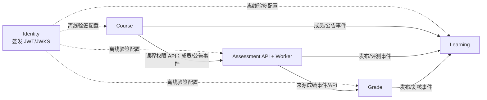

# ADR-006：五业务服务、离线验证身份与可靠消息契约

- 状态：Accepted
- 日期：2026-08-30
- 决策 Issue：#338（父项 #305）
- 实现项：#311、#312、#313、#316、#317、#318、#319、#320、#321、#337、#339、#341、#342

## 背景

`docs/开发/D4-CROSS-SERVICE-共享契约.md` 记录的是 #310 的四服务 v1 基线。它允许进程内 SPI、全局 `X-Internal-Token`、同步通知回调和内存 best-effort 投递。这些做法不能在独立部署、故障隔离和可重放消息条件下保持正确性，因此不能被后续微服务作为生产路径复用。

原始功能边界仍来自最终提交的 SRS/SAD/DSD：AUTH 负责身份事实，CRS 负责课程和成员事实，LAB/HWK 负责评测和来源成绩，GRD 负责成绩投影，LRN 负责通知和学习投影。本 ADR 只改变服务通信边界，不改变公开 API 业务语义、错误码和评测状态的既有承诺。

## 决策

### 五个业务服务和依赖方向

| 服务 | 唯一事实/职责 | 不拥有的事实 |
| --- | --- | --- |
| Identity | 账号、会话、安全版本、全局角色/权限、签名密钥和令牌签发 | 课程成员、业务资源、成绩或通知 |
| Course | 课程、章节、资源、课程成员、课程内权限和公告 | 全局账号、作业/实验、成绩或通知投影 |
| Assessment | LAB/HWK、提交、评测任务/结果、附件元数据、来源成绩事实；API 与 Worker 是同一服务的两个部署单元 | 课程成员表、成绩总评或通知表 |
| Grade | 来源成绩投影、计算批次、成绩、发布和复核 | LAB/HWK 评测明细、课程成员或通知表 |
| Learning | Course 最小投影、任务、提醒、通知和学习过程投影 | 课程/评测/成绩的权威事实 |

实线是业务事实的唯一允许方向；反向需求使用调用方自己的投影、受控的对账 API 或新事件，不能反向读库。Identity 是签发者，不是每个请求都要同步调用的依赖。表/Schema 和账号隔离细节由 #309 冻结，本 ADR 不替代其 ownership matrix。

### 身份和服务调用

1. Identity 签发短时用户 JWT。用户令牌必须包含 `userId`、全局 `roles`、`permissions`、`sessionId`、`securityVersion`、`iat`、`exp`、`iss`、`aud`，并使用带 `kid` 的非对称签名；`aud` 为 `onlinejudge.api`。
2. 每个业务服务从 JWKS 缓存中本地验证签名、算法白名单、`iss`、`aud`、`iat`/`exp`、`securityVersion` 和权限。未知 `kid` 最多触发一次受限 JWKS 刷新；不能退回到无验证、共享 Header 或每请求 introspection。Identity 短时不可用不影响已缓存密钥下未过期令牌的请求。
3. 退出登录、禁用、改密或权限收回递增 `securityVersion`，并发布 `identity.security-version.changed.v2`。消费者持久化已观测到的最低安全版本，拒绝明显过期的会话；短 token TTL 是事件传播前的最大暴露窗口。
4. 外部请求只携带 `Authorization: Bearer <user JWT>`。Gateway 剥离所有来自客户端的 `X-User-*`、`X-Internal-Token`、`X-OnlineJudge-Service-Authorization` 和伪造转发身份头，路由并透传已验证的 Bearer token 和 `X-Request-Id`；它不是业务服务唯一的鉴权正确性来源。
5. 内部调用必须使用按目标 `aud` 签发、短时的服务 JWT（`sub` 是工作负载身份，含最小 scopes、`jti`、`iat`、`exp`），放在 `X-OnlineJudge-Service-Authorization: Bearer <token>`，**或**使用部署环境提供并在服务端映射 scopes 的 mTLS/工作负载身份。接收方本地验证 `iss`、`aud`、发起服务、scope 和过期时间。禁止全局共享 `X-Internal-Token`、静态 header secret 或“内部网络所以信任”的旁路。

### 同步与异步事务边界

- 同步边界在 `contracts/v2/openapi/`；异步目录在 `contracts/v2/asyncapi/events.asyncapi.json`。这些 JSON 文件分别是 OpenAPI 3.1 和 AsyncAPI 3.0 文档，可由无外部依赖的校验器消费。
- 每个写操作只在本服务数据库事务中提交权威事实和未来 #337 要实现的 outbox 记录。下游服务、broker 或通知不可用不能回滚已提交的上游事实；`HOMEWORK_PUBLISHED` 的 v1 同步必达回滚语义在 v2 迁移后废止。
- 每个异步事件使用统一 `EventEnvelope`：`eventId`、`eventType`、`payloadVersion`、`aggregateType`、`aggregateId`、`aggregateVersion`、`occurredAt`、`correlationId`、`payload`。`eventId` 是传输去重键；`aggregateVersion` 是同聚合单调版本而不是全局顺序。
- 投递是 at-least-once，不宣称 exactly-once。消费者在自己的事务中保存已处理 `eventId` 和投影版本：重复为成功 no-op，旧版本忽略，发现版本缺口时创建可审计的 reconciliation 请求，不能猜测或覆盖新投影。
- 可重试的 broker/网络故障以有限退避重试；超过上限进入 DLQ，并保留原 envelope、失败分类、尝试次数和 correlationId。修复后只能按 eventId/时间窗口受控 replay；不可重试的 schema/权限错误直接 DLQ 和告警。对账责任属于消费方及其 owner，生产方提供可分页的权威查询接口。

## 后果

- #310 的 v1 类型可被迁移代码适配，但不得被原样作为 v2 跨服务实现或降级路径。
- 迁移期间 gateway 维持公开 `/api/v1/**` 路径；服务内部地址、认证 Header、事件名和 payload 按 v2 独立版本化。
- 新服务不能直接 import 另一个服务的 Repository、Mapper、Domain/Service 实现，也不能跨 schema SQL；这些禁令和数据库归属由 #309、#341 继续细化。
- #337 必须实现可持久化的 outbox/inbox、DLQ、重放和对账后，事件才可成为运行时生产路径。本 ADR 本身不引入 RabbitMQ、迁移或业务服务代码。

## 验证

`node scripts/ci/verify-microservice-contract-v2.mjs` 校验五份 OpenAPI、AsyncAPI 信封/生产消费目录、v1 历史指向以及合法与不兼容事件样例。该检查仅使用 Node 标准库，适用于干净环境。
