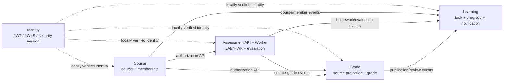
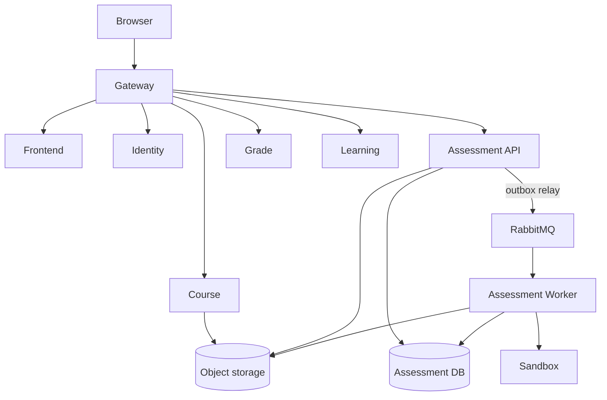

# 五服务架构冻结正本（#305）

> 本文件是 OnlineJudge 微服务目标架构的唯一正本。业务服务固定为 **Identity、Course、Assessment、Grade、Learning**。
>
> 已否决的四服务方案不再保留为设计基线，也不参与迁移、兼容或实现判断；需要审计时只通过 Git 历史追溯。现有代码、数据库和部署投入不能反向改变本文件定义的目标边界。

## 1. 架构原则

五服务架构遵守以下原则：

1. 每个业务事实只有一个 owner；其他服务只能保存投影或逻辑 ID。
2. 单服务内使用本地 ACID；跨服务不使用分布式事务。
3. 跨服务通知和数据传播使用可靠事件，不让下游可用性决定来源业务是否提交。
4. 正常业务链路保持单向依赖，恢复链路通过受控查询、对账和重放完成。
5. 身份令牌由各服务本地验证，Identity 不成为每个请求的同步网络依赖。
6. 不共享 Repository、不跨 Schema SQL、不使用全局内部 Token。
7. 明确接受 at-least-once 投递，通过幂等、单调版本和对账实现最终收敛，不宣称 exactly-once。

## 2. 最终服务划分

| 服务 | 模块 | 核心数据 | 一致性模型 | 明确不负责 |
| --- | --- | --- | --- | --- |
| Identity | AUTH | 用户、角色、权限、会话、安全版本、身份审计 | 强一致、安全优先 | 课程成员、评测、成绩和通知事实 |
| Course | CRS | 课程、成员、章节、资源、公告、课程内权限 | 强一致、权限优先 | 作业/实验、成绩和 Learning 投影 |
| Assessment | LAB + HWK | 实验/作业、提交、附件、评测任务与结果、评分、来源成绩 | 提交强一致、评测最终收敛 | 课程成员事实、总评、通知投影 |
| Grade | GRD | 来源成绩投影、成绩项、总评、发布、复核、分析 | 强一致、可审计 | Assessment 明细、课程成员事实和通知 |
| Learning | LRN | 课程成员最小投影、学习任务、进度、提醒、通知 | 事件驱动、最终一致 | 课程、评测和成绩的权威事实 |

Assessment API 与 Worker 不是两个业务服务，而是 Assessment 的两个独立部署单元：

```text
Assessment API
    │
    ├── Assessment database
    ├── transactional outbox
    └── durable evaluation queue
             │
             ▼
      Assessment Worker
             │
             ▼
       isolated sandbox
```

Gateway、Frontend、RabbitMQ、MySQL、对象存储和 sandbox 都是基础设施，不计入业务服务数量，也不拥有业务事实。

## 3. 唯一依赖方向



可编辑源：[五服务上下文图](../diagrams/arch/issue305-five-service-context.mmd)。

核心业务依赖为：

```text
Course → Assessment → Grade → Learning
   └────────────────────────→ Learning
```

- Assessment 的写操作同步调用 Course 做课程存在性、成员或教师权限校验；Course 不可用时失败关闭，不产生本地业务写入。
- Grade 的教师写操作同步调用 Course 做权限校验。
- Assessment 发布来源成绩事件，但不依赖 Grade 完成自己的业务事务。
- Course、Assessment 和 Grade 发布事件，Learning 只消费事件建立投影；Learning 不阻塞上游核心业务。
- Grade 正常计算只使用本地来源成绩投影，不同步拉取 Assessment。
- 任何服务都不得通过反向读库、共享实体或共享 Repository 绕过上述方向。

## 4. Identity、Gateway 与服务身份

Identity 签发短期非对称签名用户 JWT，至少包含：

- `userId`；
- 全局角色和权限；
- `sessionId`、`securityVersion`；
- `iat`、`exp`、`issuer`、`audience`。

每个业务服务使用本地 JWKS 验证签名、算法、`kid`、issuer、audience、有效期和安全版本。Identity 短时不可用时，已缓存可信密钥下尚未过期的合法请求仍可处理；新登录、刷新和无法证明身份的请求失败。账号禁用、改密、角色或权限变化必须递增 `securityVersion` 并发布可靠安全事件。短 token TTL 是事件传播前最大撤销窗口；高风险管理操作可以额外执行有界 Identity introspection，但不能把它扩张成全部请求的必经同步调用。

Gateway 只负责：

- 剥离客户端伪造的 `X-User-*` 和内部身份头；
- 转发 Bearer token；
- 生成或透传请求关联 ID；
- 路由、TLS、限流、上传大小和超时。

业务服务必须自己验签，不能盲信 Gateway 注入的用户身份。内部服务调用使用按目标 audience 签发的短期服务 JWT，或 mTLS/Kubernetes ServiceAccount 等工作负载身份；禁止所有服务共享一个静态 `X-Internal-Token`。

## 5. 本地事务与可靠事件

每个跨服务事件都由来源服务在同一个本地事务内写入业务事实和 transactional outbox：

```text
domain fact + outbox
        │ local ACID
        ▼
RabbitMQ durable exchange / queue
        │ at-least-once
        ▼
consumer inbox + local projection
        │ local ACID
        ▼
ACK
```

统一事件信封至少包含：

- `eventId`、`eventType`、`payloadVersion`；
- `aggregateType`、`aggregateId`、`aggregateVersion`；
- `occurredAt`、`correlationId`；
- 闭合的业务载荷。

消费端在本地事务中写 inbox 和投影：

- inbox 以 `eventId` 唯一约束去重；
- 旧 `aggregateVersion` 成功忽略；
- 发现版本缺口时 durable defer，不猜测中间事实；
- 可重试失败使用有界指数退避；
- 超过上限进入 DLQ，保留原 envelope、错误分类、次数和 correlationId；
- 修复后按 eventId 或时间窗口受控重放；
- 生产者和消费者定期执行权威数据对账。

必须观测最老未发送 outbox 年龄、outbox backlog、inbox 失败、DLQ 数量、投影滞后和对账差异。

### 作业发布

取消任何跨服务同步“通知成功才发布”的规则。作业发布只由 Assessment 的本地事务决定：

```text
Homework DRAFT → PUBLISHED
+
OutboxEvent(assessment.homework.published.v2)
```

Homework 与 outbox 同时成功即发布成功；只有该本地事务失败才保持 `DRAFT`。RabbitMQ 或 Learning 不可用时只产生 outbox 积压，不回滚已发布作业。Learning 恢复后通过幂等消费自动追平任务和通知。

## 6. Grade 来源成绩投影

Assessment 在来源成绩发布或修改时发送版本化事件。事件至少表达：

```text
SourceGradeChanged {
  courseId,
  sourceType,
  sourceId,
  studentId,
  score,
  fullScore,
  status,
  sourceRevision
}
```

Grade 将事件写入本地来源成绩投影，再基于投影计算总评。正常成绩计算、查询和重算不实时依赖 Assessment。Grade 必须记录：

- 每个来源的 `sourceRevision`；
- 每次计算批次使用的全部来源版本；
- 投影更新时间、滞后和对账状态；
- 成绩变更、发布和复核的完整审计记录。

Assessment 的版本化批量读取 API 只用于初次迁移、数据修复、定期对账和投影重建，不能成为正常成绩计算的同步前置条件。

## 7. Learning 成员、任务与通知投影

事件只表达业务事实，不携带完整学生名单。Learning 消费 Course 的课程和成员事件，维护本地成员投影；再消费 Assessment、Grade 事件生成学习任务、进度和通知。

Course 必须提供单成员变化事件和完整 `course.membership.snapshot.v2`。凡是需要按课程成员解析接收人的业务事件，都必须携带可与 Course 成员投影比较的课程成员版本或水位。Learning 的本地水位尚未追上时，必须 durable defer 原事件，不能把空名单当成“课程没有学生”；完整 snapshot 或对账追平后，再按原 `eventId` 幂等处理一次。

Learning 故障不回滚 Course 公告、Assessment 作业/评测或 Grade 发布。通知投递状态只能反映真实结果，可以是 `PENDING`、`DELIVERED` 或 `FAILED`，不能在消费和落库完成前提前写成成功。

Learning 另提供有界只读契约 `GET /internal/v2/learning/tasks/recent`（默认上限 5），供 Course 首页摘要调用；不可用/超时/非 200 时 Course 返回 `503 LEARNING_TASKS_UNAVAILABLE` ，不得把下游故障降级为空任务列表，也不得回退直连 Learning 表或 Repository。

## 8. Assessment 持久评测任务与 fencing

Assessment API 在接受提交或重评时，用同一个本地事务保存 Submission 和 `EvaluationJob(PENDING)`；API 不等待 sandbox 结果。RabbitMQ 只提供低延迟唤醒，Assessment 数据库中的持久任务才是真相源。Worker 同时扫描可执行和租约过期任务，因此 RabbitMQ 消息丢失、重复或延迟都不能丢失评测。

任务至少具有：

- `leaseOwner`、`leaseUntil`、`heartbeatAt`；
- `attempt`、`generation`；
- `(submissionId, generation)` 唯一约束。

| 阶段 | 原子条件 | 行为 |
| --- | --- | --- |
| 创建 | Submission 与 `PENDING` job 同事务提交 | 任一写入失败则提交整体失败 |
| claim | 只有 `PENDING` 或租约过期的 `RUNNING` 可条件更新 | 成功者写 owner、lease 并递增 generation |
| heartbeat | task、generation、owner 匹配且租约仍有效 | 失败后 Worker 立即停止继续提交 |
| final write | 必须匹配 **taskId + generation + leaseOwner + leaseUntil** | 影响 0 行即 stale Worker 被 fencing，迟到结果丢弃 |
| recovery | scanner 发现 PENDING、过期 RUNNING 和有界失败任务 | 新 Worker 重新领取；耗尽后进入可诊断 `SYSTEM_ERROR` |

```mermaid
sequenceDiagram
  participant API as Assessment API
  participant DB as Assessment task store
  participant W1 as Worker A
  participant W2 as Worker B
  API->>DB: transaction: Submission + PENDING job
  W1->>DB: conditional claim generation n
  Note over W1,DB: lease expires or Worker A crashes
  W2->>DB: conditional re-claim generation n+1
  W1->>DB: fenced final write for generation n
  DB-->>W1: 0 rows; discard stale sandbox output
  W2->>DB: fenced final write for generation n+1
  DB-->>W2: one terminal result + versioned outbox event
```

可编辑源：[Assessment Worker fencing 图](../diagrams/arch/issue305-assessment-worker-fencing.mmd)。

## 9. 数据隔离与文件存储

五个逻辑 owner schema 固定为：

```text
onlinejudge_identity
onlinejudge_course
onlinejudge_assessment
onlinejudge_grade
onlinejudge_learning
```

每个服务使用独立运行账号，只能访问自己的 schema：

- 无跨 schema 外键；
- 无跨服务联表；
- 无共享 Repository 或 JdbcTemplate；
- 跨服务只保存逻辑 ID；
- 删除通过 tombstone 或领域事件传播；
- 每个 owner 独立迁移、校验、备份和恢复。

一个课程环境可以暂时共用单个物理 MySQL 实例，但必须明确记录它是共同基础设施单点，不能把五个 schema 宣称为完整数据库故障隔离。部署制品若使用 `oj_*` 作为物理别名，必须保持与上述五个逻辑 owner 一一对应，不能因此改变服务边界。

Course 资源、Assessment 附件和报告必须使用 S3/MinIO 兼容对象存储或持久卷适配器；Pod 本地目录只能作为可清理的 sandbox 临时工作区，不能保存权威资产。

## 10. 部署与故障边界



可编辑源：[五服务部署图](../diagrams/arch/issue305-five-service-deployment.mmd)。

| 故障 | 正确行为 |
| --- | --- |
| Identity 宕机 | 已签发且未过期的可信 JWT 继续本地验证；新登录、刷新和无法验证的身份失败 |
| Course 宕机 | Assessment/Grade 需要课程授权的写操作返回 503，且零业务写入 |
| RabbitMQ 宕机 | 来源业务与 outbox 正常本地提交；broker 恢复后补发 |
| Learning 宕机 | 上游业务继续；恢复后任务和通知不丢不重地追平 |
| Grade 宕机 | Assessment 继续发布来源事实；Grade 恢复后投影追平 |
| Worker claim 后崩溃 | 租约到期后重新领取；generation/fencing 保证只有一个终态 |
| 重复、乱序或 ACK 丢失 | inbox 去重和单调版本阻止重复写与状态回退 |
| 单个 schema 账号失效 | 只影响所属服务；不得使用其他账号或跨库查询降级 |
| 共享物理 MySQL 失效 | 五个 schema 同时受影响；按已声明的共同单点恢复，不伪造成功 |
| 对象存储或 sandbox 故障 | 权威提交和资产元数据不丢；评测进入可诊断失败并可重评 |

API readiness 只依赖本服务启动所需的本地关键依赖。RabbitMQ 或非关键下游不可用时，能够提交本地事实和 outbox 的 API 仍保持 Ready；Worker readiness 可以依赖消息消费和任务存储。

## 11. 架构完成标准

五服务架构只有在以下行为可以重复验证时才算完成：

- 五个服务分别拥有独立数据边界和运行账号；
- Assessment API/Worker 使用持久任务、租约恢复和 final-write fencing；
- 来源业务与 outbox 原子提交；消费者 inbox、DLQ、重放和对账可用；
- Grade 正常路径只依赖本地来源成绩投影；
- Learning 使用 Course 成员投影并在水位不足时延迟处理；
- Identity、Course、RabbitMQ、Grade、Learning、Worker、schema 账号和对象存储故障均符合第 10 节；
- 重复、乱序、响应或 ACK 丢失不会产生重复事实或状态回退；
- 单体适配层、共享内部 Header、进程内 callback 和同步通知回滚均不进入目标生产路径。

本文只冻结目标架构和故障语义。实施进度、PR/SHA、测试次数与环境证据应记录在对应 Issue、PR 或验收报告中，不写入架构正本。
