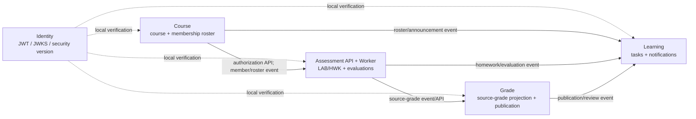
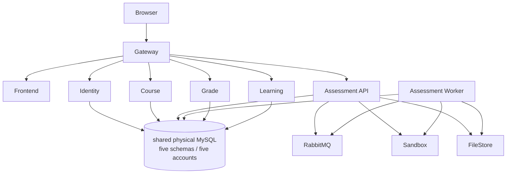

# 五服务架构冻结正本（#305）

> 决策 Issue：[#305](https://github.com/Cr4zyorange/OnlineJudge/issues/305)。
>
> 基线：`origin/dev@d9f3d74abd2d64b81632956832107bec7b0983be`（2026-08-31）。本文件冻结**目标**五服务的边界，不能把当前模块化单体、单实例 MySQL 或历史四服务 v1 误报为已完成的微服务生产部署。
>
> 输入已经验收并合入：#309 / PR #335 merge `50bdc8490b204c868aafe7b7f2602ce6826c84ad`、#338 / PR #344 merge `dd89083a0a8c6a04512e48d6f9ccab0f62f8897f`、#336 / PR #345 merge `2a0ce94262596820eefe905bcd3c301c474880cf`，以及 #311 / PR #328 merge `d9f3d74abd2d64b81632956832107bec7b0983be`（post-merge CI 5/5）。#341 只实施五域数据迁移、校验、回滚与切换，不改写本冻结的服务边界。

## 1. 正本、适用范围与历史替代

本文件与 [D6/D7 五服务共享契约（v2）](D6-D7-五服务共享契约-v2.md)、[ADR-006](../adr/ADR-006-五业务服务与可靠消息契约.md)、[五域数据所有权契约](D6-DATA-五域数据所有权契约.md)、[平台工作负载清单](D7-平台工作负载清单契约.md)及 [#311 Identity 独立交付](D6-AUTH-独立身份服务交付.md)共同构成 #305 的可实施正本。它把最终提交三份说明书中当前模块化单体的模块图，映射为未来服务化实施的唯一边界；已有用户可见 API、状态枚举和功能闭环仍以《软件需求规格说明书》《软件概要设计说明书》《软件详细设计说明书》为准。

历史 [#279 评测服务拆分设计](../过程/概要/评测服务拆分设计与迁移边界.md) 的“四服务”仅保留为迁移审计输入：其中“学习与成绩服务”拆为 Grade 与 Learning；评测执行器仍是 Assessment 的内部 workload。历史 [D4 跨服务共享契约](D4-CROSS-SERVICE-共享契约.md) 的 v1 SPI、`X-Internal-Token`、同步 callback 和内存 best-effort 投递均不再是生产路径。

## 2. 业务服务、所有权与依赖方向

业务服务固定为 **Identity、Course、Assessment、Grade、Learning**。Assessment API 与 Worker 不是两个业务服务，而是 Assessment 的两个独立部署 workload；Gateway、Frontend、RabbitMQ、MySQL、文件存储与 sandbox 是基础设施，也不计入五服务。

| 服务 | 唯一事实与写入边界 | Schema / runtime 账号 | 对外能力 | 明确禁止 |
| --- | --- | --- | --- | --- |
| Identity | 账号、会话、安全版本、全局角色权限 | `oj_identity` / `oj_identity_rw` | JWT/JWKS、服务身份令牌、安全版本事件 | 保存课程、评测、成绩或通知事实；成为每请求同步依赖 |
| Course | 课程、成员、章节、资源、公告、课程授权与完整 roster | `oj_course` / `oj_course_rw` | 课程授权 API、成员/roster/公告事件 | 保存评测、总评、Learning 通知权威事实 |
| Assessment | LAB/HWK、提交、评测、附件、来源成绩与其 outbox/inbox | `oj_assessment` / `oj_assessment_rw` | 来源成绩 API、评测/作业/来源成绩事件 | 读取 Course/Grade/Learning Schema，或把 Worker 变成独立业务服务 |
| Grade | 来源成绩投影、成绩、发布、复核、分析 | `oj_grade` / `oj_grade_rw` | 成绩发布/复核 API 与事件 | 读取 Assessment 明细或 Course 成员表 |
| Learning | Course 最小投影、任务、进度、提醒、通知、inbox/DLQ/defer | `oj_learning` / `oj_learning_rw` | 通知对账请求 API | 把课程、评测或成绩投影当作权威事实 |

`table-ownership.csv` 的 59 条 owner、五账号和 59 条逻辑引用是 #341 的数据迁移边界可执行输入；其中迁移控制面核对 **46 张 legacy 业务表 + 13 张可靠消息运行时表**，`service-local-tables.csv` 的 14 条记录另包含既有 `t_grade_record` 来源成绩投影。任何 owner 外关联只保留逻辑 ID，绝不恢复物理 FK。

### 已交付的 Identity workload 与五域目标的衔接

#311 已把 Identity 抽取为 `services/identity`、`onlinejudge/identity-service:${GIT_SHA}` 和 8081 上的独立 workload：它签发 15 分钟 RS256 用户 JWT，暴露 JWKS，使用 `IDENTITY_JWKS_TRUST_BUNDLE` 启动并在请求路径外刷新，且已经实现 audience-bound service token、mTLS workload policy、session/securityVersion 失效与 `identity.security-version.changed.v2` 本地 outbox 事实。其他业务服务的本地离线验签、未知 `kid` 失败关闭与不信任 gateway header，必须直接消费这份 [#311 Identity 交付](D6-AUTH-独立身份服务交付.md)，不能退回旧单体 Header 认证。

#311 的独立 Compose 验收使用 `onlinejudge_identity`/`onlinejudge_identity` 作为独立 demo 数据库与账号默认值；这不是对 #309 的五域 owner 命名的替换。五域切换环境必须把该服务的可配置 `IDENTITY_DATABASE_NAME`/`IDENTITY_DATABASE_USERNAME` 分别设为 `oj_identity`/`oj_identity_rw`，继续只访问 Identity owner schema。该桥接只改变部署配置，不复制身份表、不增加跨 schema 权限，也不把 #311 的独立 Compose 数据库误当为第六 owner。

Identity 的实际本地运行时 DDL 是 `t_identity_outbox_event` 和 `t_identity_service_token_idempotency`（均由 #311 的 `database/migrations/identity/` 幂等创建）：前者在安全版本变化事务中保存待投递事实，后者仅保存短时 service-token 的幂等结果。它们取代早期 `service-local-tables.csv` 中虚构的 generic `event_outbox`/planned `event_inbox`；Identity 当前没有业务事件消费者，不能以“每个服务都有 inbox”的机械规则制造无效投影。两表没有可从 legacy 复制的记录，因而由 `identity-migrations` 初始化，不扩张 #341 的 **46 legacy + 13 reliable runtime = 59** 迁移控制面；它们始终是 Identity owner 内状态。

业务事实的单向流为 `Course -> Assessment -> Grade -> Learning` 与 `Course -> Learning`；Assessment 的评测/作业事件也可直接进入 Learning。Grade 需要的 Course 权限判断是 v2 Course API 的受控同步授权调用，而不是将 Course 事实复制成 Grade 的第二 owner。Identity 通过本地 JWT/JWKS 校验提供身份事实，既不参与此业务数据链，也不作为每次请求的同步 hop。



可编辑源：[五服务上下文图](../diagrams/arch/issue305-five-service-context.mmd)。图中的箭头是事实/调用方向，绝不表示共享 Repository、共享实体或跨库访问。

## 3. v2 API、消息与一致性规则

所有 HTTP 路径、状态码、载荷和 JSON Schema 以 `contracts/v2/openapi/*.openapi.json` 为唯一机器可读正本；所有事件以 `contracts/v2/asyncapi/events.asyncapi.json` 为唯一机器可读正本。本冻结只说明谁拥有和如何失败，不复制契约字段。

| 生产者 | v2 契约 | 消费者 | 本地事务与失败/恢复 |
| --- | --- | --- | --- |
| Identity | JWKS、服务身份 token、`identity.security-version.changed.v2` | 全部服务 | 服务本地验签；未知 key 仅受限刷新，身份不可用不得信任伪造身份 |
| Course | 授权 API、`course.member.changed.v2`、`course.membership.snapshot.v2`、公告事件 | Assessment、Grade、Learning | 成员 mutation 与 Course outbox 同一事务；snapshot 是完整 roster 与课程级 watermark，单一 member event 不能替代 |
| Assessment | 来源成绩 API、`assessment.source-grade.changed.v2`、`assessment.evaluation.completed.v2`、`assessment.homework.published.v2` | Grade、Learning | 业务事实和 outbox 原子提交；broker/Learning 不可用只积压 outbox，不能回滚 Homework `PUBLISHED` |
| Grade | 成绩发布 API、`grade.published.v2`、`grade.review.processed.v2` | Learning | 来源成绩投影由 inbox 去重与版本规则驱动；发布事实和 outbox 原子提交 |
| Learning | 最近任务摘要（`/internal/v2/learning/tasks/recent`）、`/internal/v2/notifications/reconciliation-requests` | Course（首页摘要、durable 请求） | 任务摘要只读且有界（上限 5），不可用时 Course 返回 `503 LEARNING_TASKS_UNAVAILABLE`；对账仅提交 durable 请求，不得同步 callback 决定 Course 写入 |

消息交付固定为 **at-least-once**：每条 envelope 带 `eventId`、`aggregateId`、`aggregateVersion`、`occurredAt`、`correlationId`；消费端 inbox 以 `eventId` 去重，旧版本忽略，版本缺口 durable defer 后进入对账/DLQ。特别地，Learning 只有在完整 `course.membership.snapshot.v2` 已推进课程 watermark 至所需版本时才应用作业事件；缺失 roster、REMOVED-only 投影、乱序或投影丢失都必须 defer，并在 Course-owned reconciliation 发布更高 snapshot 后一次收敛通知。

内部 HTTP 使用 audience-scoped service JWT 或 mTLS，并要求 `X-Request-Id` 和写入幂等键；非法服务身份为 `401 SERVICE_IDENTITY_INVALID`，认证但没有 scope 为 `403 SERVICE_IDENTITY_FORBIDDEN`。不共享 Repository、不跨 Schema SQL、不使用全局内部 Token；同步调用故障不得以 SQL、内存队列或反向 callback 旁路。

## 4. Assessment API 与 Worker：租约、代际与 fencing

Assessment API 负责接受提交/重评、执行课程授权、在 `oj_assessment` 本地事务写业务行和待执行任务，并返回 API 契约响应；它不等待 sandbox 结果。Worker 没有对外 HTTP 端口，只消费 RabbitMQ 唤醒、扫描数据库可执行/过期任务、调用 sandbox，并通过 Assessment 自有表提交结果。RabbitMQ 是低延迟唤醒，不是任务真相源：丢失、重复或延迟消息必须由扫描器补回。

| 阶段 | 原子条件 | 结果与恢复 |
| --- | --- | --- |
| 受理 | API 本地事务创建/重评 task，初始 `PENDING`，写 outbox | 事务失败不接受提交；outbox 失败同事务回滚，不依赖 Worker 或 RabbitMQ |
| claim | `PENDING` 或租约过期的 `RUNNING` task 才可被条件更新；写 `leaseOwner`、`leaseUntil`、`heartbeatAt` 并递增 `generation` | 多 worker 竞争只有一个更新成功；过期 owner 的 sandbox 输出不具备提交资格 |
| heartbeat | 仅在 `taskId`、当前 `generation`、`leaseOwner` 匹配且 `leaseUntil` 未失效时延租 | 失败即停止该 worker；扫描器可重新 claim 并使 generation 加一 |
| final write | 结果终态更新必须条件匹配 **taskId + generation + leaseOwner + leaseUntil** | 影响 0 行即 stale worker 被 fencing：丢弃结果、清理 sandbox 临时物，不覆盖新 owner 或新一轮重评 |
| recovery | 扫描过期 `RUNNING`、无 Rabbit 唤醒的 `PENDING` 与有界失败任务 | 新 claim 递增 generation；耗尽重试进入可诊断 `SYSTEM_ERROR`，用户提交/资产与历史保留 |

评测结果、来源成绩变化与出站事件必须由持有当前 fencing 条件的最终本地事务写入；任何重复/过期 Worker 都不能发布第二个终态或第二条版本事件。迁移、回滚、切换不复制运行中的 lease/retry/DLQ 状态：#341 在目标 owner schema 重建运行时表，恢复后由扫描与幂等处理重建可执行工作。

```mermaid
sequenceDiagram
  participant API as Assessment API
  participant DB as oj_assessment task store
  participant W1 as Worker A
  participant W2 as Worker B
  API->>DB: transaction: PENDING task + outbox
  W1->>DB: conditional claim; generation = n, leaseOwner=A
  Note over W1,DB: lease expires or Worker A crashes
  W2->>DB: conditional re-claim; generation = n+1, leaseOwner=B
  W1->>DB: final write where taskId + generation + leaseOwner + leaseUntil
  DB-->>W1: 0 rows: fenced; discard stale sandbox output
  W2->>DB: fenced final write for generation n+1
  DB-->>W2: one terminal result + versioned outbox event
```

可编辑源：[Assessment Worker fencing 图](../diagrams/arch/issue305-assessment-worker-fencing.mmd)。实际任务表的字段名可在后续 Assessment 实施 Issue 中适配，但不得删除上表的条件、generation 或 stale final-write fencing 语义。

## 5. 工作负载与部署故障域

`deploy/platform/workloads.json` 冻结十个 workload：Gateway、Identity、Course、Assessment API、Assessment Worker、Grade、Learning、Frontend、RabbitMQ、MySQL；并按 Identity、Course、Assessment、Grade、Learning 顺序运行五个 schema migration job。API workload 的 Ready 只依赖本服务 schema/账号；非关键下游或 broker 停机后，已经本地提交的 outbox 生产者仍 Ready。Assessment Worker Ready 还依赖自身 lease store 与 Rabbit consumer，RabbitMQ 不可达时 worker Not Ready 且 backlog 保留，API 不能因此重启或假性 Not Ready。

课程环境的五 schema/五账号可以落在一个物理 MySQL 实例，因而 MySQL 是共同物理单点；这不等于 HA，也不允许任一账号读取另一 schema。文件存储和 sandbox 也不是业务 owner：Assessment 记录资产元数据/授权并用可回收临时工作目录执行。部署推广、回滚和 D3 旧单体路径退出依 [平台工作负载清单](D7-平台工作负载清单契约.md) 的 promotion/retirement 门执行。



可编辑源：[五服务部署图](../diagrams/arch/issue305-five-service-deployment.mmd)。

## 6. 故障矩阵与可恢复行为

| 故障 | 同步命令行为 | 异步/数据行为 | 恢复与可观测性 |
| --- | --- | --- | --- |
| Identity/JWKS 不可用、未知 key 或失效安全版本 | 不能证明身份/服务身份时 fail-closed；不放行伪造 header | 已验签的受控 key cache 仅按 v2 规则使用 | 请求 ID、token key/version 拒绝原因；受限刷新后重试 |
| Course 授权 API 不可用 | 需要实时成员/教师授权的 Assessment/Grade 命令返回 `COURSE_AUTHORIZATION_UNAVAILABLE`，不写本地事实 | 已存在 Learning 投影不反向读 Course 库 | 有界重试、告警；恢复后重新提交命令 |
| RabbitMQ、网络或 Learning 不可用 | Assessment/Grade/Course 本地事务只要事实+outbox 成功即成功 | outbox 重试；inbox eventId 去重；Learning 必要时 durable defer | relay/backlog/DLQ 指标、重放和对账，不回滚生产者 |
| 重复、乱序、版本缺口、Learning 投影丢失 | 不适用 | 旧 aggregateVersion 忽略；缺口/deferred durable 记录；完整 roster snapshot 是应用作业的硬水位 | Course-owned reconciliation 发布递增 snapshot；单次通知/任务幂等收敛 |
| Worker crash、重复消费或 lease 过期 | API 不等待 Worker | 条件 claim、heartbeat、generation 与 final write fencing 禁止 stale 覆盖 | scanner 重新 claim；fenced worker 丢弃输出；有界耗尽 `SYSTEM_ERROR` |
| MySQL 故障或单实例失效 | 五业务服务相应 schema 不 Ready，命令失败且不伪造成功 | 本地事务不提交；已提交 outbox/inbox 状态持久保留 | 数据库恢复、migration/backup/rollback runbook；这是已声明的共同物理单点 |
| sandbox/文件存储故障 | 提交已落库时不丢原始提交；评测可进入可诊断失败 | 不产生未 fencing 的 completion/source-grade event | 清理临时目录、记录 correlationId/task generation，之后重评或恢复扫描 |

## 7. #279 / #310 迁移与替代对照

| 历史输入 | 可复用内容 | 已替代/禁止内容 | 此冻结后的实施入口 |
| --- | --- | --- | --- |
| #279 Assessment 拆分 | LAB/HWK 归 Assessment、现有公开路由兼容、文件资产与评测状态保留、网关切流顺序 | 四服务中的“学习与成绩服务”；单体 `CoursePermissionClient`/`NotificationEventPublisher` 直连作为服务路径 | Assessment API/Worker 的本地任务/lease/fencing 与 v2 Course、Grade、Learning 契约；#279 文首须链接本正本 |
| #310 D4 v1 | 当前单体回归审计、旧 API/状态语义和迁移差异记录 | 进程内 SPI、`X-Internal-Token`、同步通知 callback、内存 best-effort | D6/D7 v2 OpenAPI/AsyncAPI、ADR-006 与本故障矩阵；D4 文首须链接本正本 |
| #309 / #341 数据 | 59 owner、五 schema/账号、59 logical reference、46+13 迁移/回滚证据 | 四 schema 草案、跨 schema FK/join、复制运行中可靠消息状态 | 数据所有权与迁移 runbook；业务服务只访问自己的运行时账号 |
| #336 平台 | 十 workload、五 migration job、readiness、promotion/retirement gate | 将 worker 计成第六业务服务；把 shared physical MySQL 写成 HA | workload manifest 和本部署/故障矩阵 |

## 8. 可执行门禁与下游引用

本冻结的语义检查固化计数、merge 输入、历史替代链接和 Worker fencing 反例；它与已有 ownership、v2 契约、workload validators 一起运行：

```bash
node --test scripts/test/verify-final-architecture-305.test.mjs
node --test scripts/test/verify-final-architecture-305-render.test.mjs # requires frontend/node_modules/mermaid or MERMAID_JS
node scripts/ci/verify-final-architecture-305.mjs
node --test scripts/test/verify-data-ownership-contract.test.mjs
node scripts/ci/verify-data-ownership-contract.mjs
node scripts/ci/verify-microservice-contract-v2.mjs
python3 scripts/platform/validate_workload_manifest.py
python3 -m unittest scripts.platform.tests.test_validate_workload_manifest
git diff --check
```

验收输出应分别给出 `59 tables / 5 accounts / 59 references / 14 service-local`、`5 OpenAPI / 9 AsyncAPI`、`10 workloads / 5 migration jobs`。下游 #318/#319 等部署实施 Issue 必须直接引用本文件、D6/D7 v2 和 workload manifest；若改动服务 owner、v2 API/事件、lease fencing、workload 数量或矩阵中的恢复动作，先更新这些正本和上述反例，再开始实现。
