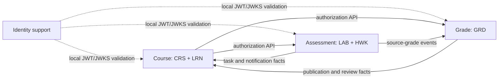

# 三业务服务架构冻结正本（#306）

`Course`（CRS+LRN）、`Assessment`（LAB+HWK，API+Worker）和 `Grade`（GRD）是唯一业务服务。`Identity` 只提供身份支撑；Gateway、Frontend、RabbitMQ 和 MySQL 是基础设施，不拥有业务事实。

## 边界与依赖

| 服务 | 唯一事实 | 禁止拥有/依赖 |
| --- | --- | --- |
| Course | 课程、成员、资源、学习进度、任务、提醒、通知 | LAB/HWK 提交、评测、成绩总评；跨 schema 查询 |
| Assessment | 实验、作业、提交、评测、附件、来源成绩 | 课程成员权威事实、通知表、成绩总评 |
| Grade | 来源成绩投影、成绩、发布、复核、分析 | Assessment 明细、课程成员、通知表 |
| Identity（支撑） | 账号、会话、权限、安全版本、JWT/JWKS | 三项业务服务的领域事实 |

Assessment API 与 Worker 是同一业务服务的两个部署单元。写入 API 先在本地事务保存领域事实和 outbox；Worker 用持久任务、租约与 `taskId + generation + leaseOwner + leaseUntil` fenced final write 收敛评测。RabbitMQ、Course 或 Grade 的短时故障不得回滚已成功提交的本地事实。

LRN 不是独立服务：`/api/v1/learning/**` 与 `/api/v1/notifications/**` 由 Course 路由，LRN 表、投影、通知和提醒均在 `oj_course` 内由 `oj_course_rw` 管理。Assessment 和 Grade 仅投递有界、版本化的事实；Course 消费并幂等落库。

## 数据与恢复

运行账号固定为 `oj_identity_rw`、`oj_course_rw`、`oj_assessment_rw`、`oj_grade_rw`，分别只对 `oj_identity`、`oj_course`、`oj_assessment`、`oj_grade` 拥有 DML；跨 schema 和 DDL 均拒绝。迁移顺序为 Identity → Course → Assessment → Grade。失败时停止切流；回滚是切回记录的旧 digest 或前向修复，绝不删除数据卷。

## 故障矩阵

| 故障 | 即时响应 | 写入与恢复 |
| --- | --- | --- |
| Identity | 已缓存 JWKS 的未过期令牌继续本地验证；登录/刷新失败 | 身份恢复后继续签发，不降级为信任 Header |
| Course | Assessment/Grade 的课程授权写操作返回 503 且零业务写入 | Course 恢复后重新授权；任务/通知事实从 outbox 补消费 |
| Assessment API/Worker | API 本地提交可继续；Worker 不可用形成可观测积压 | 租约到期后重领，旧 generation 写入被 fencing |
| Grade | Assessment 继续发布来源成绩 | Grade 恢复后从事件/对账重建投影 |
| RabbitMQ | API 继续提交本地事实与 outbox | 恢复后 at-least-once 补发，Course/Grade inbox 幂等 |
| MySQL 或单账号 | 仅所属服务不可用，不得借用其他账号 | 从备份/迁移检查点恢复，重跑同一 migration 校验 checksum |

本文件是 #306 唯一当前服务正本；旧五服务方案只可通过 Git 历史追溯。
