# 学知实训平台用户手册

| 项目 | 内容 |
| --- | --- |
| 系统名称 | 学知实训平台 / OnlineJudgeForSE |
| 文档类型 | 用户手册 |
| 适用角色 | 学生、教师、管理员 |
| 适用版本 | 课程项目最终交付版 |
| 编写日期 | 2026-06-12 |

## 目录

1. 使用前准备
2. 学生端操作说明
3. 教师端操作说明
4. 管理员端操作说明
5. 常见状态与异常处理

## 1. 使用前准备

### 1.1 访问地址

入口：浏览器访问系统前端地址。

步骤：

1. 打开 Chrome、Edge 或其他现代浏览器。
2. 输入系统部署地址。开发和演示环境默认地址为 `http://127.0.0.1:5173/`。
3. 系统进入统一登录页面。

预期结果：页面显示“用户登录”和“注册”入口。登录成功后，系统按角色开放课程中心、学习任务、通知中心、个人中心和管理页面。


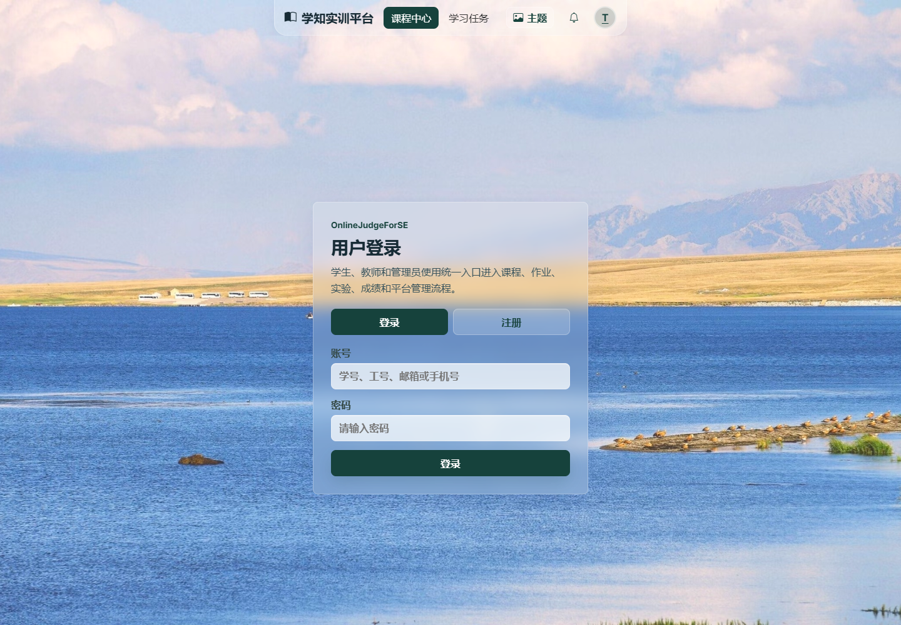

*图 1-1 登录页面*

### 1.2 演示账号

| 角色 | 账号 | 密码 | 主要入口 |
| --- | --- | --- | --- |
| 学生 | `student001` | `Student001@pass` | 课程中心、学习任务、实验/作业提交、成绩、通知 |
| 教师 | `teacher001` | `Teacher001@pass` | 课程管理、实验管理、作业管理、成绩管理、学习统计 |
| 管理员 | `admin001` | `Admin001@pass` | 用户权限管理、角色权限管理、课程维护、系统维护、安全审计日志 |

### 1.3 注册、登录与账号安全

入口：`/login` 登录页面、`/register` 注册页面、顶部头像进入个人中心。

步骤：

1. 已有账号时，在登录页输入账号和密码，点击“登录”。
2. 需要创建学生账号时，切换到“注册”，填写账号、显示名称和密码，提交后回到登录页登录。
3. 登录成功后，根据角色点击“学生工作台”“教师工作台”或“管理员工作台”进入课程中心或管理页面。
4. 进入个人中心后，可维护显示名称、手机号、邮箱和头像地址。
5. 在个人中心的“修改密码”区域输入原密码、新密码和确认密码，提交后当前登录会话失效，需要重新登录。

预期结果：注册成功后生成学生账号；登录成功后顶部导航显示平台名称、课程中心、学习任务、通知中心和个人头像；密码修改成功后系统要求重新登录；无权限访问时系统进入 403 提示页或登录失效提示页。


## 2. 学生端操作说明

学生端主流程为：

```text
登录 -> 课程中心 -> 查看课程资源 -> 查看学习任务 -> 提交实验/作业 -> 查看评测反馈 -> 查看成绩 -> 查看通知
```

### 2.1 查看课程中心

入口：顶部导航“课程中心”，路径 `/courses`。

步骤：

1. 使用学生账号登录。
2. 点击顶部导航“课程中心”。
3. 在课程列表中查看本人已加入或可访问的课程。
4. 可使用搜索框按课程名称、学期或分类筛选课程。
5. 若课程尚未加入，根据课程加入方式点击“直接加入”“输入邀请码”或“申请加入”。
6. 加入成功后点击课程卡片进入课程详情；需要审核的课程需等待教师或管理员通过申请。

预期结果：页面展示课程名称、授课教师、学期、分类、课程状态和成员信息。公开课程可直接加入，邀请码课程需输入有效邀请码，审核课程提交后显示待审核状态。学生只能进入本人有权限访问的课程，不能看到课程编辑、归档等教师操作入口。


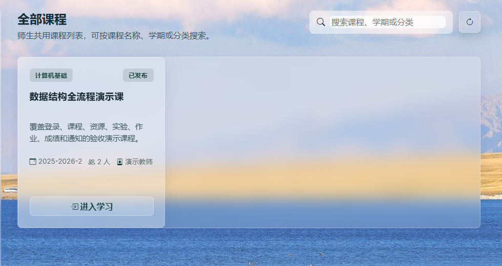

*图 2-1 学生课程中心*

### 2.2 查看课程主页、公告、章节和资源

入口：课程中心中点击课程卡片，路径示例 `/courses/9501`。

步骤：

1. 在课程中心点击目标课程。
2. 查看课程简介、课程公告、近期任务和课程统计信息。
3. 查看章节目录，确认资源所属章节。
4. 在资源列表中查看资源名称、类型、发布时间和可见范围。
5. 点击资源下载入口获取课件、讲义或附件。

预期结果：学生可以看到课程公告、章节和对学生可见的资源；不可见资源或非成员课程不会向学生开放。


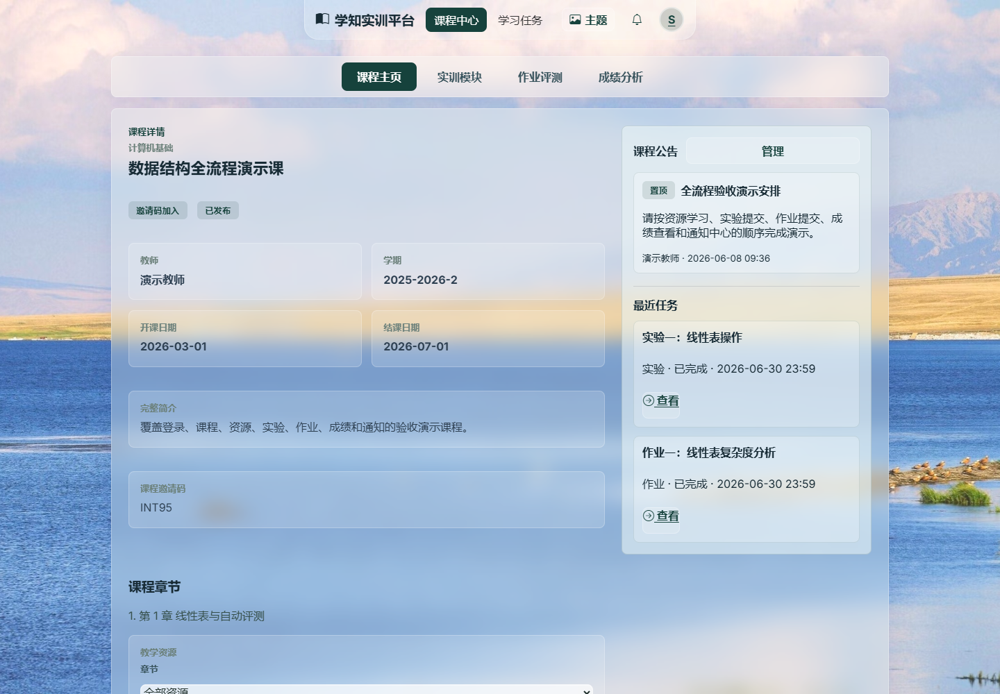

*图 2-2 学生课程主页*

### 2.3 查看学习任务

入口：顶部导航“学习任务”，路径 `/learning/tasks`。

步骤：

1. 点击顶部导航“学习任务”。
2. 查看系统按课程聚合的实验、作业和资源任务。
3. 可按任务类型、状态、课程和截止时间筛选。
4. 点击任务卡片中的跳转入口，进入对应课程、实验或作业页面。

预期结果：任务中心显示任务标题、所属课程、截止时间、完成进度和状态。已完成、未开始、进行中、逾期等状态应有明确标识。


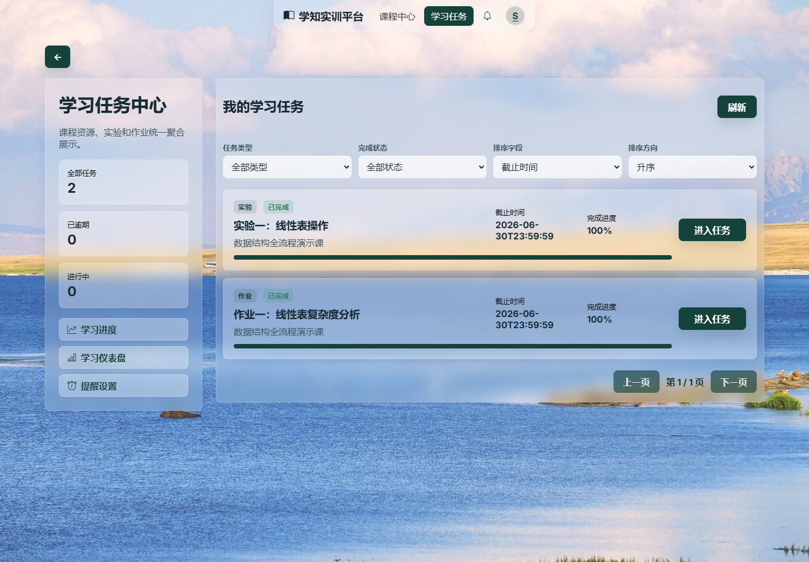

*图 2-3 学习任务中心*

### 2.4 查看学习进度

入口：顶部导航“学习任务”后进入“学习进度”，路径 `/learning/progress`。

步骤：

1. 进入学习进度页面。
2. 查看课程总进度、章节进度和最近学习位置。
3. 点击“刷新”获取最新学习进度。
4. 点击继续学习入口回到课程、资源或任务页面。

预期结果：页面展示课程数量、课程进度、章节进度、完成状态和更新时间。学生只能查看自己的学习进度。


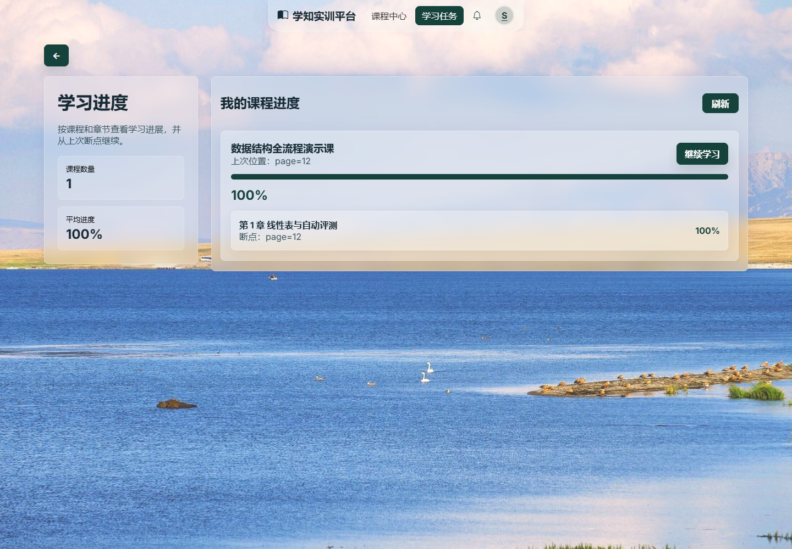

*图 2-4 学习进度页面*

### 2.5 查看实验列表

入口：课程内导航“实验实训”，路径示例 `/courses/9501/labs?role=student`。

步骤：

1. 进入课程主页。
2. 点击课程内导航“实验实训”。
3. 查看当前课程已发布、已截止或已发布成绩的实验。
4. 点击“进入实验”查看实验详情。

预期结果：页面展示实验标题、截止时间、满分、报告要求和实验状态。草稿实验不会对学生展示。


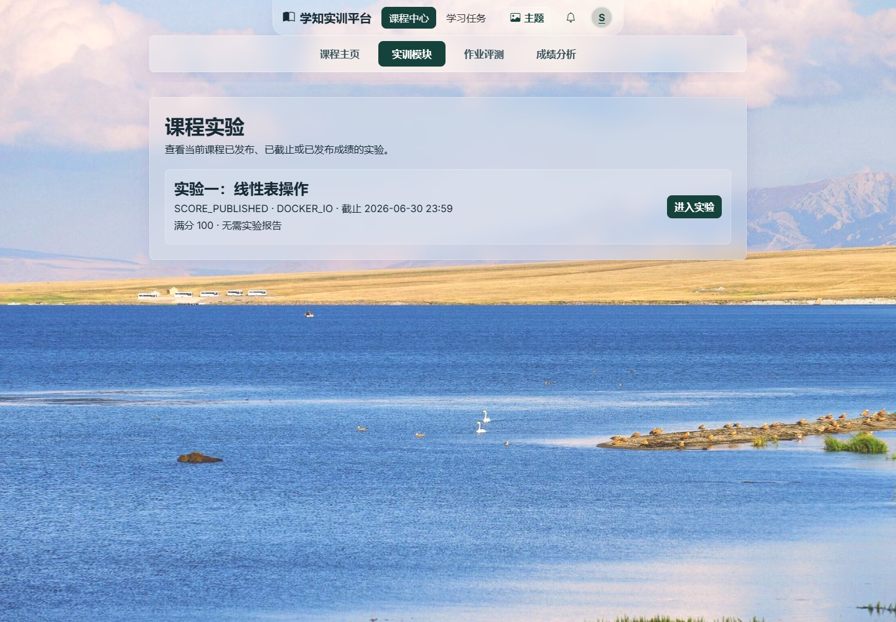

*图 2-5 学生实验列表*

### 2.6 提交实验并查看评测反馈

入口：实验列表中点击“进入实验”，路径示例 `/courses/9501/labs/950201?role=student`。

步骤：

1. 查看实验说明、截止时间、允许语言、时间限制和内存限制。
2. 在代码或文件提交区域填写实验代码，或按页面要求选择文件。
3. 点击提交按钮。
4. 提交完成后进入提交历史或反馈区域。
5. 查看评测状态、得分、通过用例数、运行日志和教师评语。

预期结果：系统生成一条实验提交记录，并显示自动评测状态。评测完成后，学生可查看自己的通过情况、得分和反馈；学生不能查看其他学生提交。


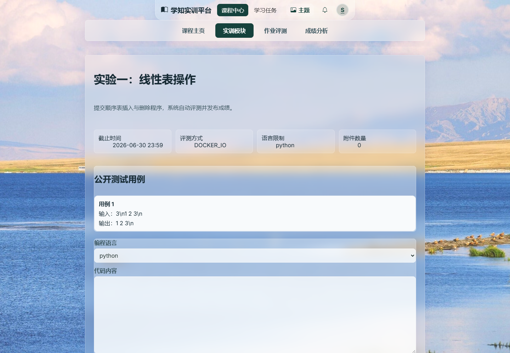

*图 2-6 实验详情与提交入口*

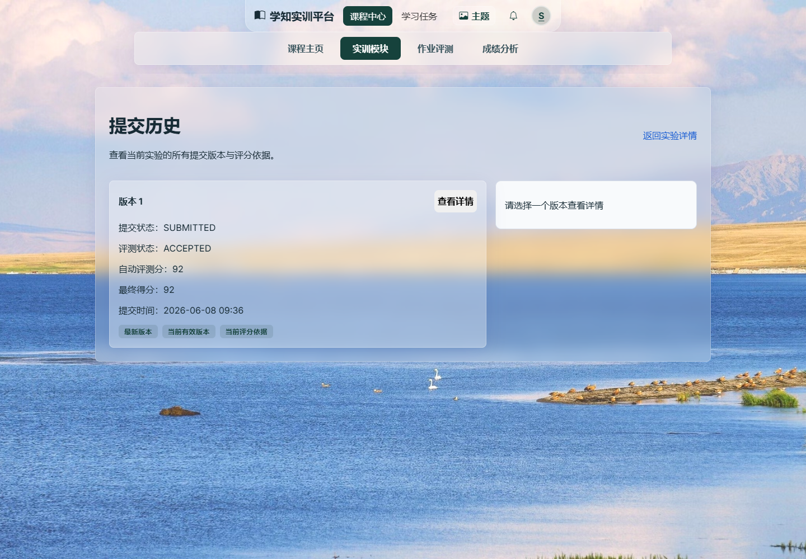

*图 2-7 实验提交历史与评测反馈*

### 2.7 查看作业列表

入口：课程内导航“作业评测”，路径示例 `/courses/9501/homeworks?role=student`。

步骤：

1. 进入课程主页。
2. 点击课程内导航“作业评测”。
3. 查看当前课程作业列表。
4. 根据作业状态、截止时间和提交情况选择需要完成的作业。
5. 点击作业卡片进入作业详情。

预期结果：页面展示作业标题、说明、类型、截止时间、总分和状态。学生只能查看已发布或允许查看的作业。


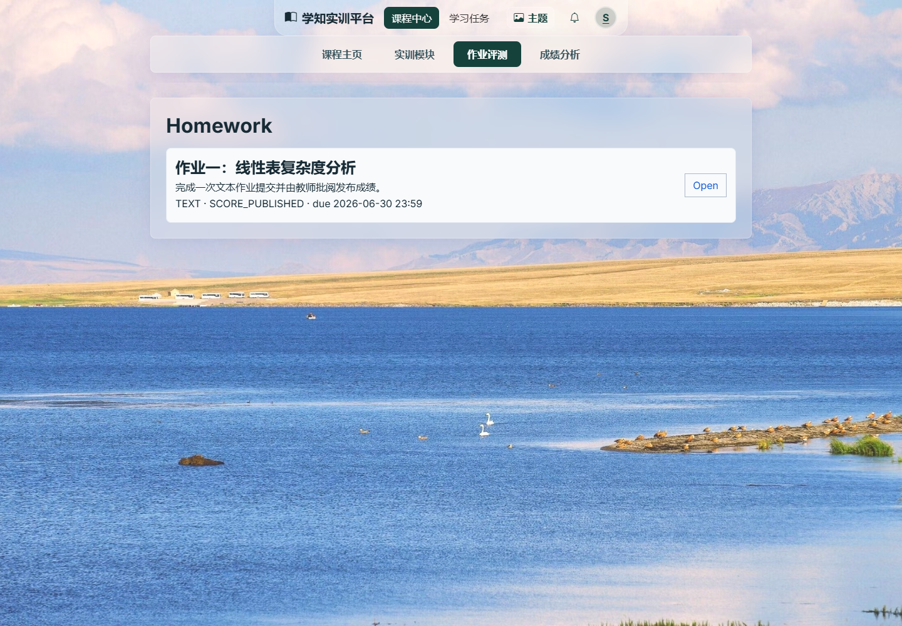

*图 2-8 学生作业列表*

### 2.8 提交作业并查看反馈

入口：作业列表中点击作业，路径示例 `/courses/9501/homeworks/950301?role=student`。

步骤：

1. 查看作业说明、题目、截止时间、提交规则和评分方式。
2. 按作业类型填写文本答案、上传附件或提交代码。
3. 点击提交按钮。
4. 提交后查看提交状态。
5. 进入提交历史查看最终版本、教师评分、自动评测结果和评语。

预期结果：系统保存作业提交记录。若作业允许多次提交，页面保留多个版本并标识最终版本；成绩发布前，学生只能看到系统允许公开的反馈。


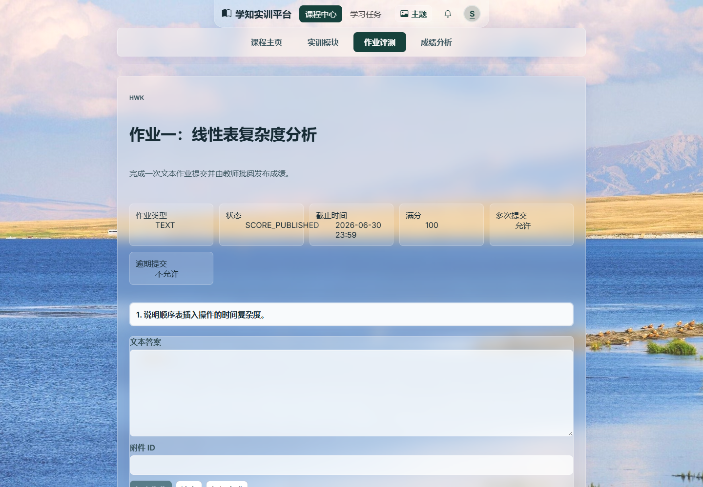

*图 2-9 作业详情与提交入口*

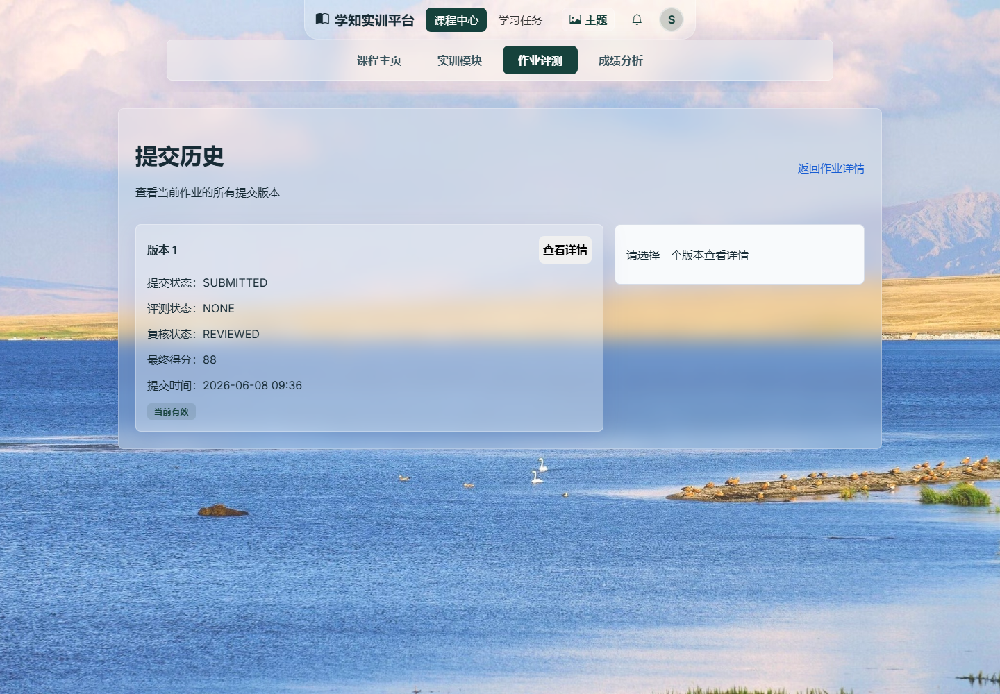

*图 2-10 作业提交历史与反馈*

### 2.9 查看课程成绩与提交成绩异议

入口：课程内导航“成绩分析”，路径示例 `/courses/9501/grades?role=student`。

步骤：

1. 进入课程主页。
2. 点击课程内导航“成绩分析”。
3. 查看已发布的课程总评、成绩项和得分明细。
4. 如对已发布成绩有疑问，选择成绩异议入口。
5. 填写复核原因并提交。
6. 后续在成绩页面或通知中心查看处理状态。

预期结果：学生只能查看本人已发布成绩，不能查看未发布成绩或其他学生成绩。异议提交后生成待处理记录，教师处理后系统保留处理结果。


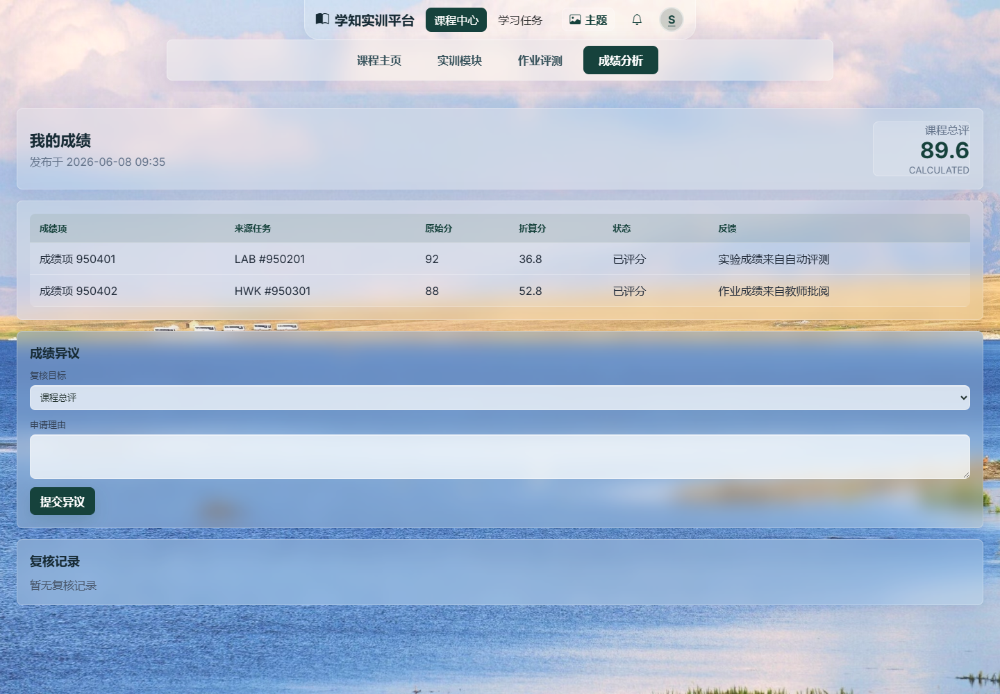

*图 2-11 学生成绩页面*

### 2.10 查看通知中心

入口：顶部导航铃铛图标，路径 `/notifications`。

步骤：

1. 点击顶部导航中的通知图标。
2. 查看站内通知列表。
3. 按通知类型、已读状态或时间范围筛选。
4. 点击通知可跳转到对应课程、实验、作业或成绩页面。
5. 对通知执行标记已读或删除操作。

预期结果：页面展示未读数量、通知标题、内容、类型、优先级和创建时间。学生只能处理自己的通知状态。


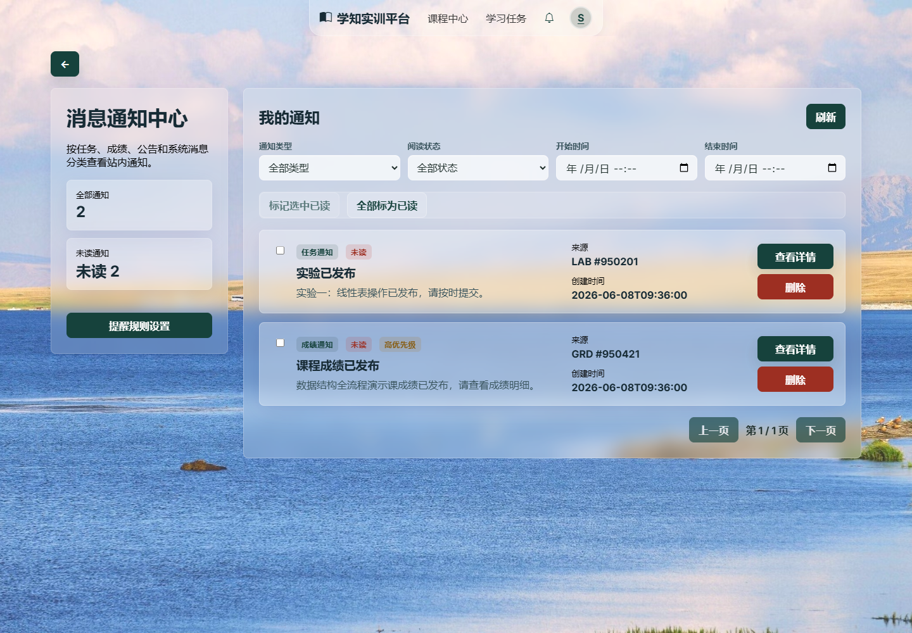

*图 2-12 通知中心*

### 2.11 设置提醒规则

入口：通知中心或学习任务相关入口，路径 `/learning/reminders`。

步骤：

1. 进入提醒规则设置页面。
2. 查看作业截止提醒、实验截止提醒等规则。
3. 开启或关闭实验、作业、成绩、公告等通知偏好。
4. 点击“保存设置”。

预期结果：系统保存当前用户的通知偏好和提醒规则。关键提醒规则保持启用时，任务截止前会生成站内提醒。


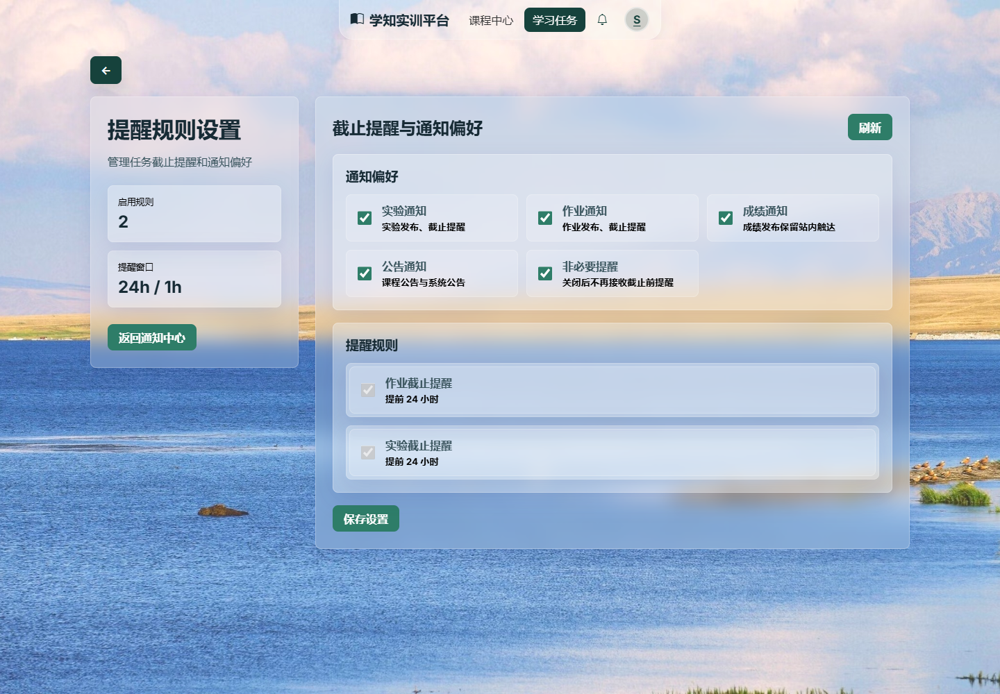

*图 2-13 提醒规则设置*

## 3. 教师端操作说明

教师端主流程为：

```text
登录 -> 课程管理 -> 维护章节/资源/公告 -> 发布实验/作业 -> 查看提交 -> 评分 -> 配置和发布成绩 -> 查看学习统计
```

### 3.1 管理课程

入口：顶部导航“课程中心”，路径 `/courses`。

步骤：

1. 使用教师账号登录。
2. 进入课程中心。
3. 在左侧菜单选择“全部课程”“我的课程”“我管理的课程”或“已归档课程”。
4. 在创建课程表单中填写课程名称、课程简介、学期、分类、加入方式、邀请码、人数上限和课程状态。
5. 点击“创建课程”。
6. 对已有课程可执行编辑、章节、资源、公告、成员等管理操作。
7. 在课程详情中查看选课审核和课程成员，按需通过或拒绝学生申请，调整成员角色或移除成员。

预期结果：教师可创建课程并在课程列表中看到；教师只能管理本人负责或被授权的课程。成员审核通过后学生获得课程访问权限，成员角色调整后权限按课程角色生效。


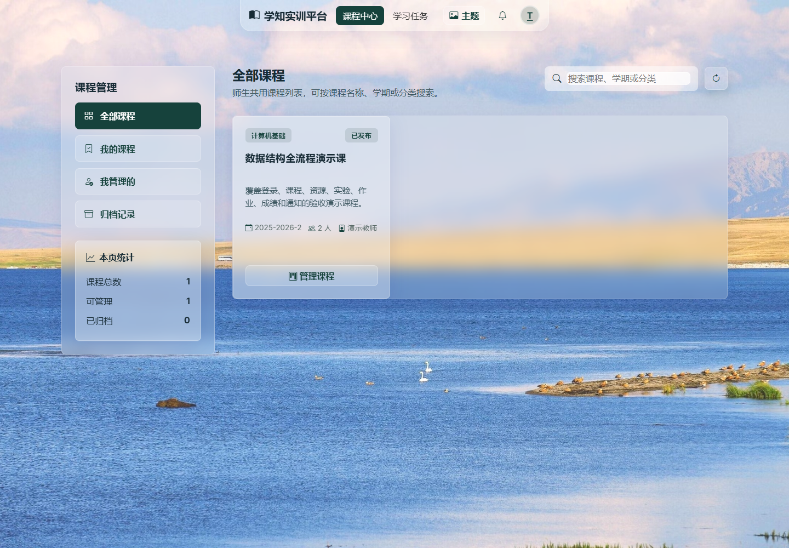

*图 3-1 教师课程管理*

### 3.2 维护章节、资源和公告

入口：课程中心中课程卡片的“章节”“资源”“公告”等管理入口。

步骤：

1. 在教师课程管理页选择目标课程。
2. 点击“章节”进入章节管理，填写章节名称、排序、目标和可见状态，点击“创建章节”或“保存章节”。
3. 点击“资源”进入资源管理，填写资源名称、类型、所属章节、可见范围和发布时间，选择文件后点击“上传资源”。
4. 点击“公告”进入公告管理，填写公告标题和内容，可设置置顶，点击“发布公告”。
5. 需要调整时，使用编辑、删除、置顶或取消置顶操作。

预期结果：章节、资源和公告保存后出现在课程详情页。学生只能看到对其可见的资源和公告。


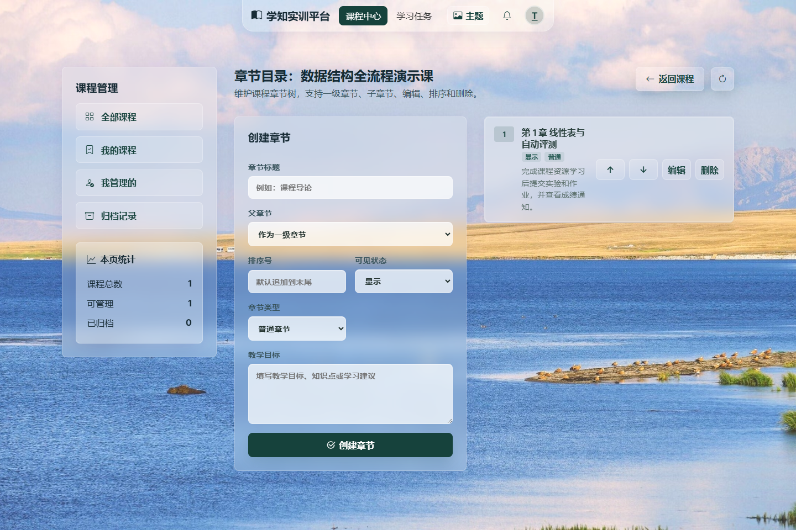

*图 3-1a 章节管理*

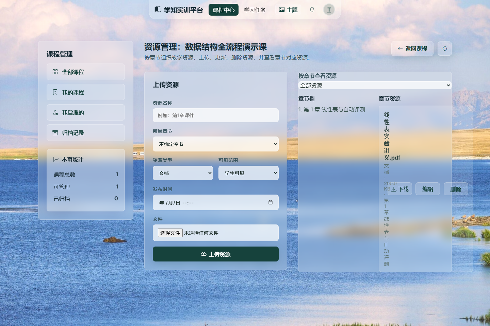

*图 3-1b 资源管理*

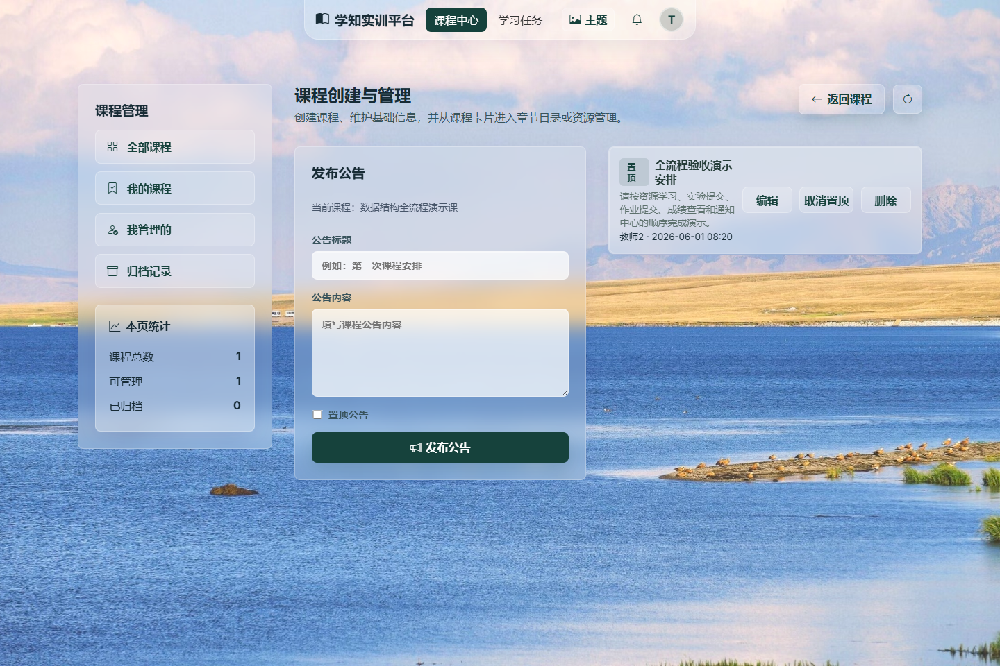

*图 3-1c 公告管理*

### 3.3 创建和发布实验

入口：课程内导航“实验实训”，路径示例 `/courses/9501/labs?role=teacher`。

步骤：

1. 进入课程的实验实训页面。
2. 在实验创建与编辑表单填写实验名称、实验说明、截止时间、满分、允许语言、评测模式、时间限制和内存限制。
3. 根据需要添加测试用例，设置输入、期望输出、权重和公开状态。
4. 点击“保存”保存草稿。
5. 在实验列表中点击“发布”，使实验对学生可见。

预期结果：实验草稿保存后进入教师实验列表；发布后学生可在实验列表中查看并提交。


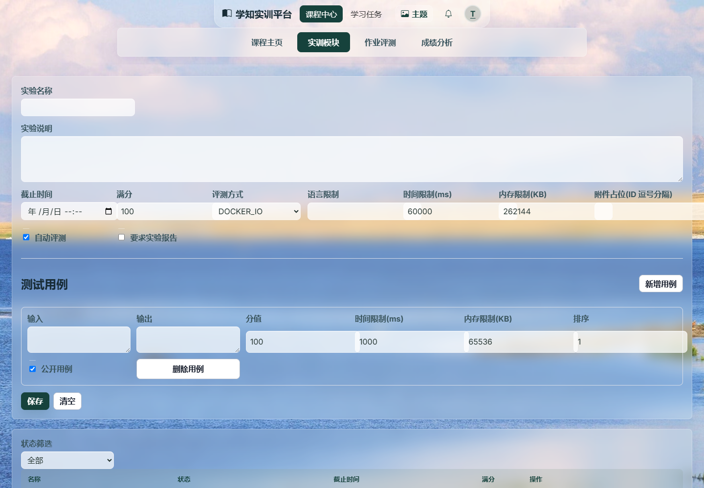

*图 3-2 教师实验管理*

### 3.4 查看实验提交、评分和统计

入口：教师实验管理页中点击实验卡片的“查看提交”或“统计”。

步骤：

1. 在实验列表中选择目标实验。
2. 点击“查看提交”。
3. 使用学生编号、提交状态、评测状态或逾期筛选提交记录。
4. 点击“查看详情”查看代码、文件、评测结果和报告。
5. 在“教师评分”区域填写人工评分、报告评分、评语和修改原因。
6. 点击“保存提交评分”或“保存报告评分”。
7. 返回实验列表后点击“统计”查看提交率、未提交人数、平均分和分数分布。

预期结果：教师可查看课程内学生提交和评测结果，评分后形成成绩记录和评分留痕。教师只能管理自己课程内实验。


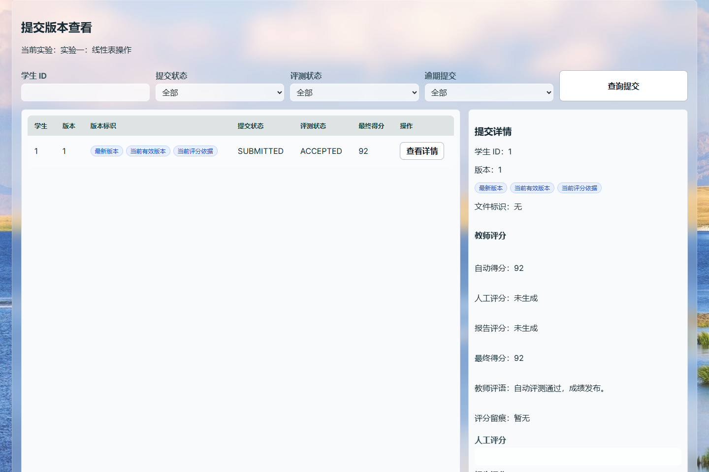

*图 3-2a 实验提交详情与评分*

### 3.5 创建和发布作业

入口：课程内导航“作业评测”，路径示例 `/courses/9501/homeworks?role=teacher`。

步骤：

1. 进入课程作业评测页面。
2. 填写作业标题、作业类型、截止时间、总分和作业说明。
3. 设置是否允许多次提交、是否允许逾期提交、成绩发布前是否显示评测。
4. 对客观题添加题目、选项、答案和分值；对代码题添加测试用例和限制参数。
5. 点击“保存草稿”。
6. 在作业列表中点击“发布”。

预期结果：作业发布后学生可在作业列表看到并提交。教师可继续编辑草稿或关闭已发布作业。


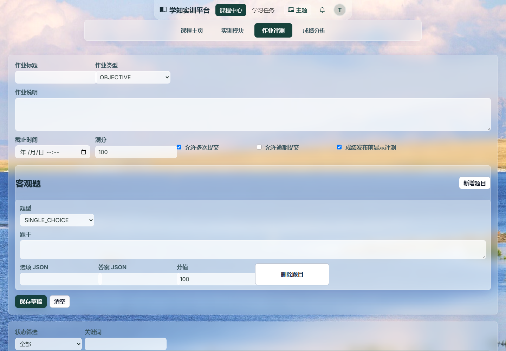

*图 3-3 教师作业管理*

### 3.6 查看作业提交、批阅和统计

入口：教师作业管理页中点击“查看提交”或“统计”。

步骤：

1. 在作业列表中选择目标作业。
2. 点击“查看提交”进入提交列表。
3. 按学生、提交状态、评测状态或批阅状态筛选。
4. 打开提交详情，查看答案、附件、代码、评测结果和批阅日志。
5. 填写人工评分、最终得分和评语，点击保存批阅。
6. 必要时触发重评。
7. 返回作业列表点击“统计”，查看已提交、未提交、已评测、已批阅、平均分、最高分和最低分。

预期结果：作业批阅后学生可在提交历史中查看反馈；发布成绩后作业成绩可进入成绩模块。


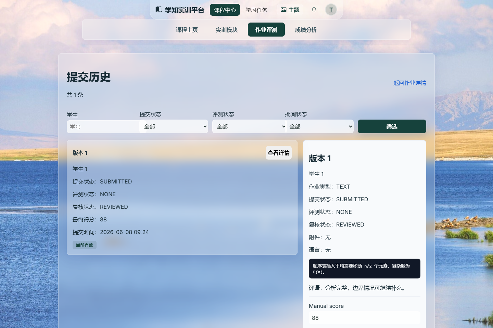

*图 3-3a 作业提交详情与批阅*

### 3.7 配置成绩项、同步来源成绩和发布成绩

入口：课程内导航“成绩分析”，路径示例 `/courses/9501/grades?role=teacher`。

步骤：

1. 进入课程成绩页面。
2. 在成绩项配置区域创建实验、作业或其他课程成绩项。
3. 设置满分、权重、是否计入总评和排序。
4. 点击规则校验，确认总权重和成绩项配置有效。
5. 点击同步来源成绩，从实验和作业模块归集成绩。
6. 点击重新计算，生成或更新课程总评。
7. 检查教师成绩总表，确认缺失、未评分和已评分状态。
8. 点击发布成绩，选择发布范围并确认。

预期结果：成绩项配置通过校验后，教师可看到学生成绩总表和总评。发布后学生端可查看已发布成绩，系统生成发布记录并触发通知。


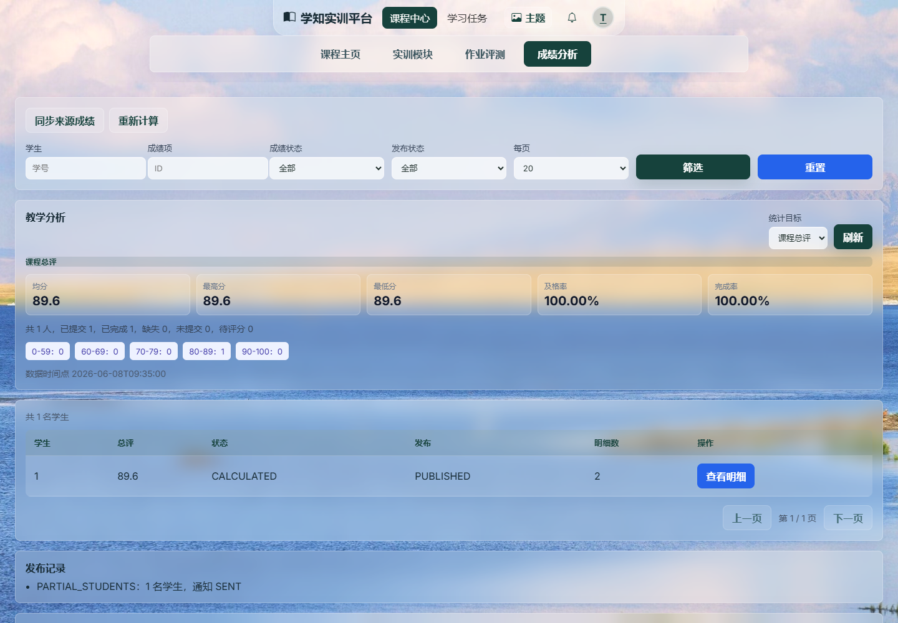

*图 3-4 教师成绩管理*

### 3.8 调整成绩和处理成绩异议

入口：教师成绩管理页中的成绩明细、变更记录和异议申请区域。

步骤：

1. 在成绩总表中定位学生和成绩项。
2. 如需调整单项成绩，填写新分数和调整原因。
3. 如需调整总评，填写新总评和调整原因。
4. 在异议申请列表查看学生提交的复核原因。
5. 选择通过或驳回，填写处理说明。
6. 保存处理结果。

预期结果：系统保存成绩变更日志和异议处理结果，学生可在成绩页面或通知中心查看结果。


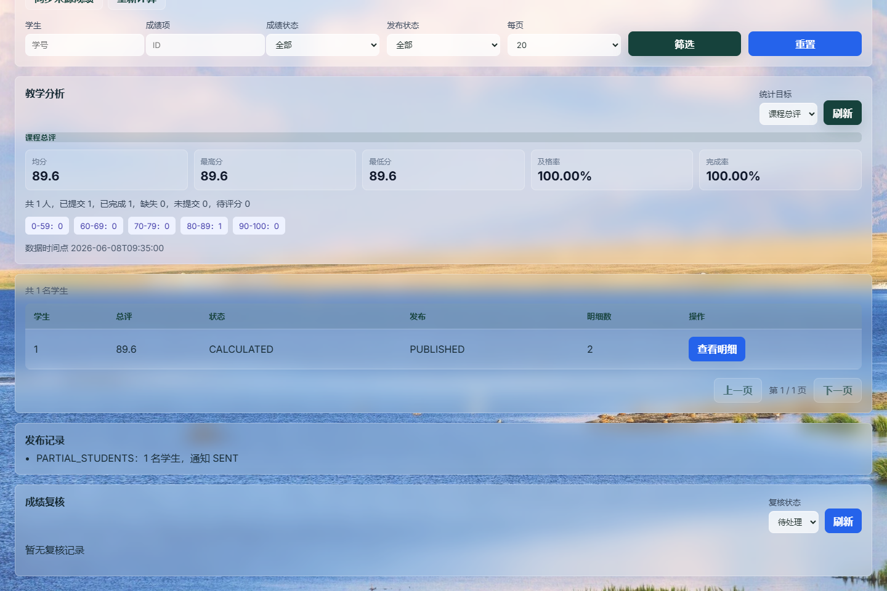

*图 3-4a 成绩复核处理*

### 3.9 查看学习统计

入口：顶部导航“学习任务”相关页面，路径 `/learning/statistics`。

步骤：

1. 使用教师账号进入学习统计页面。
2. 查看课程学习总时长、资源访问次数、完成任务数、提交任务数和行为记录数。
3. 查看学习趋势和最近学习行为。
4. 结合课程 ID 查询课程级学生进度统计。

预期结果：教师可查看课程学习过程统计，用于判断学生学习活跃度和任务完成情况。


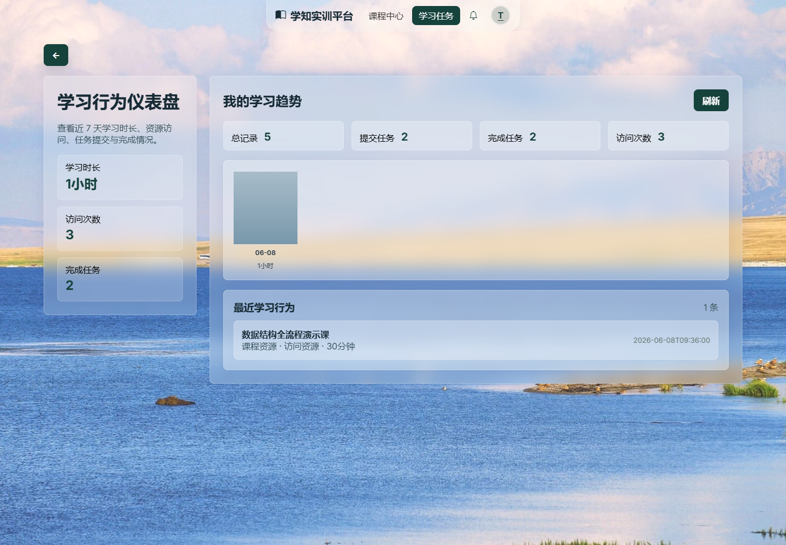

*图 3-5 学习统计页面*

## 4. 管理员端操作说明

管理员端主流程为：

```text
登录 -> 用户权限管理 -> 用户管理 -> 角色管理 -> 权限分配 -> 课程维护 -> 审计日志查看
```

### 4.1 进入用户权限管理

入口：管理员访问 `/admin/auth`。

步骤：

1. 使用管理员账号登录。
2. 在浏览器地址栏访问 `/admin/auth`，或从平台管理入口进入用户权限管理页。
3. 系统校验当前用户是否具有管理员角色。

预期结果：管理员进入“用户权限管理”页面。非管理员访问该页面时，系统提示无权限或跳转 403 页面。


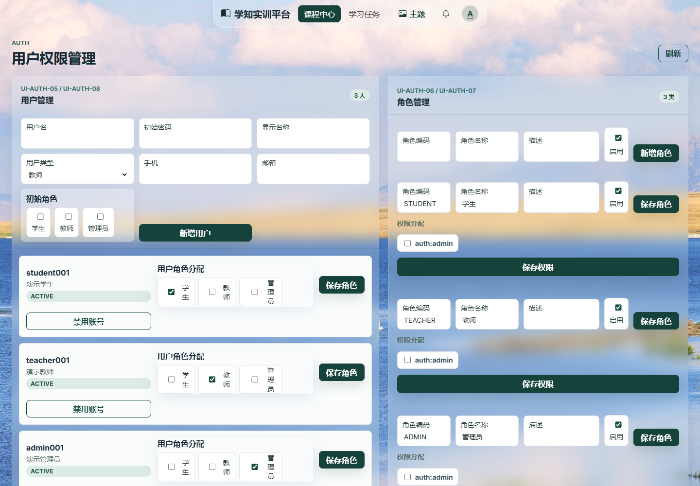

*图 4-1 用户权限管理*

### 4.2 管理用户

入口：用户权限管理页中的“用户管理”区域。

步骤：

1. 在用户管理区域查看用户列表。
2. 使用关键字、角色或状态筛选用户。
3. 在新增用户表单中填写用户名、密码、用户类型、显示名称、手机号、邮箱和头像地址。
4. 选择需要绑定的角色。
5. 点击“新增用户”。
6. 对已有用户可修改角色或启用、禁用账号。

预期结果：系统创建或更新用户账号，用户列表刷新显示最新状态。被禁用用户不能继续正常登录。


### 4.3 管理角色

入口：用户权限管理页中的“角色管理”区域。

步骤：

1. 查看当前角色列表。
2. 在新增角色表单中填写角色编码、角色名称、描述和启用状态。
3. 点击“新增角色”。
4. 对已有角色修改名称、描述或启用状态。
5. 点击“保存角色”。

预期结果：系统保存角色信息，并在用户角色分配和权限分配中可选。


### 4.4 分配权限和用户角色

入口：用户权限管理页中的用户角色选择和角色权限选择区域。

步骤：

1. 在用户列表中选择需要维护的用户。
2. 勾选或取消勾选角色。
3. 点击“保存角色”。
4. 在角色列表中选择需要维护的角色。
5. 勾选或取消勾选权限点。
6. 点击“保存权限”。

预期结果：用户角色和角色权限关系更新。用户重新登录或刷新当前用户信息后，菜单和接口权限按新配置生效。


### 4.5 查看安全审计日志

入口：用户权限管理页中的“安全审计日志”区域。

步骤：

1. 在安全审计日志区域输入操作人、操作类型、结果状态或时间范围。
2. 点击“筛选日志”。
3. 查看日志编号、操作人、操作类型、对象、结果、客户端 IP、User-Agent 和创建时间。

预期结果：管理员可追踪登录、权限维护、账号状态调整等安全相关操作。


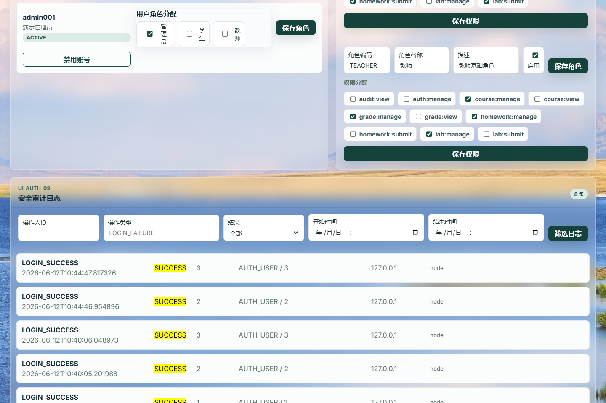

*图 4-2 安全审计日志*

### 4.6 课程维护与系统维护

入口：顶部导航“课程中心”和 `/admin/auth`。

步骤：

1. 使用管理员账号登录后进入课程中心。
2. 在“全部课程”中查看平台课程列表，可按课程名称、学期或分类搜索。
3. 点击课程卡片的“管理课程”，查看课程基本信息、公告、章节、资源、选课审核和课程成员。
4. 对需要平台纠错的课程，可执行课程基础信息维护、归档、章节资源维护、公告维护、选课审核、成员角色调整和成员移除。
5. 回到 `/admin/auth` 查看用户状态、角色权限和安全审计日志，定位账号异常、权限配置异常或关键操作记录。

预期结果：管理员可以在平台级别查看和维护课程基础数据、账号状态、角色权限和审计记录，完成账号异常、权限异常和课程基础数据纠错等系统维护工作，但不替代教师完成日常教学评分、作业批阅和成绩发布。


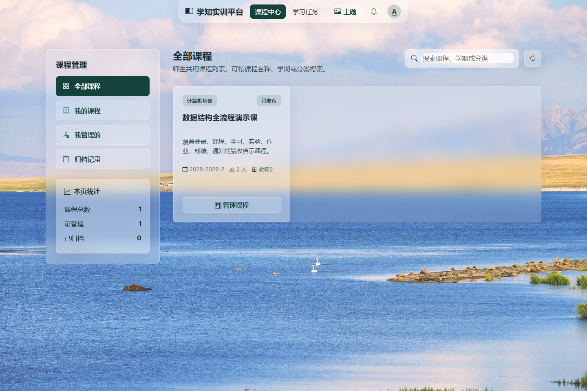

*图 4-3 管理员课程维护*

## 5. 常见状态与异常处理

### 5.1 登录失败

可能原因：

- 账号或密码输入错误。
- 账号已被禁用。
- 会话已过期。

处理方式：

1. 检查账号和密码是否与系统分配一致。
2. 若账号被禁用，联系管理员启用账号。
3. 若提示登录失效，重新进入登录页登录。

### 5.2 无权限访问

可能原因：

- 学生访问教师或管理员页面。
- 教师访问非本人管理课程。
- 非课程成员访问课程资源、实验、作业或成绩。

处理方式：

1. 返回课程中心确认当前账号和角色。
2. 检查是否已加入课程。
3. 需要课程管理权限时联系课程教师或管理员处理。

### 5.3 提交失败

可能原因：

- 作业或实验未发布、已关闭或已截止。
- 文件格式或大小不符合要求。
- 网络异常或评测服务暂不可用。

处理方式：

1. 查看页面错误提示。
2. 检查截止时间、提交类型、文件格式和代码语言。
3. 网络恢复后重新提交。
4. 若评测异常，等待系统重试或联系教师处理。

### 5.4 成绩不可见

可能原因：

- 教师尚未发布成绩。
- 当前账号不是该课程学生。
- 访问了其他学生成绩或未授权课程。

处理方式：

1. 确认成绩页面显示的是本人课程。
2. 等待教师完成发布。
3. 如仍不可见，联系任课教师检查发布范围。

### 5.5 通知未收到

可能原因：

- 通知偏好关闭。
- 业务事件尚未触发。
- 非课程成员无对应通知。

处理方式：

1. 进入提醒规则设置页面检查通知偏好。
2. 在通知中心刷新或调整筛选条件。
3. 联系教师确认实验、作业或成绩是否已发布。
