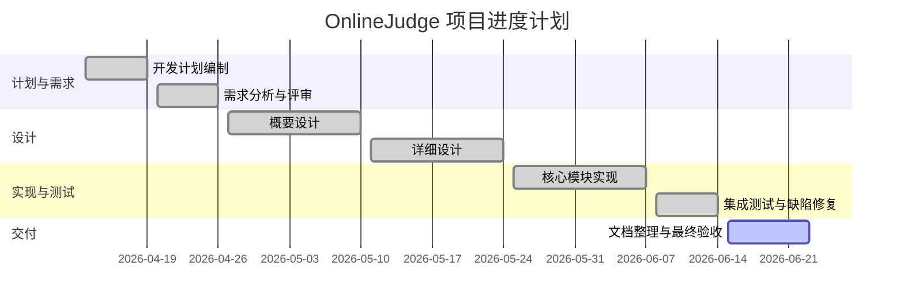
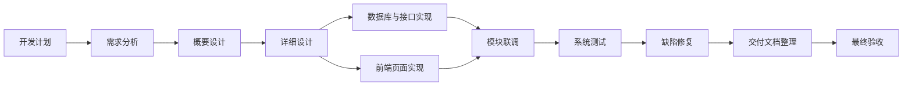

## **1 引言**

### **1.1 标识**

项目名称：在线教学与实训平台
项目性质：课程设计项目
开发团队：软件工程课程小组

---

### **1.2 系统概述**

本系统是一个面向高校教学场景的在线平台，支持课程学习、实训、作业管理与自动评测，实现完整教学闭环。

核心能力：

- 在线课程管理
- 学习过程跟踪
- 实训代码提交与自动评测
- 作业管理与成绩展示

---

### **1.3 文档概述**

本文档用于描述项目开发全过程，包括：

- 项目目标
- 技术方案
- 开发流程
- 进度安排
- 风险控制

---

### **1.4 与其他计划之间的关系**

本计划书与以下文档配套使用：

- 软件开发计划书
- 软件需求规格说明书
- 软件概要设计说明书
- 软件详细设计说明书
- 软件实现说明书
- 测试文档（或测试报告）
- 部署文档
- 用户手册

---

### **1.5 基线**

本项目基于课程设计要求，不涉及外部商业基线约束。

---

## **2 引用文件**

- 软件工程课程指导书
- Git版本管理规范
- RESTful API设计规范

---

## **3 交付产品**

### **3.1 程序**

在线教学与实训平台：

- 用户系统（登录、注册、角色管理）
- 课程系统（课程创建、选课、资源发布）
- 学习系统（课程内容、进度记录）
- 实训系统（代码提交、自动评测）
- 作业系统（提交、批改、成绩展示）

---

### **3.2 文档**

- 软件开发计划书
- 软件需求规格说明书
- 软件概要设计说明书
- 软件详细设计说明书
- 软件实现说明书
- 测试文档（或测试报告）
- 部署文档
- 用户手册

---

### **3.3 服务**

- 系统演示与维护支持
- 系统演示与答辩支持

---

### **3.4 非移交产品**

- 开发过程文档（草稿）
- Git历史记录
- 中间测试数据

---

### **3.5 验收标准**

- 所有核心功能可运行
- 无严重Bug
- 流程完整：登录 → 学习 → 实训 → 作业 → 成绩
- 系统稳定运行

---

### **3.6 最后交付期限**

- 开发计划完成：2026年4月19日
- 需求分析完成：2026年4月26日
- 概要设计完成：2026年5月10日
- 详细设计完成：2026年5月24日
- 项目交付：2026年6月14日

---

## **4 所需工作概述**

### **系统和软件的需求与约束**

### **需求**

- 支持课程教学全流程
- 支持代码提交与基础评测
- 提供成绩反馈

### **约束**

- 时间周期短（课程项目）
- 技术复杂度受限
- 不实现复杂判题系统

---

### **项目文档编制的需求和约束**

### **需求**

- 完整开发文档体系
- 标准化格式

### **约束**

- 文档需统一模板
- 内容必须可评审

---

### **系统生命周期中的位置**

处于开发阶段（需求→设计→实现→测试）

---

### **计划/采购策略**

### **计划策略**

- 瀑布模型（宏观）
- Scrum（开发阶段）

### **采购策略**

- 不涉及外包
- 使用开源框架

---

### **项目进度安排及资源的需求与约束**

### **进度安排**

- 分阶段推进 + Sprint开发

### **资源需求**

- 6名开发人员
- 开发环境 + Git仓库

### **约束**

- 人员时间有限
- 无服务器资源（本地部署）

---

## **5 实施整个软件开发活动的计划**

### **5.1 软件开发过程**

采用：

- 瀑布模型（阶段控制）
- Scrum（迭代开发）

---

### **5.2 软件开发总体状态**

---

### **5.2.1 软件开发方法**

Scrum + 瀑布混合模型：

- 每3–5天一个Sprint
- 持续集成与测试

---

### **5.2.2 软件产品标准**

### **需求与设计**

- 使用统一模板
- 明确功能边界

### **编码标准**

- Java（Spring Boot）
- 前端统一采用 Vue3 + TypeScript
- 前端业务代码、组件代码与接口类型定义均使用 TypeScript，不使用纯 JavaScript 页面代码
- 驼峰命名
- 必须写注释

### **测试标准**

- 单元测试
- 集成测试
- 覆盖核心流程

---

### **5.2.3 可重用的软件产品**

- 使用开源工具库

---

### **5.2.4 处理关键性请求**

### **安全性**

- 登录鉴权
- 基础权限控制

### **保密性**

- 用户数据隔离

---

### **5.2.5 计算机硬件资源利用**

- 本地开发环境
- 轻量级部署

---

### **5.2.6 记录原理**

- Git记录所有变更
- PR记录决策

---

### **5.2.7 需方评审途径**

- 周会评审
- 阶段评审

---

## **6 实施详细软件开发活动的计划**

### **6.1 项目计划和监督**

- 每周同步进度
- Sprint review

---

### **6.2 建立软件开发环境**

- Git仓库
- IDEA / VSCode
- Node.js + Java 环境
- 前端建立 TypeScript 编译与校验环境

---

### **6.3 系统需求分析**

- 明确功能模块
- 用户角色划分

---

### **6.4 系统设计**

- 模块化架构
- RESTful API
- 前端采用 Vue3 + TypeScript 的组件化设计

---

### **6.5 软件需求分析**

- 用户用例建模

---

### **6.6 软件设计**

- 数据库设计（MySQL）
- 接口设计

---

### **6.7 软件实现和配置项测试**

- 模块开发
- 单元测试

---

### **6.8 配置项集成和测试**

- 模块集成
- 接口联调

---

### **6.9 CSCI合格性测试**

- 功能完整性测试

---

### **6.10 系统集成测试**

- 全流程测试

---

### **6.11 系统合格性测试**

- 用户场景测试

---

### **6.12 软件使用准备**

- 编写用户手册

---

### **6.13 软件移交准备**

- 打包系统
- 提交代码

---

### **6.14 软件配置管理**

- Git分支管理

---

### **6.15 软件产品评估**

- 功能完成度评估

---

### **6.16 软件质量保证**

- Code Review

---

### **6.17 问题解决过程**

- Issue跟踪

---

### **6.18 联合评审**

- 阶段评审

---

### **6.19 文档编制**

- 各阶段文档输出

---

### **6.20 其他软件开发活动**

### **风险管理**

见第11节

---

## **7 进度表和活动网络图**

图 7-1 项目进度甘特图

图 7-2 项目活动网络图

---

## **8 项目组织和资源**

### **8.1 项目组织**

6人团队：

- 项目负责人
- 前端负责人
- 后端负责人
- 测试负责人
- 需求负责人
- 架构负责人

---

### **8.2 项目资源**

- Git仓库
- 开发工具

---

## **9 培训**

### **9.1 技术要求**

- Spring Boot
- Vue3 + TypeScript
- Git

---

### **9.2 培训计划**

- 初期技术同步

---

## **10 项目估算**

### **10.1 估算规模**

中等规模课程项目

---

### **10.2 工作量估算**

约6人 × 6周

---

### **10.3 成本估算**

无实际成本

---

### **10.4 关键计算机资源估算**

本地开发环境即可

---

### **10.5 管理预留**

预留10%时间用于修复问题

---

## **11 风险管理**

### **技术风险**

- 自动评测实现困难
👉 对策：简化为输入输出比对

---

### **进度风险**

- 成员拖延
👉 对策：Sprint + 周会

---

### **集成风险**

- 接口不一致
👉 对策：统一API规范

---

## **12 支持条件**

### **12.1 计算机系统支持**

- 本地开发环境

---

### **12.2 需方提供条件**

- 课程要求说明

---

### **12.3 承包方提供条件**

- 开发人员与代码实现

---

## **13 注解**

本项目为教学用途，不涉及商业部署。
