# 软件概要设计说明书

| 项目信息 | 内容 |
|---------|------|
| 项目名称 | 在线教学与实训平台 |
| 文档类型 | 软件概要设计说明书（HLD） |
| 文档版本 | V1.0（整合协作底稿） |
| 编写依据 | GB/T 8567—2006《计算机软件文档编制规范》 |

---

## 目录

- [1 引言](#1-引言)
- [2 系统需求概述](#2-系统需求概述)
- [3 系统接口设计](#3-系统接口设计)
- [4 系统数据库设计](#4-系统数据库设计)
- [5 运行设计](#5-运行设计)
- [6 需求追踪矩阵](#6-需求追踪矩阵)

---

## 1 引言

### 1.1 编写目的

本《软件概要设计说明书》是"在线教学与实训平台"项目进入详细设计阶段前的重要技术文档，其编写目的如下：

**第一，明确系统总体设计方向。** 本文档从系统全局视角出发，对平台进行模块划分、架构设计、接口设计和数据结构设计，为后续详细设计阶段提供清晰的设计蓝图和技术约束。各模块负责人和开发人员可据此开展各自模块的类设计、数据库表细化、接口协议定义等详细设计工作。

**第二，统一团队设计共识。** 本文档作为项目组的整体协作底稿，将六个功能模块（AUTH、CRS、LRN、LAB、HWK、GRD）的设计方案整合到统一的文档框架中，明确各模块的职责边界、数据交互关系和接口契约，避免模块间设计冲突和重复开发。

**第三，为测试和评审提供依据。** 本文档中的功能需求设计、接口定义、数据结构设计和运行设计等内容，可作为测试负责人编写测试计划、设计测试用例的依据，也可作为项目评审阶段的重要参考材料。

**本文档的预期读者包括：** 概要设计负责人、各模块负责人、前端总设计师、后端总设计师、测试负责人以及全体开发人员。所有读者应在阅读本文档前已熟悉《软件需求规格说明书》（SRS）的内容。

### 1.2 背景

**待开发系统名称：** 在线教学与实训平台

**项目背景：** 当前高校课程教学中的理论教学与实践实训环节日益紧密，但现有的教学平台往往将课程管理、作业评测和实训实验功能分散在不同系统中，缺乏统一的教学流程支撑和成绩评价闭环。本项目旨在构建一个集课程管理、在线学习、作业自动评测、实训实验、成绩评价与教学分析于一体的综合性教学平台。

**开发团队与运行环境：** 本项目由北京航空航天大学软件学院大二学生团队承担开发工作，采用前后端分离的 B/S 架构。后端基于 Spring Boot 框架，前端采用 Vue 3 + TypeScript 技术栈，数据存储以关系型数据库为核心，部署环境面向 MySQL，开发和测试环境可使用 H2 的 MySQL 兼容模式。LAB/HWK 代码评测通过可替换的 Fake/Docker 沙箱执行器完成，Redis、OpenAPI 自动生成等能力作为扩展设计保留。平台运行于标准服务器环境，客户端通过现代浏览器访问。

**项目里程碑：**
- 2026 年 4 月 26 日：完成《软件需求规格说明书》（SRS）
- 2026 年 5 月 10 日：完成《软件概要设计说明书》（本文档）
- 2026 年 5 月 24 日：完成《软件详细设计说明书》

### 1.3 定义

| 术语/缩写 | 定义 |
|-----------|------|
| AUTH | 用户权限与平台安全模块，负责用户注册登录、角色权限管理、统一身份认证和审计日志 |
| CRS | 课程与教学资源模块，负责课程创建与管理、章节目录、教学资源上传和选课准入 |
| LRN | 学习过程与通知提醒模块，负责学习行为记录、学习进度跟踪和站内通知生成、查询与状态管理 |
| LAB | 实训实验模块，负责实验任务管理、学生代码提交、Docker 沙箱自动评测和实验报告 |
| HWK | 作业与自动评测模块，负责作业创建发布、学生提交、客观题/代码题自动评测和教师批阅 |
| GRD | 成绩评价与教学分析模块，负责成绩项配置、成绩汇总、总评计算、成绩发布和教学分析 |
| Bearer 访问令牌 | AUTH 模块签发并由前端通过 Authorization 头携带的会话令牌；JWT 可作为令牌格式扩展 |
| RBAC（Role-Based Access Control） | 基于角色的访问控制模型，通过角色来管理用户对系统资源的访问权限 |
| RESTful API | 遵循 REST 架构风格设计的 Web API，使用 HTTP 方法（GET/POST/PUT/DELETE）操作资源 |
| Docker 沙箱 | 基于 Docker 容器技术的代码运行隔离环境，用于安全执行学生提交的代码并进行评测 |
| IO 比对 | 通过比较程序输出（Output）与预期输出（Expected Output）来实现代码自动评测的方法 |
| WebSocket | 一种在单个 TCP 连接上实现全双工通信的协议，可作为站内消息推送的实现方式之一 |
| SSE（Server-Sent Events） | 服务器推送事件技术，作为 WebSocket 的备选方案用于服务端向客户端推送数据 |
| Redis | 高性能内存键值数据库，可作为热点数据、通知未读计数或会话扩展缓存；本版本运行不依赖 Redis |
| MVC（Model-View-Controller） | 后端分层架构模式，将数据模型、视图展示和业务控制逻辑分离 |
| MVVM（Model-View-ViewModel） | 前端分层架构模式，通过 ViewModel 实现视图与数据模型的双向绑定 |
| 课程资源（Course Resource） | 指教师上传并绑定至课程章节的教学材料，包括视频、课件、PDF、实验指导书、外部链接等 |
| 课程成员角色（Course Member Role） | 指用户在课程中的身份类型，包括教师、助教、学生，不同角色决定资源管理、作业管理等权限范围 |
| 统一错误码（Unified Error Code） | 指系统各模块采用统一的接口返回状态码标准，用于测试验证、前后端联调和异常追踪 |
| 评测执行器 | 负责执行代码编译、运行和测试用例比对的基础组件，LAB 和 HWK 模块共享评测服务抽象，可按环境选择 Fake 或 Docker 实现 |

### 1.4 参考资料

| 序号 | 文档名称 | 说明 |
|------|---------|------|
| 1 | 《软件需求规格说明书》（SRS） | 本项目的需求基线文档，包含所有功能需求（FR-*）和非功能需求（NFR-*） |
| 2 | GB/T 8567—2006《计算机软件文档编制规范》 | 本文档格式遵循的国家标准 |
| 3 | 《用户权限与平台安全模块需求文档》 | AUTH 模块详细需求，编号 FR-UA-01 ~ FR-UA-07、NFR-UA-01 ~ NFR-UA-05 |
| 4 | 《课程与教学资源模块需求文档》 | CRS 模块详细需求，编号 FR-CR-01 ~ FR-CR-06、NFR-CR-01 ~ NFR-CR-05 |
| 5 | 《学习过程与通知提醒模块需求文档》 | LRN 模块详细需求，编号 FR-LN-01 ~ FR-LN-06、NFR-LN-01 ~ NFR-LN-05 |
| 6 | 《实训实验模块需求文档》 | LAB 模块详细需求，编号 FR-LAB-01 ~ FR-LAB-08、NFR-LAB-01 ~ NFR-LAB-05 |
| 7 | 《作业与自动评测模块需求文档》 | HWK 模块详细需求，编号 FR-HWK-01 ~ FR-HWK-06、NFR-HWK-01 ~ NFR-HWK-05 |
| 8 | 《成绩评价与教学分析模块需求文档》 | GRD 模块详细需求，编号 FR-GR-01 ~ FR-GR-07、NFR-GR-01 ~ NFR-GR-05 |

---

## 2 系统需求概述

### 2.1 需求规定

"在线教学与实训平台"面向高校教学场景，服务于学生、教师和管理员三类核心用户角色，提供从课程创建、资源管理、作业布置到实验实训、成绩评价的完整教学闭环。系统的核心输入输出项目和功能性能要求如下：

**主要输入：**
- 教师：课程信息、教学资源文件、作业/实验任务配置、测试用例、评分标准、公告内容
- 学生：注册/登录凭证、作业/实验提交内容（文本、代码、文件）、客观题答案、成绩异议申请、通知偏好设置
- 管理员：用户管理操作、角色权限配置、平台配置参数
- 系统：来自 AUTH 模块的认证令牌、来自 CRS 模块的课程成员数据、来自 LAB/HWK 模块的评分结果

**主要输出：**
- 页面展示：课程列表、章节目录、学习进度、通知消息、作业/实验详情、评测结果、成绩报表、统计分析图表
- 接口返回：JSON 格式的业务数据、认证令牌、分页列表、操作结果状态
- 数据持久化：用户数据、课程数据、提交记录、评测记录、成绩记录、审计日志
- 站内消息：本版本通过数据库通知表落库并由页面刷新或可配置轮询查询；模块间业务事件包括作业发布、成绩发布等

**功能需求覆盖范围：** 系统共包含六大功能模块，涵盖 40 项功能需求（FR-*）和 30 项非功能需求（NFR-*），具体分布如下：

| 模块 | 功能需求数量 | 非功能需求数量 | 核心能力 |
|------|------------|--------------|---------|
| AUTH | FR-UA-01 ~ FR-UA-07（7项） | NFR-UA-01 ~ NFR-UA-05（5项） | 用户注册登录、角色权限管理、统一鉴权、审计日志 |
| CRS | FR-CR-01 ~ FR-CR-06（6项） | NFR-CR-01 ~ NFR-CR-05（5项） | 课程创建管理、章节资源、选课准入、成员管理、公告与基础信息 |
| LRN | FR-LN-01 ~ FR-LN-06（6项） | NFR-LN-01 ~ NFR-LN-05（5项） | 学习任务中心、进度记录、通知落库与刷新、定时提醒 |
| LAB | FR-LAB-01 ~ FR-LAB-08（8项） | NFR-LAB-01 ~ NFR-LAB-05（5项） | 实验创建发布、提交版本、自动评测、教师评分、统计查询 |
| HWK | FR-HWK-01 ~ FR-HWK-06（6项） | NFR-HWK-01 ~ NFR-HWK-05（5项） | 作业创建发布、学生提交、自动评测、教师批阅重评 |
| GRD | FR-GR-01 ~ FR-GR-07（7项） | NFR-GR-01 ~ NFR-GR-05（5项） | 成绩项配置、成绩汇总总评、成绩发布异议、教学分析 |

**编号归一说明：** 本文档以同目录《软件需求规格说明书》（SRS）为需求基线，课程与学习通知模块统一使用 `FR-CR-*`、`FR-LN-*`、`NFR-CR-*`、`NFR-LN-*` 编号。编号归一不改变课程、学习、通知、接口、数据和流程设计信息的归属。

### 2.2 业务目标

本平台的业务目标是构建一个覆盖教学全流程的在线教学支撑系统，实现以下核心业务价值：

**教学流程闭环：** 实现从"教师创建课程 → 学生选课学习 → 教师布置作业/实验 → 学生提交 → 系统自动评测 → 教师批阅 → 成绩汇总发布 → 教学分析反馈"的完整教学闭环，打通教学各环节的数据流。

**实践能力培养：** 通过 LAB 模块提供的 Docker 沙箱代码评测环境和 HWK 模块提供的自动评测能力，为学生编程类课程提供在线编写、提交、编译运行、测试用例比对的完整实践训练环境，有效支撑程序设计类课程的实践教学。

**教学效率提升：** 通过客观题自动评分、代码自动评测、成绩自动汇总计算等功能，显著减少教师在重复性评分和数据统计工作上花费的时间，使其能够更多地关注教学内容设计和教学指导。

**教学过程可追溯：** 通过学习行为记录、提交历史管理、评测记录留存、成绩变更审计、安全审计日志等机制，实现教学全过程的可追溯、可分析，为教学改进提供数据支撑。

### 2.3 运行环境

#### 2.3.1 设备

**服务端设备：**
- 服务器：标准 x86_64 架构服务器，建议配置 4 核 CPU、8GB 以上内存、100GB 以上磁盘空间
- 网络：支持 TCP/IP 协议的局域网或互联网环境
- Docker 环境：LAB 模块的代码评测需要 Docker 运行环境，建议独立部署或使用轻量级容器运行时

**客户端设备：**
- 学生/教师/管理员通过现代浏览器访问（Chrome 90+、Firefox 88+、Edge 90+）
- 屏幕分辨率建议 1280×720 及以上，支持响应式布局适配

#### 2.3.2 支持软件

| 层次 | 软件 | 版本要求 | 用途 |
|------|------|---------|------|
| 后端框架 | Spring Boot | 3.x | 后端业务逻辑实现 |
| 后端语言 | JDK | 17+ | Java 运行环境 |
| 前端框架 | Vue 3 | 3.x | 前端 UI 构建 |
| 前端语言 | TypeScript | 5.x | 前端类型安全开发 |
| 构建工具 | Vite | 5.x | 前端构建打包 |
| UI 组件 | Vue 3 单文件组件 + 原生 CSS | 随前端工程版本 | 统一页面外框、表格、表单、导航和状态提示 |
| 数据库 | MySQL | 8.0+ | 关系型数据持久化 |
| 缓存 | Redis | 7.x（可选） | 热点数据、通知未读数或会话扩展缓存；本版本非必需部署组件 |
| 容器引擎 | Docker | 24.x | LAB 模块代码评测沙箱 |
| Web 服务器 | Nginx | 1.24+ | 静态资源分发、反向代理 |
| 统计展示 | 轻量统计摘要与表格 | 随前端工程版本 | 学习统计和成绩分析展示 |
| 页面状态 | Vue 3 组合式 API + 本地存储辅助 + API wrapper | 随前端工程版本 | 登录态、课程上下文、页面状态和接口封装 |
| API 文档 | Swagger / OpenAPI | 3.x（可选） | 接口文档自动生成扩展；本版本以本文档接口表和详细设计为准 |

### 2.4 设计约束

**技术选型约束：**
- 后端必须使用 Spring Boot 框架，遵循 MVC 分层架构（Controller → Service → Repository）
- 前端必须使用 Vue 3 + TypeScript + Vite 技术栈，遵循 MVVM 架构
- 部署数据库使用 MySQL 8.0；开发和测试可使用 H2 的 MySQL 兼容模式；数据访问层采用 Spring JDBC Repository/DAO，Mapper 命名仅作为数据访问接口或占位边界
- 接口风格统一采用 RESTful API，响应格式遵循全局统一结构 `{ code, message, data }`

**架构设计约束：**
- 前后端分离部署，通过 HTTP/HTTPS 通信
- 统一身份认证：所有需认证接口均通过 AUTH 模块签发的 Bearer 访问令牌和后端认证上下文进行鉴权
- 模块间数据交互通过标准接口调用和事件机制实现，模块内部实现互相不可见
- 代码评测服务（LAB/HWK 共享）采用应用内异步执行器或任务队列抽象，评测过程不阻塞提交接口响应

**团队与时间约束：**
- 开发团队为 6 名大二本科生，需在详细设计阶段前完成概要设计
- 本版本设计侧重核心功能可实现性，不扩展为完整在线判题平台、校级教务系统或复杂 AI 分析系统
- 每个模块由指定的模块负责人负责设计，概要设计负责人统一协调

**接口规范约束：**
- 所有 API 接口路径采用 `/api/v1` 前缀
- 分页查询统一使用 `page` 和 `size` 参数
- 错误码需各模块统一定义，便于测试验证和前后端联调
- 接口文档以最终提交设计文档中的接口表为基线，Swagger/OpenAPI 可作为后续自动生成扩展

### 2.5 功能需求

> 本节按模块分别描述各功能模块的概要设计。每个模块的功能需求设计均对应 SRS 中的功能需求编号（FR-*），并明确设计要点和实现策略。

---

#### 2.5.1 用户权限与平台安全（AUTH）

**模块概述：** AUTH 模块是平台的基础设施模块，负责用户注册登录、会话管理、角色权限管理和统一身份认证，为所有业务模块提供可信的用户身份来源和权限校验基础。

##### FR-UA-01 用户注册与登录（P0）

| 属性 | 描述 |
|------|------|
| 需求编号 | FR-UA-01 |
| 优先级 | P0（必须实现） |
| 涉及角色 | 学生、教师、管理员 |
| 核心功能 | 用户通过学号/工号、手机号、邮箱或系统指定账号完成注册与登录，登录成功后获得有效会话或访问令牌。 |
| 设计要点 | ① 注册时保存账号、用户类型、联系方式、密码哈希和账号状态，账号标识应保持唯一。 ② 登录时先校验账号是否存在、密码是否匹配、账号状态是否正常，再创建会话或令牌。 ③ 登录成功后返回用户基础信息、角色列表、权限摘要和令牌有效期。 ④ 退出登录时应作废当前会话或令牌，避免退出后继续访问需认证资源。 ⑤ 登录失败时不暴露账号是否存在等敏感细节，可统一提示账号或密码错误。 |

##### FR-UA-02 角色管理与权限分配（P0）

| 属性 | 描述 |
|------|------|
| 需求编号 | FR-UA-02 |
| 优先级 | P0（必须实现） |
| 涉及角色 | 管理员 |
| 核心功能 | 系统支持学生、教师、管理员三类基础角色，并允许管理员维护用户角色与角色权限。 |
| 设计要点 | ① 角色以独立数据表维护，本版本预置 `STUDENT`、`TEACHER`、`ADMIN` 三类角色。 ② 权限点按菜单、接口、资源等类型组织，角色通过角色权限关系获得权限。 ③ 用户可拥有一个或多个角色，但默认业务身份应清晰，避免同一用户在普通页面中出现权限混乱。 ④ 管理员调整用户角色或角色权限前必须完成管理员权限校验。 ⑤ 角色和权限调整后应记录审计日志，并在必要时使相关用户重新加载权限信息。 |

##### FR-UA-03 身份认证与访问控制（P0）

| 属性 | 描述 |
|------|------|
| 需求编号 | FR-UA-03 |
| 优先级 | P0（必须实现） |
| 涉及角色 | 学生、教师、管理员、系统 |
| 核心功能 | 用户访问课程管理、作业管理、成绩管理、实验管理等核心业务功能前必须完成身份认证，并通过角色与权限校验。 |
| 设计要点 | ① 所有核心业务接口接入统一认证拦截器或鉴权中间件，缺失或无效认证信息时返回未登录结果。 ② 页面菜单展示依赖权限信息，但后端接口仍必须进行独立权限校验。 ③ 学生只能进入学习、提交、查看本人数据相关入口；教师只能进入课程教学管理入口；管理员进入平台维护入口。 ④ 当前登录用户身份由后端认证上下文提供，业务模块不得信任前端传入的 `user_id` 作为操作者身份。 ⑤ 对课程成员、作业归属、实验记录归属、成绩归属等业务范围，AUTH 提供当前用户身份，业务模块执行二次校验。 |

##### FR-UA-04 账号信息与密码安全（P0）

| 属性 | 描述 |
|------|------|
| 需求编号 | FR-UA-04 |
| 优先级 | P0（必须实现） |
| 涉及角色 | 学生、教师、管理员 |
| 核心功能 | 用户可维护个人基础信息和登录密码，系统保证密码不以明文形式存储，并对异常登录进行限制或提示。 |
| 设计要点 | ① 用户可修改昵称、联系方式、头像等个人资料，关键身份字段如学号/工号由管理员或导入流程维护。 ② 修改密码时必须校验原密码或有效身份凭据，并要求新旧密码不同。 ③ 密码只保存不可逆哈希值和必要盐值信息，不在接口响应、日志或页面中展示明文密码。 ④ 连续登录失败达到阈值后，系统记录失败次数与锁定截止时间，并在达到阈值时执行短时锁定或验证码校验。 ⑤ 密码修改成功后记录审计日志，并可使旧会话失效以降低凭证泄露风险。 |

##### FR-UA-05 权限异常处理与安全提示（P1）

| 属性 | 描述 |
|------|------|
| 需求编号 | FR-UA-05 |
| 优先级 | P1（应实现） |
| 涉及角色 | 学生、教师、管理员、系统 |
| 核心功能 | 对无权限访问、登录状态失效、账号禁用冻结和认证信息无效等异常场景给出明确处理结果。 |
| 设计要点 | ① 未登录访问需认证页面或接口时，前端跳转登录页，接口返回统一未认证错误码。 ② 已登录但权限不足时，页面展示无权限提示，接口返回统一无权限错误码。 ③ 会话过期、令牌失效或令牌被作废时，系统要求用户重新登录。 ④ 冻结、禁用、异常状态账号不得继续登录或访问业务接口。 ⑤ 越权访问、异常令牌、频繁失败登录等安全异常应记录必要审计信息。 |

##### FR-UA-06 关键操作审计（P1）

| 属性 | 描述 |
|------|------|
| 需求编号 | FR-UA-06 |
| 优先级 | P1（应实现） |
| 涉及角色 | 管理员、系统 |
| 核心功能 | 系统记录登录、退出、角色变更、密码修改、权限调整、越权访问等关键安全操作，支持管理员查看必要审计记录。 |
| 设计要点 | ① 审计日志至少保存操作时间、操作用户、操作类型、操作对象、客户端信息、结果状态和失败原因。 ② 管理员可按操作人、操作类型、时间范围、结果状态查询安全审计日志。 ③ 审计日志不记录明文密码、完整令牌等敏感内容。 ④ 普通查询类业务的审计记录失败不阻断主流程；角色、权限、密码等关键变更必须与业务变更在同一事务或可靠事件中落库。 ⑤ 审计日志可为后续测试报告提供关键安全场景的验证依据。 |

##### FR-UA-07 平台基础安全防护（P1）

| 属性 | 描述 |
|------|------|
| 需求编号 | FR-UA-07 |
| 优先级 | P1（应实现） |
| 涉及角色 | 系统 |
| 核心功能 | 系统对登录、注册、密码修改、资源访问、文件上传和接口调用等场景进行基础安全校验，防止非法请求和参数篡改造成越权访问。 |
| 设计要点 | ① 对账号、手机号、邮箱、密码、昵称等输入字段进行格式和长度校验。 ② 对缺失认证信息、伪造令牌、过期令牌、越权请求进行统一拦截。 ③ 关键接口不允许仅依赖前端隐藏按钮实现权限控制，必须在服务端校验权限。 ④ 文件上传和资源访问场景应由业务模块校验资源归属，AUTH 提供当前用户身份和权限上下文。 ⑤ 对敏感错误信息进行统一包装，避免向用户暴露数据库、堆栈、令牌细节等内部信息。 |

---

#### 2.5.2 课程与教学资源（CRS）

**模块概述：** CRS 模块是平台的教学内容管理核心，负责课程的创建与管理、章节目录的组织、教学资源的上传与分发、学生选课准入以及课程公告管理，为 HWK、LAB、GRD 等下游模块提供课程和成员基础数据。

##### FR-CR-01 课程创建与管理（P0）

| 属性 | 描述 |
|------|------|
| 需求编号 | FR-CR-01 |
| 优先级 | P0（必须实现） |
| 角色 | 教师、管理员 |
| 核心功能 | 支持教师创建课程、编辑课程信息、设置课程封面、学期、状态（草稿/发布/归档），管理员可进行课程审核与下架。 |
| 设计要点 | ① 支持课程名称、描述、学期、封面图、课程分类维护。 ② 提供草稿保存与发布流程。 ③ 支持逻辑删除与归档。 ④ 支持课程列表分页查询。 ⑤ 支持权限控制，仅课程负责人可编辑。 |

##### FR-CR-02 章节与教学大纲管理（P0）

| 属性 | 描述 |
|------|------|
| 需求编号 | FR-CR-02 |
| 优先级 | P0 |
| 角色 | 教师 |
| 核心功能 | 支持课程章节树形结构管理，包括新增、修改、排序、多级目录管理。 |
| 设计要点 | ① 支持父子章节结构。 ② 支持拖拽排序。 ③ 支持章节隐藏/显示。 ④ 支持教学目标字段。 ⑤ 删除章节需同步校验资源依赖。 |

##### FR-CR-03 教学资源上传与管理（P0）

| 属性 | 描述 |
|------|------|
| 需求编号 | FR-CR-03 |
| 优先级 | P0 |
| 角色 | 教师、助教 |
| 核心功能 | 支持上传课件、PDF、视频、外部链接等教学资源，并按章节组织。 |
| 设计要点 | ① 支持多文件类型。 ② 支持资源版本更新。 ③ 支持文件大小与格式校验。 ④ 支持下载权限控制。 ⑤ 支持资源逻辑删除。 |

##### FR-CR-04 选课与课程准入（P0）

| 属性 | 描述 |
|------|------|
| 需求编号 | FR-CR-04 |
| 优先级 | P0 |
| 角色 | 学生、教师 |
| 核心功能 | 支持学生加入课程、邀请码选课、课程审核制加入。 |
| 设计要点 | ① 支持公开课/邀请码/审核三种模式。 ② 支持退课。 ③ 支持课程成员角色区分（学生/助教/教师）。 ④ 支持人数统计。 ⑤ 为 LAB/HWK/GRD 提供课程成员基础数据。 |

##### FR-CR-05 课程成员管理（P1）

| 属性 | 描述 |
|------|------|
| 需求编号 | FR-CR-05 |
| 优先级 | P1（应实现） |
| 角色 | 教师、管理员 |
| 核心功能 | 教师查看课程内学生、助教和学习状态概览，维护课程成员关系；管理员可对异常课程成员关系进行纠错。 |
| 设计要点 | ① 课程成员由 `crs_course_member` 统一维护，记录学生、助教、教师三类课程内角色。 ② 助教是课程成员角色，不是平台基础角色；其课程权限由 CRS 成员关系派生，并由业务模块二次校验。 ③ 教师可查看学生列表、助教列表、加入状态和学习状态摘要。 ④ 教师可移除异常成员或调整课程内协作角色，操作结果记录操作者与时间。 ⑤ 管理员纠错操作必须记录审计日志，并不得绕过 AUTH 鉴权。 |

##### FR-CR-06 课程公告与基础信息展示（P1）

| 属性 | 描述 |
|------|------|
| 需求编号 | FR-CR-06 |
| 优先级 | P1（应实现） |
| 角色 | 学生、教师、管理员 |
| 核心功能 | 教师发布课程公告；学生进入课程首页后查看课程简介、教师信息、公告和最近任务；课程关闭后保留历史只读访问。 |
| 设计要点 | ① 课程首页以课程简介、教师信息、章节目录、公告和最近任务作为首屏核心信息。 ② 教师可发布、编辑、置顶课程公告，公告发布后触发 LRN 课程公告通知事件。 ③ 课程关闭后，课程基础信息、公告、资源和历史任务保持只读访问，不删除历史教学记录。 ④ 课程公告与最近任务通过 CRS、LRN、LAB、HWK 的接口或事件聚合展示，避免 CRS 直接读写其他模块内部表。 |

---

#### 2.5.3 学习过程与通知提醒（LRN）

**模块概述：** LRN 模块是平台的学习过程与消息触达中枢，负责学习任务中心、学习进度记录、学习行为跟踪、通知分类生成、通知查询刷新、通知状态管理和定时提醒规则配置。LRN 只保存学习过程与通知状态，不直接拥有课程、作业、实验、成绩主数据。

##### FR-LN-01 学习任务中心展示（P0）

| 属性 | 描述 |
|------|------|
| 需求编号 | FR-LN-01 |
| 优先级 | P0（必须实现） |
| 角色 | 学生 |
| 核心功能 | 学生端展示个人学习任务列表，统一呈现课程资源、实验、作业三类任务的状态、截止时间和操作入口。 |
| 设计要点 | ① 任务中心通过 CRS、LAB、HWK 的任务摘要接口或事件快照聚合，不直接写入业务模块内部表。 ② 任务状态统一为 NOT_STARTED、IN_PROGRESS、COMPLETED、OVERDUE，支持按任务类型、截止时间和完成状态筛选排序。 ③ 任务卡片展示任务名称、所属课程、截止时间、完成进度和跳转入口。 ④ 任务入口固定在学习中心，保证学生主要学习路径不超过 2 步。 |

##### FR-LN-02 学习进度记录与展示（P0）

| 属性 | 描述 |
|------|------|
| 需求编号 | FR-LN-02 |
| 优先级 | P0（必须实现） |
| 角色 | 学生、教师 |
| 核心功能 | 系统记录学生对课程资源、实验和作业的访问与完成情况，展示课程级和章节级学习进度。 |
| 设计要点 | ① 学习进度按用户、课程、章节、任务类型和来源任务编号记录，支持断点续传。 ② 课程级进度以百分比展示，章节级进度可展开查看。 ③ 学习中断后重新进入时恢复上次学习位置。 ④ 教师端可查看所教课程学生的整体学习进度统计，不展示无授权课程数据。 |

##### FR-LN-03 学习行为跟踪（P1）

| 属性 | 描述 |
|------|------|
| 需求编号 | FR-LN-03 |
| 优先级 | P1（应实现） |
| 角色 | 学生、教师 |
| 核心功能 | 记录学生学习时长、资源访问次数、任务提交时间等行为数据，并提供个人学习仪表盘。 |
| 设计要点 | ① 行为记录保存用户、课程、资源或任务来源、行为类型、开始/结束时间和持续时长。 ② 个人学习仪表盘展示近 7 天学习趋势、完成任务数和基础行为统计。 ③ 断网情况下可读取最近本地缓存记录，联网后按时间戳增量同步。 |

##### FR-LN-04 通知分类生成与展示（P0）

| 属性 | 描述 |
|------|------|
| 需求编号 | FR-LN-04 |
| 优先级 | P0（必须实现） |
| 角色 | 全体用户 |
| 核心功能 | 通知分为学习提醒、任务通知、成绩通知、系统公告、教师公告五类，按分类展示并支持筛选。 |
| 设计要点 | ① 通知来源统一包含 `source_module`、`source_id` 和跳转地址，点击通知可进入对应业务页面。 ② 未读通知通过角标、加粗或高亮样式标识。 ③ 通知列表支持按类型、时间范围和已读状态筛选。 ④ 普通事件通过 `NotificationEventPublisher.publish` 尽力而为投递：有活动来源事务时注册 after-commit 回调，回调只提交到专用有界执行器，工作线程再以独立事务落库；来源事务回滚不生成通知，调度或落库失败只记告警。 ⑤ `HOMEWORK_PUBLISHED` 等必达事件通过 `publishRequired` 同步加入来源事务，失败必须向上抛出并回滚关键业务状态。 |

##### FR-LN-05 通知触达与状态管理（P0）

| 属性 | 描述 |
|------|------|
| 需求编号 | FR-LN-05 |
| 优先级 | P0（必须实现） |
| 角色 | 全体用户 |
| 核心功能 | 支持站内消息、页面弹窗、列表角标三种触达方式，并维护通知已读、删除、弹窗确认等状态。 |
| 设计要点 | ① 通知支持单条标为已读、批量标为已读、全部标为已读和单条删除。 ② 高优先级通知（逾期提醒、成绩发布）通过站内通知列表和未读角标展示，用户登录、进入通知中心、手动刷新或前端可配置轮询时读取最新数据库状态。 ③ 通知主路径为通知落库 + 列表/角标查询刷新；WebSocket/SSE 推送和 Redis 未读缓存作为扩展能力保留。 ④ 通知状态操作只允许当前用户处理自己的通知。 |

##### FR-LN-06 定时提醒与规则配置（P1）

| 属性 | 描述 |
|------|------|
| 需求编号 | FR-LN-06 |
| 优先级 | P1（应实现） |
| 角色 | 学生、教师、系统 |
| 核心功能 | 支持任务截止前 24 小时、1 小时自动提醒；教师发布任务、发布成绩后自动生成站内通知；学生可关闭非必要提醒。 |
| 设计要点 | ① 提醒规则保存提醒类型、提前时间、启用状态、适用用户和来源任务范围。 ② 系统定时扫描 LAB/HWK 即将截止任务，向未提交学生生成提醒。 ③ 学生可关闭非必要通知，逾期提醒和成绩发布等关键通知保留站内消息触达。 ④ 定时任务执行结果记录批次、触达人数、失败原因和重试状态。 |

---

#### 2.5.4 实训实验模块（LAB）

**模块概述：** LAB 模块是平台的核心实践训练支撑模块，负责实验任务的创建与管理、学生代码提交、基于 Docker 沙箱的代码自动评测（编译运行 + IO 比对）、实验报告管理以及实验结果展示。LAB 模块与 HWK 模块共享评测服务抽象，但各自维护独立的业务流程和数据表。

##### FR-LAB-01 实验创建与发布（P0）

| 属性 | 描述 |
|------|------|
| 需求编号 | FR-LAB-01 |
| 优先级 | P0（必须实现） |
| 涉及角色 | 教师、助教 |
| 核心功能 | 教师在自己负责的课程和章节下创建实验，维护标题、说明、开放时间、截止时间、评分方式、附件、测试用例和发布状态。 |
| 设计要点 | ① 实验任务必须绑定 `course_id`，可选绑定 `chapter_id`，创建前必须校验当前用户是否具备该课程教师或助教权限。 ② 评分方式支持自动评测、教师评分、自动评测 + 教师评分三种模式，分别驱动评测、评分和结果展示流程。 ③ 实验存储状态统一为 DRAFT、PUBLISHED、CLOSED、SCORE_PUBLISHED、ARCHIVED；草稿不对学生可见，已关闭实验不允许继续提交，成绩发布后可供学生和 GRD 查看。`NOT_OPEN`、`OPEN` 用于按发布时间/截止时间推导页面展示状态，不写入数据库。 ④ 教师可上传实验指导书、模板文件、参考数据、公开/隐藏测试用例，并配置语言、时间和内存限制。 ⑤ 发布实验后，LAB 向 LRN 发送实验发布事件，由通知模块生成站内通知。 |

##### FR-LAB-02 学生实验查看与提交（P0）

| 属性 | 描述 |
|------|------|
| 需求编号 | FR-LAB-02 |
| 优先级 | P0（必须实现） |
| 涉及角色 | 学生 |
| 核心功能 | 学生查看实验说明、附件、截止时间、评分方式和提交要求，并按要求提交代码文件、实验报告或其他指定附件。 |
| 设计要点 | ① 学生只能查看自己已加入课程中已发布且对其可见的实验，接口层必须根据当前登录用户和课程成员关系过滤。 ② 提交前需校验实验是否存在、是否开放、是否已关闭、是否超过截止时间、当前学生是否属于该课程；截止后直接拒绝，不创建迟交记录。 ③ 提交内容按实验配置校验文件格式、文件大小、编程语言和必填项；当前接口创建的提交状态统一为 SUBMITTED，不提供撤回流程。 ④ 提交成功后生成提交编号、提交时间、提交版本号和初始评测状态，便于学生确认提交结果。 ⑤ 源文件提交同时创建与提交版本一对一的可信资产记录，保存课程、实验、上传人、服务端存储键、清理后的业务文件名、Content-Type、大小和状态；公共 DTO 不返回 storageKey、本地路径或裸 `fileId`。 ⑥ 物理存储成功而提交事务回滚时调用补偿删除，只有删除成功时才可认定不留孤儿文件；旧记录缺少可信元数据时只返回兼容阻塞状态，不解析存储键恢复业务文件名。 |

##### FR-LAB-03 提交历史与版本管理（P0）

| 属性 | 描述 |
|------|------|
| 需求编号 | FR-LAB-03 |
| 优先级 | P0（必须实现） |
| 涉及角色 | 学生、教师、助教 |
| 核心功能 | 在允许多次提交时保存每一次提交记录，学生查看个人历史版本，教师查看课程下学生的提交版本和有效评分版本。 |
| 设计要点 | ① 每次提交生成独立版本号，不覆盖旧提交，提交记录按时间倒序展示。 ② 系统明确标识最新版本、截止前最后有效版本和教师评分依据版本。 ③ 教师端支持按实验、学生、提交状态、评测状态、是否逾期筛选提交记录。 ④ 提交记录保存内容摘要、源文件安全元数据、评测状态、得分信息、是否最终版本等字段；教师下载时必须按该提交版本定位文件，不能回退到最新版本。 ⑤ `lab_submission.file_id` 仅作为旧数据内部兼容字段；新提交以 DB-LAB-09 为可信来源，公共详情使用 `sourceFile` 能力对象。 |

##### FR-LAB-04 实验自动评测（P0）

| 属性 | 描述 |
|------|------|
| 需求编号 | FR-LAB-04 |
| 优先级 | P0（必须实现） |
| 涉及角色 | 系统、学生、教师 |
| 核心功能 | 系统对代码类实验提交执行 Docker 沙箱自动评测，完成编译、运行、测试用例 IO 比对和得分计算。 |
| 设计要点 | ① 代码提交成功后创建评测记录并异步触发共享评测执行器，由 Fake 或 Docker 沙箱执行器按环境完成编译和运行。 ② 评测执行器逐个执行教师预设测试用例，通过比对程序输出与预期输出来判定测试是否通过。 ③ Docker 沙箱需限制 CPU 时间、内存使用和文件系统访问范围，确保评测安全隔离。 ④ 评测结果需区分 PENDING、RUNNING、ACCEPTED、WRONG_ANSWER、COMPILE_ERROR、RUNTIME_ERROR、TIME_LIMIT_EXCEEDED、SYSTEM_ERROR 等状态。 ⑤ 基础规模测试用例的评测应在 60 秒内返回结果或失败状态；若评测服务异常，提交记录仍需保留，不影响学生和教师查看提交内容。 |

##### FR-LAB-05 实验报告管理（P1）

| 属性 | 描述 |
|------|------|
| 需求编号 | FR-LAB-05 |
| 优先级 | P1（应实现） |
| 涉及角色 | 学生、教师 |
| 核心功能 | 学生在完成实验后提交实验报告，教师可查看和评分实验报告。 |
| 设计要点 | ① 本版本报告采用 PDF、DOCX 或 ZIP 文件上传方式，不引入在线富文本编辑器。 ② 报告与实验提交关联，保存报告文件路径、版本、提交时间和文件信息。 ③ 教师可查看或下载实验报告，报告评分可作为教师评分或综合评分的输入。 ④ 报告提交和评分均有截止时间控制；截止后拒绝新的报告提交，不创建迟交记录。 |

##### FR-LAB-06 教师评分与评语（P0）

| 属性 | 描述 |
|------|------|
| 需求编号 | FR-LAB-06 |
| 优先级 | P0（必须实现） |
| 涉及角色 | 教师、助教 |
| 核心功能 | 教师查看学生提交内容、安全源文件元数据、自动评测结果和实验报告，对有效提交给出评分和评语，并支持批量评分。 |
| 设计要点 | ① 评分页面同时展示学生信息、提交内容、源文件元数据、报告文件、自动评测结果和历史版本；源文件与报告保留两个独立下载入口。 ② 自动评测得分、报告评分、教师人工评分和最终分分开保存，避免成绩来源不清。 ③ 教师修改评分必须记录修改前值、修改后值、操作人、操作时间和原因。 ④ 批量评分及源文件下载需限定在 CRS `canManageCourse` 通过的课程内；管理员也只通过同一课程管理契约访问。学生本人下载不在本期范围内，不生成长期匿名 URL。 ⑤ 下载前按角色、实验及其课程、CRS `canManageCourse`、提交、资产和物理文件顺序复核，跨标识猜测必须在物理文件读取前失败且不泄漏文件是否存在。 |

##### FR-LAB-07 实验结果展示与学生反馈（P0）

| 属性 | 描述 |
|------|------|
| 需求编号 | FR-LAB-07 |
| 优先级 | P0（必须实现） |
| 涉及角色 | 学生、教师 |
| 核心功能 | 学生查看实验评分结果、自动评测详情、通过用例数、错误详情和教师评语，教师查看学生个体结果。 |
| 设计要点 | ① 学生端展示评测状态、通过测试用例数/总数、得分、公开用例反馈和错误提示。 ② 隐藏测试用例详情仅在教师端可见，学生只能看到最终得分、通过率和公开反馈。 ③ 教师未发布成绩前，学生仅可查看实验配置允许公开的评测反馈，不显示未发布最终分数。 ④ 成绩发布后，LAB 向 LRN 发送实验成绩通知，并向 GRD 提供实验成绩来源数据。 |

##### FR-LAB-08 实验统计与查询（P1）

| 属性 | 描述 |
|------|------|
| 需求编号 | FR-LAB-08 |
| 优先级 | P1（应实现） |
| 涉及角色 | 教师、管理员 |
| 核心功能 | 教师查看单个实验和课程维度的提交统计、未提交名单、平均分和分数段分布，管理员查看平台级实验统计。 |
| 设计要点 | ① 实验统计以课程成员名单、提交表、评测表和评分字段聚合生成，不另行维护不可追溯的手工统计值。 ② 统计项至少包括已提交人数、未提交人数、评测完成率、平均分、分数段分布和逾期提交数。 ③ 教师统计范围限定在本人负责或被授权课程内；管理员仅查看平台级汇总，不直接暴露学生提交内容。 ④ 统计结果记录数据生成时间和筛选条件，便于与 GRD 成绩统计结果对齐。 |

##### Issue #265 LAB 闭环实现约束

`UC-LAB-01` 与 `UC-LAB-02` 是 LAB 的正式用例编号；报告、教师评分/反馈、统计、成绩发布和 API-LAB-19 受控下载均属于 `UC-LAB-02` 的扩展流程，不新增用例编号。实验状态持久化为 `DRAFT/PUBLISHED/CLOSED/SCORE_PUBLISHED/ARCHIVED`，`NOT_OPEN/OPEN` 仅为派生展示状态；评测状态使用 `PENDING/RUNNING` 及明确终态，不以 `EVALUATING/EVAL_FAILED` 作为持久化协议。

图 2-4-1 UC-LAB-01 教师创建并发布实验交互图

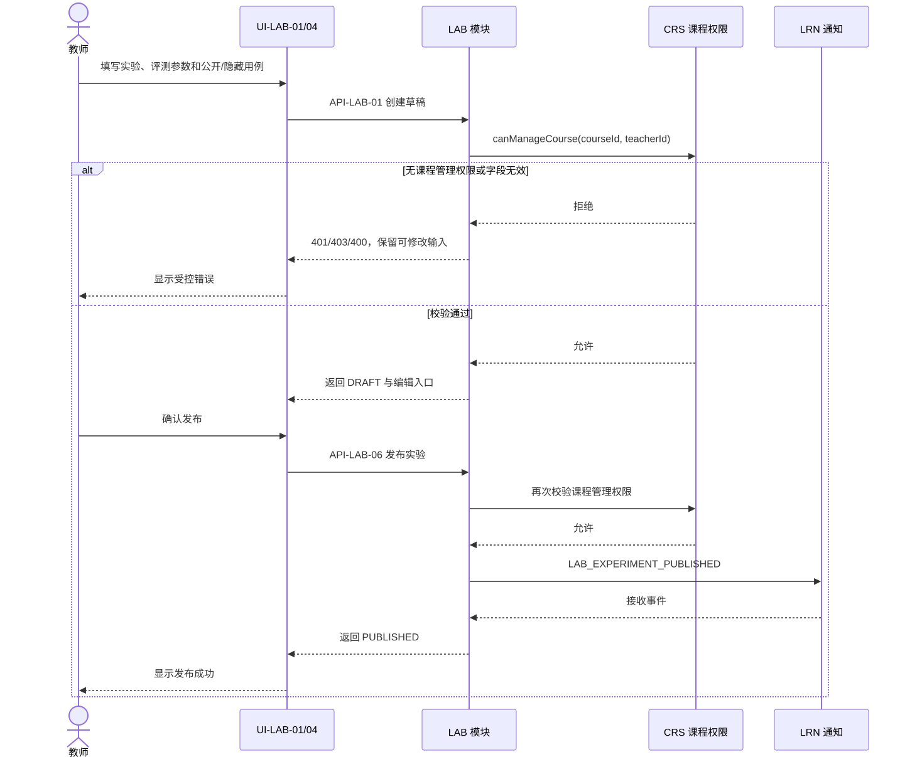

LAB 发布通过 `NotificationEventPublisher` 发送 `LAB_EXPERIMENT_PUBLISHED`，评分和成绩发布分别发送 `LAB_SUBMISSION_SCORED`、`EXPERIMENT_SCORE_PUBLISHED`；LRN 负责通知落库。`LabSourceGradeService` 仅在 `SCORE_PUBLISHED`/`ARCHIVED` 时为 GRD 提供 `SourceGradeDTO`，不共享内部表。Docker 沙箱负责编译、运行、IO 比对和资源隔离，并在每次执行后清理容器和临时文件；真机验收在执行前预拉取评测镜像，避免首次拉取被误归类为评测超时。

---

#### 2.5.5 作业与自动评测（HWK）

**模块概述：** HWK 模块是平台的核心业务模块之一，负责教师布置作业、学生完成并提交作业、系统自动评测（客观题评分和代码评测）、教师批阅重评以及学生查看反馈的完整闭环。HWK 位于课程学习流程之后、成绩评价流程之前，是成绩评价模块的重要数据来源。

##### FR-HWK-01 作业创建与发布（P0）

| 属性 | 描述 |
|------|------|
| 需求编号 | FR-HWK-01 |
| 优先级 | P0（必须实现） |
| 涉及角色 | 教师、助教 |
| 核心功能 | 教师在自己负责的课程下创建作业，填写作业标题、说明、截止时间、提交格式、评分方式和所属课程，可删除仍为 DRAFT 的草稿，并可发布给课程学生。 |
| 设计要点 | ① 作业必须绑定 `course_id`，可选绑定 `chapter_id`，创建、删除草稿和发布前必须校验当前用户是否具备该课程教师或助教权限。 ② 作业支持 OBJECTIVE、TEXT、FILE、CODE 四类运行时类型，不同类型对应不同提交与评分流程。 ③ 作业沿用 DRAFT、NOT_OPEN、PUBLISHED、CLOSED、SCORE_PUBLISHED、ARCHIVED 运行时状态，本期不修改枚举；删除是 `is_deleted` 正交标记，仅允许对 DRAFT 父记录执行原子逻辑删除，题目、测试用例、判题配置、提交、评测、批阅和重评历史全部保留。 ④ 普通更新不得写 `is_deleted`，并须以 `is_deleted=FALSE` 过滤活动记录，防止并发旧请求复活已删除作业。 ⑤ 教师可设置是否允许多次提交、是否允许逾期提交、是否允许学生在成绩发布前查看评测详情。 ⑥ 发布作业后，HWK 向 LRN 发送作业发布事件，由通知模块负责生成站内通知。 |

##### FR-HWK-02 学生作业查看与提交（P0）

| 属性 | 描述 |
|------|------|
| 需求编号 | FR-HWK-02 |
| 优先级 | P0（必须实现） |
| 涉及角色 | 学生 |
| 核心功能 | 学生查看作业说明、附件、截止时间和提交要求，并按作业要求提交文本、附件或代码内容。 |
| 设计要点 | ① 学生只能查看自己已加入课程中已发布的作业，接口层必须根据当前登录用户和课程成员关系进行过滤。 ② 提交前需校验作业是否存在、是否已发布、是否已关闭、是否超过截止时间、当前学生是否属于该课程。 ③ FILE 作业先通过 API-HWK-23 上传单个附件，单请求/单提交均限 1 个、上限 10 MiB；扩展名/MIME/内容签名仅允许 `pdf, zip, docx, xlsx, pptx, txt, md, csv, png, jpg, jpeg`。 ④ 附件以服务端生成 UUID 对外，24 小时内可从 `UPLOADED` 原子绑定为 `BOUND` 或由上传者/清理任务转为 `DELETED`；FILE 提交 `fileIds` 必须恰好 1 个且不得重用。 ⑤ 提交成功后系统返回提交编号、提交时间、提交状态和安全附件摘要，不返回存储键、服务器路径或裸 URL。 |

##### FR-HWK-03 提交历史管理（P0）

| 属性 | 描述 |
|------|------|
| 需求编号 | FR-HWK-03 |
| 优先级 | P0（必须实现） |
| 涉及角色 | 学生、教师、助教 |
| 核心功能 | 在允许多次提交时，系统保存学生的每一次提交记录。学生可查看自己的提交历史，教师可查看课程下每名学生的全部提交版本。 |
| 设计要点 | ① 每次提交均生成独立提交记录，不直接覆盖旧提交。 ② 系统明确标识最新提交和当前有效提交。默认情况下，最后一次有效提交作为最终成绩来源。 ③ 若作业不允许多次提交，学生已有有效提交后再次提交应被拒绝。 ④ 教师端可按作业、学生、提交状态、评测状态、是否逾期等条件筛选提交记录。 ⑤ 提交历史只返回附件原始文件名、可信 MIME、字节数和下载可用性；下载必须通过 API-HWK-24 每次重新鉴权，仅提交者本人或课程管理者可读取确切版本。 |

##### FR-HWK-04 自动评测（P0）

| 属性 | 描述 |
|------|------|
| 需求编号 | FR-HWK-04 |
| 优先级 | P0（必须实现） |
| 涉及角色 | 系统、学生、教师 |
| 核心功能 | 系统对客观题作业和基础代码类作业执行自动评测，生成得分、通过情况、基础错误提示和可追溯评测记录。 |
| 设计要点 | ① 客观题作业根据题目标准答案自动评分，支持单选、多选、判断等基础题型。学生提交答案后可同步或异步计算得分。 ② 代码类作业在提交成功后创建评测记录并异步触发共享评测执行器，完成编译、运行、测试用例比对和得分计算。 ③ 评测结果需区分通过、答案错误、编译错误、运行错误、运行超时、系统错误等状态。 ④ 对基础规模测试用例，自动评测应在 60 秒内返回结果或失败状态；若评测服务异常，提交记录仍需保留。 ⑤ 教师可查看评测状态和结果摘要，学生可根据作业配置查看公开的评测反馈。 |

##### FR-HWK-05 教师批阅与重评（P1）

| 属性 | 描述 |
|------|------|
| 需求编号 | FR-HWK-05 |
| 优先级 | P1（应实现） |
| 涉及角色 | 教师、助教 |
| 核心功能 | 教师查看学生提交内容和自动评测结果，对主观题、文件题或综合作业进行人工评分和评语填写，并可对指定提交发起重评。 |
| 设计要点 | ① 教师批阅页按作业展示学生提交列表，保留学生关键词、提交状态、评测状态和批阅状态筛选，并增加 `attention=EVALUATION_PENDING/REVIEW_PENDING` 两类复合待处理筛选；未传 `attention` 时保持原列表行为。 ② 两类待处理名单只包含 CRS 当前活跃学生、未删除、`is_final=true` 且提交状态为 SUBMITTED/LATE 的有效提交，并采用服务端分页和稳定排序。待评测仅含 OBJECTIVE/CODE 的 NONE/PENDING/RUNNING；待批阅含 UNREVIEWED/NEED_REVIEW，TEXT/FILE 可直接进入，OBJECTIVE/CODE 仅在评测终态后进入。 ③ 自动评测得分、教师人工评分和最终得分分开保存，避免成绩来源不清。 ④ 对需要人工判断的内容，教师可填写 `manual_score` 和 `comment`，并确认 `final_score`。 ⑤ 重评操作仅允许教师或助教触发，重评应生成新的评测记录，不删除旧评测记录。 ⑥ 人工评分、修改分数、重评、成绩发布等关键操作需要记录操作人、操作时间和原因。 |

##### FR-HWK-06 作业反馈与结果展示（P0）

| 属性 | 描述 |
|------|------|
| 需求编号 | FR-HWK-06 |
| 优先级 | P0（必须实现） |
| 涉及角色 | 学生、教师 |
| 核心功能 | 学生查看作业提交状态、评测结果、得分、教师评语和反馈摘要；教师查看作业整体完成情况和学生个体结果。 |
| 设计要点 | ① 学生端展示提交时间、提交状态、评测状态、通过情况、反馈摘要、教师评语和已发布成绩。 ② 若教师尚未发布成绩，学生只能查看被允许公开的评测反馈，不显示未发布最终分数。 ③ 教师端按 CRS 当前活跃学生统计单次作业的总人数、已提交/未提交、可自动评测/已评测/待评测、已批阅/待批阅、已计分数量、平均分、最高分、最低分和生成时间；历史版本、删除记录、REJECTED 和非当前课程学生排除。 ④ 分数分布固定为 `0-59`、`60-69`、`70-79`、`80-89`、`90-100`，按 `effectiveScore = finalScore ?? autoScore` 和 `effectiveScore / totalScore × 100` 归一化后分桶；无分数不入桶，`scoredCount` 等于五档合计。评测完成率使用 `evaluatedCount / autoEvaluableCount`，TEXT/FILE 的 NONE 不计为待评测。 ⑤ 未提交名单由统计接口分页返回，待评测/待批阅名单由提交列表接口的 `attention` 参数分页返回；三者均保持稳定排序和 URL 可恢复。 ⑥ 结果展示需区分自动得分、教师评分和最终得分。 ⑦ 成绩发布后，HWK 向 LRN 发送成绩发布通知事件，并向 GRD 提供成绩数据。 |

HWK 的统计边界是“单次作业、固定五档和三类跟进名单”；课程级、跨作业、自定义区间、趋势和统计快照仍由 GRD 负责。HWK 不创建或维护 GRD 的课程统计快照。

---

#### 2.5.6 成绩评价与教学分析（GRD）

**模块概述：** GRD 模块是平台教学评价闭环的终端模块，负责成绩项配置、成绩汇总与总评计算、教师成绩管理与发布、学生成绩查询、班级成绩统计分析以及成绩异议复核功能。GRD 从 LAB 和 HWK 模块读取评分数据，完成课程级成绩归集和总评计算。

##### FR-GR-01 成绩项配置与计算规则（P0）

| 属性 | 描述 |
|------|------|
| 需求编号 | FR-GR-01 |
| 优先级 | P0（必须实现） |
| 涉及角色 | 教师 |
| 核心功能 | 教师在课程范围内定义成绩项，包括成绩项名称、成绩来源、满分值、权重和是否计入总评；系统按预设权重自动计算课程总评。 |
| 设计要点 | ① 成绩项必须绑定 `course_id`，创建和修改前必须校验当前教师是否负责或被授权管理该课程。 ② 成绩来源使用 `source_type + source_id` 表示，本版本来源包括 LAB、HWK 和课程内其他可计分项目。 ③ 成绩项保存满分值、权重、是否计入总评、显示顺序和启用状态。 ④ 当前 GradeItem 规则修改不接收原因、不检查关联成绩发布状态，也不写入 GradeChangeLog；手动调整已发布 GradeRecord/课程总评及来源同步实际改变已发布 GradeRecord 时才进入既有成绩变更留痕。 ⑤ 权重配置保存时应校验合法性，避免总评计算规则缺失或权重配置不合法。 |

##### FR-GR-02 成绩汇总与总评生成（P0）

| 属性 | 描述 |
|------|------|
| 需求编号 | FR-GR-02 |
| 优先级 | P0（必须实现） |
| 涉及角色 | 系统、教师 |
| 核心功能 | 系统从实验模块、作业与自动评测模块读取已产生的评分结果，按课程、学生和成绩项汇总，生成学生课程成绩记录和课程总评。 |
| 设计要点 | ① 汇总范围以课程成员学生名单为基础，避免遗漏未提交或缺失成绩的学生。 ② 来源成绩进入 GRD 后形成独立成绩记录，记录来源模块、来源任务编号、来源更新时间和同步时间。 ③ 成绩记录区分 `raw_score`、`weighted_score` 和 `final_score`。 ④ 对未提交、未评分、缺失成绩设置明确 `grade_status`，并按课程成绩项规则决定是否参与总评。 ⑤ 当前规则保存不自动重算或推进教学分析来源版本；只有保存后仍启用且计入总评的 LAB/HWK 成绩项会由来源同步刷新 `weighted_score` 和成绩项来源版本。改为停用或不计入总评的项会被同步筛选排除，其 GradeRecord 和成绩项级快照可能保持旧值；同步仍会在同一事务内重算课程总评并推进总评来源版本。 |

##### FR-GR-03 教师成绩管理（P0）

| 属性 | 描述 |
|------|------|
| 需求编号 | FR-GR-03 |
| 优先级 | P0（必须实现） |
| 涉及角色 | 教师 |
| 核心功能 | 教师查看课程成绩总表，按学生、成绩项、状态筛选，查看学生成绩构成明细，并可对课程内单项成绩或总评进行手动调整。 |
| 设计要点 | ① 成绩总表以课程为入口，按学生维度展示各成绩项原始分、加权分、缺失状态、发布状态和总评。 ② 支持按学生关键词、成绩项、成绩状态、发布状态筛选，并对总表查询进行分页。 ③ 成绩明细页展示单名学生的成绩构成、来源任务、教师评语或基础反馈信息。 ④ 手动调整必须填写调整原因，并保存调整前值、调整后值、修改人、修改时间。 ⑤ 已发布成绩被修改后，必须保留变更记录，并向受影响学生追加站内成绩变更通知事件。 |

##### FR-GR-04 成绩发布与状态控制（P0）

| 属性 | 描述 |
|------|------|
| 需求编号 | FR-GR-04 |
| 优先级 | P0（必须实现） |
| 涉及角色 | 教师、学生、系统 |
| 核心功能 | 系统支持未发布和已发布成绩状态。教师确认成绩无误后发布课程成绩，发布后学生方可查看对应成绩结果。 |
| 设计要点 | ① 成绩记录和课程总评均保存发布状态，默认未发布，发布后对对应学生可见。 ② 发布前应检查成绩规则是否存在、是否仍有未评分记录，并向教师展示可发布范围和异常提示。 ③ 首次发布生成发布记录，保存课程编号、发布范围、发布人、发布时间和通知状态。 ④ 相同课程与发布范围的重复请求幂等返回既有 `publishId`，不重复生成发布记录或通知。 ⑤ GRD 在来源事务内登记通知 after-commit 回调；来源事务回滚时不生成通知，提交后由 LRN 独立事务 best-effort 落库。通知写入失败只记录告警，不能反向回滚已提交的发布；当前 `notificationStatus=SENT` 在登记回调前写入，不代表通知实际落库，且尚无持久 outbox/自动重试。 |

##### FR-GR-05 学生成绩查询与结果展示（P0）

| 属性 | 描述 |
|------|------|
| 需求编号 | FR-GR-05 |
| 优先级 | P0（必须实现） |
| 涉及角色 | 学生 |
| 核心功能 | 学生查看本人在课程中的已发布成绩，包括成绩项明细、加权结果和课程总评。 |
| 设计要点 | ① 学生端成绩查询必须以当前登录用户作为 `student_id`，不能由前端传入学生编号决定查询对象。 ② 仅返回已发布成绩；对未发布成绩返回明确提示，不返回未公开分数。 ③ 页面展示成绩项名称、原始分、加权分、课程总评、发布时间和当前发布状态。 ④ 若课程配置为"显示教师评语"，可展示教师评语或与成绩相关的基础反馈信息。 ⑤ 学生不得查看其他学生成绩、全班成绩明细或未授权统计结果。 |

##### FR-GR-06 班级成绩统计与教学分析（P1）

| 属性 | 描述 |
|------|------|
| 需求编号 | FR-GR-06 |
| 优先级 | P1（应实现） |
| 涉及角色 | 教师 |
| 核心功能 | 教师查看课程或单个成绩项的基础统计分析结果，包括均分、最高分、最低分、及格率、完成率、预设分数区间分布。 |
| 设计要点 | ① 统计范围限定在教师负责或被授权课程内。 ② 支持按课程总评或单个成绩项生成统计结果。 ③ 完成率基于课程成员学生名单与有效成绩记录计算，未提交、未评分、缺失成绩需单独统计。 ④ 分数区间采用预设区间配置，本版本不提供复杂自定义分析模型。 ⑤ 统计分析结果记录数据来源时间点，便于追溯统计结果对应的成绩数据版本。 |

##### FR-GR-07 成绩异议与复核申请（P1）

| 属性 | 描述 |
|------|------|
| 需求编号 | FR-GR-07 |
| 优先级 | P1（应实现） |
| 涉及角色 | 学生、教师 |
| 核心功能 | 学生在成绩发布后，对本人课程成绩或单项成绩提交异议申请；教师查看授权课程内申请并进行同意修改、驳回或备注说明。 |
| 设计要点 | ① 学生只能对本人已发布成绩提交异议，不能对未发布成绩、他人成绩或无权限课程成绩提交申请。 ② 异议申请需关联课程、学生、成绩项或总评，并保存申请理由、申请时间、处理状态。 ③ 同一学生对同一课程成绩项或总评存在处理中申请时，不允许重复提交。 ④ 教师处理申请时可选择驳回并填写说明，或同意修改并复用成绩调整与变更留痕机制。 ⑤ 申请提交和处理完成后，GRD 向 LRN 发送复核申请或复核结果通知事件。 |

---

### 2.6 非功能需求

> 本节按模块分别描述各功能模块的非功能需求设计约束。

#### 2.6.1 AUTH 非功能需求

| 需求编号 | 需求描述 | 设计约束 |
|---------|---------|---------|
| NFR-UA-01 | 安全性 | 所有需认证功能必须校验登录态和权限；密码不得明文存储、展示或传输；后端接口必须防止未授权访问、越权访问和参数篡改。 |
| NFR-UA-02 | 可靠性 | 登录、退出、密码修改、角色调整等关键功能应稳定可用；认证服务异常时默认拒绝未授权请求，不允许默认放行。 |
| NFR-UA-03 | 可用性 | 登录、退出、修改密码、无权限、登录失效等流程提示清晰；不同角色登录后看到与身份匹配的功能入口。 |
| NFR-UA-04 | 性能 | 常规登录认证、权限校验和鉴权接口应在 3 秒内响应；权限查询结果采用索引或缓存优化，不阻塞普通页面加载。 |
| NFR-UA-05 | 可测试性 | 能够验证学生、教师、管理员访问边界，覆盖登录成功、失败、会话失效、越权访问、密码修改、角色调整和审计日志记录。 |

#### 2.6.2 CRS 非功能需求

| 需求编号 | 需求描述 | 设计约束 |
|---------|---------|---------|
| NFR-CR-01（可用性） | 课程首页信息组织清晰，核心操作反馈明确 | 课程首页首屏展示简介、章节目录、资源列表和最近任务；创建、编辑、上传、关闭等操作统一返回成功或失败提示。 |
| NFR-CR-02（性能） | 课程列表、课程首页、资源列表的普通查询请求应在 3 秒内返回第一页结果 | 列表接口采用分页查询和数据库索引优化；课程与资源热点数据可在后续扩展 Redis 缓存；静态资源经 Nginx 或文件服务分发。 |
| NFR-CR-03（可靠性） | 资源上传与课程关闭具备一致性保护 | 资源上传失败必须返回错误提示，不允许界面显示成功但文件未保存；课程关闭后历史数据保持只读可见。 |
| NFR-CR-04（兼容性） | 支持常见教学资源格式的基础管理与下载 | 文件类型白名单覆盖 PDF、DOCX、PPT、ZIP、图片和外部链接；文件服务抽象保留本地存储与对象存储替换能力。 |
| NFR-CR-05（可测试性） | 关键课程与资源场景可由测试用例稳定复现 | 课程创建、加入课程、课程关闭、资源上传失败、未加入课程访问资源等场景均需可通过接口与页面测试验证。 |

#### 2.6.3 LRN 非功能需求

| 需求编号 | 需求描述 | 前端设计约束 |
|---------|---------|------------|
| NFR-LN-01（刷新及时性） | 任务状态、学习进度和通知未读数需在本版本交互路径中可及时刷新 | 以数据库落库后的页面加载、手动刷新和可配置轮询为准；通知列表、未读数通过 `GET /api/v1/notifications` 查询刷新，WebSocket/SSE 属于扩展推送机制。 |
| NFR-LN-02（性能） | 学习任务和通知列表在小并发场景下保持流畅 | 学习任务列表首次加载 ≤1.5 秒；通知列表加载 ≤1 秒；批量操作响应 ≤500ms；学习进度保存接口响应 ≤1 秒。 |
| NFR-LN-03（可靠性） | 学习进度和通知状态不因异常退出而丢失 | 学习进度支持断点续传；通知与已读状态以数据库为准；页面异常、关闭或刷新后重新查询接口即可恢复消息状态。 |
| NFR-LN-04（易用性） | 学习中心和通知中心入口清晰，操作路径短 | 学习中心、通知中心入口固定；主要操作路径不超过 2 步；提醒文案简洁明确，并支持基础键盘操作与屏幕阅读适配。 |
| NFR-LN-05（可追踪性） | 学习记录、通知读取记录可追溯到用户与时间 | 每条学习记录、通知读取记录保存用户、时间和来源；进度变更、通知状态变更留痕，便于问题排查与行为回溯。 |

#### 2.6.4 LAB 非功能需求

| 需求编号 | 需求描述 | 设计约束 |
|---------|---------|---------|
| NFR-LAB-01（可靠性） | 实验提交和评测记录不得因页面刷新或服务异常而丢失 | 学生提交成功前必须完成数据库落库；评测任务状态需持久化（NONE/PENDING/RUNNING/ACCEPTED/WRONG_ANSWER/COMPILE_ERROR/RUNTIME_ERROR/TIME_LIMIT_EXCEEDED/SYSTEM_ERROR）；评测失败不影响提交记录本身 |
| NFR-LAB-02（性能） | 代码评测采用异步处理，不阻塞提交接口响应 | 学生提交接口只负责保存提交和创建评测任务，不同步等待评测完成；基础规模代码评测应在 60 秒内返回结果或失败状态 |
| NFR-LAB-03（可追踪性） | 实验从发布到提交、评测、评分的全过程可追踪 | 实验、提交、评测均保存创建时间、更新时间和操作者；每次评测生成独立记录；需求、页面、接口、数据表之间建立编号追踪关系 |
| NFR-LAB-04（安全性） | 学生只能访问自己的提交和结果，评测过程需具备安全隔离 | API 层通过认证上下文获取当前用户身份，不允许前端直接传入 `studentId`；Docker 沙箱限制 CPU 时间、内存和文件访问范围；隐藏测试用例不对学生开放 |
| NFR-LAB-05（可测试性） | 核心流程便于单元测试、接口测试和系统演示 | 自动评测服务设计为可 Mock 的接口，便于测试正常、错误、超时和系统异常场景；逾期提交、重复提交、评测失败等边界条件可通过测试数据复现 |

#### 2.6.5 HWK 非功能需求

| 需求编号 | 需求描述 | 设计约束 |
|---------|---------|---------|
| NFR-HWK-01（可靠性） | 作业提交、评测任务和成绩结果不得因页面刷新或短暂异常而丢失 | 学生提交成功前必须完成数据库落库；代码评测任务状态需持久化，事务后事件仅作首次派发，定时扫描重投 PENDING，应用启动时将旧进程遗留 RUNNING 重置为 PENDING；评测失败不影响提交记录本身；草稿删除采用状态与未删除标记联合条件原子写入，普通更新排除已删除记录，防止并发复活 |
| NFR-HWK-02（性能） | 作业查询和提交操作应保持较快响应，代码评测采用异步处理 | 作业列表、提交列表和三类跟进名单采用服务端分页；单次作业统计由 Repository 使用 SQL 聚合并通过组合索引支持，不加载全部最终提交到应用内存；基础规模代码评测应在 60 秒内返回结果 |
| NFR-HWK-03（可追踪性） | 作业从发布到提交、评测、批阅、发布成绩的全过程应可追踪 | 作业、提交、评测、批阅和成绩发布均保存创建时间、更新时间和操作者；删除父作业后关联题目、测试用例、判题配置、提交、评测、批阅和重评历史仍保留 |
| NFR-HWK-04（安全性） | 学生只能访问自己的提交和结果，评测过程需具备基础隔离 | API 层通过认证上下文获取当前用户身份；统计、待处理名单和草稿删除要求课程管理权限；FILE 附件上传/查询/删除校验当前学生与课程/作业归属，受控下载每次重新校验“提交者本人或课程管理者”；DTO、页面和日志不泄露存储键、物理路径或裸 URL；隐藏测试用例、标准答案不对学生开放 |
| NFR-HWK-05（可测试性） | 本模块核心流程应便于单元测试、接口测试和系统演示测试 | 自动评测服务应设计为可 Mock 的接口；现有 HWK 回归加上 TC-HWK-20 ~ TC-HWK-27 覆盖 FILE 附件生命周期、白名单、所有权、原子绑定/补偿、清理、历史安全视图、受控下载与前端状态；MAN-HWK-012 在 1440×900 与 390×844 的真实浏览器证据必须单独回填，不以自动化结果替代 |

#### 2.6.6 GRD 非功能需求

| 需求编号 | 需求描述 | 设计约束 |
|---------|---------|---------|
| NFR-GR-01（可靠性） | 成绩汇总、计算、发布和统计分析流程必须具有明确状态，避免成绩状态不一致 | 成绩项、成绩记录、发布记录、变更记录分表保存；来源成绩同步和总评计算在事务边界内更新 |
| NFR-GR-02（性能） | 小并发演示环境下成绩查询和统计分析需在规定时间内返回 | 课程成绩总表分页查询在 5 秒内返回；学生个人成绩查询在 3 秒内返回 |
| NFR-GR-03（可追踪性） | 成绩项定义、成绩计算、成绩发布、成绩修改和成绩复核过程均应保留记录 | 成绩记录保存来源模块、来源任务编号；已发布成绩修改必须记录修改前后值和原因 |
| NFR-GR-04（安全性） | 学生只能访问本人已发布成绩，教师只能访问授权课程成绩 | 所有接口均需 Bearer 访问令牌和认证上下文鉴权；学生查询强制使用当前登录用户过滤 |
| NFR-GR-05（可测试性） | 关键功能和异常场景需可稳定复现并映射测试项 | 未发布不可见、规则错误、来源缺失、已发布成绩修改留痕等异常场景可由测试数据构造 |

---

### 2.7 系统总体架构

#### 2.7.1 系统整体架构

本平台采用前后端分离的 B/S 架构，分为表示层、接入层、应用层、服务层、基础设施/数据层五个层次。前端使用 Vue 3 + TypeScript 构建单页面应用（SPA），后端使用 Spring Boot 构建 RESTful API 服务，数据持久化以关系型数据库为核心，部署环境面向 MySQL，开发和测试环境可使用 H2 的 MySQL 兼容模式。Redis 作为缓存扩展点保留。

本节采用 Mermaid graph 表达概要层面的组件视图和模块依赖视图；第 3 章页面流转图采用 Mermaid graph/flowchart 表达活动流程视图。图题按其承担的视图职责命名。

图 2-1 系统整体架构组件视图

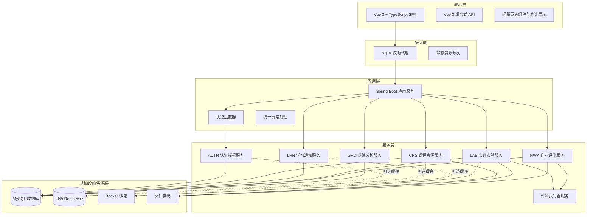
```mermaid
graph TB
    subgraph 表示层
        A[Vue 3 + TypeScript SPA]
        B[Vue 3 组合式 API]
        C[轻量页面组件与统计展示]
    end

    subgraph 接入层
        D[Nginx 反向代理]
        E[静态资源分发]
    end

    subgraph 应用层
        F[Spring Boot 应用服务]
        G[认证拦截器]
        H[统一异常处理]
    end

    subgraph 服务层
        I[AUTH 认证授权服务]
        J[CRS 课程资源服务]
        K[LRN 学习通知服务]
        L[LAB 实训实验服务]
        M[HWK 作业评测服务]
        N[GRD 成绩分析服务]
        O[评测执行器服务]
    end

    subgraph 基础设施/数据层
        P[(MySQL 数据库)]
        Q[(可选 Redis 缓存)]
        R[Docker 沙箱]
        S[文件存储]
    end

    A --> D --> F
    F --> G --> I
    F --> J
    F --> K
    F --> L --> O
    F --> M --> O
    F --> N
    I --> P
    J --> P
    K --> P
    L --> P
    L --> R
    M --> P
    N --> P
    J --> S
    L --> S
    M --> S
    I -.->|可选缓存| Q
    J -.->|可选缓存| Q
    K -.->|可选缓存| Q
```

#### 2.7.2 模块依赖关系

平台六个功能模块之间存在明确的依赖关系和数据流向，AUTH 模块作为基础认证模块被所有业务模块依赖，CRS 模块提供课程和成员基础数据被 HWK、LAB、GRD 模块依赖，LRN 模块作为通知中枢接收其他模块的业务事件。代码评测能力抽象为独立 EVAL/评测执行器基础设施，LAB 与 HWK 均依赖该能力，二者不形成直接业务依赖。

图 2-2 模块依赖视图

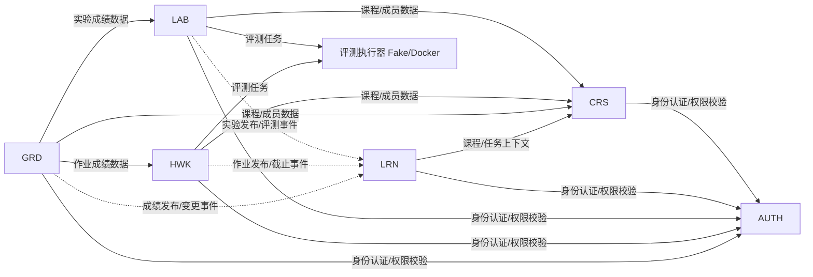
```mermaid
graph LR
    CRS -->|身份认证/权限校验| AUTH
    LRN -->|身份认证/权限校验| AUTH
    LAB -->|身份认证/权限校验| AUTH
    HWK -->|身份认证/权限校验| AUTH
    GRD -->|身份认证/权限校验| AUTH

    LAB -->|课程/成员数据| CRS
    HWK -->|课程/成员数据| CRS
    GRD -->|课程/成员数据| CRS
    LRN -->|课程/任务上下文| CRS

    GRD -->|实验成绩数据| LAB
    LAB -.->|实验发布/评测事件| LRN

    GRD -->|作业成绩数据| HWK
    HWK -.->|作业发布/截止事件| LRN

    GRD -.->|成绩发布/变更事件| LRN

    LAB -->|评测任务| EVAL[评测执行器 Fake/Docker]
    HWK -->|评测任务| EVAL
```

**模块间数据依赖说明：**

| 依赖方 | 被依赖方 | 依赖内容 | 交互方式 |
|-------|---------|---------|---------|
| CRS, LRN, LAB, HWK, GRD | AUTH | 用户身份、角色、权限校验 | Bearer 访问令牌 + 认证上下文 |
| LAB, HWK, GRD | CRS | 课程信息、章节、成员关系、权限校验 | RESTful API 调用 |
| LRN | CRS, LAB, HWK, GRD | 业务事件通知（发布/截止/成绩等） | 业务事件或内部服务调用生成站内通知并落库 |
| GRD | LAB, HWK | 来源成绩数据（实验/作业评分） | RESTful API 调用 |
| LAB, HWK | EVAL 评测执行器 | 代码编译、运行、测试用例比对和评测状态回写 | 应用内异步执行器或任务队列抽象 + 状态查询 |

#### 2.7.3 技术架构要点

**后端分层架构（MVC）：**
- Controller 层：接收 HTTP 请求，参数校验，调用 Service 层，返回统一响应格式
- Service 层：核心业务逻辑，事务管理，模块间调用
- Repository/Mapper 层：数据访问，当前以 Spring JDBC/Repository 为主，保留 Mapper 抽象边界
- 统一异常处理器：全局捕获和处理业务异常

**前端分层架构（MVVM）：**
- View 层：Vue 3 单文件组件与统一应用外框
- ViewModel 层：Vue 3 组合式 API、轻量页面状态和本地存储辅助
- Model 层：TypeScript 类型定义、模块 API wrapper 和统一 HTTP 调用
- 路由守卫：基于权限的页面访问控制

**通信与缓存策略：**
- 前后端通信：HTTP/HTTPS + RESTful API + JSON
- 站内消息：本版本使用数据库通知表落库，前端通过页面加载、手动刷新或可配置轮询查询通知列表与未读数；WebSocket/SSE 推送仅作为后续扩展
- 缓存策略：本版本以数据库查询、分页和必要的本地状态为主；Redis 可作为后续热点数据和未读通知数缓存扩展
- 异步处理：代码评测采用应用内异步执行器或任务队列抽象执行

**数据所有权与信息隐藏：**
- AUTH 拥有用户、角色、权限、会话和审计日志数据；其他模块只通过认证上下文或授权接口获取当前用户身份，不直接修改 AUTH 数据。
- CRS 拥有课程、章节、资源、课程成员和公告数据；LAB、HWK、GRD 只保存 `course_id`、`chapter_id`、`user_id` 等逻辑引用，通过 CRS 接口校验课程成员关系和课程权限。
- LAB 与 HWK 分别拥有实验、作业、提交、评测和评分数据，二者不直接访问对方业务表；共享评测能力抽象为独立评测执行器基础设施。
- GRD 拥有成绩项、成绩记录、总评、发布记录、变更记录、异议申请和统计快照数据；来源成绩通过 LAB/HWK 的接口或事件同步形成快照。
- 数据库设计中出现的跨模块编号均表示逻辑引用。详细设计阶段可在同库部署中增加物理外键，但不得以物理外键替代模块 API、事件和权限校验契约。

#### 2.7.4 组件交互顺序图

图 2-3 组件交互顺序图

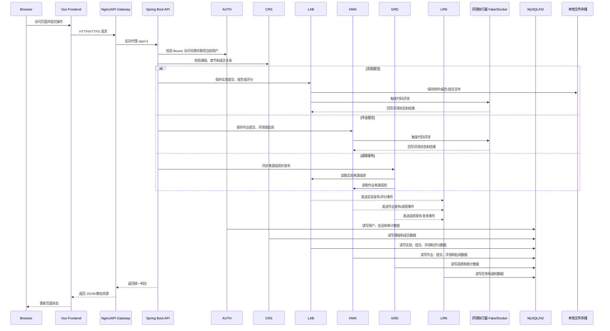
```mermaid
sequenceDiagram
    participant Browser as Browser
    participant Frontend as Vue Frontend
    participant Gateway as Nginx/API Gateway
    participant API as Spring Boot API
    participant AUTH as AUTH
    participant CRS as CRS
    participant LAB as LAB
    participant HWK as HWK
    participant GRD as GRD
    participant LRN as LRN
    participant Eval as 评测执行器 Fake/Docker
    participant DB as MySQL/H2
    participant File as 本地文件存储

    Browser->>Frontend: 访问页面并提交操作
    Frontend->>Gateway: HTTP/HTTPS 请求
    Gateway->>API: 反向代理 /api/v1
    API->>AUTH: 校验 Bearer 访问令牌并取得当前用户
    API->>CRS: 校验课程、章节和成员关系
    alt 实验提交
        API->>LAB: 保存实验提交、报告或评分
        LAB->>File: 保存附件/报告/提交文件
        LAB->>Eval: 触发代码评测
        Eval-->>LAB: 回写评测状态和结果
    else 作业提交
        API->>HWK: 保存作业提交、评测或批阅
        HWK->>Eval: 触发代码评测
        Eval-->>HWK: 回写评测状态和结果
    else 成绩发布
        API->>GRD: 同步来源成绩并发布
        GRD->>LAB: 读取实验来源成绩
        GRD->>HWK: 读取作业来源成绩
    end
    LAB-->>LRN: 发送实验发布/评分事件
    HWK-->>LRN: 发送作业发布/成绩事件
    GRD-->>LRN: 发送成绩发布/复核事件
    AUTH->>DB: 读写用户、会话和审计数据
    CRS->>DB: 读写课程和成员数据
    LAB->>DB: 读写实验、提交、评测和评分数据
    HWK->>DB: 读写作业、提交、评测和批阅数据
    GRD->>DB: 读写成绩和统计数据
    LRN->>DB: 读写任务和通知数据
    API-->>Gateway: 返回统一响应
    Gateway-->>Frontend: 返回 JSON/静态资源
    Frontend-->>Browser: 更新页面状态
```

#### 2.7.5 模块级数据关系视图

概要设计阶段的数据视图强调模块数据所有权、主业务实体和跨模块逻辑引用。AUTH 维护用户身份，CRS 维护课程和成员，LAB/HWK 维护任务、提交和评测，GRD 维护成绩归集与发布结果，LRN 维护任务快照和通知状态。业务表之间可在同库部署中使用外键或索引优化，但跨模块访问仍以认证上下文、课程成员校验、来源成绩 DTO 和业务事件为主。

图 2-4 模块级数据关系视图

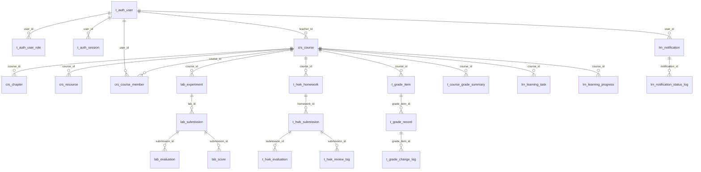
```mermaid
erDiagram
    t_auth_user ||--o{ t_auth_user_role : user_id
    t_auth_user ||--o{ t_auth_session : user_id

    t_auth_user ||--o{ crs_course : teacher_id
    crs_course ||--o{ crs_chapter : course_id
    crs_course ||--o{ crs_resource : course_id
    crs_course ||--o{ crs_course_member : course_id
    t_auth_user ||--o{ crs_course_member : user_id

    crs_course ||--o{ lab_experiment : course_id
    lab_experiment ||--o{ lab_submission : lab_id
    lab_submission ||--o{ lab_evaluation : submission_id
    lab_submission ||--o{ lab_score : submission_id

    crs_course ||--o{ t_hwk_homework : course_id
    t_hwk_homework ||--o{ t_hwk_submission : homework_id
    t_hwk_submission ||--o{ t_hwk_evaluation : submission_id
    t_hwk_submission ||--o{ t_hwk_review_log : submission_id

    crs_course ||--o{ t_grade_item : course_id
    t_grade_item ||--o{ t_grade_record : grade_item_id
    crs_course ||--o{ t_course_grade_summary : course_id
    t_grade_record ||--o{ t_grade_change_log : grade_item_id

    crs_course ||--o{ lrn_learning_task : course_id
    crs_course ||--o{ lrn_learning_progress : course_id
    t_auth_user ||--o{ lrn_notification : user_id
    lrn_notification ||--o{ lrn_notification_status_log : notification_id
```

**数据视图说明：**

| 数据域 | 主数据表 | 被引用方式 | 设计约束 |
| --- | --- | --- | --- |
| 用户与权限 | DB-AUTH-01 ~ DB-AUTH-07 | 其他模块通过当前用户上下文引用 `user_id` | 业务接口不得信任前端传入的操作者编号 |
| 课程与成员 | DB-CRS-01 ~ DB-CRS-05 | LAB/HWK/GRD/LRN 通过 `course_id`、`chapter_id`、`user_id` 逻辑引用 | 课程成员和课程管理权限由 CRS 统一校验 |
| 实验与作业 | DB-LAB-01 ~ DB-LAB-09、DB-HWK-01 ~ DB-HWK-08 | GRD 通过来源成绩 DTO 读取已发布成绩 | LAB/HWK 不直接写 GRD 成绩表；DB-LAB-09 仅归 LAB 源文件资产所有权使用，DB-HWK-08 仅归 HWK FILE 提交附件所有权使用 |
| 成绩与通知 | DB-GRD-01 ~ DB-GRD-09、DB-LRN-01 ~ DB-LRN-07 | LRN 通过业务事件生成通知，GRD 通过来源成绩同步形成快照 | 已发布成绩、通知状态、统计快照和来源版本必须可追溯 |

#### 2.7.6 CRS 业务场景组件级图组

本节按需求规格说明书 4.18 的场景清单（CRS-SC-01 ~ CRS-SC-09）为 CRS 模块补充组件级图组。组件图以 Browser、Vue 前端组件、Nginx/API 网关、Spring Boot API、CRS 各业务组件、文件存储组件、LRN 组件与 MySQL 数据库为参与者，只描述组件之间的协作与状态流向，不展开类级内部实现；对象级图组在详细设计说明书 3.2 中给出。

每个业务场景在此处提供 1 张组件级顺序图（对含明确状态或分支的场景辅以状态/活动语义说明），图号与场景对应关系如下，图源归档于 `docs/diagrams/arch/`：

| 场景编号 | 场景名称 | 图号 | 组件级视图 | 图源 |
| --- | --- | --- | --- | --- |
| CRS-SC-01 | 课程创建与维护 | 图 2-6 | 课程管理组件顺序图 | `docs/diagrams/arch/fig_2_6_crs_sc01_course_maintain_component.mmd` |
| CRS-SC-02 | 章节目录管理 | 图 2-7 | 章节管理组件顺序图 | `docs/diagrams/arch/fig_2_7_crs_sc02_chapter_component.mmd` |
| CRS-SC-03 | 资源上传与下载 | 图 2-8 | 资源管理组件顺序图 | `docs/diagrams/arch/fig_2_8_crs_sc03_resource_component.mmd` |
| CRS-SC-04 | 公开加入课程 | 图 2-9 | 公开加入组件顺序图 | `docs/diagrams/arch/fig_2_9_crs_sc04_public_join_component.mmd` |
| CRS-SC-05 | 邀请码加入课程 | 图 2-10 | 邀请码加入组件顺序图 | `docs/diagrams/arch/fig_2_10_crs_sc05_invite_join_component.mmd` |
| CRS-SC-06 | 审批加入课程 | 图 2-11 | 审批加入组件顺序图 | `docs/diagrams/arch/fig_2_11_crs_sc06_review_join_component.mmd` |
| CRS-SC-07 | 成员管理 | 图 2-12 | 成员管理组件顺序图 | `docs/diagrams/arch/fig_2_12_crs_sc07_member_component.mmd` |
| CRS-SC-08 | 公告发布与置顶 | 图 2-13 | 公告管理组件顺序图 | `docs/diagrams/arch/fig_2_13_crs_sc08_announcement_component.mmd` |
| CRS-SC-09 | 课程首页摘要 | 图 2-14 | 首页摘要组件顺序图 | `docs/diagrams/arch/fig_2_14_crs_sc09_home_summary_component.mmd` |

##### 2.7.6.1 CRS-SC-01 课程创建与维护（图 2-6）

教师通过课程管理页提交课程表单，请求经网关进入 Spring Boot API，由 CRS 课程组件完成课程记录与负责人成员关系的写入；前端根据返回结果刷新课程列表或详情。

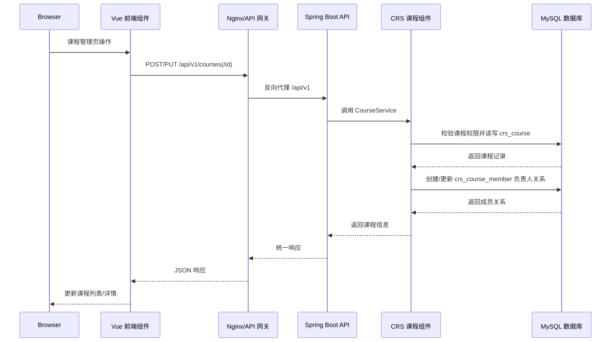

图 2-6 课程创建与维护组件顺序图

##### 2.7.6.2 CRS-SC-02 章节目录管理（图 2-7）

教师维护章节时由 CRS 章节组件校验课程管理权限并读写章节表，学生读取时由 CRS 校验成员关系后返回只读章节树。

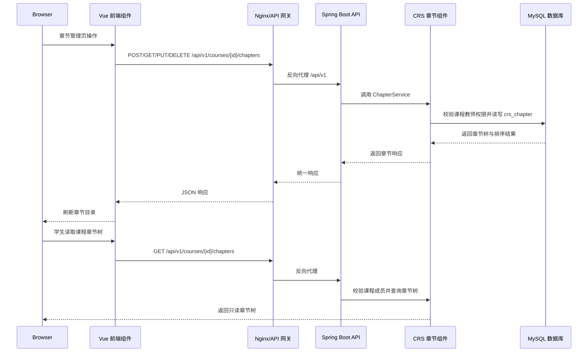

图 2-7 章节目录管理组件顺序图

##### 2.7.6.3 CRS-SC-03 资源上传与下载（图 2-8）

上传链路中 CRS 资源组件先校验文件边界再调用文件存储组件保存文件，随后写入资源元数据；下载链路按成员关系与可见范围校验后从文件存储组件返回受控内容。

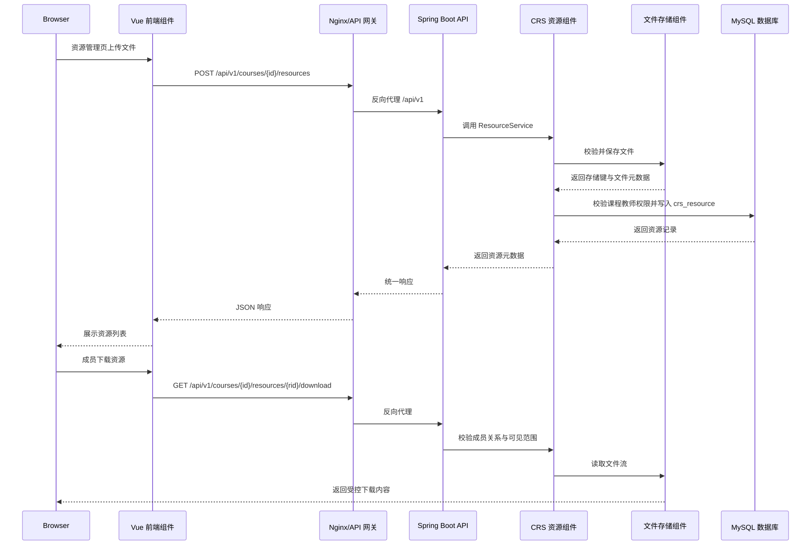

图 2-8 资源上传与下载组件顺序图

##### 2.7.6.4 CRS-SC-04 公开加入课程（图 2-9）

学生加入公开课时，CRS 成员组件校验课程状态、容量与重复加入后创建 ACTIVE 成员，前端随即开放课程主页、资源与任务入口。

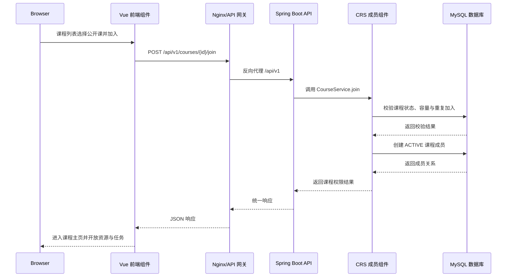

图 2-9 公开加入课程组件顺序图

##### 2.7.6.5 CRS-SC-05 邀请码加入课程（图 2-10）

邀请码模式在创建成员前先按课程配置校验邀请码；匹配后继续容量与重复加入校验，不匹配时直接返回 INVALID_INVITE_CODE。

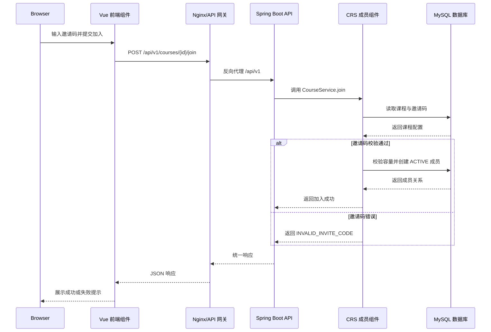

图 2-10 邀请码加入课程组件顺序图

##### 2.7.6.6 CRS-SC-06 审批加入课程（图 2-11）

学生申请创建 PENDING 成员；教师审批时 CRS 成员组件校验状态流转并置为 ACTIVE/REJECTED，审批通过后向 LRN 发送审批结果通知事件，学生权限随成员状态实时变化。

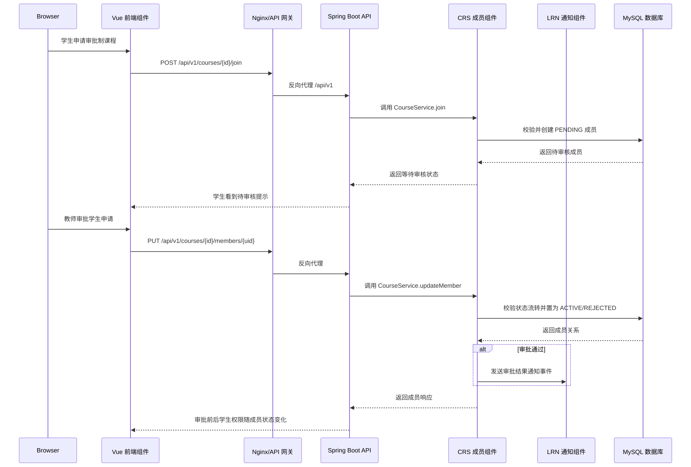

图 2-11 审批加入课程组件顺序图

##### 2.7.6.7 CRS-SC-07 成员管理（图 2-12）

成员查询与名单读取由 CRS 成员组件完成；角色调整与移除在最后教师限制和状态流转校验通过后更新成员关系，前端刷新名单与权限。

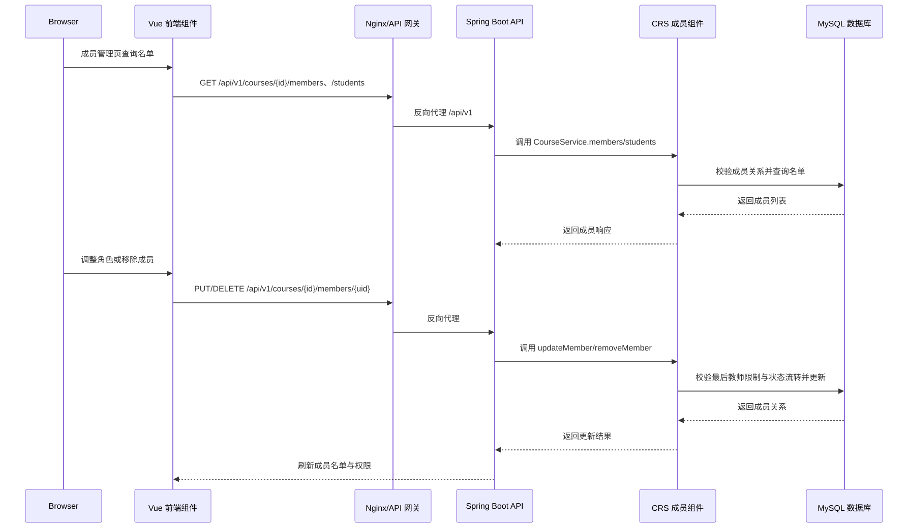

图 2-12 成员管理组件顺序图

##### 2.7.6.8 CRS-SC-08 公告发布与置顶（图 2-13）

公告组件写入公告记录后向 LRN 发布 CRS_ANNOUNCEMENT 通知事件；学生查询公告时由 CRS 返回置顶优先列表。

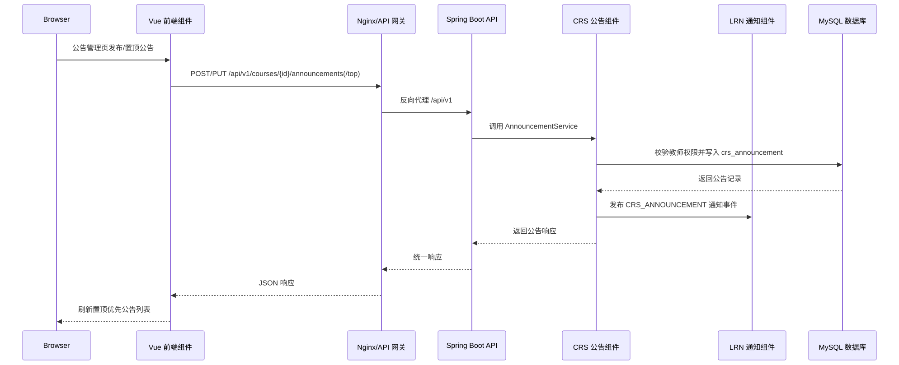

图 2-13 公告发布与置顶组件顺序图

##### 2.7.6.9 CRS-SC-09 课程首页摘要（图 2-14）

课程首页摘要由 CRS 校验成员关系后聚合课程信息与置顶公告，并向 LRN 任务组件查询最近任务，最终返回课程首页摘要给前端展示。

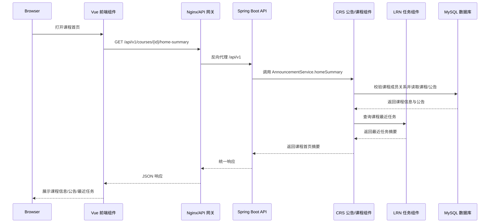

图 2-14 课程首页摘要组件顺序图

### 2.8 部署视图（部署图）

本版本部署视图以课程项目演示和本地 DEV/FAT 验证环境为基准，采用前后端分离的单体后端部署方式。Redis、CI/CD 流水线、独立消息中间件和生产级多节点高可用部署均为后续扩展，不在本文档中作为当前已采用能力承诺。

图 2-5 部署图

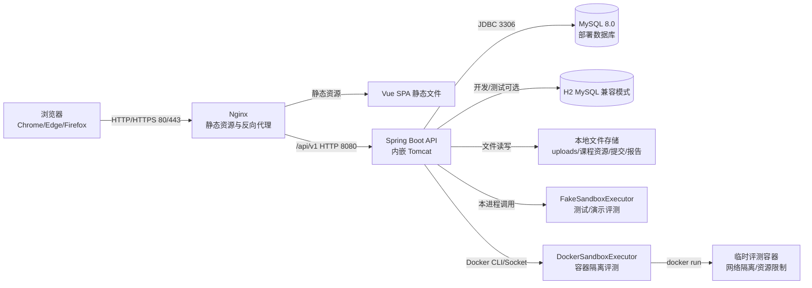
```mermaid
graph LR
    Browser[浏览器<br/>Chrome/Edge/Firefox] -->|HTTP/HTTPS 80/443| Nginx[Nginx<br/>静态资源与反向代理]
    Nginx -->|静态资源| Frontend[Vue SPA 静态文件]
    Nginx -->|/api/v1 HTTP 8080| Backend[Spring Boot API<br/>内嵌 Tomcat]
    Backend -->|JDBC 3306| MySQL[(MySQL 8.0<br/>部署数据库)]
    Backend -->|开发/测试可选| H2[(H2 MySQL 兼容模式)]
    Backend -->|文件读写| Storage[本地文件存储<br/>uploads/课程资源/提交/报告]
    Backend -->|本进程调用| FakeEval[FakeSandboxExecutor<br/>测试/演示评测]
    Backend -->|Docker CLI/Socket| DockerEval[DockerSandboxExecutor<br/>容器隔离评测]
    DockerEval -->|docker run| Container[临时评测容器<br/>网络隔离/资源限制]
```

| 节点 | 主要职责 | 通信关系 |
|------|---------|---------|
| 浏览器 | 访问 Vue 页面并发起业务操作 | 通过 HTTP/HTTPS 访问 Nginx |
| Nginx | 分发前端静态文件，反向代理 `/api/v1` 请求 | 转发到 Spring Boot 8080 |
| Spring Boot API | 承载 AUTH/CRS/LRN/LAB/HWK/GRD 模块和统一响应 | 访问数据库、本地文件存储和评测执行器 |
| MySQL | 部署环境关系型持久化 | Spring Boot 通过 JDBC 访问，默认端口 3306 |
| H2 | 开发/测试环境兼容数据库 | 用于本地验证，不用于生产部署 |
| 本地文件存储 | 保存课程资源、实验/作业附件、提交文件和报告文件 | Spring Boot 通过本地文件路径读写 |
| Fake/Docker 评测执行器 | 执行或模拟代码评测 | Fake 用于测试/演示，Docker 用于容器隔离评测 |

---

## 3 系统接口设计

### 3.1 用户接口（页面设计）

> 本节按模块分别描述各模块的用户页面设计，包括页面列表、页面流转图和交互要点。

#### 3.1.1 AUTH 模块页面

| 页面编号 | 页面 | 使用角色 | 主要功能 | 权限要求 | 对应接口 |
|------|------|---------|---------|---------|---------|
| UI-AUTH-01 | 登录页面 | 未登录用户 | 输入账号密码、提交登录、展示登录失败提示 | 无需登录 | API-AUTH-01 |
| UI-AUTH-02 | 注册页面 | 未登录用户、管理员 | 用户自助注册或管理员创建账号入口 | 自助注册无需登录；管理员创建需管理员权限 | API-AUTH-02、API-AUTH-09 |
| UI-AUTH-03 | 个人资料页面 | 学生、教师、管理员 | 查看和修改昵称、联系方式、头像等个人基础信息 | 当前用户已登录 | API-AUTH-05、API-AUTH-06 |
| UI-AUTH-04 | 修改密码页面 | 学生、教师、管理员 | 输入原密码和新密码，完成密码修改 | 当前用户已登录 | API-AUTH-07 |
| UI-AUTH-05 | 用户管理页面 | 管理员 | 查询用户、启用禁用账号、维护用户基础信息 | 管理员权限 | API-AUTH-08、API-AUTH-09、API-AUTH-10 |
| UI-AUTH-06 | 角色管理页面 | 管理员 | 查看角色列表、角色说明和启用状态 | 管理员权限 | API-AUTH-11、API-AUTH-12 |
| UI-AUTH-07 | 权限分配页面 | 管理员 | 为角色配置菜单权限、接口权限和资源权限 | 管理员权限 | API-AUTH-13、API-AUTH-14 |
| UI-AUTH-08 | 用户角色分配页面 | 管理员 | 为指定用户分配或调整角色 | 管理员权限 | API-AUTH-15 |
| UI-AUTH-09 | 安全审计日志页面 | 管理员 | 按时间、用户、操作类型、结果状态查询审计日志 | 管理员权限 | API-AUTH-17 |
| UI-AUTH-10 | 无权限提示页面 | 已登录用户 | 展示无权限访问提示和返回入口 | 当前用户已登录 | API-AUTH-16 或业务接口 403 |
| UI-AUTH-11 | 登录失效提示页面 | 登录失效用户 | 提示会话过期并引导重新登录 | 无有效登录态 | API-AUTH-04 返回未认证 |

图 3-1 AUTH 页面流转图

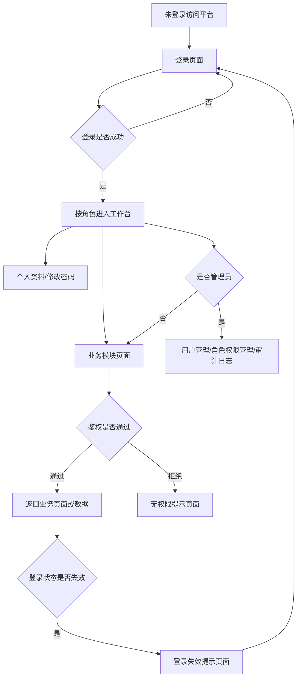
```mermaid
flowchart TD
    A[未登录访问平台] --> B[登录页面]
    B --> C{登录是否成功}
    C -->|否| B
    C -->|是| D[按角色进入工作台]
    D --> E[个人资料/修改密码]
    D --> F[业务模块页面]
    D --> G{是否管理员}
    G -->|是| H[用户管理/角色权限管理/审计日志]
    G -->|否| F
    F --> I{鉴权是否通过}
    I -->|通过| J[返回业务页面或数据]
    I -->|拒绝| K[无权限提示页面]
    J --> L{登录状态是否失效}
    L -->|是| M[登录失效提示页面]
    M --> B
```

#### 3.1.2 CRS 模块页面

| 页面编号 | 页面名称 | 功能描述 | 对应需求 |
|---------|---------|---------|---------|
| UI-CRS-01 | 课程列表页 | 展示用户可访问课程列表，支持搜索、分页、我的课程入口和学生加入课程入口 | FR-CR-01、FR-CR-04 |
| UI-CRS-02 | 课程详情页 | 展示课程简介、教师信息、章节目录、课程公告、资源入口、成员入口和最近任务摘要 | FR-CR-01/02/03/06 |
| UI-CRS-03 | 章节管理页 | 管理课程章节结构，支持新增、删除、排序、隐藏章节 | FR-CR-02 |
| UI-CRS-04 | 资源管理页 | 上传和管理教学资源，支持分类、下载、更新、删除和权限控制 | FR-CR-03 |
| UI-CRS-05 | 成员管理页 | 教师查看课程成员、审批申请、管理助教/学生身份、移除异常成员 | FR-CR-05 |
| UI-CRS-06 | 公告管理页 | 教师发布、编辑、置顶和删除课程公告，学生在课程详情中查看公告摘要 | FR-CR-06 |
| UI-CRS-07 | 课程管理页 | 教师创建、编辑、删除或归档课程，维护发布状态和选课方式等基础信息 | FR-CR-01 |

图 3-2 CRS 页面流转图

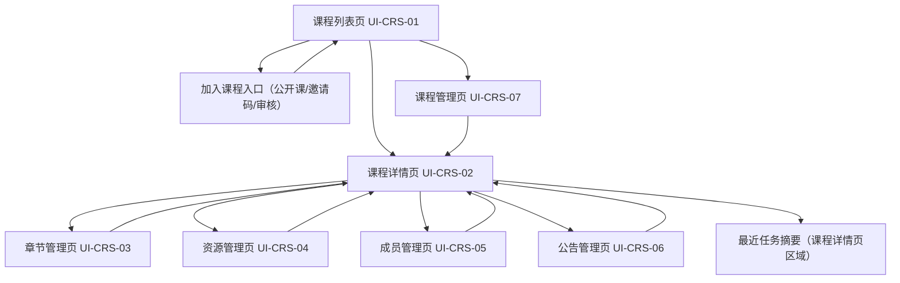
```mermaid
graph TD
    A[课程列表页 UI-CRS-01] --> B[课程详情页 UI-CRS-02]
    A --> C[加入课程入口（公开课/邀请码/审核）]
    A --> H[课程管理页 UI-CRS-07]
    B --> D[章节管理页 UI-CRS-03]
    B --> E[资源管理页 UI-CRS-04]
    B --> F[成员管理页 UI-CRS-05]
    B --> G[公告管理页 UI-CRS-06]
    B --> I[最近任务摘要（课程详情页区域）]
    C --> A
    D --> B
    E --> B
    F --> B
    G --> B
    H --> B
```

#### 3.1.3 LRN 模块页面

| 页面编号 | 页面名称 | 功能描述 | 对应需求 |
|---------|---------|---------|---------|
| UI-LRN-01 | 学习任务中心页 | 展示课程资源、实验、作业三类任务，支持状态筛选、排序和跳转 | FR-LN-01 |
| UI-LRN-02 | 学习进度页 | 展示课程级、章节级学习进度和上次学习位置 | FR-LN-02 |
| UI-LRN-03 | 学习行为仪表盘 | 展示近 7 天学习趋势、完成任务数和行为统计 | FR-LN-03 |
| UI-LRN-04 | 消息通知中心页 | 查看分类通知、未读过滤、批量已读、删除和跳转 | FR-LN-04/05 |
| UI-LRN-05 | 提醒规则设置页 | 设置非必要通知开关和任务截止提醒偏好 | FR-LN-06 |

图 3-3 LRN 页面流转图

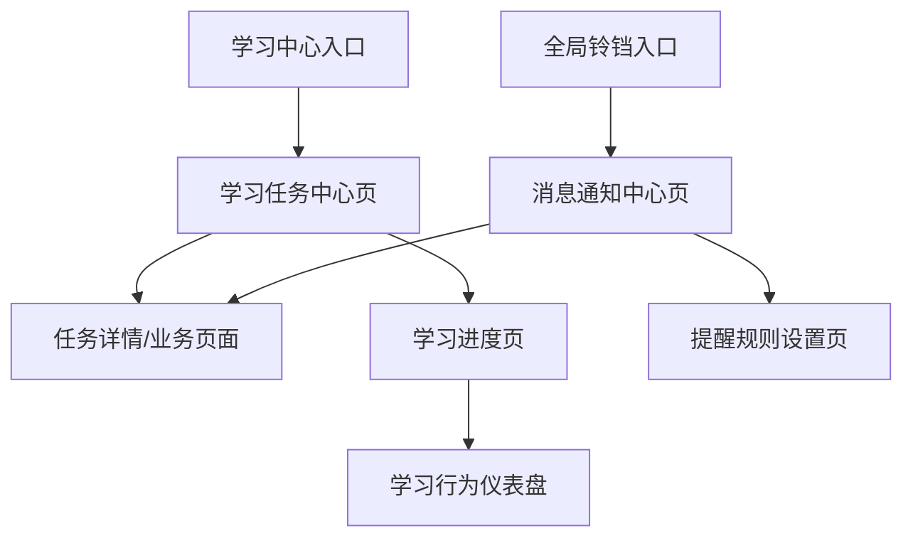
```mermaid
graph TD
    A[学习中心入口] --> B[学习任务中心页]
    B --> C[任务详情/业务页面]
    B --> D[学习进度页]
    D --> E[学习行为仪表盘]
    F[全局铃铛入口] --> G[消息通知中心页]
    G --> H[提醒规则设置页]
    G --> C
```

#### 3.1.4 LAB 模块页面

| 页面编号 | 页面名称 | 使用角色 | 功能描述 | 对应需求 |
|---------|---------|---------|---------|---------|
| UI-LAB-01 | 实验列表页 | 学生、教师 | 按课程查看实验任务列表，支持按状态筛选并进入详情 | FR-LAB-01/02 |
| UI-LAB-02 | 学生实验详情页 | 学生 | 查看实验要求、附件、截止时间、提交入口、报告入口和已公开反馈 | FR-LAB-02/04/05/07 |
| UI-LAB-03 | 教师实验详情页 | 教师、助教 | 查看实验配置、提交情况、测试用例、评分入口和管理操作 | FR-LAB-01/06/08 |
| UI-LAB-04 | 实验发布/编辑页 | 教师、助教 | 创建或编辑实验任务，维护说明、截止时间、附件、评分方式和测试用例配置 | FR-LAB-01 |
| UI-LAB-05 | 提交历史页 | 学生、教师 | 学生查看本人提交版本；教师查看全班提交版本并标识有效评分版本 | FR-LAB-03 |
| UI-LAB-06 | 提交批阅/评分页 | 教师、助教 | 查看提交内容、安全源文件元数据、自动评测结果和实验报告；“下载源文件”与“下载实验报告”为两个独立入口；处理下载中、失败重试、401/403、旧数据兼容状态并完成评分留痕 | FR-LAB-03/06 |
| UI-LAB-07 | 实验结果页 | 学生、教师 | 展示最终成绩、教师评语、报告评分、评测通过率和可公开测试用例反馈 | FR-LAB-04/07 |
| UI-LAB-08 | 实验统计页 | 教师、助教 | 查看提交率、未提交名单、评测完成率、平均分和分数段分布 | FR-LAB-08 |

图 3-4 LAB 页面流转图

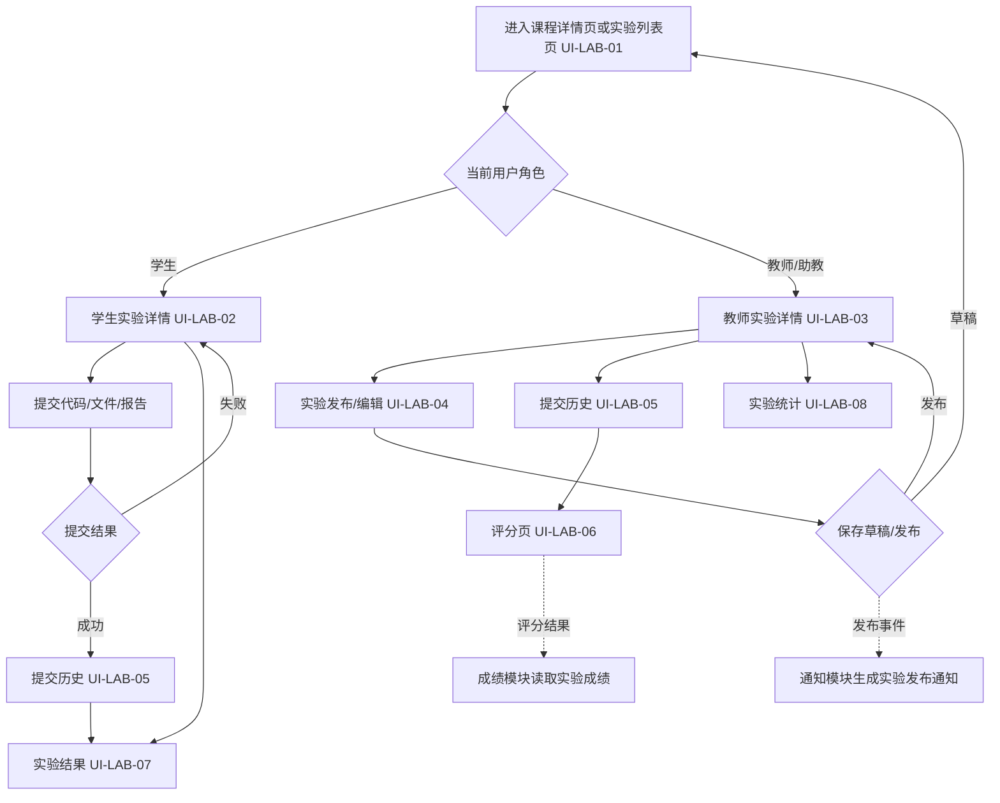
```mermaid
graph TD
    A[进入课程详情页或实验列表页 UI-LAB-01] --> B{当前用户角色}
    B -->|学生| S1[学生实验详情 UI-LAB-02]
    S1 --> S2[提交代码/文件/报告]
    S2 --> S3{提交结果}
    S3 -->|成功| S4[提交历史 UI-LAB-05]
    S3 -->|失败| S1
    S4 --> S5[实验结果 UI-LAB-07]
    S1 --> S5
    B -->|教师/助教| T1[教师实验详情 UI-LAB-03]
    T1 --> T2[实验发布/编辑 UI-LAB-04]
    T2 --> T3{保存草稿/发布}
    T3 -->|草稿| A
    T3 -->|发布| T1
    T1 --> T4[提交历史 UI-LAB-05]
    T4 --> T5[评分页 UI-LAB-06]
    T1 --> T6[实验统计 UI-LAB-08]
    T3 -.->|发布事件| N1[通知模块生成实验发布通知]
    T5 -.->|评分结果| G1[成绩模块读取实验成绩]
```

#### 3.1.5 HWK 模块页面

| 页面编号 | 页面名称 | 使用角色 | 功能描述 | 对应需求 |
|---------|---------|---------|---------|---------|
| UI-HWK-01 | 作业中心页 | 学生、教师 | 学生查看待完成、已提交、已截止作业；教师查看自己发布或草稿状态的作业，并仅对 DRAFT 展示确认式“删除草稿”入口；失败保留原行，成功刷新并在末页为空时回退 | FR-HWK-01/02/06 |
| UI-HWK-02 | 教师作业创建/编辑页 | 教师、助教 | 填写作业标题、说明、课程、章节、截止时间、作业类型、满分、提交限制和评测配置 | FR-HWK-01 |
| UI-HWK-03 | 作业发布管理页 | 教师、助教 | 查看作业状态、发布信息、提交配置、测试用例配置和发布/关闭操作 | FR-HWK-01 |
| UI-HWK-04 | 学生作业详情页 | 学生 | 查看作业说明、附件、截止时间、提交要求和当前提交状态 | FR-HWK-02/03 |
| UI-HWK-05 | 学生作业提交页 | 学生 | 根据作业类型提交客观题答案、文本答案、代码，或选择单附件后完成上传→可重试/移除→提交绑定；路由切换隔离待上传 `File` 对象 | FR-HWK-02/04 |
| UI-HWK-06 | 提交历史页 | 学生、教师 | 学生查看个人历史提交；教师查看全班或指定学生的提交版本；附件仅展示安全摘要并走受控下载 | FR-HWK-03 |
| UI-HWK-07 | 评测结果页 | 学生、教师 | 展示评测状态、得分、通过用例数、错误类型、反馈摘要和可公开日志 | FR-HWK-04/06 |
| UI-HWK-08 | 教师批阅页 | 教师、助教 | 教师查看提交内容和评测结果，通过重鉴权的 API-HWK-24 下载 FILE 附件，填写人工分数和评语，触发重评 | FR-HWK-05 |
| UI-HWK-09 | 作业统计页 | 教师、助教 | 查看提交率、评测/批阅进度、固定五档归一化分布和生成时间；通过未提交、待评测、待批阅三个服务端分页 Tab 跟进，筛选和页码可由 URL 恢复；姓名失败不展示裸 ID | FR-HWK-05/06 |

图 3-5 HWK 页面流转图

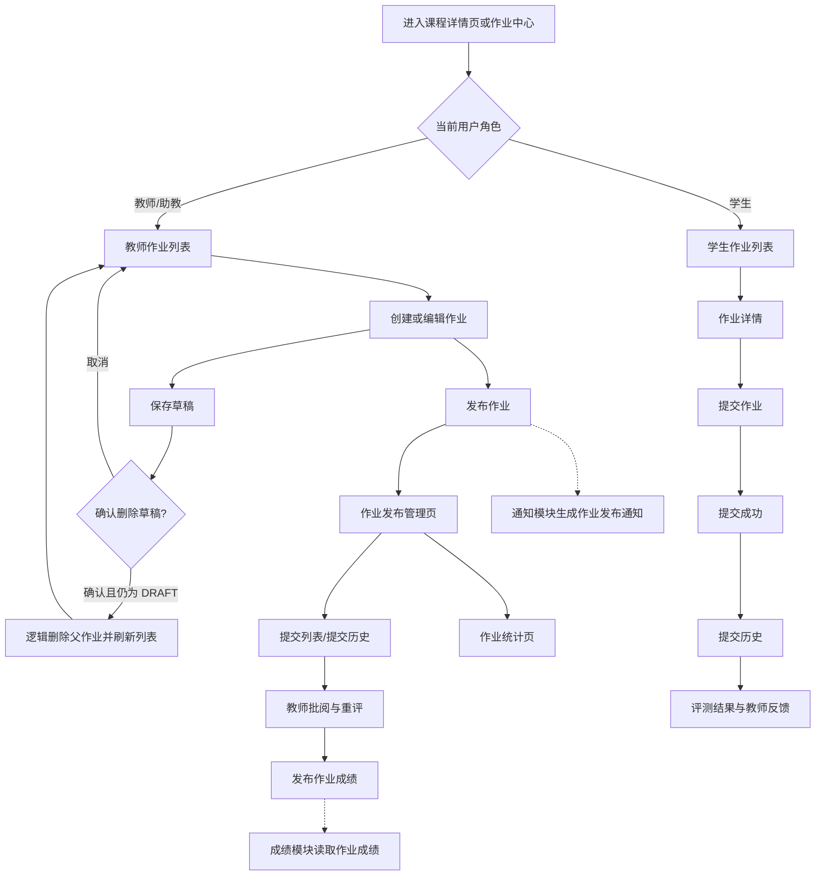
```mermaid
graph TD
    A[进入课程详情页或作业中心] --> B{当前用户角色}
    B -->|教师/助教| T1[教师作业列表]
    T1 --> T2[创建或编辑作业]
    T2 --> T3[保存草稿]
    T3 --> T10{确认删除草稿?}
    T10 -->|取消| T1
    T10 -->|确认且仍为 DRAFT| T11[逻辑删除父作业并刷新列表]
    T11 --> T1
    T2 --> T4[发布作业]
    T4 --> T5[作业发布管理页]
    T5 --> T6[提交列表/提交历史]
    T6 --> T7[教师批阅与重评]
    T5 --> T8[作业统计页]
    T7 --> T9[发布作业成绩]
    B -->|学生| S1[学生作业列表]
    S1 --> S2[作业详情]
    S2 --> S3[提交作业]
    S3 --> S4[提交成功]
    S4 --> S5[提交历史]
    S5 --> S6[评测结果与教师反馈]
    T4 -.-> N1[通知模块生成作业发布通知]
    T9 -.-> G1[成绩模块读取作业成绩]
```

#### 3.1.6 GRD 模块页面

| 页面编号 | 页面名称 | 使用角色 | 功能描述 | 对应需求 |
|---------|---------|---------|---------|---------|
| UI-GRD-01 | 教师成绩项配置页 | 教师 | 在课程范围内配置成绩项、来源、满分、权重、是否计入总评 | FR-GR-01 |
| UI-GRD-02 | 教师成绩总表页 | 教师 | 展示课程学生成绩总表，支持学生、成绩项、状态筛选和分页 | FR-GR-02/03 |
| UI-GRD-03 | 学生成绩构成明细页 | 教师 | 查看单名学生各成绩项原始分、加权分、来源任务、状态和总评 | FR-GR-03 |
| UI-GRD-04 | 成绩调整页/弹窗 | 教师 | 调整课程内单项成绩或总评，填写调整原因并保存变更记录 | FR-GR-03/04 |
| UI-GRD-05 | 成绩发布确认页 | 教师 | 发布前展示可发布范围、未评分/缺失状态和发布确认结果 | FR-GR-04 |
| UI-GRD-06 | 学生个人成绩页 | 学生 | 展示本人已发布成绩项明细、加权结果、课程总评 | FR-GR-05 |
| UI-GRD-07 | 教学分析概览页 | 教师 | 展示均分、最高分、最低分、及格率、完成率和分布 | FR-GR-06 |
| UI-GRD-08 | 成绩变更记录页 | 教师 | 查看已发布成绩修改前后值、修改人、修改时间和修改原因 | FR-GR-03 |
| UI-GRD-09 | 学生成绩异议申请页 | 学生 | 对本人已发布课程成绩或单项成绩提交异议申请 | FR-GR-07 |
| UI-GRD-10 | 教师成绩复核处理页 | 教师 | 查看授权课程内成绩异议申请，进行同意修改、驳回或备注 | FR-GR-07 |

图 3-6 GRD 页面流转图

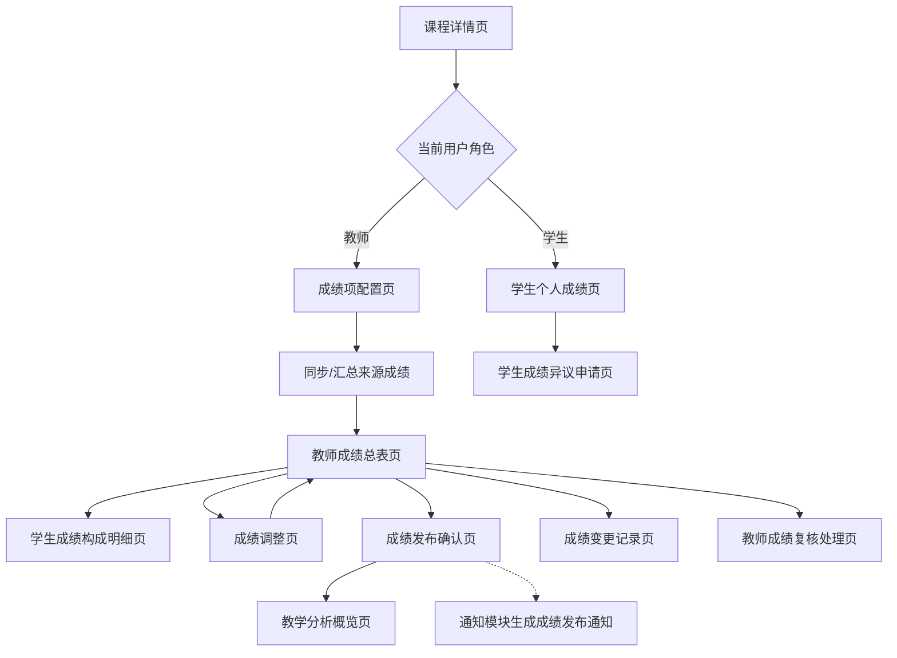
```mermaid
graph TD
    A[课程详情页] --> B{当前用户角色}
    B -->|教师| T1[成绩项配置页]
    T1 --> T2[同步/汇总来源成绩]
    T2 --> T3[教师成绩总表页]
    T3 --> T4[学生成绩构成明细页]
    T3 --> T5[成绩调整页]
    T5 --> T3
    T3 --> T6[成绩发布确认页]
    T6 --> T7[教学分析概览页]
    T3 --> T8[成绩变更记录页]
    T3 --> T9[教师成绩复核处理页]
    B -->|学生| S1[学生个人成绩页]
    S1 --> S2[学生成绩异议申请页]
    T6 -.-> N1[通知模块生成成绩发布通知]
```

---

### 3.2 外部接口设计（API）

> 本节按模块分别描述各模块对外提供的 RESTful API 接口和跨模块事件接口。所有接口路径统一采用 `/api/v1` 前缀，需认证接口均需携带 AUTH 签发的 Bearer 访问令牌，响应格式遵循 `{ code, message, data }` 统一结构。

#### 3.2.1 AUTH 模块接口

**认证与会话接口：**

| 编号 | 接口 | 方法 | 主要参数 | 返回内容 | 说明 |
|------|------|------|---------|---------|------|
| API-AUTH-01 | `/api/v1/auth/login` | POST | 账号、密码 | 访问令牌、用户信息、角色权限摘要 | 登录前校验账号状态和失败次数 |
| API-AUTH-02 | `/api/v1/auth/register` | POST | 账号、密码、用户类型、联系方式 | 注册结果、用户编号 | 本版本可按项目需要选择是否开放自助注册 |
| API-AUTH-03 | `/api/v1/auth/logout` | POST | 当前令牌 | 退出结果 | 作废当前会话或令牌 |
| 扩展 | `/api/v1/auth/refresh` | POST | 刷新令牌或当前会话 | 新访问令牌、有效期 | 扩展接口；本版本通过 `/api/v1/auth/me` 校验会话或重新登录 |
| API-AUTH-04 | `/api/v1/auth/me` | GET | 当前令牌 | 当前用户、角色、权限摘要 | 业务模块和前端获取当前用户上下文 |

**用户与密码接口：**

| 编号 | 接口 | 方法 | 主要参数 | 返回内容 | 说明 |
|------|------|------|---------|---------|------|
| API-AUTH-05 | `/api/v1/users/me` | GET | 当前令牌 | 个人资料 | 当前用户查看个人信息 |
| API-AUTH-06 | `/api/v1/users/me` | PUT | 昵称、联系方式、头像等 | 修改结果 | 不允许普通用户修改角色和账号状态 |
| API-AUTH-07 | `/api/v1/users/me/password` | PUT | 原密码、新密码 | 修改结果 | 修改成功后记录审计日志 |
| API-AUTH-08 | `/api/v1/admin/users` | GET | 关键词、角色、状态、分页参数 | 用户列表 | 管理员查询用户 |
| API-AUTH-09 | `/api/v1/admin/users` | POST | 账号、用户类型、初始角色 | 创建结果 | 管理员创建用户 |
| API-AUTH-10 | `/api/v1/admin/users/{userId}/status` | PUT | 账号状态 | 修改结果 | 启用、禁用、冻结用户 |

**角色与权限接口：**

| 编号 | 接口 | 方法 | 主要参数 | 返回内容 | 说明 |
|------|------|------|---------|---------|------|
| API-AUTH-11 | `/api/v1/admin/roles` | GET | 分页参数 | 角色列表 | 查询平台角色 |
| API-AUTH-12 | `/api/v1/admin/roles` | POST | 角色编码、名称、说明 | 创建结果 | 本版本至少预置三类基础角色 |
| API-AUTH-13 | `/api/v1/admin/permissions` | GET | 权限类型、模块 | 权限点列表 | 查询菜单、接口、资源权限点 |
| API-AUTH-14 | `/api/v1/admin/roles/{roleId}/permissions` | PUT | 权限编号列表 | 修改结果 | 调整角色权限并记录审计日志 |
| API-AUTH-15 | `/api/v1/admin/users/{userId}/roles` | PUT | 角色编号列表 | 修改结果 | 调整用户角色并记录审计日志 |

**鉴权与审计接口：**

| 编号 | 接口 | 方法 | 主要参数 | 返回内容 | 说明 |
|------|------|------|---------|---------|------|
| API-AUTH-16 | `/api/v1/auth/check-permission` | POST | 权限编码、资源类型、资源编号 | 是否允许访问 | 供前端或业务模块做通用权限判断 |
| API-AUTH-17 | `/api/v1/admin/audit-logs` | GET | 操作人、操作类型、时间范围、结果状态、分页参数 | 审计日志列表 | 管理员查看安全审计记录 |

**跨模块鉴权契约：**

| 契约 | 内容 | 使用方 |
|------|------|-------|
| 当前用户上下文 | `user_id`、`username`、`user_type`、`roles`、`permissions`、`account_status` | CRS、HWK、LAB、GRD、LRN |
| 权限校验结果 | 是否通过、失败原因、建议错误码 | 所有业务模块 |

#### 3.2.2 CRS 模块接口

| 编号 | HTTP方法 | API 路径 | 功能描述 | 调用方 | 需求追踪 |
|------|---------|---------|---------|-------|---------|
| API-CRS-01 | POST | /api/v1/courses | 创建课程 | CRS前端、管理员 | FR-CR-01 |
| API-CRS-02 | GET | /api/v1/courses/{courseId} | 获取课程详情 | CRS/HWK/LAB/GRD | FR-CR-01 |
| API-CRS-03 | PUT | /api/v1/courses/{courseId} | 更新课程信息 | CRS前端 | FR-CR-01 |
| API-CRS-04 | DELETE | /api/v1/courses/{courseId} | 删除/归档课程 | CRS前端、管理员 | FR-CR-01 |
| API-CRS-05 | GET | /api/v1/courses | 获取课程列表 | CRS前端 | FR-CR-01 |
| API-CRS-06 | POST | /api/v1/courses/{courseId}/chapters | 新增章节 | CRS前端 | FR-CR-02 |
| API-CRS-07 | GET | /api/v1/courses/{courseId}/chapters | 获取章节树 | CRS/HWK/LAB | FR-CR-02 |
| API-CRS-08 | PUT | /api/v1/courses/{courseId}/chapters/{chapterId} | 修改章节 | CRS前端 | FR-CR-02 |
| API-CRS-09 | DELETE | /api/v1/courses/{courseId}/chapters/{chapterId} | 删除章节 | CRS前端 | FR-CR-02 |
| API-CRS-10 | POST | /api/v1/courses/{courseId}/resources | 上传教学资源 | CRS前端 | FR-CR-03 |
| API-CRS-11 | GET | /api/v1/courses/{courseId}/resources | 获取资源列表 | CRS前端 | FR-CR-03 |
| API-CRS-12 | PUT | /api/v1/courses/{courseId}/resources/{resourceId} | 更新资源 | CRS前端 | FR-CR-03 |
| API-CRS-13 | DELETE | /api/v1/courses/{courseId}/resources/{resourceId} | 删除资源 | CRS前端 | FR-CR-03 |
| API-CRS-14 | POST | /api/v1/courses/{courseId}/join | 学生选课 | 学生端 | FR-CR-04 |
| API-CRS-15 | GET | /api/v1/courses/{courseId}/members | 获取课程成员列表 | CRS/HWK/LAB/GRD | FR-CR-05 |
| API-CRS-16 | PUT | /api/v1/courses/{courseId}/members/{userId} | 管理成员角色 | CRS前端 | FR-CR-05 |
| API-CRS-17 | DELETE | /api/v1/courses/{courseId}/members/{userId} | 移除课程异常成员 | CRS前端、管理员 | FR-CR-05 |
| API-CRS-18 | GET | /api/v1/courses/{courseId}/students | 获取选课学生名单 | HWK/LAB/GRD | FR-CR-04/05 |
| API-CRS-19 | GET | /api/v1/courses/{courseId}/permissions/{userId} | 校验课程权限 | HWK/LAB/GRD | FR-CR-04/05 |
| API-CRS-20 | POST | /api/v1/courses/{courseId}/announcements | 发布公告 | CRS前端、LRN | FR-CR-06 |
| API-CRS-21 | GET | /api/v1/courses/{courseId}/announcements | 获取公告列表 | CRS前端 | FR-CR-06 |
| API-CRS-22 | GET | /api/v1/courses/{courseId}/home-summary | 获取课程首页基础信息与最近任务摘要 | CRS前端 | FR-CR-06 |

#### 3.2.3 LRN 模块接口

| 编号 | 请求方式 | API 路径 | 功能 | 调用页面 |
|------|---------|---------|------|---------|
| API-LRN-01 | GET | /api/v1/learning/tasks | 获取学习任务中心列表 | UI-LRN-01 |
| API-LRN-02 | GET | /api/v1/learning/progress | 获取课程/章节学习进度 | UI-LRN-02 |
| API-LRN-03 | POST | /api/v1/learning/progress | 保存学习进度与断点位置 | UI-LRN-02 |
| API-LRN-04 | GET | /api/v1/learning/statistics | 获取近 7 天学习统计 | UI-LRN-03 |
| API-LRN-05 | POST | /api/v1/learning/records | 上报学习行为记录 | UI-LRN-03 |
| API-LRN-06 | GET | /api/v1/notifications | 获取分类通知列表 | UI-LRN-04 |
| API-LRN-07 | PUT | /api/v1/notifications/read | 单条或批量标记已读 | UI-LRN-04 |
| API-LRN-08 | DELETE | /api/v1/notifications/{notificationId} | 删除单条通知 | UI-LRN-04 |
| API-LRN-09 | POST | /api/v1/notifications/events | 接收业务模块通知事件 | LAB/HWK/CRS/GRD |
| API-LRN-10 | GET | /api/v1/reminder-rules | 查询提醒规则与通知偏好 | UI-LRN-05 |
| API-LRN-11 | PUT | /api/v1/reminder-rules | 保存提醒规则与非必要通知开关 | UI-LRN-05 |

说明：本版本以 `PUT /api/v1/notifications/read` 作为统一已读接口，请求体通过 `notificationIds` 和 `readAll` 同时覆盖单条、多条和全部已读。`/api/v1/notifications/{notificationId}/read`、`/api/v1/notifications/read-all` 可作为兼容别名扩展。

#### 3.2.4 LAB 模块接口

**实验管理接口：**

| 接口编号 | 接口名称 | 方法与路径 | 调用方 | 主要入参 | 主要出参 | 说明 |
|---------|---------|-----------|-------|---------|---------|------|
| API-LAB-01 | 创建实验 | POST /api/v1/courses/{courseId}/labs | 教师端 | courseId, chapterId, title, description, deadline, maxScore, allowedLanguages, evaluationMode | labId, status, createdAt | 创建草稿实验 |
| API-LAB-04 | 修改实验 | PUT /api/v1/labs/{labId} | 教师端 | title, description, deadline, allowedLanguages, timeLimitMs, memoryLimitKb | labId, updatedAt | 已发布实验修改需记录 |
| API-LAB-05 | 删除实验 | DELETE /api/v1/labs/{labId} | 教师端 | labId | labId, deleted | 逻辑删除未发布或可归档实验 |
| API-LAB-06 | 发布实验 | POST /api/v1/labs/{labId}/publish | 教师端 | publishNow | labId, status, publishedAt | 发布后学生可见 |
| API-LAB-07 | 截止实验 | POST /api/v1/labs/{labId}/close | 教师端 | reason | labId, status | 截止后不允许继续提交 |
| API-LAB-02 | 查询实验列表 | GET /api/v1/courses/{courseId}/labs | 教师端/学生端 | courseId, status, keyword, page, size | records, total | 根据用户角色过滤 |
| API-LAB-03 | 查询实验详情 | GET /api/v1/labs/{labId} | 教师端/学生端 | labId | labDetail | 学生端不返回隐藏测试用例 |

**测试用例接口：**

| 接口编号 | 接口名称 | 方法与路径 | 调用方 | 主要入参 | 主要出参 | 说明 |
|---------|---------|-----------|-------|---------|---------|------|
| API-LAB-15 | 管理测试用例能力 | 随 API-LAB-01 / API-LAB-04 整体提交；独立 `/api/v1/labs/{labId}/testcases` CRUD 属于扩展接口 | 教师端 | input, expectedOutput, scoreWeight, isPublic, timeLimitMs, memoryLimitKb, orderNum | labDetail 中的 testcaseList 或 caseCount | 本版本通过实验创建/更新请求整体维护测试用例集合，区分公开/隐藏测试用例 |

说明：`API-LAB-15` 在本文档中作为测试用例管理能力编号，用于追踪 FR-LAB-04、DB-LAB-02 和自动评测测试项。测试用例随实验创建/更新整体提交并在服务层事务内替换；独立 CRUD 扩展接口启用时，应同步后端 Controller、前端 API 封装和测试用例。

**实验提交与评测接口：**

| 接口编号 | 接口名称 | 方法与路径 | 调用方 | 主要入参 | 主要出参 | 说明 |
|---------|---------|-----------|-------|---------|---------|------|
| API-LAB-08 | 提交实验内容 | POST /api/v1/labs/{labId}/submissions | 学生端 | code, file, language | submissionId, version, evaluationStatus, submittedAt | 保存提交版本；有文件时写 DB-LAB-09 可信元数据并按配置创建评测任务，事务回滚时调用文件补偿删除；删除自身失败仍为运维残余 |
| API-LAB-09 | 查询提交列表 | GET /api/v1/labs/{labId}/submissions | 教师端/学生端 | studentKeyword, evaluationStatus, page, size | records, total | 教师查看全班提交，学生仅看本人 |
| API-LAB-10 | 查询提交详情 | GET /api/v1/labs/{labId}/submissions/{submissionId} | 学生端/教师端 | labId, submissionId | submissionDetail 顶层 `hasFile`；nullable `sourceFile(originalFilename, contentType, fileSize, downloadAvailable)` | 按提交者或课程教师权限过滤；公共响应不返回 fileId、storageKey、本地路径、内部状态或任何下载 URL；教师端按固定 API-LAB-19 路径下载 |
| API-LAB-11 | 触发评测 | POST /api/v1/labs/{labId}/submissions/{submissionId}/evaluate | 教师端/系统内部 | reason | evaluationId, status | 仅教师或系统内部可操作 |
| API-LAB-12 | 查询评测结果 | GET /api/v1/labs/{labId}/submissions/{submissionId}/result | 学生端/教师端 | labId, submissionId | evaluationStatus, score, passedCases, totalCases, errorType, feedback | 学生端只展示公开信息 |

**实验报告接口：**

| 接口编号 | 接口名称 | 方法与路径 | 调用方 | 主要入参 | 主要出参 | 说明 |
|---------|---------|-----------|-------|---------|---------|------|
| API-LAB-16 | 提交实验报告 | POST /api/v1/labs/{labId}/reports | 学生端 | submissionId, reportFile, remark | reportId, submittedAt | 仅支持文件上传，不提供在线编辑 |
| API-LAB-17 | 查询实验报告 | GET /api/v1/labs/{labId}/reports/{reportId} | 学生端/教师端 | labId, reportId | reportDetail | 查看报告状态和评分输入 |
| API-LAB-13 | 教师评分 | POST /api/v1/labs/{labId}/submissions/{submissionId}/score | 教师端 | manualScore, reportScore, finalScore, comment, changeReason | finalScore, scoredAt | 教师评分并向 GRD 提供来源成绩 |
| API-LAB-14 | 获取实验统计 | GET /api/v1/labs/{labId}/statistics | 教师端 | labId | submissionRate, pendingStudents, evaluatedRate, averageScore, scoreDistribution | 支撑实验统计页和 FR-LAB-08 |
| API-LAB-18 | 查询实验结果 | GET /api/v1/labs/{labId}/results/{studentId} | 学生端/教师端 | labId, studentId | resultDetail | 展示最终成绩、评测结果和教师评语 |
| API-LAB-19 | 下载提交源文件 | GET /api/v1/labs/{labId}/submissions/{submissionId}/source/download | 教师端/管理员端 | labId, submissionId | 文件流，Content-Type、Content-Length、UTF-8 Content-Disposition | 仅 CRS `canManageCourse` 通过者；按角色、实验、课程管理权、提交、资产和物理文件顺序复核；学生本人排除，不提供匿名 URL |

`API-LAB-19` 与 `API-LAB-17` 的实验报告查询/下载能力相互独立：前者按提交版本读取 `DB-LAB-09`，后者按报告编号读取 `DB-LAB-06`。下载错误语义为 `ERR-AUTH-04/05`、`LAB-403-01`、`LAB-404-01`、`LAB-404-03`、`LAB-409-03` 和 `LAB-500-05`；源文件上传类型/大小继续使用 `LAB-400-06`。

**跨模块事件接口：**

| 事件名称 | 触发时机 | 接收模块 | 主要字段 |
|---------|---------|---------|---------|
| LAB_EXPERIMENT_PUBLISHED | 教师发布实验后 | LRN | sourceModule=LAB, sourceId=labId, labId, courseId, title, deadline, receiverScope |
| EXPERIMENT_SCORE_PUBLISHED | 教师发布实验成绩后 | LRN、GRD | sourceModule=LAB, sourceId=labId, labId, courseId, studentId, finalScore, publishedAt |

#### 3.2.5 HWK 模块接口

**作业管理接口：**

| 接口编号 | 接口名称 | 方法与路径 | 调用方 | 主要入参 | 主要出参 | 说明 |
|---------|---------|-----------|-------|---------|---------|------|
| API-HWK-01 | 创建作业 | POST /api/v1/homeworks | 教师端 | courseId, chapterId, title, description, type, deadline, totalScore, allowResubmit, allowLateSubmit, showEvaluationBeforePublish, attachments, judgeConfig | homeworkId, status, createdAt | 创建草稿或待发布作业 |
| API-HWK-02 | 修改作业 | PUT /api/v1/homeworks/{homeworkId} | 教师端 | title, description, deadline, totalScore, submitConfig, attachments, judgeConfig | homeworkId, updatedAt | 已发布作业修改需记录 |
| API-HWK-03 | 发布作业 | PUT /api/v1/homeworks/{homeworkId}/publish | 教师端 | publishNow | homeworkId, status, publishedAt | 作业状态与 `HOMEWORK_PUBLISHED` 必达通知同事务成功后学生可见；通知失败返回 `503/HWK_5003` 并回滚为 `DRAFT` |
| API-HWK-04 | 关闭作业 | PUT /api/v1/homeworks/{homeworkId}/close | 教师端 | reason | homeworkId, status | 关闭后不允许继续提交 |
| API-HWK-05 | 查询作业列表 | GET /api/v1/homeworks | 教师端/学生端 | courseId, status, keyword, page, size | records, total | 根据用户角色过滤可见作业 |
| API-HWK-06 | 查询作业详情 | GET /api/v1/homeworks/{homeworkId} | 教师端/学生端 | homeworkId | homeworkDetail | 学生端不返回隐藏测试用例、标准答案 |
| API-HWK-22 | 删除草稿作业 | DELETE /api/v1/homeworks/{homeworkId} | 教师端 | homeworkId | HomeworkResponse（deleted=true, updatedAt） | 仅课程管理者且当前仍为 DRAFT；只逻辑删除父表；无权限为 403/HWK_4031，不存在或已删除为 404/HWK_4001，非 DRAFT 为 409/HWK_4095 |

**作业提交接口：**

| 接口编号 | 接口名称 | 方法与路径 | 调用方 | 主要入参 | 主要出参 | 说明 |
|---------|---------|-----------|-------|---------|---------|------|
| API-HWK-07 | 提交作业 | POST /api/v1/homeworks/{homeworkId}/submissions | 学生端 | answerText, answerJson, fileIds, codeText, language | submissionId, submitStatus, evaluationStatus, submittedAt | 客观题可自动评分，代码题进入评测流程 |
| API-HWK-08 | 查询我的提交历史 | GET /api/v1/homeworks/{homeworkId}/my-submissions | 学生端 | homeworkId | submissionList | 只返回当前学生自己的提交 |
| API-HWK-09 | 查询作业提交列表 | GET /api/v1/homeworks/{homeworkId}/submissions | 教师端 | studentKeyword, submitStatus, evaluationStatus, reviewStatus, attention, page, size | PageResponse(records, total, page, size) | `attention` 可选为 EVALUATION_PENDING/REVIEW_PENDING；未传时保持原行为，传入时仅返回当前活跃学生的最终有效提交并与旧筛选按 AND 组合，1 基分页、size 1～100、稳定排序 |
| API-HWK-10 | 查询提交详情 | GET /api/v1/submissions/{submissionId} | 学生端/教师端 | submissionId | submissionDetail | 学生只能查看自己的提交 |
| API-HWK-23 | 学生附件生命周期 | POST /api/v1/homeworks/{homeworkId}/attachments GET/DELETE /api/v1/homeworks/{homeworkId}/attachments/{fileId} | 学生端 | POST 为 multipart 单字段 `file`；GET/DELETE 为 UUID `fileId` | fileId, originalFilename, contentType, fileSize, expiresAt, status, uploadedAt；DELETE 无返回体 | 单件、10 MiB、三重白名单、24h；只能操作本人/本课程/本作业的未绑定附件，不返回内部存储引用 |
| API-HWK-24 | 受控下载提交附件 | GET /api/v1/homeworks/{homeworkId}/submissions/{submissionId}/attachment/download | 学生端/教师端 | homeworkId, submissionId | 文件流、可信 Content-Type/Length、UTF-8 Content-Disposition | 每次重新校验提交者本人或课程管理者，验证 BOUND 绑定，设置 `Cache-Control: no-store` 与 `nosniff` |

API-HWK-23/24 统一使用 `HWK_4005`（数量/UUID 格式/空文件、内容签名非法或损坏 ZIP/OOXML 结构）、`HWK_4031`（非成员或无权限）、`HWK_4042`（格式合法但未知/跨归属 UUID，或附件/提交/绑定不存在或隐藏）、`HWK_4091`（过期/不可用）、`HWK_4092`（已绑定/已删除/重用/状态冲突）、`HWK_4131`（超过 10 MiB）、`HWK_4151`（扩展名或声明 MIME 不支持/不匹配）和 `HWK_5002`（存储或补偿失败）。

**自动评测与教师批阅接口：**

| 接口编号 | 接口名称 | 方法与路径 | 调用方 | 主要入参 | 主要出参 | 说明 |
|---------|---------|-----------|-------|---------|---------|------|
| API-HWK-11 | 查询评测结果 | GET /api/v1/submissions/{submissionId}/evaluation | 学生端/教师端 | submissionId | evaluationStatus, score, passedCases, totalCases, errorType, feedback | 学生端只展示允许公开的信息 |
| API-HWK-12 | 触发重评 | POST /api/v1/submissions/{submissionId}/reevaluate | 教师端 | reason | evaluationId, status | 仅教师或助教可操作 |
| API-HWK-13 | 教师批阅提交 | PUT /api/v1/submissions/{submissionId}/review | 教师端 | manualScore, finalScore, comment | submissionId, reviewStatus, finalScore | 保存教师评分和评语 |
| API-HWK-14 | 批量发布作业成绩 | PUT /api/v1/homeworks/{homeworkId}/scores/publish | 教师端 | publishScope | publishedCount, publishedAt | 发布后学生可见 |
| API-HWK-15 | 查询作业统计 | GET /api/v1/homeworks/{homeworkId}/statistics | 教师端 | homeworkId, page, size | 保留现有字段并新增 autoEvaluableCount, pendingEvaluationCount, pendingReviewCount, scoredCount, scoreDistribution, generatedAt | 未提交名单使用 1 基分页；聚合覆盖整份作业的当前活跃学生，固定五档按满分归一化；学生和无课程管理权限教师返回 403 |

**题目、测试用例与评测日志接口：**

| 接口编号 | 接口名称 | 方法与路径 | 调用方 | 主要入参 | 主要出参 | 说明 |
|---------|---------|-----------|-------|---------|---------|------|
| API-HWK-16 | 保存客观题题目 | PUT /api/v1/homeworks/{homeworkId}/questions | 教师端 | questionType, stem, optionsJson, answerJson, score, sortOrder | questionCount | 支持单选、多选、判断题配置 |
| API-HWK-17 | 查询客观题题目 | GET /api/v1/homeworks/{homeworkId}/questions | 教师端 | homeworkId | questionList | 学生端不返回标准答案 |
| API-HWK-18 | 保存代码题测试用例 | PUT /api/v1/homeworks/{homeworkId}/test-cases | 教师端 | inputData, expectedOutput, scoreWeight, isHidden, timeLimitMs, memoryLimitKb | caseCount | 用于代码作业自动评测 |
| API-HWK-19 | 查询代码题测试用例 | GET /api/v1/homeworks/{homeworkId}/test-cases | 教师端 | homeworkId | testCaseList | 默认仅教师可查看隐藏用例 |
| API-HWK-20 | 查询评测日志 | GET /api/v1/evaluations/{evaluationId}/logs | 教师端 | evaluationId | compileLog, runLog, errorMessage, detail | 支撑重评和问题排查 |
| API-HWK-21 | 查询批阅日志 | GET /api/v1/submissions/{submissionId}/review-logs | 教师端 | submissionId | reviewLogList | 展示评分、重评、发布等留痕 |

**跨模块事件接口：**

| 事件名称 | 触发时机 | 接收模块 | 主要字段 |
|---------|---------|---------|---------|
| HOMEWORK_PUBLISHED | 教师发布作业时 | LRN | homeworkId, courseId, title, deadline, receiverScope；必达投递失败时发布事务整体回滚 |
| HOMEWORK_UPDATED | 教师修改已发布作业的重要信息后 | LRN | homeworkId, courseId, title, updatedFields |
| HOMEWORK_DEADLINE_APPROACHING | 作业截止前定时扫描 | LRN | homeworkId, courseId, deadline, unsubmittedStudentIds |
| HOMEWORK_EVALUATION_FINISHED | 自动评测完成后 | LRN | homeworkId, submissionId, studentId, status |
| HOMEWORK_SCORE_PUBLISHED | 教师发布作业成绩后 | LRN、GRD | homeworkId, courseId, studentId, finalScore, publishedAt |

#### 3.2.6 GRD 模块接口

**成绩项配置接口：**

| 接口编号 | 接口名称 | 方法与路径 | 调用方 | 主要入参 | 主要出参 | 需求追踪 |
|---------|---------|-----------|-------|---------|---------|---------|
| API-GRD-01 | 查询成绩项列表 | GET /api/v1/courses/{courseId}/grade-items | 教师端 | courseId | gradeItemList | FR-GR-01 |
| API-GRD-02 | 创建成绩项 | POST /api/v1/courses/{courseId}/grade-items | 教师端 | name, sourceType, sourceId, fullScore, weight, includedInFinal, sortOrder | 完整持久化 GradeItem；不附带规则校验或重算结果 | FR-GR-01 |
| API-GRD-03 | 修改成绩项 | PUT /api/v1/grade-items/{gradeItemId} | 教师端 | name, fullScore, weight, includedInFinal, sortOrder, enabled | gradeItemId, updatedAt | FR-GR-01 |
| API-GRD-04 | 停用/删除成绩项 | DELETE /api/v1/grade-items/{gradeItemId} | 教师端 | disableReason | gradeItemId, enabled | FR-GR-01 |
| API-GRD-05 | 校验成绩规则 | POST /api/v1/courses/{courseId}/grade-rules/validate | 教师端 | 可选 gradeItems；为空时校验已保存成绩项 | valid, totalIncludedWeight, errors | FR-GR-01 |

**成绩汇总与计算接口：**

| 接口编号 | 接口名称 | 方法与路径 | 调用方 | 主要入参 | 主要出参 | 需求追踪 |
|---------|---------|-----------|-------|---------|---------|---------|
| API-GRD-06 | 同步来源成绩 | POST /api/v1/courses/{courseId}/grades/sync | 教师端/系统 | 路径 courseId；无请求体 | calculationBatchId, affectedItemCount, affectedStudentCount, syncedCount, missingCount, ungradedCount | FR-GR-02 |
| API-GRD-07 | 重新计算课程成绩 | POST /api/v1/courses/{courseId}/grades/recalculate | 教师端/系统 | gradeItemIds, studentIds | calculationBatchId, affectedCount | FR-GR-01/02 |
| API-GRD-08 | 查询课程成绩总表 | GET /api/v1/courses/{courseId}/grades | 教师端 | studentKeyword, gradeItemId, gradeStatus, publishStatus, page, size | records, total | FR-GR-02/03 |
| API-GRD-09 | 查询学生成绩明细 | GET /api/v1/courses/{courseId}/grades/students/{studentId} | 教师端 | courseId, studentId | studentGradeDetail | FR-GR-03 |
| API-GRD-17 | 查询成绩项完成情况 | GET /api/v1/courses/{courseId}/grade-items/{gradeItemId}/completion | 教师端 | courseId, gradeItemId | submittedCount, missingCount, ungradedCount, completionRate | FR-GR-02/06 |

**成绩管理与发布接口：**

| 接口编号 | 接口名称 | 方法与路径 | 调用方 | 主要入参 | 主要出参 | 需求追踪 |
|---------|---------|-----------|-------|---------|---------|---------|
| API-GRD-10 | 调整成绩记录 | PUT /api/v1/grade-records/{recordId}/adjust | 教师端 | newScore, adjustType, reason | recordId, oldScore, newScore, updatedAt | FR-GR-03 |
| API-GRD-11 | 调整课程总评 | PUT /api/v1/course-grade-summaries/{summaryId}/adjust | 教师端 | newFinalScore, reason | summaryId, oldFinalScore, newFinalScore | FR-GR-03/04 |
| API-GRD-12 | 发布课程成绩 | POST /api/v1/courses/{courseId}/grades/publish | 教师端 | publishScope, studentIds, gradeItemIds | publishId, publishedCount, publishedAt | FR-GR-04 |
| API-GRD-13 | 查询成绩发布记录 | GET /api/v1/courses/{courseId}/grade-publish-records | 教师端 | publishScope, page, size | records, total | FR-GR-04 |
| API-GRD-15 | 查询我的课程成绩 | GET /api/v1/courses/{courseId}/my-grades | 学生端 | courseId | gradeItems, finalScore, publishedAt | FR-GR-05 |
| API-GRD-16 | 查询课程成绩分析 | GET /api/v1/courses/{courseId}/grade-analysis | 教师端 | targetType, gradeItemId | averageScore, maxScore, minScore, passRate, completionRate, distribution | FR-GR-06 |
| API-GRD-14 | 查询成绩变更记录 | GET /api/v1/courses/{courseId}/grade-change-logs | 教师端 | studentId, gradeItemId, page, size | records, total | FR-GR-03/04 |

**成绩异议与复核接口：**

| 接口编号 | 接口名称 | 方法与路径 | 调用方 | 主要入参 | 主要出参 | 需求追踪 |
|---------|---------|-----------|-------|---------|---------|---------|
| API-GRD-18 | 提交成绩异议申请 | POST /api/v1/courses/{courseId}/grade-review-requests | 学生端 | gradeItemId, targetType, reason | requestId, status, submittedAt | FR-GR-07 |
| API-GRD-20 | 查询课程成绩异议申请 | GET /api/v1/courses/{courseId}/grade-review-requests | 教师端 | studentId, gradeItemId, status, page, size | records, total | FR-GR-07 |
| API-GRD-19 | 查询我的成绩异议申请 | GET /api/v1/courses/{courseId}/my-grade-review-requests | 学生端 | status, page, size | records, total | FR-GR-07 |
| API-GRD-21 | 处理成绩异议申请 | PUT /api/v1/grade-review-requests/{requestId}/process | 教师端 | action, adjustedScore, responseComment | requestId, status, processedAt | FR-GR-07 |

**跨模块数据契约：**

GRD 从 LAB/HWK 读取来源成绩时依赖 `SourceGradeDTO`，设计字段与 `docs/开发/GRD-成绩评价与教学分析模块开发流程.md` 的联调契约保持一致：

| 字段 | 类型 | 说明 |
|------|------|------|
| sourceType | String | 来源类型：LAB、HWK、OTHER_COURSE_ITEM |
| sourceId | Long | 来源任务编号 |
| courseId | Long | 所属课程编号 |
| studentId | Long | 学生编号 |
| taskName | String | 来源任务名称，如实验名称或作业名称，用于成绩项展示和追踪 |
| rawScore | BigDecimal | 来源模块形成的原始分；现有来源接口中的 `score` 字段等价于该字段 |
| fullScore | BigDecimal | 来源任务满分，用于 GRD 按成绩项满分归一化 |
| scoreStatus | String | 评分状态：SCORED、UNSUBMITTED、UNGRADED、MISSING；现有来源接口中的 `status` 字段等价于该字段 |
| sourceUpdatedAt | DateTime | 来源成绩更新时间；现有来源接口中的 `updatedAt` 字段等价于该字段 |
| comment | String | 教师评语或基础反馈，可为空 |

说明：LAB/HWK 只有在来源任务成绩进入 `SCORE_PUBLISHED` 或归档后的可见状态时，才向 GRD 返回可同步的来源成绩；未发布来源成绩不得进入学生可见的 GRD 成绩结果。

**GRD 向 LRN 发送的事件：**

| 事件名称 | 触发时机 | 接收模块 | 主要字段 |
|---------|---------|---------|---------|
| GRADE_PUBLISHED | 教师正式发布成绩后 | LRN | courseId, publishId, receiverStudentIds, publishedAt |
| GRADE_CHANGED | 已发布成绩发生修改后 | LRN | courseId, studentId, gradeItemId, changedAt |
| GRADE_REVIEW_REQUESTED | 学生提交成绩异议申请后 | LRN | courseId, requestId, studentId, teacherIds |
| GRADE_REVIEW_PROCESSED | 教师处理成绩异议申请后 | LRN | courseId, requestId, studentId, status |

---

### 3.3 系统数据结构设计

> 本节按模块描述各模块的核心数据实体定义。实体字段名使用小驼峰命名（Java 风格），具体 DTO 字段名可在详细设计阶段由后端总设计统一调整。

#### 3.3.1 AUTH 核心实体

**User 用户实体：**

| 字段 | 说明 |
|------|------|
| userId | 用户唯一编号 |
| username | 登录账号（学号/工号/系统账号） |
| userType | 用户类型（学生/教师/管理员） |
| displayName | 用户显示名称 |
| phone | 手机号 |
| email | 邮箱 |
| avatarUrl | 头像地址 |
| passwordHash | 密码哈希 |
| passwordSalt | 密码盐或哈希参数 |
| accountStatus | 正常、禁用、冻结、待激活 |
| failedLoginCount | 连续登录失败次数 |
| lockedUntil | 锁定截止时间 |
| lastLoginAt | 最近登录时间 |
| createdAt / updatedAt | 创建和更新时间 |

**Role 角色实体：** roleId, roleCode（STUDENT/TEACHER/ADMIN）, roleName, description, enabled。助教不是平台基础角色，作为 `CourseMember.role` 的课程内角色处理。

**Permission 权限实体：** permissionId, permissionCode, permissionName, permissionType（菜单/接口/资源/操作）, moduleCode, resourcePattern, enabled

**UserRole 用户角色关联：** id, userId, roleId, assignedBy, assignedAt

**RolePermission 角色权限关联：** id, roleId, permissionId, assignedBy, assignedAt

**LoginSession 登录会话实体：** sessionId, userId, tokenId, issuedAt, expiresAt, revokedAt, clientIp, userAgent, status

**AuditLog 审计日志实体：** logId, operatorId, operationType, targetType, targetId, resultStatus, failureReason, clientIp, userAgent, createdAt

图 3-7 账号状态机

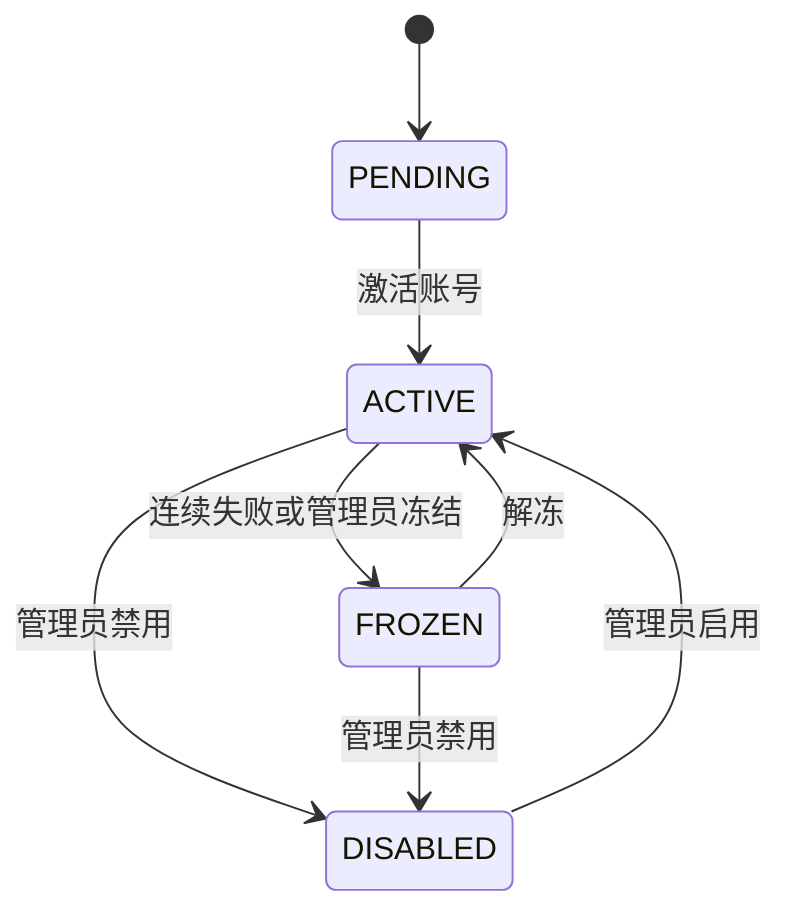
```mermaid
stateDiagram-v2
    [*] --> PENDING
    PENDING --> ACTIVE: 激活账号
    ACTIVE --> FROZEN: 连续失败或管理员冻结
    FROZEN --> ACTIVE: 解冻
    ACTIVE --> DISABLED: 管理员禁用
    FROZEN --> DISABLED: 管理员禁用
    DISABLED --> ACTIVE: 管理员启用
```

#### 3.3.2 CRS 核心实体

**Course 课程实体：** id, courseName, courseCode, teacherId, description, semester, department, coverUrl, enrollmentMode（1公开/2邀请码/3审核）, inviteCode, maxStudents, startDate, endDate, status（0禁用/1启用/2归档）, isDeleted, createdAt, updatedAt

**Chapter 章节实体：** id, courseId, chapterName, parentId, sortOrder, objective, visibleStatus, chapterType（1普通/2实验/3作业）, isDeleted, createdAt, updatedAt

**Resource 教学资源实体：** id, courseId, chapterId, resourceName, resourceType（1文档/2视频/3课件/4链接）, filePath, fileSize, fileFormat, version, externalUrl, accessLevel, downloadCount, uploadUserId, isDeleted, createdAt, updatedAt

**CourseMember 课程成员实体：** id, courseId, userId, role（1学生/2助教/3教师）, joinMethod, joinStatus, applyReason, approvedBy, joinedAt, leftAt, lastAccessAt, isDeleted, createdAt, updatedAt

**Announcement 课程公告实体：** id, courseId, publisherId, title, content, isPinned, publishStatus, publishTime, expireTime, targetRole, viewCount, attachmentUrl, isDeleted, createdAt, updatedAt

#### 3.3.3 LRN 核心实体

**LearningTask 学习任务实体：** id, userId, courseId, sourceModule（CRS/LAB/HWK）, sourceId, taskType（RESOURCE/EXPERIMENT/HOMEWORK）, title, deadline, progress, status（NOT_STARTED/IN_PROGRESS/COMPLETED/OVERDUE）, actionUrl, snapshotAt, createdAt, updatedAt

**LearningProgress 学习进度实体：** id, userId, courseId, chapterId, sourceModule, sourceId, progressPercent, lastPosition, status, updatedAt

**LearningRecord 学习记录实体：** id, userId, courseId, sourceModule, sourceId, actionType（访问/下载/提交/完成）, duration, startedAt, endedAt, createdAt

**Notification 通知实体：** id, userId, title, content, type（学习提醒/任务通知/成绩通知/系统公告/教师公告）, priority, isRead, sourceModule, sourceId, actionUrl, createdAt, readAt, deletedAt

**NotificationStatusLog 通知状态日志实体：** id, notificationId, userId, oldStatus, newStatus, operationType, operatedAt

**ReminderRule 提醒规则实体：** id, userId, reminderType, sourceModule, aheadMinutes, enabled, required, createdAt, updatedAt

**NotificationSetting 通知设置实体：** id, userId, enableExperiment, enableHomework, enableGrade, enableAnnouncement, enableNonCriticalReminder, createdAt, updatedAt

#### 3.3.4 LAB 核心实体

**LabExperiment 实验实体：** id, courseId, chapterId, title, description, evaluationMode（DOCKER_IO/MANUAL/MIXED）, status（DRAFT/PUBLISHED/CLOSED/SCORE_PUBLISHED/ARCHIVED）, deadline, allowedLanguages, timeLimitMs, memoryLimitKb, maxScore, autoEvaluate, reportRequired, createdBy, publishedAt, createdAt, updatedAt, deleted。`OPEN`、`NOT_OPEN` 仅作为按发布时间和截止时间推导的页面视图标签，不写入存储状态。

**LabSubmission 实验提交实体：** id, labId, studentId, version, codeContent, fileId（仅旧数据内部兼容，不进入公共 DTO）, language, submitStatus（当前写入 SUBMITTED；LATE/WITHDRAWN 仅为历史兼容枚举值）, evaluationStatus（NONE/PENDING/RUNNING/ACCEPTED/WRONG_ANSWER/COMPILE_ERROR/RUNTIME_ERROR/TIME_LIMIT_EXCEEDED/SYSTEM_ERROR）, autoScore, finalScore, isFinal, submittedAt, createdAt, updatedAt, deleted。当前 API 截止后拒绝提交且不提供撤回操作。

**LabSubmissionSourceFile 提交源文件资产实体：** id, submissionId, labId, courseId, uploaderId, storageKey（仅服务端）, originalFilename, contentType, fileSize, status（AVAILABLE/DELETED）, createdAt, updatedAt, deletedAt。`submissionId` 与 `storageKey` 均唯一。公共详情只返回顶层 `hasFile` 和 nullable `sourceFile(originalFilename, contentType, fileSize, downloadAvailable)`；不暴露内部状态、内部键或下载 URL。

**LabEvaluation 实验评测实体：** id, submissionId, labId, studentId, status, score, passedCases, totalCases, timeUsedMs, memoryUsedKb, feedback, compileLog, runLog, startedAt, finishedAt

**LabTestcase 实验测试用例实体：** id, labId, input, expectedOutput, scoreWeight, isPublic, timeLimitMs, memoryLimitKb, orderNum, deleted

**LabReport 实验报告实体：** id, labId, studentId, submissionId, fileId, fileName, fileType（PDF/DOCX/ZIP）, fileSize, version, score, comment, submitStatus（当前写入 SUBMITTED；LATE/WITHDRAWN 仅为历史兼容枚举值）, submittedAt, scoredBy, scoredAt, createdAt, updatedAt。当前 API 截止后拒绝报告提交且不提供撤回操作。

**LabScore 实验评分实体：** id, submissionId, reportId, teacherId, autoScore, reportScore, manualScore, finalScore, comment, scoredAt, createdAt, updatedAt

**LabScoreChangeLog 实验评分变更日志实体：** id, scoreId, oldFinalScore, newFinalScore, reason, operatorId, createdAt

#### 3.3.5 HWK 核心实体

**Homework 作业实体：** id, courseId, chapterId, title, description, type（OBJECTIVE/TEXT/FILE/CODE）, status（DRAFT/NOT_OPEN/PUBLISHED/CLOSED/SCORE_PUBLISHED/ARCHIVED）, totalScore, deadline, allowResubmit, allowLateSubmit, showEvaluationBeforePublish, judgeConfigId, createdBy, publishedAt, deleted, createdAt, updatedAt。以上为当前运行时枚举，本期不修改；逻辑删除由 `deleted` 表达，不新增 `DELETED` 状态；`OPEN` 如在前端展示，仅为派生视图标签。

**HomeworkQuestion 客观题题目实体：** id, homeworkId, questionType（SINGLE_CHOICE/MULTIPLE_CHOICE/TRUE_FALSE）, stem, optionsJson, answerJson, score, sortOrder

**HomeworkSubmission 作业提交实体：** id, homeworkId, studentId, submitType（TEXT/FILE/CODE/OBJECTIVE）, answerText, answerJson, language, submitStatus（SUBMITTED/LATE/REJECTED）, evaluationStatus（NONE/PENDING/RUNNING/ACCEPTED/WRONG_ANSWER/COMPILE_ERROR/RUNTIME_ERROR/TIME_LIMIT_EXCEEDED/SYSTEM_ERROR）, reviewStatus（UNREVIEWED/REVIEWED/NEED_REVIEW）, autoScore, manualScore, finalScore, comment, version, isFinal, submittedAt, reviewedBy, reviewedAt, isDeleted, hasAttachment, attachment（安全视图）。历史 `fileUrl` 字段不是对外下载合约，新 FILE 提交以 HomeworkSubmissionAttachment 绑定为准。

**HomeworkSubmissionAttachment 作业提交附件实体：** id, publicId（服务端生成 UUID）, submissionId（可空且唯一）, homeworkId, courseId, uploaderId, storageKey（仅服务端）, originalFilename, contentType, fileSize, status（UPLOADED/BOUND/DELETED）, expiresAt, boundAt, createdAt, updatedAt, deletedAt。

**HomeworkEvaluation 作业评测实体：** id, submissionId, homeworkId, studentId, evaluationType（OBJECTIVE_AUTO/CODE_JUDGE/REJUDGE）, status, score, passedCases, totalCases, timeUsedMs, memoryUsedKb, feedback, logUrl, startedAt, finishedAt

**HomeworkTestCase 作业测试用例实体：** id, homeworkId, inputData, expectedOutput, scoreWeight, isHidden, timeLimitMs, memoryLimitKb, sortOrder

**HomeworkReviewLog 作业批阅日志实体：** id, submissionId, homeworkId, studentId, operationType（REVIEW/REJUDGE/PUBLISH/ADJUST）, oldScore, newScore, comment, operatorId, reason, createdAt

#### 3.3.6 GRD 核心实体

**GradeItem 成绩项实体：** id, courseId, name, sourceType（LAB/HWK/OTHER_COURSE_ITEM）, sourceId, fullScore, weight, includedInFinal, enabled, sortOrder, createdBy, deleted, createdAt, updatedAt

**GradeRecord 成绩记录实体：** id, courseId, studentId, gradeItemId, sourceType, sourceId, rawScore, weightedScore, gradeStatus（SCORED/UNSUBMITTED/UNGRADED/MISSING/ADJUSTED）, publishStatus（UNPUBLISHED/PUBLISHED）, comment, sourceUpdatedAt, calculatedAt, publishedAt, createdAt, updatedAt

**CourseGradeSummary 课程总评实体：** id, courseId, studentId, finalScore, finalStatus（CALCULATED/INCOMPLETE/ADJUSTED）, publishStatus, calculationBatchId, publishedAt, updatedAt

**GradePublishRecord 成绩发布记录实体：** id, courseId, publishScope（COURSE/PARTIAL_STUDENTS/PARTIAL_ITEMS）, publishedCount, publishedBy, publishedAt, notificationStatus

**GradeReviewRequest 成绩异议申请实体：** id, courseId, studentId, gradeItemId, targetType（ITEM_SCORE/FINAL_SCORE）, reason, status（PENDING/APPROVED/REJECTED/CLOSED）, originalScore, adjustedScore, responseComment, submittedAt, processedBy, processedAt

**GradeChangeLog 成绩变更记录实体：** id, courseId, studentId, gradeItemId, changeType, oldValue, newValue, reason, operatorId, createdAt

**GradeAnalysisSnapshot 统计分析快照实体：** id, courseId, targetType（COURSE_TOTAL/GRADE_ITEM）, gradeItemId, sourceDataTime, sourceFingerprint, calculatedAt, averageScore, maxScore, minScore, passRate, completionRate, totalStudentCount, completedCount, missingCount, unsubmittedCount, ungradedCount, distributionJson。sourceFingerprint 采用 `GRD_ANALYSIS_V2:<SHA-256>` 格式，由统计契约版本、课程、统计目标、当前有效学生集合以及 Repository 维护的来源版本生成；指纹一致且快照计数完整时可直接复用。

图 3-8 成绩发布状态机

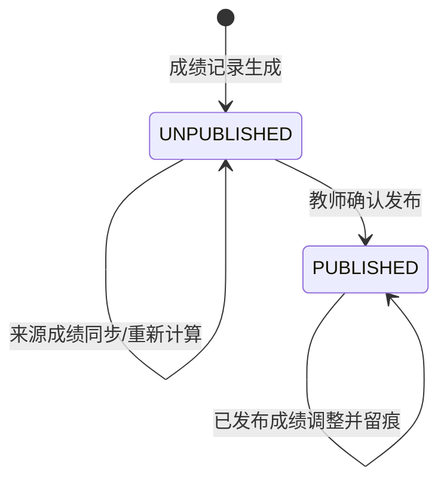
```mermaid
stateDiagram-v2
    [*] --> UNPUBLISHED: 成绩记录生成
    UNPUBLISHED --> UNPUBLISHED: 来源成绩同步/重新计算
    UNPUBLISHED --> PUBLISHED: 教师确认发布
    PUBLISHED --> PUBLISHED: 已发布成绩调整并留痕
```

图 3-9 成绩异议申请状态机

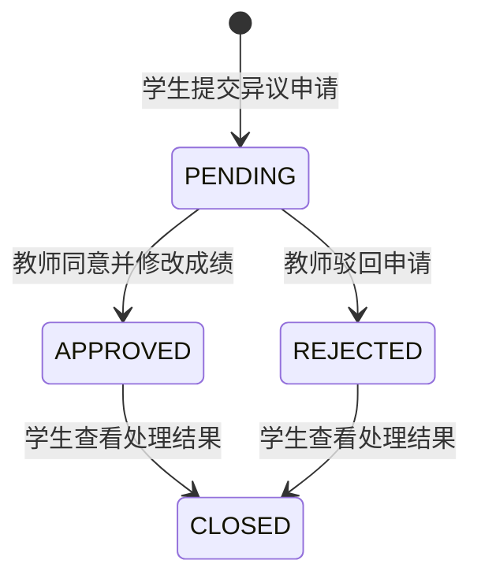
```mermaid
stateDiagram-v2
    [*] --> PENDING: 学生提交异议申请
    PENDING --> APPROVED: 教师同意并修改成绩
    PENDING --> REJECTED: 教师驳回申请
    APPROVED --> CLOSED: 学生查看处理结果
    REJECTED --> CLOSED: 学生查看处理结果
```

---

## 4 系统数据库设计

> 本节按模块描述各模块的数据库表结构设计。表命名采用 `t_` 或模块前缀命名，字段命名使用小写下划线风格。最终字段类型、公共审计字段和约束可由后端总设计在详细设计阶段统一调整。

### 4.1 AUTH 模块数据表

**DB-AUTH-01 t_auth_user 用户表：**

| 字段 | 类型 | 约束 | 说明 |
|------|------|------|------|
| user_id | bigint | PK | 用户编号 |
| username | varchar(64) | UNIQUE, NOT NULL | 登录账号 |
| user_type | varchar(32) | NOT NULL | 用户类型 |
| display_name | varchar(64) | NOT NULL | 显示名称 |
| phone | varchar(32) | | 手机号 |
| email | varchar(128) | | 邮箱 |
| avatar_url | varchar(255) | | 头像地址 |
| password_hash | varchar(255) | NOT NULL | 密码哈希 |
| password_salt | varchar(128) | | 密码盐 |
| account_status | varchar(32) | NOT NULL | 账号状态 |
| failed_login_count | int | DEFAULT 0 | 连续登录失败次数 |
| locked_until | datetime | | 锁定截止时间 |
| last_login_at | datetime | | 最近登录时间 |
| created_at | datetime | NOT NULL | 创建时间 |
| updated_at | datetime | NOT NULL | 更新时间 |

**DB-AUTH-02 t_auth_role 角色表：** role_id(PK), role_code(UNIQUE), role_name, description, enabled, created_at, updated_at

**DB-AUTH-03 t_auth_permission 权限表：** permission_id(PK), permission_code(UNIQUE), permission_name, permission_type, module_code, resource_pattern, enabled, created_at, updated_at

**DB-AUTH-04 t_auth_user_role 用户角色关联表：** id(PK), user_id(FK), role_id(FK), assigned_by, assigned_at

**DB-AUTH-05 t_auth_role_permission 角色权限关联表：** id(PK), role_id(FK), permission_id(FK), assigned_by, assigned_at

**DB-AUTH-06 t_auth_session 登录会话表：** session_id(PK), user_id(FK), token_id(UNIQUE), issued_at, expires_at, revoked_at, client_ip, user_agent, status

**DB-AUTH-07 t_auth_audit_log 审计日志表：** log_id(PK), operator_id, operation_type, target_type, target_id, result_status, failure_reason, client_ip, user_agent, created_at

### 4.2 CRS 模块数据表

**DB-CRS-01 crs_course 课程表：** id(PK), course_name, course_code, teacher_id(FK→t_auth_user), description, semester, department, cover_url, enrollment_mode(1公开/2邀请码/3审核), invite_code, max_students, start_date, end_date, status, is_deleted, created_at, updated_at

**DB-CRS-02 crs_chapter 章节表：** id(PK), course_id(FK), chapter_name, parent_id(FK 自引用), sort_order, objective, visible_status, chapter_type(1普通/2实验/3作业), is_deleted, created_at, updated_at

**DB-CRS-03 crs_resource 教学资源表：** id(PK), course_id(FK), chapter_id(FK), resource_name, resource_type(1文档/2视频/3课件/4链接), file_path, file_size, file_format, version, external_url, access_level, download_count, upload_user_id(FK), is_deleted, created_at, updated_at

**DB-CRS-04 crs_course_member 课程成员表：** id(PK), course_id(FK), user_id(FK), role(1学生/2助教/3教师), join_method(1公开/2邀请码/3审核), join_status(1在课/0退课/2待审核), apply_reason, approved_by, joined_at, left_at, last_access_at, is_deleted, created_at, updated_at
> UNIQUE INDEX: uk_course_user(course_id, user_id)

**DB-CRS-05 crs_announcement 课程公告表：** id(PK), course_id(FK), publisher_id(FK), title, content(TEXT), is_pinned, publish_status, publish_time, expire_time, target_role, view_count, attachment_url, is_deleted, created_at, updated_at

### 4.3 LRN 模块数据表

**DB-LRN-01 lrn_learning_task 学习任务表：** id(PK), user_id(逻辑引用), course_id(逻辑引用), source_module, source_id, task_type, title, deadline, progress, status, action_url, snapshot_at, created_at, updated_at

**DB-LRN-02 lrn_learning_progress 学习进度表：** id(PK), user_id(逻辑引用), course_id(逻辑引用), chapter_id(逻辑引用), source_module, source_id, progress_percent, last_position, status, updated_at

**DB-LRN-03 lrn_learning_record 学习记录表：** id(PK), user_id(逻辑引用), course_id(逻辑引用), source_module, source_id, action_type(访问/下载/提交/完成), duration(int 秒), started_at, ended_at, created_at

**DB-LRN-04 lrn_notification 通知表：** id(PK), user_id(逻辑引用), title, content(TEXT), type(学习提醒/任务通知/成绩通知/系统公告/教师公告), priority, is_read, source_module, source_id, action_url, created_at, read_at, deleted_at

**DB-LRN-05 lrn_notification_status_log 通知状态日志表：** id(PK), notification_id(FK), user_id(逻辑引用), old_status, new_status, operation_type, operated_at

**DB-LRN-06 lrn_reminder_rule 提醒规则表：** id(PK), user_id(逻辑引用), reminder_type, source_module, ahead_minutes, enabled, required, created_at, updated_at

**DB-LRN-07 lrn_notification_setting 通知设置表：** id(PK), user_id(逻辑引用 UNIQUE), enable_experiment(tinyint), enable_homework(tinyint), enable_grade(tinyint), enable_announcement(tinyint), enable_non_critical_reminder(tinyint), created_at, updated_at

### 4.4 LAB 模块数据表

**DB-LAB-01 lab_experiment 实验任务表：**

| 字段 | 类型 | 约束 | 说明 |
|------|------|------|------|
| id | bigint | PK | 实验编号 |
| course_id | bigint | NOT NULL, INDEX | 所属课程编号 |
| chapter_id | bigint | NULL | 所属章节编号 |
| title | varchar(100) | NOT NULL | 实验标题 |
| description | text | NOT NULL | 实验说明 |
| evaluation_mode | varchar(32) | NOT NULL DEFAULT 'DOCKER_IO' | 评测方式：DOCKER_IO / MANUAL / MIXED |
| auto_evaluate | tinyint(1) | NOT NULL DEFAULT 1 | 提交后是否自动评测 |
| report_required | tinyint(1) | NOT NULL DEFAULT 0 | 是否要求实验报告 |
| status | varchar(32) | NOT NULL | DRAFT / PUBLISHED / CLOSED / SCORE_PUBLISHED / ARCHIVED |
| deadline | datetime | NOT NULL | 截止时间 |
| max_score | int | NOT NULL DEFAULT 100 | 满分值 |
| attachment_ids | varchar(500) | NULL | 附件编号列表 |
| allowed_languages | varchar(255) | NULL | 允许的编程语言（逗号分隔） |
| time_limit_ms | int | NOT NULL DEFAULT 60000 | 运行时间限制（毫秒） |
| memory_limit_kb | int | NOT NULL DEFAULT 262144 | 内存限制（KB） |
| created_by | bigint | NOT NULL | 创建教师编号 |
| published_at | datetime | NULL | 发布时间 |
| deleted | tinyint(1) | NOT NULL DEFAULT 0 | 逻辑删除 |
| created_at | datetime | NOT NULL | 创建时间 |
| updated_at | datetime | NOT NULL | 更新时间 |

**DB-LAB-02 lab_testcase 实验测试用例表：** id(PK), lab_id(FK), input(text), expected_output(text), score_weight(int), is_public(tinyint), time_limit_ms(int), memory_limit_kb(int), order_num(int), deleted(tinyint), created_at, updated_at

**DB-LAB-03 lab_submission 实验提交表：**

| 字段 | 类型 | 约束 | 说明 |
|------|------|------|------|
| id | bigint | PK | 提交编号 |
| lab_id | bigint | NOT NULL, INDEX | 实验编号 |
| student_id | bigint | NOT NULL, INDEX | 学生编号 |
| code_content | text | NULL | 代码内容 |
| file_id | varchar(128) | NULL | 旧数据内部兼容文件标识；新公共契约不读取或返回该字段 |
| language | varchar(20) | NOT NULL | 编程语言 |
| submit_status | varchar(32) | NOT NULL | 当前写入 SUBMITTED；LATE / WITHDRAWN 仅兼容历史数据，当前 API 不产生 |
| evaluation_status | varchar(32) | NOT NULL DEFAULT 'NONE' | NONE / PENDING / RUNNING / ACCEPTED / WRONG_ANSWER / COMPILE_ERROR / RUNTIME_ERROR / TIME_LIMIT_EXCEEDED / SYSTEM_ERROR |
| auto_score | int | NULL | 代码评测得分 |
| final_score | int | NULL | 最终得分 |
| version | int | NOT NULL DEFAULT 1 | 提交版本 |
| is_final | tinyint | NOT NULL DEFAULT 1 | 是否当前有效提交 |
| submitted_at | datetime | NOT NULL | 提交时间 |
| created_at | datetime | NOT NULL | 创建时间 |
| updated_at | datetime | NOT NULL | 更新时间 |
| deleted | tinyint(1) | NOT NULL DEFAULT 0 | 逻辑删除 |

**DB-LAB-04 lab_evaluation 实验评测记录表：** id(PK), submission_id(FK), status(varchar), score(int), passed_cases(int), total_cases(int), time_used_ms(int), memory_used_kb(int), feedback(varchar), compile_log(text), run_log(text), started_at, finished_at

**DB-LAB-05 lab_score 实验评分记录表：** id(PK), submission_id(FK), report_id(FK NULL), teacher_id(逻辑引用), auto_score(int), report_score(int), manual_score(int), final_score(int), comment(varchar(1000)), scored_at, created_at, updated_at

**DB-LAB-06 lab_report 实验报告表：** id(PK), lab_id(FK), student_id(逻辑引用), submission_id(FK), file_id, file_name, file_type(PDF/DOCX/ZIP), file_size, version, score(int), comment(varchar(1000)), submit_status(varchar), submitted_at, scored_by, scored_at, created_at, updated_at

**DB-LAB-07 lab_score_change_log 实验评分变更日志表：** id(PK), score_id(FK), old_final_score(int), new_final_score(int), reason(varchar(500)), operator_id(逻辑引用), created_at

**DB-LAB-08 lab_evaluation_result 实验评测用例结果表：** id(PK), submission_id(FK), testcase_id(FK), status(varchar), passed(tinyint), score(int), actual_output(text), message(varchar), executed_at, created_at, updated_at

**DB-LAB-09 lab_submission_source_file 提交源文件资产表：**

| 字段 | 类型 | 约束 | 说明 |
|------|------|------|------|
| id | bigint | PK | 源文件资产编号 |
| submission_id | bigint | NOT NULL, UNIQUE, FK | 对应一个且仅一个提交版本 |
| lab_id | bigint | NOT NULL, INDEX | 实验编号，用于归属复核 |
| course_id | bigint | NOT NULL, INDEX | 课程编号，用于 CRS 管理权限复核 |
| uploader_id | bigint | NOT NULL, INDEX | 上传学生编号 |
| storage_key | varchar(500) | NOT NULL, UNIQUE | 服务端生成的存储键，禁止进入公共 DTO 或 URL |
| original_filename | varchar(255) | NOT NULL | 存储/入库前已清理的业务文件名，下载前再次校验 |
| content_type | varchar(128) | NOT NULL | 上传时校验并持久化的可信 MIME |
| file_size | bigint | NOT NULL | 文件字节数，必须非负 |
| status | varchar(20) | NOT NULL DEFAULT AVAILABLE, INDEX | AVAILABLE / DELETED |
| created_at | datetime | NOT NULL | 创建时间 |
| updated_at | datetime | NOT NULL | 更新时间 |
| deleted_at | datetime | NULL | 失效或删除时间 |

DB-LAB-09 使用 `uk_lab_submission_source_submission`、`uk_lab_submission_source_storage_key` 两个唯一约束，以及 `lab_id`、`course_id`、`uploader_id`、`status` 单列查询索引；不定义虚构的组合索引。新提交以 DB-LAB-09 为可信文件来源。只有 `lab_submission.file_id` 的旧记录不得自动解析或伪造元数据，而是在详情层返回 `hasFile=true, sourceFile=null`。存储成功后 DB 事务回滚会调用物理对象补偿删除；只有删除成功时才可认定未留下孤儿文件。`DELETED/deleted_at` 冻结资产失效语义，但 #222 未实现资产删除/失效状态转移或物理清理流程，本期只拒绝人工构造或历史已有的不可用记录。物理对象缺失或读取失败返回 `LAB-500-05`；partial copy、补偿删除失败后的告警、审计和重试不在本期能力内。

### 4.5 HWK 模块数据表

**DB-HWK-01 t_hwk_homework 作业表：** id(PK), course_id(FK INDEX), chapter_id, title(varchar 255), description(text), type(varchar 32: OBJECTIVE/TEXT/FILE/CODE), status(varchar 32: DRAFT/NOT_OPEN/PUBLISHED/CLOSED/SCORE_PUBLISHED/ARCHIVED), total_score(decimal 6,2), deadline(datetime), allow_resubmit(tinyint), allow_late_submit(tinyint), show_evaluation_before_publish(tinyint), judge_config_id, created_by(bigint), published_at, is_deleted(tinyint), created_at, updated_at

> 草稿删除约束：API-HWK-22 只更新父表，原子条件为 `id = ? AND status = 'DRAFT' AND is_deleted = FALSE`，成功时写入 `is_deleted = TRUE` 与删除时刻 `updated_at`。普通编辑、发布等更新不得设置 `is_deleted`，且必须包含 `is_deleted = FALSE` 条件。题目、测试用例、判题配置、提交、评测、批阅和重评历史不级联删除。

**DB-HWK-07 t_hwk_judge_config 作业评测配置表：** id(PK), homework_id(FK UNIQUE), language_limit_json(text), time_limit_ms(int), memory_limit_kb(int), output_compare_mode(varchar 32), created_at, updated_at

**DB-HWK-08 t_hwk_submission_attachment 提交附件资产表：** id(PK), public_id(char(36) UNIQUE), submission_id(bigint NULL UNIQUE), homework_id(bigint INDEX), course_id(bigint INDEX), uploader_id(bigint INDEX), storage_key(varchar UNIQUE), original_filename(varchar), content_type(varchar), file_size(bigint), status(varchar 20: UPLOADED/BOUND/DELETED INDEX), active_slot(tinyint NULL), expires_at(datetime INDEX), bound_at(datetime NULL), created_at, updated_at, deleted_at(datetime NULL)

> FILE 附件约束：新资产仅使用服务端生成 UUID/存储键；`submission_id` 唯一保证单提交单附件。`UPLOADED` 必须 `active_slot=1`，`BOUND/DELETED` 必须为 NULL，唯一约束 `(homework_id,uploader_id,active_slot)` 保证同学生/作业只有一份 active 上传；顺序上传原子替换旧 active，并发首次上传收敛为 201 + `409/HWK_4092` 并回滚失败物理对象。数据库回滚或部分流写入失败后立即删除，删除失败则在 `.pending-deletes` 持久 SHA-256 marker，定时清理重试成功后 ack；损坏 marker 不饿死后续合法项。整卷删除/journal 同时失败、病毒扫描、网关/容量限流和允许重交时 BOUND 历史容量规划为残余边界。

**DB-HWK-02 t_hwk_question 客观题题目表：** id(PK), homework_id(FK), question_type(varchar 32: SINGLE_CHOICE/MULTIPLE_CHOICE/TRUE_FALSE), stem(text), options_json(text), answer_json(text), score(decimal 6,2), sort_order(int)

**DB-HWK-03 t_hwk_test_case 作业测试用例表：** id(PK), homework_id(FK), input_data(text), expected_output(text), score_weight(decimal), is_hidden(tinyint), time_limit_ms(int), memory_limit_kb(int)

**DB-HWK-04 t_hwk_submission 作业提交表：** id(PK), homework_id(FK INDEX), student_id(FK INDEX), submit_type(varchar 32), answer_text(text), answer_json(text), file_url(varchar 500), language(varchar 32), submit_status(varchar 32: SUBMITTED/LATE/REJECTED), evaluation_status(varchar 32 DEFAULT 'NONE'), review_status(varchar 32: UNREVIEWED/REVIEWED/NEED_REVIEW), auto_score(decimal 6,2), manual_score(decimal 6,2), final_score(decimal 6,2), comment(varchar 1000), version(int), is_final(tinyint), submitted_at(datetime), reviewed_by(bigint), reviewed_at(datetime), created_at, updated_at, is_deleted(tinyint)

> 统计和待处理查询组合索引：`idx_hwk_submission_effective(homework_id, is_final, is_deleted, submit_status, student_id)` 覆盖最终有效提交聚合；`idx_hwk_submission_attention(homework_id, is_final, is_deleted, submitted_at, id, submit_status, student_id, submit_type, evaluation_status, review_status)` 以稳定分页排序键优先、其余组合筛选列后置。既有唯一版本索引已覆盖 `homework_id + student_id` 左前缀，不重复建索引；新增索引通过增量迁移建立并由迁移测试验证。

**DB-HWK-05 t_hwk_evaluation 作业评测记录表：** id(PK), submission_id(FK), homework_id, student_id, evaluation_type(varchar 32), status(varchar 32), score(decimal 6,2), passed_cases(int), total_cases(int), time_used_ms(int), memory_used_kb(int), feedback(text), log_url(varchar 500), started_at, finished_at

**DB-HWK-06 t_hwk_review_log 作业批阅日志表：** id(PK), submission_id(FK), homework_id(FK), student_id(逻辑引用), operation_type(varchar 32), old_score(decimal 6,2), new_score(decimal 6,2), comment(varchar 1000), operator_id(逻辑引用), reason(varchar 500), created_at(datetime)

### 4.6 GRD 模块数据表

**DB-GRD-01 t_grade_item 成绩项表：** id(PK), course_id(FK INDEX), name(varchar 100), source_type(varchar 30: LAB/HWK/OTHER_COURSE_ITEM), source_id(bigint INDEX), full_score(decimal 6,2), weight(decimal 6,4), included_in_final(tinyint), enabled(tinyint), sort_order(int), created_by(bigint), deleted(tinyint), created_at, updated_at

**DB-GRD-02 t_grade_record 成绩记录表：** id(PK), course_id(FK INDEX), student_id(FK INDEX), grade_item_id(FK INDEX), source_type(varchar 30), source_id(bigint INDEX), raw_score(decimal 6,2), weighted_score(decimal 6,2), grade_status(varchar 30), publish_status(varchar 30 DEFAULT 'UNPUBLISHED'), comment(varchar 1000), source_updated_at, calculated_at, published_at, created_at, updated_at
> UNIQUE INDEX: uk_grade_record_student_item(course_id, student_id, grade_item_id)

**DB-GRD-03 t_course_grade_summary 课程总评表：** id(PK), course_id(FK INDEX), student_id(FK INDEX), final_score(decimal 6,2), final_status(varchar 30), publish_status(varchar 30 DEFAULT 'UNPUBLISHED'), calculation_batch_id, published_at, created_at, updated_at
> UNIQUE INDEX: uk_course_grade_student(course_id, student_id)

**DB-GRD-04 t_grade_publish_record 成绩发布记录表：** id(PK), course_id(FK INDEX), publish_scope(varchar 30), published_count(int), published_by(bigint), published_at(datetime NOT NULL), notification_status(varchar 30), remark(varchar 500)

**DB-GRD-05 t_grade_calculation_batch 成绩计算批次表：** id(PK), course_id(FK INDEX), trigger_type(varchar 30: SOURCE_SYNC/RULE_CHANGED/MANUAL_RECALCULATE/BEFORE_PUBLISH), affected_item_count(int), affected_student_count(int), status(varchar 30), message(varchar 500), calculated_by(bigint), calculated_at(datetime NOT NULL)

**DB-GRD-06 t_grade_review_request 成绩异议申请表：** id(PK), course_id(FK INDEX), student_id(FK INDEX), grade_item_id(bigint INDEX NULL), target_type(varchar 30: ITEM_SCORE/FINAL_SCORE), reason(varchar 1000 NOT NULL), status(varchar 30: PENDING/APPROVED/REJECTED/CLOSED), original_score(decimal 6,2), adjusted_score(decimal 6,2), response_comment(varchar 1000), submitted_at(datetime NOT NULL), processed_by(bigint), processed_at(datetime), created_at, updated_at

**DB-GRD-07 t_grade_change_log 成绩变更记录表：** id(PK), course_id(FK INDEX), student_id(FK INDEX), grade_item_id(bigint INDEX NULL), change_type(varchar 30), old_value(varchar 100), new_value(varchar 100), reason(varchar 500 NOT NULL), operator_id(bigint NOT NULL), created_at(datetime NOT NULL)

**DB-GRD-08 t_grade_analysis_snapshot 统计分析快照表：** id(PK), course_id(FK INDEX), target_type(varchar 30), grade_item_id(bigint INDEX NULL), source_data_time(datetime NOT NULL), source_fingerprint(varchar 96 NULL，仅兼容历史快照；新增快照必须写入带契约版本的指纹), average_score(decimal 6,2), max_score(decimal 6,2), min_score(decimal 6,2), pass_rate(decimal 6,4), completion_rate(decimal 6,4), total_student_count(int NULL), completed_count(int NULL), missing_count(int NULL), unsubmitted_count(int NULL), ungraded_count(int NULL), distribution_json(text), calculated_at(datetime NOT NULL)

**DB-GRD-09 t_grade_analysis_source_version 统计来源版本表：** course_id(PK), target_type(PK), grade_item_key(PK，COURSE_TOTAL 为 0，GRADE_ITEM 为成绩项编号), source_version(bigint NOT NULL), source_data_time(datetime NULL), updated_at(datetime NOT NULL)。成绩记录或课程总评成功写入时，Repository 必须在同一事务内单调递增对应版本，供统计快照在不扫描全量成绩的前提下检测来源变化。

---

## 5 运行设计

### 5.1 运行模块组合

本平台的运行模块组合按用户角色和使用场景划分，描述不同角色在使用平台时的典型模块组合路径。

**学生角色典型流程：**

学生登录平台后，首先通过 AUTH 模块完成身份认证，进入学生工作台。在 CRS 模块中浏览和加入课程，查看课程章节和教学资源。在 LRN 模块中跟踪学习进度、接收通知提醒。在 HWK 模块中查看和提交作业、查看评测结果和教师反馈。在 LAB 模块中查看实验要求、提交代码、查看 Docker 沙箱自动评测结果、提交实验报告。在 GRD 模块中查看已发布的个人成绩和成绩项明细，如有异议可提交复核申请。

涉及的模块组合：AUTH → CRS → LRN → HWK/LAB → GRD

**教师角色典型流程：**

教师登录后通过 AUTH 模块完成身份认证。在 CRS 模块中创建和管理课程、章节、资源和公告，管理课程成员。在 HWK 模块中创建和发布作业、配置测试用例、批阅学生提交、触发重评。在 LAB 模块中创建和发布实验任务、配置 Docker 沙箱评测参数、查看评测结果、评分实验报告。在 GRD 模块中配置成绩项和权重、同步来源成绩、计算总评、发布成绩、查看教学统计分析、处理成绩异议。

涉及的模块组合：AUTH → CRS → HWK + LAB → GRD

**管理员角色典型流程：**

管理员登录后在 AUTH 模块中管理用户账号、分配角色和权限、查看安全审计日志。管理员不直接参与课程教学业务，但可进行课程审核、下架等平台级管理操作。

涉及的模块组合：AUTH（主要）+ CRS（课程审核）

**系统后台运行模块：**

评测执行器作为 LAB/HWK 共享基础能力运行，可按环境选择 FakeSandboxExecutor 或 DockerSandboxExecutor；业务服务通过应用内异步执行器或任务队列抽象触发评测，并将结果回写到提交与评测记录。LRN 模块提供站内消息能力，业务事件先写入通知表，前端通过页面刷新、手动刷新或可配置轮询读取通知与未读数。HWK 模块的截止提醒通过定时任务扫描即将到期的作业并触发通知事件。

涉及的模块组合：评测执行器（HWK/LAB 共享）+ LRN 通知刷新 + 定时任务调度

### 5.1.1 端到端主流程运行顺序

平台本版本运行设计围绕“登录 -> 课程 -> 作业/实验 -> 提交/评测 -> 成绩 -> 通知”的教学闭环组织。AUTH 负责登录态，CRS 负责课程和成员校验，HWK/LAB 负责任务提交和评测，GRD 负责来源成绩同步、计算与发布，LRN 负责把发布、评测、评分、成绩发布等事件转换为站内通知并落库。

图 5-1 端到端主流程运行顺序图

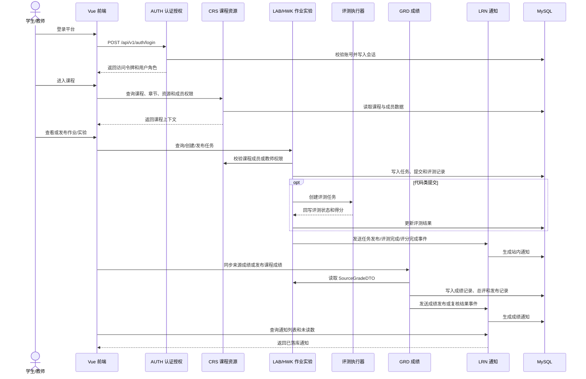
```mermaid
sequenceDiagram
    actor User as 学生/教师
    participant FE as Vue 前端
    participant AUTH as AUTH 认证授权
    participant CRS as CRS 课程资源
    participant TASK as LAB/HWK 作业实验
    participant EVAL as 评测执行器
    participant GRD as GRD 成绩
    participant LRN as LRN 通知
    participant DB as MySQL

    User->>FE: 登录平台
    FE->>AUTH: POST /api/v1/auth/login
    AUTH->>DB: 校验账号并写入会话
    AUTH-->>FE: 返回访问令牌和用户角色
    User->>FE: 进入课程
    FE->>CRS: 查询课程、章节、资源和成员权限
    CRS->>DB: 读取课程与成员数据
    CRS-->>FE: 返回课程上下文
    User->>FE: 查看或发布作业/实验
    FE->>TASK: 查询/创建/发布任务
    TASK->>CRS: 校验课程成员或教师权限
    TASK->>DB: 写入任务、提交和评测记录
    opt 代码类提交
        TASK->>EVAL: 创建评测任务
        EVAL-->>TASK: 回写评测状态和得分
        TASK->>DB: 更新评测结果
    end
    TASK->>LRN: 发送任务发布/评测完成/评分完成事件
    LRN->>DB: 生成站内通知
    FE->>GRD: 同步来源成绩或发布课程成绩
    GRD->>TASK: 读取 SourceGradeDTO
    GRD->>DB: 写入成绩记录、总评和发布记录
    GRD->>LRN: 发送成绩发布或复核结果事件
    LRN->>DB: 生成成绩通知
    FE->>LRN: 查询通知列表和未读数
    LRN-->>FE: 返回已落库通知
```

### 5.1.2 AUTH 模块组件级业务场景图

本节为 AUTH 11 个独立业务场景（`SC-AUTH-01` ~ `SC-AUTH-11`）补充概要层组件级图组，每个场景一张组件级顺序图；账号/会话状态机与跨场景活动图按共同状态或流程复用，个人资料维护、审计写入与查询分别配置专属组件活动图。组件名称对齐当前实现：`AuthController`、`UserProfileController`、`AuthAdminController`、`AuthService`、`RoleService`、`PasswordSecurityService`、`SessionTokenService`、`AuthAuditService`、`AccessControlService`、`AuthRequiredInterceptor`、`TokenCurrentUserProvider`、`AuthRepository`。场景与图号映射见 `docs/过程/测试/TST-DOC-02-AUTH-业务场景清单与测试闭环.md` 第 3 章。

#### 5.1.2.1 SC-AUTH-01 学生自助注册

图 5-2 SC-AUTH-01 学生自助注册组件级顺序图

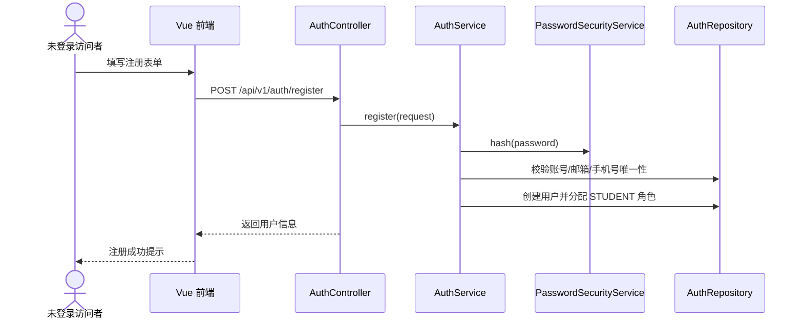
```mermaid
sequenceDiagram
    actor User as 未登录访问者
    participant FE as Vue 前端
    participant API as AuthController
    participant AS as AuthService
    participant PS as PasswordSecurityService
    participant R as AuthRepository
    User->>FE: 填写注册表单
    FE->>API: POST /api/v1/auth/register
    API->>AS: register(request)
    AS->>PS: hash(password)
    AS->>R: 校验账号/邮箱/手机号唯一性
    AS->>R: 创建用户并分配 STUDENT 角色
    API-->>FE: 返回用户信息
    FE-->>User: 注册成功提示
```

#### 5.1.2.2 SC-AUTH-02 账号密码登录

图 5-3 SC-AUTH-02 账号密码登录组件级顺序图

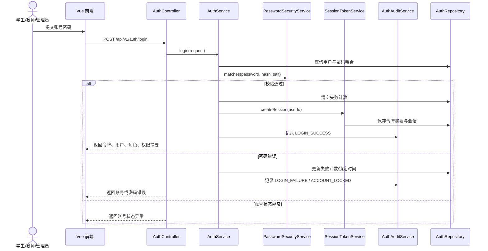
```mermaid
sequenceDiagram
    actor User as 学生/教师/管理员
    participant FE as Vue 前端
    participant API as AuthController
    participant AS as AuthService
    participant PS as PasswordSecurityService
    participant TS as SessionTokenService
    participant LS as AuthAuditService
    participant R as AuthRepository
    User->>FE: 提交账号密码
    FE->>API: POST /api/v1/auth/login
    API->>AS: login(request)
    AS->>R: 查询用户与密码哈希
    AS->>PS: matches(password, hash, salt)
    alt 校验通过
        AS->>R: 清空失败计数
        AS->>TS: createSession(userId)
        TS->>R: 保存令牌摘要与会话
        AS->>LS: 记录 LOGIN_SUCCESS
        API-->>FE: 返回令牌、用户、角色、权限摘要
    else 密码错误
        AS->>R: 更新失败计数/锁定时间
        AS->>LS: 记录 LOGIN_FAILURE / ACCOUNT_LOCKED
        API-->>FE: 返回账号或密码错误
    else 账号状态异常
        API-->>FE: 返回账号状态异常
    end
```

#### 5.1.2.3 SC-AUTH-03 退出登录

图 5-4 SC-AUTH-03 退出登录组件级顺序图

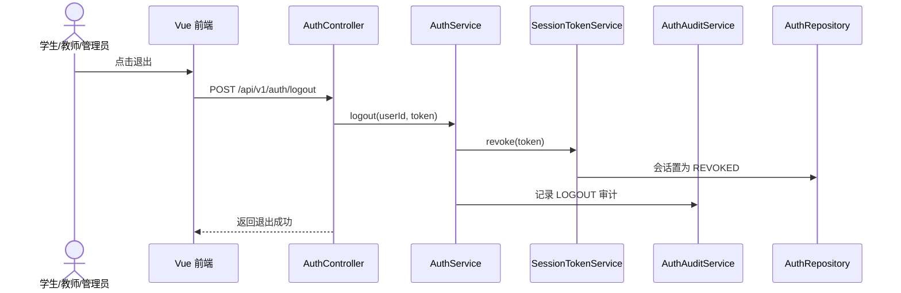
```mermaid
sequenceDiagram
    actor User as 学生/教师/管理员
    participant FE as Vue 前端
    participant API as AuthController
    participant AS as AuthService
    participant TS as SessionTokenService
    participant LS as AuthAuditService
    participant R as AuthRepository
    User->>FE: 点击退出
    FE->>API: POST /api/v1/auth/logout
    API->>AS: logout(userId, token)
    AS->>TS: revoke(token)
    TS->>R: 会话置为 REVOKED
    AS->>LS: 记录 LOGOUT 审计
    API-->>FE: 返回退出成功
```

#### 5.1.2.4 SC-AUTH-04 持续鉴权与当前用户上下文

图 5-5 SC-AUTH-04 持续鉴权组件级顺序图

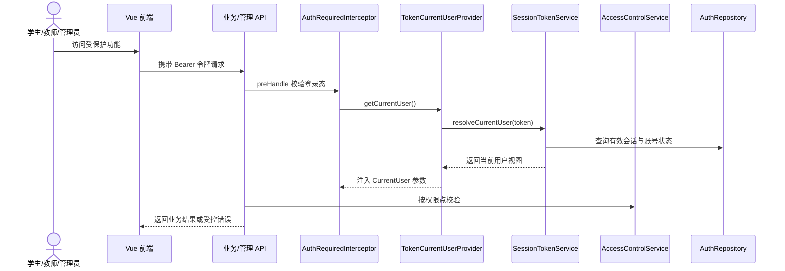
```mermaid
sequenceDiagram
    actor User as 学生/教师/管理员
    participant FE as Vue 前端
    participant API as 业务/管理 API
    participant I as AuthRequiredInterceptor
    participant P as TokenCurrentUserProvider
    participant TS as SessionTokenService
    participant AC as AccessControlService
    participant R as AuthRepository
    User->>FE: 访问受保护功能
    FE->>API: 携带 Bearer 令牌请求
    API->>I: preHandle 校验登录态
    I->>P: getCurrentUser()
    P->>TS: resolveCurrentUser(token)
    TS->>R: 查询有效会话与账号状态
    TS-->>P: 返回当前用户视图
    P-->>I: 注入 CurrentUser 参数
    API->>AC: 按权限点校验
    API-->>FE: 返回业务结果或受控错误
```

#### 5.1.2.5 SC-AUTH-05 个人资料查看与修改

图 5-6 SC-AUTH-05 个人资料组件级顺序图

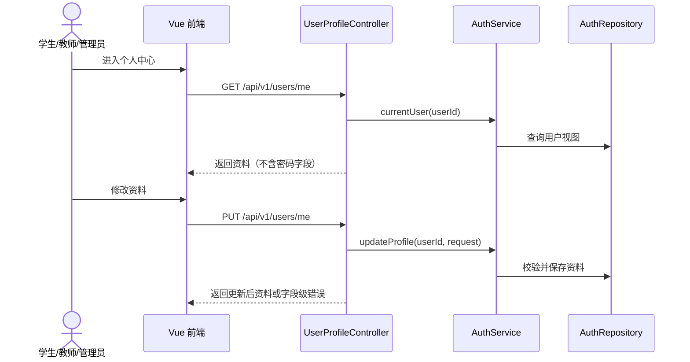
```mermaid
sequenceDiagram
    actor User as 学生/教师/管理员
    participant FE as Vue 前端
    participant API as UserProfileController
    participant AS as AuthService
    participant R as AuthRepository
    User->>FE: 进入个人中心
    FE->>API: GET /api/v1/users/me
    API->>AS: currentUser(userId)
    AS->>R: 查询用户视图
    API-->>FE: 返回资料（不含密码字段）
    User->>FE: 修改资料
    FE->>API: PUT /api/v1/users/me
    API->>AS: updateProfile(userId, request)
    AS->>R: 校验并保存资料
    API-->>FE: 返回更新后资料或字段级错误
```

#### 5.1.2.6 SC-AUTH-06 修改密码

图 5-7 SC-AUTH-06 修改密码组件级顺序图

```mermaid
sequenceDiagram
    actor User as 学生/教师/管理员
    participant FE as Vue 前端
    participant API as UserProfileController
    participant AS as AuthService
    participant PS as PasswordSecurityService
    participant TS as SessionTokenService
    participant LS as AuthAuditService
    participant R as AuthRepository
    User->>FE: 提交原密码与新密码
    FE->>API: PUT /api/v1/users/me/password
    API->>AS: changePassword(userId, request)
    AS->>PS: matches(oldPassword, hash, salt)
    alt 校验通过
        AS->>PS: hash(newPassword)
        AS->>R: 保存新密码哈希
        AS->>TS: 作废该用户会话
        AS->>LS: 记录 PASSWORD_CHANGED
        API-->>FE: 返回修改成功
    else 校验失败
        API-->>FE: 返回原密码错误/新旧密码相同/参数不合法
    end
```

#### 5.1.2.7 SC-AUTH-07 管理员用户与账号状态管理

图 5-8 SC-AUTH-07 管理员用户与账号状态组件级顺序图

```mermaid
sequenceDiagram
    actor Admin as 管理员
    participant FE as Vue 前端
    participant API as AuthAdminController
    participant RS as RoleService
    participant AS as AuthService
    participant TS as SessionTokenService
    participant LS as AuthAuditService
    participant R as AuthRepository
    Admin->>FE: 用户管理操作
    FE->>API: GET/POST/PUT /api/v1/admin/users*
    API->>RS: listUsers / createAdminUser / updateUserStatus
    RS->>R: 查询/创建用户、更新账号状态
    RS->>AS: registerTrusted（创建用户）
    RS->>TS: 禁用时作废该用户会话
    RS->>LS: 记录 USER_CREATED / ACCOUNT_STATUS_UPDATED
    API-->>FE: 返回用户信息或分页列表
```

#### 5.1.2.8 SC-AUTH-08 用户角色分配

图 5-9 SC-AUTH-08 用户角色分配组件级顺序图

```mermaid
sequenceDiagram
    actor Admin as 管理员
    participant FE as Vue 前端
    participant API as AuthAdminController
    participant RS as RoleService
    participant LS as AuthAuditService
    participant R as AuthRepository
    Admin->>FE: 调整目标用户角色
    FE->>API: PUT /api/v1/admin/users/{userId}/roles
    API->>RS: updateUserRoles(currentUser, userId, roleIds)
    RS->>R: 校验用户与角色可用性
    RS->>R: replaceUserRoles
    RS->>LS: 记录 USER_ROLE_UPDATED
    API-->>FE: 返回用户最新角色
```

#### 5.1.2.9 SC-AUTH-09 角色与角色权限维护

图 5-10 SC-AUTH-09 角色与角色权限组件级顺序图

```mermaid
sequenceDiagram
    actor Admin as 管理员
    participant FE as Vue 前端
    participant API as AuthAdminController
    participant RS as RoleService
    participant LS as AuthAuditService
    participant R as AuthRepository
    Admin->>FE: 角色/权限管理操作
    FE->>API: GET/POST/PUT /api/v1/admin/roles*, /permissions
    API->>RS: listRoles / createRole / updateRole / updateRolePermissions
    RS->>R: 校验角色与权限点可用性
    RS->>R: 创建/更新角色、replaceRolePermissions
    RS->>LS: 记录 ROLE_PERMISSION_UPDATED
    API-->>FE: 返回角色与权限信息
```

#### 5.1.2.10 SC-AUTH-10 安全异常拦截

图 5-11 SC-AUTH-10 安全异常拦截组件级顺序图

```mermaid
sequenceDiagram
    actor User as 学生/教师/管理员
    participant FE as Vue 前端
    participant API as 业务/管理 API
    participant I as AuthRequiredInterceptor
    participant P as TokenCurrentUserProvider
    participant TS as SessionTokenService
    participant AC as AccessControlService
    participant LS as AuthAuditService
    User->>FE: 访问无权限/无效会话资源
    FE->>API: 携带令牌或未携带令牌请求
    API->>I: preHandle
    I->>P: getCurrentUser()
    P->>TS: resolveCurrentUser(token)
    alt 会话无效
        API-->>FE: ERR-AUTH-04 登录已失效
    else 账号状态异常
        API-->>FE: ERR-AUTH-03 账号状态异常
    else 越权
        AC->>LS: 记录 ACCESS_DENIED
        API-->>FE: ERR-AUTH-05 无权限访问
    end
```

#### 5.1.2.11 SC-AUTH-11 关键操作审计写入与查询

图 5-12 SC-AUTH-11 审计写入与查询组件级顺序图

```mermaid
sequenceDiagram
    actor User as 学生/教师/管理员
    actor Admin as 管理员
    participant API as 业务/管理 API
    participant LS as AuthAuditService
    participant RS as RoleService
    participant R as AuthRepository
    User->>API: 触发关键安全事件
    API->>LS: record(operator, type, target, result, ...)
    LS->>R: 写入审计日志
    Admin->>API: 查询审计日志
    API->>RS: listAuditLogs(currentUser, filters)
    RS->>R: 分页查询审计日志
    API-->>Admin: 返回分页审计记录
```

#### 5.1.2.12 状态图与活动图

图 5-13 组件级账号状态机

```mermaid
stateDiagram-v2
    [*] --> PENDING: 注册创建账号
    PENDING --> ACTIVE: 激活账号
    ACTIVE --> FROZEN: 连续失败或管理员冻结
    FROZEN --> ACTIVE: 锁定到期或管理员解冻
    ACTIVE --> DISABLED: 管理员禁用
    FROZEN --> DISABLED: 管理员禁用
    PENDING --> DISABLED: 管理员禁用
    DISABLED --> ACTIVE: 管理员启用
```

图 5-14 组件级会话状态机

```mermaid
stateDiagram-v2
    [*] --> VALID: 登录成功签发会话
    VALID --> EXPIRED: 到达过期时间
    VALID --> REVOKED: 退出/修改密码/账号禁用
```

图 5-15 SC-AUTH-06 修改密码组件活动图

```mermaid
flowchart TD
    Start[用户进入修改密码] --> Auth{当前登录态是否有效}
    Auth -->|否| Expired[返回登录已失效]
    Auth -->|是| Input[输入原密码与新密码]
    Input --> Format{新密码格式合规}
    Format -->|否| FormatFail[返回参数不合法]
    Format -->|是| Old{PasswordSecurityService 校验原密码}
    Old -->|否| OldFail[返回原密码错误]
    Old -->|是| Same{新旧密码是否相同}
    Same -->|是| SameFail[返回新旧密码相同]
    Same -->|否| Save[AuthService 保存新密码哈希]
    Save --> Revoke[SessionTokenService 作废旧会话]
    Revoke --> Audit[AuthAuditService 记录审计]
    Audit --> Done[返回修改成功]
```

图 5-16 SC-AUTH-08/09 角色权限调整组件活动图

```mermaid
flowchart TD
    Start[管理员提交用户角色或角色权限调整] --> Check{RoleService 校验管理员权限}
    Check -->|否| Deny[返回无权限并记录越权]
    Check -->|是| Load[RoleService 校验目标用户/角色/权限]
    Load --> Valid{目标存在且可用}
    Valid -->|否| NotFound[返回不存在或状态不可用]
    Valid -->|是| Update[AuthRepository 更新关系]
    Update --> Audit[AuthAuditService 记录审计]
    Audit --> Refresh[目标用户下次请求重新加载权限摘要]
    Refresh --> Done[返回调整成功]
```

图 5-17 SC-AUTH-04/10 鉴权拦截组件活动图

```mermaid
flowchart TD
    Start[请求到达 AuthRequiredInterceptor] --> Token{是否携带 Bearer 令牌}
    Token -->|否| UnAuth[返回登录已失效]
    Token -->|是| Validate[TokenCurrentUserProvider 经 SessionTokenService 校验会话]
    Validate --> Valid{会话有效}
    Valid -->|否| UnAuth
    Valid -->|是| Account{账号状态正常}
    Account -->|否| StatusError[返回账号状态异常]
    Account -->|是| Perm{AccessControlService 校验接口权限}
    Perm -->|否| AuditDeny[AuthAuditService 记录越权]
    AuditDeny --> Forbidden[返回无权限访问]
    Perm -->|是| Context[注入当前用户上下文]
    Context --> Business[进入业务模块继续归属校验]
```

图 5-18 SC-AUTH-05 个人资料组件活动图

```mermaid
flowchart TD
    Start[个人中心请求] --> Action{查看还是修改}
    Action -->|查看| Read[UserProfileController 调用 AuthService.currentUser]
    Read --> View[AuthRepository 返回不含密码字段的 AuthUserView]
    Action -->|修改| Load[AuthService 加载当前用户]
    Load --> Validate{显示名称、手机、邮箱与头像是否合法}
    Validate -->|否| BadRequest[返回字段级参数错误]
    Validate -->|是| Unique{手机与邮箱是否未被其他用户占用}
    Unique -->|否| Conflict[返回手机号或邮箱已存在]
    Unique -->|是| Save[AuthRepository 更新资料]
    Save --> Updated[返回更新后的 AuthUserView]
```

图 5-19 SC-AUTH-11 审计写入与查询组件活动图

```mermaid
flowchart TD
    Start{组件入口} -->|关键安全事件| Record[业务组件调用 AuthAuditService.record]
    Record --> Client[收集并截断客户端 IP 与 User-Agent]
    Client --> Persist[AuthRepository 在独立事务写入审计]
    Persist --> Stored{写入成功}
    Stored -->|否| Failed[向调用方传播异常并使关键操作失败或回滚]
    Stored -->|是| Done[审计记录持久化]
    Start -->|管理员查询| Query[AuthAdminController 调用 RoleService.listAuditLogs]
    Query --> Admin{RoleService 校验 ADMIN}
    Admin -->|否| Denied[返回无权限]
    Admin -->|是| Normalize[解析时间并限制页码与每页数量]
    Normalize --> Search[AuthRepository 条件查询并统计总数]
    Search --> Result[返回 PageResult 审计记录]
```

### 5.2 运行控制

**认证与鉴权控制：**

系统通过 AUTH 模块的统一认证拦截器对所有需认证的 API 请求进行控制。请求到达后端时，拦截器解析 Bearer 访问令牌、校验令牌有效期并查询会话状态。认证通过后，拦截器将当前用户上下文（user_id、roles、permissions）注入请求上下文，供下游业务模块使用。认证失败时返回标准化的未认证错误码（401）或无权限错误码（403）。

**业务流程控制：**

各业务模块在执行关键操作前需完成前置校验。例如 HWK 模块在学生提交作业前需校验：① 用户已登录（AUTH 认证）；② 作业已发布且未关闭（作业状态校验）；③ 学生属于该课程（CRS 成员关系校验）；④ 未超过提交限制（提交次数和截止时间校验）。这些校验通过后才执行业务逻辑和数据库操作。

**数据一致性控制：**

涉及多表更新的操作（如成绩发布）需在数据库事务中完成，保证原子性。模块间数据同步（如 GRD 从 LAB/HWK 同步来源成绩）需记录同步批次和时间点，支持追溯和重试。发布操作需具备幂等保护，避免重复操作导致数据异常。

**模块级核心流程：**

| 流程 | 触发条件 | 主要控制点 | 覆盖需求 |
|------|---------|-----------|---------|
| AUTH 登录与鉴权 | 用户登录或访问需认证接口 | 校验账号状态、密码哈希、会话有效期；注入当前用户上下文；越权返回 403 并记录审计 | FR-UA-01/03/05/06 |
| CRS 加入课程 | 学生使用邀请码或提交加入申请 | 校验课程状态、加入方式、成员唯一性；审核通过后生成 `crs_course_member` | FR-CR-04/05 |
| LAB 实验提交、源文件核对与评测 | 学生提交实验代码/源文件/报告，或教师核对指定提交版本 | 校验课程成员、实验开放状态、文件格式和大小；生成提交版本及一对一源文件资产并处理事务补偿；教师下载前以 `canManageCourse` 重验课程、实验、提交和资产归属；代码类提交异步触发共享评测执行器 | FR-LAB-02/03/04/05/06 |
| HWK 作业提交与批阅 | 学生上传/提交作业、学生或课程管理者受控下载、教师批阅 | 校验作业状态/截止时间/课程权限；FILE 资产按 `UPLOADED→BOUND|DELETED` 流转并定时清理；下载每次重鉴权；自动评测和人工批阅分开留痕 | FR-HWK-02/03/04/05/06 |
| GRD 成绩同步与发布 | 教师同步来源成绩或发布课程成绩 | 记录计算批次、来源时间点、缺失状态；发布前校验规则与未评分记录；发布后生成发布记录和通知事件 | FR-GR-02/04/06 |
| GRD 成绩异议复核 | 学生对已发布成绩提交异议 | 校验本人已发布成绩；处理中申请不重复提交；教师处理结果复用成绩调整与变更留痕 | FR-GR-07 |
| LRN 定时提醒与通知重试 | 任务截止前或业务模块发送事件 | 按提醒规则筛选接收人；失败通知记录原因并进入重试；状态变更写通知日志 | FR-LN-04/05/06 |

#### UC-HWK-02 教师创建并发布作业组件顺序图

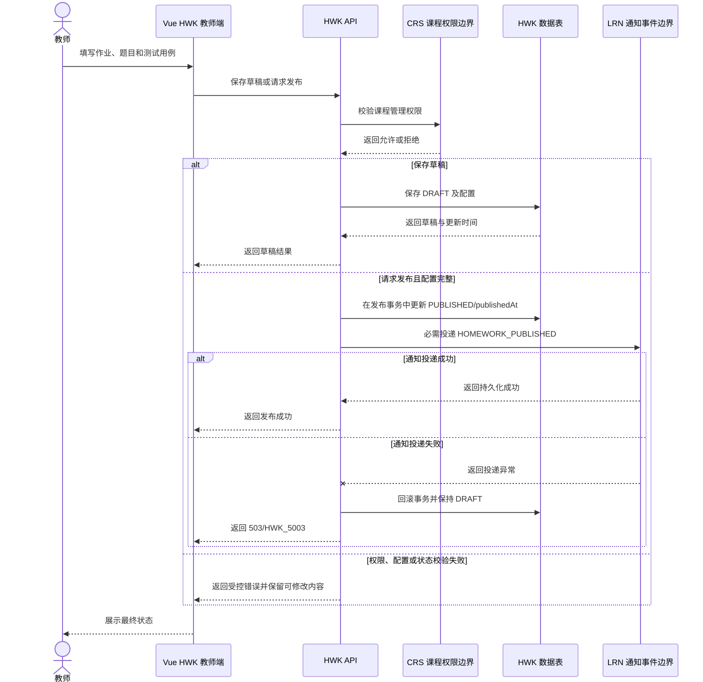

图 5-2-HWK-02 教师创建并发布作业组件顺序图。Mermaid 图源：`docs/diagrams/arch/fig_5_2_hwk_02_publish_component.mmd`。

#### UC-HWK-01 学生提交作业并触发自动评测组件顺序图

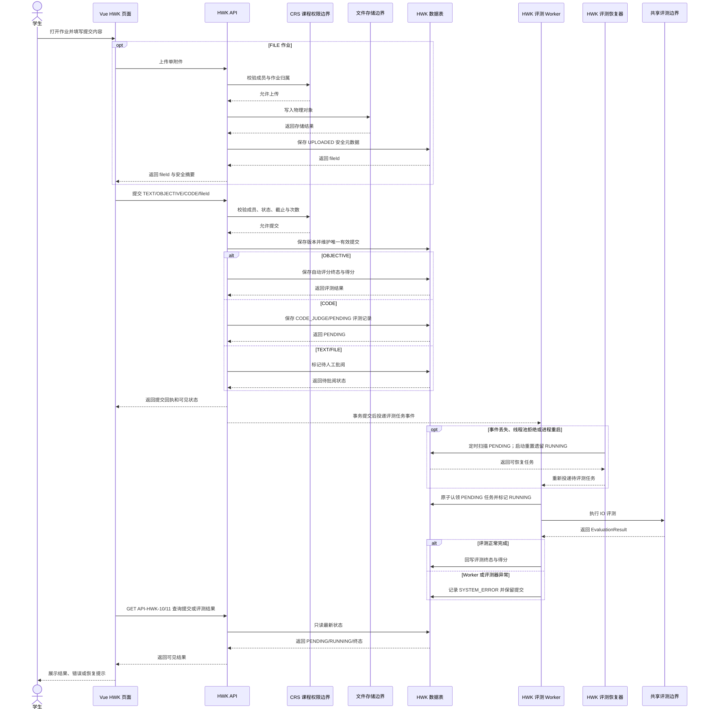

图 5-2-HWK-01 学生提交作业并触发自动评测组件顺序图。Mermaid 图源：`docs/diagrams/arch/fig_5_2_hwk_01_submission_component.mmd`。

**异常处理控制：**

系统通过统一异常处理器捕获和处理所有未处理异常。业务异常返回明确的错误码和用户可理解的错误提示，不暴露堆栈信息、SQL 语句、令牌细节等内部信息。评测服务异常时，提交记录保留但评测状态标记为 SYSTEM_ERROR，不影响学生和教师查看提交内容。网络异常时，前端通过本地缓存保存用户操作，联网后自动重试。

### 5.3 运行时间

**响应时间要求：**

| 操作类型 | 响应时间要求 | 说明 |
|---------|------------|------|
| 登录/注册认证 | ≤ 3 秒 | AUTH 模块 |
| 页面加载（列表查询） | ≤ 2 秒 | 分页查询和索引优化；Redis 可作为后续缓存扩展 |
| 作业/实验提交 | ≤ 3 秒 | 异步评测，不等待评测完成 |
| 代码自动评测 | ≤ 60 秒 | 异步执行，基础规模测试用例 |
| 成绩查询（学生） | ≤ 3 秒 | 按 courseId + studentId 索引 |
| 成绩总表查询（教师） | ≤ 5 秒 | 分页查询 |
| 通知列表加载 | ≤ 1 秒 | 首屏加载 |
| 未读红点更新 | 页面加载、手动刷新或轮询后可见 | 通过通知查询接口返回未读数；WebSocket/SSE 推送属于扩展机制 |
| 统计分析计算 | ≤ 5 秒 | 课程级/班级级统计 |

**可用性要求：**

系统在项目演示和验收期间需保持稳定可用。关键功能（登录、提交、查询、发布）不可出现频繁超时或服务不可用情况。单模块异常不应导致整个平台不可用。

**数据量预期：**

本版本系统面向课程项目演示环境，预计数据规模为：用户数百级、课程数十级、作业/实验数百级、提交记录数千级、成绩记录数千级。数据库设计在索引和数据类型选择上已考虑此规模下的查询性能。

---

## 6 需求追踪矩阵

本章用于建立 SRS、概要设计、页面、接口、实体/数据表、运行流程之间的追踪关系。详细设计和测试报告应沿用本表编号，不另行定义需求编号。

**追踪统计范围：** 本文档以同目录《软件需求规格说明书》第 11 章和第 14 章为需求追溯基线，设计矩阵承接 SRS 中 UC/OP 范围并与 FR/NFR 编号兼容。本文覆盖 6 个子系统、6 个设计模块、13 个关键用例、32 项系统操作、40 项功能需求和 30 项非功能需求；新增 UC 复用既有 OP，不重排既有 FR/NFR、API、UI、DB 编号。

| 统计项 | 统计范围 | 说明 |
|--------|---------|------|
| 子系统/模块 | 6 个子系统 / 6 个设计模块 | AUTH、CRS、LRN、LAB、HWK、GRD |
| 用例范围 | 13 个关键 UC | UC-AUTH-01、UC-CRS-01 ~ UC-CRS-02、UC-LRN-01、UC-LAB-01 ~ UC-LAB-02、UC-HWK-01 ~ UC-HWK-02、UC-GR-01 ~ UC-GR-05 |
| 系统操作范围 | 32 项 OP | OP-AUTH-01 ~ OP-AUTH-04、OP-CRS-01 ~ OP-CRS-07、OP-LRN-01 ~ OP-LRN-05、OP-LAB-01 ~ OP-LAB-06、OP-HWK-01 ~ OP-HWK-05、OP-GR-01 ~ OP-GR-05 |
| 需求范围 | 40 项 FR / 30 项 NFR | 以 SRS 第 5、6、11、14 章为准 |

### 6.1 模块级追踪总表

| 模块 | 需求范围 | UC 范围 | OP 范围 | 功能设计章节 | 页面章节 | API章节 | 数据/实体章节 | 运行流程 | 测试前缀 |
|------|---------|---------|---------|-------------|---------|--------|--------------|---------|---------|
| AUTH | FR-UA-01~07 / NFR-UA-01~05 | UC-AUTH-01 | OP-AUTH-01~04 | 2.5.1、2.6.1 | 3.1.1 | 3.2.1 | 3.3.1、4.1 | 5.2 AUTH 登录与鉴权 | TC-UA |
| CRS | FR-CR-01~06 / NFR-CR-01~05 | UC-CRS-01~02 | OP-CRS-01~07 | 2.5.2、2.6.2 | 3.1.2 | 3.2.2 | 3.3.2、4.2 | 5.2 CRS 加入课程 | TC-CR |
| LRN | FR-LN-01~06 / NFR-LN-01~05 | UC-LRN-01 | OP-LRN-01~05 | 2.5.3、2.6.3 | 3.1.3 | 3.2.3 | 3.3.3、4.3 | 5.2 LRN 定时提醒与通知重试 | TC-LN |
| LAB | FR-LAB-01~08 / NFR-LAB-01~05 | UC-LAB-01~02 | OP-LAB-01~06 | 2.5.4、2.6.4 | 3.1.4 | 3.2.4（API-LAB-01~19） | 3.3.4、4.4（DB-LAB-01~09） | 5.2 LAB 实验提交、源文件核对与评测 | TC-LAB-01~41、TC-LAB-N01~N05、MAN-LAB-001~011 |
| HWK | FR-HWK-01~06 / NFR-HWK-01~05 | UC-HWK-01~02 | OP-HWK-01~05 | 2.5.5、2.6.5 | 3.1.5 | 3.2.5 | 3.3.5、4.5 | 5.2 HWK 作业提交与批阅 | TC-HWK |
| GRD | FR-GR-01~07 / NFR-GR-01~05 | UC-GR-01~05 | OP-GR-01~05 | 2.5.6、2.6.6 | 3.1.6 | 3.2.6 | 3.3.6、4.6 | 5.2 GRD 成绩同步/发布/异议复核 | TC-GR |

### 6.2 功能需求到设计制品追踪

| 需求编号 | 设计小节 | 关键页面 | 关键 API | 关键实体/数据表 | 测试前缀 |
|---------|---------|---------|---------|----------------|---------|
| FR-UA-01 | 2.5.1 | 登录/注册页面 | /api/v1/auth/login, /api/v1/auth/register | User, LoginSession, t_auth_user, t_auth_session | TC-UA |
| FR-UA-02 | 2.5.1 | 角色管理/用户角色分配页面 | /api/v1/admin/roles, /api/v1/admin/users/{userId}/roles | Role, Permission, UserRole, RolePermission | TC-UA |
| FR-UA-03 | 2.5.1 | 无权限提示页面 | /api/v1/auth/check-permission | LoginSession, AuditLog | TC-UA |
| FR-UA-04 | 2.5.1 | 个人资料/修改密码页面 | /api/v1/users/me/password | User, AuditLog | TC-UA |
| FR-UA-05 | 2.5.1 | 无权限/登录失效提示页面 | /api/v1/auth/me | LoginSession, AuditLog | TC-UA |
| FR-UA-06 | 2.5.1 | 安全审计日志页面 | /api/v1/admin/audit-logs | AuditLog, t_auth_audit_log | TC-UA |
| FR-UA-07 | 2.5.1 | 全局错误提示 | /api/v1/auth/check-permission | Permission, AuditLog | TC-UA |
| FR-CR-01 | 2.5.2 | UI-CRS-01/02/07 | API-CRS-01~05 | Course, crs_course | TC-CR |
| FR-CR-02 | 2.5.2 | UI-CRS-02/03 | API-CRS-06~09 | Chapter, crs_chapter | TC-CR |
| FR-CR-03 | 2.5.2 | UI-CRS-04 | API-CRS-10~13 | Resource, crs_resource | TC-CR |
| FR-CR-04 | 2.5.2 | UI-CRS-01 | API-CRS-14/15/18/19 | CourseMember, crs_course_member | TC-CR |
| FR-CR-05 | 2.5.2 | UI-CRS-05 | API-CRS-16~19 | CourseMember, crs_course_member | TC-CR |
| FR-CR-06 | 2.5.2 | UI-CRS-02/06 | API-CRS-20~22 | Announcement, crs_announcement | TC-CR |
| FR-LN-01 | 2.5.3 | UI-LRN-01 | API-LRN-01 | LearningTask, lrn_learning_task | TC-LN |
| FR-LN-02 | 2.5.3 | UI-LRN-02 | API-LRN-02/03 | LearningProgress, lrn_learning_progress | TC-LN |
| FR-LN-03 | 2.5.3 | UI-LRN-03 | API-LRN-04/05 | LearningRecord, lrn_learning_record | TC-LN |
| FR-LN-04 | 2.5.3 | UI-LRN-04 | API-LRN-06/09 | Notification, lrn_notification | TC-LN |
| FR-LN-05 | 2.5.3 | UI-LRN-04 | API-LRN-07/08 | NotificationStatusLog, lrn_notification_status_log | TC-LN |
| FR-LN-06 | 2.5.3 | UI-LRN-05 | API-LRN-10/11 | ReminderRule, lrn_reminder_rule | TC-LN |
| FR-LAB-01 | 2.5.4 | UI-LAB-01/04 | API-LAB-01 ~ API-LAB-07 | LabExperiment, LabTestcase, lab_experiment, lab_testcase | TC-LAB |
| FR-LAB-02 | 2.5.4 | UI-LAB-02 | API-LAB-03、API-LAB-08、API-LAB-10 | LabSubmission, LabSubmissionSourceFile, lab_submission, DB-LAB-09 | TC-LAB-08~11、34、38~39、41 |
| FR-LAB-03 | 2.5.4 | UI-LAB-05/06 | API-LAB-09、API-LAB-10、API-LAB-19 | LabSubmission, LabSubmissionSourceFile, lab_submission, DB-LAB-09 | TC-LAB-12~14、34~38、41 |
| FR-LAB-04 | 2.5.4 | UI-LAB-02/07 | API-LAB-11、API-LAB-12、API-LAB-15（能力编号，本版本随 API-LAB-01/04 整体维护测试用例） | LabEvaluation, LabEvaluationResult, LabTestcase, lab_evaluation, DB-LAB-08 lab_evaluation_result, lab_testcase | TC-LAB |
| FR-LAB-05 | 2.5.4 | UI-LAB-02/06 | API-LAB-16、API-LAB-17 | LabReport, lab_report | TC-LAB |
| FR-LAB-06 | 2.5.4 | UI-LAB-06 | API-LAB-10、API-LAB-13、API-LAB-17、API-LAB-19 | LabSubmission, LabSubmissionSourceFile, LabReport, LabScore, LabScoreChangeLog, DB-LAB-09, lab_score, lab_score_change_log, lab_report | TC-LAB-24~27、35~40、MAN-LAB-011 |
| FR-LAB-07 | 2.5.4 | UI-LAB-07 | API-LAB-10、API-LAB-12、API-LAB-18 | LabEvaluation, LabSubmission, LabScore, lab_evaluation, lab_submission, lab_score | TC-LAB |
| FR-LAB-08 | 2.5.4 | UI-LAB-08 | API-LAB-14 | LabSubmission, LabEvaluation, LabScore, lab_submission, lab_evaluation, lab_score | TC-LAB |
| FR-HWK-01 | 2.5.5 | UI-HWK-01/02/03 | API-HWK-01/02/03/04/16/18/22 | Homework, HomeworkJudgeConfig, t_hwk_homework, t_hwk_judge_config | TC-HWK-01/02/03/19 |
| FR-HWK-02 | 2.5.5 | UI-HWK-04/05 | API-HWK-05/06/07/17/23/24 | HomeworkSubmission, HomeworkSubmissionAttachment, t_hwk_submission, DB-HWK-08 | TC-HWK-20 ~ TC-HWK-24、TC-HWK-27、MAN-HWK-012 |
| FR-HWK-03 | 2.5.5 | UI-HWK-06 | API-HWK-08/09/10/24 | HomeworkSubmission, HomeworkSubmissionAttachment, t_hwk_submission, DB-HWK-08 | TC-HWK-25/26、MAN-HWK-012 |
| FR-HWK-04 | 2.5.5 | UI-HWK-07 | API-HWK-07/11/12/18/19/20 | HomeworkEvaluation, HomeworkTestCase | TC-HWK |
| FR-HWK-05 | 2.5.5 | UI-HWK-08/09 | API-HWK-09/10/12/13/21/24 | HomeworkReviewLog, HomeworkSubmissionAttachment, t_hwk_review_log, DB-HWK-08 | TC-HWK-25/26、MAN-HWK-012 |
| FR-HWK-06 | 2.5.5 | UI-HWK-01/07/09 | API-HWK-05/06/11/14/15 | HomeworkSubmission, HomeworkEvaluation | TC-HWK |
| FR-GR-01 | 2.5.6 | UI-GRD-01 | API-GRD-01~05/07 | GradeItem, t_grade_item | TC-GR |
| FR-GR-02 | 2.5.6 | UI-GRD-02 | API-GRD-06~09 | GradeRecord, CourseGradeSummary | TC-GR |
| FR-GR-03 | 2.5.6 | UI-GRD-02/03/04/08 | API-GRD-08~14 | GradeRecord, GradeChangeLog | TC-GR |
| FR-GR-04 | 2.5.6 | UI-GRD-04/05 | API-GRD-12/13/14 | GradePublishRecord, CourseGradeSummary | TC-GR |
| FR-GR-05 | 2.5.6 | UI-GRD-06 | API-GRD-15 | GradeRecord, CourseGradeSummary | TC-GR |
| FR-GR-06 | 2.5.6 | UI-GRD-07 | API-GRD-16/17 | GradeAnalysisSnapshot, t_grade_analysis_snapshot, t_grade_analysis_source_version | TC-GR |
| FR-GR-07 | 2.5.6 | UI-GRD-09/10 | API-GRD-18~21 | GradeReviewRequest, t_grade_review_request | TC-GR |

### 6.3 非功能需求追踪

| 需求范围 | 设计闭合点 | 验证方式 |
|---------|-----------|---------|
| NFR-UA-01~05 | 2.6.1、AUTH 拦截器、会话、权限、审计日志 | 登录/越权/会话失效/密码修改/审计日志测试 |
| NFR-CR-01~05 | 2.6.2、课程首页、资源上传、只读历史、格式白名单 | 课程创建、加入、关闭、资源上传失败、未加入访问资源测试 |
| NFR-LN-01~05 | 2.6.3、数据库落库、页面刷新/轮询、任务中心、通知状态日志、提醒规则 | 刷新时延、列表性能、断点续传、2 步路径、状态留痕测试 |
| NFR-LAB-01~05 | 2.6.4、提交落库、异步评测执行器、Docker 沙箱、Mock/Fake 评测器 | 提交保留、60 秒评测、隐藏用例、逾期/重复/失败场景测试 |
| NFR-HWK-01~05 | 2.6.5、作业提交、评测任务、批阅日志、标准答案隐藏、草稿原子逻辑删除与子历史保留 | 作业提交、重评、批阅、发布、异常评测、草稿删除权限/状态/并发防复活及 1440px/390px 测试 |
| NFR-GR-01~05 | 2.6.6、计算批次、发布记录、变更记录、统计快照、权限过滤 | 未发布不可见、规则错误、来源缺失、成绩修改留痕、统计快照测试 |
