# 软件详细设计说明书

## 封面信息

课程名称：软件工程基础
项目名称：在线教学与实训平台
文档名称：软件详细设计说明书
文档编号：DSD-01
版本号：V1.0
编写人：王彦骁
参与编写：全体组员
审核人：赵贵彬
提交日期：2026 年 5 月 24 日

---

## 编写说明

本文档在《软件需求规格说明书》和《软件概要设计说明书》的基础上，对“在线教学与实训平台”的详细设计进行统一说明，覆盖系统结构、模块职责、页面交互、接口协议、服务组件、数据结构、异常处理、安全与性能、测试计划和需求追踪关系。

文档以 AUTH、CRS、LRN、LAB、HWK、GRD 六个子系统为设计单元，在第 3 章描述各模块的边界、流程、状态机和实现要点，在第 4 章、第 5 章和第 9 章分别汇总界面、接口、数据表与需求追踪关系。跨模块协作遵循“基础模块提供身份、课程、任务、成绩和通知能力，业务模块完成自身数据归属校验”的原则。

---

## 目录

- [1 引言](#1-引言)
  - [1.1 编写目的](#11-编写目的)
  - [1.2 项目背景](#12-项目背景)
  - [1.3 术语表](#13-术语表)
  - [1.4 参考文档](#14-参考文档)
- [2 系统结构设计及子系统划分](#2-系统结构设计及子系统划分)
  - [2.1 系统总体结构](#21-系统总体结构)
  - [2.2 技术架构](#22-技术架构)
  - [2.3 子系统划分](#23-子系统划分)
  - [2.4 模块间依赖关系](#24-模块间依赖关系)
  - [2.5 详细设计表达约定](#25-详细设计表达约定)
    - [2.5.4 包与目录结构视图](#254-包与目录结构视图)
    - [2.5.5 全局数据库关系视图](#255-全局数据库关系视图)
    - [2.5.6 核心静态类关系视图](#256-核心静态类关系视图)
- [3 功能模块详细设计](#3-功能模块详细设计)
  - [3.1 用户权限与平台安全模块（AUTH）](#31-用户权限与平台安全模块auth)
  - [3.2 课程与教学资源模块（CRS）](#32-课程与教学资源模块crs)
  - [3.3 学习过程与通知提醒模块（LRN）](#33-学习过程与通知提醒模块lrn)
  - [3.4 实训实验模块（LAB）](#34-实训实验模块lab)
  - [3.5 作业与自动评测模块（HWK）](#35-作业与自动评测模块hwk)
  - [3.6 成绩评价与教学分析模块（GRD）](#36-成绩评价与教学分析模块grd)
- [4 界面设计](#4-界面设计)
  - [4.1 外部界面设计](#41-外部界面设计)
  - [4.2 内部界面设计](#42-内部界面设计)
  - [4.3 用户界面设计](#43-用户界面设计)
- [5 接口与数据结构设计](#5-接口与数据结构设计)
  - [5.1 接口设计约定](#51-接口设计约定)
  - [5.2 数据库设计约定](#52-数据库设计约定)
  - [5.3 接口清单汇总](#53-接口清单汇总)
  - [5.4 数据表清单汇总](#54-数据表清单汇总)
- [6 异常处理设计](#6-异常处理设计)
  - [6.1 出错信息管理](#61-出错信息管理)
  - [6.2 故障预防与补救](#62-故障预防与补救)
  - [6.3 系统维护设计](#63-系统维护设计)
- [7 性能优化和安全设计](#7-性能优化和安全设计)
  - [7.1 数据存储安全性考虑](#71-数据存储安全性考虑)
  - [7.2 数据传输安全性考虑](#72-数据传输安全性考虑)
  - [7.3 数据访问安全性考虑](#73-数据访问安全性考虑)
  - [7.4 性能优化考虑](#74-性能优化考虑)
- [8 项目测试计划](#8-项目测试计划)
- [9 需求追踪矩阵](#9-需求追踪矩阵)
- [10 设计实现约束与风险控制](#10-设计实现约束与风险控制)

---

# 1 引言

## 1.1 编写目的

本文档在《软件需求规格说明书》和《概要设计说明书》的基础上，对“在线教学与实训平台”的系统结构、功能模块、界面、接口、数据结构、异常处理、安全性能和测试计划进行详细说明。本文档的目标是将概要设计阶段确定的模块边界和接口关系进一步细化，使开发人员能够据此进行编码实现，使测试人员能够据此编写测试用例，也使项目负责人能够在最终交付时检查需求、设计、测试和演示之间的一致性。

本文档的预期读者包括项目组成员、前端开发人员、后端开发人员、测试人员、评审人员、指导教师和助教。

## 1.2 项目背景

本项目为软件工程基础课程设计项目，系统名称为“在线教学与实训平台”。系统面向高校教学场景，支持学生、教师和管理员三类角色，覆盖课程组织、教学资源管理、学习过程记录、实验实训、作业与自动评测、成绩评价与教学分析、通知提醒和平台权限管理等核心教学环节。

系统定位为轻量级在线教学与实训平台，不追求商业级教务系统或高并发在线判题平台的完整能力，而是在课程项目范围内实现流程完整、边界清晰、可稳定演示、可测试验收的教学闭环。

## 1.3 术语表

| 术语 | 说明 |
| --- | --- |
| 在线教学与实训平台 | 本项目开发的软件系统 |
| 学生 | 课程学习者，可加入课程、查看资源、提交实验/作业、查看成绩 |
| 教师 | 课程组织者，可创建课程、发布资源、发布实验/作业、评分和发布成绩 |
| 管理员 | 平台维护者，可管理用户、角色、权限、平台配置和审计日志 |
| 课程 | 教师组织教学内容和任务的基本单元 |
| 教学资源 | 课程相关的视频、课件、文档、链接、附件等学习材料 |
| 实训实验 | 课程中的实践任务，学生按要求完成并提交结果 |
| 作业 | 教师发布的学习任务，可包含主观题、客观题或代码题 |
| 自动评测 | 系统根据预设规则对提交结果进行自动判定和反馈 |
| 成绩项 | 课程中可计分的项目，如实验、作业、测验等 |
| 通知 | 系统向用户推送的站内消息，如任务发布、截止提醒、成绩发布 |

## 1.4 参考文档

- 《软件开发计划书》
- 《软件需求规格说明书》
- 《软件概要设计说明书》
- 详细设计样例 PDF：《软件详细设计说明书.pdf》

---

# 2 系统结构设计及子系统划分

## 2.1 系统总体结构

系统采用 B/S 架构，用户通过浏览器访问前端页面，前端通过 RESTful API 调用后端服务，后端负责业务处理、权限校验、数据持久化、文件管理和跨模块业务协作，数据库采用 MySQL 保存核心业务数据。

系统总体结构可概括为：

```text
用户浏览器
  -> 前端应用（页面、路由、表单、交互）
  -> 后端 API 服务（认证、课程、学习、实验、作业、成绩、通知）
  -> 数据库 MySQL（用户、课程、提交、评测、成绩、通知等数据）
  -> 文件存储（课程资源、实验/作业附件、提交文件）
```

图 2-1 系统总体结构图

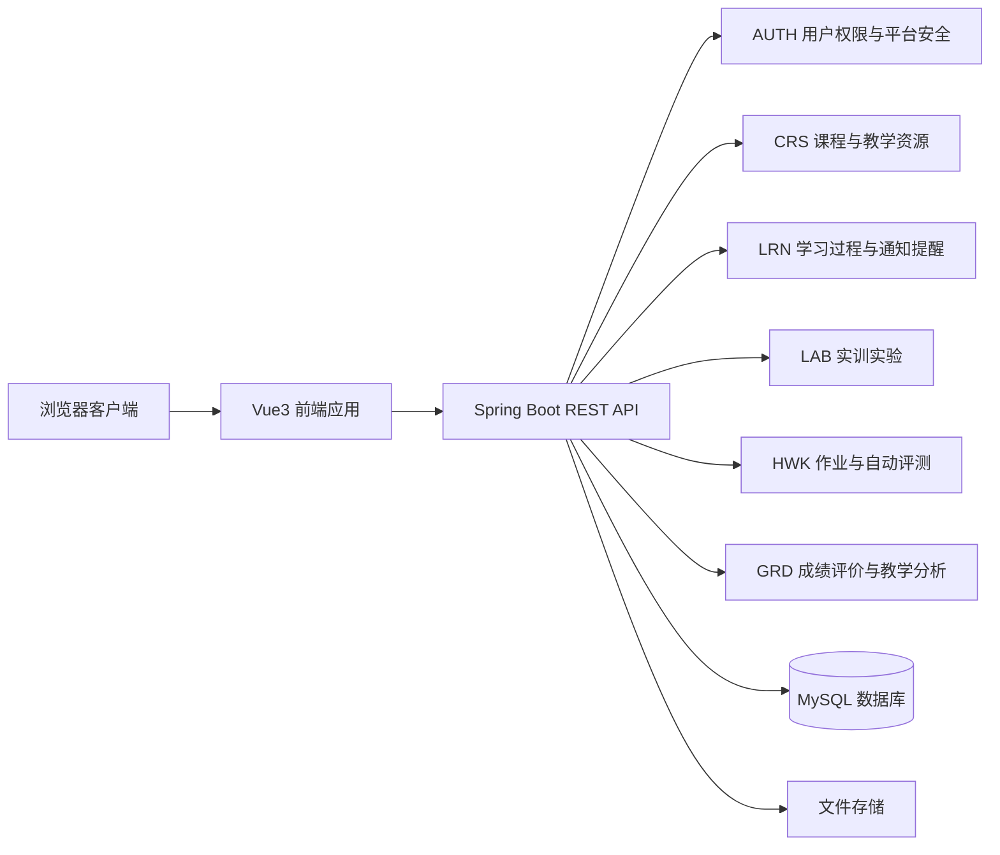
```mermaid
flowchart LR
  Browser[浏览器客户端] --> Frontend[Vue3 前端应用]
  Frontend --> Api[Spring Boot REST API]
  Api --> Auth[AUTH 用户权限与平台安全]
  Api --> Crs[CRS 课程与教学资源]
  Api --> Lrn[LRN 学习过程与通知提醒]
  Api --> Lab[LAB 实训实验]
  Api --> Hwk[HWK 作业与自动评测]
  Api --> Grd[GRD 成绩评价与教学分析]
  Api --> Db[(MySQL 数据库)]
  Api --> FileStore[文件存储]
```

## 2.2 技术架构

本系统采用前后端分离方式实现。前端技术栈为 Vue3 + TypeScript，后端技术栈为 Spring Boot，数据库为 MySQL。接口采用 RESTful 风格，前后端通过 JSON 数据交互。文件资源通过统一文件存储抽象管理，通知机制以站内消息为基础通道。

| 层次 | 设计说明 |
| --- | --- |
| 表现层 | 提供学生端、教师端、管理端页面，负责表单校验、列表展示、状态反馈和接口调用 |
| 接口层 | 提供 RESTful API，统一请求响应格式，完成基础参数校验和权限入口控制 |
| 业务层 | 按模块承载核心业务流程，包括课程、学习、实验、作业、成绩和通知等 |
| 数据访问层 | 封装数据库增删改查、分页查询、条件查询和事务相关操作 |
| 数据存储层 | 使用 MySQL 存储结构化数据，文件资源由文件存储路径或文件服务管理 |

## 2.3 子系统划分

系统划分为六个核心子系统：

| 子系统 | 缩写 | 主要职责 |
| --- | --- | --- |
| 用户权限与平台安全子系统 | AUTH | 用户注册登录、角色权限、访问控制、密码安全、审计日志 |
| 课程与教学资源子系统 | CRS | 课程创建、章节管理、资源上传、课程成员管理、课程公告 |
| 学习过程与通知提醒子系统 | LRN | 学习任务中心、学习进度记录、通知生成、通知读取、提醒规则 |
| 实训实验子系统 | LAB | 实验创建发布、学生提交、实验报告、自动评测、教师评分、实验结果反馈 |
| 作业与自动评测子系统 | HWK | 作业发布、作业提交、测试用例、自动评测、教师批阅和重评 |
| 成绩评价与教学分析子系统 | GRD | 成绩项配置、成绩汇总、成绩发布、学生查询、教学统计分析 |

## 2.4 模块间依赖关系

系统中 AUTH 和 CRS 是多个业务模块的基础依赖。LAB、HWK、GRD 和 LRN 之间存在通知、提交、评分和成绩同步关系。

| 调用方 | 被调用方 | 依赖内容 |
| --- | --- | --- |
| CRS/LRN/LAB/HWK/GRD | AUTH | 当前用户身份、角色、权限、用户基础信息 |
| LRN/LAB/HWK/GRD | CRS | 课程信息、章节信息、课程成员关系、教师管理权限 |
| LAB/HWK | LRN | 发布、截止、评测完成、报告提交、评分完成后的通知触发 |
| GRD | LAB/HWK | 实验/作业成绩来源、提交状态、评测结果、评分记录 |
| LAB/HWK | GRD | 评分完成后推送或提供成绩数据 |
| GRD | LRN | 成绩发布、成绩复核结果通知 |

跨模块协作采用“同步 API + 业务事件”的组合方式：AUTH、CRS 作为基础能力主要提供同步校验接口；LAB、HWK 在发布、提交、评测、评分完成后触发 LRN 通知事件，并向 GRD 提供成绩来源数据；GRD 在成绩发布和复核完成后触发 LRN 通知。

图 2-2 模块依赖关系图

说明：图 2-2 仅展示模块主依赖；成绩同步、通知触发和事件字段等联调细节以依赖表及各模块详细设计为准。

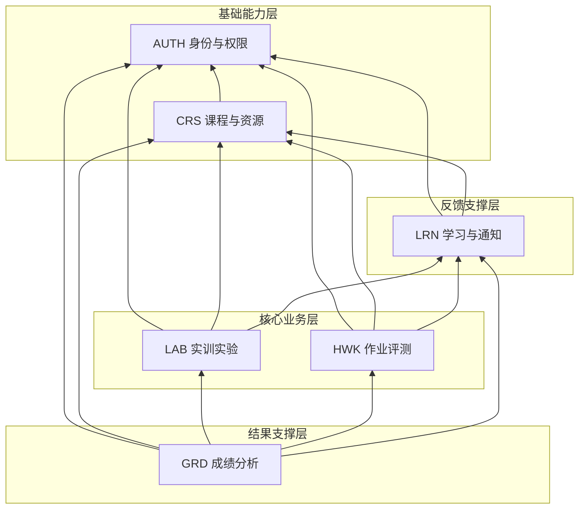
```mermaid
flowchart BT
  subgraph Feedback["反馈支撑层"]
    direction LR
    LRN["LRN 学习与通知"]
  end

  subgraph Result["结果支撑层"]
    direction LR
    GRD["GRD 成绩分析"]
  end

  subgraph Task["核心业务层"]
    direction LR
    LAB["LAB 实训实验"]
    HWK["HWK 作业评测"]
  end

  subgraph Foundation["基础能力层"]
    direction LR
    AUTH["AUTH 身份与权限"]
    CRS["CRS 课程与资源"]
  end

  CRS --> AUTH
  LAB --> AUTH
  HWK --> AUTH
  GRD --> AUTH
  LRN --> AUTH

  LAB --> CRS
  HWK --> CRS
  GRD --> CRS
  LRN --> CRS

  GRD --> LAB
  GRD --> HWK

  LAB --> LRN
  HWK --> LRN
  GRD --> LRN
```

## 2.5 详细设计表达约定

为保证详细设计在实现、测试和验收阶段保持一致，本文档对图示、编号和跨模块约束作如下约定。

### 2.5.1 图示与编号

| 表达对象 | 表达方式 | 说明 |
| --- | --- | --- |
| 系统结构与模块依赖 | 架构图、依赖图 | 展示访问链路、基础能力层和业务模块依赖方向 |
| 关键业务流程 | 流程图或顺序图 | 展示用户操作、接口调用、服务处理和数据落库顺序 |
| 状态复杂对象 | 状态机图 | 展示提交、评测、发布、通知已读等状态迁移约束 |
| 页面、接口、服务、数据表 | 统一编号 | 页面使用 `UI-*`，接口使用 `API-*`，服务使用 `SVC-*`，数据表使用 `DB-*` |

图编号采用“章节号-序号”格式，例如“图 2-1 系统总体结构图”“图 3-1 用户登录顺序图”。同一模块在流程、接口、服务和数据表中的编号应保持可追踪，便于与第 9 章需求追踪矩阵建立对应关系。

### 2.5.2 命名与图示约束

- 模块统一使用缩写：AUTH、CRS、LRN、LAB、HWK、GRD。
- 用户角色统一写作：学生、教师、管理员；涉及课程助教时明确写作“助教”。
- 系统外部对象统一写作：浏览器客户端、文件存储、站内通知、MySQL 数据库。
- 箭头方向统一从调用方指向被调用方，从用户操作指向系统处理，从前端指向后端，从业务模块指向依赖模块。
- 流程图节点采用“动词 + 对象”命名，例如“提交作业”“校验权限”“写入评测结果”。
- 顺序图参与者按用户、前端页面、Controller/API、Service、Repository/Mapper、数据库或外部模块的顺序组织。

### 2.5.3 跨模块设计约束

1. 所有业务模块访问用户身份、会话和平台级权限时，以 AUTH 提供的认证上下文为准。
2. 课程归属、课程成员、教师管理权限和章节资源归属以 CRS 数据为准，业务模块不得只依赖前端传入的用户编号。
3. LAB 与 HWK 负责提交、评测和评分过程，GRD 负责成绩归集、发布、复核和统计分析。
4. LRN 负责通知生成、提醒规则和已读状态；业务模块通过事件或接口触发通知，不直接维护通知中心数据。
5. 跨模块数据交换必须明确来源编号、课程编号、操作者身份、状态、更新时间和幂等处理策略。
6. LAB 与 HWK 均包含代码评测能力，详细设计阶段合并为“评测任务 + 评测器 + 评测记录”的共同设计元素。两模块保留各自业务表和接口编号，但复用 `EvaluationTask`、`Evaluator`、`SandboxExecutor`、`EvaluationResult` 和超时/资源限制策略，避免各自实现一套不兼容的评测流程。
7. 课程权限校验、文件存储、通知事件发布和成绩来源同步分别通过 `CoursePermissionClient`、`FileStorageService`、`NotificationEventPublisher`、`SourceGradeClient` 四类代理接口完成。业务模块不得直接读取其他模块内部表，也不得重复实现权限、文件、通知和成绩同步逻辑。

### 2.5.4 包与目录结构视图

后端实现按 `com.onlinejudge` 根包组织，六个业务模块保持独立业务边界，跨模块复用能力集中放在 `common` 与 `integration` 包，避免各模块重复定义登录态、课程权限、通知事件、文件存储和来源成绩对象。

图 2-3 后端包与目录结构视图


```mermaid
flowchart TB
    Root["com.onlinejudge"]
    Root --> Auth["auth<br/>controller/service/repository/domain"]
    Root --> Crs["crs<br/>controller/service/mapper/domain"]
    Root --> Lrn["lrn<br/>controller/service/repository/domain"]
    Root --> Lab["lab<br/>controller/service/repository/domain"]
    Root --> Hwk["hwk<br/>controller/service/repository/domain"]
    Root --> Grd["grd<br/>controller/service/repository/domain"]
    Root --> Common["common"]
    Root --> Integration["integration"]

    Common --> CommonSecurity["common.security<br/>CurrentUser / 鉴权拦截"]
    Common --> CommonWeb["common.web<br/>ApiResponse / PageResponse"]
    Common --> CommonEvaluation["common.evaluation<br/>EvaluationTask / Evaluator / SandboxExecutor"]
    Common --> CommonEvent["common.event<br/>NotificationEvent / NotificationEventPublisher"]
    Common --> CommonStorage["common.storage<br/>FileStorageService / StoredFile"]
    Common --> CommonException["common.exception<br/>统一异常与错误响应"]

    Integration --> IntegrationCourse["integration.course<br/>CoursePermissionClient"]
    Integration --> IntegrationGrade["integration.grade<br/>SourceGradeDTO / SourceGradeClient / SourceGradeProvider"]
    Integration --> IntegrationNotification["integration.notification<br/>通知事件客户端预留"]
    Integration --> IntegrationAuth["integration.auth<br/>认证能力客户端预留"]

    Lab -.-> CommonEvaluation
    Hwk -.-> CommonEvaluation
    Crs -.-> CommonStorage
    Lab -.-> CommonStorage
    Hwk -.-> CommonStorage
    Crs -.-> CommonEvent
    Lab -.-> CommonEvent
    Hwk -.-> CommonEvent
    Grd -.-> CommonEvent
    Grd -.-> IntegrationGrade
    Lab -.-> IntegrationGrade
    Hwk -.-> IntegrationGrade
```

前端实现按 `frontend/src` 拆分为 `api`、`types`、`views`、`components`、`app` 和 `utils`。模块 API 封装位于 `frontend/src/api/{auth,crs,lrn,lab,hwk,grd}`，页面位于 `frontend/src/views/{auth,crs,lrn,lab,hwk,grd}`，共享请求层统一使用 `frontend/src/api/http.ts` 注入登录态并解包 `{ code, message, data }` 响应。

### 2.5.5 全局数据库关系视图

本版本部署可以使用同一个 MySQL 库保存六个模块数据，但模块之间优先采用逻辑引用和服务契约，不以跨模块物理外键替代权限校验、来源同步和通知事件。全局关系如下：

图 2-4 全局数据库关系视图


```mermaid
erDiagram
    t_auth_user ||--o{ t_auth_session : "user_id"
    t_auth_user ||--o{ t_auth_user_role : "user_id"
    t_auth_role ||--o{ t_auth_user_role : "role_id"
    t_auth_role ||--o{ t_auth_role_permission : "role_id"
    t_auth_permission ||--o{ t_auth_role_permission : "permission_id"

    crs_course ||--o{ crs_chapter : "course_id"
    crs_course ||--o{ crs_resource : "course_id"
    crs_course ||--o{ crs_course_member : "course_id"
    crs_course ||--o{ crs_announcement : "course_id"

    crs_course ||--o{ lab_experiment : "course_id"
    lab_experiment ||--o{ lab_testcase : "lab_id"
    lab_experiment ||--o{ lab_submission : "lab_id"
    lab_submission ||--o{ lab_evaluation : "submission_id"
    lab_submission ||--o{ lab_report : "submission_id"
    lab_submission ||--o| lab_score : "submission_id"
    lab_score ||--o{ lab_score_change_log : "score_id"

    crs_course ||--o{ t_hwk_homework : "course_id"
    t_hwk_homework ||--o{ t_hwk_question : "homework_id"
    t_hwk_homework ||--o{ t_hwk_test_case : "homework_id"
    t_hwk_homework ||--o{ t_hwk_submission : "homework_id"
    t_hwk_submission ||--o{ t_hwk_evaluation : "submission_id"
    t_hwk_submission ||--o{ t_hwk_review_log : "submission_id"

    crs_course ||--o{ lrn_learning_task : "course_id"
    crs_course ||--o{ lrn_learning_progress : "course_id"
    crs_course ||--o{ lrn_learning_record : "course_id"
    t_auth_user ||--o{ lrn_notification : "user_id"
    lrn_notification ||--o{ lrn_notification_status_log : "notification_id"

    crs_course ||--o{ t_grade_item : "course_id"
    t_grade_item ||--o{ t_grade_record : "grade_item_id"
    crs_course ||--o{ t_course_grade_summary : "course_id"
    crs_course ||--o{ t_grade_publish_record : "course_id"
    crs_course ||--o{ t_grade_calculation_batch : "course_id"
    crs_course ||--o{ t_grade_review_request : "course_id"
    crs_course ||--o{ t_grade_change_log : "course_id"
    crs_course ||--o{ t_grade_analysis_snapshot : "course_id"
```

说明：上图表达设计层面的数据归属与逻辑引用。AUTH 用户、CRS 课程、LAB/HWK 提交、GRD 成绩和 LRN 通知均需在业务层完成登录态、课程成员和本人数据过滤；数据库物理外键可在局部模块内部使用，跨模块关系以 `course_id`、`student_id`、`source_type + source_id` 等逻辑字段和公共客户端契约维持一致。

### 2.5.6 核心静态类关系视图

系统后端静态结构采用 Controller、Service、Repository/Mapper、Domain/DTO 分层。业务模块只依赖公共上下文、课程权限客户端、文件存储、评测器、通知事件发布器和来源成绩 DTO，不直接访问其他模块内部表。下图概括核心控制器、服务、仓储、DTO 与领域对象之间的静态关系，便于开发和评审确认模块边界。

图 2-5 核心静态类关系图


```mermaid
classDiagram
    class ApiResponse~T~ {
      int code
      String message
      T data
    }
    class CurrentUser {
      Long userId
      Set~String~ roles
      Set~String~ permissions
    }
    class CoursePermissionClient {
      checkMember(courseId, userId)
      checkManagePermission(courseId, userId)
    }
    class FileStorageService {
      save(file)
      load(fileId)
    }
    class NotificationEventPublisher {
      publish(event)
    }
    class SourceGradeDTO {
      String sourceType
      Long sourceId
      Long courseId
      Long studentId
      BigDecimal rawScore
      String scoreStatus
    }
    class SourceGradeProvider {
      listPublishedGrades(courseId, sourceId)
    }
    class EvaluationTask {
      Long submissionId
      String language
      Integer timeLimitMs
      Integer memoryLimitKb
    }
    class Evaluator {
      evaluate(task)
    }
    class SandboxExecutor {
      execute(task)
    }
    class EvaluationResult {
      String status
      BigDecimal score
      String feedback
    }

    class HomeworkController
    class HomeworkService
    class HomeworkSubmissionService
    class HomeworkEvaluationService
    class HomeworkRepository
    class Homework
    class HomeworkSubmission

    class LabController
    class LabService
    class LabEvaluationService
    class LabRepository
    class LabExperiment
    class LabSubmission

    class GradeRecordController
    class GradeSourceSyncService
    class GradeCalculationService
    class GradeRepository
    class GradeRecord
    class CourseGradeSummary

    class LearningTaskService
    class NotificationService
    class LrnRepository
    class LearningTask
    class Notification

    HomeworkController --> HomeworkService
    HomeworkService --> HomeworkRepository
    HomeworkService --> CoursePermissionClient
    HomeworkService --> NotificationEventPublisher
    HomeworkSubmissionService --> HomeworkRepository
    HomeworkEvaluationService --> Evaluator
    HomeworkRepository --> Homework
    HomeworkRepository --> HomeworkSubmission
    HomeworkService ..|> SourceGradeProvider

    LabController --> LabService
    LabService --> LabRepository
    LabService --> CoursePermissionClient
    LabService --> FileStorageService
    LabService --> NotificationEventPublisher
    LabEvaluationService --> Evaluator
    LabRepository --> LabExperiment
    LabRepository --> LabSubmission
    LabService ..|> SourceGradeProvider

    Evaluator --> SandboxExecutor
    Evaluator --> EvaluationTask
    Evaluator --> EvaluationResult

    GradeRecordController --> GradeSourceSyncService
    GradeSourceSyncService --> SourceGradeProvider
    GradeSourceSyncService --> GradeRepository
    GradeSourceSyncService --> SourceGradeDTO
    GradeCalculationService --> GradeRepository
    GradeRepository --> GradeRecord
    GradeRepository --> CourseGradeSummary

    LearningTaskService --> LrnRepository
    NotificationService --> LrnRepository
    NotificationService --> NotificationEventPublisher
    LrnRepository --> LearningTask
    LrnRepository --> Notification

    HomeworkController --> ApiResponse
    LabController --> ApiResponse
    GradeRecordController --> ApiResponse
    HomeworkService --> CurrentUser
    LabService --> CurrentUser
    GradeSourceSyncService --> CurrentUser
```

说明：图中 `SourceGradeProvider` 由 LAB/HWK 适配实现，GRD 只面向 `SourceGradeDTO` 同步来源成绩；`Evaluator` 由 LAB/HWK 共享，底层可替换 Fake 或 Docker 沙箱执行器；`NotificationEventPublisher` 由业务模块发布事件，LRN 负责通知落库和状态维护。

---

# 3 功能模块详细设计

本章按六个功能模块展开详细设计。各模块依次说明设计边界、职责与依赖、页面、接口、服务、数据结构、关键流程、状态机、异常处理、安全、性能和测试追踪，使模块设计能够直接支撑开发实现、接口联调和测试用例编写。

## 3.1 用户权限与平台安全模块（AUTH）

### 设计边界

本模块对应需求范围为 `FR-UA-01 ~ FR-UA-07`、`NFR-UA-01 ~ NFR-UA-05`，测试编号前缀为 `TC-UA`。本模块负责平台级身份认证、角色权限、访问控制、账号安全、会话管理和关键操作审计，为 CRS、LRN、LAB、HWK、GRD 等业务模块提供统一的用户身份和基础权限能力。

本模块不负责课程、实验、作业、成绩、通知等业务数据的创建和维护。涉及“当前用户是否属于某课程”“是否可访问某次作业/实验/成绩”等业务归属判断时，AUTH 只提供当前用户上下文和平台级角色权限，具体业务范围由对应模块结合自身数据二次校验。

### 模块基本信息

| 项目 | 内容 |
| --- | --- |
| 模块编号 | DSD-AUTH |
| 模块名称 | 用户权限与平台安全模块 |
| 模块缩写 | AUTH |
| 设计重点 | 身份认证、角色权限、会话安全、审计日志 |
| 对应需求 | FR-UA-01 ~ FR-UA-07 / NFR-UA-01 ~ NFR-UA-05 |
| 依赖模块 | 无基础业务依赖 |
| 被依赖模块 | CRS、LRN、LAB、HWK、GRD |
| 主要交付 | 页面设计、API 设计、服务设计、数据表设计、登录流程、鉴权流程、账号状态机、异常与审计、需求追踪 |

### 模块职责与依赖关系

### 本模块负责的内容

1. 用户注册、登录、退出和登录状态维护。
2. 用户基础信息维护，包括昵称、联系方式、头像、账号状态等。
3. 密码安全管理，包括密码哈希存储、修改密码、登录失败限制。
4. 角色管理，包括学生、教师、管理员等角色维护。
5. 权限管理，包括菜单权限、接口权限、操作权限和角色权限分配。
6. 用户角色关系维护，包括管理员为用户分配、调整角色。
7. 页面、接口和资源访问的统一认证与权限校验。
8. 为其他模块提供当前用户上下文和通用权限校验能力。
9. 登录、退出、密码修改、角色调整、权限变更、越权访问等关键操作审计。
10. 认证失败、会话过期、权限不足、账号禁用等安全异常处理。

### 本模块不负责的内容

1. 不负责课程创建、章节管理、课程资源和课程成员关系维护，相关内容由 CRS 负责。
2. 不负责学习记录、任务中心和通知展示，相关内容由 LRN 负责。
3. 不负责实验发布、实验提交、实验评测和实验评分，相关内容由 LAB 负责。
4. 不负责作业发布、作业提交、作业评测和作业批阅，相关内容由 HWK 负责。
5. 不负责成绩项配置、成绩汇总、成绩发布和教学分析，相关内容由 GRD 负责。
6. 不实现第三方 OAuth、短信网关、真实邮件服务、单点登录、多因素认证和复杂安全运营平台。

### 与其他模块的协作关系

| 协作模块 | 协作内容 | AUTH 提供 | 对方模块负责 |
| --- | --- | --- | --- |
| CRS | 课程创建、加入课程、资源访问鉴权 | 当前用户身份、角色、权限摘要 | 课程成员关系和课程资源归属校验 |
| LRN | 学习任务、通知、账号安全事件通知 | 当前用户身份、安全事件来源 | 通知生成、展示和已读状态 |
| LAB | 实验发布、提交、评分鉴权 | 当前用户身份、教师/学生/管理员角色 | 实验任务和提交记录归属校验 |
| HWK | 作业发布、提交、批阅和重评鉴权 | 当前用户身份、教师/学生/管理员角色 | 作业任务和提交记录归属校验 |
| GRD | 成绩管理、成绩查询、成绩发布鉴权 | 当前用户身份、角色、权限摘要 | 成绩项、成绩记录和课程成绩归属校验 |

### 页面详细设计

### 页面清单

| 页面编号 | 页面名称 | 使用角色 | 页面目标 | 主要操作 | 调用接口 |
| --- | --- | --- | --- | --- | --- |
| UI-AUTH-01 | 登录页面 | 未登录用户 | 完成账号密码登录 | 输入账号密码、提交登录、查看失败提示 | API-AUTH-01 |
| UI-AUTH-02 | 注册页面 | 未登录用户、管理员 | 创建平台账号 | 填写账号、用户类型、密码、联系方式 | API-AUTH-02 |
| UI-AUTH-03 | 个人资料页面 | 学生、教师、管理员 | 查看和维护个人基础信息 | 查看资料、修改昵称/联系方式/头像 | API-AUTH-05、API-AUTH-06 |
| UI-AUTH-04 | 修改密码页面 | 学生、教师、管理员 | 修改当前用户登录密码 | 输入原密码、新密码、提交修改 | API-AUTH-07 |
| UI-AUTH-05 | 用户管理页面 | 管理员 | 管理平台用户和账号状态 | 查询用户、创建用户、启用/禁用账号 | API-AUTH-08、API-AUTH-09、API-AUTH-10 |
| UI-AUTH-06 | 角色管理页面 | 管理员 | 维护平台角色 | 查询角色、创建角色、启用/禁用角色 | API-AUTH-11、API-AUTH-12 |
| UI-AUTH-07 | 权限分配页面 | 管理员 | 配置角色拥有的权限点 | 查询权限点、调整角色权限 | API-AUTH-13、API-AUTH-14 |
| UI-AUTH-08 | 用户角色分配页面 | 管理员 | 为用户调整角色 | 查看用户角色、分配角色、移除角色 | API-AUTH-15 |
| UI-AUTH-09 | 安全审计日志页面 | 管理员 | 查询关键安全操作记录 | 按操作人、类型、时间、结果筛选 | API-AUTH-17 |
| UI-AUTH-10 | 无权限提示页面 | 已登录用户 | 提示用户无权访问目标功能 | 返回首页、返回上一页 | 无需单独 API |
| UI-AUTH-11 | 登录失效提示页面 | 登录失效用户 | 提示会话过期并引导重新登录 | 跳转登录页 | 无需单独 API |

### 页面流转图

图 3-1 AUTH 页面流转图

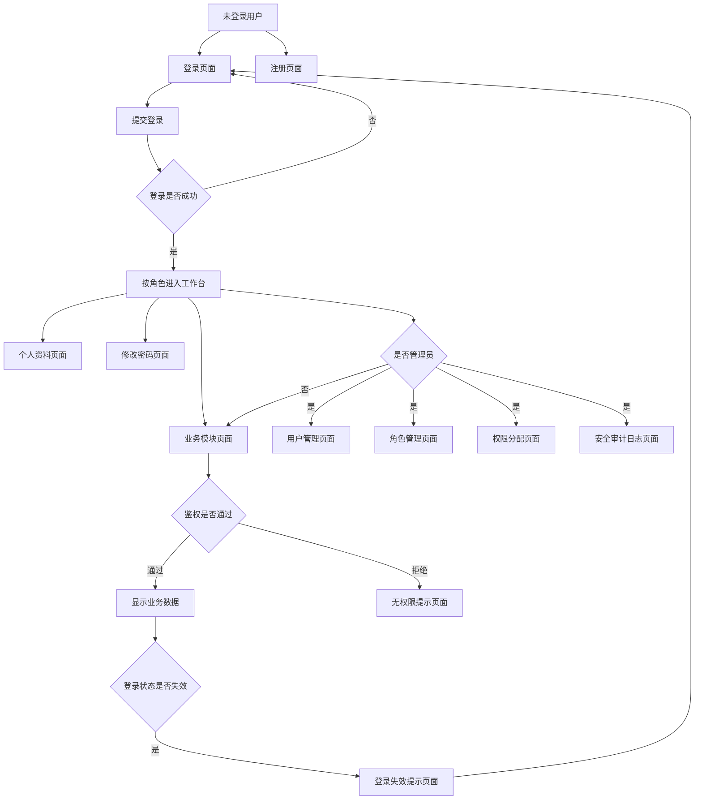
```mermaid
flowchart TD
  Guest[未登录用户] --> LoginPage[登录页面]
  Guest --> RegisterPage[注册页面]
  LoginPage --> LoginApi[提交登录]
  LoginApi --> LoginResult{登录是否成功}
  LoginResult -->|否| LoginPage
  LoginResult -->|是| Dashboard[按角色进入工作台]
  Dashboard --> ProfilePage[个人资料页面]
  Dashboard --> PasswordPage[修改密码页面]
  Dashboard --> BusinessPage[业务模块页面]
  Dashboard --> AdminCheck{是否管理员}
  AdminCheck -->|是| UserManage[用户管理页面]
  AdminCheck -->|是| RoleManage[角色管理页面]
  AdminCheck -->|是| PermissionManage[权限分配页面]
  AdminCheck -->|是| AuditPage[安全审计日志页面]
  AdminCheck -->|否| BusinessPage
  BusinessPage --> AuthCheck{鉴权是否通过}
  AuthCheck -->|通过| BusinessData[显示业务数据]
  AuthCheck -->|拒绝| ForbiddenPage[无权限提示页面]
  BusinessData --> SessionCheck{登录状态是否失效}
  SessionCheck -->|是| ExpiredPage[登录失效提示页面]
  ExpiredPage --> LoginPage
```

### 页面交互规则

1. 登录失败时统一提示“账号或密码错误”，不在页面暴露账号是否存在。
2. 登录成功后，前端根据角色和权限摘要加载不同菜单入口。
3. 学生、教师、管理员的功能入口需明显区分，避免普通用户看到无权限管理入口。
4. 无权限访问时展示无权限提示页，并提供返回首页或返回上一页操作。
5. 会话过期时清除本地登录状态，引导用户重新登录。
6. 管理员调整角色或权限前应展示确认提示，调整成功后提示权限可能需要重新登录或刷新后生效。
7. 审计日志页面默认按时间倒序分页展示，避免一次性加载大量日志。

### 接口详细设计

### 接口清单

| 接口编号 | 接口名称 | 方法 | 路径 | 权限要求 | 对应需求 |
| --- | --- | --- | --- | --- | --- |
| API-AUTH-01 | 用户登录 | POST | `/api/v1/auth/login` | 无需登录 | FR-UA-01 |
| API-AUTH-02 | 用户注册 | POST | `/api/v1/auth/register` | 无需登录或管理员 | FR-UA-01 |
| API-AUTH-03 | 用户退出登录 | POST | `/api/v1/auth/logout` | 当前用户已登录 | FR-UA-01 |
| API-AUTH-04 | 获取当前用户信息 | GET | `/api/v1/auth/me` | 当前用户已登录 | FR-UA-03 |
| API-AUTH-05 | 查看个人资料 | GET | `/api/v1/users/me` | 当前用户已登录 | FR-UA-04 |
| API-AUTH-06 | 修改个人资料 | PUT | `/api/v1/users/me` | 当前用户已登录 | FR-UA-04 |
| API-AUTH-07 | 修改密码 | PUT | `/api/v1/users/me/password` | 当前用户已登录 | FR-UA-04 |
| API-AUTH-08 | 查询用户列表 | GET | `/api/v1/admin/users` | 管理员 | FR-UA-02 |
| API-AUTH-09 | 管理员创建用户 | POST | `/api/v1/admin/users` | 管理员 | FR-UA-02 |
| API-AUTH-10 | 修改账号状态 | PUT | `/api/v1/admin/users/{userId}/status` | 管理员 | FR-UA-02、FR-UA-05 |
| API-AUTH-11 | 查询角色列表 | GET | `/api/v1/admin/roles` | 管理员 | FR-UA-02 |
| API-AUTH-12 | 创建或修改角色 | POST/PUT | `/api/v1/admin/roles` | 管理员 | FR-UA-02 |
| API-AUTH-13 | 查询权限点列表 | GET | `/api/v1/admin/permissions` | 管理员 | FR-UA-02 |
| API-AUTH-14 | 调整角色权限 | PUT | `/api/v1/admin/roles/{roleId}/permissions` | 管理员 | FR-UA-02、FR-UA-06 |
| API-AUTH-15 | 调整用户角色 | PUT | `/api/v1/admin/users/{userId}/roles` | 管理员 | FR-UA-02、FR-UA-06 |
| API-AUTH-16 | 通用权限校验 | POST | `/api/v1/auth/check-permission` | 当前用户已登录 | FR-UA-03 |
| API-AUTH-17 | 查询审计日志 | GET | `/api/v1/admin/audit-logs` | 管理员 | FR-UA-06 |

说明：`POST /api/v1/auth/refresh` 作为刷新令牌扩展接口保留，不分配本版本 `API-AUTH-*` 编号。本版本会话有效性通过 `GET /api/v1/auth/me` 校验，失效后重新登录。

### 关键接口详细说明

### API-AUTH-01 用户登录

| 项目 | 内容 |
| --- | --- |
| 请求方法 | POST |
| 请求路径 | `/api/v1/auth/login` |
| 权限要求 | 无需登录 |
| 请求参数 | `account`：账号；`password`：密码 |
| 成功响应 | `token`、`expiresAt`、`user`、`roles`、`permissions` |
| 失败响应 | `AUTH_401` 账号或密码错误；`AUTH_423` 账号被锁定；`AUTH_403` 账号被禁用 |
| 业务规则 | 登录前校验账号状态；密码错误增加失败计数；成功后清空失败计数并创建会话 |
| 涉及服务 | SVC-AUTH-01、SVC-AUTH-05、SVC-AUTH-06 |
| 涉及数据表 | DB-AUTH-01、DB-AUTH-06、DB-AUTH-07 |

### API-AUTH-07 修改密码

| 项目 | 内容 |
| --- | --- |
| 请求方法 | PUT |
| 请求路径 | `/api/v1/users/me/password` |
| 权限要求 | 当前用户已登录 |
| 请求参数 | `oldPassword`：原密码；`newPassword`：新密码 |
| 成功响应 | 修改结果 |
| 失败响应 | `AUTH_400` 参数错误；`AUTH_401` 原密码错误；`AUTH_409` 新旧密码相同 |
| 业务规则 | 校验原密码；新密码符合格式要求；保存新密码哈希；记录审计日志 |
| 涉及服务 | SVC-AUTH-02、SVC-AUTH-06、SVC-AUTH-07 |
| 涉及数据表 | DB-AUTH-01、DB-AUTH-07 |

### API-AUTH-15 调整用户角色

| 项目 | 内容 |
| --- | --- |
| 请求方法 | PUT |
| 请求路径 | `/api/v1/admin/users/{userId}/roles` |
| 权限要求 | 管理员 |
| 请求参数 | `userId`：目标用户编号；`roleIds`：角色编号列表 |
| 成功响应 | 修改结果 |
| 失败响应 | `AUTH_403` 无管理员权限；`AUTH_404` 用户或角色不存在；`AUTH_409` 角色状态不可用 |
| 业务规则 | 操作者必须为管理员；目标用户和角色均存在；更新用户角色关系；记录审计日志 |
| 涉及服务 | SVC-AUTH-03、SVC-AUTH-07 |
| 涉及数据表 | DB-AUTH-01、DB-AUTH-02、DB-AUTH-04、DB-AUTH-07 |

### API-AUTH-16 通用权限校验

| 项目 | 内容 |
| --- | --- |
| 请求方法 | POST |
| 请求路径 | `/api/v1/auth/check-permission` |
| 权限要求 | 当前用户已登录 |
| 请求参数 | `permissionCode`：权限编码；`resourceType`：资源类型；`resourceId`：资源编号，可为空 |
| 成功响应 | `allowed`：是否允许；`reason`：失败原因 |
| 失败响应 | `AUTH_401` 未登录；`AUTH_403` 无权限 |
| 业务规则 | 根据当前用户角色和权限点判断平台级权限；业务资源归属由调用方继续校验 |
| 涉及服务 | SVC-AUTH-04 |
| 涉及数据表 | DB-AUTH-02、DB-AUTH-03、DB-AUTH-04、DB-AUTH-05 |

### 后端服务与组件设计

| 服务编号 | 服务/组件名称 | 主要职责 | 输入 | 输出 |
| --- | --- | --- | --- | --- |
| SVC-AUTH-01 | AuthService | 登录、退出、认证入口编排 | 账号、密码、当前令牌 | 登录结果、退出结果 |
| SVC-AUTH-02 | UserService | 用户注册、个人资料、账号状态维护 | 用户资料、账号状态 | 用户信息、修改结果 |
| SVC-AUTH-03 | RoleService | 角色维护和用户角色分配 | 角色信息、用户编号、角色编号 | 角色列表、分配结果 |
| SVC-AUTH-04 | PermissionService | 权限点维护和权限判断 | 权限编码、角色编号 | 权限列表、校验结果 |
| SVC-AUTH-05 | SessionTokenService | 会话或令牌生命周期管理 | 用户编号、令牌 | 令牌、会话状态 |
| SVC-AUTH-06 | PasswordSecurityService | 密码哈希、密码校验、失败登录限制 | 明文密码、哈希值、账号状态 | 校验结果、锁定状态 |
| SVC-AUTH-07 | AuditLogService | 记录和查询安全审计日志 | 操作事件、查询条件 | 日志记录、日志列表 |
| SVC-AUTH-08 | AccessControlService | 页面、接口、资源通用鉴权 | 当前用户、权限编码、资源信息 | 允许或拒绝结果 |

### 服务调用关系

图 3-2 AUTH 登录顺序图

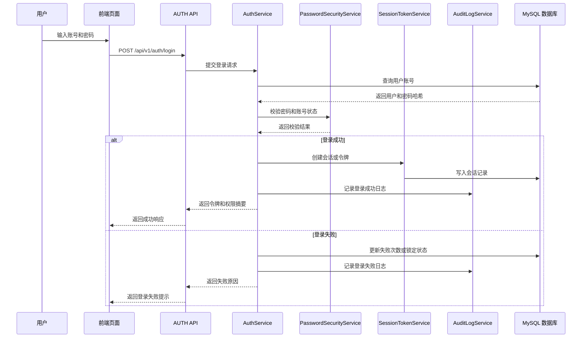
```mermaid
sequenceDiagram
  participant U as 用户
  participant P as 前端页面
  participant A as AUTH API
  participant AS as AuthService
  participant PS as PasswordSecurityService
  participant TS as SessionTokenService
  participant LS as AuditLogService
  participant D as MySQL 数据库
  U->>P: 输入账号和密码
  P->>A: POST /api/v1/auth/login
  A->>AS: 提交登录请求
  AS->>D: 查询用户账号
  D-->>AS: 返回用户和密码哈希
  AS->>PS: 校验密码和账号状态
  PS-->>AS: 返回校验结果
  alt 登录成功
    AS->>TS: 创建会话或令牌
    TS->>D: 写入会话记录
    AS->>LS: 记录登录成功日志
    AS-->>A: 返回令牌和权限摘要
    A-->>P: 返回成功响应
  else 登录失败
    AS->>D: 更新失败次数或锁定状态
    AS->>LS: 记录登录失败日志
    AS-->>A: 返回失败原因
    A-->>P: 返回登录失败提示
  end
```

### 数据结构与数据库设计

### 数据表清单

| 表编号 | 表名 | 中文名 | 主要字段 | 说明 |
| --- | --- | --- | --- | --- |
| DB-AUTH-01 | `t_auth_user` | 用户表 | `user_id`、`username`、`password_hash`、`account_status` | 保存用户基础信息和账号安全字段 |
| DB-AUTH-02 | `t_auth_role` | 角色表 | `role_id`、`role_code`、`role_name`、`enabled` | 保存学生、教师、管理员等角色 |
| DB-AUTH-03 | `t_auth_permission` | 权限表 | `permission_id`、`permission_code`、`permission_type`、`module_code` | 保存菜单、接口、资源、操作权限点 |
| DB-AUTH-04 | `t_auth_user_role` | 用户角色关联表 | `user_id`、`role_id`、`assigned_by` | 保存用户与角色关系 |
| DB-AUTH-05 | `t_auth_role_permission` | 角色权限关联表 | `role_id`、`permission_id`、`assigned_by` | 保存角色与权限关系 |
| DB-AUTH-06 | `t_auth_session` | 登录会话表 | `session_id`、`user_id`、`token_id`、`expires_at`、`status` | 保存会话或令牌状态 |
| DB-AUTH-07 | `t_auth_audit_log` | 审计日志表 | `operator_id`、`operation_type`、`target_type`、`result_status` | 保存关键安全操作记录 |

### t_auth_user 用户表

| 字段名 | 类型 | 是否为空 | 默认值 | 索引 | 说明 |
| --- | --- | --- | --- | --- | --- |
| `user_id` | bigint | 否 | 无 | PK | 用户编号 |
| `username` | varchar(64) | 否 | 无 | UNIQUE | 登录账号，学号/工号或系统账号 |
| `user_type` | varchar(32) | 否 | 无 | idx_user_type | 用户类型：STUDENT、TEACHER、ADMIN |
| `display_name` | varchar(64) | 否 | 无 |  | 显示名称 |
| `phone` | varchar(32) | 是 | NULL | idx_phone | 手机号 |
| `email` | varchar(128) | 是 | NULL | idx_email | 邮箱 |
| `avatar_url` | varchar(255) | 是 | NULL |  | 头像地址 |
| `password_hash` | varchar(255) | 否 | 无 |  | 密码哈希 |
| `password_salt` | varchar(128) | 是 | NULL |  | 密码盐或哈希参数 |
| `account_status` | varchar(32) | 否 | ACTIVE | idx_account_status | PENDING、ACTIVE、FROZEN、DISABLED |
| `failed_login_count` | int | 否 | 0 |  | 连续登录失败次数 |
| `locked_until` | datetime | 是 | NULL |  | 锁定截止时间 |
| `last_login_at` | datetime | 是 | NULL |  | 最近登录时间 |
| `created_at` | datetime | 否 | 当前时间 |  | 创建时间 |
| `updated_at` | datetime | 否 | 当前时间 |  | 更新时间 |
| `deleted` | tinyint | 否 | 0 | idx_deleted | 逻辑删除标记 |

### t_auth_role 角色表

| 字段名 | 类型 | 是否为空 | 默认值 | 索引 | 说明 |
| --- | --- | --- | --- | --- | --- |
| `role_id` | bigint | 否 | 无 | PK | 角色编号 |
| `role_code` | varchar(64) | 否 | 无 | UNIQUE | STUDENT、TEACHER、ADMIN |
| `role_name` | varchar(64) | 否 | 无 |  | 角色名称 |
| `description` | varchar(255) | 是 | NULL |  | 角色说明 |
| `enabled` | tinyint | 否 | 1 | idx_enabled | 是否启用 |
| `created_at` | datetime | 否 | 当前时间 |  | 创建时间 |
| `updated_at` | datetime | 否 | 当前时间 |  | 更新时间 |
| `deleted` | tinyint | 否 | 0 | idx_deleted | 逻辑删除标记 |

### t_auth_permission 权限表

| 字段名 | 类型 | 是否为空 | 默认值 | 索引 | 说明 |
| --- | --- | --- | --- | --- | --- |
| `permission_id` | bigint | 否 | 无 | PK | 权限编号 |
| `permission_code` | varchar(128) | 否 | 无 | UNIQUE | 权限编码 |
| `permission_name` | varchar(128) | 否 | 无 |  | 权限名称 |
| `permission_type` | varchar(32) | 否 | 无 | idx_permission_type | MENU、API、RESOURCE、ACTION |
| `module_code` | varchar(32) | 否 | 无 | idx_module_code | AUTH、CRS、LRN、LAB、HWK、GRD |
| `resource_pattern` | varchar(255) | 是 | NULL |  | 路由、接口路径或资源匹配规则 |
| `enabled` | tinyint | 否 | 1 | idx_enabled | 是否启用 |
| `created_at` | datetime | 否 | 当前时间 |  | 创建时间 |
| `updated_at` | datetime | 否 | 当前时间 |  | 更新时间 |
| `deleted` | tinyint | 否 | 0 | idx_deleted | 逻辑删除标记 |

### t_auth_user_role 用户角色关联表

| 字段名 | 类型 | 是否为空 | 默认值 | 索引 | 说明 |
| --- | --- | --- | --- | --- | --- |
| `id` | bigint | 否 | 无 | PK | 关联编号 |
| `user_id` | bigint | 否 | 无 | idx_user_id | 用户编号 |
| `role_id` | bigint | 否 | 无 | idx_role_id | 角色编号 |
| `assigned_by` | bigint | 是 | NULL |  | 分配人 |
| `assigned_at` | datetime | 否 | 当前时间 |  | 分配时间 |

约束：`user_id + role_id` 建立唯一索引，避免重复分配同一角色。

### t_auth_role_permission 角色权限关联表

| 字段名 | 类型 | 是否为空 | 默认值 | 索引 | 说明 |
| --- | --- | --- | --- | --- | --- |
| `id` | bigint | 否 | 无 | PK | 关联编号 |
| `role_id` | bigint | 否 | 无 | idx_role_id | 角色编号 |
| `permission_id` | bigint | 否 | 无 | idx_permission_id | 权限编号 |
| `assigned_by` | bigint | 是 | NULL |  | 分配人 |
| `assigned_at` | datetime | 否 | 当前时间 |  | 分配时间 |

约束：`role_id + permission_id` 建立唯一索引，避免重复分配同一权限。

### t_auth_session 登录会话表

| 字段名 | 类型 | 是否为空 | 默认值 | 索引 | 说明 |
| --- | --- | --- | --- | --- | --- |
| `session_id` | bigint | 否 | 无 | PK | 会话编号 |
| `user_id` | bigint | 否 | 无 | idx_user_id | 用户编号 |
| `token_id` | varchar(128) | 否 | 无 | UNIQUE | 令牌标识，不保存完整令牌明文 |
| `issued_at` | datetime | 否 | 当前时间 |  | 签发时间 |
| `expires_at` | datetime | 否 | 无 | idx_expires_at | 过期时间 |
| `revoked_at` | datetime | 是 | NULL |  | 作废时间 |
| `client_ip` | varchar(64) | 是 | NULL |  | 客户端 IP |
| `user_agent` | varchar(255) | 是 | NULL |  | 客户端信息 |
| `status` | varchar(32) | 否 | VALID | idx_status | VALID、EXPIRED、REVOKED |

### t_auth_audit_log 审计日志表

| 字段名 | 类型 | 是否为空 | 默认值 | 索引 | 说明 |
| --- | --- | --- | --- | --- | --- |
| `log_id` | bigint | 否 | 无 | PK | 日志编号 |
| `operator_id` | bigint | 是 | NULL | idx_operator_id | 操作用户编号，系统或未登录失败可为空 |
| `operation_type` | varchar(64) | 否 | 无 | idx_operation_type | LOGIN、LOGOUT、CHANGE_PASSWORD、ASSIGN_ROLE 等 |
| `target_type` | varchar(64) | 是 | NULL |  | 操作对象类型 |
| `target_id` | varchar(64) | 是 | NULL |  | 操作对象编号 |
| `result_status` | varchar(32) | 否 | 无 | idx_result_status | SUCCESS、FAIL、DENIED |
| `failure_reason` | varchar(255) | 是 | NULL |  | 失败原因 |
| `client_ip` | varchar(64) | 是 | NULL |  | 客户端 IP |
| `user_agent` | varchar(255) | 是 | NULL |  | 客户端信息 |
| `created_at` | datetime | 否 | 当前时间 | idx_created_at | 记录时间 |

### 关键业务流程与状态机

### 用户登录流程

图 3-3 AUTH 用户登录流程图

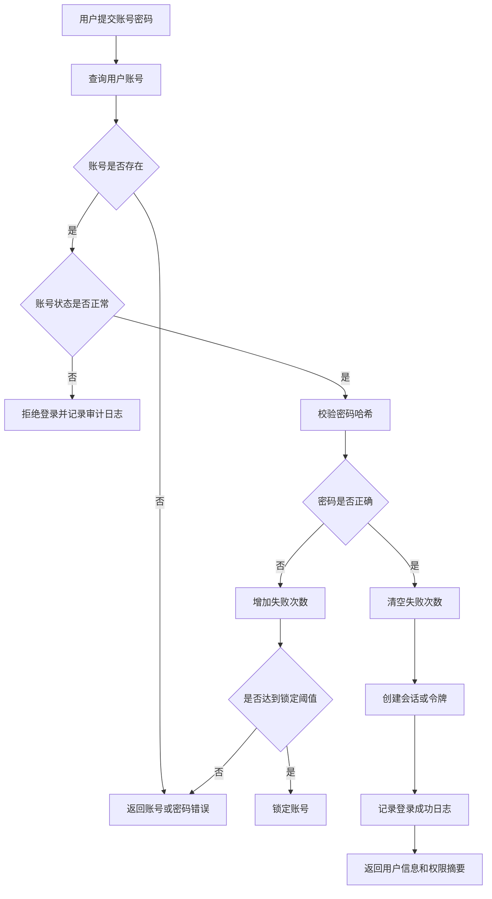
```mermaid
flowchart TD
  Start[用户提交账号密码] --> QueryUser[查询用户账号]
  QueryUser --> UserExists{账号是否存在}
  UserExists -->|否| LoginFail[返回账号或密码错误]
  UserExists -->|是| CheckStatus{账号状态是否正常}
  CheckStatus -->|否| RejectStatus[拒绝登录并记录审计日志]
  CheckStatus -->|是| CheckPassword[校验密码哈希]
  CheckPassword --> PasswordOk{密码是否正确}
  PasswordOk -->|否| IncreaseFail[增加失败次数]
  IncreaseFail --> NeedLock{是否达到锁定阈值}
  NeedLock -->|是| LockAccount[锁定账号]
  NeedLock -->|否| LoginFail
  PasswordOk -->|是| ClearFail[清空失败次数]
  ClearFail --> CreateSession[创建会话或令牌]
  CreateSession --> WriteLog[记录登录成功日志]
  WriteLog --> ReturnResult[返回用户信息和权限摘要]
```

### 接口鉴权流程

图 3-4 AUTH 接口鉴权流程图

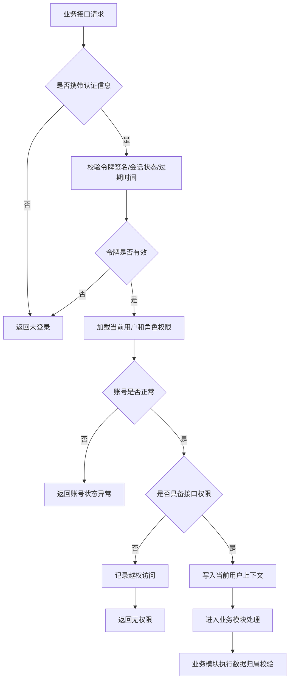
```mermaid
flowchart TD
  Request[业务接口请求] --> HasToken{是否携带认证信息}
  HasToken -->|否| Return401[返回未登录]
  HasToken -->|是| ValidateToken[校验令牌签名/会话状态/过期时间]
  ValidateToken --> TokenValid{令牌是否有效}
  TokenValid -->|否| Return401
  TokenValid -->|是| LoadUser[加载当前用户和角色权限]
  LoadUser --> AccountOk{账号是否正常}
  AccountOk -->|否| Return403[返回账号状态异常]
  AccountOk -->|是| CheckPermission{是否具备接口权限}
  CheckPermission -->|否| AuditDenied[记录越权访问]
  AuditDenied --> ReturnDenied[返回无权限]
  CheckPermission -->|是| SetContext[写入当前用户上下文]
  SetContext --> BusinessModule[进入业务模块处理]
  BusinessModule --> BusinessCheck[业务模块执行数据归属校验]
```

### 账号状态机

图 3-5 AUTH 账号状态机

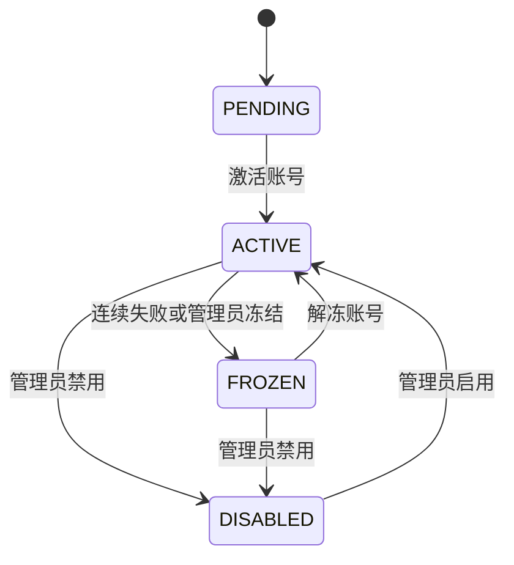
```mermaid
stateDiagram-v2
  [*] --> PENDING
  PENDING --> ACTIVE: 激活账号
  ACTIVE --> FROZEN: 连续失败或管理员冻结
  FROZEN --> ACTIVE: 解冻账号
  ACTIVE --> DISABLED: 管理员禁用
  FROZEN --> DISABLED: 管理员禁用
  DISABLED --> ACTIVE: 管理员启用
```

状态说明：

| 状态 | 含义 | 允许操作 |
| --- | --- | --- |
| PENDING | 待激活 | 激活、禁用 |
| ACTIVE | 正常 | 登录、修改资料、修改密码、访问授权功能 |
| FROZEN | 冻结 | 不允许登录，可由管理员解冻或禁用 |
| DISABLED | 禁用 | 不允许登录和业务访问，可由管理员启用 |

### 会话状态机

图 3-6 AUTH 会话状态机

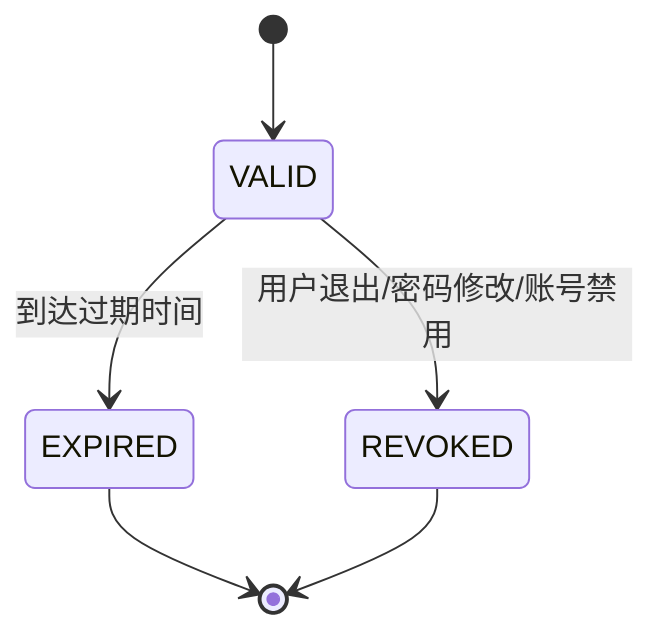
```mermaid
stateDiagram-v2
  [*] --> VALID
  VALID --> EXPIRED: 到达过期时间
  VALID --> REVOKED: 用户退出/密码修改/账号禁用
  EXPIRED --> [*]
  REVOKED --> [*]
```

### 异常处理设计

| 异常编号 | 异常场景 | 处理策略 | 用户提示或接口结果 | 对应需求 |
| --- | --- | --- | --- | --- |
| ERR-AUTH-01 | 账号或密码错误 | 增加失败计数，达到阈值后锁定 | 账号或密码错误 | FR-UA-01、FR-UA-04 |
| ERR-AUTH-02 | 账号不存在 | 不暴露账号存在性，按登录失败处理 | 账号或密码错误 | FR-UA-01 |
| ERR-AUTH-03 | 账号被冻结或禁用 | 拒绝登录和业务访问，记录日志 | 账号状态异常，请联系管理员 | FR-UA-05 |
| ERR-AUTH-04 | 登录状态失效 | 拒绝访问需认证资源 | 登录已失效，请重新登录 | FR-UA-05 |
| ERR-AUTH-05 | 权限不足 | 拒绝页面、接口或资源访问 | 无权限访问 | FR-UA-03、FR-UA-05 |
| ERR-AUTH-06 | 令牌伪造或无效 | 拒绝访问并记录安全事件 | 认证信息无效 | FR-UA-05、FR-UA-07 |
| ERR-AUTH-07 | 参数篡改访问他人数据 | AUTH 拦截通用权限，业务模块拦截数据归属 | 无权限访问 | FR-UA-03、FR-UA-07 |
| ERR-AUTH-08 | 角色或权限配置异常 | 拒绝相关操作并提示管理员检查配置 | 权限配置异常 | FR-UA-02、FR-UA-05 |
| ERR-AUTH-09 | 审计日志记录失败 | 普通查询不中断，关键权限变更应失败或回滚 | 操作失败或稍后重试 | FR-UA-06 |

### 安全、权限与日志设计

### 角色权限边界

| 角色 | 允许访问范围 | 禁止访问范围 |
| --- | --- | --- |
| 学生 | 本人课程学习、本人作业提交、本人实验记录、本人成绩、本人通知和个人资料 | 教师课程管理、管理员后台、他人作业/实验/成绩、全局用户权限管理 |
| 教师 | 本人负责课程的教学管理、课程下作业和实验管理、授权课程成绩管理、个人资料 | 非本人授权课程的教学数据、管理员权限分配、平台全局安全审计配置 |
| 管理员 | 用户管理、角色权限管理、账号状态维护、安全审计查看、平台基础维护 | 不应绕过业务规则直接篡改课程、作业、实验、成绩业务数据 |

### 密码与令牌安全

1. 密码只保存哈希值和必要哈希参数，不在页面、接口响应和日志中展示明文。
2. 登录成功后签发具备过期时间的会话或访问令牌。
3. 退出登录、密码修改、账号禁用后，应作废相关会话或令牌。
4. 连续登录失败达到阈值后锁定账号或触发安全限制。
5. 令牌解析失败、过期、被作废时统一按未认证处理。

### 审计日志设计

| 操作类型 | 是否记录 | 记录内容 |
| --- | --- | --- |
| 登录成功 | 是 | 操作用户、时间、IP、客户端、结果 |
| 登录失败 | 是 | 账号标识、时间、IP、失败原因 |
| 退出登录 | 是 | 操作用户、时间、会话编号 |
| 修改密码 | 是 | 操作用户、时间、结果，不记录明文密码 |
| 用户角色调整 | 是 | 操作人、目标用户、调整结果 |
| 角色权限调整 | 是 | 操作人、目标角色、调整结果 |
| 越权访问 | 是 | 操作用户、目标资源、拒绝原因 |

### 性能与可维护性设计

1. 登录接口、当前用户信息接口和权限校验接口为高频接口，应避免复杂联表和无索引查询。
2. 用户表按 `username`、`phone`、`email`、`account_status` 建立索引或唯一约束。
3. 用户角色表按 `user_id` 和 `role_id` 建立索引，角色权限表按 `role_id` 和 `permission_id` 建立索引。
4. 审计日志表按 `operator_id`、`operation_type`、`result_status`、`created_at` 建立索引，查询默认分页。
5. 权限摘要可在登录后返回给前端用于菜单控制，但后端仍需实时或准实时校验关键接口权限。
6. 角色和权限调整后，相关用户下次请求重新加载权限信息，避免权限缓存长期不一致。
7. 审计日志增长较快时，可按时间范围归档或限制查询时间跨度。

### 需求追踪与测试关注点

### 需求追踪矩阵

| 需求编号 | 需求名称 | 详细设计编号 | 页面编号 | API 编号 | 数据表编号 | 测试编号 | 备注 |
| --- | --- | --- | --- | --- | --- | --- | --- |
| FR-UA-01 | 用户注册与登录 | DSD-AUTH-01 | UI-AUTH-01 / UI-AUTH-02 | API-AUTH-01 / API-AUTH-02 / API-AUTH-03 | DB-AUTH-01 / DB-AUTH-06 | TC-UA-01 | P0 |
| FR-UA-02 | 角色管理与权限分配 | DSD-AUTH-02 | UI-AUTH-05 / UI-AUTH-06 / UI-AUTH-07 / UI-AUTH-08 | API-AUTH-08 ~ API-AUTH-15 | DB-AUTH-02 / DB-AUTH-03 / DB-AUTH-04 / DB-AUTH-05 | TC-UA-02 | P0 |
| FR-UA-03 | 身份认证与访问控制 | DSD-AUTH-03 | UI-AUTH-10 / UI-AUTH-11 | API-AUTH-04 / API-AUTH-16 | DB-AUTH-02 ~ DB-AUTH-06 | TC-UA-03 | P0 |
| FR-UA-04 | 账号信息与密码安全 | DSD-AUTH-04 | UI-AUTH-03 / UI-AUTH-04 | API-AUTH-05 / API-AUTH-06 / API-AUTH-07 | DB-AUTH-01 / DB-AUTH-06 / DB-AUTH-07 | TC-UA-04 | P0 |
| FR-UA-05 | 权限异常处理与安全提示 | DSD-AUTH-05 | UI-AUTH-10 / UI-AUTH-11 | API-AUTH-01 / API-AUTH-04 / API-AUTH-16 | DB-AUTH-01 / DB-AUTH-06 / DB-AUTH-07 | TC-UA-05 | P1 |
| FR-UA-06 | 关键操作审计 | DSD-AUTH-06 | UI-AUTH-09 | API-AUTH-17 | DB-AUTH-07 | TC-UA-06 | P1 |
| FR-UA-07 | 平台基础安全防护 | DSD-AUTH-07 | 全部 AUTH 页面 | 全部 AUTH 接口 | DB-AUTH-01 ~ DB-AUTH-07 | TC-UA-07 | P1 |
| NFR-UA-01 | 安全性 | DSD-AUTH-NFR-01 | 全部 AUTH 页面 | 全部 AUTH 接口 | DB-AUTH-01 ~ DB-AUTH-07 | TC-UA-N01 | 非功能 |
| NFR-UA-02 | 可靠性 | DSD-AUTH-NFR-02 | 全部 AUTH 页面 | 全部 AUTH 接口 | DB-AUTH-06 / DB-AUTH-07 | TC-UA-N02 | 非功能 |
| NFR-UA-03 | 可用性 | DSD-AUTH-NFR-03 | UI-AUTH-01 ~ UI-AUTH-11 | API-AUTH-01 ~ API-AUTH-17 | - | TC-UA-N03 | 非功能 |
| NFR-UA-04 | 性能 | DSD-AUTH-NFR-04 | 高频页面 | 高频接口 | DB-AUTH-01 ~ DB-AUTH-07 | TC-UA-N04 | 非功能 |
| NFR-UA-05 | 可测试性 | DSD-AUTH-NFR-05 | 全部 AUTH 页面 | 全部 AUTH 接口 | 全部 AUTH 表 | TC-UA-N05 | 非功能 |

### 测试关注点

| 测试编号 | 测试目标 | 核心验证点 |
| --- | --- | --- |
| TC-UA-01 | 用户注册与登录 | 注册成功、登录成功、登录失败、退出后不能访问需认证接口 |
| TC-UA-02 | 角色管理与权限分配 | 管理员分配角色、调整权限、普通用户不能访问角色管理 |
| TC-UA-03 | 身份认证与访问控制 | 学生、教师、管理员访问边界；后端接口拒绝越权请求 |
| TC-UA-04 | 账号信息与密码安全 | 个人资料修改、原密码校验、新密码哈希保存、失败登录限制 |
| TC-UA-05 | 权限异常处理 | 未登录、会话过期、账号禁用、无权限访问的提示和错误码 |
| TC-UA-06 | 关键操作审计 | 登录、退出、密码修改、角色调整、越权访问是否记录日志 |
| TC-UA-07 | 平台基础安全防护 | 参数校验、伪造令牌、非法请求、参数篡改防护 |

---
## 3.2 课程与教学资源模块（CRS）

### 设计边界

本模块对应需求范围为 `FR-CR-01 ~ FR-CR-06`、`NFR-CR-01 ~ NFR-CR-05`，测试编号前缀为 `TC-CR`。本模块负责课程创建与管理、章节目录管理、教学资源上传和管理、学生加入课程、课程成员管理和课程公告管理，为 LRN、LAB、HWK、GRD 提供课程和成员关系基础数据。

本模块不负责学习进度统计、实验提交、作业评测和成绩计算，这些内容由对应业务模块负责。涉及“当前用户是否属于某课程”等业务归属判断时，CRS 只提供课程成员关系数据，具体业务范围由对应模块结合自身数据二次校验。

### 模块基本信息

| 项目 | 内容 |
| --- | --- |
| 模块编号 | DSD-CRS |
| 模块名称 | 课程与教学资源模块 |
| 模块缩写 | CRS |
| 设计重点 | 课程组织、章节资源、成员关系、课程公告 |
| 对应需求 | FR-CR-01 ~ FR-CR-06 / NFR-CR-01 ~ NFR-CR-05 |
| 依赖模块 | AUTH |
| 被依赖模块 | LRN、LAB、HWK、GRD |
| 主要交付 | 页面设计、API 设计、服务设计、数据表设计、创建课程流程、加入课程流程、资源发布流程、课程成员状态机、异常与安全、需求追踪 |

### 模块职责与依赖关系

### 本模块负责的内容

1. 课程创建、编辑、删除和查询。
2. 课程章节目录的创建、编辑、排序和删除。
3. 教学资源的上传、分类、下载和删除。
4. 学生加入课程的申请和审批流程。
5. 课程成员关系的维护，包括教师、助教、学生角色。
6. 课程公告的发布、编辑、置顶和删除。
7. 课程成员校验接口，为其他模块提供课程归属判断。
8. 课程基础信息的查询和统计。

### 本模块不负责的内容

1. 不负责用户账号管理和角色权限分配，相关内容由 AUTH 负责。
2. 不负责学习记录、任务中心和通知展示，相关内容由 LRN 负责。
3. 不负责实验发布、实验提交、实验评测和实验评分，相关内容由 LAB 负责。
4. 不负责作业发布、作业提交、作业评测和作业批阅，相关内容由 HWK 负责。
5. 不负责成绩项配置、成绩汇总、成绩发布和教学分析，相关内容由 GRD 负责。

### 与其他模块的协作关系

| 协作模块 | 协作内容 | CRS 提供 | 对方模块负责 |
| --- | --- | --- | --- |
| AUTH | 用户身份和权限校验 | 课程成员关系数据 | 用户登录状态和角色权限 |
| LRN | 学习任务和通知触发 | 课程信息和成员列表 | 学习记录和通知生成 |
| LAB | 实验发布和成员校验 | 课程成员关系 | 实验任务和提交记录 |
| HWK | 作业发布和成员校验 | 课程成员关系 | 作业任务和提交记录 |
| GRD | 成绩管理和查询 | 课程信息和成员列表 | 成绩记录和汇总计算 |

### 页面详细设计

### 页面清单

| 页面编号 | 页面名称 | 使用角色 | 页面目标 | 主要操作 | 调用接口 |
| --- | --- | --- | --- | --- | --- |
| UI-CRS-01 | 课程列表页面 | 学生、教师、管理员 | 展示用户可访问的课程列表 | 查看课程、搜索课程、加入课程 | API-CRS-05、API-CRS-14 |
| UI-CRS-02 | 课程详情页面 | 学生、教师、管理员 | 显示课程基本信息和章节目录 | 查看章节、查看公告、查看成员 | API-CRS-02、API-CRS-07、API-CRS-21 |
| UI-CRS-03 | 章节管理页面 | 教师 | 管理课程章节目录 | 创建章节、编辑章节、排序章节、删除章节 | API-CRS-06、API-CRS-08、API-CRS-09 |
| UI-CRS-04 | 资源管理页面 | 教师 | 上传和管理教学资源 | 上传资源、分类资源、下载资源、删除资源 | API-CRS-10、API-CRS-11、API-CRS-12、API-CRS-13 |
| UI-CRS-05 | 成员管理页面 | 教师 | 管理课程成员和角色 | 查看成员、添加成员、移除成员、调整角色 | API-CRS-15、API-CRS-16、API-CRS-17 |
| UI-CRS-06 | 公告管理页面 | 教师 | 发布和管理课程公告 | 发布公告、编辑公告、置顶公告、删除公告 | API-CRS-20、API-CRS-21 |
| UI-CRS-07 | 课程管理页面 | 教师 | 管理课程信息 | 创建课程、编辑课程、删除课程 | API-CRS-01、API-CRS-03、API-CRS-04 |

### 页面流转图

图 3-2-1 CRS 页面流转图

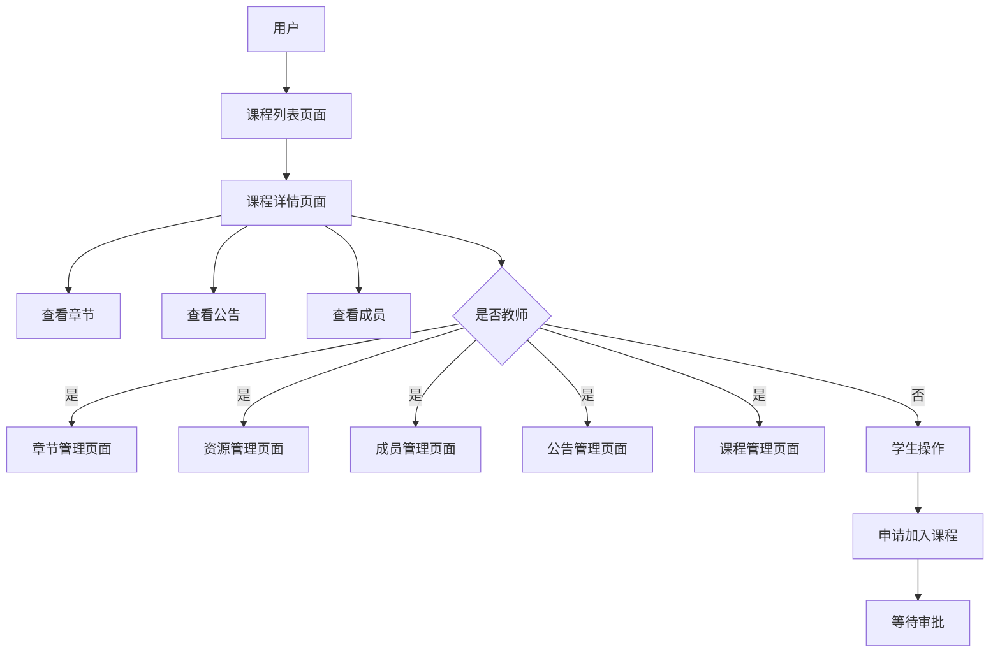
```mermaid
flowchart TD
  User[用户] --> CourseList[课程列表页面]
  CourseList --> CourseDetail[课程详情页面]
  CourseDetail --> ChapterView[查看章节]
  CourseDetail --> AnnouncementView[查看公告]
  CourseDetail --> MemberView[查看成员]
  CourseDetail --> TeacherCheck{是否教师}
  TeacherCheck -->|是| ChapterManage[章节管理页面]
  TeacherCheck -->|是| ResourceManage[资源管理页面]
  TeacherCheck -->|是| MemberManage[成员管理页面]
  TeacherCheck -->|是| AnnouncementManage[公告管理页面]
  TeacherCheck -->|是| CourseManage[课程管理页面]
  TeacherCheck -->|否| StudentActions[学生操作]
  StudentActions --> JoinCourse[申请加入课程]
  JoinCourse --> Approval[等待审批]
```

### 页面交互规则

1. 课程列表页面默认展示用户可访问的课程，按创建时间倒序分页显示。
2. 教师进入课程详情页面后，可通过按钮切换到管理子页面（章节、资源、成员、公告、课程管理）。
3. 创建课程时，教师需填写课程名称、描述等必填信息，提交后自动成为课程教师。
4. 编辑课程信息仅限教师本人，且不能修改创建者。
5. 删除课程前需确认，删除后不可恢复，所有相关数据（章节、资源、成员、公告）将被级联删除。
6. 学生申请加入课程后，状态为待审批，教师审批通过后成为正式成员。
7. 资源上传限制文件大小和类型，上传成功后生成下载链接。
8. 公告发布支持置顶，置顶公告优先显示。
9. 权限不足时统一提示“无权限访问”，并提供返回上一页操作。
10. 所有操作成功后显示成功提示，失败时显示具体错误信息。

### 接口详细设计

### 接口清单

| 接口编号 | 接口名称 | 方法 | 路径 | 权限要求 | 对应需求 |
| --- | --- | --- | --- | --- | --- |
| API-CRS-01 | 创建课程 | POST | /api/v1/courses | 已登录教师 | FR-CR-01 |
| API-CRS-02 | 获取课程详情 | GET | /api/v1/courses/{courseId} | 课程成员 | FR-CR-01 |
| API-CRS-03 | 更新课程 | PUT | /api/v1/courses/{courseId} | 课程教师 | FR-CR-01 |
| API-CRS-04 | 删除课程 | DELETE | /api/v1/courses/{courseId} | 课程教师 | FR-CR-01 |
| API-CRS-05 | 获取课程列表 | GET | /api/v1/courses | 已登录用户 | FR-CR-01 |
| API-CRS-06 | 创建章节 | POST | /api/v1/courses/{courseId}/chapters | 课程教师 | FR-CR-02 |
| API-CRS-07 | 获取章节树 | GET | /api/v1/courses/{courseId}/chapters | 课程成员 | FR-CR-02 |
| API-CRS-08 | 修改章节 | PUT | /api/v1/courses/{courseId}/chapters/{chapterId} | 课程教师 | FR-CR-02 |
| API-CRS-09 | 删除章节 | DELETE | /api/v1/courses/{courseId}/chapters/{chapterId} | 课程教师 | FR-CR-02 |
| API-CRS-10 | 上传教学资源 | POST | /api/v1/courses/{courseId}/resources | 课程教师 | FR-CR-03 |
| API-CRS-11 | 获取资源列表 | GET | /api/v1/courses/{courseId}/resources | 课程成员 | FR-CR-03 |
| API-CRS-12 | 更新资源 | PUT | /api/v1/courses/{courseId}/resources/{resourceId} | 课程教师 | FR-CR-03 |
| API-CRS-13 | 删除资源 | DELETE | /api/v1/courses/{courseId}/resources/{resourceId} | 课程教师 | FR-CR-03 |
| API-CRS-14 | 学生选课 | POST | /api/v1/courses/{courseId}/join | 已登录用户 | FR-CR-04 |
| API-CRS-15 | 获取课程成员列表 | GET | /api/v1/courses/{courseId}/members | 课程成员 | FR-CR-05 |
| API-CRS-16 | 管理成员角色 | PUT | /api/v1/courses/{courseId}/members/{userId} | 课程教师 | FR-CR-05 |
| API-CRS-17 | 移除课程成员 | DELETE | /api/v1/courses/{courseId}/members/{userId} | 课程教师 | FR-CR-05 |
| API-CRS-18 | 获取选课学生名单 | GET | /api/v1/courses/{courseId}/students | 课程教师、HWK/LAB/GRD模块 | FR-CR-04、FR-CR-05 |
| API-CRS-19 | 校验课程权限 | GET | /api/v1/courses/{courseId}/permissions/{userId} | HWK/LAB/GRD模块 | FR-CR-04、FR-CR-05 |
| API-CRS-20 | 发布公告 | POST | /api/v1/courses/{courseId}/announcements | 课程教师 | FR-CR-06 |
| API-CRS-21 | 获取公告列表 | GET | /api/v1/courses/{courseId}/announcements | 课程成员 | FR-CR-06 |
| API-CRS-22 | 课程首页摘要 | GET | /api/v1/courses/{courseId}/home-summary | 课程成员 | FR-CR-06 |

### 关键接口详细说明

### API-CRS-01 创建课程

| 项目 | 内容 |
| --- | --- |
| 请求方法 | POST |
| 请求路径 | `/api/v1/courses` |
| 权限要求 | 已登录教师 |
| 请求参数 | `name`：课程名称；`description`：课程描述 |
| 成功响应 | 课程信息 |
| 失败响应 | `CRS_400` 参数错误；`CRS_403` 无权限 |
| 业务规则 | 校验教师权限；创建课程记录；设置创建者为课程教师 |
| 涉及服务 | SVC-CRS-01 |
| 涉及数据表 | DB-CRS-01 |

**请求示例：**
```http
POST /api/v1/courses
Content-Type: application/json

{
  "name": "软件工程基础",
  "description": "软件工程核心概念和实践"
}
```

**响应示例：**
```json
{
  "code": 200,
  "data": {
    "id": 1,
    "name": "软件工程基础",
    "description": "软件工程核心概念和实践",
    "teacherId": 123,
    "createdAt": "2024-01-01T00:00:00Z"
  }
}
```

### API-CRS-05 获取课程列表

| 项目 | 内容 |
| --- | --- |
| 请求方法 | GET |
| 请求路径 | `/api/v1/courses` |
| 权限要求 | 已登录用户 |
| 请求参数 | `page`：页码；`size`：每页大小；`keyword`：搜索关键词 |
| 成功响应 | `list`：课程列表；`total`：总数 |
| 失败响应 | `CRS_400` 参数错误；`CRS_403` 无权限 |
| 业务规则 | 根据用户角色返回可访问课程；支持分页和关键词搜索 |
| 涉及服务 | SVC-CRS-01 |
| 涉及数据表 | DB-CRS-01、DB-CRS-04 |

**请求示例：**
```http
GET /api/v1/courses?page=1&size=10&keyword=软件工程
```

**响应示例：**
```json
{
  "code": 200,
  "data": {
    "list": [
      {
        "id": 1,
        "name": "软件工程基础",
        "description": "软件工程核心概念和实践",
        "teacherName": "张老师",
        "memberCount": 45,
        "createdAt": "2024-01-01T00:00:00Z"
      }
    ],
    "total": 1
  }
}
```

### API-CRS-14 学生选课

| 项目 | 内容 |
| --- | --- |
| 请求方法 | POST |
| 请求路径 | `/api/v1/courses/{courseId}/join` |
| 权限要求 | 已登录用户 |
| 请求参数 | `courseId`：课程ID |
| 成功响应 | 加入成功消息 |
| 失败响应 | `CRS_400` 参数错误；`CRS_403` 无权限；`CRS_409` 已加入 |
| 业务规则 | 检查用户是否已加入；创建待审批成员记录；通知教师 |
| 涉及服务 | SVC-CRS-04 |
| 涉及数据表 | DB-CRS-04 |

**请求示例：**
```http
POST /api/v1/courses/1/join
```

**响应示例：**
```json
{
  "code": 200,
  "message": "加入申请已提交，等待教师审批"
}
```

### API-CRS-20 发布公告

| 项目 | 内容 |
| --- | --- |
| 请求方法 | POST |
| 请求路径 | `/api/v1/courses/{courseId}/announcements` |
| 权限要求 | 课程教师 |
| 请求参数 | `title`：公告标题；`content`：公告内容；`isTop`：是否置顶 |
| 成功响应 | 公告信息 |
| 失败响应 | `CRS_400` 参数错误；`CRS_403` 无权限 |
| 业务规则 | 校验教师权限；创建公告记录；支持置顶设置 |
| 涉及服务 | SVC-CRS-05 |
| 涉及数据表 | DB-CRS-05 |

**请求示例：**
```http
POST /api/v1/courses/1/announcements
Content-Type: application/json

{
  "title": "期中复习安排",
  "content": "请同学们按时完成复习资料学习，并参与复习讨论。",
  "isTop": true
}
```

**响应示例：**
```json
{
  "code": 200,
  "data": {
    "id": 101,
    "courseId": 1,
    "title": "期中复习安排",
    "content": "请同学们按时完成复习资料学习，并参与复习讨论。",
    "isTop": true,
    "publishUserId": 123,
    "createdAt": "2024-05-11T10:00:00Z"
  }
}
```

### 服务与组件设计

### 服务清单

| 服务编号 | 服务/组件名称 | 主要职责 | 输入 | 输出 |
| --- | --- | --- | --- | --- |
| SVC-CRS-01 | CourseService | 课程CRUD操作 | 课程信息 | 课程实体 |
| SVC-CRS-02 | ChapterService | 章节管理 | 章节信息 | 章节实体 |
| SVC-CRS-03 | ResourceService | 资源上传和管理 | 文件信息 | 资源实体 |
| SVC-CRS-04 | MemberService | 成员关系管理 | 用户ID、课程ID | 成员关系 |
| SVC-CRS-05 | AnnouncementService | 公告管理 | 公告内容 | 公告实体 |

### 服务调用关系

### CourseService 创建课程流程

1. 校验用户权限（教师或管理员）
2. 校验课程信息完整性
3. 创建课程记录
4. 设置创建者为教师
5. 返回课程信息

图 3-2-2 CRS 创建课程顺序图

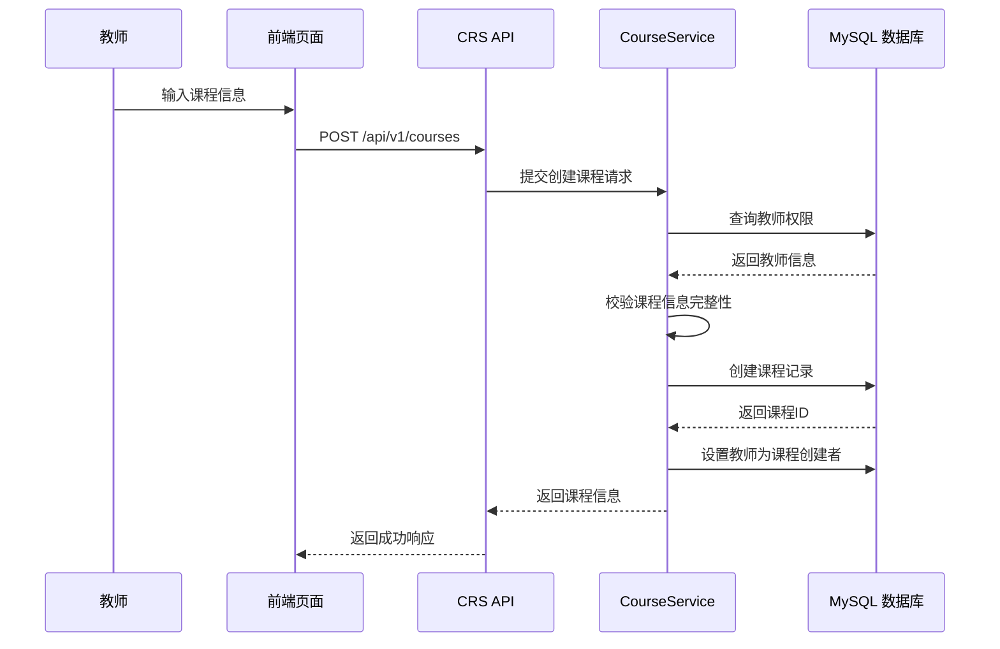
```mermaid
sequenceDiagram
  participant T as 教师
  participant P as 前端页面
  participant A as CRS API
  participant CS as CourseService
  participant D as MySQL 数据库
  T->>P: 输入课程信息
  P->>A: POST /api/v1/courses
  A->>CS: 提交创建课程请求
  CS->>D: 查询教师权限
  D-->>CS: 返回教师信息
  CS->>CS: 校验课程信息完整性
  CS->>D: 创建课程记录
  D-->>CS: 返回课程ID
  CS->>D: 设置教师为课程创建者
  CS-->>A: 返回课程信息
  A-->>P: 返回成功响应
```

### ChapterService 创建章节流程

1. 校验用户权限（课程教师）
2. 校验章节信息完整性
3. 创建章节记录
4. 更新章节排序
5. 返回章节信息

图 3-2-3 CRS 创建章节顺序图

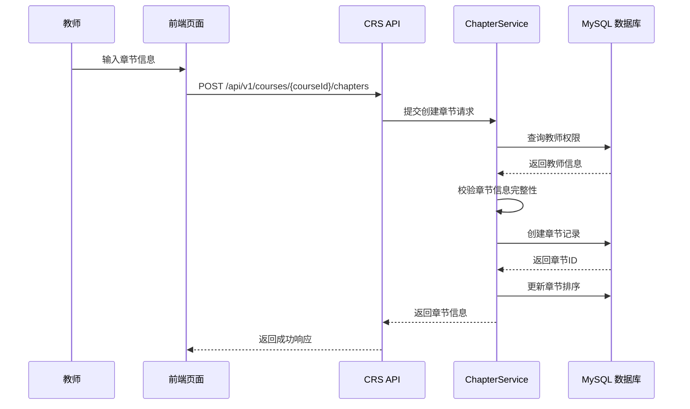
```mermaid
sequenceDiagram
  participant T as 教师
  participant P as 前端页面
  participant A as CRS API
  participant ChS as ChapterService
  participant D as MySQL 数据库
  T->>P: 输入章节信息
  P->>A: POST /api/v1/courses/{courseId}/chapters
  A->>ChS: 提交创建章节请求
  ChS->>D: 查询教师权限
  D-->>ChS: 返回教师信息
  ChS->>ChS: 校验章节信息完整性
  ChS->>D: 创建章节记录
  D-->>ChS: 返回章节ID
  ChS->>D: 更新章节排序
  ChS-->>A: 返回章节信息
  A-->>P: 返回成功响应
```

### ResourceService 上传资源流程

1. 校验用户权限（课程教师）
2. 校验文件类型和大小
3. 保存文件到存储
4. 创建资源记录
5. 返回资源信息

图 3-2-4 CRS 上传资源顺序图

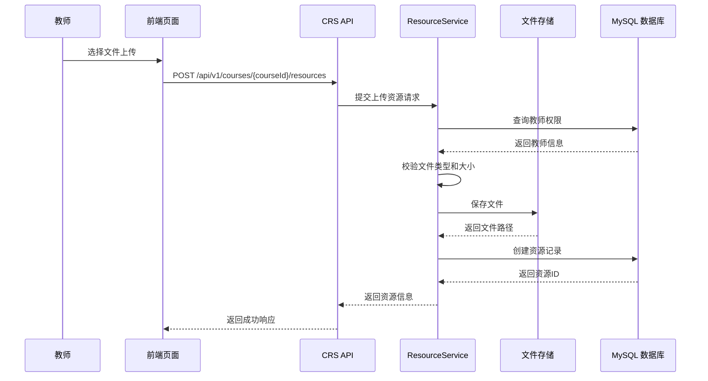
```mermaid
sequenceDiagram
  participant T as 教师
  participant P as 前端页面
  participant A as CRS API
  participant RS as ResourceService
  participant FS as 文件存储
  participant D as MySQL 数据库
  T->>P: 选择文件上传
  P->>A: POST /api/v1/courses/{courseId}/resources
  A->>RS: 提交上传资源请求
  RS->>D: 查询教师权限
  D-->>RS: 返回教师信息
  RS->>RS: 校验文件类型和大小
  RS->>FS: 保存文件
  FS-->>RS: 返回文件路径
  RS->>D: 创建资源记录
  D-->>RS: 返回资源ID
  RS-->>A: 返回资源信息
  A-->>P: 返回成功响应
```

### MemberService 添加成员流程

1. 校验用户权限（课程教师）
2. 校验目标用户存在
3. 检查是否已为成员
4. 创建成员记录
5. 返回成员信息

图 3-2-5 CRS 添加成员顺序图

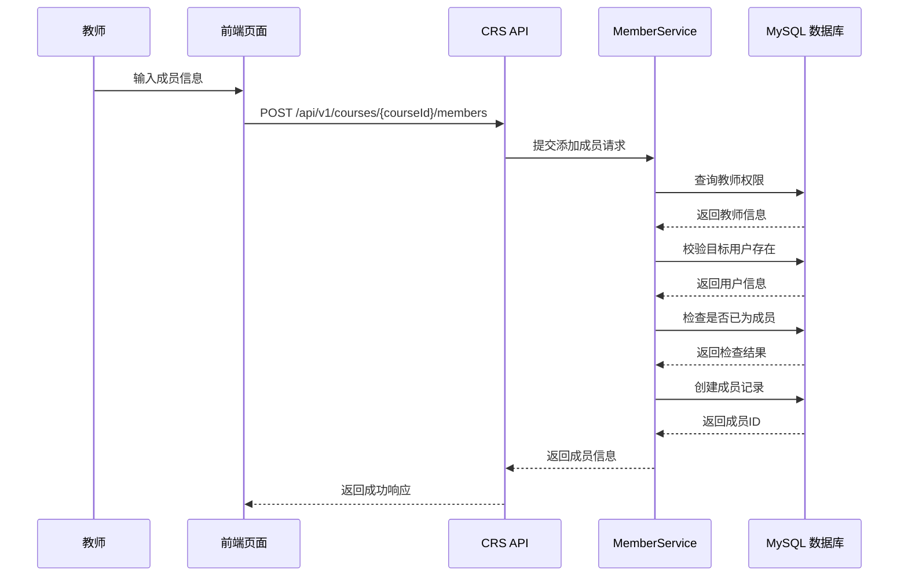
```mermaid
sequenceDiagram
  participant T as 教师
  participant P as 前端页面
  participant A as CRS API
  participant MS as MemberService
  participant D as MySQL 数据库
  T->>P: 输入成员信息
  P->>A: POST /api/v1/courses/{courseId}/members
  A->>MS: 提交添加成员请求
  MS->>D: 查询教师权限
  D-->>MS: 返回教师信息
  MS->>D: 校验目标用户存在
  D-->>MS: 返回用户信息
  MS->>D: 检查是否已为成员
  D-->>MS: 返回检查结果
  MS->>D: 创建成员记录
  D-->>MS: 返回成员ID
  MS-->>A: 返回成员信息
  A-->>P: 返回成功响应
```

### AnnouncementService 发布公告流程

1. 校验用户权限（课程教师）
2. 校验公告内容完整性
3. 创建公告记录
4. 设置置顶状态
5. 返回公告信息

图 3-2-6 CRS 发布公告顺序图

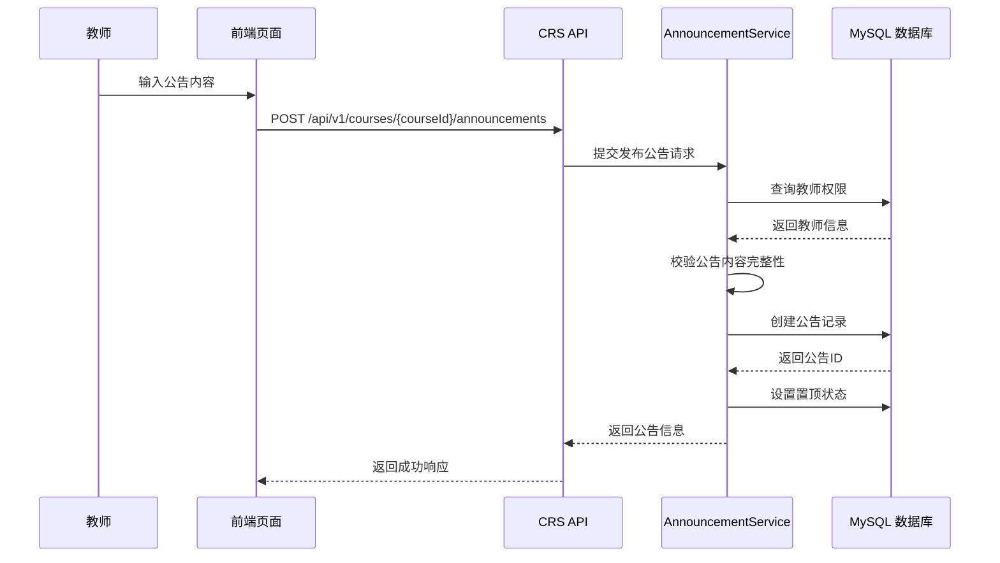
```mermaid
sequenceDiagram
  participant T as 教师
  participant P as 前端页面
  participant A as CRS API
  participant AS as AnnouncementService
  participant D as MySQL 数据库
  T->>P: 输入公告内容
  P->>A: POST /api/v1/courses/{courseId}/announcements
  A->>AS: 提交发布公告请求
  AS->>D: 查询教师权限
  D-->>AS: 返回教师信息
  AS->>AS: 校验公告内容完整性
  AS->>D: 创建公告记录
  D-->>AS: 返回公告ID
  AS->>D: 设置置顶状态
  AS-->>A: 返回公告信息
  A-->>P: 返回成功响应
```

### 数据结构与数据库设计

### 数据表清单

| 表编号 | 表名 | 中文名 | 主要字段 | 说明 |
| --- | --- | --- | --- | --- |
| DB-CRS-01 | crs_course | 课程表 | id, course_name, course_code, teacher_id, description, semester, department, cover_url, enrollment_mode, invite_code, max_students, start_date, end_date, status, is_deleted, created_at, updated_at | 存储课程基本信息、加入方式和展示配置 |
| DB-CRS-02 | crs_chapter | 章节表 | id, course_id, chapter_name, parent_id, sort_order, visible_status, chapter_type, is_deleted | 存储课程章节目录 |
| DB-CRS-03 | crs_resource | 资源表 | id, course_id, chapter_id, resource_name, resource_type, file_path, file_size, file_format, version, external_url, access_level, download_count, upload_user_id, is_deleted | 存储教学资源文件、外链和访问控制信息 |
| DB-CRS-04 | crs_course_member | 课程成员表 | id, course_id, user_id, role, join_method, join_status, approved_by, joined_at | 存储课程成员关系 |
| DB-CRS-05 | crs_announcement | 公告表 | id, course_id, publisher_id, title, content, is_pinned, publish_status, publish_time | 存储课程公告 |

### 表结构详情

### crs_course 表

| 字段名 | 类型 | 是否为空 | 默认值 | 索引 | 说明 |
| --- | --- | --- | --- | --- | --- |
| id | bigint | 否 | 无 | PK | 课程编号 |
| course_name | varchar(100) | 否 | 无 | idx_crs_course_name | 课程名称 |
| course_code | varchar(64) | 是 | NULL | UNIQUE | 课程编码 |
| teacher_id | bigint | 否 | 无 | idx_crs_course_teacher | 教师编号，逻辑关联 t_auth_user |
| description | text | 是 | NULL |  | 课程描述 |
| semester | varchar(64) | 是 | NULL |  | 授课学期 |
| department | varchar(100) | 是 | NULL |  | 开课院系或课程归属 |
| cover_url | varchar(500) | 是 | NULL |  | 课程封面地址 |
| enrollment_mode | tinyint | 否 | 1 |  | 加入方式：1公开、2邀请码、3审核 |
| invite_code | varchar(64) | 是 | NULL | UNIQUE | 邀请码，邀请码加入模式下使用 |
| max_students | int | 是 | NULL |  | 课程人数上限 |
| start_date | date | 是 | NULL |  | 开课日期 |
| end_date | date | 是 | NULL |  | 结课日期 |
| status | tinyint | 否 | 1 | idx_crs_course_status | 课程状态：0禁用、1启用、2归档 |
| is_deleted | tinyint | 否 | 0 |  | 逻辑删除 |
| created_at | datetime | 否 | 当前时间 |  | 创建时间 |
| updated_at | datetime | 否 | 当前时间 |  | 更新时间 |

### crs_chapter 表

| 字段名 | 类型 | 是否为空 | 默认值 | 索引 | 说明 |
| --- | --- | --- | --- | --- | --- |
| id | bigint | 否 | 无 | PK | 章节编号 |
| course_id | bigint | 否 | 无 | idx_crs_chapter_course_parent_order | 课程编号，外键到 crs_course |
| chapter_name | varchar(255) | 否 | 无 |  | 章节名称 |
| parent_id | bigint | 是 | NULL | idx_crs_chapter_parent | 父章节编号 |
| sort_order | int | 否 | 0 | idx_crs_chapter_course_parent_order | 章节排序号 |
| objective | text | 是 | NULL |  | 学习目标 |
| visible_status | tinyint | 否 | 1 |  | 可见状态 |
| chapter_type | tinyint | 否 | 1 |  | 章节类型：1普通、2实验、3作业 |
| is_deleted | tinyint | 否 | 0 |  | 逻辑删除 |
| created_at | datetime | 否 | 当前时间 |  | 创建时间 |
| updated_at | datetime | 否 | 当前时间 |  | 更新时间 |

### crs_resource 表

| 字段名 | 类型 | 是否为空 | 默认值 | 索引 | 说明 |
| --- | --- | --- | --- | --- | --- |
| id | bigint | 否 | 无 | PK | 资源编号 |
| course_id | bigint | 否 | 无 | idx_crs_resource_course | 课程编号，外键到 crs_course |
| chapter_id | bigint | 是 | NULL | idx_crs_resource_chapter | 章节编号，外键到 crs_chapter |
| resource_name | varchar(255) | 否 | 无 |  | 资源名称 |
| resource_type | tinyint | 否 | 无 |  | 资源类型：1文档、2视频、3课件、4链接 |
| file_path | varchar(500) | 否 | 无 |  | 文件路径 |
| file_size | bigint | 否 | 0 |  | 文件大小（字节） |
| file_format | varchar(32) | 是 | NULL |  | 文件格式 |
| version | int | 否 | 1 |  | 资源版本 |
| external_url | varchar(500) | 是 | NULL |  | 外部链接资源地址 |
| access_level | varchar(32) | 否 | COURSE_MEMBER |  | 访问级别：PUBLIC/COURSE_MEMBER/TEACHER_ONLY |
| download_count | int | 否 | 0 |  | 下载次数 |
| upload_user_id | bigint | 否 | 无 | idx_crs_resource_uploader | 上传用户编号，逻辑关联 t_auth_user |
| is_deleted | tinyint | 否 | 0 |  | 逻辑删除 |
| created_at | datetime | 否 | 当前时间 |  | 上传时间 |
| updated_at | datetime | 否 | 当前时间 |  | 更新时间 |

### crs_course_member 表

| 字段名 | 类型 | 是否为空 | 默认值 | 索引 | 说明 |
| --- | --- | --- | --- | --- | --- |
| id | bigint | 否 | 无 | PK | 成员关系编号 |
| course_id | bigint | 否 | 无 | idx_crs_member_course | 课程编号，外键到 crs_course |
| user_id | bigint | 否 | 无 | idx_crs_member_user | 用户编号，逻辑关联 t_auth_user |
| role | tinyint | 否 | 1 | idx_crs_member_role_status | 角色：1学生、2助教、3教师 |
| join_method | tinyint | 否 | 1 |  | 加入方式：1公开、2邀请码、3审核 |
| join_status | tinyint | 否 | 2 | idx_crs_member_role_status | 状态：1在课、0退课、2待审核 |
| apply_reason | varchar(500) | 是 | NULL |  | 申请理由 |
| approved_by | bigint | 是 | NULL |  | 审批人 |
| joined_at | datetime | 是 | NULL |  | 加入时间 |
| left_at | datetime | 是 | NULL |  | 退课时间 |
| is_deleted | tinyint | 否 | 0 |  | 逻辑删除 |

### crs_announcement 表

| 字段名 | 类型 | 是否为空 | 默认值 | 索引 | 说明 |
| --- | --- | --- | --- | --- | --- |
| id | bigint | 否 | 无 | PK | 公告编号 |
| course_id | bigint | 否 | 无 | idx_crs_announcement_course | 课程编号，外键到 crs_course |
| publisher_id | bigint | 否 | 无 |  | 发布用户编号，逻辑关联 t_auth_user |
| title | varchar(200) | 否 | 无 |  | 公告标题 |
| content | text | 否 | 无 |  | 公告内容 |
| is_pinned | tinyint | 否 | 0 |  | 是否置顶：0否、1是 |
| publish_status | tinyint | 否 | 1 |  | 发布状态 |
| publish_time | datetime | 是 | NULL |  | 发布时间 |
| expire_time | datetime | 是 | NULL |  | 过期时间 |
| target_role | tinyint | 是 | NULL |  | 目标角色 |
| view_count | int | 否 | 0 |  | 阅读次数 |
| is_deleted | tinyint | 否 | 0 |  | 逻辑删除 |
| created_at | datetime | 否 | 当前时间 |  | 创建时间 |
| updated_at | datetime | 否 | 当前时间 |  | 更新时间 |

### 关键流程与状态机

### 创建课程流程

图 3-2-7 创建课程流程图

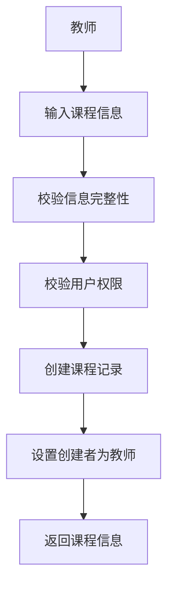
```mermaid
flowchart TD
  Teacher[教师] --> InputInfo[输入课程信息]
  InputInfo --> Validate[校验信息完整性]
  Validate --> PermissionCheck[校验用户权限]
  PermissionCheck --> CreateRecord[创建课程记录]
  CreateRecord --> SetTeacher[设置创建者为教师]
  SetTeacher --> ReturnResult[返回课程信息]
```

### 加入课程流程

图 3-2-8 加入课程流程图

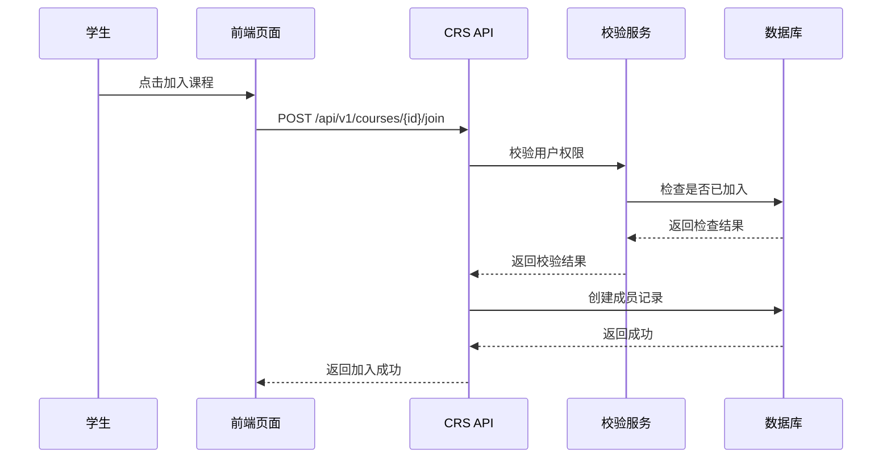
```mermaid
sequenceDiagram
  participant S as 学生
  participant P as 前端页面
  participant A as CRS API
  participant V as 校验服务
  participant D as 数据库
  S->>P: 点击加入课程
  P->>A: POST /api/v1/courses/{id}/join
  A->>V: 校验用户权限
  V->>D: 检查是否已加入
  D-->>V: 返回检查结果
  V-->>A: 返回校验结果
  A->>D: 创建成员记录
  D-->>A: 返回成功
  A-->>P: 返回加入成功
```

### 课程成员状态机

图 3-2-9 课程成员状态机

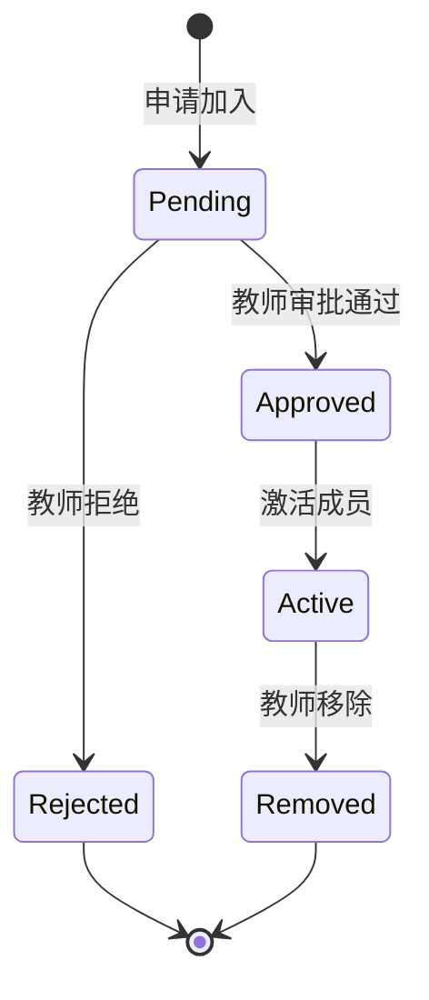
```mermaid
stateDiagram-v2
  [*] --> Pending: 申请加入
  Pending --> Approved: 教师审批通过
  Pending --> Rejected: 教师拒绝
  Approved --> Active: 激活成员
  Active --> Removed: 教师移除
  Rejected --> [*]
  Removed --> [*]
```

### 异常、安全、性能与测试关注点

### 异常处理

| 异常编号 | 异常场景 | 处理策略 | 用户提示或接口结果 | 对应需求 |
| --- | --- | --- | --- | --- |
| EX-CRS-01 | 课程不存在 | 返回404错误，记录日志 | "课程不存在" | FR-CR-01 |
| EX-CRS-02 | 无权限操作 | 返回403错误，记录权限违规日志 | "无权限访问" | FR-CR-01 |
| EX-CRS-03 | 文件上传失败 | 返回500错误，记录日志，清理临时文件 | "文件上传失败，请重试" | FR-CR-03 |
| EX-CRS-04 | 数据库操作失败 | 回滚事务，返回500错误，记录错误详情 | "系统错误，请联系管理员" | FR-CR-01 |
| EX-CRS-05 | 参数错误 | 返回400错误，提示具体参数问题 | "参数错误：{具体错误}" | FR-CR-01 |
| EX-CRS-06 | 用户未登录 | 返回401错误，重定向登录 | "请先登录" | FR-CR-04 |
| EX-CRS-07 | 章节排序冲突 | 返回409错误，提示重新排序 | "章节排序冲突，请调整顺序" | FR-CR-02 |
| EX-CRS-08 | 成员已存在 | 返回409错误，提示已加入 | "用户已是课程成员" | FR-CR-05 |
| EX-CRS-09 | 公告内容过长 | 返回400错误，提示长度限制 | "公告内容超过最大长度" | FR-CR-06 |
| EX-CRS-10 | 文件类型不支持 | 返回400错误，提示支持类型 | "不支持的文件类型" | FR-CR-03 |

### 安全设计

- 文件上传限制类型和大小
- 路径遍历攻击防护
- XSS防护：公告内容过滤
- 权限校验：教师操作需要课程教师权限

### 性能优化设计

- 课程列表分页查询
- 资源文件CDN加速
- 数据库索引优化

### 测试关注点

| 测试编号 | 测试场景 | 验收标准 | 优先级 |
| --- | --- | --- | --- |
| TC-CR-01 | 创建课程功能测试 | 教师可成功创建课程，信息正确保存 | 高 |
| TC-CR-02 | 课程章节管理测试 | 支持教师设置多级目录、调整目录 | 中 |
| TC-CR-03 | 资源上传下载测试 | 支持多种文件格式，下载链接有效 | 中 |
| TC-CR-04 | 加入课程流程测试 | 学生申请加入，教师审批通过后成为成员 | 高 |
| TC-CR-05 | 权限校验测试 | 非教师无法管理课程，非成员无法查看课程 | 高 |
| TC-CR-06 | 异常处理测试 | 无效输入、权限不足等场景正确处理 | 中 |

### 需求追踪与测试关注点

| 需求编号 | 需求名称 | 详细设计编号 | 页面编号 | API 编号 | 数据表编号 | 测试编号 | 备注 |
| --- | --- | --- | --- | --- | --- | --- | --- |
| FR-CR-01 | 课程创建与管理 | DSD-CRS-01 | UI-CRS-01, UI-CRS-02, UI-CRS-07 | API-CRS-01 ~ API-CRS-05 | DB-CRS-01 | TC-CR-01 | 教师可创建、编辑、删除课程，自动成为课程创建者 |
| FR-CR-02 | 课程章节与目录管理 | DSD-CRS-02 | UI-CRS-02, UI-CRS-03 | API-CRS-06 ~ API-CRS-09 | DB-CRS-02 | TC-CR-02 | 教师创建、编辑、排序、删除章节，支持嵌套结构 |
| FR-CR-03 | 教学资源管理 | DSD-CRS-03 | UI-CRS-04 | API-CRS-10 ~ API-CRS-13 | DB-CRS-03 | TC-CR-03 | 教师上传资源，限制文件类型和大小，学生可下载 |
| FR-CR-04 | 学生加入课程 | DSD-CRS-04 | UI-CRS-01 | API-CRS-14、API-CRS-18、API-CRS-19 | DB-CRS-04 | TC-CR-04 | 学生申请加入课程，教师审批后成为正式成员 |
| FR-CR-05 | 课程成员管理 | DSD-CRS-05 | UI-CRS-05 | API-CRS-15 ~ API-CRS-19 | DB-CRS-04 | TC-CR-05 | 教师管理课程成员，支持学生、助教、教师角色 |
| FR-CR-06 | 课程公告与基础信息展示 | DSD-CRS-06 | UI-CRS-02, UI-CRS-06 | API-CRS-20 ~ API-CRS-22 | DB-CRS-05 | TC-CR-06 | 教师发布公告，支持置顶功能，成员接收站内通知 |
| NFR-CR-01 | 可用性 | DSD-CRS-NFR-01 | UI-CRS-01 ~ UI-CRS-07 | API-CRS-01 ~ API-CRS-22 | - | TC-CR-N01 | 页面信息清晰、核心操作反馈明确 |
| NFR-CR-02 | 性能 | DSD-CRS-NFR-02 | UI-CRS-01、UI-CRS-04 | API-CRS-05、API-CRS-11 | DB-CRS-01 ~ DB-CRS-05 | TC-CR-N02 | 课程列表、首页和资源列表普通查询满足响应指标 |
| NFR-CR-03 | 可靠性 | DSD-CRS-NFR-03 | UI-CRS-01 ~ UI-CRS-07 | API-CRS-01 ~ API-CRS-22 | DB-CRS-01 ~ DB-CRS-05 | TC-CR-N03 | 资源上传失败不误报成功，课程关闭后历史数据可读 |
| NFR-CR-04 | 兼容性 | DSD-CRS-NFR-04 | UI-CRS-04 | API-CRS-10 ~ API-CRS-13 | DB-CRS-03 | TC-CR-N04 | 支持 PDF、DOCX、PPT、ZIP、图片等常见资源格式 |
| NFR-CR-05 | 可测试性 | DSD-CRS-NFR-05 | 全部 CRS 页面 | 全部 CRS 接口 | 全部 CRS 表 | TC-CR-N05 | 课程管理流程可完整测试 |

---
## 3.3 学习过程与通知提醒模块（LRN）

### 设计边界

本模块对应需求范围为 `FR-LN-01 ~ FR-LN-06`、`NFR-LN-01 ~ NFR-LN-05`，负责学习任务聚合、学习进度记录、学习行为跟踪、站内通知生成与状态管理、定时提醒和通知偏好配置。模块依赖 AUTH 提供用户上下文，依赖 CRS 提供课程与章节基础数据，并接收 LAB、HWK、GRD 的业务事件生成通知。

### 模块基本信息

| 项目     | 内容                                                         |
| -------- | ------------------------------------------------------------ |
| 模块名称 | 学习过程与通知提醒（LRN）                                    |
| 模块缩写 | LRN                                                          |
| 功能定位 | 学习任务聚合、学习进度记录、学习行为跟踪、通知生成与查询刷新、通知状态管理、定时提醒 |
| 核心数据 | 学习任务快照、学习进度、学习记录、通知、通知状态日志、提醒规则、通知偏好 |
| 技术栈   | Spring Boot、MySQL/JDBC、Vue3+TypeScript；本版本通知通过数据库落库和页面刷新/可配置轮询查询，WebSocket/SSE 与 Redis 缓存为可选扩展 |

### 模块职责与依赖关系

### 本模块负责的内容

1. 从 CRS、LAB、HWK 聚合任务摘要，形成学习任务中心。
2. 记录学生对课程、章节、资源的访问进度，支持断点续传。
3. 采集学习行为数据（时长、访问次数），提供个人学习仪表盘。
4. 接收 LAB、HWK、GRD 的业务事件，生成站内通知并管理已读/删除状态。
5. 支持用户配置非必要通知开关及任务截止提醒规则。
6. 本版本通过通知列表接口向前端提供已落库通知和未读数，前端在页面加载、手动刷新或可配置轮询时刷新；WebSocket/SSE 推送作为后续扩展。

### 本模块不负责的内容

1. 不负责用户账号、角色、权限的基础维护，相关内容由 AUTH 负责。
2. 不负责课程、章节、资源的创建和管理，相关内容由 CRS 负责。
3. 不负责实验任务创建、实验评测和实验评分，相关内容由 LAB 负责。
4. 不负责作业发布、作业评测和教师批阅，相关内容由 HWK 负责。
5. 不负责成绩计算、成绩汇总和成绩发布控制，相关内容由 GRD 负责。
6. 第三方邮件、短信推送和移动端推送不属于本设计范围，通知通道以站内通知为主。

### 与其他模块的协作关系

| 协作模块 | 协作内容 | LRN 提供 | 对方模块负责 |
| --- | --- | --- | --- |
| AUTH | 用户身份和权限校验 | 学习记录和通知数据与用户关联 | 用户登录状态和角色权限 |
| CRS | 课程和章节基础数据 | 学习任务聚合中使用课程/章节信息 | 课程、章节和成员关系数据 |
| LAB | 实验事件接收 | 通知生成、任务快照刷新 | 实验发布、截止、评测、评分事件 |
| HWK | 作业事件接收 | 通知生成、任务快照刷新 | 作业发布、截止、评测、批阅事件 |
| GRD | 成绩事件接收 | 通知生成 | 成绩发布、变更、复核事件 |

### 对外接口分类

| 接口分类       | 说明                                 |
| -------------- | ------------------------------------ |
| 学习任务与进度 | 任务列表、进度查询、进度保存         |
| 学习行为       | 行为上报、仪表盘统计                 |
| 通知管理       | 查询、标记已读、删除、事件接收       |
| 规则配置       | 提醒规则查询/保存、通知偏好查询/保存 |

---

### 页面详细设计

| 页面编号  | 页面名称       | 使用角色 | 页面目标                                                 | 主要操作             | 调用接口                           |
| --------- | -------------- | -------- | -------------------------------------------------------- | -------------------- | ---------------------------------- |
| UI-LRN-01 | 学习任务中心页 | 学生     | 统一查看课程资源、实验、作业三类任务，支持状态筛选和跳转 | 任务筛选、排序、跳转 | API-LRN-01                         |
| UI-LRN-02 | 学习进度页     | 学生     | 展示课程级和章节级学习进度，支持继续学习                 | 查看进度、继续学习   | API-LRN-02、API-LRN-03             |
| UI-LRN-03 | 学习行为仪表盘 | 学生     | 展示近7天学习趋势、完成任务数、学习时长                  | 无主动操作           | API-LRN-04、API-LRN-05             |
| UI-LRN-04 | 消息通知中心页 | 全体     | 查看分类通知、标记已读、删除、跳转业务页面               | 筛选、批量已读、删除 | API-LRN-06、API-LRN-07、API-LRN-08 |
| UI-LRN-05 | 提醒规则设置页 | 学生     | 设置非必要通知开关和截止提醒规则                         | 开关切换、规则保存   | API-LRN-10、API-LRN-11             |

### 页面流转图

图 3-3-1 LRN 页面流转图

```mermaid
flowchart TD
  User[用户] --> TaskCenter[学习任务中心页]
  User --> NotifCenter[消息通知中心页]
  TaskCenter --> TaskFilter{任务类型筛选}
  TaskFilter -->|资源| ResourceTask[查看资源任务]
  TaskFilter -->|实验| LabTask[跳转实验详情页]
  TaskFilter -->|作业| HwkTask[跳转作业详情页]
  TaskCenter --> Progress[学习进度页]
  Progress --> ContinueLearn[继续学习/断点续传]
  TaskCenter --> Dashboard[学习行为仪表盘]
  Dashboard --> Trends[查看近7天学习趋势]
  NotifCenter --> NotifFilter[按类型/已读状态筛选]
  NotifFilter --> ReadAction[标记已读]
  NotifFilter --> DeleteAction[删除通知]
  NotifFilter --> JumpAction[跳转业务页面]
  NotifCenter --> Settings[提醒规则设置页]
  Settings --> ToggleSwitch[通知开关切换]
  Settings --> RuleSave[截止提醒规则保存]
```

### 页面交互规则

1. 学习任务中心页默认按截止时间升序排列，支持按任务类型（资源/实验/作业）和状态（未开始/进行中/已完成/已逾期）筛选，分页展示。
2. 学习进度页按课程展示总进度百分比和章节级进度，支持点击"继续学习"恢复上次学习位置。
3. 学习行为仪表盘展示近7天学习趋势折线图、完成任务数和总学习时长统计，数据按用户隔离。
4. 消息通知中心页默认按创建时间倒序分页展示，未读通知高亮显示，支持批量标记已读和单个删除，点击通知可跳转至对应业务页面。
5. 提醒规则设置页允许学生配置各类通知的开关状态和截止提醒提前量（如提前1天、提前1小时），保存后即时生效。

### 接口详细设计

统一响应格式：
```json
{
  "code": 0,
  "message": "success",
  "data": {}
}
```

### 学习任务中心接口

| 接口编号   | 接口名称                   | 方法 | 路径                        | 权限要求 | 对应需求 |
| ---------- | -------------------------- | ---- | --------------------------- | -------- | -------- |
| API-LRN-01 | 获取学习任务列表           | GET  | /api/v1/learning/tasks      | 登录     | FR-LN-01 |
| API-LRN-02 | 获取课程/章节学习进度      | GET  | /api/v1/learning/progress   | 登录     | FR-LN-02 |
| API-LRN-03 | 保存学习进度（断点续传）   | POST | /api/v1/learning/progress   | 登录     | FR-LN-02 |
| API-LRN-04 | 获取学习行为统计（仪表盘） | GET  | /api/v1/learning/statistics | 登录     | FR-LN-03 |
| API-LRN-05 | 上报学习行为记录           | POST | /api/v1/learning/records    | 登录     | FR-LN-03 |

**请求/响应示例（API-LRN-01）**：

请求参数（Query）：
| 参数     | 类型   | 必填 | 说明                                                 |
| -------- | ------ | ---- | ---------------------------------------------------- |
| taskType | string | 否   | 任务类型：RESOURCE/EXPERIMENT/HOMEWORK，多个逗号分隔 |
| status   | string | 否   | NOT_STARTED/IN_PROGRESS/COMPLETED/OVERDUE            |
| courseId | long   | 否   | 课程ID                                               |
| sortBy   | string | 否   | 排序字段：deadline/createdAt，默认deadline           |
| order    | string | 否   | asc/desc，默认asc                                    |
| page     | int    | 否   | 页码，默认1                                          |
| size     | int    | 否   | 每页条数，默认20                                     |

响应示例：
```json
{
  "code": 0,
  "data": {
    "records": [
      {
        "taskId": 1001,
        "taskType": "HOMEWORK",
        "title": "Java作业1",
        "courseId": 10,
        "courseName": "Java程序设计",
        "deadline": "2026-06-01 23:59:59",
        "progress": 0,
        "status": "NOT_STARTED",
        "actionUrl": "/courses/10/homeworks/5"
      }
    ],
    "total": 45,
    "page": 1,
    "size": 20
  }
}
```

**API-LRN-03 请求体**：
```json
{
  "courseId": 10,
  "chapterId": 101,
  "sourceModule": "CRS",
  "sourceId": 2001,
  "progressPercent": 65,
  "lastPosition": "video_play_time=1234"
}
```

### 通知管理接口

| 接口编号   | 接口名称             | 方法   | 路径                                   | 权限要求                 | 对应需求 |
| ---------- | -------------------- | ------ | -------------------------------------- | ------------------------ | -------- |
| API-LRN-06 | 获取通知列表         | GET    | /api/v1/notifications                  | 登录                     | FR-LN-04 |
| API-LRN-07 | 标记已读             | PUT    | /api/v1/notifications/read             | 登录                     | FR-LN-05 |
| API-LRN-08 | 删除通知             | DELETE | /api/v1/notifications/{notificationId} | 登录                     | FR-LN-05 |
| API-LRN-09 | 接收业务事件（内部） | POST   | /api/v1/notifications/events           | 内部服务（IP白名单/JWT） | FR-LN-04 |

**API-LRN-06 请求参数**：`type`、`isRead`、`startTime`、`endTime`、`page`、`size`

**API-LRN-07 请求体**：
```json
{
  "notificationIds": [1,2,3],
  "readAll": false
}
```

说明：本版本以 `PUT /api/v1/notifications/read` 作为唯一已读写接口，`notificationIds` 为空且 `readAll=true` 时表示全部标记已读。`PUT /api/v1/notifications/{notificationId}/read` 与 `PUT /api/v1/notifications/read-all` 可作为兼容别名扩展。

**API-LRN-09 请求体**（事件格式）：
```json
{
  "eventType": "HOMEWORK_PUBLISHED",
  "sourceModule": "HWK",
  "sourceId": 123,
  "receiverUserIds": [1001, 1002],
  "title": "新作业发布：Java编程题",
  "content": "作业截止时间：2026-06-01",
  "priority": 1,
  "actionUrl": "/courses/10/homeworks/123"
}
```

### 提醒规则与通知偏好接口

| 接口编号   | 接口名称               | 方法 | 路径                   | 权限要求 | 对应需求 |
| ---------- | ---------------------- | ---- | ---------------------- | -------- | -------- |
| API-LRN-10 | 获取提醒规则及通知偏好 | GET  | /api/v1/reminder-rules | 登录     | FR-LN-06 |
| API-LRN-11 | 保存提醒规则及通知偏好 | PUT  | /api/v1/reminder-rules | 登录     | FR-LN-06 |

**API-LRN-10 响应示例**：
```json
{
  "rules": [
    { "reminderType": "HOMEWORK_DEADLINE", "aheadMinutes": 1440, "enabled": true },
    { "reminderType": "HOMEWORK_DEADLINE", "aheadMinutes": 60, "enabled": true }
  ],
  "settings": {
    "enableExperiment": true,
    "enableHomework": true,
    "enableGrade": true,
    "enableAnnouncement": true,
    "enableNonCriticalReminder": false
  }
}
```

### 后端服务与组件设计

| 服务编号   | 服务/组件名称         | 主要职责                                                     | 输入                       | 输出                  |
| ---------- | --------------------- | ------------------------------------------------------------ | -------------------------- | --------------------- |
| SVC-LRN-01 | LearningTaskService   | 聚合 CRS/LAB/HWK 任务数据，管理数据库任务快照，处理进度保存与查询 | userId, query, progressDTO | 分页任务列表、进度DTO |
| SVC-LRN-02 | LearningRecordService | 记录学习行为（访问、时长），计算近7天统计数据，提供仪表盘数据 | LearningRecordDTO          | 统计DTO、成功/失败    |
| SVC-LRN-03 | NotificationService   | 创建通知记录、查询通知列表、标记已读/删除、基于数据库统计未读数 | NotificationCreateDTO      | 通知列表、未读数      |
| SVC-LRN-04 | ReminderRuleService   | 管理用户提醒规则和通知偏好，定时扫描即将截止任务并触发提醒   | userId, ruleDTO            | 规则列表、成功/失败   |
| SVC-LRN-05 | EventConsumerService  | 接收来自 CRS/LAB/HWK/GRD 的业务事件或内部服务调用，调用 NotificationService 创建通知 | ModuleEvent                | 通知ID列表            |

### 数据结构与数据库设计

### 表清单

| 表编号    | 表名                        | 中文名         | 主要字段                                                     | 说明                       |
| --------- | --------------------------- | -------------- | ------------------------------------------------------------ | -------------------------- |
| DB-LRN-01 | lrn_learning_task           | 学习任务快照表 | id, user_id, course_id, source_module, source_id, task_type, title, deadline, progress, status, action_url, snapshot_at | 聚合任务的快照表，定期刷新 |
| DB-LRN-02 | lrn_learning_progress       | 学习进度表     | id, user_id, course_id, chapter_id, source_module, source_id, progress_percent, last_position, status | 支持断点续传               |
| DB-LRN-03 | lrn_learning_record         | 学习行为记录表 | id, user_id, course_id, source_module, source_id, action_type, duration, started_at, ended_at | 行为日志，用于统计         |
| DB-LRN-04 | lrn_notification            | 通知表         | id, user_id, title, content, type, priority, is_read, source_module, source_id, action_url, created_at, read_at, deleted_at | 站内通知                   |
| DB-LRN-05 | lrn_notification_status_log | 通知状态日志表 | id, notification_id, user_id, old_status, new_status, operation_type, operated_at | 状态变更留痕               |
| DB-LRN-06 | lrn_reminder_rule           | 提醒规则表     | id, user_id, reminder_type, source_module, ahead_minutes, enabled, required | 用户自定义提醒规则         |
| DB-LRN-07 | lrn_notification_setting    | 通知偏好表     | id, user_id, enable_experiment, enable_homework, enable_grade, enable_announcement, enable_non_critical_reminder | 模块级开关                 |

### 关键表DDL（MySQL 8.0）

```sql
-- 学习任务快照表
CREATE TABLE `lrn_learning_task` (
  `id` bigint NOT NULL AUTO_INCREMENT,
  `user_id` bigint NOT NULL COMMENT '用户ID',
  `course_id` bigint NOT NULL COMMENT '课程ID',
  `source_module` varchar(20) NOT NULL COMMENT 'CRS/LAB/HWK',
  `source_id` bigint NOT NULL COMMENT '来源业务ID',
  `task_type` varchar(20) NOT NULL COMMENT 'RESOURCE/EXPERIMENT/HOMEWORK',
  `title` varchar(200) NOT NULL,
  `deadline` datetime DEFAULT NULL,
  `progress` int DEFAULT 0,
  `status` varchar(20) NOT NULL DEFAULT 'NOT_STARTED',
  `action_url` varchar(500) DEFAULT NULL,
  `snapshot_at` datetime DEFAULT NULL,
  `created_at` datetime NOT NULL DEFAULT CURRENT_TIMESTAMP,
  `updated_at` datetime NOT NULL DEFAULT CURRENT_TIMESTAMP ON UPDATE CURRENT_TIMESTAMP,
  PRIMARY KEY (`id`),
  KEY `idx_user_course` (`user_id`, `course_id`),
  KEY `idx_status_deadline` (`status`, `deadline`)
) ENGINE=InnoDB DEFAULT CHARSET=utf8mb4 COMMENT='学习任务快照表';

-- 学习进度表
CREATE TABLE `lrn_learning_progress` (
  `id` bigint NOT NULL AUTO_INCREMENT,
  `user_id` bigint NOT NULL,
  `course_id` bigint NOT NULL,
  `chapter_id` bigint DEFAULT NULL,
  `source_module` varchar(20) NOT NULL,
  `source_id` bigint NOT NULL,
  `progress_percent` int DEFAULT 0,
  `last_position` varchar(500) DEFAULT NULL,
  `status` varchar(20) DEFAULT 'IN_PROGRESS',
  `updated_at` datetime NOT NULL DEFAULT CURRENT_TIMESTAMP ON UPDATE CURRENT_TIMESTAMP,
  PRIMARY KEY (`id`),
  UNIQUE KEY `uk_user_course_source` (`user_id`, `course_id`, `source_module`, `source_id`),
  KEY `idx_user_course_chapter` (`user_id`, `course_id`, `chapter_id`)
) ENGINE=InnoDB DEFAULT CHARSET=utf8mb4 COMMENT='学习进度';

-- 通知表
CREATE TABLE `lrn_notification` (
  `id` bigint NOT NULL AUTO_INCREMENT,
  `user_id` bigint NOT NULL,
  `title` varchar(200) NOT NULL,
  `content` text,
  `type` varchar(30) NOT NULL COMMENT 'LEARNING_REMINDER/TASK_NOTIFICATION/GRADE_NOTIFICATION/SYSTEM_ANNOUNCEMENT/TEACHER_ANNOUNCEMENT',
  `priority` tinyint DEFAULT 0,
  `is_read` tinyint NOT NULL DEFAULT 0,
  `source_module` varchar(20) DEFAULT NULL,
  `source_id` bigint DEFAULT NULL,
  `action_url` varchar(500) DEFAULT NULL,
  `created_at` datetime NOT NULL DEFAULT CURRENT_TIMESTAMP,
  `read_at` datetime DEFAULT NULL,
  `deleted_at` datetime DEFAULT NULL,
  PRIMARY KEY (`id`),
  KEY `idx_user_read_created` (`user_id`, `is_read`, `created_at`)
) ENGINE=InnoDB DEFAULT CHARSET=utf8mb4 COMMENT='通知表';
```

### 其他 LRN 表字段约束

| 表编号 | 表名 | 字段约束补充 | 索引与一致性要求 |
| --- | --- | --- | --- |
| DB-LRN-03 | `lrn_learning_record` | `user_id`、`course_id`、`source_module`、`source_id`、`action_type`、`started_at` 非空；`duration` 以秒计，默认 0，不能为负数 | 建立 `idx_record_user_course(user_id, course_id, created_at)`；行为记录只追加，不覆盖历史 |
| DB-LRN-05 | `lrn_notification_status_log` | `notification_id`、`user_id`、`old_status`、`new_status`、`operation_type`、`operated_at` 非空 | 建立 `idx_notif_log_notification(notification_id, operated_at)`；通知删除、已读、批量已读均需留痕 |
| DB-LRN-06 | `lrn_reminder_rule` | `user_id`、`reminder_type`、`source_module`、`ahead_minutes`、`enabled` 非空；`ahead_minutes` 大于等于 0；`required` 表示系统强提醒不可关闭 | 建立 `uk_reminder_user_type(user_id, reminder_type, source_module)`；同一用户同一提醒类型只保留一条启用配置 |
| DB-LRN-07 | `lrn_notification_setting` | `user_id` 非空且唯一；各类 `enable_*` 字段默认 1；非关键提醒开关不得关闭成绩发布等强提醒 | 建立 `uk_notification_setting_user(user_id)`；缺省设置按全部关键通知开启处理 |

### 关键业务流程与状态机

### 学习任务加载时序图

图 3-3-2 LRN 学习任务加载顺序图

```mermaid
sequenceDiagram
    participant U as 学生
    participant P as 前端页面
    participant C as LRN Controller
    participant S as LearningTaskService
    participant DB as MySQL数据库
    participant CRS as CRS模块
    participant LAB as LAB模块
    participant HWK as HWK模块

    U->>P: 进入学习任务中心
    P->>C: GET /api/v1/learning/tasks
    C->>S: getTaskList(userId, query)
    S->>DB: 查询 lrn_learning_task 快照
    alt 快照可直接使用
        DB-->>S: 返回分页任务快照
    else 快照缺失或需要刷新
        S->>CRS: 调用课程资源任务摘要
        S->>LAB: 调用实验任务摘要
        S->>HWK: 调用作业任务摘要
        CRS-->>S: 资源任务列表
        LAB-->>S: 实验任务列表
        HWK-->>S: 作业任务列表
        S->>DB: 合并后写入/刷新任务快照
    end
    S-->>C: 返回分页任务列表
    C-->>P: JSON响应
    P-->>U: 渲染任务卡片
```

### 通知触发与刷新时序图

图 3-3-3 LRN 通知生成与刷新顺序图

```mermaid
sequenceDiagram
    participant LAB as LAB模块
    participant Event as NotificationEventPublisher
    participant EC as EventConsumerService
    participant NS as NotificationService
    participant DB as MySQL数据库
    participant FE as 前端页面
    participant U as 用户

    LAB->>Event: 发布 LAB_EXPERIMENT_PUBLISHED 事件
    Event->>EC: 转交事件
    EC->>NS: processEvent(event)
    NS->>DB: 批量插入通知记录
    DB-->>NS: 返回创建通知ID
    U->>FE: 打开通知中心/点击刷新/等待轮询
    FE->>NS: GET /api/v1/notifications
    NS->>DB: 查询通知列表和未读数
    DB-->>NS: 返回通知分页与 unreadCount
    NS-->>FE: JSON响应
    FE-->>U: 更新通知列表和未读角标
```

### 状态机

### 学习任务状态机

图 3-3-4 LRN 学习任务状态机

```mermaid
stateDiagram-v2
    [*] --> NOT_STARTED : 任务创建/发布
    NOT_STARTED --> IN_PROGRESS : 用户首次访问/提交
    IN_PROGRESS --> COMPLETED : 任务完成
    IN_PROGRESS --> OVERDUE : 超过截止时间且未完成
    NOT_STARTED --> OVERDUE : 超截止时间且从未开始
    COMPLETED --> [*]
    OVERDUE --> IN_PROGRESS : 教师允许重开（状态重置）
```

### 通知已读状态机

图 3-3-5 LRN 通知已读状态机

```mermaid
stateDiagram-v2
    [*] --> UNREAD : 事件触发创建
    UNREAD --> READ : 用户点击/批量标记已读
    UNREAD --> DELETED : 用户删除（逻辑删除）
    READ --> DELETED : 用户删除
    DELETED --> [*]
```

### 定时提醒触发流程

1. Spring `@Scheduled` 每10分钟执行 `ReminderRuleService.scanAndSendDeadlineReminders()`。
2. 查询 `lrn_learning_task` 中 `deadline` 在 `[now, now+1小时]` 且 `status != COMPLETED` 的任务。
3. 对每个任务，匹配 `lrn_reminder_rule` 中 `reminder_type` 对应且 `enabled=true` 的规则。
4. 检查用户 `lrn_notification_setting` 是否允许该类提醒。
5. 调用 `NotificationService` 创建通知（类型 `LEARNING_REMINDER`）。
6. 防重复：同一任务同一提前量24小时内仅提醒一次（记录最后提醒时间）。

### 异常处理设计

| 异常场景                     | 处理方式                                                    | 错误码 | HTTP状态码    |
| ---------------------------- | ----------------------------------------------------------- | ------ | ------------- |
| 任务快照数据过期且无法拉取   | 返回数据库中最近一次任务快照，记录错误日志，提示“部分任务可能未更新” | 30001  | 200（带警告） |
| 通知事件接收失败（内部调用异常） | 事件生产者记录失败并重试；关键通知失败时保留失败状态供补偿 | 30002  | 500           |
| 通知列表刷新失败            | 前端保留当前列表并提示重试，用户可手动刷新；后端不依赖推送队列 | -      | -             |
| 学习进度保存时唯一键冲突     | 使用 `ON DUPLICATE KEY UPDATE` 更新                         | 0      | 200           |
| 用户尝试修改他人通知         | 接口层校验 `notification.user_id == currentUserId`，否则403 | 403    | 403           |
| 学习行为上报频率过高         | 限制同一用户同一资源每分钟最多10次，超出返回429             | 30003  | 429           |

### 安全、权限与日志设计

| 安全项   | 设计说明                                                     |
| -------- | ------------------------------------------------------------ |
| 身份认证 | 所有接口均需JWT Token，`userId` 从Token解析，不从请求参数获取 |
| 数据隔离 | 查询任务、通知时自动追加 `WHERE user_id = currentUserId`     |
| 事件接口 | `/api/v1/notifications/events` 仅允许内部服务调用（IP白名单或内网JWT） |
| 防刷     | 学习行为上报接口增加限流（令牌桶，每用户每分钟10次）         |
| 审计日志 | 通知创建、批量已读、删除等操作记录到 `lrn_notification_status_log` |
| 敏感信息 | 通知内容中不得包含明文密码、完整令牌等                       |

### 性能与可维护性设计

| 性能点       | 设计策略                                                     |
| ------------ | ------------------------------------------------------------ |
| 任务列表加载 | 数据库任务快照 + 索引查询；列表分页，每页20条；Redis 仅为后续热点缓存扩展 |
| 未读计数     | 通过 `lrn_notification` 的 `user_id + is_read` 索引统计；Redis 未读计数仅为后续扩展 |
| 学习行为上报 | 异步写入数据库（`@Async`），不阻塞用户操作                   |
| 数据库索引   | 已按查询场景建立复合索引（见DDL）                            |
| 批量操作     | 标记已读支持批量 `update ... where id in (…)`                |
| 可测试性     | 通过内部事件接口或服务测试模拟通知事件，验证通知落库、查询刷新和状态变更 |

### 需求追踪与测试关注点

### 需求追踪矩阵

| 需求编号 | 需求名称           | 详细设计编号 | 页面编号  | API编号       | 数据表编号   | 测试编号 | 备注 |
| -------- | ------------------ | ------------ | --------- | ------------- | ------------ | -------- | ---- |
| FR-LN-01 | 学习任务中心展示   | DSD-LRN-01   | UI-LRN-01 | API-LRN-01 | DB-LRN-01 | TC-LN-01 | 覆盖任务聚合与列表展示 |
| FR-LN-02 | 学习进度记录与展示 | DSD-LRN-02   | UI-LRN-02 | API-LRN-02、API-LRN-03 | DB-LRN-02 | TC-LN-02 | 覆盖断点续传和进度展示 |
| FR-LN-03 | 学习行为跟踪       | DSD-LRN-03   | UI-LRN-03 | API-LRN-04、API-LRN-05 | DB-LRN-03 | TC-LN-03 | 覆盖行为上报和统计展示 |
| FR-LN-04 | 通知分类生成与展示 | DSD-LRN-04   | UI-LRN-04 | API-LRN-06、API-LRN-09 | DB-LRN-04 | TC-LN-04 | 覆盖业务事件转通知 |
| FR-LN-05 | 通知触达与状态管理 | DSD-LRN-05   | UI-LRN-04 | API-LRN-07、API-LRN-08 | DB-LRN-05 | TC-LN-05 | 覆盖已读和删除留痕 |
| FR-LN-06 | 定时提醒与规则配置 | DSD-LRN-06   | UI-LRN-05 | API-LRN-10、API-LRN-11 | DB-LRN-06、DB-LRN-07 | TC-LN-06 | 覆盖提醒规则和通知偏好 |
| NFR-LN-01 | 刷新及时性 | DSD-LRN-NFR-01 | UI-LRN-01、UI-LRN-04 | API-LRN-01、API-LRN-06 | DB-LRN-01、DB-LRN-04 | TC-LN-N01 | 任务状态、学习进度和通知未读数在页面刷新或轮询后可见 |
| NFR-LN-02 | 性能 | DSD-LRN-NFR-02 | UI-LRN-01、UI-LRN-04 | API-LRN-01、API-LRN-06 | DB-LRN-01、DB-LRN-04 | TC-LN-N02 | 学习任务列表、通知列表和批量操作满足响应指标 |
| NFR-LN-03 | 可靠性 | DSD-LRN-NFR-03 | UI-LRN-02、UI-LRN-04 | API-LRN-03、API-LRN-07、API-LRN-09 | DB-LRN-02、DB-LRN-04、DB-LRN-05 | TC-LN-N03 | 学习进度可恢复，通知事件和状态不丢失 |
| NFR-LN-04 | 易用性 | DSD-LRN-NFR-04 | UI-LRN-01 ~ UI-LRN-05 | API-LRN-01 ~ API-LRN-11 | - | TC-LN-N04 | 学习中心和通知中心入口清晰，主要操作路径不超过 2 步 |
| NFR-LN-05 | 可追踪性 | DSD-LRN-NFR-05 | UI-LRN-02、UI-LRN-04 | API-LRN-03、API-LRN-07、API-LRN-08 | DB-LRN-02、DB-LRN-03、DB-LRN-05 | TC-LN-N05 | 学习记录、进度变更和通知状态变更可追溯 |

### 测试关注点

- **任务列表**：不同角色、不同课程、不同状态下的任务展示正确性；任务快照缺失或过期后可刷新。
- **学习进度**：断点续传功能（关闭页面再打开恢复位置）；进度百分比计算准确。
- **学习行为**：时长统计准确性；仪表盘折线图数据正确。
- **通知**：事件触发后通知落库；页面加载、手动刷新或轮询后通知和未读数更新；批量已读/删除的幂等性。
- **提醒规则**：定时任务触发提醒；用户关闭非必要通知后不再收到提醒。
- **性能**：任务列表首屏加载 ≤1.5秒；通知列表加载 ≤1秒；标记已读批量操作 ≤500ms。

---
## 3.4 实训实验模块（LAB）

### 设计边界

LAB 模块的设计边界如下：

- **包含**：实验创建与发布、学生查看与提交实验、提交历史与版本管理、实验自动评测、实验报告管理、教师评分与评语、实验结果展示、实验统计查询、测试用例管理。
- **不包含**：用户注册登录与权限管理（AUTH）、课程与成员关系维护（CRS）、学习进度记录（LRN）、作业评测业务（HWK）、最终总评计算与成绩发布（GRD）。LAB 仅通过接口调用上述模块获取基础数据。
- **评测方案**：采用 Docker 沙箱执行与 IO 比对结合的自动评测方案，LAB 与 HWK 共享 `EvaluationTask`、`Evaluator`、`SandboxExecutor` 和 `EvaluationResult` 设计抽象，各自保留业务入口、提交表和成绩同步规则。
- **报告方案**：实验报告作为独立设计元素管理，报告文件通过文件存储代理保存元数据，与实验提交、教师评分和成绩来源同步建立可追踪关系。

---

### 模块基本信息

| 项目 | 内容 |
| --- | --- |
| 模块名称 | 实训实验模块 |
| 模块缩写 | LAB |
| 对应需求 | FR-LAB-01 ~ FR-LAB-08 / NFR-LAB-01 ~ NFR-LAB-05 |
| 依赖模块 | AUTH（用户身份与权限）、CRS（课程与成员关系）、LRN（通知触发） |
| 协作模块 | HWK（评测抽象协同）、GRD（成绩数据同步） |
| 被依赖模块 | GRD（读取实验成绩来源）、LRN（触发通知） |

---

### 模块职责与依赖关系

### 模块职责

LAB 模块是"在线教学与实训平台"的核心实践环节模块，承担实验全生命周期管理职责，具体包括：

1. **实验管理**：教师可在课程内创建实验任务，编辑实验描述、要求、截止时间，上传实验附件（如参考代码、数据文件），管理实验状态（草稿、已发布、已截止、成绩已发布、已归档）。
2. **学生提交**：学生在实验详情页查看实验要求，编写代码或上传文件，提交实验结果。支持多次提交，保留提交历史，学生可查看每次提交的评测结果。
3. **自动评测**：教师可为代码类实验配置公开/隐藏测试用例，学生提交后系统创建评测任务，由 Docker 沙箱完成编译、运行、资源限制和 IO 比对，给出测试用例级反馈。
4. **实验报告**：学生按实验要求上传 PDF、DOCX 或 ZIP 报告文件，系统记录报告版本、文件信息、提交状态和迟交标记，教师可查看、下载并参与评分。
5. **教师评分**：教师可在自动评测和实验报告基础上进行人工评分和评语填写，支持批量评分、分数调整和修改原因留痕。
6. **结果展示**：学生可查看实验的公开评测反馈、最终成绩、教师评语、报告评分、提交历史和每次评测的详细反馈。
7. **统计查询**：教师可查看实验维度和课程维度的提交率、未提交名单、评测完成率、平均分、分数分布和逾期提交统计。

### 依赖关系

| 调用方 | 被调用方 | 依赖内容 | 调用方式 |
| --- | --- | --- | --- |
| LAB | AUTH | 获取当前登录用户身份、角色（学生/教师）、权限校验 | 请求头携带 Token，AUTH 统一鉴权拦截 |
| LAB | CRS | 校验课程是否存在、查询用户是否为课程成员、校验教师是否拥有课程管理权限 | 通过 `CoursePermissionClient` 调用 CRS 课程成员与权限校验接口 |
| LAB | LRN | 在实验发布、截止提醒、评测完成、评分完成、成绩发布等事件触发通知 | 通过 `NotificationEventPublisher` 调用 `POST /api/v1/notifications/events` |
| GRD | LAB | 读取实验成绩来源数据（提交状态、评测结果、教师评分） | GRD 调用 LAB 查询接口或 LAB 评测完成后推送 |
| LAB | 文件存储 | 保存实验附件、学生提交文件和实验报告文件 | 通过 `FileStorageService` 保存文件元数据和受控下载地址 |

### 模块边界

- LAB 不直接管理用户账号和课程成员关系，通过 AUTH 和 CRS 获取。
- LAB 不负责成绩汇总与总评计算，评测与评分完成后由 GRD 读取或主动推送成绩数据。
- LAB 不负责作业相关业务，作业的提交、评测、批阅由 HWK 模块独立管理；两模块只复用评测抽象和沙箱执行器，不共享业务提交表。
- LAB 不直接实现通知中心、文件存储、成绩汇总和课程成员管理；对应能力分别通过 LRN、文件存储代理、GRD 和 CRS 提供。
- LAB 的自动评测支持 Docker 沙箱中的编译运行与 IO 比对，沙箱执行器复用 HWK 的评测抽象；LAB 只维护实验业务状态、实验测试用例、实验提交、报告和成绩来源。

---

### 页面详细设计

### 页面总览

| 页面编号 | 页面名称 | 使用角色 | 页面目标 | 主要操作 | 调用接口 |
| --- | --- | --- | --- | --- | --- |
| UI-LAB-01 | 实验列表页 | 学生、教师 | 按课程查看实验任务列表 | 按课程/状态筛选实验、点击进入详情、教师可创建实验 | API-LAB-02、API-LAB-01 |
| UI-LAB-02 | 实验详情页（学生端） | 学生 | 查看实验要求、提交代码或报告、查看结果 | 查看实验描述与附件、在线编写代码或上传文件、上传实验报告、查看评测结果与教师评分 | API-LAB-03、API-LAB-08、API-LAB-10、API-LAB-16、API-LAB-17 |
| UI-LAB-03 | 实验详情页（教师端） | 教师 | 管理实验、查看提交情况、评分 | 编辑实验信息、随实验编辑整体维护测试用例、查看学生提交列表、对学生提交评分 | API-LAB-03、API-LAB-04、API-LAB-15（能力编号）、API-LAB-09、API-LAB-13 |
| UI-LAB-04 | 实验发布/编辑页 | 教师 | 创建或编辑实验任务 | 填写实验名称、描述、截止时间、上传附件、保存草稿或发布 | API-LAB-01、API-LAB-04、API-LAB-06 |
| UI-LAB-05 | 提交历史页 | 学生 | 查看本人某次实验的全部提交记录 | 查看提交时间、提交版本、评测状态、评测得分、查看提交详情 | API-LAB-09、API-LAB-10 |
| UI-LAB-06 | 评分页 | 教师 | 对学生提交和报告进行评分 | 查看学生提交代码、实验报告、评测结果，填写自动评测修正分、报告分、人工分和评语 | API-LAB-10、API-LAB-12、API-LAB-13、API-LAB-17 |
| UI-LAB-07 | 实验结果页 | 学生 | 查看实验最终成绩和反馈 | 查看最终成绩、教师评语、报告评分、评测通过率、公开测试用例结果 | API-LAB-10、API-LAB-12、API-LAB-17、API-LAB-18 |
| UI-LAB-08 | 实验统计页 | 教师 | 查看实验维度统计数据 | 查看提交率、未提交名单、评测完成率、平均分、分数分布、逾期提交数 | API-LAB-14 |

### 页面流转图

图 3-4-0 LAB 页面流转图

```mermaid
flowchart TD
  User[用户] --> LabList[实验列表页]
  LabList --> StudentCheck{当前用户角色}
  StudentCheck -->|学生| StuDetail[实验详情页-学生端]
  StudentCheck -->|教师| TeacherDetail[实验详情页-教师端]
  StuDetail --> Submission[提交实验]
  Submission --> SubmitResult{提交结果}
  SubmitResult -->|成功| EvalStatus[查看评测状态]
  SubmitResult -->|失败| Submission
  StuDetail --> SubmissionHistory[提交历史页]
  SubmissionHistory --> EvalResult[查看评测结果]
  StuDetail --> ExperimentResult[实验结果页]
  ExperimentResult --> FinalScore[查看最终成绩与评语]
  TeacherDetail --> EditLab[实验发布/编辑页]
  EditLab --> PublishAction{保存草稿/发布}
  PublishAction -->|草稿| LabList
  PublishAction -->|发布| NotifyStudent[通知学生]
  TeacherDetail --> SubmissionList[查看学生提交列表]
  SubmissionList --> ScorePage[评分页]
  ScorePage --> SaveScore[填写评分与评语]
  TeacherDetail --> StatisticsPage[实验统计页]
  StatisticsPage --> ViewStats[查看提交率/平均分/分布]
```

### 关键页面说明

**UI-LAB-02 实验详情页（学生端）** 是 LAB 模块最核心的页面，包含以下区域：

- **实验信息区**：展示实验名称、描述、要求、截止时间、附件下载链接。
- **代码编辑区**：提供在线代码编辑器组件，支持语法高亮和基本编辑功能。
- **文件上传区**：支持上传实验提交文件（若实验要求上传文件而非在线编写）。
- **提交操作区**：提交按钮，提交前进行前端校验（代码不为空或文件已上传、未超过截止时间）。
- **评测结果区**：展示最近一次提交的评测状态（评测中/通过/失败）和各测试用例结果。
- **成绩反馈区**：展示教师评分和评语（教师评分完成后显示）。
- **提交历史区**：展示历史提交记录列表，可点击查看每次提交的详情。

**UI-LAB-03 实验详情页（教师端）** 侧重管理视角：

- **实验管理区**：编辑实验信息、发布/截止/归档操作。
- **测试用例管理区**：添加、编辑、删除测试用例（标准输入、期望输出、分值权重）。
- **学生提交列表区**：分页展示学生提交记录，显示学生姓名、提交时间、评测状态、评分状态。
- **批量操作区**：支持按评测状态/评分状态筛选，快速跳转评分。

---

### 接口详细设计

### 接口总览

| 接口编号 | 接口名称 | 方法 | 路径 | 权限要求 | 对应需求 |
| --- | --- | --- | --- | --- | --- |
| API-LAB-01 | 创建实验 | POST | /api/v1/courses/{courseId}/labs | 教师（课程管理权限） | FR-LAB-01 |
| API-LAB-02 | 获取实验列表 | GET | /api/v1/courses/{courseId}/labs | 学生、教师（课程成员） | FR-LAB-01 |
| API-LAB-03 | 获取实验详情 | GET | /api/v1/labs/{labId} | 学生、教师（课程成员） | FR-LAB-01 |
| API-LAB-04 | 更新实验 | PUT | /api/v1/labs/{labId} | 教师（课程管理权限） | FR-LAB-01 |
| API-LAB-05 | 删除实验 | DELETE | /api/v1/labs/{labId} | 教师（课程管理权限） | FR-LAB-01 |
| API-LAB-06 | 发布实验 | POST | /api/v1/labs/{labId}/publish | 教师（课程管理权限） | FR-LAB-01 |
| API-LAB-07 | 截止实验 | POST | /api/v1/labs/{labId}/close | 教师（课程管理权限） | FR-LAB-01 |
| API-LAB-08 | 学生提交实验 | POST | /api/v1/labs/{labId}/submissions | 学生（课程成员） | FR-LAB-02 |
| API-LAB-09 | 获取提交列表 | GET | /api/v1/labs/{labId}/submissions | 教师（课程管理权限）/ 学生（仅本人） | FR-LAB-03 |
| API-LAB-10 | 获取提交详情 | GET | /api/v1/labs/{labId}/submissions/{submissionId} | 教师 / 提交者本人 | FR-LAB-03 |
| API-LAB-11 | 触发评测 | POST | /api/v1/labs/{labId}/submissions/{submissionId}/evaluate | 教师、系统内部 | FR-LAB-04 |
| API-LAB-12 | 获取评测结果 | GET | /api/v1/labs/{labId}/submissions/{submissionId}/result | 教师 / 提交者本人 | FR-LAB-04 |
| API-LAB-13 | 教师评分 | POST | /api/v1/labs/{labId}/submissions/{submissionId}/score | 教师（课程管理权限） | FR-LAB-06 |
| API-LAB-14 | 获取实验统计 | GET | /api/v1/labs/{labId}/statistics | 教师（课程管理权限） | FR-LAB-08 |
| API-LAB-15 | 管理测试用例能力 | 复用 POST/PUT | 随 `/api/v1/courses/{courseId}/labs` 与 `/api/v1/labs/{labId}` 整体提交；独立 `/testcases` CRUD 预留 | 教师（课程管理权限） | FR-LAB-04 |
| API-LAB-16 | 提交实验报告 | POST | /api/v1/labs/{labId}/reports | 学生（课程成员） | FR-LAB-05 |
| API-LAB-17 | 查询实验报告 | GET | /api/v1/labs/{labId}/reports/{reportId} | 提交者本人或课程教师 | FR-LAB-05、FR-LAB-06 |
| API-LAB-18 | 查询实验结果 | GET | /api/v1/labs/{labId}/results/{studentId} | 学生本人或课程教师 | FR-LAB-07 |

### 核心接口详细说明

### API-LAB-01 创建实验

- **方法**：POST
- **路径**：`/api/v1/courses/{courseId}/labs`
- **权限**：教师且拥有该课程管理权限
- **请求参数**：

| 参数名 | 类型 | 必填 | 说明 |
| --- | --- | --- | --- |
| title | String | 是 | 实验名称，最长 100 字符 |
| description | String | 是 | 实验描述与要求，支持 Markdown |
| deadline | DateTime | 是 | 截止时间，ISO 8601 格式 |
| maxScore | Integer | 是 | 满分分值 |
| attachmentIds | List\<Long\> | 否 | 附件 ID 列表 |
| allowedLanguages | String | 否 | 允许的编程语言，如 "java,python,cpp" |
| evaluationMode | String | 否 | 评测模式：DOCKER_IO、MANUAL、MIXED，默认 DOCKER_IO |
| autoEvaluate | Boolean | 否 | 提交后是否自动评测，默认 true |
| reportRequired | Boolean | 否 | 是否要求提交实验报告，默认 false |
| timeLimitMs | Integer | 否 | Docker 沙箱默认时间限制，默认 60000 |
| memoryLimitKb | Integer | 否 | Docker 沙箱默认内存限制，默认 262144 |

- **成功响应**：

```json
{
  "code": "0",
  "message": "success",
  "data": {
    "labId": 1,
    "title": "实验一：链表基本操作",
    "status": "DRAFT",
    "createdAt": "2026-05-17T10:00:00"
  }
}
```

- **失败响应**：

| 错误码 | 说明 | HTTP 状态码 |
| --- | --- | --- |
| LAB-400-01 | 课程不存在 | 404 |
| LAB-403-01 | 无课程管理权限 | 403 |
| LAB-400-02 | 实验名称为空或超长 | 400 |
| LAB-400-03 | 截止时间早于当前时间 | 400 |

### API-LAB-08 学生提交实验

- **方法**：POST
- **路径**：`/api/v1/labs/{labId}/submissions`
- **权限**：学生且为该课程成员
- **请求格式**：multipart/form-data
- **请求参数**：

| 参数名 | 类型 | 必填 | 说明 |
| --- | --- | --- | --- |
| code | String | 条件必填 | 提交的源代码，与 file 二选一 |
| file | File | 条件必填 | 提交的文件，与 code 二选一 |
| language | String | 是 | 编程语言，如 "java"、"python"、"cpp" |

- **业务规则**：
  1. 校验实验状态为"进行中"（PUBLISHED 且未到截止时间）。
  2. 校验学生为课程成员。
  3. 保存提交记录，提交状态置为"已提交"（SUBMITTED）。
  4. 若实验配置了 autoEvaluate = true，创建评测任务并将 evaluation_status 置为 PENDING。
  5. 若自动评测失败，按失败类型记录 COMPILE_ERROR、RUNTIME_ERROR、TIME_LIMIT_EXCEEDED 或 SYSTEM_ERROR，保留提交记录并允许教师重评或直接评分；内存限制作为沙箱资源控制，按运行异常或系统异常记录。

- **成功响应**：

```json
{
  "code": "0",
  "message": "success",
  "data": {
    "submissionId": 1,
    "labId": 1,
    "studentId": 100,
    "submitStatus": "SUBMITTED",
    "evaluationStatus": "PENDING",
    "submittedAt": "2026-05-17T14:30:00"
  }
}
```

### API-LAB-15 管理测试用例能力

- **方法与路径**：测试用例作为实验资源的组成部分，教师在 `API-LAB-01 创建实验` 和 `API-LAB-04 更新实验` 请求体中整体提交 `testcases` 集合，服务层在事务内校验并替换 `lab_testcase` 记录。
- **扩展路径**：`/api/v1/labs/{labId}/testcases` 和 `/api/v1/labs/{labId}/testcases/{testcaseId}` 用于后续独立 CRUD 能力扩展，不列入本版本接口清单。
- **权限**：教师且拥有该课程管理权限
- **测试用例结构**：

| 字段名 | 类型 | 说明 |
| --- | --- | --- |
| input | String | 标准输入内容 |
| expectedOutput | String | 期望输出内容 |
| scoreWeight | Integer | 该测试用例分值权重 |
| isPublic | Boolean | 是否为公开测试用例（公开用例学生可查看，隐藏用例仅在评测中使用） |
| timeLimitMs | Integer | 单用例时间限制，未填则使用实验默认限制 |
| memoryLimitKb | Integer | 单用例内存限制，未填则使用实验默认限制 |
| orderNum | Integer | 测试用例排序序号 |

- **实现约束**：测试用例和实验基础信息一起保存，避免实验更新成功但测试用例半更新的状态；事务失败时旧测试用例集合必须回滚保留。

### API-LAB-13 教师评分

- **方法**：POST
- **路径**：`/api/v1/labs/{labId}/submissions/{submissionId}/score`
- **权限**：教师且拥有该课程管理权限
- **请求参数**：

| 参数名 | 类型 | 必填 | 说明 |
| --- | --- | --- | --- |
| manualScore | Decimal | 是 | 教师人工评分，0 ~ 实验满分 |
| reportScore | Decimal | 否 | 实验报告评分，未要求报告时为空 |
| finalScore | Decimal | 是 | 最终分，按实验评分方式由自动评测分、报告分和人工分计算或手动确认 |
| comment | String | 否 | 教师评语，最长 500 字符 |
| changeReason | String | 条件必填 | 修改已评分记录时填写修改原因 |

- **业务规则**：
  1. 校验提交记录存在且属于该实验。
  2. 校验分数范围合法（0 ~ maxScore），并校验报告分、人工分和最终分之间的计算规则。
  3. 若为修改评分，写入评分变更日志，记录修改前值、修改后值、操作人、操作时间和原因。
  4. 评分完成后触发 LRN 通知（通知类型：评分完成）。
  5. 评分完成后将成绩数据推送至 GRD 或标记为可被 GRD 读取。

### API-LAB-16 提交实验报告

- **方法**：POST
- **路径**：`/api/v1/labs/{labId}/reports`
- **权限**：学生且为该课程成员
- **请求格式**：multipart/form-data

| 参数名 | 类型 | 必填 | 说明 |
| --- | --- | --- | --- |
| submissionId | Long | 否 | 关联的实验提交编号，允许先提交报告再关联最新有效提交 |
| reportFile | File | 是 | PDF、DOCX 或 ZIP 报告文件 |
| remark | String | 否 | 学生备注，最长 500 字符 |

- **业务规则**：
  1. 校验实验存在、学生为课程成员、报告文件类型和大小符合实验配置。
  2. 若超过报告截止时间但实验允许迟交，报告状态标记为 LATE；否则拒绝提交。
  3. 报告文件通过 `FileStorageService` 保存，LAB 表只保存文件标识、文件名、大小、版本和提交状态。
  4. 同一学生同一实验报告按版本递增保存，不覆盖历史报告；默认最新版本参与评分。
  5. 报告提交后可触发 LRN 站内通知或教师待批阅提醒。

### API-LAB-18 查询实验结果

- **方法**：GET
- **路径**：`/api/v1/labs/{labId}/results/{studentId}`
- **权限**：学生只能查询本人结果；教师可查询授权课程内学生结果
- **返回内容**：实验状态、最终有效提交、评测状态、公开测试用例反馈、报告评分、教师评语、最终成绩、成绩发布时间。
- **展示规则**：成绩未发布时，学生端仅展示实验配置允许公开的评测反馈；成绩发布后展示最终成绩、教师评语和报告评分，并向 GRD 提供稳定的来源成绩 DTO。

---

### 后端服务与组件设计

### 服务总览

| 服务编号 | 服务/组件名称 | 主要职责 | 输入 | 输出 |
| --- | --- | --- | --- | --- |
| SVC-LAB-01 | LabExperimentService | 实验的创建、更新、发布、截止、删除等生命周期管理 | 实验创建/更新请求 DTO、实验 ID（labId） | 实验详情 VO、操作结果 |
| SVC-LAB-02 | LabSubmissionService | 学生提交实验、查询提交历史、获取提交详情 | 提交请求（代码/文件）、实验 ID（labId）、学生 ID | 提交记录 VO、提交列表 |
| SVC-LAB-03 | LabEvaluationService | 自动评测执行、评测结果记录、评测状态管理 | 提交 ID、测试用例列表 | 评测结果列表、通过/失败状态 |
| SVC-LAB-04 | LabScoreService | 教师评分、评分更新、成绩同步至 GRD | 提交 ID、分数、评语 | 评分记录 VO |
| SVC-LAB-05 | LabExperimentService / LabTestcaseRepository | 随实验创建/更新整体保存测试用例，维护公开/隐藏属性；独立测试用例 CRUD 服务作为扩展能力保留 | 实验创建/更新请求中的测试用例列表、实验 ID（labId） | 实验详情中的测试用例列表 |
| SVC-LAB-06 | LabStatisticsService | 实验维度统计数据计算 | 实验 ID（labId） | 统计数据 VO（提交率、平均分、分数分布） |
| SVC-LAB-07 | LabReportService | 实验报告上传、版本管理、报告查询和报告评分协作 | 报告文件、提交 ID、学生 ID | 报告记录 VO、报告版本列表 |
| SVC-LAB-08 | LabSourceGradeService | 向 GRD 提供实验来源成绩 DTO 和同步状态 | 实验 ID、学生 ID、评分记录 | 来源成绩 DTO、同步结果 |

### 服务依赖关系

```
LabExperimentController
  ├── LabExperimentService
  │     ├── LabExperimentRepository / Mapper (Spring JDBC 数据访问接口)
  │     ├── CourseFeignClient / CourseApiCaller (调用 CRS 校验课程权限)
  │     └── NotificationApiCaller (调用 LRN 发送通知)
  ├── LabSubmissionController
  │     └── LabSubmissionService
  │           ├── LabSubmissionMapper
  │           ├── LabEvaluationService (创建评测任务)
  │           ├── LabReportService (关联实验报告)
  │           └── NotificationApiCaller (提交成功通知)
  ├── LabEvaluationController
  │     └── LabEvaluationService
  │           ├── LabTestcaseMapper (获取测试用例)
  │           ├── LabSubmissionMapper (更新提交状态)
  │           └── LabEvaluationMapper (写入评测结果)
  ├── LabReportController
  │     └── LabReportService
  │           ├── FileStorageService (保存报告文件)
  │           ├── LabReportMapper
  │           └── LabSubmissionMapper (关联有效提交)
  ├── LabScoreController
  │     └── LabScoreService
  │           ├── LabSubmissionMapper
  │           ├── LabReportMapper
  │           ├── LabScoreMapper
  │           ├── NotificationApiCaller (评分完成通知)
  │           └── LabSourceGradeService (推送成绩至 GRD)
  └── LabStatisticsController
        └── LabStatisticsService
              ├── LabSubmissionMapper
              └── LabScoreMapper
```

### 核心服务说明

**SVC-LAB-03 LabEvaluationService（自动评测服务）**

评测服务是 LAB 模块的核心组件，采用 Docker 沙箱执行与 IO 比对结合的方案。LAB 与 HWK 共享评测抽象，具体流程如下：

1. 接收提交 ID，查询提交记录和对应的实验信息。
2. 从 `lab_testcase` 表获取该实验的所有测试用例（区分公开和隐藏）。
3. 创建 `EvaluationTask`，写入评测记录并进入评测队列，避免提交接口同步等待评测完成。
4. 评测 Worker 按顺序执行每个测试用例：
   - 将测试用例的 `input` 作为标准输入。
   - 通过 `SandboxExecutor` 在 Docker 沙箱中编译和运行学生代码，并限制 CPU 时间、内存和文件系统访问范围。
   - 捕获程序标准输出，与 `expectedOutput` 进行比对。
   - 记录每个测试用例的通过/失败状态和实际输出。
5. 汇总评测结果，计算自动评测分数（通过的测试用例权重之和）。
6. 更新 evaluation_status 和 auto_score，写入评测结果。
7. 若执行过程中发生异常，按实际结果标记 COMPILE_ERROR、RUNTIME_ERROR、TIME_LIMIT_EXCEEDED 或 SYSTEM_ERROR 并保留提交记录；内存限制触发的沙箱异常不单列状态。

> **重用说明**：`Evaluator` 只负责把输入、期望输出、语言、时间限制和内存限制转换为 `EvaluationResult`。LAB 和 HWK 均通过该接口调用 Docker 沙箱执行器，不再分别维护一套评测执行方法；差异部分限定在任务来源、业务状态和成绩同步规则。

**SVC-LAB-04 LabScoreService（评分服务）**

评分服务负责教师人工评分和成绩同步：

1. 校验提交记录状态，允许在评测完成、评测失败或人工处理状态下评分。
2. 校验分数范围（0 ~ 实验满分）。
3. 读取报告记录和自动评测结果，按实验评分方式计算或确认最终分。
4. 写入评分记录（包含教师 ID、自动评测分、报告分、人工分、最终分、评语、评分时间）。
5. 若修改已有评分，写入 `lab_score_change_log`，记录修改前值、修改后值、修改原因和操作人。
6. 更新提交记录的最终成绩字段。
7. 异步触发两个联动动作：
   - 调用 LRN 通知接口，向学生发送"评分完成"通知。
   - 将成绩数据标记为可被 GRD 读取，或主动调用 GRD 成绩接收接口。

---

### 数据结构与数据库设计

### 数据表总览

| 表编号 | 表名 | 中文名 | 主要字段 | 说明 |
| --- | --- | --- | --- | --- |
| DB-LAB-01 | lab_experiment | 实验表 | id, course_id, chapter_id, title, description, status, deadline, max_score, evaluation_mode, auto_evaluate, created_by | 存储实验基本信息、评分方式和发布配置 |
| DB-LAB-02 | lab_testcase | 测试用例表 | id, lab_id, input, expected_output, score_weight, is_public, time_limit_ms, memory_limit_kb, order_num, deleted | 存储公开/隐藏测试用例和资源限制 |
| DB-LAB-03 | lab_submission | 实验提交表 | id, lab_id, student_id, code_content, file_id, language, submit_status, evaluation_status, final_score, version, is_final, submitted_at | 存储学生提交版本和当前有效提交 |
| DB-LAB-04 | lab_evaluation | 评测记录表 | id, submission_id, status, score, passed_cases, total_cases, time_used_ms, memory_used_kb, feedback, compile_log, run_log, started_at, finished_at | 存储每次 Docker 沙箱评测结果 |
| DB-LAB-05 | lab_score | 评分记录表 | id, submission_id, report_id, teacher_id, auto_score, report_score, manual_score, final_score, comment, scored_at | 存储教师评分和最终分 |
| DB-LAB-06 | lab_report | 实验报告表 | id, lab_id, student_id, submission_id, file_id, file_name, file_type, file_size, version, submit_status, score, comment, submitted_at | 存储实验报告版本和报告评分输入 |
| DB-LAB-07 | lab_score_change_log | 评分变更日志表 | id, score_id, old_final_score, new_final_score, reason, operator_id, created_at | 存储评分修改留痕 |
| DB-LAB-08 | lab_evaluation_result | 评测用例结果表 | id, submission_id, testcase_id, status, passed, score, actual_output, message, executed_at, created_at, updated_at | 存储单个测试用例执行输出、得分和反馈 |

### 数据表详细设计

### DB-LAB-01 lab_experiment（实验表）

| 字段名 | 类型 | 约束 | 默认值 | 说明 |
| --- | --- | --- | --- | --- |
| id | bigint | PK, AUTO_INCREMENT | - | 主键 |
| course_id | bigint | NOT NULL, INDEX | - | 所属课程 ID，关联 CRS 模块课程表 |
| chapter_id | bigint | NULL, INDEX | - | 所属章节 ID，逻辑引用 CRS 章节 |
| title | varchar(100) | NOT NULL | - | 实验名称 |
| description | text | NOT NULL | - | 实验描述与要求，支持 Markdown |
| status | varchar(32) | NOT NULL, INDEX | DRAFT | 实验存储状态：DRAFT / PUBLISHED / CLOSED / SCORE_PUBLISHED / ARCHIVED |
| deadline | datetime | NOT NULL, INDEX | - | 截止时间 |
| max_score | int | NOT NULL | 100 | 满分分值 |
| allowed_languages | varchar(255) | NULL | - | 允许的编程语言，逗号分隔 |
| evaluation_mode | varchar(32) | NOT NULL | DOCKER_IO | 评测模式：DOCKER_IO / MANUAL / MIXED |
| auto_evaluate | tinyint(1) | NOT NULL | 1 | 提交后是否自动评测：1 是 0 否 |
| report_required | tinyint(1) | NOT NULL | 0 | 是否要求提交实验报告 |
| time_limit_ms | int | NOT NULL | 60000 | 默认评测时间限制 |
| memory_limit_kb | int | NOT NULL | 262144 | 默认评测内存限制 |
| created_by | bigint | NOT NULL, INDEX | - | 创建人（教师 ID），关联 AUTH 用户表 |
| created_at | datetime | NOT NULL | CURRENT_TIMESTAMP | 创建时间 |
| updated_at | datetime | NOT NULL | CURRENT_TIMESTAMP | 更新时间 |
| updated_by | bigint | NULL | - | 更新人 |
| deleted | tinyint | NOT NULL | 0 | 逻辑删除：0 未删除 1 已删除 |

**索引设计**：

| 索引名 | 索引字段 | 索引类型 | 说明 |
| --- | --- | --- | --- |
| idx_lab_course_id | course_id | 普通索引 | 按课程查询实验列表 |
| idx_lab_status | status | 普通索引 | 按状态筛选实验 |
| idx_lab_deadline | deadline | 普通索引 | 按截止时间排序和筛选 |
| idx_lab_created_by | created_by | 普通索引 | 按教师查询实验 |

**状态枚举**：

| 枚举值 | 中文说明 | 允许转换 |
| --- | --- | --- |
| DRAFT | 草稿 | -> PUBLISHED |
| PUBLISHED | 已发布（学生可见，未截止时可提交） | -> CLOSED / SCORE_PUBLISHED |
| CLOSED | 已截止 | -> SCORE_PUBLISHED / ARCHIVED |
| SCORE_PUBLISHED | 成绩已发布 | -> ARCHIVED |
| ARCHIVED | 已归档 | 无 |

说明：实验开放性由发布时间、截止时间和持久化状态共同派生。`OPEN`、`NOT_OPEN` 仅表示页面展示或筛选状态，不写入 `lab_experiment.status`；系统以 `PUBLISHED`、`CLOSED`、`SCORE_PUBLISHED` 等存储状态判断提交与成绩可见性。

### DB-LAB-02 lab_testcase（测试用例表）

| 字段名 | 类型 | 约束 | 默认值 | 说明 |
| --- | --- | --- | --- | --- |
| id | bigint | PK, AUTO_INCREMENT | - | 主键 |
| lab_id | bigint | NOT NULL, INDEX | - | 所属实验 ID |
| input | text | NOT NULL | - | 标准输入内容 |
| expected_output | text | NOT NULL | - | 期望输出内容 |
| score_weight | int | NOT NULL | 0 | 该用例分值权重 |
| is_public | tinyint(1) | NOT NULL | 0 | 是否公开：0 隐藏 1 公开 |
| time_limit_ms | int | NOT NULL | 60000 | 单用例时间限制 |
| memory_limit_kb | int | NOT NULL | 262144 | 单用例内存限制 |
| order_num | int | NOT NULL | 0 | 排序序号 |
| created_at | datetime | NOT NULL | CURRENT_TIMESTAMP | 创建时间 |
| updated_at | datetime | NOT NULL | CURRENT_TIMESTAMP | 更新时间 |
| deleted | tinyint | NOT NULL | 0 | 逻辑删除 |

### DB-LAB-03 lab_submission（实验提交表）

| 字段名 | 类型 | 约束 | 默认值 | 说明 |
| --- | --- | --- | --- | --- |
| id | bigint | PK, AUTO_INCREMENT | - | 主键 |
| lab_id | bigint | NOT NULL, INDEX | - | 所属实验 ID |
| student_id | bigint | NOT NULL, INDEX | - | 提交学生 ID，关联 AUTH 用户表 |
| code_content | text | NULL | - | 提交的源代码内容 |
| file_id | varchar(128) | NULL | - | 提交文件标识（与 code_content 二选一） |
| language | varchar(20) | NOT NULL | - | 编程语言 |
| submit_status | varchar(20) | NOT NULL, INDEX | SUBMITTED | 提交状态，见状态枚举 |
| evaluation_status | varchar(32) | NOT NULL, INDEX | NONE | 评测状态，见状态枚举 |
| final_score | int | NULL | - | 最终成绩（教师评分后填入） |
| auto_score | int | NULL | - | 自动评测得分（评测完成后填入） |
| version | int | NOT NULL | 1 | 提交版本号，同一学生同一实验递增 |
| is_final | tinyint | NOT NULL | 1 | 是否当前有效提交 |
| submitted_at | datetime | NOT NULL, INDEX | CURRENT_TIMESTAMP | 提交时间 |
| created_at | datetime | NOT NULL | CURRENT_TIMESTAMP | 创建时间 |
| updated_at | datetime | NOT NULL | CURRENT_TIMESTAMP | 更新时间 |
| deleted | tinyint | NOT NULL | 0 | 逻辑删除 |

**索引设计**：

| 索引名 | 索引字段 | 索引类型 | 说明 |
| --- | --- | --- | --- |
| idx_sub_lab_id | lab_id | 普通索引 | 按实验查询提交列表 |
| idx_sub_student_id | student_id | 普通索引 | 按学生查询提交记录 |
| idx_sub_submit_status | submit_status | 普通索引 | 按提交状态筛选 |
| idx_sub_evaluation_status | evaluation_status | 普通索引 | 按评测状态筛选 |
| idx_submitted_at | submitted_at | 普通索引 | 按提交时间排序 |
| uk_lab_student_version | (lab_id, student_id, version) | 唯一索引 | 防止同一版本重复提交 |

**提交状态枚举**：

| 枚举值 | 中文说明 | 说明 |
| --- | --- | --- |
| SUBMITTED | 已提交 | 刚提交，等待评测或人工评分 |
| LATE | 迟交 | 超过截止时间但实验配置允许迟交 |
| WITHDRAWN | 已撤回 | 学生撤回非最终版本提交 |

**评测状态枚举：**

| 枚举值 | 中文说明 | 说明 |
| --- | --- | --- |
| NONE | 无评测 | 非代码类实验或未触发评测 |
| PENDING | 等待评测 | 已创建评测任务 |
| RUNNING | 评测中 | Docker 沙箱正在执行 |
| ACCEPTED | 通过 | 全部测试用例通过 |
| WRONG_ANSWER | 答案错误 | 至少一个用例输出不匹配 |
| COMPILE_ERROR | 编译错误 | 代码编译失败 |
| RUNTIME_ERROR | 运行错误 | 程序运行异常 |
| TIME_LIMIT_EXCEEDED | 超时 | 超过时间限制 |
| SYSTEM_ERROR | 系统错误 | 评测 Worker 或沙箱异常 |

### DB-LAB-04 lab_evaluation（评测记录表）

| 字段名 | 类型 | 约束 | 默认值 | 说明 |
| --- | --- | --- | --- | --- |
| id | bigint | PK, AUTO_INCREMENT | - | 主键 |
| submission_id | bigint | NOT NULL, INDEX | - | 关联提交记录 ID |
| lab_id | bigint | NOT NULL, INDEX | - | 关联实验 ID |
| student_id | bigint | NOT NULL, INDEX | - | 提交学生 ID |
| status | varchar(32) | NOT NULL, INDEX | PENDING | PENDING / RUNNING / ACCEPTED / WRONG_ANSWER / COMPILE_ERROR / RUNTIME_ERROR / TIME_LIMIT_EXCEEDED / SYSTEM_ERROR |
| score | int | NULL | - | 本次自动评测得分 |
| passed_cases | int | NOT NULL | 0 | 通过用例数 |
| total_cases | int | NOT NULL | 0 | 总用例数 |
| time_used_ms | int | NULL | - | 总运行耗时 |
| memory_used_kb | int | NULL | - | 峰值内存 |
| feedback | text | NULL | - | 学生可见反馈摘要 |
| compile_log | text | NULL | - | 编译日志，学生端按权限脱敏展示 |
| run_log | text | NULL | - | 运行日志，隐藏用例详情仅教师可见 |
| started_at | datetime | NULL | - | 评测开始时间 |
| finished_at | datetime | NULL | - | 评测结束时间 |
| created_at | datetime | NOT NULL | CURRENT_TIMESTAMP | 创建时间 |

### DB-LAB-05 lab_score（评分记录表）

| 字段名 | 类型 | 约束 | 默认值 | 说明 |
| --- | --- | --- | --- | --- |
| id | bigint | PK, AUTO_INCREMENT | - | 主键 |
| submission_id | bigint | NOT NULL, UNIQUE INDEX | - | 关联提交记录 ID，每个提交只有一条评分记录 |
| report_id | bigint | NULL, INDEX | - | 关联报告 ID，非报告实验为空 |
| teacher_id | bigint | NOT NULL, INDEX | - | 评分教师 ID |
| auto_score | int | NULL | - | 自动评测得分 |
| report_score | int | NULL | - | 报告评分 |
| manual_score | int | NULL | - | 教师人工评分 |
| final_score | int | NOT NULL | - | 最终成绩 |
| comment | varchar(500) | NULL | - | 教师评语 |
| scored_at | datetime | NOT NULL | CURRENT_TIMESTAMP | 评分时间 |
| updated_at | datetime | NOT NULL | CURRENT_TIMESTAMP | 更新时间（支持修改评分） |

### DB-LAB-06 lab_report（实验报告表）

| 字段名 | 类型 | 约束 | 默认值 | 说明 |
| --- | --- | --- | --- | --- |
| id | bigint | PK, AUTO_INCREMENT | - | 主键 |
| lab_id | bigint | NOT NULL, INDEX | - | 所属实验 ID |
| student_id | bigint | NOT NULL, INDEX | - | 提交学生 ID |
| submission_id | bigint | NULL, INDEX | - | 关联提交记录 ID |
| file_id | varchar(128) | NOT NULL | - | 文件存储标识 |
| file_name | varchar(255) | NOT NULL | - | 原始文件名 |
| file_type | varchar(16) | NOT NULL | - | PDF / DOCX / ZIP |
| file_size | bigint | NOT NULL | - | 文件大小 |
| version | int | NOT NULL | 1 | 报告版本号 |
| submit_status | varchar(32) | NOT NULL | SUBMITTED | SUBMITTED / LATE / WITHDRAWN |
| score | int | NULL | - | 报告评分 |
| comment | varchar(1000) | NULL | - | 报告评语 |
| submitted_at | datetime | NOT NULL | CURRENT_TIMESTAMP | 提交时间 |
| scored_by | bigint | NULL | - | 评分教师 |
| scored_at | datetime | NULL | - | 报告评分时间 |
| created_at | datetime | NOT NULL | CURRENT_TIMESTAMP | 创建时间 |
| updated_at | datetime | NOT NULL | CURRENT_TIMESTAMP | 更新时间 |

### DB-LAB-07 lab_score_change_log（评分变更日志表）

| 字段名 | 类型 | 约束 | 默认值 | 说明 |
| --- | --- | --- | --- | --- |
| id | bigint | PK, AUTO_INCREMENT | - | 主键 |
| score_id | bigint | NOT NULL, INDEX | - | 关联评分记录 |
| old_final_score | int | NOT NULL | - | 修改前最终分 |
| new_final_score | int | NOT NULL | - | 修改后最终分 |
| reason | varchar(500) | NOT NULL | - | 修改原因 |
| operator_id | bigint | NOT NULL, INDEX | - | 操作教师 |
| created_at | datetime | NOT NULL | CURRENT_TIMESTAMP | 修改时间 |

### DB-LAB-08 lab_evaluation_result（评测用例结果表）

| 字段名 | 类型 | 约束 | 默认值 | 说明 |
| --- | --- | --- | --- | --- |
| id | bigint | PK, AUTO_INCREMENT | - | 主键 |
| submission_id | bigint | NOT NULL, INDEX | - | 关联实验提交 ID |
| testcase_id | bigint | NOT NULL, INDEX | - | 关联实验测试用例 ID |
| status | varchar(32) | NOT NULL | - | 单用例执行状态 |
| passed | tinyint(1) | NOT NULL | 0 | 是否通过 |
| score | int | NOT NULL | 0 | 单用例得分 |
| actual_output | text | NULL | - | 实际输出 |
| message | varchar(500) | NULL | - | 评测反馈或错误信息 |
| executed_at | datetime | NOT NULL | CURRENT_TIMESTAMP | 执行时间 |
| created_at | datetime | NOT NULL | CURRENT_TIMESTAMP | 创建时间 |
| updated_at | datetime | NOT NULL | CURRENT_TIMESTAMP | 更新时间 |

### 表间关系

```text
lab_experiment (1) ──── (N) lab_testcase
       │
       │ (1)
       │
       ├── (N) lab_submission
       │           │
       │           │ (1)
       │           ├── (N) lab_evaluation
       │           │
       │           ├── (0..N) lab_report
       │           │
       │           └── (0..1) lab_score
       │                    │
       │                    └── (N) lab_score_change_log
       │
       └── 被以下模块引用：
           GRD 读取 submission + score 作为成绩来源
           CRS 提供 course_id 外键关联
           AUTH 提供 student_id / created_by / teacher_id 外键关联
```

---

### 关键业务流程与状态机

### 教师发布实验流程

图 3-4-1 教师发布实验流程图

```mermaid
flowchart TD
  A[教师进入实验发布页] --> B[填写实验信息<br/>名称/描述/截止时间/满分]
  B --> C[上传实验附件]
  C --> D{是否添加测试用例?}
  D -- 是 --> E[添加公开测试用例]
  E --> F[添加隐藏测试用例]
  F --> G{保存方式?}
  D -- 否 --> G
  G -- 保存草稿 --> H[实验状态设为 DRAFT<br/>不通知学生]
  G -- 直接发布 --> I[校验实验信息完整性]
  I --> J{校验通过?}
  J -- 是 --> K[实验状态设为 PUBLISHED<br/>触发 LRN 通知学生]
  J -- 否 --> L[返回校验错误提示]
  L --> B
```

### 学生提交实验流程（顺序图）

图 3-4-2 学生提交实验顺序图

```mermaid
sequenceDiagram
  participant U as 学生
  participant P as 前端页面
  participant A as LAB Controller
  participant S as LabSubmissionService
  participant E as LabEvaluationService
  participant D as MySQL 数据库
  participant N as LRN 通知模块

  U->>P: 查看实验详情，编写代码
  P->>P: 前端校验（代码非空/文件已上传）
  U->>P: 点击提交
  P->>A: POST /api/v1/labs/{labId}/submissions
  A->>A: AUTH 校验学生身份与课程成员权限
  A->>S: 校验实验状态、截止时间、课程成员和文件/代码格式
  S->>D: 写入 lab_submission 记录（状态 SUBMITTED）
  D-->>S: 返回 submissionId
  alt 实验配置 autoEvaluate = true
    S->>E: 创建评测任务
    S->>D: 更新 evaluation_status 为 PENDING
    E->>D: 查询测试用例列表
    D-->>E: 返回测试用例
    loop 逐个测试用例
      E->>E: Docker 沙箱编译运行，IO 比对
      E->>D: 写入 lab_evaluation 评测结果
    end
    E->>D: 更新 evaluation_status 和 auto_score
    D-->>E: 更新完成
    E-->>S: 评测完成通知
  end
  S-->>A: 返回提交结果
  A-->>P: 返回成功响应
  P-->>U: 展示提交成功提示和评测状态
```

### 实验自动评测流程

图 3-4-3 实验自动评测流程图

```mermaid
flowchart TD
  A[收到评测请求<br/>submissionId] --> B[查询提交记录和实验信息]
  B --> C[查询该实验的全部测试用例]
  C --> D[创建评测记录<br/>状态 PENDING]
  D --> E[按 order_num 顺序遍历测试用例]
  E --> F[获取学生代码和测试用例输入]
  F --> G[根据 language 选择 Docker 沙箱执行器]
  G --> H{编译/执行是否成功?}
  H -- 成功 --> I[捕获程序标准输出]
  I --> J{输出与期望输出一致?}
  J -- 是 --> K[记录用例通过<br/>更新 passed_cases]
  J -- 否 --> L[记录 WRONG_ANSWER<br/>保留反馈摘要]
  H -- 失败 --> M[记录 COMPILE_ERROR/RUNTIME_ERROR/TIME_LIMIT_EXCEEDED/SYSTEM_ERROR]
  K --> N{是否还有下一个用例?}
  L --> N
  M --> N
  N -- 是 --> E
  N -- 否 --> O[汇总评测结果<br/>计算 auto_score]
  O --> P{是否有评测异常?}
  P -- 全部通过 --> Q[更新 evaluation_status 为 ACCEPTED<br/>写入 auto_score]
  P -- 存在失败或异常 --> R[更新 evaluation_status 为对应失败状态<br/>保留提交记录]
  Q --> S[结束]
  R --> S
```

### 教师评分流程

图 3-4-4 教师评分流程图

```mermaid
flowchart TD
  A[教师进入评分页] --> B[查看学生提交列表<br/>按评测状态/评分状态筛选]
  B --> C[选择一条提交记录]
  C --> D[查看学生代码和实验报告]
  D --> E[查看自动评测结果<br/>各测试用例通过/失败详情]
  E --> F[查看 auto_score/report_score]
  F --> G[教师填写 manual_score/final_score/comment]
  G --> H{分数与评分规则是否合法?<br/>0 ~ maxScore}
  H -- 是 --> I[写入 lab_score 记录]
  I --> J{是否修改已有评分?}
  J -- 是 --> K[写入 lab_score_change_log]
  J -- 否 --> L[跳过变更日志]
  K --> M[更新 lab_submission 的 final_score]
  L --> M
  M --> N[异步触发 LRN 通知<br/>通知学生评分完成]
  N --> O[成绩数据标记为可被 GRD 读取]
  H -- 否 --> P[返回分数错误提示]
  P --> G
```

### 提交状态机

图 3-4-5 实验提交状态机

```mermaid
stateDiagram-v2
    [*] --> SUBMITTED: 学生提交实验
    SUBMITTED --> PENDING: 创建评测任务<br/>（autoEvaluate = true）
    SUBMITTED --> SCORED: 教师直接评分<br/>（非代码类或跳过自动评测）
    PENDING --> RUNNING: Worker 获取任务
    RUNNING --> ACCEPTED: 全部用例通过
    RUNNING --> WRONG_ANSWER: 输出不匹配
    RUNNING --> COMPILE_ERROR: 编译失败
    RUNNING --> RUNTIME_ERROR: 运行异常
    RUNNING --> TIME_LIMIT_EXCEEDED: 超时
    RUNNING --> SYSTEM_ERROR: 沙箱或系统异常
    ACCEPTED --> SCORED: 教师完成评分
    WRONG_ANSWER --> SCORED: 教师完成评分
    COMPILE_ERROR --> SCORED: 教师完成评分
    RUNTIME_ERROR --> SCORED: 教师完成评分
    TIME_LIMIT_EXCEEDED --> SCORED: 教师完成评分
    SYSTEM_ERROR --> PENDING: 教师/系统重新触发评测
    SYSTEM_ERROR --> SCORED: 教师直接评分
    SCORED --> [*]
```

**状态转换说明**：

| 当前状态 | 目标状态 | 触发条件 | 操作 |
| --- | --- | --- | --- |
| - | SUBMITTED | 学生调用提交接口 | 写入提交记录 |
| SUBMITTED | PENDING | autoEvaluate = true | 创建评测任务 |
| SUBMITTED | SCORED | 教师直接评分 | 写入评分记录 |
| PENDING | RUNNING | Worker 获取任务 | 启动 Docker 沙箱 |
| RUNNING | ACCEPTED / WRONG_ANSWER / COMPILE_ERROR / RUNTIME_ERROR / TIME_LIMIT_EXCEEDED / SYSTEM_ERROR | 评测结束 | 写入评测记录和 auto_score |
| 评测终态 | SCORED | 教师评分 | 写入评分记录和来源成绩 |
| SYSTEM_ERROR | PENDING | 手动重新评测 | 重置评测任务，重新执行 |

### 实验状态机

图 3-4-6 实验状态机

```mermaid
stateDiagram-v2
    [*] --> DRAFT: 教师创建实验
    DRAFT --> PUBLISHED: 教师立即发布实验
    PUBLISHED --> CLOSED: 到达截止时间 / 教师手动截止
    CLOSED --> SCORE_PUBLISHED: 教师发布实验成绩
    PUBLISHED --> SCORE_PUBLISHED: 教师提前发布实验成绩
    SCORE_PUBLISHED --> ARCHIVED: 教师归档实验
    CLOSED --> ARCHIVED: 教师归档实验
    ARCHIVED --> [*]
```

---

### 异常处理设计

### LAB 模块错误码定义

| 错误码 | 错误类型 | 说明 | 处理策略 | 涉及页面 |
| --- | --- | --- | --- | --- |
| LAB-400-01 | 参数异常 | 实验名称为空或超过 100 字符 | 前端实时校验 + 后端参数校验 | UI-LAB-04 |
| LAB-400-02 | 参数异常 | 截止时间早于当前时间 | 前端校验日期选择器最小值 | UI-LAB-04 |
| LAB-400-03 | 参数异常 | 提交代码为空且未上传文件 | 前端校验代码编辑器和文件上传 | UI-LAB-02 |
| LAB-400-04 | 参数异常 | 编程语言不在实验允许范围内 | 前端下拉选项限制 | UI-LAB-02 |
| LAB-400-05 | 参数异常 | 教师评分超出 0 ~ maxScore 范围 | 前端输入框限制 + 后端校验 | UI-LAB-06 |
| LAB-400-06 | 参数异常 | 实验报告类型或大小不符合要求 | 文件上传前后端双重校验 | UI-LAB-02 |
| LAB-403-01 | 权限异常 | 学生访问教师接口（如评分接口） | AUTH 统一鉴权拦截，返回 403 | UI-LAB-06 |
| LAB-403-02 | 权限异常 | 非课程成员访问实验 | 校验 CRS 课程成员关系，返回 403 | 全部页面 |
| LAB-403-03 | 权限异常 | 学生查看其他学生的提交 | 校验提交者与当前用户一致 | UI-LAB-05 |
| LAB-404-01 | 数据异常 | 实验不存在 | 返回 404 提示 | 全部页面 |
| LAB-404-02 | 数据异常 | 提交记录不存在 | 返回 404 提示 | UI-LAB-06 |
| LAB-409-01 | 状态异常 | 实验已截止，不允许提交 | 返回状态错误码和提示 | UI-LAB-02 |
| LAB-409-02 | 状态异常 | 实验已归档，不允许修改 | 返回状态错误码和提示 | UI-LAB-04 |
| LAB-500-01 | 评测异常 | 自动评测执行超时 | 评测状态置为 TIME_LIMIT_EXCEEDED，记录错误日志 | UI-LAB-02 |
| LAB-500-02 | 评测异常 | 编译错误 | 评测状态置为 COMPILE_ERROR，记录编译错误信息 | UI-LAB-02 |
| LAB-500-03 | 评测异常 | 运行时资源限制触发异常 | 评测状态置为 RUNTIME_ERROR 或 SYSTEM_ERROR，记录错误信息 | UI-LAB-02 |
| LAB-500-04 | 系统异常 | 评测服务或 Docker 沙箱内部错误 | 评测状态置为 SYSTEM_ERROR，保留提交记录并允许重评 | 后端 |

### 异常处理流程

| 异常场景 | 处理流程 | 用户提示 |
| --- | --- | --- |
| 学生在截止后提交 | 后端校验实验状态和截止时间，拒绝提交 | "该实验已截止，无法提交" |
| 提交代码编译失败 | 评测服务捕获编译错误，记录到评测结果表，评测状态为 COMPILE_ERROR | "代码编译失败，请检查后重新提交" |
| 评测执行超时 | 评测服务设置超时限制（默认 60 秒），超时后终止 Docker 容器，状态置为 TIME_LIMIT_EXCEEDED | "评测超时，可能存在死循环，请优化代码" |
| 报告文件格式错误 | 文件上传前后端校验 PDF、DOCX、ZIP 格式和大小限制，拒绝保存无效文件 | "报告文件格式或大小不符合要求" |
| 教师修改已评分成绩 | 允许教师修改评分（更新 lab_score），记录更新时间和变更日志 | 评分更新成功 |
| 并发评测同一提交 | 通过提交状态机保证状态单向转换，使用乐观锁或数据库行锁防止重复评测 | 无需用户感知 |

---

### 安全、权限与日志设计

### 权限控制

| 角色 | 允许操作 | 禁止操作 |
| --- | --- | --- |
| 学生 | 查看课程实验列表、查看实验详情、提交实验、上传报告、查看本人提交历史和结果 | 创建/编辑/删除实验、管理测试用例、查看其他学生提交、评分 |
| 教师（课程管理权限） | 创建/编辑/删除实验、发布/截止实验、管理测试用例、查看所有学生提交和报告、评分、查看统计 | - |
| 教师（非课程管理权限） | 查看实验列表和详情、查看本人负责的提交 | 创建/删除实验、修改测试用例 |
| 管理员 | 平台级管理（通过 AUTH 模块），不直接操作 LAB 业务 | - |

### 数据权限

- 学生只能查看和操作**本人**的提交记录，接口层通过 `student_id = 当前用户 ID` 进行数据范围校验。
- 教师只能查看和操作**本人课程**内的实验和提交，接口层通过 `lab.course_id IN (教师课程列表)` 进行数据范围校验。
- 测试用例中 `is_public = 0`（隐藏用例）仅教师和评测服务可访问，学生查询时过滤。

### 日志记录

| 操作 | 日志类型 | 记录内容 |
| --- | --- | --- |
| 教师创建/编辑/删除实验 | 操作日志 | 实验ID、操作类型、操作人、操作时间 |
| 教师发布/截止实验 | 业务日志 | 实验ID、状态变更、操作人 |
| 教师管理测试用例 | 操作日志 | 测试用例ID、操作类型、操作人 |
| 学生提交实验 | 业务日志 | 提交ID、实验ID、学生ID、提交时间 |
| 学生提交实验报告 | 业务日志 | 报告ID、实验ID、学生ID、文件ID、版本、提交时间 |
| 自动评测执行 | 评测日志 | 提交ID、评测开始时间、结束时间、结果状态 |
| 教师评分/修改评分 | 审计日志 | 提交ID、报告ID、自动评测分、报告分、人工分、最终分、评语、教师ID、评分时间、修改原因 |

### 数据安全

- 学生提交的代码内容存储在数据库 `lab_submission.code_content` 字段中，不暴露给其他学生。
- 评测服务的标准输入输出存储在 `lab_testcase` 表中，隐藏用例（`is_public = 0`）的 `expected_output` 不通过学生端接口返回。
- 文件存储（若使用文件上传方式提交）路径不直接暴露给前端，通过后端接口代理下载。
- Docker 沙箱默认隔离网络访问、限制 CPU 时间、内存和临时目录，评测完成后清理容器和临时文件。

---

### 性能与可维护性设计

### 性能优化策略

| 场景 | 优化策略 | 说明 |
| --- | --- | --- |
| 实验列表查询 | 分页查询 + course_id + status 索引 | 避免全表扫描，每页默认 20 条 |
| 提交列表查询 | 分页查询 + lab_id + student_id 索引 | 教师查看全班提交和学生查看本人提交分别走不同索引 |
| 自动评测 | 异步执行，不阻塞用户请求 | 评测服务异步调用，前端通过轮询或状态查询获取评测结果 |
| 评测超时控制 | Docker 沙箱超时（默认 60 秒）和内存限制 | 防止死循环或恶意代码占用资源；时间超限记录 TIME_LIMIT_EXCEEDED，其他沙箱资源异常按 RUNTIME_ERROR 或 SYSTEM_ERROR 归类 |
| 代码与报告存储 | 代码文本可直接入库，大文件通过 `FileStorageService` 保存文件标识 | 业务表不保存不可控物理路径，便于迁移本地存储或对象存储 |
| 统计查询 | 使用 SQL 聚合 + 可失效缓存 | 统计数据记录生成时间，允许分钟级延迟并可与 GRD 统计对齐 |

### 可维护性设计

| 设计点 | 说明 |
| --- | --- |
| 评测器抽象 | LAB 与 HWK 复用 `Evaluator`、`SandboxExecutor` 和 `EvaluationResult`，统一实现 Docker 沙箱 + IO 比对，避免重复评测实现 |
| 通知解耦 | 通过 LRN 模块统一生成站内通知，LAB 模块仅调用通知接口，不直接实现通知列表和未读状态 |
| 文件解耦 | 实验附件、提交文件和实验报告统一走 `FileStorageService`，业务表只记录文件标识和元数据 |
| 状态机清晰 | 提交状态和实验状态采用有限状态机管理，状态转换规则集中定义，避免散落在业务代码中 |
| 配置化 | 评测超时时间、内存限制、允许的编程语言列表等参数通过配置文件管理，不硬编码 |

---

### 需求追踪与测试关注点

### 功能需求追踪表

| 需求编号 | 需求名称 | 页面编号 | API 编号 | 数据表编号 | 测试编号 |
| --- | --- | --- | --- | --- | --- |
| FR-LAB-01 | 实验创建与发布 | UI-LAB-01、UI-LAB-04 | API-LAB-01、API-LAB-02、API-LAB-03、API-LAB-04、API-LAB-05、API-LAB-06、API-LAB-07 | DB-LAB-01、DB-LAB-02 | TC-LAB-01 ~ TC-LAB-05、TC-LAB-07 |
| FR-LAB-02 | 学生实验查看与提交 | UI-LAB-02 | API-LAB-03、API-LAB-08 | DB-LAB-01、DB-LAB-03 | TC-LAB-08 ~ TC-LAB-11 |
| FR-LAB-03 | 提交历史与版本管理 | UI-LAB-05 | API-LAB-09、API-LAB-10 | DB-LAB-03 | TC-LAB-12 ~ TC-LAB-14 |
| FR-LAB-04 | 实验自动评测 | UI-LAB-02、UI-LAB-07 | API-LAB-11、API-LAB-12、API-LAB-15（能力编号，测试用例随 API-LAB-01/04 整体维护） | DB-LAB-02、DB-LAB-04、DB-LAB-08 | TC-LAB-15 ~ TC-LAB-20 |
| FR-LAB-05 | 实验报告管理 | UI-LAB-02、UI-LAB-06 | API-LAB-16、API-LAB-17 | DB-LAB-06 | TC-LAB-21 ~ TC-LAB-23 |
| FR-LAB-06 | 教师评分与评语 | UI-LAB-06 | API-LAB-13、API-LAB-17 | DB-LAB-05、DB-LAB-06、DB-LAB-07 | TC-LAB-24 ~ TC-LAB-27 |
| FR-LAB-07 | 实验结果展示与学生反馈 | UI-LAB-07 | API-LAB-10、API-LAB-12、API-LAB-18 | DB-LAB-03、DB-LAB-04、DB-LAB-05、DB-LAB-06、DB-LAB-08 | TC-LAB-28 ~ TC-LAB-30 |
| FR-LAB-08 | 实验统计与查询 | UI-LAB-08 | API-LAB-14 | DB-LAB-03、DB-LAB-04、DB-LAB-05、DB-LAB-06 | TC-LAB-06、TC-LAB-31 ~ TC-LAB-33 |

### 非功能需求追踪表

| 需求编号 | 需求名称 | 设计对应 | 测试编号 |
| --- | --- | --- | --- |
| NFR-LAB-01 | 可靠性 | 提交先落库，评测任务状态持久化，评测失败不删除提交记录 | TC-LAB-N01 |
| NFR-LAB-02 | 性能 | 提交接口异步触发评测，Docker 沙箱在 60 秒内返回结果或失败状态 | TC-LAB-N02 |
| NFR-LAB-03 | 可追踪性 | 提交、评测、单用例结果、报告、评分和评分变更均保留时间、操作者和版本记录 | TC-LAB-N03 |
| NFR-LAB-04 | 安全性 | 当前用户由 JWT/认证上下文确定，隐藏用例和用例结果不对学生开放，Docker 沙箱限制资源 | TC-LAB-N04 |
| NFR-LAB-05 | 可测试性 | `Evaluator` 和 `FileStorageService` 可 Mock，逾期、重复、失败和超限场景可复现 | TC-LAB-N05 |

### 关键测试场景

| 测试编号 | 测试场景 | 测试类型 | 优先级 | 预期结果 |
| --- | --- | --- | --- | --- |
| TC-LAB-01 | 教师创建实验草稿并读取列表和详情 | 接口/组件测试 | P0 | 返回实验 ID，状态为 `DRAFT`，测试用例随实验保存 |
| TC-LAB-02 | 教师提交非法实验创建参数 | 参数测试 | P0 | 返回 400，页面保留输入并提示错误 |
| TC-LAB-03 | 教师更新、发布并截止草稿实验 | 状态测试 | P0 | 草稿可更新；发布后状态为 `PUBLISHED`；截止后状态为 `CLOSED` |
| TC-LAB-04 | 教师发布实验并触发学习通知 | 集成测试 | P0 | 发送 `LAB_EXPERIMENT_PUBLISHED` 通知事件，学生可见 |
| TC-LAB-05 | 教师删除草稿实验 | 单元/接口测试 | P0 | 删除成功，草稿不再出现在教师列表 |
| TC-LAB-06 | 教师查询已发布实验统计 | 接口/组件测试 | P0 | 返回提交率、未提交名单、评测完成率、平均分和分数分布 |
| TC-LAB-07 | 教师发布已截止实验成绩 | 集成测试 | P0 | 状态变为 `SCORE_PUBLISHED`，发送成绩发布通知 |
| TC-LAB-08 | 学生查看已发布实验并提交代码 | 接口/组件测试 | P0 | 可看到说明和公开测试用例，提交成功并返回 `PENDING` 状态 |
| TC-LAB-09 | 学生提交空内容、不支持语言或已截止实验 | 参数/状态测试 | P0 | 返回对应错误码，且不生成有效提交 |
| TC-LAB-10 | 非成员、教师误用接口或上传不支持源文件提交实验 | 权限/参数测试 | P0 | 返回 403 或文件格式错误 |
| TC-LAB-11 | 学生实验详情页断点恢复和失败提示 | 前端组件测试 | P1 | 页面恢复上次代码，提交或历史加载失败时提示明确 |
| TC-LAB-12 | 学生多次提交后查询本人历史 | 接口/组件测试 | P0 | 按时间倒序展示，最新版本 `isLatest=true`，仅一个 `isFinal=true` |
| TC-LAB-13 | 教师筛选提交历史并查看详情 | 接口/组件测试 | P0 | 支持筛选、详情读取，历史版本不被误标为最新 |
| TC-LAB-14 | 学生越权访问他人提交或错绑提交详情 | 权限/异常测试 | P0 | 越权返回 403，错绑记录返回 404 |
| TC-LAB-15 | 自动评测正确代码并隐藏隐藏用例细节 | 单元/接口测试 | P0 | 评测通过，分数正确，学生看不到隐藏用例输入/期望输出，教师可见全部 |
| TC-LAB-16 | 自动评测错误代码 | 单元/接口测试 | P0 | 返回 `WRONG_ANSWER`，按通过用例权重计算得分并保存 case 详情 |
| TC-LAB-17 | 自动评测超时和编译错误 | 异常测试 | P1 | 状态分别为 `TIME_LIMIT_EXCEEDED`、`COMPILE_ERROR`，并保留错误信息 |
| TC-LAB-18 | 自动评测运行错误和评测器异常 | 异常测试 | P1 | 状态分别为 `RUNTIME_ERROR`、`SYSTEM_ERROR`，提交记录保留且允许重评 |
| TC-LAB-19 | 教师触发已有提交重评 | 单元/接口测试 | P1 | 状态先回到受理，再重新生成评测结果 |
| TC-LAB-20 | 实验测试用例写入失败的事务回滚 | 事务测试 | P1 | 事务整体回滚，不留下半成品实验或测试用例 |
| TC-LAB-21 | 学生上传实验报告多版本 | 单元测试 | P1 | 报告版本递增，教师可查看最新报告 |
| TC-LAB-22 | 学生上传不支持报告类型或已截止实验报告 | 参数/状态测试 | P1 | 返回报告格式错误或截止错误 |
| TC-LAB-23 | 学生或教师下载最新报告 | 前端/接口测试 | P1 | 通过文件下载动作获取正确文件名和内容 |
| TC-LAB-24 | 教师评分实验报告 | 单元/组件测试 | P1 | 报告分和评语保存成功并刷新界面 |
| TC-LAB-25 | 教师评分实验提交 | 单元测试 | P0 | 自动分、人工分、最终分和评语持久化 |
| TC-LAB-26 | 教师提交越界分数或无权限评分 | 参数/权限测试 | P0 | 返回 400 或 403，数据库不被污染 |
| TC-LAB-27 | 修改已评分成绩留痕 | 单元测试 | P1 | 生成评分变更日志，记录旧分、新分、原因和操作人 |
| TC-LAB-28 | 学生查询未发布成绩的实验结果 | 系统测试 | P0 | 隐藏最终分、教师评语、报告评分，仅展示允许公开的评测摘要 |
| TC-LAB-29 | 学生查询已发布成绩的实验结果 | 系统测试 | P0 | 展示最终分、人工分、报告分、教师评语、发布时间 |
| TC-LAB-30 | 发布成绩后向 GRD 暴露实验来源成绩 | 集成测试 | P0 | 仅发布后才对外暴露来源成绩，且分数和状态正确 |
| TC-LAB-31 | 教师查询包含逾期样本的实验统计 | 单元/组件测试 | P1 | 返回提交率、未提交名单、平均分、评测完成率、逾期提交数和分数分布 |
| TC-LAB-32 | 学生越权查询实验统计 | 权限测试 | P0 | 返回 403 |
| TC-LAB-33 | 提交历史空状态和统计加载失败提示 | 前端组件测试 | P1 | 空状态和失败提示明确，不影响其余页面 |

---

## 3.5 作业与自动评测模块（HWK）

### 设计边界

HWK 模块负责：

1. 教师创建、编辑、发布、关闭和归档作业。
2. 教师配置客观题题目和代码题测试用例。
3. 学生查看作业详情并提交文本、附件、客观题答案或代码。
4. 系统保存提交历史，标识最新提交和有效提交。
5. 系统对客观题和代码题进行基础自动评测。
6. 教师查看提交内容，进行人工批阅、评分、评语填写和重评。
7. 学生查看允许公开的评测结果、最终成绩和教师反馈。
8. 向 LRN 模块发送作业发布、截止提醒、评测完成、成绩发布等事件。
9. 向 GRD 模块提供作业成绩来源数据。

HWK 模块不负责：

1. 用户注册、登录、角色与权限基础数据维护，该部分由 AUTH 模块负责。
2. 课程、章节、课程成员关系和课程资源基础数据维护，该部分由 CRS 模块负责。
3. 实验任务与实验评测流程，该部分由 LAB 模块负责。
4. 课程总评计算、成绩项权重配置和最终成绩发布总表，该部分由 GRD 模块负责。
5. 站内通知列表展示、通知已读状态和消息中心页面，该部分由 LRN 模块负责。

### 实现范围

为保证课程项目可落地，HWK 自动评测控制在基础能力范围内：

1. 客观题支持单选题、多选题、判断题自动评分。
2. 代码题支持基于预设测试用例的输入输出比对。
3. 文件提交题与文本题以教师人工批阅为主。
4. 代码评测采用异步任务方式，不在提交接口中同步等待运行结果。
5. 不实现复杂分布式在线判题平台能力，如大规模并发评测、复杂 Special Judge、交互式题目、排行榜和竞赛模式。

---

### 模块基本信息

| 项目 | 内容 |
| --- | --- |
| 模块名称 | 作业与自动评测模块 |
| 模块缩写 | HWK |
| 设计重点 | 作业发布、提交历史、自动评测、教师批阅与重评 |
| 对应需求 | FR-HW-01 ~ FR-HW-06 / NFR-HW-01 ~ NFR-HW-05 |
| 主要使用角色 | 学生、教师、助教 |
| 依赖模块 | AUTH、CRS、LRN |
| 协作模块 | LAB、GRD |
| 主要页面 | 作业列表页、作业详情页、作业发布页、作业提交页、批阅页、反馈页 |
| 主要数据表 | 作业表、客观题题目表、测试用例表、提交表、评测记录表、批阅日志表 |
| 测试编号前缀 | TC-HW |

---

### 模块职责与依赖关系

### 模块职责

HWK 模块是平台中连接“课程学习任务”和“成绩评价”的核心业务模块。教师通过本模块发布作业并配置评分方式；学生通过本模块完成作业提交；系统对客观题和代码题进行自动评测；教师可对提交进行人工批阅或触发重评；最终结果可供学生查看，并可作为 GRD 模块的成绩来源。

### 与其他模块的依赖关系

| 依赖方向 | 模块 | 依赖内容 | 交互方式 |
| --- | --- | --- | --- |
| HWK → AUTH | 用户权限与平台安全 | 当前用户身份、角色、权限码、登录状态 | JWT 认证上下文、权限拦截器 |
| HWK → CRS | 课程与教学资源 | 课程是否存在、章节是否存在、用户是否属于课程、教师是否有课程管理权限 | RESTful API 或服务接口 |
| HWK → LRN | 学习过程与通知提醒 | 作业发布、作业变更、截止提醒、评测完成、成绩发布通知 | 业务事件发布 |
| HWK ↔ LAB | 实训实验模块 | 共享评测 Worker 抽象、评测状态枚举、测试用例字段规范 | 共享评测服务接口，不直接访问对方业务表 |
| HWK → GRD | 成绩评价与教学分析 | 作业最终得分、提交状态、评分状态、来源更新时间 | RESTful API 或成绩同步事件 |

### 跨模块事件

| 事件编号 | 事件名称 | 触发时机 | 接收模块 | 主要字段 |
| --- | --- | --- | --- | --- |
| EVT-HWK-01 | HOMEWORK_PUBLISHED | 教师发布作业后 | LRN | homeworkId, courseId, title, deadline, receiverScope |
| EVT-HWK-02 | HOMEWORK_UPDATED | 教师修改已发布作业的重要信息后 | LRN | homeworkId, courseId, title, updatedFields |
| EVT-HWK-03 | HOMEWORK_DEADLINE_APPROACHING | 作业截止前定时扫描 | LRN | homeworkId, courseId, deadline, unsubmittedStudentIds |
| EVT-HWK-04 | HOMEWORK_EVALUATION_FINISHED | 自动评测完成后 | LRN | homeworkId, submissionId, studentId, status |
| EVT-HWK-05 | HOMEWORK_SCORE_PUBLISHED | 教师发布作业成绩后 | LRN、GRD | homeworkId, courseId, studentId, finalScore, publishedAt |

---

### 页面详细设计

### 页面清单

| 页面编号 | 页面名称 | 使用角色 | 页面目标 | 主要操作 | 调用接口 |
| --- | --- | --- | --- | --- | --- |
| UI-HWK-01 | 作业中心页 | 学生、教师、助教 | 汇总展示用户可见的作业列表 | 学生查看待完成/已提交/已截止作业；教师查看草稿/已发布/已关闭作业；按课程、状态、关键词筛选 | API-HWK-05 |
| UI-HWK-02 | 教师作业创建/编辑页 | 教师、助教 | 创建或修改作业基础信息 | 填写标题、说明、课程、章节、截止时间、作业类型、满分、提交限制、显示策略；保存草稿 | API-HWK-01、API-HWK-02 |
| UI-HWK-03 | 作业发布管理页 | 教师、助教 | 管理作业发布状态与配置 | 发布作业、关闭作业、查看发布信息、进入题目配置和测试用例配置 | API-HWK-03、API-HWK-04、API-HWK-14、API-HWK-16 |
| UI-HWK-04 | 学生作业详情页 | 学生 | 查看作业说明和提交要求 | 查看作业标题、说明、附件、截止时间、提交格式、当前提交状态；进入提交页或历史页 | API-HWK-06、API-HWK-08 |
| UI-HWK-05 | 学生作业提交页 | 学生 | 完成作业提交 | 提交文本答案、客观题答案、附件或代码；查看提交成功时间和初始评测状态 | API-HWK-07 |
| UI-HWK-06 | 提交历史页 | 学生、教师、助教 | 查看作业提交版本 | 学生查看本人历史提交；教师查看全班或指定学生提交；标识最新提交和有效提交 | API-HWK-08、API-HWK-09、API-HWK-10 |
| UI-HWK-07 | 评测结果页 | 学生、教师、助教 | 展示自动评测结果和反馈 | 查看评测状态、得分、通过用例数、错误类型、反馈摘要和公开日志 | API-HWK-11 |
| UI-HWK-08 | 教师批阅页 | 教师、助教 | 对提交进行人工批阅或重评 | 筛选提交记录，查看提交内容和评测结果，填写人工分数与评语，触发重评 | API-HWK-09、API-HWK-10、API-HWK-12、API-HWK-13、API-HWK-19 |
| UI-HWK-09 | 作业统计页 | 教师、助教 | 查看作业完成情况和基础统计 | 查看提交率、未提交名单、评测完成率、已批阅人数、平均分、最高分、最低分 | API-HWK-15 |

### 页面流转图

图 3-5-1 HWK 页面流转图

```mermaid
flowchart TD
    A[进入课程详情页或作业中心] --> B{当前用户角色}
    B -->|教师/助教| T1[教师作业列表]
    T1 --> T2[创建或编辑作业]
    T2 --> T3[保存草稿]
    T2 --> T4[发布作业]
    T4 --> T5[作业发布管理页]
    T5 --> T6[提交列表/提交历史]
    T6 --> T7[教师批阅与重评]
    T5 --> T8[作业统计页]
    T7 --> T9[发布作业成绩]
    B -->|学生| S1[学生作业列表]
    S1 --> S2[作业详情]
    S2 --> S3[提交作业]
    S3 --> S4[提交成功]
    S4 --> S5[提交历史]
    S5 --> S6[评测结果与教师反馈]
    T4 -.-> N1[LRN通知模块生成作业发布通知]
    T9 -.-> G1[GRD成绩模块读取作业成绩]
```

### 页面交互规则

1. 学生端列表只展示当前学生所在课程中已发布且可见的作业，不展示草稿作业。
2. 教师端列表展示当前教师负责课程下的作业，可按草稿、已发布、已关闭、已归档筛选。
3. 作业详情页根据用户角色返回不同内容。学生端不展示标准答案、隐藏测试用例和内部评测日志。
4. 学生提交成功后，页面先展示“提交成功/评测排队中”，再通过轮询或通知刷新评测结果。
5. 教师批阅页应将自动得分、人工得分和最终得分分开展示，避免成绩来源混淆。
6. 若教师未发布成绩，学生只能查看系统配置允许公开的评测摘要，不展示未发布最终分数。

---

### 接口详细设计

### 接口清单

| 接口编号 | 接口名称 | 方法 | 路径 | 权限要求 | 对应需求 |
| --- | --- | --- | --- | --- | --- |
| API-HWK-01 | 创建作业 | POST | /api/v1/homeworks | 教师/助教，且具备课程管理权限 | FR-HW-01 |
| API-HWK-02 | 修改作业 | PUT | /api/v1/homeworks/{homeworkId} | 教师/助教，且为作业所属课程管理者 | FR-HW-01 |
| API-HWK-03 | 发布作业 | PUT | /api/v1/homeworks/{homeworkId}/publish | 教师/助教，且为作业所属课程管理者 | FR-HW-01 |
| API-HWK-04 | 关闭作业 | PUT | /api/v1/homeworks/{homeworkId}/close | 教师/助教，且为作业所属课程管理者 | FR-HW-01 |
| API-HWK-05 | 查询作业列表 | GET | /api/v1/homeworks | 已登录，按角色过滤数据 | FR-HW-01、FR-HW-02、FR-HW-06 |
| API-HWK-06 | 查询作业详情 | GET | /api/v1/homeworks/{homeworkId} | 已登录，学生需为课程成员，教师需有课程权限 | FR-HW-02、FR-HW-06 |
| API-HWK-07 | 提交作业 | POST | /api/v1/homeworks/{homeworkId}/submissions | 学生，且为课程成员 | FR-HW-02、FR-HW-04 |
| API-HWK-08 | 查询我的提交历史 | GET | /api/v1/homeworks/{homeworkId}/my-submissions | 学生，且为课程成员 | FR-HW-03 |
| API-HWK-09 | 查询作业提交列表 | GET | /api/v1/homeworks/{homeworkId}/submissions | 教师/助教，且有课程管理权限 | FR-HW-03、FR-HW-05 |
| API-HWK-10 | 查询提交详情 | GET | /api/v1/submissions/{submissionId} | 学生仅本人；教师/助教需有课程管理权限 | FR-HW-03、FR-HW-05、FR-HW-06 |
| API-HWK-11 | 查询评测结果 | GET | /api/v1/submissions/{submissionId}/evaluation | 学生仅本人；教师/助教需有课程管理权限 | FR-HW-04、FR-HW-06 |
| API-HWK-12 | 触发重评 | POST | /api/v1/submissions/{submissionId}/reevaluate | 教师/助教，且有课程管理权限 | FR-HW-04、FR-HW-05 |
| API-HWK-13 | 教师批阅提交 | PUT | /api/v1/submissions/{submissionId}/review | 教师/助教，且有课程管理权限 | FR-HW-05、FR-HW-06 |
| API-HWK-14 | 批量发布作业成绩 | PUT | /api/v1/homeworks/{homeworkId}/scores/publish | 教师/助教，且有课程管理权限 | FR-HW-05、FR-HW-06 |
| API-HWK-15 | 查询作业统计 | GET | /api/v1/homeworks/{homeworkId}/statistics?page={page}&size={size} | 教师/助教，且有课程管理权限 | FR-HW-06 |
| API-HWK-16 | 保存客观题题目 | PUT | /api/v1/homeworks/{homeworkId}/questions | 教师/助教，且有课程管理权限 | FR-HW-01、FR-HW-04 |
| API-HWK-17 | 查询客观题题目 | GET | /api/v1/homeworks/{homeworkId}/questions | 教师/助教；学生端不返回标准答案 | FR-HW-02、FR-HW-04 |
| API-HWK-18 | 保存代码题测试用例 | PUT | /api/v1/homeworks/{homeworkId}/test-cases | 教师/助教，且有课程管理权限 | FR-HW-01、FR-HW-04 |
| API-HWK-19 | 查询代码题测试用例 | GET | /api/v1/homeworks/{homeworkId}/test-cases | 教师/助教，且有课程管理权限 | FR-HW-04、FR-HW-05 |
| API-HWK-20 | 查询评测日志 | GET | /api/v1/evaluations/{evaluationId}/logs | 教师/助教，且有课程管理权限 | FR-HW-04、FR-HW-05 |
| API-HWK-21 | 查询批阅日志 | GET | /api/v1/submissions/{submissionId}/review-logs | 教师/助教，且有课程管理权限 | FR-HW-05 |

说明：API-HWK-15 中 `page` 和 `size` 为可选查询参数，用于分页返回未提交学生名单；统计总数、已提交数、未提交数、评测数、批阅数和分数摘要仍按整份作业聚合返回。

### 主要接口说明

### 创建作业 API-HWK-01

| 项目 | 内容 |
| --- | --- |
| 方法与路径 | POST /api/v1/homeworks |
| 调用方 | 教师端 |
| 主要入参 | courseId, chapterId, title, description, type, deadline, totalScore, allowResubmit, allowLateSubmit, showEvaluationBeforePublish, attachments, judgeConfig |
| 主要出参 | homeworkId, status, createdAt |
| 处理逻辑 | 校验教师身份和课程权限；校验课程、章节、作业类型、截止时间和满分；创建 DRAFT 状态作业；保存附件和评测配置引用 |
| 异常情况 | 无课程权限、课程不存在、截止时间不合法、作业类型不支持、满分配置不合法 |

### 提交作业 API-HWK-07

| 项目 | 内容 |
| --- | --- |
| 方法与路径 | POST /api/v1/homeworks/{homeworkId}/submissions |
| 调用方 | 学生端 |
| 主要入参 | answerText, answerJson, fileIds, codeText, language |
| 主要出参 | submissionId, submitStatus, evaluationStatus, submittedAt |
| 处理逻辑 | 校验学生身份和课程成员关系；校验作业状态、截止时间、提交次数和提交格式；保存提交记录；如果允许多次提交，则更新旧提交 isFinal=0，新提交 isFinal=1；客观题直接评分，代码题创建评测任务；文件题和文本题进入待批阅状态 |
| 异常情况 | 作业不存在、未发布、已关闭、学生不属于课程、超过截止时间且不允许逾期、文件格式不合法、重复提交不允许 |

### 查询评测结果 API-HWK-11

| 项目 | 内容 |
| --- | --- |
| 方法与路径 | GET /api/v1/submissions/{submissionId}/evaluation |
| 调用方 | 学生端、教师端 |
| 主要入参 | submissionId |
| 主要出参 | evaluationStatus, score, passedCases, totalCases, errorType, feedback |
| 处理逻辑 | 校验数据访问权限；教师端返回完整评测摘要和日志入口；学生端根据 showEvaluationBeforePublish 和成绩发布状态控制可见字段 |
| 异常情况 | 提交不存在、无访问权限、评测尚未生成、成绩未发布且不允许提前查看 |

### 教师批阅提交 API-HWK-13

| 项目 | 内容 |
| --- | --- |
| 方法与路径 | PUT /api/v1/submissions/{submissionId}/review |
| 调用方 | 教师端、助教端 |
| 主要入参 | manualScore, finalScore, comment |
| 主要出参 | submissionId, reviewStatus, finalScore |
| 处理逻辑 | 校验教师课程权限；校验分数范围；更新提交表 manualScore、finalScore、comment、reviewStatus、reviewedBy、reviewedAt；写入批阅日志；在成绩发布或 GRD 同步开启时向 GRD 提供更新后的来源成绩 |
| 异常情况 | 无课程权限、提交不存在、分数超出范围、作业已归档不可修改、日志写入失败 |

### 触发重评 API-HWK-12

| 项目 | 内容 |
| --- | --- |
| 方法与路径 | POST /api/v1/submissions/{submissionId}/reevaluate |
| 调用方 | 教师端、助教端 |
| 主要入参 | reason |
| 主要出参 | evaluationId, status |
| 处理逻辑 | 校验教师权限；校验提交类型是否支持自动评测；新建 REJUDGE 类型评测记录；提交评测任务到评测 Worker；旧评测记录不删除；写入批阅日志 |
| 异常情况 | 提交不存在、非代码/客观题无法重评、评测任务创建失败、重评原因缺失 |

---

### 后端服务与组件设计

| 服务编号 | 服务/组件名称 | 主要职责 | 输入 | 输出 |
| --- | --- | --- | --- | --- |
| SVC-HWK-01 | HomeworkController | 接收作业相关 HTTP 请求，完成参数基础校验，调用业务服务 | HTTP 请求、认证上下文 | 统一 JSON 响应 |
| SVC-HWK-02 | HomeworkService | 处理作业创建、修改、发布、关闭、归档和详情查询 | 作业 DTO、当前用户信息 | 作业实体、作业详情 DTO |
| SVC-HWK-03 | HomeworkQuestionService | 管理客观题题目，保存题干、选项、答案和分值 | 题目配置 DTO | 题目列表、题目数量 |
| SVC-HWK-04 | HomeworkTestCaseService | 管理代码题测试用例，保存输入、期望输出、权重和隐藏状态 | 测试用例 DTO | 测试用例列表、用例数量 |
| SVC-HWK-05 | HomeworkSubmissionService | 处理学生提交、提交历史、提交详情和有效版本标识 | 提交内容、作业配置、当前学生 | 提交记录、提交历史 |
| SVC-HWK-06 | HomeworkEvaluationService | 处理客观题评分、代码评测任务创建、评测结果回写和重评 | 提交记录、题目答案、测试用例、评测回调 | 评测记录、自动得分 |
| SVC-HWK-07 | HomeworkReviewService | 处理教师批阅、人工评分、评语、最终得分确认和批阅日志 | 批阅 DTO、教师身份 | 批阅结果、日志记录 |
| SVC-HWK-08 | HomeworkStatisticsService | 统计作业提交率、评测完成率、批阅完成率和分数分布 | homeworkId、查询条件 | 作业统计 DTO |
| SVC-HWK-09 | HomeworkPermissionService | 封装课程成员校验、教师课程管理权限校验和提交访问权限校验 | 当前用户、courseId、homeworkId、submissionId | 权限校验结果 |
| SVC-HWK-10 | HomeworkEventPublisher | 向 LRN 和 GRD 发送作业事件和成绩来源事件 | 业务事件 DTO | 事件发送结果 |
| SVC-HWK-11 | EvaluationWorkerClient | 与 LAB 共享评测 Worker 抽象，提交代码评测任务并接收回调 | 评测任务、语言、限制参数、测试用例 | 评测任务状态、评测结果 |
| SVC-HWK-12 | HomeworkRepository/Mapper | 完成作业、题目、提交、评测、日志等表的数据访问 | 实体对象、查询条件 | 数据库记录 |

### 服务调用关系

图 3-5-2 HWK 学生提交服务调用顺序图

```mermaid
sequenceDiagram
    participant Student as 学生端
    participant Controller as HomeworkController
    participant Permission as HomeworkPermissionService
    participant Submission as HomeworkSubmissionService
    participant Eval as HomeworkEvaluationService
    participant Worker as EvaluationWorkerClient
    participant DB as MySQL
    participant LRN as LRN通知模块

    Student->>Controller: POST /homeworks/{id}/submissions
    Controller->>Permission: 校验学生课程成员关系和作业可提交性
    Permission-->>Controller: 通过
    Controller->>Submission: 保存提交内容
    Submission->>DB: 写入 t_hwk_submission
    alt 客观题
        Submission->>Eval: 自动评分
        Eval->>DB: 写入 t_hwk_evaluation 并更新分数
    else 代码题
        Submission->>Eval: 创建评测记录
        Eval->>DB: 写入 PENDING 评测记录
        Eval->>Worker: 提交异步评测任务
    else 文件/文本题
        Submission->>DB: 标记为待教师批阅
    end
    Controller-->>Student: 返回提交成功和初始评测状态
    Worker-->>Eval: 回写评测结果
    Eval->>DB: 更新评测记录和自动得分
    Eval->>LRN: 发送评测完成事件
```

---

### 数据结构与数据库设计

### 状态枚举

### 作业状态 HomeworkStatus

| 枚举值 | 说明 |
| --- | --- |
| DRAFT | 草稿，学生不可见 |
| PUBLISHED | 已发布，课程学生可见 |
| CLOSED | 已关闭，不允许继续提交 |
| SCORE_PUBLISHED | 作业成绩已发布，可供学生查看并可被 GRD 同步 |
| ARCHIVED | 已归档，只读保留 |

说明：作业持久化状态不包含 `OPEN`、`NOT_OPEN`；未开始、开放等状态由发布时间、截止时间和持久化状态共同派生。

### 作业类型 HomeworkType

| 枚举值 | 说明 |
| --- | --- |
| OBJECTIVE | 客观题作业，由系统根据标准答案自动评分 |
| FILE | 文件提交作业，以教师人工批阅为主 |
| CODE | 代码提交作业，由评测 Worker 根据测试用例自动评测 |
| TEXT | 文本提交作业，以教师人工批阅为主 |

### 提交状态 SubmitStatus

| 枚举值 | 说明 |
| --- | --- |
| SUBMITTED | 正常提交 |
| LATE | 逾期提交 |
| WITHDRAWN | 已撤回或已失效 |

### 评测状态 EvaluationStatus

| 枚举值 | 说明 |
| --- | --- |
| NONE | 无需自动评测 |
| PENDING | 等待评测 |
| RUNNING | 评测中 |
| ACCEPTED | 评测通过 |
| WRONG_ANSWER | 输出错误 |
| COMPILE_ERROR | 编译错误 |
| RUNTIME_ERROR | 运行错误 |
| TIME_LIMIT_EXCEEDED | 超出时间限制 |
| SYSTEM_ERROR | 系统评测异常 |

### 批阅状态 ReviewStatus

| 枚举值 | 说明 |
| --- | --- |
| UNREVIEWED | 未批阅 |
| REVIEWING | 批阅中 |
| REVIEWED | 已批阅 |
| SCORE_PUBLISHED | 成绩已发布 |

### 数据表清单

| 表编号 | 表名 | 中文名 | 主要字段 | 说明 |
| --- | --- | --- | --- | --- |
| DB-HWK-01 | t_hwk_homework | 作业表 | id, course_id, chapter_id, title, description, type, status, total_score, deadline, allow_resubmit, allow_late_submit, show_evaluation_before_publish, judge_config_id, created_by, published_at, is_deleted, created_at, updated_at | 保存作业基础信息和发布配置 |
| DB-HWK-02 | t_hwk_question | 客观题题目表 | id, homework_id, question_type, stem, options_json, answer_json, score, sort_order | 保存客观题题干、选项、标准答案和分值 |
| DB-HWK-03 | t_hwk_test_case | 作业测试用例表 | id, homework_id, input_data, expected_output, score_weight, is_hidden, time_limit_ms, memory_limit_kb, sort_order | 保存代码题测试用例，隐藏用例不对学生公开 |
| DB-HWK-04 | t_hwk_submission | 作业提交表 | id, homework_id, student_id, submit_type, answer_text, answer_json, file_url, language, submit_status, evaluation_status, review_status, auto_score, manual_score, final_score, comment, is_final, submitted_at, reviewed_by, reviewed_at, created_at, updated_at | 保存学生提交内容、提交状态、评测状态和评分结果 |
| DB-HWK-05 | t_hwk_evaluation | 作业评测记录表 | id, submission_id, homework_id, student_id, evaluation_type, status, score, passed_cases, total_cases, time_used_ms, memory_used_kb, feedback, log_url, started_at, finished_at | 保存每次自动评测或重评记录 |
| DB-HWK-06 | t_hwk_review_log | 作业批阅日志表 | id, submission_id, homework_id, student_id, operation_type, old_score, new_score, comment, operator_id, reason, created_at | 保存批阅、重评、成绩发布和分数调整留痕 |
| DB-HWK-07 | t_hwk_judge_config | 作业评测配置表 | id, homework_id, language_limit_json, time_limit_ms, memory_limit_kb, output_compare_mode, created_at, updated_at | 保存代码题统一评测配置，并通过 homework 表中的 judge_config_id 关联 |

### 主要表结构说明

### t_hwk_homework 作业表

| 字段名 | 类型 | 是否为空 | 说明 |
| --- | --- | --- | --- |
| id | bigint | 否 | 主键 |
| course_id | bigint | 否 | 所属课程编号，逻辑关联 CRS 课程 |
| chapter_id | bigint | 是 | 所属章节编号，逻辑关联 CRS 章节 |
| title | varchar(255) | 否 | 作业标题 |
| description | text | 是 | 作业说明 |
| type | varchar(32) | 否 | 作业类型：OBJECTIVE/FILE/CODE/TEXT |
| status | varchar(32) | 否 | 作业状态：DRAFT/PUBLISHED/CLOSED/SCORE_PUBLISHED/ARCHIVED |
| total_score | decimal(6,2) | 否 | 作业总分 |
| deadline | datetime | 否 | 截止时间 |
| allow_resubmit | tinyint | 否 | 是否允许多次提交 |
| allow_late_submit | tinyint | 否 | 是否允许逾期提交 |
| show_evaluation_before_publish | tinyint | 否 | 是否允许成绩发布前查看评测摘要 |
| judge_config_id | bigint | 是 | 评测配置编号 |
| created_by | bigint | 否 | 创建教师编号 |
| published_at | datetime | 是 | 发布时间 |
| is_deleted | tinyint | 否 | 逻辑删除标记 |
| created_at | datetime | 否 | 创建时间 |
| updated_at | datetime | 否 | 更新时间 |

索引设计：

```text
idx_hwk_homework_course_status(course_id, status)
idx_hwk_homework_deadline(deadline)
idx_hwk_homework_created_by(created_by)
```

### t_hwk_submission 作业提交表

| 字段名 | 类型 | 是否为空 | 说明 |
| --- | --- | --- | --- |
| id | bigint | 否 | 主键 |
| homework_id | bigint | 否 | 作业编号 |
| student_id | bigint | 否 | 学生编号，来自 AUTH 用户 |
| submit_type | varchar(32) | 否 | 提交类型：TEXT/FILE/CODE/OBJECTIVE |
| answer_text | text | 是 | 文本答案或代码文本 |
| answer_json | text | 是 | 客观题答案 JSON |
| file_url | varchar(500) | 是 | 附件路径或文件服务地址 |
| language | varchar(32) | 是 | 代码语言，如 C/C++/Java/Python |
| submit_status | varchar(32) | 否 | 提交状态 |
| evaluation_status | varchar(32) | 否 | 评测状态 |
| review_status | varchar(32) | 否 | 批阅状态 |
| auto_score | decimal(6,2) | 是 | 自动评测得分 |
| manual_score | decimal(6,2) | 是 | 教师人工评分 |
| final_score | decimal(6,2) | 是 | 最终得分 |
| comment | varchar(1000) | 是 | 教师评语 |
| is_final | tinyint | 否 | 是否为当前有效提交 |
| submitted_at | datetime | 否 | 提交时间 |
| reviewed_by | bigint | 是 | 批阅教师编号 |
| reviewed_at | datetime | 是 | 批阅时间 |
| created_at | datetime | 否 | 创建时间 |
| updated_at | datetime | 否 | 更新时间 |

索引设计：

```text
idx_hwk_submission_homework_student(homework_id, student_id)
idx_hwk_submission_homework_status(homework_id, submit_status, evaluation_status, review_status)
idx_hwk_submission_is_final(homework_id, student_id, is_final)
```

### t_hwk_evaluation 作业评测记录表

| 字段名 | 类型 | 是否为空 | 说明 |
| --- | --- | --- | --- |
| id | bigint | 否 | 主键 |
| submission_id | bigint | 否 | 提交编号 |
| homework_id | bigint | 否 | 作业编号 |
| student_id | bigint | 否 | 学生编号 |
| evaluation_type | varchar(32) | 否 | OBJECTIVE_AUTO/CODE_JUDGE/REJUDGE |
| status | varchar(32) | 否 | 评测状态 |
| score | decimal(6,2) | 是 | 自动评测得分 |
| passed_cases | int | 是 | 通过用例数 |
| total_cases | int | 是 | 总用例数 |
| time_used_ms | int | 是 | 运行耗时 |
| memory_used_kb | int | 是 | 内存使用 |
| feedback | text | 是 | 反馈摘要 |
| log_url | varchar(500) | 是 | 评测日志地址 |
| started_at | datetime | 是 | 开始评测时间 |
| finished_at | datetime | 是 | 结束评测时间 |

索引设计：

```text
idx_hwk_evaluation_submission(submission_id)
idx_hwk_evaluation_homework_student(homework_id, student_id)
idx_hwk_evaluation_status(status)
```

### 其他 HWK 表字段约束

| 表编号 | 表名 | 字段约束补充 | 索引与一致性要求 |
| --- | --- | --- | --- |
| DB-HWK-02 | `t_hwk_question` | `homework_id`、`question_type`、`stem`、`score`、`sort_order` 非空；`question_type` 限定为 SINGLE_CHOICE、MULTIPLE_CHOICE、TRUE_FALSE；`answer_json` 仅教师端可返回 | 建立 `idx_hwk_question_homework_order(homework_id, sort_order)`；同一作业内题目排序稳定 |
| DB-HWK-03 | `t_hwk_test_case` | `homework_id`、`input_data`、`expected_output`、`score_weight`、`is_hidden` 非空；代码题发布前至少存在一个测试用例 | 建立 `idx_hwk_test_case_homework(homework_id, is_hidden, sort_order)`；隐藏用例不得通过学生端接口返回 |
| DB-HWK-06 | `t_hwk_review_log` | `submission_id`、`homework_id`、`student_id`、`operation_type`、`operator_id`、`created_at` 非空；发布成绩、重评、调分必须填写 `reason` 或 `comment` | 建立 `idx_hwk_review_submission(submission_id, created_at)` 和 `idx_hwk_review_homework(homework_id, operation_type)`；日志只追加，不覆盖 |
| DB-HWK-07 | `t_hwk_judge_config` | `homework_id` 唯一且非空；`time_limit_ms`、`memory_limit_kb` 为正数；`output_compare_mode` 限定为 EXACT/TRIM_TRAILING_SPACE/IGNORE_WHITESPACE | 建立 `uk_hwk_judge_config_homework(homework_id)`；作业表 `judge_config_id` 与本表保持一对一引用 |

### 数据完整性约束

1. 每个作业必须归属于一个有效课程。
2. 每条学生提交必须关联一个有效作业和一个有效学生。
3. 同一学生在同一作业下可以有多条提交记录，但最多只有一条 `is_final = 1` 的有效提交。
4. 每次自动评测或重评都应生成独立评测记录，不覆盖旧评测记录。
5. 批阅、重评、发布成绩、分数调整等关键操作必须写入 `t_hwk_review_log`。
6. 对学生隐藏的测试用例和标准答案不得通过学生端接口返回。

---

### 关键业务流程与状态机

### 教师发布作业流程

图 3-5-3 HWK 教师发布作业流程图

```mermaid
flowchart TD
    A[教师进入作业创建页] --> B[填写作业基础信息]
    B --> C{选择作业类型}
    C -->|客观题| D[配置题目和标准答案]
    C -->|代码题| E[配置测试用例和评测限制]
    C -->|文件/文本题| F[配置提交格式和评分方式]
    D --> G[保存草稿]
    E --> G
    F --> G
    G --> H{是否发布}
    H -->|否| I[保持 DRAFT]
    H -->|是| J[校验课程权限和作业配置]
    J --> K[状态改为 PUBLISHED]
    K --> L[写入 published_at]
    L --> M[发送 HOMEWORK_PUBLISHED 事件给 LRN]
    M --> N[学生可在作业中心查看]
```

关键控制点：

1. 发布前必须校验教师是否为课程教师或助教。
2. 代码题必须至少配置一个测试用例。
3. 客观题必须配置题目、答案和分值。
4. 作业总分必须大于 0，题目分值之和原则上不超过总分。
5. 发布后修改截止时间、显示策略等重要信息时，需要记录日志并通知学生。

### 学生提交作业流程

图 3-5-4 HWK 学生提交作业流程图

```mermaid
flowchart TD
    A[学生进入作业详情页] --> B[点击提交]
    B --> C[前端按作业类型填写提交内容]
    C --> D[后端校验登录与课程成员关系]
    D --> E[校验作业状态、截止时间、提交次数]
    E --> F{提交是否合法}
    F -->|否| G[返回错误提示]
    F -->|是| H[保存提交记录]
    H --> I{作业是否允许多次提交}
    I -->|是| J[旧提交 is_final=0 新提交 is_final=1]
    I -->|否| K[保留唯一有效提交]
    J --> L{作业类型}
    K --> L
    L -->|客观题| M[自动评分]
    L -->|代码题| N[创建评测任务]
    L -->|文件/文本题| O[进入待批阅状态]
    M --> P[返回提交成功和得分/状态]
    N --> Q[返回提交成功和 PENDING 状态]
    O --> R[返回提交成功和 UNREVIEWED 状态]
```

关键控制点：

1. 学生提交时不允许前端传入 studentId，后端从认证上下文获取当前用户。
2. 若作业已关闭或已归档，不允许提交。
3. 若超过截止时间且不允许逾期提交，直接拒绝提交。
4. 若允许逾期提交，提交状态记为 LATE。
5. 代码评测失败不删除提交记录，只更新评测状态为 SYSTEM_ERROR 或具体错误状态。

### 自动评测流程

图 3-5-5 HWK 自动评测流程图

```mermaid
flowchart TD
    A[产生提交记录] --> B{作业类型}
    B -->|客观题| C[读取标准答案]
    C --> D[比对学生答案]
    D --> E[计算 auto_score]
    E --> F[写入评测记录 OBJECTIVE_AUTO]
    F --> G[更新提交表 auto_score/final_score]
    B -->|代码题| H[读取测试用例和评测配置]
    H --> I[写入 PENDING 评测记录]
    I --> J[提交评测 Worker 队列]
    J --> K[Worker 编译和运行]
    K --> L{运行结果}
    L -->|通过| M[ACCEPTED]
    L -->|输出错误| N[WRONG_ANSWER]
    L -->|编译错误| O[COMPILE_ERROR]
    L -->|运行/超时/内存错误| P[RUNTIME/TLE/MLE]
    L -->|系统异常| Q[SYSTEM_ERROR]
    M --> R[回写评测记录和提交分数]
    N --> R
    O --> R
    P --> R
    Q --> R
    R --> S[发送评测完成事件]
```

### 教师批阅与重评流程

图 3-5-6 HWK 教师批阅与重评流程图

```mermaid
flowchart TD
    A[教师进入批阅页] --> B[筛选提交列表]
    B --> C[查看提交内容和评测结果]
    C --> D{是否需要重评}
    D -->|是| E[填写重评原因]
    E --> F[创建 REJUDGE 评测记录]
    F --> G[提交评测 Worker]
    G --> H[评测结果回写]
    H --> C
    D -->|否| I[填写 manual_score 和 comment]
    I --> J[确认 final_score]
    J --> K[更新 review_status=REVIEWED]
    K --> L[写入 t_hwk_review_log]
    L --> M{是否发布成绩}
    M -->|否| N[教师端可见，学生按配置可见]
    M -->|是| O[成绩发布]
    O --> P[发送 HOMEWORK_SCORE_PUBLISHED 给 LRN/GRD]
```

### 作业状态机

图 3-5-7 HWK 作业状态机

```mermaid
stateDiagram-v2
    [*] --> DRAFT
    DRAFT --> PUBLISHED: 教师发布
    PUBLISHED --> CLOSED: 教师关闭/到期后关闭
    CLOSED --> PUBLISHED: 教师重新开放
    PUBLISHED --> SCORE_PUBLISHED: 教师发布成绩
    CLOSED --> SCORE_PUBLISHED: 教师发布成绩
    SCORE_PUBLISHED --> ARCHIVED: 教师归档
    PUBLISHED --> ARCHIVED: 课程归档或教师归档
    CLOSED --> ARCHIVED: 教师归档
    ARCHIVED --> [*]
```

状态说明：

| 状态 | 学生可见 | 可提交 | 教师可编辑 | 说明 |
| --- | --- | --- | --- | --- |
| DRAFT | 否 | 否 | 是 | 草稿阶段 |
| PUBLISHED | 是 | 是 | 部分可编辑 | 已发布阶段 |
| CLOSED | 是 | 否 | 部分可编辑 | 关闭后不允许提交 |
| SCORE_PUBLISHED | 是 | 否 | 仅允许留痕调整 | 成绩已发布，可被 GRD 同步 |
| ARCHIVED | 是，只读 | 否 | 否 | 归档保存历史 |

### 提交与评测状态机

图 3-5-8 HWK 提交与评测状态机

```mermaid
stateDiagram-v2
    [*] --> SUBMITTED
    SUBMITTED --> PENDING: 代码题创建评测任务
    SUBMITTED --> NONE: 文件/文本题无需自动评测
    SUBMITTED --> ACCEPTED: 客观题评分完成或代码题通过
    PENDING --> RUNNING: Worker 开始执行
    RUNNING --> ACCEPTED: 评测通过
    RUNNING --> WRONG_ANSWER: 输出错误
    RUNNING --> COMPILE_ERROR: 编译错误
    RUNNING --> RUNTIME_ERROR: 运行错误
    RUNNING --> TIME_LIMIT_EXCEEDED: 超时
    RUNNING --> SYSTEM_ERROR: 系统异常
    ACCEPTED --> PENDING: 教师触发重评
    WRONG_ANSWER --> PENDING: 教师触发重评
    COMPILE_ERROR --> PENDING: 教师触发重评
    SYSTEM_ERROR --> PENDING: 教师触发重评
```

---

### 异常处理设计

### 异常码设计

| 错误码 | 错误名称 | 触发场景 | 用户提示 | 处理方式 |
| --- | --- | --- | --- | --- |
| HWK_4001 | HOMEWORK_NOT_FOUND | 作业不存在或已删除 | 作业不存在或已被删除 | 返回 404，不继续处理 |
| HWK_4002 | HOMEWORK_NOT_PUBLISHED | 学生访问未发布作业 | 作业尚未发布 | 返回 403 或 404，避免暴露草稿信息 |
| HWK_4003 | HOMEWORK_CLOSED | 作业已关闭或归档 | 作业已关闭，不能继续提交 | 返回业务错误 |
| HWK_4004 | DEADLINE_EXCEEDED | 超过截止时间且不允许逾期提交 | 已超过截止时间，不能提交 | 返回业务错误 |
| HWK_4005 | SUBMIT_FORMAT_INVALID | 提交格式、文件类型或代码语言不合法 | 提交格式不符合要求 | 返回参数错误 |
| HWK_4006 | RESUBMIT_NOT_ALLOWED | 不允许多次提交时重复提交 | 本作业不允许重复提交 | 返回业务错误 |
| HWK_4007 | TEST_CASE_REQUIRED | 代码题发布或评测时缺少测试用例 | 代码题需要配置测试用例 | 返回业务错误 |
| HWK_4008 | SCORE_OUT_OF_RANGE | 教师评分超出分数范围 | 分数超出允许范围 | 返回业务错误 |
| HWK_4009 | EVALUATION_TASK_FAILED | 评测任务创建失败 | 评测任务创建失败，请稍后重试 | 提交保留，评测状态标记为 SYSTEM_ERROR |
| HWK_4010 | EVALUATION_RESULT_NOT_VISIBLE | 学生试图查看未公开评分结果 | 当前结果尚未公开 | 返回无权限提示 |
| HWK_4031 | COURSE_PERMISSION_DENIED | 教师无课程管理权限或学生非课程成员 | 无权访问该作业 | 返回 403 |
| HWK_5001 | INTERNAL_ERROR | 未预期系统异常 | 系统异常，请稍后重试 | 记录错误日志并返回统一异常 |

### 异常处理原则

1. 所有接口返回统一响应格式 `{ code, message, data }`。
2. 权限异常与业务异常分开处理，避免把无权限误报为系统错误。
3. 自动评测失败不删除学生提交记录，提交仍可被教师查看。
4. 评测 Worker 超时、异常退出或返回异常时，评测状态标记为 SYSTEM_ERROR，并保存日志地址或错误摘要。
5. 教师重评失败时保留原评测结果，新评测记录标记为失败。
6. 批阅日志写入失败时，人工评分操作应回滚，避免分数变化无留痕。
7. 文件上传失败时不创建完整提交记录，或将提交标记为失败并提示重新上传，具体与文件模块统一。

---

### 安全、权限与日志设计

### 权限矩阵

| 操作 | 学生 | 教师 | 助教 | 管理员 | 权限控制说明 |
| --- | --- | --- | --- | --- | --- |
| 查询作业列表 | 可查询本人课程作业 | 可查询管理课程作业 | 可查询协助课程作业 | 可按平台权限查询 | 按课程成员关系过滤 |
| 查看作业详情 | 仅已发布作业 | 所属课程全部作业 | 所属课程全部作业 | 按权限查看 | 学生不返回答案和隐藏用例 |
| 创建/编辑作业 | 不允许 | 允许 | 允许，视课程角色配置 | 可管理 | 校验课程管理权限 |
| 发布/关闭作业 | 不允许 | 允许 | 允许，视课程角色配置 | 可管理 | 写入操作日志 |
| 提交作业 | 允许，限本人 | 不允许代交 | 不允许代交 | 不允许代交 | studentId 从认证上下文获取 |
| 查看提交历史 | 仅本人 | 所属课程全部学生 | 所属课程全部学生 | 按权限查看 | 学生不得查看他人提交 |
| 查看评测结果 | 仅本人且按可见策略 | 所属课程全部提交 | 所属课程全部提交 | 按权限查看 | 隐藏日志仅教师可见 |
| 教师批阅 | 不允许 | 允许 | 允许，视课程角色配置 | 可管理 | 记录批阅日志 |
| 触发重评 | 不允许 | 允许 | 允许，视课程角色配置 | 可管理 | 记录重评原因 |
| 发布作业成绩 | 不允许 | 允许 | 允许，视课程角色配置 | 可管理 | 通知 LRN 和 GRD |

### 敏感数据保护

1. 客观题标准答案 `answer_json` 仅教师端接口可返回，学生端提交与查询接口不得返回。
2. 隐藏测试用例 `is_hidden = 1` 的输入输出仅教师端可查看。
3. 代码评测日志中的完整编译日志和运行日志默认仅教师端可查看，学生端仅展示摘要。
4. 学生提交记录只能由本人、课程教师、助教或管理员查看。
5. 批阅日志、重评原因和成绩调整记录仅教师端、管理员端或授权审计场景可查看。

### 日志与审计

| 日志类型 | 记录时机 | 记录内容 | 存储位置 |
| --- | --- | --- | --- |
| 作业操作日志 | 创建、修改、发布、关闭、归档作业 | operatorId, homeworkId, operationType, beforeValue, afterValue, createdAt | 可复用审计日志或扩展日志 |
| 提交日志 | 学生提交成功或失败 | studentId, homeworkId, submitStatus, submittedAt, failureReason | t_hwk_submission / 系统日志 |
| 评测日志 | 评测开始、完成、失败、超时 | evaluationId, status, score, passedCases, errorType, logUrl | t_hwk_evaluation |
| 批阅日志 | 教师评分、修改分数、触发重评、发布成绩 | submissionId, oldScore, newScore, operatorId, reason, createdAt | t_hwk_review_log |
| 安全日志 | 越权访问、查看他人提交、非法查看隐藏用例 | userId, targetId, operation, result, clientIp | AUTH 审计日志或系统安全日志 |

---

### 性能与可维护性设计

### 性能设计

1. 作业列表、提交列表、批阅列表和统计列表均采用分页查询。
2. 常用查询字段建立索引，如 `course_id`、`homework_id`、`student_id`、`status`、`deadline`。
3. 学生提交接口只负责提交记录落库和评测任务创建，不同步等待代码评测完成。
4. 自动评测通过后台 Worker 异步执行，前端通过轮询或通知刷新结果。
5. 作业统计接口使用 SQL 聚合完成基础统计，并在数据规模增长时接入缓存或统计快照。
6. 对附件和代码文件只保存文件路径或文件 ID，避免大文件直接存入业务表。

### 可维护性设计

1. Controller、Service、Mapper 分层明确，避免页面逻辑和数据库访问逻辑混杂。
2. 自动评测通过 `EvaluationWorkerClient` 抽象，便于与 LAB 模块共用评测能力，也便于测试 Mock。
3. 状态枚举统一定义，前后端共享状态含义，避免硬编码字符串分散。
4. 对外事件通过 `HomeworkEventPublisher` 统一发送，隔离同步调用和消息队列等传输实现。
5. 批阅和重评都生成日志记录，便于问题排查和测试验收。
6. 数据表采用逻辑删除和公共时间字段，便于恢复和追踪历史数据。

### 可靠性设计

1. 学生提交成功前必须完成提交记录落库。
2. 评测任务状态持久化，避免页面刷新或 Worker 异常导致状态丢失。
3. 评测失败不影响提交记录本身，教师仍可查看提交内容并人工处理。
4. 发布成绩、批阅分数和写入批阅日志应在事务中完成。
5. 向 LRN 或 GRD 发送事件失败时，业务主数据保留，并记录事件发送失败状态，由补偿任务重试。

---

### 需求追踪与测试关注点

### 需求追踪矩阵

| 需求编号 | 详细设计编号 | 页面编号 | API 编号 | 数据表编号 | 测试编号 |
| --- | --- | --- | --- | --- | --- |
| FR-HW-01 作业创建与发布 | DSD-HWK-01 | UI-HWK-01、UI-HWK-02、UI-HWK-03 | API-HWK-01、API-HWK-02、API-HWK-03、API-HWK-04、API-HWK-16、API-HWK-18 | DB-HWK-01、DB-HWK-02、DB-HWK-03、DB-HWK-07 | TC-HW-01、TC-HW-02、TC-HW-03 |
| FR-HW-02 学生作业查看与提交 | DSD-HWK-02 | UI-HWK-04、UI-HWK-05 | API-HWK-05、API-HWK-06、API-HWK-07、API-HWK-17 | DB-HWK-01、DB-HWK-02、DB-HWK-04 | TC-HW-04、TC-HW-05、TC-HW-06 |
| FR-HW-03 提交历史管理 | DSD-HWK-03 | UI-HWK-06 | API-HWK-08、API-HWK-09、API-HWK-10 | DB-HWK-04 | TC-HW-07、TC-HW-08 |
| FR-HW-04 自动评测 | DSD-HWK-04 | UI-HWK-05、UI-HWK-07、UI-HWK-08 | API-HWK-07、API-HWK-11、API-HWK-12、API-HWK-18、API-HWK-19、API-HWK-20 | DB-HWK-03、DB-HWK-04、DB-HWK-05 | TC-HW-09、TC-HW-10、TC-HW-11、TC-HW-12 |
| FR-HW-05 教师批阅与重评 | DSD-HWK-05 | UI-HWK-08、UI-HWK-09 | API-HWK-09、API-HWK-10、API-HWK-12、API-HWK-13、API-HWK-21 | DB-HWK-04、DB-HWK-05、DB-HWK-06 | TC-HW-13、TC-HW-14、TC-HW-15 |
| FR-HW-06 作业反馈与结果展示 | DSD-HWK-06 | UI-HWK-01、UI-HWK-04、UI-HWK-07、UI-HWK-09 | API-HWK-05、API-HWK-06、API-HWK-11、API-HWK-14、API-HWK-15 | DB-HWK-04、DB-HWK-05、DB-HWK-06 | TC-HW-16、TC-HW-17、TC-HW-18 |
| NFR-HW-01 可靠性 | DSD-HWK-N01 | UI-HWK-05、UI-HWK-08 | API-HWK-07、API-HWK-11、API-HWK-13 | DB-HWK-04、DB-HWK-05、DB-HWK-06 | TC-HW-N01 |
| NFR-HW-02 性能 | DSD-HWK-N02 | UI-HWK-01、UI-HWK-06、UI-HWK-09 | API-HWK-05、API-HWK-09、API-HWK-15 | DB-HWK-01、DB-HWK-04、DB-HWK-05 | TC-HW-N02 |
| NFR-HW-03 可追踪性 | DSD-HWK-N03 | UI-HWK-06、UI-HWK-08 | API-HWK-10、API-HWK-20、API-HWK-21 | DB-HWK-04、DB-HWK-05、DB-HWK-06 | TC-HW-N03 |
| NFR-HW-04 安全性 | DSD-HWK-N04 | 全部 HWK 页面 | 全部 HWK 接口 | DB-HWK-02、DB-HWK-03、DB-HWK-04、DB-HWK-05 | TC-HW-N04 |
| NFR-HW-05 可测试性 | DSD-HWK-N05 | 全部 HWK 页面 | 全部 HWK 接口 | 全部 HWK 数据表 | TC-HW-N05 |

### 测试关注点

| 测试编号 | 测试目标 | 测试内容 | 预期结果 |
| --- | --- | --- | --- |
| TC-HW-01 | 作业创建 | 教师创建客观题、文件题、代码题作业 | 作业保存为 DRAFT，字段正确落库 |
| TC-HW-02 | 作业发布 | 教师发布配置完整的作业 | 状态变为 PUBLISHED，学生可见，发送通知事件 |
| TC-HW-03 | 发布异常 | 代码题未配置测试用例即发布 | 返回配置错误，不允许发布 |
| TC-HW-04 | 学生查看作业 | 学生进入已发布作业详情页 | 正常显示说明和提交要求，不显示答案和隐藏用例 |
| TC-HW-05 | 学生提交作业 | 学生提交合法内容 | 生成提交记录，返回提交成功和提交时间 |
| TC-HW-06 | 截止后提交 | 不允许逾期时学生超时提交 | 返回截止错误，不生成有效提交 |
| TC-HW-07 | 提交历史 | 允许多次提交时学生提交多次 | 历史记录完整，最新提交 is_final=1 |
| TC-HW-08 | 教师查看提交 | 教师查看全班提交列表 | 可分页筛选提交状态、评测状态和批阅状态 |
| TC-HW-09 | 客观题自动评分 | 学生提交客观题答案 | 系统自动计算分数并生成评测记录 |
| TC-HW-10 | 代码题自动评测 | 学生提交代码 | 先返回 PENDING，评测结束后返回通过用例数和得分 |
| TC-HW-11 | 评测失败 | 模拟编译错误、运行错误、超时 | 评测状态正确记录，提交记录不丢失 |
| TC-HW-12 | 重评 | 教师触发重评 | 新增评测记录，不删除旧评测记录 |
| TC-HW-13 | 人工批阅 | 教师填写分数和评语 | 更新 manualScore、finalScore、comment，并写入批阅日志 |
| TC-HW-14 | 分数范围校验 | 教师填写超出总分的分数 | 返回分数错误，不更新成绩 |
| TC-HW-15 | 批阅日志 | 教师评分、重评、发布成绩 | 日志中记录操作人、时间、原因和分数变化 |
| TC-HW-16 | 反馈展示 | 学生查看自己的反馈 | 根据配置展示评测摘要、成绩和教师评语 |
| TC-HW-17 | 未发布成绩控制 | 学生成绩发布前查看结果 | 不显示未公开最终分数 |
| TC-HW-18 | 作业统计 | 教师查看作业统计页 | 展示提交人数、未提交人数、平均分等统计信息 |
| TC-HW-N04 | 权限安全 | 学生尝试查看他人提交或隐藏用例 | 返回无权限，不泄露敏感数据 |

---

## 3.6 成绩评价与教学分析模块（GRD）

### 设计边界

GRD 模块负责：

1. 教师在课程范围内配置成绩项、成绩来源、满分值、权重、是否计入总评和显示顺序。
2. 从 LAB、HWK 模块读取或接收已形成的有效评分结果，并转换为 GRD 内部成绩记录。
3. 按课程、学生和成绩项生成成绩记录，区分原始分、加权分和课程总评。
4. 对未提交、未评分、缺失成绩等情况设置明确状态。
5. 支持教师查看课程成绩总表、学生成绩构成明细，并按学生、成绩项、状态和发布状态筛选。
6. 支持教师调整课程内单项成绩或课程总评，并保存调整原因和变更留痕。
7. 支持未发布、已发布状态控制，记录发布时间、发布范围、发布人和通知状态。
8. 支持学生查看本人已发布成绩、成绩项明细、加权结果、课程总评和允许展示的反馈信息。
9. 支持学生对本人已发布成绩提交异议申请，并查看本人申请处理状态和处理结果。
10. 支持教师查看授权课程内成绩异议申请，并进行同意修改、驳回或备注说明。
11. 支持课程级、班级级基础统计分析，包括均分、最高分、最低分、及格率、完成率和预设分数区间分布。
12. 记录成绩项定义、来源同步、成绩计算、成绩发布、成绩修改、成绩异议复核和统计分析来源时间点，满足追踪与审计要求。

GRD 模块不负责：

1. 不负责用户注册、登录、角色维护、JWT 鉴权和平台级权限模型，该部分由 AUTH 模块负责。
2. 不负责课程创建、课程成员维护、课程章节和资源管理，该部分由 CRS 模块负责。
3. 不负责实验任务创建、实验提交、实验自动评测和实验评分，该部分由 LAB 模块负责。
4. 不负责作业发布、作业提交、作业自动评测和教师批阅，该部分由 HWK 模块负责。
5. 不负责站内通知生成、未读状态、通知偏好配置和通知列表展示，该部分由 LRN 模块负责。
6. 不实现校级教务排课、商业级成绩系统、复杂预测分析、跨课程对比分析和大模型分析。

### 实现范围

GRD 以课程项目演示和可测试验收为目标，覆盖“成绩项配置 -> 来源成绩同步 -> 总评计算 -> 教师确认与发布 -> 学生查询 -> 学生提交异议 -> 教师复核处理 -> 教师查看基础统计分析”的闭环。

统计分析限定为课程或单个成绩项的基础统计，不提供跨课程对比、学生画像预测、复杂自定义统计模型和智能分析结论。统计结果以已经保存的成绩记录和课程成员名单为依据，并记录对应的数据来源时间点。

---

### 模块基本信息

| 项目 | 内容 |
| --- | --- |
| 模块名称 | 成绩评价与教学分析模块 |
| 模块缩写 | GRD |
| 设计重点 | 成绩归集、发布控制、异议复核、教学统计分析 |
| 对应需求 | FR-GR-01 ~ FR-GR-07 / NFR-GR-01 ~ NFR-GR-05 |
| 主要使用角色 | 教师、学生 |
| 依赖模块 | AUTH、CRS、LAB、HWK、LRN |
| 主要页面 | 教师成绩项配置页、教师成绩总表页、学生成绩构成明细页、成绩调整页/弹窗、成绩发布确认页、学生个人成绩页、教学分析概览页、成绩变更记录页、学生成绩异议申请页、教师成绩复核处理页 |
| 主要数据表 | 成绩项表、成绩记录表、课程总评表、成绩发布记录表、成绩计算批次表、成绩异议申请表、成绩变更记录表、统计分析快照表 |
| 测试编号前缀 | TC-GR |

---

### 模块职责与依赖关系

### 模块职责

GRD 模块是平台教学评价闭环的终端模块。LAB 和 HWK 形成实验、作业等来源成绩后，GRD 按教师配置的成绩项和权重进行课程级归集、总评计算、发布控制、学生查询、异议复核和基础教学统计分析。

GRD 的设计重点是保证成绩来源可追踪、发布状态可控制、学生可见范围严格受限、教师调整有留痕、统计数据与成绩数据保持一致。

### 与其他模块的依赖关系

| 依赖方向 | 模块 | 依赖内容 | 交互方式 |
| --- | --- | --- | --- |
| GRD -> AUTH | 用户权限与平台安全 | 当前登录用户身份、角色、权限码、用户基础信息 | JWT 认证上下文、权限拦截器 |
| GRD -> CRS | 课程与教学资源 | 课程信息、课程成员、学生名单、教师课程权限 | RESTful API 或服务接口 |
| GRD -> LAB | 实训实验模块 | 实验编号、学生编号、得分、评分状态、成绩发布时间、是否已发布 | 来源成绩读取 DTO 或成绩同步事件 |
| GRD -> HWK | 作业与自动评测模块 | 作业编号、学生编号、得分、评测状态、教师评分结果、是否已发布 | 来源成绩读取 DTO 或成绩同步事件 |
| GRD -> LRN | 学习过程与通知提醒 | 成绩发布、成绩变更、成绩复核申请、复核结果通知事件 | 业务事件发布 |

### 跨模块事件

| 事件编号 | 事件名称 | 触发时机 | 接收模块 | 主要字段 |
| --- | --- | --- | --- | --- |
| EVT-GRD-01 | GRADE_PUBLISHED | 教师正式发布成绩后 | LRN | courseId, publishId, receiverStudentIds, publishedAt |
| EVT-GRD-02 | GRADE_CHANGED | 已发布成绩发生修改后 | LRN | courseId, studentId, gradeItemId, changedAt |
| EVT-GRD-03 | GRADE_REVIEW_REQUESTED | 学生提交成绩异议申请后 | LRN | courseId, requestId, studentId, teacherIds, submittedAt |
| EVT-GRD-04 | GRADE_REVIEW_PROCESSED | 教师处理成绩异议申请后 | LRN | courseId, requestId, studentId, status, processedAt |

### 软件重用设计

| 可重用对象 | 来源模块/全局设计 | GRD 使用方式 | 降低重复开发的效果 |
| --- | --- | --- | --- |
| 认证上下文与 JWT 鉴权 | AUTH | 所有 GRD 接口从认证上下文取得当前用户，不信任前端传入操作者身份 | 复用统一登录态、角色与权限校验入口 |
| 课程权限与学生名单 | CRS | 同步、计算、发布、统计前校验课程存在性、教师权限和学生名单 | 避免 GRD 重复维护课程成员数据 |
| 来源成绩 DTO | LAB、HWK | 使用 sourceType、sourceId、courseId、studentId、taskName、rawScore、fullScore、scoreStatus、sourceUpdatedAt 等字段同步来源成绩 | GRD 不依赖 LAB/HWK 内部表结构 |
| 通知事件模型 | LRN | 成绩发布、成绩变更、复核申请和复核结果均发送事件，由 LRN 负责通知生成和展示 | GRD 不重复实现通知列表、已读状态和提醒偏好 |
| 分层架构 | 全局技术架构 | Controller、Service、Repository/Mapper、MySQL 表分层 | 与其他模块保持一致，便于集成和测试 |
| 统一 RESTful API 与响应结构 | 全局接口约定 | API 使用 `/api/v1` 前缀，响应遵循 `{ code, message, data }` | 前后端交互方式一致 |
| 调整与变更留痕机制 | GRD 内部共享 | 异议复核同意修改时复用 GradeAdjustmentService 和 t_grade_change_log | 避免“教师手动调整”和“复核后调整”形成两套逻辑 |

---

### 页面详细设计

### 页面清单

| 页面编号 | 页面名称 | 使用角色 | 页面目标 | 主要操作 | 调用接口 |
| --- | --- | --- | --- | --- | --- |
| UI-GRD-01 | 教师成绩项配置页 | 教师 | 在课程范围内配置成绩项、来源、满分、权重、是否计入总评和显示顺序 | 查询、创建、修改、停用成绩项；校验成绩规则 | API-GRD-01 ~ API-GRD-05 |
| UI-GRD-02 | 教师成绩总表页 | 教师 | 展示课程学生成绩总表，支持筛选和分页 | 同步来源成绩、重新计算、按学生/成绩项/状态/发布状态筛选 | API-GRD-06 ~ API-GRD-09 |
| UI-GRD-03 | 学生成绩构成明细页 | 教师 | 查看单名学生各成绩项原始分、加权分、来源任务、状态和总评 | 查看明细、进入成绩调整 | API-GRD-09、API-GRD-10、API-GRD-11 |
| UI-GRD-04 | 成绩调整页/弹窗 | 教师 | 调整课程内单项成绩或总评并填写调整原因 | 输入调整后分数、调整类型、原因并提交 | API-GRD-10、API-GRD-11 |
| UI-GRD-05 | 成绩发布确认页 | 教师 | 发布前展示可发布范围、未评分/缺失状态和发布确认结果 | 检查规则、确认发布、查看通知状态和发布记录 | API-GRD-05、API-GRD-12、API-GRD-13 |
| UI-GRD-06 | 学生个人成绩页 | 学生 | 展示本人已发布成绩项明细、加权结果、课程总评、发布时间和发布状态 | 查看成绩、查看反馈、进入异议申请 | API-GRD-15、API-GRD-18 |
| UI-GRD-07 | 教学分析概览页 | 教师 | 展示课程总评或成绩项的基础统计分析 | 查看均分、最高分、最低分、及格率、完成率和成绩分布 | API-GRD-16、API-GRD-17 |
| UI-GRD-08 | 成绩变更记录页 | 教师 | 查看已发布成绩修改前后值、修改人、修改时间和修改原因 | 按学生或成绩项筛选变更记录 | API-GRD-14 |
| UI-GRD-09 | 学生成绩异议申请页 | 学生 | 对本人已发布课程成绩或单项成绩提交异议申请 | 选择成绩项或总评，填写申请理由，查询本人申请状态 | API-GRD-18、API-GRD-19 |
| UI-GRD-10 | 教师成绩复核处理页 | 教师 | 查看授权课程内成绩异议申请并处理 | 按状态筛选申请，同意修改、驳回或备注说明 | API-GRD-20、API-GRD-21 |

### 页面流转图

图 3-6-1 GRD 页面流转图

```mermaid
flowchart TD
    A[课程详情页] --> B{当前用户角色}

    B -->|教师| T1[教师成绩项配置页]
    T1 --> T2[同步或汇总来源成绩]
    T2 --> T3[教师成绩总表页]
    T3 --> T4[学生成绩构成明细页]
    T3 --> T5[成绩调整页或弹窗]
    T5 --> T3
    T3 --> T6[成绩发布确认页]
    T6 --> T7[教学分析概览页]
    T3 --> T8[成绩变更记录页]
    T3 --> T9[教师成绩复核处理页]

    B -->|学生| S1[学生个人成绩页]
    S1 --> S2[学生成绩异议申请页]

    T6 -.-> N1[LRN 生成成绩发布通知]
    T5 -.-> N2[LRN 生成成绩变更通知]
    S2 -.-> N3[LRN 提醒教师处理复核申请]
    T9 -.-> N4[LRN 告知学生复核结果]
```

### 页面交互规则

1. 教师成绩项配置页必须展示权重、满分、是否计入总评和来源类型，保存前进行必填项、满分值和权重合法性校验。
2. 教师成绩总表页默认按课程成员学生列表展示，未提交、未评分、缺失成绩不能显示为空白，应明确展示状态。
3. 学生成绩构成明细页展示单名学生的成绩项、来源任务、原始分、加权分、总评、发布状态、教师评语或基础反馈。
4. 成绩调整必须通过弹窗或独立页面填写调整原因，不允许无原因修改成绩。
5. 成绩发布确认页应展示发布范围、未评分数量、缺失成绩数量、通知状态和发布确认结果。
6. 学生个人成绩页只显示已发布数据；未发布时展示明确提示，不展示未公开分数。
7. 学生成绩异议申请页只允许选择本人已发布成绩项或课程总评，提交时必须填写申请理由。
8. 教师成绩复核处理页应展示申请理由、原成绩、来源成绩记录和历史处理状态，处理时必须填写处理说明。
9. 教学分析概览页只展示课程级和班级级基础统计，不提供跨课程对比和预测分析入口。

---

### 接口详细设计

### 接口清单

| 接口编号 | 接口名称 | 方法 | 路径 | 权限要求 | 对应需求 |
| --- | --- | --- | --- | --- | --- |
| API-GRD-01 | 查询成绩项列表 | GET | /api/v1/courses/{courseId}/grade-items | 教师，且具备课程管理权限 | FR-GR-01 |
| API-GRD-02 | 创建成绩项 | POST | /api/v1/courses/{courseId}/grade-items | 教师，且具备课程管理权限 | FR-GR-01 |
| API-GRD-03 | 修改成绩项 | PUT | /api/v1/grade-items/{gradeItemId} | 教师，且具备课程管理权限 | FR-GR-01 |
| API-GRD-04 | 停用/删除成绩项 | DELETE | /api/v1/grade-items/{gradeItemId} | 教师，且具备课程管理权限 | FR-GR-01 |
| API-GRD-05 | 校验成绩规则 | POST | /api/v1/courses/{courseId}/grade-rules/validate | 教师，且具备课程管理权限 | FR-GR-01 |
| API-GRD-06 | 同步来源成绩 | POST | /api/v1/courses/{courseId}/grades/sync | 教师或系统，教师需具备课程管理权限 | FR-GR-02 |
| API-GRD-07 | 重新计算课程成绩 | POST | /api/v1/courses/{courseId}/grades/recalculate | 教师或系统，教师需具备课程管理权限 | FR-GR-01、FR-GR-02 |
| API-GRD-08 | 查询课程成绩总表 | GET | /api/v1/courses/{courseId}/grades | 教师，且具备课程管理权限 | FR-GR-02、FR-GR-03 |
| API-GRD-09 | 查询学生成绩明细 | GET | /api/v1/courses/{courseId}/grades/students/{studentId} | 教师，且具备课程管理权限 | FR-GR-03 |
| API-GRD-10 | 调整成绩记录 | PUT | /api/v1/grade-records/{recordId}/adjust | 教师，且具备课程管理权限 | FR-GR-03 |
| API-GRD-11 | 调整课程总评 | PUT | /api/v1/course-grade-summaries/{summaryId}/adjust | 教师，且具备课程管理权限 | FR-GR-03、FR-GR-04 |
| API-GRD-12 | 发布课程成绩 | POST | /api/v1/courses/{courseId}/grades/publish | 教师，且具备课程管理权限 | FR-GR-04 |
| API-GRD-13 | 查询成绩发布记录 | GET | /api/v1/courses/{courseId}/grade-publish-records | 教师，且具备课程管理权限 | FR-GR-04 |
| API-GRD-14 | 查询成绩变更记录 | GET | /api/v1/courses/{courseId}/grade-change-logs | 教师，且具备课程管理权限 | FR-GR-03、FR-GR-04、NFR-GR-03 |
| API-GRD-15 | 查询我的课程成绩 | GET | /api/v1/courses/{courseId}/my-grades | 学生，且为课程成员 | FR-GR-05 |
| API-GRD-16 | 查询课程成绩分析 | GET | /api/v1/courses/{courseId}/grade-analysis | 教师，且具备课程管理权限 | FR-GR-06 |
| API-GRD-17 | 查询成绩项完成情况 | GET | /api/v1/courses/{courseId}/grade-items/{gradeItemId}/completion | 教师，且具备课程管理权限 | FR-GR-06 |
| API-GRD-18 | 提交成绩异议申请 | POST | /api/v1/courses/{courseId}/grade-review-requests | 学生，且为课程成员，只能提交本人已发布成绩 | FR-GR-07 |
| API-GRD-19 | 查询我的成绩异议申请 | GET | /api/v1/courses/{courseId}/my-grade-review-requests | 学生，且为课程成员 | FR-GR-07 |
| API-GRD-20 | 查询课程成绩异议申请 | GET | /api/v1/courses/{courseId}/grade-review-requests | 教师，且具备课程管理权限 | FR-GR-07 |
| API-GRD-21 | 处理成绩异议申请 | PUT | /api/v1/grade-review-requests/{requestId}/process | 教师，且具备课程管理权限 | FR-GR-07、FR-GR-03 |

### 主要接口说明

### 创建成绩项 API-GRD-02

| 项目 | 内容 |
| --- | --- |
| 方法与路径 | POST /api/v1/courses/{courseId}/grade-items |
| 调用方 | 教师端 |
| 主要入参 | name, sourceType, sourceId, fullScore, weight, includedInFinal, sortOrder |
| 主要出参 | gradeItemId, createdAt |
| 处理逻辑 | 从认证上下文取得教师身份；校验课程存在和教师课程权限；校验成绩项名称、来源类型、满分、权重和是否计入总评；保存成绩项定义；返回新成绩项编号 |
| 异常情况 | 无课程权限、课程不存在、来源类型不支持、满分值不合法、权重配置不合法、成绩项名称缺失 |

### 同步来源成绩 API-GRD-06

| 项目 | 内容 |
| --- | --- |
| 方法与路径 | POST /api/v1/courses/{courseId}/grades/sync |
| 调用方 | 教师端、系统 |
| 主要入参 | gradeItemIds, sourceTypes |
| 主要出参 | calculationBatchId, syncedCount, missingCount, ungradedCount |
| 处理逻辑 | 校验课程权限；读取成绩项配置和课程学生名单；按 sourceType + sourceId 从 LAB/HWK 获取来源成绩 DTO；为每名课程学生生成或刷新 GradeRecord；对未提交、未评分、缺失成绩写入明确 gradeStatus；创建成绩计算批次并触发总评重算 |
| 异常情况 | 无课程权限、成绩项不存在、来源模块无对应任务、来源成绩状态不完整、同步批次写入失败 |

### 重新计算课程成绩 API-GRD-07

| 项目 | 内容 |
| --- | --- |
| 方法与路径 | POST /api/v1/courses/{courseId}/grades/recalculate |
| 调用方 | 教师端、系统 |
| 主要入参 | gradeItemIds, studentIds |
| 主要出参 | calculationBatchId, affectedCount |
| 处理逻辑 | 校验课程权限；读取启用且计入总评的成绩项；按 rawScore、fullScore、weight 计算 weightedScore；按学生汇总课程总评；未提交、未评分、缺失成绩按成绩规则形成 INCOMPLETE 或可计算状态；保存计算批次 |
| 异常情况 | 权重规则缺失、权重配置不合法、成绩记录缺失、计算批次失败 |

### 查询课程成绩总表 API-GRD-08

| 项目 | 内容 |
| --- | --- |
| 方法与路径 | GET /api/v1/courses/{courseId}/grades |
| 调用方 | 教师端 |
| 主要入参 | studentKeyword, gradeItemId, gradeStatus, publishStatus, page, size |
| 主要出参 | records, total |
| 处理逻辑 | 校验教师课程权限；按课程学生名单和成绩记录聚合总表；支持按学生、成绩项、成绩状态、发布状态筛选；分页返回 |
| 异常情况 | 无课程权限、课程不存在、分页参数不合法 |

### 调整成绩记录 API-GRD-10

| 项目 | 内容 |
| --- | --- |
| 方法与路径 | PUT /api/v1/grade-records/{recordId}/adjust |
| 调用方 | 教师端 |
| 主要入参 | newScore, adjustType, reason |
| 主要出参 | recordId, oldScore, newScore, updatedAt |
| 处理逻辑 | 校验教师课程权限；读取原成绩记录；校验新分数范围和调整原因；更新 rawScore 或 finalScore 相关结果；写入 GradeChangeLog；如成绩已发布，发送 GRADE_CHANGED 事件；当调整项参与总评时重新计算课程总评 |
| 异常情况 | 无课程权限、成绩记录不存在、分数超出范围、调整原因缺失、变更日志写入失败 |

### 发布课程成绩 API-GRD-12

| 项目 | 内容 |
| --- | --- |
| 方法与路径 | POST /api/v1/courses/{courseId}/grades/publish |
| 调用方 | 教师端 |
| 主要入参 | publishScope, studentIds, gradeItemIds |
| 主要出参 | publishId, publishedCount, publishedAt, notificationStatus |
| 处理逻辑 | 校验课程权限；校验成绩规则是否存在；检查未评分、缺失成绩和可发布范围；执行发布状态更新；写入 GradePublishRecord；发送 GRADE_PUBLISHED 事件；返回发布结果和通知状态 |
| 异常情况 | 无课程权限、成绩规则缺失、仍存在未评分记录、发布范围为空、重复发布冲突、通知事件发送失败 |

### 查询我的课程成绩 API-GRD-15

| 项目 | 内容 |
| --- | --- |
| 方法与路径 | GET /api/v1/courses/{courseId}/my-grades |
| 调用方 | 学生端 |
| 主要入参 | courseId |
| 主要出参 | gradeItems, finalScore, publishedAt, publishStatus |
| 处理逻辑 | 从认证上下文取得当前学生编号；校验学生课程成员关系；只查询当前学生已发布成绩；返回成绩项明细、加权结果、课程总评、发布时间和发布状态 |
| 异常情况 | 未登录、非课程成员、成绩未发布、课程不存在 |

### 提交成绩异议申请 API-GRD-18

| 项目 | 内容 |
| --- | --- |
| 方法与路径 | POST /api/v1/courses/{courseId}/grade-review-requests |
| 调用方 | 学生端 |
| 主要入参 | gradeItemId, targetType, reason |
| 主要出参 | requestId, status, submittedAt |
| 处理逻辑 | 从认证上下文取得当前学生编号；校验学生课程成员关系；校验目标成绩属于本人且已发布；校验同一学生对同一课程成绩项或总评不存在 PENDING 申请；保存申请记录；发送 GRADE_REVIEW_REQUESTED 事件 |
| 异常情况 | 成绩未发布、非本人成绩、无课程权限、重复提交处理中申请、申请理由缺失 |

### 处理成绩异议申请 API-GRD-21

| 项目 | 内容 |
| --- | --- |
| 方法与路径 | PUT /api/v1/grade-review-requests/{requestId}/process |
| 调用方 | 教师端 |
| 主要入参 | action, adjustedScore, responseComment |
| 主要出参 | requestId, status, processedAt |
| 处理逻辑 | 校验教师课程权限；读取 PENDING 申请；若驳回则保存处理说明并置为 REJECTED；若同意修改则复用成绩调整逻辑更新成绩、写入 GradeChangeLog，并置为 APPROVED；发送 GRADE_REVIEW_PROCESSED 事件 |
| 异常情况 | 无课程权限、申请不存在、申请已处理、处理说明缺失、同意修改但分数不合法 |

### 跨模块来源成绩 DTO

GRD 从 LAB/HWK 读取或接收来源成绩时，只依赖以下字段，不依赖对方内部表结构。

| 字段 | 类型 | 说明 |
| --- | --- | --- |
| sourceType | String | 来源类型：LAB、HWK、OTHER_COURSE_ITEM |
| sourceId | Long | 来源任务编号，如实验编号或作业编号 |
| courseId | Long | 所属课程编号 |
| studentId | Long | 学生编号 |
| taskName | String | 来源任务名称，如实验名称或作业名称，用于成绩项展示和审计追踪 |
| rawScore | BigDecimal | 来源模块形成的原始分；现有来源接口中的 `score` 字段等价于该字段 |
| fullScore | BigDecimal | 来源任务满分，用于 GRD 按成绩项满分进行归一化 |
| scoreStatus | String | 评分状态，如 SCORED、UNSUBMITTED、UNGRADED、MISSING；现有来源接口中的 `status` 字段等价于该字段 |
| sourceUpdatedAt | DateTime | 来源成绩更新时间；现有来源接口中的 `updatedAt` 字段等价于该字段 |
| comment | String | 教师评语或基础反馈，可为空 |

说明：`SourceGradeDTO` 最小字段集为 `sourceType`、`sourceId`、`courseId`、`studentId`、`taskName`、`rawScore`、`fullScore`、`scoreStatus`、`sourceUpdatedAt`。LAB/HWK 来源成绩适配必须满足该契约；来源任务成绩发布后才向 GRD 返回可同步数据，未发布成绩不进入学生可见的 GRD 结果。

---

### 后端服务与组件设计

| 服务编号 | 服务/组件名称 | 主要职责 | 输入 | 输出 |
| --- | --- | --- | --- | --- |
| SVC-GRD-01 | GradeItemController | 接收成绩项配置相关 HTTP 请求，完成参数基础校验并调用服务 | HTTP 请求、认证上下文 | 统一 JSON 响应 |
| SVC-GRD-02 | GradeRecordController | 接收成绩同步、重算、总表查询和学生明细查询请求 | HTTP 请求、认证上下文 | 成绩记录、课程总评、分页结果 |
| SVC-GRD-03 | GradePublishController | 接收成绩发布和发布记录查询请求 | 发布请求、认证上下文 | 发布结果、发布记录 |
| SVC-GRD-04 | GradeReviewController | 接收学生异议申请、教师复核处理和查询请求 | 申请/处理 DTO、认证上下文 | 复核申请记录、处理结果 |
| SVC-GRD-05 | GradeAnalysisController | 接收教学分析和完成情况查询请求 | 查询条件、认证上下文 | 统计分析结果 |
| SVC-GRD-06 | GradePermissionService | 封装教师课程权限、学生课程成员、成绩归属和复核处理权限校验 | 当前用户、courseId、studentId、recordId、requestId | 权限校验结果 |
| SVC-GRD-07 | GradeItemService | 维护成绩项名称、来源、满分、权重、是否计入总评和启用状态 | 成绩项 DTO、当前教师 | GradeItem |
| SVC-GRD-08 | GradeRuleValidator | 校验成绩项必填项、满分值、权重和计入总评规则 | 成绩项列表 | valid, errors |
| SVC-GRD-09 | GradeSourceSyncService | 从 LAB/HWK 获取来源成绩 DTO，生成或刷新成绩记录 | courseId、gradeItemIds、sourceTypes | 同步数量、缺失数量、未评分数量 |
| SVC-GRD-10 | GradeCalculationService | 计算原始分、加权分、课程总评和计算批次 | 成绩项、成绩记录、课程学生名单 | GradeRecord、CourseGradeSummary、GradeCalculationBatch |
| SVC-GRD-11 | GradeRecordService | 查询课程成绩总表、学生成绩构成和学生个人已发布成绩 | 查询条件、当前用户 | 成绩总表、学生明细、学生个人成绩 |
| SVC-GRD-12 | GradePublishService | 管理成绩发布范围、发布状态、发布记录和发布通知事件 | 发布 DTO、当前教师 | GradePublishRecord |
| SVC-GRD-13 | GradeAdjustmentService | 调整单项成绩或课程总评，写入变更日志并触发必要重算 | 调整 DTO、当前教师 | 调整结果、GradeChangeLog |
| SVC-GRD-14 | GradeReviewRequestService | 管理成绩异议申请、复核处理、状态流转和处理结果通知 | 申请/处理 DTO、当前用户 | GradeReviewRequest |
| SVC-GRD-15 | GradeAnalysisService | 计算均分、最高分、最低分、及格率、完成率和分布快照 | courseId、targetType、gradeItemId | GradeAnalysisSnapshot |
| SVC-GRD-16 | GradeEventPublisher | 向 LRN 发送成绩发布、变更、复核申请和复核结果事件 | 事件 DTO | 事件发送结果 |
| SVC-GRD-17 | GradeRepository/Mapper | 完成成绩项、成绩记录、总评、发布、批次、异议、变更和快照表的数据访问 | 实体对象、查询条件 | 数据库记录 |

### 服务调用关系

图 3-6-2 GRD 来源成绩同步服务调用顺序图

```mermaid
sequenceDiagram
    participant Teacher as 教师端
    participant Controller as GradeRecordController
    participant Permission as GradePermissionService
    participant Sync as GradeSourceSyncService
    participant Calc as GradeCalculationService
    participant LAB as LAB模块
    participant HWK as HWK模块
    participant DB as MySQL

    Teacher->>Controller: POST /courses/{courseId}/grades/sync
    Controller->>Permission: 校验教师课程权限
    Permission-->>Controller: 通过
    Controller->>Sync: 读取成绩项和课程学生名单
    Sync->>LAB: 按来源成绩 DTO 读取实验成绩
    Sync->>HWK: 按来源成绩 DTO 读取作业成绩
    LAB-->>Sync: 返回实验来源成绩
    HWK-->>Sync: 返回作业来源成绩
    Sync->>DB: 生成或刷新 t_grade_record
    Sync->>Calc: 触发课程总评重算
    Calc->>DB: 写入 t_course_grade_summary 和 t_grade_calculation_batch
    Controller-->>Teacher: 返回同步批次和统计数量
```

图 3-6-3 GRD 教师成绩管理全流程顺序图

```mermaid
sequenceDiagram
    participant T as 教师端
    participant GC as GradeItemController
    participant GRC as GradeRecordController
    participant GPC as GradePublishController
    participant GSync as GradeSourceSyncService
    participant GCalc as GradeCalculationService
    participant GPub as GradePublishService
    participant GAdj as GradeAdjustmentService
    participant GEvent as GradeEventPublisher
    participant DB as MySQL
    participant LRN as LRN通知模块

    T->>GC: 配置成绩项（创建/修改/校验规则）
    GC->>DB: 写入 t_grade_item
    GC-->>T: 返回成绩项配置结果

    T->>GRC: 触发来源成绩同步
    GRC->>GSync: 从 LAB/HWK 获取来源成绩
    GSync->>DB: 生成/刷新 t_grade_record
    GRC->>GCalc: 触发总评计算
    GCalc->>DB: 写入 t_course_grade_summary 和 t_grade_calculation_batch
    GRC-->>T: 返回同步与计算结果

    T->>GPC: 确认发布成绩
    GPC->>DB: 更新发布状态，写入 t_grade_publish_record
    GPC->>GEvent: 发送 GRADE_PUBLISHED 事件
    GEvent->>LRN: 通知学生成绩已发布

    T->>GRC: 调整成绩
    GRC->>GAdj: 校验并保存调整
    GAdj->>DB: 写入 t_grade_change_log，更新成绩
    GAdj->>GCalc: 触发相关重算
    GAdj->>GEvent: 发送 GRADE_CHANGED 事件
    GEvent->>LRN: 通知学生成绩已变更
```

---

### 数据结构与数据库设计

### 状态枚举

### SourceType 来源类型

| 枚举值 | 说明 |
| --- | --- |
| LAB | 来源为实训实验成绩 |
| HWK | 来源为作业成绩 |
| OTHER_COURSE_ITEM | 来源为课程内其他可计分项目 |

### GradeStatus 成绩记录状态

| 枚举值 | 说明 |
| --- | --- |
| SCORED | 已形成有效成绩 |
| UNSUBMITTED | 来源任务未提交 |
| UNGRADED | 已提交但未评分 |
| MISSING | 来源成绩缺失 |
| ADJUSTED | 已由教师调整 |

### PublishStatus 发布状态

| 枚举值 | 说明 |
| --- | --- |
| UNPUBLISHED | 未发布，学生不可见 |
| PUBLISHED | 已发布，学生可查看本人对应成绩 |

### FinalStatus 课程总评状态

| 枚举值 | 说明 |
| --- | --- |
| CALCULATED | 已完成总评计算 |
| INCOMPLETE | 存在未提交、未评分或缺失成绩，当前总评不完整 |
| ADJUSTED | 课程总评已由教师调整 |

### PublishScope 发布范围

| 枚举值 | 说明 |
| --- | --- |
| COURSE | 发布课程范围内成绩 |
| PARTIAL_STUDENTS | 发布部分学生成绩 |
| PARTIAL_ITEMS | 发布部分成绩项 |

### ReviewRequestStatus 异议申请状态

| 枚举值 | 说明 |
| --- | --- |
| PENDING | 学生已提交，等待教师处理 |
| APPROVED | 教师同意并修改成绩 |
| REJECTED | 教师驳回申请 |
| CLOSED | 学生已查看处理结果或申请关闭 |

### 数据表清单

| 表编号 | 表名 | 中文名 | 主要字段 | 说明 |
| --- | --- | --- | --- | --- |
| DB-GRD-01 | t_grade_item | 成绩项表 | id, course_id, name, source_type, source_id, full_score, weight, included_in_final, enabled, sort_order, created_by, deleted, created_at, updated_at | 保存课程成绩项和计算规则 |
| DB-GRD-02 | t_grade_record | 成绩记录表 | id, course_id, student_id, grade_item_id, source_type, source_id, raw_score, weighted_score, grade_status, publish_status, comment, source_updated_at, calculated_at, published_at, created_at, updated_at | 保存学生单项成绩记录 |
| DB-GRD-03 | t_course_grade_summary | 课程总评表 | id, course_id, student_id, final_score, final_status, publish_status, calculation_batch_id, published_at, created_at, updated_at | 保存学生课程总评 |
| DB-GRD-04 | t_grade_publish_record | 成绩发布记录表 | id, course_id, publish_scope, published_count, published_by, published_at, notification_status, remark | 保存成绩发布批次和通知状态 |
| DB-GRD-05 | t_grade_calculation_batch | 成绩计算批次表 | id, course_id, trigger_type, affected_item_count, affected_student_count, status, message, calculated_by, calculated_at | 保存同步、规则变更、重算和发布前计算批次 |
| DB-GRD-06 | t_grade_review_request | 成绩异议申请表 | id, course_id, student_id, grade_item_id, target_type, reason, status, original_score, adjusted_score, response_comment, submitted_at, processed_by, processed_at, created_at, updated_at | 保存学生成绩异议与教师复核处理 |
| DB-GRD-07 | t_grade_change_log | 成绩变更记录表 | id, course_id, student_id, grade_item_id, change_type, old_value, new_value, reason, operator_id, created_at | 保存已发布成绩修改和复核导致的变更 |
| DB-GRD-08 | t_grade_analysis_snapshot | 统计分析快照表 | id, course_id, target_type, grade_item_id, average_score, max_score, min_score, pass_rate, completion_rate, distribution_json, source_data_time, calculated_at | 保存统计分析结果及来源时间点 |

### 主要表结构说明

### t_grade_item 成绩项表

| 字段名 | 类型 | 是否为空 | 说明 |
| --- | --- | --- | --- |
| id | bigint | 否 | 主键 |
| course_id | bigint | 否 | 所属课程编号，逻辑关联 CRS 课程 |
| name | varchar(100) | 否 | 成绩项名称 |
| source_type | varchar(30) | 否 | LAB、HWK、OTHER_COURSE_ITEM |
| source_id | bigint | 是 | 来源任务编号 |
| full_score | decimal(6,2) | 否 | 满分值 |
| weight | decimal(6,4) | 否 | 总评权重 |
| included_in_final | tinyint | 否 | 是否计入总评 |
| enabled | tinyint | 否 | 是否启用 |
| sort_order | int | 否 | 展示顺序 |
| created_by | bigint | 否 | 创建教师编号 |
| created_at | datetime | 否 | 创建时间 |
| updated_at | datetime | 否 | 更新时间 |
| deleted | tinyint | 否 | 逻辑删除标记 |

索引设计：

```text
idx_grade_item_course(course_id, enabled, sort_order)
idx_grade_item_source(source_type, source_id)
```

### t_grade_record 成绩记录表

| 字段名 | 类型 | 是否为空 | 说明 |
| --- | --- | --- | --- |
| id | bigint | 否 | 主键 |
| course_id | bigint | 否 | 所属课程编号 |
| student_id | bigint | 否 | 学生编号，来自 AUTH 用户 |
| grade_item_id | bigint | 否 | 成绩项编号 |
| source_type | varchar(30) | 否 | 来源类型 |
| source_id | bigint | 是 | 来源任务编号 |
| raw_score | decimal(6,2) | 是 | 原始分 |
| weighted_score | decimal(6,2) | 是 | 加权分 |
| grade_status | varchar(30) | 否 | SCORED、UNSUBMITTED、UNGRADED、MISSING、ADJUSTED |
| publish_status | varchar(30) | 否 | UNPUBLISHED、PUBLISHED |
| comment | varchar(1000) | 是 | 教师评语或基础反馈 |
| source_updated_at | datetime | 是 | 来源成绩更新时间 |
| calculated_at | datetime | 是 | 计算时间 |
| published_at | datetime | 是 | 发布时间 |
| created_at | datetime | 否 | 创建时间 |
| updated_at | datetime | 否 | 更新时间 |

索引设计：

```text
uk_grade_record_student_item(course_id, student_id, grade_item_id)
idx_grade_record_course_status(course_id, grade_status, publish_status)
idx_grade_record_student_publish(course_id, student_id, publish_status)
```

### t_course_grade_summary 课程总评表

| 字段名 | 类型 | 是否为空 | 说明 |
| --- | --- | --- | --- |
| id | bigint | 否 | 主键 |
| course_id | bigint | 否 | 所属课程编号 |
| student_id | bigint | 否 | 学生编号 |
| final_score | decimal(6,2) | 是 | 课程总评 |
| final_status | varchar(30) | 否 | CALCULATED、INCOMPLETE、ADJUSTED |
| publish_status | varchar(30) | 否 | UNPUBLISHED、PUBLISHED |
| calculation_batch_id | bigint | 是 | 最近一次计算批次编号 |
| published_at | datetime | 是 | 发布时间 |
| created_at | datetime | 否 | 创建时间 |
| updated_at | datetime | 否 | 更新时间 |

索引设计：

```text
uk_course_grade_student(course_id, student_id)
idx_course_grade_publish(course_id, publish_status)
```

### t_grade_review_request 成绩异议申请表

| 字段名 | 类型 | 是否为空 | 说明 |
| --- | --- | --- | --- |
| id | bigint | 否 | 主键 |
| course_id | bigint | 否 | 所属课程编号 |
| student_id | bigint | 否 | 申请学生编号 |
| grade_item_id | bigint | 是 | 成绩项编号；为空表示总评 |
| target_type | varchar(30) | 否 | ITEM_SCORE、FINAL_SCORE |
| reason | varchar(1000) | 否 | 学生申请理由 |
| status | varchar(30) | 否 | PENDING、APPROVED、REJECTED、CLOSED |
| original_score | decimal(6,2) | 是 | 申请时对应成绩 |
| adjusted_score | decimal(6,2) | 是 | 处理后成绩 |
| response_comment | varchar(1000) | 是 | 教师处理说明 |
| submitted_at | datetime | 否 | 申请时间 |
| processed_by | bigint | 是 | 处理教师编号 |
| processed_at | datetime | 是 | 处理时间 |
| created_at | datetime | 否 | 创建时间 |
| updated_at | datetime | 否 | 更新时间 |

索引设计：

```text
idx_grade_review_course_status(course_id, status)
idx_grade_review_student_status(course_id, student_id, status)
```

### t_grade_analysis_snapshot 统计分析快照表

| 字段名 | 类型 | 是否为空 | 说明 |
| --- | --- | --- | --- |
| id | bigint | 否 | 主键 |
| course_id | bigint | 否 | 所属课程编号 |
| target_type | varchar(30) | 否 | FINAL_SCORE、GRADE_ITEM |
| grade_item_id | bigint | 是 | 成绩项编号，统计总评时为空 |
| average_score | decimal(6,2) | 是 | 均分 |
| max_score | decimal(6,2) | 是 | 最高分 |
| min_score | decimal(6,2) | 是 | 最低分 |
| pass_rate | decimal(6,4) | 是 | 及格率 |
| completion_rate | decimal(6,4) | 是 | 完成率 |
| distribution_json | text | 是 | 预设分数区间分布 JSON |
| source_data_time | datetime | 否 | 统计对应的成绩数据时间点 |
| calculated_at | datetime | 否 | 统计计算时间 |

### 其他 GRD 表字段约束

| 表编号 | 表名 | 字段约束补充 | 索引与一致性要求 |
| --- | --- | --- | --- |
| DB-GRD-04 | `t_grade_publish_record` | `course_id`、`publish_scope`、`published_count`、`published_by`、`published_at` 非空；`publish_scope` 限定为 COURSE、PARTIAL_STUDENTS、PARTIAL_ITEMS；`notification_status` 记录通知发送结果 | 建立 `idx_grade_publish_course(course_id, published_at)`；每次发布生成独立记录，不覆盖历史发布批次 |
| DB-GRD-05 | `t_grade_calculation_batch` | `course_id`、`trigger_type`、`affected_item_count`、`affected_student_count`、`status`、`calculated_at` 非空；`trigger_type` 限定为 SOURCE_SYNC、RULE_CHANGED、MANUAL_RECALCULATE、BEFORE_PUBLISH | 建立 `idx_grade_calc_course(course_id, calculated_at)`；同步、重算和发布前校验都必须生成批次记录 |
| DB-GRD-07 | `t_grade_change_log` | `course_id`、`student_id`、`change_type`、`old_value`、`new_value`、`reason`、`operator_id`、`created_at` 非空；`grade_item_id` 为空时表示课程总评变更 | 建立 `idx_grade_change_course_student(course_id, student_id, created_at)`；已发布成绩修改、异议复核同意修改必须追加变更日志 |

### 数据完整性约束

1. 每个成绩项必须归属于一个有效课程。
2. 每条成绩记录必须关联课程、学生和成绩项。
3. 同一课程、同一学生、同一成绩项最多保留一条当前成绩记录。
4. 课程总评以课程和学生为唯一维度保存。
5. 成绩发布、已发布成绩修改、异议复核处理必须保留记录。
6. 学生异议申请必须关联本人已发布成绩；同一学生对同一课程成绩项或总评存在 PENDING 申请时，不允许重复提交。
7. 统计分析快照必须记录 source_data_time，便于追踪统计对应的成绩数据版本。

---

### 关键业务流程与状态机

### 成绩项配置与规则校验流程

图 3-6-4 GRD 成绩项配置与规则校验流程图

```mermaid
flowchart TD
    A[教师进入成绩项配置页] --> B[填写成绩项名称/来源/满分/权重]
    B --> C[前端基础校验]
    C --> D[后端校验教师课程权限]
    D --> E[校验来源类型和来源任务]
    E --> F[校验满分和权重]
    F --> G{规则是否合法}
    G -->|否| H[返回规则错误]
    G -->|是| I[保存 t_grade_item]
    I --> J[返回成绩项配置结果]
```

关键控制点：

1. 成绩项必须绑定课程。
2. 教师只能配置自己负责或被授权课程的成绩项。
3. 成绩来源使用 sourceType + sourceId 表示。
4. 权重配置保存时必须校验合法性。
5. 未发布成绩允许修改计算规则；已发布成绩修改必须进入调整或重新计算流程并保留记录。

### 来源成绩同步与总评计算流程

图 3-6-5 GRD 来源成绩同步与总评计算流程图

```mermaid
flowchart TD
    A[教师或系统触发来源成绩同步] --> B[校验课程权限和成绩项规则]
    B --> C[读取课程学生名单]
    C --> D[按成绩项读取 LAB/HWK 来源成绩]
    D --> E[转换为来源成绩 DTO]
    E --> F[生成或刷新成绩记录]
    F --> G[标识 SCORED/UNSUBMITTED/UNGRADED/MISSING]
    G --> H[创建计算批次]
    H --> I[按权重计算加权分]
    I --> J[生成或刷新课程总评]
    J --> K[返回同步与计算结果]
```

关键控制点：

1. 汇总范围以课程成员学生名单为基础，避免遗漏未提交或缺失成绩的学生。
2. 来源成绩进入 GRD 后形成独立成绩记录，记录来源模块、来源任务编号、来源更新时间和同步时间。
3. 成绩记录区分 rawScore、weightedScore 和 finalScore。
4. 规则变更、来源成绩变化或教师手动触发时，系统重新计算相关成绩记录和课程总评。
5. 来源成绩同步和总评计算应记录批次，支持追溯和重试。

### 成绩发布流程

图 3-6-6 GRD 成绩发布流程图

```mermaid
flowchart TD
    A[教师进入成绩发布确认页] --> B[系统检查成绩规则]
    B --> C[检查未评分/缺失成绩]
    C --> D[展示发布范围和异常提示]
    D --> E{教师是否确认发布}
    E -->|否| F[保持 UNPUBLISHED]
    E -->|是| G[更新成绩记录和总评发布状态]
    G --> H[写入成绩发布记录]
    H --> I[发送 GRADE_PUBLISHED 事件]
    I --> J[学生可查看已发布成绩]
```

关键控制点：

1. 发布前应检查成绩规则是否存在、是否仍有未评分记录。
2. 发布操作生成发布记录，保存课程编号、发布范围、发布人、发布时间和通知状态。
3. 发布接口应具备幂等保护，避免教师重复点击造成重复发布记录或重复通知。
4. 成绩正式发布后，GRD 向 LRN 发送成绩发布事件。

### 学生成绩查询与异议申请流程

图 3-6-7 GRD 学生成绩查询与异议申请流程图

```mermaid
flowchart TD
    A[学生进入个人成绩页] --> B[后端从认证上下文取得 studentId]
    B --> C[校验课程成员关系]
    C --> D[查询本人已发布成绩]
    D --> E{成绩是否已发布}
    E -->|否| F[返回未发布提示]
    E -->|是| G[展示成绩明细和课程总评]
    G --> H{学生是否有异议}
    H -->|否| I[结束]
    H -->|是| J[填写申请理由]
    J --> K[校验本人已发布成绩和重复申请]
    K --> L[写入异议申请]
    L --> M[发送 GRADE_REVIEW_REQUESTED 事件]
```

关键控制点：

1. 学生成绩查询必须以当前登录用户作为 studentId。
2. 学生只能查看本人已发布成绩。
3. 学生只能对本人已发布成绩提交异议。
4. 同一学生对同一课程成绩项或总评存在处理中申请时，不允许重复提交。

### 教师复核处理流程

图 3-6-8 GRD 教师复核处理流程图

```mermaid
flowchart TD
    A[教师进入成绩复核处理页] --> B[校验教师课程权限]
    B --> C[查看 PENDING 异议申请]
    C --> D{处理动作}
    D -->|驳回| E[填写处理说明]
    E --> F[更新状态为 REJECTED]
    D -->|同意修改| G[填写调整后分数和处理说明]
    G --> H[复用成绩调整逻辑]
    H --> I[写入成绩变更记录]
    I --> J[更新状态为 APPROVED]
    F --> K[发送 GRADE_REVIEW_PROCESSED 事件]
    J --> K
    K --> L[学生查看处理结果]
```

关键控制点：

1. 教师只能处理自己负责或被授权课程内的异议申请。
2. 驳回或同意修改均需填写处理说明。
3. 同意修改时复用成绩调整与变更留痕机制。
4. 处理完成后向 LRN 发送复核结果通知事件。

### 成绩发布状态机

图 3-6-9 GRD 成绩发布状态机

```mermaid
stateDiagram-v2
    [*] --> UNPUBLISHED: 成绩记录生成
    UNPUBLISHED --> UNPUBLISHED: 来源成绩同步/重新计算
    UNPUBLISHED --> PUBLISHED: 教师确认发布
    PUBLISHED --> PUBLISHED: 已发布成绩调整并留痕
```

说明：成绩发布状态至少包括未发布和已发布。已发布成绩发生修改时不回退为未发布，而是记录变更并向受影响学生发送成绩变更通知事件。

### 成绩异议申请状态机

图 3-6-10 GRD 成绩异议申请状态机

```mermaid
stateDiagram-v2
    [*] --> PENDING: 学生提交异议申请
    PENDING --> APPROVED: 教师同意并修改成绩
    PENDING --> REJECTED: 教师驳回申请
    APPROVED --> CLOSED: 学生查看处理结果
    REJECTED --> CLOSED: 学生查看处理结果
```

说明：同一学生对同一课程成绩项或总评存在 PENDING 状态申请时，系统不允许重复提交。

---

### 异常处理设计

| 异常编号 | 异常场景 | 触发位置 | 处理方式 | 对应需求 |
| --- | --- | --- | --- | --- |
| ERR-GRD-01 | 教师无课程成绩管理权限 | 成绩项、同步、查询、发布、复核接口 | 返回无权限提示，不返回课程成绩数据 | NFR-GR-04 |
| ERR-GRD-02 | 学生访问非本人或未加入课程成绩 | 学生查询、异议申请接口 | 以认证上下文过滤，拒绝访问 | FR-GR-05、NFR-GR-04 |
| ERR-GRD-03 | 成绩计算规则缺失或权重配置不合法 | 规则校验、同步、重算、发布前检查 | 返回规则错误列表，禁止发布 | FR-GR-01、FR-GR-04 |
| ERR-GRD-04 | 来源成绩缺失、未提交或未评分 | 来源同步、总评计算、发布前检查 | 写入明确 gradeStatus，并在发布确认页提示 | FR-GR-02、FR-GR-04 |
| ERR-GRD-05 | 学生在成绩未发布前查询结果 | 学生个人成绩页 | 返回未发布提示，不返回未公开分数 | FR-GR-05 |
| ERR-GRD-06 | 已发布成绩修改未填写原因 | 成绩调整、复核同意修改 | 拒绝保存，提示填写原因 | FR-GR-03、NFR-GR-03 |
| ERR-GRD-07 | 成绩发布过程中通知发送失败 | 发布流程 | 成绩发布记录保存 notificationStatus=FAILED，并由通知补偿任务按失败状态重试 | FR-GR-04、NFR-GR-01 |
| ERR-GRD-08 | 学生重复提交处理中异议申请 | 异议申请接口 | 拒绝重复申请，返回现有 PENDING 申请状态 | FR-GR-07 |
| ERR-GRD-09 | 教师处理无权限课程异议申请 | 复核处理接口 | 拒绝处理，不返回申请详情 | FR-GR-07、NFR-GR-04 |
| ERR-GRD-10 | 统计分析结果与成绩数据时间点不一致 | 教学分析查询 | 重新计算或提示统计数据来源时间点 | FR-GR-06、NFR-GR-03 |

---

### 安全、权限与日志设计

### 权限控制

1. 所有 GRD 接口均需 JWT 鉴权。
2. 教师端成绩项、成绩总表、成绩发布、统计分析和复核处理接口必须校验教师是否负责或被授权管理该课程。
3. 学生端成绩查询和异议申请接口必须从认证上下文取得当前学生编号，不允许前端传入 studentId 决定查询对象。
4. 学生只能访问本人已发布成绩及本人复核申请。
5. 未发布成绩、全班成绩明细、敏感统计结果和他人复核申请不得向无权限用户返回。

### 日志与审计

| 操作 | 记录内容 | 保存位置 |
| --- | --- | --- |
| 成绩项创建/修改/停用 | 操作人、课程、成绩项、时间、修改后规则 | 成绩项表公共字段或审计日志 |
| 来源成绩同步 | 课程、触发人、触发类型、影响成绩项数、影响学生数、同步结果 | t_grade_calculation_batch |
| 课程总评计算 | 课程、触发人、触发类型、影响范围、结果说明 | t_grade_calculation_batch |
| 成绩发布 | 发布人、发布时间、发布范围、发布数量、通知状态 | t_grade_publish_record |
| 成绩调整 | 修改前值、修改后值、原因、操作人、时间 | t_grade_change_log |
| 异议申请 | 申请学生、申请理由、申请时间、状态 | t_grade_review_request |
| 异议处理 | 处理人、处理时间、处理说明、处理结果 | t_grade_review_request、t_grade_change_log |
| 统计分析 | 统计范围、统计目标、来源数据时间点、计算时间 | t_grade_analysis_snapshot |

---

### 性能与可维护性设计

### 性能设计

1. 教师课程成绩总表按课程、学生、成绩项、成绩状态和发布状态分页查询，普通课程成绩总表应在 5 秒内返回。
2. 学生个人成绩查询按 courseId + studentId + publishStatus 定位，页面结果应在 3 秒内返回。
3. 班级级基础统计分析在课程项目小并发演示环境下应在 5 秒内完成展示。
4. 成绩发布操作应在 5 秒内返回成功、失败或处理中状态，避免教师重复操作。
5. 成绩记录表和课程总评表按 course_id、student_id、grade_item_id、publish_status 建立索引。
6. 教学分析可保存 GradeAnalysisSnapshot，避免每次页面展示都重复扫描全部成绩记录。

### 可维护性设计

1. GRD 内部按成绩项、来源同步、成绩计算、成绩发布、成绩调整、成绩复核、统计分析拆分服务，避免一个成绩服务承担全部职责。
2. LAB/HWK 来源成绩通过 DTO 对接，GRD 不读取对方内部表，降低模块耦合。
3. 异议复核同意修改复用成绩调整服务和变更日志，避免重复实现成绩修改逻辑。
4. 发布、同步、计算、统计均记录批次或快照，便于排查“学生看到的成绩”和“教师统计结果”是否来自同一数据时间点。
5. 统计分析覆盖基础指标；高级分析通过 GradeAnalysisService 扩展点接入，不影响成绩发布和学生查询主流程。

---

### 需求追踪与测试关注点

### 需求追踪矩阵

| 需求编号 | 需求名称 | 详细设计编号 | 页面编号 | API 编号 | 数据表编号 | 测试编号 | 备注 |
| --- | --- | --- | --- | --- | --- | --- | --- |
| FR-GR-01 | 成绩项配置与计算规则 | DSD-GRD-01 | UI-GRD-01 | API-GRD-01 ~ API-GRD-05、API-GRD-07 | DB-GRD-01、DB-GRD-05 | TC-GR-01 | 覆盖成绩项、权重、规则校验和重算 |
| FR-GR-02 | 成绩汇总与总评生成 | DSD-GRD-02 | UI-GRD-02 | API-GRD-06 ~ API-GRD-09 | DB-GRD-02、DB-GRD-03、DB-GRD-05 | TC-GR-02 | 覆盖来源同步、缺失状态和总评计算 |
| FR-GR-03 | 教师成绩管理 | DSD-GRD-03 | UI-GRD-02、UI-GRD-03、UI-GRD-04、UI-GRD-08 | API-GRD-08 ~ API-GRD-14 | DB-GRD-02、DB-GRD-03、DB-GRD-07 | TC-GR-03 | 覆盖总表、明细、调整和变更记录 |
| FR-GR-04 | 成绩发布与状态控制 | DSD-GRD-04 | UI-GRD-05 | API-GRD-12、API-GRD-13、API-GRD-14 | DB-GRD-02、DB-GRD-03、DB-GRD-04、DB-GRD-07 | TC-GR-04 | 覆盖未发布/已发布、发布记录和成绩变更通知 |
| FR-GR-05 | 学生成绩查询与结果展示 | DSD-GRD-05 | UI-GRD-06 | API-GRD-15 | DB-GRD-02、DB-GRD-03 | TC-GR-05 | 覆盖本人已发布成绩、未发布不可见 |
| FR-GR-06 | 班级成绩统计与教学分析 | DSD-GRD-06 | UI-GRD-07 | API-GRD-16、API-GRD-17 | DB-GRD-08、DB-GRD-02、DB-GRD-03 | TC-GR-06 | 覆盖均分、最高分、最低分、及格率、完成率和分布 |
| FR-GR-07 | 成绩异议与复核申请 | DSD-GRD-07 | UI-GRD-09、UI-GRD-10 | API-GRD-18 ~ API-GRD-21 | DB-GRD-06、DB-GRD-07 | TC-GR-07 | 覆盖学生申请、教师处理、复用调整留痕 |
| NFR-GR-01 | 可靠性 | DSD-GRD-08 | UI-GRD-02、UI-GRD-05 | API-GRD-06、API-GRD-07、API-GRD-12 | DB-GRD-02 ~ DB-GRD-05 | TC-GR-08 | 覆盖状态一致、事务边界、发布幂等 |
| NFR-GR-02 | 性能 | DSD-GRD-09 | UI-GRD-02、UI-GRD-06、UI-GRD-07 | API-GRD-08、API-GRD-15、API-GRD-16 | DB-GRD-02、DB-GRD-03、DB-GRD-08 | TC-GR-09 | 覆盖 3 秒/5 秒查询和统计展示 |
| NFR-GR-03 | 可追踪性 | DSD-GRD-10 | UI-GRD-08 | API-GRD-06、API-GRD-12、API-GRD-13、API-GRD-14、API-GRD-21 | DB-GRD-04 ~ DB-GRD-08 | TC-GR-10 | 覆盖计算批次、发布记录、变更记录、复核记录、统计快照 |
| NFR-GR-04 | 安全性 | DSD-GRD-11 | 全部 GRD 页面 | 全部 GRD API | DB-GRD-02、DB-GRD-03、DB-GRD-06 | TC-GR-11 | 覆盖教师课程权限、学生本人过滤、未发布不可见 |
| NFR-GR-05 | 可测试性 | DSD-GRD-12 | 全部 GRD 页面 | 全部 GRD API | 全部 GRD 表 | TC-GR-12 | 覆盖关键功能和异常场景 |

### 测试关注点

1. 成绩项配置：合法规则保存成功；权重配置不合法、满分值不合法、来源类型不支持时拒绝保存。
2. 来源同步：LAB/HWK 已有有效评分结果时能生成成绩记录；未提交、未评分、缺失来源能生成明确状态。
3. 总评计算：按成绩项满分、权重和是否计入总评生成加权分和课程总评；规则变更后支持重算。
4. 教师成绩管理：总表分页、条件筛选、学生明细查询可用；手动调整必须填写原因并写入变更记录。
5. 成绩发布：发布前检查规则和未评分状态；发布后学生可查看；重复发布不产生重复通知或重复发布记录。
6. 学生成绩查询：学生只能查看本人已发布成绩；未发布成绩返回明确提示，不返回未公开分数。
7. 教学分析：均分、最高分、最低分、及格率、完成率和预设区间分布能与当前成绩数据对应，并记录来源时间点。
8. 异议复核：学生只能对本人已发布成绩提交申请；处理中申请不能重复提交；教师处理后记录状态、处理说明和必要变更。
9. 权限安全：教师不能访问无权限课程成绩；学生不能访问他人成绩、全班明细或无权限复核申请。
10. 可追踪性：计算批次、发布记录、变更记录、异议记录和统计快照均可查询或作为后台审计依据。

---

---

# 4 界面设计

## 4.1 外部界面设计

系统外部界面包括学生端、教师端、管理端 Web 页面，以及文件上传下载和站内通知能力。

| 外部对象 | 界面/接口 | 设计说明 | 相关模块 |
| --- | --- | --- | --- |
| 学生 | 学生端 Web 页面 | 登录、加入课程、查看资源、学习进度、实验/作业提交、成绩查询、通知读取 | AUTH、CRS、LRN、LAB、HWK、GRD |
| 教师 | 教师端 Web 页面 | 课程管理、资源发布、实验/作业发布、批阅评分、成绩发布、教学分析 | AUTH、CRS、LAB、HWK、GRD、LRN |
| 管理员 | 管理端 Web 页面 | 用户管理、角色权限管理、账号状态维护、安全审计查询 | AUTH |
| 文件存储 | 文件上传/下载接口 | 保存课程资源、实验附件、作业附件和提交文件，限制文件类型和大小 | CRS、LAB、HWK |
| 通知服务 | 站内消息接口 | 接收任务发布、评测完成、评分完成、成绩发布和复核结果事件 | LRN、LAB、HWK、GRD |

## 4.2 内部界面设计

| 模块 | 对外提供能力 | 调用或被调用关系 | 设计约束 |
| --- | --- | --- | --- |
| AUTH | 当前用户、角色权限、会话鉴权、审计日志 | 被所有业务模块调用 | AUTH 提供平台级身份与权限，业务数据归属由业务模块二次校验 |
| CRS | 课程信息、章节、资源、成员关系、课程权限校验 | 被 LRN、LAB、HWK、GRD 调用 | 课程成员和教师管理权限以 CRS 数据为准 |
| LRN | 学习任务聚合、通知生成、通知读取、提醒规则 | 被 LAB、HWK、GRD 触发通知事件 | 通知通道以站内通知为主，支持定时提醒规则 |
| LAB | 实验发布、提交、评测、评分、实验成绩来源 | 调用 AUTH/CRS/LRN，向 GRD 提供来源成绩 | 实验评测和评分结果需可追踪到提交记录 |
| HWK | 作业发布、提交、评测、批阅、作业成绩来源 | 调用 AUTH/CRS/LRN，向 GRD 提供来源成绩 | 作业支持自动评测、教师批阅和重评留痕 |
| GRD | 成绩项、成绩汇总、成绩发布、统计分析、复核 | 调用 LAB/HWK 成绩来源并触发 LRN 通知 | 只处理成绩汇总、发布和分析，不执行评测 |

## 4.3 用户界面设计

### 4.3.1 学生端页面

| 页面编号 | 页面名称 | 所属模块 | 使用角色 | 页面目标 | 主要操作 |
| --- | --- | --- | --- | --- | --- |
| UI-AUTH-03 | 个人资料页面 | AUTH | 学生、教师、管理员 | 查看和维护个人基础信息 | 查看资料、修改昵称/联系方式/头像 |
| UI-AUTH-04 | 修改密码页面 | AUTH | 学生、教师、管理员 | 修改当前用户登录密码 | 输入原密码、新密码、提交修改 |
| UI-CRS-01 | 课程列表页面 | CRS | 学生、教师、管理员 | 展示用户可访问的课程列表 | 查看课程、搜索课程、加入课程 |
| UI-CRS-02 | 课程详情页面 | CRS | 学生、教师、管理员 | 显示课程基本信息和章节目录 | 查看章节、查看公告、查看成员 |
| UI-LRN-01 | 学习任务中心页 | LRN | 学生 | 统一查看课程资源、实验、作业三类任务，支持状态筛选和跳转 | 任务筛选、排序、跳转 |
| UI-LRN-02 | 学习进度页 | LRN | 学生 | 展示课程级和章节级学习进度，支持继续学习 | 查看进度、继续学习 |
| UI-LRN-03 | 学习行为仪表盘 | LRN | 学生 | 展示近7天学习趋势、完成任务数、学习时长 | 无主动操作 |
| UI-LRN-04 | 消息通知中心页 | LRN | 全体 | 查看分类通知、标记已读、删除、跳转业务页面 | 筛选、批量已读、删除 |
| UI-LRN-05 | 提醒规则设置页 | LRN | 学生 | 设置非必要通知开关和截止提醒规则 | 开关切换、规则保存 |
| UI-LAB-01 | 实验列表页 | LAB | 学生、教师 | 按课程查看实验任务列表 | 按课程/状态筛选实验、点击进入详情、教师可创建实验 |
| UI-LAB-02 | 实验详情页（学生端） | LAB | 学生 | 查看实验要求、提交代码或报告、查看结果 | 查看实验描述与附件、在线编写代码或上传文件、上传实验报告、查看评测结果与教师评分 |
| UI-LAB-05 | 提交历史页 | LAB | 学生 | 查看本人某次实验的全部提交记录 | 查看提交时间、提交版本、评测状态、评测得分、查看提交详情 |
| UI-LAB-07 | 实验结果页 | LAB | 学生 | 查看实验最终成绩和反馈 | 查看最终成绩、教师评语、报告评分、评测通过率和公开测试用例结果 |
| UI-HWK-01 | 作业中心页 | HWK | 学生、教师、助教 | 汇总展示用户可见的作业列表 | 学生查看待完成/已提交/已截止作业；教师查看草稿/已发布/已关闭作业；按课程、状态、关键词筛选 |
| UI-HWK-04 | 学生作业详情页 | HWK | 学生 | 查看作业说明和提交要求 | 查看作业标题、说明、附件、截止时间、提交格式、当前提交状态；进入提交页或历史页 |
| UI-HWK-05 | 学生作业提交页 | HWK | 学生 | 完成作业提交 | 提交文本答案、客观题答案、附件或代码；查看提交成功时间和初始评测状态 |
| UI-HWK-06 | 提交历史页 | HWK | 学生、教师、助教 | 查看作业提交版本 | 学生查看本人历史提交；教师查看全班或指定学生提交；标识最新提交和有效提交 |
| UI-HWK-07 | 评测结果页 | HWK | 学生、教师、助教 | 展示自动评测结果和反馈 | 查看评测状态、得分、通过用例数、错误类型、反馈摘要和公开日志 |
| UI-GRD-06 | 学生个人成绩页 | GRD | 学生 | 展示本人已发布成绩项明细、加权结果、课程总评、发布时间和发布状态 | 查看成绩、查看反馈、进入异议申请 |
| UI-GRD-09 | 学生成绩异议申请页 | GRD | 学生 | 对本人已发布课程成绩或单项成绩提交异议申请 | 选择成绩项或总评，填写申请理由，查询本人申请状态 |

### 4.3.2 教师端页面

| 页面编号 | 页面名称 | 所属模块 | 使用角色 | 页面目标 | 主要操作 |
| --- | --- | --- | --- | --- | --- |
| UI-AUTH-03 | 个人资料页面 | AUTH | 学生、教师、管理员 | 查看和维护个人基础信息 | 查看资料、修改昵称/联系方式/头像 |
| UI-AUTH-04 | 修改密码页面 | AUTH | 学生、教师、管理员 | 修改当前用户登录密码 | 输入原密码、新密码、提交修改 |
| UI-CRS-01 | 课程列表页面 | CRS | 学生、教师、管理员 | 展示用户可访问的课程列表 | 查看课程、搜索课程、加入课程 |
| UI-CRS-02 | 课程详情页面 | CRS | 学生、教师、管理员 | 显示课程基本信息和章节目录 | 查看章节、查看公告、查看成员 |
| UI-CRS-03 | 章节管理页面 | CRS | 教师 | 管理课程章节目录 | 创建章节、编辑章节、排序章节、删除章节 |
| UI-CRS-04 | 资源管理页面 | CRS | 教师 | 上传和管理教学资源 | 上传资源、分类资源、下载资源、删除资源 |
| UI-CRS-05 | 成员管理页面 | CRS | 教师 | 管理课程成员和角色 | 查看成员、添加成员、移除成员、调整角色 |
| UI-CRS-06 | 公告管理页面 | CRS | 教师 | 发布和管理课程公告 | 发布公告、编辑公告、置顶公告、删除公告 |
| UI-CRS-07 | 课程管理页面 | CRS | 教师 | 管理课程信息 | 创建课程、编辑课程、删除课程 |
| UI-LRN-04 | 消息通知中心页 | LRN | 全体 | 查看分类通知、标记已读、删除、跳转业务页面 | 筛选、批量已读、删除 |
| UI-LAB-01 | 实验列表页 | LAB | 学生、教师 | 按课程查看实验任务列表 | 按课程/状态筛选实验、点击进入详情、教师可创建实验 |
| UI-LAB-03 | 实验详情页（教师端） | LAB | 教师 | 管理实验、查看提交情况、评分 | 编辑实验信息、管理测试用例、查看学生提交列表、对学生提交评分 |
| UI-LAB-04 | 实验发布/编辑页 | LAB | 教师 | 创建或编辑实验任务 | 填写实验名称、描述、截止时间、上传附件、保存草稿或发布 |
| UI-LAB-06 | 评分页 | LAB | 教师 | 对学生提交和报告进行评分 | 查看学生提交代码、实验报告、评测结果，填写自动评测修正分、报告分、人工分和评语 |
| UI-LAB-08 | 实验统计页 | LAB | 教师 | 查看实验维度统计数据 | 查看提交率、未提交名单、评测完成率、平均分、分数分布、逾期提交数 |
| UI-HWK-01 | 作业中心页 | HWK | 学生、教师、助教 | 汇总展示用户可见的作业列表 | 学生查看待完成/已提交/已截止作业；教师查看草稿/已发布/已关闭作业；按课程、状态、关键词筛选 |
| UI-HWK-02 | 教师作业创建/编辑页 | HWK | 教师、助教 | 创建或修改作业基础信息 | 填写标题、说明、课程、章节、截止时间、作业类型、满分、提交限制、显示策略；保存草稿 |
| UI-HWK-03 | 作业发布管理页 | HWK | 教师、助教 | 管理作业发布状态与配置 | 发布作业、关闭作业、查看发布信息、进入题目配置和测试用例配置 |
| UI-HWK-06 | 提交历史页 | HWK | 学生、教师、助教 | 查看作业提交版本 | 学生查看本人历史提交；教师查看全班或指定学生提交；标识最新提交和有效提交 |
| UI-HWK-07 | 评测结果页 | HWK | 学生、教师、助教 | 展示自动评测结果和反馈 | 查看评测状态、得分、通过用例数、错误类型、反馈摘要和公开日志 |
| UI-HWK-08 | 教师批阅页 | HWK | 教师、助教 | 对提交进行人工批阅或重评 | 筛选提交记录，查看提交内容和评测结果，填写人工分数与评语，触发重评 |
| UI-HWK-09 | 作业统计页 | HWK | 教师、助教 | 查看作业完成情况和基础统计 | 查看提交率、未提交名单、评测完成率、已批阅人数、平均分、最高分、最低分 |
| UI-GRD-01 | 教师成绩项配置页 | GRD | 教师 | 在课程范围内配置成绩项、来源、满分、权重、是否计入总评和显示顺序 | 查询、创建、修改、停用成绩项；校验成绩规则 |
| UI-GRD-02 | 教师成绩总表页 | GRD | 教师 | 展示课程学生成绩总表，支持筛选和分页 | 同步来源成绩、重新计算、按学生/成绩项/状态/发布状态筛选 |
| UI-GRD-03 | 学生成绩构成明细页 | GRD | 教师 | 查看单名学生各成绩项原始分、加权分、来源任务、状态和总评 | 查看明细、进入成绩调整 |
| UI-GRD-04 | 成绩调整页/弹窗 | GRD | 教师 | 调整课程内单项成绩或总评并填写调整原因 | 输入调整后分数、调整类型、原因并提交 |
| UI-GRD-05 | 成绩发布确认页 | GRD | 教师 | 发布前展示可发布范围、未评分/缺失状态和发布确认结果 | 检查规则、确认发布、查看通知状态和发布记录 |
| UI-GRD-07 | 教学分析概览页 | GRD | 教师 | 展示课程总评或成绩项的基础统计分析 | 查看均分、最高分、最低分、及格率、完成率和成绩分布 |
| UI-GRD-08 | 成绩变更记录页 | GRD | 教师 | 查看已发布成绩修改前后值、修改人、修改时间和修改原因 | 按学生或成绩项筛选变更记录 |
| UI-GRD-10 | 教师成绩复核处理页 | GRD | 教师 | 查看授权课程内成绩异议申请并处理 | 按状态筛选申请，同意修改、驳回或备注说明 |

### 4.3.3 管理端页面

| 页面编号 | 页面名称 | 所属模块 | 使用角色 | 页面目标 | 主要操作 |
| --- | --- | --- | --- | --- | --- |
| UI-AUTH-02 | 注册页面 | AUTH | 未登录用户、管理员 | 创建平台账号 | 填写账号、用户类型、密码、联系方式 |
| UI-AUTH-03 | 个人资料页面 | AUTH | 学生、教师、管理员 | 查看和维护个人基础信息 | 查看资料、修改昵称/联系方式/头像 |
| UI-AUTH-04 | 修改密码页面 | AUTH | 学生、教师、管理员 | 修改当前用户登录密码 | 输入原密码、新密码、提交修改 |
| UI-AUTH-05 | 用户管理页面 | AUTH | 管理员 | 管理平台用户和账号状态 | 查询用户、创建用户、启用/禁用账号 |
| UI-AUTH-06 | 角色管理页面 | AUTH | 管理员 | 维护平台角色 | 查询角色、创建角色、启用/禁用角色 |
| UI-AUTH-07 | 权限分配页面 | AUTH | 管理员 | 配置角色拥有的权限点 | 查询权限点、调整角色权限 |
| UI-AUTH-08 | 用户角色分配页面 | AUTH | 管理员 | 为用户调整角色 | 查看用户角色、分配角色、移除角色 |
| UI-AUTH-09 | 安全审计日志页面 | AUTH | 管理员 | 查询关键安全操作记录 | 按操作人、类型、时间、结果筛选 |
| UI-CRS-01 | 课程列表页面 | CRS | 学生、教师、管理员 | 展示用户可访问的课程列表 | 查看课程、搜索课程、加入课程 |
| UI-CRS-02 | 课程详情页面 | CRS | 学生、教师、管理员 | 显示课程基本信息和章节目录 | 查看章节、查看公告、查看成员 |
| UI-LRN-04 | 消息通知中心页 | LRN | 全体 | 查看分类通知、标记已读、删除、跳转业务页面 | 筛选、批量已读、删除 |

---

# 5 接口与数据结构设计

## 5.1 接口设计约定

系统接口采用 RESTful 风格，统一以 `/api/v1` 作为接口前缀。请求和响应数据主要采用 JSON 格式，文件上传接口使用 `multipart/form-data`。所有业务接口需明确请求方法、路径、权限要求、请求参数、响应字段、异常码和对应需求编号。

## 5.2 数据库设计约定

数据库采用 MySQL。表设计包含表名、中文名、主键、外键或业务关联、索引、字段类型、是否为空、默认值和字段说明。状态字段必须在对应模块的数据字典或状态机中列出枚举值。

| 字段名 | 类型 | 说明 |
| --- | --- | --- |
| id | bigint | 主键或业务主键 |
| created_at | datetime | 创建时间 |
| updated_at | datetime | 更新时间 |
| created_by | bigint | 创建人，可为空 |
| updated_by | bigint | 更新人，可为空 |
| deleted / is_deleted | tinyint | 逻辑删除标记，0 未删除，1 已删除 |

## 5.3 接口清单汇总

| 接口编号 | 所属模块 | 接口名称 | 方法 | 路径 | 权限要求 | 对应需求 |
| --- | --- | --- | --- | --- | --- | --- |
| API-AUTH-01 | AUTH | 用户登录 | POST | ``/api/v1/auth/login`` | 无需登录 | FR-UA-01 |
| API-AUTH-02 | AUTH | 用户注册 | POST | ``/api/v1/auth/register`` | 无需登录或管理员 | FR-UA-01 |
| API-AUTH-03 | AUTH | 用户退出登录 | POST | ``/api/v1/auth/logout`` | 当前用户已登录 | FR-UA-01 |
| API-AUTH-04 | AUTH | 获取当前用户信息 | GET | ``/api/v1/auth/me`` | 当前用户已登录 | FR-UA-03 |
| API-AUTH-05 | AUTH | 查看个人资料 | GET | ``/api/v1/users/me`` | 当前用户已登录 | FR-UA-04 |
| API-AUTH-06 | AUTH | 修改个人资料 | PUT | ``/api/v1/users/me`` | 当前用户已登录 | FR-UA-04 |
| API-AUTH-07 | AUTH | 修改密码 | PUT | ``/api/v1/users/me/password`` | 当前用户已登录 | FR-UA-04 |
| API-AUTH-08 | AUTH | 查询用户列表 | GET | ``/api/v1/admin/users`` | 管理员 | FR-UA-02 |
| API-AUTH-09 | AUTH | 管理员创建用户 | POST | ``/api/v1/admin/users`` | 管理员 | FR-UA-02 |
| API-AUTH-10 | AUTH | 修改账号状态 | PUT | ``/api/v1/admin/users/{userId}/status`` | 管理员 | FR-UA-02、FR-UA-05 |
| API-AUTH-11 | AUTH | 查询角色列表 | GET | ``/api/v1/admin/roles`` | 管理员 | FR-UA-02 |
| API-AUTH-12 | AUTH | 创建或修改角色 | POST/PUT | ``/api/v1/admin/roles`` | 管理员 | FR-UA-02 |
| API-AUTH-13 | AUTH | 查询权限点列表 | GET | ``/api/v1/admin/permissions`` | 管理员 | FR-UA-02 |
| API-AUTH-14 | AUTH | 调整角色权限 | PUT | ``/api/v1/admin/roles/{roleId}/permissions`` | 管理员 | FR-UA-02、FR-UA-06 |
| API-AUTH-15 | AUTH | 调整用户角色 | PUT | ``/api/v1/admin/users/{userId}/roles`` | 管理员 | FR-UA-02、FR-UA-06 |
| API-AUTH-16 | AUTH | 通用权限校验 | POST | ``/api/v1/auth/check-permission`` | 当前用户已登录 | FR-UA-03 |
| API-AUTH-17 | AUTH | 查询审计日志 | GET | ``/api/v1/admin/audit-logs`` | 管理员 | FR-UA-06 |

说明：`POST /api/v1/auth/refresh` 为刷新令牌扩展接口，不分配本版本 API 编号。

| API-CRS-01 | CRS | 创建课程 | POST | `/api/v1/courses` | 已登录教师 | FR-CR-01 |
| API-CRS-02 | CRS | 获取课程详情 | GET | `/api/v1/courses/{courseId}` | 课程成员 | FR-CR-01 |
| API-CRS-03 | CRS | 更新课程 | PUT | `/api/v1/courses/{courseId}` | 课程教师 | FR-CR-01 |
| API-CRS-04 | CRS | 删除课程 | DELETE | `/api/v1/courses/{courseId}` | 课程教师 | FR-CR-01 |
| API-CRS-05 | CRS | 获取课程列表 | GET | `/api/v1/courses` | 已登录用户 | FR-CR-01 |
| API-CRS-06 | CRS | 创建章节 | POST | `/api/v1/courses/{courseId}/chapters` | 课程教师 | FR-CR-02 |
| API-CRS-07 | CRS | 获取章节树 | GET | `/api/v1/courses/{courseId}/chapters` | 课程成员 | FR-CR-02 |
| API-CRS-08 | CRS | 修改章节 | PUT | `/api/v1/courses/{courseId}/chapters/{chapterId}` | 课程教师 | FR-CR-02 |
| API-CRS-09 | CRS | 删除章节 | DELETE | `/api/v1/courses/{courseId}/chapters/{chapterId}` | 课程教师 | FR-CR-02 |
| API-CRS-10 | CRS | 上传教学资源 | POST | `/api/v1/courses/{courseId}/resources` | 课程教师 | FR-CR-03 |
| API-CRS-11 | CRS | 获取资源列表 | GET | `/api/v1/courses/{courseId}/resources` | 课程成员 | FR-CR-03 |
| API-CRS-12 | CRS | 更新资源 | PUT | `/api/v1/courses/{courseId}/resources/{resourceId}` | 课程教师 | FR-CR-03 |
| API-CRS-13 | CRS | 删除资源 | DELETE | `/api/v1/courses/{courseId}/resources/{resourceId}` | 课程教师 | FR-CR-03 |
| API-CRS-14 | CRS | 学生选课 | POST | `/api/v1/courses/{courseId}/join` | 已登录用户 | FR-CR-04 |
| API-CRS-15 | CRS | 获取课程成员列表 | GET | `/api/v1/courses/{courseId}/members` | 课程成员 | FR-CR-05 |
| API-CRS-16 | CRS | 管理成员角色 | PUT | `/api/v1/courses/{courseId}/members/{userId}` | 课程教师 | FR-CR-05 |
| API-CRS-17 | CRS | 移除课程成员 | DELETE | `/api/v1/courses/{courseId}/members/{userId}` | 课程教师 | FR-CR-05 |
| API-CRS-18 | CRS | 获取选课学生名单 | GET | `/api/v1/courses/{courseId}/students` | 课程教师、HWK/LAB/GRD模块 | FR-CR-04、FR-CR-05 |
| API-CRS-19 | CRS | 校验课程权限 | GET | `/api/v1/courses/{courseId}/permissions/{userId}` | HWK/LAB/GRD模块 | FR-CR-04、FR-CR-05 |
| API-CRS-20 | CRS | 发布公告 | POST | `/api/v1/courses/{courseId}/announcements` | 课程教师 | FR-CR-06 |
| API-CRS-21 | CRS | 获取公告列表 | GET | `/api/v1/courses/{courseId}/announcements` | 课程成员 | FR-CR-06 |
| API-CRS-22 | CRS | 课程首页摘要 | GET | `/api/v1/courses/{courseId}/home-summary` | 课程成员 | FR-CR-06 |
| API-LRN-01 | LRN | 获取学习任务列表 | GET | `/api/v1/learning/tasks` | 登录 | FR-LN-01 |
| API-LRN-02 | LRN | 获取课程/章节学习进度 | GET | `/api/v1/learning/progress` | 登录 | FR-LN-02 |
| API-LRN-03 | LRN | 保存学习进度（断点续传） | POST | `/api/v1/learning/progress` | 登录 | FR-LN-02 |
| API-LRN-04 | LRN | 获取学习行为统计（仪表盘） | GET | `/api/v1/learning/statistics` | 登录 | FR-LN-03 |
| API-LRN-05 | LRN | 上报学习行为记录 | POST | `/api/v1/learning/records` | 登录 | FR-LN-03 |
| API-LRN-06 | LRN | 获取通知列表 | GET | `/api/v1/notifications` | 登录 | FR-LN-04 |
| API-LRN-07 | LRN | 标记已读 | PUT | `/api/v1/notifications/read` | 登录 | FR-LN-05 |
| API-LRN-08 | LRN | 删除通知 | DELETE | `/api/v1/notifications/{notificationId}` | 登录 | FR-LN-05 |
| API-LRN-09 | LRN | 接收业务事件（内部） | POST | `/api/v1/notifications/events` | 内部服务（IP白名单/JWT） | FR-LN-04 |
| API-LRN-10 | LRN | 获取提醒规则及通知偏好 | GET | `/api/v1/reminder-rules` | 登录 | FR-LN-06 |
| API-LRN-11 | LRN | 保存提醒规则及通知偏好 | PUT | `/api/v1/reminder-rules` | 登录 | FR-LN-06 |

说明：接口汇总以本版本接口清单为准，API-LRN-07 的 `PUT /api/v1/notifications/read` 同时覆盖单条、多条和全部已读；`/api/v1/notifications/{notificationId}/read` 与 `/api/v1/notifications/read-all` 为兼容别名扩展。

| API-LAB-01 | LAB | 创建实验 | POST | `/api/v1/courses/{courseId}/labs` | 教师（课程管理权限） | FR-LAB-01 |
| API-LAB-02 | LAB | 获取实验列表 | GET | `/api/v1/courses/{courseId}/labs` | 学生、教师（课程成员） | FR-LAB-01 |
| API-LAB-03 | LAB | 获取实验详情 | GET | `/api/v1/labs/{labId}` | 学生、教师（课程成员） | FR-LAB-01 |
| API-LAB-04 | LAB | 更新实验 | PUT | `/api/v1/labs/{labId}` | 教师（课程管理权限） | FR-LAB-01 |
| API-LAB-05 | LAB | 删除实验 | DELETE | `/api/v1/labs/{labId}` | 教师（课程管理权限） | FR-LAB-01 |
| API-LAB-06 | LAB | 发布实验 | POST | `/api/v1/labs/{labId}/publish` | 教师（课程管理权限） | FR-LAB-01 |
| API-LAB-07 | LAB | 截止实验 | POST | `/api/v1/labs/{labId}/close` | 教师（课程管理权限） | FR-LAB-01 |
| API-LAB-08 | LAB | 学生提交实验 | POST | `/api/v1/labs/{labId}/submissions` | 学生（课程成员） | FR-LAB-02 |
| API-LAB-09 | LAB | 获取提交列表 | GET | `/api/v1/labs/{labId}/submissions` | 教师（课程管理权限）/ 学生（仅本人） | FR-LAB-03 |
| API-LAB-10 | LAB | 获取提交详情 | GET | `/api/v1/labs/{labId}/submissions/{submissionId}` | 教师 / 提交者本人 | FR-LAB-03 |
| API-LAB-11 | LAB | 触发评测 | POST | `/api/v1/labs/{labId}/submissions/{submissionId}/evaluate` | 教师、系统内部 | FR-LAB-04 |
| API-LAB-12 | LAB | 获取评测结果 | GET | `/api/v1/labs/{labId}/submissions/{submissionId}/result` | 教师 / 提交者本人 | FR-LAB-04 |
| API-LAB-13 | LAB | 教师评分 | POST | `/api/v1/labs/{labId}/submissions/{submissionId}/score` | 教师（课程管理权限） | FR-LAB-06 |
| API-LAB-14 | LAB | 获取实验统计 | GET | `/api/v1/labs/{labId}/statistics` | 教师（课程管理权限） | FR-LAB-08 |
| API-LAB-15 | LAB | 管理测试用例能力 | 复用 POST/PUT | 随实验创建/更新请求整体提交；独立 `/testcases` CRUD 预留 | 教师（课程管理权限） | FR-LAB-04 |
| API-LAB-16 | LAB | 提交实验报告 | POST | `/api/v1/labs/{labId}/reports` | 学生（课程成员） | FR-LAB-05 |
| API-LAB-17 | LAB | 查询实验报告 | GET | `/api/v1/labs/{labId}/reports/{reportId}` | 提交者本人或课程教师 | FR-LAB-05、FR-LAB-06 |
| API-LAB-18 | LAB | 查询实验结果 | GET | `/api/v1/labs/{labId}/results/{studentId}` | 学生本人或课程教师 | FR-LAB-07 |
| API-HWK-01 | HWK | 创建作业 | POST | `/api/v1/homeworks` | 教师/助教，且具备课程管理权限 | FR-HW-01 |
| API-HWK-02 | HWK | 修改作业 | PUT | `/api/v1/homeworks/{homeworkId}` | 教师/助教，且为作业所属课程管理者 | FR-HW-01 |
| API-HWK-03 | HWK | 发布作业 | PUT | `/api/v1/homeworks/{homeworkId}/publish` | 教师/助教，且为作业所属课程管理者 | FR-HW-01 |
| API-HWK-04 | HWK | 关闭作业 | PUT | `/api/v1/homeworks/{homeworkId}/close` | 教师/助教，且为作业所属课程管理者 | FR-HW-01 |
| API-HWK-05 | HWK | 查询作业列表 | GET | `/api/v1/homeworks` | 已登录，按角色过滤数据 | FR-HW-01、FR-HW-02、FR-HW-06 |
| API-HWK-06 | HWK | 查询作业详情 | GET | `/api/v1/homeworks/{homeworkId}` | 已登录，学生需为课程成员，教师需有课程权限 | FR-HW-02、FR-HW-06 |
| API-HWK-07 | HWK | 提交作业 | POST | `/api/v1/homeworks/{homeworkId}/submissions` | 学生，且为课程成员 | FR-HW-02、FR-HW-04 |
| API-HWK-08 | HWK | 查询我的提交历史 | GET | `/api/v1/homeworks/{homeworkId}/my-submissions` | 学生，且为课程成员 | FR-HW-03 |
| API-HWK-09 | HWK | 查询作业提交列表 | GET | `/api/v1/homeworks/{homeworkId}/submissions` | 教师/助教，且有课程管理权限 | FR-HW-03、FR-HW-05 |
| API-HWK-10 | HWK | 查询提交详情 | GET | `/api/v1/submissions/{submissionId}` | 学生仅本人；教师/助教需有课程管理权限 | FR-HW-03、FR-HW-05、FR-HW-06 |
| API-HWK-11 | HWK | 查询评测结果 | GET | `/api/v1/submissions/{submissionId}/evaluation` | 学生仅本人；教师/助教需有课程管理权限 | FR-HW-04、FR-HW-06 |
| API-HWK-12 | HWK | 触发重评 | POST | `/api/v1/submissions/{submissionId}/reevaluate` | 教师/助教，且有课程管理权限 | FR-HW-04、FR-HW-05 |
| API-HWK-13 | HWK | 教师批阅提交 | PUT | `/api/v1/submissions/{submissionId}/review` | 教师/助教，且有课程管理权限 | FR-HW-05、FR-HW-06 |
| API-HWK-14 | HWK | 批量发布作业成绩 | PUT | `/api/v1/homeworks/{homeworkId}/scores/publish` | 教师/助教，且有课程管理权限 | FR-HW-05、FR-HW-06 |
| API-HWK-15 | HWK | 查询作业统计 | GET | `/api/v1/homeworks/{homeworkId}/statistics` | 教师/助教，且有课程管理权限 | FR-HW-06 |
| API-HWK-16 | HWK | 保存客观题题目 | PUT | `/api/v1/homeworks/{homeworkId}/questions` | 教师/助教，且有课程管理权限 | FR-HW-01、FR-HW-04 |
| API-HWK-17 | HWK | 查询客观题题目 | GET | `/api/v1/homeworks/{homeworkId}/questions` | 教师/助教；学生端不返回标准答案 | FR-HW-02、FR-HW-04 |
| API-HWK-18 | HWK | 保存代码题测试用例 | PUT | `/api/v1/homeworks/{homeworkId}/test-cases` | 教师/助教，且有课程管理权限 | FR-HW-01、FR-HW-04 |
| API-HWK-19 | HWK | 查询代码题测试用例 | GET | `/api/v1/homeworks/{homeworkId}/test-cases` | 教师/助教，且有课程管理权限 | FR-HW-04、FR-HW-05 |
| API-HWK-20 | HWK | 查询评测日志 | GET | `/api/v1/evaluations/{evaluationId}/logs` | 教师/助教，且有课程管理权限 | FR-HW-04、FR-HW-05 |
| API-HWK-21 | HWK | 查询批阅日志 | GET | `/api/v1/submissions/{submissionId}/review-logs` | 教师/助教，且有课程管理权限 | FR-HW-05 |
| API-GRD-01 | GRD | 查询成绩项列表 | GET | `/api/v1/courses/{courseId}/grade-items` | 教师，且具备课程管理权限 | FR-GR-01 |
| API-GRD-02 | GRD | 创建成绩项 | POST | `/api/v1/courses/{courseId}/grade-items` | 教师，且具备课程管理权限 | FR-GR-01 |
| API-GRD-03 | GRD | 修改成绩项 | PUT | `/api/v1/grade-items/{gradeItemId}` | 教师，且具备课程管理权限 | FR-GR-01 |
| API-GRD-04 | GRD | 停用/删除成绩项 | DELETE | `/api/v1/grade-items/{gradeItemId}` | 教师，且具备课程管理权限 | FR-GR-01 |
| API-GRD-05 | GRD | 校验成绩规则 | POST | `/api/v1/courses/{courseId}/grade-rules/validate` | 教师，且具备课程管理权限 | FR-GR-01 |
| API-GRD-06 | GRD | 同步来源成绩 | POST | `/api/v1/courses/{courseId}/grades/sync` | 教师或系统，教师需具备课程管理权限 | FR-GR-02 |
| API-GRD-07 | GRD | 重新计算课程成绩 | POST | `/api/v1/courses/{courseId}/grades/recalculate` | 教师或系统，教师需具备课程管理权限 | FR-GR-01、FR-GR-02 |
| API-GRD-08 | GRD | 查询课程成绩总表 | GET | `/api/v1/courses/{courseId}/grades` | 教师，且具备课程管理权限 | FR-GR-02、FR-GR-03 |
| API-GRD-09 | GRD | 查询学生成绩明细 | GET | `/api/v1/courses/{courseId}/grades/students/{studentId}` | 教师，且具备课程管理权限 | FR-GR-03 |
| API-GRD-10 | GRD | 调整成绩记录 | PUT | `/api/v1/grade-records/{recordId}/adjust` | 教师，且具备课程管理权限 | FR-GR-03 |
| API-GRD-11 | GRD | 调整课程总评 | PUT | `/api/v1/course-grade-summaries/{summaryId}/adjust` | 教师，且具备课程管理权限 | FR-GR-03、FR-GR-04 |
| API-GRD-12 | GRD | 发布课程成绩 | POST | `/api/v1/courses/{courseId}/grades/publish` | 教师，且具备课程管理权限 | FR-GR-04 |
| API-GRD-13 | GRD | 查询成绩发布记录 | GET | `/api/v1/courses/{courseId}/grade-publish-records` | 教师，且具备课程管理权限 | FR-GR-04 |
| API-GRD-14 | GRD | 查询成绩变更记录 | GET | `/api/v1/courses/{courseId}/grade-change-logs` | 教师，且具备课程管理权限 | FR-GR-03、FR-GR-04、NFR-GR-03 |
| API-GRD-15 | GRD | 查询我的课程成绩 | GET | `/api/v1/courses/{courseId}/my-grades` | 学生，且为课程成员 | FR-GR-05 |
| API-GRD-16 | GRD | 查询课程成绩分析 | GET | `/api/v1/courses/{courseId}/grade-analysis` | 教师，且具备课程管理权限 | FR-GR-06 |
| API-GRD-17 | GRD | 查询成绩项完成情况 | GET | `/api/v1/courses/{courseId}/grade-items/{gradeItemId}/completion` | 教师，且具备课程管理权限 | FR-GR-06 |
| API-GRD-18 | GRD | 提交成绩异议申请 | POST | `/api/v1/courses/{courseId}/grade-review-requests` | 学生，且为课程成员，只能提交本人已发布成绩 | FR-GR-07 |
| API-GRD-19 | GRD | 查询我的成绩异议申请 | GET | `/api/v1/courses/{courseId}/my-grade-review-requests` | 学生，且为课程成员 | FR-GR-07 |
| API-GRD-20 | GRD | 查询课程成绩异议申请 | GET | `/api/v1/courses/{courseId}/grade-review-requests` | 教师，且具备课程管理权限 | FR-GR-07 |
| API-GRD-21 | GRD | 处理成绩异议申请 | PUT | `/api/v1/grade-review-requests/{requestId}/process` | 教师，且具备课程管理权限 | FR-GR-07、FR-GR-03 |

## 5.4 数据表清单汇总

| 表编号 | 所属模块 | 表名 | 中文名 | 主要字段 | 说明 |
| --- | --- | --- | --- | --- | --- |
| DB-AUTH-01 | AUTH | ``t_auth_user`` | 用户表 | `user_id`、`username`、`password_hash`、`account_status` | 保存用户基础信息和账号安全字段 |
| DB-AUTH-02 | AUTH | ``t_auth_role`` | 角色表 | `role_id`、`role_code`、`role_name`、`enabled` | 保存学生、教师、管理员等角色 |
| DB-AUTH-03 | AUTH | ``t_auth_permission`` | 权限表 | `permission_id`、`permission_code`、`permission_type`、`module_code` | 保存菜单、接口、资源、操作权限点 |
| DB-AUTH-04 | AUTH | ``t_auth_user_role`` | 用户角色关联表 | `user_id`、`role_id`、`assigned_by` | 保存用户与角色关系 |
| DB-AUTH-05 | AUTH | ``t_auth_role_permission`` | 角色权限关联表 | `role_id`、`permission_id`、`assigned_by` | 保存角色与权限关系 |
| DB-AUTH-06 | AUTH | ``t_auth_session`` | 登录会话表 | `session_id`、`user_id`、`token_id`、`expires_at`、`status` | 保存会话或令牌状态 |
| DB-AUTH-07 | AUTH | ``t_auth_audit_log`` | 审计日志表 | `operator_id`、`operation_type`、`target_type`、`result_status` | 保存关键安全操作记录 |
| DB-CRS-01 | CRS | `crs_course` | 课程表 | id, course_name, course_code, teacher_id, description, semester, department, cover_url, enrollment_mode, invite_code, max_students, start_date, end_date, status, is_deleted | 存储课程基本信息、加入方式和展示配置 |
| DB-CRS-02 | CRS | `crs_chapter` | 章节表 | id, course_id, chapter_name, parent_id, sort_order, visible_status, chapter_type, is_deleted | 存储课程章节目录 |
| DB-CRS-03 | CRS | `crs_resource` | 教学资源表 | id, course_id, chapter_id, resource_name, resource_type, file_path, file_size, file_format, version, external_url, access_level, download_count, upload_user_id | 存储教学资源文件、外链和访问控制信息 |
| DB-CRS-04 | CRS | `crs_course_member` | 课程成员表 | id, course_id, user_id, role, join_method, join_status, approved_by, joined_at | 存储课程成员关系 |
| DB-CRS-05 | CRS | `crs_announcement` | 课程公告表 | id, course_id, publisher_id, title, content, is_pinned, publish_status, publish_time | 存储课程公告 |
| DB-LRN-01 | LRN | `lrn_learning_task` | 学习任务快照表 | id, user_id, course_id, source_module, source_id, task_type, title, deadline, progress, status, action_url, snapshot_at | 聚合任务的快照表，定期刷新 |
| DB-LRN-02 | LRN | `lrn_learning_progress` | 学习进度表 | id, user_id, course_id, chapter_id, source_module, source_id, progress_percent, last_position, status | 支持断点续传 |
| DB-LRN-03 | LRN | `lrn_learning_record` | 学习行为记录表 | id, user_id, course_id, source_module, source_id, action_type, duration, started_at, ended_at | 行为日志，用于统计 |
| DB-LRN-04 | LRN | `lrn_notification` | 通知表 | id, user_id, title, content, type, priority, is_read, source_module, source_id, action_url, created_at, read_at, deleted_at | 站内通知 |
| DB-LRN-05 | LRN | `lrn_notification_status_log` | 通知状态日志表 | id, notification_id, user_id, old_status, new_status, operation_type, operated_at | 状态变更留痕 |
| DB-LRN-06 | LRN | `lrn_reminder_rule` | 提醒规则表 | id, user_id, reminder_type, source_module, ahead_minutes, enabled, required | 用户自定义提醒规则 |
| DB-LRN-07 | LRN | `lrn_notification_setting` | 通知偏好表 | id, user_id, enable_experiment, enable_homework, enable_grade, enable_announcement, enable_non_critical_reminder | 模块级开关 |
| DB-LAB-01 | LAB | `lab_experiment` | 实验表 | id, course_id, chapter_id, title, description, status, deadline, max_score, evaluation_mode, auto_evaluate, created_by | 存储实验基本信息、评分方式和发布配置 |
| DB-LAB-02 | LAB | `lab_testcase` | 测试用例表 | id, lab_id, input, expected_output, score_weight, is_public, time_limit_ms, memory_limit_kb, order_num, deleted | 存储公开/隐藏测试用例和资源限制 |
| DB-LAB-03 | LAB | `lab_submission` | 实验提交表 | id, lab_id, student_id, code_content, file_id, language, submit_status, evaluation_status, final_score, version, is_final, submitted_at | 存储学生提交版本和当前有效提交 |
| DB-LAB-04 | LAB | `lab_evaluation` | 评测记录表 | id, submission_id, status, score, passed_cases, total_cases, time_used_ms, memory_used_kb, feedback, compile_log, run_log, started_at, finished_at | 存储每次 Docker 沙箱评测结果 |
| DB-LAB-05 | LAB | `lab_score` | 评分记录表 | id, submission_id, report_id, teacher_id, auto_score, report_score, manual_score, final_score, comment, scored_at | 存储教师评分和最终分 |
| DB-LAB-06 | LAB | `lab_report` | 实验报告表 | id, lab_id, student_id, submission_id, file_id, file_name, file_type, file_size, version, submit_status, score, comment, submitted_at | 存储实验报告版本和报告评分输入 |
| DB-LAB-07 | LAB | `lab_score_change_log` | 评分变更日志表 | id, score_id, old_final_score, new_final_score, reason, operator_id, created_at | 存储评分修改留痕 |
| DB-LAB-08 | LAB | `lab_evaluation_result` | 评测用例结果表 | id, submission_id, testcase_id, status, passed, score, actual_output, message, executed_at, created_at, updated_at | 存储单个测试用例执行输出、得分和反馈 |
| DB-HWK-01 | HWK | `t_hwk_homework` | 作业表 | id, course_id, chapter_id, title, description, type, status, total_score, deadline, allow_resubmit, allow_late_submit, show_evaluation_before_publish, judge_config_id, created_by, published_at, is_deleted, created_at, updated_at | 保存作业基础信息和发布配置 |
| DB-HWK-02 | HWK | `t_hwk_question` | 客观题题目表 | id, homework_id, question_type, stem, options_json, answer_json, score, sort_order | 保存客观题题干、选项、标准答案和分值 |
| DB-HWK-03 | HWK | `t_hwk_test_case` | 作业测试用例表 | id, homework_id, input_data, expected_output, score_weight, is_hidden, time_limit_ms, memory_limit_kb, sort_order | 保存代码题测试用例，隐藏用例不对学生公开 |
| DB-HWK-04 | HWK | `t_hwk_submission` | 作业提交表 | id, homework_id, student_id, submit_type, answer_text, answer_json, file_url, language, submit_status, evaluation_status, review_status, auto_score, manual_score, final_score, comment, is_final, submitted_at, reviewed_by, reviewed_at, created_at, updated_at | 保存学生提交内容、提交状态、评测状态和评分结果 |
| DB-HWK-05 | HWK | `t_hwk_evaluation` | 作业评测记录表 | id, submission_id, homework_id, student_id, evaluation_type, status, score, passed_cases, total_cases, time_used_ms, memory_used_kb, feedback, log_url, started_at, finished_at | 保存每次自动评测或重评记录 |
| DB-HWK-06 | HWK | `t_hwk_review_log` | 作业批阅日志表 | id, submission_id, homework_id, student_id, operation_type, old_score, new_score, comment, operator_id, reason, created_at | 保存批阅、重评、成绩发布和分数调整留痕 |
| DB-HWK-07 | HWK | `t_hwk_judge_config` | 作业评测配置表 | id, homework_id, language_limit_json, time_limit_ms, memory_limit_kb, output_compare_mode, created_at, updated_at | 保存代码题统一评测配置，并通过 homework 表中的 judge_config_id 关联 |
| DB-GRD-01 | GRD | `t_grade_item` | 成绩项表 | id, course_id, name, source_type, source_id, full_score, weight, included_in_final, enabled, sort_order, created_by, deleted, created_at, updated_at | 保存课程成绩项和计算规则 |
| DB-GRD-02 | GRD | `t_grade_record` | 成绩记录表 | id, course_id, student_id, grade_item_id, source_type, source_id, raw_score, weighted_score, grade_status, publish_status, comment, source_updated_at, calculated_at, published_at, created_at, updated_at | 保存学生单项成绩记录 |
| DB-GRD-03 | GRD | `t_course_grade_summary` | 课程总评表 | id, course_id, student_id, final_score, final_status, publish_status, calculation_batch_id, published_at, created_at, updated_at | 保存学生课程总评 |
| DB-GRD-04 | GRD | `t_grade_publish_record` | 成绩发布记录表 | id, course_id, publish_scope, published_count, published_by, published_at, notification_status, remark | 保存成绩发布批次和通知状态 |
| DB-GRD-05 | GRD | `t_grade_calculation_batch` | 成绩计算批次表 | id, course_id, trigger_type, affected_item_count, affected_student_count, status, message, calculated_by, calculated_at | 保存同步、规则变更、重算和发布前计算批次 |
| DB-GRD-06 | GRD | `t_grade_review_request` | 成绩异议申请表 | id, course_id, student_id, grade_item_id, target_type, reason, status, original_score, adjusted_score, response_comment, submitted_at, processed_by, processed_at, created_at, updated_at | 保存学生成绩异议与教师复核处理 |
| DB-GRD-07 | GRD | `t_grade_change_log` | 成绩变更记录表 | id, course_id, student_id, grade_item_id, change_type, old_value, new_value, reason, operator_id, created_at | 保存已发布成绩修改和复核导致的变更 |
| DB-GRD-08 | GRD | `t_grade_analysis_snapshot` | 统计分析快照表 | id, course_id, target_type, grade_item_id, average_score, max_score, min_score, pass_rate, completion_rate, distribution_json, source_data_time, calculated_at | 保存统计分析结果及来源时间点 |

---

# 6 异常处理设计

## 6.1 出错信息管理

系统运行过程中可能出现参数错误、权限不足、状态不允许、文件上传失败、评测失败、成绩计算失败和数据库异常等情况。后端统一返回错误码、错误消息和必要的业务上下文，前端根据错误类型展示字段级或页面级提示。各模块具体错误码、提示语和处理策略见第 3 章各模块的“异常处理设计”小节。

| 异常类型 | 示例 | 处理策略 | 涉及模块 |
| --- | --- | --- | --- |
| 参数异常 | 必填项为空、格式错误 | 前端进行基础校验，后端返回参数错误码 | 全部模块 |
| 认证异常 | 未登录、会话过期、令牌无效 | 清理登录状态，引导重新登录 | AUTH、全部业务模块 |
| 权限异常 | 学生访问教师接口、非成员访问课程数据 | 返回无权限提示，关键越权操作写入审计日志 | AUTH、CRS、LAB、HWK、GRD、LRN |
| 状态异常 | 已截止任务继续提交、已发布成绩重复发布 | 返回业务状态错误，保持原数据不变 | LAB、HWK、GRD |
| 文件异常 | 文件过大、类型不支持、存储失败 | 返回上传失败原因，清理临时文件或无效记录 | CRS、LAB、HWK |
| 评测异常 | 自动评测超时、执行失败、测试用例异常 | 记录评测失败状态，允许教师查看、重评或手动评分 | LAB、HWK |
| 成绩异常 | 来源成绩缺失、权重不合法、汇总失败 | 拒绝发布或回滚计算批次，提示教师修正 | GRD |
| 通知异常 | 通知事件格式不正确、站内消息写入失败 | 必达通知失败时回滚关键状态，普通通知失败时记录失败并进入补偿 | LRN |

## 6.2 故障预防与补救

| 故障类型 | 预防措施 | 补救措施 |
| --- | --- | --- |
| 数据库连接失败 | 使用连接池，限制慢查询，避免无索引大查询 | 记录错误日志，提示稍后重试；连续失败超过 3 次时由维护人员重启服务并检查连接池配置 |
| 文件存储失败 | 限制文件大小和类型，保存文件元数据 | 删除不完整文件记录，提示用户重新上传 |
| 自动评测失败 | 设置超时时间，记录评测日志 | 将评测状态置为明确失败枚举，保留提交记录，允许教师查看、重评或人工评分 |
| 权限配置错误 | 统一权限码和角色边界，审计关键操作 | 管理员修正权限，保留变更记录 |
| 成绩计算异常 | 成绩项规则校验，计算前检查数据完整性 | 回滚计算批次，提示教师重新计算 |
| 通知投递失败 | 统一业务事件格式，保存通知状态日志 | 重试生成站内通知或保留失败记录供排查 |

## 6.3 系统维护设计

| 维护项 | 维护内容 | 负责模块 |
| --- | --- | --- |
| 数据备份 | 定期备份用户、课程、提交、成绩和通知等核心数据 | 全部模块 |
| 日志审计 | 记录登录、权限变更、发布、评分、成绩发布等关键操作 | AUTH、LAB、HWK、GRD |
| 文件清理 | 清理无效上传文件、过期临时文件 | CRS、LAB、HWK |
| 评测任务检查 | 检查长时间评测中或评测失败的任务 | LAB、HWK |
| 数据一致性检查 | 检查课程成员、提交记录、成绩记录、通知记录之间的关联一致性 | CRS、LAB、HWK、GRD、LRN |

---

# 7 性能优化和安全设计

## 7.1 数据存储安全性考虑

用户密码不得明文存储，应采用安全哈希方式保存。涉及用户身份、课程成员关系、提交记录、评测结果和成绩记录等重要数据时，应通过权限控制和数据范围校验限制访问。数据库表应使用必要的唯一约束、索引、外键或业务一致性校验，避免重复数据和无效关联。

## 7.2 数据传输安全性考虑

系统接口应避免在 URL 中传递密码、令牌等敏感信息。登录后的接口调用需携带身份认证信息，后端对令牌或会话进行校验。文件上传接口限制类型和大小，资源访问接口需结合用户身份和业务归属校验。

## 7.3 数据访问安全性考虑

| 角色 | 数据访问边界 |
| --- | --- |
| 学生 | 本人账号、本人成员课程、本人提交、本人成绩、本人通知 |
| 教师 | 所授课程、课程资源、课程成员、课程任务、课程成绩 |
| 管理员 | 平台用户、角色权限、审计日志、平台配置 |

## 7.4 性能优化考虑

| 场景 | 优化策略 | 相关模块 |
| --- | --- | --- |
| 登录与权限校验 | 用户名、角色、权限关系建立索引；权限摘要可缓存但关键接口仍后端校验 | AUTH |
| 课程/资源列表查询 | 使用分页、关键词和课程状态筛选，按课程、教师、创建时间建立索引 | CRS |
| 学习任务和通知查询 | 按用户、课程、已读状态、创建时间建立索引，任务中心使用聚合快照 | LRN |
| 提交历史查询 | 按任务 ID、学生 ID、提交时间建立索引 | LAB、HWK |
| 自动评测 | 记录评测状态和超时时间，失败后允许重评或人工处理 | LAB、HWK |
| 成绩查询与统计 | 按课程、学生、成绩项、发布状态建立索引，统计分析使用快照 | GRD |

---

# 8 项目测试计划

本测试计划用于指导详细设计后的测试用例编写。测试范围覆盖单元测试、接口测试、集成测试、系统测试、异常测试、性能与安全测试。

| 序号 | 测试类型 | 对应模块 | 测试内容 | 测试编号范围 |
| --- | --- | --- | --- | --- |
| 1 | 单元测试 | AUTH | 注册登录、角色权限、会话校验、账号状态、审计日志 | TC-UA-01 ~ TC-UA-07 |
| 2 | 单元测试 | CRS | 课程创建、章节管理、资源上传、成员管理、公告发布 | TC-CR-01 ~ TC-CR-06 |
| 3 | 单元测试 | LRN | 学习记录、学习任务聚合、通知生成、通知已读、提醒规则 | TC-LN-01 ~ TC-LN-06 |
| 4 | 单元测试 | LAB | 实验发布、实验提交、评测记录、报告管理、教师评分、状态机 | TC-LAB-01 ~ TC-LAB-33 |
| 5 | 单元测试 | HWK | 作业发布、作业提交、自动评测、教师批阅、重评反馈 | TC-HW-01 ~ TC-HW-18 |
| 6 | 单元测试 | GRD | 成绩项配置、成绩同步、成绩计算、成绩发布、复核申请和非功能约束 | TC-GR-01 ~ TC-GR-07（功能）、TC-GR-08 ~ TC-GR-12（非功能） |
| 7 | 接口测试 | 全部模块 | API 参数校验、权限校验、成功响应和失败响应 | 各模块 API 对应测试 |
| 8 | 集成测试 | CRS/LAB/HWK/GRD/LRN | 验证课程、实验、作业、成绩、通知之间的数据流转 | 跨模块集成用例 |
| 9 | 系统测试 | 全部模块 | 验证学生端、教师端、管理端核心业务流程 | 系统级用例 |
| 10 | 异常测试 | 全部模块 | 验证越权访问、截止后提交、文件上传失败、评测失败、成绩规则异常等场景 | 异常用例 |
| 11 | 性能与安全测试 | 全部模块 | 验证分页查询、权限边界、密码安全、审计日志、评测超时控制 | 非功能用例 |

---

# 9 需求追踪矩阵

本章建立需求编号、详细设计编号、页面编号、API 编号、数据表编号和测试编号之间的对应关系，用于检查需求、设计、实现与测试覆盖的一致性。

**追踪统计范围：** 本矩阵以同目录《软件需求规格说明书》第 11 章和第 14 章为基线，承接 SRS 的 UC/OP 范围并保持现有 FR/NFR 编号兼容。本设计覆盖 6 个子系统、6 个设计模块、13 个关键用例和 32 项系统操作：AUTH 1 个 UC/4 项 OP，CRS 2 个 UC/7 项 OP，LRN 1 个 UC/5 项 OP，LAB 2 个 UC/6 项 OP，HWK 2 个 UC/5 项 OP，GRD 5 个 UC/5 项 OP。细化 UC 复用既有 OP，本矩阵不重排既有 UI/API/DB/DSD 编号。

| 需求编号 | 需求名称 | 详细设计编号 | 页面编号 | API 编号 | 数据表编号 | 测试编号 | 备注 |
| --- | --- | --- | --- | --- | --- | --- | --- |
| FR-UA-01 | 用户注册与登录 | DSD-AUTH-01 | UI-AUTH-01 / UI-AUTH-02 | API-AUTH-01 / API-AUTH-02 / API-AUTH-03 | DB-AUTH-01 / DB-AUTH-06 | TC-UA-01 | P0 |
| FR-UA-02 | 角色管理与权限分配 | DSD-AUTH-02 | UI-AUTH-05 / UI-AUTH-06 / UI-AUTH-07 / UI-AUTH-08 | API-AUTH-08 ~ API-AUTH-15 | DB-AUTH-02 / DB-AUTH-03 / DB-AUTH-04 / DB-AUTH-05 | TC-UA-02 | P0 |
| FR-UA-03 | 身份认证与访问控制 | DSD-AUTH-03 | UI-AUTH-10 / UI-AUTH-11 | API-AUTH-04 / API-AUTH-16 | DB-AUTH-02 ~ DB-AUTH-06 | TC-UA-03 | P0 |
| FR-UA-04 | 账号信息与密码安全 | DSD-AUTH-04 | UI-AUTH-03 / UI-AUTH-04 | API-AUTH-05 / API-AUTH-06 / API-AUTH-07 | DB-AUTH-01 / DB-AUTH-06 / DB-AUTH-07 | TC-UA-04 | P0 |
| FR-UA-05 | 权限异常处理与安全提示 | DSD-AUTH-05 | UI-AUTH-10 / UI-AUTH-11 | API-AUTH-01 / API-AUTH-04 / API-AUTH-16 | DB-AUTH-01 / DB-AUTH-06 / DB-AUTH-07 | TC-UA-05 | P1 |
| FR-UA-06 | 关键操作审计 | DSD-AUTH-06 | UI-AUTH-09 | API-AUTH-17 | DB-AUTH-07 | TC-UA-06 | P1 |
| FR-UA-07 | 平台基础安全防护 | DSD-AUTH-07 | 全部 AUTH 页面 | 全部 AUTH 接口 | DB-AUTH-01 ~ DB-AUTH-07 | TC-UA-07 | P1 |
| NFR-UA-01 | 安全性 | DSD-AUTH-NFR-01 | 全部 AUTH 页面 | 全部 AUTH 接口 | DB-AUTH-01 ~ DB-AUTH-07 | TC-UA-N01 | 非功能 |
| NFR-UA-02 | 可靠性 | DSD-AUTH-NFR-02 | 全部 AUTH 页面 | 全部 AUTH 接口 | DB-AUTH-06 / DB-AUTH-07 | TC-UA-N02 | 非功能 |
| NFR-UA-03 | 可用性 | DSD-AUTH-NFR-03 | UI-AUTH-01 ~ UI-AUTH-11 | API-AUTH-01 ~ API-AUTH-17 | - | TC-UA-N03 | 非功能 |
| NFR-UA-04 | 性能 | DSD-AUTH-NFR-04 | 高频页面 | 高频接口 | DB-AUTH-01 ~ DB-AUTH-07 | TC-UA-N04 | 非功能 |
| NFR-UA-05 | 可测试性 | DSD-AUTH-NFR-05 | 全部 AUTH 页面 | 全部 AUTH 接口 | 全部 AUTH 表 | TC-UA-N05 | 非功能 |
| FR-CR-01 | 课程创建与管理 | DSD-CRS-01 | UI-CRS-01, UI-CRS-02, UI-CRS-07 | API-CRS-01 ~ API-CRS-05 | DB-CRS-01 | TC-CR-01 | 教师可创建、编辑、删除课程，自动成为课程创建者 |
| FR-CR-02 | 课程章节与目录管理 | DSD-CRS-02 | UI-CRS-02, UI-CRS-03 | API-CRS-06 ~ API-CRS-09 | DB-CRS-02 | TC-CR-02 | 教师创建、编辑、排序、删除章节，支持嵌套结构 |
| FR-CR-03 | 教学资源管理 | DSD-CRS-03 | UI-CRS-04 | API-CRS-10 ~ API-CRS-13 | DB-CRS-03 | TC-CR-03 | 教师上传资源，限制文件类型和大小，学生可下载 |
| FR-CR-04 | 学生加入课程 | DSD-CRS-04 | UI-CRS-01 | API-CRS-14、API-CRS-18、API-CRS-19 | DB-CRS-04 | TC-CR-04 | 学生申请加入课程，教师审批后成为正式成员 |
| FR-CR-05 | 课程成员管理 | DSD-CRS-05 | UI-CRS-05 | API-CRS-15 ~ API-CRS-19 | DB-CRS-04 | TC-CR-05 | 教师管理课程成员，支持学生、助教、教师角色 |
| FR-CR-06 | 课程公告与基础信息展示 | DSD-CRS-06 | UI-CRS-02, UI-CRS-06 | API-CRS-20 ~ API-CRS-22 | DB-CRS-05 | TC-CR-06 | 教师发布公告，支持置顶功能，成员接收站内通知 |
| FR-LN-01 | 学习任务中心展示 | DSD-LRN-01 | UI-LRN-01 | API-LRN-01 | DB-LRN-01 | TC-LN-01 | 覆盖任务聚合与列表展示 |
| FR-LN-02 | 学习进度记录与展示 | DSD-LRN-02 | UI-LRN-02 | API-LRN-02、API-LRN-03 | DB-LRN-02 | TC-LN-02 | 覆盖断点续传和进度展示 |
| FR-LN-03 | 学习行为跟踪 | DSD-LRN-03 | UI-LRN-03 | API-LRN-04、API-LRN-05 | DB-LRN-03 | TC-LN-03 | 覆盖行为上报和统计展示 |
| FR-LN-04 | 通知分类生成与展示 | DSD-LRN-04 | UI-LRN-04 | API-LRN-06、API-LRN-09 | DB-LRN-04 | TC-LN-04 | 覆盖业务事件转通知 |
| FR-LN-05 | 通知触达与状态管理 | DSD-LRN-05 | UI-LRN-04 | API-LRN-07、API-LRN-08 | DB-LRN-05 | TC-LN-05 | 覆盖已读和删除留痕 |
| FR-LN-06 | 定时提醒与规则配置 | DSD-LRN-06 | UI-LRN-05 | API-LRN-10、API-LRN-11 | DB-LRN-06、DB-LRN-07 | TC-LN-06 | 覆盖提醒规则和通知偏好 |
| FR-LAB-01 | 实验创建与发布 | DSD-LAB-01 | UI-LAB-01、UI-LAB-04 | API-LAB-01、API-LAB-02、API-LAB-03、API-LAB-04、API-LAB-05、API-LAB-06、API-LAB-07 | DB-LAB-01、DB-LAB-02 | TC-LAB-01 ~ TC-LAB-05、TC-LAB-07 | 覆盖实验创建、编辑、发布、截止、归档全生命周期 |
| FR-LAB-02 | 学生实验查看与提交 | DSD-LAB-02 | UI-LAB-02 | API-LAB-03、API-LAB-08 | DB-LAB-01、DB-LAB-03 | TC-LAB-08 ~ TC-LAB-11 | 覆盖实验查看、代码/文件提交、截止校验 |
| FR-LAB-03 | 提交历史与版本管理 | DSD-LAB-03 | UI-LAB-05 | API-LAB-09、API-LAB-10 | DB-LAB-03 | TC-LAB-12 ~ TC-LAB-14 | 覆盖多次提交、版本递增、历史查询 |
| FR-LAB-04 | 实验自动评测 | DSD-LAB-04 | UI-LAB-02、UI-LAB-07 | API-LAB-11、API-LAB-12、API-LAB-15（能力编号，测试用例随 API-LAB-01/04 整体维护） | DB-LAB-02、DB-LAB-04、DB-LAB-08 | TC-LAB-15 ~ TC-LAB-20 | 覆盖 Docker 沙箱评测、测试用例管理、评测状态 |
| FR-LAB-05 | 实验报告管理 | DSD-LAB-05 | UI-LAB-02、UI-LAB-06 | API-LAB-16、API-LAB-17 | DB-LAB-06 | TC-LAB-21 ~ TC-LAB-23 | 覆盖报告上传、版本、格式和教师查看 |
| FR-LAB-06 | 教师评分与评语 | DSD-LAB-06 | UI-LAB-06 | API-LAB-13、API-LAB-17 | DB-LAB-05、DB-LAB-06、DB-LAB-07 | TC-LAB-24 ~ TC-LAB-27 | 覆盖自动评测分、报告分、人工分、评语和变更留痕 |
| FR-LAB-07 | 实验结果展示与学生反馈 | DSD-LAB-07 | UI-LAB-07 | API-LAB-10、API-LAB-12、API-LAB-18 | DB-LAB-03、DB-LAB-04、DB-LAB-05、DB-LAB-06、DB-LAB-08 | TC-LAB-28 ~ TC-LAB-30 | 覆盖发布前反馈控制、发布后成绩与评语展示 |
| FR-LAB-08 | 实验统计与查询 | DSD-LAB-08 | UI-LAB-08 | API-LAB-14 | DB-LAB-03、DB-LAB-04、DB-LAB-05、DB-LAB-06 | TC-LAB-06、TC-LAB-31 ~ TC-LAB-33 | 覆盖提交率、未提交名单、评测完成率、平均分和分数分布 |
| NFR-LAB-01 | 可靠性 | DSD-LAB-NFR-01 | UI-LAB-02 | API-LAB-08 | DB-LAB-03、DB-LAB-04 | TC-LAB-N01 | 提交先落库，评测失败不删除提交记录 |
| NFR-LAB-02 | 性能 | DSD-LAB-NFR-02 | - | API-LAB-08、API-LAB-11 | DB-LAB-04 | TC-LAB-N02 | 提交异步触发评测，基础规模评测 60 秒内返回结果或失败状态 |
| NFR-LAB-03 | 可追踪性 | DSD-LAB-NFR-03 | UI-LAB-02、UI-LAB-05、UI-LAB-06 | API-LAB-09、API-LAB-10、API-LAB-13、API-LAB-16、API-LAB-17 | DB-LAB-03、DB-LAB-04、DB-LAB-05、DB-LAB-06、DB-LAB-07、DB-LAB-08 | TC-LAB-N03 | 提交、评测、单用例结果、报告、评分和评分变更均留痕 |
| NFR-LAB-04 | 安全性 | DSD-LAB-NFR-04 | UI-LAB-02、UI-LAB-07 | API-LAB-09、API-LAB-10、API-LAB-12、API-LAB-18 | DB-LAB-02、DB-LAB-03、DB-LAB-04、DB-LAB-08 | TC-LAB-N04 | 学生仅看本人提交，隐藏用例和用例结果不开放，Docker 沙箱限制资源 |
| NFR-LAB-05 | 可测试性 | DSD-LAB-NFR-05 | 全部 LAB 页面 | 全部 LAB 接口 | 全部 LAB 表 | TC-LAB-N05 | 评测器和文件服务可 Mock，逾期、重复、失败和超限场景可复现 |
| FR-HW-01 | 作业创建与发布 | DSD-HWK-01 | UI-HWK-01、UI-HWK-02、UI-HWK-03 | API-HWK-01、API-HWK-02、API-HWK-03、API-HWK-04、API-HWK-16、API-HWK-18 | DB-HWK-01、DB-HWK-02、DB-HWK-03、DB-HWK-07 | TC-HW-01、TC-HW-02、TC-HW-03 | 覆盖草稿、发布、题目和测试用例配置 |
| FR-HW-02 | 学生作业查看与提交 | DSD-HWK-02 | UI-HWK-04、UI-HWK-05 | API-HWK-05、API-HWK-06、API-HWK-07、API-HWK-17 | DB-HWK-01、DB-HWK-02、DB-HWK-04 | TC-HW-04、TC-HW-05、TC-HW-06 | 覆盖作业详情、提交和截止校验 |
| FR-HW-03 | 提交历史管理 | DSD-HWK-03 | UI-HWK-06 | API-HWK-08、API-HWK-09、API-HWK-10 | DB-HWK-04 | TC-HW-07、TC-HW-08 | 覆盖多次提交和教师查看提交 |
| FR-HW-04 | 自动评测 | DSD-HWK-04 | UI-HWK-05、UI-HWK-07、UI-HWK-08 | API-HWK-07、API-HWK-11、API-HWK-12、API-HWK-18、API-HWK-19、API-HWK-20 | DB-HWK-03、DB-HWK-04、DB-HWK-05 | TC-HW-09、TC-HW-10、TC-HW-11、TC-HW-12 | 覆盖客观题评分、代码评测和重评 |
| FR-HW-05 | 教师批阅与重评 | DSD-HWK-05 | UI-HWK-08、UI-HWK-09 | API-HWK-09、API-HWK-10、API-HWK-12、API-HWK-13、API-HWK-21 | DB-HWK-04、DB-HWK-05、DB-HWK-06 | TC-HW-13、TC-HW-14、TC-HW-15 | 覆盖人工批阅、分数校验和批阅日志 |
| FR-HW-06 | 作业反馈与结果展示 | DSD-HWK-06 | UI-HWK-01、UI-HWK-04、UI-HWK-07、UI-HWK-09 | API-HWK-05、API-HWK-06、API-HWK-11、API-HWK-14、API-HWK-15 | DB-HWK-04、DB-HWK-05、DB-HWK-06 | TC-HW-16、TC-HW-17、TC-HW-18 | 覆盖结果可见策略和统计反馈 |
| NFR-HW-01 | 可靠性 | DSD-HWK-N01 | UI-HWK-05、UI-HWK-08 | API-HWK-07、API-HWK-11、API-HWK-13 | DB-HWK-04、DB-HWK-05、DB-HWK-06 | TC-HW-N01 | 提交、评测和批阅记录持久化 |
| NFR-HW-02 | 性能 | DSD-HWK-N02 | UI-HWK-01、UI-HWK-06、UI-HWK-09 | API-HWK-05、API-HWK-09、API-HWK-15 | DB-HWK-01、DB-HWK-04、DB-HWK-05 | TC-HW-N02 | 分页查询和统计接口响应受控 |
| NFR-HW-03 | 可追踪性 | DSD-HWK-N03 | UI-HWK-06、UI-HWK-08 | API-HWK-10、API-HWK-20、API-HWK-21 | DB-HWK-04、DB-HWK-05、DB-HWK-06 | TC-HW-N03 | 提交、评测、批阅和重评留痕 |
| NFR-HW-04 | 安全性 | DSD-HWK-N04 | 全部 HWK 页面 | 全部 HWK 接口 | DB-HWK-02、DB-HWK-03、DB-HWK-04、DB-HWK-05 | TC-HW-N04 | 学生本人过滤和隐藏用例保护 |
| NFR-HW-05 | 可测试性 | DSD-HWK-N05 | 全部 HWK 页面 | 全部 HWK 接口 | 全部 HWK 数据表 | TC-HW-N05 | 关键流程与异常场景可复现 |
| FR-GR-01 | 成绩项配置与计算规则 | DSD-GRD-01 | UI-GRD-01 | API-GRD-01 ~ API-GRD-05、API-GRD-07 | DB-GRD-01、DB-GRD-05 | TC-GR-01 | 覆盖成绩项、权重、规则校验和重算 |
| FR-GR-02 | 成绩汇总与总评生成 | DSD-GRD-02 | UI-GRD-02 | API-GRD-06 ~ API-GRD-09 | DB-GRD-02、DB-GRD-03、DB-GRD-05 | TC-GR-02 | 覆盖来源同步、缺失状态和总评计算 |
| FR-GR-03 | 教师成绩管理 | DSD-GRD-03 | UI-GRD-02、UI-GRD-03、UI-GRD-04、UI-GRD-08 | API-GRD-08 ~ API-GRD-14 | DB-GRD-02、DB-GRD-03、DB-GRD-07 | TC-GR-03 | 覆盖总表、明细、调整和变更记录 |
| FR-GR-04 | 成绩发布与状态控制 | DSD-GRD-04 | UI-GRD-05 | API-GRD-12、API-GRD-13、API-GRD-14 | DB-GRD-02、DB-GRD-03、DB-GRD-04、DB-GRD-07 | TC-GR-04 | 覆盖未发布/已发布、发布记录和成绩变更通知 |
| FR-GR-05 | 学生成绩查询与结果展示 | DSD-GRD-05 | UI-GRD-06 | API-GRD-15 | DB-GRD-02、DB-GRD-03 | TC-GR-05 | 覆盖本人已发布成绩、未发布不可见 |
| FR-GR-06 | 班级成绩统计与教学分析 | DSD-GRD-06 | UI-GRD-07 | API-GRD-16、API-GRD-17 | DB-GRD-08、DB-GRD-02、DB-GRD-03 | TC-GR-06 | 覆盖均分、最高分、最低分、及格率、完成率和分布 |
| FR-GR-07 | 成绩异议与复核申请 | DSD-GRD-07 | UI-GRD-09、UI-GRD-10 | API-GRD-18 ~ API-GRD-21 | DB-GRD-06、DB-GRD-07 | TC-GR-07 | 覆盖学生申请、教师处理、复用调整留痕 |
| NFR-GR-01 | 可靠性 | DSD-GRD-08 | UI-GRD-02、UI-GRD-05 | API-GRD-06、API-GRD-07、API-GRD-12 | DB-GRD-02 ~ DB-GRD-05 | TC-GR-08 | 覆盖状态一致、事务边界、发布幂等 |
| NFR-GR-02 | 性能 | DSD-GRD-09 | UI-GRD-02、UI-GRD-06、UI-GRD-07 | API-GRD-08、API-GRD-15、API-GRD-16 | DB-GRD-02、DB-GRD-03、DB-GRD-08 | TC-GR-09 | 覆盖 3 秒/5 秒查询和统计展示 |
| NFR-GR-03 | 可追踪性 | DSD-GRD-10 | UI-GRD-08 | API-GRD-06、API-GRD-12、API-GRD-13、API-GRD-14、API-GRD-21 | DB-GRD-04 ~ DB-GRD-08 | TC-GR-10 | 覆盖计算批次、发布记录、变更记录、复核记录、统计快照 |
| NFR-GR-04 | 安全性 | DSD-GRD-11 | 全部 GRD 页面 | 全部 GRD API | DB-GRD-02、DB-GRD-03、DB-GRD-06 | TC-GR-11 | 覆盖教师课程权限、学生本人过滤、未发布不可见 |
| NFR-GR-05 | 可测试性 | DSD-GRD-12 | 全部 GRD 页面 | 全部 GRD API | 全部 GRD 表 | TC-GR-12 | 覆盖关键功能和异常场景 |

---

# 10 设计实现约束与风险控制

| 编号 | 设计约束或风险 | 影响范围 | 控制措施 |
| --- | --- | --- | --- |
| R-01 | LAB 与 HWK 均包含自动评测能力，重复实现会增加维护成本 | LAB、HWK、GRD | 复用 `Evaluator`、`SandboxExecutor` 和 `EvaluationResult`，两模块只保留业务入口和成绩同步差异 |
| R-02 | GRD 依赖 LAB/HWK 来源成绩，来源状态不一致会影响成绩汇总 | LAB、HWK、GRD | 统一来源成绩 DTO、同步接口和更新时间字段，并保留成绩计算批次记录 |
| R-03 | 文件资源贯穿课程、实验和作业，存储策略变化会影响访问路径 | CRS、LAB、HWK | 采用文件存储抽象和元数据记录，业务表只保存文件标识或受控路径 |
| R-04 | 通知事件来自多个业务模块，模板不一致会影响消息中心展示 | LRN、LAB、HWK、GRD、CRS | 统一事件名称、接收范围、跳转地址和幂等处理规则，由 LRN 负责消息落库 |
| R-05 | 课程级数据权限跨多个业务模块，前端参数不可作为权限依据 | CRS、LAB、HWK、GRD、LRN | 后端统一使用认证上下文和 CRS 成员校验结果控制访问范围 |
| R-06 | 接口路径前缀若不统一会增加前后端联调成本 | 全部模块 | 实现阶段统一路由前缀和接口文档生成规则，保持第 5 章接口编号不变 |
