# 软件需求规格说明书

## 封面信息

课程名称：软件工程基础

项目名称：在线教学与实训平台

文档名称：软件需求规格说明书

文档编号：SRS-01

编写人：黄嘉亮

参与编写：全体组员

审核人：赵贵彬

提交日期：2026 年 4 月 26 日

---

## 目录

<!-- @import "[TOC]" {cmd="toc" depthFrom=1 depthTo=6 orderedList=false} -->

<!-- code_chunk_output -->

- [软件需求规格说明书](#软件需求规格说明书)
  - [封面信息](#封面信息)
  - [目录](#目录)
- [1 引言](#1-引言)
  - [1.1 编写目的](#11-编写目的)
  - [1.2 项目背景](#12-项目背景)
  - [1.3 预期读者](#13-预期读者)
  - [1.4 参考资料](#14-参考资料)
  - [1.5 术语说明](#15-术语说明)
- [2 总体描述](#2-总体描述)
  - [2.1 系统目标](#21-系统目标)
  - [2.2 产品定位](#22-产品定位)
  - [2.3 用户角色](#23-用户角色)
  - [2.4 运行环境](#24-运行环境)
  - [2.5 技术与实现约束](#25-技术与实现约束)
  - [2.6 业务边界](#26-业务边界)
  - [2.7 关键点与核心能力](#27-关键点与核心能力)
  - [2.8 系统上下文图说明](#28-系统上下文图说明)
- [3 用户角色分析](#3-用户角色分析)
  - [3.1 学生](#31-学生)
  - [3.2 教师](#32-教师)
  - [3.3 管理员](#33-管理员)
  - [3.4 参与者表](#34-参与者表)
- [4 核心业务流程与用例](#4-核心业务流程与用例)
  - [4.1 核心业务流程](#41-核心业务流程)
    - [4.1.1 核心业务用例图](#411-核心业务用例图)
    - [4.1.2 业务流程关系图（辅助说明）](#412-业务流程关系图辅助说明)
    - [4.1.3 关键用例统一索引与追溯表](#413-关键用例统一索引与追溯表)
  - [4.2 UC-AUTH-01 关键用例一：用户登录并按角色访问平台功能](#42-uc-auth-01-关键用例一用户登录并按角色访问平台功能)
  - [4.3 UC-CRS-01 关键用例二：教师创建课程并上传资源](#43-uc-crs-01-关键用例二教师创建课程并上传资源)
  - [4.4 UC-CRS-02 关键用例三：学生加入课程](#44-uc-crs-02-关键用例三学生加入课程)
  - [4.5 UC-LRN-01 关键用例四：学生开始学习并查看学习任务/通知/进度](#45-uc-lrn-01-关键用例四学生开始学习并查看学习任务通知进度)
  - [4.6 UC-LAB-01 关键用例五：教师发布实验](#46-uc-lab-01-关键用例五教师发布实验)
  - [4.7 UC-HW-01 关键用例六：学生提交作业并触发自动评测](#47-uc-hw-01-关键用例六学生提交作业并触发自动评测)
  - [4.8 UC-GR-01 关键用例七：教师发布成绩](#48-uc-gr-01-关键用例七教师发布成绩)
  - [4.9 UC-LAB-02 关键用例八：学生提交实验并查看评测结果](#49-uc-lab-02-关键用例八学生提交实验并查看评测结果)
  - [4.10 UC-HW-02 关键用例九：教师发布作业](#410-uc-hw-02-关键用例九教师发布作业)
  - [4.11 UC-GR-02 关键用例十：教师配置成绩项与计算规则](#411-uc-gr-02-关键用例十教师配置成绩项与计算规则)
  - [4.12 UC-GR-03 关键用例十一：学生查询已发布成绩](#412-uc-gr-03-关键用例十一学生查询已发布成绩)
  - [4.13 UC-GR-04 关键用例十二：成绩异议提交与复核处理](#413-uc-gr-04-关键用例十二成绩异议提交与复核处理)
  - [4.14 UC-GR-05 关键用例十三：教师查看教学分析](#414-uc-gr-05-关键用例十三教师查看教学分析)
  - [4.15 系统操作合约就近索引](#415-系统操作合约就近索引)
  - [4.16 系统顺序图](#416-系统顺序图)
- [5 需求规格说明](#5-需求规格说明)
  - [5.1 软件系统总体功能/对象结构](#51-软件系统总体功能对象结构)
  - [5.2 软件子系统功能/对象结构（概念类图）](#52-软件子系统功能对象结构概念类图)
  - [5.3 描述约定](#53-描述约定)
  - [5.4 功能需求](#54-功能需求)
    - [5.4.1 用户权限与平台安全](#541-用户权限与平台安全)
      - [5.4.1.1 功能目标](#5411-功能目标)
      - [5.4.1.2 需求项](#5412-需求项)
        - [FR-UA-01 用户注册与登录（P0）](#fr-ua-01-用户注册与登录p0)
        - [FR-UA-02 角色管理与权限分配（P0）](#fr-ua-02-角色管理与权限分配p0)
        - [FR-UA-03 身份认证与访问控制（P0）](#fr-ua-03-身份认证与访问控制p0)
        - [FR-UA-04 账号信息与密码安全（P0）](#fr-ua-04-账号信息与密码安全p0)
        - [FR-UA-05 权限异常处理与安全提示（P1）](#fr-ua-05-权限异常处理与安全提示p1)
        - [FR-UA-06 关键操作审计（P1）](#fr-ua-06-关键操作审计p1)
        - [FR-UA-07 平台基础安全防护（P1）](#fr-ua-07-平台基础安全防护p1)
      - [5.4.1.3 异常流程补充](#5413-异常流程补充)
      - [5.4.1.4 验收标准](#5414-验收标准)
    - [5.4.2 课程与教学资源](#542-课程与教学资源)
      - [5.4.2.1 功能目标](#5421-功能目标)
      - [5.4.2.2 需求项](#5422-需求项)
        - [FR-CR-01 课程创建与管理（P0）](#fr-cr-01-课程创建与管理p0)
        - [FR-CR-02 课程章节与目录管理（P0）](#fr-cr-02-课程章节与目录管理p0)
        - [FR-CR-03 教学资源管理（P0）](#fr-cr-03-教学资源管理p0)
        - [FR-CR-04 学生加入课程（P0）](#fr-cr-04-学生加入课程p0)
        - [FR-CR-05 课程成员管理（P1）](#fr-cr-05-课程成员管理p1)
        - [FR-CR-06 课程公告与基础信息展示（P1）](#fr-cr-06-课程公告与基础信息展示p1)
      - [5.4.2.3 异常流程补充](#5423-异常流程补充)
      - [5.4.2.4 验收标准](#5424-验收标准)
    - [5.4.3 学习过程与通知提醒](#543-学习过程与通知提醒)
      - [5.4.3.1 功能目标](#5431-功能目标)
      - [5.4.3.2 需求项](#5432-需求项)
        - [FR-LN-01 学习任务中心展示（P0）](#fr-ln-01-学习任务中心展示p0)
        - [FR-LN-02 学习进度记录与展示（P0）](#fr-ln-02-学习进度记录与展示p0)
        - [FR-LN-03 学习行为跟踪（P1）](#fr-ln-03-学习行为跟踪p1)
        - [FR-LN-04 通知分类推送与展示（P0）](#fr-ln-04-通知分类推送与展示p0)
        - [FR-LN-05 通知触达与状态管理（P0）](#fr-ln-05-通知触达与状态管理p0)
        - [FR-LN-06 定时提醒与规则配置（P1）](#fr-ln-06-定时提醒与规则配置p1)
      - [5.4.3.3 异常流程补充](#5433-异常流程补充)
      - [5.4.3.4 验收标准](#5434-验收标准)
    - [5.4.4 实训实验模块](#544-实训实验模块)
      - [5.4.4.1 功能目标](#5441-功能目标)
      - [5.4.4.2 需求项](#5442-需求项)
        - [FR-LAB-01 实验创建与发布（P0）](#fr-lab-01-实验创建与发布p0)
        - [FR-LAB-02 学生实验查看与提交（P0）](#fr-lab-02-学生实验查看与提交p0)
        - [FR-LAB-03 提交历史与版本管理（P0）](#fr-lab-03-提交历史与版本管理p0)
        - [FR-LAB-04 实验自动评测（P0）](#fr-lab-04-实验自动评测p0)
        - [FR-LAB-05 实验报告管理（P1）](#fr-lab-05-实验报告管理p1)
        - [FR-LAB-06 教师评分与评语（P0）](#fr-lab-06-教师评分与评语p0)
        - [FR-LAB-07 实验结果展示与学生反馈（P0）](#fr-lab-07-实验结果展示与学生反馈p0)
        - [FR-LAB-08 实验统计与查询（P1）](#fr-lab-08-实验统计与查询p1)
      - [5.4.4.3 异常流程补充](#5443-异常流程补充)
      - [5.4.4.4 验收标准](#5444-验收标准)
    - [5.4.5 作业与自动评测模块](#545-作业与自动评测模块)
      - [5.4.5.1 功能目标](#5451-功能目标)
      - [5.4.5.2 需求项](#5452-需求项)
        - [FR-HW-01 作业创建与发布（P0）](#fr-hw-01-作业创建与发布p0)
        - [FR-HW-02 学生作业查看与提交（P0）](#fr-hw-02-学生作业查看与提交p0)
        - [FR-HW-03 提交历史管理（P0）](#fr-hw-03-提交历史管理p0)
        - [FR-HW-04 自动评测（P0）](#fr-hw-04-自动评测p0)
        - [FR-HW-05 教师批阅与重评（P1）](#fr-hw-05-教师批阅与重评p1)
        - [FR-HW-06 作业反馈与结果展示（P0）](#fr-hw-06-作业反馈与结果展示p0)
      - [5.4.5.3 异常流程补充](#5453-异常流程补充)
      - [5.4.5.4 验收标准](#5454-验收标准)
    - [5.4.6 成绩评价与教学分析](#546-成绩评价与教学分析)
      - [5.4.6.1 功能目标](#5461-功能目标)
      - [5.4.6.2 需求项](#5462-需求项)
        - [FR-GR-01 成绩项配置与计算规则（P0）](#fr-gr-01-成绩项配置与计算规则p0)
        - [FR-GR-02 成绩汇总与总评生成（P0）](#fr-gr-02-成绩汇总与总评生成p0)
        - [FR-GR-03 教师成绩管理（P0）](#fr-gr-03-教师成绩管理p0)
        - [FR-GR-04 成绩发布与状态控制（P0）](#fr-gr-04-成绩发布与状态控制p0)
        - [FR-GR-05 学生成绩查询与结果展示（P0）](#fr-gr-05-学生成绩查询与结果展示p0)
        - [FR-GR-06 班级成绩统计与教学分析（P1）](#fr-gr-06-班级成绩统计与教学分析p1)
        - [FR-GR-07 成绩异议与复核申请（P1）](#fr-gr-07-成绩异议与复核申请p1)
      - [5.4.6.3 异常流程补充](#5463-异常流程补充)
      - [5.4.6.4 验收标准](#5464-验收标准)
- [6 非功能需求](#6-非功能需求)
  - [6.0 全局软件属性与设计约束](#60-全局软件属性与设计约束)
    - [6.0.1 标准合规性](#601-标准合规性)
    - [6.0.2 可维护性](#602-可维护性)
    - [6.0.3 可移植性](#603-可移植性)
    - [6.0.4 硬件限制](#604-硬件限制)
    - [6.0.5 软件运行限制](#605-软件运行限制)
  - [6.1 用户权限与平台安全](#61-用户权限与平台安全)
    - [NFR-UA-01 安全性](#nfr-ua-01-安全性)
    - [NFR-UA-02 可靠性](#nfr-ua-02-可靠性)
    - [NFR-UA-03 可用性](#nfr-ua-03-可用性)
    - [NFR-UA-04 性能](#nfr-ua-04-性能)
    - [NFR-UA-05 可测试性](#nfr-ua-05-可测试性)
  - [6.2 课程与教学资源](#62-课程与教学资源)
    - [NFR-CR-01 可用性](#nfr-cr-01-可用性)
    - [NFR-CR-02 性能](#nfr-cr-02-性能)
    - [NFR-CR-03 可靠性](#nfr-cr-03-可靠性)
    - [NFR-CR-04 兼容性](#nfr-cr-04-兼容性)
    - [NFR-CR-05 可测试性](#nfr-cr-05-可测试性)
  - [6.3 学习过程与通知提醒](#63-学习过程与通知提醒)
    - [NFR-LN-01 实时性](#nfr-ln-01-实时性)
    - [NFR-LN-02 性能](#nfr-ln-02-性能)
    - [NFR-LN-03 可靠性](#nfr-ln-03-可靠性)
    - [NFR-LN-04 易用性](#nfr-ln-04-易用性)
    - [NFR-LN-05 可追踪性](#nfr-ln-05-可追踪性)
  - [6.4 实训实验模块](#64-实训实验模块)
    - [NFR-LAB-01 可靠性](#nfr-lab-01-可靠性)
    - [NFR-LAB-02 性能](#nfr-lab-02-性能)
    - [NFR-LAB-03 可追踪性](#nfr-lab-03-可追踪性)
    - [NFR-LAB-04 安全性](#nfr-lab-04-安全性)
    - [NFR-LAB-05 可测试性](#nfr-lab-05-可测试性)
  - [6.5 作业与自动评测模块](#65-作业与自动评测模块)
    - [NFR-HW-01 可靠性](#nfr-hw-01-可靠性)
    - [NFR-HW-02 性能](#nfr-hw-02-性能)
    - [NFR-HW-03 可追踪性](#nfr-hw-03-可追踪性)
    - [NFR-HW-04 安全性](#nfr-hw-04-安全性)
    - [NFR-HW-05 可测试性](#nfr-hw-05-可测试性)
  - [6.6 成绩评价与教学分析](#66-成绩评价与教学分析)
    - [NFR-GR-01 可靠性](#nfr-gr-01-可靠性)
    - [NFR-GR-02 性能](#nfr-gr-02-性能)
    - [NFR-GR-03 可追踪性](#nfr-gr-03-可追踪性)
    - [NFR-GR-04 安全性](#nfr-gr-04-安全性)
    - [NFR-GR-05 可测试性](#nfr-gr-05-可测试性)
- [7 数据需求](#7-数据需求)
  - [7.1 核心数据对象](#71-核心数据对象)
  - [7.2 内部数据需求](#72-内部数据需求)
    - [7.2.1 用户数据](#721-用户数据)
    - [7.2.2 课程数据](#722-课程数据)
    - [7.2.3 章节与资源数据](#723-章节与资源数据)
    - [7.2.4 学习过程数据](#724-学习过程数据)
    - [7.2.5 实验数据](#725-实验数据)
    - [7.2.6 作业与评测数据](#726-作业与评测数据)
    - [7.2.7 成绩数据](#727-成绩数据)
    - [7.2.8 通知与日志数据](#728-通知与日志数据)
  - [7.3 数据边界](#73-数据边界)
  - [7.4 数据完整性要求](#74-数据完整性要求)
  - [7.5 图示说明：核心数据 ER 图](#75-图示说明核心数据-er-图)
- [8 接口需求](#8-接口需求)
  - [8.1 外部接口需求](#81-外部接口需求)
    - [8.1.1 浏览器访问接口](#811-浏览器访问接口)
    - [8.1.2 文件存储接口](#812-文件存储接口)
    - [8.1.3 通知服务接口（预留）](#813-通知服务接口预留)
    - [8.1.4 AI 服务接口（可选预留）](#814-ai-服务接口可选预留)
  - [8.2 内部接口需求](#82-内部接口需求)
    - [8.2.1 用户权限模块与课程模块接口](#821-用户权限模块与课程模块接口)
    - [8.2.2 课程模块与学习过程模块接口](#822-课程模块与学习过程模块接口)
    - [8.2.3 实验模块与成绩模块接口](#823-实验模块与成绩模块接口)
    - [8.2.4 作业/实验模块与自动评测接口](#824-作业实验模块与自动评测接口)
    - [8.2.5 作业模块与成绩模块接口](#825-作业模块与成绩模块接口)
    - [8.2.6 作业/实验模块与通知模块接口](#826-作业实验模块与通知模块接口)
    - [8.2.7 成绩模块与通知模块接口](#827-成绩模块与通知模块接口)
  - [8.3 用户界面需求](#83-用户界面需求)
- [9 需求优先级划分说明](#9-需求优先级划分说明)
  - [9.1 P0](#91-p0)
  - [9.2 P1](#92-p1)
  - [9.3 P2](#93-p2)
- [10 合格性规定与验收标准](#10-合格性规定与验收标准)
  - [10.1 功能验收](#101-功能验收)
  - [10.2 质量验收](#102-质量验收)
  - [10.3 Given / When / Then 统一写法要求](#103-given--when--then-统一写法要求)
- [11 需求可追踪性](#11-需求可追踪性)
  - [11.1 需求追溯统计与矩阵](#111-需求追溯统计与矩阵)
  - [11.2 模块级追踪表](#112-模块级追踪表)
  - [11.3 需求到数据接口验收映射](#113-需求到数据接口验收映射)
  - [11.4 逐项轻量 RTM](#114-逐项轻量-rtm)
- [12 尚未解决的问题](#12-尚未解决的问题)
- [13 风险说明](#13-风险说明)
- [14 附录：需求编号清单](#14-附录需求编号清单)
  - [14.1 功能需求编号明细](#141-功能需求编号明细)
  - [14.2 非功能需求编号明细](#142-非功能需求编号明细)
  - [14.3 用例与系统操作编号明细](#143-用例与系统操作编号明细)

<!-- /code_chunk_output -->

# 1 引言

## 1.1 编写目的

本文档用于对“在线教学与实训平台”的软件需求进行完整、正式、可验证的说明，作为后续概要设计、详细设计、编码开发、测试验收与答辩展示的统一依据。本文档的目标不是只描述“系统大概要做什么”，而是明确系统边界、主要角色、核心功能、质量要求、接口约束、数据需求和验收标准，保证后续工作可以落地、可测试、可追踪。

## 1.2 项目背景

为满足高校教学场景下课程学习、实验实训、作业布置与自动评测、成绩统计与反馈等需求，本项目拟开发一个面向学生、教师和管理员的一体化在线教学与实训平台。系统应覆盖课程组织、学习资源管理、学习过程记录、实验与作业管理、成绩汇总与通知提醒等核心教学环节，形成较完整的教学闭环。

## 1.3 预期读者

本文档面向以下对象：

项目负责人，用于统一项目范围和阶段目标。
需求负责人，用于维护需求的一致性、完整性和可追踪性。
前端与后端开发人员，用于开展系统设计与编码实现。
测试人员，用于编写测试用例和测试报告。
指导教师和助教，用于进行阶段评审和最终验收。

## 1.4 参考资料

《软件开发计划书》
《软件工程基础 2026 春大作业要求》

## 1.5 术语说明

课程：教师组织教学内容和任务的基本单元。
教学资源：课程相关的视频、课件、文档、链接、附件等学习材料。
实训实验：课程中的实践性任务，学生需按要求完成并提交结果。
作业：教师发布的学习任务，可为客观题、主观题或代码题。
自动评测：系统根据预设规则对提交结果进行自动判定和反馈。
成绩项：课程中可计分的项目，如实验、作业、测验等。
核心需求：项目必须实现、并在答辩中能清晰展示的关键需求。
外部接口：系统与浏览器、文件服务、通知服务等边界外部对象之间的交互接口。
内部接口：系统内部不同模块或子系统之间的调用关系和数据交互方式。

---

# 2 总体描述

## 2.1 系统目标

本系统的建设目标如下：

第一，为教师提供课程管理、资源发布、实验和作业管理、成绩处理等教学支撑能力。
第二，为学生提供进入课程、完成学习任务、提交实验和作业、查看反馈和成绩的统一平台。
第三，为管理员提供用户权限管理、平台基础配置、运行维护和日志审计能力。
第四，在课程项目可控范围内，实现一个功能完整、流程清晰、可稳定演示和可验收的教学系统。

## 2.2 产品定位

本系统定位为高校教学场景下的轻量级在线教学与实训平台，覆盖课程组织、实践任务管理、基础自动反馈和成绩闭环，不覆盖完整商业教务系统或重型在线判题平台能力。

## 2.3 用户角色

本系统包含三类核心角色：

学生。目标是进入课程、查看资源、完成实验和作业、获取反馈、查看成绩。
教师。目标是组织课程、发布资源、布置实验与作业、查看提交、评分和管理成绩。
管理员。目标是管理账号、角色权限、课程基础信息、运行日志和系统安全。

## 2.4 运行环境

系统采用 B/S 架构，面向浏览器访问。
客户端支持现代桌面浏览器访问，不强制要求移动端适配。
后端服务部署于本地开发环境或轻量服务器环境。
数据库采用 MySQL。
文件资源本版本采用本地文件存储，并保留对象存储抽象层扩展点。
系统以课程项目的小并发场景为主要运行场景，不以商业级高并发部署为目标。
除非另有说明，本文档中的“小并发演示环境”统一定义为：同时在线用户不超过 50 人、并发业务请求不超过 20 个、单门课程学生数不超过 100 人、自动评测等待队列长度不超过 30 个任务。

## 2.5 技术与实现约束

后端采用 Spring Boot。
前端统一采用 Vue3 + TypeScript。
接口风格采用 RESTful。
项目周期有限，应优先使用成熟框架与常见组件方案。
自动评测本版本应控制在基础能力范围内，不引入重型分布式判题架构。
通知机制本版本实现站内消息，邮件或短信接口作为扩展位保留。

## 2.6 业务边界

本系统负责课程教学、资源组织、实验与作业流程管理、基础自动评测、成绩汇总与通知提醒。
校级教务排课、真实支付、商业化运营、复杂直播服务和高并发分布式判题不纳入本版本业务范围。
短信、邮件、统一身份认证和大模型服务作为扩展方向保留，不纳入本版本接入范围。
学生、教师和管理员角色均在系统内完成主要业务操作，不依赖外部人工线下流程作为核心路径。

## 2.7 关键点与核心能力

本系统的关键点如下：

课程与资源组织能力：支持课程创建、章节管理、资源发布和课程成员管理。
学习过程支撑能力：支持学习进度、任务中心和通知提醒。
实验实训能力：支持实验创建、发布、提交、评分和记录。
作业与自动评测能力：支持作业发布、提交、基础自动反馈和重评。
成绩与分析能力：支持成绩项定义、汇总计算、成绩发布、成绩异议复核和教学统计。
安全与管理能力：支持账号体系、权限控制、日志审计和平台级维护。

## 2.8 系统上下文图说明

图 2-1 给出系统边界与外部交互对象。图中矩形表示外部参与者或外部服务，中心矩形表示系统本体，带箭头连线表示主要交互方向。

图 2-1 在线教学与实训平台系统上下文图

---

# 3 用户角色分析

## 3.1 学生

角色目标：完成课程学习任务，提交实验和作业，及时获得反馈并查看成绩。
主要权限：注册登录、加入课程、访问课程资源、提交实验和作业、查看本人已发布成绩、对本人已发布成绩提交异议申请、查看通知。
权限边界：不能创建课程、不能修改他人成绩、不能查看其他学生数据、不能查看未发布成绩。
核心关注结果：是否能顺利进入课程、是否能按时完成任务、是否能清楚看到反馈和成绩。
角色痛点：任务分散、截止时间容易遗漏、提交失败不易察觉、反馈不集中。

## 3.2 教师

角色目标：高效组织课程教学，管理资源、实验、作业、成绩与基础教学分析。
主要权限：创建和维护课程、上传资源、发布实验与作业、查看提交、评分、发布成绩、处理成绩异议申请、查看课程成绩统计与基础分析结果。
权限边界：只能管理自己负责或被授权的课程，不能直接干预平台级系统配置。
核心关注结果：教学组织是否顺畅、学生提交是否可追踪、评测与评分是否高效、统计分析是否直观。
角色痛点：教学任务分散、学生提交管理繁琐、成绩统计工作量大。

## 3.3 管理员

角色目标：保障平台的账号、权限、课程基础数据和系统运行稳定。
主要权限：管理用户、角色、课程基础信息、平台公告、操作日志和异常账号。
权限边界：不替代教师完成课程教学活动。
核心关注结果：系统是否安全稳定、权限是否正确、日志是否可审计。
角色痛点：多角色权限混乱、问题排查缺少记录、系统异常难定位。

## 3.4 参与者表

本表按需求层参与者定义系统外部交互对象。参与者 ID 仅用于 SRS 用例、SSD 与 RTM 追踪，不替代实现层角色或数据库主键。

| 参与者 ID | 名称 | 描述 | 涉及用例/需求 |
| --- | --- | --- | --- |
| ACT-01 | 未登录访问者 | 尚未认证的访问者，用于触发注册、登录、找回密码等认证入口。 | UC-AUTH-01；FR-UA-01、FR-UA-04、FR-UA-05 |
| ACT-02 | 学生 | 已认证并具备学生身份的课程参与者，完成加入课程、学习、提交、查看反馈和成绩异议等操作。 | UC-AUTH-01、UC-CRS-02、UC-LRN-01、UC-LAB-02、UC-HW-01、UC-GR-03、UC-GR-04；FR-CR-04、FR-LN-01 ~ FR-LN-05、FR-LAB-02 ~ FR-LAB-07、FR-HW-02 ~ FR-HW-06、FR-GR-05、FR-GR-07 |
| ACT-03 | 教师 | 已认证并具备教师身份的课程负责人或授权教师，负责课程、资源、实验、作业、成绩发布和复核处理。 | UC-AUTH-01、UC-CRS-01、UC-LAB-01、UC-HW-02、UC-GR-01、UC-GR-02、UC-GR-04、UC-GR-05；FR-CR-01 ~ FR-CR-06、FR-LAB-01、FR-LAB-06、FR-HW-01、FR-HW-05、FR-GR-01 ~ FR-GR-07 |
| ACT-04 | 管理员 | 已认证并具备平台管理身份的运维管理者，维护用户、角色、权限、审计日志与平台基础安全。 | UC-AUTH-01 及其 AUTH 子用例；FR-UA-02、FR-UA-03、FR-UA-05、FR-UA-06、FR-UA-07 |

---

# 4 核心业务流程与用例

## 4.1 核心业务流程

系统整体流程为：用户登录平台，教师创建课程并发布教学资源，学生加入课程并开展学习，教师发布实验与作业，学生完成并提交任务，系统进行基础自动评测或教师评分，最终生成课程成绩并通过通知机制反馈给用户。

图 4-1 学生侧核心业务泳道图

图 4-2 教师侧核心业务泳道图

### 4.1.1 核心业务用例图

图 4-3 展示需求层系统边界、参与者、关键用例及 `<<include>>` / `<<extend>>` 关系，覆盖认证、课程、学习任务、实验/作业、成绩和通知闭环。

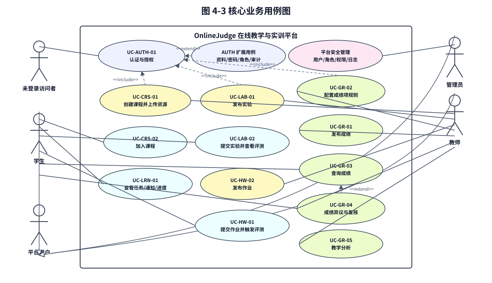

图 4-3 核心业务用例图

### 4.1.2 业务流程关系图（辅助说明）

下图从业务流程角度展示各关键用例之间的先后依赖。管理员在本需求范围内主要通过 AUTH 进入用户、角色、权限和审计管理能力；课程、实验、作业、成绩和通知主流程由教师与学生共同完成。

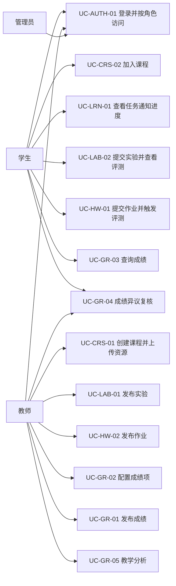

图 4-3a 核心业务流程关系图

### 4.1.3 关键用例统一索引与追溯表

为便于统一追溯和一致性核对，表 4-1 汇总 13 个核心 UC 的参与者、触发器、前置条件、后置条件、基本事件流、扩展事件流和系统操作合约索引。各用例正文保留业务叙述，表内给出可直接追踪到 FR/NFR 与 OP 的索引，不新增需求范围。

表 4-1 关键用例统一字段与追溯索引

| UC 编号 | 主参与者/协同参与者 | 触发器 | 前置/后置摘要 | 基本流与扩展流索引 | 关联 FR/NFR | 关联 OP |
| --- | --- | --- | --- | --- | --- | --- |
| UC-AUTH-01 | 学生、教师、管理员；管理员参与权限与审计扩展 | 用户提交登录或访问受保护功能 | 前置：有效账号与认证服务可用；后置：形成会话、角色菜单和审计记录 | 基本流见 4.2 登录与持续鉴权；扩展流覆盖注册、资料安全、角色权限、审计安全提示 | FR-UA-01 ~ FR-UA-07；NFR-UA-01 ~ NFR-UA-05 | OP-AUTH-01 ~ OP-AUTH-04 |
| UC-CRS-01 | 教师 | 教师创建课程、维护章节资源或发布公告 | 前置：教师已登录且具备课程创建/管理权限；后置：课程、章节、资源或公告对授权用户可见 | 基本流见 4.3 课程创建与资源维护；扩展流覆盖草稿保存、资源上传失败、权限不足 | FR-CR-01、FR-CR-02、FR-CR-03、FR-CR-06；NFR-CR-01 ~ NFR-CR-05 | OP-CRS-01、OP-CRS-02、OP-CRS-03、OP-CRS-06、OP-CRS-07 |
| UC-CRS-02 | 学生；教师参与审核扩展 | 学生申请加入课程或输入邀请码 | 前置：学生已登录且课程允许加入；后置：形成课程成员或待审核申请 | 基本流见 4.4 课程加入；扩展流覆盖审核加入、课程关闭、人数已满、邀请码错误 | FR-CR-04、FR-CR-05、FR-CR-06；NFR-CR-01、NFR-CR-02、NFR-CR-03、NFR-CR-05 | OP-CRS-04、OP-CRS-05、OP-CRS-07 |
| UC-LRN-01 | 学生；课程、实验、作业、成绩模块协同 | 学生进入学习中心、课程主页或通知入口 | 前置：学生已加入课程且存在任务/资源/通知/进度数据；后置：任务、通知、进度和行为记录保持一致 | 基本流见 4.5 学习任务、通知和进度；扩展流覆盖无任务、离线同步、通知失效、重复事件幂等 | FR-LN-01 ~ FR-LN-06；NFR-LN-01 ~ NFR-LN-05 | OP-LRN-01 ~ OP-LRN-05 |
| UC-LAB-01 | 教师；学习过程与通知模块协同 | 教师创建实验、维护附件/测试用例并确认发布 | 前置：教师拥有课程管理权限；后置：实验草稿或已发布实验被持久化，发布后生成任务/通知 | 基本流见 4.6 实验创建发布；扩展流覆盖保存草稿、附件失败、截止时间非法、权限不足 | FR-LAB-01、FR-LAB-04、FR-LAB-05；NFR-LAB-01 ~ NFR-LAB-05 | OP-LAB-01、OP-LAB-02、OP-LAB-03 |
| UC-HW-01 | 学生；教师、作业评测与成绩模块协同 | 学生提交作业，教师在需要时批阅或重评 | 前置：学生为课程成员且作业开放；后置：提交、评测、批阅/重评和反馈结果可追踪 | 基本流见 4.7 作业提交、评测与反馈；扩展流覆盖多次提交、普通作业、评测异常、人工批阅和重评 | FR-HW-02、FR-HW-03、FR-HW-04、FR-HW-05、FR-HW-06；NFR-HW-01 ~ NFR-HW-05 | OP-HW-02、OP-HW-03、OP-HW-04、OP-HW-05 |
| UC-GR-01 | 教师；通知模块协同 | 教师确认成绩汇总并发布 | 前置：成绩项规则和来源成绩完整；后置：发布记录、学生可见成绩和通知生成 | 基本流见 4.8 成绩发布；扩展流覆盖发布前修改、未评分任务、规则缺失、发布失败 | FR-GR-02、FR-GR-03、FR-GR-04、FR-GR-05；NFR-GR-01 ~ NFR-GR-05 | OP-GR-02、OP-GR-03、OP-LRN-04 |
| UC-LAB-02 | 学生；教师、实验评测、通知和成绩模块协同 | 学生提交实验或查看实验评测/教师反馈 | 前置：学生为课程成员且实验已发布未截止；后置：提交、评测、报告、教师评分、统计和来源成绩可追踪 | 基本流见 4.9 实验提交与评测反馈；扩展流覆盖多版本、报告补交、评测异常、访问越权 | FR-LAB-02、FR-LAB-03、FR-LAB-04、FR-LAB-05、FR-LAB-06、FR-LAB-07、FR-LAB-08；NFR-LAB-01 ~ NFR-LAB-05 | OP-LAB-04、OP-LAB-05、OP-LAB-06、OP-LRN-04 |
| UC-HW-02 | 教师；课程、学习过程与通知模块协同 | 教师创建作业并发布给课程学生 | 前置：教师拥有课程管理权限且课程可教学；后置：作业草稿或已发布作业被持久化，发布后进入任务中心 | 基本流见 4.10 作业创建发布；扩展流覆盖草稿保存、普通作业、测试用例非法、通知失败 | FR-HW-01、FR-HW-02、FR-HW-04、FR-HW-06；NFR-HW-01 ~ NFR-HW-05 | OP-HW-01、OP-LRN-01、OP-LRN-04 |
| UC-GR-02 | 教师；实验、作业、成绩模块协同 | 教师新增或修改成绩项与计算规则 | 前置：教师拥有成绩管理权限且存在可计分来源；后置：成绩项、规则和重算状态一致 | 基本流见 4.11 成绩项配置；扩展流覆盖禁用成绩项、暂不重算、来源缺失、已发布成绩变更留痕 | FR-GR-01、FR-GR-02、FR-GR-03；NFR-GR-01 ~ NFR-GR-05 | OP-GR-01、OP-GR-02 |
| UC-GR-03 | 学生；成绩、课程、通知模块协同 | 学生从成绩页、课程页、学习中心或通知进入成绩详情 | 前置：学生为课程成员且成绩已发布；后置：本人可见成绩被展示，未授权数据不泄露 | 基本流见 4.12 成绩查询；扩展流覆盖部分发布、无成绩、未发布、越权访问 | FR-GR-04、FR-GR-05；NFR-GR-01 ~ NFR-GR-05 | OP-GR-04、OP-LRN-05 |
| UC-GR-04 | 学生、教师；成绩、课程、通知模块协同 | 学生提交成绩异议，教师处理复核 | 前置：学生已查看已发布成绩且教师可处理课程；后置：异议状态、成绩变更和处理通知可追踪 | 基本流见 4.13 异议提交与复核；扩展流覆盖驳回、重评后复核、重复申请、无权限处理 | FR-GR-03、FR-GR-04、FR-GR-07；NFR-GR-01 ~ NFR-GR-05 | OP-GR-05、OP-GR-03、OP-LRN-04 |
| UC-GR-05 | 教师；成绩、实验、作业、课程模块协同 | 教师进入教学分析或成绩统计页面 | 前置：教师有课程管理/查看权限且存在成绩或提交数据；后置：统计结果可解释并可追溯到来源数据 | 基本流见 4.14 教学分析；扩展流覆盖快照复用、单任务分析、无成绩空态、统计失败 | FR-GR-06；NFR-GR-01 ~ NFR-GR-05 | OP-GR-04、OP-GR-02 |

## 4.2 UC-AUTH-01 关键用例一：用户登录并按角色访问平台功能

用例编号：UC-AUTH-01
用例名称：用户登录并按角色访问平台功能
目标：使学生、教师、管理员登录后进入各自被授权的功能范围
主参与者：学生、教师、管理员
前置条件：用户已拥有有效账号，账号状态正常，平台认证与权限服务运行正常
触发器：用户访问平台并提交登录请求

基本流程：
第一步，用户进入平台登录页面并输入账号和密码；
第二步，系统校验身份信息；
第三步，身份校验通过后，系统创建登录会话或访问令牌；
第四步，系统根据用户角色加载对应的功能菜单和操作入口；
第五步，用户访问其权限范围内的课程、作业、实验、成绩或管理功能；
第六步，系统在页面访问、接口调用和资源访问时持续进行权限校验。

备选流程：用户根据系统配置可通过学号/工号、手机号、邮箱或指定账号方式登录。
异常流程：账号或密码错误、账号被冻结或禁用、登录状态失效、用户访问无权限功能、用户尝试通过修改 URL 或请求参数访问他人数据。
后置条件：用户成功进入其角色对应的功能范围，未授权访问被系统拒绝，关键安全操作被记录到审计日志中。
补充约束：密码输入应隐藏显示；登录失败、会话过期、权限不足和账号异常提示不得泄露敏感验证细节；AUTH 扩展用例归入 UC-AUTH-01 统计，并关联 OP-AUTH-01 ~ OP-AUTH-04。

关联需求：FR-UA-01、FR-UA-02、FR-UA-03、FR-UA-04、FR-UA-05、FR-UA-06、FR-UA-07；NFR-UA-01、NFR-UA-02、NFR-UA-03、NFR-UA-04、NFR-UA-05。
关联系统操作：OP-AUTH-01、OP-AUTH-02、OP-AUTH-03、OP-AUTH-04。
系统操作合约引用：见 4.15 表 4-2 中 UC-AUTH-01 行；完整合约见 14.3 表 14-5。
关联验收章节：5.4.1.4、10.1、10.2。
测试前缀：TC-UA。

AUTH 子用例/扩展用例：

| 子用例编号 | 子用例名称 | 参与者 | 触发器 | 关联需求 | 说明 |
| --- | --- | --- | --- | --- | --- |
| UC-AUTH-01-R | 用户注册与登录 | 未登录访问者、学生、教师、管理员 | 访问注册页、登录页或提交登录凭据 | FR-UA-01、FR-UA-04、FR-UA-05 | 覆盖注册、登录、退出和会话创建，关联 OP-AUTH-01 ~ OP-AUTH-03。 |
| UC-AUTH-01-P | 个人资料与密码安全 | 学生、教师、管理员 | 用户进入个人资料页或修改密码页 | FR-UA-04、FR-UA-07 | 覆盖资料维护、密码修改、密码摘要存储、登录失败限制和敏感输入校验。 |
| UC-AUTH-01-A | 角色权限与访问控制 | 管理员、学生、教师 | 管理员调整角色，或用户访问受保护功能 | FR-UA-02、FR-UA-03、FR-UA-05 | 覆盖角色分配、菜单加载、接口鉴权和课程/数据范围内的访问控制。 |
| UC-AUTH-01-S | 审计与安全提示 | 管理员、学生、教师 | 关键安全操作、认证异常或越权访问发生 | FR-UA-05、FR-UA-06、FR-UA-07 | 覆盖关键操作审计、安全异常提示、账号冻结/禁用和日志追踪。 |

## 4.3 UC-CRS-01 关键用例二：教师创建课程并上传资源

用例编号：UC-CRS-01
用例名称：教师创建课程并上传资源
目标：使教师能够建立课程基础信息、组织章节目录并发布首批教学资源
主参与者：教师
前置条件：教师已登录并拥有课程创建权限
触发器：教师在课程管理页面点击“创建课程”

基本流程：
第一步，教师填写课程名称、简介、授课学期、封面和加入方式；
第二步，系统保存课程基础信息并自动关联课程创建者；
第三步，教师建立章节、单元或知识点目录；
第四步，教师上传课程资源并设置资源类型、所属章节、可见范围和发布时间；
第五步，系统保存资源记录并在课程首页展示课程简介、目录和资源入口。

备选流程：教师仅保存课程草稿，暂不发布课程资源。
异常流程：课程名称缺失、课程状态非法、资源上传失败、教师无课程创建权限。
后置条件：课程基础信息、章节目录和已发布资源对被授权用户可见。
补充约束：课程名称、学期、加入方式和资源可见范围必须通过输入校验；资源上传失败不得生成不可访问的资源记录；课程负责人和发布时间需可追踪。

关联需求：FR-CR-01、FR-CR-02、FR-CR-03、FR-CR-06；NFR-CR-01、NFR-CR-02、NFR-CR-03、NFR-CR-04、NFR-CR-05。
关联系统操作：OP-CRS-01、OP-CRS-02、OP-CRS-03、OP-CRS-06、OP-CRS-07。
系统操作合约引用：见 4.15 表 4-2 中 UC-CRS-01 行；完整合约见 14.3 表 14-5。
关联验收章节：5.4.2.4、10.1、10.2。
测试前缀：TC-CR。

## 4.4 UC-CRS-02 关键用例三：学生加入课程

用例编号：UC-CRS-02
用例名称：学生加入课程
目标：使学生成功加入某门课程并获得课程资源与任务参与资格
主参与者：学生
前置条件：学生已登录，课程处于可加入状态
触发器：学生在课程列表中发起加入申请或输入有效邀请码

基本流程：
第一步，学生检索或选择课程；
第二步，学生提交加入请求；
第三步，系统校验课程状态、身份与资格；
第四步，系统生成选课/加入记录；
第五步，系统授予学生课程资源、实验、作业和公告的访问资格；
第六步，学生进入课程主页并看到课程简介、目录、资源和最近任务入口。

备选流程：课程配置为“申请后审核加入”时，系统提示“等待审核”。
异常流程：课程已关闭、课程人数已满、邀请码错误、网络请求失败。
后置条件：学生与课程建立关联关系，课程内容对学生可见，学习过程模块可基于该成员关系生成学习任务与进度记录。
补充约束：加入课程必须以有效登录态和课程准入规则为前提；重复加入、邀请码错误、课程关闭和人数上限均应返回明确提示；未审核通过前不得开放课程资源和任务。

关联需求：FR-CR-04、FR-CR-05、FR-CR-06；NFR-CR-01、NFR-CR-02、NFR-CR-03、NFR-CR-05。
关联系统操作：OP-CRS-04、OP-CRS-05、OP-CRS-07。
系统操作合约引用：见 4.15 表 4-2 中 UC-CRS-02 行；完整合约见 14.3 表 14-5。
关联验收章节：5.4.2.4、10.1、10.2。
测试前缀：TC-CR。

## 4.5 UC-LRN-01 关键用例四：学生开始学习并查看学习任务/通知/进度

用例编号：UC-LRN-01
用例名称：学生开始学习并查看学习任务、通知和进度
目标：使学生在加入课程后能够集中查看个人学习任务、接收通知提醒并跟踪课程学习进度
主参与者：学生
协同参与者：课程模块、实验模块、作业与自动评测模块、成绩评价模块
前置条件：学生已登录并已加入至少一门课程；课程内已存在可访问资源、学习任务、通知或历史学习记录；学习过程与通知服务运行正常
触发器：学生进入学习中心、课程主页、通知中心或从课程任务入口继续学习

基本流程：
第一步，学生进入学习中心或课程主页；
第二步，系统根据学生已加入课程聚合课程资源、实验、作业和成绩相关通知，生成个人任务列表；
第三步，系统按任务类型、截止时间、完成状态和优先级展示学习任务，并展示课程级学习进度；
第四步，学生打开资源、实验或作业入口开始学习或继续上次学习位置；
第五步，系统记录资源访问、学习位置、任务完成状态和学习行为统计；
第六步，系统展示未读通知角标、通知列表和高优先级弹窗提醒；
第七步，学生点击通知后，系统标记通知已读并跳转至对应课程、任务、成绩或公告页面；
第八步，学生返回学习中心时，系统刷新任务状态、课程进度和近 7 天学习趋势。

备选流程：当学生暂无进行中任务时，系统展示空状态并提供课程资源、已完成任务或课程首页入口；当网络短时异常时，前端保留最近学习记录并在恢复后同步。
异常流程：学生未加入课程、登录状态失效、课程或任务已删除/下架、通知加载失败、进度同步失败、学生访问无权限任务、重复事件导致重复通知。
后置条件：学生任务列表、通知状态、学习进度和学习行为记录保持一致，可被教师端进度统计和后续测试追溯。
补充约束：任务聚合、通知读取和学习进度保存必须按当前用户和课程成员关系过滤；无任务、无通知和同步失败时应提供空状态或失败提示；重复通知事件应幂等处理。

关联需求：FR-LN-01、FR-LN-02、FR-LN-03、FR-LN-04、FR-LN-05、FR-LN-06；NFR-LN-01、NFR-LN-02、NFR-LN-03、NFR-LN-04、NFR-LN-05。
关联系统操作：OP-LRN-01、OP-LRN-02、OP-LRN-03、OP-LRN-04、OP-LRN-05。
系统操作合约引用：见 4.15 表 4-2 中 UC-LRN-01 行；完整合约见 14.3 表 14-5。
关联验收章节：5.4.3.4、10.1、10.2。
测试前缀：TC-LN。

## 4.6 UC-LAB-01 关键用例五：教师发布实验

用例编号：UC-LAB-01
用例名称：教师创建并发布实验
目标：将实验任务准确发布给课程学生
主参与者：教师
前置条件：教师已登录并拥有课程管理权限
触发器：教师在课程页面点击“新建实验”

基本流程：
第一步，教师填写实验标题、说明、截止时间、附件与评分方式；
第二步，系统保存实验草稿；
第三步，教师确认发布；
第四步，系统更新实验状态并向课程学生发送通知。

备选流程：教师仅保存草稿，不正式发布。
异常流程：附件上传失败、截止时间非法、教师无课程权限。
后置条件：实验任务在对应课程中可见，并进入后续提交流程。
补充约束：实验开放时间、截止时间、附件、测试用例和报告要求应通过合法性校验；仅课程教师或授权教师可发布；发布失败不得向学生生成任务或通知。

关联需求：FR-LAB-01、FR-LAB-04、FR-LAB-05；NFR-LAB-01、NFR-LAB-02、NFR-LAB-03、NFR-LAB-04、NFR-LAB-05。
关联系统操作：OP-LAB-01、OP-LAB-02、OP-LAB-03。
系统操作合约引用：见 4.15 表 4-2 中 UC-LAB-01 行；完整合约见 14.3 表 14-5。
关联验收章节：5.4.4.4、10.1、10.2。
测试前缀：TC-LAB。

## 4.7 UC-HW-01 关键用例六：学生提交作业并触发自动评测

用例编号：UC-HW-01
用例名称：学生提交作业
目标：使学生的作业提交成功入库，并获得自动反馈
主参与者：学生
协同参与者：教师、作业与自动评测模块、成绩评价模块
前置条件：学生已登录并已加入对应课程，作业处于开放状态
触发器：学生完成内容后点击“提交”

基本流程：
第一步，学生填写文本或上传文件/代码；
第二步，系统校验提交格式；
第三步，系统保存提交记录；
第四步，系统触发自动评测；
第五步，系统返回提交成功信息与评测状态；
第六步，如作业需要人工批阅或重评，教师在批阅页提交评分、评语或重评理由；
第七步，系统保存批阅/重评结果和成绩来源，学生查看作业结果页时获得可见反馈。

备选流程：若允许多次提交，系统保留历史记录并将最新版本标识为当前有效版本。
异常流程：超过截止时间、格式错误、文件过大、评测服务异常、教师无课程批阅权限、重评分数非法。
后置条件：提交记录、评测结果、人工批阅/重评结果和可见反馈均被记录，学生可查看本人作业结果。
补充约束：提交必须校验课程成员关系、作业状态、截止时间、格式和文件大小；多次提交时需保留历史版本并标识当前有效版本；评测耗时较长时前端必须展示处理中状态；教师批阅和重评必须留痕并绑定提交版本。

关联需求：FR-HW-02、FR-HW-03、FR-HW-04、FR-HW-05、FR-HW-06；NFR-HW-01、NFR-HW-02、NFR-HW-03、NFR-HW-04、NFR-HW-05。
关联系统操作：OP-HW-02、OP-HW-03、OP-HW-04、OP-HW-05。
系统操作合约引用：见 4.15 表 4-2 中 UC-HW-01 行；完整合约见 14.3 表 14-5。
关联验收章节：5.4.5.4、10.1、10.2。
测试前缀：TC-HW。

## 4.8 UC-GR-01 关键用例七：教师发布成绩

用例编号：UC-GR-01
用例名称：教师汇总并发布成绩
目标：将成绩结果正式发布给学生
主参与者：教师
前置条件：课程内相关实验和作业已有评分结果
触发器：教师在成绩管理页面点击“发布成绩”

基本流程：
第一步，教师查看成绩总表；
第二步，教师确认评分无误；
第三步，系统锁定本次发布版本；
第四步，系统向学生推送成绩通知。

备选流程：教师发现异常时，先修改成绩后再发布。
异常流程：仍存在未评分任务、成绩计算规则缺失、发布失败。
后置条件：学生可查看已发布成绩，系统保留成绩发布记录；若学生对已发布成绩存在异议，可在成绩页面提交复核申请并等待教师处理。
补充约束：发布前必须确认成绩项规则和来源成绩完整；发布记录应保留发布人、发布时间、发布范围和通知状态；重复发布或存在未评分任务时应阻止或提示确认。

关联需求：FR-GR-02、FR-GR-03、FR-GR-04、FR-GR-05；NFR-GR-01、NFR-GR-02、NFR-GR-03、NFR-GR-04、NFR-GR-05。
关联系统操作：OP-GR-02、OP-GR-03、OP-LRN-04。
系统操作合约引用：见 4.15 表 4-2 中 UC-GR-01 行；完整合约见 14.3 表 14-5。
关联验收章节：5.4.6.4、10.1、10.2。
测试前缀：TC-GR。

## 4.9 UC-LAB-02 关键用例八：学生提交实验并查看评测结果

用例编号：UC-LAB-02
用例名称：学生提交实验并查看评测结果
目标：使学生能够按实验要求提交代码、附件或报告，并获得可追踪的自动评测与教师反馈结果
主参与者：学生
协同参与者：教师、实验模块、自动评测子流程、学习过程与通知提醒模块、成绩评价模块
前置条件：学生已登录并已加入对应课程；实验处于已发布且未截止状态；课程成员关系和文件存储服务可用；代码类实验已配置测试用例
触发器：学生在实验详情页点击“提交”或从学习任务/通知入口进入实验提交页

基本流程：
第一步，学生打开实验详情并查看实验说明、附件、提交要求、截止时间和公开测试用例说明；
第二步，学生填写代码、上传源文件或实验报告，并确认提交；
第三步，系统校验登录态、课程成员关系、实验状态、提交格式、文件大小和语言白名单；
第四步，系统保存实验提交记录、提交版本和附件元数据；
第五步，对于代码类实验，系统创建评测任务并返回“已受理/评测中”状态；
第六步，自动评测完成后，系统保存总分、通过用例数、失败原因摘要和单用例结果；
第七步，学生刷新或进入实验结果页，系统展示本人的提交历史、当前有效版本、评测状态、得分和允许公开的反馈；
第八步，教师评分或发布实验成绩后，系统向学生展示教师评语和最终得分，并将来源成绩提供给成绩模块。

备选流程：实验允许多次提交时，系统保留全部版本并标识最新有效版本；评测耗时较长时，前端展示处理中状态并允许学生稍后刷新；实验要求报告时，学生可先提交代码后补交报告。
异常流程：学生未加入课程、实验未发布或已截止、文件类型不支持、代码语言不支持、提交内容为空、评测超时、评测服务异常、学生访问他人提交结果。
后置条件：实验提交、评测结果、报告、教师评分和反馈均被记录；学生可查看本人可见结果；教师可在实验统计和成绩同步中追踪该提交。
补充约束：实验提交不得暴露其他学生结果；评测结果必须绑定提交版本；评测失败应记录可展示摘要并隐藏敏感运行路径；实验评分进入成绩模块前需保留来源标识。

关联需求：FR-LAB-02、FR-LAB-03、FR-LAB-04、FR-LAB-05、FR-LAB-06、FR-LAB-07、FR-LAB-08；NFR-LAB-01、NFR-LAB-02、NFR-LAB-03、NFR-LAB-04、NFR-LAB-05。
关联系统操作：OP-LAB-04、OP-LAB-05、OP-LAB-06、OP-LRN-04。
系统操作合约引用：见 4.15 表 4-2 中 UC-LAB-02 行；完整合约见 14.3 表 14-5。
关联验收章节：5.4.4.4、10.1、10.2。
测试前缀：TC-LAB。

## 4.10 UC-HW-02 关键用例九：教师发布作业

用例编号：UC-HW-02
用例名称：教师发布作业
目标：使教师能够为课程创建作业、配置题目或提交要求，并将作业发布给课程学生
主参与者：教师
协同参与者：课程模块、作业与自动评测模块、学习过程与通知提醒模块
前置条件：教师已登录并拥有对应课程管理权限；课程处于可教学状态；作业模块和文件存储服务可用
触发器：教师在课程作业管理页点击“新建作业”或从课程任务管理入口创建作业

基本流程：
第一步，教师填写作业标题、说明、所属课程、截止时间、作业类型、评分方式和可见策略；
第二步，教师配置客观题、文本题、文件提交要求或代码题测试用例；
第三步，系统校验课程权限、字段完整性、截止时间、题目分值和测试用例格式；
第四步，系统保存作业草稿及题目、附件、测试用例配置；
第五步，教师确认发布；
第六步，系统将作业状态更新为已发布，并在课程作业页向课程成员开放；
第七步，系统向学习过程与通知提醒模块发送作业发布事件，生成学习任务和站内通知。

备选流程：教师可仅保存草稿，稍后继续编辑；教师可在未发布前调整题目、附件、测试用例和评分规则；教师可创建不需要自动评测的普通作业。
异常流程：教师无课程权限、课程不存在或已归档、截止时间非法、题目分值不合法、测试用例缺失或格式错误、附件上传失败、通知事件写入失败。
后置条件：作业草稿或已发布作业被持久化；已发布作业对课程学生可见并进入学习任务中心；学生可按 UC-HW-01 提交作业。
补充约束：作业题目、附件、测试用例、截止时间和显示策略必须通过校验；未发布草稿不得出现在学生任务中心；通知事件失败时应返回可追踪的失败或补偿状态。

关联需求：FR-HW-01、FR-HW-02、FR-HW-04、FR-HW-06；NFR-HW-01、NFR-HW-02、NFR-HW-03、NFR-HW-04、NFR-HW-05。
关联系统操作：OP-HW-01、OP-LRN-01、OP-LRN-04。
系统操作合约引用：见 4.15 表 4-2 中 UC-HW-02 行；完整合约见 14.3 表 14-5。
关联验收章节：5.4.5.4、10.1、10.2。
测试前缀：TC-HW。

## 4.11 UC-GR-02 关键用例十：教师配置成绩项与计算规则

用例编号：UC-GR-02
用例名称：教师配置成绩项与计算规则
目标：使教师能够定义课程成绩项、来源、权重和计算规则，为后续成绩汇总和发布建立依据
主参与者：教师
协同参与者：课程模块、实验模块、作业与自动评测模块、成绩评价模块
前置条件：教师已登录并拥有课程成绩管理权限；课程中存在可计分的实验、作业或其他成绩来源
触发器：教师进入成绩项配置页并新增或修改成绩项

基本流程：
第一步，教师选择课程并进入成绩项配置页；
第二步，系统加载可用的实验、作业和已有成绩项；
第三步，教师填写成绩项名称、来源类型、来源编号、满分、权重、是否计入总评和显示策略；
第四步，系统校验课程权限、来源存在性、权重范围、满分范围和重复名称；
第五步，系统保存成绩项配置并记录修改人和修改时间；
第六步，教师触发重算或系统提示需重新计算；
第七步，系统按配置从 LAB/HWK 来源同步成绩并生成或刷新课程成绩记录。

备选流程：教师可禁用某个成绩项，使其不参与总评；教师可保存配置后暂不触发重算；未发布成绩可按规则调整，已发布成绩调整需进入变更留痕流程。
异常流程：教师无课程权限、成绩来源不存在、权重合计不合法、满分为非法值、存在已发布成绩导致直接修改受限、来源同步失败。
后置条件：课程成绩项、计算规则和重算状态保持一致；后续 UC-GR-01 可基于该配置发布成绩，UC-GR-05 可基于该配置统计分析。
补充约束：成绩项权重、满分、来源类型和来源编号必须合法；已发布成绩关联的规则变更必须留痕；来源成绩同步失败不得生成不可解释总评。

关联需求：FR-GR-01、FR-GR-02、FR-GR-03；NFR-GR-01、NFR-GR-02、NFR-GR-03、NFR-GR-04、NFR-GR-05。
关联系统操作：OP-GR-01、OP-GR-02。
系统操作合约引用：见 4.15 表 4-2 中 UC-GR-02 行；完整合约见 14.3 表 14-5。
关联验收章节：5.4.6.4、10.1、10.2。
测试前缀：TC-GR。

## 4.12 UC-GR-03 关键用例十一：学生查询已发布成绩

用例编号：UC-GR-03
用例名称：学生查询已发布成绩
目标：使学生能够查看本人课程成绩明细、总评、发布状态和相关反馈
主参与者：学生
协同参与者：成绩评价模块、课程模块、通知提醒模块
前置条件：学生已登录并是课程成员；教师已发布对应成绩或成绩项；成绩查询接口和课程成员校验可用
触发器：学生从成绩页面、课程主页、学习中心或成绩通知进入成绩详情

基本流程：
第一步，学生进入成绩页面并选择课程；
第二步，系统校验登录态、课程成员关系和本人数据范围；
第三步，系统读取已发布的成绩项明细、原始分、加权分、教师评语、发布时间和课程总评；
第四步，系统展示成绩发布状态、总评状态和可见反馈；
第五步，学生可从成绩明细进入相关实验或作业结果页查看来源反馈；
第六步，学生如存在异议，可从成绩页面发起 UC-GR-04。

备选流程：课程存在部分未发布成绩时，系统仅展示已发布部分并对未发布内容给出提示；无成绩记录时展示空状态和课程任务入口。
异常流程：学生未加入课程、成绩未发布、学生尝试查看他人成绩、登录状态失效、成绩记录缺失或来源任务已归档。
后置条件：学生查看到本人可见成绩；未发布或无权限数据不泄露；查询行为可作为成绩反馈闭环的一部分被测试追踪。
补充约束：仅展示本人且已发布的成绩；未发布成绩、他人成绩和无权限课程数据不得通过页面或接口泄露；成绩明细需保留来源任务跳转或来源说明。

关联需求：FR-GR-04、FR-GR-05；NFR-GR-01、NFR-GR-02、NFR-GR-03、NFR-GR-04、NFR-GR-05。
关联系统操作：OP-GR-04、OP-LRN-05。
系统操作合约引用：见 4.15 表 4-2 中 UC-GR-03 行；完整合约见 14.3 表 14-5。
关联验收章节：5.4.6.4、10.1、10.2。
测试前缀：TC-GR。

## 4.13 UC-GR-04 关键用例十二：成绩异议提交与复核处理

用例编号：UC-GR-04
用例名称：成绩异议提交与复核处理
目标：使学生能够对本人已发布成绩提交异议，并由教师完成复核、调整或驳回
主参与者：学生、教师
协同参与者：成绩评价模块、课程模块、通知提醒模块
前置条件：学生已登录并已查看本人已发布成绩；教师拥有对应课程成绩管理权限；系统已启用成绩异议处理入口
触发器：学生在成绩详情页点击“申请复核”并提交异议理由

基本流程：
第一步，学生选择目标成绩项或课程总评，填写异议理由并提交；
第二步，系统校验学生身份、课程成员关系、成绩发布状态、目标成绩归属和是否存在处理中申请；
第三步，系统生成成绩异议申请记录，状态为待处理，并通知课程教师；
第四步，教师在复核处理页查看待处理申请、来源成绩、原始分、当前分和学生理由；
第五步，教师选择同意调整或驳回，并填写处理说明；
第六步，若同意调整，系统复用成绩变更留痕机制记录调整前后值、处理人、处理时间和原因；
第七步，系统更新异议状态并向学生发送复核结果通知；
第八步，学生在成绩页面查看复核状态、处理说明和调整后的成绩。

备选流程：教师可仅补充说明并维持原成绩；学生可查看历史复核记录；若复核需要重新评测，教师可先在 LAB/HWK 侧完成重评再回到成绩复核。
异常流程：学生对未发布成绩、非本人成绩或无权限课程提交异议；学生重复提交处理中申请；教师处理无权限课程异议；调整后分数非法；通知写入失败。
后置条件：异议申请状态明确；成绩变更和复核处理均留痕；学生收到复核反馈，教师可在成绩管理中追踪处理结果。
补充约束：同一成绩项同一时间只能存在一个处理中异议；教师只能处理授权课程内的异议；若复核导致成绩调整，必须记录调整前后值、处理理由、处理人和处理时间。

关联需求：FR-GR-03、FR-GR-04、FR-GR-07；NFR-GR-01、NFR-GR-02、NFR-GR-03、NFR-GR-04、NFR-GR-05。
关联系统操作：OP-GR-05、OP-GR-03、OP-LRN-04。
系统操作合约引用：见 4.15 表 4-2 中 UC-GR-04 行；完整合约见 14.3 表 14-5。
关联验收章节：5.4.6.4、10.1、10.2。
测试前缀：TC-GR。

## 4.14 UC-GR-05 关键用例十三：教师查看教学分析

用例编号：UC-GR-05
用例名称：教师查看教学分析
目标：使教师能够基于课程成绩与提交数据查看基础统计分析，用于了解班级整体学习表现
主参与者：教师
协同参与者：成绩评价模块、实验模块、作业与自动评测模块、课程模块
前置条件：教师已登录并拥有课程管理或成绩查看权限；课程存在已同步的实验/作业成绩或总评记录
触发器：教师进入教学分析页面或在成绩管理页点击“查看分析”

基本流程：
第一步，教师选择课程、成绩项、时间范围或统计维度；
第二步，系统校验教师课程权限并读取成绩记录、总评记录和统计快照；
第三步，系统计算或加载均分、最高分、最低分、及格率、完成率和成绩分布；
第四步，系统展示课程级或班级级统计结果，并标识数据来源时间点；
第五步，教师按成绩项、任务类型或学生状态筛选分析结果；
第六步，系统保留统计快照或查询结果来源，用于后续追踪。

备选流程：统计快照已存在且来源数据未变化时，系统直接读取快照；教师可切换到单个实验或作业的完成情况；暂无成绩时展示空状态和成绩同步入口。
异常流程：教师无课程权限、来源成绩缺失、统计维度非法、计算过程失败、统计结果与已发布成绩状态不一致。
后置条件：教师获得可解释的基础教学分析结果；统计数据可追溯到成绩记录、来源任务和计算时间点。
补充约束：教学分析只面向授权课程教师；统计范围、数据来源和更新时间必须可见；无成绩或来源异常时展示空状态或失败提示，不得以静默空图替代。

关联需求：FR-GR-06；NFR-GR-01、NFR-GR-02、NFR-GR-03、NFR-GR-04、NFR-GR-05。
关联系统操作：OP-GR-04、OP-GR-02。
系统操作合约引用：见 4.15 表 4-2 中 UC-GR-05 行；完整合约见 14.3 表 14-5。
关联验收章节：5.4.6.4、10.1、10.2。
测试前缀：TC-GR。

## 4.15 系统操作合约就近索引

本表将第 4 章用例与系统操作合约建立就近引用。表内仅列需求层操作摘要，完整的输入、前置条件、后置条件、关联 FR 和异常结果仍见 14.3 表 14-5，后续概要设计、详细设计和测试文档应同时追踪 UC 与 OP。

表 4-2 用例与系统操作合约就近索引

| UC 编号 | 主要系统操作签名 | 需求层输入/输出摘要 | 完整合约 |
| --- | --- | --- | --- |
| UC-AUTH-01 | `submitLogin(credentials)`、`verifyCredential(account, password)`、`createSession(userId)`、`loadRoleMenuAndAuthorize(userId, resource)` | 输入账号、密码、角色和目标资源；输出认证结果、会话、角色菜单和权限判断。 | 14.3 表 14-5 OP-AUTH-01 ~ OP-AUTH-04 |
| UC-CRS-01 | `saveCourse(courseForm)`、`saveChapterTree(courseId, chapters)`、`uploadResource(courseId, resourceFile)`、`publishCourseAnnouncement(courseId, announcement)`、`checkCoursePermission(userId, courseId, action)` | 输入课程表单、章节、资源和公告；输出课程、目录、资源记录和课程权限结果。 | 14.3 表 14-5 OP-CRS-01、OP-CRS-02、OP-CRS-03、OP-CRS-06、OP-CRS-07 |
| UC-CRS-02 | `joinCourse(courseId, joinPayload)`、`reviewCourseMember(applicationId, decision)`、`checkCoursePermission(userId, courseId, action)` | 输入课程编号、邀请码或审核决定；输出成员状态、等待审核或失败原因。 | 14.3 表 14-5 OP-CRS-04、OP-CRS-05、OP-CRS-07 |
| UC-LRN-01 | `aggregateLearningTasks(userId)`、`saveLearningProgress(progress)`、`recordLearningBehavior(event)`、`createNotification(event)`、`updateNotificationState(notificationId, action)` | 输入用户、任务来源、进度和通知动作；输出任务列表、进度、行为记录和通知状态。 | 14.3 表 14-5 OP-LRN-01 ~ OP-LRN-05 |
| UC-LAB-01 | `createExperiment(experimentForm)`、`publishExperiment(experimentId)`、`saveExperimentArtifacts(experimentId, artifacts)` | 输入实验表单、附件、报告要求和测试用例；输出实验草稿、发布状态和通知事件。 | 14.3 表 14-5 OP-LAB-01 ~ OP-LAB-03 |
| UC-LAB-02 | `submitExperiment(experimentId, submission)`、`evaluateExperimentSubmission(submissionId)`、`gradeAndSummarizeExperiment(experimentId, gradingPayload)`、`createNotification(event)` | 输入实验提交、测试配置和教师评分；输出提交版本、评测结果、反馈和来源成绩。 | 14.3 表 14-5 OP-LAB-04 ~ OP-LAB-06、OP-LRN-04 |
| UC-HW-01 | `submitHomework(homeworkId, submission)`、`evaluateHomeworkSubmission(submissionId)`、`reviewHomeworkSubmission(submissionId, review)`、`getHomeworkFeedback(homeworkId, studentId)` | 输入作业提交、评测对象、教师评分/评语或重评理由；输出提交历史、评测状态、批阅/重评记录和可见反馈。 | 14.3 表 14-5 OP-HW-02、OP-HW-03、OP-HW-04、OP-HW-05 |
| UC-HW-02 | `createAndPublishHomework(homeworkForm)`、`aggregateLearningTasks(userId)`、`createNotification(event)` | 输入作业表单、题目、附件和发布配置；输出作业状态、学习任务和通知事件。 | 14.3 表 14-5 OP-HW-01、OP-LRN-01、OP-LRN-04 |
| UC-GR-01 | `syncAndCalculateGrades(courseId)`、`publishGrades(courseId, publishScope)`、`createNotification(event)` | 输入课程、成绩规则、发布范围；输出总评、发布记录和成绩通知。 | 14.3 表 14-5 OP-GR-02、OP-GR-03、OP-LRN-04 |
| UC-GR-02 | `saveGradeRule(courseId, gradeRule)`、`syncAndCalculateGrades(courseId)` | 输入成绩项、来源、权重和满分；输出成绩规则、同步结果和重算状态。 | 14.3 表 14-5 OP-GR-01、OP-GR-02 |
| UC-GR-03 | `queryGradesAndAnalysis(query)`、`updateNotificationState(notificationId, action)` | 输入课程、学生和通知动作；输出本人已发布成绩、来源反馈和通知状态。 | 14.3 表 14-5 OP-GR-04、OP-LRN-05 |
| UC-GR-04 | `handleGradeReview(reviewRequest)`、`publishGrades(courseId, publishScope)`、`createNotification(event)` | 输入异议对象、理由和处理结论；输出复核记录、成绩变更和通知。 | 14.3 表 14-5 OP-GR-05、OP-GR-03、OP-LRN-04 |
| UC-GR-05 | `queryGradesAndAnalysis(query)`、`syncAndCalculateGrades(courseId)` | 输入课程、成绩项和统计维度；输出统计指标、成绩分布和数据来源时间点。 | 14.3 表 14-5 OP-GR-04、OP-GR-02 |

## 4.16 系统顺序图

本节补充需求层 System Sequence Diagram（SSD），覆盖登录、课程创建与资源维护、课程加入、学习任务与进度、实验创建发布、实验/作业提交评测、作业发布、成绩发布/查询/异议和通知反馈等主流程。SSD 只描述参与者与 OnlineJudge 系统边界之间的外部可观察系统操作，不展示 AUTH、CRS、LAB、HWK、GRD、LRN 等内部服务或类调用；内部协作关系作为概要设计和详细设计内容展开。

本节 Mermaid 源码为系统顺序图的交付源。导出 PDF 或 Word 版本时，应使用支持 Mermaid 的 Markdown 渲染器或 Mermaid CLI 将 `sequenceDiagram` 渲染为矢量图或高分辨率位图，并保留图号、图题和 OP 编号；正文只引用已存在的静态资产，未生成静态图片的 Mermaid 图不得以不存在的图片路径替代。

### 4.16.1 登录系统顺序图

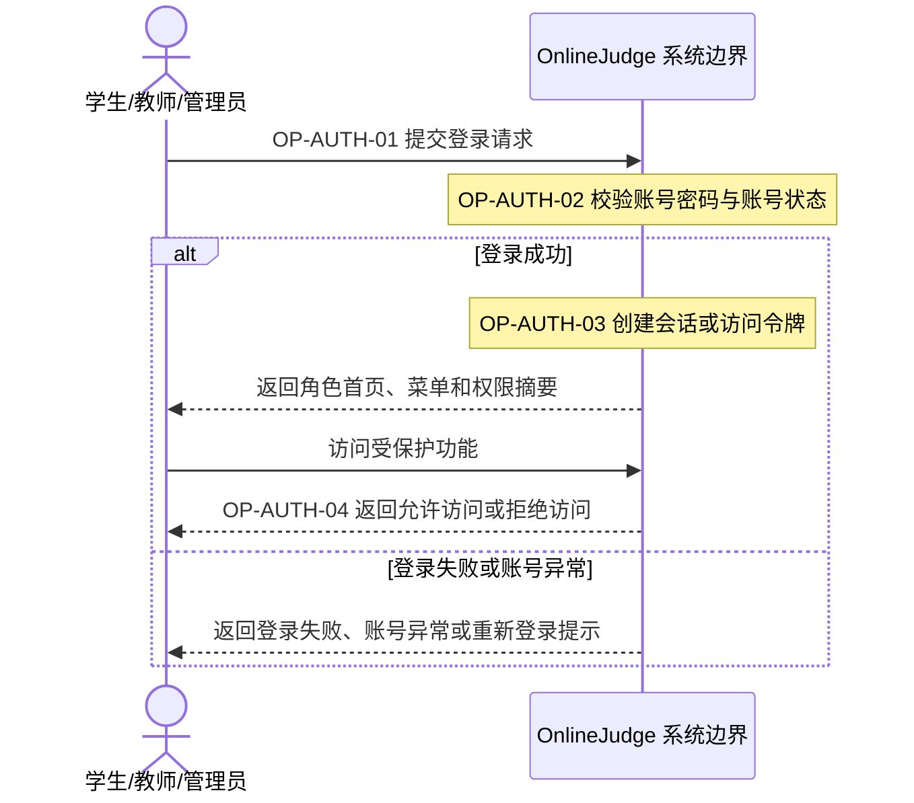

图 4-4 登录系统顺序图

### 4.16.2 课程加入系统顺序图

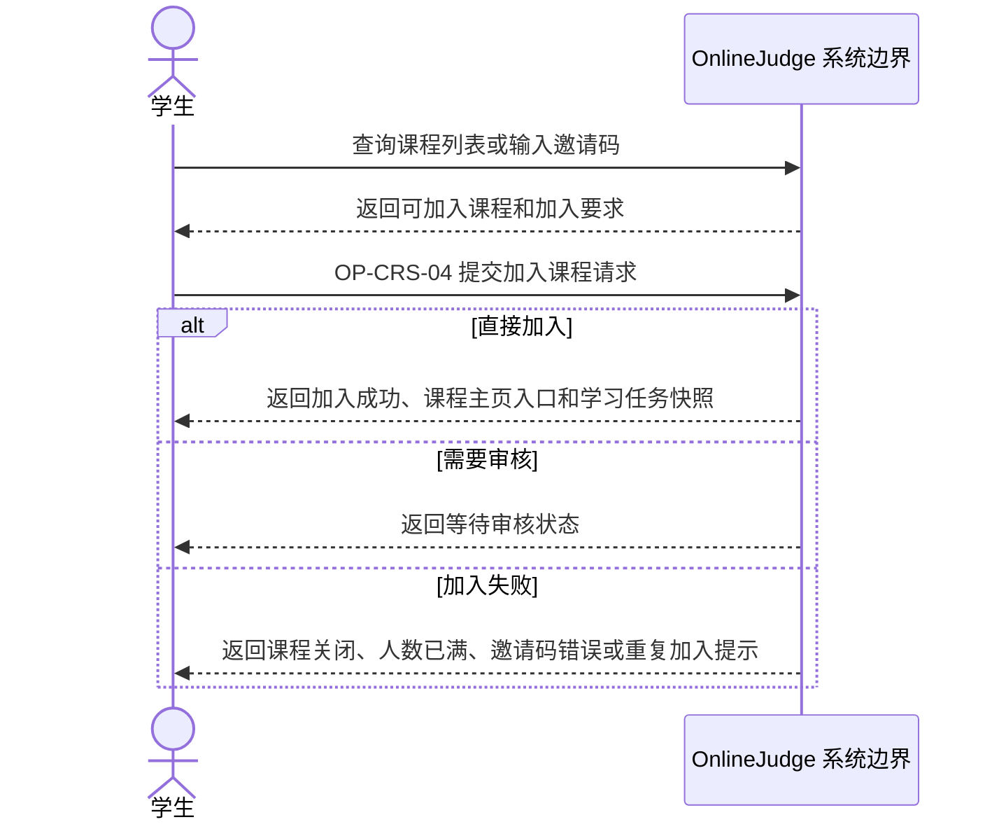

图 4-5 课程加入系统顺序图

### 4.16.3 实验提交评测系统顺序图

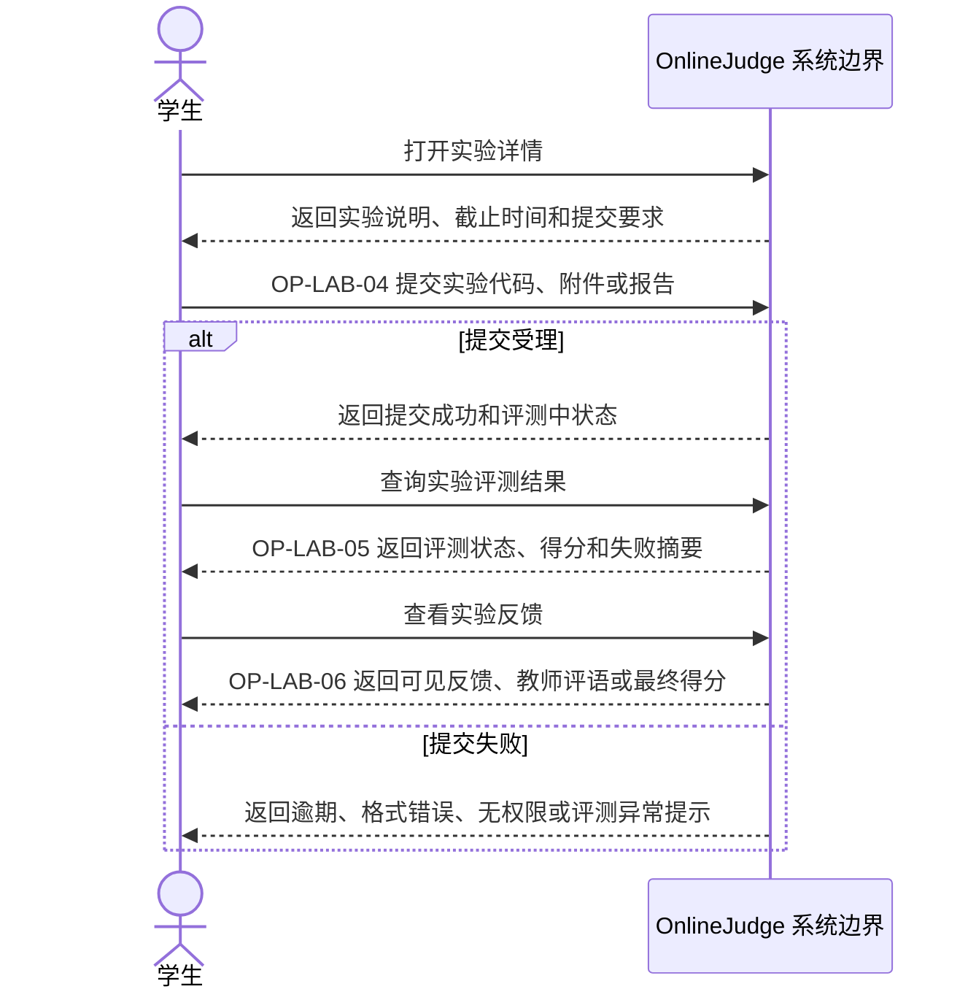

图 4-6 实验提交评测系统顺序图

### 4.16.4 作业发布与提交系统顺序图

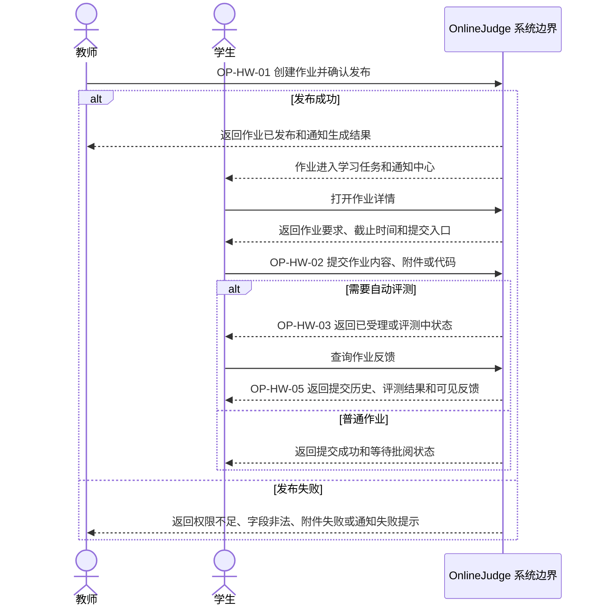

图 4-7 作业发布与提交系统顺序图

### 4.16.5 成绩发布查询与异议系统顺序图

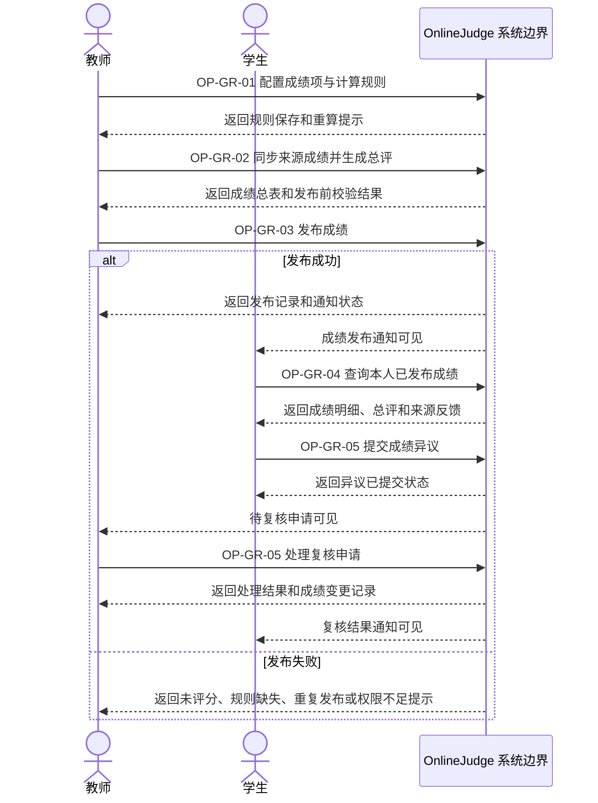

图 4-8 成绩发布查询与异议系统顺序图

### 4.16.6 通知反馈系统顺序图

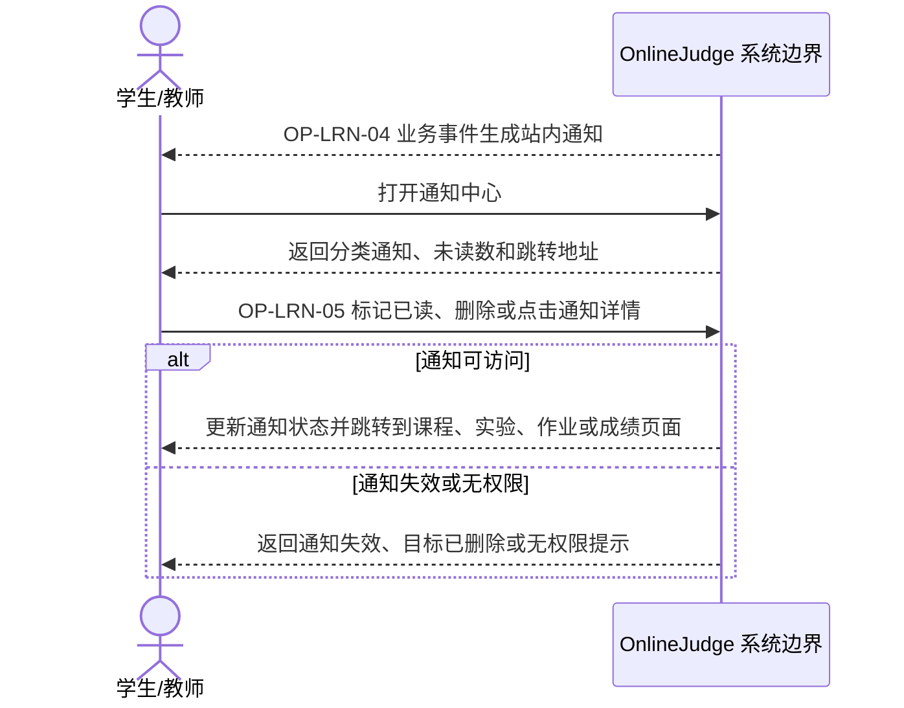

图 4-9 通知反馈系统顺序图

### 4.16.7 课程创建与资源维护系统顺序图

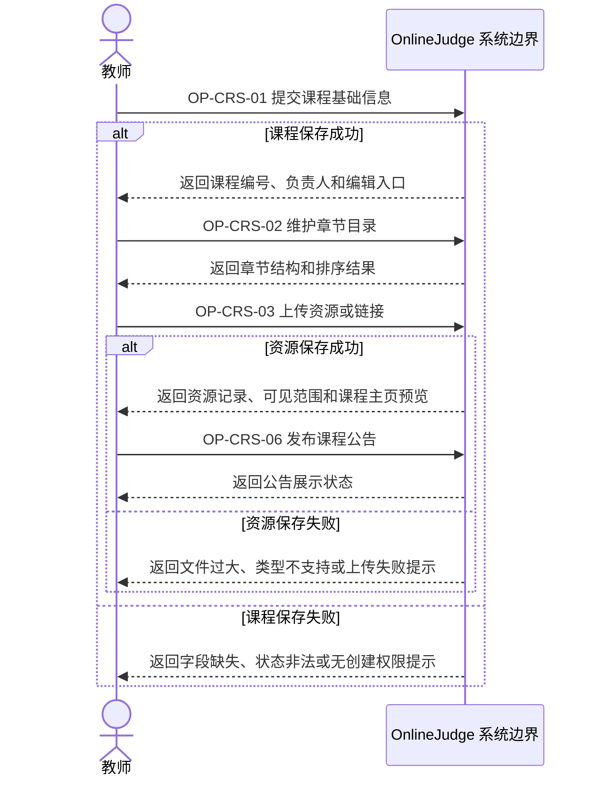

图 4-10 课程创建与资源维护系统顺序图

### 4.16.8 实验创建与发布系统顺序图

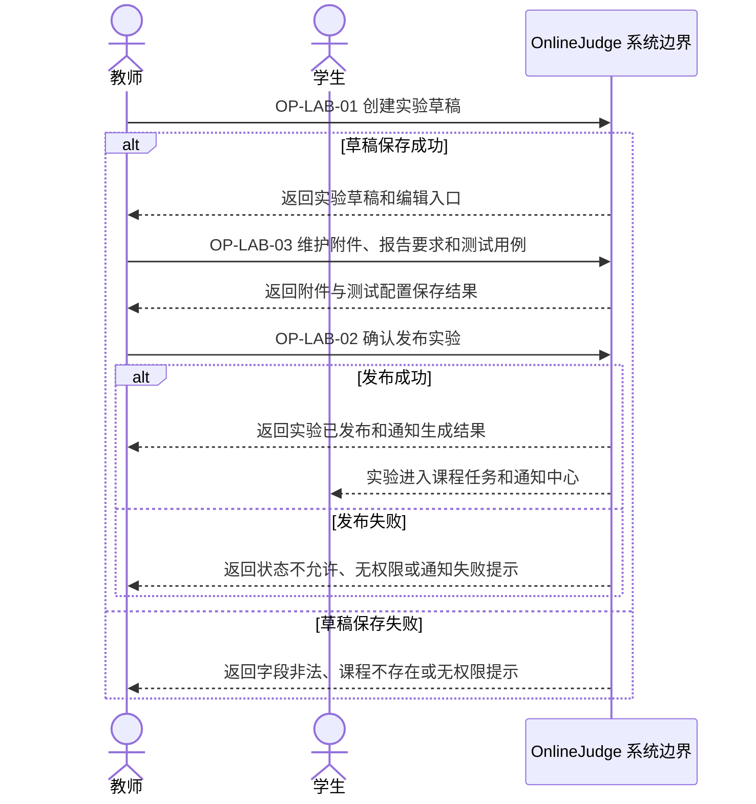

图 4-11 实验创建与发布系统顺序图

### 4.16.9 学习任务与进度系统顺序图

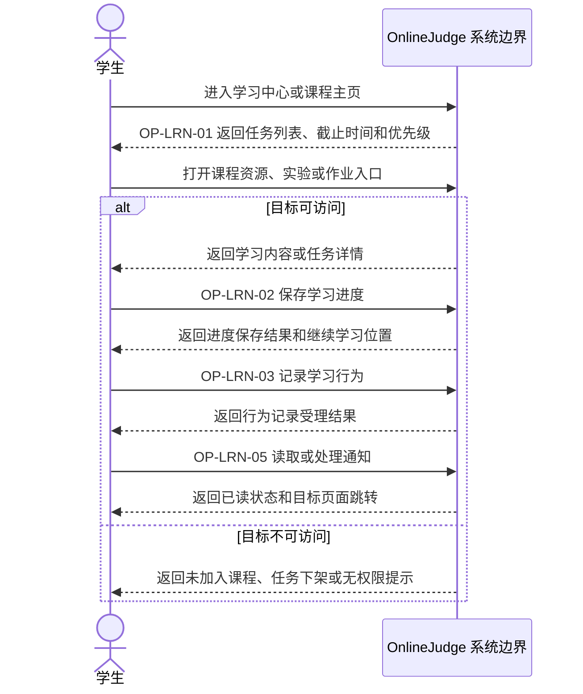

图 4-12 学习任务与进度系统顺序图

---

# 5 需求规格说明

## 5.1 软件系统总体功能/对象结构

系统总体上由六个核心功能域构成：

用户权限与平台安全
课程与教学资源
学习过程与通知提醒
实训实验模块
作业与自动评测模块
成绩评价与教学分析模块

这些模块共同围绕三类核心角色运转。用户权限与平台安全是基础支撑模块；课程与教学资源、学习过程与通知提醒构成教学运行主线；实训实验模块、作业与自动评测模块承担任务与反馈闭环；成绩评价与教学分析模块负责结果汇总与输出。

图 5-1 系统总体功能结构图

## 5.2 软件子系统功能/对象结构（概念类图）

从对象关系上看，本系统的核心对象包括用户、课程、章节、资源、实验、作业、提交、成绩、通知和日志。

对象关系约定如下：

- 一个用户在平台层仅对应一个主角色，在课程范围内可派生课程成员角色
- 一个教师可管理多门课程
- 一门课程包含多个章节、资源、实验和作业
- 一个学生可加入多门课程
- 一个实验/作业可产生多条提交记录
- 一条提交记录可关联自动评测结果、教师评语和最终得分
- 一门课程可生成多个成绩项和一个课程总评
- 通知与用户和事件双向关联
- 日志与关键操作和责任人关联

图 5-2 核心对象关系图（概念类图）

图 5-3 以概念类图形式展示核心概念、主属性及业务关系，并与图 5-2 共同说明系统对象结构。

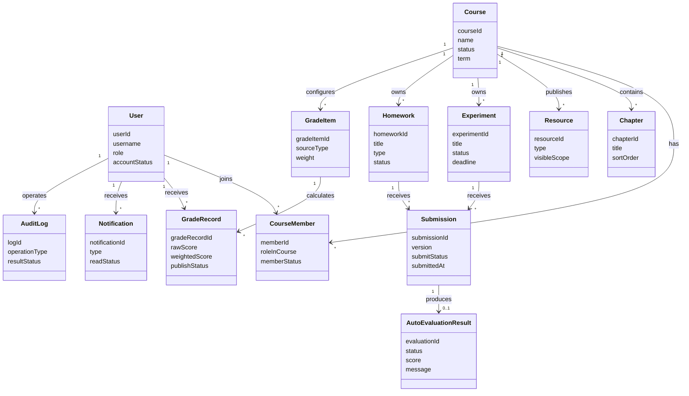

图 5-3 核心概念类图

## 5.3 描述约定

为保证文档一致性，本文档采用如下描述约定：

1. 功能需求使用 `FR-模块缩写-编号` 进行编号，例如 `FR-UA-01`。
2. 非功能需求使用 `NFR-模块缩写-编号` 进行编号，例如 `NFR-UA-01`。
3. 模块名称与编号前缀采用如下约定：需求、用例、系统操作和测试材料沿用短前缀，概要设计和详细设计使用模块全称缩写。

| 模块缩写 | 需求编号前缀 | 用例与操作编号前缀 |
| --- | --- | --- |
| AUTH | `FR-UA` / `NFR-UA` | `UC-AUTH` / `OP-AUTH` |
| CRS | `FR-CR` / `NFR-CR` | `UC-CRS` / `OP-CRS` |
| LRN | `FR-LN` / `NFR-LN` | `UC-LRN` / `OP-LRN` |
| HWK | `FR-HW` / `NFR-HW` | `UC-HW` / `OP-HW` |
| GRD | `FR-GR` / `NFR-GR` | `UC-GR` / `OP-GR` |
| LAB | `FR-LAB` / `NFR-LAB` | `UC-LAB` / `OP-LAB` |

4. 需求优先级采用 P0、P1、P2：
   - P0：必须实现
   - P1：重要增强
   - P2：可选优化
5. 用例描述统一包括：用例编号、用例名称、目标、主参与者、协同参与者（如有）、前置条件、触发器、基本流程、备选流程、异常流程、后置条件、补充约束、关联需求、关联系统操作、系统操作合约引用、关联验收章节、测试前缀。
6. 验收标准统一采用 Given / When / Then 格式，便于直接转为测试用例。
7. 图示符号统一约定为：系统上下文图使用矩形表示外部实体、箭头表示交互方向；UML 用例图使用系统边界、参与者、椭圆用例和 `<<include>>` / `<<extend>>` 关系；SSD 只展示参与者与 OnlineJudge 系统边界；泳道图使用圆角矩形表示活动、菱形表示判定；ER 图使用实体框与关系连线表示数据对象及联系；概念类图使用类框表示概念对象，连线表示对象之间的业务关联。
8. Mermaid 图示以源码和图题共同作为交付内容；导出正式 PDF 或 Word 时应渲染为可读图片，并保留图号、图题、参与者和 OP 编号。若正文采用静态图片引用，图片文件必须实际存在于 `docs/最终提交/assets/` 或对应资产目录。
9. 所有时间、性能与容量指标默认针对课程项目的小并发演示环境，而非商业级生产环境。
10. 外部接口与内部接口的描述重点放在职责边界、输入输出和调用方向，不要求在本阶段写到实现代码层面。

## 5.4 功能需求

### 5.4.1 用户权限与平台安全

#### 5.4.1.1 功能目标

本模块负责平台用户身份认证、角色权限控制、访问控制与基础安全防护，保障不同角色在系统中的功能边界清晰、数据访问受控、关键操作可追踪，从而确保教学平台运行安全、数据安全与业务合规。

#### 5.4.1.2 需求项

##### FR-UA-01 用户注册与登录（P0）

1. 用户应能够通过学号/工号、手机号、邮箱或系统指定账号完成注册与登录。
2. 系统应支持学生、教师、管理员等不同类型用户身份的识别。
3. 用户登录成功后，系统应创建有效会话，并允许用户在授权范围内访问对应功能。
4. 用户退出登录后，系统应及时清除当前会话或令牌，使其不能继续访问需认证资源。

##### FR-UA-02 角色管理与权限分配（P0）

1. 系统应支持至少包含学生、教师、管理员三类角色。
2. 不同角色应具有不同的功能访问范围：学生侧重学习与提交，教师侧重课程与教学管理，管理员侧重平台级维护。
3. 管理员应能够对用户角色进行查看、分配、调整与维护。
4. 系统应确保未被授权的用户不能访问超出其角色范围的功能菜单、接口与数据。

##### FR-UA-03 身份认证与访问控制（P0）

1. 用户访问课程管理、作业管理、成绩管理、实验管理等核心业务功能前应先完成身份认证。
2. 系统应对页面访问、接口调用和资源下载进行权限校验。
3. 学生只能访问本人已加入课程、本人作业、本人实验记录和本人成绩等数据。
4. 教师只能访问本人负责课程范围内的教学管理数据。
5. 管理员可在平台授权范围内访问全局管理数据并执行维护操作。

##### FR-UA-04 账号信息与密码安全（P0）

1. 用户应能够修改个人基础信息，如昵称、联系方式、头像等。
2. 用户应能够修改登录密码，并在修改时校验原密码或采用其他有效身份验证方式。
3. 系统不得以明文形式存储用户密码。
4. 当用户连续多次登录失败时，系统应进行限制或提醒，以降低暴力破解风险。

##### FR-UA-05 权限异常处理与安全提示（P1）

1. 当用户访问无权限页面、接口或资源时，系统应明确提示“无权限访问”或返回相应失败结果。
2. 当用户登录状态失效、会话过期或认证信息无效时，系统应提示重新登录。
3. 对于被禁用、被冻结或异常状态的账号，系统应限制其登录和业务访问。
4. 系统在发生关键安全异常时，应保留必要日志以便排查。

##### FR-UA-06 关键操作审计（P1）

1. 系统应记录用户登录、退出登录、角色变更、密码修改、权限调整等关键操作。
2. 审计日志至少应包含操作时间、操作用户、操作类型、操作对象和结果状态。
3. 管理员应能够查看必要的安全审计记录，用于问题追踪与责任定位。

##### FR-UA-07 平台基础安全防护（P1）

1. 系统应对登录、注册、密码修改等输入内容进行合法性校验。
2. 系统应对非法请求、缺失认证信息请求和越权请求进行拦截。
3. 系统应避免因参数篡改导致越权访问、越权修改或越权删除。
4. 系统应在文件上传、资源访问、接口调用等场景中进行必要的安全校验。

#### 5.4.1.3 异常流程补充

- 用户名或密码错误。
- 账号不存在。
- 账号已被禁用或冻结。
- 登录状态失效。
- 用户无权限访问目标页面或资源。
- 用户尝试访问他人课程、作业、成绩或实验数据。
- 用户连续多次登录失败。
- 权限分配失败或角色配置异常。
- 关键安全日志记录失败。

#### 5.4.1.4 验收标准

Given 学生已成功登录，When 学生访问本人已加入课程的学习资源，Then 系统应允许访问。
Given 学生已成功登录，When 学生访问教师课程管理页面或管理员后台，Then 系统应拒绝访问并提示无权限。
Given 教师已成功登录，When 教师进入本人负责课程的管理页面，Then 系统应允许其进行课程、作业、实验等教学管理操作。
Given 管理员已成功登录，When 管理员调整某用户角色权限，Then 系统应完成修改并记录审计日志。
Given 用户登录状态已过期，When 用户继续访问需认证页面或接口，Then 系统应提示重新登录。
Given 用户连续多次输入错误密码，When 超过系统限制次数，Then 系统应执行限制策略或发出安全提示。

---

### 5.4.2 课程与教学资源

#### 5.4.2.1 功能目标

本模块负责课程创建、课程管理、教学资源上传与管理，是教学活动的主要入口。

#### 5.4.2.2 需求项

##### FR-CR-01 课程创建与管理（P0）

1. 教师应能够创建课程，填写课程名称、简介、开课时间、课程分类、课程封面等信息。
2. 教师应能够编辑课程信息、设置课程状态，如存草稿、未开课、已结课。
3. 管理员应能够查看平台全部课程并进行维护操作。
4. 课程创建后应自动关联创建者，并支持手动关联其他负责人。

##### FR-CR-02 课程章节与目录管理（P0）

1. 教师应能够为课程建立章节、单元或知识点结构。
2. 教师应能够调整章节顺序、增删章节及修改标题说明。
3. 学生进入课程后应能在课程主页首屏看到课程目录入口，并浏览教学内容。

##### FR-CR-03 教学资源管理（P0）

1. 教师应能够上传课程视频、文档、课件、压缩包、链接等资源。
2. 教师应能够为资源设置标题、类型、所属章节、可见范围和发布时间。
3. 学生应能够查看和下载授权范围内的教学资源。
4. 系统应记录资源上传时间、上传者和资源归属课程。

##### FR-CR-04 学生加入课程（P0）

1. 学生应能够通过课程邀请码直接加入课程，或在课程列表中发起加入申请。
2. 教师应能够在课程级别配置加入方式为“邀请码直接加入”或“申请后审核加入”。
3. 当课程配置为“申请后审核加入”时，教师或管理员应能够审核学生加入申请。
4. 加入课程成功后，学生应立即获得该课程的资源访问和任务参与资格。
5. 教师应能够查看选课学生名单。

##### FR-CR-05 课程成员管理（P1）

1. 教师应能够查看课程内学生列表、助教列表和学生学习状态概览。
2. 教师应能够移除异常成员或调整课程内协作角色。
3. 管理员可对课程成员关系进行纠错维护。

##### FR-CR-06 课程公告与基础信息展示（P1）

1. 教师应能够发布课程公告。
2. 学生进入课程首页后应看到课程简介、教师信息、公告和最近任务。
3. 课程关闭后，系统应保留课程历史数据的只读访问能力。

#### 5.4.2.3 异常流程补充

- 课程不存在。
- 课程关闭。
- 邀请码无效。
- 资源上传失败。
- 学生无权限访问该课程资源。

#### 5.4.2.4 验收标准

Given 教师已登录且拥有课程管理权限，When 教师填写课程信息并提交，Then 系统应创建课程并进入课程管理页。
Given 学生已加入某课程，When 学生进入课程主页，Then 系统应展示该课程的章节、资源和任务。
Given 教师已进入课程管理页，When 教师发布课程公告，Then 课程首页应展示最新公告内容。
Given 教师已进入课程成员页，When 教师按状态筛选课程成员，Then 系统应返回对应成员列表与学习状态概览。
Given 学生未加入课程，When 学生访问课程内部资源链接，Then 系统应拒绝访问。

---

### 5.4.3 学习过程与通知提醒

#### 5.4.3.1 功能目标

为本系统学生、教师、管理员提供**学习过程可视化、学习任务管理、学习进度跟踪、全场景通知提醒**能力，形成学习行为可记录、任务可追踪、消息可触达的闭环，保障教学流程顺畅、信息传递及时。

#### 5.4.3.2 需求项

##### FR-LN-01 学习任务中心展示（P0）

1. 学生端应展示个人学习任务列表，包含课程资源、实验、作业三类任务。
2. 任务按状态分为：未开始、进行中、已完成、已逾期，支持筛选与排序。
3. 任务卡片应展示：任务名称、所属课程、截止时间、完成进度、操作入口。
4. 支持按截止时间、任务类型、完成状态进行排序。

##### FR-LN-02 学习进度记录与展示（P0）

1. 系统应记录学生对课程资源、实验、作业的访问与完成情况。
2. 课程级学习进度以百分比形式展示，支持章节级进度明细。
3. 学习中断后重新进入，应自动恢复到上次学习位置。
4. 教师端可查看所教课程学生的整体学习进度统计。

##### FR-LN-03 学习行为跟踪（P1）

1. 记录学生学习时长、资源访问次数、任务提交时间等行为数据。
2. 前端展示个人学习仪表盘，包含近 7 天学习趋势、完成任务数。
3. 支持学习数据本地缓存，断网情况下可查看最近记录。

##### FR-LN-04 通知分类推送与展示（P0）

1. 通知分为：学习提醒、任务通知、成绩通知、系统公告、教师公告五类。
2. 未读通知以角标、加粗、高亮样式标识。
3. 支持按通知类型、时间范围、已读状态筛选。
4. 点击通知可直接跳转至对应业务页面。

##### FR-LN-05 通知触达与状态管理（P0）

1. 支持站内消息、页面弹窗、列表角标三种触达方式。
2. 通知支持单条 / 批量标为已读、单条删除操作。
3. 高优先级通知（逾期提醒、成绩发布）登录后立即弹窗提示。
4. 通知状态实时同步，多页面刷新保持一致。

##### FR-LN-06 定时提醒与规则配置（P1）

1. 支持任务截止前 24 小时、1 小时自动触发提醒。
2. 教师发布任务、发布成绩后自动推送通知。
3. 学生可在前端开启 / 关闭非必要通知提醒。

#### 5.4.3.3 异常流程补充

- 网络异常时，学习进度本地暂存，恢复后自动同步。
- 通知加载失败，提供重试按钮，不阻塞页面其他功能。
- 任务已删除 / 下架，点击提醒跳转至友好提示页。
- 重复提交不产生重复通知，避免消息轰炸。

#### 5.4.3.4 验收标准

Given 学生已加入课程且有进行中任务，When 进入学习中心，Then 展示任务列表与正确进度。

Given 任务即将截止，When 到达提醒时间，Then 学生收到对应通知与角标。

Given 学生点击未读通知，When 通知详情页打开，Then 系统标记为已读并跳转至对应页面。

Given 学习过程中断，When 重新打开页面，Then 恢复到上次学习位置。

Given 学生近 7 天存在学习记录，When 学生进入学习仪表盘，Then 系统应展示学习趋势与完成任务数。

---

### 5.4.4 实训实验模块

#### 5.4.4.1 功能目标

为本系统教师、学生、管理员提供**实验创建与发布、实验任务提交与管理、实验评分与反馈、实验统计与记录**能力，形成实验从布置到完成、从提交到评价的完整闭环，支撑课程实践教学环节的在线化运行。

#### 5.4.4.2 需求项

##### FR-LAB-01 实验创建与发布（P0）

1. 教师应能够创建实验，填写实验标题、实验说明、开放时间、截止时间、所属课程与章节、评分方式（自动评测/教师评分/综合）。
2. 教师应能够为实验上传附件（实验指导书、模板文件、参考数据等）。
3. 教师应能够设置实验状态：草稿、未开放、进行中、已截止。
4. 教师发布实验后，系统应自动通知课程内全体学生。
5. 实验应关联到所属课程与章节，支持在课程章节结构下展示。

##### FR-LAB-02 学生实验查看与提交（P0）

1. 学生应能够查看实验说明、附件、截止时间、提交要求和评分方式。
2. 学生应能够按实验要求提交代码文件、实验报告或其他指定格式附件。
3. 系统应对提交内容的文件格式、大小进行合法性校验，不合法时给出明确错误提示。
4. 提交成功后，系统应反馈提交状态、提交时间和提交版本号。
5. 实验截止后，系统仅在实验配置为“允许逾期提交”时接受提交，并将该记录标记为“逾期提交”。

##### FR-LAB-03 提交历史与版本管理（P0）

1. 在允许多次提交时，学生应能够查看历史提交记录，包括提交时间、提交状态和评测结果。
2. 教师应能够查看每名学生的全部提交版本。
3. 系统应明确标识最新提交和教师评分所依据的有效提交版本。
4. 历史提交记录应按时间倒序展示，支持按学生、按状态筛选。

##### FR-LAB-04 实验自动评测（P0）

1. 对于代码类实验，系统应按照教师预设的测试用例进行输入输出比对，返回通过/不通过结果及得分。
2. 自动评测应记录评测状态（待评测、评测中、评测成功、评测失败），评测失败时返回可识别的失败原因。
3. 自动评测结果应与具体提交版本绑定，教师可查看评测详情。
4. 对于基础规模测试用例，自动评测应在 60 秒内返回最终结果或失败状态，前端应展示处理中状态，避免学生重复提交。

##### FR-LAB-05 实验报告管理（P1）

1. 学生应能够通过文件上传方式提交实验报告，支持的报告格式为 PDF、DOCX 或 ZIP，不提供在线编辑。
2. 教师应能够查看、下载学生的实验报告。
3. 实验报告应与对应实验提交关联，作为评分参考依据之一。
4. 系统应记录实验报告的提交时间、版本和文件信息。

##### FR-LAB-06 教师评分与评语（P0）

1. 对于教师评分或综合评分的实验，教师应能够查看学生提交内容、自动评测结果和实验报告。
2. 教师应能够给出评分并填写评语。
3. 教师应能够批量评分或按课程、实验、提交状态筛选待评分学生。
4. 教师修改评分后，系统应记录评分变更日志。

##### FR-LAB-07 实验结果展示与学生反馈（P0）

1. 学生应能够查看实验的评分结果、自动评测详情（通过用例数、失败原因）和教师评语。
2. 教师发布成绩前，仅当实验配置为“允许成绩发布前查看结果”时，系统才向学生展示结果。
3. 成绩发布后，系统应通知学生查看实验成绩。

##### FR-LAB-08 实验统计与查询（P1）

1. 教师应能够查看单次实验的提交统计，包括已提交人数、未提交人数、平均分、各分数段分布。
2. 教师应能够查看课程维度下全部实验的完成情况汇总。
3. 管理员应能够查看平台级别的实验统计数据。

#### 5.4.4.3 异常流程补充

- 实验不存在或已被删除。
- 实验未开放或已截止（且不允许逾期提交）。
- 提交文件格式不合法或超过大小限制。
- 自动评测执行失败或超时。
- 教师评分时提交内容加载失败。
- 学生试图查看教师未发布的评分结果。
- 重复提交同一版本内容。

#### 5.4.4.4 验收标准

Given 教师已登录且拥有课程管理权限，When 教师填写实验信息并发布，Then 系统应创建实验并向课程学生发送通知。
Given 实验处于进行中状态，When 学生提交合法代码文件，Then 系统应保存提交记录、返回提交成功并触发自动评测。
Given 实验允许多次提交，When 学生打开提交历史，Then 系统应按时间倒序展示全部版本并标识有效版本。
Given 代码类实验已配置测试用例，When 学生提交代码，Then 系统应在 60 秒内返回自动评测结果（通过用例数、得分）或明确失败原因。
Given 学生已上传实验报告，When 教师打开对应提交详情，Then 系统应展示报告文件信息并允许下载。
Given 教师进入评分页面，When 教师填写分数与评语并提交，Then 系统应保存评分结果并记录评分变更日志。
Given 教师进入实验统计页，When 选择某次实验，Then 系统应展示已提交人数、未提交人数、平均分和分数段分布。
Given 教师尚未发布实验成绩，When 学生查看实验评分，Then 系统应仅在实验配置为“允许成绩发布前查看结果”时展示评分结果。
Given 教师已发布实验成绩，When 学生进入实验详情页，Then 系统应展示评分、评语和自动评测详情。

---

### 5.4.5 作业与自动评测模块

#### 5.4.5.1 功能目标

本模块负责作业从发布、提交到自动反馈和教师处理的完整闭环，是系统技术密度较高的核心模块。本版本以基础自动评测为主，不实现复杂判题平台。

#### 5.4.5.2 需求项

##### FR-HW-01 作业创建与发布（P0）

1. 教师应能够创建作业，填写作业标题、作业说明、截止时间、提交格式、评分方式和所属课程。
2. 作业可分为客观题作业、文件提交作业、代码提交作业等基本类型。
3. 教师应能够设置作业是否允许多次提交、是否允许逾期提交、是否允许学生在成绩发布前查看评测详情。

##### FR-HW-02 学生作业查看与提交（P0）

1. 学生应能够查看作业说明、附件、截止时间和提交要求。
2. 学生应能够按作业要求提交文本、附件或代码内容。
3. 系统应对提交格式进行合法性校验。
4. 提交成功后，系统应反馈提交状态与时间。

##### FR-HW-03 提交历史管理（P0）

1. 在允许多次提交时，学生应能够查看历史提交记录。
2. 教师应能够查看每名学生的全部提交版本。
3. 系统应明确标识最新提交和有效提交版本。

##### FR-HW-04 自动评测（P0）

1. 对于客观题作业，系统应根据标准答案自动评分。
2. 对于基础代码类作业，系统应按照预设测试用例进行输入输出比对或基础结果校验。
3. 自动评测完成后，系统应生成评测结果，包括得分、通过情况和基础错误提示。
4. 对于基础规模测试用例，自动评测应在 60 秒内返回结果或失败状态，且过程应可回溯，教师可查看评测状态与结果摘要。

##### FR-HW-05 教师批阅与重评（P1）

1. 教师应能够查看学生提交内容和自动评测结果。
2. 对主观题或综合作业，教师应能够人工给分并填写评语。
3. 教师应能够发起重评或重新触发自动评测。
4. 教师可按课程、作业、提交状态筛选学生提交。

##### FR-HW-06 作业反馈与结果展示（P0）

1. 学生应能够查看自己的评测结果、成绩和教师评语。
2. 对于代码类作业，学生可查看通过用例数量、失败原因摘要等基础反馈。
3. 教师发布成绩前，仅当作业配置为“允许提前查看评测详情”时，系统才向学生显示自动评测结果；否则隐藏得分和评语。

#### 5.4.5.3 异常流程补充

提交格式不合法。
超时提交。
自动评测执行失败。
教师重评后结果更新失败。
学生在成绩发布前试图查看未公开评分结果。

#### 5.4.5.4 验收标准

Given 教师已进入课程作业管理页，When 教师填写作业信息并发布，Then 系统应创建作业并向课程学生展示作业入口。
Given 学生已加入课程且作业处于开放状态，When 学生上传合法文件并提交，Then 系统应保存提交并返回提交成功。
Given 作业允许多次提交，When 学生查看历史提交，Then 系统应展示全部版本并标识当前有效版本。
Given 客观题已有标准答案，When 学生提交作答内容，Then 系统应自动计算得分并保存结果。
Given 代码题测试用例配置完成，When 学生提交代码，Then 系统应返回基础评测结果或失败原因摘要。
Given 教师进入作业批阅页，When 教师执行人工评分或发起重评，Then 系统应更新结果并保留重评记录。
Given 教师尚未发布成绩，When 学生查看作业得分，Then 系统应仅在作业配置为“允许提前查看评测详情”时展示结果。

---

### 5.4.6 成绩评价与教学分析

#### 5.4.6.1 功能目标

本模块负责对实验、作业等教学任务结果进行汇总、计算、展示和基础分析，是系统教学效果输出层的重要组成部分。模块应支持教师定义成绩项和计算规则，自动汇总实验、作业等来源成绩，生成学生个人成绩记录和课程总评，并通过发布机制向学生展示结果。同时，模块应支持学生对已发布成绩提出异议并由教师进行复核处理，支持教师查看班级整体成绩情况和基础教学分析结果，为课程改进提供数据支持。本版本以基础成绩管理、成绩复核和统计分析为主，不实现复杂教务系统能力和高级智能分析能力。

#### 5.4.6.2 需求项

##### FR-GR-01 成绩项配置与计算规则（P0）

1. 教师应能够在课程范围内定义成绩项，包括成绩项名称、成绩来源、满分值、权重和是否计入总评。
2. 成绩来源可包括实验成绩、作业成绩及其他课程内可计分项目。
3. 系统应支持按预设权重自动计算课程总评。
4. 教师应能够修改未发布成绩的计算规则。
5. 当成绩规则发生变更时，系统应支持对相关成绩进行重新计算。

##### FR-GR-02 成绩汇总与总评生成（P0）

1. 系统应能够从实验模块、作业与自动评测模块读取已产生的评分结果，并按课程、学生和成绩项进行汇总。
2. 系统应能够区分原始分、加权分和课程总评。
3. 对于未提交、未评分、缺失成绩等情况，系统应能够给出明确状态标识，并按课程规则参与或暂不参与总评计算。
4. 系统应为每名学生生成课程成绩记录，并支持后续查询和发布。

##### FR-GR-03 教师成绩管理（P0）

1. 教师应能够查看课程成绩总表，并按学生、成绩项、状态等条件进行筛选和查询。
2. 教师应能够对课程内单项成绩或总评进行手动调整，并填写调整原因。
3. 教师应能够查看每名学生的成绩构成明细。
4. 对于已发布成绩，系统应保留成绩修改前后值、修改人、修改时间和修改原因。
5. 教师只能管理自己负责或被授权课程的成绩数据。

##### FR-GR-04 成绩发布与状态控制（P0）

1. 系统应支持成绩发布状态控制，至少包括未发布和已发布两种状态。
2. 教师应能够在确认成绩无误后发布课程成绩。
3. 成绩发布后，学生方可查看对应成绩结果。
4. 系统应记录每次成绩发布时间和发布范围。
5. 若已发布成绩发生修改，系统应保留变更记录，并向受影响学生追加一条站内成绩变更通知。

##### FR-GR-05 学生成绩查询与结果展示（P0）

1. 学生应能够查看本人在课程中的已发布成绩，包括成绩项明细、加权结果和课程总评。
2. 学生应只能查看本人的成绩数据，不能查看其他学生成绩。
3. 系统应明确展示成绩发布时间和当前发布状态。
4. 若课程配置为“显示教师评语”，学生可查看教师评语或与成绩相关的基础反馈信息。
5. 对于未发布成绩，系统应返回明确提示，不能向学生展示未公开结果。

##### FR-GR-06 班级成绩统计与教学分析（P1）

1. 教师应能够查看课程或单个成绩项的基础统计分析结果。
2. 系统应支持展示班级均分、最高分、最低分、及格率、完成率等基础指标。
3. 系统应支持按照预设分数区间统计成绩分布情况。
4. 系统应支持查看实验、作业等成绩项的整体完成情况和平均表现。
5. 本版本分析能力以课程级和班级级基础统计为主，不要求实现复杂预测分析或跨课程对比分析。

##### FR-GR-07 成绩异议与复核申请（P1）

1. 学生应能够在成绩发布后，对本人课程成绩或单项成绩提交异议申请。
2. 异议申请应包含关联课程、关联成绩项或总评、申请理由、申请时间和当前处理状态。
3. 教师应能够查看自己负责或被授权课程内的成绩异议申请，并进行同意修改、驳回或备注说明。
4. 教师处理异议时，如确认成绩需要修改，应复用成绩修改留痕机制，记录修改前后值、处理人、处理时间和处理说明。
5. 系统应向学生展示本人异议申请的处理状态和处理结果。

#### 5.4.6.3 异常流程补充

- 成绩来源任务仍存在未评分记录。
- 成绩计算规则缺失或权重配置不合法。
- 教师试图查看或修改无权限课程的成绩数据。
- 学生在成绩未发布前尝试查看结果。
- 成绩发布过程中通知发送失败。
- 已发布成绩被修改后，部分统计结果未及时刷新。
- 学生重复提交仍在处理中的成绩异议申请。
- 学生对非本人、未发布或无权限课程成绩提交异议申请。
- 教师处理无权限课程的成绩异议申请。

#### 5.4.6.4 验收标准

Given 教师已完成课程成绩项配置且实验、作业评分结果已存在，When 系统执行成绩汇总，Then 系统应生成按学生组织的课程成绩记录。
Given 课程已配置权重规则，When 系统计算课程总评，Then 系统应生成对应的加权成绩和课程总评结果。
Given 教师拥有课程成绩管理权限，When 教师查看课程成绩总表，Then 系统应展示全班成绩明细并支持按条件筛选。
Given 教师确认成绩无误，When 教师点击发布成绩，Then 系统应更新成绩状态为已发布并向学生发送成绩通知。
Given 学生成绩已发布，When 学生进入成绩页面查看结果，Then 系统应展示该学生个人成绩明细和课程总评。
Given 教师进入教学分析页面，When 系统加载班级成绩统计，Then 系统应展示均分、及格率、完成率和成绩分布等基础分析结果。

Given 学生已查看本人已发布成绩且存在异议，When 学生提交成绩复核申请，Then 系统应生成异议申请记录并通知对应课程教师。

Given 教师收到成绩异议申请，When 教师完成复核处理，Then 系统应记录处理结果；若成绩被修改，还应记录修改前后值并向学生展示处理结果。

---

# 6 非功能需求

> 本章按模块划分非功能需求，便于后续与模块负责人、测试负责人、概要设计负责人对齐责任边界。所有指标默认以课程项目小并发演示环境为前提。

除非另有说明，性能类指标以 95% 的请求满足目标时限作为验收通过标准。

## 6.0 全局软件属性与设计约束

本节定义作用于所有模块的全局质量属性和设计约束。第 6.1 至 6.6 的模块级 NFR 应在满足本节约束的前提下分别验收。

### 6.0.1 标准合规性

系统接口应遵循 RESTful 风格和统一错误返回约定，避免同一类错误在不同模块返回不一致结构。
前后端数据字段、枚举值、分页结构和错误码应以 SRS、概要设计、详细设计和测试文档中的公共契约为准，不得在单个模块内静默更改。
涉及账号、密码、文件上传、代码评测、成绩发布和通知记录的功能应遵守基本数据安全、隐私保护和课程项目交付规范。
文档、接口、页面、数据表和测试用例应保持编号可追踪，新增需求或公共契约变更必须同步更新相关追踪表。

### 6.0.2 可维护性

系统应按 AUTH、CRS、LRN、LAB、HWK、GRD 六个功能域组织需求和实现边界，模块职责清晰，跨模块只通过明确接口或事件交互。
公共 DTO、枚举、错误码、权限码和事件对象应集中定义或在设计文档中统一说明，避免多个模块重复发明同一业务概念。
关键业务流程应具备可读日志、状态字段和可重复验证的测试路径，便于后续定位问题和维护。
代码实现阶段应优先保持高内聚、低耦合和可测试结构，不以临时演示逻辑替代需求约束。

### 6.0.3 可移植性

客户端应支持现代桌面浏览器访问，不依赖特定厂商浏览器私有能力。
后端应可在常见本地开发环境或轻量服务器环境运行，数据库以 MySQL 为基线，文件存储本版本采用本地文件系统并保留对象存储扩展点。
自动评测本版本仅要求课程项目基础规模，不依赖重型分布式判题集群；迁移到其他运行环境时应保留评测任务、提交记录和结果状态的一致性。

### 6.0.4 硬件限制

本系统面向课程项目小并发演示环境，不以商业级高并发、分布式容灾或大规模在线判题为目标。
演示环境应能支撑同时在线用户不超过 50 人、并发业务请求不超过 20 个、单门课程学生数不超过 100 人、自动评测等待队列长度不超过 30 个任务。
运行环境需要具备可用网络、基础 CPU/内存/磁盘资源和可写文件目录，以支持页面访问、数据库读写、文件上传下载和基础自动评测。

### 6.0.5 软件运行限制

本版本通知能力限定为站内消息，邮件、短信和第三方即时通讯属于扩展接口，不纳入核心验收范围。
本版本不接入校级统一身份认证、真实教务系统、支付系统、直播系统或大模型服务。
代码评测仅覆盖基础语言和测试用例场景，评测日志不得暴露服务器敏感路径、密钥或配置。
系统不得将线下人工处理作为主流程完成条件；登录、课程、作业/实验、评测、成绩和通知闭环应能在系统内完成。

## 6.1 用户权限与平台安全

### NFR-UA-01 安全性

系统必须对所有需认证功能进行身份校验与权限校验。
用户密码不得以明文形式存储、展示或传输。
系统应防止未授权访问、越权访问和通过简单参数篡改造成的数据泄露。
系统应对登录、注册、密码修改、文件上传、资源访问等关键场景进行必要的安全校验。

### NFR-UA-02 可靠性

登录、退出、密码修改、角色调整等关键安全功能应稳定可用。
权限校验失败时，系统应返回明确结果，不得出现“界面限制但接口可绕过”的情况。
审计日志在正常情况下应完整记录关键安全事件。
当认证服务异常时，系统应避免默认放行未授权请求。

### NFR-UA-03 可用性

登录、退出登录、修改密码等操作流程应清晰易用。
权限不足、登录失效、账号异常等情况应提供明确提示信息。
不同角色登录后应看到与自身身份匹配的功能入口，避免展示无关或不可用功能。

### NFR-UA-04 性能

在课程平台常规使用场景下，登录认证、权限校验和常见鉴权接口应在 3 秒内完成响应。
权限判断不应导致普通页面访问出现超过 1 秒的界面冻结。
系统应避免因频繁权限查询使首页或课程页首次加载时间超过 3 秒。

### NFR-UA-05 可测试性

需能够验证学生、教师、管理员三类角色的访问边界。
需能够验证登录成功、登录失败、会话失效、越权访问、密码修改、角色调整、审计日志记录等关键场景。
需能够通过测试用例确认页面权限与接口权限保持一致。

---

## 6.2 课程与教学资源

### NFR-CR-01 可用性

课程首页的信息组织应清晰，学生应能快速看到课程简介、章节目录、资源列表和最近任务。
课程创建、编辑、资源上传等核心操作应提供明确的成功或失败提示。

### NFR-CR-02 性能

课程列表、课程首页、资源列表等页面的普通查询请求应在 3 秒内返回第一页结果。

### NFR-CR-03 可靠性

资源上传失败时必须给出错误提示，不得出现“界面显示成功但文件未保存”的情况。
课程关闭后，历史数据应保持可读，不应丢失。

### NFR-CR-04 兼容性

系统应支持常见教学资源格式的基础管理与下载，如 PDF、DOCX、PPT、ZIP、图片等。

### NFR-CR-05 可测试性

需能够验证课程创建、加入课程、课程关闭、资源上传失败、未加入课程访问资源等关键场景。

---

## 6.3 学习过程与通知提醒

### NFR-LN-01 实时性

任务状态、学习进度、通知未读数变更应在 1 秒内完成前端刷新。
通知推送延迟不超过 3 秒，角标更新不超过 1 秒。

### NFR-LN-02 性能

学习任务列表首次加载应在 1.5 秒内完成，连续滚动 200 条以内任务列表时不应出现超过 1 秒的界面冻结。
通知列表加载应在 1 秒内完成，批量操作响应应控制在 500ms 内。
学习进度保存接口响应应在 1 秒内完成，并支持频繁触发。

### NFR-LN-03 可靠性

学习进度应支持断点续传，异常退出后数据不丢失。
通知数据可进行本地缓存，重复打开时不重复拉取全量数据。
在课程项目小并发场景下，页面不崩溃、消息不丢失。

### NFR-LN-04 易用性

学习中心、通知中心入口应固定，主要操作路径不超过 2 步。
提醒文案应简洁明确，避免使用难以理解的专业术语。
界面应考虑基础可访问性，支持常规键盘操作与屏幕阅读适配。

### NFR-LN-05 可追踪性

每一条学习记录、通知读取记录均应可追溯到用户与时间。
进度变更、通知状态变更应留痕，便于问题排查与行为回溯。

---

## 6.4 实训实验模块

### NFR-LAB-01 可靠性

实验提交与自动评测流程必须具备明确状态，包括待提交、已提交、待评测、评测中、评测成功、评测失败、已评分。
自动评测失败时应返回可识别的失败状态与原因，不能静默无响应。
每次提交、每次评测、每次评分都应与具体版本绑定，可追溯。

### NFR-LAB-02 性能

实验提交接口应在 5 秒内返回“已受理”或“评测中”状态。
对于基础规模测试用例，自动评测应在 60 秒内返回结果或失败状态。
实验列表、提交记录列表等查询页面应在 3 秒内返回第一页结果。

### NFR-LAB-03 可追踪性

每次实验提交、自动评测、教师评分、评分变更都应保留记录。
教师能够追踪学生的提交版本变化和评分变化。
评测日志不应暴露系统敏感路径和配置信息。

### NFR-LAB-04 安全性

代码类实验的基础评测过程应与系统核心数据隔离，避免评测过程影响平台主业务数据。
学生只能查看自己的提交与结果，不能访问其他学生的实验提交。
文件上传接口应校验文件类型和来源，防止恶意文件上传。

### NFR-LAB-05 可测试性

需覆盖实验创建、实验发布、学生提交、自动评测成功/失败、教师评分、成绩发布、逾期提交、重复提交等关键场景。
实验状态转换的每个分支都应有对应的测试用例。

---

## 6.5 作业与自动评测模块

### NFR-HW-01 可靠性

作业提交与自动评测流程必须具备明确状态，包括待评测、评测中、评测成功、评测失败。
自动评测失败时应返回可识别的失败状态，不能静默无响应。
每次评测结果都应与具体提交版本绑定。

### NFR-HW-02 性能

普通作业提交应在 5 秒内返回“已保存”或明确失败结果。
自动评测允许一定处理时长，但前端必须展示处理中状态，避免用户重复提交。
作业提交后，系统应在 5 秒内返回“已受理”或“评测中”状态。
对于基础规模测试用例，自动评测应在 60 秒内返回结果或失败状态。

### NFR-HW-03 可追踪性

每次提交、每次评测、每次重评都应保留记录，教师能够追踪版本变化和结果变化。
历史提交记录与最终有效记录应可区分显示。

### NFR-HW-04 安全性

代码类作业的基础评测过程应与系统核心数据隔离，避免评测过程直接影响平台主业务数据。
学生只能查看自己的提交与结果。
评测日志不应暴露系统敏感路径和配置。

### NFR-HW-05 可测试性

需覆盖多次提交、逾期提交、评测失败、教师重评、学生查看未发布结果等关键场景。

---

## 6.6 成绩评价与教学分析

### NFR-GR-01 可靠性

成绩汇总、计算、发布和统计分析流程必须具有明确状态，避免出现成绩状态不一致或学生可见结果异常。
成绩记录、发布状态和统计结果之间应保持一致，不能出现已发布成绩与统计结果不匹配的情况。
当成绩来源数据发生变化时，系统应能够重新计算并刷新相关结果。

### NFR-GR-02 性能

在课程项目小并发演示环境下，普通课程成绩总表查询应在 5 秒内返回结果。
学生个人成绩查询应在 3 秒内返回页面结果。
班级级基础统计分析结果应在 5 秒内完成展示。
成绩发布操作应在 5 秒内返回成功、失败或处理中状态，避免教师重复操作。

### NFR-GR-03 可追踪性

成绩项定义、成绩计算、成绩发布和成绩修改过程均应保留记录。
成绩异议申请、教师复核处理和处理结果通知过程均应保留记录。

对于已发布成绩的修改，系统应记录修改前后值、修改人、修改时间和修改原因。
统计分析结果应能够追溯到其对应的成绩数据来源和时间点。

### NFR-GR-04 安全性

学生只能访问本人已发布成绩及相关结果。
学生只能对本人已发布成绩提交异议申请。

教师只能访问自己负责或被授权课程的成绩和分析数据。
系统不得向无权限用户暴露全班成绩明细、未发布成绩或敏感统计结果。
涉及成绩修改、发布和异议处理的关键操作应纳入日志审计范围。

### NFR-GR-05 可测试性

需覆盖成绩规则配置、成绩汇总、总评计算、成绩发布、学生查询、教师修改成绩、学生提交成绩异议、教师复核处理、统计分析展示等关键场景。

需覆盖未发布成绩不可见、成绩规则错误、成绩来源缺失、已发布成绩修改留痕、重复异议申请、无权限异议处理等异常场景。

相关测试项应能与 FR-GR-01 至 FR-GR-07 及 NFR-GR-01 至 NFR-GR-05 建立明确映射关系。

---

# 7 数据需求

## 7.1 核心数据对象

用户信息。
角色与权限配置。
课程信息。
课程章节与教学资源。
课程成员关系。
学习记录。
通知消息。
实验任务与实验提交。
作业任务与作业提交。
自动评测结果。
成绩记录。
课程公告。
通知偏好与提醒规则。
操作日志。

## 7.2 内部数据需求

为便于后续数据库设计，本系统内部核心数据可初步细分如下：

### 7.2.1 用户数据

用户账号信息：用户编号、用户名、密码摘要、姓名、联系方式、账号状态、创建时间。
角色信息：角色编号、角色名称、角色说明、角色状态。
权限信息：权限编号、权限名称、权限标识、权限说明、归属模块。
角色权限关系：关系编号、角色编号、权限编号、授权范围、状态。
用户角色关系：关系编号、用户编号、角色编号、分配时间、分配人、状态。
用户扩展信息：头像、个人简介、最后登录时间、最近活跃时间。

### 7.2.2 课程数据

课程基础信息：课程编号、课程名称、课程简介、授课学期、课程封面、课程状态、负责人。
课程配置：课程编号、加入方式、邀请码、人数上限、资源可见策略。
课程成员关系：课程编号、用户编号、成员角色、加入时间、审核状态。

### 7.2.3 章节与资源数据

章节信息：章节编号、所属课程、标题、顺序、说明。
资源信息：资源编号、所属课程、所属章节、资源类型、标题、文件路径或链接、上传者、发布时间、可见范围。
课程公告：公告编号、所属课程、标题、正文摘要、发布人、发布时间、置顶状态。

### 7.2.4 学习过程数据

学习记录：学生编号、课程编号、资源编号、最近访问时间、访问次数、学习位置、完成状态。
任务中心数据：任务编号、任务类型、所属课程、截止时间、当前状态、优先级。
学习行为统计：学生编号、统计周期、学习时长、资源访问次数、完成任务数、趋势摘要。

### 7.2.5 实验数据

实验信息：实验编号、所属课程、所属章节、实验标题、说明、开放时间、截止时间、状态、评分方式。
实验提交：提交编号、实验编号、学生编号、提交内容摘要、附件信息、提交时间、提交版本、是否逾期、评分结果、评语。
实验报告：报告编号、对应提交、文件类型、文件路径、文件大小、上传时间、版本号。

### 7.2.6 作业与评测数据

作业信息：作业编号、所属课程、标题、说明、作业类型、截止时间、是否允许多次提交、显示策略。
作业提交：提交编号、作业编号、学生编号、提交内容、附件信息、提交版本、提交时间、当前状态。
自动评测结果：评测编号、对应提交、评测状态、得分、通过情况、错误摘要、评测时间、重评标记。

### 7.2.7 成绩数据

成绩项定义：成绩项编号、所属课程、名称、来源规则、满分值、权重、是否计入总评、创建时间、更新时间。
成绩记录：课程编号、学生编号、成绩项编号、原始分、加权分、总评、缺失状态、发布状态、更新时间。
成绩发布记录：发布编号、所属课程、发布时间、发布范围、发布人、通知状态。
成绩变更记录：变更前后值、修改人、修改时间、修改原因。
成绩异议申请记录：申请编号、所属课程、学生编号、关联成绩项或总评、申请理由、处理状态、处理人、处理时间、处理结果。

### 7.2.8 通知与日志数据

通知信息：通知编号、接收用户、消息类型、标题、内容摘要、关联事件、已读状态、创建时间。
通知偏好配置：配置编号、用户编号、通知类型、是否启用、触达方式、更新时间。
提醒规则：规则编号、事件类型、触发时点、适用角色、启用状态。
日志信息：日志编号、操作用户、操作类型、操作对象、操作结果、时间戳、备注。
审计日志信息：日志编号、操作用户、角色、来源 IP、操作模块、操作对象、结果状态、失败原因、记录时间。

## 7.3 数据边界

本系统维护课程、资源、实验、作业、成绩和平台账号等核心教学数据。
本系统不负责校级教务排课数据，也不强制从外部教务系统拉取学生基础信息。
本系统若需初始化用户和课程数据，可由管理员人工录入或通过预置数据导入。
外部通知服务、文件对象存储等若被接入，其内部数据模型不在本需求规格书范围内。

## 7.4 数据完整性要求

课程、实验、作业必须归属于明确课程。
学生提交必须关联具体学生和具体任务。
成绩必须来源于明确任务或明确成绩项。
删除课程前需校验是否已有依赖数据。
已发布成绩若发生修改，应保留变更记录。
成绩异议申请必须关联本人已发布成绩并保留处理状态。
资源记录与实际资源文件应保持一致。
用户角色关系与权限配置应保持一致，避免出现越权访问。
通知记录应能追溯到触发事件来源。

## 7.5 图示说明：核心数据 ER 图

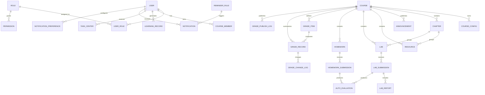

图 7-1 核心数据 ER 图（逻辑实体层）

---

# 8 接口需求

## 8.1 外部接口需求

### 8.1.1 浏览器访问接口

系统通过浏览器向学生、教师、管理员提供页面访问能力。
浏览器端与系统后端通过 HTTP/HTTPS 进行交互。
页面应支持登录、课程访问、任务提交、成绩查询等核心操作。

### 8.1.2 文件存储接口

系统需支持资源文件与提交附件的保存和读取。
本版本采用本地文件系统实现，并保留对象存储抽象接口。
上传接口需校验文件类型、大小、归属对象和上传者身份。

### 8.1.3 通知扩展接口

本版本系统实现站内消息。
邮件或短信通知属于扩展能力，应复用统一通知服务接口。
通知服务接口应接受事件类型、接收用户、消息内容、优先级、提醒规则和用户通知偏好等参数。

### 8.1.4 AI 扩展接口

AI 辅助评阅、AI 问答或学习助手功能属于扩展能力，可通过服务调用接口接入。
该接口属于扩展能力，不得影响核心教学流程的稳定性。

## 8.2 内部接口需求

### 8.2.1 用户权限模块与课程模块接口

用户权限模块应为课程模块提供当前用户身份、角色信息和权限校验结果。
用户权限模块还应提供登录会话状态、角色调整结果和审计查询能力。
课程模块在课程创建、成员管理、资源访问时需依赖该接口。

### 8.2.2 课程模块与学习过程模块接口

课程模块发布课程、资源和任务后，学习过程模块需据此生成学习记录入口和任务中心条目。
学习过程模块应能读取课程与任务元数据。

### 8.2.3 实验模块与成绩模块接口

实验模块在形成有效评分结果后，应能被成绩模块读取并参与汇总。
实验模块需向成绩模块提供实验编号、学生编号、得分、评分状态、成绩发布时间和是否已发布等核心数据。

### 8.2.4 作业/实验模块与自动评测接口

作业模块或实验模块在收到代码类提交后，应调用自动评测服务或评测子流程。
自动评测返回结果后，作业模块或实验模块应保存评测状态、得分、反馈摘要和评测时间。

### 8.2.5 作业模块与成绩模块接口

作业模块在形成有效评分结果后，应能被成绩模块读取并参与汇总。
作业模块需向成绩模块提供作业编号、学生编号、得分、评测状态、教师评分结果和是否已发布等核心数据。

### 8.2.6 作业/实验模块与通知模块接口

当任务发布、截止临近、评分完成、成绩发布时，应向通知模块发送事件。
通知模块根据事件、提醒规则和用户通知偏好生成站内消息记录。

### 8.2.7 成绩模块与通知模块接口

成绩正式发布后，成绩模块需向通知模块发送成绩发布事件。
学生提交成绩异议申请后，成绩模块需向通知模块发送复核申请通知事件。
教师完成成绩异议处理后，成绩模块需向通知模块发送复核结果通知事件。
通知模块应按用户生成通知消息并更新未读状态。

## 8.3 用户界面需求

系统提供统一风格的 Web 端页面。
学生、教师、管理员登录后看到不同导航菜单。
一级导航项数量不超过 8 个。
课程页首屏应集中展示课程信息、资源、实验、作业和公告。
任务页首屏应展示截止时间、提交入口和反馈结果。
成绩页应展示明细、发布状态、异议申请入口与异议处理结果，统计页应展示均分、及格率、完成率和成绩分布。
管理员页应支持账号维护、角色管理、日志查看等基础能力。
主要任务操作入口应在对应页面首屏可见，适合课程项目答辩演示。

---

# 9 需求优先级划分说明

## 9.1 P0

P0 表示必须实现的核心需求。
若某项 P0 需求缺失，系统将无法形成完整教学闭环，或会直接影响课程项目验收。

## 9.2 P1

P1 表示重要但不是最底线的增强需求。
缺失后不会使系统完全不可用，但会明显影响完整性、易用性或演示效果。

## 9.3 P2

P2 表示可选优化需求或后续拓展需求。
本阶段可不优先实现，但适合作为体验增强或项目亮点。

---

# 10 合格性规定与验收标准

## 10.1 功能验收

系统必须覆盖本说明书中 P0 的核心需求。
必须能完整演示以下主流程：登录、教师创建课程并上传资源、学生加入课程、完成实验或作业、获得反馈、查看已发布成绩、学生提交成绩异议、教师处理复核申请、教师查看教学统计分析。
教师端、学生端、管理员端必须都有实际可操作页面和闭环功能。
测试报告中的测试项应能回溯到本说明书中的需求编号。

## 10.2 质量验收

系统在小并发条件下应稳定运行。
不得存在阻断核心流程的严重缺陷。
不得出现任何经测试可复现的权限越界。
文档、系统实现、演示视频和答辩内容应保持一致。
主要查询类页面在演示环境下应满足第 6 章定义的性能指标。
关键操作应具备明确反馈，不得出现静默失败。

## 10.3 Given / When / Then 统一写法要求

后续在测试报告或需求跟踪表中，所有 P0 和 P1 需求至少应对应 1 条 Given / When / Then 验收场景，这样可以直接从需求转为测试用例。

---

# 11 需求可追踪性

为便于后续概要设计、详细设计和测试报告统一编号，本项目建立如下追踪关系：

## 11.1 需求追溯统计与矩阵

本节采用表格记录从用例、功能需求、非功能需求到概要设计、详细设计和测试编号的追溯关系。第 4 章中的 UC 编号表示用户可观察的关键用例，OP 编号表示系统在对应子系统内承担的主要系统操作，后续概要设计、详细设计和测试报告应沿用本表定义。

AUTH 扩展用例用于拆细 UC-AUTH-01 的注册/登录、资料与密码安全、角色权限、审计与安全提示；RTM 以 UC-AUTH-01 作为 AUTH 统计单元，并关联 OP-AUTH-01 ~ OP-AUTH-04。

表 11-1 需求追溯统计/矩阵

| 子系统 | 模块数 | 用例数 | 系统操作数 | UC 范围 | OP 范围 | FR/NFR 范围 | 概要设计编号 | 详细设计编号 | 测试编号前缀 |
| --- | ---: | ---: | ---: | --- | --- | --- | --- | --- | --- |
| AUTH 用户权限与平台安全 | 1 | 1 | 4 | UC-AUTH-01 | OP-AUTH-01 ~ OP-AUTH-04 | FR-UA-01 ~ FR-UA-07 / NFR-UA-01 ~ NFR-UA-05 | 2.5.1、2.6.1、3.2.1、4.1、6 | DSD-AUTH、UI-AUTH、API-AUTH、DB-AUTH | TC-UA |
| CRS 课程与教学资源 | 1 | 2 | 7 | UC-CRS-01 ~ UC-CRS-02 | OP-CRS-01 ~ OP-CRS-07 | FR-CR-01 ~ FR-CR-06 / NFR-CR-01 ~ NFR-CR-05 | 2.5.2、2.6.2、3.2.2、4.2、6 | DSD-CRS、UI-CRS、API-CRS、DB-CRS | TC-CR |
| LRN 学习过程与通知提醒 | 1 | 1 | 5 | UC-LRN-01 | OP-LRN-01 ~ OP-LRN-05 | FR-LN-01 ~ FR-LN-06 / NFR-LN-01 ~ NFR-LN-05 | 2.5.3、2.6.3、3.2.3、4.3、6 | DSD-LRN、UI-LRN、API-LRN、DB-LRN | TC-LN |
| LAB 实训实验模块 | 1 | 2 | 6 | UC-LAB-01 ~ UC-LAB-02 | OP-LAB-01 ~ OP-LAB-06 | FR-LAB-01 ~ FR-LAB-08 / NFR-LAB-01 ~ NFR-LAB-05 | 2.5.4、2.6.4、3.2.4、4.4、6 | DSD-LAB、UI-LAB、API-LAB、DB-LAB | TC-LAB |
| HWK 作业与自动评测模块 | 1 | 2 | 5 | UC-HW-01 ~ UC-HW-02 | OP-HW-01 ~ OP-HW-05 | FR-HW-01 ~ FR-HW-06 / NFR-HW-01 ~ NFR-HW-05 | 2.5.5、2.6.5、3.2.5、4.5、6 | DSD-HWK、UI-HWK、API-HWK、DB-HWK | TC-HW |
| GRD 成绩评价与教学分析 | 1 | 5 | 5 | UC-GR-01 ~ UC-GR-05 | OP-GR-01 ~ OP-GR-05 | FR-GR-01 ~ FR-GR-07 / NFR-GR-01 ~ NFR-GR-05 | 2.5.6、2.6.6、3.2.6、4.6、6 | DSD-GRD、UI-GRD、API-GRD、DB-GRD | TC-GR |
| 合计 | 6 | 13 | 32 | UC-AUTH-01 ~ UC-GR-05 | OP-AUTH-01 ~ OP-GR-05 | 40 项 FR / 30 项 NFR | 概要设计第 2 ~ 6 章 | 详细设计第 3 ~ 9 章 | TC-* |

## 11.2 模块级追踪表

表 11-2 模块级追踪表

| 需求模块      | 需求编号范围                                          | 主要用例                                | 后续设计关注点                                    | 建议测试编号前缀 |
| --------- | ----------------------------------------------- | ----------------------------------- | ------------------------------------------ | -------- |
| 用户权限与平台安全 | FR-UA-01 ~ FR-UA-07 / NFR-UA-01 ~ NFR-UA-05     | UC-AUTH-01 用户登录并按角色访问平台功能（含注册/登录、资料密码、角色权限、审计安全扩展） | 认证机制、角色权限模型、接口鉴权、会话管理、密码安全、审计日志            | TC-UA    |
| 课程与教学资源   | FR-CR-01 ~ FR-CR-06 / NFR-CR-01 ~ NFR-CR-05     | UC-CRS-01 教师创建课程并上传资源、UC-CRS-02 学生加入课程             | 教师课程管理、学生加入课程审核、资源上传、课程资源访问权限设置            | TC-CR    |
| 学习过程与通知提醒 | FR-LN-01 ~ FR-LN-06 / NFR-LN-01 ~ NFR-LN-05     | UC-LRN-01 学生查看学习任务、接收通知提醒、查看学习进度              | 学习进度模型、任务中心状态机、站内通知推送/轮询与已读机制                   | TC-LN    |
| 实训实验模块    | FR-LAB-01 ~ FR-LAB-08 / NFR-LAB-01 ~ NFR-LAB-05 | UC-LAB-01 教师创建并发布实验、UC-LAB-02 学生提交实验并查看评测结果 | 实验状态机设计、自动评测机制、实验报告管理方式、提交版本控制             | TC-LAB   |
| 作业与自动评测模块 | FR-HW-01 ~ FR-HW-06 / NFR-HW-01 ~ NFR-HW-05     | UC-HW-02 教师发布作业、UC-HW-01 学生提交作业并触发自动评测 | 作业模型、评测状态机、重评机制                            | TC-HW    |
| 成绩评价与教学分析 | FR-GR-01 ~ FR-GR-07 / NFR-GR-01 ~ NFR-GR-05     | UC-GR-01 教师发布成绩、UC-GR-02 配置成绩项、UC-GR-03 学生成绩查询、UC-GR-04 成绩异议复核、UC-GR-05 教学分析 | 成绩项模型、成绩计算规则、发布状态控制、成绩变更留痕、成绩异议与复核状态、统计分析维度、权限与数据可见性 | TC-GR    |

需求编号 → 概要设计模块编号 → 详细设计页面/接口编号 → 测试用例编号 → 演示脚本编号

这样可形成从需求到设计、测试、答辩展示的完整闭环。

## 11.3 需求到数据接口验收映射

表 11-3 需求到数据接口验收映射表

| 需求模块 | 关键需求编号 | 关联 UC | 关联 OP | 关联数据章节 | 关联接口章节 | 关联验收章节 | 测试前缀 |
| --- | --- | --- | --- | --- | --- | --- | --- |
| 用户权限与平台安全 | FR-UA-01 ~ FR-UA-07 / NFR-UA-01 ~ NFR-UA-05 | UC-AUTH-01 | OP-AUTH-01 ~ OP-AUTH-04 | 7.2.1、7.2.8 | 8.2.1 | 5.4.1.4、10.1、10.2 | TC-UA |
| 课程与教学资源 | FR-CR-01 ~ FR-CR-06 / NFR-CR-01 ~ NFR-CR-05 | UC-CRS-01、UC-CRS-02 | OP-CRS-01 ~ OP-CRS-07 | 7.2.2、7.2.3 | 8.2.1、8.2.2 | 5.4.2.4、10.1、10.2 | TC-CR |
| 学习过程与通知提醒 | FR-LN-01 ~ FR-LN-06 / NFR-LN-01 ~ NFR-LN-05 | UC-LRN-01 | OP-LRN-01 ~ OP-LRN-05 | 7.2.4、7.2.8 | 8.2.2、8.2.6、8.2.7 | 5.4.3.4、10.1、10.2 | TC-LN |
| 实训实验模块 | FR-LAB-01 ~ FR-LAB-08 / NFR-LAB-01 ~ NFR-LAB-05 | UC-LAB-01、UC-LAB-02 | OP-LAB-01 ~ OP-LAB-06 | 7.2.5、7.2.8 | 8.2.3、8.2.4、8.2.6 | 5.4.4.4、10.1、10.2 | TC-LAB |
| 作业与自动评测模块 | FR-HW-01 ~ FR-HW-06 / NFR-HW-01 ~ NFR-HW-05 | UC-HW-01、UC-HW-02 | OP-HW-01 ~ OP-HW-05 | 7.2.6、7.2.8 | 8.2.4、8.2.5、8.2.6 | 5.4.5.4、10.1、10.2 | TC-HW |
| 成绩评价与教学分析 | FR-GR-01 ~ FR-GR-07 / NFR-GR-01 ~ NFR-GR-05 | UC-GR-01 ~ UC-GR-05 | OP-GR-01 ~ OP-GR-05 | 7.2.7、7.2.8 | 8.2.3、8.2.5、8.2.7 | 5.4.6.4、10.1、10.2 | TC-GR |

逐项编号明细见第 14 章，可用于逐条核查需求是否已映射到对应章节。

## 11.4 逐项轻量 RTM

本节将 RTM 从模块范围细化到逐项 FR/NFR。表中“概要”列沿用概要设计中对应模块的结构、接口和质量章节；“详细”列沿用详细设计第 9 章的 DSD 编号；测试列沿用 `docs/最终提交/测试文档.md` 中的测试编号。若某项 NFR 作用于整个模块，则 UC 和 OP 映射到该模块全部关键用例和系统操作范围。

### 11.4.1 AUTH 用户权限与平台安全 RTM

| 需求编号 | 关联 UC | 关联 OP | 概要 | 详细 | 测试 |
| --- | --- | --- | --- | --- | --- |
| FR-UA-01 | UC-AUTH-01 | OP-AUTH-01、OP-AUTH-02、OP-AUTH-03 | 2.5.1、2.6.1、3.2.1、4.1、6 | DSD-AUTH-01 | TC-UA-01 |
| FR-UA-02 | UC-AUTH-01 | OP-AUTH-04 | 2.5.1、2.6.1、3.2.1、4.1、6 | DSD-AUTH-02 | TC-UA-02 |
| FR-UA-03 | UC-AUTH-01 | OP-AUTH-02、OP-AUTH-04 | 2.5.1、2.6.1、3.2.1、4.1、6 | DSD-AUTH-03 | TC-UA-03 |
| FR-UA-04 | UC-AUTH-01 | OP-AUTH-01、OP-AUTH-02、OP-AUTH-03 | 2.5.1、2.6.1、3.2.1、4.1、6 | DSD-AUTH-04 | TC-UA-04 |
| FR-UA-05 | UC-AUTH-01 | OP-AUTH-02、OP-AUTH-04 | 2.5.1、2.6.1、3.2.1、4.1、6 | DSD-AUTH-05 | TC-UA-05 |
| FR-UA-06 | UC-AUTH-01 | OP-AUTH-04 | 2.5.1、2.6.1、3.2.1、4.1、6 | DSD-AUTH-06 | TC-UA-06 |
| FR-UA-07 | UC-AUTH-01 | OP-AUTH-04 | 2.5.1、2.6.1、3.2.1、4.1、6 | DSD-AUTH-07 | TC-UA-07 |
| NFR-UA-01 | UC-AUTH-01 | OP-AUTH-01 ~ OP-AUTH-04 | 2.5.1、2.6.1、3.2.1、4.1、6 | DSD-AUTH-NFR-01 | TC-UA-N01 |
| NFR-UA-02 | UC-AUTH-01 | OP-AUTH-01 ~ OP-AUTH-04 | 2.5.1、2.6.1、3.2.1、4.1、6 | DSD-AUTH-NFR-02 | TC-UA-N02 |
| NFR-UA-03 | UC-AUTH-01 | OP-AUTH-01 ~ OP-AUTH-04 | 2.5.1、2.6.1、3.2.1、4.1、6 | DSD-AUTH-NFR-03 | TC-UA-N03 |
| NFR-UA-04 | UC-AUTH-01 | OP-AUTH-01 ~ OP-AUTH-04 | 2.5.1、2.6.1、3.2.1、4.1、6 | DSD-AUTH-NFR-04 | TC-UA-N04 |
| NFR-UA-05 | UC-AUTH-01 | OP-AUTH-01 ~ OP-AUTH-04 | 2.5.1、2.6.1、3.2.1、4.1、6 | DSD-AUTH-NFR-05 | TC-UA-N05 |

### 11.4.2 CRS 课程与教学资源 RTM

| 需求编号 | 关联 UC | 关联 OP | 概要 | 详细 | 测试 |
| --- | --- | --- | --- | --- | --- |
| FR-CR-01 | UC-CRS-01 | OP-CRS-01 | 2.5.2、2.6.2、3.2.2、4.2、6 | DSD-CRS-01 | TC-CR-01 |
| FR-CR-02 | UC-CRS-01 | OP-CRS-02 | 2.5.2、2.6.2、3.2.2、4.2、6 | DSD-CRS-02 | TC-CR-02 |
| FR-CR-03 | UC-CRS-01 | OP-CRS-03 | 2.5.2、2.6.2、3.2.2、4.2、6 | DSD-CRS-03 | TC-CR-03 |
| FR-CR-04 | UC-CRS-02 | OP-CRS-04、OP-CRS-05、OP-CRS-07 | 2.5.2、2.6.2、3.2.2、4.2、6 | DSD-CRS-04 | TC-CR-04 |
| FR-CR-05 | UC-CRS-02 | OP-CRS-05、OP-CRS-07 | 2.5.2、2.6.2、3.2.2、4.2、6 | DSD-CRS-05 | TC-CR-05 |
| FR-CR-06 | UC-CRS-01、UC-CRS-02 | OP-CRS-06、OP-CRS-07 | 2.5.2、2.6.2、3.2.2、4.2、6 | DSD-CRS-06 | TC-CR-06 |
| NFR-CR-01 | UC-CRS-01、UC-CRS-02 | OP-CRS-01 ~ OP-CRS-07 | 2.5.2、2.6.2、3.2.2、4.2、6 | DSD-CRS-NFR-01 | TC-CR-N01 |
| NFR-CR-02 | UC-CRS-01、UC-CRS-02 | OP-CRS-01 ~ OP-CRS-07 | 2.5.2、2.6.2、3.2.2、4.2、6 | DSD-CRS-NFR-02 | TC-CR-N02 |
| NFR-CR-03 | UC-CRS-01、UC-CRS-02 | OP-CRS-01 ~ OP-CRS-07 | 2.5.2、2.6.2、3.2.2、4.2、6 | DSD-CRS-NFR-03 | TC-CR-N03 |
| NFR-CR-04 | UC-CRS-01 | OP-CRS-03 | 2.5.2、2.6.2、3.2.2、4.2、6 | DSD-CRS-NFR-04 | TC-CR-N04 |
| NFR-CR-05 | UC-CRS-01、UC-CRS-02 | OP-CRS-01 ~ OP-CRS-07 | 2.5.2、2.6.2、3.2.2、4.2、6 | DSD-CRS-NFR-05 | TC-CR-N05 |

### 11.4.3 LRN 学习过程与通知提醒 RTM

| 需求编号 | 关联 UC | 关联 OP | 概要 | 详细 | 测试 |
| --- | --- | --- | --- | --- | --- |
| FR-LN-01 | UC-LRN-01 | OP-LRN-01 | 2.5.3、2.6.3、3.2.3、4.3、6 | DSD-LRN-01 | TC-LN-01 |
| FR-LN-02 | UC-LRN-01 | OP-LRN-02 | 2.5.3、2.6.3、3.2.3、4.3、6 | DSD-LRN-02 | TC-LN-02 |
| FR-LN-03 | UC-LRN-01 | OP-LRN-02、OP-LRN-03 | 2.5.3、2.6.3、3.2.3、4.3、6 | DSD-LRN-03 | TC-LN-03 |
| FR-LN-04 | UC-LRN-01 | OP-LRN-01、OP-LRN-04 | 2.5.3、2.6.3、3.2.3、4.3、6 | DSD-LRN-04 | TC-LN-04 |
| FR-LN-05 | UC-LRN-01 | OP-LRN-04、OP-LRN-05 | 2.5.3、2.6.3、3.2.3、4.3、6 | DSD-LRN-05 | TC-LN-05 |
| FR-LN-06 | UC-LRN-01 | OP-LRN-01、OP-LRN-05 | 2.5.3、2.6.3、3.2.3、4.3、6 | DSD-LRN-06 | TC-LN-06 |
| NFR-LN-01 | UC-LRN-01 | OP-LRN-01 ~ OP-LRN-05 | 2.5.3、2.6.3、3.2.3、4.3、6 | DSD-LRN-NFR-01 | TC-LN-N01 |
| NFR-LN-02 | UC-LRN-01 | OP-LRN-01 ~ OP-LRN-05 | 2.5.3、2.6.3、3.2.3、4.3、6 | DSD-LRN-NFR-02 | TC-LN-N02 |
| NFR-LN-03 | UC-LRN-01 | OP-LRN-01 ~ OP-LRN-05 | 2.5.3、2.6.3、3.2.3、4.3、6 | DSD-LRN-NFR-03 | TC-LN-N03 |
| NFR-LN-04 | UC-LRN-01 | OP-LRN-01 ~ OP-LRN-05 | 2.5.3、2.6.3、3.2.3、4.3、6 | DSD-LRN-NFR-04 | TC-LN-N04 |
| NFR-LN-05 | UC-LRN-01 | OP-LRN-01 ~ OP-LRN-05 | 2.5.3、2.6.3、3.2.3、4.3、6 | DSD-LRN-NFR-05 | TC-LN-N05 |

### 11.4.4 LAB 实训实验 RTM

| 需求编号 | 关联 UC | 关联 OP | 概要 | 详细 | 测试 |
| --- | --- | --- | --- | --- | --- |
| FR-LAB-01 | UC-LAB-01 | OP-LAB-01、OP-LAB-02、OP-LAB-03 | 2.5.4、2.6.4、3.2.4、4.4、6 | DSD-LAB-01 | TC-LAB-01 ~ TC-LAB-05、TC-LAB-07 |
| FR-LAB-02 | UC-LAB-02 | OP-LAB-04 | 2.5.4、2.6.4、3.2.4、4.4、6 | DSD-LAB-02 | TC-LAB-08 ~ TC-LAB-11 |
| FR-LAB-03 | UC-LAB-02 | OP-LAB-04 | 2.5.4、2.6.4、3.2.4、4.4、6 | DSD-LAB-03 | TC-LAB-12 ~ TC-LAB-14 |
| FR-LAB-04 | UC-LAB-01、UC-LAB-02 | OP-LAB-03、OP-LAB-05 | 2.5.4、2.6.4、3.2.4、4.4、6 | DSD-LAB-04 | TC-LAB-15 ~ TC-LAB-20 |
| FR-LAB-05 | UC-LAB-02 | OP-LAB-04、OP-LAB-06 | 2.5.4、2.6.4、3.2.4、4.4、6 | DSD-LAB-05 | TC-LAB-21 ~ TC-LAB-23 |
| FR-LAB-06 | UC-LAB-02 | OP-LAB-06 | 2.5.4、2.6.4、3.2.4、4.4、6 | DSD-LAB-06 | TC-LAB-24 ~ TC-LAB-27 |
| FR-LAB-07 | UC-LAB-02 | OP-LAB-05、OP-LAB-06 | 2.5.4、2.6.4、3.2.4、4.4、6 | DSD-LAB-07 | TC-LAB-28 ~ TC-LAB-30 |
| FR-LAB-08 | UC-LAB-01、UC-LAB-02 | OP-LAB-06 | 2.5.4、2.6.4、3.2.4、4.4、6 | DSD-LAB-08 | TC-LAB-06、TC-LAB-31 ~ TC-LAB-33 |
| NFR-LAB-01 | UC-LAB-01、UC-LAB-02 | OP-LAB-01 ~ OP-LAB-06 | 2.5.4、2.6.4、3.2.4、4.4、6 | DSD-LAB-NFR-01 | TC-LAB-N01 |
| NFR-LAB-02 | UC-LAB-01、UC-LAB-02 | OP-LAB-01 ~ OP-LAB-06 | 2.5.4、2.6.4、3.2.4、4.4、6 | DSD-LAB-NFR-02 | TC-LAB-N02 |
| NFR-LAB-03 | UC-LAB-01、UC-LAB-02 | OP-LAB-01 ~ OP-LAB-06 | 2.5.4、2.6.4、3.2.4、4.4、6 | DSD-LAB-NFR-03 | TC-LAB-N03 |
| NFR-LAB-04 | UC-LAB-01、UC-LAB-02 | OP-LAB-01 ~ OP-LAB-06 | 2.5.4、2.6.4、3.2.4、4.4、6 | DSD-LAB-NFR-04 | TC-LAB-N04 |
| NFR-LAB-05 | UC-LAB-01、UC-LAB-02 | OP-LAB-01 ~ OP-LAB-06 | 2.5.4、2.6.4、3.2.4、4.4、6 | DSD-LAB-NFR-05 | TC-LAB-N05 |

### 11.4.5 HWK 作业与自动评测 RTM

| 需求编号 | 关联 UC | 关联 OP | 概要 | 详细 | 测试 |
| --- | --- | --- | --- | --- | --- |
| FR-HW-01 | UC-HW-02 | OP-HW-01 | 2.5.5、2.6.5、3.2.5、4.5、6 | DSD-HWK-01 | TC-HW-01 ~ TC-HW-03 |
| FR-HW-02 | UC-HW-01 | OP-HW-02 | 2.5.5、2.6.5、3.2.5、4.5、6 | DSD-HWK-02 | TC-HW-04 ~ TC-HW-06 |
| FR-HW-03 | UC-HW-01 | OP-HW-02、OP-HW-05 | 2.5.5、2.6.5、3.2.5、4.5、6 | DSD-HWK-03 | TC-HW-07、TC-HW-08 |
| FR-HW-04 | UC-HW-01、UC-HW-02 | OP-HW-01、OP-HW-03 | 2.5.5、2.6.5、3.2.5、4.5、6 | DSD-HWK-04 | TC-HW-09 ~ TC-HW-12 |
| FR-HW-05 | UC-HW-01 | OP-HW-04 | 2.5.5、2.6.5、3.2.5、4.5、6 | DSD-HWK-05 | TC-HW-13 ~ TC-HW-15 |
| FR-HW-06 | UC-HW-01、UC-HW-02 | OP-HW-05 | 2.5.5、2.6.5、3.2.5、4.5、6 | DSD-HWK-06 | TC-HW-16 ~ TC-HW-18 |
| NFR-HW-01 | UC-HW-01、UC-HW-02 | OP-HW-01 ~ OP-HW-05 | 2.5.5、2.6.5、3.2.5、4.5、6 | DSD-HWK-N01 | TC-HW-N01 |
| NFR-HW-02 | UC-HW-01、UC-HW-02 | OP-HW-01 ~ OP-HW-05 | 2.5.5、2.6.5、3.2.5、4.5、6 | DSD-HWK-N02 | TC-HW-N02 |
| NFR-HW-03 | UC-HW-01、UC-HW-02 | OP-HW-01 ~ OP-HW-05 | 2.5.5、2.6.5、3.2.5、4.5、6 | DSD-HWK-N03 | TC-HW-N03 |
| NFR-HW-04 | UC-HW-01、UC-HW-02 | OP-HW-01 ~ OP-HW-05 | 2.5.5、2.6.5、3.2.5、4.5、6 | DSD-HWK-N04 | TC-HW-N04 |
| NFR-HW-05 | UC-HW-01、UC-HW-02 | OP-HW-01 ~ OP-HW-05 | 2.5.5、2.6.5、3.2.5、4.5、6 | DSD-HWK-N05 | TC-HW-N05 |

### 11.4.6 GRD 成绩评价与教学分析 RTM

| 需求编号 | 关联 UC | 关联 OP | 概要 | 详细 | 测试 |
| --- | --- | --- | --- | --- | --- |
| FR-GR-01 | UC-GR-02 | OP-GR-01 | 2.5.6、2.6.6、3.2.6、4.6、6 | DSD-GRD-01 | TC-GR-01 |
| FR-GR-02 | UC-GR-01、UC-GR-02 | OP-GR-02 | 2.5.6、2.6.6、3.2.6、4.6、6 | DSD-GRD-02 | TC-GR-02 |
| FR-GR-03 | UC-GR-01、UC-GR-02、UC-GR-04 | OP-GR-01、OP-GR-02、OP-GR-03、OP-GR-05 | 2.5.6、2.6.6、3.2.6、4.6、6 | DSD-GRD-03 | TC-GR-03 |
| FR-GR-04 | UC-GR-01、UC-GR-03、UC-GR-04 | OP-GR-03、OP-GR-05 | 2.5.6、2.6.6、3.2.6、4.6、6 | DSD-GRD-04 | TC-GR-04 |
| FR-GR-05 | UC-GR-01、UC-GR-03 | OP-GR-03、OP-GR-04 | 2.5.6、2.6.6、3.2.6、4.6、6 | DSD-GRD-05 | TC-GR-05 |
| FR-GR-06 | UC-GR-05 | OP-GR-02、OP-GR-04 | 2.5.6、2.6.6、3.2.6、4.6、6 | DSD-GRD-06 | TC-GR-06 |
| FR-GR-07 | UC-GR-04 | OP-GR-05 | 2.5.6、2.6.6、3.2.6、4.6、6 | DSD-GRD-07 | TC-GR-07 |
| NFR-GR-01 | UC-GR-01 ~ UC-GR-05 | OP-GR-01 ~ OP-GR-05 | 2.5.6、2.6.6、3.2.6、4.6、6 | DSD-GRD-08 | TC-GR-08 |
| NFR-GR-02 | UC-GR-01 ~ UC-GR-05 | OP-GR-01 ~ OP-GR-05 | 2.5.6、2.6.6、3.2.6、4.6、6 | DSD-GRD-09 | TC-GR-09 |
| NFR-GR-03 | UC-GR-01 ~ UC-GR-05 | OP-GR-01 ~ OP-GR-05 | 2.5.6、2.6.6、3.2.6、4.6、6 | DSD-GRD-10 | TC-GR-10 |
| NFR-GR-04 | UC-GR-01 ~ UC-GR-05 | OP-GR-01 ~ OP-GR-05 | 2.5.6、2.6.6、3.2.6、4.6、6 | DSD-GRD-11 | TC-GR-11 |
| NFR-GR-05 | UC-GR-01 ~ UC-GR-05 | OP-GR-01 ~ OP-GR-05 | 2.5.6、2.6.6、3.2.6、4.6、6 | DSD-GRD-12 | TC-GR-12 |

# 12 尚未解决的问题

截至 2026 年 4 月 23 日，本版本不存在阻断验收的未决需求。本章列出本版本仍需明确的范围约束与验收边界：

1. 自动评测本版本支持客观题作业、文件提交作业和基础代码提交作业，不支持复杂分布式判题。
2. 实验报告本版本仅支持文件上传，不提供在线编辑。
3. 课程加入流程统一支持两种模式：邀请码直接加入、申请后审核加入，并由课程级配置决定。
4. 通知模块本版本实现站内消息，邮件和短信保留接口扩展位。
5. 资源文件和提交附件本版本统一使用本地文件系统存储，并保留对象存储抽象层。
6. 教学分析本版本展示课程级和班级级基础统计图表，不实现跨课程对比与预测分析。

---

# 13 风险说明

自动评测实现复杂度较高。
应对方式：本版本控制在基础自动评测，不扩展为复杂判题平台。

需求容易膨胀。
应对方式：严格围绕六大模块和 P0 需求推进。

文档与系统可能脱节。
应对方式：后续概要设计、详细设计和测试报告全部沿用本需求编号。

团队分工可能失衡。
应对方式：确保每个模块至少有足够的主要功能点，支撑后续合理认领。

图示与正文可能不一致。
应对方式：所有绘图均以本版本需求编号和对象名称为准，绘制后统一校对术语与关系。

---

# 14 附录：需求编号清单

## 14.1 功能需求编号明细

| 编号 | 名称 | 优先级 | 所属章节 | 测试前缀 |
| --- | --- | --- | --- | --- |
| FR-UA-01 | 用户注册与登录 | P0 | 5.4.1.2 | TC-UA |
| FR-UA-02 | 角色管理与权限分配 | P0 | 5.4.1.2 | TC-UA |
| FR-UA-03 | 身份认证与访问控制 | P0 | 5.4.1.2 | TC-UA |
| FR-UA-04 | 账号信息与密码安全 | P0 | 5.4.1.2 | TC-UA |
| FR-UA-05 | 权限异常处理与安全提示 | P1 | 5.4.1.2 | TC-UA |
| FR-UA-06 | 关键操作审计 | P1 | 5.4.1.2 | TC-UA |
| FR-UA-07 | 平台基础安全防护 | P1 | 5.4.1.2 | TC-UA |
| FR-CR-01 | 课程创建与管理 | P0 | 5.4.2.2 | TC-CR |
| FR-CR-02 | 课程章节与目录管理 | P0 | 5.4.2.2 | TC-CR |
| FR-CR-03 | 教学资源管理 | P0 | 5.4.2.2 | TC-CR |
| FR-CR-04 | 学生加入课程 | P0 | 5.4.2.2 | TC-CR |
| FR-CR-05 | 课程成员管理 | P1 | 5.4.2.2 | TC-CR |
| FR-CR-06 | 课程公告与基础信息展示 | P1 | 5.4.2.2 | TC-CR |
| FR-LN-01 | 学习任务中心展示 | P0 | 5.4.3.2 | TC-LN |
| FR-LN-02 | 学习进度记录与展示 | P0 | 5.4.3.2 | TC-LN |
| FR-LN-03 | 学习行为跟踪 | P1 | 5.4.3.2 | TC-LN |
| FR-LN-04 | 通知分类推送与展示 | P0 | 5.4.3.2 | TC-LN |
| FR-LN-05 | 通知触达与状态管理 | P0 | 5.4.3.2 | TC-LN |
| FR-LN-06 | 定时提醒与规则配置 | P1 | 5.4.3.2 | TC-LN |
| FR-LAB-01 | 实验创建与发布 | P0 | 5.4.4.2 | TC-LAB |
| FR-LAB-02 | 学生实验查看与提交 | P0 | 5.4.4.2 | TC-LAB |
| FR-LAB-03 | 提交历史与版本管理 | P0 | 5.4.4.2 | TC-LAB |
| FR-LAB-04 | 实验自动评测 | P0 | 5.4.4.2 | TC-LAB |
| FR-LAB-05 | 实验报告管理 | P1 | 5.4.4.2 | TC-LAB |
| FR-LAB-06 | 教师评分与评语 | P0 | 5.4.4.2 | TC-LAB |
| FR-LAB-07 | 实验结果展示与学生反馈 | P0 | 5.4.4.2 | TC-LAB |
| FR-LAB-08 | 实验统计与查询 | P1 | 5.4.4.2 | TC-LAB |
| FR-HW-01 | 作业创建与发布 | P0 | 5.4.5.2 | TC-HW |
| FR-HW-02 | 学生作业查看与提交 | P0 | 5.4.5.2 | TC-HW |
| FR-HW-03 | 提交历史管理 | P0 | 5.4.5.2 | TC-HW |
| FR-HW-04 | 自动评测 | P0 | 5.4.5.2 | TC-HW |
| FR-HW-05 | 教师批阅与重评 | P1 | 5.4.5.2 | TC-HW |
| FR-HW-06 | 作业反馈与结果展示 | P0 | 5.4.5.2 | TC-HW |
| FR-GR-01 | 成绩项配置与计算规则 | P0 | 5.4.6.2 | TC-GR |
| FR-GR-02 | 成绩汇总与总评生成 | P0 | 5.4.6.2 | TC-GR |
| FR-GR-03 | 教师成绩管理 | P0 | 5.4.6.2 | TC-GR |
| FR-GR-04 | 成绩发布与状态控制 | P0 | 5.4.6.2 | TC-GR |
| FR-GR-05 | 学生成绩查询与结果展示 | P0 | 5.4.6.2 | TC-GR |
| FR-GR-06 | 班级成绩统计与教学分析 | P1 | 5.4.6.2 | TC-GR |
| FR-GR-07 | 成绩异议与复核申请 | P1 | 5.4.6.2 | TC-GR |

## 14.2 非功能需求编号明细

| 编号 | 名称 | 所属章节 | 测试前缀 |
| --- | --- | --- | --- |
| NFR-UA-01 | 安全性 | 6.1 | TC-UA |
| NFR-UA-02 | 可靠性 | 6.1 | TC-UA |
| NFR-UA-03 | 可用性 | 6.1 | TC-UA |
| NFR-UA-04 | 性能 | 6.1 | TC-UA |
| NFR-UA-05 | 可测试性 | 6.1 | TC-UA |
| NFR-CR-01 | 可用性 | 6.2 | TC-CR |
| NFR-CR-02 | 性能 | 6.2 | TC-CR |
| NFR-CR-03 | 可靠性 | 6.2 | TC-CR |
| NFR-CR-04 | 兼容性 | 6.2 | TC-CR |
| NFR-CR-05 | 可测试性 | 6.2 | TC-CR |
| NFR-LN-01 | 实时性 | 6.3 | TC-LN |
| NFR-LN-02 | 性能 | 6.3 | TC-LN |
| NFR-LN-03 | 可靠性 | 6.3 | TC-LN |
| NFR-LN-04 | 易用性 | 6.3 | TC-LN |
| NFR-LN-05 | 可追踪性 | 6.3 | TC-LN |
| NFR-LAB-01 | 可靠性 | 6.4 | TC-LAB |
| NFR-LAB-02 | 性能 | 6.4 | TC-LAB |
| NFR-LAB-03 | 可追踪性 | 6.4 | TC-LAB |
| NFR-LAB-04 | 安全性 | 6.4 | TC-LAB |
| NFR-LAB-05 | 可测试性 | 6.4 | TC-LAB |
| NFR-HW-01 | 可靠性 | 6.5 | TC-HW |
| NFR-HW-02 | 性能 | 6.5 | TC-HW |
| NFR-HW-03 | 可追踪性 | 6.5 | TC-HW |
| NFR-HW-04 | 安全性 | 6.5 | TC-HW |
| NFR-HW-05 | 可测试性 | 6.5 | TC-HW |
| NFR-GR-01 | 可靠性 | 6.6 | TC-GR |
| NFR-GR-02 | 性能 | 6.6 | TC-GR |
| NFR-GR-03 | 可追踪性 | 6.6 | TC-GR |
| NFR-GR-04 | 安全性 | 6.6 | TC-GR |
| NFR-GR-05 | 可测试性 | 6.6 | TC-GR |

## 14.3 用例与系统操作编号明细

表 14-3 UC 编号明细

AUTH 扩展用例见 4.2，其需求和操作归入 UC-AUTH-01、OP-AUTH-01 ~ OP-AUTH-04。

| UC 编号 | 用例名称 | 所属子系统 | 关联章节 | 测试前缀 |
| --- | --- | --- | --- | --- |
| UC-AUTH-01 | 用户登录并按角色访问平台功能 | AUTH | 4.2、5.4.1 | TC-UA |
| UC-CRS-01 | 教师创建课程并上传资源 | CRS | 4.3、5.4.2 | TC-CR |
| UC-CRS-02 | 学生加入课程 | CRS | 4.4、5.4.2 | TC-CR |
| UC-LRN-01 | 学生开始学习并查看学习任务、通知和进度 | LRN | 4.5、5.4.3 | TC-LN |
| UC-LAB-01 | 教师创建并发布实验 | LAB | 4.6、5.4.4 | TC-LAB |
| UC-HW-01 | 学生提交作业并触发自动评测 | HWK | 4.7、5.4.5 | TC-HW |
| UC-GR-01 | 教师汇总并发布成绩 | GRD | 4.8、5.4.6 | TC-GR |
| UC-LAB-02 | 学生提交实验并查看评测结果 | LAB | 4.9、5.4.4 | TC-LAB |
| UC-HW-02 | 教师发布作业 | HWK | 4.10、5.4.5 | TC-HW |
| UC-GR-02 | 教师配置成绩项与计算规则 | GRD | 4.11、5.4.6 | TC-GR |
| UC-GR-03 | 学生查询已发布成绩 | GRD | 4.12、5.4.6 | TC-GR |
| UC-GR-04 | 成绩异议提交与复核处理 | GRD | 4.13、5.4.6 | TC-GR |
| UC-GR-05 | 教师查看教学分析 | GRD | 4.14、5.4.6 | TC-GR |

表 14-4 OP 编号逐项明细

本表展开表 11-1 中的 OP 范围，系统操作总数为 32 项。

| OP 编号 | 名称 | 所属子系统 | 关联 FR | 关联 API/页面 | 关联 TC 或测试套件 |
| --- | --- | --- | --- | --- | --- |
| OP-AUTH-01 | 提交登录请求 | AUTH | FR-UA-01、FR-UA-04 | 登录页、8.2.1 用户权限模块与课程模块接口 | TC-UA |
| OP-AUTH-02 | 校验账号密码与账号状态 | AUTH | FR-UA-01、FR-UA-03、FR-UA-04、FR-UA-05 | 登录页、权限异常提示页、8.2.1 用户权限模块与课程模块接口 | TC-UA |
| OP-AUTH-03 | 创建会话或访问令牌 | AUTH | FR-UA-01、FR-UA-03、FR-UA-04 | 登录页、角色首页、8.2.1 用户权限模块与课程模块接口 | TC-UA |
| OP-AUTH-04 | 按角色加载菜单并持续鉴权 | AUTH | FR-UA-02、FR-UA-03、FR-UA-05、FR-UA-06、FR-UA-07 | 学生/教师/管理员首页、课程/作业/实验/成绩页面、8.2.1 用户权限模块与课程模块接口 | TC-UA |
| OP-CRS-01 | 创建和维护课程基础信息 | CRS | FR-CR-01、FR-CR-06 | 教师课程管理页、课程创建/编辑页、8.2.1 用户权限模块与课程模块接口 | TC-CR |
| OP-CRS-02 | 维护课程章节目录 | CRS | FR-CR-02、FR-CR-06 | 课程章节管理页、课程主页、8.2.2 课程模块与学习过程模块接口 | TC-CR |
| OP-CRS-03 | 上传和管理教学资源 | CRS | FR-CR-03 | 资源管理页、资源上传入口、课程资源页、8.1.2 文件存储接口 | TC-CR |
| OP-CRS-04 | 处理学生加入课程 | CRS | FR-CR-04、FR-CR-05 | 课程列表页、课程加入页、课程成员页、8.2.1 用户权限模块与课程模块接口 | TC-CR |
| OP-CRS-05 | 审核和维护课程成员 | CRS | FR-CR-04、FR-CR-05 | 课程成员管理页、加入申请审核页、8.2.1 用户权限模块与课程模块接口 | TC-CR |
| OP-CRS-06 | 发布课程公告与展示基础信息 | CRS | FR-CR-06 | 课程公告编辑页、课程主页、8.2.2 课程模块与学习过程模块接口 | TC-CR |
| OP-CRS-07 | 提供课程权限和成员关系校验 | CRS | FR-CR-04、FR-CR-05、FR-CR-06 | 课程资源页、任务页、8.2.1 用户权限模块与课程模块接口、8.2.2 课程模块与学习过程模块接口 | TC-CR |
| OP-LRN-01 | 聚合个人学习任务 | LRN | FR-LN-01、FR-LN-04、FR-LN-06 | 学习中心页、课程主页、8.2.2 课程模块与学习过程模块接口、8.2.6 作业/实验模块与通知模块接口 | TC-LN |
| OP-LRN-02 | 保存并展示学习进度 | LRN | FR-LN-02、FR-LN-03 | 学习中心页、课程资源页、学习仪表盘、8.2.2 课程模块与学习过程模块接口 | TC-LN |
| OP-LRN-03 | 记录学习行为统计 | LRN | FR-LN-02、FR-LN-03 | 学习仪表盘、教师课程进度统计页、7.2.4 学习过程数据 | TC-LN |
| OP-LRN-04 | 生成和展示站内通知 | LRN | FR-LN-04、FR-LN-05、FR-LN-06 | 通知中心页、页面弹窗、8.1.3 通知服务接口、8.2.6 作业/实验模块与通知模块接口、8.2.7 成绩模块与通知模块接口 | TC-LN |
| OP-LRN-05 | 处理通知状态和提醒规则 | LRN | FR-LN-04、FR-LN-05、FR-LN-06 | 通知中心页、通知偏好设置页、8.1.3 通知服务接口、7.2.8 通知与日志数据 | TC-LN |
| OP-LAB-01 | 创建实验任务 | LAB | FR-LAB-01 | 教师实验管理页、实验创建页、8.2.1 用户权限模块与课程模块接口 | TC-LAB |
| OP-LAB-02 | 发布实验并通知学生 | LAB | FR-LAB-01、FR-LAB-02 | 实验发布页、课程实验页、8.2.6 作业/实验模块与通知模块接口 | TC-LAB |
| OP-LAB-03 | 维护实验附件与测试用例 | LAB | FR-LAB-01、FR-LAB-04、FR-LAB-05 | 实验编辑页、测试用例配置页、8.1.2 文件存储接口、8.2.4 作业/实验模块与自动评测接口 | TC-LAB |
| OP-LAB-04 | 接收实验提交和报告 | LAB | FR-LAB-02、FR-LAB-03、FR-LAB-05 | 学生实验详情页、实验提交页、实验报告上传入口、8.1.2 文件存储接口 | TC-LAB |
| OP-LAB-05 | 触发实验自动评测 | LAB | FR-LAB-04、FR-LAB-07 | 实验提交页、评测状态页、8.2.4 作业/实验模块与自动评测接口 | TC-LAB |
| OP-LAB-06 | 教师评分、反馈和实验统计 | LAB | FR-LAB-06、FR-LAB-07、FR-LAB-08 | 教师实验评分页、实验统计页、学生实验结果页、8.2.3 实验模块与成绩模块接口 | TC-LAB |
| OP-HW-01 | 创建和发布作业 | HWK | FR-HW-01、FR-HW-02、FR-HW-04 | 教师作业管理页、作业创建/发布页、课程作业页、8.2.6 作业/实验模块与通知模块接口 | TC-HW |
| OP-HW-02 | 接收作业提交 | HWK | FR-HW-02、FR-HW-03 | 学生作业详情页、作业提交页、提交历史页、8.1.2 文件存储接口 | TC-HW |
| OP-HW-03 | 触发作业自动评测 | HWK | FR-HW-04、FR-HW-06 | 作业提交页、评测状态页、8.2.4 作业/实验模块与自动评测接口 | TC-HW |
| OP-HW-04 | 教师批阅或重评作业 | HWK | FR-HW-05、FR-HW-06 | 教师作业批阅页、重评入口、8.2.5 作业模块与成绩模块接口 | TC-HW |
| OP-HW-05 | 展示作业反馈与结果 | HWK | FR-HW-03、FR-HW-06 | 学生作业结果页、提交历史页、8.2.5 作业模块与成绩模块接口 | TC-HW |
| OP-GR-01 | 配置成绩项和计算规则 | GRD | FR-GR-01、FR-GR-03 | 教师成绩项配置页、成绩管理页、8.2.3 实验模块与成绩模块接口、8.2.5 作业模块与成绩模块接口 | TC-GR |
| OP-GR-02 | 同步来源成绩并生成总评 | GRD | FR-GR-02、FR-GR-03、FR-GR-06 | 成绩汇总页、成绩计算任务、8.2.3 实验模块与成绩模块接口、8.2.5 作业模块与成绩模块接口 | TC-GR |
| OP-GR-03 | 发布成绩并保留发布记录 | GRD | FR-GR-03、FR-GR-04、FR-GR-05 | 教师成绩发布页、学生成绩页、8.2.7 成绩模块与通知模块接口 | TC-GR |
| OP-GR-04 | 查询成绩和教学分析 | GRD | FR-GR-05、FR-GR-06 | 学生成绩页、教师成绩总表、教学分析页、8.2.3 实验模块与成绩模块接口、8.2.5 作业模块与成绩模块接口 | TC-GR |
| OP-GR-05 | 处理成绩异议与复核 | GRD | FR-GR-03、FR-GR-04、FR-GR-07 | 成绩异议申请页、教师复核处理页、8.2.7 成绩模块与通知模块接口 | TC-GR |

表 14-5 系统操作合约

表 14-5 列出各关键用例对应的系统操作映射；细化用例均映射至表 14-4 所列 32 项系统操作。

| OP 编号 | 操作签名 | 触发 UC | 输入 | 前置条件 | 后置条件 | 关联 FR | 异常结果 |
| --- | --- | --- | --- | --- | --- | --- | --- |
| OP-AUTH-01 | `submitLogin(credentials)` | UC-AUTH-01 | 账号、密码、客户端上下文 | 用户处于未登录或登录失效状态 | 登录请求被 AUTH 接收并进入校验 | FR-UA-01、FR-UA-04 | 参数缺失或格式错误返回认证失败提示 |
| OP-AUTH-02 | `verifyCredential(account, password)` | UC-AUTH-01 | 账号、密码、账号状态 | 登录请求已提交，账号数据可读取 | 产生身份校验结果和账号状态判断 | FR-UA-01、FR-UA-03、FR-UA-04、FR-UA-05 | 密码错误、账号冻结、账号禁用返回受控错误 |
| OP-AUTH-03 | `createSession(userId)` | UC-AUTH-01 | 用户编号、角色、权限摘要 | 身份校验通过且账号状态正常 | 创建会话或访问令牌，返回当前用户上下文 | FR-UA-01、FR-UA-03、FR-UA-04 | 会话创建失败返回登录失败并记录审计 |
| OP-AUTH-04 | `loadRoleMenuAndAuthorize(userId, resource)` | UC-AUTH-01 | 用户编号、角色、权限点、目标资源 | 用户已登录或正在访问受保护资源 | 返回菜单入口或权限校验结果，关键操作留痕 | FR-UA-02、FR-UA-03、FR-UA-05、FR-UA-06、FR-UA-07 | 无权限、会话过期或越权访问返回 401/403 |
| OP-CRS-01 | `saveCourse(courseForm)` | UC-CRS-01 | 课程名称、简介、学期、封面、加入方式 | 教师已登录并拥有课程创建权限 | 创建或更新课程基础信息，教师成为课程负责人 | FR-CR-01、FR-CR-06 | 字段缺失、状态非法或无权限返回错误 |
| OP-CRS-02 | `saveChapterTree(courseId, chapters)` | UC-CRS-01 | 课程编号、章节标题、父子关系、排序 | 课程存在且教师可管理 | 保存课程章节目录并可在课程页展示 | FR-CR-02、FR-CR-06 | 课程不存在、排序冲突或无权限返回错误 |
| OP-CRS-03 | `uploadResource(courseId, resourceFile)` | UC-CRS-01 | 课程编号、章节编号、资源类型、文件或链接 | 教师可管理课程，文件服务可用 | 保存资源元数据和文件引用 | FR-CR-03 | 文件过大、类型不支持、上传失败返回错误 |
| OP-CRS-04 | `joinCourse(courseId, joinPayload)` | UC-CRS-02 | 课程编号、邀请码或申请信息、学生身份 | 学生已登录，课程允许加入 | 创建 ACTIVE 成员或 PENDING 加入申请 | FR-CR-04、FR-CR-05 | 课程关闭、人数已满、邀请码错误或重复加入返回错误 |
| OP-CRS-05 | `reviewCourseMember(applicationId, decision)` | UC-CRS-02 | 加入申请编号、审核结果、教师身份 | 教师可管理课程且申请待处理 | 更新成员状态并记录审核结果 | FR-CR-04、FR-CR-05 | 申请不存在、状态不允许或无权限返回错误 |
| OP-CRS-06 | `publishCourseAnnouncement(courseId, announcement)` | UC-CRS-01、UC-CRS-02 | 课程编号、公告标题、内容、置顶状态 | 教师可管理课程 | 公告保存并在课程主页展示 | FR-CR-06 | 公告内容非法、课程不存在或无权限返回错误 |
| OP-CRS-07 | `checkCoursePermission(userId, courseId, action)` | UC-CRS-01、UC-CRS-02、UC-LAB-01、UC-LAB-02、UC-HW-01、UC-HW-02、UC-GR-01 ~ UC-GR-05 | 用户编号、课程编号、操作类型 | 用户已通过 AUTH 身份校验 | 返回课程成员、教师管理或只读权限结果 | FR-CR-04、FR-CR-05、FR-CR-06 | 非成员、课程关闭或权限不足返回拒绝 |
| OP-LRN-01 | `aggregateLearningTasks(userId)` | UC-LRN-01、UC-HW-02 | 用户编号、课程成员关系、任务来源 | 用户已登录并加入至少一门课程 | 返回个人任务列表和任务快照 | FR-LN-01、FR-LN-04、FR-LN-06 | 无课程、来源任务异常或分页参数非法返回空态或错误 |
| OP-LRN-02 | `saveLearningProgress(progress)` | UC-LRN-01 | 用户编号、课程编号、资源或任务位置 | 学生为课程成员 | 保存或更新学习进度，支持断点恢复 | FR-LN-02、FR-LN-03 | 非成员、来源不存在或进度值非法返回错误 |
| OP-LRN-03 | `recordLearningBehavior(event)` | UC-LRN-01 | 用户编号、课程编号、行为类型、时长 | 用户已登录且事件来源合法 | 写入学习行为记录并可用于统计 | FR-LN-02、FR-LN-03 | 非成员、非法时长或超过限流返回错误 |
| OP-LRN-04 | `createNotification(event)` | UC-LRN-01、UC-LAB-01、UC-LAB-02、UC-HW-02、UC-GR-01、UC-GR-04 | 事件类型、来源模块、来源编号、接收人、跳转地址 | 业务事件合法且通知服务可用 | 生成站内通知并维护未读状态 | FR-LN-04、FR-LN-05、FR-LN-06 | 事件重复幂等处理，事件非法或通知写入失败返回错误或补偿记录 |
| OP-LRN-05 | `updateNotificationState(notificationId, action)` | UC-LRN-01、UC-GR-03 | 通知编号、当前用户、已读或删除动作 | 用户已登录且通知属于本人 | 更新通知状态并写入状态日志 | FR-LN-04、FR-LN-05、FR-LN-06 | 通知不存在、越权或状态非法返回错误 |
| OP-LAB-01 | `createExperiment(experimentForm)` | UC-LAB-01 | 课程编号、标题、说明、开放时间、截止时间 | 教师已登录并拥有课程管理权限 | 创建实验草稿 | FR-LAB-01 | 字段非法、课程不存在或无权限返回错误 |
| OP-LAB-02 | `publishExperiment(experimentId)` | UC-LAB-01 | 实验编号、发布人身份 | 实验为草稿且教师可管理课程 | 实验状态变为已发布并触发通知事件 | FR-LAB-01、FR-LAB-02 | 实验不存在、状态不允许或通知失败返回错误 |
| OP-LAB-03 | `saveExperimentArtifacts(experimentId, artifacts)` | UC-LAB-01 | 实验附件、报告要求、测试用例、语言配置 | 实验存在且教师可编辑 | 保存附件、报告配置和测试用例 | FR-LAB-01、FR-LAB-04、FR-LAB-05 | 附件上传失败、测试用例非法或语言不支持返回错误 |
| OP-LAB-04 | `submitExperiment(experimentId, submission)` | UC-LAB-02 | 实验编号、代码、文件、报告、学生身份 | 学生为课程成员，实验已发布且未截止 | 保存提交记录、版本和附件元数据 | FR-LAB-02、FR-LAB-03、FR-LAB-05 | 逾期、空提交、文件非法、非成员或越权返回错误 |
| OP-LAB-05 | `evaluateExperimentSubmission(submissionId)` | UC-LAB-02 | 提交编号、测试用例、评测配置 | 提交记录存在且需要自动评测 | 写入评测状态、得分和失败摘要 | FR-LAB-04、FR-LAB-07 | 编译错误、运行错误、超时或评测服务异常记录失败状态 |
| OP-LAB-06 | `gradeAndSummarizeExperiment(experimentId, gradingPayload)` | UC-LAB-02 | 实验编号、提交记录、教师评分、统计条件 | 教师可管理课程，提交和评测记录存在 | 保存教师评分、反馈、统计结果和来源成绩 | FR-LAB-06、FR-LAB-07、FR-LAB-08 | 分数非法、无权限、提交不存在或统计失败返回错误 |
| OP-HW-01 | `createAndPublishHomework(homeworkForm)` | UC-HW-02 | 课程编号、标题、题目、附件、测试用例、发布配置 | 教师已登录并拥有课程管理权限 | 保存作业并在发布后生成任务和通知 | FR-HW-01、FR-HW-02、FR-HW-04 | 字段非法、测试用例非法、课程无权限或通知失败返回错误 |
| OP-HW-02 | `submitHomework(homeworkId, submission)` | UC-HW-01 | 作业编号、文本、附件、代码、学生身份 | 学生为课程成员，作业已发布且可提交 | 保存作业提交和提交历史 | FR-HW-02、FR-HW-03 | 逾期、格式错误、文件过大、非成员或越权返回错误 |
| OP-HW-03 | `evaluateHomeworkSubmission(submissionId)` | UC-HW-01 | 提交编号、答案、代码、测试用例 | 提交记录存在且作业需要自动评测 | 保存评测结果、自动分和反馈摘要 | FR-HW-04、FR-HW-06 | 客观题答案非法、编译错误、运行错误、超时或评测异常记录失败状态 |
| OP-HW-04 | `reviewHomeworkSubmission(submissionId, review)` | UC-HW-01 | 提交编号、教师评分、评语、重评理由 | 教师可管理课程，提交记录存在 | 保存人工批阅、重评记录和成绩来源 | FR-HW-05、FR-HW-06 | 分数非法、状态不允许、提交不存在或无权限返回错误 |
| OP-HW-05 | `getHomeworkFeedback(homeworkId, studentId)` | UC-HW-01 | 作业编号、学生编号、查看人身份 | 学生查看本人或教师查看授权课程 | 返回提交历史、评测结果和可见反馈 | FR-HW-03、FR-HW-06 | 成绩未公开、学生查看他人提交或作业不存在返回错误 |
| OP-GR-01 | `saveGradeRule(courseId, gradeRule)` | UC-GR-02 | 课程编号、成绩项、来源、权重、满分 | 教师拥有课程成绩管理权限 | 保存成绩项和计算规则 | FR-GR-01、FR-GR-03 | 权重非法、来源不存在、重复名称或无权限返回错误 |
| OP-GR-02 | `syncAndCalculateGrades(courseId)` | UC-GR-01、UC-GR-02、UC-GR-05 | 课程编号、成绩项规则、LAB/HWK 来源成绩 | 成绩项已配置，来源模块可读取 | 同步来源成绩并生成成绩记录和总评 | FR-GR-02、FR-GR-03、FR-GR-06 | 来源缺失、未评分、规则非法或计算失败返回错误 |
| OP-GR-03 | `publishGrades(courseId, publishScope)` | UC-GR-01、UC-GR-04 | 课程编号、发布范围、教师身份 | 成绩已计算且教师确认发布 | 成绩状态变为已发布，生成发布记录和通知事件 | FR-GR-03、FR-GR-04、FR-GR-05 | 存在未评分任务、重复发布、无权限或通知失败返回错误 |
| OP-GR-04 | `queryGradesAndAnalysis(query)` | UC-GR-03、UC-GR-05 | 课程编号、学生编号、成绩项、统计条件 | 用户已登录并通过课程权限校验 | 返回学生成绩、教师总表或教学分析结果 | FR-GR-05、FR-GR-06 | 未发布不可见、越权访问、统计维度非法或数据缺失返回错误 |
| OP-GR-05 | `handleGradeReview(reviewRequest)` | UC-GR-04 | 异议目标、理由、处理结论、调整分数 | 成绩已发布且申请人有权限，教师可处理课程 | 生成或更新复核记录，必要时写入成绩变更日志 | FR-GR-03、FR-GR-04、FR-GR-07 | 重复待处理申请、目标成绩不可复核、调整分数非法或无权限返回错误 |
