# 软件需求规格说明书

## 封面信息

课程名称：软件工程基础

项目名称：在线教学与实训平台

文档名称：软件需求规格说明书

文档编号：SRS-01

编写人：黄嘉亮

参与编写：全体组员

审核人：赵贵彬

提交日期：2026 年 4 月 26 日

---

## 目录

<!-- @import "[TOC]" {cmd="toc" depthFrom=1 depthTo=6 orderedList=false} -->

<!-- code_chunk_output -->
- [软件需求规格说明书](#软件需求规格说明书)
  - [封面信息](#封面信息)
  - [目录](#目录)
- [1 引言](#1-引言)
  - [1.1 编写目的](#11-编写目的)
  - [1.2 项目背景](#12-项目背景)
  - [1.3 预期读者](#13-预期读者)
  - [1.4 参考资料](#14-参考资料)
  - [1.5 术语说明](#15-术语说明)
  - [1.6 文档概述](#16-文档概述)
- [2 产品整体描述](#2-产品整体描述)
  - [2.1 系统目标](#21-系统目标)
  - [2.2 产品定位](#22-产品定位)
  - [2.3 产品功能](#23-产品功能)
  - [2.4 用户角色](#24-用户角色)
    - [2.4.1 学生](#241-学生)
    - [2.4.2 教师](#242-教师)
    - [2.4.3 管理员](#243-管理员)
  - [2.5 运行环境](#25-运行环境)
  - [2.6 技术与实现约束](#26-技术与实现约束)
  - [2.7 业务边界](#27-业务边界)
  - [2.8 系统上下文图说明](#28-系统上下文图说明)
- [3 需求说明](#3-需求说明)
  - [3.1 核心业务流程](#31-核心业务流程)
    - [3.1.1 核心业务用例图](#311-核心业务用例图)
    - [3.1.2 业务流程关系图（辅助说明）](#312-业务流程关系图（辅助说明）)
    - [3.1.3 关键用例统一索引与追溯表](#313-关键用例统一索引与追溯表)
  - [3.2 参与者](#32-参与者)
  - [3.3 关键用例描述](#33-关键用例描述)
    - [3.3.1 UC-AUTH-01 关键用例一：用户登录并按角色访问平台功能](#331-uc-auth-01-关键用例一：用户登录并按角色访问平台功能)
      - [3.3.1.1 登录系统顺序图](#3311-登录系统顺序图)
      - [3.3.1.2 系统操作合约](#3312-系统操作合约)
      - [3.3.1.3 AUTH 业务场景系统顺序图与状态图](#3313-auth-业务场景系统顺序图与状态图)
        - [3.3.1.3.1 SC-AUTH-01 学生自助注册（UC-AUTH-01-R）](#33131-sc-auth-01-学生自助注册（uc-auth-01-r）)
        - [3.3.1.3.2 SC-AUTH-02 账号密码登录（UC-AUTH-01-R）](#33132-sc-auth-02-账号密码登录（uc-auth-01-r）)
        - [3.3.1.3.3 SC-AUTH-03 退出登录（UC-AUTH-01-R）](#33133-sc-auth-03-退出登录（uc-auth-01-r）)
        - [3.3.1.3.4 SC-AUTH-04 持续鉴权与当前用户上下文（UC-AUTH-01-R）](#33134-sc-auth-04-持续鉴权与当前用户上下文（uc-auth-01-r）)
        - [3.3.1.3.5 SC-AUTH-05 个人资料查看与修改（UC-AUTH-01-P）](#33135-sc-auth-05-个人资料查看与修改（uc-auth-01-p）)
        - [3.3.1.3.6 SC-AUTH-06 修改密码（UC-AUTH-01-P）](#33136-sc-auth-06-修改密码（uc-auth-01-p）)
        - [3.3.1.3.7 SC-AUTH-07 管理员用户与账号状态管理（UC-AUTH-01-A）](#33137-sc-auth-07-管理员用户与账号状态管理（uc-auth-01-a）)
        - [3.3.1.3.8 SC-AUTH-08 用户角色分配（UC-AUTH-01-A）](#33138-sc-auth-08-用户角色分配（uc-auth-01-a）)
        - [3.3.1.3.9 SC-AUTH-09 角色与角色权限维护（UC-AUTH-01-A）](#33139-sc-auth-09-角色与角色权限维护（uc-auth-01-a）)
        - [3.3.1.3.10 SC-AUTH-10 安全异常拦截（UC-AUTH-01-S）](#331310-sc-auth-10-安全异常拦截（uc-auth-01-s）)
        - [3.3.1.3.11 SC-AUTH-11 关键操作审计写入与查询（UC-AUTH-01-S）](#331311-sc-auth-11-关键操作审计写入与查询（uc-auth-01-s）)
        - [3.3.1.3.12 状态图与活动图](#331312-状态图与活动图)
    - [3.3.2 UC-CRS-01 关键用例二：教师创建课程并上传资源](#332-uc-crs-01-关键用例二：教师创建课程并上传资源)
      - [3.3.2.1 课程创建与资源维护系统顺序图](#3321-课程创建与资源维护系统顺序图)
      - [3.3.2.2 系统操作合约](#3322-系统操作合约)
      - [3.3.2.3 CRS 独立业务场景图组（一）](#3323-crs-独立业务场景图组（一）)
        - [3.3.2.3.1 场景一：课程创建与维护（CRS-SC-01）](#33231-场景一：课程创建与维护（crs-sc-01）)
        - [3.3.2.3.2 场景二：章节目录管理（CRS-SC-02）](#33232-场景二：章节目录管理（crs-sc-02）)
        - [3.3.2.3.3 场景三：资源上传与下载（CRS-SC-03）](#33233-场景三：资源上传与下载（crs-sc-03）)
        - [3.3.2.3.4 场景八：公告发布与置顶（CRS-SC-08）](#33234-场景八：公告发布与置顶（crs-sc-08）)
    - [3.3.3 UC-CRS-02 关键用例三：学生加入课程](#333-uc-crs-02-关键用例三：学生加入课程)
      - [3.3.3.1 课程加入系统顺序图](#3331-课程加入系统顺序图)
      - [3.3.3.2 系统操作合约](#3332-系统操作合约)
      - [3.3.3.3 CRS 独立业务场景图组（二）](#3333-crs-独立业务场景图组（二）)
        - [3.3.3.3.1 场景四：公开加入课程（CRS-SC-04）](#33331-场景四：公开加入课程（crs-sc-04）)
        - [3.3.3.3.2 场景五：邀请码加入课程（CRS-SC-05）](#33332-场景五：邀请码加入课程（crs-sc-05）)
        - [3.3.3.3.3 场景六：审批加入课程（CRS-SC-06）](#33333-场景六：审批加入课程（crs-sc-06）)
        - [3.3.3.3.4 场景七：成员管理（CRS-SC-07）](#33334-场景七：成员管理（crs-sc-07）)
        - [3.3.3.3.5 场景九：课程首页摘要（CRS-SC-09）](#33335-场景九：课程首页摘要（crs-sc-09）)
    - [3.3.4 UC-LRN-01 关键用例四：学生开始学习并查看学习任务/通知/进度](#334-uc-lrn-01-关键用例四：学生开始学习并查看学习任务通知进度)
      - [3.3.4.1 UC-LRN-01 业务场景拆分与边界](#3341-uc-lrn-01-业务场景拆分与边界)
      - [3.3.4.2 学习任务与进度系统顺序图](#3342-学习任务与进度系统顺序图)
      - [3.3.4.3 通知反馈系统顺序图](#3343-通知反馈系统顺序图)
      - [3.3.4.4 系统操作合约](#3344-系统操作合约)
    - [3.3.5 UC-LAB-01 关键用例五：教师发布实验](#335-uc-lab-01-关键用例五：教师发布实验)
      - [3.3.5.1 实验创建与发布系统顺序图](#3351-实验创建与发布系统顺序图)
      - [3.3.5.2 系统操作合约](#3352-系统操作合约)
    - [3.3.6 UC-HWK-01 关键用例六：学生提交作业并触发自动评测](#336-uc-hwk-01-关键用例六：学生提交作业并触发自动评测)
      - [3.3.6.1 学生提交作业并触发自动评测系统顺序图](#3361-学生提交作业并触发自动评测系统顺序图)
      - [3.3.6.2 系统操作合约](#3362-系统操作合约)
    - [3.3.7 UC-GR-01 关键用例七：教师发布成绩](#337-uc-gr-01-关键用例七：教师发布成绩)
      - [3.3.7.1 成绩汇总与发布系统顺序图](#3371-成绩汇总与发布系统顺序图)
      - [3.3.7.2 系统操作合约](#3372-系统操作合约)
    - [3.3.8 UC-LAB-02 关键用例八：学生提交实验并查看评测结果](#338-uc-lab-02-关键用例八：学生提交实验并查看评测结果)
      - [3.3.8.1 实验提交评测系统顺序图](#3381-实验提交评测系统顺序图)
      - [3.3.8.2 系统操作合约](#3382-系统操作合约)
    - [3.3.9 UC-HWK-02 关键用例九：教师管理与发布作业](#339-uc-hwk-02-关键用例九：教师管理与发布作业)
      - [3.3.9.1 教师创建并发布作业系统顺序图](#3391-教师创建并发布作业系统顺序图)
      - [3.3.9.2 系统操作合约](#3392-系统操作合约)
    - [3.3.10 UC-GR-02 关键用例十：教师配置成绩项与计算规则](#3310-uc-gr-02-关键用例十：教师配置成绩项与计算规则)
      - [3.3.10.1 成绩项配置系统顺序图](#33101-成绩项配置系统顺序图)
      - [3.3.10.2 系统操作合约](#33102-系统操作合约)
    - [3.3.11 UC-GR-03 关键用例十一：学生查询已发布成绩](#3311-uc-gr-03-关键用例十一：学生查询已发布成绩)
      - [3.3.11.1 学生成绩查询系统顺序图](#33111-学生成绩查询系统顺序图)
      - [3.3.11.2 系统操作合约](#33112-系统操作合约)
    - [3.3.12 UC-GR-04 关键用例十二：成绩异议提交与复核处理](#3312-uc-gr-04-关键用例十二：成绩异议提交与复核处理)
      - [3.3.12.1 成绩异议复核系统顺序图](#33121-成绩异议复核系统顺序图)
      - [3.3.12.2 系统操作合约](#33122-系统操作合约)
    - [3.3.13 UC-GR-05 关键用例十三：教师查看教学分析](#3313-uc-gr-05-关键用例十三：教师查看教学分析)
      - [3.3.13.1 教学分析系统顺序图](#33131-教学分析系统顺序图)
      - [3.3.13.2 系统操作合约](#33132-系统操作合约)
    - [3.3.14 系统操作合约就近索引](#3314-系统操作合约就近索引)
  - [3.4 领域模型](#34-领域模型)
    - [3.4.1 软件系统总体功能/对象结构](#341-软件系统总体功能对象结构)
    - [3.4.2 软件子系统功能/对象结构（概念类图）](#342-软件子系统功能对象结构（概念类图）)
  - [3.5 功能需求项](#35-功能需求项)
    - [3.5.1 用户权限与平台安全](#351-用户权限与平台安全)
      - [3.5.1.1 功能目标](#3511-功能目标)
      - [3.5.1.2 需求项](#3512-需求项)
        - [FR-UA-01 用户注册与登录（P0）](#fr-ua-01-用户注册与登录（p0）)
        - [FR-UA-02 角色管理与权限分配（P0）](#fr-ua-02-角色管理与权限分配（p0）)
        - [FR-UA-03 身份认证与访问控制（P0）](#fr-ua-03-身份认证与访问控制（p0）)
        - [FR-UA-04 账号信息与密码安全（P0）](#fr-ua-04-账号信息与密码安全（p0）)
        - [FR-UA-05 权限异常处理与安全提示（P1）](#fr-ua-05-权限异常处理与安全提示（p1）)
        - [FR-UA-06 关键操作审计（P1）](#fr-ua-06-关键操作审计（p1）)
        - [FR-UA-07 平台基础安全防护（P1）](#fr-ua-07-平台基础安全防护（p1）)
      - [3.5.1.3 异常流程补充](#3513-异常流程补充)
      - [3.5.1.4 验收标准](#3514-验收标准)
    - [3.5.2 课程与教学资源](#352-课程与教学资源)
      - [3.5.2.1 功能目标](#3521-功能目标)
      - [3.5.2.2 需求项](#3522-需求项)
        - [FR-CR-01 课程创建与管理（P0）](#fr-cr-01-课程创建与管理（p0）)
        - [FR-CR-02 课程章节与目录管理（P0）](#fr-cr-02-课程章节与目录管理（p0）)
        - [FR-CR-03 教学资源管理（P0）](#fr-cr-03-教学资源管理（p0）)
        - [FR-CR-04 学生加入课程（P0）](#fr-cr-04-学生加入课程（p0）)
        - [FR-CR-05 课程成员管理（P1）](#fr-cr-05-课程成员管理（p1）)
        - [FR-CR-06 课程公告与基础信息展示（P1）](#fr-cr-06-课程公告与基础信息展示（p1）)
      - [3.5.2.3 异常流程补充](#3523-异常流程补充)
      - [3.5.2.4 验收标准](#3524-验收标准)
    - [3.5.3 学习过程与通知提醒](#353-学习过程与通知提醒)
      - [3.5.3.1 功能目标](#3531-功能目标)
      - [3.5.3.2 需求项](#3532-需求项)
        - [FR-LN-01 学习任务中心展示（P0）](#fr-ln-01-学习任务中心展示（p0）)
        - [FR-LN-02 学习进度记录与展示（P0）](#fr-ln-02-学习进度记录与展示（p0）)
        - [FR-LN-03 学习行为跟踪（P1）](#fr-ln-03-学习行为跟踪（p1）)
        - [FR-LN-04 通知分类推送与展示（P0）](#fr-ln-04-通知分类推送与展示（p0）)
        - [FR-LN-05 通知触达与状态管理（P0）](#fr-ln-05-通知触达与状态管理（p0）)
        - [FR-LN-06 定时提醒与规则配置（P1）](#fr-ln-06-定时提醒与规则配置（p1）)
      - [3.5.3.3 异常流程补充](#3533-异常流程补充)
      - [3.5.3.4 验收标准](#3534-验收标准)
    - [3.5.4 实训实验模块](#354-实训实验模块)
      - [3.5.4.1 功能目标](#3541-功能目标)
      - [3.5.4.2 需求项](#3542-需求项)
        - [FR-LAB-01 实验创建与发布（P0）](#fr-lab-01-实验创建与发布（p0）)
        - [FR-LAB-02 学生实验查看与提交（P0）](#fr-lab-02-学生实验查看与提交（p0）)
        - [FR-LAB-03 提交历史与版本管理（P0）](#fr-lab-03-提交历史与版本管理（p0）)
        - [FR-LAB-04 实验自动评测（P0）](#fr-lab-04-实验自动评测（p0）)
        - [FR-LAB-05 实验报告管理（P1）](#fr-lab-05-实验报告管理（p1）)
        - [FR-LAB-06 教师评分与评语（P0）](#fr-lab-06-教师评分与评语（p0）)
        - [FR-LAB-07 实验结果展示与学生反馈（P0）](#fr-lab-07-实验结果展示与学生反馈（p0）)
        - [FR-LAB-08 实验统计与查询（P1）](#fr-lab-08-实验统计与查询（p1）)
      - [3.5.4.3 异常流程补充](#3543-异常流程补充)
      - [3.5.4.4 验收标准](#3544-验收标准)
    - [3.5.5 作业与自动评测模块](#355-作业与自动评测模块)
      - [3.5.5.1 功能目标](#3551-功能目标)
      - [3.5.5.2 需求项](#3552-需求项)
        - [FR-HWK-01 作业创建与发布（P0）](#fr-hwk-01-作业创建与发布（p0）)
        - [FR-HWK-02 学生作业查看与提交（P0）](#fr-hwk-02-学生作业查看与提交（p0）)
        - [FR-HWK-03 提交历史管理（P0）](#fr-hwk-03-提交历史管理（p0）)
        - [FR-HWK-04 自动评测（P0）](#fr-hwk-04-自动评测（p0）)
        - [FR-HWK-05 教师批阅与重评（P1）](#fr-hwk-05-教师批阅与重评（p1）)
        - [FR-HWK-06 作业反馈与结果展示（P0）](#fr-hwk-06-作业反馈与结果展示（p0）)
      - [3.5.5.3 异常流程补充](#3553-异常流程补充)
      - [3.5.5.4 验收标准](#3554-验收标准)
    - [3.5.6 成绩评价与教学分析](#356-成绩评价与教学分析)
      - [3.5.6.1 功能目标](#3561-功能目标)
      - [3.5.6.2 需求项](#3562-需求项)
        - [FR-GR-01 成绩项配置与计算规则（P0）](#fr-gr-01-成绩项配置与计算规则（p0）)
        - [FR-GR-02 成绩汇总与总评生成（P0）](#fr-gr-02-成绩汇总与总评生成（p0）)
        - [FR-GR-03 教师成绩管理（P0）](#fr-gr-03-教师成绩管理（p0）)
        - [FR-GR-04 成绩发布与状态控制（P0）](#fr-gr-04-成绩发布与状态控制（p0）)
        - [FR-GR-05 学生成绩查询与结果展示（P0）](#fr-gr-05-学生成绩查询与结果展示（p0）)
        - [FR-GR-06 班级成绩统计与教学分析（P1）](#fr-gr-06-班级成绩统计与教学分析（p1）)
        - [FR-GR-07 成绩异议与复核申请（P1）](#fr-gr-07-成绩异议与复核申请（p1）)
      - [3.5.6.3 异常流程补充](#3563-异常流程补充)
      - [3.5.6.4 验收标准](#3564-验收标准)
  - [3.6 描述约定](#36-描述约定)
  - [3.7 接口需求](#37-接口需求)
    - [3.7.1 外部接口需求](#371-外部接口需求)
      - [3.7.1.1 浏览器访问接口](#3711-浏览器访问接口)
      - [3.7.1.2 文件存储接口](#3712-文件存储接口)
      - [3.7.1.3 通知扩展接口](#3713-通知扩展接口)
      - [3.7.1.4 AI 扩展接口](#3714-ai-扩展接口)
    - [3.7.2 内部接口需求](#372-内部接口需求)
      - [3.7.2.1 用户权限模块与课程模块接口](#3721-用户权限模块与课程模块接口)
      - [3.7.2.2 课程模块与学习过程模块接口](#3722-课程模块与学习过程模块接口)
      - [3.7.2.3 实验模块与成绩模块接口](#3723-实验模块与成绩模块接口)
      - [3.7.2.4 作业/实验模块与自动评测接口](#3724-作业实验模块与自动评测接口)
      - [3.7.2.5 作业模块与成绩模块接口](#3725-作业模块与成绩模块接口)
      - [3.7.2.6 作业/实验模块与通知模块接口](#3726-作业实验模块与通知模块接口)
      - [3.7.2.7 成绩模块与通知模块接口](#3727-成绩模块与通知模块接口)
    - [3.7.3 用户界面需求](#373-用户界面需求)
  - [3.8 非功能需求](#38-非功能需求)
    - [3.8.1 全局软件属性与设计约束](#381-全局软件属性与设计约束)
      - [3.8.1.1 标准合规性](#3811-标准合规性)
      - [3.8.1.2 可维护性](#3812-可维护性)
      - [3.8.1.3 可移植性](#3813-可移植性)
      - [3.8.1.4 硬件限制](#3814-硬件限制)
      - [3.8.1.5 软件运行限制](#3815-软件运行限制)
    - [3.8.2 用户权限与平台安全](#382-用户权限与平台安全)
      - [NFR-UA-01 安全性](#nfr-ua-01-安全性)
      - [NFR-UA-02 可靠性](#nfr-ua-02-可靠性)
      - [NFR-UA-03 可用性](#nfr-ua-03-可用性)
      - [NFR-UA-04 性能](#nfr-ua-04-性能)
      - [NFR-UA-05 可测试性](#nfr-ua-05-可测试性)
    - [3.8.3 课程与教学资源](#383-课程与教学资源)
      - [NFR-CR-01 可用性](#nfr-cr-01-可用性)
      - [NFR-CR-02 性能](#nfr-cr-02-性能)
      - [NFR-CR-03 可靠性](#nfr-cr-03-可靠性)
      - [NFR-CR-04 兼容性](#nfr-cr-04-兼容性)
      - [NFR-CR-05 可测试性](#nfr-cr-05-可测试性)
    - [3.8.4 学习过程与通知提醒](#384-学习过程与通知提醒)
      - [NFR-LN-01 实时性](#nfr-ln-01-实时性)
      - [NFR-LN-02 性能](#nfr-ln-02-性能)
      - [NFR-LN-03 可靠性](#nfr-ln-03-可靠性)
      - [NFR-LN-04 易用性](#nfr-ln-04-易用性)
      - [NFR-LN-05 可追踪性](#nfr-ln-05-可追踪性)
    - [3.8.5 实训实验模块](#385-实训实验模块)
      - [NFR-LAB-01 可靠性](#nfr-lab-01-可靠性)
      - [NFR-LAB-02 性能](#nfr-lab-02-性能)
      - [NFR-LAB-03 可追踪性](#nfr-lab-03-可追踪性)
      - [NFR-LAB-04 安全性](#nfr-lab-04-安全性)
      - [NFR-LAB-05 可测试性](#nfr-lab-05-可测试性)
    - [3.8.6 作业与自动评测模块](#386-作业与自动评测模块)
      - [NFR-HWK-01 可靠性](#nfr-hwk-01-可靠性)
      - [NFR-HWK-02 性能](#nfr-hwk-02-性能)
      - [NFR-HWK-03 可追踪性](#nfr-hwk-03-可追踪性)
      - [NFR-HWK-04 安全性](#nfr-hwk-04-安全性)
      - [NFR-HWK-05 可测试性](#nfr-hwk-05-可测试性)
    - [3.8.7 成绩评价与教学分析](#387-成绩评价与教学分析)
      - [NFR-GR-01 可靠性](#nfr-gr-01-可靠性)
      - [NFR-GR-02 性能](#nfr-gr-02-性能)
      - [NFR-GR-03 可追踪性](#nfr-gr-03-可追踪性)
      - [NFR-GR-04 安全性](#nfr-gr-04-安全性)
      - [NFR-GR-05 可测试性](#nfr-gr-05-可测试性)
  - [3.9 数据需求](#39-数据需求)
    - [3.9.1 核心数据对象](#391-核心数据对象)
    - [3.9.2 内部数据需求](#392-内部数据需求)
      - [3.9.2.1 用户数据](#3921-用户数据)
      - [3.9.2.2 课程数据](#3922-课程数据)
      - [3.9.2.3 章节与资源数据](#3923-章节与资源数据)
      - [3.9.2.4 学习过程数据](#3924-学习过程数据)
      - [3.9.2.5 实验数据](#3925-实验数据)
      - [3.9.2.6 作业与评测数据](#3926-作业与评测数据)
      - [3.9.2.7 成绩数据](#3927-成绩数据)
      - [3.9.2.8 通知与日志数据](#3928-通知与日志数据)
    - [3.9.3 数据边界](#393-数据边界)
    - [3.9.4 数据完整性要求](#394-数据完整性要求)
    - [3.9.5 图示说明：核心数据 ER 图](#395-图示说明：核心数据-er-图)
- [4 需求优先级划分说明](#4-需求优先级划分说明)
  - [4.1 P0](#41-p0)
  - [4.2 P1](#42-p1)
  - [4.3 P2](#43-p2)
- [5 合格性规定与验收标准](#5-合格性规定与验收标准)
  - [5.1 功能验收](#51-功能验收)
  - [5.2 质量验收](#52-质量验收)
  - [5.3 Given / When / Then 统一写法要求](#53-given--when--then-统一写法要求)
- [6 需求可追踪性](#6-需求可追踪性)
  - [6.1 需求追溯统计与矩阵](#61-需求追溯统计与矩阵)
  - [6.2 模块级追踪表](#62-模块级追踪表)
  - [6.3 需求到数据接口验收映射](#63-需求到数据接口验收映射)
  - [6.4 逐项轻量 RTM](#64-逐项轻量-rtm)
    - [6.4.1 AUTH 用户权限与平台安全 RTM](#641-auth-用户权限与平台安全-rtm)
    - [6.4.2 CRS 课程与教学资源 RTM](#642-crs-课程与教学资源-rtm)
    - [6.4.3 LRN 学习过程与通知提醒 RTM](#643-lrn-学习过程与通知提醒-rtm)
    - [6.4.4 LAB 实训实验 RTM](#644-lab-实训实验-rtm)
    - [6.4.5 HWK 作业与自动评测 RTM](#645-hwk-作业与自动评测-rtm)
    - [6.4.6 GRD 成绩评价与教学分析 RTM](#646-grd-成绩评价与教学分析-rtm)
- [7 尚未解决的问题](#7-尚未解决的问题)
- [8 风险说明](#8-风险说明)
- [9 附录：需求编号清单](#9-附录：需求编号清单)
  - [9.1 功能需求编号明细](#91-功能需求编号明细)
  - [9.2 非功能需求编号明细](#92-非功能需求编号明细)
  - [9.3 用例与系统操作编号明细](#93-用例与系统操作编号明细)
<!-- /code_chunk_output -->

# 1 引言

## 1.1 编写目的

本文档用于对“在线教学与实训平台”的软件需求进行完整、正式、可验证的说明，作为后续概要设计、详细设计、编码开发、测试验收与答辩展示的统一依据。本文档的目标不是只描述“系统大概要做什么”，而是明确系统边界、主要角色、核心功能、质量要求、接口约束、数据需求和验收标准，保证后续工作可以落地、可测试、可追踪。

## 1.2 项目背景

为满足高校教学场景下课程学习、实验实训、作业布置与自动评测、成绩统计与反馈等需求，本项目拟开发一个面向学生、教师和管理员的一体化在线教学与实训平台。系统应覆盖课程组织、学习资源管理、学习过程记录、实验与作业管理、成绩汇总与通知提醒等核心教学环节，形成较完整的教学闭环。

## 1.3 预期读者

本文档面向以下对象：

项目负责人，用于统一项目范围和阶段目标。
需求负责人，用于维护需求的一致性、完整性和可追踪性。
前端与后端开发人员，用于开展系统设计与编码实现。
测试人员，用于编写测试用例和测试报告。
指导教师和助教，用于进行阶段评审和最终验收。

## 1.4 参考资料

《软件开发计划书》
《软件工程基础 2026 春大作业要求》

## 1.5 术语说明

课程：教师组织教学内容和任务的基本单元。
教学资源：课程相关的视频、课件、文档、链接、附件等学习材料。
实训实验：课程中的实践性任务，学生需按要求完成并提交结果。
作业：教师发布的学习任务，可为客观题、主观题或代码题。
自动评测：系统根据预设规则对提交结果进行自动判定和反馈。
成绩项：课程中可计分的项目，如实验、作业、测验等。
核心需求：项目必须实现、并在答辩中能清晰展示的关键需求。
外部接口：系统与浏览器、文件服务、通知服务等边界外部对象之间的交互接口。
内部接口：系统内部不同模块或子系统之间的调用关系和数据交互方式。

## 1.6 文档概述

本文档第 2 章给出产品整体描述，包括系统目标、产品定位、产品功能、用户角色、运行环境、技术与实现约束、业务边界和系统上下文；第 3 章集中给出需求说明，按核心业务流程、参与者、关键用例描述（含系统顺序图与系统操作合约）、领域模型、功能需求项、描述约定、接口需求、非功能需求和数据需求的顺序组织；第 4 章至第 9 章分别给出需求优先级划分、合格性规定与验收标准、需求可追踪性、尚未解决的问题、风险说明和需求编号清单附录。

---

# 2 产品整体描述

## 2.1 系统目标

本系统的建设目标如下：

第一，为教师提供课程管理、资源发布、实验和作业管理、成绩处理等教学支撑能力。
第二，为学生提供进入课程、完成学习任务、提交实验和作业、查看反馈和成绩的统一平台。
第三，为管理员提供用户权限管理、平台基础配置、运行维护和日志审计能力。
第四，在课程项目可控范围内，实现一个功能完整、流程清晰、可稳定演示和可验收的教学系统。

## 2.2 产品定位

本系统定位为高校教学场景下的轻量级在线教学与实训平台，覆盖课程组织、实践任务管理、基础自动反馈和成绩闭环，不覆盖完整商业教务系统或重型在线判题平台能力。

## 2.3 产品功能

本系统的关键点如下：

课程与资源组织能力：支持课程创建、章节管理、资源发布和课程成员管理。
学习过程支撑能力：支持学习进度、任务中心和通知提醒。
实验实训能力：支持实验创建、发布、提交、评分和记录。
作业与自动评测能力：支持作业发布、提交、基础自动反馈和重评。
成绩与分析能力：支持成绩项定义、汇总计算、成绩发布、成绩异议复核和教学统计。
安全与管理能力：支持账号体系、权限控制、日志审计和平台级维护。

## 2.4 用户角色

本系统包含三类核心角色：

学生。目标是进入课程、查看资源、完成实验和作业、获取反馈、查看成绩。
教师。目标是组织课程、发布资源、布置实验与作业、查看提交、评分和管理成绩。
管理员。目标是管理账号、角色权限、课程基础信息、运行日志和系统安全。

### 2.4.1 学生

角色目标：完成课程学习任务，提交实验和作业，及时获得反馈并查看成绩。
主要权限：注册登录、加入课程、访问课程资源、提交实验和作业、查看本人已发布成绩、对本人已发布成绩提交异议申请、查看通知。
权限边界：不能创建课程、不能修改他人成绩、不能查看其他学生数据、不能查看未发布成绩。
核心关注结果：是否能顺利进入课程、是否能按时完成任务、是否能清楚看到反馈和成绩。
角色痛点：任务分散、截止时间容易遗漏、提交失败不易察觉、反馈不集中。

### 2.4.2 教师

角色目标：高效组织课程教学，管理资源、实验、作业、成绩与基础教学分析。
主要权限：创建和维护课程、上传资源、发布实验与作业、查看提交、评分、发布成绩、处理成绩异议申请、查看课程成绩统计与基础分析结果。
权限边界：只能管理自己负责或被授权的课程，不能直接干预平台级系统配置。
核心关注结果：教学组织是否顺畅、学生提交是否可追踪、评测与评分是否高效、统计分析是否直观。
角色痛点：教学任务分散、学生提交管理繁琐、成绩统计工作量大。

### 2.4.3 管理员

角色目标：保障平台的账号、权限、课程基础数据和系统运行稳定。
主要权限：管理用户、角色、课程基础信息、平台公告、操作日志和异常账号。
权限边界：不替代教师完成课程教学活动。
核心关注结果：系统是否安全稳定、权限是否正确、日志是否可审计。
角色痛点：多角色权限混乱、问题排查缺少记录、系统异常难定位。

## 2.5 运行环境

系统采用 B/S 架构，面向浏览器访问。
客户端支持现代桌面浏览器访问，不强制要求移动端适配。
后端服务部署于本地开发环境或轻量服务器环境。
数据库采用 MySQL。
文件资源本版本采用本地文件存储，并保留对象存储抽象层扩展点。
系统以课程项目的小并发场景为主要运行场景，不以商业级高并发部署为目标。
除非另有说明，本文档中的“小并发演示环境”统一定义为：同时在线用户不超过 50 人、并发业务请求不超过 20 个、单门课程学生数不超过 100 人、自动评测等待队列长度不超过 30 个任务。

## 2.6 技术与实现约束

后端采用 Spring Boot。
前端统一采用 Vue3 + TypeScript。
接口风格采用 RESTful。
项目周期有限，应优先使用成熟框架与常见组件方案。
自动评测本版本应控制在基础能力范围内，不引入重型分布式判题架构。
通知机制本版本实现站内消息，邮件或短信接口作为扩展位保留。

## 2.7 业务边界

本系统负责课程教学、资源组织、实验与作业流程管理、基础自动评测、成绩汇总与通知提醒。
校级教务排课、真实支付、商业化运营、复杂直播服务和高并发分布式判题不纳入本版本业务范围。
短信、邮件、统一身份认证和大模型服务作为扩展方向保留，不纳入本版本接入范围。
学生、教师和管理员角色均在系统内完成主要业务操作，不依赖外部人工线下流程作为核心路径。

## 2.8 系统上下文图说明

图 2-1 给出系统边界与外部交互对象。图中矩形表示外部参与者或外部服务，中心矩形表示系统本体，带箭头连线表示主要交互方向。

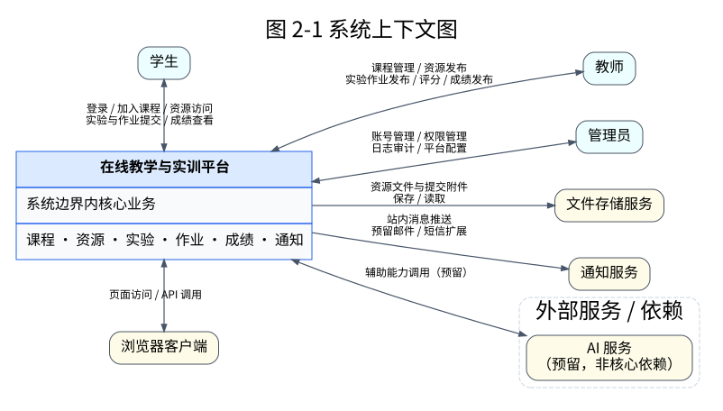

图 2-1 在线教学与实训平台系统上下文图

---

# 3 需求说明

本章集中给出需求说明。3.1 给出核心业务流程与用例图；3.2 给出参与者定义；3.3 按用例描述、系统顺序图、系统操作合约就近编排给出 13 个关键用例，AUTH、CRS 的独立业务场景图组分别编入 3.3.1.3 与 3.3.2.3、3.3.3.3；3.4 给出领域模型与概念类图；3.5 给出功能需求项；3.6 给出描述约定；3.7 至 3.9 分别给出接口需求、非功能需求和数据需求。

SSD 只描述参与者与 OnlineJudgeForSE 系统边界之间的外部可观察系统操作，不展示 AUTH、CRS、LAB、HWK、GRD、LRN 等内部服务或类调用；内部协作关系作为概要设计和详细设计内容展开。需求层 SSD 图源随需求规格说明书归档于 `docs/diagrams/srs/`。HWK 拆分图与相邻 SSD 一致，使用 Mermaid `.mmd` 图源并由仓库统一脚本生成白底 SVG，保留图号、图题和 OP 编号。

## 3.1 核心业务流程

系统整体流程为：用户登录平台，教师创建课程并发布教学资源，学生加入课程并开展学习，教师发布实验与作业，学生完成并提交任务，系统进行基础自动评测或教师评分，最终生成课程成绩并通过通知机制反馈给用户。

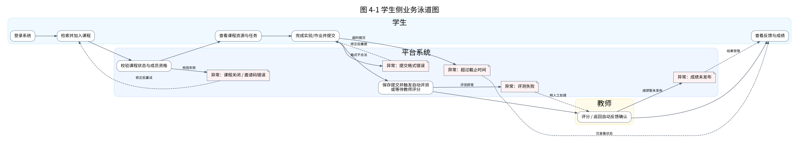

图 4-1 学生侧核心业务泳道图

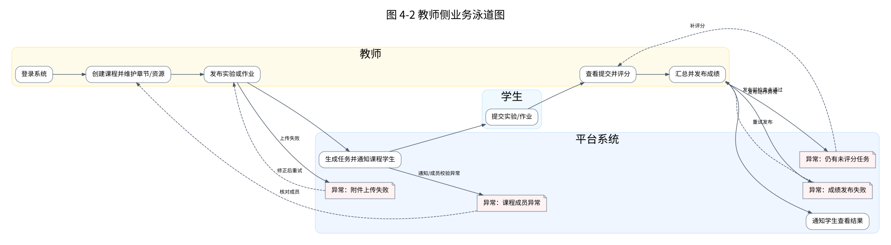

图 4-2 教师侧核心业务泳道图

### 3.1.1 核心业务用例图

为降低单张大图的线条交叉和阅读成本，本节将需求层用例图拆分为 1 张系统总览图和 6 张模块用例图。总览图只展示子系统级用户目标，模块图展开本模块参与者、核心用例、公共必经子流程和可选扩展流程。PlantUML 源文件统一保存于 `docs/diagrams/srs/`，最终提交版引用 `docs/最终提交/assets/` 下的静态 SVG 图片，确保最终提交文件夹单独移动后仍可直接预览，不依赖本机 PlantUML jar。

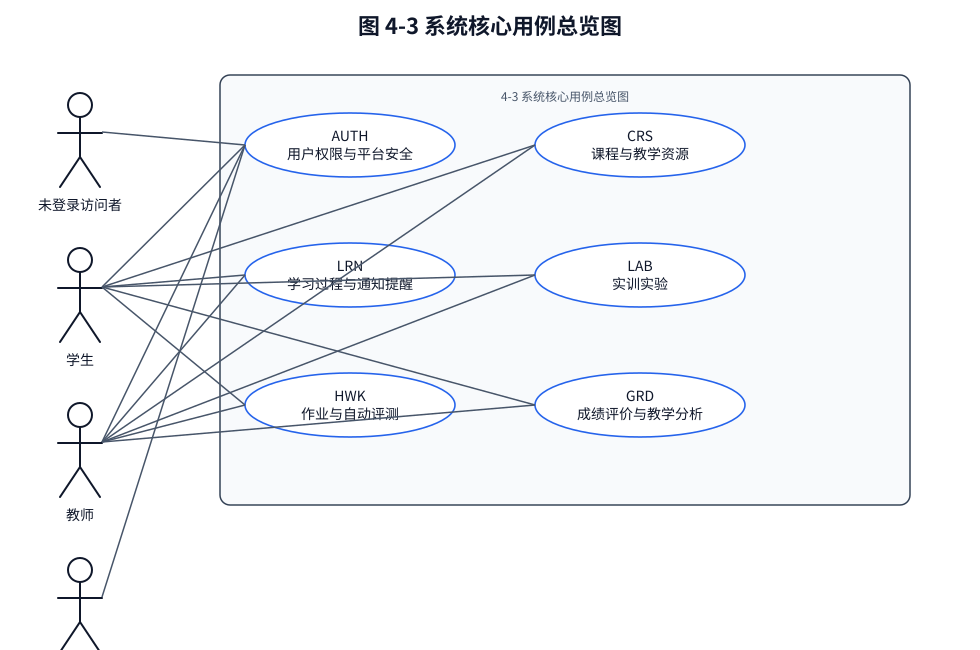

图 4-3 系统核心用例总览图

图示说明：图 4-3 以“在线教学与实训平台（OnlineJudgeForSE）”为系统边界，展示 AUTH、CRS、LRN、LAB、HWK、GRD 六个子系统级用例与四类主角色的关系。总览图不展开 13 个关键用例的细节，只用于说明平台能力边界和角色入口。

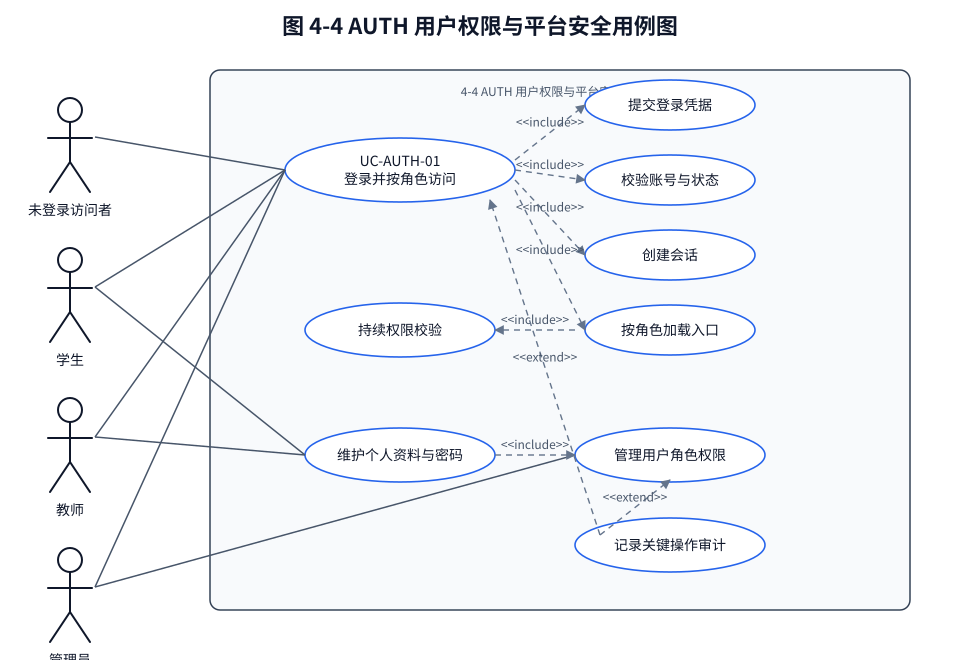

图 4-4 AUTH 用户权限与平台安全用例图

图示说明：图 4-4 展示未登录访问者、学生、教师和管理员在 AUTH 子系统中的认证、会话、角色入口和权限校验目标。提交登录凭据、校验账号状态、创建会话和按角色加载入口属于 UC-AUTH-01 的必经 `<<include>>` 子流程，关键操作审计作为安全扩展在登录异常或权限管理场景中触发。

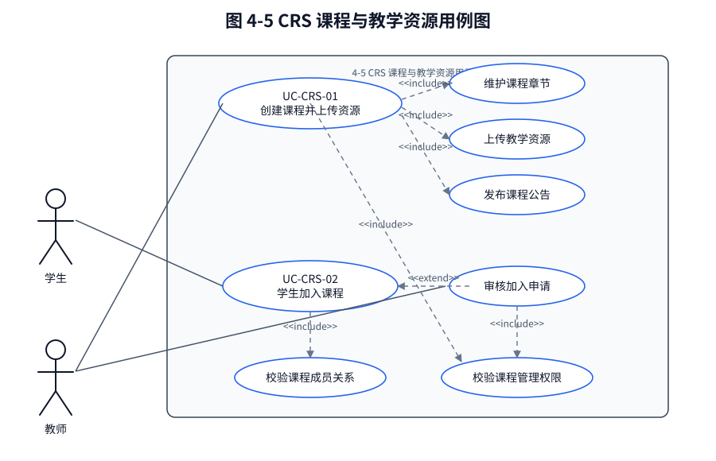

图 4-5 CRS 课程与教学资源用例图

图示说明：图 4-5 展示教师创建课程、维护章节、上传资源、发布公告，以及学生加入课程的 CRS 边界。课程管理类操作必须包含课程管理权限校验，学生加入课程必须包含课程成员关系或准入规则校验；审核加入申请是“申请后审核加入”模式下的可选扩展。

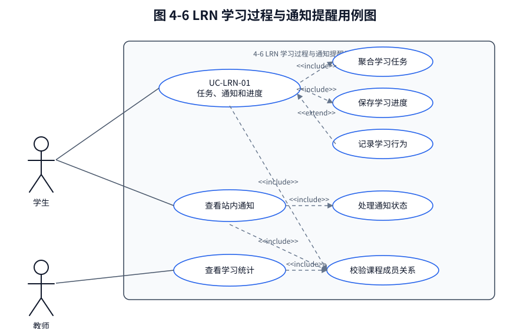

图 4-6 LRN 学习过程与通知提醒用例图

图示说明：图 4-6 展示学生查看学习任务、通知和进度，以及教师查看课程学习统计的 LRN 边界。任务聚合、学习进度保存和课程成员关系校验属于学习入口的必经流程；学习行为统计可由资源访问、任务完成或通知点击等事件触发，作为可追踪性扩展。

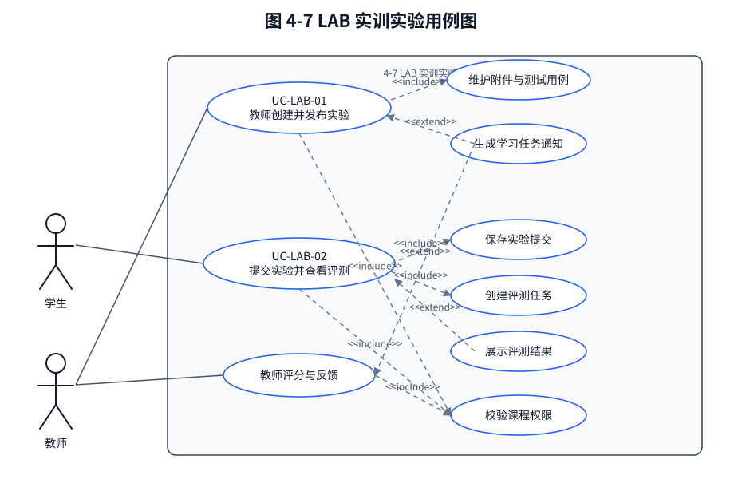

图 4-7 LAB 实训实验用例图

图示说明：图 4-7 展示教师创建并发布实验、学生提交实验并查看评测结果的 LAB 边界。发布实验需要课程权限校验和实验附件/测试用例维护；学生提交实验必须保存提交并创建评测任务；生成通知和展示评测结果属于发布或评测完成后的触发型扩展。

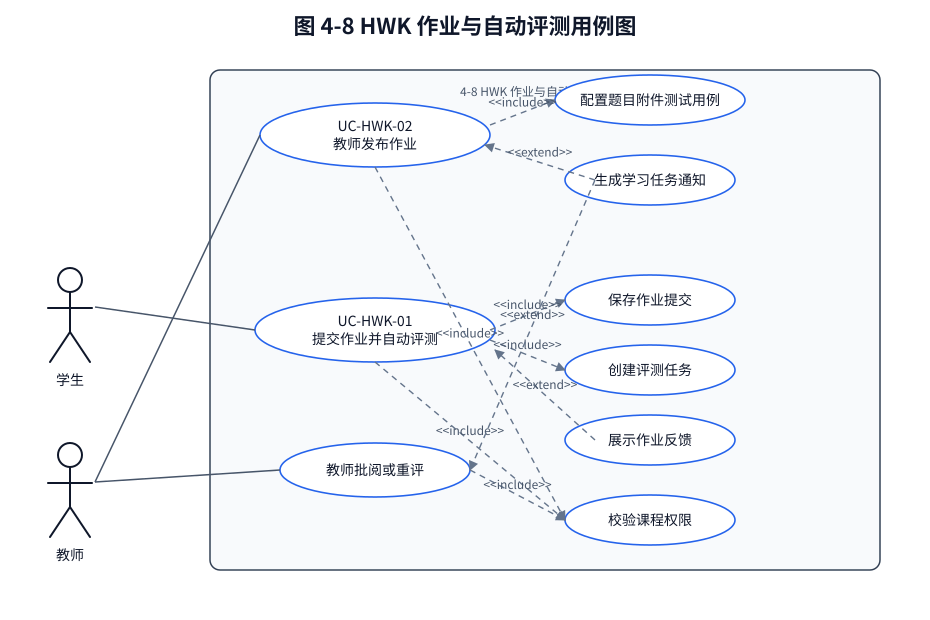

图 4-8 HWK 作业与自动评测用例图

图示说明：图 4-8 展示教师发布作业、学生提交作业并触发自动评测的 HWK 边界。作业发布包含课程权限校验和题目、附件、测试用例配置；学生提交作业包含课程权限校验、保存提交和创建评测任务；展示作业反馈、教师批阅或重评通知属于结果产生后的扩展流程。

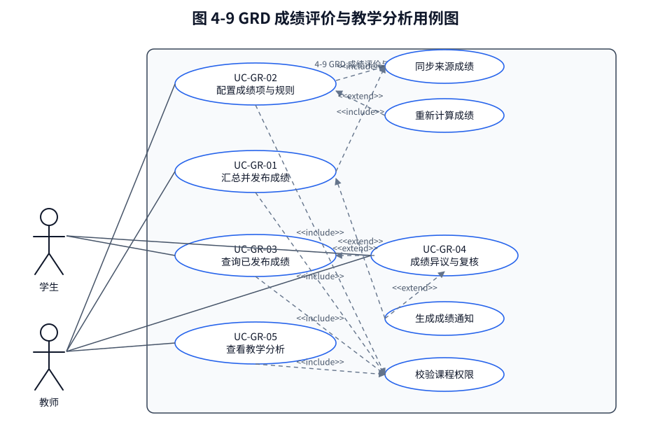

图 4-9 GRD 成绩评价与教学分析用例图

图示说明：图 4-9 展示教师配置成绩规则、汇总并发布成绩、查看教学分析，以及学生查询成绩和提交异议的 GRD 边界。成绩配置和发布必须校验课程权限并同步 LAB/HWK 来源成绩；重新计算成绩、生成成绩通知和成绩异议属于规则调整、发布或学生反馈触发的扩展流程。

### 3.1.2 业务流程关系图（辅助说明）

下图汇总各角色参与的关键用例及其业务入口，用于辅助理解角色职责，不表达用例之间的包含、扩展或执行先后关系。管理员在本需求范围内主要通过 AUTH 进入用户、角色、权限和审计管理能力；课程、实验、作业、成绩和通知主流程由教师与学生共同完成。



图 4-10 核心业务流程关系图

### 3.1.3 关键用例统一索引与追溯表

为便于统一追溯和一致性核对，表 4-1 汇总 13 个核心 UC 的参与者、触发器、前置条件、后置条件、基本事件流、扩展事件流和系统操作合约索引。各用例正文保留业务叙述，表内给出可直接追踪到 FR/NFR 与 OP 的索引，不新增需求范围。

表 4-1 关键用例统一字段与追溯索引

| UC 编号 | 主参与者/协同参与者 | 触发器 | 前置/后置摘要 | 基本流与扩展流索引 | 关联 FR/NFR | 关联 OP |
| --- | --- | --- | --- | --- | --- | --- |
| UC-AUTH-01 | 学生、教师、管理员；管理员参与权限与审计扩展 | 用户提交登录或访问受保护功能 | 前置：有效账号与认证服务可用；后置：形成会话、角色菜单和审计记录 | 基本流见 3.3.1 登录与持续鉴权；扩展流覆盖注册、资料安全、角色权限、审计安全提示 | FR-UA-01 ~ FR-UA-07；NFR-UA-01 ~ NFR-UA-05 | OP-AUTH-01 ~ OP-AUTH-04 |
| UC-CRS-01 | 教师 | 教师创建课程、维护章节资源或发布公告 | 前置：教师已登录且具备课程创建/管理权限；后置：课程、章节、资源或公告对授权用户可见 | 基本流见 3.3.2 课程创建与资源维护；扩展流覆盖草稿保存、资源上传失败、权限不足 | FR-CR-01、FR-CR-02、FR-CR-03、FR-CR-06；NFR-CR-01 ~ NFR-CR-05 | OP-CRS-01、OP-CRS-02、OP-CRS-03、OP-CRS-06、OP-CRS-07 |
| UC-CRS-02 | 学生；教师参与审核扩展 | 学生申请加入课程或输入邀请码 | 前置：学生已登录且课程允许加入；后置：形成课程成员或待审核申请 | 基本流见 3.3.3 课程加入；扩展流覆盖审核加入、课程关闭、人数已满、邀请码错误 | FR-CR-04、FR-CR-05、FR-CR-06；NFR-CR-01、NFR-CR-02、NFR-CR-03、NFR-CR-05 | OP-CRS-04、OP-CRS-05、OP-CRS-07 |
| UC-LRN-01 | 学生；课程、实验、作业、成绩模块协同 | 学生进入学习中心、课程主页或通知入口 | 前置：学生已加入课程且存在任务/资源/通知/进度数据；后置：任务、通知、进度和行为记录保持一致 | 基本流见 3.3.4 学习任务、通知和进度；扩展流覆盖无任务、离线同步、通知失效、重复事件幂等 | FR-LN-01 ~ FR-LN-06；NFR-LN-01 ~ NFR-LN-05 | OP-LRN-01 ~ OP-LRN-05 |
| UC-LAB-01 | 教师；学习过程与通知模块协同 | 教师创建实验、维护附件/测试用例并确认发布 | 前置：教师拥有课程管理权限；后置：实验草稿或已发布实验被持久化，发布后生成任务/通知 | 基本流见 3.3.5 实验创建发布；扩展流覆盖保存草稿、附件失败、截止时间非法、权限不足 | FR-LAB-01、FR-LAB-04、FR-LAB-05；NFR-LAB-01 ~ NFR-LAB-05 | OP-LAB-01、OP-LAB-02、OP-LAB-03 |
| UC-HWK-01 | 学生；教师、作业评测与成绩模块协同 | 学生提交作业，教师在需要时批阅或重评 | 前置：学生为课程成员且作业开放；后置：提交、评测、批阅/重评和反馈结果可追踪 | 基本流见 3.3.6 作业提交、评测与反馈；扩展流覆盖多次提交、普通作业、评测异常、人工批阅和重评 | FR-HWK-02、FR-HWK-03、FR-HWK-04、FR-HWK-05、FR-HWK-06；NFR-HWK-01 ~ NFR-HWK-05 | OP-HWK-02、OP-HWK-03、OP-HWK-04、OP-HWK-05 |
| UC-GR-01 | 教师；通知模块协同 | 教师确认成绩汇总并发布 | 前置：成绩项规则和来源成绩完整；后置：发布记录和学生可见成绩落库，并登记 after-commit 通知 | 基本流见 3.3.7 成绩发布；扩展流覆盖发布前修改、未评分任务、规则缺失、发布校验失败和提交后通知落库失败 | FR-GR-02、FR-GR-03、FR-GR-04、FR-GR-05；NFR-GR-01 ~ NFR-GR-05 | OP-GR-02、OP-GR-03、OP-LRN-04 |
| UC-LAB-02 | 学生；教师、实验评测、通知和成绩模块协同 | 学生提交实验或查看实验评测/教师反馈 | 前置：学生为课程成员且实验已发布未截止；后置：提交、评测、报告、教师评分、统计和来源成绩可追踪 | 基本流见 3.3.8 实验提交与评测反馈；扩展流覆盖多版本、报告补交、评测异常、访问越权 | FR-LAB-02、FR-LAB-03、FR-LAB-04、FR-LAB-05、FR-LAB-06、FR-LAB-07、FR-LAB-08；NFR-LAB-01 ~ NFR-LAB-05 | OP-LAB-04、OP-LAB-05、OP-LAB-06、OP-LRN-04 |
| UC-HWK-02 | 教师；课程、学习过程与通知模块协同 | 教师创建作业并发布给课程学生 | 前置：教师拥有课程管理权限且课程可教学；后置：作业草稿或已发布作业被持久化，发布后进入任务中心 | 基本流见 3.3.9 作业创建发布；扩展流覆盖草稿保存、普通作业、测试用例非法、通知失败 | FR-HWK-01、FR-HWK-02、FR-HWK-04、FR-HWK-06；NFR-HWK-01 ~ NFR-HWK-05 | OP-HWK-01、OP-LRN-01、OP-LRN-04 |
| UC-GR-02 | 教师；实验、作业、成绩模块协同 | 教师新增或修改成绩项与计算规则 | 前置：教师拥有成绩管理权限且存在可计分来源；后置：成绩项已保存，规则校验与重算可由独立操作触发 | 基本流见 3.3.10 成绩项配置；扩展流覆盖禁用成绩项、暂不重算、来源缺失、已发布成绩关联规则当前不单独审计 | FR-GR-01、FR-GR-02、FR-GR-03；NFR-GR-01 ~ NFR-GR-05 | OP-GR-01、OP-GR-02 |
| UC-GR-03 | 学生；成绩、课程、通知模块协同 | 学生从成绩页、课程页、学习中心或通知进入成绩详情 | 前置：学生为课程成员且成绩已发布；后置：本人可见成绩被展示，未授权数据不泄露 | 基本流见 3.3.11 成绩查询；扩展流覆盖部分发布、无成绩、未发布、越权访问 | FR-GR-04、FR-GR-05；NFR-GR-01 ~ NFR-GR-05 | OP-GR-04、OP-LRN-05 |
| UC-GR-04 | 学生、教师；成绩、课程、通知模块协同 | 学生提交成绩异议，教师处理复核 | 前置：学生已查看已发布成绩且教师可处理课程；后置：异议状态、成绩变更和处理通知可追踪 | 基本流见 3.3.12 异议提交与复核；扩展流覆盖驳回、重评后复核、重复申请、无权限处理 | FR-GR-03、FR-GR-04、FR-GR-07；NFR-GR-01 ~ NFR-GR-05 | OP-GR-05、OP-GR-03、OP-LRN-04 |
| UC-GR-05 | 教师；成绩、实验、作业、课程模块协同 | 教师进入教学分析或成绩统计页面 | 前置：教师有课程管理/查看权限且存在成绩或提交数据；后置：统计结果可解释并可追溯到来源数据 | 基本流见 3.3.13 教学分析；扩展流覆盖快照复用、单任务分析、无成绩空态、统计失败 | FR-GR-06；NFR-GR-01 ~ NFR-GR-05 | OP-GR-04、OP-GR-02 |

## 3.2 参与者

本表按需求层参与者定义系统外部交互对象。参与者 ID 仅用于 SRS 用例、SSD 与 RTM 追踪，不替代实现层角色或数据库主键。

| 参与者 ID | 名称 | 描述 | 涉及用例/需求 |
| --- | --- | --- | --- |
| ACT-01 | 未登录访问者 | 尚未认证的访问者，用于触发注册、登录、找回密码等认证入口。 | UC-AUTH-01；FR-UA-01、FR-UA-04、FR-UA-05 |
| ACT-02 | 学生 | 已认证并具备学生身份的课程参与者，完成加入课程、学习、提交、查看反馈和成绩异议等操作。 | UC-AUTH-01、UC-CRS-02、UC-LRN-01、UC-LAB-02、UC-HWK-01、UC-GR-03、UC-GR-04；FR-CR-04、FR-LN-01 ~ FR-LN-05、FR-LAB-02 ~ FR-LAB-07、FR-HWK-02 ~ FR-HWK-06、FR-GR-05、FR-GR-07 |
| ACT-03 | 教师 | 已认证并具备教师身份的课程负责人或授权教师，负责课程、资源、实验、作业、成绩发布和复核处理。 | UC-AUTH-01、UC-CRS-01、UC-LAB-01、UC-HWK-02、UC-GR-01、UC-GR-02、UC-GR-04、UC-GR-05；FR-CR-01 ~ FR-CR-06、FR-LAB-01、FR-LAB-06、FR-HWK-01、FR-HWK-05、FR-GR-01 ~ FR-GR-07 |
| ACT-04 | 管理员 | 已认证并具备平台管理身份的运维管理者，维护用户、角色、权限、审计日志与平台基础安全。 | UC-AUTH-01 及其 AUTH 子用例；FR-UA-02、FR-UA-03、FR-UA-05、FR-UA-06、FR-UA-07 |

## 3.3 关键用例描述

### 3.3.1 UC-AUTH-01 关键用例一：用户登录并按角色访问平台功能

1. 用例编号：UC-AUTH-01。
2. 用例名称：用户登录并按角色访问平台功能。
3. 所属子系统：AUTH 用户权限与平台安全。
4. 主参与者：未登录访问者、学生、教师、管理员。
5. 相关参与者：课程内协作教师、权限审计人员。助教如在课程中出现，按课程内协作教师处理，不单独作为主角色扩展。
6. 触发条件：用户访问平台登录入口，或访问受保护功能时需要重新认证。
7. 前置条件：用户账号存在且状态可登录；平台认证、会话和权限校验能力可用。
8. 后置条件：登录成功时形成有效会话、当前用户上下文和角色菜单；登录失败或越权访问时系统给出受控提示并保留必要审计记录。
9. 基本流程：用户进入登录页并输入账号密码；系统校验凭据和账号状态；校验通过后创建会话或访问令牌；系统按角色加载学生、教师或管理员入口；用户访问课程、实验、作业、成绩或管理功能；系统在后续页面访问和关键操作中持续校验登录态、角色权限和数据范围。
10. 备选流程/异常流程：用户可按系统配置使用学号、工号、邮箱或指定账号登录；账号或密码错误、账号冻结、会话过期、访问无权限功能、尝试访问他人数据时，系统拒绝操作并给出不泄露敏感细节的提示。
11. 业务规则：密码输入应隐藏显示；认证失败提示不得暴露账号是否存在、密码摘要或权限细节；管理员只在授权范围内管理用户、角色和审计；AUTH 扩展子用例归入 UC-AUTH-01，不新增 UC 编号。
12. 关联功能需求 FR/NFR：FR-UA-01 ~ FR-UA-07；NFR-UA-01 ~ NFR-UA-05。
13. 关联系统操作 OP：OP-AUTH-01、OP-AUTH-02、OP-AUTH-03、OP-AUTH-04。
14. 验收场景：Given 用户拥有正常账号且输入正确密码，When 用户提交登录请求，Then 系统创建会话并展示与其角色匹配的功能入口；Given 已登录学生尝试访问教师课程管理页，When 系统校验权限，Then 访问被拒绝且不会返回教师数据。

AUTH 子用例/扩展用例：

| 子用例编号 | 子用例名称 | 参与者 | 触发条件 | 关联需求 | 说明 |
| --- | --- | --- | --- | --- | --- |
| UC-AUTH-01-R | 用户注册与登录 | 未登录访问者、学生、教师、管理员 | 访问注册页、登录页或提交登录凭据 | FR-UA-01、FR-UA-04、FR-UA-05 | 覆盖注册、登录、退出和会话创建，关联 OP-AUTH-01 ~ OP-AUTH-03。 |
| UC-AUTH-01-P | 个人资料与密码安全 | 学生、教师、管理员 | 用户进入个人资料页或修改密码页 | FR-UA-04、FR-UA-07 | 覆盖资料维护、密码修改、密码摘要存储、登录失败限制和敏感输入校验。 |
| UC-AUTH-01-A | 角色权限与访问控制 | 管理员、学生、教师 | 管理员调整角色，或用户访问受保护功能 | FR-UA-02、FR-UA-03、FR-UA-05 | 覆盖角色分配、菜单加载、接口鉴权和课程/数据范围内的访问控制。 |
| UC-AUTH-01-S | 审计与安全提示 | 管理员、学生、教师 | 关键安全操作、认证异常或越权访问发生 | FR-UA-05、FR-UA-06、FR-UA-07 | 覆盖关键操作审计、安全异常提示、账号冻结/禁用和日志追踪。 |

#### 3.3.1.1 登录系统顺序图

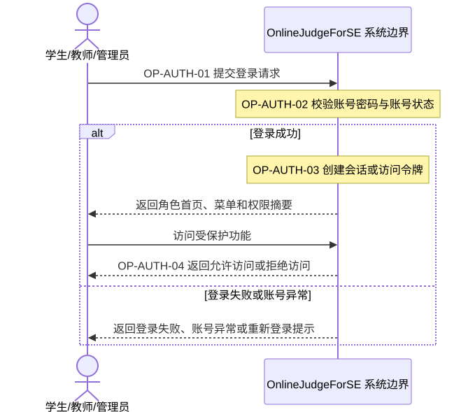

图 4-11 登录系统顺序图

#### 3.3.1.2 系统操作合约

UC-AUTH-01 的关键系统操作合约如下，其余系统操作完整合约见 9.3 表 14-5：

| OP 编号 | 操作签名 | 所属用例 | 参与者 | 前置条件 | 后置条件 | 正常结果 | 异常结果 | 影响的领域对象 | 关联 FR/NFR |
| --- | --- | --- | --- | --- | --- | --- | --- | --- | --- |
| OP-AUTH-01 | `submitLogin(credentials)` | UC-AUTH-01 | 未登录访问者、学生、教师、管理员 | 用户处于未登录或登录失效状态；账号、密码和客户端上下文已提交 | 登录请求被 AUTH 接收并进入校验 | 返回登录请求受理结果，进入账号密码与账号状态校验 | 参数缺失或格式错误返回认证失败提示 | User、AuditLog | FR-UA-01、FR-UA-04；NFR-UA-01、NFR-UA-05 |

#### 3.3.1.3 AUTH 业务场景系统顺序图与状态图

本小节为 AUTH 模块 11 个独立业务场景补齐需求层图组。每个独立场景（`SC-AUTH-01` ~ `SC-AUTH-11`）配置一张系统顺序图（SSD）；账号/会话状态机与跨场景活动图按共同状态或流程复用，个人资料维护、审计写入与查询分别配置专属活动图。场景编号、UC 锚点与图号对应关系见 `docs/过程/测试/TST-DOC-02-AUTH-业务场景清单与测试闭环.md` 第 3 章；图源随需求规格说明书归档于 `docs/diagrams/srs/`，正文以静态 SVG 展示。SSD 只描述参与者与 OnlineJudgeForSE 系统边界之间的外部可观察系统操作，内部服务/对象协作在概要层与详细层展开。

##### 3.3.1.3.1 SC-AUTH-01 学生自助注册（UC-AUTH-01-R）

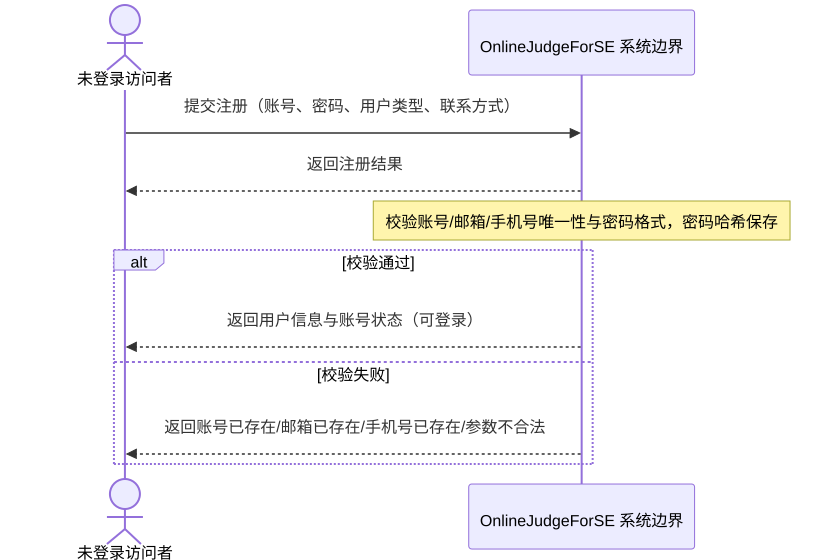

图 4-20 学生自助注册系统顺序图

##### 3.3.1.3.2 SC-AUTH-02 账号密码登录（UC-AUTH-01-R）

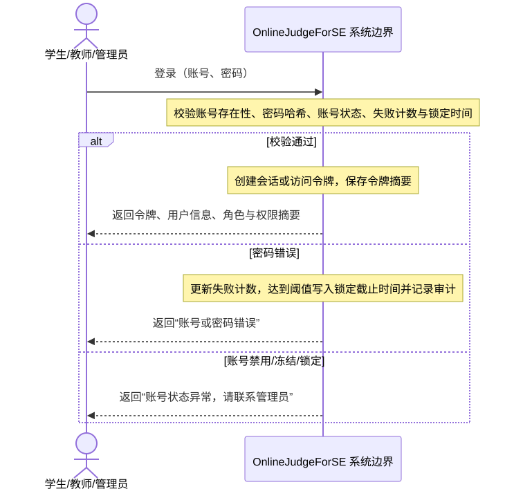

图 4-21 账号密码登录系统顺序图

##### 3.3.1.3.3 SC-AUTH-03 退出登录（UC-AUTH-01-R）

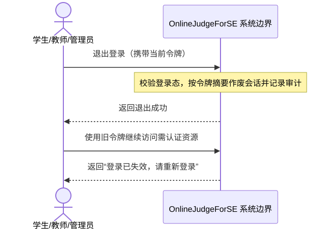

图 4-22 退出登录系统顺序图

##### 3.3.1.3.4 SC-AUTH-04 持续鉴权与当前用户上下文（UC-AUTH-01-R）

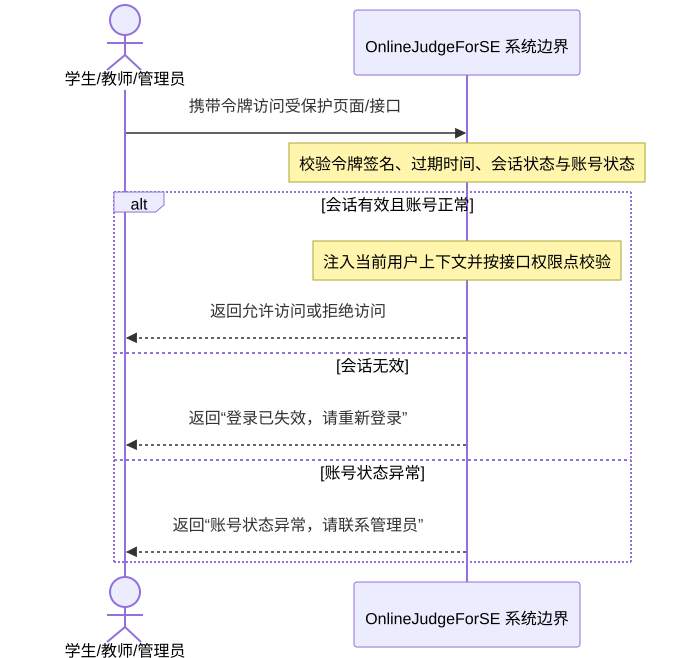

图 4-23 持续鉴权与当前用户上下文系统顺序图

##### 3.3.1.3.5 SC-AUTH-05 个人资料查看与修改（UC-AUTH-01-P）

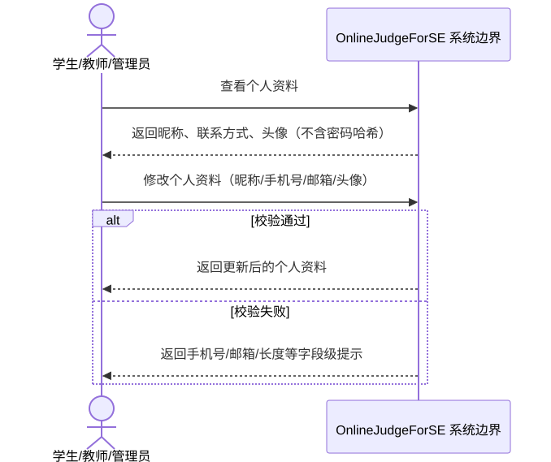

图 4-24 个人资料查看与修改系统顺序图

##### 3.3.1.3.6 SC-AUTH-06 修改密码（UC-AUTH-01-P）

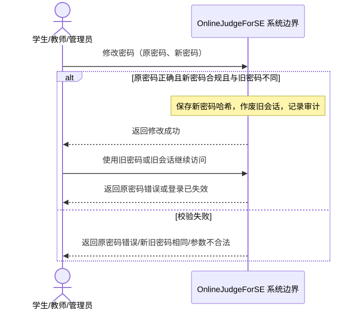

图 4-25 修改密码系统顺序图

##### 3.3.1.3.7 SC-AUTH-07 管理员用户与账号状态管理（UC-AUTH-01-A）

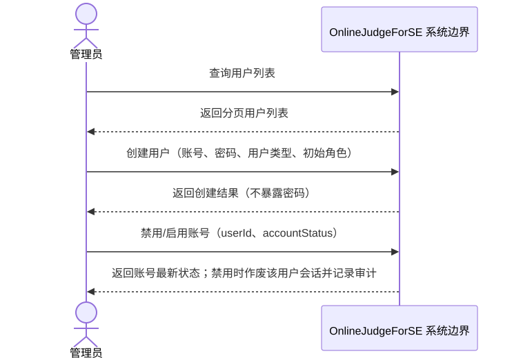

图 4-26 管理员用户与账号状态管理系统顺序图

##### 3.3.1.3.8 SC-AUTH-08 用户角色分配（UC-AUTH-01-A）

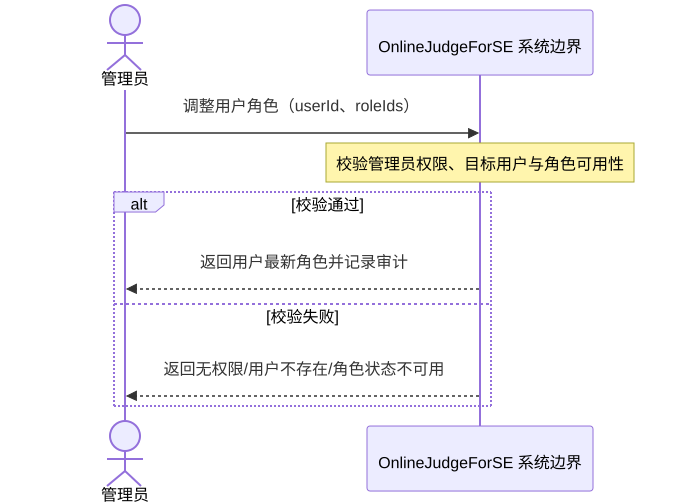

图 4-27 用户角色分配系统顺序图

##### 3.3.1.3.9 SC-AUTH-09 角色与角色权限维护（UC-AUTH-01-A）

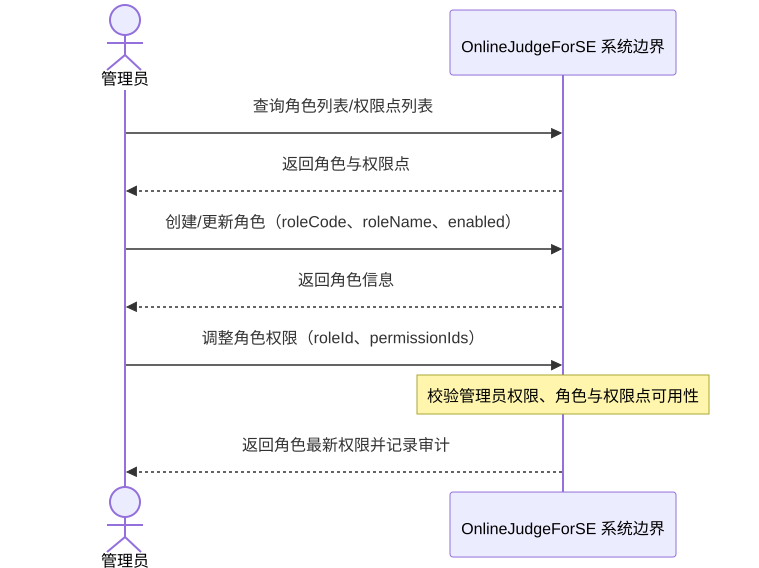

图 4-28 角色与角色权限维护系统顺序图

##### 3.3.1.3.10 SC-AUTH-10 安全异常拦截（UC-AUTH-01-S）

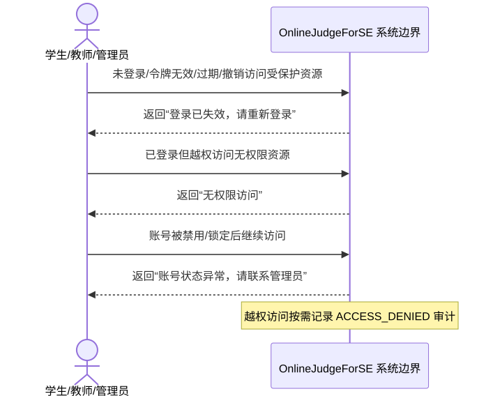

图 4-29 安全异常拦截系统顺序图

##### 3.3.1.3.11 SC-AUTH-11 关键操作审计写入与查询（UC-AUTH-01-S）

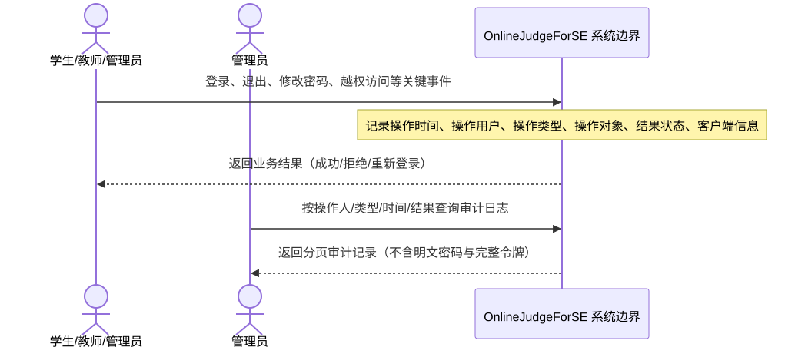

图 4-30 关键操作审计写入与查询系统顺序图

##### 3.3.1.3.12 状态图与活动图

以下图按场景映射使用：账号状态机覆盖 SC-AUTH-01/02/07（账号创建、禁用/冻结/锁定与登录拒绝），会话状态机覆盖 SC-AUTH-03/04/06（会话过期与作废），修改密码活动图覆盖 SC-AUTH-06，角色权限调整活动图覆盖 SC-AUTH-08/09，鉴权与越权拦截活动图覆盖 SC-AUTH-04/10；SC-AUTH-05 与 SC-AUTH-11 使用各自的专属活动图，避免以无关流程替代独立场景证据。



图 4-31 账号状态机



图 4-32 会话状态机



图 4-33 修改密码活动图



图 4-34 角色权限调整活动图



图 4-35 鉴权与越权拦截活动图



图 4-36 SC-AUTH-05 个人资料查看与修改活动图



图 4-37 SC-AUTH-11 审计写入与查询活动图

### 3.3.2 UC-CRS-01 关键用例二：教师创建课程并上传资源

1. 用例编号：UC-CRS-01。
2. 用例名称：教师创建课程并上传资源。
3. 所属子系统：CRS 课程与教学资源。
4. 主参与者：教师。
5. 相关参与者：课程内协作教师、学生。
6. 触发条件：教师在课程管理页发起创建课程、维护章节或上传资源。
7. 前置条件：教师已登录并拥有课程创建或管理权限；文件上传和课程权限校验能力可用。
8. 后置条件：系统创建 Course，教师成为课程负责人或管理者；章节、资源和公告按可见范围展示给授权用户。
9. 基本流程：教师填写课程名称、简介、学期、封面和加入方式；系统保存课程基础信息并建立负责人关系；教师维护章节目录；教师上传资源并设置类型、所属章节、可见范围和发布时间；系统保存资源元数据并在课程主页展示课程信息、目录和资源入口。
10. 备选流程/异常流程：教师可保存草稿暂不发布资源；课程名称缺失、学期非法、资源类型不支持、文件过大、上传失败或无管理权限时，系统拒绝保存相关对象并提示原因。
11. 业务规则：课程名称、学期、加入方式、资源可见范围和发布时间必须通过校验；资源上传失败不得生成不可访问资源；课程负责人、资源上传人和发布时间应可追踪。
12. 关联功能需求 FR/NFR：FR-CR-01、FR-CR-02、FR-CR-03、FR-CR-06；NFR-CR-01 ~ NFR-CR-05。
13. 关联系统操作 OP：OP-CRS-01、OP-CRS-02、OP-CRS-03、OP-CRS-06、OP-CRS-07。
14. 验收场景：Given 教师已登录且具备课程创建权限，When 教师提交合法课程信息并上传教学资源，Then 系统创建课程、保存资源并在课程主页向授权用户展示；Given 资源文件类型不支持，When 教师上传该文件，Then 系统拒绝上传且不生成无效资源记录。

#### 3.3.2.1 课程创建与资源维护系统顺序图

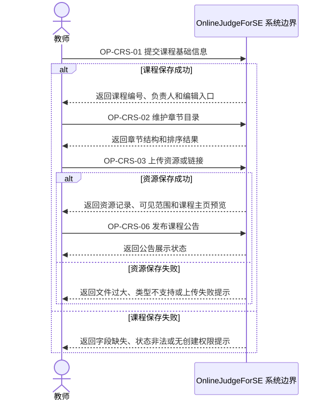

图 4-17 课程创建与资源维护系统顺序图

#### 3.3.2.2 系统操作合约

UC-CRS-01 的关键系统操作合约如下，其余系统操作完整合约见 9.3 表 14-5：

| OP 编号 | 操作签名 | 所属用例 | 参与者 | 前置条件 | 后置条件 | 正常结果 | 异常结果 | 影响的领域对象 | 关联 FR/NFR |
| --- | --- | --- | --- | --- | --- | --- | --- | --- | --- |
| OP-CRS-01 | `saveCourse(courseForm)` | UC-CRS-01 | 教师 | 教师已登录并拥有课程创建权限；课程名称、简介、学期、封面和加入方式通过基础校验 | 创建或更新课程基础信息，教师成为课程负责人 | 返回课程编号、课程基础信息和后续编辑入口 | 字段缺失、状态非法或无权限返回错误 | Course、CourseMember、AuditLog | FR-CR-01、FR-CR-06；NFR-CR-01、NFR-CR-05 |

#### 3.3.2.3 CRS 独立业务场景图组（一）

本图组把 CRS 模块从“课程创建并上传资源（UC-CRS-01）”和“学生加入课程（UC-CRS-02）”两个关键用例拆分为 9 个可独立验收的业务场景，覆盖课程维护、章节目录、资源、公开/邀请码/审批加入、成员管理、公告和课程首页摘要。本节只做场景拆分与需求层图示，不新增或重排正式 UC 编号；13 个关键 UC 仅作为追溯锚点，每个场景通过 FR-CR、OP-CRS 与 UC-CRS 编号双向追踪。概要层组件级图组和详细层对象级图组分别在概要设计说明书 2.7.6 与详细设计说明书 3.2 中展开，图号在本图组表 4-5 中统一索引。

表 4-4 CRS 独立业务场景清单

| 场景编号 | 场景名称 | 主参与者 | 触发条件 | 主成功路径 | 备选/异常路径 | 追溯锚点 |
| --- | --- | --- | --- | --- | --- | --- |
| CRS-SC-01 | 课程创建与维护 | 教师 | 在课程管理页创建课程，或编辑/归档已有课程 | 校验教师权限，创建课程并建立负责人关系，列表/详情可查，编辑与归档生效 | 学生无权创建；课程名称缺失或超长、学期非法返回 400；课程不存在返回 404；归档课程移出可加入列表 | UC-CRS-01、FR-CR-01、OP-CRS-01 |
| CRS-SC-02 | 章节目录管理 | 教师 | 在章节管理页新增、修改、排序或删除章节 | 校验课程管理权限，维护父子章节与排序，学生可读取只读章节树 | 学生写操作返回 403；父章节不存在返回 400/404；章节自引用或层级循环返回 400；排序冲突返回 409 | FR-CR-02、OP-CRS-02 |
| CRS-SC-03 | 资源上传与下载 | 教师、学生 | 教师上传资源，成员下载可见资源 | 校验课程管理权限与文件边界，保存文件与元数据，成员按可见范围下载 | 文件为空、超 50MB、类型不支持或伪装可执行返回 400；非成员下载返回 403；存储失败不产生无效资源记录 | UC-CRS-01、FR-CR-03、OP-CRS-03 |
| CRS-SC-04 | 公开加入课程 | 学生 | 在课程列表选择公开课程并加入 | 校验课程状态与容量，创建 ACTIVE 成员，立即开放资源与任务 | 课程关闭返回 409（COURSE_CLOSED）；人数已满返回 409（COURSE_FULL）；重复加入返回 409（ALREADY_JOINED） | UC-CRS-02、FR-CR-04、OP-CRS-04 |
| CRS-SC-05 | 邀请码加入课程 | 学生 | 输入课程邀请码并提交加入请求 | 校验课程状态与邀请码，创建 ACTIVE 成员 | 邀请码错误返回 400（INVALID_INVITE_CODE）；关闭、满员或重复加入返回 409 | UC-CRS-02、FR-CR-04、OP-CRS-04 |
| CRS-SC-06 | 审批加入课程 | 学生、教师 | 学生提交审批制课程申请，教师审批 | 学生申请创建 PENDING 成员，教师审批通过后置为 ACTIVE 并开放资源/任务，拒绝后置为 REJECTED 可重新申请 | 重复申请返回 409（JOIN_PENDING）；仅 PENDING 可被审批，状态流转非法返回 409；审批通过前无课程访问权限 | UC-CRS-02、FR-CR-04、FR-CR-05、OP-CRS-04、OP-CRS-05 |
| CRS-SC-07 | 成员管理（角色调整/移除） | 教师 | 在成员管理页调整课程内角色或移除异常成员 | 查看成员列表与学生名单，调整 STUDENT/ASSISTANT/TEACHER 角色，移除异常成员 | 最后一名教师不可移除/降级返回 409（LAST_TEACHER_REQUIRED）；不可修改自身教师身份返回 409；非管理成员操作返回 403 | FR-CR-05、OP-CRS-05 |
| CRS-SC-08 | 公告发布与置顶 | 教师、学生 | 教师发布、编辑、置顶或删除公告，学生查看公告 | 校验课程管理权限，保存公告与置顶状态，学生列表置顶优先展示 | 公告内容为空或超长返回 400；学生发布返回 403；公告不存在返回 404；发布后触发 LRN 公告通知事件 | FR-CR-06、OP-CRS-06 |
| CRS-SC-09 | 课程首页摘要 | 学生、教师 | 进入课程首页查看课程信息、公告与最近任务 | 校验课程成员关系，聚合课程信息、置顶公告与最近任务并展示摘要 | 非成员返回 403（NO_COURSE_MEMBERSHIP）；课程不存在返回 404；无公告或无任务时展示对应空态 | FR-CR-06、OP-CRS-07 |

表 4-5 CRS 场景三层图组索引

| 场景编号 | 需求层（本节） | 概要层组件级 | 详细层对象级 | 图源目录 |
| --- | --- | --- | --- | --- |
| CRS-SC-01 | 图 4-38、图 4-39 | 图 2-6 | 图 3-2-10 | `docs/diagrams/srs/`、`docs/diagrams/arch/`、`docs/diagrams/dsd/` |
| CRS-SC-02 | 图 4-40、图 4-41 | 图 2-7 | 图 3-2-11 | 同上 |
| CRS-SC-03 | 图 4-42、图 4-43 | 图 2-8 | 图 3-2-12 | 同上 |
| CRS-SC-04 | 图 4-44、图 4-45 | 图 2-9 | 图 3-2-13 | 同上 |
| CRS-SC-05 | 图 4-46、图 4-47 | 图 2-10 | 图 3-2-14 | 同上 |
| CRS-SC-06 | 图 4-48、图 4-49 | 图 2-11 | 图 3-2-15 | 同上 |
| CRS-SC-07 | 图 4-50、图 4-51 | 图 2-12 | 图 3-2-16 | 同上 |
| CRS-SC-08 | 图 4-52、图 4-53 | 图 2-13 | 图 3-2-17 | 同上 |
| CRS-SC-09 | 图 4-54、图 4-55 | 图 2-14 | 图 3-2-18 | 同上 |

##### 3.3.2.3.1 场景一：课程创建与维护（CRS-SC-01）

教师登录后创建课程并维护课程基础信息。系统校验教师身份后创建课程记录，并自动将创建者登记为课程教师成员；编辑与归档操作均需课程管理权限。归档后课程移出可加入列表，历史数据保留只读访问。

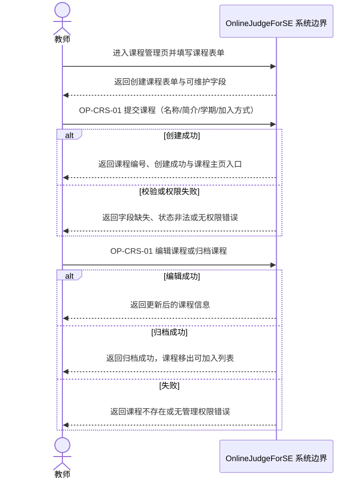

图 4-38 课程创建与维护系统顺序图



图 4-39 课程状态图（草稿/未开课/进行中/结课/归档）

##### 3.3.2.3.2 场景二：章节目录管理（CRS-SC-02）

教师维护课程的父子章节目录与排序，学生只读查看章节树。写操作必须通过课程管理权限校验，父章节不存在、自引用或层级循环、排序冲突均返回受控错误。

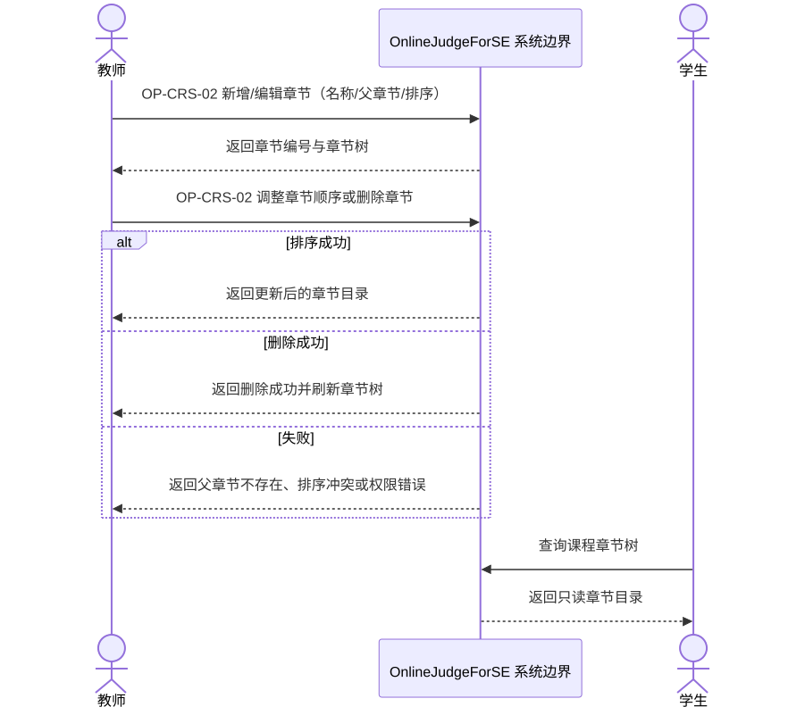

图 4-40 章节目录管理系统顺序图



图 4-41 章节目录管理活动图

##### 3.3.2.3.3 场景三：资源上传与下载（CRS-SC-03）

教师上传教学资源并设置可见范围，成员按可见范围下载。文件为空、超过 50MB、类型不支持或伪装可执行文件均被拒绝，且不生成无效资源记录；存储失败时不误报成功。

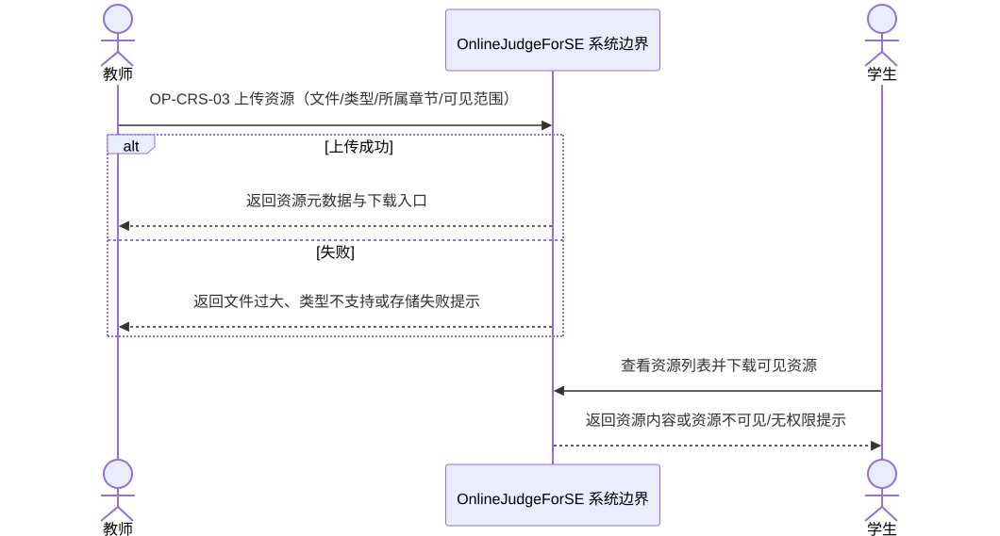

图 4-42 资源上传与下载系统顺序图



图 4-43 资源上传活动图（含失败回滚分支）

##### 3.3.2.3.4 场景八：公告发布与置顶（CRS-SC-08）

教师发布、编辑、置顶或删除课程公告；公告内容经过清洗与长度校验，置顶公告在成员列表中优先展示，发布后触发 LRN 公告通知事件。

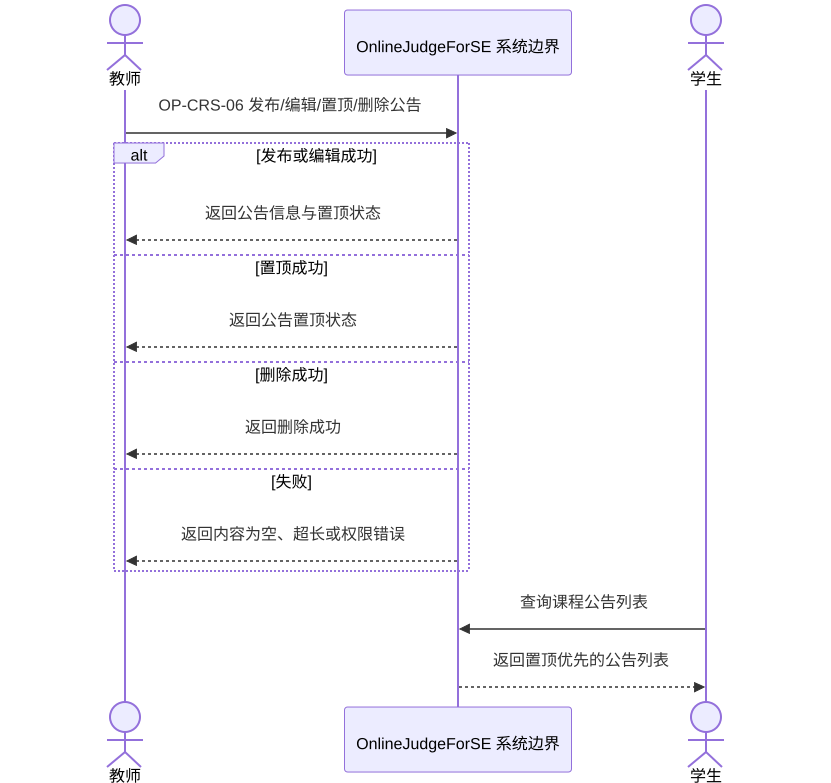

图 4-52 公告发布与置顶系统顺序图



图 4-53 公告发布与置顶活动图

### 3.3.3 UC-CRS-02 关键用例三：学生加入课程

1. 用例编号：UC-CRS-02。
2. 用例名称：学生加入课程。
3. 所属子系统：CRS 课程与教学资源。
4. 主参与者：学生。
5. 相关参与者：教师。
6. 触发条件：学生在课程列表中点击加入，或输入邀请码/课程标识发起加入请求。
7. 前置条件：学生已登录；目标课程处于可加入状态；课程准入规则、邀请码或审核配置可用。
8. 后置条件：直接加入成功时创建 CourseMember 并授予课程访问资格；需要审核时创建待处理加入申请。
9. 基本流程：学生检索或选择课程；提交加入请求；系统校验登录态、课程状态、加入方式、人数上限和重复加入情况；直接加入模式下系统创建课程成员关系；系统开放课程主页、资源、实验、作业和公告入口；学习过程模块可基于成员关系生成任务和进度。
10. 备选流程/异常流程：申请后审核模式下系统返回等待审核状态，教师审核通过后再建立课程成员关系；课程关闭、人数已满、邀请码错误、重复加入、课程不存在或网络失败时，系统返回明确失败原因。
11. 业务规则：未审核通过前不得开放课程资源和任务；同一学生在同一课程中只能存在一个有效成员关系；课程成员关系是后续 LAB、HWK、GRD、LRN 权限判断的基础。
12. 关联功能需求 FR/NFR：FR-CR-04、FR-CR-05、FR-CR-06；NFR-CR-01、NFR-CR-02、NFR-CR-03、NFR-CR-05。
13. 关联系统操作 OP：OP-CRS-04、OP-CRS-05、OP-CRS-07。
14. 验收场景：Given 学生已登录且输入有效邀请码，When 学生提交加入请求，Then 系统创建课程成员关系并允许访问课程主页；Given 课程配置为审核加入，When 学生提交申请，Then 系统生成待审核申请且暂不开放课程任务。

#### 3.3.3.1 课程加入系统顺序图

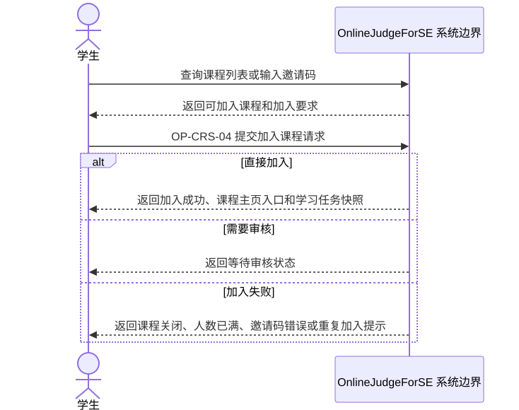

图 4-12 课程加入系统顺序图

#### 3.3.3.2 系统操作合约

UC-CRS-02 的关键系统操作合约如下，其余系统操作完整合约见 9.3 表 14-5：

| OP 编号 | 操作签名 | 所属用例 | 参与者 | 前置条件 | 后置条件 | 正常结果 | 异常结果 | 影响的领域对象 | 关联 FR/NFR |
| --- | --- | --- | --- | --- | --- | --- | --- | --- | --- |
| OP-CRS-04 | `joinCourse(courseId, joinPayload)` | UC-CRS-02 | 学生 | 学生已登录；课程允许加入；课程编号、邀请码或申请信息有效 | 创建 ACTIVE 成员或 PENDING 加入申请 | 返回加入成功、等待审核或课程主页入口 | 课程关闭、人数已满、邀请码错误或重复加入返回错误 | Course、CourseMember、JoinApplication、Notification | FR-CR-04、FR-CR-05；NFR-CR-01、NFR-CR-03 |

#### 3.3.3.3 CRS 独立业务场景图组（二）

场景四至场景九承接 3.3.2.3 的场景清单（表 4-4）与图组索引（表 4-5）。

##### 3.3.3.3.1 场景四：公开加入课程（CRS-SC-04）

学生选择公开课程直接加入，系统校验课程状态、容量与重复加入后创建 ACTIVE 成员，学生立即获得课程资源与任务访问资格。课程成员状态机同时作为场景五、场景六的状态锚点。

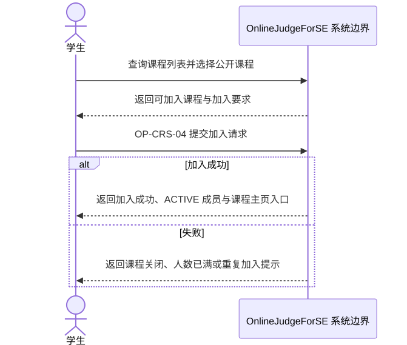

图 4-44 公开加入课程系统顺序图



图 4-45 课程成员状态机（公开加入视角）

##### 3.3.3.3.2 场景五：邀请码加入课程（CRS-SC-05）

学生输入邀请码加入课程。系统先校验课程状态，再按课程配置校验邀请码；邀请码错误返回 INVALID_INVITE_CODE，匹配后继续校验容量与重复加入并创建 ACTIVE 成员。

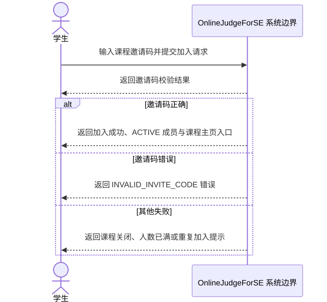

图 4-46 邀请码加入课程系统顺序图



图 4-47 邀请码加入课程活动图

##### 3.3.3.3.3 场景六：审批加入课程（CRS-SC-06）

学生提交审批制课程申请后成员状态为 PENDING，审批通过前不开放课程资源与任务；教师审批通过后成员置为 ACTIVE 并开放访问，拒绝后置为 REJECTED，学生可重新申请。成员状态流转见图 4-45。

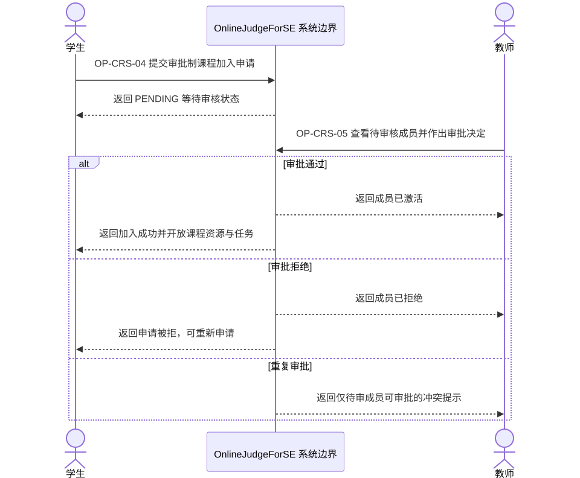

图 4-48 审批加入课程系统顺序图



图 4-49 审批加入课程活动图

##### 3.3.3.3.4 场景七：成员管理（CRS-SC-07）

教师查看课程成员列表与学生名单，调整课程内角色（STUDENT/ASSISTANT/TEACHER）或移除异常成员。系统强制最后一名教师保留限制、禁止修改自身教师身份，并校验成员状态流转。

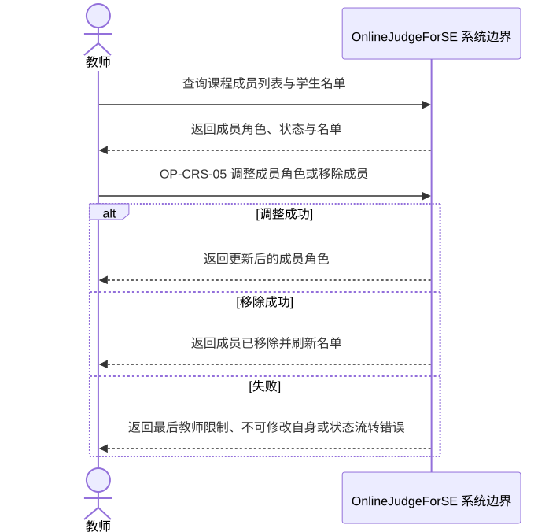

图 4-50 成员管理系统顺序图



图 4-51 课程成员角色状态图

##### 3.3.3.3.5 场景九：课程首页摘要（CRS-SC-09）

学生或教师进入课程首页时，系统校验课程成员关系，聚合课程基础信息、置顶公告与按截止时间排序的最近任务并展示摘要；非成员访问返回权限错误，无公告或无任务时展示对应空态。

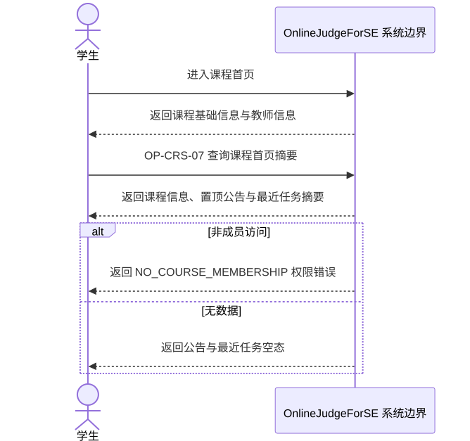

图 4-54 课程首页摘要系统顺序图



图 4-55 课程首页摘要活动图

### 3.3.4 UC-LRN-01 关键用例四：学生开始学习并查看学习任务/通知/进度

1. 用例编号：UC-LRN-01。
2. 用例名称：学生开始学习并查看学习任务、通知和进度。
3. 所属子系统：LRN 学习过程与通知提醒。
4. 主参与者：学生。
5. 相关参与者：教师、CRS、LAB、HWK、GRD。
6. 触发条件：学生进入学习中心、课程主页、通知中心，或从课程任务入口继续学习。
7. 前置条件：学生已登录并至少加入一门课程；存在可访问资源、任务、通知或历史学习记录。
8. 后置条件：任务列表、通知状态、学习进度和学习行为记录保持一致，并可被教师端统计和测试追溯。
9. 基本流程：学生进入学习中心或课程主页；系统按课程成员关系聚合资源、实验、作业和成绩相关通知；系统按类型、截止时间、完成状态和优先级展示任务；学生打开资源或任务继续学习；系统保存学习位置、任务状态和必要行为记录；系统展示通知列表和未读状态；学生点击通知后系统标记已读并跳转目标页面。
10. 备选流程/异常流程：暂无任务时展示空状态和课程资源入口；网络短时异常时保留最近学习记录并在恢复后同步；未加入课程、登录失效、任务已删除、通知失效、进度同步失败或重复事件时，系统返回空态、失败提示或幂等处理结果。
11. 业务规则：任务聚合、通知读取和进度保存必须按当前用户与课程成员关系过滤；通知事件需避免重复创建。API-HWK-03 必须在 Assessment 的同一**本地**事务写入 Homework `PUBLISHED`/`publishedAt` 与 `assessment.homework.published.v2` outbox；仅该本地事务或持久化失败返回 `503/HWK_5003` 并整体回滚为 `DRAFT`。Learning 仅在 Course 原子 `course.membership.snapshot.v2` 的完整 roster watermark 已落库时按 `receiverScope` 应用作业；任一单成员事件（包括 REMOVED）或版本缺口都必须 durable-defer 原 envelope。Course 定时对账生成的完整 snapshot 是课程聚合唯一可从空/恢复投影 fast-forward 的权威替换事实；追平后按原 eventId 一次收敛。事务提交后 Learning、broker、网络或其他下游失败不得回滚已发布作业，必须通过有限重试、DLQ、受控 replay 与幂等消费最终收敛；无任务、无通知和同步失败必须有可理解反馈。
12. 关联功能需求 FR/NFR：FR-LN-01 ~ FR-LN-06；NFR-LN-01 ~ NFR-LN-05。
13. 关联系统操作 OP：OP-LRN-01、OP-LRN-02、OP-LRN-03、OP-LRN-04、OP-LRN-05。
14. 验收场景：Given 学生已加入课程且课程存在作业和实验，When 学生进入学习中心，Then 系统展示任务、截止时间、完成状态和通知入口；Given 学生点击一条属于本人的成绩通知，When 通知目标仍可访问，Then 系统标记通知已读并跳转到成绩页面。

#### 3.3.4.1 UC-LRN-01 业务场景拆分与边界

以下 `LRN-SC-*`、`LRN-SUB-*` 仅用于把 `UC-LRN-01` 拆成可核查、可测试的分析单元，不是新增或重排正式 UC 编号。

| 分析编号 | 类型 | 用户目标/职责 | 主成功 | 备选与异常 | 需求锚点 |
| --- | --- | --- | --- | --- | --- |
| LRN-SC-01 | 独立场景 | 学生查看与筛选个人学习任务中心 | 聚合本人有效课程的资源、实验和作业，展示截止时间、状态、优先级与入口 | 无任务返回空态；来源失败给出提示；非成员数据不可见 | FR-LN-01、FR-LN-04、FR-LN-06 |
| LRN-SC-02 | 独立场景 | 学生继续学习并保存/恢复进度 | 打开目标、恢复 `lastPosition`，保存位置和完成状态 | 目标删除或越权时安全失败；短时断线保留同用户同课程记录，恢复后重放 | FR-LN-02、FR-LN-03 |
| LRN-SC-03 | 独立场景 | 学生查看个人学习统计 | 展示近 7 天趋势、学习时长、访问次数、完成任务数和最近记录 | 无数据返回空态；普通读取失败可提示同用户缓存；401/403 不使用旧缓存 | FR-LN-03 |
| LRN-SC-04 | 独立场景 | 当前用户查看、筛选、已读、删除通知并跳转 | 返回本人通知和未读数，状态变更留痕，跳转受控业务地址 | 过期目标停留安全页面；越权操作按不存在处理；重复事件不重复创建 | FR-LN-04、FR-LN-05 |
| LRN-SC-05 | 独立场景 | 学生配置提醒并接收截止提醒 | 保存偏好，扫描临近截止且未提交任务并生成站内提醒 | 已提交或关闭非必要提醒时跳过；失败写扫描日志并保留复测依据 | FR-LN-06 |

公共子流程为：`LRN-SUB-01` 成员过滤与任务聚合、`LRN-SUB-02` 进度保存/行为记录/离线重放、`LRN-SUB-03` 跨模块事件转通知及幂等/失败处理、`LRN-SUB-04` 提醒扫描/偏好/失败日志、`LRN-SUB-05` 通知状态转换与安全跳转。教师查看课程学习进度或统计具有不同参与者、权限范围和聚合目标，当前标记为**候选独立场景**；在教师/助教确认前仍按 FR-LN-02 的授权查询能力处理，不新增正式 UC。

需求层图源与静态图清单由 `docs/diagrams/lrn/manifest.json` 统一索引：

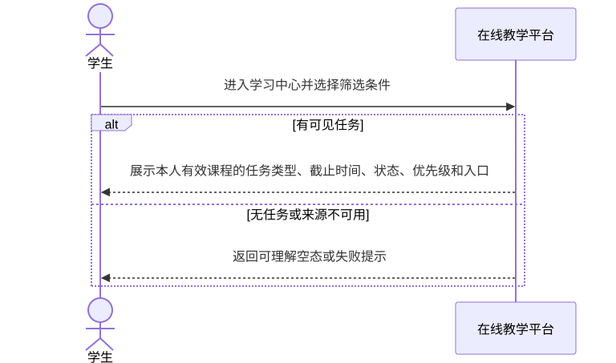

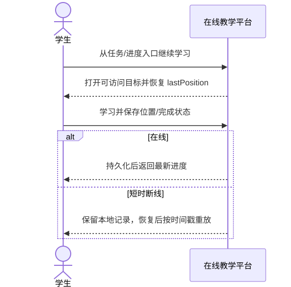

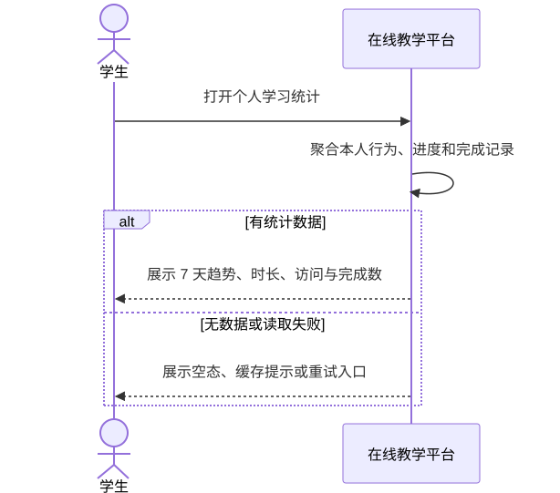

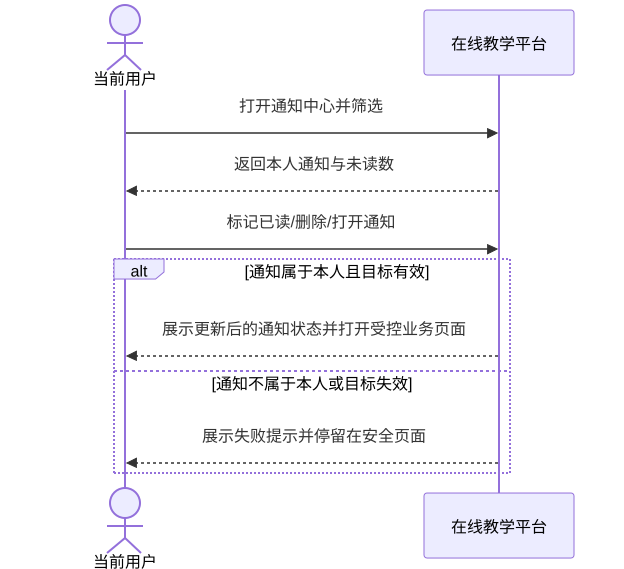

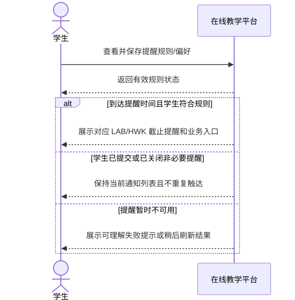

#### 3.3.4.2 学习任务与进度系统顺序图

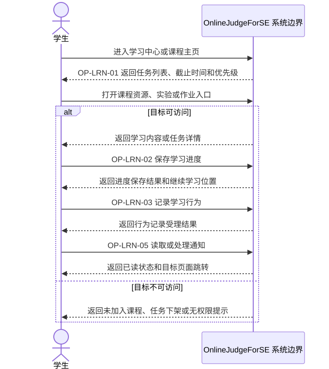

图 4-19 学习任务与进度系统顺序图

#### 3.3.4.3 通知反馈系统顺序图

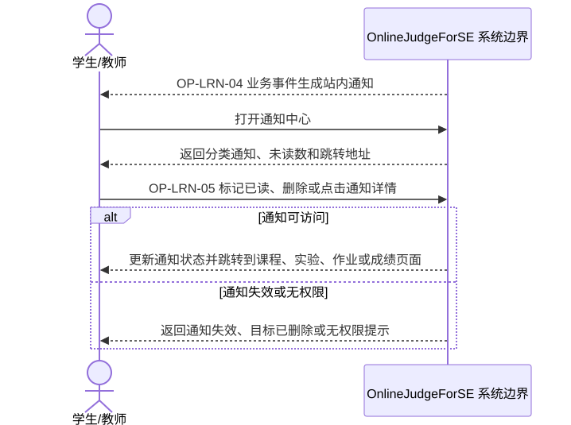

图 4-16 通知反馈系统顺序图

#### 3.3.4.4 系统操作合约

UC-LRN-01 涉及的 OP-LRN-01 ~ OP-LRN-05 系统操作合约见 9.3 表 14-5。

### 3.3.5 UC-LAB-01 关键用例五：教师发布实验

1. 用例编号：UC-LAB-01。
2. 用例名称：教师创建并发布实验。
3. 所属子系统：LAB 实训实验。
4. 主参与者：教师。
5. 相关参与者：学生、CRS、LRN。
6. 触发条件：教师在课程实验管理页发起新建实验或发布实验。
7. 前置条件：教师已登录并拥有课程管理权限；课程处于可教学状态；附件和测试用例配置能力可用。
8. 后置条件：系统创建 Lab/Experiment 草稿或已发布实验；发布成功后课程学生可见，学习任务和通知可被生成。
9. 基本流程：教师填写实验标题、说明、开放时间、截止时间、附件、报告要求和评分方式；系统校验课程权限和字段合法性；系统保存实验草稿；教师维护附件和测试用例；教师确认发布；系统将实验状态变为已发布，并向课程学生开放入口和通知事件。
10. 备选流程/异常流程：教师可仅保存草稿；附件上传失败、截止时间非法、测试用例缺失或格式错误、课程无权限、课程已归档或通知生成失败时，系统拒绝发布或返回可追踪失败状态。
11. 业务规则：未发布草稿不得进入学生任务中心；发布失败不得向学生生成可提交任务；开放时间不得晚于截止时间；测试用例和报告要求应在发布前完成合法性校验。
12. 关联功能需求 FR/NFR：FR-LAB-01、FR-LAB-04、FR-LAB-05；NFR-LAB-01 ~ NFR-LAB-05。
13. 关联系统操作 OP：OP-LAB-01、OP-LAB-02、OP-LAB-03。
14. 验收场景：Given 教师拥有课程管理权限且填写合法实验信息，When 教师确认发布实验，Then 系统将实验置为已发布并让课程学生在任务入口可见；Given 截止时间早于开放时间，When 教师发布实验，Then 系统拒绝发布并提示时间设置不合法。

#### 3.3.5.1 实验创建与发布系统顺序图

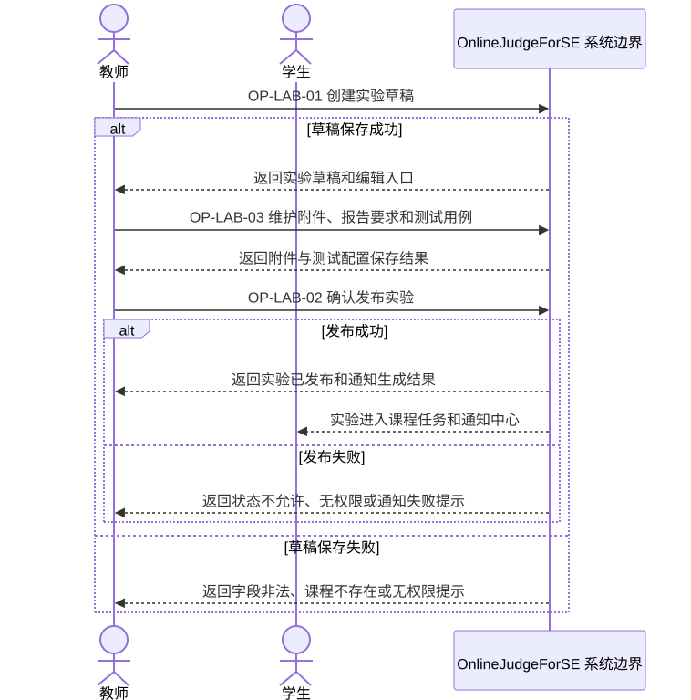

图 4-18 实验创建与发布系统顺序图

#### 3.3.5.2 系统操作合约

UC-LAB-01 的关键系统操作合约如下，其余系统操作完整合约见 9.3 表 14-5：

| OP 编号 | 操作签名 | 所属用例 | 参与者 | 前置条件 | 后置条件 | 正常结果 | 异常结果 | 影响的领域对象 | 关联 FR/NFR |
| --- | --- | --- | --- | --- | --- | --- | --- | --- | --- |
| OP-LAB-01 | `createExperiment(experimentForm)` | UC-LAB-01 | 教师 | 教师已登录并拥有课程管理权限；课程编号、标题、说明、开放时间和截止时间合法 | 创建实验草稿 | 返回实验草稿编号、状态和编辑入口 | 字段非法、课程不存在或无权限返回错误 | Lab、AuditLog | FR-LAB-01；NFR-LAB-01、NFR-LAB-05 |

### 3.3.6 UC-HWK-01 关键用例六：学生提交作业并触发自动评测

1. 用例编号：UC-HWK-01。
2. 用例名称：学生提交作业并触发自动评测。
3. 所属子系统：HWK 作业与自动评测。
4. 主参与者：学生。
5. 相关参与者：教师、CRS、GRD。
6. 触发条件：学生在作业详情页提交文本、附件、客观题答案或代码。
7. 前置条件：学生已登录且是课程成员；作业已发布并处于可提交时间范围内。
8. 后置条件：系统创建 HomeworkSubmission，必要时创建 EvaluationTask；提交历史、评测状态、反馈和成绩来源可追踪。
9. 基本流程：学生打开作业详情并查看要求；TEXT/CODE 作业直接填写答案，FILE 作业先通过 API-HWK-23 上传单个附件并获得服务端生成的 `fileId`；系统校验登录态、课程成员关系、作业状态、截止时间及文件边界；提交时 FILE 作业必须携带且仅携带一个 `fileId`，系统原子创建 HomeworkSubmission 并将附件从 `UPLOADED` 绑定为 `BOUND`；需要自动评测时系统创建评测任务；教师需要人工批阅或重评时提交评分和评语；学生在历史/结果页查看安全附件摘要，并通过 API-HWK-24 受控下载。
10. 备选流程/异常流程：未绑定附件可由上传者删除为 `DELETED`，上传后 24 小时未绑定则失效并由清理任务回收；上传、绑定或存储失败时保留可重试的页面状态并执行事务/存储补偿；允许多次提交时系统保留历史版本并标识当前有效版本；逾期、空提交、附件超限/格式不支持/过期/重用、非课程成员、越权下载或访问他人提交时，系统拒绝操作且不泄露附件是否存在。
11. 业务规则：提交必须绑定学生、课程、作业和提交版本；FILE 附件每次请求和每个提交均限 1 个、上限 10 MiB，扩展名/MIME/内容签名三重白名单仅允许 `pdf, zip, docx, xlsx, pptx, txt, md, csv, png, jpg, jpeg`；服务端仅使用生成的 UUID 和内部 `storageKey`，不向 DTO、页面或日志返回存储键、服务器路径或裸 URL；受控下载每次重新鉴权，仅提交学生本人或课程管理者可访问。
12. 关联功能需求 FR/NFR：FR-HWK-02、FR-HWK-03、FR-HWK-04、FR-HWK-05、FR-HWK-06；NFR-HWK-01 ~ NFR-HWK-05。
13. 关联系统操作 OP：OP-HWK-02、OP-HWK-03、OP-HWK-04、OP-HWK-05。
14. 验收场景：Given 学生是课程成员且作业开放，When 学生提交合法代码作业，Then 系统保存提交并创建评测任务，学生可看到评测中状态；Given 学生提交已截止作业，When 系统校验截止时间，Then 提交被拒绝且不产生新的有效版本。

#### 3.3.6.1 学生提交作业并触发自动评测系统顺序图

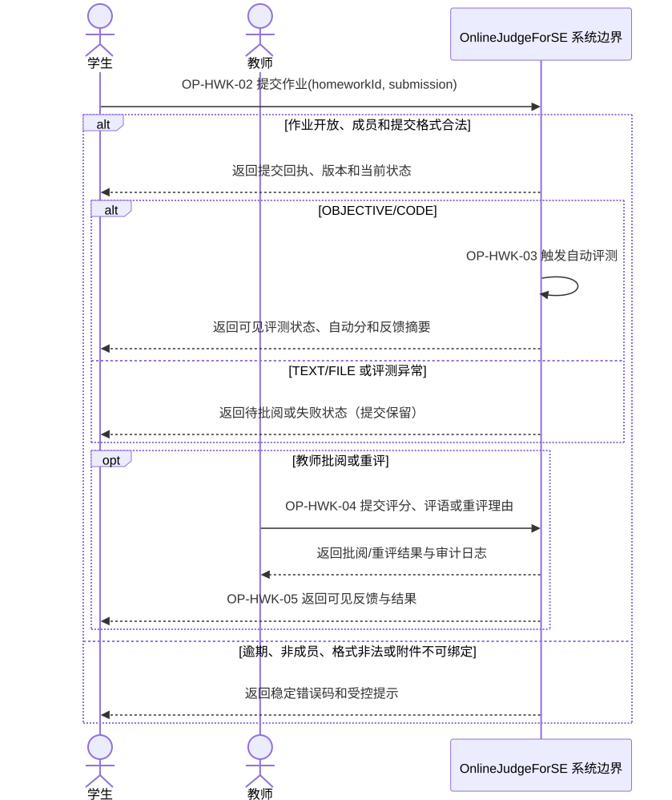

图 4-14A 学生提交作业并触发自动评测系统顺序图

#### 3.3.6.2 系统操作合约

UC-HWK-01 的关键系统操作合约如下，其余系统操作完整合约见 9.3 表 14-5：

| OP 编号 | 操作签名 | 所属用例 | 参与者 | 前置条件 | 后置条件 | 正常结果 | 异常结果 | 影响的领域对象 | 关联 FR/NFR |
| --- | --- | --- | --- | --- | --- | --- | --- | --- | --- |
| OP-HWK-02 | `submitHomework(homeworkId, submission)` | UC-HWK-01 | 学生 | 学生为课程成员；作业已发布且可提交；作业编号、文本、附件或代码符合提交要求 | 保存作业提交和提交历史 | 返回提交成功、当前有效版本和后续评测/批阅状态 | 逾期、格式错误、文件过大、非成员或越权返回错误 | Homework、HomeworkSubmission、SubmissionFile | FR-HWK-02、FR-HWK-03；NFR-HWK-01、NFR-HWK-03、NFR-HWK-04 |

### 3.3.7 UC-GR-01 关键用例七：教师发布成绩

1. 用例编号：UC-GR-01。
2. 用例名称：教师汇总并发布成绩。
3. 所属子系统：GRD 成绩评价与教学分析。
4. 主参与者：教师。
5. 相关参与者：学生、LAB、HWK、LRN。
6. 触发条件：教师在成绩管理页确认成绩汇总并点击发布。
7. 前置条件：教师拥有课程成绩管理权限；成绩项规则已配置；LAB/HWK 来源成绩可读取且关键评分项满足发布条件。
8. 后置条件：系统创建或更新 GradeRecord 发布状态和发布记录；学生可查询本人已发布成绩；来源事务成功提交后，系统以 after-commit best-effort 方式尝试生成成绩发布通知。
9. 基本流程：教师触发来源同步与总评重算；系统返回 `calculationBatchId`、`affectedItemCount`、`affectedStudentCount`、`syncedCount`、`missingCount` 和 `ungradedCount`；教师通过独立成绩总表查询确认同步结果和发布范围；发布操作自行执行规则、未评分状态和范围校验；系统锁定本次发布版本并记录发布人、时间和范围；系统向学生开放已发布成绩查询；publisher 在来源事务内登记 after-commit 回调，提交后由 LRN 独立事务持久化成绩通知。
10. 备选流程/异常流程：教师发现异常时可返回修改成绩或规则后再发布；存在未评分任务、规则缺失、发布范围非法或无权限时，系统阻止发布并返回对应受控错误；对相同课程和发布范围的重复发布，系统幂等返回既有结果（同一 `publishId`）且不重复写发布记录或通知；来源事务回滚时不生成通知，提交后的通知独立事务失败时 publisher 只记录告警，不能反向回滚已提交的成绩和发布记录；当前发布记录及响应中的 `notificationStatus` 在登记回调前已写为 `SENT`，该字段不能证明通知已经实际落库；来源提供方抛出未映射异常时，同步事务回滚，当前接口由全局异常处理返回 HTTP 500、响应 `code=500` 和“系统错误，请联系管理员”，不返回 GRD 专用错误码或重试提示。
11. 业务规则：发布前必须能解释成绩项规则、来源成绩和总评结果；发布记录不得被静默覆盖；成绩发布后学生只能看到本人可见成绩；变更已发布成绩必须保留痕迹。
12. 关联功能需求 FR/NFR：FR-GR-02、FR-GR-03、FR-GR-04、FR-GR-05；NFR-GR-01 ~ NFR-GR-05。
13. 关联系统操作 OP：OP-GR-02、OP-GR-03、OP-LRN-04。
14. 验收场景：Given 教师已配置成绩规则且来源成绩完整，When 教师发布课程成绩，Then 系统生成发布记录并允许学生查询本人已发布成绩；Given 存在未评分 P0 任务，When 教师尝试发布成绩，Then 系统阻止发布或要求明确处理未评分项。

#### 3.3.7.1 成绩汇总与发布系统顺序图

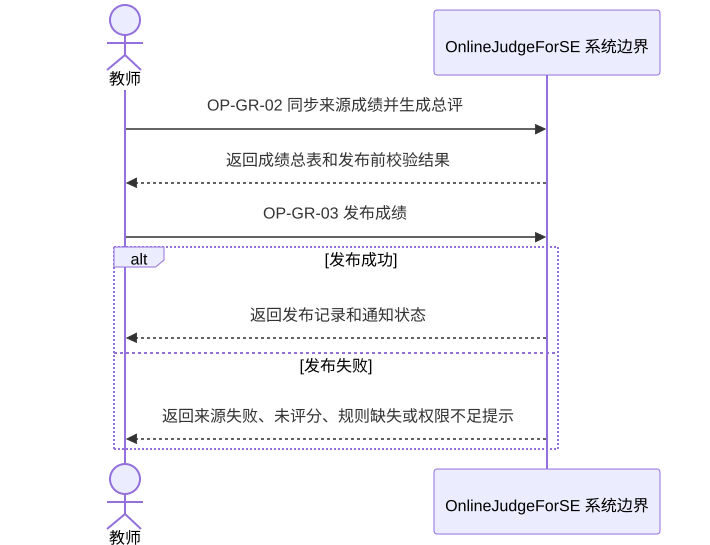

图 4-15 成绩汇总与发布系统顺序图

#### 3.3.7.2 系统操作合约

UC-GR-01 的关键系统操作合约如下，其余系统操作完整合约见 9.3 表 14-5：

| OP 编号 | 操作签名 | 所属用例 | 参与者 | 前置条件 | 后置条件 | 正常结果 | 异常结果 | 影响的领域对象 | 关联 FR/NFR |
| --- | --- | --- | --- | --- | --- | --- | --- | --- | --- |
| OP-GR-02 | `syncAndCalculateGrades(courseId)` | UC-GR-01、UC-GR-02、UC-GR-05 | 教师、系统 | 调用方有课程权限；接口仅接收路径 `courseId`，无请求体 | 筛选已启用、计入总评且具有正数来源编号的 LAB/HWK 成绩项，同步来源成绩、生成或刷新 GradeRecord，并重算课程总评；当前不调用规则校验 | 返回 `calculationBatchId`、`affectedItemCount`、`affectedStudentCount`、`syncedCount`、`missingCount`、`ungradedCount`；未配置可同步成绩项时仍返回成功计数；成绩总表需另调 API-GRD-08 | 来源提供方未映射异常返回通用 HTTP 500；权限不足返回 ERR-GRD-01/403 | GradeRecord、CourseGradeSummary、GradeCalculationBatch | FR-GR-02、FR-GR-03、FR-GR-06；NFR-GR-01、NFR-GR-03 |
| OP-GR-03 | `publishGrades(courseId, publishScope)` | UC-GR-01 | 教师 | 成绩已计算且教师确认发布范围 | 首次请求将成绩置为已发布并生成发布记录；相同范围重复请求复用既有记录 | 返回 `publishId`、`publishedCount`、`publishedAt` 和 `notificationStatus`；相同范围重复发布返回同一 `publishId` 且不重复通知 | 未评分、规则缺失、发布范围非法或无权限返回错误；通知持久化失败仅记告警，发布仍成功且当前 `notificationStatus` 仍为 `SENT` | GradeRecord、GradePublishRecord、Notification、AuditLog | FR-GR-03、FR-GR-04、FR-GR-05；NFR-GR-01、NFR-GR-03 |

来源同步与总评计算是 UC-GR-01/02 共用的 OP-GR-02，权限校验、成绩调整留痕和 LRN 通知是公共子流程，不新增或重排正式 UC 编号。

### 3.3.8 UC-LAB-02 关键用例八：学生提交实验并查看评测结果

1. 用例编号：UC-LAB-02。
2. 用例名称：学生提交实验并查看评测结果。
3. 所属子系统：LAB 实训实验。
4. 主参与者：学生。
5. 相关参与者：教师、CRS、GRD、LRN。
6. 触发条件：学生在实验详情页提交代码、文件或报告，或进入实验结果页查看评测结果。
7. 前置条件：学生已登录且是课程成员；实验已发布且未截止；代码类实验已配置测试用例。
8. 后置条件：系统创建 LabSubmission、提交版本、必要的 EvaluationTask 和与该提交版本一对一的可信源文件资产记录；评测结果、源文件、报告、教师评分、反馈和来源成绩可追踪。
9. 基本流程：学生查看实验说明、附件、提交要求和截止时间；学生提交代码、源文件或报告；系统校验登录态、课程成员关系、实验状态、提交格式、文件大小和语言白名单；系统保存提交记录、版本和可信附件元数据；代码类实验创建评测任务并返回受理状态；评测完成后系统保存得分、通过用例数和失败摘要；学生查看本人提交历史、当前有效版本、评测状态和可见反馈；具备当前课程管理权限的教师或管理员打开指定提交版本时，系统展示安全源文件元数据并通过后端受控接口下载；教师评分或发布实验成绩后系统展示教师评语和最终得分。
10. 备选流程/异常流程：允许多次提交时保留全部版本；评测耗时较长时展示处理中状态；实验要求报告时允许按规则补交报告；未加入课程、实验未发布或已截止、文件类型不支持、语言不支持、空提交、评测超时、评测异常、访问他人结果、源文件无可信元数据、资产已删除或物理文件缺失时，系统拒绝或展示稳定、可恢复的失败状态。
11. 业务规则：实验提交不得暴露其他学生结果；公共响应不得暴露 fileId、storageKey 或本地路径；源文件下载必须按登录态/角色、实验及其课程、课程管理权限、提交归属、资产状态和物理文件顺序复核；学生本人下载不在本期范围内；评测失败应展示可理解摘要并隐藏敏感运行路径；实验评分进入 GRD 前必须保留来源标识；报告和代码版本的有效性规则应对学生可见。
12. 关联功能需求 FR/NFR：FR-LAB-02、FR-LAB-03、FR-LAB-04、FR-LAB-05、FR-LAB-06、FR-LAB-07、FR-LAB-08；NFR-LAB-01 ~ NFR-LAB-05。
13. 关联系统操作 OP：OP-LAB-04、OP-LAB-05、OP-LAB-06、OP-LRN-04。
14. 验收场景：Given 学生是课程成员且实验开放，When 学生提交合法代码实验，Then 系统保存提交并返回评测状态，评测完成后学生可查看本人结果；Given 学生尝试查看他人实验提交，When 系统校验数据范围，Then 访问被拒绝且不返回他人结果。

#### 3.3.8.1 实验提交评测系统顺序图

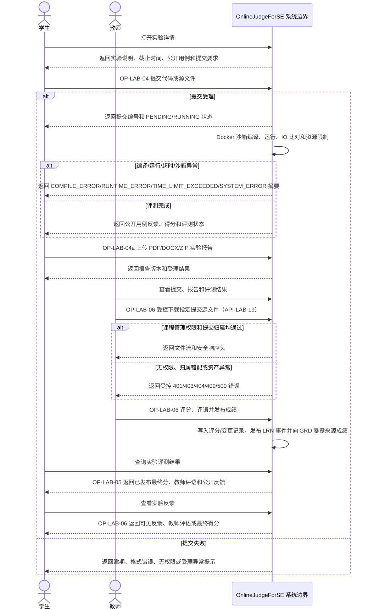

图 4-13 实验提交评测系统顺序图

#### 3.3.8.2 系统操作合约

UC-LAB-02 的关键系统操作合约如下，其余系统操作完整合约见 9.3 表 14-5：

| OP 编号 | 操作签名 | 所属用例 | 参与者 | 前置条件 | 后置条件 | 正常结果 | 异常结果 | 影响的领域对象 | 关联 FR/NFR |
| --- | --- | --- | --- | --- | --- | --- | --- | --- | --- |
| OP-LAB-04 | `submitExperiment(experimentId, submission)` | UC-LAB-02 | 学生 | 学生为课程成员；实验已发布且未截止；实验编号、代码、文件或报告符合提交要求 | 保存提交记录、版本和附件元数据 | 返回提交成功、提交版本和后续评测/反馈入口 | 逾期、空提交、文件非法、非成员或越权返回错误 | Lab、LabSubmission、SubmissionFile、LabReport | FR-LAB-02、FR-LAB-03、FR-LAB-05；NFR-LAB-01、NFR-LAB-03、NFR-LAB-04 |

### 3.3.9 UC-HWK-02 关键用例九：教师管理与发布作业

1. 用例编号：UC-HWK-02。
2. 用例名称：教师管理与发布作业。
3. 所属子系统：HWK 作业与自动评测。
4. 主参与者：教师。
5. 相关参与者：学生、CRS、LRN。
6. 触发条件：教师在课程作业管理页新建、维护或删除草稿，或确认发布作业。
7. 前置条件：教师已登录并拥有课程管理权限；课程处于可教学状态；作业题目、附件和测试用例配置能力可用。
8. 后置条件：系统创建 Homework 草稿或已发布作业；v2 中 Homework 状态更新和 `assessment.homework.published.v2` outbox 记录在同一本地事务成功后，课程学生即可见该作业；Learning 最终消费事件并生成学习任务和通知。删除草稿后父作业对正常查询不可见，题目、测试用例、判题配置、提交、评测、批阅和重评历史仍保留。
9. 基本流程：教师填写作业标题、说明、所属课程、截止时间、作业类型、评分方式和可见策略；教师配置客观题、文本题、文件提交要求或代码题测试用例；系统校验课程权限、字段完整性、时间、分值和测试用例格式；系统保存作业草稿及配置；教师可在总览确认删除仍为 DRAFT 的草稿，或确认发布；系统以原子条件完成逻辑删除，或在同一**本地**事务中将状态更新为已发布并写入 `assessment.homework.published.v2` outbox 记录。该事件必须包含 `homeworkId, courseId, title, deadline, receiverScope=COURSE_ACTIVE_STUDENTS`，不得携带学生 roster；本地事务提交后学生可见，Learning 按自身 Course 成员投影异步、幂等地生成任务和通知。
10. 备选流程/异常流程：教师可保存草稿稍后编辑；未发布前可调整题目、附件、测试用例和评分规则；取消删除确认时不发送请求；普通作业可不启用自动评测；无课程权限、课程不存在或已删除、作业已不再是 DRAFT、截止时间非法、题目分值不合法、测试用例格式错误、附件上传失败时，系统拒绝操作并返回可追踪状态；Homework 状态或 outbox 记录的**本地事务**写入失败时返回 `503/HWK_5003`，发布事务整体回滚，作业保持 `DRAFT`。Learning、broker 或网络暂不可用时不回滚已提交的作业；由 outbox 重试、DLQ、重放和对账最终收敛。
11. 业务规则：未发布草稿不得出现在学生任务中心；只有作业所属课程管理者可删除 DRAFT，任何非 DRAFT 状态不得删除；删除为父表逻辑删除，不新增作业状态、不级联删除子数据和历史；普通更新不得写删除标记并须排除已删除作业，防止并发旧请求将其复活；发布作业必须绑定课程和发布人；代码题启用自动评测时必须具备合法测试用例；`HOMEWORK_PUBLISHED` 采用本地 Homework + outbox 原子提交。Learning 只能用有界 `title`、RFC3339 `deadline` 和 `receiverScope=COURSE_ACTIVE_STUDENTS` 解析任务/通知，禁止事件携带 `recipientUserIds` 或学生 roster。
12. 关联功能需求 FR/NFR：FR-HWK-01、FR-HWK-02、FR-HWK-04、FR-HWK-06；NFR-HWK-01 ~ NFR-HWK-05。
13. 关联系统操作 OP：OP-HWK-01、OP-LRN-01、OP-LRN-04。
14. 验收场景：Given 教师拥有课程管理权限且填写合法作业信息，When Homework + outbox 本地事务提交，Then 系统保存 `PUBLISHED` 作业并向课程学生开放入口；Learning 后续用事件中的 `title`、`deadline` 和有界 `receiverScope` 生成每名适用学生的任务/通知。Given Learning 或 broker 暂不可用，When 本地事务已提交，Then 作业仍为 `PUBLISHED` 且 outbox 留待重试，绝不回滚。Given 本地 Homework/outbox 事务失败，When 教师发布，Then 返回 `503/HWK_5003` 且作业保持 `DRAFT`。Given 课程管理者确认删除 DRAFT，When 系统完成原子逻辑删除，Then 父作业对正常查询不可见且全部子数据和历史保留；Given 作业为非 DRAFT 或已被并发删除，When 教师请求删除，Then 系统分别返回冲突或不存在且旧编辑不能复活作业；Given 代码题测试用例格式非法，When 教师发布作业，Then 系统拒绝发布并提示配置错误。

#### 3.3.9.1 教师创建并发布作业系统顺序图

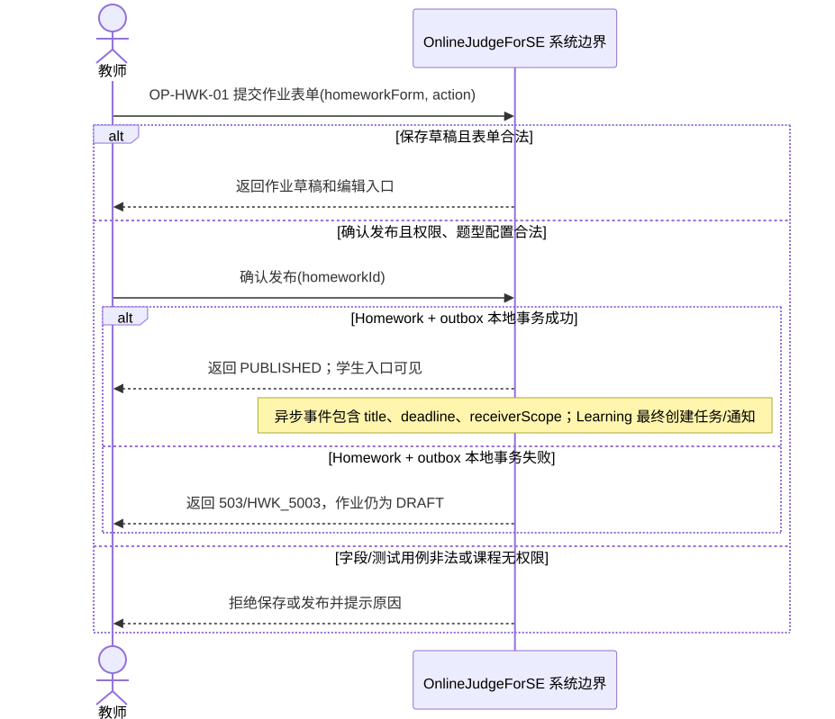

图 4-14B 教师创建并发布作业系统顺序图

#### 3.3.9.2 系统操作合约

UC-HWK-02 的关键系统操作合约如下，其余系统操作完整合约见 9.3 表 14-5：

| OP 编号 | 操作签名 | 所属用例 | 参与者 | 前置条件 | 后置条件 | 正常结果 | 异常结果 | 影响的领域对象 | 关联 FR/NFR |
| --- | --- | --- | --- | --- | --- | --- | --- | --- | --- |
| OP-HWK-01 | `createAndPublishHomework(homeworkForm)` | UC-HWK-02 | 教师 | 教师已登录并拥有课程管理权限；课程编号、标题、题目、附件、测试用例和发布配置合法 | 保存作业并在发布后生成任务和通知 | 返回作业已发布、课程作业入口和通知结果 | 字段非法、测试用例非法、课程无权限或通知失败返回错误 | Homework、HomeworkQuestion、TestCase、LearningTask、Notification | FR-HWK-01、FR-HWK-02、FR-HWK-04；NFR-HWK-01、NFR-HWK-05 |

### 3.3.10 UC-GR-02 关键用例十：教师配置成绩项与计算规则

1. 用例编号：UC-GR-02。
2. 用例名称：教师配置成绩项与计算规则。
3. 所属子系统：GRD 成绩评价与教学分析。
4. 主参与者：教师。
5. 相关参与者：LAB、HWK、CRS。
6. 触发条件：教师进入成绩项配置页并新增、修改或禁用成绩项。
7. 前置条件：教师拥有课程成绩管理权限；课程中存在可计分的 LAB/HWK 来源或其他允许来源。
8. 后置条件：系统创建或更新 GradeItem；规则校验、来源同步和重算不包含在保存响应中，需由独立操作触发。
9. 基本流程：教师选择课程并进入成绩项配置页；系统加载可用实验、作业和已有成绩项；教师填写成绩项名称、来源类型、来源编号、满分、权重、是否计入总评和显示顺序；系统校验课程权限、来源类型、LAB/HWK 来源编号为正整数、权重范围、满分范围和重复名称；OTHER_COURSE_ITEM 来源编号可为空；系统保存并返回完整 GradeItem；教师可另行调用规则校验，或在成绩总表页独立触发来源同步与重算。
10. 备选流程/异常流程：教师可禁用成绩项或保存后暂不重算；无权限、来源类型不支持、LAB/HWK 来源编号为空或非正数、权重非法、满分非法或重复名称时，系统拒绝保存；来源提供方抛出未映射异常时同步事务整体回滚，当前接口由全局异常处理返回 HTTP 500、响应 `code=500` 和“系统错误，请联系管理员”，不返回 GRD 专用错误码或重试提示。当前来源适配契约无法区分任务不存在或跨课程与任务未发布或暂无成绩，这些空结果均按课程学生生成 `MISSING` 成绩记录。
11. 业务规则：权重、满分和来源类型必须合法；LAB/HWK 必须提供正整数来源编号，OTHER_COURSE_ITEM 来源编号可为空；成绩项保存和现有同步接口均不单独验证来源任务存在性；任务不存在或跨课程、任务未发布或暂无成绩均返回空来源结果并按 `MISSING` 处理；来源提供方抛出异常时不得生成部分同步结果或不可解释总评。当前 GradeItem 修改请求不接收 `reason`，服务不检查关联成绩的发布状态，也不写入 `GradeChangeLog`，因此规则修改本身不产生原因、处理人和时间留痕；只有手动调整成绩或来源同步实际改变已发布 GradeRecord 时才写成绩变更记录。
12. 关联功能需求 FR/NFR：FR-GR-01、FR-GR-02、FR-GR-03；NFR-GR-01 ~ NFR-GR-05。
13. 关联系统操作 OP：OP-GR-01、OP-GR-02。
14. 验收场景：Given 教师拥有成绩管理权限且存在作业来源成绩，When 教师配置合法成绩项和权重，Then 保存接口返回完整 GradeItem，且不附带规则校验结果或重算提示；When 教师另行点击“校验规则”，Then 独立校验接口返回 `valid`、`totalIncludedWeight` 和 `errors`；Given 权重合计不满足课程规则，When 教师调用规则校验，Then 系统返回校验失败及权重错误；Given 成绩项已关联已发布成绩，When 教师直接修改 GradeItem，Then 当前接口不要求原因且不生成规则变更日志，后续仅在来源同步实际改变仍可同步的已发布 GradeRecord 时生成 `SOURCE_RESYNC` 留痕。

#### 3.3.10.1 成绩项配置系统顺序图

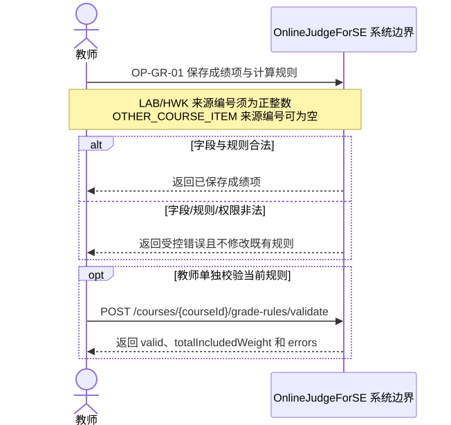

图 4-56 成绩项配置系统顺序图

#### 3.3.10.2 系统操作合约

UC-GR-02 的关键系统操作合约如下，其余系统操作完整合约见 9.3 表 14-5：

| OP 编号 | 操作签名 | 所属用例 | 参与者 | 前置条件 | 后置条件 | 正常结果 | 异常结果 | 影响的领域对象 | 关联 FR/NFR |
| --- | --- | --- | --- | --- | --- | --- | --- | --- | --- |
| OP-GR-01 | `saveGradeRule(courseId, gradeRule)` | UC-GR-02 | 教师 | 教师拥有课程成绩管理权限；课程存在；成绩项、来源类型、权重和满分合法；LAB/HWK 来源编号为正整数，OTHER_COURSE_ITEM 可为空 | 创建或更新 GradeItem；不隐式调用规则校验或重算；修改请求不接收原因、不检查关联成绩发布状态、不写 GradeChangeLog | 返回完整持久化 GradeItem；规则校验需另调 API-GRD-05 | 权重非法、来源类型不支持、LAB/HWK 来源编号为空或非正数、重复名称或无权限返回错误 | GradeItem | FR-GR-01、FR-GR-03；NFR-GR-01、NFR-GR-03 |

UC-GR-02 复用的来源同步与总评重算合约 OP-GR-02 见 3.3.7.2。

### 3.3.11 UC-GR-03 关键用例十一：学生查询已发布成绩

1. 用例编号：UC-GR-03。
2. 用例名称：学生查询已发布成绩。
3. 所属子系统：GRD 成绩评价与教学分析。
4. 主参与者：学生。
5. 相关参与者：CRS、LRN、LAB、HWK。
6. 触发条件：学生从成绩页、课程主页、学习中心或成绩通知进入成绩详情。
7. 前置条件：学生已登录并是课程成员；教师已发布对应成绩或成绩项。
8. 后置条件：学生查看到本人可见 GradeRecord 和来源反馈；未发布或无权限数据不泄露。
9. 基本流程：学生进入成绩页并选择课程；系统校验登录态、课程成员关系和本人数据范围；系统读取已发布成绩项明细、原始分、加权分、教师评语、发布时间和总评；系统展示成绩发布状态、总评状态和可见反馈；学生可从成绩明细进入来源实验或作业结果页；学生如存在异议，可从成绩页面发起 UC-GR-04。
10. 备选流程/异常流程：存在部分未发布成绩时只展示已发布部分；无成绩记录时展示空状态和课程任务入口；未加入课程、成绩未发布、查看他人成绩、登录失效、成绩记录缺失或来源任务归档时，系统拒绝访问或展示受控提示。
11. 业务规则：只展示本人且已发布成绩；未发布成绩、他人成绩和无权限课程数据不得通过页面或接口泄露；成绩明细需保留来源任务跳转或来源说明。
12. 关联功能需求 FR/NFR：FR-GR-04、FR-GR-05；NFR-GR-01 ~ NFR-GR-05。
13. 关联系统操作 OP：OP-GR-04、OP-LRN-05。
14. 验收场景：Given 教师已发布某课程成绩且学生是课程成员，When 学生查询成绩，Then 系统展示本人已发布成绩明细和总评；Given 学生尝试通过参数查看他人成绩，When 系统校验数据范围，Then 系统拒绝访问且不返回他人成绩。

#### 3.3.11.1 学生成绩查询系统顺序图

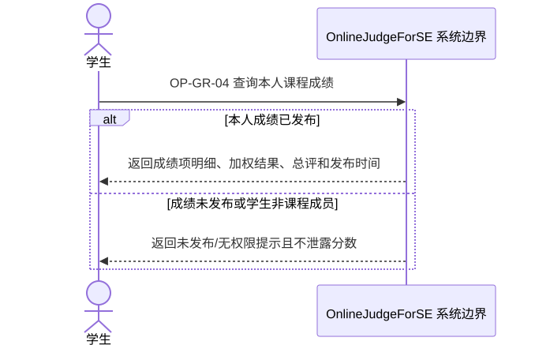

图 4-57 学生成绩查询系统顺序图

#### 3.3.11.2 系统操作合约

UC-GR-03 的关键系统操作合约如下，其余系统操作完整合约见 9.3 表 14-5：

| OP 编号 | 操作签名 | 所属用例 | 参与者 | 前置条件 | 后置条件 | 正常结果 | 异常结果 | 影响的领域对象 | 关联 FR/NFR |
| --- | --- | --- | --- | --- | --- | --- | --- | --- | --- |
| OP-GR-04 | `queryGradesAndAnalysis(query)` | UC-GR-03、UC-GR-05 | 学生、教师 | 用户已登录并通过课程权限校验；学生查询时成绩已发布 | 返回学生成绩、教师总表或教学分析结果 | 返回成绩明细、总评、来源反馈或教学分析结果 | 未发布不可见、越权访问、统计维度非法或数据缺失返回错误 | GradeRecord、GradeItem、GradeAppeal、GradeAnalysisSnapshot | FR-GR-05、FR-GR-06；NFR-GR-01、NFR-GR-04 |

### 3.3.12 UC-GR-04 关键用例十二：成绩异议提交与复核处理

1. 用例编号：UC-GR-04。
2. 用例名称：成绩异议提交与复核处理。
3. 所属子系统：GRD 成绩评价与教学分析。
4. 主参与者：学生、教师。
5. 相关参与者：CRS、LRN、LAB、HWK。
6. 触发条件：学生在已发布成绩详情页提交复核申请，或教师进入复核处理页处理待办。
7. 前置条件：学生已登录并可查看本人已发布成绩；教师拥有对应课程成绩管理权限；成绩异议入口可用。
8. 后置条件：系统创建或更新 GradeAppeal；复核状态、处理说明和成绩变更可追踪；来源事务提交后通知以独立事务持久化，成功时可在 LRN 查询，失败时仅记录服务端告警日志。
9. 基本流程：学生选择目标成绩项或总评并填写异议理由；系统校验学生身份、课程成员关系、成绩发布状态、目标归属和是否存在处理中申请；系统创建待处理异议，并登记 after-commit 通知回调；来源事务提交后 LRN 以独立事务通知教师；教师查看申请、来源成绩、原始分、当前分和学生理由；教师选择调整或驳回并填写处理说明；若调整成绩，系统记录调整前后值、处理人、时间和原因；系统更新异议状态并以同样方式在提交后尝试通知学生；学生查看复核状态、说明和调整后成绩。
10. 备选流程/异常流程：教师可维持原成绩并补充说明；学生可查看历史复核记录；若需重新评测，教师可先在 LAB/HWK 侧完成重评再处理成绩复核；未发布成绩、非本人成绩、重复处理中申请、教师无权限或调整分数非法时，系统拒绝并返回受控错误；来源事务回滚时不生成通知，提交后的通知独立事务失败时 publisher 捕获异常并记录告警，申请或复核结果保持可查询，响应不含通知结果字段。
11. 业务规则：同一成绩项同一时间只能存在一个处理中异议；教师只能处理授权课程内异议；任何成绩调整必须记录调整前后值、理由、处理人和处理时间；通知采用 after-commit best-effort 与独立事务边界，不允许通知先于来源业务提交；当前未提供持久 outbox 或自动重试。
12. 关联功能需求 FR/NFR：FR-GR-03、FR-GR-04、FR-GR-07；NFR-GR-01 ~ NFR-GR-05。
13. 关联系统操作 OP：OP-GR-05、OP-GR-03、OP-LRN-04。
14. 验收场景：Given 学生可查看本人已发布成绩，When 学生提交合法异议理由，Then 系统创建待处理异议并通知教师；Given 教师同意调整成绩，When 教师提交处理结果，Then 系统更新成绩、记录变更留痕并通知学生。

#### 3.3.12.1 成绩异议复核系统顺序图



图 4-58 成绩异议复核系统顺序图

#### 3.3.12.2 系统操作合约

UC-GR-04 的关键系统操作合约如下，其余系统操作完整合约见 9.3 表 14-5：

| OP 编号 | 操作签名 | 所属用例 | 参与者 | 前置条件 | 后置条件 | 正常结果 | 异常结果 | 影响的领域对象 | 关联 FR/NFR |
| --- | --- | --- | --- | --- | --- | --- | --- | --- | --- |
| OP-GR-05 | `handleGradeReview(reviewRequest)` | UC-GR-04 | 学生、教师 | 成绩已发布且申请人有权限，教师可处理课程 | 生成或更新复核记录，必要时写入成绩变更日志 | 返回异议已提交、待处理、已驳回或已调整状态 | 重复待处理申请、目标成绩不可复核、调整分数非法或无权限返回错误 | GradeRecord、GradeAppeal、GradeChangeLog、Notification | FR-GR-03、FR-GR-04、FR-GR-07；NFR-GR-01、NFR-GR-03 |

UC-GR-04 复用的成绩发布合约 OP-GR-03 见 3.3.7.2。

### 3.3.13 UC-GR-05 关键用例十三：教师查看教学分析

1. 用例编号：UC-GR-05。
2. 用例名称：教师查看教学分析。
3. 所属子系统：GRD 成绩评价与教学分析。
4. 主参与者：教师。
5. 相关参与者：CRS、LAB、HWK。
6. 触发条件：教师进入教学分析页，或在成绩管理页点击查看分析。
7. 前置条件：教师已登录并拥有课程管理或成绩查看权限；课程存在已同步的实验、作业或总评记录。
8. 后置条件：系统展示可解释的课程级或班级级统计结果，并保留统计范围、数据来源和更新时间。
9. 基本流程：教师选择课程、成绩项、时间范围或统计维度；系统校验教师课程权限并读取成绩记录、总评记录和统计快照；系统计算或加载均分、最高分、最低分、及格率、完成率和成绩分布；系统展示统计结果和数据来源时间点；教师按成绩项、任务类型或学生状态筛选分析结果；系统保留统计快照或查询结果来源。
10. 备选流程/异常流程：统计快照存在且来源数据未变化时可直接读取；教师可切换单个实验或作业完成情况；暂无成绩时展示空状态和成绩同步入口；无课程权限、来源成绩缺失、统计维度非法、计算失败或统计状态不一致时，系统展示失败提示。
11. 业务规则：教学分析只面向授权课程教师；统计范围、数据来源和更新时间必须可见；无成绩或来源异常时不得以静默空图替代。
12. 关联功能需求 FR/NFR：FR-GR-06；NFR-GR-01 ~ NFR-GR-05。
13. 关联系统操作 OP：OP-GR-04、OP-GR-02。
14. 验收场景：Given 教师拥有课程查看权限且课程存在已同步成绩，When 教师打开教学分析页，Then 系统展示均分、最高分、最低分、及格率、完成率和成绩分布；Given 课程暂无成绩数据，When 教师查看分析，Then 系统展示空状态和可追溯的数据来源提示。

#### 3.3.13.1 教学分析系统顺序图

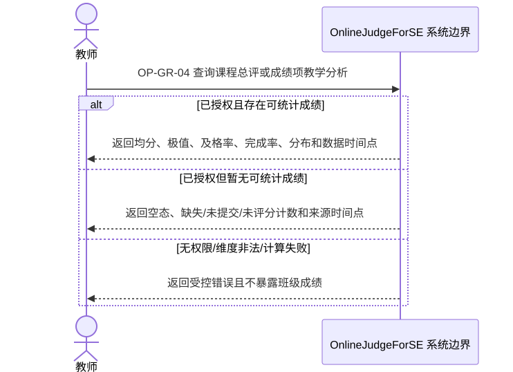

图 4-59 教学分析系统顺序图

#### 3.3.13.2 系统操作合约

UC-GR-05 复用 OP-GR-02（见 3.3.7.2）与 OP-GR-04（见 3.3.11.2），完整合约见 9.3 表 14-5。

### 3.3.14 系统操作合约就近索引

本表将第 3 章用例与系统操作合约建立就近引用。表 4-2 列出 UC 与 OP 的映射摘要；关键 OP 的需求层操作合约已按“用例描述—系统顺序图—系统操作合约”就近编排于 3.3.1 至 3.3.13 对应用例小节；9.3 表 14-5 保留 32 项系统操作的完整编号清单，后续概要设计、详细设计和测试文档应同时追踪 UC 与 OP。

说明：既有 RTM 已将实验提交定义为 OP-LAB-04、作业提交定义为 OP-HWK-02；为保持 32 项系统操作统计和测试映射稳定，本文不将 OP-LAB-03、OP-HWK-03 重新编号。关键操作合约按既有 RTM 编号补齐，覆盖 `submitExperiment(experimentId, submission)`（见 3.3.8.2）与 `submitHomework(homeworkId, submission)`（见 3.3.6.2）两类提交合约。

表 4-2 用例与系统操作合约就近索引

| UC 编号 | 主要系统操作签名 | 需求层输入/输出摘要 | 完整合约 |
| --- | --- | --- | --- |
| UC-AUTH-01 | `submitLogin(credentials)`、`verifyCredential(account, password)`、`createSession(userId)`、`loadRoleMenuAndAuthorize(userId, resource)` | 输入账号、密码、角色和目标资源；输出认证结果、会话、角色菜单和权限判断。 | 3.3.1.2；9.3 表 14-5 OP-AUTH-01 ~ OP-AUTH-04 |
| UC-CRS-01 | `saveCourse(courseForm)`、`saveChapterTree(courseId, chapters)`、`uploadResource(courseId, resourceFile)`、`publishCourseAnnouncement(courseId, announcement)`、`checkCoursePermission(userId, courseId, action)` | 输入课程表单、章节、资源和公告；输出课程、目录、资源记录和课程权限结果。 | 3.3.2.2；9.3 表 14-5 OP-CRS-01、OP-CRS-02、OP-CRS-03、OP-CRS-06、OP-CRS-07 |
| UC-CRS-02 | `joinCourse(courseId, joinPayload)`、`reviewCourseMember(applicationId, decision)`、`checkCoursePermission(userId, courseId, action)` | 输入课程编号、邀请码或审核决定；输出成员状态、等待审核或失败原因。 | 3.3.3.2；9.3 表 14-5 OP-CRS-04、OP-CRS-05、OP-CRS-07 |
| UC-LRN-01 | `aggregateLearningTasks(userId)`、`saveLearningProgress(progress)`、`recordLearningBehavior(event)`、`createNotification(event)`、`updateNotificationState(notificationId, action)` | 输入用户、任务来源、进度和通知动作；输出任务列表、进度、行为记录和通知状态。 | 9.3 表 14-5 OP-LRN-01 ~ OP-LRN-05 |
| UC-LAB-01 | `createExperiment(experimentForm)`、`publishExperiment(experimentId)`、`saveExperimentArtifacts(experimentId, artifacts)` | 输入实验表单、附件、报告要求和测试用例；输出实验草稿、发布状态和通知事件。 | 3.3.5.2；9.3 表 14-5 OP-LAB-01 ~ OP-LAB-03 |
| UC-LAB-02 | `submitExperiment(experimentId, submission)`、`evaluateExperimentSubmission(submissionId)`、`gradeAndSummarizeExperiment(experimentId, gradingPayload)`、`createNotification(event)` | 输入实验提交、测试配置和教师评分；输出提交版本、评测结果、反馈和来源成绩。 | 3.3.8.2；9.3 表 14-5 OP-LAB-04 ~ OP-LAB-06、OP-LRN-04 |
| UC-HWK-01 | `submitHomework(homeworkId, submission)`、`evaluateHomeworkSubmission(submissionId)`、`reviewHomeworkSubmission(submissionId, review)`、`getHomeworkFeedback(homeworkId, studentId)` | 输入作业提交、评测对象、教师评分/评语或重评理由；输出提交历史、评测状态、批阅/重评记录和可见反馈。 | 3.3.6.2；9.3 表 14-5 OP-HWK-02、OP-HWK-03、OP-HWK-04、OP-HWK-05 |
| UC-HWK-02 | `createAndPublishHomework(homeworkForm)`、`aggregateLearningTasks(userId)`、`createNotification(event)` | 输入作业表单、题目、附件和发布配置；输出作业状态、学习任务和通知事件。 | 3.3.9.2；9.3 表 14-5 OP-HWK-01、OP-LRN-01、OP-LRN-04 |
| UC-GR-01 | `syncAndCalculateGrades(courseId)`、`queryGradesAndAnalysis(query)`、`publishGrades(courseId, publishScope)`、`createNotification(event)` | 输入课程、成绩规则、查询/发布范围；同步返回批次与六项计数，成绩总表另行查询；发布返回记录并 best-effort 尝试生成通知。 | 3.3.7.2；9.3 表 14-5 OP-GR-02、OP-GR-03、OP-GR-04、OP-LRN-04 |
| UC-GR-02 | `saveGradeRule(courseId, gradeRule)`、`syncAndCalculateGrades(courseId)` | 输入成绩项、来源、权重和满分；保存仅返回完整 GradeItem，规则校验与重算由独立请求返回各自结果。 | 3.3.10.2；9.3 表 14-5 OP-GR-01、OP-GR-02 |
| UC-GR-03 | `queryGradesAndAnalysis(query)`、`updateNotificationState(notificationId, action)` | 输入课程、学生和通知动作；输出本人已发布成绩、来源反馈和通知状态。 | 3.3.11.2；9.3 表 14-5 OP-GR-04、OP-LRN-05 |
| UC-GR-04 | `handleGradeReview(reviewRequest)`、`publishGrades(courseId, publishScope)`、`createNotification(event)` | 输入异议对象、理由和处理结论；输出复核记录、成绩变更和通知。 | 3.3.12.2；9.3 表 14-5 OP-GR-05、OP-GR-03、OP-LRN-04 |
| UC-GR-05 | `queryGradesAndAnalysis(query)`、`syncAndCalculateGrades(courseId)` | 输入课程、成绩项和统计维度；输出统计指标、成绩分布和数据来源时间点。 | 3.3.7.2、3.3.11.2（复用）；9.3 表 14-5 OP-GR-04、OP-GR-02 |

## 3.4 领域模型

### 3.4.1 软件系统总体功能/对象结构

系统总体上由六个核心功能域构成：

AUTH 用户权限与平台安全
CRS 课程与教学资源
LRN 学习过程与通知提醒
LAB 实训实验模块
HWK 作业与自动评测模块
GRD 成绩评价与教学分析模块

这些模块共同围绕三类核心角色运转。用户权限与平台安全是基础支撑模块；课程与教学资源、学习过程与通知提醒构成教学运行主线；实训实验模块、作业与自动评测模块承担任务与反馈闭环；成绩评价与教学分析模块负责结果汇总与输出。

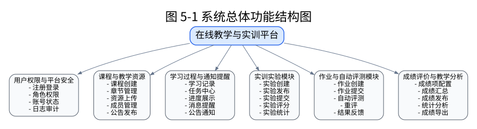

图 5-1 系统总体功能结构图

### 3.4.2 软件子系统功能/对象结构（概念类图）

从对象关系上看，本系统的核心对象包括用户、课程、章节、资源、实验、作业、提交、成绩、通知和日志。

对象关系约定如下：

- 一个用户在平台层仅对应一个主角色，在课程范围内可派生课程成员角色
- 一个教师可管理多门课程
- 一门课程包含多个章节、资源、实验和作业
- 一个学生可加入多门课程
- 一个实验/作业可产生多条提交记录
- 一条提交记录可关联自动评测结果、教师评语和最终得分
- 一门课程可生成多个成绩项和一个课程总评
- 通知与用户和事件双向关联
- 日志与关键操作和责任人关联

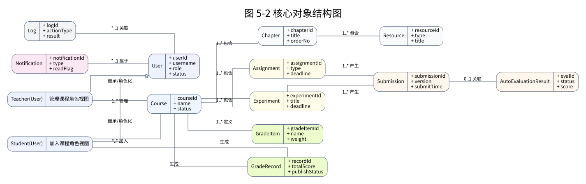

图 5-2 核心对象关系图（概念类图）

图 5-3 以概念类图形式展示核心概念、主属性及业务关系，并与图 5-2 共同说明系统对象结构。



图 5-3 核心概念类图

## 3.5 功能需求项

### 3.5.1 用户权限与平台安全

#### 3.5.1.1 功能目标

本模块负责平台用户身份认证、角色权限控制、访问控制与基础安全防护，保障不同角色在系统中的功能边界清晰、数据访问受控、关键操作可追踪，从而确保教学平台运行安全、数据安全与业务合规。

#### 3.5.1.2 需求项

##### FR-UA-01 用户注册与登录（P0）

1. 用户应能够通过学号/工号、手机号、邮箱或系统指定账号完成注册与登录。
2. 系统应支持学生、教师、管理员等不同类型用户身份的识别。
3. 用户登录成功后，系统应创建有效会话，并允许用户在授权范围内访问对应功能。
4. 用户退出登录后，系统应及时清除当前会话或令牌，使其不能继续访问需认证资源。

##### FR-UA-02 角色管理与权限分配（P0）

1. 系统应支持至少包含学生、教师、管理员三类角色。
2. 不同角色应具有不同的功能访问范围：学生侧重学习与提交，教师侧重课程与教学管理，管理员侧重平台级维护。
3. 管理员应能够对用户角色进行查看、分配、调整与维护。
4. 系统应确保未被授权的用户不能访问超出其角色范围的功能菜单、接口与数据。

##### FR-UA-03 身份认证与访问控制（P0）

1. 用户访问课程管理、作业管理、成绩管理、实验管理等核心业务功能前应先完成身份认证。
2. 系统应对页面访问、接口调用和资源下载进行权限校验。
3. 学生只能访问本人已加入课程、本人作业、本人实验记录和本人成绩等数据。
4. 教师只能访问本人负责课程范围内的教学管理数据。
5. 管理员可在平台授权范围内访问全局管理数据并执行维护操作。

##### FR-UA-04 账号信息与密码安全（P0）

1. 用户应能够修改个人基础信息，如昵称、联系方式、头像等。
2. 用户应能够修改登录密码，并在修改时校验原密码或采用其他有效身份验证方式。
3. 系统不得以明文形式存储用户密码。
4. 当用户连续多次登录失败时，系统应进行限制或提醒，以降低暴力破解风险。

##### FR-UA-05 权限异常处理与安全提示（P1）

1. 当用户访问无权限页面、接口或资源时，系统应明确提示“无权限访问”或返回相应失败结果。
2. 当用户登录状态失效、会话过期或认证信息无效时，系统应提示重新登录。
3. 对于被禁用、被冻结或异常状态的账号，系统应限制其登录和业务访问。
4. 系统在发生关键安全异常时，应保留必要日志以便排查。

##### FR-UA-06 关键操作审计（P1）

1. 系统应记录用户登录、退出登录、角色变更、密码修改、权限调整等关键操作。
2. 审计日志至少应包含操作时间、操作用户、操作类型、操作对象和结果状态。
3. 管理员应能够查看必要的安全审计记录，用于问题追踪与责任定位。

##### FR-UA-07 平台基础安全防护（P1）

1. 系统应对登录、注册、密码修改等输入内容进行合法性校验。
2. 系统应对非法请求、缺失认证信息请求和越权请求进行拦截。
3. 系统应避免因参数篡改导致越权访问、越权修改或越权删除。
4. 系统应在文件上传、资源访问、接口调用等场景中进行必要的安全校验。

#### 3.5.1.3 异常流程补充

- 用户名或密码错误。
- 账号不存在。
- 账号已被禁用或冻结。
- 登录状态失效。
- 用户无权限访问目标页面或资源。
- 用户尝试访问他人课程、作业、成绩或实验数据。
- 用户连续多次登录失败。
- 权限分配失败或角色配置异常。
- 关键安全日志记录失败。

#### 3.5.1.4 验收标准

Given 学生已成功登录，When 学生访问本人已加入课程的学习资源，Then 系统应允许访问。
Given 学生已成功登录，When 学生访问教师课程管理页面或管理员后台，Then 系统应拒绝访问并提示无权限。
Given 教师已成功登录，When 教师进入本人负责课程的管理页面，Then 系统应允许其进行课程、作业、实验等教学管理操作。
Given 管理员已成功登录，When 管理员调整某用户角色权限，Then 系统应完成修改并记录审计日志。
Given 用户登录状态已过期，When 用户继续访问需认证页面或接口，Then 系统应提示重新登录。
Given 用户连续多次输入错误密码，When 超过系统限制次数，Then 系统应执行限制策略或发出安全提示。

### 3.5.2 课程与教学资源

#### 3.5.2.1 功能目标

本模块负责课程创建、课程管理、教学资源上传与管理，是教学活动的主要入口。

#### 3.5.2.2 需求项

##### FR-CR-01 课程创建与管理（P0）

1. 教师应能够创建课程，填写课程名称、简介、开课时间、课程分类、课程封面等信息。
2. 教师应能够编辑课程信息、设置课程状态，如存草稿、未开课、已结课。
3. 管理员应能够查看平台全部课程并进行维护操作。
4. 课程创建后应自动关联创建者，并支持手动关联其他负责人。

##### FR-CR-02 课程章节与目录管理（P0）

1. 教师应能够为课程建立章节、单元或知识点结构。
2. 教师应能够调整章节顺序、增删章节及修改标题说明。
3. 学生进入课程后应能在课程主页首屏看到课程目录入口，并浏览教学内容。

##### FR-CR-03 教学资源管理（P0）

1. 教师应能够上传课程视频、文档、课件、压缩包、链接等资源。
2. 教师应能够为资源设置标题、类型、所属章节、可见范围和发布时间。
3. 学生应能够查看和下载授权范围内的教学资源。
4. 系统应记录资源上传时间、上传者和资源归属课程。

##### FR-CR-04 学生加入课程（P0）

1. 学生应能够通过课程邀请码直接加入课程，或在课程列表中发起加入申请。
2. 教师应能够在课程级别配置加入方式为“邀请码直接加入”或“申请后审核加入”。
3. 当课程配置为“申请后审核加入”时，教师或管理员应能够审核学生加入申请。
4. 加入课程成功后，学生应立即获得该课程的资源访问和任务参与资格。
5. 教师应能够查看选课学生名单。

##### FR-CR-05 课程成员管理（P1）

1. 教师应能够查看课程内学生列表、课程协作教师/助教列表和学生学习状态概览；助教作为课程内协作角色并入教师权限说明，不作为平台主角色单独建模。
2. 教师应能够移除异常成员或调整课程内协作角色。
3. 管理员可对课程成员关系进行纠错维护。

##### FR-CR-06 课程公告与基础信息展示（P1）

1. 教师应能够发布课程公告。
2. 学生进入课程首页后应看到课程简介、教师信息、公告和最近任务。
3. 课程关闭后，系统应保留课程历史数据的只读访问能力。

#### 3.5.2.3 异常流程补充

- 课程不存在。
- 课程关闭。
- 邀请码无效。
- 资源上传失败。
- 学生无权限访问该课程资源。

#### 3.5.2.4 验收标准

Given 教师已登录且拥有课程管理权限，When 教师填写课程信息并提交，Then 系统应创建课程并进入课程管理页。
Given 学生已加入某课程，When 学生进入课程主页，Then 系统应展示该课程的章节、资源和任务。
Given 教师已进入课程管理页，When 教师发布课程公告，Then 课程首页应展示最新公告内容。
Given 教师已进入课程成员页，When 教师按状态筛选课程成员，Then 系统应返回对应成员列表与学习状态概览。
Given 学生未加入课程，When 学生访问课程内部资源链接，Then 系统应拒绝访问。

### 3.5.3 学习过程与通知提醒

#### 3.5.3.1 功能目标

为本系统学生、教师、管理员提供**学习过程可视化、学习任务管理、学习进度跟踪、全场景通知提醒**能力，形成学习行为可记录、任务可追踪、消息可触达的闭环，保障教学流程顺畅、信息传递及时。

#### 3.5.3.2 需求项

##### FR-LN-01 学习任务中心展示（P0）

1. 学生端应展示个人学习任务列表，包含课程资源、实验、作业三类任务。
2. 任务按状态分为：未开始、进行中、已完成、已逾期，支持筛选与排序。
3. 任务卡片应展示：任务名称、所属课程、截止时间、完成进度、操作入口。
4. 支持按截止时间、任务类型、完成状态进行排序。

##### FR-LN-02 学习进度记录与展示（P0）

1. 系统应记录学生对课程资源、实验、作业的访问与完成情况。
2. 课程级学习进度以百分比形式展示，支持章节级进度明细。
3. 学习中断后重新进入，应自动恢复到上次学习位置。
4. 教师端可查看所教课程学生的整体学习进度统计。

##### FR-LN-03 学习行为跟踪（P1）

1. 记录学生学习时长、资源访问次数、任务提交时间等行为数据。
2. 前端展示个人学习仪表盘，包含近 7 天学习趋势、完成任务数。
3. 支持学习数据本地缓存，断网情况下可查看最近记录。

##### FR-LN-04 通知分类推送与展示（P0）

1. 通知分为：学习提醒、任务通知、成绩通知、系统公告、教师公告五类。
2. 未读通知以角标、加粗、高亮样式标识。
3. 支持按通知类型、时间范围、已读状态筛选。
4. 点击通知可直接跳转至对应业务页面。

##### FR-LN-05 通知触达与状态管理（P0）

1. 支持站内消息、页面弹窗、列表角标三种触达方式。
2. 通知支持单条 / 批量标为已读、单条删除操作。
3. 高优先级通知（逾期提醒、成绩发布）登录后立即弹窗提示。
4. 通知状态实时同步，多页面刷新保持一致。

##### FR-LN-06 定时提醒与规则配置（P1）

1. 支持任务截止前 24 小时、1 小时自动触发提醒。
2. 教师发布任务、发布成绩后自动推送通知。
3. 学生可在前端开启 / 关闭非必要通知提醒。

#### 3.5.3.3 异常流程补充

- 网络异常时，学习进度本地暂存，恢复后自动同步。
- 通知加载失败，提供重试按钮，不阻塞页面其他功能。
- 任务已删除 / 下架，点击提醒跳转至友好提示页。
- 重复提交不产生重复通知，避免消息轰炸。

#### 3.5.3.4 验收标准

Given 学生已加入课程且有进行中任务，When 进入学习中心，Then 展示任务列表与正确进度。

Given 任务即将截止，When 到达提醒时间，Then 学生收到对应通知与角标。

Given 学生点击未读通知，When 通知详情页打开，Then 系统标记为已读并跳转至对应页面。

Given 学习过程中断，When 重新打开页面，Then 恢复到上次学习位置。

Given 学生近 7 天存在学习记录，When 学生进入学习仪表盘，Then 系统应展示学习趋势与完成任务数。

### 3.5.4 实训实验模块

#### 3.5.4.1 功能目标

为本系统教师、学生、管理员提供**实验创建与发布、实验任务提交与管理、实验评分与反馈、实验统计与记录**能力，形成实验从布置到完成、从提交到评价的完整闭环，支撑课程实践教学环节的在线化运行。

#### 3.5.4.2 需求项

##### FR-LAB-01 实验创建与发布（P0）

1. 教师应能够创建实验，填写实验标题、实验说明、开放时间、截止时间、所属课程与章节、评分方式（自动评测/教师评分/综合）。
2. 教师应能够为实验上传附件（实验指导书、模板文件、参考数据等）。
3. 教师应能够设置实验状态：草稿、未开放、进行中、已截止。
4. 教师发布实验后，系统应自动通知课程内全体学生。
5. 实验应关联到所属课程与章节，支持在课程章节结构下展示。

##### FR-LAB-02 学生实验查看与提交（P0）

1. 学生应能够查看实验说明、附件、截止时间、提交要求和评分方式。
2. 学生应能够按实验要求提交代码文件、实验报告或其他指定格式附件。
3. 系统应对提交内容的文件格式、大小进行合法性校验，不合法时给出明确错误提示。
4. 提交成功后，系统应反馈提交状态、提交时间和提交版本号。
5. 实验截止后，系统应拒绝新的实验提交并给出明确的截止提示；当前交付版不提供实验迟交入口。
6. 学生上传源文件时，系统应在存储/入库前清理原始文件名，再保存清理后文件名、Content-Type、文件大小、上传人、所属课程/实验/提交版本、服务端生成的存储键和资产状态；下载前必须再次校验文件名。公共响应不得返回存储键、本地路径或裸 `fileId`。

##### FR-LAB-03 提交历史与版本管理（P0）

1. 在允许多次提交时，学生应能够查看历史提交记录，包括提交时间、提交状态和评测结果。
2. 教师应能够查看每名学生的全部提交版本。
3. 系统应明确标识最新提交和教师评分所依据的有效提交版本。
4. 历史提交记录应按时间倒序展示，支持按学生、按状态筛选。
5. 每个提交版本至多关联一份源文件资产；教师查看历史版本时，元数据和下载内容必须来自该版本，不能回退到最新版本或其他提交。
6. 仅有旧 `fileId` 且缺少可信元数据的历史记录应显示兼容阻塞状态，不得通过解析存储键猜测业务文件名或提供下载。

##### FR-LAB-04 实验自动评测（P0）

1. 对于代码类实验，系统应按照教师预设的测试用例进行输入输出比对，返回通过/不通过结果及得分。
2. 自动评测应记录评测状态（待评测、评测中、评测成功、评测失败），评测失败时返回可识别的失败原因。
3. 自动评测结果应与具体提交版本绑定，教师可查看评测详情。
4. 对于基础规模测试用例，自动评测应在 60 秒内返回最终结果或失败状态，前端应展示处理中状态，避免学生重复提交。

##### FR-LAB-05 实验报告管理（P1）

1. 学生应能够通过文件上传方式提交实验报告，支持的报告格式为 PDF、DOCX 或 ZIP，不提供在线编辑。
2. 教师应能够查看、下载学生的实验报告。
3. 实验报告应与对应实验提交关联，作为评分参考依据之一。
4. 系统应记录实验报告的提交时间、版本和文件信息。

##### FR-LAB-06 教师评分与评语（P0）

1. 对于教师评分或综合评分的实验，教师应能够查看学生提交内容、自动评测结果、实验报告及安全源文件元数据；源文件与实验报告必须保留两个独立下载入口。
2. 教师应能够给出评分并填写评语。
3. 教师应能够批量评分或按课程、实验、提交状态筛选待评分学生。
4. 教师修改评分后，系统应记录评分变更日志。
5. 仅当前课程 `canManageCourse` 校验通过的教师或管理员可通过受控接口下载指定提交版本的源文件；学生本人下载不在本期范围内，系统不得生成长期有效的匿名下载 URL。

##### FR-LAB-07 实验结果展示与学生反馈（P0）

1. 学生应能够查看实验的评分结果、自动评测详情（通过用例数、失败原因）和教师评语。
2. 教师发布成绩前，仅当实验配置为“允许成绩发布前查看结果”时，系统才向学生展示结果。
3. 成绩发布后，系统应通知学生查看实验成绩。

##### FR-LAB-08 实验统计与查询（P1）

1. 教师应能够查看单次实验的提交统计，包括已提交人数、未提交人数、平均分、各分数段分布。
2. 教师应能够查看课程维度下全部实验的完成情况汇总。
3. 管理员应能够查看平台级别的实验统计数据。

#### 3.5.4.3 异常流程补充

- 实验不存在或已被删除。
- 实验未开放或已截止。
- 提交文件格式不合法或超过大小限制。
- 自动评测执行失败或超时。
- 教师评分时提交内容加载失败。
- 学生试图查看教师未发布的评分结果。
- 重复提交同一版本内容。
- 匿名、学生本人、非成员、其他课程教师或跨课程/实验/提交猜测受控下载地址。
- 指定提交无源文件、旧数据缺少可信元数据、资产已删除、物理文件缺失、MIME 异常或文件存储读取失败。

#### 3.5.4.4 验收标准

Given 教师已登录且拥有课程管理权限，When 教师填写实验信息并发布，Then 系统应创建实验并向课程学生发送通知。
Given 实验处于进行中状态，When 学生提交合法代码文件，Then 系统应保存提交记录、返回提交成功并触发自动评测。
Given 实验允许多次提交，When 学生打开提交历史，Then 系统应按时间倒序展示全部版本并标识有效版本。
Given 代码类实验已配置测试用例，When 学生提交代码，Then 系统应在 60 秒内返回自动评测结果（通过用例数、得分）或明确失败原因。
Given 学生已上传实验报告，When 教师打开对应提交详情，Then 系统应展示报告文件信息并允许下载。
Given 学生以源文件完成一次实验提交，When 当前课程可管理教师打开该提交版本，Then 系统应展示原始文件名、类型和大小，并通过受控接口下载内容一致的该版本文件且不暴露内部存储标识。
Given 匿名用户、学生本人、非成员、其他课程教师或请求中的实验与提交不匹配，When 请求源文件下载，Then 系统应在读取物理文件前拒绝访问且不泄漏文件是否存在。
Given 教师进入评分页面，When 教师填写分数与评语并提交，Then 系统应保存评分结果并记录评分变更日志。
Given 教师进入实验统计页，When 选择某次实验，Then 系统应展示已提交人数、未提交人数、平均分和分数段分布。
Given 教师尚未发布实验成绩，When 学生查看实验评分，Then 系统应仅在实验配置为“允许成绩发布前查看结果”时展示评分结果。
Given 教师已发布实验成绩，When 学生进入实验详情页，Then 系统应展示评分、评语和自动评测详情。

### 3.5.5 作业与自动评测模块

#### 3.5.5.1 功能目标

本模块负责作业从发布、提交到自动反馈和教师处理的完整闭环，并提供单次作业的基础统计和待处理名单，是系统技术密度较高的核心模块。本版本以基础自动评测和固定五档分析为主，不实现复杂判题平台；课程级、跨作业、自定义区间、趋势和统计快照由 GRD 模块负责。

#### 3.5.5.2 需求项

##### FR-HWK-01 作业创建与发布（P0）

1. 教师应能够创建作业，填写作业标题、作业说明、截止时间、提交格式、评分方式和所属课程。
2. 作业可分为客观题作业、文件提交作业、代码提交作业等基本类型。
3. 教师应能够设置作业是否允许多次提交、是否允许逾期提交、是否允许学生在成绩发布前查看评测详情。
4. 作业所属课程管理者应能够在教师总览通过 API-HWK-22 确认删除 DRAFT 草稿。系统只逻辑删除父作业，保留题目、测试用例、判题配置、提交、评测、批阅和重评历史；删除后的普通编辑或发布请求不得将作业复活。

##### FR-HWK-02 学生作业查看与提交（P0）

1. 学生应能够查看作业说明、附件、截止时间和提交要求。
2. 学生应能够按作业要求提交文本、附件或代码内容。
3. 系统应对提交格式进行合法性校验。
4. 提交成功后，系统应反馈提交状态与时间。
5. FILE 作业应先通过 API-HWK-23 上传单个附件，并以服务端生成的 UUID `fileId` 参与提交；单次上传和单个提交均限 1 个附件。
6. 附件不得超过 10 MiB，扩展名、MIME 与内容签名必须一致通过 `pdf, zip, docx, xlsx, pptx, txt, md, csv, png, jpg, jpeg` 白名单。
7. 未绑定附件有效期为 24 小时，状态只能从 `UPLOADED` 转为 `BOUND` 或 `DELETED`；上传者只能删除本人、本课程、本作业且未绑定的附件。
8. FILE 作业提交中 `fileIds` 必须恰好包含 1 个 UUID，创建提交与附件绑定必须保持原子性，过期、已绑定、已删除或已被其他提交使用的 `fileId` 不得重用。
9. 同一学生在同一作业同时只允许 1 份 active `UPLOADED` 附件；顺序再上传应原子替换旧 active 附件，并发首次上传应仅有 1 个成功，其他请求返回 `409/HWK_4092` 并回滚失败物理对象。
10. 元数据或部分流写入失败应立即删除已写对象；删除失败应进入持久补偿 journal，损坏 marker 不得阻塞后续合法待删项。

##### FR-HWK-03 提交历史管理（P0）

1. 在允许多次提交时，学生应能够查看历史提交记录。
2. 教师应能够查看每名学生的全部提交版本。
3. 系统应明确标识最新提交和有效提交版本。
4. 历史与详情仅返回原始文件名、MIME、大小和受控下载可用性，不得返回 `storageKey`、服务器路径或裸下载 URL。

##### FR-HWK-04 自动评测（P0）

1. 对于客观题作业，系统应根据标准答案自动评分。
2. 对于基础代码类作业，系统应按照预设测试用例进行输入输出比对或基础结果校验。
3. 自动评测完成后，系统应生成评测结果，包括得分、通过情况和基础错误提示。
4. 对于基础规模测试用例，自动评测应在 60 秒内返回结果或失败状态，且过程应可回溯，教师可查看评测状态与结果摘要。

##### FR-HWK-05 教师批阅与重评（P1）

1. 教师应能够查看学生提交内容和自动评测结果。
2. 对主观题或综合作业，教师应能够人工给分并填写评语。
3. 教师应能够发起重评或重新触发自动评测。
4. 教师可按课程、作业、学生关键词、提交状态、评测状态和批阅状态筛选学生提交。
5. 教师可查看待评测和待批阅名单。待评测仅包含客观题/代码题且评测状态为 NONE、PENDING 或 RUNNING 的最终有效提交；待批阅包含批阅状态为 UNREVIEWED 或 NEED_REVIEW 的最终有效提交，其中文本题/文件题可直接进入，客观题/代码题仅在评测进入终态后进入。
6. 待处理筛选为提交列表的兼容增量；未选择待处理类型时，提交列表行为应保持不变。名单采用服务端分页和稳定排序，并能通过 URL 查询参数恢复筛选与页码。
7. 教师/助教只能通过 API-HWK-24 下载其可管理课程中的 FILE 提交；系统必须在每次请求时重新校验登录态、课程权限及提交与附件的绑定关系。

##### FR-HWK-06 作业反馈与结果展示（P0）

1. 学生应能够查看自己的评测结果、成绩和教师评语。
2. 对于代码类作业，学生可查看通过用例数量、失败原因摘要等基础反馈。
3. 教师发布成绩前，仅当作业配置为“允许提前查看评测详情”时，系统才向学生显示自动评测结果；否则隐藏得分和评语。
4. 教师应能够查看单次作业的活跃学生总数、已提交/未提交、可自动评测/已评测/待评测、已批阅/待批阅、已计分数量、平均分、最高分、最低分、固定五档分数分布和统计生成时间。
5. 固定五档为 `0-59`、`60-69`、`70-79`、`80-89`、`90-100`。分布使用 `effectiveScore = finalScore ?? autoScore`，并按 `effectiveScore / totalScore × 100` 归一化后分桶；无有效分数的提交不进入分布，已计分数量必须等于五档合计。
6. 评测完成率使用“已评测数量/可自动评测数量”。仅客观题和代码题属于可自动评测范围，文本题/文件题的 NONE 不得计入待评测或评测完成率分母。
7. 统计和待处理名单只覆盖 CRS 当前活跃学生的最终有效提交，即未删除、`is_final=true` 且提交状态为 SUBMITTED 或 LATE；历史版本、删除记录、REJECTED 和非当前课程学生均排除。
8. 未提交名单、待评测名单和待批阅名单均采用服务端分页。学生和无课程管理权限的教师访问统计或名单时应得到 403，且不得获得统计值、名单或学生标识。

#### 3.5.5.3 异常流程补充

提交格式不合法。
超时提交。
自动评测执行失败。
教师重评后结果更新失败。
FILE 提交中附件数量或 UUID 格式错误、超过 10 MiB、扩展名/MIME/内容签名不支持、过期、已绑定/已删除/重用、附件或绑定不存在、存储或补偿失败。
学生在成绩发布前试图查看未公开评分结果。
无课程管理权限的用户尝试删除草稿。
作业不存在、已经删除或在删除前并发变为非 DRAFT。

#### 3.5.5.4 验收标准

Given 教师已进入课程作业管理页，When 教师填写作业信息并发布，Then 系统应创建作业并向课程学生展示作业入口。
Given 课程管理者在教师总览确认删除 DRAFT，When 删除请求成功，Then 系统返回 `deleted=true` 和删除时间，列表刷新且该作业不再可见，题目、测试用例、判题配置、提交、评测、批阅和重评历史均保留。
Given 教师取消删除确认，When 返回作业总览，Then 系统不发送删除请求且原行保持不变。
Given 作业不存在或已经删除，When 课程管理者请求删除，Then 系统返回 `404 / HWK_4001`；Given 作业为任一非 DRAFT 状态，When 请求删除，Then 系统返回 `409 / HWK_4095`。
Given 无课程管理权限的用户请求删除，When 系统校验课程权限，Then 系统返回 `403 / HWK_4031` 且不改变数据。
Given 删除与普通编辑或发布并发，When 删除先成功，Then 后续旧更新失败且不得把 `is_deleted` 改回未删除。
Given 学生已加入课程且作业处于开放状态，When 学生上传合法文件并提交，Then 系统应保存提交并返回提交成功。
Given 同一学生/作业已有 active 未绑定附件，When 顺序上传新文件，Then 旧件被原子替换且 DB/物理存储只保留新 active 文件。
Given 同一学生/作业并发首次上传，When 两个请求竞争，Then 响应为 201 与 `409/HWK_4092`，且 DB active 行、物理对象均恰好 1 份。
Given 作业允许多次提交，When 学生查看历史提交，Then 系统应展示全部版本并标识当前有效版本。
Given 客观题已有标准答案，When 学生提交作答内容，Then 系统应自动计算得分并保存结果。
Given 代码题测试用例配置完成，When 学生提交代码，Then 系统应返回基础评测结果或失败原因摘要。
Given 教师进入作业批阅页，When 教师执行人工评分或发起重评，Then 系统应更新结果并保留重评记录。
Given 某个满分非 100 的作业存在当前活跃学生的有效得分，When 有权限教师查看作业统计，Then 系统应按归一化百分比分配到固定五档，并保证 `scoredCount` 等于五档合计。
Given 作业没有任何有效得分，When 有权限教师查看统计，Then 系统应返回五个键均为 0 的分布、`scoredCount=0` 和统计生成时间。
Given 存在文本题/文件题以及处于评测中或评测终态的代码题，When 教师切换待评测和待批阅名单，Then 文本题/文件题的 NONE 不进入待评测，代码题仅在评测终态后按批阅状态进入待批阅。
Given 存在历史版本、删除记录、REJECTED 提交或已退出课程学生，When 系统生成统计与待处理名单，Then 这些记录均被排除，三个名单仍以服务端分页稳定返回且 URL 可恢复。
Given 学生或无课程管理权限的教师访问作业统计或待处理名单，When 请求到达服务端，Then 系统应返回 403 且不泄露统计或学生信息。
Given 教师尚未发布成绩，When 学生查看作业得分，Then 系统应仅在作业配置为“允许提前查看评测详情”时展示结果。

### 3.5.6 成绩评价与教学分析

#### 3.5.6.1 功能目标

本模块负责对实验、作业等教学任务结果进行汇总、计算、展示和基础分析，是系统教学效果输出层的重要组成部分。模块应支持教师定义成绩项和计算规则，自动汇总实验、作业等来源成绩，生成学生个人成绩记录和课程总评，并通过发布机制向学生展示结果。同时，模块应支持学生对已发布成绩提出异议并由教师进行复核处理，支持教师查看班级整体成绩情况和基础教学分析结果，为课程改进提供数据支持。本版本以基础成绩管理、成绩复核和统计分析为主，不实现复杂教务系统能力和高级智能分析能力。

#### 3.5.6.2 需求项

##### FR-GR-01 成绩项配置与计算规则（P0）

1. 教师应能够在课程范围内定义成绩项，包括成绩项名称、成绩来源、满分值、权重和是否计入总评。
2. 成绩来源可包括实验成绩、作业成绩及其他课程内可计分项目。
3. 系统应支持按预设权重自动计算课程总评。
4. 教师应能够修改未发布成绩的计算规则。
5. 当成绩规则发生变更时，系统应支持对相关成绩进行重新计算。
6. 当前 GradeItem 修改接口不接收变更原因、不检查关联成绩发布状态，也不写入 GradeChangeLog；已发布成绩关联规则的修改本身没有原因、处理人和时间留痕。已发布 GradeRecord 或课程总评的手动调整仍须按 FR-GR-03/04 留痕。

##### FR-GR-02 成绩汇总与总评生成（P0）

1. 系统应能够从实验模块、作业与自动评测模块读取已产生的评分结果，并按课程、学生和成绩项进行汇总。
2. 系统应能够区分原始分、加权分和课程总评。
3. 对于未提交、未评分、缺失成绩等情况，系统应能够给出明确状态标识，并按课程规则参与或暂不参与总评计算。
4. 系统应为每名学生生成课程成绩记录，并支持后续查询和发布。

##### FR-GR-03 教师成绩管理（P0）

1. 教师应能够查看课程成绩总表，并按学生、成绩项、状态等条件进行筛选和查询。
2. 教师应能够对课程内单项成绩或总评进行手动调整，并填写调整原因。
3. 教师应能够查看每名学生的成绩构成明细。
4. 对于已发布成绩，系统应保留成绩修改前后值、修改人、修改时间和修改原因。
5. 教师只能管理自己负责或被授权课程的成绩数据。

##### FR-GR-04 成绩发布与状态控制（P0）

1. 系统应支持成绩发布状态控制，至少包括未发布和已发布两种状态。
2. 教师应能够在确认成绩无误后发布课程成绩。
3. 成绩发布后，学生方可查看对应成绩结果。
4. 系统应记录每次成绩发布时间和发布范围。
5. 若已发布成绩发生修改，系统应保留变更记录，并向受影响学生追加一条站内成绩变更通知。
6. 相同课程与发布范围的重复请求应幂等返回既有发布结果，不重复生成发布记录或通知。
7. 通知在来源事务内登记 after-commit 回调；来源事务回滚时不生成通知，提交后由 LRN 独立事务 best-effort 落库。通知失败只记录告警，不能反向回滚已提交发布；发布记录及响应中的 `notificationStatus` 仍为 `SENT`，不代表通知已实际落库，且尚无持久 outbox/自动重试。

##### FR-GR-05 学生成绩查询与结果展示（P0）

1. 学生应能够查看本人在课程中的已发布成绩，包括成绩项明细、加权结果和课程总评。
2. 学生应只能查看本人的成绩数据，不能查看其他学生成绩。
3. 系统应明确展示成绩发布时间和当前发布状态。
4. 若课程配置为“显示教师评语”，学生可查看教师评语或与成绩相关的基础反馈信息。
5. 对于未发布成绩，系统应返回明确提示，不能向学生展示未公开结果。

##### FR-GR-06 班级成绩统计与教学分析（P1）

1. 教师应能够查看课程或单个成绩项的基础统计分析结果。
2. 系统应支持展示班级均分、最高分、最低分、及格率、完成率等基础指标。
3. 系统应支持按照预设分数区间统计成绩分布情况。
4. 系统应支持查看实验、作业等成绩项的整体完成情况和平均表现。
5. 本版本分析能力以课程级和班级级基础统计为主，不要求实现复杂预测分析或跨课程对比分析。
6. 当前实现的快照指纹不包含 GradeItem 规则配置；仅保存规则时旧快照可能继续复用。对于保存后仍为 `enabled=true` 且 `includedInFinal=true` 的 LAB/HWK 成绩项，教师执行来源成绩同步后，同步会在同一事务内刷新 `weighted_score`、自动重算课程总评并推进成绩项和总评来源版本。若修改为 `includedInFinal=false` 或 `enabled=false`，同步筛选会排除该项：课程总评仍会重算并推进总评来源版本，但不会刷新该项 GradeRecord 或成绩项来源版本，成绩项级分析可能继续复用保存前的快照。

##### FR-GR-07 成绩异议与复核申请（P1）

1. 学生应能够在成绩发布后，对本人课程成绩或单项成绩提交异议申请。
2. 异议申请应包含关联课程、关联成绩项或总评、申请理由、申请时间和当前处理状态。
3. 教师应能够查看自己负责或被授权课程内的成绩异议申请，并进行同意修改、驳回或备注说明。
4. 教师处理异议时，如确认成绩需要修改，应复用成绩修改留痕机制，记录修改前后值、处理人、处理时间和处理说明。
5. 系统应向学生展示本人异议申请的处理状态和处理结果。

#### 3.5.6.3 异常流程补充

- 成绩来源任务仍存在未评分记录。
- 成绩计算规则缺失或权重配置不合法。
- 教师试图查看或修改无权限课程的成绩数据。
- 学生在成绩未发布前尝试查看结果。
- 来源事务回滚时不生成通知；来源事务提交后的独立 LRN 事务失败时，publisher 只记录告警，不影响已提交的发布，且 `notificationStatus` 仍为 `SENT`。
- 已发布成绩被修改后，部分统计结果未及时刷新。
- 学生重复提交仍在处理中的成绩异议申请。
- 学生对非本人、未发布或无权限课程成绩提交异议申请。
- 教师处理无权限课程的成绩异议申请。

#### 3.5.6.4 验收标准

Given 教师已完成课程成绩项配置且实验、作业评分结果已存在，When 系统执行成绩汇总，Then 系统应生成按学生组织的课程成绩记录。
Given 课程已配置权重规则，When 系统计算课程总评，Then 系统应生成对应的加权成绩和课程总评结果。
Given 教师拥有课程成绩管理权限，When 教师查看课程成绩总表，Then 系统应展示全班成绩明细并支持按条件筛选。
Given 教师确认成绩无误，When 教师点击发布成绩，Then 系统应更新成绩状态为已发布并向学生发送成绩通知。
Given 学生成绩已发布，When 学生进入成绩页面查看结果，Then 系统应展示该学生个人成绩明细和课程总评。
Given 教师进入教学分析页面，When 系统加载班级成绩统计，Then 系统应展示均分、及格率、完成率和成绩分布等基础分析结果。

Given 学生已查看本人已发布成绩且存在异议，When 学生提交成绩复核申请，Then 系统应生成异议申请记录并通知对应课程教师。

Given 教师收到成绩异议申请，When 教师完成复核处理，Then 系统应记录处理结果；若成绩被修改，还应记录修改前后值并向学生展示处理结果。

## 3.6 描述约定

为保证文档一致性，本文档采用如下描述约定：

1. 功能需求使用 `FR-模块缩写-编号` 进行编号，例如 `FR-UA-01`。
2. 非功能需求使用 `NFR-模块缩写-编号` 进行编号，例如 `NFR-UA-01`。
3. 模块名称与编号前缀采用如下约定：需求、用例、系统操作和测试材料沿用短前缀，概要设计和详细设计使用模块全称缩写。

| 模块缩写 | 需求编号前缀 | 用例与操作编号前缀 |
| --- | --- | --- |
| AUTH | `FR-UA` / `NFR-UA` | `UC-AUTH` / `OP-AUTH` |
| CRS | `FR-CR` / `NFR-CR` | `UC-CRS` / `OP-CRS` |
| LRN | `FR-LN` / `NFR-LN` | `UC-LRN` / `OP-LRN` |
| HWK | `FR-HWK` / `NFR-HWK` | `UC-HWK` / `OP-HWK` |
| GRD | `FR-GR` / `NFR-GR` | `UC-GR` / `OP-GR` |
| LAB | `FR-LAB` / `NFR-LAB` | `UC-LAB` / `OP-LAB` |

4. 需求优先级采用 P0、P1、P2：
   - P0：必须实现
   - P1：重要增强
   - P2：可选优化
5. 用例描述统一包括：用例编号、用例名称、所属子系统、主参与者、相关参与者、触发条件、前置条件、后置条件、基本流程、备选流程/异常流程、业务规则、关联功能需求 FR/NFR、关联系统操作 OP、Given / When / Then 验收场景。
6. 验收标准统一采用 Given / When / Then 格式，便于直接转为测试用例。
7. 图示符号统一约定为：系统上下文图使用矩形表示外部实体、箭头表示交互方向；UML 用例图使用系统边界、参与者、椭圆用例和 `<<include>>` / `<<extend>>` 关系；SSD 只展示参与者与 OnlineJudgeForSE 系统边界；泳道图使用圆角矩形表示活动、菱形表示判定；ER 图使用实体框与关系连线表示数据对象及联系；概念类图使用类框表示概念对象，连线表示对象之间的业务关联。
8. Mermaid 图示以源码和图题共同作为交付内容；导出正式 PDF 或 Word 时应渲染为可读图片，并保留图号、图题、参与者和 OP 编号。若正文采用静态图片引用，图片文件必须实际存在于 `docs/最终提交/assets/` 或对应资产目录。
9. 所有时间、性能与容量指标默认针对课程项目的小并发演示环境，而非商业级生产环境。
10. 外部接口与内部接口的描述重点放在职责边界、输入输出和调用方向，不要求在本阶段写到实现代码层面。

## 3.7 接口需求

### 3.7.1 外部接口需求

#### 3.7.1.1 浏览器访问接口

系统通过浏览器向学生、教师、管理员提供页面访问能力。
浏览器端与系统后端通过 HTTP/HTTPS 进行交互。
页面应支持登录、课程访问、任务提交、成绩查询等核心操作。

#### 3.7.1.2 文件存储接口

系统需支持资源文件与提交附件的保存和读取。
本版本采用本地文件系统实现，并保留对象存储抽象接口。
上传接口需校验文件类型、大小、归属对象和上传者身份。
下载接口必须由所属业务模块在每次请求时校验登录态、资源归属和业务权限，不通过 Nginx 静态映射、长期匿名 URL、裸文件编号或本地路径旁路。LAB 提交源文件与实验报告、CRS 教学资源、HWK FILE 作业附件分别维护业务所有权，仅共享底层文件存取抽象。
HWK FILE 上传必须执行 10 MiB 业务上限和扩展名/MIME/内容签名三重白名单；未绑定资产有效期为 24 小时，且同学生/作业只能有一份 active 上传。下载仅通过 API-HWK-24 的业务路径进行，每次重新校验提交者本人或课程管理者权限。

#### 3.7.1.3 通知扩展接口

本版本系统实现站内消息。
邮件或短信通知属于扩展能力，应复用统一通知服务接口。
通知服务接口应接受事件类型、接收用户、消息内容、优先级、提醒规则和用户通知偏好等参数。

#### 3.7.1.4 AI 扩展接口

AI 辅助评阅、AI 问答或学习助手功能属于扩展能力，可通过服务调用接口接入。
该接口属于扩展能力，不得影响核心教学流程的稳定性。

### 3.7.2 内部接口需求

#### 3.7.2.1 用户权限模块与课程模块接口

用户权限模块应为课程模块提供当前用户身份、角色信息和权限校验结果。
用户权限模块还应提供登录会话状态、角色调整结果和审计查询能力。
课程模块在课程创建、成员管理、资源访问时需依赖该接口。

#### 3.7.2.2 课程模块与学习过程模块接口

课程模块发布课程、资源和任务后，学习过程模块需据此生成学习记录入口和任务中心条目。
学习过程模块应能读取课程与任务元数据。

#### 3.7.2.3 实验模块与成绩模块接口

实验模块在形成有效评分结果后，应能被成绩模块读取并参与汇总。
实验模块需向成绩模块提供实验编号、学生编号、得分、评分状态、成绩发布时间和是否已发布等核心数据。

#### 3.7.2.4 作业/实验模块与自动评测接口

作业模块或实验模块在收到代码类提交后，应调用自动评测服务或评测子流程。
自动评测返回结果后，作业模块或实验模块应保存评测状态、得分、反馈摘要和评测时间。

#### 3.7.2.5 作业模块与成绩模块接口

作业模块在形成有效评分结果后，应能被成绩模块读取并参与汇总。
作业模块需向成绩模块提供作业编号、学生编号、得分、评测状态、教师评分结果和是否已发布等核心数据。

#### 3.7.2.6 作业/实验模块与通知模块接口

当任务发布、截止临近、评分完成、成绩发布时，应向通知模块发送事件。
通知模块根据事件、提醒规则和用户通知偏好生成站内消息记录。

#### 3.7.2.7 成绩模块与通知模块接口

成绩正式发布后，成绩模块需向通知模块发送成绩发布事件。
学生提交成绩异议申请后，成绩模块需向通知模块发送复核申请通知事件。
教师完成成绩异议处理后，成绩模块需向通知模块发送复核结果通知事件。
通知模块应按用户生成通知消息并更新未读状态。

### 3.7.3 用户界面需求

系统提供统一风格的 Web 端页面。
学生、教师、管理员登录后看到不同导航菜单。
一级导航项数量不超过 8 个。
课程页首屏应集中展示课程信息、资源、实验、作业和公告。
任务页首屏应展示截止时间、提交入口和反馈结果。
成绩页应展示明细、发布状态、异议申请入口与异议处理结果，统计页应展示均分、及格率、完成率和成绩分布。
管理员页应支持账号维护、角色管理、日志查看等基础能力。
主要任务操作入口应在对应页面首屏可见，适合课程项目答辩演示。
教师作业总览仅对 DRAFT 展示“删除草稿”入口；删除前必须确认，进行中应与编辑、发布等生命周期操作互斥，失败时保留原行，成功后刷新并在当前页为空时回退到有效页。该交互应适配 1440px 与 390px 视口。

## 3.8 非功能需求

> 本章按模块划分非功能需求，便于后续与模块负责人、测试负责人、概要设计负责人对齐责任边界。所有指标默认以课程项目小并发演示环境为前提。

除非另有说明，性能类指标以 95% 的请求满足目标时限作为验收通过标准。

### 3.8.1 全局软件属性与设计约束

本节定义作用于所有模块的全局质量属性和设计约束。3.8.2 至 3.8.7 的模块级 NFR 应在满足本节约束的前提下分别验收。

#### 3.8.1.1 标准合规性

系统接口应遵循 RESTful 风格和统一错误返回约定，避免同一类错误在不同模块返回不一致结构。
前后端数据字段、枚举值、分页结构和错误码应以 SRS、概要设计、详细设计和测试文档中的公共契约为准，不得在单个模块内静默更改。
涉及账号、密码、文件上传、代码评测、成绩发布和通知记录的功能应遵守基本数据安全、隐私保护和课程项目交付规范。
文档、接口、页面、数据表和测试用例应保持编号可追踪，新增需求或公共契约变更必须同步更新相关追踪表。

#### 3.8.1.2 可维护性

系统应按 AUTH、CRS、LRN、LAB、HWK、GRD 六个功能域组织需求和实现边界，模块职责清晰，跨模块只通过明确接口或事件交互。
公共 DTO、枚举、错误码、权限码和事件对象应集中定义或在设计文档中统一说明，避免多个模块重复发明同一业务概念。
关键业务流程应具备可读日志、状态字段和可重复验证的测试路径，便于后续定位问题和维护。
代码实现阶段应优先保持高内聚、低耦合和可测试结构，不以临时演示逻辑替代需求约束。

#### 3.8.1.3 可移植性

客户端应支持现代桌面浏览器访问，不依赖特定厂商浏览器私有能力。
后端应可在常见本地开发环境或轻量服务器环境运行，数据库以 MySQL 为基线，文件存储本版本采用本地文件系统并保留对象存储扩展点。
自动评测本版本仅要求课程项目基础规模，不依赖重型分布式判题集群；迁移到其他运行环境时应保留评测任务、提交记录和结果状态的一致性。

#### 3.8.1.4 硬件限制

本系统面向课程项目小并发演示环境，不以商业级高并发、分布式容灾或大规模在线判题为目标。
演示环境应能支撑同时在线用户不超过 50 人、并发业务请求不超过 20 个、单门课程学生数不超过 100 人、自动评测等待队列长度不超过 30 个任务。
运行环境需要具备可用网络、基础 CPU/内存/磁盘资源和可写文件目录，以支持页面访问、数据库读写、文件上传下载和基础自动评测。

#### 3.8.1.5 软件运行限制

本版本通知能力限定为站内消息，邮件、短信和第三方即时通讯属于扩展接口，不纳入核心验收范围。
本版本不接入校级统一身份认证、真实教务系统、支付系统、直播系统或大模型服务。
代码评测仅覆盖基础语言和测试用例场景，评测日志不得暴露服务器敏感路径、密钥或配置。
系统不得将线下人工处理作为主流程完成条件；登录、课程、作业/实验、评测、成绩和通知闭环应能在系统内完成。

### 3.8.2 用户权限与平台安全

#### NFR-UA-01 安全性

系统必须对所有需认证功能进行身份校验与权限校验。
用户密码不得以明文形式存储、展示或传输。
系统应防止未授权访问、越权访问和通过简单参数篡改造成的数据泄露。
系统应对登录、注册、密码修改、文件上传、资源访问等关键场景进行必要的安全校验。

#### NFR-UA-02 可靠性

登录、退出、密码修改、角色调整等关键安全功能应稳定可用。
权限校验失败时，系统应返回明确结果，不得出现“界面限制但接口可绕过”的情况。
审计日志在正常情况下应完整记录关键安全事件。
当认证服务异常时，系统应避免默认放行未授权请求。

#### NFR-UA-03 可用性

登录、退出登录、修改密码等操作流程应清晰易用。
权限不足、登录失效、账号异常等情况应提供明确提示信息。
不同角色登录后应看到与自身身份匹配的功能入口，避免展示无关或不可用功能。

#### NFR-UA-04 性能

在课程平台常规使用场景下，登录认证、权限校验和常见鉴权接口应在 3 秒内完成响应。
权限判断不应导致普通页面访问出现超过 1 秒的界面冻结。
系统应避免因频繁权限查询使首页或课程页首次加载时间超过 3 秒。

#### NFR-UA-05 可测试性

需能够验证学生、教师、管理员三类角色的访问边界。
需能够验证登录成功、登录失败、会话失效、越权访问、密码修改、角色调整、审计日志记录等关键场景。
需能够通过测试用例确认页面权限与接口权限保持一致。

### 3.8.3 课程与教学资源

#### NFR-CR-01 可用性

课程首页的信息组织应清晰，学生应能快速看到课程简介、章节目录、资源列表和最近任务。
课程创建、编辑、资源上传等核心操作应提供明确的成功或失败提示。

#### NFR-CR-02 性能

课程列表、课程首页、资源列表等页面的普通查询请求应在 3 秒内返回第一页结果。

#### NFR-CR-03 可靠性

资源上传失败时必须给出错误提示，不得出现“界面显示成功但文件未保存”的情况。
课程关闭后，历史数据应保持可读，不应丢失。

#### NFR-CR-04 兼容性

系统应支持常见教学资源格式的基础管理与下载，如 PDF、DOCX、PPT、ZIP、图片等。

#### NFR-CR-05 可测试性

需能够验证课程创建、加入课程、课程关闭、资源上传失败、未加入课程访问资源等关键场景。

### 3.8.4 学习过程与通知提醒

#### NFR-LN-01 实时性

任务状态、学习进度、通知未读数变更应在 1 秒内完成前端刷新。
通知推送延迟不超过 3 秒，角标更新不超过 1 秒。

#### NFR-LN-02 性能

学习任务列表首次加载应在 1.5 秒内完成，连续滚动 200 条以内任务列表时不应出现超过 1 秒的界面冻结。
通知列表加载应在 1 秒内完成，批量操作响应应控制在 500ms 内。
学习进度保存接口响应应在 1 秒内完成，并支持频繁触发。

#### NFR-LN-03 可靠性

学习进度应支持断点续传，异常退出后数据不丢失。
通知数据可进行本地缓存，重复打开时不重复拉取全量数据。
在课程项目小并发场景下，页面不崩溃、消息不丢失。

#### NFR-LN-04 易用性

学习中心、通知中心入口应固定，主要操作路径不超过 2 步。
提醒文案应简洁明确，避免使用难以理解的专业术语。
界面应考虑基础可访问性，支持常规键盘操作与屏幕阅读适配。

#### NFR-LN-05 可追踪性

每一条学习记录、通知读取记录均应可追溯到用户与时间。
进度变更、通知状态变更应留痕，便于问题排查与行为回溯。

### 3.8.5 实训实验模块

#### NFR-LAB-01 可靠性

实验提交与自动评测流程必须具备明确状态，包括待提交、已提交、待评测、评测中、评测成功、评测失败、已评分。
自动评测失败时应返回可识别的失败状态与原因，不能静默无响应。
每次提交、每份源文件资产、每次评测、每次评分都应与具体版本绑定，可追溯。源文件存储成功但提交事务回滚时应调用补偿删除，只有删除成功时才可认定未留下无归属文件；partial copy 和补偿删除失败仍作为运维残余。

#### NFR-LAB-02 性能

实验提交接口应在 5 秒内返回“已受理”或“评测中”状态。
对于基础规模测试用例，自动评测应在 60 秒内返回结果或失败状态。
实验列表、提交记录列表等查询页面应在 3 秒内返回第一页结果。

#### NFR-LAB-03 可追踪性

每次实验提交、与提交版本绑定的可信源文件资产元数据、自动评测、教师评分和评分变更都应可追溯。
教师能够追踪学生的提交版本、可信源文件元数据和评分变化。
#222 不实现源文件下载审计或下载日志持久化；未来新增时仍不得记录系统敏感路径、storageKey 和配置信息。

#### NFR-LAB-04 安全性

代码类实验的基础评测过程应与系统核心数据隔离，避免评测过程影响平台主业务数据。
学生只能查看自己的提交与结果，不能访问其他学生的实验提交。
文件上传接口应校验文件类型和来源，防止恶意文件上传。
提交源文件下载必须由后端按登录态/角色、实验及其课程、课程管理权限、提交、资产和物理文件顺序复核，文件名须防路径穿越和响应头注入；公共 DTO 和页面不得暴露裸 `fileId`、storageKey 或本地路径。

#### NFR-LAB-05 可测试性

需覆盖实验创建、实验发布、学生提交、自动评测成功/失败、教师评分、成绩发布、逾期提交、重复提交、源文件安全元数据、教师受控下载、越权拒绝、历史兼容、文件生命周期与存储异常等关键场景。
实验状态转换的每个分支都应有对应的测试用例。

### 3.8.6 作业与自动评测模块

#### NFR-HWK-01 可靠性

作业提交与自动评测流程必须具备明确状态，包括待评测、评测中、评测成功、评测失败。
自动评测失败时应返回可识别的失败状态，不能静默无响应。
每次评测结果都应与具体提交版本绑定。
草稿删除必须通过 `id + DRAFT + 未删除` 的原子条件写入完成；普通更新必须排除已删除作业，避免并发旧请求复活记录。
FILE 提交必须使提交记录与附件绑定在同一事务中完成；数据库或物理存储任一失败时执行补偿。事务回滚后的立即物理删除若失败，必须将待删除对象写入存储卷内持久 journal，由定时清理重试并在成功后确认；journal 写入失败不得吞掉。

#### NFR-HWK-02 性能

普通作业提交应在 5 秒内返回“已保存”或明确失败结果。
自动评测允许一定处理时长，但前端必须展示处理中状态，避免用户重复提交。
作业提交后，系统应在 5 秒内返回“已受理”或“评测中”状态。
对于基础规模测试用例，自动评测应在 60 秒内返回结果或失败状态。
附件上传在应用层以 10 MiB 为业务上限，运输层上限应略高于业务值以便返回稳定的 `HWK_4131`；未绑定附件应由定时分批任务回收，不阻塞交互请求。
作业提交列表和三类跟进名单应使用 1 基页码、每页 1～100 条的服务端分页和稳定排序。单次作业统计应由数据库 SQL 聚合完成，并为有效提交、状态筛选和学生维度查询建立组合索引，不得将全部最终提交加载到应用内存后统计。

#### NFR-HWK-03 可追踪性

每次提交、每次评测、每次重评都应保留记录，教师能够追踪版本变化和结果变化。
历史提交记录与最终有效记录应可区分显示。
逻辑删除作业只隐藏父记录，关联题目、测试用例、判题配置、提交、评测、批阅和重评历史必须继续可追踪。
FILE 附件应记录公开 UUID、归属、安全元数据、状态、`active_slot`、过期/绑定/删除时间，但存储键与物理路径必须保持服务端内部可见。

#### NFR-HWK-04 安全性

代码类作业的基础评测过程应与系统核心数据隔离，避免评测过程直接影响平台主业务数据。
学生只能查看自己的提交与结果。
评测日志不应暴露系统敏感路径和配置。
作业统计和待处理名单仅允许作业所属课程的教师或助教访问；学生和无课程管理权限教师应返回 403。姓名补齐服务失败时，页面不得回退展示裸 `studentId`。
删除草稿仅允许作业所属课程管理者执行；不得因前端隐藏按钮而省略服务端权限和状态校验。
FILE 附件的上传、查询、删除必须校验当前学生、当前课程和当前作业；下载每次重新鉴权，仅提交者本人或课程管理者可访问。对越权对象使用不泄露存在性的错误语义，所有对外响应、页面状态和日志禁止暴露 `storageKey`、服务器路径或裸 URL。
本期不包含病毒扫描；扩展名/MIME/内容签名校验只降低伪装上传风险，部署运维必须将未扫描文件视为残余风险，禁止服务端解压或执行。网关/容量限流、允许重交后 BOUND 历史的容量规划，以及整卷删除与 journal 同时失败仍为部署残余边界。

#### NFR-HWK-05 可测试性

需覆盖多次提交、逾期提交、评测失败、教师重评、学生查看未发布结果，以及草稿删除成功/取消/权限/状态/重复请求/并发防复活/子历史保留/末页回退、固定五档边界、非 100 满分归一化、空分布、统计范围、待评测/待批阅状态、服务端分页、URL 恢复、组合索引和统计权限等关键场景。FILE 附件还需通过 TC-HWK-20 ~ TC-HWK-27 覆盖安全元数据、所有权、三重白名单、原子绑定、补偿/清理、历史安全视图、受控下载与前端路由隔离；MAN-HWK-012 必须在 1440×900 与 390×844 完成真实浏览器验收并单独回填证据。

### 3.8.7 成绩评价与教学分析

#### NFR-GR-01 可靠性

成绩汇总、计算、发布和统计分析流程必须具有明确状态，避免出现成绩状态不一致或学生可见结果异常。
成绩记录、发布状态和统计结果之间应保持一致，不能出现已发布成绩与统计结果不匹配的情况。
当成绩来源数据发生变化时，系统应能够重新计算并刷新相关结果。

#### NFR-GR-02 性能

在课程项目小并发演示环境下，普通课程成绩总表查询应在 5 秒内返回结果。
学生个人成绩查询应在 3 秒内返回页面结果。
班级级基础统计分析结果应在 5 秒内完成展示。
成绩发布操作应在 5 秒内返回成功、失败或处理中状态，避免教师重复操作。

#### NFR-GR-03 可追踪性

成绩项定义、成绩计算、成绩发布和成绩修改过程均应保留记录。
成绩异议申请、教师复核处理和处理结果通知过程均应保留记录。

对于已发布成绩的修改，系统应记录修改前后值、修改人、修改时间和修改原因。
统计分析结果应能够追溯到其对应的成绩数据来源和时间点。

#### NFR-GR-04 安全性

学生只能访问本人已发布成绩及相关结果。
学生只能对本人已发布成绩提交异议申请。

教师只能访问自己负责或被授权课程的成绩和分析数据。
系统不得向无权限用户暴露全班成绩明细、未发布成绩或敏感统计结果。
涉及成绩修改、发布和异议处理的关键操作应纳入日志审计范围。

#### NFR-GR-05 可测试性

需覆盖成绩规则配置、成绩汇总、总评计算、成绩发布、学生查询、教师修改成绩、学生提交成绩异议、教师复核处理、统计分析展示等关键场景。

需覆盖未发布成绩不可见、成绩规则错误、成绩来源缺失、已发布成绩修改留痕、重复异议申请、无权限异议处理等异常场景。

相关测试项应能与 FR-GR-01 至 FR-GR-07 及 NFR-GR-01 至 NFR-GR-05 建立明确映射关系。

## 3.9 数据需求

### 3.9.1 核心数据对象

用户信息。
角色与权限配置。
课程信息。
课程章节与教学资源。
课程成员关系。
学习记录。
通知消息。
实验任务与实验提交。
作业任务与作业提交。
自动评测结果。
成绩记录。
课程公告。
通知偏好与提醒规则。
操作日志。

### 3.9.2 内部数据需求

为便于后续数据库设计，本系统内部核心数据可初步细分如下：

#### 3.9.2.1 用户数据

用户账号信息：用户编号、用户名、密码摘要、姓名、联系方式、账号状态、创建时间。
角色信息：角色编号、角色名称、角色说明、角色状态。
权限信息：权限编号、权限名称、权限标识、权限说明、归属模块。
角色权限关系：关系编号、角色编号、权限编号、授权范围、状态。
用户角色关系：关系编号、用户编号、角色编号、分配时间、分配人、状态。
用户扩展信息：头像、个人简介、最后登录时间、最近活跃时间。

#### 3.9.2.2 课程数据

课程基础信息：课程编号、课程名称、课程简介、授课学期、课程封面、课程状态、负责人。
课程配置：课程编号、加入方式、邀请码、人数上限、资源可见策略。
课程成员关系：课程编号、用户编号、成员角色、加入时间、审核状态。

#### 3.9.2.3 章节与资源数据

章节信息：章节编号、所属课程、标题、顺序、说明。
资源信息：资源编号、所属课程、所属章节、资源类型、标题、文件路径或链接、上传者、发布时间、可见范围。
课程公告：公告编号、所属课程、标题、正文摘要、发布人、发布时间、置顶状态。

#### 3.9.2.4 学习过程数据

学习记录：学生编号、课程编号、资源编号、最近访问时间、访问次数、学习位置、完成状态。
任务中心数据：任务编号、任务类型、所属课程、截止时间、当前状态、优先级。
学习行为统计：学生编号、统计周期、学习时长、资源访问次数、完成任务数、趋势摘要。

#### 3.9.2.5 实验数据

实验信息：实验编号、所属课程、所属章节、实验标题、说明、开放时间、截止时间、状态、评分方式。
实验提交：提交编号、实验编号、学生编号、提交内容摘要、提交时间、提交版本、是否逾期、评分结果、评语。
提交源文件资产：资产编号、提交编号、实验编号、课程编号、上传人编号、服务端存储键、原始文件名、Content-Type、文件大小、可用状态、创建/更新时间和删除时间；提交版本与资产一一对应，存储键仅供服务端使用。
实验报告：报告编号、对应提交、文件类型、文件路径、文件大小、上传时间、版本号。

#### 3.9.2.6 作业与评测数据

作业信息：作业编号、所属课程、标题、说明、作业类型、截止时间、是否允许多次提交、显示策略、状态、逻辑删除标记、创建时间和更新时间。删除只更新父作业逻辑删除标记与更新时间，关联题目、测试用例、判题配置、提交、评测、批阅和重评历史保留。
作业提交：提交编号、作业编号、学生编号、提交内容、附件信息、提交版本、提交时间、当前状态。
作业提交附件资产（DB-HWK-08）：内部编号、对外 UUID `public_id`、可空且唯一的提交编号、作业/课程/上传人编号、仅服务端可见的唯一存储键、原始文件名、MIME、大小、`UPLOADED/BOUND/DELETED` 状态、过期/绑定/创建/更新/删除时间。一个提交最多绑定一个附件。
自动评测结果：评测编号、对应提交、评测状态、得分、通过情况、错误摘要、评测时间、重评标记。

#### 3.9.2.7 成绩数据

成绩项定义：成绩项编号、所属课程、名称、来源规则、满分值、权重、是否计入总评、创建时间、更新时间。
成绩记录：课程编号、学生编号、成绩项编号、原始分、加权分、总评、缺失状态、发布状态、更新时间。
成绩发布记录：发布编号、所属课程、发布时间、发布范围、发布人、通知状态。
成绩变更记录：变更前后值、修改人、修改时间、修改原因。
成绩异议申请记录：申请编号、所属课程、学生编号、关联成绩项或总评、申请理由、处理状态、处理人、处理时间、处理结果。

#### 3.9.2.8 通知与日志数据

通知信息：通知编号、接收用户、消息类型、标题、内容摘要、关联事件、已读状态、创建时间。
通知偏好配置：配置编号、用户编号、通知类型、是否启用、触达方式、更新时间。
提醒规则：规则编号、事件类型、触发时点、适用角色、启用状态。
日志信息：日志编号、操作用户、操作类型、操作对象、操作结果、时间戳、备注。
审计日志信息：日志编号、操作用户、角色、来源 IP、操作模块、操作对象、结果状态、失败原因、记录时间。

### 3.9.3 数据边界

本系统维护课程、资源、实验、作业、成绩和平台账号等核心教学数据。
本系统不负责校级教务排课数据，也不强制从外部教务系统拉取学生基础信息。
本系统若需初始化用户和课程数据，可由管理员人工录入或通过预置数据导入。
外部通知服务、文件对象存储等若被接入，其内部数据模型不在本需求规格书范围内。

### 3.9.4 数据完整性要求

课程、实验、作业必须归属于明确课程。
学生提交必须关联具体学生和具体任务。
成绩必须来源于明确任务或明确成绩项。
删除课程前需校验是否已有依赖数据。
已发布成绩若发生修改，应保留变更记录。
成绩异议申请必须关联本人已发布成绩并保留处理状态。
资源记录与实际资源文件应保持一致。
用户角色关系与权限配置应保持一致，避免出现越权访问。
通知记录应能追溯到触发事件来源。

### 3.9.5 图示说明：核心数据 ER 图



图 7-1 核心数据 ER 图（逻辑实体层）

核心数据 ER 图源文件随需求规格说明书归档于 `docs/diagrams/srs/fig_7_1_core_data_er.mmd`，其实体关系范围与 3.9.1 至 3.9.4 的核心数据对象、数据边界和完整性要求一致。

---

# 4 需求优先级划分说明

## 4.1 P0

P0 表示必须实现的核心需求。
若某项 P0 需求缺失，系统将无法形成完整教学闭环，或会直接影响课程项目验收。

## 4.2 P1

P1 表示重要但不是最底线的增强需求。
缺失后不会使系统完全不可用，但会明显影响完整性、易用性或演示效果。

## 4.3 P2

P2 表示可选优化需求或后续拓展需求。
本阶段可不优先实现，但适合作为体验增强或项目亮点。

---

# 5 合格性规定与验收标准

## 5.1 功能验收

系统必须覆盖本说明书中 P0 的核心需求。
必须能完整演示以下主流程：登录、教师创建课程并上传资源、学生加入课程、完成实验或作业、获得反馈、查看已发布成绩、学生提交成绩异议、教师处理复核申请、教师查看教学统计分析。
教师端、学生端、管理员端必须都有实际可操作页面和闭环功能。
测试报告中的测试项应能回溯到本说明书中的需求编号。

## 5.2 质量验收

系统在小并发条件下应稳定运行。
不得存在阻断核心流程的严重缺陷。
不得出现任何经测试可复现的权限越界。
文档、系统实现、演示视频和答辩内容应保持一致。
主要查询类页面在演示环境下应满足3.8 节定义的性能指标。
关键操作应具备明确反馈，不得出现静默失败。

## 5.3 Given / When / Then 统一写法要求

后续在测试报告或需求跟踪表中，所有 P0 和 P1 需求至少应对应 1 条 Given / When / Then 验收场景，这样可以直接从需求转为测试用例。

---

# 6 需求可追踪性

为便于后续概要设计、详细设计和测试报告统一编号，本项目建立如下追踪关系：

## 6.1 需求追溯统计与矩阵

本节采用表格记录从用例、功能需求、非功能需求到概要设计、详细设计和测试编号的追溯关系。第 3 章中的 UC 编号表示用户可观察的关键用例，OP 编号表示系统在对应子系统内承担的主要系统操作，后续概要设计、详细设计和测试报告应沿用本表定义。

AUTH 扩展用例用于拆细 UC-AUTH-01 的注册/登录、资料与密码安全、角色权限、审计与安全提示；RTM 以 UC-AUTH-01 作为 AUTH 统计单元，并关联 OP-AUTH-01 ~ OP-AUTH-04。

表 11-1 需求追溯统计/矩阵

| 子系统 | 模块数 | 用例数 | 系统操作数 | UC 范围 | OP 范围 | FR/NFR 范围 | 概要设计编号 | 详细设计编号 | 测试编号前缀 |
| --- | ---: | ---: | ---: | --- | --- | --- | --- | --- | --- |
| AUTH 用户权限与平台安全 | 1 | 1 | 4 | UC-AUTH-01 | OP-AUTH-01 ~ OP-AUTH-04 | FR-UA-01 ~ FR-UA-07 / NFR-UA-01 ~ NFR-UA-05 | 2.5.1、2.6.1、3.2.1、4.1、6 | DSD-AUTH、UI-AUTH、API-AUTH、DB-AUTH | TC-UA |
| CRS 课程与教学资源 | 1 | 2 | 7 | UC-CRS-01 ~ UC-CRS-02 | OP-CRS-01 ~ OP-CRS-07 | FR-CR-01 ~ FR-CR-06 / NFR-CR-01 ~ NFR-CR-05 | 2.5.2、2.6.2、3.2.2、4.2、6 | DSD-CRS、UI-CRS、API-CRS、DB-CRS | TC-CR |
| LRN 学习过程与通知提醒 | 1 | 1 | 5 | UC-LRN-01 | OP-LRN-01 ~ OP-LRN-05 | FR-LN-01 ~ FR-LN-06 / NFR-LN-01 ~ NFR-LN-05 | 2.5.3、2.6.3、3.2.3、4.3、6 | DSD-LRN、UI-LRN、API-LRN、DB-LRN | TC-LN |
| LAB 实训实验模块 | 1 | 2 | 6 | UC-LAB-01 ~ UC-LAB-02 | OP-LAB-01 ~ OP-LAB-06 | FR-LAB-01 ~ FR-LAB-08 / NFR-LAB-01 ~ NFR-LAB-05 | 2.5.4、2.6.4、3.2.4、4.4、6 | DSD-LAB、UI-LAB、API-LAB、DB-LAB | TC-LAB |
| HWK 作业与自动评测模块 | 1 | 2 | 5 | UC-HWK-01 ~ UC-HWK-02 | OP-HWK-01 ~ OP-HWK-05 | FR-HWK-01 ~ FR-HWK-06 / NFR-HWK-01 ~ NFR-HWK-05 | 2.5.5、2.6.5、3.2.5、4.5、6 | DSD-HWK、UI-HWK、API-HWK、DB-HWK | TC-HWK |
| GRD 成绩评价与教学分析 | 1 | 5 | 5 | UC-GR-01 ~ UC-GR-05 | OP-GR-01 ~ OP-GR-05 | FR-GR-01 ~ FR-GR-07 / NFR-GR-01 ~ NFR-GR-05 | 2.5.6、2.6.6、3.2.6、4.6、6 | DSD-GRD、UI-GRD、API-GRD、DB-GRD | TC-GR |
| 合计 | 6 | 13 | 32 | UC-AUTH-01 ~ UC-GR-05 | OP-AUTH-01 ~ OP-GR-05 | 40 项 FR / 30 项 NFR | 概要设计第 2 ~ 6 章 | 详细设计第 3 ~ 9 章 | TC-* |

## 6.2 模块级追踪表

表 11-2 模块级追踪表

| 需求模块      | 需求编号范围                                          | 主要用例                                | 后续设计关注点                                    | 建议测试编号前缀 |
| --------- | ----------------------------------------------- | ----------------------------------- | ------------------------------------------ | -------- |
| 用户权限与平台安全 | FR-UA-01 ~ FR-UA-07 / NFR-UA-01 ~ NFR-UA-05     | UC-AUTH-01 用户登录并按角色访问平台功能（含注册/登录、资料密码、角色权限、审计安全扩展） | 认证机制、角色权限模型、接口鉴权、会话管理、密码安全、审计日志            | TC-UA    |
| 课程与教学资源   | FR-CR-01 ~ FR-CR-06 / NFR-CR-01 ~ NFR-CR-05     | UC-CRS-01 教师创建课程并上传资源、UC-CRS-02 学生加入课程             | 教师课程管理、学生加入课程审核、资源上传、课程资源访问权限设置            | TC-CR    |
| 学习过程与通知提醒 | FR-LN-01 ~ FR-LN-06 / NFR-LN-01 ~ NFR-LN-05     | UC-LRN-01 学生查看学习任务、接收通知提醒、查看学习进度              | 学习进度模型、任务中心状态机、站内通知推送/轮询与已读机制                   | TC-LN    |
| 实训实验模块    | FR-LAB-01 ~ FR-LAB-08 / NFR-LAB-01 ~ NFR-LAB-05 | UC-LAB-01 教师创建并发布实验、UC-LAB-02 学生提交实验并查看评测结果 | 实验状态机设计、自动评测机制、实验报告管理方式、提交版本控制             | TC-LAB   |
| 作业与自动评测模块 | FR-HWK-01 ~ FR-HWK-06 / NFR-HWK-01 ~ NFR-HWK-05     | UC-HWK-02 教师发布作业、UC-HWK-01 学生提交作业并触发自动评测 | 作业模型、评测状态机、重评机制                            | TC-HWK    |
| 成绩评价与教学分析 | FR-GR-01 ~ FR-GR-07 / NFR-GR-01 ~ NFR-GR-05     | UC-GR-01 教师发布成绩、UC-GR-02 配置成绩项、UC-GR-03 学生成绩查询、UC-GR-04 成绩异议复核、UC-GR-05 教学分析 | 成绩项模型、成绩计算规则、发布状态控制、成绩变更留痕、成绩异议与复核状态、统计分析维度、权限与数据可见性 | TC-GR    |

需求编号 → 概要设计模块编号 → 详细设计页面/接口编号 → 测试用例编号 → 演示脚本编号

这样可形成从需求到设计、测试、答辩展示的完整闭环。

## 6.3 需求到数据接口验收映射

表 11-3 需求到数据接口验收映射表

| 需求模块 | 关键需求编号 | 关联 UC | 关联 OP | 关联数据章节 | 关联接口章节 | 关联验收章节 | 测试前缀 |
| --- | --- | --- | --- | --- | --- | --- | --- |
| 用户权限与平台安全 | FR-UA-01 ~ FR-UA-07 / NFR-UA-01 ~ NFR-UA-05 | UC-AUTH-01 | OP-AUTH-01 ~ OP-AUTH-04 | 3.9.2.1、3.9.2.8 | 3.7.2.1 | 3.5.1.4、5.1、5.2 | TC-UA |
| 课程与教学资源 | FR-CR-01 ~ FR-CR-06 / NFR-CR-01 ~ NFR-CR-05 | UC-CRS-01、UC-CRS-02 | OP-CRS-01 ~ OP-CRS-07 | 3.9.2.2、3.9.2.3 | 3.7.2.1、3.7.2.2 | 3.5.2.4、5.1、5.2 | TC-CR |
| 学习过程与通知提醒 | FR-LN-01 ~ FR-LN-06 / NFR-LN-01 ~ NFR-LN-05 | UC-LRN-01 | OP-LRN-01 ~ OP-LRN-05 | 3.9.2.4、3.9.2.8 | 3.7.2.2、3.7.2.6、3.7.2.7 | 3.5.3.4、5.1、5.2 | TC-LN |
| 实训实验模块 | FR-LAB-01 ~ FR-LAB-08 / NFR-LAB-01 ~ NFR-LAB-05 | UC-LAB-01、UC-LAB-02 | OP-LAB-01 ~ OP-LAB-06 | 3.9.2.5、3.9.2.8 | 3.7.2.3、3.7.2.4、3.7.2.6 | 3.5.4.4、5.1、5.2 | TC-LAB |
| 作业与自动评测模块 | FR-HWK-01 ~ FR-HWK-06 / NFR-HWK-01 ~ NFR-HWK-05 | UC-HWK-01、UC-HWK-02 | OP-HWK-01 ~ OP-HWK-05 | 3.9.2.6、3.9.2.8 | 3.7.2.4、3.7.2.5、3.7.2.6 | 3.5.5.4、5.1、5.2 | TC-HWK |
| 成绩评价与教学分析 | FR-GR-01 ~ FR-GR-07 / NFR-GR-01 ~ NFR-GR-05 | UC-GR-01 ~ UC-GR-05 | OP-GR-01 ~ OP-GR-05 | 3.9.2.7、3.9.2.8 | 3.7.2.3、3.7.2.5、3.7.2.7 | 3.5.6.4、5.1、5.2 | TC-GR |

逐项编号明细见第 9 章，可用于逐条核查需求是否已映射到对应章节。

## 6.4 逐项轻量 RTM

本节将 RTM 从模块范围细化到逐项 FR/NFR。表中“概要”列沿用概要设计中对应模块的结构、接口和质量章节；“详细”列沿用详细设计第 9 章的 DSD 编号；测试列沿用 `docs/最终提交/测试文档.md` 中的测试编号。若某项 NFR 作用于整个模块，则 UC 和 OP 映射到该模块全部关键用例和系统操作范围。

### 6.4.1 AUTH 用户权限与平台安全 RTM

| 需求编号 | 关联 UC | 关联 OP | 概要 | 详细 | 测试 |
| --- | --- | --- | --- | --- | --- |
| FR-UA-01 | UC-AUTH-01 | OP-AUTH-01、OP-AUTH-02、OP-AUTH-03 | 2.5.1、2.6.1、3.2.1、4.1、6 | DSD-AUTH-01 | TC-UA-01 |
| FR-UA-02 | UC-AUTH-01 | OP-AUTH-04 | 2.5.1、2.6.1、3.2.1、4.1、6 | DSD-AUTH-02 | TC-UA-02 |
| FR-UA-03 | UC-AUTH-01 | OP-AUTH-02、OP-AUTH-04 | 2.5.1、2.6.1、3.2.1、4.1、6 | DSD-AUTH-03 | TC-UA-03 |
| FR-UA-04 | UC-AUTH-01 | OP-AUTH-01、OP-AUTH-02、OP-AUTH-03 | 2.5.1、2.6.1、3.2.1、4.1、6 | DSD-AUTH-04 | TC-UA-04 |
| FR-UA-05 | UC-AUTH-01 | OP-AUTH-02、OP-AUTH-04 | 2.5.1、2.6.1、3.2.1、4.1、6 | DSD-AUTH-05 | TC-UA-05 |
| FR-UA-06 | UC-AUTH-01 | OP-AUTH-04 | 2.5.1、2.6.1、3.2.1、4.1、6 | DSD-AUTH-06 | TC-UA-06 |
| FR-UA-07 | UC-AUTH-01 | OP-AUTH-04 | 2.5.1、2.6.1、3.2.1、4.1、6 | DSD-AUTH-07 | TC-UA-07 |
| NFR-UA-01 | UC-AUTH-01 | OP-AUTH-01 ~ OP-AUTH-04 | 2.5.1、2.6.1、3.2.1、4.1、6 | DSD-AUTH-NFR-01 | TC-UA-N01 |
| NFR-UA-02 | UC-AUTH-01 | OP-AUTH-01 ~ OP-AUTH-04 | 2.5.1、2.6.1、3.2.1、4.1、6 | DSD-AUTH-NFR-02 | TC-UA-N02 |
| NFR-UA-03 | UC-AUTH-01 | OP-AUTH-01 ~ OP-AUTH-04 | 2.5.1、2.6.1、3.2.1、4.1、6 | DSD-AUTH-NFR-03 | TC-UA-N03 |
| NFR-UA-04 | UC-AUTH-01 | OP-AUTH-01 ~ OP-AUTH-04 | 2.5.1、2.6.1、3.2.1、4.1、6 | DSD-AUTH-NFR-04 | TC-UA-N04 |
| NFR-UA-05 | UC-AUTH-01 | OP-AUTH-01 ~ OP-AUTH-04 | 2.5.1、2.6.1、3.2.1、4.1、6 | DSD-AUTH-NFR-05 | TC-UA-N05 |

### 6.4.2 CRS 课程与教学资源 RTM

| 需求编号 | 关联 UC | 关联 OP | 概要 | 详细 | 测试 |
| --- | --- | --- | --- | --- | --- |
| FR-CR-01 | UC-CRS-01 | OP-CRS-01 | 2.5.2、2.6.2、3.2.2、4.2、6 | DSD-CRS-01 | TC-CR-01 |
| FR-CR-02 | UC-CRS-01 | OP-CRS-02 | 2.5.2、2.6.2、3.2.2、4.2、6 | DSD-CRS-02 | TC-CR-02 |
| FR-CR-03 | UC-CRS-01 | OP-CRS-03 | 2.5.2、2.6.2、3.2.2、4.2、6 | DSD-CRS-03 | TC-CR-03 |
| FR-CR-04 | UC-CRS-02 | OP-CRS-04、OP-CRS-05、OP-CRS-07 | 2.5.2、2.6.2、3.2.2、4.2、6 | DSD-CRS-04 | TC-CR-04 |
| FR-CR-05 | UC-CRS-02 | OP-CRS-05、OP-CRS-07 | 2.5.2、2.6.2、3.2.2、4.2、6 | DSD-CRS-05 | TC-CR-05 |
| FR-CR-06 | UC-CRS-01、UC-CRS-02 | OP-CRS-06、OP-CRS-07 | 2.5.2、2.6.2、3.2.2、4.2、6 | DSD-CRS-06 | TC-CR-06 |
| NFR-CR-01 | UC-CRS-01、UC-CRS-02 | OP-CRS-01 ~ OP-CRS-07 | 2.5.2、2.6.2、3.2.2、4.2、6 | DSD-CRS-NFR-01 | TC-CR-N01 |
| NFR-CR-02 | UC-CRS-01、UC-CRS-02 | OP-CRS-01 ~ OP-CRS-07 | 2.5.2、2.6.2、3.2.2、4.2、6 | DSD-CRS-NFR-02 | TC-CR-N02 |
| NFR-CR-03 | UC-CRS-01、UC-CRS-02 | OP-CRS-01 ~ OP-CRS-07 | 2.5.2、2.6.2、3.2.2、4.2、6 | DSD-CRS-NFR-03 | TC-CR-N03 |
| NFR-CR-04 | UC-CRS-01 | OP-CRS-03 | 2.5.2、2.6.2、3.2.2、4.2、6 | DSD-CRS-NFR-04 | TC-CR-N04 |
| NFR-CR-05 | UC-CRS-01、UC-CRS-02 | OP-CRS-01 ~ OP-CRS-07 | 2.5.2、2.6.2、3.2.2、4.2、6 | DSD-CRS-NFR-05 | TC-CR-N05 |

### 6.4.3 LRN 学习过程与通知提醒 RTM

| 需求编号 | 关联 UC | 关联 OP | 概要 | 详细 | 测试 |
| --- | --- | --- | --- | --- | --- |
| FR-LN-01 | UC-LRN-01 | OP-LRN-01 | 2.5.3、2.6.3、3.2.3、4.3、6 | DSD-LRN-01 | TC-LN-01 |
| FR-LN-02 | UC-LRN-01 | OP-LRN-02 | 2.5.3、2.6.3、3.2.3、4.3、6 | DSD-LRN-02 | TC-LN-02 |
| FR-LN-03 | UC-LRN-01 | OP-LRN-02、OP-LRN-03 | 2.5.3、2.6.3、3.2.3、4.3、6 | DSD-LRN-03 | TC-LN-03 |
| FR-LN-04 | UC-LRN-01 | OP-LRN-01、OP-LRN-04 | 2.5.3、2.6.3、3.2.3、4.3、6 | DSD-LRN-04 | TC-LN-04 |
| FR-LN-05 | UC-LRN-01 | OP-LRN-04、OP-LRN-05 | 2.5.3、2.6.3、3.2.3、4.3、6 | DSD-LRN-05 | TC-LN-05 |
| FR-LN-06 | UC-LRN-01 | OP-LRN-01、OP-LRN-05 | 2.5.3、2.6.3、3.2.3、4.3、6 | DSD-LRN-06 | TC-LN-06 |
| NFR-LN-01 | UC-LRN-01 | OP-LRN-01 ~ OP-LRN-05 | 2.5.3、2.6.3、3.2.3、4.3、6 | DSD-LRN-NFR-01 | TC-LN-N01 |
| NFR-LN-02 | UC-LRN-01 | OP-LRN-01 ~ OP-LRN-05 | 2.5.3、2.6.3、3.2.3、4.3、6 | DSD-LRN-NFR-02 | TC-LN-N02 |
| NFR-LN-03 | UC-LRN-01 | OP-LRN-01 ~ OP-LRN-05 | 2.5.3、2.6.3、3.2.3、4.3、6 | DSD-LRN-NFR-03 | TC-LN-N03 |
| NFR-LN-04 | UC-LRN-01 | OP-LRN-01 ~ OP-LRN-05 | 2.5.3、2.6.3、3.2.3、4.3、6 | DSD-LRN-NFR-04 | TC-LN-N04 |
| NFR-LN-05 | UC-LRN-01 | OP-LRN-01 ~ OP-LRN-05 | 2.5.3、2.6.3、3.2.3、4.3、6 | DSD-LRN-NFR-05 | TC-LN-N05 |

### 6.4.4 LAB 实训实验 RTM

| 需求编号 | 关联 UC | 关联 OP | 概要 | 详细 | 测试 |
| --- | --- | --- | --- | --- | --- |
| FR-LAB-01 | UC-LAB-01 | OP-LAB-01、OP-LAB-02、OP-LAB-03 | 2.5.4、2.6.4、3.2.4、4.4、6 | DSD-LAB-01 | TC-LAB-01 ~ TC-LAB-05、TC-LAB-07 |
| FR-LAB-02 | UC-LAB-02 | OP-LAB-04 | 2.5.4、2.6.4、3.2.4、4.4、6 | DSD-LAB-02 | TC-LAB-08 ~ TC-LAB-11、TC-LAB-34、TC-LAB-38 ~ TC-LAB-39、TC-LAB-41 |
| FR-LAB-03 | UC-LAB-02 | OP-LAB-04、OP-LAB-06 | 2.5.4、2.6.4、3.2.4、4.4、6 | DSD-LAB-03 | TC-LAB-12 ~ TC-LAB-14、TC-LAB-34 ~ TC-LAB-38、TC-LAB-41 |
| FR-LAB-04 | UC-LAB-01、UC-LAB-02 | OP-LAB-03、OP-LAB-05 | 2.5.4、2.6.4、3.2.4、4.4、6 | DSD-LAB-04 | TC-LAB-15 ~ TC-LAB-20 |
| FR-LAB-05 | UC-LAB-02 | OP-LAB-04、OP-LAB-06 | 2.5.4、2.6.4、3.2.4、4.4、6 | DSD-LAB-05 | TC-LAB-21 ~ TC-LAB-23 |
| FR-LAB-06 | UC-LAB-02 | OP-LAB-06 | 2.5.4、2.6.4、3.2.4、4.4、6 | DSD-LAB-06 | TC-LAB-24 ~ TC-LAB-27、TC-LAB-35 ~ TC-LAB-40、MAN-LAB-011 |
| FR-LAB-07 | UC-LAB-02 | OP-LAB-05、OP-LAB-06 | 2.5.4、2.6.4、3.2.4、4.4、6 | DSD-LAB-07 | TC-LAB-28 ~ TC-LAB-30 |
| FR-LAB-08 | UC-LAB-01、UC-LAB-02 | OP-LAB-06 | 2.5.4、2.6.4、3.2.4、4.4、6 | DSD-LAB-08 | TC-LAB-06、TC-LAB-31 ~ TC-LAB-33 |
| NFR-LAB-01 | UC-LAB-01、UC-LAB-02 | OP-LAB-01 ~ OP-LAB-06 | 2.5.4、2.6.4、3.2.4、4.4、6 | DSD-LAB-NFR-01 | TC-LAB-N01、TC-LAB-34 ~ TC-LAB-35、TC-LAB-38、TC-LAB-41 |
| NFR-LAB-02 | UC-LAB-01、UC-LAB-02 | OP-LAB-01 ~ OP-LAB-06 | 2.5.4、2.6.4、3.2.4、4.4、6 | DSD-LAB-NFR-02 | TC-LAB-N02 |
| NFR-LAB-03 | UC-LAB-01、UC-LAB-02 | OP-LAB-01 ~ OP-LAB-06 | 2.5.4、2.6.4、3.2.4、4.4、6 | DSD-LAB-NFR-03 | TC-LAB-N03、TC-LAB-34 ~ TC-LAB-38、TC-LAB-41 |
| NFR-LAB-04 | UC-LAB-01、UC-LAB-02 | OP-LAB-01 ~ OP-LAB-06 | 2.5.4、2.6.4、3.2.4、4.4、6 | DSD-LAB-NFR-04 | TC-LAB-N04、TC-LAB-36 ~ TC-LAB-40、MAN-LAB-011 |
| NFR-LAB-05 | UC-LAB-01、UC-LAB-02 | OP-LAB-01 ~ OP-LAB-06 | 2.5.4、2.6.4、3.2.4、4.4、6 | DSD-LAB-NFR-05 | TC-LAB-N05、TC-LAB-34 ~ TC-LAB-41、MAN-LAB-011 |

### 6.4.5 HWK 作业与自动评测 RTM

| 需求编号 | 关联 UC | 关联 OP | 概要 | 详细 | 测试 |
| --- | --- | --- | --- | --- | --- |
| FR-HWK-01 | UC-HWK-02 | OP-HWK-01 | 2.5.5、2.6.5、3.2.5、4.5、6 | DSD-HWK-01 | TC-HWK-01 ~ TC-HWK-03、TC-HWK-19 |
| FR-HWK-02 | UC-HWK-01 | OP-HWK-02 | 2.5.5、2.6.5、3.2.5、4.5、6 | DSD-HWK-02 | TC-HWK-04 ~ TC-HWK-06、TC-HWK-20 ~ TC-HWK-24、TC-HWK-27、MAN-HWK-012 |
| FR-HWK-03 | UC-HWK-01 | OP-HWK-02、OP-HWK-05 | 2.5.5、2.6.5、3.2.5、4.5、6 | DSD-HWK-03 | TC-HWK-07、TC-HWK-08、TC-HWK-25、TC-HWK-26、MAN-HWK-012 |
| FR-HWK-04 | UC-HWK-01、UC-HWK-02 | OP-HWK-01、OP-HWK-03 | 2.5.5、2.6.5、3.2.5、4.5、6 | DSD-HWK-04 | TC-HWK-09 ~ TC-HWK-12 |
| FR-HWK-05 | UC-HWK-01 | OP-HWK-04 | 2.5.5、2.6.5、3.2.5、4.5、6 | DSD-HWK-05 | TC-HWK-13 ~ TC-HWK-15、TC-HWK-25、TC-HWK-26、MAN-HWK-012 |
| FR-HWK-06 | UC-HWK-01、UC-HWK-02 | OP-HWK-05 | 2.5.5、2.6.5、3.2.5、4.5、6 | DSD-HWK-06 | TC-HWK-16 ~ TC-HWK-18 |
| NFR-HWK-01 | UC-HWK-01、UC-HWK-02 | OP-HWK-01 ~ OP-HWK-05 | 2.5.5、2.6.5、3.2.5、4.5、6 | DSD-HWK-N01 | TC-HWK-N01 |
| NFR-HWK-02 | UC-HWK-01、UC-HWK-02 | OP-HWK-01 ~ OP-HWK-05 | 2.5.5、2.6.5、3.2.5、4.5、6 | DSD-HWK-N02 | TC-HWK-N02 |
| NFR-HWK-03 | UC-HWK-01、UC-HWK-02 | OP-HWK-01 ~ OP-HWK-05 | 2.5.5、2.6.5、3.2.5、4.5、6 | DSD-HWK-N03 | TC-HWK-N03 |
| NFR-HWK-04 | UC-HWK-01、UC-HWK-02 | OP-HWK-01 ~ OP-HWK-05 | 2.5.5、2.6.5、3.2.5、4.5、6 | DSD-HWK-N04 | TC-HWK-N04、TC-HWK-20 ~ TC-HWK-26 |
| NFR-HWK-05 | UC-HWK-01、UC-HWK-02 | OP-HWK-01 ~ OP-HWK-05 | 2.5.5、2.6.5、3.2.5、4.5、6 | DSD-HWK-N05 | TC-HWK-N05、TC-HWK-20 ~ TC-HWK-27、MAN-HWK-012 |

### 6.4.6 GRD 成绩评价与教学分析 RTM

| 需求编号 | 关联 UC | 关联 OP | 概要 | 详细 | 测试 |
| --- | --- | --- | --- | --- | --- |
| FR-GR-01 | UC-GR-02 | OP-GR-01 | 2.5.6、2.6.6、3.2.6、4.6、6 | DSD-GRD-01 | TC-GR-01 |
| FR-GR-02 | UC-GR-01、UC-GR-02 | OP-GR-02 | 2.5.6、2.6.6、3.2.6、4.6、6 | DSD-GRD-02 | TC-GR-02 |
| FR-GR-03 | UC-GR-01、UC-GR-02、UC-GR-04 | OP-GR-01、OP-GR-02、OP-GR-03、OP-GR-05 | 2.5.6、2.6.6、3.2.6、4.6、6 | DSD-GRD-03 | TC-GR-03 |
| FR-GR-04 | UC-GR-01、UC-GR-03、UC-GR-04 | OP-GR-03、OP-GR-05 | 2.5.6、2.6.6、3.2.6、4.6、6 | DSD-GRD-04 | TC-GR-04 |
| FR-GR-05 | UC-GR-01、UC-GR-03 | OP-GR-03、OP-GR-04 | 2.5.6、2.6.6、3.2.6、4.6、6 | DSD-GRD-05 | TC-GR-05 |
| FR-GR-06 | UC-GR-05 | OP-GR-02、OP-GR-04 | 2.5.6、2.6.6、3.2.6、4.6、6 | DSD-GRD-06 | TC-GR-06 |
| FR-GR-07 | UC-GR-04 | OP-GR-05 | 2.5.6、2.6.6、3.2.6、4.6、6 | DSD-GRD-07 | TC-GR-07 |
| NFR-GR-01 | UC-GR-01 ~ UC-GR-05 | OP-GR-01 ~ OP-GR-05 | 2.5.6、2.6.6、3.2.6、4.6、6 | DSD-GRD-08 | TC-GR-08 |
| NFR-GR-02 | UC-GR-01 ~ UC-GR-05 | OP-GR-01 ~ OP-GR-05 | 2.5.6、2.6.6、3.2.6、4.6、6 | DSD-GRD-09 | TC-GR-09 |
| NFR-GR-03 | UC-GR-01 ~ UC-GR-05 | OP-GR-01 ~ OP-GR-05 | 2.5.6、2.6.6、3.2.6、4.6、6 | DSD-GRD-10 | TC-GR-10 |
| NFR-GR-04 | UC-GR-01 ~ UC-GR-05 | OP-GR-01 ~ OP-GR-05 | 2.5.6、2.6.6、3.2.6、4.6、6 | DSD-GRD-11 | TC-GR-11 |
| NFR-GR-05 | UC-GR-01 ~ UC-GR-05 | OP-GR-01 ~ OP-GR-05 | 2.5.6、2.6.6、3.2.6、4.6、6 | DSD-GRD-12 | TC-GR-12 |

---

# 7 尚未解决的问题

截至 2026 年 4 月 23 日，本版本不存在阻断验收的未决需求。本章列出本版本仍需明确的范围约束与验收边界：

1. 自动评测本版本支持客观题作业、文件提交作业和基础代码提交作业，不支持复杂分布式判题。
2. 实验报告本版本仅支持文件上传，不提供在线编辑。
3. 课程加入流程统一支持两种模式：邀请码直接加入、申请后审核加入，并由课程级配置决定。
4. 通知模块本版本实现站内消息，邮件和短信保留接口扩展位。
5. 资源文件和提交附件本版本统一使用本地文件系统存储，并保留对象存储抽象层。
6. 教学分析本版本展示课程级和班级级基础统计图表，不实现跨课程对比与预测分析。

---

# 8 风险说明

自动评测实现复杂度较高。
应对方式：本版本控制在基础自动评测，不扩展为复杂判题平台。

需求容易膨胀。
应对方式：严格围绕六大模块和 P0 需求推进。

文档与系统可能脱节。
应对方式：后续概要设计、详细设计和测试报告全部沿用本需求编号。

团队分工可能失衡。
应对方式：确保每个模块至少有足够的主要功能点，支撑后续合理认领。

图示与正文可能不一致。
应对方式：所有绘图均以本版本需求编号和对象名称为准，绘制后统一校对术语与关系。

---

# 9 附录：需求编号清单

## 9.1 功能需求编号明细

| 编号 | 名称 | 优先级 | 所属章节 | 测试前缀 |
| --- | --- | --- | --- | --- |
| FR-UA-01 | 用户注册与登录 | P0 | 3.5.1.2 | TC-UA |
| FR-UA-02 | 角色管理与权限分配 | P0 | 3.5.1.2 | TC-UA |
| FR-UA-03 | 身份认证与访问控制 | P0 | 3.5.1.2 | TC-UA |
| FR-UA-04 | 账号信息与密码安全 | P0 | 3.5.1.2 | TC-UA |
| FR-UA-05 | 权限异常处理与安全提示 | P1 | 3.5.1.2 | TC-UA |
| FR-UA-06 | 关键操作审计 | P1 | 3.5.1.2 | TC-UA |
| FR-UA-07 | 平台基础安全防护 | P1 | 3.5.1.2 | TC-UA |
| FR-CR-01 | 课程创建与管理 | P0 | 3.5.2.2 | TC-CR |
| FR-CR-02 | 课程章节与目录管理 | P0 | 3.5.2.2 | TC-CR |
| FR-CR-03 | 教学资源管理 | P0 | 3.5.2.2 | TC-CR |
| FR-CR-04 | 学生加入课程 | P0 | 3.5.2.2 | TC-CR |
| FR-CR-05 | 课程成员管理 | P1 | 3.5.2.2 | TC-CR |
| FR-CR-06 | 课程公告与基础信息展示 | P1 | 3.5.2.2 | TC-CR |
| FR-LN-01 | 学习任务中心展示 | P0 | 3.5.3.2 | TC-LN |
| FR-LN-02 | 学习进度记录与展示 | P0 | 3.5.3.2 | TC-LN |
| FR-LN-03 | 学习行为跟踪 | P1 | 3.5.3.2 | TC-LN |
| FR-LN-04 | 通知分类推送与展示 | P0 | 3.5.3.2 | TC-LN |
| FR-LN-05 | 通知触达与状态管理 | P0 | 3.5.3.2 | TC-LN |
| FR-LN-06 | 定时提醒与规则配置 | P1 | 3.5.3.2 | TC-LN |
| FR-LAB-01 | 实验创建与发布 | P0 | 3.5.4.2 | TC-LAB |
| FR-LAB-02 | 学生实验查看与提交 | P0 | 3.5.4.2 | TC-LAB |
| FR-LAB-03 | 提交历史与版本管理 | P0 | 3.5.4.2 | TC-LAB |
| FR-LAB-04 | 实验自动评测 | P0 | 3.5.4.2 | TC-LAB |
| FR-LAB-05 | 实验报告管理 | P1 | 3.5.4.2 | TC-LAB |
| FR-LAB-06 | 教师评分与评语 | P0 | 3.5.4.2 | TC-LAB |
| FR-LAB-07 | 实验结果展示与学生反馈 | P0 | 3.5.4.2 | TC-LAB |
| FR-LAB-08 | 实验统计与查询 | P1 | 3.5.4.2 | TC-LAB |
| FR-HWK-01 | 作业创建与发布 | P0 | 3.5.5.2 | TC-HWK |
| FR-HWK-02 | 学生作业查看与提交 | P0 | 3.5.5.2 | TC-HWK |
| FR-HWK-03 | 提交历史管理 | P0 | 3.5.5.2 | TC-HWK |
| FR-HWK-04 | 自动评测 | P0 | 3.5.5.2 | TC-HWK |
| FR-HWK-05 | 教师批阅与重评 | P1 | 3.5.5.2 | TC-HWK |
| FR-HWK-06 | 作业反馈与结果展示 | P0 | 3.5.5.2 | TC-HWK |
| FR-GR-01 | 成绩项配置与计算规则 | P0 | 3.5.6.2 | TC-GR |
| FR-GR-02 | 成绩汇总与总评生成 | P0 | 3.5.6.2 | TC-GR |
| FR-GR-03 | 教师成绩管理 | P0 | 3.5.6.2 | TC-GR |
| FR-GR-04 | 成绩发布与状态控制 | P0 | 3.5.6.2 | TC-GR |
| FR-GR-05 | 学生成绩查询与结果展示 | P0 | 3.5.6.2 | TC-GR |
| FR-GR-06 | 班级成绩统计与教学分析 | P1 | 3.5.6.2 | TC-GR |
| FR-GR-07 | 成绩异议与复核申请 | P1 | 3.5.6.2 | TC-GR |

## 9.2 非功能需求编号明细

| 编号 | 名称 | 所属章节 | 测试前缀 |
| --- | --- | --- | --- |
| NFR-UA-01 | 安全性 | 3.8.2 | TC-UA |
| NFR-UA-02 | 可靠性 | 3.8.2 | TC-UA |
| NFR-UA-03 | 可用性 | 3.8.2 | TC-UA |
| NFR-UA-04 | 性能 | 3.8.2 | TC-UA |
| NFR-UA-05 | 可测试性 | 3.8.2 | TC-UA |
| NFR-CR-01 | 可用性 | 3.8.3 | TC-CR |
| NFR-CR-02 | 性能 | 3.8.3 | TC-CR |
| NFR-CR-03 | 可靠性 | 3.8.3 | TC-CR |
| NFR-CR-04 | 兼容性 | 3.8.3 | TC-CR |
| NFR-CR-05 | 可测试性 | 3.8.3 | TC-CR |
| NFR-LN-01 | 实时性 | 3.8.4 | TC-LN |
| NFR-LN-02 | 性能 | 3.8.4 | TC-LN |
| NFR-LN-03 | 可靠性 | 3.8.4 | TC-LN |
| NFR-LN-04 | 易用性 | 3.8.4 | TC-LN |
| NFR-LN-05 | 可追踪性 | 3.8.4 | TC-LN |
| NFR-LAB-01 | 可靠性 | 3.8.5 | TC-LAB |
| NFR-LAB-02 | 性能 | 3.8.5 | TC-LAB |
| NFR-LAB-03 | 可追踪性 | 3.8.5 | TC-LAB |
| NFR-LAB-04 | 安全性 | 3.8.5 | TC-LAB |
| NFR-LAB-05 | 可测试性 | 3.8.5 | TC-LAB |
| NFR-HWK-01 | 可靠性 | 3.8.6 | TC-HWK |
| NFR-HWK-02 | 性能 | 3.8.6 | TC-HWK |
| NFR-HWK-03 | 可追踪性 | 3.8.6 | TC-HWK |
| NFR-HWK-04 | 安全性 | 3.8.6 | TC-HWK |
| NFR-HWK-05 | 可测试性 | 3.8.6 | TC-HWK |
| NFR-GR-01 | 可靠性 | 3.8.7 | TC-GR |
| NFR-GR-02 | 性能 | 3.8.7 | TC-GR |
| NFR-GR-03 | 可追踪性 | 3.8.7 | TC-GR |
| NFR-GR-04 | 安全性 | 3.8.7 | TC-GR |
| NFR-GR-05 | 可测试性 | 3.8.7 | TC-GR |

## 9.3 用例与系统操作编号明细

表 14-3 UC 编号明细

AUTH 扩展用例见 3.3.1，其需求和操作归入 UC-AUTH-01、OP-AUTH-01 ~ OP-AUTH-04。

| UC 编号 | 用例名称 | 所属子系统 | 关联章节 | 测试前缀 |
| --- | --- | --- | --- | --- |
| UC-AUTH-01 | 用户登录并按角色访问平台功能 | AUTH | 3.3.1、3.5.1 | TC-UA |
| UC-CRS-01 | 教师创建课程并上传资源 | CRS | 3.3.2、3.5.2 | TC-CR |
| UC-CRS-02 | 学生加入课程 | CRS | 3.3.3、3.5.2 | TC-CR |
| UC-LRN-01 | 学生开始学习并查看学习任务、通知和进度 | LRN | 3.3.4、3.5.3 | TC-LN |
| UC-LAB-01 | 教师创建并发布实验 | LAB | 3.3.5、3.5.4 | TC-LAB |
| UC-HWK-01 | 学生提交作业并触发自动评测 | HWK | 3.3.6、3.5.5 | TC-HWK |
| UC-GR-01 | 教师汇总并发布成绩 | GRD | 3.3.7、3.5.6 | TC-GR |
| UC-LAB-02 | 学生提交实验并查看评测结果 | LAB | 3.3.8、3.5.4 | TC-LAB |
| UC-HWK-02 | 教师发布作业 | HWK | 3.3.9、3.5.5 | TC-HWK |
| UC-GR-02 | 教师配置成绩项与计算规则 | GRD | 3.3.10、3.5.6 | TC-GR |
| UC-GR-03 | 学生查询已发布成绩 | GRD | 3.3.11、3.5.6 | TC-GR |
| UC-GR-04 | 成绩异议提交与复核处理 | GRD | 3.3.12、3.5.6 | TC-GR |
| UC-GR-05 | 教师查看教学分析 | GRD | 3.3.13、3.5.6 | TC-GR |

表 14-4 OP 编号逐项明细

本表展开表 11-1 中的 OP 范围，系统操作总数为 32 项。

| OP 编号 | 名称 | 所属子系统 | 关联 FR | 关联 API/页面 | 关联 TC 或测试套件 |
| --- | --- | --- | --- | --- | --- |
| OP-AUTH-01 | 提交登录请求 | AUTH | FR-UA-01、FR-UA-04 | 登录页、3.7.2.1 用户权限模块与课程模块接口 | TC-UA |
| OP-AUTH-02 | 校验账号密码与账号状态 | AUTH | FR-UA-01、FR-UA-03、FR-UA-04、FR-UA-05 | 登录页、权限异常提示页、3.7.2.1 用户权限模块与课程模块接口 | TC-UA |
| OP-AUTH-03 | 创建会话或访问令牌 | AUTH | FR-UA-01、FR-UA-03、FR-UA-04 | 登录页、角色首页、3.7.2.1 用户权限模块与课程模块接口 | TC-UA |
| OP-AUTH-04 | 按角色加载菜单并持续鉴权 | AUTH | FR-UA-02、FR-UA-03、FR-UA-05、FR-UA-06、FR-UA-07 | 学生/教师/管理员首页、课程/作业/实验/成绩页面、3.7.2.1 用户权限模块与课程模块接口 | TC-UA |
| OP-CRS-01 | 创建和维护课程基础信息 | CRS | FR-CR-01、FR-CR-06 | 教师课程管理页、课程创建/编辑页、3.7.2.1 用户权限模块与课程模块接口 | TC-CR |
| OP-CRS-02 | 维护课程章节目录 | CRS | FR-CR-02、FR-CR-06 | 课程章节管理页、课程主页、3.7.2.2 课程模块与学习过程模块接口 | TC-CR |
| OP-CRS-03 | 上传和管理教学资源 | CRS | FR-CR-03 | 资源管理页、资源上传入口、课程资源页、3.7.1.2 文件存储接口 | TC-CR |
| OP-CRS-04 | 处理学生加入课程 | CRS | FR-CR-04、FR-CR-05 | 课程列表页、课程加入页、课程成员页、3.7.2.1 用户权限模块与课程模块接口 | TC-CR |
| OP-CRS-05 | 审核和维护课程成员 | CRS | FR-CR-04、FR-CR-05 | 课程成员管理页、加入申请审核页、3.7.2.1 用户权限模块与课程模块接口 | TC-CR |
| OP-CRS-06 | 发布课程公告与展示基础信息 | CRS | FR-CR-06 | 课程公告编辑页、课程主页、3.7.2.2 课程模块与学习过程模块接口 | TC-CR |
| OP-CRS-07 | 提供课程权限和成员关系校验 | CRS | FR-CR-04、FR-CR-05、FR-CR-06 | 课程资源页、任务页、3.7.2.1 用户权限模块与课程模块接口、3.7.2.2 课程模块与学习过程模块接口 | TC-CR |
| OP-LRN-01 | 聚合个人学习任务 | LRN | FR-LN-01、FR-LN-04、FR-LN-06 | 学习中心页、课程主页、3.7.2.2 课程模块与学习过程模块接口、3.7.2.6 作业/实验模块与通知模块接口 | TC-LN |
| OP-LRN-02 | 保存并展示学习进度 | LRN | FR-LN-02、FR-LN-03 | 学习中心页、课程资源页、学习仪表盘、3.7.2.2 课程模块与学习过程模块接口 | TC-LN |
| OP-LRN-03 | 记录学习行为统计 | LRN | FR-LN-02、FR-LN-03 | 学习仪表盘、教师课程进度统计页、3.9.2.4 学习过程数据 | TC-LN |
| OP-LRN-04 | 生成和展示站内通知 | LRN | FR-LN-04、FR-LN-05、FR-LN-06 | 通知中心页、页面弹窗、3.7.1.3 通知服务接口、3.7.2.6 作业/实验模块与通知模块接口、3.7.2.7 成绩模块与通知模块接口 | TC-LN |
| OP-LRN-05 | 处理通知状态和提醒规则 | LRN | FR-LN-04、FR-LN-05、FR-LN-06 | 通知中心页、通知偏好设置页、3.7.1.3 通知服务接口、3.9.2.8 通知与日志数据 | TC-LN |
| OP-LAB-01 | 创建实验任务 | LAB | FR-LAB-01 | 教师实验管理页、实验创建页、3.7.2.1 用户权限模块与课程模块接口 | TC-LAB |
| OP-LAB-02 | 发布实验并通知学生 | LAB | FR-LAB-01、FR-LAB-02 | 实验发布页、课程实验页、3.7.2.6 作业/实验模块与通知模块接口 | TC-LAB |
| OP-LAB-03 | 维护实验附件与测试用例 | LAB | FR-LAB-01、FR-LAB-04、FR-LAB-05 | 实验编辑页、测试用例配置页、3.7.1.2 文件存储接口、3.7.2.4 作业/实验模块与自动评测接口 | TC-LAB |
| OP-LAB-04 | 接收实验提交、源文件资产和报告 | LAB | FR-LAB-02、FR-LAB-03、FR-LAB-05 | 学生实验详情页、实验提交页、实验报告上传入口、3.7.1.2 文件存储接口 | TC-LAB |
| OP-LAB-05 | 触发实验自动评测 | LAB | FR-LAB-04、FR-LAB-07 | 实验提交页、评测状态页、3.7.2.4 作业/实验模块与自动评测接口 | TC-LAB |
| OP-LAB-06 | 教师核对提交、评分、反馈和实验统计 | LAB | FR-LAB-03、FR-LAB-06、FR-LAB-07、FR-LAB-08 | 教师实验评分页、源文件受控下载、实验统计页、学生实验结果页、3.7.2.3 实验模块与成绩模块接口 | TC-LAB |
| OP-HWK-01 | 创建和发布作业 | HWK | FR-HWK-01、FR-HWK-02、FR-HWK-04 | 教师作业管理页、作业创建/发布页、课程作业页、3.7.2.6 作业/实验模块与通知模块接口 | TC-HWK |
| OP-HWK-02 | 接收作业提交 | HWK | FR-HWK-02、FR-HWK-03 | 学生作业详情页、作业提交页、提交历史页、3.7.1.2 文件存储接口 | TC-HWK |
| OP-HWK-03 | 触发作业自动评测 | HWK | FR-HWK-04、FR-HWK-06 | 作业提交页、评测状态页、3.7.2.4 作业/实验模块与自动评测接口 | TC-HWK |
| OP-HWK-04 | 教师批阅或重评作业 | HWK | FR-HWK-05、FR-HWK-06 | 教师作业批阅页、重评入口、3.7.2.5 作业模块与成绩模块接口 | TC-HWK |
| OP-HWK-05 | 展示作业反馈与结果 | HWK | FR-HWK-03、FR-HWK-06 | 学生作业结果页、提交历史页、3.7.2.5 作业模块与成绩模块接口 | TC-HWK |
| OP-GR-01 | 配置成绩项和计算规则 | GRD | FR-GR-01、FR-GR-03 | 教师成绩项配置页、成绩管理页、3.7.2.3 实验模块与成绩模块接口、3.7.2.5 作业模块与成绩模块接口 | TC-GR |
| OP-GR-02 | 同步来源成绩并生成总评 | GRD | FR-GR-02、FR-GR-03、FR-GR-06 | 成绩汇总页、成绩计算任务、3.7.2.3 实验模块与成绩模块接口、3.7.2.5 作业模块与成绩模块接口 | TC-GR |
| OP-GR-03 | 发布成绩并保留发布记录 | GRD | FR-GR-03、FR-GR-04、FR-GR-05 | 教师成绩发布页、学生成绩页、3.7.2.7 成绩模块与通知模块接口 | TC-GR |
| OP-GR-04 | 查询成绩和教学分析 | GRD | FR-GR-05、FR-GR-06 | 学生成绩页、教师成绩总表、教学分析页、3.7.2.3 实验模块与成绩模块接口、3.7.2.5 作业模块与成绩模块接口 | TC-GR |
| OP-GR-05 | 处理成绩异议与复核 | GRD | FR-GR-03、FR-GR-04、FR-GR-07 | 成绩异议申请页、教师复核处理页、3.7.2.7 成绩模块与通知模块接口 | TC-GR |

表 14-5 系统操作合约

表 14-5 列出各关键用例对应的系统操作映射；细化用例均映射至表 14-4 所列 32 项系统操作。关键 OP 的完整需求层操作合约见 3.3.1 至 3.3.13 对应用例小节的“系统操作合约”小节，本附录保留全量 OP 摘要以维持 RTM 兼容。

| OP 编号 | 操作签名 | 触发 UC | 输入 | 前置条件 | 后置条件 | 关联 FR | 异常结果 |
| --- | --- | --- | --- | --- | --- | --- | --- |
| OP-AUTH-01 | `submitLogin(credentials)` | UC-AUTH-01 | 账号、密码、客户端上下文 | 用户处于未登录或登录失效状态 | 登录请求被 AUTH 接收并进入校验 | FR-UA-01、FR-UA-04 | 参数缺失或格式错误返回认证失败提示 |
| OP-AUTH-02 | `verifyCredential(account, password)` | UC-AUTH-01 | 账号、密码、账号状态 | 登录请求已提交，账号数据可读取 | 产生身份校验结果和账号状态判断 | FR-UA-01、FR-UA-03、FR-UA-04、FR-UA-05 | 密码错误、账号冻结、账号禁用返回受控错误 |
| OP-AUTH-03 | `createSession(userId)` | UC-AUTH-01 | 用户编号、角色、权限摘要 | 身份校验通过且账号状态正常 | 创建会话或访问令牌，返回当前用户上下文 | FR-UA-01、FR-UA-03、FR-UA-04 | 会话创建失败返回登录失败并记录审计 |
| OP-AUTH-04 | `loadRoleMenuAndAuthorize(userId, resource)` | UC-AUTH-01 | 用户编号、角色、权限点、目标资源 | 用户已登录或正在访问受保护资源 | 返回菜单入口或权限校验结果，关键操作留痕 | FR-UA-02、FR-UA-03、FR-UA-05、FR-UA-06、FR-UA-07 | 无权限、会话过期或越权访问返回 401/403 |
| OP-CRS-01 | `saveCourse(courseForm)` | UC-CRS-01 | 课程名称、简介、学期、封面、加入方式 | 教师已登录并拥有课程创建权限 | 创建或更新课程基础信息，教师成为课程负责人 | FR-CR-01、FR-CR-06 | 字段缺失、状态非法或无权限返回错误 |
| OP-CRS-02 | `saveChapterTree(courseId, chapters)` | UC-CRS-01 | 课程编号、章节标题、父子关系、排序 | 课程存在且教师可管理 | 保存课程章节目录并可在课程页展示 | FR-CR-02、FR-CR-06 | 课程不存在、排序冲突或无权限返回错误 |
| OP-CRS-03 | `uploadResource(courseId, resourceFile)` | UC-CRS-01 | 课程编号、章节编号、资源类型、文件或链接 | 教师可管理课程，文件服务可用 | 保存资源元数据和文件引用 | FR-CR-03 | 文件过大、类型不支持、上传失败返回错误 |
| OP-CRS-04 | `joinCourse(courseId, joinPayload)` | UC-CRS-02 | 课程编号、邀请码或申请信息、学生身份 | 学生已登录，课程允许加入 | 创建 ACTIVE 成员或 PENDING 加入申请 | FR-CR-04、FR-CR-05 | 课程关闭、人数已满、邀请码错误或重复加入返回错误 |
| OP-CRS-05 | `reviewCourseMember(applicationId, decision)` | UC-CRS-02 | 加入申请编号、审核结果、教师身份 | 教师可管理课程且申请待处理 | 更新成员状态并记录审核结果 | FR-CR-04、FR-CR-05 | 申请不存在、状态不允许或无权限返回错误 |
| OP-CRS-06 | `publishCourseAnnouncement(courseId, announcement)` | UC-CRS-01、UC-CRS-02 | 课程编号、公告标题、内容、置顶状态 | 教师可管理课程 | 公告保存并在课程主页展示 | FR-CR-06 | 公告内容非法、课程不存在或无权限返回错误 |
| OP-CRS-07 | `checkCoursePermission(userId, courseId, action)` | UC-CRS-01、UC-CRS-02、UC-LAB-01、UC-LAB-02、UC-HWK-01、UC-HWK-02、UC-GR-01 ~ UC-GR-05 | 用户编号、课程编号、操作类型 | 用户已通过 AUTH 身份校验 | 返回课程成员、教师管理或只读权限结果 | FR-CR-04、FR-CR-05、FR-CR-06 | 非成员、课程关闭或权限不足返回拒绝 |
| OP-LRN-01 | `aggregateLearningTasks(userId)` | UC-LRN-01、UC-HWK-02 | 用户编号、课程成员关系、任务来源 | 用户已登录并加入至少一门课程 | 返回个人任务列表和任务快照 | FR-LN-01、FR-LN-04、FR-LN-06 | 无课程、来源任务异常或分页参数非法返回空态或错误 |
| OP-LRN-02 | `saveLearningProgress(progress)` | UC-LRN-01 | 用户编号、课程编号、资源或任务位置 | 学生为课程成员 | 保存或更新学习进度，支持断点恢复 | FR-LN-02、FR-LN-03 | 非成员、来源不存在或进度值非法返回错误 |
| OP-LRN-03 | `recordLearningBehavior(event)` | UC-LRN-01 | 用户编号、课程编号、行为类型、时长 | 用户已登录且事件来源合法 | 写入学习行为记录并可用于统计 | FR-LN-02、FR-LN-03 | 非成员、非法时长或超过限流返回错误 |
| OP-LRN-04 | `createNotification(event)` | UC-LRN-01、UC-LAB-01、UC-LAB-02、UC-HWK-02、UC-GR-01、UC-GR-04 | 事件类型、来源模块、来源编号、`receiverScope`、跳转地址 | v2 `HOMEWORK_PUBLISHED` 仅接收 `COURSE_ACTIVE_STUDENTS` scope，不接收 roster；Learning 已具备 Course 成员投影 | v2 中 Homework 与 outbox 先在 Assessment 本地事务提交，Learning 从 outbox 至少一次消费后按 `homeworkId:recipientUserId` 幂等生成通知/任务 | FR-LN-04、FR-LN-05、FR-LN-06 | Learning/broker 失败不得反向改写已提交作业；只在 Homework + outbox 本地事务失败时返回 `503/HWK_5003`/`DRAFT`；重复事件幂等处理、失败进入 DLQ/重放/对账 |
| OP-LRN-05 | `updateNotificationState(notificationId, action)` | UC-LRN-01、UC-GR-03 | 通知编号、当前用户、已读或删除动作 | 用户已登录且通知属于本人 | 更新通知状态并写入状态日志 | FR-LN-04、FR-LN-05、FR-LN-06 | 通知不存在、越权或状态非法返回错误 |
| OP-LAB-01 | `createExperiment(experimentForm)` | UC-LAB-01 | 课程编号、标题、说明、开放时间、截止时间 | 教师已登录并拥有课程管理权限 | 创建实验草稿 | FR-LAB-01 | 字段非法、课程不存在或无权限返回错误 |
| OP-LAB-02 | `publishExperiment(experimentId)` | UC-LAB-01 | 实验编号、发布人身份 | 实验为草稿且教师可管理课程 | 实验状态变为已发布并触发通知事件 | FR-LAB-01、FR-LAB-02 | 实验不存在、状态不允许或通知失败返回错误 |
| OP-LAB-03 | `saveExperimentArtifacts(experimentId, artifacts)` | UC-LAB-01 | 实验附件、报告要求、测试用例、语言配置 | 实验存在且教师可编辑 | 保存附件、报告配置和测试用例 | FR-LAB-01、FR-LAB-04、FR-LAB-05 | 附件上传失败、测试用例非法或语言不支持返回错误 |
| OP-LAB-04 | `submitExperiment(experimentId, submission)` | UC-LAB-02 | 实验编号、代码、文件、报告、学生身份 | 学生为课程成员，实验已发布且未截止 | 保存提交记录、版本、报告信息及与提交版本一对一的可信源文件资产；已存文件而事务回滚时调用补偿删除 | FR-LAB-02、FR-LAB-03、FR-LAB-05 | 逾期、空提交、文件非法、非成员、越权或元数据写入失败返回稳定错误；补偿删除自身失败是未实现业务级错误契约、审计和重试的运维残余 |
| OP-LAB-05 | `evaluateExperimentSubmission(submissionId)` | UC-LAB-02 | 提交编号、测试用例、评测配置 | 提交记录存在且需要自动评测 | 写入评测状态、得分和失败摘要 | FR-LAB-04、FR-LAB-07 | 编译错误、运行错误、超时或评测服务异常记录失败状态 |
| OP-LAB-06 | `reviewGradeAndSummarizeExperiment(experimentId, gradingPayload)` | UC-LAB-02 | 实验编号、提交记录、安全源文件元数据、教师评分、统计条件 | 教师或管理员通过 CRS `canManageCourse`，提交和评测记录存在且归属一致 | 通过受控接口核对指定版本源文件，并保存教师评分、反馈、统计结果和来源成绩 | FR-LAB-03、FR-LAB-06、FR-LAB-07、FR-LAB-08 | 无权限、跨课程/实验/提交、无文件、旧元数据、资产删除、存储异常、分数非法或统计失败返回稳定错误 |
| OP-HWK-01 | `createAndPublishHomework(homeworkForm)` | UC-HWK-02 | 课程编号、标题、题目、附件、测试用例、发布配置 | 教师已登录并拥有课程管理权限 | 保存作业并在发布后生成任务和通知 | FR-HWK-01、FR-HWK-02、FR-HWK-04 | 字段非法、测试用例非法、课程无权限或通知失败返回错误 |
| OP-HWK-02 | `uploadHomeworkAttachment(homeworkId, file)` + `submitHomework(homeworkId, submission)` | UC-HWK-01 | 作业编号、TEXT/CODE 内容或 FILE 作业恰好一个 `fileId`、学生身份 | 学生为课程成员，作业已发布且可提交；附件属于本人/本课程/本作业、仍为 `UPLOADED` 且未过期 | 保存作业提交和历史，并将附件原子绑定为 `BOUND` | FR-HWK-02、FR-HWK-03 | `HWK_4005/HWK_4031/HWK_4042/HWK_4091/HWK_4092/HWK_4131/HWK_4151/HWK_5002` |
| OP-HWK-03 | `evaluateHomeworkSubmission(submissionId)` | UC-HWK-01 | 提交编号、答案、代码、测试用例 | 提交记录存在且作业需要自动评测 | 保存评测结果、自动分和反馈摘要 | FR-HWK-04、FR-HWK-06 | 客观题答案非法、编译错误、运行错误、超时或评测异常记录失败状态 |
| OP-HWK-04 | `reviewHomeworkSubmission(submissionId, review)` + `downloadHomeworkAttachment(homeworkId, submissionId)` | UC-HWK-01 | 提交编号、教师评分/评语/重评理由或下载请求 | 教师可管理课程，提交记录存在，下载时每次重新校验绑定 | 保存人工批阅/重评/成绩来源，或返回不泄露存储引用的受控文件流 | FR-HWK-05、FR-HWK-06 | 分数非法、状态不允许、提交/绑定不存在或无权限返回错误 |
| OP-HWK-05 | `getHomeworkFeedback(homeworkId, studentId)` | UC-HWK-01 | 作业编号、学生编号、查看人身份 | 学生查看本人或教师查看授权课程 | 返回提交历史、评测结果、安全附件摘要和可见反馈 | FR-HWK-03、FR-HWK-06 | 成绩未公开、学生查看他人提交、附件绑定不可用或作业不存在返回错误 |
| OP-GR-01 | `saveGradeRule(courseId, gradeRule)` | UC-GR-02 | 课程编号、成绩项、来源类型、可空来源编号、权重、满分 | 教师拥有课程成绩管理权限；LAB/HWK 来源编号为正整数，OTHER_COURSE_ITEM 可为空 | 保存并返回完整 GradeItem；不附带规则校验或重算结果 | FR-GR-01、FR-GR-03 | 权重非法、来源类型不支持、LAB/HWK 来源编号为空或非正数、重复名称或无权限返回错误 |
| OP-GR-02 | `syncAndCalculateGrades(courseId)` | UC-GR-01、UC-GR-02、UC-GR-05 | 路径课程编号；无请求体 | 调用方具有课程权限 | 筛选可同步 LAB/HWK 成绩项并生成成绩记录和总评；当前不校验权重规则；返回 `calculationBatchId`、`affectedItemCount`、`affectedStudentCount`、`syncedCount`、`missingCount`、`ungradedCount`；无可同步项也返回成功计数，成绩总表需另行查询 | FR-GR-02、FR-GR-03、FR-GR-06 | 来源提供方未映射异常由全局处理返回 HTTP 500（`code=500`、“系统错误，请联系管理员”）；权限不足返回 ERR-GRD-01/403；任务不存在、跨课程、未发布或暂无成绩当前不能从空结果中区分 |
| OP-GR-03 | `publishGrades(courseId, publishScope)` | UC-GR-01、UC-GR-04 | 课程编号、发布范围、教师身份 | 成绩已计算且教师确认发布 | 首次请求发布成绩并生成记录；相同范围重复请求返回同一 `publishId` 且不重复通知；在来源事务内登记 after-commit 通知，提交后由 LRN 独立事务落库；通知失败只记告警，当前 `notificationStatus` 仍为 `SENT` | FR-GR-03、FR-GR-04、FR-GR-05 | 未评分、规则缺失、发布范围非法或无权限返回错误；来源事务回滚时不生成通知 |
| OP-GR-04 | `queryGradesAndAnalysis(query)` | UC-GR-03、UC-GR-05 | 课程编号、学生编号、成绩项、统计条件 | 用户已登录并通过课程权限校验 | 返回学生成绩、教师总表或教学分析结果 | FR-GR-05、FR-GR-06 | 未发布不可见、越权访问、统计维度非法或数据缺失返回错误 |
| OP-GR-05 | `handleGradeReview(reviewRequest)` | UC-GR-04 | 异议目标、理由、处理结论、调整分数 | 成绩已发布且申请人有权限，教师可处理课程 | 生成或更新复核记录，必要时写入成绩变更日志 | FR-GR-03、FR-GR-04、FR-GR-07 | 重复待处理申请、目标成绩不可复核、调整分数非法或无权限返回错误 |
