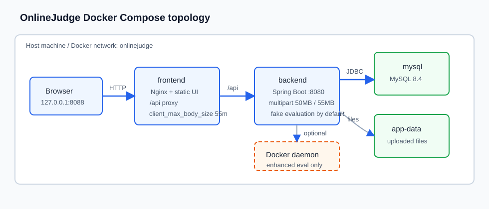

# 部署文档

本文档对应 `DEP-01 Docker Compose 部署配置与部署手册`，目标是提供一套面向教学演示的可复现部署方案。它不是生产级高可用方案，但应满足一键启动、业务链路可验证、数据可持久化。

## 1. 部署拓扑

- `frontend`：Nginx 托管前端静态资源，并将 `/api/` 反向代理到后端。
- `backend`：Spring Boot 后端服务，容器内监听 `8080`。
- `mysql`：MySQL 8.4 数据库，容器内监听 `3306`，首次创建 `mysql-data` 卷时执行完整 schema 与 DEV/CI 验证数据初始化。



图 1-1 展示主线 Compose 部署的入口、服务和持久化边界。浏览器只访问 `frontend` 暴露的 HTTP 入口，Nginx 托管静态资源并反向代理 `/api/`；后端通过 Compose 内部网络访问 MySQL，并将上传文件写入应用数据卷。增强 Docker 评测仅作为专项覆盖，在满足第 6 章前置条件后通过 Docker Socket 和共享工作目录接入。

默认 Compose 端口发布为 `${OJ_HTTP_PORT:-8088}:80`。未指定监听地址时，Docker 会将前端入口发布到宿主机所有网卡；本机验证可直接访问：

```text
http://127.0.0.1:8088
```

如果部署在云主机或局域网机器上，同一端口也可通过宿主机地址访问：

```text
http://<宿主机地址>:8088
```

因此云主机、实验室服务器或局域网共享环境必须在防火墙、云安全组或上游反向代理中只开放预期来源。若只允许本机访问，在 `deploy/docker/.env` 中将端口绑定写成：

```properties
OJ_HTTP_PORT=127.0.0.1:8088
```

## 2. 环境准备

宿主机只需要具备 Docker 运行能力和 Git。仓库脚本会在镜像构建阶段使用 Maven、Node 和 Nginx 镜像完成后端打包、前端构建和静态资源托管，宿主机不要求安装 Java、Maven 或 Node。每次构建必须显式传入当前 checkout 的完整 40 位 `GIT_SHA`；前后端镜像固定命名为 `onlinejudge/backend:${GIT_SHA}` 和 `onlinejudge/frontend:${GIT_SHA}`，不生成或依赖 `latest`、短 SHA 别名及可覆盖仓库名。

宿主依赖：

| 依赖 | 建议版本 | 用途 |
| --- | --- | --- |
| Docker Engine / Docker Desktop | 24+ | 构建镜像、运行 MySQL、后端和前端容器 |
| Docker Compose v2 | 随 Docker Desktop 或 Docker CLI 提供 | 解析 `deploy/docker/compose.yml` 并编排服务 |
| Git | 2.30+ | 计算并校验当前 checkout 的完整提交 SHA |
| curl | 系统自带或手工安装 | 部署后接口验收 |
| Python | 3.9+ | `scripts/deploy/verify-compose.sh` 安全构造与解析 JSON |
| 现代浏览器 | Chrome、Edge、Safari 或 Firefox 当前稳定版 | 访问前端页面并做人工验收 |

容器镜像说明：

| 服务或阶段 | 镜像 | 说明 |
| --- | --- | --- |
| `mysql` | `mysql:8.4` | 运行 MySQL 8，首次创建数据卷时执行 schema 初始化 |
| 后端构建阶段 | `maven:3.9.9-eclipse-temurin-21@sha256:3a4ab327…` | 固定多架构 manifest digest，在容器内下载依赖并打包 Spring Boot |
| `backend` 运行阶段 | `eclipse-temurin:21-jre@sha256:7a65df4b…` | 固定 digest，以 UID/GID `10001` 运行后端 jar，容器内监听 `8080`；只额外安装 `wget`，不包含 Docker CLI |
| 前端构建阶段 | `node:22-alpine@sha256:c610fcdf…` | 固定 digest，使用 npm 缓存执行 `npm ci` 和 `npm run build` |
| `frontend` 运行阶段 | `nginx:1.27-alpine@sha256:65645c7b…` | 固定 digest，以 `nginx` 用户托管前端静态资源并反向代理 `/api/` |

端口、卷和网络边界：

| 类别 | 默认值 | 说明 |
| --- | --- | --- |
| 外部入口端口 | 所有宿主机网卡的 `8088` | 由 `OJ_HTTP_PORT` 映射到 `frontend:80`；写成 `127.0.0.1:8088` 时才限制为本机访问 |
| 后端端口 | 容器内 `8080` | 不直接暴露到宿主机，通过 Nginx `/api/` 访问 |
| MySQL 端口 | 容器内 `3306` | 不直接暴露到宿主机，后端通过 Compose 网络访问 `mysql:3306` |
| 数据库卷 | `onlinejudge_mysql-data` | 持久化 `/var/lib/mysql` |
| 应用文件卷 | `onlinejudge_app-data` | 持久化 `/opt/onlinejudge/data`，包含上传文件等应用数据 |
| 初始化脚本挂载 | `database/mysql/compose-schema.sql`、`database/seeds/dev-ci.sql` | 只读挂载到 MySQL 首次初始化目录；测试种子不可登录且可识别/清理 |
| 外部网络 | 无强制要求 | Compose 默认网络即可；上云时可再接入反向代理、TLS 和云安全组 |

安全边界说明：

- `backend` 和 `mysql` 没有直接发布宿主机端口，外部只应访问 `frontend` 暴露的统一入口。
- 默认 `OJ_HTTP_PORT=8088` 适合本机和单机教学演示；一旦部署到云主机或局域网，必须在安全组、防火墙或网关上限制来源 IP，并替换演示密码和内部 token。
- 如果要通过公网域名访问，应在 Compose 外层增加 HTTPS 反向代理；本文档所述 Compose 方案面向本机或单机教学演示部署。

首次使用建议复制环境变量模板：

```bash
cd deploy/docker
cp .env.example .env
```

常用变量如下：

| 变量 | 默认值 | 说明 |
| --- | --- | --- |
| `GIT_SHA` | 无，必填 | 当前 checkout 的完整 40 位 Git SHA；同时作为前后端镜像标签、构建参数和 OCI revision/version |
| `OJ_HTTP_PORT` | `8088` | 前端统一入口暴露端口；默认监听所有宿主机网卡，写成 `127.0.0.1:8088` 可限制为本机 |
| `MYSQL_DATABASE` | `onlinejudge` | 数据库名 |
| `MYSQL_USER` | `onlinejudge` | 业务用户 |
| `MYSQL_PASSWORD` | 无，必填 | 业务用户密码；Compose 和后端配置均无仓库内 fallback |
| `MYSQL_ROOT_PASSWORD` | 无，必填 | MySQL root 密码；Compose 无仓库内 fallback |
| `ONLINEJUDGE_DEMO_DATA_ENABLED` | `true` | 是否在后端启动时由 `ApplicationRunner` 幂等写入验收业务数据 |
| `ONLINEJUDGE_EVALUATION_SANDBOX_MODE` | `fake` | 默认评测模式，主线部署建议用 `fake` |
| `ONLINEJUDGE_NOTIFICATIONS_INTERNAL_TOKEN` | 空 | LRN 内部通知事件接口令牌；正式部署前建议设置为非空随机值 |

评测相关配置项：

| 配置项 | 默认值 | 主线或增强配置 | 说明 |
| --- | --- | --- | --- |
| `ONLINEJUDGE_EVALUATION_SANDBOX_MODE` | `fake` | `compose.yml` 透传 | `fake` 用于主线部署验收；`docker` 仅用于增强评测专项 |
| `ONLINEJUDGE_EVALUATION_DOCKER_COMMAND` | `docker` | `compose.eval.yml` 透传 | Docker 沙箱调用的命令路径；启用增强评测前需保证后端容器内存在该命令 |
| `ONLINEJUDGE_EVALUATION_DOCKER_PYTHON_IMAGE` | `python:3.12-alpine` | 增强配置项 | Python 评测容器镜像；如需覆盖，需在额外 Compose override 的 `backend.environment` 中显式加入 |
| `ONLINEJUDGE_EVALUATION_DOCKER_CPU_LIMIT` | `1.0` | 增强配置项 | Docker 运行参数 `--cpus`；如需调整，需在 override 中加入 |
| `ONLINEJUDGE_EVALUATION_DOCKER_PIDS_LIMIT` | `64` | 增强配置项 | Docker 运行参数 `--pids-limit`；如需调整，需在 override 中加入 |
| `ONLINEJUDGE_EVALUATION_DOCKER_TMPFS_SIZE` | `16m` | 增强配置项 | Docker 运行参数 `--tmpfs /tmp:rw,nosuid,size=...`；如需调整，需在 override 中加入 |

Docker 沙箱执行器还会按实验或作业测试点传入的 `timeLimitMs`、`memoryLimitKb` 设置超时和内存；缺省值分别为 `60000` ms 和 `262144` KB。真实 Docker 运行命令会使用 `--network none`、`--read-only`、`--cap-drop ALL`、`--security-opt no-new-privileges`、`--memory`、`--cpus`、`--pids-limit` 和只读 `/work` 挂载。上述限制属于增强模式运行约束；主线 Compose 使用教学演示评测模式完成部署验收，增强 Docker 评测需满足第 6 章前置条件。

文件存储和上传限制：

| 项目 | 默认配置或约束 | 说明 |
| --- | --- | --- |
| 后端本地存储根目录 | `/opt/onlinejudge/data/uploads` | 来自 `application-compose.properties` 的 `onlinejudge.storage.local-root` |
| Compose 持久化卷 | `onlinejudge_app-data:/opt/onlinejudge/data` | 上传文件存入该卷下的 `uploads` 子目录，需随数据库一起备份 |
| CRS 课程资源 | 业务上限 `50MB` | 支持 `pdf/ppt/pptx/doc/docx/xls/xlsx/txt/md/zip/rar/png/jpg/jpeg/gif/mp4` |
| LAB 源码文件 | 业务上限 `5MiB` | 按语言限制扩展名和常见源码 MIME 类型 |
| LAB 实验报告 | 业务上限 `10MiB` | 仅支持 `pdf/docx/zip` |
| HWK FILE 提交附件 | 业务上限 `10MiB`，单请求/单提交 1 个 | 扩展名/MIME/内容签名三重白名单：`pdf, zip, docx, xlsx, pptx, txt, md, csv, png, jpg, jpeg`；未绑定上传 24h 过期 |
| Nginx 请求体限制 | `deploy/nginx/default.conf` 的 `server` 段已设置 `client_max_body_size 55m;` | 与 Spring 单文件 `50MB`/单请求 `55MB` 共享传输层契约，支撑 CRS 50MB 业务上限并为 multipart 边界预留空间 |
| Spring multipart 限制 | `application.properties` 默认单文件 `50MB`、单请求 `55MB`；主线 `compose.yml` 沿用默认值 | 传输层上限高于 HWK 10MiB 业务值，因此 HWK 超限应由业务层返回 `HWK_4131`；部署方若额外覆盖该值，不得降到 10MiB 以下 |

HWK 附件运行配置：

| 配置项 | 默认值 | 含义 |
| --- | --- | --- |
| `onlinejudge.hwk.attachments.max-size-bytes` | `10485760` | 10 MiB 业务上限，不得靠放大 multipart 限制绕过 |
| `onlinejudge.hwk.attachments.upload-ttl` | `PT24H` | UPLOADED 资产可绑定有效期 |
| `onlinejudge.hwk.attachments.zip-max-entries` | `128` | ZIP/Office 容器签名检查的条目上限，避免无界枚举 |
| `onlinejudge.hwk.attachments.cleanup-enabled` | `true` | 启用过期附件定时回收 |
| `onlinejudge.hwk.attachments.cleanup-delay-ms` | `3600000` | 清理轮询间隔，默认 1 小时 |
| `onlinejudge.hwk.attachments.cleanup-batch-size` | `100` | 每轮状态转移和物理删除重试批次 |
| 持久删除 journal | `<storage-root>/.pending-deletes` | 无独立配置；回滚补偿的立即删除失败时，以 storageKey SHA-256 为文件名、`.pending` 为后缀原子写入 marker，必须随存储卷备份 |

上传链路分为三层：Nginx 负责入口请求体上限，Spring multipart 负责后端请求解析上限，CRS/LAB/HWK 业务代码负责最终文件大小、类型和所有权校验。默认 Compose 已用 Nginx `55m` 请求体上限与 Spring 单文件 `50MB`/单请求 `55MB` 限制闭合共享传输契约。这些传输层值不改变各模块业务上限；HWK FILE 仍由应用层按 10 MiB 拒绝超限附件并返回 `HWK_4131`。

`deploy/nginx/default.conf` 的 `server` 段已固化：

```nginx
client_max_body_size 55m;
```

配置检查命令：

```bash
grep -n "client_max_body_size" deploy/nginx/default.conf
grep -n "spring.servlet.multipart.max-\(file\|request\)-size" backend/src/main/resources/application.properties
./scripts/docker/compose-images.sh exec frontend \
  nginx -T 2>/dev/null | grep "client_max_body_size"
```

功能验收时使用已登录教师账号上传一个小于业务上限的课程资源，再分别验证 LAB 源码 `5MiB`、LAB 实验报告 `10MiB`、CRS 课程资源 `50MB` 和 HWK FILE `10MiB` 的业务边界。对 HWK，可构造一个大于 10 MiB 但小于 Spring 单文件上限的附件，预期请求进入业务层并稳定返回 `413/HWK_4131`；若在进入后端前返回 Nginx 错误页，说明入口配置与已固化契约不一致。

CRS 课程资源上传验收命令如下，执行后会在演示课程 `9501` 下新增资源记录，适合在可重置验收环境使用：

```bash
BASE="${BASE:-http://127.0.0.1:8088}"
TEACHER_LOGIN="$(curl -sS -X POST "$BASE/api/v1/auth/login" \
  -H "Content-Type: application/json" \
  -d '{"account":"teacher001","password":"Teacher001@pass"}')"
TOKEN="$(printf '%s' "$TEACHER_LOGIN" | sed -n 's/.*"token":"\([^"]*\)".*/\1/p')"

dd if=/dev/zero of=/tmp/oj-upload-49m.txt bs=1048576 count=49
curl -sS -X POST "$BASE/api/v1/courses/9501/resources" \
  -H "Authorization: Bearer $TOKEN" \
  -F file=@/tmp/oj-upload-49m.txt \
  -F name=upload-limit-49m.txt \
  -F resourceType=DOCUMENT \
  -F visibility=STUDENT

dd if=/dev/zero of=/tmp/oj-upload-51m.txt bs=1048576 count=51
curl -sS -X POST "$BASE/api/v1/courses/9501/resources" \
  -H "Authorization: Bearer $TOKEN" \
  -F file=@/tmp/oj-upload-51m.txt \
  -F name=upload-limit-51m.txt \
  -F resourceType=DOCUMENT \
  -F visibility=STUDENT
```

第一个请求应成功写入资源；第二个请求应进入后端并由 CRS 业务校验返回“文件大小不能超过50MB”一类错误。LAB 源码和实验报告的大小验收应在一个允许学生提交的实验上执行同类 multipart 上传，预期分别由 `5MiB` 源码上限和 `10MiB` 报告上限拦截。

## 3. 一键启动

复制 `.env.example` 后必须填写非空 `MYSQL_PASSWORD`、`MYSQL_ROOT_PASSWORD`；`GIT_SHA` 建议由命令导出，不能手工填写其他提交值。在仓库根目录执行标准构建与启动入口：

```bash
export GIT_SHA="$(git rev-parse HEAD)"
export MYSQL_PASSWORD='<业务用户强密码>'
export MYSQL_ROOT_PASSWORD='<root 强密码>'

./scripts/docker/build-images.sh
./scripts/docker/compose-images.sh up -d --no-build --wait --wait-timeout 240
```

`build-images.sh` 会在执行 Docker 命令前拒绝缺失、非 40 位或不等于当前 `HEAD` 的 `GIT_SHA`，同时拒绝包含已跟踪或未跟踪改动的工作树，避免镜像内容与 OCI revision 指向的源码不一致；通过后只生成两个完整 SHA 镜像。`compose-images.sh` 是主线 Compose 唯一受支持入口：它在执行 `config`、`up`、`ps`、`down` 等 Compose 命令前拒绝缺失、短格式或不等于当前 `HEAD` 的 `GIT_SHA`，并固定主配置文件；主线 Compose 只消费已构建镜像，不含 `build:` 配置。需要一次性完成隔离烟测时，执行 `./scripts/docker/smoke-images.sh`；该脚本使用“SHA 前缀 + 单次运行标识”作用域的 Compose project、检查三服务 healthy、镜像引用/OCI revision/非 root 用户、后端 readiness、前端代理 readiness 和业务只读链路，失败时输出限定项目的状态与日志，最后只清理该烟测项目及其卷。

查看运行状态：

```bash
./scripts/docker/compose-images.sh ps
```

正常启动后应能看到 `mysql`、`backend`、`frontend` 三个服务均为 healthy。直接使用主线 Compose 时项目名为 `onlinejudge`，默认持久化卷包括：

```text
onlinejudge_mysql-data
onlinejudge_app-data
```

不同 Compose 版本在 `config --volumes` 中展示卷名的顺序可能不同，验收时只要求上述两个卷同时存在，不以输出顺序作为判定条件。

首次创建 MySQL 数据卷时，MySQL 按文件名顺序执行 `database/mysql/compose-schema.sql` 与 `database/seeds/dev-ci.sql`。schema 同时写入 `schema_migrations` 的 27 条 `COMPOSE_BASELINE` 记录；种子只创建 `db_ci_student_287`、`db_ci_teacher_287` 与课程 `D3-DATABASE-287`，账号状态为 `DISABLED`，不能用于登录。后端 Compose profile 不重复执行 `spring.sql.init`，因此保留数据卷重启时不会重复建表或覆盖业务数据。

保留既有 `mysql-data` 卷升级时，先同时备份数据库与 `onlinejudge_app-data` 卷，再在仓库根目录运行唯一迁移入口：

```bash
./database/mysql/migrate.sh --adapter compose
```

执行器严格按 `database/migrations/manifest.txt` 排序，将成功文件名、SHA-256、类型和耗时写入 `schema_migrations`。已经登记的文件只在 checksum 一致时跳过；漂移、SQL 失败或连接失败都会返回非零状态，并输出具体失败文件。`apply-compose-migration.sh` 只保留为兼容包装器，不能绕过迁移历史。

历史数据库若已有业务表却没有迁移历史，执行器会拒绝自动猜测。备份并人工核对最后已具备的版本后，显式建立一次基线，例如：

```bash
./database/mysql/migrate.sh --adapter compose \
  --baseline-through 20260822_03_create_hwk_submission_attachment.sql
```

该参数只允许用于空的 `schema_migrations`。迁移成功后可在 DEV/CI 追加 `--seed`；Kind 部署使用同一脚本的 `--adapter kubectl --pod <mysql-pod>`，不得复制 SQL。MySQL DDL 可能隐式提交，失败后应先核对实际结构与迁移历史，再修复或以备份恢复，严禁通过删除持久化卷规避错误。完整边界见 `docs/开发/D3-DATABASE-数据库启动与迁移契约.md`。

从历史 root 运行镜像升级到 #289 的非 root 后端镜像时，旧 `onlinejudge_app-data` 卷可能保留 root 所有权。完成备份并构建当前完整 SHA 镜像后，先停止所有使用目标卷的旧后端容器，再执行一次所有权迁移；脚本只接受受限卷名、要求目标卷存在且带 `com.docker.compose.volume=app-data` 标签、拒绝任何正在被运行容器挂载的卷，并在修改后以 UID 10001 验证可读写：

```bash
export GIT_SHA="$(git rev-parse HEAD)"
APP_DATA_VOLUME=onlinejudge_app-data ./scripts/docker/migrate-app-data.sh
```

该步骤不删除或重建卷。自定义 Compose project 时先用 `docker volume inspect` 核对实际 `app-data` 卷名、Compose 标签和当前挂载者，再通过 `APP_DATA_VOLUME` 显式传入；迁移失败不得继续启动新后端，也不得用 `down -v` 规避。

迁移后最小核对：

```sql
SHOW CREATE TABLE t_hwk_submission_attachment;
SELECT public_id, submission_id, homework_id, course_id, uploader_id,
       original_filename, content_type, file_size, status,
       expires_at, bound_at, deleted_at
FROM t_hwk_submission_attachment
ORDER BY id DESC
LIMIT 20;
```

不得将 `storage_key` 查询结果复制到公开验收记录、前端日志或工单；它只能在受限运维会话中用于与文件卷配对。

2026-08-22 #214 部署契约已在本机真实 MySQL 9.6 复核：使用同步后的 `database/mysql/compose-schema.sql` 创建新库通过，`20260822_03_create_hwk_submission_attachment.sql` 连续执行两次通过，`active_slot` 为 nullable `TINYINT` 且 `uk_hwk_attachment_active_slot(homework_id,uploader_id,active_slot)` 列序正确。真实 Spring/MySQL 并发上传两份 9 MiB PDF 得到 `201` 与 `409/HWK_4092`，DB 为 total=1/active=1/deleted=0，物理文件=1、pending marker=0；随后顺序替换返回 `201`，DB 仍为 1 条 active 且 filename 已更新，物理文件仍为 1。服务已优雅停止，临时库已 drop，测试文件已移入 Trash（可恢复）。当时 Docker daemon 不可用，因此未将容器启动路径写为已验证；容器卷挂载/启停仍按本文第 3、5 章在可用 Docker 环境复跑。

同日 #214 发布前验证还包括：后端 340 total = 339 passed + 1 Docker-only skipped（0 failures/0 errors）与定向 9 类 94/94；前端 53 files / 545 tests、typecheck/build 通过；H2 真实服务 MAN-HWK-012 通过上传失败保留/重试、刷新恢复、绑定提交、学生/教师受控下载、匿名/他人拒绝和 1440×1000/390×844 无溢出。另外验证未绑定附件恢复 GET 返回 `500/HWK_5002` 时 session/UUID 保留，服务恢复后 GET 200 重载，DELETE 200 清理；截图见 `output/playwright/issue-214/01~10`。`DockerComposeContractTest#nginxRoutesApiCallsToBackendService` 在缺少入口上限时先以 1 条失败进入 RED，固化 `client_max_body_size 55m;` 后定向复跑 1/1 GREEN，证明 Nginx 与 Spring 50MB/55MB 传输契约已在部署配置中闭合。这些证据验证业务和配置契约，不替代未执行的 Docker 容器卷挂载/启停验收。

可登录的演示账号和闭环业务数据不是 MySQL SQL seed 的职责。后端启动后，AUTH 基础账号初始化器会补齐默认账号；`ONLINEJUDGE_DEMO_DATA_ENABLED=true` 时，`IntDemoDataInitializer` 会以 `ApplicationRunner` 方式检查 schema、账号和固定业务 ID，并对课程、学习任务、LAB/HWK、成绩和通知样例做幂等写入。SQL seed 仅用于 DEV/CI 数据库契约断言，全部账号禁用并带固定标记，可由 `database/seeds/clean-dev-ci.sql` 精确清理。保留数据卷重启时不会覆盖已有业务数据；如果此前关闭演示数据，之后重新启用并重启后端，缺失样例会在条件满足时补齐。

查看日志：

```bash
./scripts/docker/compose-images.sh logs -f
```

## 4. 验证步骤

### 4.1 基础探活

```bash
curl http://127.0.0.1:8088/
curl http://127.0.0.1:8088/api/v1/system/health
```

预期：

- 第一个命令返回前端 HTML。
- 第二个命令返回包含 `"status":"UP"` 的成功响应。

### 4.2 登录验收

默认演示账号：

| 角色 | 账号 | 密码 |
| --- | --- | --- |
| 学生 | `student001` | `Student001@pass` |
| 教师 | `teacher001` | `Teacher001@pass` |
| 管理员 | `admin001` | `Admin001@pass` |

登录接口验证：

```bash
curl -X POST http://127.0.0.1:8088/api/v1/auth/login \
  -H "Content-Type: application/json" \
  -d "{\"account\":\"student001\",\"password\":\"Student001@pass\"}"
```

预期返回：

- `code` 为 `"0"`
- `data.token` 非空

### 4.3 演示数据初始化确认

`ONLINEJUDGE_DEMO_DATA_ENABLED=true` 时，课程、实验、作业、成绩、通知等验收业务数据由后端 `ApplicationRunner` 在启动阶段幂等写入，不依赖 MySQL 数据卷“首次创建”时机。默认演示账号由 AUTH 基础账号初始化器提供，不由该变量控制；初始化确认以实际登录和页面数据为准：

1. 使用学生账号 `student001` 登录，确认能进入课程中心、学习任务和通知中心。
2. 使用教师账号 `teacher001` 登录，确认能看到可管理课程以及实验、作业、成绩入口。
3. 使用管理员账号 `admin001` 登录，确认能直接访问 `/admin/auth` 用户权限管理页面。

如果保留已有 `mysql-data` 卷重启，演示数据不会重复覆盖；如果删除业务样例或从空库恢复，只要 schema 和账号就绪且 `ONLINEJUDGE_DEMO_DATA_ENABLED=true`，后端重启时会再次按固定 ID 补齐缺失数据。

### 4.4 部署后核心链路验证

部署后至少按以下闭环做一次人工或接口验收：

```text
登录 -> 课程 -> 作业/实验 -> 提交/评测 -> 成绩 -> 通知
```

本节验收使用已有演示数据，不创建课程、不提交实验/作业、不发布成绩，也不修改通知状态。注意：认证不是完全无副作用操作，登录会创建 `t_auth_session` 会话记录并写入 `LOGIN_SUCCESS` 审计日志；调用退出接口会撤销会话并写入 `LOGOUT` 审计日志。因此下列脚本定义为“业务数据只读验收”，不是数据库零写入脚本。

| 项目 | 值 |
| --- | --- |
| 学生账号 | `student001` / `Student001@pass` |
| 教师账号 | `teacher001` / `Teacher001@pass` |
| 管理员账号 | `admin001` / `Admin001@pass` |
| 演示课程 | `9501`，课程名“数据结构全流程演示课”，邀请码 `INT95` |
| 演示实验 | `950201`，已有提交 `950203` |
| 演示作业 | `950301`，已有提交 `950303` |
| 成绩项 | 实验成绩项 `950401`、作业成绩项 `950402` |

仓库提供可复用部署验收脚本，覆盖健康检查、学生登录、课程、学习任务、实验、作业、成绩和通知基础接口，并在失败时返回非零退出码：

```bash
BASE="${BASE:-http://127.0.0.1:8088}" bash scripts/deploy/verify-compose.sh
```

`GET /api/v1/system/health` 是不访问数据库的匿名 liveness；`GET /api/v1/system/readiness` 是匿名 readiness，必须成功执行 `SELECT 1` 才返回 HTTP 200 和 `data.status="UP"`。数据库不可连接时 readiness 返回 HTTP 503，且响应不包含连接串、用户名、口令或 `status="UP"`。Compose 后端健康检查以及 `smoke-images.sh` 的前端代理检查均使用 readiness。

脚本默认使用下表中的演示数据，可通过 `BASE`、`COURSE_ID`、`LAB_ID`、`LAB_SUBMISSION_ID`、`HOMEWORK_ID`、`HOMEWORK_SUBMISSION_ID`、`STUDENT_ACCOUNT`、`STUDENT_PASSWORD` 覆盖。等价的手工只读验收命令如下：

```bash
BASE="${BASE:-http://127.0.0.1:8088}"
COURSE_ID=9501
LAB_ID=950201
LAB_SUBMISSION_ID=950203
HOMEWORK_ID=950301
HOMEWORK_SUBMISSION_ID=950303

LOGIN_RESPONSE="$(curl -sS -X POST "$BASE/api/v1/auth/login" \
  -H "Content-Type: application/json" \
  -d '{"account":"student001","password":"Student001@pass"}')"
TOKEN="$(printf '%s' "$LOGIN_RESPONSE" | sed -n 's/.*"token":"\([^"]*\)".*/\1/p')"
test -n "$TOKEN" || { echo "login failed: $LOGIN_RESPONSE"; exit 1; }

curl -sS "$BASE/api/v1/auth/me" \
  -H "Authorization: Bearer $TOKEN"
curl -sS "$BASE/api/v1/courses/$COURSE_ID" \
  -H "Authorization: Bearer $TOKEN"
curl -sS "$BASE/api/v1/learning/tasks?courseId=$COURSE_ID&page=1&size=10" \
  -H "Authorization: Bearer $TOKEN"
curl -sS "$BASE/api/v1/courses/$COURSE_ID/labs" \
  -H "Authorization: Bearer $TOKEN"
curl -sS "$BASE/api/v1/labs/$LAB_ID/submissions/$LAB_SUBMISSION_ID/result" \
  -H "Authorization: Bearer $TOKEN"
curl -sS "$BASE/api/v1/homeworks?courseId=$COURSE_ID&page=1&size=20" \
  -H "Authorization: Bearer $TOKEN"
curl -sS "$BASE/api/v1/homeworks/$HOMEWORK_ID/my-submissions" \
  -H "Authorization: Bearer $TOKEN"
curl -sS "$BASE/api/v1/submissions/$HOMEWORK_SUBMISSION_ID/evaluation" \
  -H "Authorization: Bearer $TOKEN"
curl -sS "$BASE/api/v1/courses/$COURSE_ID/my-grades" \
  -H "Authorization: Bearer $TOKEN"
curl -sS "$BASE/api/v1/notifications?page=1&size=10" \
  -H "Authorization: Bearer $TOKEN"

# 可选：撤销本次学生会话；会额外写入 LOGOUT 审计记录。
curl -sS -X POST "$BASE/api/v1/auth/logout" \
  -H "Authorization: Bearer $TOKEN" >/dev/null
```

接口矩阵和预期字段：

| 顺序 | 目标 | 请求路径 | 身份 | 预期字段 |
| --- | --- | --- | --- | --- |
| 1 | 登录并取得 token | `POST /api/v1/auth/login` | 学生 | `code="0"`，`data.token` 非空，`data.user.username="student001"`，`data.user.roles` 包含学生角色 |
| 2 | 当前用户 | `GET /api/v1/auth/me` | 学生 | `data.username="student001"`，`data.accountStatus` 为可用状态，`data.permissions` 返回数组 |
| 3 | 课程详情 | `GET /api/v1/courses/9501` | 学生 | `data.id=9501`，`data.name` 为演示课名称，`data.member=true` |
| 4 | 学习任务 | `GET /api/v1/learning/tasks?courseId=9501&page=1&size=10` | 学生 | `data.records` 包含实验任务 `950601` 和作业任务 `950602`，`status="COMPLETED"`，`actionUrl` 指向课程内任务页面 |
| 5 | 实验列表 | `GET /api/v1/courses/9501/labs` | 学生 | `data[]` 包含 `id=950201`，`status="SCORE_PUBLISHED"`，`evaluationMode="DOCKER_IO"` |
| 6 | 实验评测结果 | `GET /api/v1/labs/950201/submissions/950203/result` | 学生 | `data.submissionId=950203`，`data.evaluationStatus="ACCEPTED"`，`data.passedCases=1`，`data.totalCases=1` |
| 7 | 作业列表 | `GET /api/v1/homeworks?courseId=9501&page=1&size=20` | 学生 | `data.list` 包含 `id=950301`，`status="SCORE_PUBLISHED"` |
| 8 | 作业提交 | `GET /api/v1/homeworks/950301/my-submissions` | 学生 | `data[]` 包含 `submissionId=950303`，`submitStatus="SUBMITTED"`，`reviewStatus="REVIEWED"` |
| 9 | 作业评测 | `GET /api/v1/submissions/950303/evaluation` | 学生 | `data.submissionId=950303`，`data.evaluationStatus="ACCEPTED"`，`data.score=88` |
| 10 | 学生成绩 | `GET /api/v1/courses/9501/my-grades` | 学生 | `data.summary.finalScore=89.60`，`data.summary.publishStatus="PUBLISHED"`，`data.records` 包含 LAB/HWK 两类来源 |
| 11 | 通知中心 | `GET /api/v1/notifications?page=1&size=10` | 学生 | `data.records` 包含任务和成绩通知，`data.unreadCount` 为未读数量，记录中 `actionUrl` 指向课程、实验、作业或成绩页面 |

教师侧可补充只读抽查：

```bash
TEACHER_LOGIN="$(curl -sS -X POST "$BASE/api/v1/auth/login" \
  -H "Content-Type: application/json" \
  -d '{"account":"teacher001","password":"Teacher001@pass"}')"
TEACHER_TOKEN="$(printf '%s' "$TEACHER_LOGIN" | sed -n 's/.*"token":"\([^"]*\)".*/\1/p')"

curl -sS "$BASE/api/v1/courses/9501/grade-items" \
  -H "Authorization: Bearer $TEACHER_TOKEN"
curl -sS "$BASE/api/v1/courses/9501/grades?page=1&size=20" \
  -H "Authorization: Bearer $TEACHER_TOKEN"
curl -sS "$BASE/api/v1/courses/9501/grade-analysis?targetType=COURSE_TOTAL" \
  -H "Authorization: Bearer $TEACHER_TOKEN"

# 可选：撤销本次教师会话；会额外写入 LOGOUT 审计记录。
curl -sS -X POST "$BASE/api/v1/auth/logout" \
  -H "Authorization: Bearer $TEACHER_TOKEN" >/dev/null
```

教师侧预期 `grade-items` 返回实验和作业成绩项，`grades` 返回学生成绩总表，`grade-analysis` 返回平均分、最高分、最低分、通过率和完成率等教学分析字段。

主线 Compose 默认 `ONLINEJUDGE_EVALUATION_SANDBOX_MODE=fake`，因此部署验收重点是确认演示提交、评测状态、成绩和通知链路可读且一致。若启用增强评测模式，必须先满足第 6 节的实验性前置条件，再补充真实 Docker 沙箱执行结果验证。

### 4.5 配置解析验证

如果目标机器暂时不能启动 Docker daemon，仍可先用完整 SHA 与占位 Secret 检查 Compose 文件是否能被 Docker Compose 正确解析；占位值只用于配置解析，不得用于真实部署：

```bash
export GIT_SHA="$(git rev-parse HEAD)"
export MYSQL_PASSWORD='config-check-only'
export MYSQL_ROOT_PASSWORD='config-check-root-only'
./scripts/docker/compose-images.sh config --services
```

主线配置预期输出包含以下三项：

```text
mysql
backend
frontend
```

```bash
./scripts/docker/compose-images.sh config --volumes
```

主线配置预期输出包含以下两项；不同 Compose 版本可能调整显示顺序：

```text
app-data
mysql-data
```

建议将完整配置解析输出保存为验收附件，便于复核服务、卷、环境变量和上传限制：

```bash
./scripts/docker/compose-images.sh config >/tmp/oj-compose-config.txt
grep -n "client_max_body_size" deploy/nginx/default.conf
grep -n "spring.servlet.multipart.max-\(file\|request\)-size" \
  backend/src/main/resources/application.properties
```

部署环境启动后按下表记录运行证据。未实际执行的项目应保留为空或标记为待补充，不应写成已通过。

#214 还以 `DockerComposeContractTest#nginxRoutesApiCallsToBackendService` 对静态部署契约做可执行检查：用例在 Nginx 缺少请求体上限时 RED（1 failure），在 `server` 段加入 `client_max_body_size 55m;` 后定向复跑 GREEN（1/1），并同时保留 `/api/ -> backend:8080` 与 SPA fallback 断言。

| 验证项 | 命令 | 预期记录 |
| --- | --- | --- |
| 服务状态 | `./scripts/docker/compose-images.sh ps` | `mysql`、`backend`、`frontend` 均为运行或健康状态 |
| 前端入口 | `curl -I http://127.0.0.1:8088/` | 返回 `200` 或可访问的前端 HTML |
| 后端健康 | `curl http://127.0.0.1:8088/api/v1/system/health` | 返回包含 `"status":"UP"` 的响应 |
| 数据库就绪 | `curl http://127.0.0.1:8088/api/v1/system/readiness` | 返回 HTTP 200、`code="0"` 和 `data.status="UP"` |
| 镜像追溯 | `docker image inspect onlinejudge/backend:${GIT_SHA}` 与前端等价命令 | OCI revision/version 均等于完整 `GIT_SHA`，运行用户非 root |
| 登录链路 | 第 4.2 节登录命令 | 返回 `code="0"` 且 `data.token` 非空 |
| 主流程只读验收 | 第 4.4 节脚本 | 课程、实验、作业、成绩和通知接口均返回演示数据 |
| 上传链路 | 第 2 节上传配置检查和上传样本 | 小于业务上限成功，超过业务上限由业务层返回错误 |

### 4.6 持久化验证

建议以教师身份创建一条课程公告或课程数据，然后执行：

```bash
./scripts/docker/compose-images.sh restart mysql backend frontend
```

重启后重新访问业务接口，确认数据仍存在。主线要求验证“重启保留数据”，不要求 `down -v` 后保留。

## 5. 常用运维命令

### 5.1 启停和重启

构建并启动精确版本镜像：

```bash
export GIT_SHA="$(git rev-parse HEAD)"
./scripts/docker/build-images.sh
./scripts/docker/compose-images.sh up -d --no-build --wait --wait-timeout 240
```

停止但保留数据卷：

```bash
./scripts/docker/compose-images.sh down
```

停止并删除数据卷：

```bash
./scripts/docker/compose-images.sh down -v
```

说明：`down -v` 会重置 MySQL 和应用持久数据。

重启：

```bash
./scripts/docker/compose-images.sh restart mysql backend frontend
```

### 5.2 备份和恢复

备份数据库：

```bash
mkdir -p backups
./scripts/docker/compose-images.sh exec -T mysql \
  sh -c 'mysqldump -uroot -p"$MYSQL_ROOT_PASSWORD" "$MYSQL_DATABASE"' \
  > backups/onlinejudge.sql
```

恢复数据库到当前 `MYSQL_DATABASE`：

```bash
cat backups/onlinejudge.sql | ./scripts/docker/compose-images.sh exec -T mysql \
  sh -c 'mysql -uroot -p"$MYSQL_ROOT_PASSWORD" "$MYSQL_DATABASE"'
```

备份上传文件等应用持久化数据：

```bash
mkdir -p backups
docker run --rm \
  -v onlinejudge_app-data:/data:ro \
  -v "$PWD/backups":/backup \
  alpine:3.20 \
  tar czf /backup/onlinejudge-app-data.tgz -C /data .
```

恢复应用持久化数据：

```bash
docker run --rm \
  -v onlinejudge_app-data:/data \
  -v "$PWD/backups":/backup:ro \
  alpine:3.20 \
  sh -c 'cd /data && tar xzf /backup/onlinejudge-app-data.tgz'
```

恢复前应先确认目标环境可以接受覆盖现有数据；教学演示环境建议先 `down` 后恢复，再 `up -d`。DB-LAB-09 和 DB-HWK-08 的 `storage_key`、应用卷中的物理文件，以及 HWK 的 `.pending-deletes` 持久 marker 必须使用同一备份窗口的配对产物恢复。上述 `tar ... -C /data .` 会包含隐藏目录；不得改成只匹配普通文件的通配符备份，也不得只恢复 DB 或只恢复附件。恢复后先在受限运维环境抽样核对 DB-HWK-08 的 `BOUND` 记录与物理对象，并让清理任务处理恢复的 journal marker，再开放用户流量。

### 5.3 数据卷检查

查看卷是否存在：

```bash
docker volume inspect onlinejudge_mysql-data onlinejudge_app-data
```

检查 MySQL 数据目录：

```bash
./scripts/docker/compose-images.sh exec mysql \
  sh -c 'ls -lah /var/lib/mysql | head'
```

检查上传文件卷：

```bash
./scripts/docker/compose-images.sh exec backend \
  sh -lc 'find /opt/onlinejudge/data -maxdepth 3 -type f | head -20'
```

检查后端实际文件存储根目录：

```bash
./scripts/docker/compose-images.sh exec backend \
  sh -lc 'echo "storage root: /opt/onlinejudge/data/uploads"; test -r /opt/onlinejudge/data/uploads && test -w /opt/onlinejudge/data/uploads && ls -lah /opt/onlinejudge/data/uploads | head'
```

Compose 部署下实际默认根目录由 `application-compose.properties` 固定为 `/opt/onlinejudge/data/uploads`。上述检查应以后端容器的实际运行用户通过；不应为规避权限问题将目录设为任意用户可写。如果通过额外环境变量覆盖 `ONLINEJUDGE_STORAGE_LOCAL_ROOT`，必须同步调整卷挂载和备份路径，避免数据库里的 `storage_key` 指向不可恢复的本地文件。

HWK 补偿 journal 位于 `/opt/onlinejudge/data/uploads/.pending-deletes`。它不是缓存，不得手工清空或从备份中排除；marker 文件名是 storageKey 的 SHA-256，文件内容是受限服务端存储键，禁止复制到公开日志/工单。

### 5.3.1 HWK 过期附件清理

`HomeworkAttachmentCleanupService` 默认每小时执行一次，每轮最多处理 100 条：先将已过期 `UPLOADED` 资产标记为 `DELETED`，再重试 DB 墓碑对应物理对象；同一轮还通过 `pendingDeletes` 读取回滚补偿 journal，物理删除成功后调用 `completeDeferredDelete` ack marker。删除失败时保留 DB 墓碑或 marker 供下轮重试；不得用通配删除上传目录替代该状态机/journal。

运维观测（不输出 `storage_key`）：

```sql
SELECT status, COUNT(*) AS asset_count,
       MIN(expires_at) AS earliest_expiry,
       MAX(updated_at) AS latest_update
FROM t_hwk_submission_attachment
GROUP BY status;
```

若 `UPLOADED` 中过期记录长时间不下降，先检查 `cleanup-enabled`、调度线程和后端日志；若 `DELETED` 墓碑或 `.pending-deletes/*.pending` 持续增长，检查文件卷写/删权限与存储可用性。紧急情况可通过 `onlinejudge.hwk.attachments.cleanup-enabled=false` 暂停自动清理以便排查，恢复前必须确认数据库与文件卷（含隐藏 journal）来自同一时点。

### 5.4 日志分层

先看服务状态：

```bash
./scripts/docker/compose-images.sh ps
```

再按层查看日志：

```bash
./scripts/docker/compose-images.sh logs --tail=200 frontend
./scripts/docker/compose-images.sh logs --tail=200 backend
./scripts/docker/compose-images.sh logs --tail=200 mysql
```

持续跟踪后端日志：

```bash
./scripts/docker/compose-images.sh logs -f backend
```

排查顺序建议为：前端 404 或静态资源异常先看 `frontend`；接口 4xx/5xx、评测和通知异常先看 `backend`；连接失败、schema 或权限问题先看 `mysql`。

### 5.5 进入 MySQL

进入数据库：

```bash
./scripts/docker/compose-images.sh exec mysql \
  sh -c 'mysql -uroot -p"$MYSQL_ROOT_PASSWORD" "$MYSQL_DATABASE"'
```

常用只读检查：

```sql
SHOW TABLES;
SELECT id, course_name, invite_code, status FROM crs_course WHERE id = 9501;
SELECT id, title, status FROM lab_experiment WHERE id = 950201;
SELECT id, title, status FROM t_hwk_homework WHERE id = 950301;
```

### 5.6 评测失败排查

确认当前评测模式：

```bash
./scripts/docker/compose-images.sh exec backend \
  printenv ONLINEJUDGE_EVALUATION_SANDBOX_MODE
```

查看评测相关日志：

```bash
./scripts/docker/compose-images.sh logs --tail=300 backend | grep -Ei 'evaluation|sandbox|lab|homework|hwk'
```

在 `fake` 模式下，重点检查提交是否成功落库、评测状态是否返回、成绩是否可同步。若演示提交 `950203` 或 `950303` 的评测结果不可读，优先检查后端日志和 MySQL 中对应提交、评测表记录。

在增强 Docker 沙箱模式下，除后端日志外还要检查宿主 Docker daemon、`/var/run/docker.sock` 挂载权限、容器内 Docker 命令可用性、Python 评测镜像和共享临时目录。增强模式不可用时，应按第 6 节补齐 Docker CLI、共享临时目录和相关环境变量；主线部署验收使用教学演示评测模式完成。

#### 5.6.1 LAB 源文件下载失败排查

API-LAB-19 下载失败时先按对外错误语义分层：未登录或登录失效为 401，对课程无 `canManageCourse` 为 403，指定版本从未附带源文件为 `LAB-404-03`，历史旧数据无可信元数据或资产已不可用为 `LAB-409-03`，元数据存在但物理文件缺失、不可读或存储访问失败为 `LAB-500-05`。运维人员可使用提交 ID 做只读核对：

```sql
SELECT s.id AS submission_id,
       s.lab_id,
       s.file_id AS internal_file_id,
       sf.course_id,
       sf.storage_key,
       sf.original_filename,
       sf.content_type,
       sf.file_size,
       sf.status,
       sf.deleted_at
FROM lab_submission s
LEFT JOIN lab_submission_source_file sf ON sf.submission_id = s.id
WHERE s.id = <submission_id>;
```

`storage_key` 只用于受限制的服务端排查，不得回传给前端或粘贴到公开工单。核对记录后，再在 `/opt/onlinejudge/data/uploads` 下检查对应文件及容器运行用户的读写权限；若数据库和应用卷来自不同备份窗口，应停止下载并从一组配对备份恢复。

#222 本期只保证数据库事务回滚后调用物理删除且成功时完成补偿。底层文件复制中途失败已产生部分文件，或 `FileStorageService.delete` 自身失败时，当前没有业务级孤儿扫描、告警/审计持久化或重试队列；源文件下载也没有独立审计持久化。这些是非阻断的存储运维残余风险，不得仅因接口返回失败就假定物理半成品已被清理。

#### 5.6.2 HWK FILE 附件上传/下载失败排查

先按对外错误码分层：`HWK_4005` 为文件数量/UUID 格式/空文件、内容签名非法或损坏 ZIP/OOXML 结构，`HWK_4031` 为非成员或无权限，`HWK_4042` 为格式合法但未知/跨归属 UUID，或附件/提交/绑定不存在或隐藏，`HWK_4091` 为过期/不可用，`HWK_4092` 为已绑定/已删除/重用/并发冲突，`HWK_4131` 为超过 10 MiB，`HWK_4151` 为扩展名或声明 MIME 不支持/不匹配，`HWK_5002` 为存储、读取、删除或补偿失败。

使用 homeworkId/submissionId/publicId 做受限只读核对：

```sql
SELECT a.public_id, a.submission_id, a.homework_id, a.course_id,
       a.uploader_id, a.original_filename, a.content_type,
       a.file_size, a.status, a.expires_at, a.bound_at, a.deleted_at
FROM t_hwk_submission_attachment a
WHERE a.public_id = '<fileId>'
   OR a.submission_id = <submissionId>;
```

核对顺序为：认证会话 → 课程成员/管理权限 → homework/submission/attachment 绑定 → 状态与过期时间 → 文件卷存在与读权限。只有受限运维会话才能额外核对 `storage_key`，禁止将其粘贴到页面、公开日志或工单。下载必须继续走 API-HWK-24，不得为排障新增 Nginx 静态映射、长期 URL 或文件卷直连。

#214 的立即补偿删除失败已通过持久 journal 与定时重试收敛，不再作为“无重试”风险。仍需保留的存储风险是整个卷不可写时，物理删除与 `.pending-deletes` marker 可同时失败；该异常不会被吞掉，修复卷后必须以受限方式对账。#214 仍不包含病毒扫描；扩展名/MIME/内容签名校验只是入口减风险措施，运维不得在服务器上解压或执行附件。生产上线前应补充恶意载荷扫描/隔离区、审计告警与容量监控。

### 5.7 通知失败排查

查看通知列表接口是否正常：

```bash
curl -sS http://127.0.0.1:8088/api/v1/notifications \
  -H "Authorization: Bearer $TOKEN"
```

检查内部通知 token 配置：

```bash
./scripts/docker/compose-images.sh exec backend \
  printenv ONLINEJUDGE_NOTIFICATIONS_INTERNAL_TOKEN
```

检查通知表和状态日志：

```bash
./scripts/docker/compose-images.sh exec mysql \
  sh -c 'mysql -uroot -p"$MYSQL_ROOT_PASSWORD" "$MYSQL_DATABASE" \
  -e "SELECT id,title,type,source_module,source_id,is_read FROM lrn_notification WHERE course_id=9501 ORDER BY created_at DESC LIMIT 10;"'
./scripts/docker/compose-images.sh exec mysql \
  sh -c 'mysql -uroot -p"$MYSQL_ROOT_PASSWORD" "$MYSQL_DATABASE" \
  -e "SELECT notification_id,operation_type,new_status,operated_at FROM lrn_notification_status_log ORDER BY operated_at DESC LIMIT 10;"'
```

若业务事件已发生但没有通知，先查后端日志中的通知事件处理结果，再确认 `ONLINEJUDGE_NOTIFICATIONS_INTERNAL_TOKEN` 在事件生产方和接收方一致。

### 5.8 成绩和通知一致性排查

成绩发布后应同时存在发布记录和面向学生的通知。只读核对命令：

```bash
./scripts/docker/compose-images.sh exec mysql \
  sh -c 'mysql -uroot -p"$MYSQL_ROOT_PASSWORD" "$MYSQL_DATABASE" \
  -e "SELECT id,publish_scope,published_count,notification_status,published_at FROM t_grade_publish_record WHERE course_id=9501 ORDER BY published_at DESC LIMIT 5;"'
./scripts/docker/compose-images.sh exec mysql \
  sh -c 'mysql -uroot -p"$MYSQL_ROOT_PASSWORD" "$MYSQL_DATABASE" \
  -e "SELECT id,title,source_module,source_id,action_url FROM lrn_notification WHERE course_id=9501 AND type='\''GRADE'\'' ORDER BY created_at DESC LIMIT 10;"'
```

若 `t_grade_publish_record.notification_status` 不是 `SENT`，或成绩已发布但缺少 `GRADE` 通知，应检查成绩发布接口日志、通知事件接口日志以及内部 token 配置。若通知存在但学生端不可见，继续核对 `user_id`、`deleted_at`、`is_read` 和当前登录学生身份。

## 6. 增强评测模式

主线 Compose 默认使用：

```text
ONLINEJUDGE_EVALUATION_SANDBOX_MODE=fake
```

这样可以确保不依赖宿主机 Docker Socket，也能完成部署验收。

`deploy/docker/compose.eval.yml` 是增强 Docker 评测专项覆盖文件，只完成模式切换和 Docker Socket 挂载：

- 将 `ONLINEJUDGE_EVALUATION_SANDBOX_MODE` 切到 `docker`，并设置 `ONLINEJUDGE_EVALUATION_DOCKER_COMMAND=docker`。
- 将宿主机 `/var/run/docker.sock` 挂入后端容器。

该文件不是可直接执行真实 Docker 沙箱的完整方案。主线 `deploy/docker/backend.Dockerfile` 的运行镜像不包含 Docker CLI，`compose.eval.yml` 也没有选择增强镜像，亦未配置后端 JVM 临时目录与宿主机共享的同一绝对路径。因此单独叠加 `compose.eval.yml` 后，配置会切到 `docker` 模式，但真实评测仍缺少完整执行条件。

启用增强 Docker 评测前，需要满足以下前置条件：

1. 使用 `deploy/docker/backend.eval.Dockerfile` 构建增强后端镜像；该镜像基于官方 `docker:27.5.1-cli`，安装 OpenJDK 21 与健康检查依赖，容器内 `docker` 命令与 Linux 运行环境一致。
2. 后端容器能访问宿主 Docker daemon，并具备运行临时评测容器的权限。
3. 后端 JVM 临时目录必须位于宿主和后端容器共享的同一个绝对路径下，例如通过额外 override 设置 `JAVA_TOOL_OPTIONS=-Djava.io.tmpdir=${SANDBOX_WORKDIR}`，并将 `${SANDBOX_WORKDIR}:${SANDBOX_WORKDIR}` 作为 bind mount 挂入后端容器。`${SANDBOX_WORKDIR}` 必须是宿主机上的绝对路径。
4. `ONLINEJUDGE_EVALUATION_DOCKER_PYTHON_IMAGE` 指向的镜像可被宿主 Docker daemon 拉取或已预热。
5. `ONLINEJUDGE_EVALUATION_DOCKER_CPU_LIMIT`、`ONLINEJUDGE_EVALUATION_DOCKER_PIDS_LIMIT`、`ONLINEJUDGE_EVALUATION_DOCKER_TMPFS_SIZE` 等增强参数应按部署目标配置。
6. 在可重置验收环境执行真实提交验证，因为该专项会创建新的提交和评测记录。

仓库提供 `deploy/docker/compose.eval.local.example.yml` 作为增强评测专项示例。该覆盖文件选择 `backend.eval.Dockerfile`，并补齐 JVM 临时目录、宿主共享工作目录和资源限制；Docker CLI 已包含在增强镜像内，不再从 macOS 或其他宿主机绑定单个可执行文件。部署方只需将 `SANDBOX_WORKDIR` 设为宿主机绝对路径，并确保 Docker daemon 能以同一路径读取该目录。

对应 `.env` 或命令行环境中应设置宿主机绝对路径，并提前创建目录：

```properties
SANDBOX_WORKDIR=/tmp/onlinejudge-sandbox
```

```bash
mkdir -p /tmp/onlinejudge-sandbox
```

满足上述条件后，可在增强验收环境执行覆盖启动：

```bash
export GIT_SHA="$(git rev-parse HEAD)"
# MYSQL_PASSWORD 与 MYSQL_ROOT_PASSWORD 必须已通过部署 Secret 设置。
COMPOSE_EXTRA_FILES='deploy/docker/compose.eval.yml:deploy/docker/compose.eval.local.example.yml' \
  ./scripts/docker/compose-images.sh up -d --build
```

如果只叠加 `deploy/docker/compose.eval.yml`，它只能证明 Compose 可切换到 Docker 评测模式并挂载 Socket，不能证明真实 Docker 沙箱已可执行。增强专项应同时检查示例覆盖文件生成后的完整配置：

```bash
COMPOSE_EXTRA_FILES='deploy/docker/compose.eval.yml:deploy/docker/compose.eval.local.example.yml' \
  ./scripts/docker/compose-images.sh config >/tmp/oj-compose-eval-config.txt

grep -E "ONLINEJUDGE_EVALUATION_DOCKER_COMMAND|ONLINEJUDGE_EVALUATION_SANDBOX_MODE|JAVA_TOOL_OPTIONS|SANDBOX|docker.sock" \
  /tmp/oj-compose-eval-config.txt
```

上述命令只证明配置解析和关键字段存在；还应构建增强后端镜像并在容器内检查 Java、Docker CLI、Socket 和共享目录，最后以真实提交证明沙箱可执行。

前置检查应先证明部署环境满足增强条件：

```bash
COMPOSE_EXTRA_FILES='deploy/docker/compose.eval.yml:deploy/docker/compose.eval.local.example.yml' ./scripts/docker/compose-images.sh exec backend \
  printenv ONLINEJUDGE_EVALUATION_SANDBOX_MODE
COMPOSE_EXTRA_FILES='deploy/docker/compose.eval.yml:deploy/docker/compose.eval.local.example.yml' ./scripts/docker/compose-images.sh exec backend \
  sh -lc 'test -S /var/run/docker.sock && echo docker-socket-ok'
COMPOSE_EXTRA_FILES='deploy/docker/compose.eval.yml:deploy/docker/compose.eval.local.example.yml' ./scripts/docker/compose-images.sh exec backend \
  sh -lc 'command -v docker || echo docker-cli-missing'
COMPOSE_EXTRA_FILES='deploy/docker/compose.eval.yml:deploy/docker/compose.eval.local.example.yml' ./scripts/docker/compose-images.sh exec backend \
  sh -lc 'docker version --format "{{.Server.Version}}"'
COMPOSE_EXTRA_FILES='deploy/docker/compose.eval.yml:deploy/docker/compose.eval.local.example.yml' ./scripts/docker/compose-images.sh exec backend \
  sh -lc 'tmp="$(printf "%s" "$JAVA_TOOL_OPTIONS" | sed -n "s/.*-Djava.io.tmpdir=\\([^ ]*\\).*/\\1/p")"; test -n "$tmp" && test -d "$tmp" && echo shared-tmp="$tmp" || echo shared-tmp-not-configured'
```

只有当模式为 `docker`、Socket 检查通过、`command -v docker` 能找到镜像内置 CLI、`docker version` 能访问宿主 daemon，并且共享临时目录已经按同一绝对路径配置后，才继续做真实提交验证。若出现 `docker-cli-missing`、权限拒绝、无法连接 Docker daemon 或 `shared-tmp-not-configured`，应先补齐增强评测前置条件，再执行专项验证。

> **安全边界：** 挂载 `/var/run/docker.sock` 等价于把宿主 Docker daemon 的高权限控制面交给后端容器。增强模式只允许在隔离、可信、可重置的验收主机运行，不应暴露给多租户或不可信后端实例；主线教学部署继续使用 `fake` 模式且不挂载 Socket。

真实沙箱提交验证示例，仅在前置检查全部通过后执行：

```bash
BASE="${BASE:-http://127.0.0.1:8088}"
AUTH_HEADER="$(mktemp "${TMPDIR:-/tmp}/onlinejudge-eval-auth.XXXXXX")"
cleanup_eval_auth() {
  curl -sS -X POST -H "@$AUTH_HEADER" -o /dev/null "$BASE/api/v1/auth/logout" || true
  : > "$AUTH_HEADER"
  unlink "$AUTH_HEADER"
}
trap cleanup_eval_auth EXIT INT TERM

LOGIN_RESPONSE="$(curl -sS -X POST "$BASE/api/v1/auth/login" \
  -H "Content-Type: application/json" \
  -d '{"account":"student001","password":"Student001@pass"}')"
TOKEN="$(python3 -c 'import json,sys; print(json.load(sys.stdin)["data"]["token"])' <<< "$LOGIN_RESPONSE")"
printf 'Authorization: Bearer %s\n' "$TOKEN" > "$AUTH_HEADER"
chmod 600 "$AUTH_HEADER"

SUBMIT_RESPONSE="$(curl -sS -X POST "$BASE/api/v1/labs/950201/submissions" \
  -H "@$AUTH_HEADER" \
  -F language=python \
  -F 'code=print("1 2 3")')"
SUBMISSION_ID="$(python3 -c 'import json,sys; print(json.load(sys.stdin)["data"]["submissionId"])' <<< "$SUBMIT_RESPONSE")"
test -n "$SUBMISSION_ID" || { echo "submit failed"; exit 1; }

for i in 1 2 3 4 5; do
  curl -sS "$BASE/api/v1/labs/950201/submissions/$SUBMISSION_ID/result" \
    -H "@$AUTH_HEADER"
  sleep 2
done
```

在满足前置条件且测试用例与提交内容匹配时，预期结果为 `data.evaluationStatus="ACCEPTED"`，`data.passedCases=1`，`data.totalCases=1`。若返回编译错误、超时、系统错误或一直停留在异常状态，先按第 5.6 节查看后端评测日志，再重新检查 Docker CLI、Socket、共享临时目录、Python 镜像和资源限制配置。

2026-08-24 #238 收口在 Docker Desktop Server 29.3.1 上按三文件叠加方式实测：增强后端镜像构建成功，容器内 Docker CLI 27.5.1 可访问宿主 daemon，MySQL、后端和前端均为 healthy；`verify-compose.sh` 的 18 个主流程断言全部通过，真实 Python 临时提交 `950205` 返回 `ACCEPTED`、1/1 用例通过。验证后已删除该临时提交及评测记录，并恢复演示实验 `950201` 和原有效提交 `950203` 的状态；本次复用既有 Compose 数据卷，因此属于持久化库回归，不声明为 clean DB 验证。

切换回主线教学演示评测模式：

```bash
export GIT_SHA="$(git rev-parse HEAD)"
./scripts/docker/build-images.sh
ONLINEJUDGE_EVALUATION_SANDBOX_MODE=fake ./scripts/docker/compose-images.sh \
  up -d --no-build --wait --wait-timeout 240 \
  --force-recreate backend frontend
```

如果宿主环境不允许挂载 Docker Socket、后端运行镜像没有可用 Docker CLI，或没有配置共享临时目录，应使用主线教学演示评测模式完成闭环验收，并将增强 Docker 评测列为专项部署配置。

## 7. 与本地开发的区别

- 本地开发默认是 `Vite + Spring Boot + H2`。
- Docker 部署默认是 `Nginx + Spring Boot + MySQL`。
- Docker 部署的 MySQL schema 由数据库容器首次初始化；本地开发和自动化测试仍使用 Spring Boot/H2 的测试 schema。
- 自动化测试继续使用 H2；教学部署运行时改用 MySQL。

## 8. CI/CD 与云端部署范围

本次最终交付提供可由本地、GitHub Actions 和临时 Kubernetes 复用的固定镜像契约：构建方使用完整 `GIT_SHA` 执行 `scripts/docker/build-images.sh`，Compose 部署方以相同变量和固定镜像名执行 `scripts/docker/compose-images.sh --no-build`，而 `scripts/delivery/run-kind-delivery.sh` 复用 #288 的 Kind 基线完成端到端验收。
> **D3 交付状态（2026-08-29）。** #287 数据库、#289 容器、#288（PR #303）Kind、#290（PR #298）质量门禁和 #292（PR #329）交付编排均已合入 `origin/dev@5cdbe8533991bb0c7cfbe23e08d81b78d47af483`。该精确 SHA 的目标仓库 [d3-delivery run 33227922081](https://github.com/Cr4zyorange/OnlineJudge/actions/runs/33227922081) 已成功。D3 的目标、变量、Secret、镜像版本和健康契约以 [D3 CI/CD 共享契约](../开发/D3-CICD-共享契约.md) 为准；面向干净环境的 Compose/Kind 入口、脚本索引和复演证据格式见仓库根目录 [README](../../README.md) 与 [submission/03_devops/README.md](../../submission/03_devops/README.md)。

自动化发布流水线、云端高可用和回滚流程属于生产部署补充项，不纳入本次单机教学演示部署完成范围。若后续迁移到云端或生产环境，至少需要补齐以下事项：

| 类别 | 需要明确的内容 |
| --- | --- |
| 域名和 TLS | 域名解析、HTTPS 证书、反向代理、HTTP 到 HTTPS 跳转策略 |
| 云安全组 | 只开放外部入口端口，数据库和后端端口不直接暴露公网 |
| 密钥和密码 | 通过部署 Secret 提供必填的 `MYSQL_PASSWORD`、`MYSQL_ROOT_PASSWORD`；仅在启用内部通知事件入口时，通过覆盖文件或编排 Secret 注入 `ONLINEJUDGE_NOTIFICATIONS_INTERNAL_TOKEN`，禁用时省略该变量；不得提交实际值或恢复演示默认值 |
| 数据库 | 生产库初始化、迁移、账号权限、备份周期、恢复演练和容量监控 |
| 文件存储 | `app-data` 卷备份、上传目录容量、清理策略和迁移策略 |
| 发布流程 | 构建、部署、回滚、健康检查、验收脚本、变更记录和责任人 |
| 日志监控 | 容器日志留存、错误告警、磁盘告警、评测失败告警和通知失败告警 |

本文档所述部署能力覆盖本机或单机教学演示环境的 Compose 手工部署；云端高可用、自动扩缩容和自动发布按生产部署补充项单独建设。

## 9. 常见问题

### 9.1 首次启动较慢

首次构建镜像和初始化数据库会耗时更长。优先看：

```bash
./scripts/docker/compose-images.sh logs -f mysql backend frontend
```

### 9.2 端口被占用

如果 `8088` 被占用，修改 `deploy/docker/.env` 中的 `OJ_HTTP_PORT` 后重新启动。

如果部署在云主机或局域网机器上，本机 `curl http://127.0.0.1:8088/` 成功但其他机器无法访问，优先检查云安全组、宿主防火墙和上游网关是否放行目标端口。如果只想允许本机访问，将 `.env` 写为 `OJ_HTTP_PORT=127.0.0.1:8088` 并重新创建 `frontend` 服务。

### 9.3 Docker daemon 未启动

如果看到类似以下错误：

```text
failed to connect to the docker API
```

先启动 Docker Desktop 或 Docker Engine，再重新执行启动命令。该错误表示宿主机 Docker 服务不可用，不表示 Compose 文件语法错误。

### 9.4 MySQL 未就绪导致后端失败

Compose 已配置 `depends_on` 和 healthcheck。如果仍然失败，先看：

```bash
./scripts/docker/compose-images.sh logs mysql
./scripts/docker/compose-images.sh logs backend
```

### 9.5 增强评测模式不可用

如果增强模式报 Docker 权限或 Socket 挂载错误，请确认宿主机 Docker 已启动，且部署环境允许将 `/var/run/docker.sock` 挂入后端容器。

若容器内提示 `docker: not found`，需使用包含 Docker CLI 的后端镜像，或在后端运行镜像中安装 Docker CLI。若日志显示 `Main.py` 不存在、挂载目录为空或系统错误，通常是后端容器临时目录没有以同一绝对路径共享给宿主 Docker daemon；应补齐共享临时目录 bind mount 和相关评测环境变量后再复测增强沙箱。

### 9.6 上传文件不可见

先确认 `onlinejudge_app-data` 卷存在，再检查后端容器内 `/opt/onlinejudge/data/uploads` 是否有文件。若执行过 `docker compose down -v`，上传文件卷会被删除，需要从第 5.2 节的应用数据备份恢复。

如果上传接口返回 413、请求体过大或浏览器直接显示网关错误，优先检查 Nginx `client_max_body_size` 和 Spring multipart 限制；如需较大文件上传，应同步配置 Nginx 请求体上限和 `SPRING_SERVLET_MULTIPART_MAX_FILE_SIZE` / `SPRING_SERVLET_MULTIPART_MAX_REQUEST_SIZE`。如果后端返回业务错误，再按文件类型和业务大小限制排查：CRS 课程资源 `50MB`，LAB 源码 `5MiB`，LAB 实验报告 `10MiB`，HWK FILE 附件 `10MiB`。HWK 业务层超限应稳定返回 `HWK_4131`；若在进入后端前就被拒绝，说明入口/解析层配置低于契约。

如果下载时报“文件不存在”或 `LAB-500-05`，优先按第 5.6.1 节核对数据库记录中的 `storage_key`、`onlinejudge_app-data` 卷内容、是否从不同环境恢复了数据库但没有恢复应用文件卷，以及是否覆盖了 `ONLINEJUDGE_STORAGE_LOCAL_ROOT` 但没有迁移旧文件。

如果 HWK 上传返回 `HWK_4151`，不要只修改扩展名或客户端 MIME，应使用真实类型符合白名单的文件；返回 `HWK_4091/4092` 时由学生重新上传，不重用旧 UUID。如果下载返回 `HWK_5002`，按第 5.6.2 节使用配对备份核对 DB-HWK-08 与文件卷；不得开启静态目录访问绕过受控下载。

### 9.7 评测结果异常

在 `fake` 模式下，评测异常通常应优先检查提交记录、评测表记录和后端异常日志。在增强 Docker 沙箱模式下，额外检查 Docker Socket、容器内 Docker 命令、共享临时目录、语言运行镜像和资源限制。主线部署验收使用教学演示评测模式，增强沙箱按专项配置单独验证。

### 9.8 通知未生成

先确认通知列表接口可访问，再检查 `lrn_notification` 和 `lrn_notification_status_log`。若成绩发布、作业发布或实验发布已发生但没有通知，重点检查后端日志和 `ONLINEJUDGE_NOTIFICATIONS_INTERNAL_TOKEN`。

### 9.9 成绩已发布但学生通知不一致

按第 5.8 节核对 `t_grade_publish_record.notification_status`、`lrn_notification.type='GRADE'`、通知 `user_id` 和学生登录身份。若成绩记录为 `PUBLISHED` 但发布记录未标记 `SENT`，需要先修复通知投递链路，再补发或重放通知事件。
