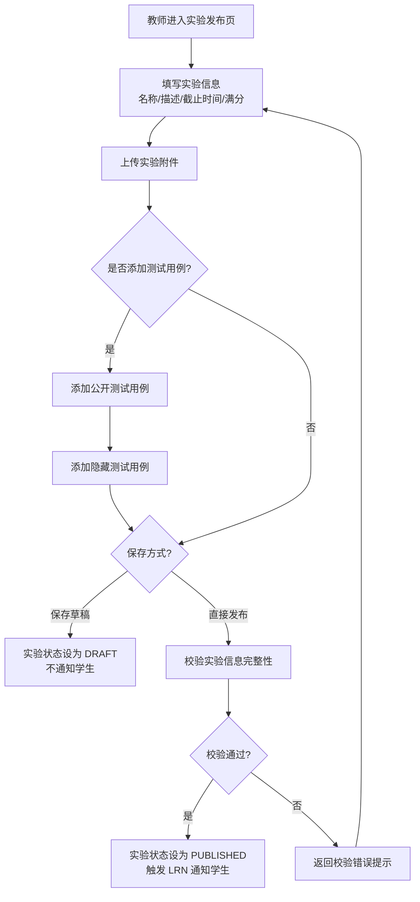
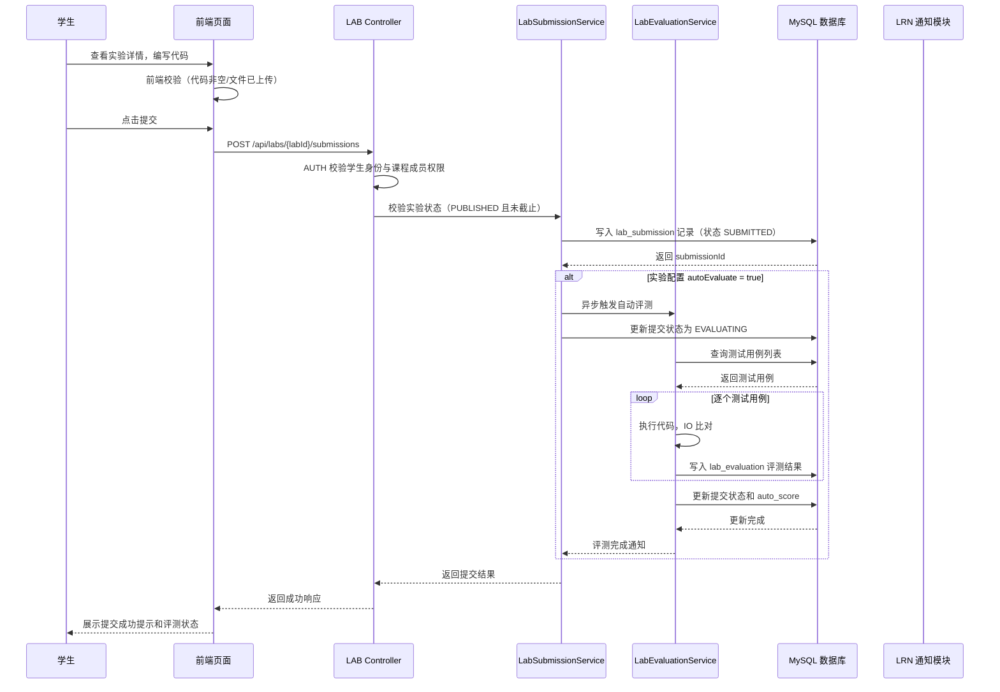
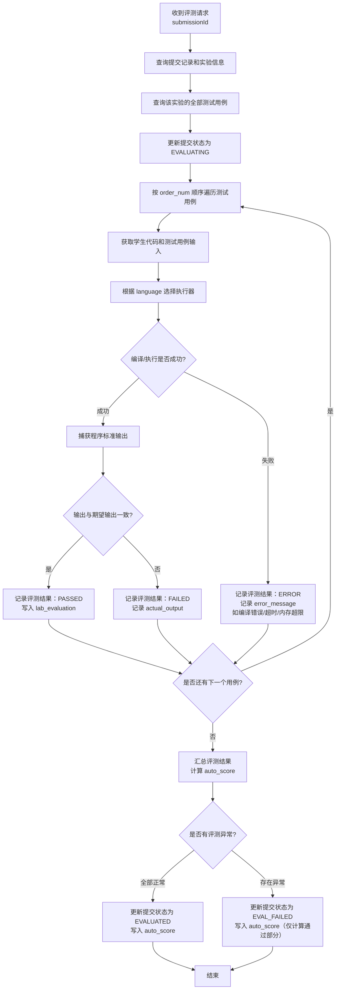
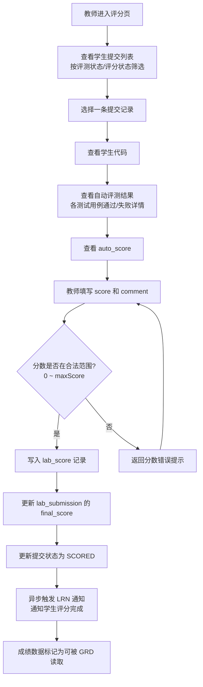
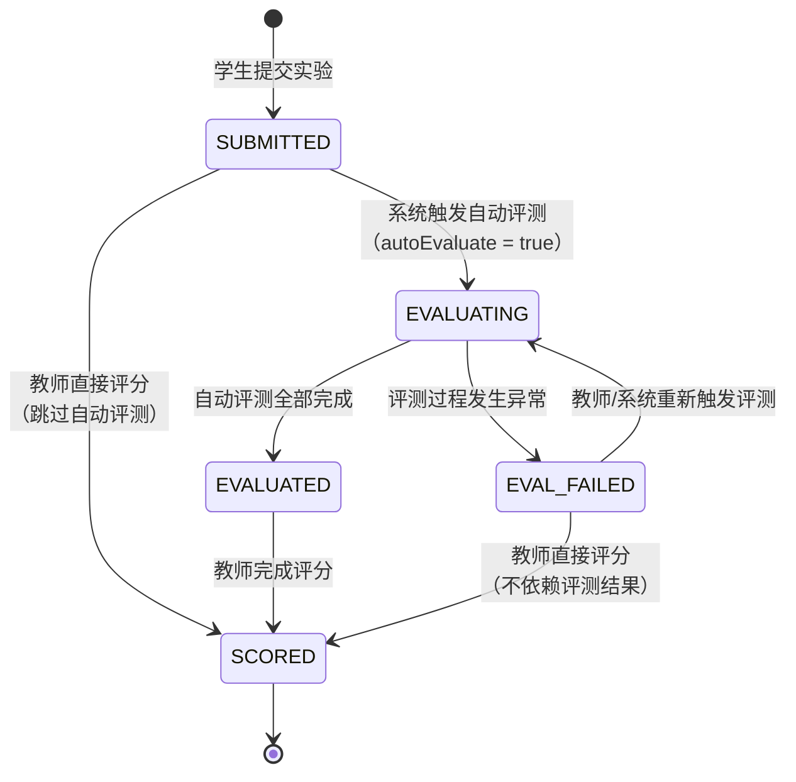
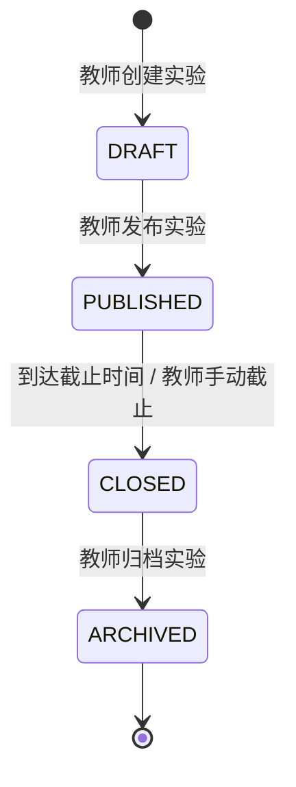

# 实训实验模块详细设计提交稿（LAB）

## 0 编写说明与设计边界

本文档为"在线教学与实训平台"中实训实验模块（LAB）的独立详细设计提交稿，对应《软件详细设计说明书》第 3.4 节。本文档由实训实验模块负责人撰写，完成后提交给详细设计负责人，由其合并入主文档。

LAB 模块的设计边界如下：

- **包含**：实验创建与发布、学生查看与提交实验、提交历史与版本管理、实验自动评测、教师评分与评语、实验结果展示、实验统计查询、测试用例管理。
- **不包含**：用户注册登录与权限管理（AUTH）、课程与成员关系维护（CRS）、学习进度记录（LRN）、作业评测业务（HWK）、最终总评计算与成绩发布（GRD）。LAB 仅通过接口调用上述模块获取基础数据。
- **评测方案**：首版采用 IO 比对评测方案（标准输入输出匹配），不引入 Docker 沙箱执行环境。评测能力是否与 HWK 共享，需与 HWK 负责人进一步确认（见第 12 节待确认事项）。

---

## 1 模块基本信息

| 项目 | 内容 |
| --- | --- |
| 模块名称 | 实训实验模块 |
| 模块缩写 | LAB |
| 模块负责人 | 实训实验模块负责人 |
| 对应需求 | FR-LAB-01 ~ FR-LAB-08 / NFR-LAB-01 ~ NFR-LAB-05 |
| 依赖模块 | AUTH（用户身份与权限）、CRS（课程与成员关系）、LRN（通知触发） |
| 协作模块 | HWK（评测能力共享待确认）、GRD（成绩数据同步） |
| 被依赖模块 | GRD（读取实验成绩来源）、LRN（触发通知） |
| 合并位置 | 《软件详细设计说明书》3.4、4、5、6、7、9 章 |

---

## 2 模块职责与依赖关系

### 2.1 模块职责

LAB 模块是"在线教学与实训平台"的核心实践环节模块，承担实验全生命周期管理职责，具体包括：

1. **实验管理**：教师可在课程内创建实验任务，编辑实验描述、要求、截止时间，上传实验附件（如参考代码、数据文件），管理实验状态（草稿、已发布、进行中、已截止、已归档）。
2. **学生提交**：学生在实验详情页查看实验要求，编写代码或上传文件，提交实验结果。支持多次提交，保留提交历史，学生可查看每次提交的评测结果。
3. **自动评测**：教师可为实验配置测试用例（标准输入、期望输出），学生提交后系统自动执行 IO 比对评测，判定通过或失败，给出测试用例级别的反馈。
4. **教师评分**：教师可在自动评测基础上进行人工评分和评语填写，支持调整分数和撰写个性化反馈。
5. **结果展示**：学生可查看实验的最终成绩（综合自动评测结果与教师评分）、教师评语、提交历史和每次评测的详细反馈。
6. **统计查询**：教师可查看实验维度的提交率、平均分、分数分布等统计数据。

### 2.2 依赖关系

| 调用方 | 被调用方 | 依赖内容 | 调用方式 |
| --- | --- | --- | --- |
| LAB | AUTH | 获取当前登录用户身份、角色（学生/教师）、权限校验 | 请求头携带 Token，AUTH 统一鉴权拦截 |
| LAB | CRS | 校验课程是否存在、查询用户是否为课程成员、校验教师是否拥有课程管理权限 | 内部 API 调用 `GET /api/courses/{courseId}/members/check` |
| LAB | LRN | 在实验发布、截止提醒、评测完成、评分完成等事件触发通知 | 调用 LRN 通知接口 `POST /api/notifications` |
| GRD | LAB | 读取实验成绩来源数据（提交状态、评测结果、教师评分） | GRD 调用 LAB 查询接口或 LAB 评测完成后推送 |

### 2.3 模块边界

- LAB 不直接管理用户账号和课程成员关系，通过 AUTH 和 CRS 获取。
- LAB 不负责成绩汇总与总评计算，评测与评分完成后由 GRD 读取或主动推送成绩数据。
- LAB 不负责作业相关业务，作业的提交、评测、批阅由 HWK 模块独立管理。
- LAB 的自动评测首版仅支持 IO 比对（标准输入输出匹配），不支持代码沙箱编译运行（如需 Docker 沙箱方案，属于后续扩展）。

---

## 3 页面详细设计

### 3.1 页面总览

| 页面编号 | 页面名称 | 使用角色 | 页面目标 | 主要操作 | 调用接口 |
| --- | --- | --- | --- | --- | --- |
| UI-LAB-01 | 实验列表页 | 学生、教师 | 按课程查看实验任务列表 | 按课程/状态筛选实验、点击进入详情、教师可创建实验 | API-LAB-02、API-LAB-01 |
| UI-LAB-02 | 实验详情页（学生端） | 学生 | 查看实验要求、提交实验、查看结果 | 查看实验描述与附件、在线编写代码或上传文件、提交、查看评测结果与教师评分 | API-LAB-03、API-LAB-08、API-LAB-10 |
| UI-LAB-03 | 实验详情页（教师端） | 教师 | 管理实验、查看提交情况、评分 | 编辑实验信息、管理测试用例、查看学生提交列表、对学生提交评分 | API-LAB-03、API-LAB-04、API-LAB-15、API-LAB-09、API-LAB-13 |
| UI-LAB-04 | 实验发布/编辑页 | 教师 | 创建或编辑实验任务 | 填写实验名称、描述、截止时间、上传附件、保存草稿或发布 | API-LAB-01、API-LAB-04、API-LAB-06 |
| UI-LAB-05 | 提交历史页 | 学生 | 查看本人某次实验的全部提交记录 | 查看提交时间、提交版本、评测状态、评测得分、查看提交详情 | API-LAB-09、API-LAB-10 |
| UI-LAB-06 | 评分页 | 教师 | 对学生提交进行评分 | 查看学生提交代码、评测结果、填写评分和评语、保存评分 | API-LAB-10、API-LAB-12、API-LAB-13 |
| UI-LAB-07 | 实验结果页 | 学生 | 查看实验最终成绩和反馈 | 查看最终成绩、教师评语、评测通过率、各测试用例结果 | API-LAB-10、API-LAB-12 |
| UI-LAB-08 | 实验统计页 | 教师 | 查看实验维度统计数据 | 查看提交率、平均分、分数分布、提交时间分布 | API-LAB-14 |

### 3.2 关键页面说明

**UI-LAB-02 实验详情页（学生端）** 是 LAB 模块最核心的页面，包含以下区域：

- **实验信息区**：展示实验名称、描述、要求、截止时间、附件下载链接。
- **代码编辑区**：提供在线代码编辑器（建议使用 Monaco Editor 或 CodeMirror），支持语法高亮和基本编辑功能。
- **文件上传区**：支持上传实验提交文件（若实验要求上传文件而非在线编写）。
- **提交操作区**：提交按钮，提交前进行前端校验（代码不为空或文件已上传、未超过截止时间）。
- **评测结果区**：展示最近一次提交的评测状态（评测中/通过/失败）和各测试用例结果。
- **成绩反馈区**：展示教师评分和评语（教师评分完成后显示）。
- **提交历史区**：展示历史提交记录列表，可点击查看每次提交的详情。

**UI-LAB-03 实验详情页（教师端）** 侧重管理视角：

- **实验管理区**：编辑实验信息、发布/截止/归档操作。
- **测试用例管理区**：添加、编辑、删除测试用例（标准输入、期望输出、分值权重）。
- **学生提交列表区**：分页展示学生提交记录，显示学生姓名、提交时间、评测状态、评分状态。
- **批量操作区**：支持按评测状态/评分状态筛选，快速跳转评分。

---

## 4 接口详细设计

### 4.1 接口总览

| 接口编号 | 接口名称 | 方法 | 路径 | 权限要求 | 对应需求 |
| --- | --- | --- | --- | --- | --- |
| API-LAB-01 | 创建实验 | POST | /api/courses/{courseId}/labs | 教师（课程管理权限） | FR-LAB-01 |
| API-LAB-02 | 获取实验列表 | GET | /api/courses/{courseId}/labs | 学生、教师（课程成员） | FR-LAB-01 |
| API-LAB-03 | 获取实验详情 | GET | /api/labs/{labId} | 学生、教师（课程成员） | FR-LAB-01 |
| API-LAB-04 | 更新实验 | PUT | /api/labs/{labId} | 教师（课程管理权限） | FR-LAB-01 |
| API-LAB-05 | 删除实验 | DELETE | /api/labs/{labId} | 教师（课程管理权限） | FR-LAB-01 |
| API-LAB-06 | 发布实验 | POST | /api/labs/{labId}/publish | 教师（课程管理权限） | FR-LAB-01 |
| API-LAB-07 | 截止实验 | POST | /api/labs/{labId}/close | 教师（课程管理权限） | FR-LAB-01 |
| API-LAB-08 | 学生提交实验 | POST | /api/labs/{labId}/submissions | 学生（课程成员） | FR-LAB-02 |
| API-LAB-09 | 获取提交列表 | GET | /api/labs/{labId}/submissions | 教师（课程管理权限）/ 学生（仅本人） | FR-LAB-03 |
| API-LAB-10 | 获取提交详情 | GET | /api/labs/{labId}/submissions/{submissionId} | 教师 / 提交者本人 | FR-LAB-03 |
| API-LAB-11 | 触发评测 | POST | /api/labs/{labId}/submissions/{submissionId}/evaluate | 教师、系统内部 | FR-LAB-04 |
| API-LAB-12 | 获取评测结果 | GET | /api/labs/{labId}/submissions/{submissionId}/result | 教师 / 提交者本人 | FR-LAB-04 |
| API-LAB-13 | 教师评分 | POST | /api/labs/{labId}/submissions/{submissionId}/score | 教师（课程管理权限） | FR-LAB-05 |
| API-LAB-14 | 获取实验统计 | GET | /api/labs/{labId}/statistics | 教师（课程管理权限） | FR-LAB-07 |
| API-LAB-15 | 管理测试用例 | POST/GET/PUT/DELETE | /api/labs/{labId}/testcases | 教师（课程管理权限） | FR-LAB-04 |

### 4.2 核心接口详细说明

#### API-LAB-01 创建实验

- **方法**：POST
- **路径**：`/api/courses/{courseId}/labs`
- **权限**：教师且拥有该课程管理权限
- **请求参数**：

| 参数名 | 类型 | 必填 | 说明 |
| --- | --- | --- | --- |
| title | String | 是 | 实验名称，最长 100 字符 |
| description | String | 是 | 实验描述与要求，支持 Markdown |
| deadline | DateTime | 是 | 截止时间，ISO 8601 格式 |
| maxScore | Integer | 是 | 满分分值 |
| attachmentIds | List\<Long\> | 否 | 附件 ID 列表 |
| language | String | 否 | 允许的编程语言，如 "java,python,cpp" |
| evaluationMode | String | 否 | 评测模式：io_compare（默认） |
| autoEvaluate | Boolean | 否 | 提交后是否自动评测，默认 true |

- **成功响应**：

```json
{
  "code": "0",
  "message": "success",
  "data": {
    "labId": 1,
    "title": "实验一：链表基本操作",
    "status": "DRAFT",
    "createdAt": "2026-05-17T10:00:00"
  }
}
```

- **失败响应**：

| 错误码 | 说明 | HTTP 状态码 |
| --- | --- | --- |
| LAB-400-01 | 课程不存在 | 404 |
| LAB-403-01 | 无课程管理权限 | 403 |
| LAB-400-02 | 实验名称为空或超长 | 400 |
| LAB-400-03 | 截止时间早于当前时间 | 400 |

#### API-LAB-08 学生提交实验

- **方法**：POST
- **路径**：`/api/labs/{labId}/submissions`
- **权限**：学生且为该课程成员
- **请求格式**：multipart/form-data
- **请求参数**：

| 参数名 | 类型 | 必填 | 说明 |
| --- | --- | --- | --- |
| code | String | 条件必填 | 提交的源代码，与 file 二选一 |
| file | File | 条件必填 | 提交的文件，与 code 二选一 |
| language | String | 是 | 编程语言，如 "java"、"python"、"cpp" |

- **业务规则**：
  1. 校验实验状态为"进行中"（PUBLISHED 且未到截止时间）。
  2. 校验学生为课程成员。
  3. 保存提交记录，提交状态置为"已提交"（SUBMITTED）。
  4. 若实验配置了 autoEvaluate = true，自动触发评测（提交状态转为"评测中" EVALUATING）。
  5. 若自动评测失败（如 IO 比对执行异常），状态转为"评测失败"（EVAL_FAILED），允许教师手动触发重新评测或直接评分。

- **成功响应**：

```json
{
  "code": "0",
  "message": "success",
  "data": {
    "submissionId": 1,
    "labId": 1,
    "studentId": 100,
    "status": "EVALUATING",
    "submittedAt": "2026-05-17T14:30:00"
  }
}
```

#### API-LAB-13 教师评分

- **方法**：POST
- **路径**：`/api/labs/{labId}/submissions/{submissionId}/score`
- **权限**：教师且拥有该课程管理权限
- **请求参数**：

| 参数名 | 类型 | 必填 | 说明 |
| --- | --- | --- | --- |
| score | Integer | 是 | 评分，0 ~ 实验满分 |
| comment | String | 否 | 教师评语，最长 500 字符 |

- **业务规则**：
  1. 校验提交记录存在且属于该实验。
  2. 校验分数范围合法（0 ~ maxScore）。
  3. 评分完成后触发 LRN 通知（通知类型：评分完成）。
  4. 评分完成后将成绩数据推送至 GRD 或标记为可被 GRD 读取。

#### API-LAB-15 管理测试用例

- **方法**：POST（创建）/ GET（列表）/ PUT（更新）/ DELETE（删除）
- **路径**：`/api/labs/{labId}/testcases` 或 `/api/labs/{labId}/testcases/{testcaseId}`
- **权限**：教师且拥有该课程管理权限
- **测试用例结构**：

| 字段名 | 类型 | 说明 |
| --- | --- | --- |
| input | String | 标准输入内容 |
| expectedOutput | String | 期望输出内容 |
| scoreWeight | Integer | 该测试用例分值权重 |
| isPublic | Boolean | 是否为公开测试用例（公开用例学生可查看，隐藏用例仅在评测中使用） |
| orderNum | Integer | 测试用例排序序号 |

---

## 5 后端服务与组件设计

### 5.1 服务总览

| 服务编号 | 服务/组件名称 | 主要职责 | 输入 | 输出 |
| --- | --- | --- | --- | --- |
| SVC-LAB-01 | LabExperimentService | 实验的创建、更新、发布、截止、删除等生命周期管理 | 实验创建/更新请求 DTO、实验室 ID | 实验详情 VO、操作结果 |
| SVC-LAB-02 | LabSubmissionService | 学生提交实验、查询提交历史、获取提交详情 | 提交请求（代码/文件）、实验室 ID、学生 ID | 提交记录 VO、提交列表 |
| SVC-LAB-03 | LabEvaluationService | 自动评测执行、评测结果记录、评测状态管理 | 提交 ID、测试用例列表 | 评测结果列表、通过/失败状态 |
| SVC-LAB-04 | LabScoreService | 教师评分、评分更新、成绩同步至 GRD | 提交 ID、分数、评语 | 评分记录 VO |
| SVC-LAB-05 | LabTestcaseService | 测试用例的 CRUD、公开/隐藏管理 | 测试用例 DTO、实验室 ID | 测试用例列表 |
| SVC-LAB-06 | LabStatisticsService | 实验维度统计数据计算 | 实验室 ID | 统计数据 VO（提交率、平均分、分数分布） |

### 5.2 服务依赖关系

```
LabExperimentController
  ├── LabExperimentService
  │     ├── LabExperimentMapper (MyBatis/数据库)
  │     ├── CourseFeignClient / CourseApiCaller (调用 CRS 校验课程权限)
  │     └── NotificationApiCaller (调用 LRN 发送通知)
  ├── LabSubmissionController
  │     └── LabSubmissionService
  │           ├── LabSubmissionMapper
  │           ├── LabEvaluationService (触发自动评测)
  │           └── NotificationApiCaller (提交成功通知)
  ├── LabEvaluationController
  │     └── LabEvaluationService
  │           ├── LabTestcaseMapper (获取测试用例)
  │           ├── LabSubmissionMapper (更新提交状态)
  │           └── LabEvaluationMapper (写入评测结果)
  ├── LabScoreController
  │     └── LabScoreService
  │           ├── LabSubmissionMapper
  │           ├── LabScoreMapper
  │           ├── NotificationApiCaller (评分完成通知)
  │           └── GradeApiCaller (推送成绩至 GRD)
  └── LabStatisticsController
        └── LabStatisticsService
              ├── LabSubmissionMapper
              └── LabScoreMapper
```

### 5.3 核心服务说明

**SVC-LAB-03 LabEvaluationService（自动评测服务）**

评测服务是 LAB 模块的核心组件，首版采用 IO 比对评测方案，流程如下：

1. 接收提交 ID，查询提交记录和对应的实验信息。
2. 从 `lab_testcase` 表获取该实验的所有测试用例（区分公开和隐藏）。
3. 按顺序执行每个测试用例的 IO 比对：
   - 将测试用例的 `input` 作为标准输入。
   - 执行学生提交的代码（需根据 `language` 字段选择对应的执行方式）。
   - 捕获程序标准输出，与 `expectedOutput` 进行比对。
   - 记录每个测试用例的通过/失败状态和实际输出。
4. 汇总评测结果，计算自动评测分数（通过的测试用例权重之和）。
5. 更新提交状态为"评测完成"（EVALUATED），写入评测结果。
6. 若执行过程中发生异常（编译错误、运行超时、内存超限），标记该测试用例为"异常"并记录错误信息。

> **扩展说明**：首版评测执行采用进程级执行方式（Runtime.exec），设置超时时间（默认 10 秒）和内存限制。后续若需引入 Docker 沙箱隔离执行环境，仅需替换 `LabEvaluationService` 内部的执行器实现，不影响上层接口和业务流程。

**SVC-LAB-04 LabScoreService（评分服务）**

评分服务负责教师人工评分和成绩同步：

1. 校验提交记录状态（建议允许在"评测完成"和"评测失败"状态下评分）。
2. 校验分数范围（0 ~ 实验满分）。
3. 写入评分记录（包含教师 ID、分数、评语、评分时间）。
4. 更新提交记录的最终成绩字段。
5. 异步触发两个后续动作：
   - 调用 LRN 通知接口，向学生发送"评分完成"通知。
   - 将成绩数据标记为可被 GRD 读取，或主动调用 GRD 成绩接收接口。

---

## 6 数据结构与数据库设计

### 6.1 数据表总览

| 表编号 | 表名 | 中文名 | 主要字段 | 说明 |
| --- | --- | --- | --- | --- |
| DB-LAB-01 | lab_experiment | 实验表 | id, course_id, title, description, status, deadline, max_score, language, evaluation_mode, auto_evaluate, created_by | 存储实验基本信息和配置 |
| DB-LAB-02 | lab_testcase | 测试用例表 | id, lab_id, input, expected_output, score_weight, is_public, order_num, deleted | 存储实验测试用例 |
| DB-LAB-03 | lab_submission | 实验提交表 | id, lab_id, student_id, code_content, file_path, language, status, final_score, submitted_at | 存储学生提交记录 |
| DB-LAB-04 | lab_evaluation | 评测结果表 | id, submission_id, testcase_id, actual_output, passed, error_message, executed_at | 存储每个测试用例的评测结果 |
| DB-LAB-05 | lab_score | 评分记录表 | id, submission_id, teacher_id, score, comment, scored_at | 存储教师评分记录 |

### 6.2 数据表详细设计

#### DB-LAB-01 lab_experiment（实验表）

| 字段名 | 类型 | 约束 | 默认值 | 说明 |
| --- | --- | --- | --- | --- |
| id | bigint | PK, AUTO_INCREMENT | - | 主键 |
| course_id | bigint | NOT NULL, INDEX | - | 所属课程 ID，关联 CRS 模块课程表 |
| title | varchar(100) | NOT NULL | - | 实验名称 |
| description | text | NOT NULL | - | 实验描述与要求，支持 Markdown |
| status | varchar(20) | NOT NULL, INDEX | DRAFT | 实验状态：DRAFT / PUBLISHED / CLOSED / ARCHIVED |
| deadline | datetime | NOT NULL, INDEX | - | 截止时间 |
| max_score | int | NOT NULL | 100 | 满分分值 |
| language | varchar(100) | NULL | - | 允许的编程语言，逗号分隔 |
| evaluation_mode | varchar(20) | NOT NULL | io_compare | 评测模式：io_compare |
| auto_evaluate | tinyint(1) | NOT NULL | 1 | 提交后是否自动评测：1 是 0 否 |
| created_by | bigint | NOT NULL, INDEX | - | 创建人（教师 ID），关联 AUTH 用户表 |
| created_at | datetime | NOT NULL | CURRENT_TIMESTAMP | 创建时间 |
| updated_at | datetime | NOT NULL | CURRENT_TIMESTAMP | 更新时间 |
| updated_by | bigint | NULL | - | 更新人 |
| deleted | tinyint | NOT NULL | 0 | 逻辑删除：0 未删除 1 已删除 |

**索引设计**：

| 索引名 | 索引字段 | 索引类型 | 说明 |
| --- | --- | --- | --- |
| idx_lab_course_id | course_id | 普通索引 | 按课程查询实验列表 |
| idx_lab_status | status | 普通索引 | 按状态筛选实验 |
| idx_lab_deadline | deadline | 普通索引 | 按截止时间排序和筛选 |
| idx_lab_created_by | created_by | 普通索引 | 按教师查询实验 |

**状态枚举**：

| 枚举值 | 中文说明 | 允许转换 |
| --- | --- | --- |
| DRAFT | 草稿 | -> PUBLISHED |
| PUBLISHED | 已发布（进行中） | -> CLOSED |
| CLOSED | 已截止 | -> ARCHIVED |
| ARCHIVED | 已归档 | 无 |

#### DB-LAB-02 lab_testcase（测试用例表）

| 字段名 | 类型 | 约束 | 默认值 | 说明 |
| --- | --- | --- | --- | --- |
| id | bigint | PK, AUTO_INCREMENT | - | 主键 |
| lab_id | bigint | NOT NULL, INDEX | - | 所属实验 ID |
| input | text | NOT NULL | - | 标准输入内容 |
| expected_output | text | NOT NULL | - | 期望输出内容 |
| score_weight | int | NOT NULL | 0 | 该用例分值权重 |
| is_public | tinyint(1) | NOT NULL | 0 | 是否公开：0 隐藏 1 公开 |
| order_num | int | NOT NULL | 0 | 排序序号 |
| created_at | datetime | NOT NULL | CURRENT_TIMESTAMP | 创建时间 |
| updated_at | datetime | NOT NULL | CURRENT_TIMESTAMP | 更新时间 |
| deleted | tinyint | NOT NULL | 0 | 逻辑删除 |

#### DB-LAB-03 lab_submission（实验提交表）

| 字段名 | 类型 | 约束 | 默认值 | 说明 |
| --- | --- | --- | --- | --- |
| id | bigint | PK, AUTO_INCREMENT | - | 主键 |
| lab_id | bigint | NOT NULL, INDEX | - | 所属实验 ID |
| student_id | bigint | NOT NULL, INDEX | - | 提交学生 ID，关联 AUTH 用户表 |
| code_content | text | NULL | - | 提交的源代码内容 |
| file_path | varchar(500) | NULL | - | 提交的文件存储路径（与 code_content 二选一） |
| language | varchar(20) | NOT NULL | - | 编程语言 |
| status | varchar(20) | NOT NULL, INDEX | SUBMITTED | 提交状态，见状态枚举 |
| final_score | int | NULL | - | 最终成绩（教师评分后填入） |
| auto_score | int | NULL | - | 自动评测得分（评测完成后填入） |
| version | int | NOT NULL | 1 | 提交版本号，同一学生同一实验递增 |
| submitted_at | datetime | NOT NULL, INDEX | CURRENT_TIMESTAMP | 提交时间 |
| created_at | datetime | NOT NULL | CURRENT_TIMESTAMP | 创建时间 |
| updated_at | datetime | NOT NULL | CURRENT_TIMESTAMP | 更新时间 |
| deleted | tinyint | NOT NULL | 0 | 逻辑删除 |

**索引设计**：

| 索引名 | 索引字段 | 索引类型 | 说明 |
| --- | --- | --- | --- |
| idx_sub_lab_id | lab_id | 普通索引 | 按实验查询提交列表 |
| idx_sub_student_id | student_id | 普通索引 | 按学生查询提交记录 |
| idx_sub_status | status | 普通索引 | 按提交状态筛选 |
| idx_submitted_at | submitted_at | 普通索引 | 按提交时间排序 |
| uk_lab_student_version | (lab_id, student_id, version) | 唯一索引 | 防止同一版本重复提交 |

**提交状态枚举**：

| 枚举值 | 中文说明 | 说明 |
| --- | --- | --- |
| SUBMITTED | 已提交 | 刚提交，等待评测 |
| EVALUATING | 评测中 | 正在执行自动评测 |
| EVALUATED | 评测完成 | 自动评测完成，等待教师评分 |
| EVAL_FAILED | 评测失败 | 自动评测异常，允许手动触发或直接评分 |
| SCORED | 已评分 | 教师已完成评分 |

#### DB-LAB-04 lab_evaluation（评测结果表）

| 字段名 | 类型 | 约束 | 默认值 | 说明 |
| --- | --- | --- | --- | --- |
| id | bigint | PK, AUTO_INCREMENT | - | 主键 |
| submission_id | bigint | NOT NULL, INDEX | - | 关联提交记录 ID |
| testcase_id | bigint | NOT NULL, INDEX | - | 关联测试用例 ID |
| actual_output | text | NULL | - | 程序实际输出 |
| passed | tinyint(1) | NOT NULL | 0 | 是否通过：0 未通过 1 通过 |
| error_message | varchar(500) | NULL | - | 错误信息（编译错误、超时等） |
| executed_at | datetime | NULL | - | 评测执行时间 |
| created_at | datetime | NOT NULL | CURRENT_TIMESTAMP | 创建时间 |

#### DB-LAB-05 lab_score（评分记录表）

| 字段名 | 类型 | 约束 | 默认值 | 说明 |
| --- | --- | --- | --- | --- |
| id | bigint | PK, AUTO_INCREMENT | - | 主键 |
| submission_id | bigint | NOT NULL, UNIQUE INDEX | - | 关联提交记录 ID，每个提交只有一条评分记录 |
| teacher_id | bigint | NOT NULL, INDEX | - | 评分教师 ID |
| score | int | NOT NULL | - | 评分分数 |
| comment | varchar(500) | NULL | - | 教师评语 |
| scored_at | datetime | NOT NULL | CURRENT_TIMESTAMP | 评分时间 |
| updated_at | datetime | NOT NULL | CURRENT_TIMESTAMP | 更新时间（支持修改评分） |

### 6.3 表间关系

```text
lab_experiment (1) ──── (N) lab_testcase
       │
       │ (1)
       │
       ├── (N) lab_submission
       │           │
       │           │ (1)
       │           ├── (N) lab_evaluation
       │           │           │
       │           │           └── (1) lab_testcase (引用)
       │           │
       │           └── (0..1) lab_score
       │
       └── 被以下模块引用：
           GRD 读取 submission + score 作为成绩来源
           CRS 提供 course_id 外键关联
           AUTH 提供 student_id / created_by / teacher_id 外键关联
```

---

## 7 关键业务流程与状态机

### 7.1 教师发布实验流程

图 3-4-1 教师发布实验流程图



### 7.2 学生提交实验流程（顺序图）

图 3-4-2 学生提交实验顺序图



### 7.3 实验自动评测流程

图 3-4-3 实验自动评测流程图



### 7.4 教师评分流程

图 3-4-4 教师评分流程图



### 7.5 提交状态机

图 3-4-5 实验提交状态机



**状态转换说明**：

| 当前状态 | 目标状态 | 触发条件 | 操作 |
| --- | --- | --- | --- |
| - | SUBMITTED | 学生调用提交接口 | 写入提交记录 |
| SUBMITTED | EVALUATING | autoEvaluate = true | 异步调用评测服务 |
| SUBMITTED | SCORED | 教师直接评分 | 写入评分记录 |
| EVALUATING | EVALUATED | 评测全部完成 | 写入评测结果和 auto_score |
| EVALUATING | EVAL_FAILED | 评测异常 | 记录异常信息 |
| EVALUATED | SCORED | 教师评分 | 写入评分记录 |
| EVAL_FAILED | EVALUATING | 手动重新评测 | 重置评测状态，重新执行 |
| EVAL_FAILED | SCORED | 教师直接评分 | 写入评分记录（基于教师判断） |

### 7.6 实验状态机

图 3-4-6 实验状态机



---

## 8 异常处理设计

### 8.1 LAB 模块错误码定义

| 错误码 | 错误类型 | 说明 | 处理策略 | 涉及页面 |
| --- | --- | --- | --- | --- |
| LAB-400-01 | 参数异常 | 实验名称为空或超过 100 字符 | 前端实时校验 + 后端参数校验 | UI-LAB-04 |
| LAB-400-02 | 参数异常 | 截止时间早于当前时间 | 前端校验日期选择器最小值 | UI-LAB-04 |
| LAB-400-03 | 参数异常 | 提交代码为空且未上传文件 | 前端校验代码编辑器和文件上传 | UI-LAB-02 |
| LAB-400-04 | 参数异常 | 编程语言不在实验允许范围内 | 前端下拉选项限制 | UI-LAB-02 |
| LAB-400-05 | 参数异常 | 教师评分超出 0 ~ maxScore 范围 | 前端输入框限制 + 后端校验 | UI-LAB-06 |
| LAB-403-01 | 权限异常 | 学生访问教师接口（如评分接口） | AUTH 统一鉴权拦截，返回 403 | UI-LAB-06 |
| LAB-403-02 | 权限异常 | 非课程成员访问实验 | 校验 CRS 课程成员关系，返回 403 | 全部页面 |
| LAB-403-03 | 权限异常 | 学生查看其他学生的提交 | 校验提交者与当前用户一致 | UI-LAB-05 |
| LAB-404-01 | 数据异常 | 实验不存在 | 返回 404 提示 | 全部页面 |
| LAB-404-02 | 数据异常 | 提交记录不存在 | 返回 404 提示 | UI-LAB-06 |
| LAB-409-01 | 状态异常 | 实验已截止，不允许提交 | 返回状态错误码和提示 | UI-LAB-02 |
| LAB-409-02 | 状态异常 | 实验已归档，不允许修改 | 返回状态错误码和提示 | UI-LAB-04 |
| LAB-500-01 | 评测异常 | 自动评测执行超时 | 提交状态置为 EVAL_FAILED，记录错误日志 | UI-LAB-02 |
| LAB-500-02 | 评测异常 | 编译错误 | 提交状态置为 EVAL_FAILED，记录编译错误信息 | UI-LAB-02 |
| LAB-500-03 | 评测异常 | 运行时内存超限 | 提交状态置为 EVAL_FAILED，记录错误信息 | UI-LAB-02 |
| LAB-500-04 | 系统异常 | 评测服务内部错误 | 记录错误日志，提交状态置为 EVAL_FAILED | 后端 |

### 8.2 异常处理流程

| 异常场景 | 处理流程 | 用户提示 |
| --- | --- | --- |
| 学生在截止后提交 | 后端校验实验状态和截止时间，拒绝提交 | "该实验已截止，无法提交" |
| 提交代码编译失败 | 评测服务捕获编译错误，记录到评测结果表，提交状态为 EVAL_FAILED | "代码编译失败，请检查后重新提交" |
| 评测执行超时 | 评测服务设置超时限制（默认 10s），超时后终止进程，状态置为 EVAL_FAILED | "评测超时，可能存在死循环，请优化代码" |
| 教师修改已评分成绩 | 允许教师修改评分（更新 lab_score），记录更新时间和变更日志 | 评分更新成功 |
| 并发评测同一提交 | 通过提交状态机保证状态单向转换，使用乐观锁或数据库行锁防止重复评测 | 无需用户感知 |

---

## 9 安全、权限与日志设计

### 9.1 权限控制

| 角色 | 允许操作 | 禁止操作 |
| --- | --- | --- |
| 学生 | 查看课程实验列表、查看实验详情、提交实验、查看本人提交历史和结果 | 创建/编辑/删除实验、管理测试用例、查看其他学生提交、评分 |
| 教师（课程管理权限） | 创建/编辑/删除实验、发布/截止实验、管理测试用例、查看所有学生提交、评分、查看统计 | - |
| 教师（非课程管理权限） | 查看实验列表和详情、查看本人负责的提交 | 创建/删除实验、修改测试用例 |
| 管理员 | 平台级管理（通过 AUTH 模块），不直接操作 LAB 业务 | - |

### 9.2 数据权限

- 学生只能查看和操作**本人**的提交记录，接口层通过 `student_id = 当前用户 ID` 进行数据范围校验。
- 教师只能查看和操作**本人课程**内的实验和提交，接口层通过 `lab.course_id IN (教师课程列表)` 进行数据范围校验。
- 测试用例中 `is_public = 0`（隐藏用例）仅教师和评测服务可访问，学生查询时过滤。

### 9.3 日志记录

| 操作 | 日志类型 | 记录内容 |
| --- | --- | --- |
| 教师创建/编辑/删除实验 | 操作日志 | 实验ID、操作类型、操作人、操作时间 |
| 教师发布/截止实验 | 业务日志 | 实验ID、状态变更、操作人 |
| 教师管理测试用例 | 操作日志 | 测试用例ID、操作类型、操作人 |
| 学生提交实验 | 业务日志 | 提交ID、实验ID、学生ID、提交时间 |
| 自动评测执行 | 评测日志 | 提交ID、评测开始时间、结束时间、结果状态 |
| 教师评分/修改评分 | 审计日志 | 提交ID、评分分数、评语、教师ID、评分时间、是否为修改 |

### 9.4 数据安全

- 学生提交的代码内容存储在数据库 `lab_submission.code_content` 字段中，不暴露给其他学生。
- 评测服务的标准输入输出存储在 `lab_testcase` 表中，隐藏用例（`is_public = 0`）的 `expected_output` 不通过学生端接口返回。
- 文件存储（若使用文件上传方式提交）路径不直接暴露给前端，通过后端接口代理下载。

---

## 10 性能与可维护性设计

### 10.1 性能优化策略

| 场景 | 优化策略 | 说明 |
| --- | --- | --- |
| 实验列表查询 | 分页查询 + course_id + status 索引 | 避免全表扫描，每页默认 20 条 |
| 提交列表查询 | 分页查询 + lab_id + student_id 索引 | 教师查看全班提交和学生查看本人提交分别走不同索引 |
| 自动评测 | 异步执行，不阻塞用户请求 | 评测服务异步调用，前端通过轮询或状态查询获取评测结果 |
| 评测超时控制 | 进程级超时（默认 10 秒） | 防止死循环或恶意代码占用资源 |
| 代码存储 | 数据库 TEXT 字段存储（首版） | 首版直接存储在数据库；若后续代码量增大，可迁移至文件存储 + MinIO |
| 统计查询 | 使用 SQL 聚合 + 缓存 | 统计数据不要求实时性，可接受分钟级延迟 |

### 10.2 可维护性设计

| 设计点 | 说明 |
| --- | --- |
| 评测器抽象 | `LabEvaluationService` 内部定义 `Evaluator` 接口，首版实现 `IOCompareEvaluator`，后续可扩展 `DockerSandboxEvaluator`，上层服务无需修改 |
| 通知解耦 | 通过 LRN 模块统一发送通知，LAB 模块仅调用通知接口，不直接实现消息推送 |
| 状态机清晰 | 提交状态和实验状态采用有限状态机管理，状态转换规则集中定义，避免散落在业务代码中 |
| 配置化 | 评测超时时间、内存限制、允许的编程语言列表等参数通过配置文件管理，不硬编码 |

---

## 11 需求追踪与测试关注点

### 11.1 功能需求追踪表

| 需求编号 | 需求名称 | 页面编号 | API 编号 | 数据表编号 | 测试编号 |
| --- | --- | --- | --- | --- | --- |
| FR-LAB-01 | 实验创建与发布 | UI-LAB-01、UI-LAB-04 | API-LAB-01、API-LAB-02、API-LAB-03、API-LAB-04、API-LAB-05、API-LAB-06、API-LAB-07 | DB-LAB-01、DB-LAB-02 | TC-LAB-01 ~ TC-LAB-07 |
| FR-LAB-02 | 学生实验查看与提交 | UI-LAB-02 | API-LAB-03、API-LAB-08 | DB-LAB-01、DB-LAB-03 | TC-LAB-08 ~ TC-LAB-11 |
| FR-LAB-03 | 提交历史与版本管理 | UI-LAB-05 | API-LAB-09、API-LAB-10 | DB-LAB-03 | TC-LAB-12 ~ TC-LAB-14 |
| FR-LAB-04 | 实验自动评测 | UI-LAB-02 | API-LAB-11、API-LAB-12 | DB-LAB-02、DB-LAB-04 | TC-LAB-15 ~ TC-LAB-20 |
| FR-LAB-05 | 教师评分与评语 | UI-LAB-06 | API-LAB-13 | DB-LAB-05 | TC-LAB-21 ~ TC-LAB-24 |
| FR-LAB-06 | 实验结果展示 | UI-LAB-07 | API-LAB-10、API-LAB-12 | DB-LAB-03、DB-LAB-04、DB-LAB-05 | TC-LAB-25 ~ TC-LAB-27 |
| FR-LAB-07 | 实验统计查询 | UI-LAB-08 | API-LAB-14 | DB-LAB-03、DB-LAB-05 | TC-LAB-28 ~ TC-LAB-30 |
| FR-LAB-08 | 实验报告管理 | UI-LAB-02、UI-LAB-07 | API-LAB-08、API-LAB-10 | DB-LAB-03 | TC-LAB-31 ~ TC-LAB-32 |

### 11.2 非功能需求追踪表

| 需求编号 | 需求名称 | 设计对应 | 测试编号 |
| --- | --- | --- | --- |
| NFR-LAB-01 | 实验提交响应时间不超过 2 秒 | 异步评测不阻塞提交接口 | TC-LAB-N01 |
| NFR-LAB-02 | 单次评测执行时间不超过 10 秒 | 评测超时控制机制 | TC-LAB-N02 |
| NFR-LAB-03 | 学生只能查看本人提交 | 数据权限校验（student_id 范围限制） | TC-LAB-N03 |
| NFR-LAB-04 | 教师评分后学生收到通知 | 评分完成后触发 LRN 通知 | TC-LAB-N04 |
| NFR-LAB-05 | 评测失败时允许教师手动处理 | EVAL_FAILED 状态可重新评测或直接评分 | TC-LAB-N05 |

### 11.3 关键测试场景

| 测试编号 | 测试场景 | 测试类型 | 优先级 | 预期结果 |
| --- | --- | --- | --- | --- |
| TC-LAB-01 | 教师创建实验（正常） | 单元测试 | P0 | 返回实验 ID，状态为 DRAFT |
| TC-LAB-02 | 教师创建实验（名称为空） | 单元测试 | P0 | 返回 LAB-400-01 错误码 |
| TC-LAB-03 | 教师发布实验 | 单元测试 | P0 | 状态变为 PUBLISHED，触发 LRN 通知 |
| TC-LAB-04 | 非课程教师创建实验 | 权限测试 | P0 | 返回 403 权限不足 |
| TC-LAB-05 | 学生提交实验（正常） | 单元测试 | P0 | 创建提交记录，状态 EVALUATING |
| TC-LAB-06 | 学生在截止后提交 | 状态测试 | P0 | 返回 LAB-409-01 错误码 |
| TC-LAB-07 | 非课程成员提交实验 | 权限测试 | P0 | 返回 403 权限不足 |
| TC-LAB-08 | 自动评测 IO 比对通过 | 单元测试 | P0 | 所有测试用例 PASSED，auto_score 正确 |
| TC-LAB-09 | 自动评测 IO 比对失败 | 单元测试 | P0 | 部分用例 FAILED，auto_score 按通过权重计算 |
| TC-LAB-10 | 评测超时处理 | 异常测试 | P1 | 状态 EVAL_FAILED，记录超时错误信息 |
| TC-LAB-11 | 评测编译错误 | 异常测试 | P1 | 状态 EVAL_FAILED，记录编译错误信息 |
| TC-LAB-12 | 教师评分（正常） | 单元测试 | P0 | 写入评分记录，状态 SCORED，触发通知 |
| TC-LAB-13 | 教师评分超出范围 | 参数测试 | P0 | 返回 LAB-400-05 错误码 |
| TC-LAB-14 | 教师修改已评分成绩 | 单元测试 | P1 | 更新评分记录，记录变更日志 |
| TC-LAB-15 | 学生查看本人提交 | 权限测试 | P0 | 返回本人提交详情 |
| TC-LAB-16 | 学生查看他人提交 | 权限测试 | P0 | 返回 403 权限不足 |
| TC-LAB-17 | 实验统计查询 | 单元测试 | P1 | 返回提交率、平均分、分数分布 |
| TC-LAB-18 | 评测失败后教师重新评测 | 单元测试 | P1 | 状态从 EVAL_FAILED 变为 EVALUATED |
| TC-LAB-19 | 评测失败后教师直接评分 | 单元测试 | P1 | 状态从 EVAL_FAILED 变为 SCORED |
| TC-LAB-20 | 学生多次提交版本递增 | 单元测试 | P1 | version 字段递增，历史记录保留 |

---

## 12 与其他模块待确认事项

| 编号 | 待确认事项 | 涉及模块 | 当前假设 | 需协调方 |
| --- | --- | --- | --- | --- |
| LAB-C01 | LAB 与 HWK 是否共享自动评测能力 | LAB、HWK | 首版各自独立实现，后续可抽取公共评测服务 | HWK 负责人 |
| LAB-C02 | GRD 获取 LAB 成绩的方式 | LAB、GRD | LAB 评分完成后主动推送至 GRD；GRD 也可查询 LAB 接口获取 | GRD 负责人 |
| LAB-C03 | 评分完成后是否允许 GRD 覆盖修改 | LAB、GRD | LAB 侧评分为最终成绩，GRD 不覆盖；若需调整由教师重新评分 | GRD 负责人 |
| LAB-C04 | 通知触发格式与内容模板 | LAB、LRN | 需与 LRN 确认通知接口的字段格式（通知类型、标题、内容模板、接收人） | LRN 负责人 |
| LAB-C05 | 课程成员校验接口的具体路径和返回格式 | LAB、CRS | 调用 CRS 接口 `GET /api/courses/{courseId}/members/check?userId={userId}`，返回布尔值和角色 | CRS 负责人 |
| LAB-C06 | 文件存储方案 | LAB、CRS、HWK | 首版采用本地文件存储，通过后端接口代理下载，文件路径存入数据库 | 后端负责人 |
| LAB-C07 | 测试用例的标准输入输出是否支持文件 | LAB | 首版仅支持文本，不支持二进制文件输入输出 | 自行决策 |

---

## 13 模块提交结论

本提交稿覆盖了 LAB 实训实验模块的完整详细设计，包括 8 个页面、15 个接口、6 个后端服务、5 张数据表、4 张关键流程图、2 个状态机、16 个错误码和 20+ 个测试场景。设计要点总结如下：

1. **评测方案**：首版采用 IO 比对评测，通过 `Evaluator` 接口抽象，后续可扩展 Docker 沙箱方案。
2. **状态管理**：提交状态机（SUBMITTED → EVALUATING → EVALUATED/EVAL_FAILED → SCORED）和实验状态机（DRAFT → PUBLISHED → CLOSED → ARCHIVED）清晰定义。
3. **跨模块协作**：依赖 AUTH（鉴权）、CRS（课程校验）、LRN（通知），向 GRD（成绩来源）和 LRN（通知触发）提供数据。
4. **性能考量**：评测异步执行不阻塞提交请求，数据库按高频查询字段建立索引。
5. **安全设计**：数据权限按角色和学生/教师范围隔离，隐藏测试用例不暴露给前端，操作日志完整记录。

本提交稿已准备就绪，可提交给详细设计负责人合并入《软件详细设计说明书》主文档。
