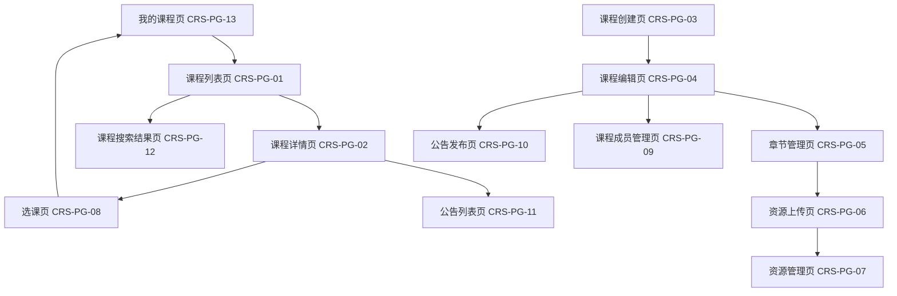

# 课程与教学资源模块概要设计提交稿（CRS）

> 项目名称：在线教学与实训平台
>
> 文档类型：概要设计模块提交稿
>
> 适用总文档：《软件概要设计说明书》
>
> **负责角色**：课程与教学资源模块负责人（CRS） + 测试负责人  

---

## 1.3 定义补充

结合课程与教学资源模块职责，以及后续测试、接口联调、跨模块协作需要，建议在《底稿》1.3 定义部分补充以下术语：

| 补充术语                             | 定义                                                         |
| ------------------------------------ | ------------------------------------------------------------ |
| 课程资源（Course Resource）          | 指教师上传并绑定至课程章节的教学材料，包括视频、课件、PDF、实验指导书、外部链接等，是 CRS 模块核心管理对象。 |
| 课程成员角色（Course Member Role）   | 指用户在课程中的身份类型，包括教师、助教、学生，不同角色决定资源管理、作业管理、成绩查看等权限范围。 |
| 接口统一错误码（Unified Error Code） | 指系统各模块（CRS/HWK/LAB/GRD）采用统一的接口返回状态码标准，用于测试验证、前后端联调和异常追踪。 |

补充理由：

1. **课程资源**定义可明确 CRS 模块边界，避免与作业附件、实验文件混淆。
2. **课程成员角色**定义有助于权限测试、选课流程设计和跨模块身份一致性。
3. **统一错误码**定义可提升测试效率，便于接口自动化测试和系统维护。 

## 2.1-2.4、2.7 审查反馈

- 2.1 CRS 部分应：支持课程知识结构化组织（章节化）

## 2.5.2 功能需求（CRS）

### FR-CRS-01 课程创建与管理（P0）

| 属性 | 描述 |
|------|------|
| 需求编号 | FR-CRS-01 |
| 优先级 | P0（必须实现） |
| 角色 | 教师、管理员 |
| 核心功能 | 支持教师创建课程、编辑课程信息、设置课程封面、学期、状态（草稿/发布/归档），管理员可进行课程审核与下架。 |
| 设计要点 | 1. 支持课程名称、描述、学期、封面图、课程分类维护；2. 提供草稿保存与发布流程；3. 支持逻辑删除与归档；4. 支持课程列表分页查询；5. 支持权限控制，仅课程负责人可编辑。 |

### FR-CRS-02 章节与教学大纲管理（P0）

| 属性 | 描述 |
|------|------|
| 需求编号 | FR-CRS-02 |
| 优先级 | P0 |
| 角色 | 教师 |
| 核心功能 | 支持课程章节树形结构管理，包括新增、修改、排序、多级目录管理。 |
| 设计要点 | 1. 支持父子章节结构；2. 支持拖拽排序；3. 支持章节隐藏/显示；4. 支持教学目标字段；5. 删除章节需同步校验资源依赖。 |

### FR-CRS-03 教学资源上传与管理（P0）

| 属性 | 描述 |
|------|------|
| 需求编号 | FR-CRS-03 |
| 优先级 | P0 |
| 角色 | 教师、助教 |
| 核心功能 | 支持上传课件、PDF、视频、外部链接等教学资源，并按章节组织。 |
| 设计要点 | 1. 支持多文件类型；2. 支持资源版本更新；3. 支持文件大小与格式校验；4. 支持下载权限控制；5. 支持资源逻辑删除。 |

### FR-CRS-04 选课与课程准入（P0）

| 属性 | 描述 |
|------|------|
| 需求编号 | FR-CRS-04 |
| 优先级 | P0 |
| 角色 | 学生、教师 |
| 核心功能 | 支持学生加入课程、邀请码选课、课程审核制加入。 |
| 设计要点 | 1. 支持公开课/邀请码/审核三种模式；2. 支持退课；3. 支持课程成员角色区分；4. 支持人数统计；5. 为 LAB/HWK/GRD 提供课程成员基础数据。 |

### FR-CRS-05 课程公告管理（P1）

| 属性 | 描述 |
|------|------|
| 需求编号 | FR-CRS-05 |
| 优先级 | P1（应实现） |
| 角色 | 教师 |
| 核心功能 | 教师发布课程公告、通知课程成员。 |
| 设计要点 | 1. 公告支持富文本；2. 支持置顶；3. 支持定时发布；4. 与 LRN 通知模块联动；5. 支持历史查询。 |

### FR-CRS-06 资源搜索与分类（P1）

| 属性 | 描述 |
|------|------|
| 需求编号 | FR-CRS-06 |
| 优先级 | P1（应实现） |
| 角色 | 全角色 |
| 核心功能 | 提供课程、章节、资源关键词搜索与分类筛选。 |
| 设计要点 | 1. 支持标题模糊搜索；2. 支持资源类型筛选；3. 支持课程分类；4. Redis 热点缓存；5. 支持排序（时间/热度）。 |

## 2.6.2 非功能需求（CRS）

| 需求编号 | 需求描述 | 设计约束 |
|---------|---------|---------|
| NFR-CRS-01（可靠性） | 保证课程、章节、资源数据一致性 | 所有关键操作需事务控制；删除采用逻辑删除；重要资源元数据需每日备份 |
| NFR-CRS-02（性能） | 支持高并发课程访问 | 热门课程与资源列表 Redis 缓存；分页查询；资源静态文件经 Nginx 分发 |
| NFR-CRS-03（可扩展性） | 后续支持更多资源类型与对象存储 | 文件服务抽象；资源类型枚举扩展；支持 MinIO 替换本地存储 |
| NFR-CRS-04（安全性） | 防止未授权访问资源 | JWT 鉴权；课程成员权限校验；资源下载鉴权 |
| NFR-CRS-05（可维护性） | 保持模块接口清晰 | RESTful API 标准化；统一错误码；接口文档 Swagger/OpenAPI |

## 3.1 用户接口设计（CRS）

### 核心页面列表

| 页面编号  | 页面名称       | 功能描述                                                 | 对应需求                                   | 数据来源(API)                                                |
| --------- | -------------- | -------------------------------------------------------- | ------------------------------------------ | ------------------------------------------------------------ |
| CRS-PG-01 | 课程列表页     | 展示用户可访问课程列表，支持搜索、筛选、分页浏览课程信息 | FR-CRS-01、FR-CRS-06                       | GET /api/courses；GET /api/courses/search                    |
| CRS-PG-02 | 课程详情页     | 展示课程简介、教师信息、章节目录、课程公告、资源入口     | FR-CRS-01、FR-CRS-02、FR-CRS-03、FR-CRS-05 | GET /api/courses/{id}；GET /api/courses/{id}/chapters；GET /api/courses/{id}/announcements |
| CRS-PG-03 | 课程创建页     | 教师创建课程，填写课程名称、描述、学期、封面、选课方式等 | FR-CRS-01                                  | POST /api/courses                                            |
| CRS-PG-04 | 课程编辑页     | 修改课程信息、发布状态、归档状态                         | FR-CRS-01                                  | PUT /api/courses/{id}                                        |
| CRS-PG-05 | 章节管理页     | 管理课程章节结构，支持新增、删除、排序、隐藏章节         | FR-CRS-02                                  | POST /api/courses/{id}/chapters；PUT /api/chapters/{id}；DELETE /api/chapters/{id} |
| CRS-PG-06 | 资源上传页     | 上传课程资源（视频/PDF/PPT/链接等），配置章节归属与权限  | FR-CRS-03                                  | POST /api/resources/upload                                   |
| CRS-PG-07 | 资源管理页     | 查看、更新、删除资源，维护资源版本                       | FR-CRS-03                                  | GET /api/resources；PUT /api/resources/{id}；DELETE /api/resources/{id} |
| CRS-PG-08 | 选课页         | 学生通过公开课/邀请码/审核方式加入课程                   | FR-CRS-04                                  | POST /api/courses/{id}/join                                  |
| CRS-PG-09 | 课程成员管理页 | 教师查看课程成员、审批申请、管理助教/学生身份            | FR-CRS-04                                  | GET /api/courses/{id}/members；PUT /api/courses/{id}/members |
| CRS-PG-10 | 公告发布页     | 教师发布、编辑、置顶课程公告                             | FR-CRS-05                                  | POST /api/courses/{id}/announcements                         |
| CRS-PG-11 | 公告列表页     | 查看课程公告历史记录                                     | FR-CRS-05                                  | GET /api/courses/{id}/announcements                          |
| CRS-PG-12 | 课程搜索结果页 | 按关键词、分类、资源类型展示搜索结果                     | FR-CRS-06                                  | GET /api/courses/search                                      |
| CRS-PG-13 | 我的课程页     | 展示当前用户参与/管理的课程列表                          | FR-CRS-01、FR-CRS-04                       | GET /api/users/me/courses                                    |

---

> ### CRS 模块页面流转图（Mermaid）

### 页面设计要点

- 顶部统一课程导航入口
- 左侧章节树 + 右侧资源展示
- 支持响应式布局
- 上传页面支持拖拽上传
- 页面权限按角色动态显示

## 3.2 外部接口设计（CRS）

### 核心接口表

| 编号       | HTTP方法 | API 路径                               | 功能描述         | 调用方          | 需求追踪  |
| ---------- | -------- | -------------------------------------- | ---------------- | --------------- | --------- |
| CRS-API-01 | POST     | /api/courses                           | 创建课程         | CRS前端、管理员 | FR-CRS-01 |
| CRS-API-02 | GET      | /api/courses/{id}                      | 获取课程详情     | CRS/HWK/LAB/GRD | FR-CRS-01 |
| CRS-API-03 | PUT      | /api/courses/{id}                      | 更新课程信息     | CRS前端         | FR-CRS-01 |
| CRS-API-04 | DELETE   | /api/courses/{id}                      | 删除/归档课程    | CRS前端、管理员 | FR-CRS-01 |
| CRS-API-05 | GET      | /api/courses/search                    | 搜索课程         | CRS前端         | FR-CRS-06 |
| CRS-API-06 | POST     | /api/courses/{id}/chapters             | 新增章节         | CRS前端         | FR-CRS-02 |
| CRS-API-07 | GET      | /api/courses/{id}/chapters             | 获取章节树       | CRS/HWK/LAB     | FR-CRS-02 |
| CRS-API-08 | PUT      | /api/chapters/{id}                     | 修改章节         | CRS前端         | FR-CRS-02 |
| CRS-API-09 | DELETE   | /api/chapters/{id}                     | 删除章节         | CRS前端         | FR-CRS-02 |
| CRS-API-10 | POST     | /api/resources/upload                  | 上传教学资源     | CRS前端         | FR-CRS-03 |
| CRS-API-11 | GET      | /api/resources                         | 获取资源列表     | CRS前端         | FR-CRS-03 |
| CRS-API-12 | PUT      | /api/resources/{id}                    | 更新资源         | CRS前端         | FR-CRS-03 |
| CRS-API-13 | DELETE   | /api/resources/{id}                    | 删除资源         | CRS前端         | FR-CRS-03 |
| CRS-API-14 | POST     | /api/courses/{id}/join                 | 学生选课         | 学生端          | FR-CRS-04 |
| CRS-API-15 | GET      | /api/courses/{id}/members              | 获取课程成员列表 | CRS/HWK/LAB/GRD | FR-CRS-04 |
| CRS-API-16 | PUT      | /api/courses/{id}/members              | 管理成员角色     | CRS前端         | FR-CRS-04 |
| CRS-API-17 | GET      | /api/courses/{id}/students             | 获取选课学生名单 | HWK/LAB/GRD     | FR-CRS-04 |
| CRS-API-18 | GET      | /api/courses/{id}/permissions/{userId} | 校验课程权限     | HWK/LAB         | FR-CRS-04 |
| CRS-API-19 | POST     | /api/courses/{id}/announcements        | 发布公告         | CRS前端、LRN    | FR-CRS-05 |
| CRS-API-20 | GET      | /api/courses/{id}/announcements        | 获取公告列表     | CRS前端         | FR-CRS-05 |

------

### 模块调用关系总结

- **HWK**：课程信息、章节、学生名单、权限校验
- **LAB**：课程信息、章节、成员、权限校验
- **GRD**：课程信息、学生名单
- **LRN**：课程公告事件

## 4 数据库设计（CRS）

### 4.5.1 crs_course（课程表）

**表名**：`crs_course`（课程表）

| 字段名          | 数据类型 | 长度 | 允许空   | 默认值                                        | 说明                               |
| --------------- | -------- | ---- | -------- | --------------------------------------------- | ---------------------------------- |
| id              | BIGINT   | 20   | NOT NULL | AUTO_INCREMENT                                | 课程编号（主键）                   |
| course_name     | VARCHAR  | 255  | NOT NULL | -                                             | 课程名称                           |
| course_code     | VARCHAR  | 50   | NULL     | NULL                                          | 课程编号（如 CS101）               |
| teacher_id      | BIGINT   | 20   | NOT NULL | -                                             | 任课教师编号（外键关联 t_user.id） |
| description     | TEXT     | -    | NULL     | NULL                                          | 课程描述                           |
| semester        | VARCHAR  | 50   | NULL     | NULL                                          | 开课学期（如 2026春）              |
| department      | VARCHAR  | 100  | NULL     | NULL                                          | 所属院系                           |
| cover_url       | VARCHAR  | 500  | NULL     | NULL                                          | 课程封面图地址                     |
| enrollment_mode | TINYINT  | 1    | NOT NULL | 1                                             | 选课方式：1=公开，2=邀请码，3=审核 |
| invite_code     | VARCHAR  | 50   | NULL     | NULL                                          | 邀请码                             |
| max_students    | INT      | 11   | NULL     | NULL                                          | 最大选课人数限制                   |
| start_date      | DATETIME | -    | NULL     | NULL                                          | 课程开始时间                       |
| end_date        | DATETIME | -    | NULL     | NULL                                          | 课程结束时间                       |
| status          | TINYINT  | 1    | NOT NULL | 1                                             | 状态：0=禁用，1=启用，2=归档       |
| is_deleted      | TINYINT  | 1    | NOT NULL | 0                                             | 逻辑删除标识                       |
| created_at      | DATETIME | -    | NOT NULL | CURRENT_TIMESTAMP                             | 创建时间                           |
| updated_at      | DATETIME | -    | NOT NULL | CURRENT_TIMESTAMP ON UPDATE CURRENT_TIMESTAMP | 更新时间                           |

**索引**：

- PRIMARY KEY (`id`)
- INDEX `idx_teacher_id` (`teacher_id`)
- INDEX `idx_status` (`status`)
- INDEX `idx_course_code` (`course_code`)
- INDEX `idx_semester` (`semester`)

------

### 4.5.2 crs_chapter（章节表）

**表名**：`crs_chapter`（章节表）

| 字段名         | 数据类型 | 长度 | 允许空   | 默认值                                        | 说明                                     |
| -------------- | -------- | ---- | -------- | --------------------------------------------- | ---------------------------------------- |
| id             | BIGINT   | 20   | NOT NULL | AUTO_INCREMENT                                | 章节编号（主键）                         |
| course_id      | BIGINT   | 20   | NOT NULL | -                                             | 所属课程编号（外键关联 crs_course.id）   |
| chapter_name   | VARCHAR  | 255  | NOT NULL | -                                             | 章节名称                                 |
| parent_id      | BIGINT   | 20   | NULL     | NULL                                          | 父章节编号（支持多级目录）               |
| sort_order     | INT      | 11   | NOT NULL | 0                                             | 排序序号                                 |
| objective      | TEXT     | -    | NULL     | NULL                                          | 教学目标/章节说明                        |
| visible_status | TINYINT  | 1    | NOT NULL | 1                                             | 是否可见：0=隐藏，1=显示                 |
| chapter_type   | TINYINT  | 1    | NOT NULL | 1                                             | 类型：1=普通章节，2=实验章节，3=作业章节 |
| is_deleted     | TINYINT  | 1    | NOT NULL | 0                                             | 逻辑删除标识                             |
| created_at     | DATETIME | -    | NOT NULL | CURRENT_TIMESTAMP                             | 创建时间                                 |
| updated_at     | DATETIME | -    | NOT NULL | CURRENT_TIMESTAMP ON UPDATE CURRENT_TIMESTAMP | 更新时间                                 |

**索引**：

- PRIMARY KEY (`id`)
- INDEX `idx_course_id` (`course_id`)
- INDEX `idx_parent_id` (`parent_id`)
- INDEX `idx_sort_order` (`sort_order`)

------

### 4.5.3 crs_resource（教学资源表）

**表名**：`crs_resource`（教学资源表）

| 字段名         | 数据类型 | 长度 | 允许空   | 默认值                                        | 说明                                    |
| -------------- | -------- | ---- | -------- | --------------------------------------------- | --------------------------------------- |
| id             | BIGINT   | 20   | NOT NULL | AUTO_INCREMENT                                | 资源编号（主键）                        |
| course_id      | BIGINT   | 20   | NOT NULL | -                                             | 所属课程编号（外键关联 crs_course.id）  |
| chapter_id     | BIGINT   | 20   | NULL     | NULL                                          | 所属章节编号（外键关联 crs_chapter.id） |
| resource_name  | VARCHAR  | 255  | NOT NULL | -                                             | 资源名称                                |
| resource_type  | TINYINT  | 1    | NOT NULL | -                                             | 类型：1=文档，2=视频，3=课件，4=链接    |
| file_path      | VARCHAR  | 500  | NULL     | NULL                                          | 文件路径                                |
| file_size      | BIGINT   | 20   | NULL     | NULL                                          | 文件大小（字节）                        |
| file_format    | VARCHAR  | 50   | NULL     | NULL                                          | 文件格式（pdf/mp4/pptx等）              |
| version        | INT      | 11   | NOT NULL | 1                                             | 资源版本号                              |
| external_url   | VARCHAR  | 500  | NULL     | NULL                                          | 外部资源链接                            |
| access_level   | TINYINT  | 1    | NOT NULL | 1                                             | 权限级别：1=课程成员，2=教师/助教       |
| download_count | INT      | 11   | NOT NULL | 0                                             | 下载次数                                |
| upload_user_id | BIGINT   | 20   | NOT NULL | -                                             | 上传者ID                                |
| is_deleted     | TINYINT  | 1    | NOT NULL | 0                                             | 逻辑删除标识                            |
| created_at     | DATETIME | -    | NOT NULL | CURRENT_TIMESTAMP                             | 创建时间                                |
| updated_at     | DATETIME | -    | NOT NULL | CURRENT_TIMESTAMP ON UPDATE CURRENT_TIMESTAMP | 更新时间                                |

**索引**：

- PRIMARY KEY (`id`)
- INDEX `idx_course_id` (`course_id`)
- INDEX `idx_chapter_id` (`chapter_id`)
- INDEX `idx_resource_type` (`resource_type`)
- INDEX `idx_upload_user_id` (`upload_user_id`)

### 建议补充：

### 4.5.4 crs_course_member（课程成员表）

**表名**：`crs_course_member`（课程成员表）

| 字段名         | 数据类型 | 长度 | 允许空   | 默认值                                        | 说明                                   |
| -------------- | -------- | ---- | -------- | --------------------------------------------- | -------------------------------------- |
| id             | BIGINT   | 20   | NOT NULL | AUTO_INCREMENT                                | 成员记录编号（主键）                   |
| course_id      | BIGINT   | 20   | NOT NULL | -                                             | 所属课程编号（外键关联 crs_course.id） |
| user_id        | BIGINT   | 20   | NOT NULL | -                                             | 用户编号（外键关联 t_user.id）         |
| role           | TINYINT  | 1    | NOT NULL | 1                                             | 成员角色：1=学生，2=助教，3=教师       |
| join_method    | TINYINT  | 1    | NOT NULL | 1                                             | 加入方式：1=公开选课，2=邀请码，3=审核 |
| join_status    | TINYINT  | 1    | NOT NULL | 1                                             | 状态：1=在课，0=退课，2=待审核         |
| apply_reason   | VARCHAR  | 500  | NULL     | NULL                                          | 审核制选课申请理由                     |
| approved_by    | BIGINT   | 20   | NULL     | NULL                                          | 审批人ID                               |
| joined_at      | DATETIME | -    | NOT NULL | CURRENT_TIMESTAMP                             | 加入时间                               |
| left_at        | DATETIME | -    | NULL     | NULL                                          | 退课时间                               |
| last_access_at | DATETIME | -    | NULL     | NULL                                          | 最近访问课程时间                       |
| is_deleted     | TINYINT  | 1    | NOT NULL | 0                                             | 逻辑删除标识                           |
| created_at     | DATETIME | -    | NOT NULL | CURRENT_TIMESTAMP                             | 创建时间                               |
| updated_at     | DATETIME | -    | NOT NULL | CURRENT_TIMESTAMP ON UPDATE CURRENT_TIMESTAMP | 更新时间                               |

**索引**：

- PRIMARY KEY (`id`)
- UNIQUE INDEX `uk_course_user` (`course_id`, `user_id`)
- INDEX `idx_course_id` (`course_id`)
- INDEX `idx_user_id` (`user_id`)
- INDEX `idx_role` (`role`)
- INDEX `idx_join_status` (`join_status`)

------

### 4.5.5 crs_announcement（课程公告表）

**表名**：`crs_announcement`（课程公告表）

| 字段名         | 数据类型 | 长度 | 允许空   | 默认值                                        | 说明                                        |
| -------------- | -------- | ---- | -------- | --------------------------------------------- | ------------------------------------------- |
| id             | BIGINT   | 20   | NOT NULL | AUTO_INCREMENT                                | 公告编号（主键）                            |
| course_id      | BIGINT   | 20   | NOT NULL | -                                             | 所属课程编号（外键关联 crs_course.id）      |
| publisher_id   | BIGINT   | 20   | NOT NULL | -                                             | 发布者ID（教师/助教）                       |
| title          | VARCHAR  | 255  | NOT NULL | -                                             | 公告标题                                    |
| content        | TEXT     | -    | NOT NULL | -                                             | 公告正文（支持富文本）                      |
| is_pinned      | TINYINT  | 1    | NOT NULL | 0                                             | 是否置顶：0=否，1=是                        |
| publish_status | TINYINT  | 1    | NOT NULL | 1                                             | 发布状态：0=草稿，1=已发布，2=撤回          |
| publish_time   | DATETIME | -    | NULL     | NULL                                          | 发布时间                                    |
| expire_time    | DATETIME | -    | NULL     | NULL                                          | 公告失效时间                                |
| target_role    | TINYINT  | 1    | NULL     | NULL                                          | 面向角色：NULL=全员，1=学生，2=助教，3=教师 |
| view_count     | INT      | 11   | NOT NULL | 0                                             | 查看次数                                    |
| attachment_url | VARCHAR  | 500  | NULL     | NULL                                          | 附件地址                                    |
| is_deleted     | TINYINT  | 1    | NOT NULL | 0                                             | 逻辑删除标识                                |
| created_at     | DATETIME | -    | NOT NULL | CURRENT_TIMESTAMP                             | 创建时间                                    |
| updated_at     | DATETIME | -    | NOT NULL | CURRENT_TIMESTAMP ON UPDATE CURRENT_TIMESTAMP | 更新时间                                    |

**索引**：

- PRIMARY KEY (`id`)
- INDEX `idx_course_id` (`course_id`)
- INDEX `idx_publisher_id` (`publisher_id`)
- INDEX `idx_publish_status` (`publish_status`)
- INDEX `idx_is_pinned` (`is_pinned`)
- INDEX `idx_publish_time` (`publish_time`)

## 9 测试负责人审查与测试设计建议

### 可测试性审查重点

| 检查项 | 审查结论 |
|-------|---------|
| 功能需求是否具备输入输出定义 | 是 |
| 页面流程是否可形成测试用例 | 是 |
| 接口是否具备明确状态码 | 建议统一错误码 |
| 数据结构是否支持边界测试 | 是 |
| 权限设计是否可验证 | 是 |

### 核心测试类别

#### 功能测试
- 课程创建成功/失败
- 章节排序正确性
- 资源上传格式校验
- 选课权限测试
- 公告发布流程

#### 接口测试
- 参数校验
- 权限校验
- 并发选课
- 文件上传异常

#### 性能测试
- 大课程资源加载
- 高并发课程查询
- 热门资源缓存命中率

#### 安全测试
- JWT 越权访问
- 文件下载权限绕过
- SQL 注入
- XSS（公告富文本）

---

## 10 需求追踪矩阵（CRS）

| 需求编号 | 页面 | 接口 | 数据表 | 测试编号（暂定） |
|---------|------|------|-------|---------|
| FR-CRS-01 | CRS-PG-03 | CRS-API-01/02 | crs_course | TC-CRS-01~05 |
| FR-CRS-02 | CRS-PG-04 | CRS-API-03 | crs_chapter | TC-CRS-06~10 |
| FR-CRS-03 | CRS-PG-05 | CRS-API-04 | crs_resource | TC-CRS-11~18 |
| FR-CRS-04 | CRS-PG-06 | CRS-API-05 | crs_course_member | TC-CRS-19~25 |
| FR-CRS-05 | CRS-PG-02 | CRS-API-07 | crs_announcement | TC-CRS-26~30 |
| FR-CRS-06 | CRS-PG-07 | CRS-API-11 | crs_resource | TC-CRS-31-35 |

---

## 11 模块协调事项

| 协调问题 | 建议 |
|---------|------|
| CRS 与 LAB/HWK 数据共享 | 统一 CourseID 与 ChapterID |
| 文件服务统一 | CRS/HWK/LAB 共用上传服务 |
| 通知机制 | 公告事件由 LRN 接管 |
| 成绩关联 | CRS 不直接维护成绩，仅提供课程结构 |

---

## 12 提交整合建议

1. 第2节整合至《概要设计说明书》2.5.2。  
2. 第3节整合至2.6.2。  
3. 第4节整合至3.1 CRS 页面设计。  
4. 第5节整合至3.2 CRS 接口设计。  
5. 第6节整合至3.3 CRS 数据结构设计。  
6. 第7节整合至第4章 CRS 数据库设计。  
7. 第9节作为测试负责人专项评审内容。  
8. 第10节用于详细设计与测试报告追踪。  

---

## 模块提交结论

课程与教学资源模块（CRS）已完成课程管理、章节管理、资源管理、选课准入、公告管理、资源搜索六大核心需求设计，并补充页面、接口、数据结构、数据库设计、测试审查及需求追踪内容。整体设计符合《在线教学与实训平台》项目范围，可直接提交概要设计负责人进行整合。

