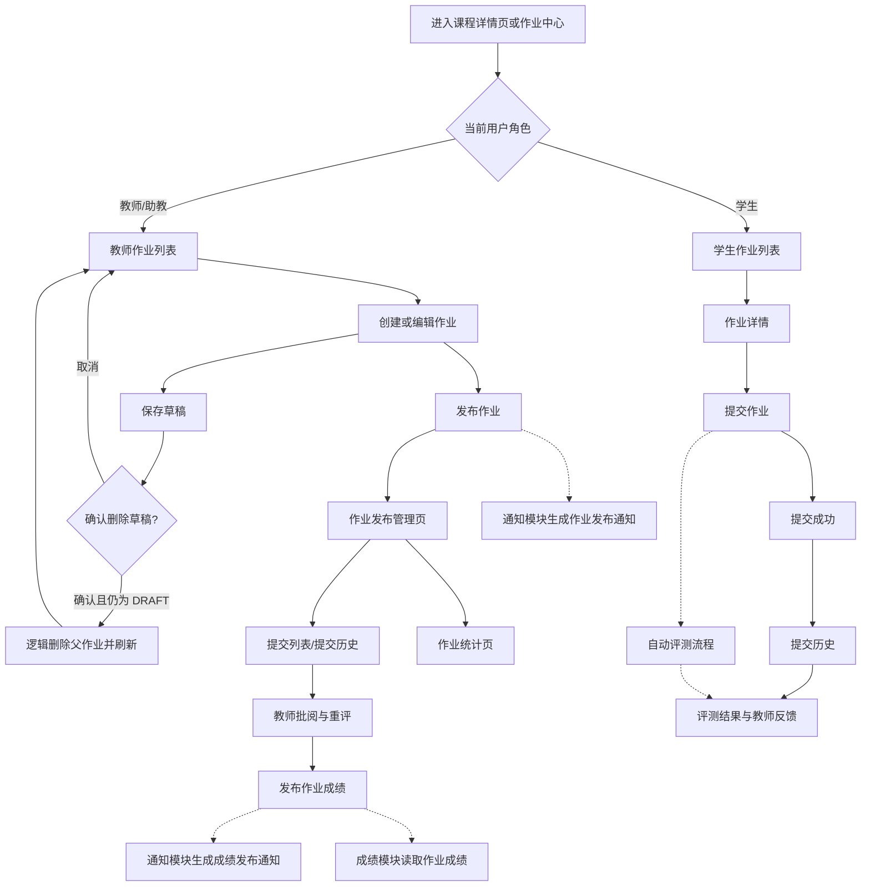
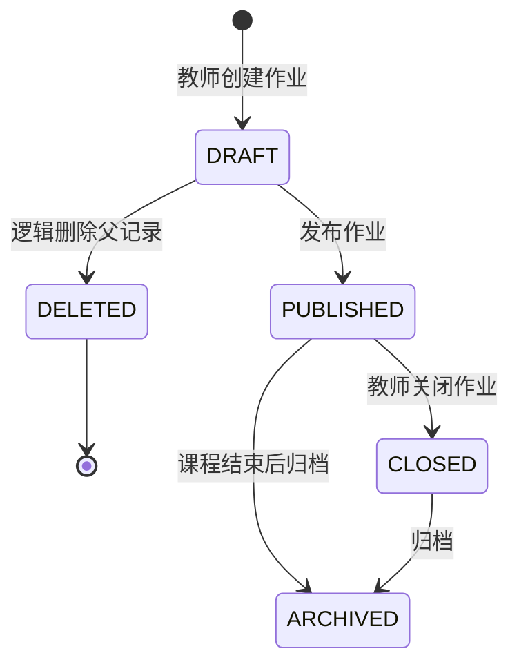
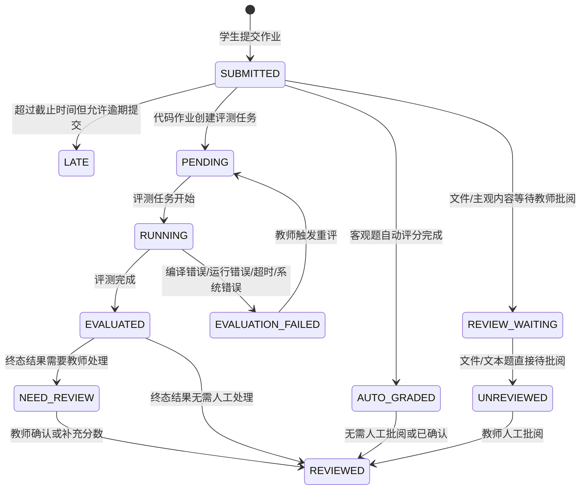
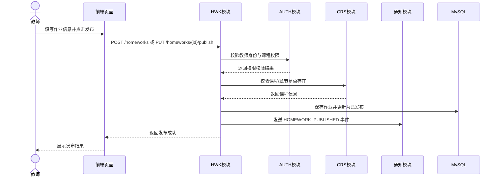
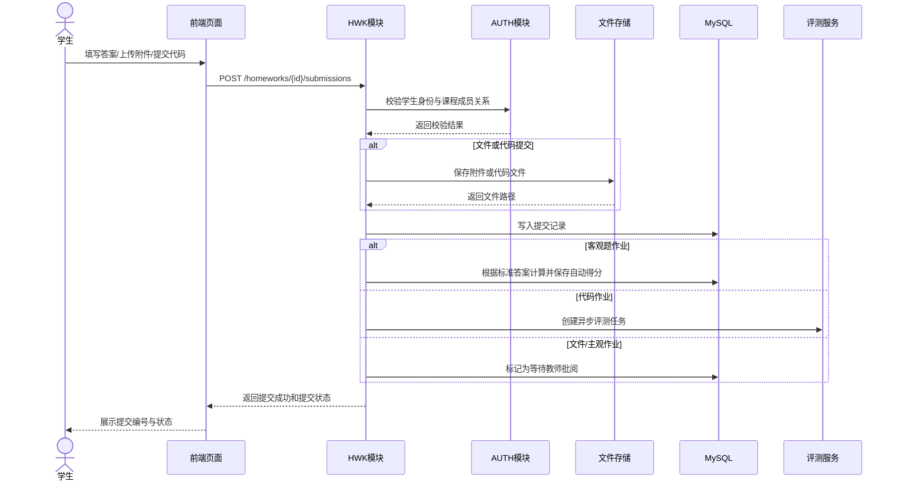
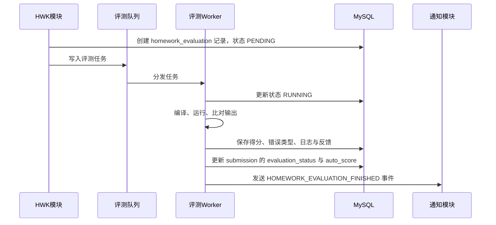
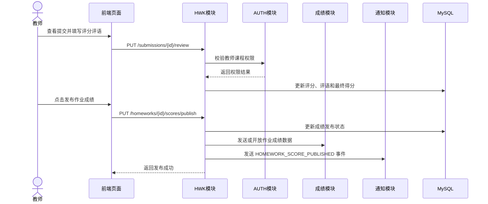

# 作业与自动评测模块概要设计提交稿（HWK）

> 项目名称：在线教学与实训平台  
> 文档类型：概要设计模块提交稿  
> 提交模块：作业与自动评测模块（HWK）  
> 适用总文档：《软件概要设计说明书》  
> 建议整合位置：2.5.5、2.6.5、3.1 HWK 页面设计、3.2 HWK 接口设计、3.3 HWK 数据结构设计、4 HWK 数据库设计、5 运行设计相关补充  
> 需求追踪来源：《软件需求规格说明书》中 FR-HWK-01 ~ FR-HWK-06、NFR-HWK-01 ~ NFR-HWK-05

---

## 0 审阅修改说明

本稿在初版基础上进行了结构、编号、边界和可实现性审查，现已调整为可直接交给概要设计负责人整合的版本。主要修改如下：

1. 统一需求编号：概要设计中沿用 SRS 的 `FR-HWK-01 ~ FR-HWK-06` 和 `NFR-HWK-01 ~ NFR-HWK-05`，不再额外新增 `FR-HWK-07`，避免需求追踪时编号不一致。模块缩写仍使用 `HWK`。
2. 删除不在首版需求范围内的独立功能项：如“作业互评”“复杂分布式判题”“竞赛排名”“高级反作弊”等内容不作为本模块首版核心设计。
3. 补充客观题自动评分设计：原稿更偏代码评测，现补充客观题作业、标准答案、学生答案记录和自动评分流程。
4. 明确模块边界：将通知、成绩汇总、课程成员、权限认证、文件存储、实验实训等能力划分给对应模块，HWK 只负责作业业务主流程。
5. 强化概要设计特征：减少实现级代码细节，保留必要的数据对象、接口、状态机、异常处理和跨模块协作关系。
6. 增强可测试性和可交付性：补充需求追踪表、验收关注点和可用于后续测试报告的测试编号建议。

---

## 1 模块概述

作业与自动评测模块（HWK）是在线教学与实训平台中的核心业务模块之一，负责支撑教师布置作业、学生完成并提交作业、系统自动评测、教师批阅重评以及学生查看反馈的完整闭环。

本模块位于课程学习流程之后、成绩评价流程之前，既是教学任务落地的主要入口，也是成绩评价与教学分析模块的重要数据来源。教师在课程下创建作业并设置提交要求、截止时间、作业类型、评分方式和评测规则；学生在作业中心或课程详情页查看作业并提交文本、附件或代码；系统根据作业类型进行格式校验和自动评测；教师可查看提交情况、进行人工批阅或触发重评；最终结果向学生展示，并为成绩模块提供作业成绩数据。

首版设计强调课程项目可实现性，目标是保证“发布作业 → 学生提交 → 自动评测/教师批阅 → 查看反馈 → 成绩回传”的主流程稳定可演示，不将本模块扩展为完整在线判题平台或竞赛系统。

---

## 2 模块职责与边界

### 2.1 本模块负责的内容

1. 教师在指定课程下创建、编辑、逻辑删除草稿、发布、关闭作业。
2. 支持客观题作业、文件提交作业、代码提交作业三类基础作业形式。
3. 支持设置作业标题、说明、附件、截止时间、满分、是否允许多次提交、是否允许逾期提交、是否允许学生提前查看评测详情等配置。
4. 学生查看课程作业列表、作业详情、截止时间、提交要求、当前提交状态和历史提交记录。
5. 学生按要求提交文本答案、附件或代码内容，系统保存提交记录。
6. 对客观题作业，根据标准答案进行自动评分。
7. 对代码类作业，根据预设测试用例进行基础输入输出比对或结果校验。
8. 自动评测完成后保存评测结果，包括得分、通过情况、错误类型和反馈摘要。
9. 教师查看学生提交内容、自动评测结果，对主观题、文件题或综合作业进行人工评分和评语填写。
10. 教师在测试用例调整、误判或系统异常后，可对指定提交发起重评。
11. 学生查看作业反馈、评测结果、教师评语和已发布成绩。
12. 向通知模块发送作业发布、截止提醒、评测完成、成绩发布等业务事件。
13. 向成绩评价与教学分析模块提供作业最终成绩、成绩发布时间和成绩来源。
14. 草稿删除只更新作业父记录的逻辑删除标记；题目、测试用例、判题配置、提交、评测、批阅和重评历史保留，普通更新不得复活已删除父记录。

### 2.2 本模块不负责的内容

1. 不负责用户注册、登录、身份认证、全局角色管理和权限模型维护，这部分由 AUTH 模块负责。
2. 不负责课程创建、课程成员管理、章节目录和教学资源管理，这部分由 CRS 模块负责。
3. 不负责通知消息的最终展示、已读未读状态、消息中心和用户通知偏好，这部分由 LRN 模块负责。
4. 不负责课程总评计算、成绩权重配置、班级成绩分布图和综合教学分析，这部分由 GRD 模块负责。
5. 不负责在线 IDE、实验报告管理、实验步骤管理和复杂实验环境，这部分由 LAB 模块负责。
6. 不负责对象存储、真实邮件短信推送、复杂沙箱集群、竞赛排行、高级反作弊和大规模分布式判题。
7. 不负责已发布作业删除、恢复、永久删除或新增通用生命周期审计。

### 2.3 与其他模块的协作关系

| 协作模块           | 协作内容                  | 设计说明                                                      |
| -------------- | --------------------- | --------------------------------------------------------- |
| AUTH 用户权限与平台安全 | 身份认证、角色校验、课程权限校验      | HWK 的所有核心接口均需要登录态。教师只能管理自己负责课程下的作业，学生只能访问自己已加入课程的作业与提交记录。 |
| CRS 课程与教学资源    | 课程信息、章节信息、课程成员关系      | 作业必须归属于课程，可选归属于章节。创建、发布、提交、查询前均需校验课程和成员关系。                |
| LAB 实训实验模块     | 共享基础评测思路或评测服务抽象       | HWK 和 LAB 都存在代码评测场景，可共享评测 Worker 或评测接口抽象，但提交表和业务流程应分别维护。  |
| LRN 学习过程与通知提醒  | 作业发布、截止提醒、评测完成、成绩发布事件 | HWK 只产生业务事件，不维护通知展示状态。通知生成、展示、已读未读由 LRN 统一处理。             |
| GRD 成绩评价与教学分析  | 作业最终成绩、成绩发布时间、成绩来源    | HWK 提供作业成绩明细及单次作业固定五档即时统计；GRD 负责课程成绩项归集、总评计算，以及课程级/跨作业、自定义区间、趋势和统计快照。 |
| 文件存储服务         | 作业附件、学生提交附件、代码文件、评测日志 | 首版可使用本地文件系统，后续可替换为对象存储。HWK 保存文件引用路径，不直接关心底层存储实现。          |

---

## 3 2.5.5 作业与自动评测模块功能需求设计

### 3.1 FR-HWK-01 作业创建与发布（P0）

| 属性   | 描述                                                                                                                                                                                                                                                                                    |
| ---- | ------------------------------------------------------------------------------------------------------------------------------------------------------------------------------------------------------------------------------------------------------------------------------------- |
| 需求编号 | FR-HWK-01                                                                                                                                                                                                                                                                              |
| 优先级  | P0（必须实现）                                                                                                                                                                                                                                                                              |
| 涉及角色 | 教师、助教                                                                                                                                                                                                                                                                                 |
| 核心功能 | 教师在自己负责的课程下创建作业，填写作业标题、说明、截止时间、提交格式、评分方式和所属课程，可删除仍为 DRAFT 的草稿，并可发布给课程学生。                                                                                                                                                                                                                              |
| 设计要点 | ① 作业必须绑定 `course_id`，可选绑定 `chapter_id`，创建、删除草稿和发布前必须校验当前用户是否具备该课程教师或助教权限。<br>② 作业支持 OBJECTIVE、TEXT、FILE、CODE 四类运行时类型。不同类型对应不同提交与评分流程。<br>③ 作业沿用 DRAFT、NOT_OPEN、PUBLISHED、CLOSED、SCORE_PUBLISHED、ARCHIVED；删除通过 `deleted` 正交标记表达，不新增状态。只允许以 `id + DRAFT + 未删除` 原子逻辑删除父记录，全部子数据和历史保留。<br>④ 普通更新不得写删除标记，并须排除已删除作业，防止并发旧请求复活。<br>⑤ 教师可设置是否允许多次提交、是否允许逾期提交、是否允许学生在成绩发布前查看评测详情。<br>⑥ 发布作业后，HWK 向 LRN 发送作业发布事件，由通知模块负责生成站内通知。 |

### 3.2 FR-HWK-02 学生作业查看与提交（P0）

| 属性   | 描述                                                                                                                                                                                                                                                     |
| ---- | ------------------------------------------------------------------------------------------------------------------------------------------------------------------------------------------------------------------------------------------------------ |
| 需求编号 | FR-HWK-02                                                                                                                                                                                                                                               |
| 优先级  | P0（必须实现）                                                                                                                                                                                                                                               |
| 涉及角色 | 学生                                                                                                                                                                                                                                                     |
| 核心功能 | 学生查看作业说明、附件、截止时间和提交要求，并按作业要求提交文本、附件或代码内容。                                                                                                                                                                                                              |
| 设计要点 | ① 学生只能查看自己已加入课程中已发布的作业，接口层必须根据当前登录用户和课程成员关系进行过滤。<br>② 提交前需校验作业是否存在、是否已发布、是否已关闭、是否超过截止时间、当前学生是否属于该课程。<br>③ 文本提交保存答案内容，文件提交保存附件路径，代码提交保存代码文本或代码文件路径及语言类型。<br>④ 提交时需进行合法性校验，包括必填内容、文件大小、文件类型、代码语言是否支持等。<br>⑤ 提交成功后系统返回提交编号、提交时间、提交状态和是否进入评测流程，便于学生确认提交结果。 |

### 3.3 FR-HWK-03 提交历史管理（P0）

| 属性   | 描述                                                                                                                                                                                                     |
| ---- | ------------------------------------------------------------------------------------------------------------------------------------------------------------------------------------------------------ |
| 需求编号 | FR-HWK-03                                                                                                                                                                                               |
| 优先级  | P0（必须实现）                                                                                                                                                                                               |
| 涉及角色 | 学生、教师、助教                                                                                                                                                                                               |
| 核心功能 | 在允许多次提交时，系统保存学生的每一次提交记录。学生可查看自己的提交历史，教师可查看课程下每名学生的全部提交版本。                                                                                                                                              |
| 设计要点 | ① 每次提交均生成独立提交记录，不直接覆盖旧提交。<br>② 系统明确标识最新提交和当前有效提交。默认情况下，最后一次有效提交作为最终成绩来源。<br>③ 若作业不允许多次提交，学生已有有效提交后再次提交应被拒绝。<br>④ 教师端可按作业、学生、提交状态、评测状态、是否逾期等条件筛选提交记录。<br>⑤ 提交历史应保存提交时间、提交内容摘要、附件路径、评测状态、得分信息、是否最终提交等字段。 |

### 3.4 FR-HWK-04 自动评测（P0）

| 属性   | 描述                                                                                                                                                                                                                                                              |
| ---- | --------------------------------------------------------------------------------------------------------------------------------------------------------------------------------------------------------------------------------------------------------------- |
| 需求编号 | FR-HWK-04                                                                                                                                                                                                                                                        |
| 优先级  | P0（必须实现）                                                                                                                                                                                                                                                        |
| 涉及角色 | 系统、学生、教师                                                                                                                                                                                                                                                        |
| 核心功能 | 系统对客观题作业和基础代码类作业执行自动评测，生成得分、通过情况、基础错误提示和可追溯评测记录。                                                                                                                                                                                                                |
| 设计要点 | ① 客观题作业根据题目标准答案自动评分，支持单选、多选、判断等基础题型。学生提交答案后可同步或异步计算得分。<br>② 代码类作业在提交成功后创建评测记录并进入评测队列，由评测 Worker 执行编译、运行、测试用例比对和得分计算。<br>③ 评测结果需区分通过、答案错误、编译错误、运行错误、运行超时、系统错误等状态。<br>④ 对基础规模测试用例，自动评测应在可接受时间内返回结果或失败状态；若评测服务异常，提交记录仍需保留。<br>⑤ 教师可查看评测状态和结果摘要，学生可根据作业配置查看公开的评测反馈。 |

### 3.5 FR-HWK-05 教师批阅与重评（P1）

| 属性   | 描述                                                                                                                                                                                                                                                 |
| ---- | -------------------------------------------------------------------------------------------------------------------------------------------------------------------------------------------------------------------------------------------------- |
| 需求编号 | FR-HWK-05                                                                                                                                                                                                                                           |
| 优先级  | P1（应实现）                                                                                                                                                                                                                                            |
| 涉及角色 | 教师、助教                                                                                                                                                                                                                                              |
| 核心功能 | 教师查看学生提交内容和自动评测结果，对主观题、文件题或综合作业进行人工评分和评语填写，并可对指定提交发起重评。                                                                                                                                                                                            |
| 设计要点 | ① 教师批阅页保留学生关键词、提交状态、评测状态和批阅状态筛选，并增加 `attention=EVALUATION_PENDING/REVIEW_PENDING`；不传 attention 时保持原行为。<br>② attention 名单仅含 CRS 当前活跃学生、未删除、`is_final=true` 且提交状态为 SUBMITTED/LATE 的记录，并采用服务端分页和稳定排序。待评测仅含 OBJECTIVE/CODE 的 NONE/PENDING/RUNNING；待批阅含 UNREVIEWED/NEED_REVIEW，TEXT/FILE 可直接进入，OBJECTIVE/CODE 仅在评测终态后进入。<br>③ 自动评测得分、教师人工评分和最终得分分开保存。<br>④ 重评生成新评测记录，不删除旧记录。<br>⑤ 人工评分、修改分数、重评、成绩发布等关键操作记录操作人、时间和原因。 |

### 3.6 FR-HWK-06 作业反馈与结果展示（P0）

| 属性   | 描述                                                                                                                                                                                                                      |
| ---- | ----------------------------------------------------------------------------------------------------------------------------------------------------------------------------------------------------------------------- |
| 需求编号 | FR-HWK-06                                                                                                                                                                                                                |
| 优先级  | P0（必须实现）                                                                                                                                                                                                                |
| 涉及角色 | 学生、教师                                                                                                                                                                                                                   |
| 核心功能 | 学生查看作业提交状态、评测结果、得分、教师评语和反馈摘要；教师查看作业整体完成情况和学生个体结果。                                                                                                                                                                       |
| 设计要点 | ① 学生端展示提交时间、提交状态、评测状态、通过情况、反馈摘要、教师评语和已发布成绩。<br>② 若教师尚未发布成绩，学生只能查看被允许公开的评测反馈，不显示未发布最终分数。<br>③ 教师端按 CRS 当前活跃学生统计单次作业的总人数、提交/未提交、可自动评测/已评测/待评测、已批阅/待批阅、已计分数、分数摘要、固定五档和生成时间；历史、删除、REJECTED 和非当前学生排除。<br>④ 固定五档为 `0-59`、`60-69`、`70-79`、`80-89`、`90-100`，使用 `finalScore ?? autoScore` 并按作业满分归一化；无分数不入桶，`scoredCount` 等于五档合计。<br>⑤ 未提交走统计接口，待评测/待批阅走提交列表 attention，均为服务端分页且 URL 可恢复。<br>⑥ 结果展示需区分自动得分、教师评分和最终得分。<br>⑦ 成绩发布后通知 LRN，并向 GRD 提供成绩数据；HWK 不维护课程级或跨作业统计快照。 |

---

## 4 2.6.5 作业与自动评测模块非功能需求设计

| 需求编号            | 需求描述                                       | 设计约束                                                                                                                                                             |
| --------------- | ------------------------------------------ | ---------------------------------------------------------------------------------------------------------------------------------------------------------------- |
| NFR-HWK-01（可靠性）  | 作业提交、评测任务和成绩结果不得因页面刷新或短暂异常而丢失。             | ① 学生提交成功前必须完成数据库落库。<br>② 代码评测任务状态需持久化，至少包括未评测、待评测、评测中、评测完成、评测失败。<br>③ 评测失败不影响提交记录本身，学生和教师仍可查看提交内容。<br>④ 成绩发布前应允许教师检查和修正异常结果。<br>⑤ 草稿删除以状态和未删除标记联合条件原子写入，普通更新排除已删除记录。                                     |
| NFR-HWK-02（性能）   | 作业查询和提交操作应保持较快响应，代码评测采用异步处理。               | ① 作业列表、提交列表和三类跟进名单采用服务端分页。<br>② 单次作业统计由独立 `HomeworkStatisticsService` 编排，Repository 使用 SQL 聚合并由组合索引支持，不加载全部最终提交到应用内存。<br>③ 学生代码提交接口只保存提交和创建评测任务。<br>④ 基础规模代码评测应在 60 秒内返回结果或失败状态。 |
| NFR-HWK-03（可追踪性） | 作业从发布到提交、评测、批阅、发布成绩的全过程应可追踪。               | ① 作业、提交、评测、批阅和成绩发布均保存创建时间、更新时间和操作者。<br>② 每次提交生成唯一提交记录，每次评测生成独立评测记录。<br>③ 重评和修改成绩必须记录日志。<br>④ 删除父作业后题目、测试用例、判题配置、提交、评测、批阅和重评历史保留。<br>⑤ 需求、页面、接口、数据表和测试用例之间应建立编号追踪关系。                                       |
| NFR-HWK-04（安全性）  | 学生只能访问自己的提交和结果，教师只能管理授权课程下的作业，评测过程需具备基础隔离。 | ① API 层通过 JWT 获取当前用户身份，不允许前端直接传入 `studentId` 决定查询范围。<br>② 学生端查询强制添加当前用户过滤条件。<br>③ 统计、attention 名单和草稿删除仅允许课程管理者访问；学生和无权限教师返回 403 且不泄露数据。<br>④ 姓名服务失败时不展示裸 `studentId`。<br>⑤ 隐藏测试用例、标准答案和完整评测日志默认不对学生开放。<br>⑥ 代码运行需限制时间、内存和文件访问范围。 |
| NFR-HWK-05（可测试性） | 本模块核心流程应便于单元测试、接口测试和系统演示测试。                | ① 创建、草稿删除、发布、提交、历史、评测、批阅、结果和统计均对应独立接口。<br>② 自动评测服务可 Mock。<br>③ 草稿删除权限/状态/重复请求/并发防复活/子历史保留/末页回退，以及固定五档、分页、URL 恢复、权限和组合索引均可由稳定数据复现。<br>④ 教师删除入口完成 1440px 与 390px 验收。 |

---

## 5 3.1 用户接口：HWK 页面设计

### 5.1 页面列表

| 页面编号    | 页面名称       | 使用角色  | 功能描述                                       | 对应需求                       | 主要数据来源/API                                                                                           |
| ------- | ---------- | ----- | ------------------------------------------ | -------------------------- | ---------------------------------------------------------------------------------------------------- |
| HWK-P01 | 作业中心页      | 学生、教师 | 学生查看待完成、已提交、已截止作业；教师查看自己发布或草稿状态的作业，仅对 DRAFT 确认式删除，失败保留、成功刷新并在末页为空时回退。        | FR-HWK-01、FR-HWK-02、FR-HWK-06 | `GET /api/v1/homeworks`、`DELETE /api/v1/homeworks/{homeworkId}`（API-HWK-22）                                                                              |
| HWK-P02 | 教师作业创建/编辑页 | 教师、助教 | 填写作业标题、说明、课程、章节、截止时间、作业类型、满分、提交限制、附件和评测配置。 | FR-HWK-01                   | `POST /api/v1/homeworks`、`PUT /api/v1/homeworks/{homeworkId}`                                        |
| HWK-P03 | 作业发布管理页    | 教师、助教 | 查看作业状态、发布信息、提交配置、测试用例配置和发布/关闭操作。           | FR-HWK-01                   | `GET /api/v1/homeworks/{homeworkId}`、`PUT /api/v1/homeworks/{homeworkId}/publish`                    |
| HWK-P04 | 学生作业详情页    | 学生    | 查看作业说明、附件、截止时间、提交要求、当前提交状态和是否允许重复提交。       | FR-HWK-02、FR-HWK-03          | `GET /api/v1/homeworks/{homeworkId}`、`GET /api/v1/homeworks/{homeworkId}/my-submissions`             |
| HWK-P05 | 学生作业提交页    | 学生    | 根据作业类型提交客观题答案、文本答案、附件或代码。                  | FR-HWK-02、FR-HWK-04          | `POST /api/v1/homeworks/{homeworkId}/submissions`                                                    |
| HWK-P06 | 提交历史页      | 学生、教师 | 学生查看个人历史提交；教师查看全班或指定学生的提交版本。               | FR-HWK-03                   | `GET /api/v1/homeworks/{homeworkId}/my-submissions`、`GET /api/v1/homeworks/{homeworkId}/submissions` |
| HWK-P07 | 评测结果页      | 学生、教师 | 展示评测状态、得分、通过用例数、错误类型、反馈摘要和可公开日志。           | FR-HWK-04、FR-HWK-06          | `GET /api/v1/submissions/{submissionId}/evaluation`                                                  |
| HWK-P08 | 教师批阅页      | 教师、助教 | 教师查看提交内容和评测结果，填写人工分数和评语，触发重评。              | FR-HWK-05                   | `PUT /api/v1/submissions/{submissionId}/review`、`POST /api/v1/submissions/{submissionId}/reevaluate` |
| HWK-P09 | 作业统计页      | 教师、助教 | 查看提交率、评测/批阅进度、固定五档、生成时间，以及未提交/待评测/待批阅三个服务端分页 Tab；URL 可恢复，姓名失败不展示裸 ID。 | FR-HWK-05、FR-HWK-06 | `GET /api/v1/homeworks/{homeworkId}/statistics`、`GET /api/v1/homeworks/{homeworkId}/submissions?attention=...` |

### 5.2 页面流转图



### 5.3 页面交互要点

1. 教师创建作业时，作业标题、所属课程、截止时间、作业类型、满分为必填项。
2. 作业类型为客观题时，页面显示题目与标准答案配置区域。
3. 作业类型为代码提交时，页面显示语言选择、测试用例配置和评测规则入口。
4. 学生提交页应突出显示截止时间、是否允许多次提交、是否允许逾期提交、当前提交状态。
5. 学生提交成功后必须给出明确反馈，包括提交时间和提交编号，避免“文件上传成功但作业未提交”的误解。
6. 教师批阅页应同时展示学生提交内容、自动评测结果、历史提交版本和评分输入区。
7. 成绩未发布前，学生端结果页应根据作业配置控制是否展示详细评测信息。
8. 教师总览仅对 DRAFT 展示删除入口；取消确认不发送请求，删除请求期间与编辑、发布等生命周期操作互斥。
9. 删除失败时保留原行、筛选与页码并允许重试；成功后刷新，当前页为空时回退到最后有效页；1440px 与 390px 视口均须可操作。

---

## 6 3.2 接口设计：HWK 模块 API 与跨模块事件

> 统一说明：接口路径采用 `/api/v1` 前缀；除登录等公共接口外，HWK 接口均需携带 JWT Token；响应格式建议遵循全局统一结构 `{ code, message, data }`。具体 DTO 字段名可由后端总设计在详细设计阶段统一调整。

### 6.1 作业管理接口

| 接口名称   | 方法与路径                                        | 调用方     | 主要入参                                                                                                                                                         | 主要出参                              | 说明                      |
| ------ | -------------------------------------------- | ------- | ------------------------------------------------------------------------------------------------------------------------------------------------------------ | --------------------------------- | ----------------------- |
| 创建作业   | `POST /api/v1/homeworks`                     | 教师端     | `courseId, chapterId, title, description, type, deadline, totalScore, allowResubmit, allowLateSubmit, showEvaluationBeforePublish, attachments, judgeConfig` | `homeworkId, status, createdAt`   | 创建草稿作业或待发布作业。           |
| 修改作业   | `PUT /api/v1/homeworks/{homeworkId}`         | 教师端     | `title, description, deadline, totalScore, submitConfig, attachments, judgeConfig`                                                                           | `homeworkId, updatedAt`           | 已发布作业修改需记录更新时间，必要时通知学生。 |
| 发布作业   | `PUT /api/v1/homeworks/{homeworkId}/publish` | 教师端     | `publishNow`                                                                                                                                                 | `homeworkId, status, publishedAt` | 发布后学生可见，并触发作业发布事件。      |
| 关闭作业   | `PUT /api/v1/homeworks/{homeworkId}/close`   | 教师端     | `reason`                                                                                                                                                     | `homeworkId, status`              | 关闭后不允许继续提交。             |
| 查询作业列表 | `GET /api/v1/homeworks`                      | 教师端/学生端 | `courseId, status, keyword, page, size`                                                                                                                      | `records, total`                  | 根据用户角色过滤可见作业。           |
| 查询作业详情 | `GET /api/v1/homeworks/{homeworkId}`         | 教师端/学生端 | `homeworkId`                                                                                                                                                 | `homeworkDetail`                  | 学生端不返回隐藏测试用例、标准答案等敏感信息。 |
| 删除草稿作业（API-HWK-22） | `DELETE /api/v1/homeworks/{homeworkId}` | 教师端 | `homeworkId` | `HomeworkResponse`，含 `deleted=true`、删除时间 `updatedAt` | 仅课程管理者且仍为 DRAFT；只逻辑删除父表；403/HWK_4031、404/HWK_4001、409/HWK_4095 分类返回。 |

### 6.2 题目与测试用例接口

| 接口名称    | 方法与路径                                           | 调用方     | 主要入参                                                                           | 主要出参            | 说明              |
| ------- | ----------------------------------------------- | ------- | ------------------------------------------------------------------------------ | --------------- | --------------- |
| 保存客观题题目 | `PUT /api/v1/homeworks/{homeworkId}/questions`  | 教师端     | `questions, options, answers, score`                                           | `questionCount` | 用于客观题作业的标准答案配置。 |
| 查询作业题目  | `GET /api/v1/homeworks/{homeworkId}/questions`  | 学生端/教师端 | `homeworkId`                                                                   | `questionList`  | 学生端不返回标准答案。     |
| 保存测试用例  | `PUT /api/v1/homeworks/{homeworkId}/test-cases` | 教师端     | `inputData, expectedOutput, scoreWeight, isHidden, timeLimitMs, memoryLimitKb` | `caseCount`     | 用于代码类作业评测配置。    |
| 查询测试用例  | `GET /api/v1/homeworks/{homeworkId}/test-cases` | 教师端     | `homeworkId`                                                                   | `testCaseList`  | 默认仅教师可查看完整测试用例。 |

### 6.3 作业提交接口

| 接口名称     | 方法与路径                                               | 调用方     | 主要入参                                                                       | 主要出参                                                        | 说明                         |
| -------- | --------------------------------------------------- | ------- | -------------------------------------------------------------------------- | ----------------------------------------------------------- | -------------------------- |
| 提交作业     | `POST /api/v1/homeworks/{homeworkId}/submissions`   | 学生端     | `answerText, answerJson, fileIds, codeText, language`                      | `submissionId, submitStatus, evaluationStatus, submittedAt` | 保存提交记录；客观题可自动评分，代码题进入评测流程。 |
| 查询我的提交历史 | `GET /api/v1/homeworks/{homeworkId}/my-submissions` | 学生端     | `homeworkId`                                                               | `submissionList`                                            | 只返回当前学生自己的提交历史。            |
| 查询作业提交列表 | `GET /api/v1/homeworks/{homeworkId}/submissions`    | 教师端     | `studentKeyword, submitStatus, evaluationStatus, reviewStatus, attention, page, size` | `PageResponse(records, total, page, size)` | `attention` 可选 EVALUATION_PENDING/REVIEW_PENDING；未传时兼容原行为，传入时仅最终有效 SUBMITTED/LATE 并与旧筛选按 AND 组合；1 基分页、size 1～100、稳定排序。 |
| 查询提交详情   | `GET /api/v1/submissions/{submissionId}`            | 学生端/教师端 | `submissionId`                                                             | `submissionDetail`                                          | 学生只能查看自己的提交，教师需校验课程权限。     |

### 6.4 自动评测与重评接口

| 接口名称   | 方法与路径                                                | 调用方     | 主要入参           | 主要出参                                                                    | 说明                 |
| ------ | ---------------------------------------------------- | ------- | -------------- | ----------------------------------------------------------------------- | ------------------ |
| 查询评测结果 | `GET /api/v1/submissions/{submissionId}/evaluation`  | 学生端/教师端 | `submissionId` | `evaluationStatus, score, passedCases, totalCases, errorType, feedback` | 学生端只展示允许公开的信息。     |
| 触发重评   | `POST /api/v1/submissions/{submissionId}/reevaluate` | 教师端     | `reason`       | `evaluationId, status`                                                  | 仅教师或助教可操作，生成新评测记录。 |
| 查询评测日志 | `GET /api/v1/evaluations/{evaluationId}/logs`        | 教师端     | `evaluationId` | `compileLog, runLog, errorMessage`                                      | 主要供教师排查错误。         |

### 6.5 教师批阅与成绩接口

| 接口名称     | 方法与路径                                               | 调用方 | 主要入参                               | 主要出参                                                                                            | 说明                   |
| -------- | --------------------------------------------------- | --- | ---------------------------------- | ----------------------------------------------------------------------------------------------- | -------------------- |
| 教师批阅提交   | `PUT /api/v1/submissions/{submissionId}/review`     | 教师端 | `manualScore, finalScore, comment` | `submissionId, reviewStatus, finalScore`                                                        | 保存教师评分和评语。           |
| 批量发布作业成绩 | `PUT /api/v1/homeworks/{homeworkId}/scores/publish` | 教师端 | `publishScope`                     | `publishedCount, publishedAt`                                                                   | 发布后学生可见，并通知 LRN/GRD。 |
| 查询作业统计   | `GET /api/v1/homeworks/{homeworkId}/statistics`     | 教师端 | `homeworkId, page, size` | 保留现有字段并新增 `autoEvaluableCount, pendingEvaluationCount, pendingReviewCount, scoredCount, scoreDistribution, generatedAt` | 未提交分页，聚合覆盖整份作业当前活跃学生；固定五档按满分归一化；单次作业以外的复杂分析由 GRD 负责。 |

### 6.6 跨模块事件接口

| 事件名称                            | 触发时机            | 接收模块    | 主要字段                                                       | 说明                   |
| ------------------------------- | --------------- | ------- | ---------------------------------------------------------- | -------------------- |
| `HOMEWORK_PUBLISHED`            | 教师发布作业后         | LRN     | `homeworkId, courseId, title, deadline, receiverScope`     | 生成作业发布通知和任务中心条目。     |
| `HOMEWORK_UPDATED`              | 教师修改已发布作业的重要信息后 | LRN     | `homeworkId, courseId, title, updatedFields`               | 提醒学生查看最新要求。          |
| `HOMEWORK_DEADLINE_APPROACHING` | 作业截止前定时扫描       | LRN     | `homeworkId, courseId, deadline, unsubmittedStudentIds`    | 生成截止提醒。              |
| `HOMEWORK_EVALUATION_FINISHED`  | 自动评测完成后         | LRN     | `homeworkId, submissionId, studentId, status`              | 通知学生查看评测结果。          |
| `HOMEWORK_SCORE_PUBLISHED`      | 教师发布作业成绩后       | LRN、GRD | `homeworkId, courseId, studentId, finalScore, publishedAt` | LRN 负责通知，GRD 负责成绩归集。 |

---

## 7 3.3 数据结构设计：HWK 核心实体

### 7.1 Homework 作业实体

| 字段                          | 类型            | 说明                                   |
| --------------------------- | ------------- | ------------------------------------ |
| id                          | Long          | 作业编号                                 |
| courseId                    | Long          | 所属课程编号                               |
| chapterId                   | Long          | 所属章节编号，可为空                           |
| title                       | String        | 作业标题                                 |
| description                 | String        | 作业说明                                 |
| type                        | Enum          | 运行时作业类型：OBJECTIVE、TEXT、FILE、CODE   |
| status                      | Enum          | 运行时作业状态：DRAFT、NOT_OPEN、PUBLISHED、CLOSED、SCORE_PUBLISHED、ARCHIVED |
| totalScore                  | BigDecimal    | 作业满分                                 |
| deadline                    | LocalDateTime | 截止时间                                 |
| allowResubmit               | Boolean       | 是否允许多次提交                             |
| allowLateSubmit             | Boolean       | 是否允许逾期提交                             |
| showEvaluationBeforePublish | Boolean       | 成绩发布前是否允许学生查看评测详情                    |
| judgeConfigId               | Long          | 评测配置编号，非代码作业可为空                      |
| createdBy                   | Long          | 创建教师编号                               |
| publishedAt                 | LocalDateTime | 发布时间                                 |
| deleted                     | Boolean       | 父作业逻辑删除标记；不属于 HomeworkStatus             |
| createdAt                   | LocalDateTime | 创建时间                                 |
| updatedAt                   | LocalDateTime | 更新时间                                 |

### 7.2 HomeworkQuestion 客观题题目实体

| 字段           | 类型         | 说明                                          |
| ------------ | ---------- | ------------------------------------------- |
| id           | Long       | 题目编号                                        |
| homeworkId   | Long       | 所属作业编号                                      |
| questionType | Enum       | 题型：SINGLE_CHOICE、MULTIPLE_CHOICE、TRUE_FALSE |
| stem         | String     | 题干                                          |
| optionsJson  | Text       | 选项 JSON                                     |
| answerJson   | Text       | 标准答案 JSON，学生端不可见                            |
| score        | BigDecimal | 题目分值                                        |
| sortOrder    | Integer    | 题目顺序                                        |

### 7.3 HomeworkSubmission 作业提交实体

| 字段               | 类型            | 说明                                                     |
| ---------------- | ------------- | ------------------------------------------------------ |
| id               | Long          | 提交编号                                                   |
| homeworkId       | Long          | 作业编号                                                   |
| studentId        | Long          | 学生编号                                                   |
| submitType       | Enum          | 提交类型：TEXT、FILE、CODE、OBJECTIVE                          |
| answerText       | Text          | 文本答案、代码文本或答案摘要                                         |
| answerJson       | Text          | 客观题答案 JSON                                             |
| fileUrl          | String        | 提交附件路径                                                 |
| language         | String        | 代码语言，非代码作业可为空                                          |
| submitStatus     | Enum          | 运行时提交状态：SUBMITTED、LATE、REJECTED；REJECTED 不属于有效提交 |
| evaluationStatus | Enum          | 运行时评测状态：NONE、PENDING、RUNNING、ACCEPTED、WRONG_ANSWER、COMPILE_ERROR、RUNTIME_ERROR、TIME_LIMIT_EXCEEDED、SYSTEM_ERROR |
| reviewStatus     | Enum          | 运行时批阅状态：UNREVIEWED、REVIEWED、NEED_REVIEW             |
| autoScore        | BigDecimal    | 自动评测得分                                                 |
| manualScore      | BigDecimal    | 教师人工评分                                                 |
| finalScore       | BigDecimal    | 最终得分                                                   |
| comment          | String        | 教师评语                                                   |
| version          | Integer       | 同一学生同一作业的提交版本                                        |
| isFinal          | Boolean       | 是否为当前有效提交                                              |
| isDeleted        | Boolean       | 是否逻辑删除；统计和待处理名单排除                                     |
| submittedAt      | LocalDateTime | 提交时间                                                   |
| reviewedBy       | Long          | 批阅教师/助教编号                                              |
| reviewedAt       | LocalDateTime | 批阅时间                                                   |

### 7.4 HomeworkEvaluation 作业评测实体

| 字段             | 类型            | 说明                                                                                                 |
| -------------- | ------------- | -------------------------------------------------------------------------------------------------- |
| id             | Long          | 评测记录编号                                                                                             |
| submissionId   | Long          | 所属提交编号                                                                                             |
| homeworkId     | Long          | 作业编号，便于查询统计                                                                                        |
| studentId      | Long          | 学生编号，便于权限过滤                                                                                        |
| evaluationType | Enum          | 评测类型：OBJECTIVE_AUTO、CODE_JUDGE、REJUDGE                                                             |
| status         | Enum          | PENDING、RUNNING、ACCEPTED、WRONG_ANSWER、COMPILE_ERROR、RUNTIME_ERROR、TIME_LIMIT_EXCEEDED、SYSTEM_ERROR |
| score          | BigDecimal    | 本次评测得分                                                                                             |
| passedCases    | Integer       | 通过测试用例数，客观题可为空                                                                                     |
| totalCases     | Integer       | 总测试用例数，客观题可为空                                                                                      |
| timeUsedMs     | Integer       | 运行时间，代码评测使用                                                                                        |
| memoryUsedKb   | Integer       | 内存占用，代码评测使用                                                                                        |
| feedback       | String        | 反馈摘要                                                                                               |
| logUrl         | String        | 评测日志路径                                                                                             |
| startedAt      | LocalDateTime | 评测开始时间                                                                                             |
| finishedAt     | LocalDateTime | 评测结束时间                                                                                             |

### 7.5 HomeworkTestCase 测试用例实体

| 字段             | 类型         | 说明       |
| -------------- | ---------- | -------- |
| id             | Long       | 测试用例编号   |
| homeworkId     | Long       | 所属作业编号   |
| inputData      | Text       | 输入数据     |
| expectedOutput | Text       | 期望输出     |
| scoreWeight    | BigDecimal | 分值或权重    |
| isHidden       | Boolean    | 是否隐藏测试用例 |
| timeLimitMs    | Integer    | 时间限制     |
| memoryLimitKb  | Integer    | 内存限制     |
| sortOrder      | Integer    | 用例顺序     |

### 7.6 HomeworkReviewLog 批阅与重评日志实体

| 字段           | 类型            | 说明                                        |
| ------------ | ------------- | ----------------------------------------- |
| id           | Long          | 日志编号                                      |
| submissionId | Long          | 提交编号                                      |
| operatorId   | Long          | 操作人编号                                     |
| action       | Enum          | REVIEW、REJUDGE、PUBLISH_SCORE、UPDATE_SCORE |
| oldScore     | BigDecimal    | 原分数                                       |
| newScore     | BigDecimal    | 新分数                                       |
| reason       | String        | 操作原因                                      |
| createdAt    | LocalDateTime | 操作时间                                      |

### 7.7 作业状态机



说明：`DELETED` 只是 `deleted=true` 的图示伪终态，不是 `HomeworkStatus` 枚举值，也不提供恢复或永久删除。是否已截止不建议强制作为独立持久化状态，首版可通过 `deadline` 与当前时间动态判断。

### 7.8 提交与评测状态机



说明：`SUBMITTED/LATE/REJECTED` 和 `UNREVIEWED/REVIEWED/NEED_REVIEW` 是当前运行时枚举，本期只组合查询，不修改枚举。成绩发布将作业 `HomeworkStatus` 更新为 `SCORE_PUBLISHED`，不属于 `ReviewStatus`。

---

## 8 4 数据库设计：HWK 模块建议表结构

> 说明：以下为 HWK 模块提交给后端总设计的建议表结构。最终字段类型、索引、逻辑删除字段、公共审计字段可由后端总设计统一调整。表命名遵循 `t_` 前缀，字段命名使用小写下划线。

### 8.1 t_homework 作业表

| 字段名                            | 类型           | 约束                 | 说明                              |
| ------------------------------ | ------------ | ------------------ | ------------------------------- |
| id                             | bigint       | PK                 | 作业编号                            |
| course_id                      | bigint       | NOT NULL, INDEX    | 所属课程编号                          |
| chapter_id                     | bigint       | NULL, INDEX        | 所属章节编号                          |
| title                          | varchar(100) | NOT NULL           | 作业标题                            |
| description                    | text         | NULL               | 作业说明                            |
| type                           | varchar(20)  | NOT NULL           | OBJECTIVE、TEXT、FILE、CODE       |
| status                         | varchar(20)  | NOT NULL           | DRAFT、NOT_OPEN、PUBLISHED、CLOSED、SCORE_PUBLISHED、ARCHIVED |
| total_score                    | decimal(6,2) | NOT NULL           | 满分                              |
| deadline                       | datetime     | NOT NULL, INDEX    | 截止时间                            |
| allow_resubmit                 | tinyint      | NOT NULL DEFAULT 1 | 是否允许多次提交                        |
| allow_late_submit              | tinyint      | NOT NULL DEFAULT 0 | 是否允许逾期提交                        |
| show_evaluation_before_publish | tinyint      | NOT NULL DEFAULT 0 | 成绩发布前是否显示评测详情                   |
| judge_config_id                | bigint       | NULL               | 评测配置编号                          |
| created_by                     | bigint       | NOT NULL           | 创建教师编号                          |
| published_at                   | datetime     | NULL               | 发布时间                            |
| created_at                     | datetime     | NOT NULL           | 创建时间                            |
| updated_at                     | datetime     | NOT NULL           | 更新时间                            |
| is_deleted                     | tinyint      | NOT NULL DEFAULT 0 | 逻辑删除标记                          |

草稿删除只执行父表条件更新：`WHERE id = ? AND status = 'DRAFT' AND is_deleted = 0`，成功时写 `is_deleted = 1` 与删除时间 `updated_at`。普通编辑、发布等更新不得在 `SET` 中写 `is_deleted`，并必须带 `is_deleted = 0` 条件；题目、测试用例、判题配置、提交、评测、批阅和重评历史不删除、不重建。

### 8.2 t_homework_question 客观题题目表

| 字段名           | 类型            | 约束                 | 说明                                       |
| ------------- | ------------- | ------------------ | ---------------------------------------- |
| id            | bigint        | PK                 | 题目编号                                     |
| homework_id   | bigint        | NOT NULL, INDEX    | 所属作业编号                                   |
| question_type | varchar(30)   | NOT NULL           | SINGLE_CHOICE、MULTIPLE_CHOICE、TRUE_FALSE |
| stem          | varchar(1000) | NOT NULL           | 题干                                       |
| options_json  | text          | NULL               | 选项 JSON                                  |
| answer_json   | text          | NOT NULL           | 标准答案 JSON                                |
| score         | decimal(6,2)  | NOT NULL           | 题目分值                                     |
| sort_order    | int           | NOT NULL DEFAULT 0 | 排序                                       |
| created_at    | datetime      | NOT NULL           | 创建时间                                     |
| updated_at    | datetime      | NOT NULL           | 更新时间                                     |

### 8.3 t_hwk_submission 作业提交表

| 字段名               | 类型            | 约束                            | 说明                       |
| ----------------- | ------------- | ----------------------------- | ------------------------ |
| id                | bigint        | PK                            | 提交编号                     |
| homework_id       | bigint        | NOT NULL, INDEX               | 作业编号                     |
| student_id        | bigint        | NOT NULL, INDEX               | 学生编号                     |
| submit_type       | varchar(20)   | NOT NULL                      | OBJECTIVE、TEXT、FILE、CODE |
| answer_text       | text          | NULL                          | 文本答案、代码文本或摘要             |
| answer_json       | text          | NULL                          | 客观题答案 JSON               |
| file_url          | varchar(500)  | NULL                          | 附件路径                     |
| language          | varchar(50)   | NULL                          | 代码语言                     |
| submit_status     | varchar(20)   | NOT NULL                      | SUBMITTED、LATE、REJECTED；REJECTED 不进入统计或 attention |
| evaluation_status | varchar(30)   | NOT NULL DEFAULT 'NONE'       | 评测状态                     |
| review_status     | varchar(30)   | NOT NULL DEFAULT 'UNREVIEWED' | 批阅状态                     |
| auto_score        | decimal(6,2)  | NULL                          | 自动评测得分                   |
| manual_score      | decimal(6,2)  | NULL                          | 教师评分                     |
| final_score       | decimal(6,2)  | NULL                          | 最终得分                     |
| comment           | varchar(1000) | NULL                          | 教师评语                     |
| version           | int           | NOT NULL DEFAULT 1            | 同一学生同一作业的提交版本            |
| is_final          | tinyint       | NOT NULL DEFAULT 1            | 是否当前有效提交                 |
| submitted_at      | datetime      | NOT NULL, INDEX               | 提交时间                     |
| reviewed_by       | bigint        | NULL                          | 批阅人编号                    |
| reviewed_at       | datetime      | NULL                          | 批阅时间                     |
| created_at        | datetime      | NOT NULL                      | 创建时间                     |
| updated_at        | datetime      | NOT NULL                      | 更新时间                     |
| is_deleted        | tinyint       | NOT NULL DEFAULT 0            | 逻辑删除；统计和 attention 排除       |

建议索引：

```sql
CREATE INDEX idx_hwk_submission_effective ON t_hwk_submission(homework_id, is_final, is_deleted, submit_status, student_id);
CREATE INDEX idx_hwk_submission_attention ON t_hwk_submission(homework_id, is_final, is_deleted, submitted_at, id, submit_status, student_id, submit_type, evaluation_status, review_status);
```

`effective` 索引对应统计有效范围；`attention` 索引在等值范围字段后优先放置 `submitted_at + id`，使待处理分页可按同一索引逆序扫描，再以其余列覆盖组合过滤。既有唯一版本索引已经覆盖 `homework_id + student_id` 左前缀，不重复建索引。组合索引通过增量迁移加入既有数据库并由迁移测试验证索引名称和列顺序，同时同步 fresh Compose schema。

### 8.4 t_homework_evaluation 作业评测表

| 字段名             | 类型            | 约束              | 说明                                |
| --------------- | ------------- | --------------- | --------------------------------- |
| id              | bigint        | PK              | 评测编号                              |
| submission_id   | bigint        | NOT NULL, INDEX | 提交编号                              |
| homework_id     | bigint        | NOT NULL, INDEX | 作业编号                              |
| student_id      | bigint        | NOT NULL, INDEX | 学生编号                              |
| evaluation_type | varchar(30)   | NOT NULL        | OBJECTIVE_AUTO、CODE_JUDGE、REJUDGE |
| status          | varchar(30)   | NOT NULL        | 评测状态                              |
| score           | decimal(6,2)  | NULL            | 评测得分                              |
| passed_cases    | int           | NULL            | 通过测试用例数                           |
| total_cases     | int           | NULL            | 总测试用例数                            |
| time_used_ms    | int           | NULL            | 运行时间                              |
| memory_used_kb  | int           | NULL            | 内存占用                              |
| feedback        | varchar(1000) | NULL            | 反馈摘要                              |
| log_url         | varchar(500)  | NULL            | 日志路径                              |
| started_at      | datetime      | NULL            | 开始时间                              |
| finished_at     | datetime      | NULL            | 结束时间                              |
| created_at      | datetime      | NOT NULL        | 创建时间                              |
| updated_at      | datetime      | NOT NULL        | 更新时间                              |

### 8.5 t_homework_test_case 测试用例表

| 字段名             | 类型           | 约束                     | 说明     |
| --------------- | ------------ | ---------------------- | ------ |
| id              | bigint       | PK                     | 测试用例编号 |
| homework_id     | bigint       | NOT NULL, INDEX        | 所属作业编号 |
| input_data      | text         | NULL                   | 输入数据   |
| expected_output | text         | NOT NULL               | 期望输出   |
| score_weight    | decimal(6,2) | NOT NULL DEFAULT 0     | 分值或权重  |
| is_hidden       | tinyint      | NOT NULL DEFAULT 1     | 是否隐藏   |
| time_limit_ms   | int          | NOT NULL DEFAULT 1000  | 时间限制   |
| memory_limit_kb | int          | NOT NULL DEFAULT 65536 | 内存限制   |
| sort_order      | int          | NOT NULL DEFAULT 0     | 排序     |
| created_at      | datetime     | NOT NULL               | 创建时间   |
| updated_at      | datetime     | NOT NULL               | 更新时间   |

### 8.6 t_homework_review_log 批阅与重评日志表

| 字段名           | 类型           | 约束              | 说明                                        |
| ------------- | ------------ | --------------- | ----------------------------------------- |
| id            | bigint       | PK              | 日志编号                                      |
| submission_id | bigint       | NOT NULL, INDEX | 提交编号                                      |
| operator_id   | bigint       | NOT NULL        | 操作人编号                                     |
| action        | varchar(30)  | NOT NULL        | REVIEW、REJUDGE、PUBLISH_SCORE、UPDATE_SCORE |
| old_score     | decimal(6,2) | NULL            | 原分数                                       |
| new_score     | decimal(6,2) | NULL            | 新分数                                       |
| reason        | varchar(500) | NULL            | 操作原因                                      |
| created_at    | datetime     | NOT NULL        | 操作时间                                      |

---

## 9 运行设计补充：核心业务流程

### 9.1 教师发布作业流程



### 9.2 学生提交作业流程



### 9.3 代码自动评测流程



### 9.4 教师批阅与成绩发布流程



---

## 10 异常处理设计

| 异常场景           | 处理策略                              | 用户提示                   |
| -------------- | --------------------------------- | ---------------------- |
| 学生访问未加入课程的作业   | 后端拒绝访问并返回权限错误                     | 无权查看该作业                |
| 教师操作非本人课程作业    | 后端拒绝操作并记录异常访问                     | 无权管理该课程作业              |
| 学生提交未发布或已关闭作业  | 拒绝提交                              | 当前作业不可提交               |
| 学生提交已截止作业      | 根据作业配置拒绝提交或标记为逾期提交                | 作业已截止，无法提交 / 已作为逾期提交保存 |
| 不允许重复提交但学生再次提交 | 拒绝提交                              | 本作业不允许重复提交             |
| 文件格式不符合要求      | 文件校验失败，不生成有效提交                    | 文件类型不符合要求              |
| 文件大小超过限制       | 文件校验失败，不生成有效提交                    | 文件大小超过限制               |
| 客观题答案格式错误      | 拒绝提交或提示重新填写                       | 答案格式不正确                |
| 代码编译失败         | 保存评测记录，状态设为 COMPILE_ERROR         | 编译失败，请查看反馈摘要           |
| 代码运行超时         | 保存评测记录，状态设为 TIME_LIMIT_EXCEEDED   | 程序运行超时                 |
| 评测服务异常         | 提交记录保留，评测状态设为 SYSTEM_ERROR，允许教师重评 | 评测服务暂时异常，请稍后查看或联系教师    |
| 教师修改已发布作业      | 限制敏感字段修改，记录更新时间，必要时通知学生           | 作业已更新，请提醒学生查看最新要求      |
| 无课程管理权限删除草稿 | 返回 `403 / HWK_4031`，父表和子数据不变 | 无权访问该作业 |
| 删除不存在或已删除作业 | 返回 `404 / HWK_4001` | 作业不存在或已被删除 |
| 删除任一非 DRAFT 作业 | 返回 `409 / HWK_4095`，保留作业和全部历史 | 仅草稿作业可删除 |
| 删除与旧编辑/发布并发 | 父表删除使用 DRAFT+未删除原子条件，普通更新排除已删除记录；失败事务不得重建子配置 | 作业状态已变化，请刷新后重试 |
| 成绩同步 GRD 失败    | HWK 保留本地最终成绩，记录失败日志，后续重试          | 成绩已保存，成绩汇总同步稍后重试       |

---

## 11 安全与权限设计

1. 学生端所有查询接口必须基于当前登录用户过滤数据，不能依赖前端传入的 `studentId`。
2. 教师端作业管理接口必须校验当前用户是否为该课程教师或助教，不能仅凭作业编号允许操作。
3. 隐藏测试用例、标准答案、完整评测日志等敏感数据默认不对学生开放。
4. 文件上传需校验文件类型、大小和所属业务对象，避免无关文件挂载到作业提交中。
5. 代码评测过程需限制运行时间、内存占用和文件访问范围，首版至少通过进程超时、临时目录隔离和文件大小限制实现基础保护。
6. 人工评分、重评、修改最终分、发布成绩等关键操作必须记录日志。
7. 教师发布成绩后，学生才能查看最终成绩；成绩发布前的可见内容由作业配置控制。
8. API-HWK-22 仅允许作业所属课程管理者删除 DRAFT，服务端必须同时校验课程权限、状态和未删除条件；前端隐藏入口不能替代鉴权。

---

## 12 需求追踪与一致性说明

### 12.1 需求到设计映射表

| SRS 需求编号              | 概要设计对应章节      | 页面编号                    | 主要接口                                                                                                     | 数据表                                                                  | 测试编号建议    |
| --------------------- | ------------- | ----------------------- | -------------------------------------------------------------------------------------------------------- | -------------------------------------------------------------------- | --------- |
| FR-HWK-01              | 3.1 作业创建与发布   | HWK-P01、HWK-P02、HWK-P03         | `POST /homeworks`、`PUT /homeworks/{id}`、`PUT /homeworks/{id}/publish`、`DELETE /homeworks/{id}`（API-HWK-22）                                    | `t_homework`、`t_homework_question`、`t_homework_test_case`            | TC-HWK-01、TC-HWK-19  |
| FR-HWK-02              | 3.2 学生作业查看与提交 | HWK-P01、HWK-P04、HWK-P05 | `GET /homeworks`、`GET /homeworks/{id}`、`POST /homeworks/{id}/submissions`                                | `t_homework`、`t_homework_submission`                                 | TC-HWK-02  |
| FR-HWK-03              | 3.3 提交历史管理    | HWK-P06                 | `GET /homeworks/{id}/my-submissions`、`GET /homeworks/{id}/submissions`                                   | `t_homework_submission`                                              | TC-HWK-03  |
| FR-HWK-04              | 3.4 自动评测      | HWK-P07                 | `GET /submissions/{id}/evaluation`、`POST /submissions/{id}/reevaluate`                                   | `t_homework_evaluation`、`t_homework_question`、`t_homework_test_case` | TC-HWK-04  |
| FR-HWK-05              | 3.5 教师批阅与重评   | HWK-P08、HWK-P09         | `PUT /submissions/{id}/review`、`POST /submissions/{id}/reevaluate`                                       | `t_homework_submission`、`t_homework_review_log`                      | TC-HWK-05  |
| FR-HWK-06              | 3.6 作业反馈与结果展示 | HWK-P07、HWK-P09         | `GET /submissions/{id}/evaluation`、`GET /homeworks/{id}/statistics`、`PUT /homeworks/{id}/scores/publish` | `t_homework_submission`、`t_homework_evaluation`                      | TC-HWK-06  |
| NFR-HWK-01 ~ NFR-HWK-05 | 第 4 节非功能需求设计  | 全部 HWK 页面               | 全部 HWK 接口，含 API-HWK-22                                                                                                | 全部 HWK 表                                                             | TC-HWK-NFR、TC-HWK-19 |

### 12.2 与其他模块需要确认的问题

| 需要确认的问题            | 建议处理方式                                                | 责任协调方                 |
| ------------------ | ----------------------------------------------------- | --------------------- |
| HWK 与 LAB 是否共享评测服务 | 建议共享评测 Worker 或评测接口抽象，但作业提交表与实验提交表分开维护。               | 后端总设计、LAB 负责人、HWK 负责人 |
| 作业成绩如何进入 GRD       | 首版建议 GRD 通过接口读取 HWK 已发布成绩，或由 HWK 发送成绩发布事件；不建议跨模块直接改表。 | 后端总设计、GRD 负责人、HWK 负责人 |
| 通知由谁生成和展示          | HWK 只发送业务事件，LRN 负责通知生成、展示、已读未读和提醒策略。                  | LRN 负责人、HWK 负责人       |
| 文件存储路径如何统一         | HWK 只保存文件引用，上传和文件访问权限由文件服务或统一工具类负责。                   | 后端总设计、HWK 负责人         |
| 成绩发布前学生能看到哪些信息     | 由作业配置 `show_evaluation_before_publish` 控制，默认不展示最终分数。  | 需求负责人、HWK 负责人、GRD 负责人 |

---

## 13 提交给概要设计负责人的整合建议

1. 将第 3 节整合到《软件概要设计说明书》2.5.5 作业与自动评测模块功能需求。
2. 将第 4 节整合到 2.6.5 作业与自动评测模块非功能需求。
3. 将第 5 节整合到 3.1 用户接口中的 HWK 页面设计。
4. 将第 6 节整合到 3.2 接口设计中的 HWK 接口与跨模块事件部分。
5. 将第 7 节整合到 3.3 系统数据结构设计中的 HWK 实体设计。
6. 将第 8 节整合到第 4 章系统数据库设计中的 HWK 表结构部分。
7. 将第 9 ~ 11 节作为运行设计、异常处理设计和安全设计补充，可放入第 5 章运行设计或 HWK 模块末尾。
8. 将第 12 节用于后续详细设计、测试报告和答辩演示脚本的需求追踪。

---

## 14 模块提交结论

本模块设计已覆盖作业创建与发布、学生作业查看与提交、提交历史管理、自动评测、教师批阅与重评、作业反馈与结果展示六项核心需求，并补充了页面、接口、数据结构、数据库表、业务流程、异常处理、安全权限和需求追踪内容。整体设计与课程项目“轻量级在线教学与实训平台”的范围相匹配，可作为 HWK 模块概要设计内容提交给概要设计负责人整合。
