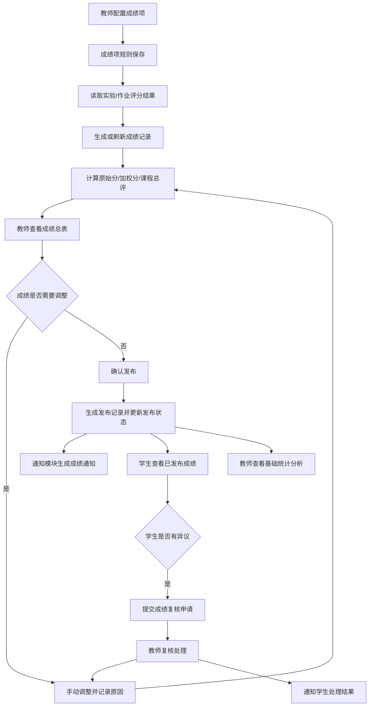
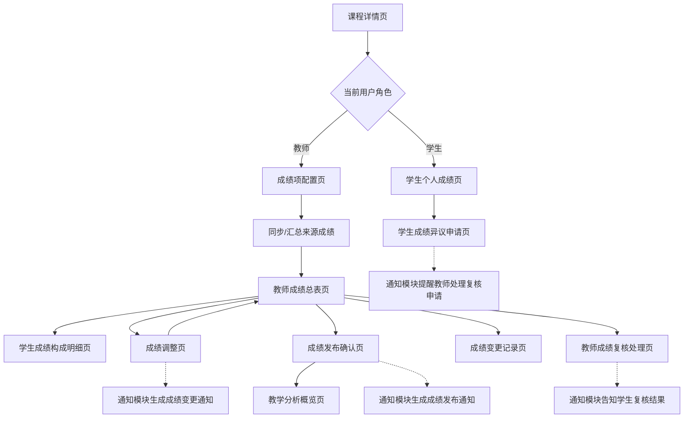
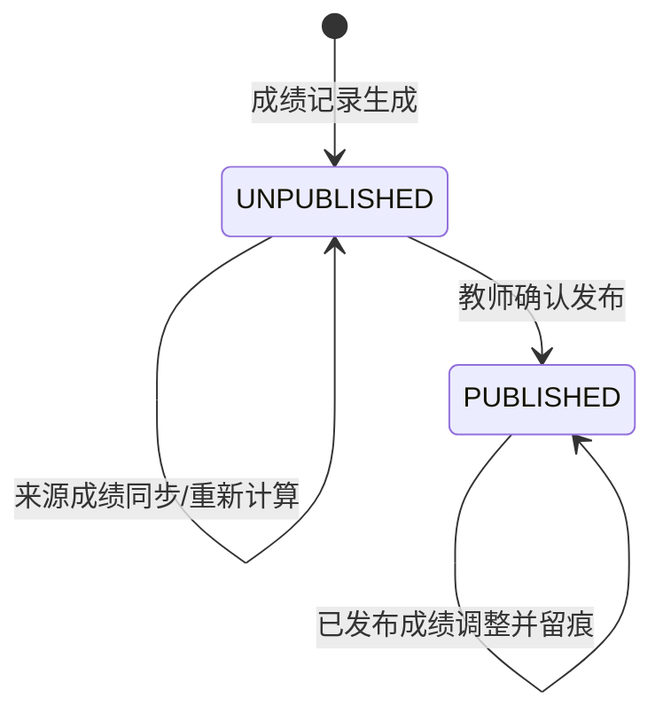
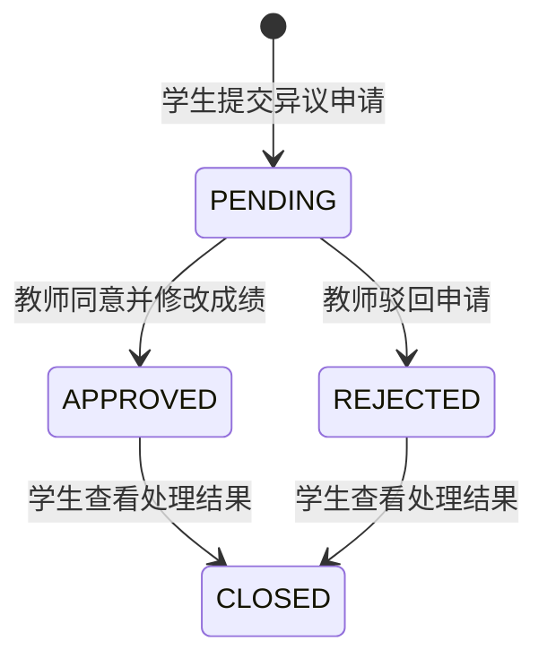
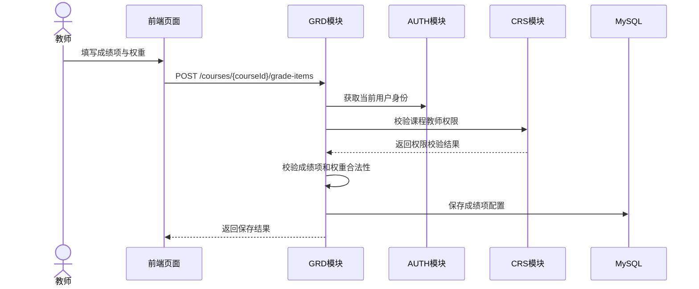
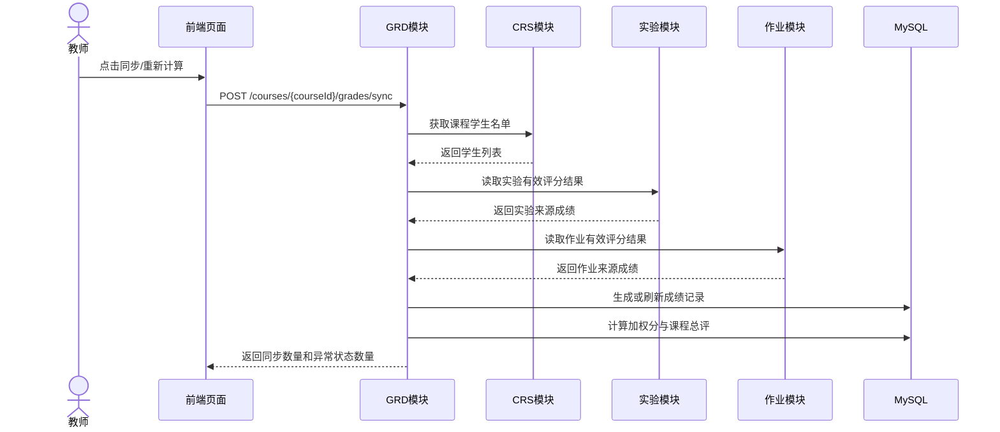
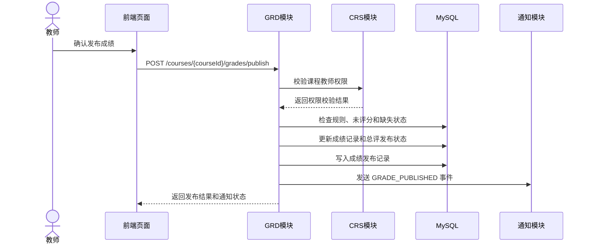
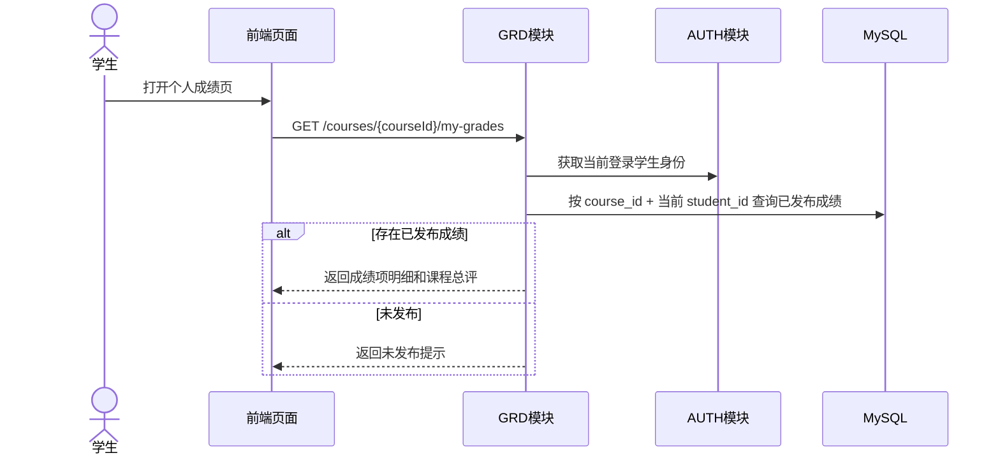
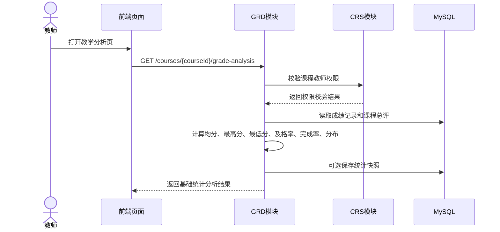
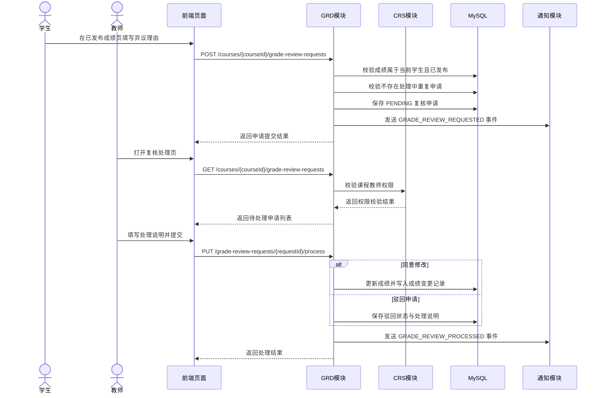

# 成绩评价与教学分析模块概要设计提交稿（GRD）

> 项目名称：在线教学与实训平台
> 文档类型：概要设计模块提交稿
> 提交模块：成绩评价与教学分析模块（GRD）
> 适用总文档：《软件概要设计说明书》
> 建议整合位置：2.5.6、2.6.6、3.1 GRD 页面设计、3.2 GRD 接口设计、3.3 GRD 数据结构设计、4 GRD 数据库设计、5 运行设计相关补充
> 需求追踪来源：《软件需求规格说明书》中 FR-GR-01 ~ FR-GR-07、NFR-GR-01 ~ NFR-GR-05，以及 7.2.7、8.2.3、8.2.5、8.2.7

---

## 0 编写说明与设计边界

本文档只描述成绩评价与教学分析模块（GRD）内部概要设计。设计信息来自《软件需求规格说明书》和《成绩评价与教学分析模块》需求文档，不扩展为完整教务系统、跨课程分析系统或智能预测分析系统。

首版设计目标是完成“成绩项配置 -> 成绩汇总 -> 总评计算 -> 教师确认与发布 -> 学生查看 -> 学生提交成绩异议 -> 教师复核处理 -> 教师查看基础统计分析”的闭环，并保证来源可追踪、状态可控制、权限边界清晰。

### 0.1 本模块负责的内容

1. 教师在课程范围内配置成绩项、成绩来源、满分值、权重、是否计入总评。
2. 从实验模块、作业与自动评测模块读取或接收已形成的有效评分结果。
3. 按课程、学生、成绩项生成成绩记录，区分原始分、加权分和课程总评。
4. 标识未提交、未评分、缺失成绩等异常或未完成状态。
5. 支持教师查看课程成绩总表、学生成绩构成明细，并按学生、成绩项、状态筛选。
6. 支持教师在课程权限范围内调整单项成绩或总评，并填写调整原因。
7. 支持成绩未发布、已发布状态控制，记录发布时间、发布范围和发布人。
8. 支持学生查看本人已发布成绩、成绩项明细、加权结果、课程总评和允许展示的反馈信息。
9. 支持学生对本人已发布成绩提交异议申请，并查看本人申请处理状态和处理结果。
10. 支持教师查看授权课程内成绩异议申请，并进行同意修改、驳回或备注说明。
11. 支持课程级、班级级基础统计分析，包括均分、最高分、最低分、及格率、完成率和预设分数区间分布。
12. 记录成绩项定义、成绩计算、成绩发布、成绩修改、成绩异议复核和统计分析来源时间点，满足追踪与审计要求。

### 0.2 本模块不负责的内容

1. 不负责用户注册、登录、角色维护、JWT 鉴权和平台级权限模型，这部分由 AUTH 模块负责。
2. 不负责课程创建、课程成员维护、课程章节和资源管理，这部分由 CRS 模块负责。
3. 不负责实验任务创建、实验提交、实验自动评测和实验评分，这部分由 LAB 模块负责。
4. 不负责作业发布、作业提交、作业自动评测和教师批阅，这部分由 HWK 模块负责。
5. 不负责站内通知生成、未读状态和通知偏好配置，这部分由 LRN 模块负责。
6. 不实现校级教务排课、商业级成绩系统、复杂预测分析、跨课程对比分析和大模型分析。

### 0.3 与其他模块的协作关系

| 协作模块 | 协作内容 | GRD 侧设计边界 |
| --- | --- | --- |
| AUTH 用户权限与平台安全 | 身份认证、教师/学生角色校验、关键操作审计身份来源 | GRD 接口依赖当前登录用户身份，不在请求体中信任前端传入的操作者身份。 |
| CRS 课程与教学资源 | 课程信息、课程成员、教师课程权限、学生名单 | GRD 只读取课程与成员基础数据，用于权限校验、成绩记录生成和班级统计范围确定。 |
| LAB 实训实验模块 | 实验编号、学生编号、得分、评分状态、成绩发布时间、是否已发布 | GRD 不修改实验评分，只按成绩项来源规则读取或接收有效实验成绩。 |
| HWK 作业与自动评测模块 | 作业编号、学生编号、得分、评测状态、教师评分结果、是否已发布 | GRD 不修改作业提交和评测记录，只汇总作业最终成绩。 |
| LRN 学习过程与通知提醒 | 成绩发布、成绩变更、成绩异议提交、复核结果通知事件 | GRD 只发送成绩发布、成绩变更、复核申请和复核结果事件，通知生成、展示和已读未读由 LRN 负责。 |

---

## 1 模块总体架构设计

### 1.1 设计原则

1. 高内聚：成绩项、成绩记录、发布记录、变更记录、统计分析均由 GRD 内部统一管理，避免成绩状态分散在多个模块。
2. 低耦合：GRD 通过标准来源成绩 DTO 读取 LAB/HWK 评分结果，不依赖对方内部表结构和评测流程。
3. 可追踪：每条成绩记录保留来源模块、来源任务编号、来源更新时间；发布和修改均记录操作人、时间和原因。
4. 可扩展：成绩来源类型以枚举和来源编号组织，首版支持实验、作业和课程内其他可计分项目，后续可增加更多来源类型。
5. 可验证：页面、接口、数据表和测试编号均追踪到 FR-GR-01 ~ FR-GR-07 与 NFR-GR-01 ~ NFR-GR-05。

### 1.2 模块内部组件划分

| 组件 | 主要职责 | 设计说明 |
| --- | --- | --- |
| GradeItemService | 成绩项配置与计算规则维护 | 负责成绩项名称、来源、满分、权重、是否计入总评、发布前修改限制。 |
| GradeSourceSyncService | 来源成绩读取与同步 | 负责按成绩项来源从 LAB/HWK 获取有效评分结果，转换为 GRD 内部成绩记录。 |
| GradeCalculationService | 原始分、加权分、总评计算 | 负责权重校验、缺失状态处理、规则变更后的重新计算。 |
| GradeRecordService | 成绩总表与学生明细查询 | 负责课程成绩总表、学生个人成绩构成、筛选和分页查询。 |
| GradePublishService | 成绩发布与发布状态控制 | 负责发布范围、发布记录、学生可见性控制和发布后通知事件。 |
| GradeAdjustmentService | 成绩调整与变更留痕 | 负责单项成绩或总评调整，强制填写调整原因，记录前后值。 |
| GradeReviewRequestService | 成绩异议与复核申请 | 负责学生异议申请、教师复核处理、状态流转和处理结果通知。 |
| GradeAnalysisService | 基础统计分析 | 负责均分、最高分、最低分、及格率、完成率和分数区间分布计算。 |

### 1.3 模块内部数据流



### 1.4 GRD 业务场景与三层图组索引

GRD 以五个既有关键 UC 作为独立可验收场景；来源同步、权限校验、调整留痕和通知投递作为公共子流程复用，不另立 UC。下表同时标明主成功、备选和异常边界，避免把一张综合流程图误当成全部场景证据。

| 场景类型 | 场景/用例 | 主成功路径 | 备选与异常路径 | 需求层 SSD | 概要层流程 | 详细层图 |
| --- | --- | --- | --- | --- | --- | --- |
| 独立场景 | UC-GR-01 汇总并发布成绩 | 真实 LAB/HWK 成绩同步、重算、发布并尝试生成通知 | 同步阶段覆盖部分缺失、来源失败、无权限；规则非法只在独立规则校验或发布前检查中阻止操作；相同范围重复发布幂等返回既有结果；通知失败只记告警 | 图 4-15 | 8.2、8.3 | 5.1、7.2、7.3、图 3-6-9 |
| 独立场景 | UC-GR-02 配置成绩项与规则 | 保存来源类型、满分、权重；LAB/HWK 使用正整数来源编号，OTHER_COURSE_ITEM 可为空 | 来源类型非法、LAB/HWK 编号为空或非正数、权重非法、重复名称；当前修改接口不检查关联成绩发布状态或记录规则变更原因；现有同步契约将任务不存在或跨课程、未发布或暂无成绩统一按空结果和 `MISSING` 处理 | 图 4-20 | 8.1 | 7.1 |
| 独立场景 | UC-GR-03 查询本人已发布成绩 | 当前学生查看本人明细、总评和发布时间 | 未发布、非成员、他人成绩不可见 | 图 4-21 | 8.4 | 图 3-6-11 |
| 独立场景 | UC-GR-04 成绩异议与复核 | 学生提交，教师同意/驳回，结果通知学生 | 重复 PENDING、未发布/非本人、无权限、调整非法 | 图 4-22 | 8.6 | 图 3-6-12、图 3-6-10 |
| 独立场景 | UC-GR-05 教学分析 | 教师查看课程/成绩项指标、分布和来源时间 | 空态、快照失效、维度非法、无权限、计算失败 | 图 4-23 | 8.5 | 图 3-6-13 ~ 图 3-6-15 |
| 公共子流程 | AUTH/CRS 权限 | 使用当前登录身份与课程成员关系 | 会话失效、角色或课程权限不足 | 各 SSD 的前置条件 | 8.1、8.3 ~ 8.6 | GradePermission/CoursePermission 调用 |
| 公共子流程 | LAB/HWK 来源同步 | 通过 SourceGradeDTO 读取已发布评分 | 超时/失败、任务删除或变化、缺失/未评分 | 图 4-15 | 8.2 | 5.1、7.2 |
| 公共子流程 | 调整留痕与 LRN 通知 | 写变更日志；响应前同步 best-effort 调用 LRN 通知持久化；publisher 挂起外层 GRD 事务，LRN 使用独立事务 | 通知失败只回滚 LRN 事务并记录告警，不将 GRD 事务标记为 rollback-only，不回滚成绩/发布/复核结果；复核响应不含通知结果，发布响应仍返回持久化前写入的 `notificationStatus=SENT` | 图 4-15、图 4-22 | 8.3、8.6 | 7.3、7.5、图 3-6-12 |

---

## 2 2.5.6 成绩评价与教学分析模块功能需求设计

### 2.1 FR-GR-01 成绩项配置与计算规则（P0）

| 属性 | 描述 |
| --- | --- |
| 需求编号 | FR-GR-01 |
| 优先级 | P0（必须实现） |
| 涉及角色 | 教师 |
| 核心功能 | 教师在课程范围内定义成绩项，包括成绩项名称、成绩来源、满分值、权重和是否计入总评；系统按预设权重自动计算课程总评。 |
| 设计要点 | ① 成绩项必须绑定 `course_id`，创建和修改前必须校验当前教师是否负责或被授权管理该课程。<br>② 成绩来源使用 `source_type + source_id` 表示，首版来源包括 LAB、HWK 和课程内其他可计分项目。<br>③ 成绩项保存满分值、权重、是否计入总评、显示顺序和启用状态。<br>④ 当前 GradeItem 规则修改不接收原因、不检查关联成绩发布状态，也不写入 GradeChangeLog；手动调整已发布 GradeRecord/课程总评及来源同步实际改变已发布 GradeRecord 时才进入既有成绩变更留痕。<br>⑤ 权重配置保存时应校验合法性，避免总评计算规则缺失或权重配置不合法。 |

### 2.2 FR-GR-02 成绩汇总与总评生成（P0）

| 属性 | 描述 |
| --- | --- |
| 需求编号 | FR-GR-02 |
| 优先级 | P0（必须实现） |
| 涉及角色 | 系统、教师 |
| 核心功能 | 系统从实验模块、作业与自动评测模块读取已产生的评分结果，按课程、学生和成绩项汇总，生成学生课程成绩记录和课程总评。 |
| 设计要点 | ① 汇总范围以课程成员学生名单为基础，避免遗漏未提交或缺失成绩的学生。<br>② 来源成绩进入 GRD 后形成独立成绩记录，记录来源模块、来源任务编号、来源更新时间和同步时间。<br>③ 成绩记录区分 `raw_score`、`weighted_score` 和 `final_score`。<br>④ 对未提交、未评分、缺失成绩设置明确 `grade_status`，并按课程成绩项规则决定是否参与总评。<br>⑤ 当前规则保存不自动重算或推进教学分析来源版本；只有保存后仍启用且计入总评的 LAB/HWK 成绩项会由来源同步刷新 `weighted_score` 和成绩项来源版本。改为停用或不计入总评的项会被同步筛选排除，其 GradeRecord 和成绩项级快照可能保持旧值；同步仍会在同一事务内重算课程总评并推进总评来源版本。 |

### 2.3 FR-GR-03 教师成绩管理（P0）

| 属性 | 描述 |
| --- | --- |
| 需求编号 | FR-GR-03 |
| 优先级 | P0（必须实现） |
| 涉及角色 | 教师 |
| 核心功能 | 教师查看课程成绩总表，按学生、成绩项、状态筛选，查看学生成绩构成明细，并可对课程内单项成绩或总评进行手动调整。 |
| 设计要点 | ① 成绩总表以课程为入口，按学生维度展示各成绩项原始分、加权分、缺失状态、发布状态和总评。<br>② 支持按学生关键词、成绩项、成绩状态、发布状态筛选，并对总表查询进行分页。<br>③ 成绩明细页展示单名学生的成绩构成、来源任务、教师评语或基础反馈信息。<br>④ 手动调整必须填写调整原因，并保存调整前值、调整后值、修改人、修改时间。<br>⑤ 已发布成绩被修改后，必须保留变更记录，并向受影响学生追加站内成绩变更通知事件。 |

### 2.4 FR-GR-04 成绩发布与状态控制（P0）

| 属性 | 描述 |
| --- | --- |
| 需求编号 | FR-GR-04 |
| 优先级 | P0（必须实现） |
| 涉及角色 | 教师、学生、系统 |
| 核心功能 | 系统支持未发布和已发布成绩状态。教师确认成绩无误后发布课程成绩，发布后学生方可查看对应成绩结果。 |
| 设计要点 | ① 成绩记录和课程总评均保存发布状态，默认未发布，发布后对对应学生可见。<br>② 发布前应检查成绩规则是否存在、是否仍有未评分记录，并向教师展示可发布范围和异常提示。<br>③ 首次发布生成发布记录，保存课程编号、发布范围、发布人、发布时间和通知状态。<br>④ 相同课程与发布范围的重复请求幂等返回既有 `publishId`，不重复生成发布记录或通知。<br>⑤ 成绩正式发布后，GRD 在响应前同步 best-effort 调用 LRN 通知持久化；`PersistentNotificationEventPublisher` 挂起外层 GRD 事务，由 LRN 独立事务落库。通知失败只回滚 LRN 事务并记录告警，不将 GRD 事务标记为 rollback-only；当前发布记录及响应中的 `notificationStatus` 仍为 `SENT`，不代表通知实际落库。 |

### 2.5 FR-GR-05 学生成绩查询与结果展示（P0）

| 属性 | 描述 |
| --- | --- |
| 需求编号 | FR-GR-05 |
| 优先级 | P0（必须实现） |
| 涉及角色 | 学生 |
| 核心功能 | 学生查看本人在课程中的已发布成绩，包括成绩项明细、加权结果和课程总评。 |
| 设计要点 | ① 学生端成绩查询必须以当前登录用户作为 `student_id`，不能由前端传入学生编号决定查询对象。<br>② 仅返回已发布成绩；对未发布成绩返回明确提示，不返回未公开分数。<br>③ 页面展示成绩项名称、原始分、加权分、课程总评、发布时间和当前发布状态。<br>④ 若课程配置为“显示教师评语”，可展示教师评语或与成绩相关的基础反馈信息。<br>⑤ 学生不得查看其他学生成绩、全班成绩明细或未授权统计结果。 |

### 2.6 FR-GR-06 班级成绩统计与教学分析（P1）

| 属性 | 描述 |
| --- | --- |
| 需求编号 | FR-GR-06 |
| 优先级 | P1（应实现） |
| 涉及角色 | 教师 |
| 核心功能 | 教师查看课程或单个成绩项的基础统计分析结果，包括均分、最高分、最低分、及格率、完成率、预设分数区间分布，以及实验、作业等成绩项整体完成情况和平均表现。 |
| 设计要点 | ① 统计范围限定在教师负责或被授权课程内。<br>② 支持按课程总评或单个成绩项生成统计结果。<br>③ 完成率基于课程成员学生名单与有效成绩记录计算，未提交、未评分、缺失成绩需单独统计。<br>④ 分数区间采用预设区间配置，首版不提供复杂自定义分析模型。<br>⑤ 统计分析结果记录数据来源时间点，便于追溯统计结果对应的成绩数据版本。 |

### 2.7 FR-GR-07 成绩异议与复核申请（P1）

| 属性 | 描述 |
| --- | --- |
| 需求编号 | FR-GR-07 |
| 优先级 | P1（应实现） |
| 涉及角色 | 学生、教师 |
| 核心功能 | 学生在成绩发布后，对本人课程成绩或单项成绩提交异议申请；教师查看授权课程内申请并进行同意修改、驳回或备注说明，系统向学生展示处理状态和处理结果。 |
| 设计要点 | ① 学生只能对本人已发布成绩提交异议，不能对未发布成绩、他人成绩或无权限课程成绩提交申请。<br>② 异议申请需关联课程、学生、成绩项或总评，并保存申请理由、申请时间、处理状态。<br>③ 同一学生对同一课程成绩项或总评存在处理中申请时，不允许重复提交。<br>④ 教师处理申请时可选择驳回并填写说明，或同意修改并复用成绩调整与变更留痕机制。<br>⑤ 申请提交和处理完成后，GRD 向 LRN 发送复核申请或复核结果通知事件。 |

---

## 3 2.6.6 成绩评价与教学分析模块非功能需求设计

| 需求编号 | 需求描述 | 设计约束 |
| --- | --- | --- |
| NFR-GR-01（可靠性） | 成绩汇总、计算、发布和统计分析流程必须具有明确状态，避免成绩状态不一致或学生可见结果异常。 | ① 成绩项、成绩记录、发布记录、变更记录分表保存。<br>② 来源成绩同步和总评计算在事务边界内更新同一批次记录。<br>③ 统计结果基于已保存成绩记录计算，发布后学生查询和教师统计使用同一成绩数据来源。<br>④ 来源数据变化后支持重新计算并刷新相关结果。 |
| NFR-GR-02（性能） | 小并发演示环境下成绩查询和统计分析需在规定时间内返回。 | ① 课程成绩总表分页查询，普通课程成绩总表在 5 秒内返回。<br>② 学生个人成绩查询按 `course_id + student_id` 索引定位，在 3 秒内返回。<br>③ 班级级基础统计分析在 5 秒内完成展示。<br>④ 成绩发布操作在 5 秒内返回成功、失败或处理中状态，避免教师重复操作。 |
| NFR-GR-03（可追踪性） | 成绩项定义、成绩计算、成绩发布、成绩修改和成绩复核过程均应保留记录。 | ① 成绩记录保存来源模块、来源任务编号、来源更新时间。<br>② 计算批次保存规则版本和计算时间。<br>③ 已发布成绩修改必须记录修改前后值、修改人、修改时间和修改原因。<br>④ 成绩异议申请保存提交人、申请理由、处理状态、处理人、处理时间和处理结果。<br>⑤ 统计分析结果记录对应成绩数据来源时间点。 |
| NFR-GR-04（安全性） | 学生只能访问本人已发布成绩并对本人已发布成绩提交异议，教师只能访问授权课程成绩、异议申请和分析数据。 | ① 所有 GRD 接口均需 JWT 鉴权。<br>② 教师操作必须校验课程权限。<br>③ 学生查询和异议提交强制使用当前登录用户过滤。<br>④ 未发布成绩、全班明细、敏感统计结果和他人复核申请不得向无权限用户返回。<br>⑤ 成绩发布、成绩修改、异议处理等关键操作纳入日志审计范围。 |
| NFR-GR-05（可测试性） | 关键功能和异常场景需可稳定复现并映射测试项。 | ① 成绩规则配置、成绩汇总、总评计算、成绩发布、学生查询、教师修改成绩、学生提交成绩异议、教师复核处理、统计分析展示均提供独立接口。<br>② 未发布不可见、规则错误、来源缺失、已发布成绩修改留痕、重复异议申请、无权限异议处理等异常场景可由测试数据构造。<br>③ 页面、接口、数据表和测试编号均映射 FR-GR-01 ~ FR-GR-07 与 NFR-GR-01 ~ NFR-GR-05。 |

---

## 4 3.1 用户接口：GRD 页面设计

### 4.1 页面列表

| 页面编号 | 页面名称 | 使用角色 | 功能描述 | 对应需求 | 主要数据来源/API |
| --- | --- | --- | --- | --- | --- |
| GRD-P01 | 教师成绩项配置页 | 教师 | 在课程范围内配置成绩项、来源、满分、权重、是否计入总评和显示顺序。 | FR-GR-01 | `GET /api/v1/courses/{courseId}/grade-items`、`POST /api/v1/courses/{courseId}/grade-items` |
| GRD-P02 | 教师成绩总表页 | 教师 | 展示课程学生成绩总表，支持学生、成绩项、状态筛选和分页查询。 | FR-GR-02、FR-GR-03 | `GET /api/v1/courses/{courseId}/grades` |
| GRD-P03 | 学生成绩构成明细页 | 教师 | 查看单名学生各成绩项原始分、加权分、来源任务、状态和总评。 | FR-GR-03 | `GET /api/v1/courses/{courseId}/grades/students/{studentId}` |
| GRD-P04 | 成绩调整页/弹窗 | 教师 | 调整课程内单项成绩或总评，填写调整原因并保存变更记录。 | FR-GR-03、FR-GR-04 | `PUT /api/v1/grade-records/{recordId}/adjust` |
| GRD-P05 | 成绩发布确认页 | 教师 | 发布前展示可发布范围、未评分/缺失状态和发布确认结果。 | FR-GR-04 | `POST /api/v1/courses/{courseId}/grades/publish` |
| GRD-P06 | 学生个人成绩页 | 学生 | 展示本人已发布成绩项明细、加权结果、课程总评、发布时间和发布状态。 | FR-GR-05 | `GET /api/v1/courses/{courseId}/my-grades` |
| GRD-P07 | 教学分析概览页 | 教师 | 展示课程总评或成绩项的均分、最高分、最低分、及格率、完成率和分布。 | FR-GR-06 | `GET /api/v1/courses/{courseId}/grade-analysis` |
| GRD-P08 | 成绩变更记录页 | 教师 | 查看已发布成绩修改前后值、修改人、修改时间和修改原因。 | FR-GR-03、NFR-GR-03 | `GET /api/v1/courses/{courseId}/grade-change-logs` |
| GRD-P09 | 学生成绩异议申请页 | 学生 | 对本人已发布课程成绩或单项成绩提交异议申请，并查看本人申请处理状态。 | FR-GR-07 | `POST /api/v1/courses/{courseId}/grade-review-requests`、`GET /api/v1/courses/{courseId}/my-grade-review-requests` |
| GRD-P10 | 教师成绩复核处理页 | 教师 | 查看授权课程内成绩异议申请，进行同意修改、驳回或备注说明。 | FR-GR-07、FR-GR-03 | `GET /api/v1/courses/{courseId}/grade-review-requests`、`PUT /api/v1/grade-review-requests/{requestId}/process` |

### 4.2 页面流转图



### 4.3 页面交互要点

1. 成绩项配置页必须展示权重、满分、是否计入总评和来源类型，保存前进行必填项和权重合法性校验。
2. 成绩总表页默认按课程成员学生列表展示，未提交、未评分、缺失成绩不能被空白单元格替代，需明确显示状态。
3. 成绩调整必须通过确认弹窗输入调整原因，不允许无原因修改成绩。
4. 成绩发布确认页应明确提示发布范围、未评分数量、缺失成绩数量和通知结果。
5. 学生个人成绩页只显示已发布数据；未发布时展示明确提示。
6. 学生成绩异议申请页只允许选择本人已发布成绩项或总评，提交时必须填写申请理由。
7. 教师成绩复核处理页应展示申请理由、原成绩、来源成绩记录和历史处理状态，处理时必须填写处理说明。
8. 教学分析页只展示课程级和班级级基础统计，不提供跨课程对比和预测分析入口。

---

## 5 3.2 接口设计：GRD 模块 API 与跨模块事件

> 统一说明：接口路径采用 `/api/v1` 前缀；除公共登录接口外，GRD 接口均需携带 JWT Token；响应格式建议遵循全局统一结构 `{ code, message, data }`。具体 DTO 字段名可由后端总设计在详细设计阶段统一调整。

### 5.1 成绩项配置接口

| 接口名称 | 方法与路径 | 调用方 | 主要入参 | 主要出参 | 需求追踪 |
| --- | --- | --- | --- | --- | --- |
| 查询成绩项列表 | `GET /api/v1/courses/{courseId}/grade-items` | 教师端 | `courseId` | `gradeItemList` | FR-GR-01 |
| 创建成绩项 | `POST /api/v1/courses/{courseId}/grade-items` | 教师端 | `name, sourceType, sourceId, fullScore, weight, includedInFinal, sortOrder` | 完整持久化 `GradeItem`；不附带规则校验或重算结果 | FR-GR-01 |
| 修改成绩项 | `PUT /api/v1/grade-items/{gradeItemId}` | 教师端 | `name, fullScore, weight, includedInFinal, sortOrder, enabled` | `gradeItemId, updatedAt` | FR-GR-01 |
| 删除/停用成绩项 | `DELETE /api/v1/grade-items/{gradeItemId}` | 教师端 | `gradeItemId` | `gradeItemId, enabled` | FR-GR-01 |
| 校验成绩规则 | `POST /api/v1/courses/{courseId}/grade-rules/validate` | 教师端 | 可选 `gradeItems`；为空时校验已保存成绩项 | `valid, totalIncludedWeight, errors` | FR-GR-01 |

### 5.2 成绩汇总与计算接口

| 接口名称 | 方法与路径 | 调用方 | 主要入参 | 主要出参 | 需求追踪 |
| --- | --- | --- | --- | --- | --- |
| 同步来源成绩 | `POST /api/v1/courses/{courseId}/grades/sync` | 教师端/系统 | 路径 `courseId`；无请求体 | `calculationBatchId, affectedItemCount, affectedStudentCount, syncedCount, missingCount, ungradedCount` | FR-GR-02 |
| 重新计算课程成绩 | `POST /api/v1/courses/{courseId}/grades/recalculate` | 教师端/系统 | `gradeItemIds, studentIds` | `calculationBatchId, affectedCount` | FR-GR-01、FR-GR-02 |
| 查询课程成绩总表 | `GET /api/v1/courses/{courseId}/grades` | 教师端 | `studentKeyword, gradeItemId, gradeStatus, publishStatus, page, size` | `records, total` | FR-GR-02、FR-GR-03 |
| 查询学生成绩明细 | `GET /api/v1/courses/{courseId}/grades/students/{studentId}` | 教师端 | `courseId, studentId` | `studentGradeDetail` | FR-GR-03 |

### 5.3 教师成绩管理与发布接口

| 接口名称 | 方法与路径 | 调用方 | 主要入参 | 主要出参 | 需求追踪 |
| --- | --- | --- | --- | --- | --- |
| 调整成绩记录 | `PUT /api/v1/grade-records/{recordId}/adjust` | 教师端 | `newScore, adjustType, reason` | `recordId, oldScore, newScore, updatedAt` | FR-GR-03 |
| 调整课程总评 | `PUT /api/v1/courses/{courseId}/grades/students/{studentId}/final-score` | 教师端 | `newFinalScore, reason` | `studentId, oldFinalScore, newFinalScore` | FR-GR-03 |
| 发布课程成绩 | `POST /api/v1/courses/{courseId}/grades/publish` | 教师端 | `publishScope, studentIds, gradeItemIds` | `publishId, publishedCount, publishedAt, notificationStatus` | FR-GR-04 |
| 查询发布记录 | `GET /api/v1/courses/{courseId}/grade-publish-records` | 教师端 | `page, size` | `records, total` | FR-GR-04 |
| 查询成绩变更记录 | `GET /api/v1/courses/{courseId}/grade-change-logs` | 教师端 | `studentId, gradeItemId, page, size` | `records, total` | FR-GR-03、NFR-GR-03 |

### 5.4 学生查询与教学分析接口

| 接口名称 | 方法与路径 | 调用方 | 主要入参 | 主要出参 | 需求追踪 |
| --- | --- | --- | --- | --- | --- |
| 查询我的课程成绩 | `GET /api/v1/courses/{courseId}/my-grades` | 学生端 | `courseId` | `gradeItems, finalScore, publishedAt, publishStatus` | FR-GR-05 |
| 查询课程成绩分析 | `GET /api/v1/courses/{courseId}/grade-analysis` | 教师端 | `targetType, gradeItemId` | `averageScore, maxScore, minScore, passRate, completionRate, distribution` | FR-GR-06 |
| 查询成绩项完成情况 | `GET /api/v1/courses/{courseId}/grade-items/{gradeItemId}/completion` | 教师端 | `gradeItemId` | `completedCount, missingCount, ungradedCount, averageScore` | FR-GR-06 |

### 5.5 成绩异议与复核接口

| 接口名称 | 方法与路径 | 调用方 | 主要入参 | 主要出参 | 需求追踪 |
| --- | --- | --- | --- | --- | --- |
| 提交成绩异议申请 | `POST /api/v1/courses/{courseId}/grade-review-requests` | 学生端 | `gradeItemId, targetType, reason` | `requestId, status, submittedAt` | FR-GR-07 |
| 查询我的成绩异议申请 | `GET /api/v1/courses/{courseId}/my-grade-review-requests` | 学生端 | `courseId, status, page, size` | `records, total` | FR-GR-07 |
| 查询课程成绩异议申请 | `GET /api/v1/courses/{courseId}/grade-review-requests` | 教师端 | `studentId, gradeItemId, status, page, size` | `records, total` | FR-GR-07 |
| 处理成绩异议申请 | `PUT /api/v1/grade-review-requests/{requestId}/process` | 教师端 | `action, adjustedScore, responseComment` | `requestId, status, processedAt` | FR-GR-07、FR-GR-03 |

### 5.6 跨模块数据契约

#### 5.6.1 来源成绩读取 DTO

GRD 从 LAB/HWK 读取或接收来源成绩时，只依赖以下字段，不依赖对方内部表结构。

| 字段 | 类型 | 说明 |
| --- | --- | --- |
| `sourceType` | String | 来源类型：LAB、HWK、OTHER_COURSE_ITEM |
| `sourceId` | Long | 来源任务编号，如实验编号或作业编号 |
| `courseId` | Long | 所属课程编号 |
| `studentId` | Long | 学生编号 |
| `score` | BigDecimal | 来源模块形成的得分 |
| `scoreStatus` | String | 评分状态，如 SCORED、UNSUBMITTED、UNGRADED、MISSING |
| `published` | Boolean | 来源成绩是否已发布或允许进入汇总 |
| `sourceUpdatedAt` | DateTime | 来源成绩更新时间 |
| `comment` | String | 教师评语或基础反馈，可为空 |

#### 5.6.2 GRD 向 LRN 发送的事件

| 事件名称 | 触发时机 | 接收模块 | 主要字段 | 说明 |
| --- | --- | --- | --- | --- |
| `GRADE_PUBLISHED` | 教师正式发布成绩后 | LRN | `courseId, publishId, receiverStudentIds, publishedAt` | 通知学生查看已发布成绩。 |
| `GRADE_CHANGED` | 已发布成绩发生修改后 | LRN | `courseId, studentId, gradeItemId, changedAt` | 向受影响学生追加成绩变更通知。 |
| `GRADE_REVIEW_REQUESTED` | 学生提交成绩异议申请后 | LRN | `courseId, requestId, studentId, teacherIds, submittedAt` | 通知课程教师处理复核申请。 |
| `GRADE_REVIEW_PROCESSED` | 教师处理成绩异议申请后 | LRN | `courseId, requestId, studentId, status, processedAt` | 通知学生查看复核处理结果。 |

---

## 6 3.3 数据结构设计：GRD 核心实体

### 6.1 GradeItem 成绩项实体

| 字段 | 类型 | 说明 |
| --- | --- | --- |
| id | Long | 成绩项编号 |
| courseId | Long | 所属课程编号 |
| name | String | 成绩项名称 |
| sourceType | Enum | 来源类型：LAB、HWK、OTHER_COURSE_ITEM |
| sourceId | Long | 来源任务编号，可为空 |
| fullScore | BigDecimal | 满分值 |
| weight | BigDecimal | 总评权重 |
| includedInFinal | Boolean | 是否计入总评 |
| enabled | Boolean | 是否启用 |
| sortOrder | Integer | 展示顺序 |
| createdBy | Long | 创建教师编号 |
| createdAt | LocalDateTime | 创建时间 |
| updatedAt | LocalDateTime | 更新时间 |

### 6.2 GradeRecord 成绩记录实体

| 字段 | 类型 | 说明 |
| --- | --- | --- |
| id | Long | 成绩记录编号 |
| courseId | Long | 所属课程编号 |
| studentId | Long | 学生编号 |
| gradeItemId | Long | 成绩项编号 |
| sourceType | Enum | 来源类型 |
| sourceId | Long | 来源任务编号 |
| rawScore | BigDecimal | 原始分 |
| weightedScore | BigDecimal | 加权分 |
| gradeStatus | Enum | SCORED、UNSUBMITTED、UNGRADED、MISSING、ADJUSTED |
| publishStatus | Enum | UNPUBLISHED、PUBLISHED |
| comment | String | 教师评语或基础反馈 |
| sourceUpdatedAt | LocalDateTime | 来源成绩更新时间 |
| calculatedAt | LocalDateTime | 计算时间 |
| publishedAt | LocalDateTime | 发布时间 |
| createdAt | LocalDateTime | 创建时间 |
| updatedAt | LocalDateTime | 更新时间 |

### 6.3 CourseGradeSummary 课程总评实体

| 字段 | 类型 | 说明 |
| --- | --- | --- |
| id | Long | 总评记录编号 |
| courseId | Long | 所属课程编号 |
| studentId | Long | 学生编号 |
| finalScore | BigDecimal | 课程总评 |
| finalStatus | Enum | CALCULATED、INCOMPLETE、ADJUSTED |
| publishStatus | Enum | UNPUBLISHED、PUBLISHED |
| calculationBatchId | Long | 最近一次计算批次编号 |
| publishedAt | LocalDateTime | 发布时间 |
| updatedAt | LocalDateTime | 更新时间 |

### 6.4 GradePublishRecord 成绩发布记录实体

| 字段 | 类型 | 说明 |
| --- | --- | --- |
| id | Long | 发布记录编号 |
| courseId | Long | 所属课程编号 |
| publishScope | Enum | COURSE、PARTIAL_STUDENTS、PARTIAL_ITEMS |
| publishedCount | Integer | 发布成绩数量 |
| publishedBy | Long | 发布人编号 |
| publishedAt | LocalDateTime | 发布时间 |
| notificationStatus | Enum | 模型预留 PENDING、SENT、FAILED；当前发布路径在调用 publisher 前写入 SENT，失败时不回写 FAILED |
| remark | String | 备注 |

### 6.5 GradeCalculationBatch 成绩计算批次实体

| 字段 | 类型 | 说明 |
| --- | --- | --- |
| id | Long | 计算批次编号 |
| courseId | Long | 所属课程编号 |
| triggerType | Enum | SOURCE_SYNC、RULE_CHANGED、MANUAL_RECALCULATE、BEFORE_PUBLISH |
| affectedItemCount | Integer | 受影响成绩项数量 |
| affectedStudentCount | Integer | 受影响学生数量 |
| status | Enum | SUCCESS、FAILED |
| message | String | 计算结果说明或失败原因 |
| calculatedBy | Long | 触发人编号；系统触发时可为空 |
| calculatedAt | LocalDateTime | 计算时间 |

### 6.6 GradeReviewRequest 成绩异议申请实体

| 字段 | 类型 | 说明 |
| --- | --- | --- |
| id | Long | 复核申请编号 |
| courseId | Long | 所属课程编号 |
| studentId | Long | 申请学生编号 |
| gradeItemId | Long | 成绩项编号，可为空；为空表示对课程总评提出异议 |
| targetType | Enum | ITEM_SCORE、FINAL_SCORE |
| reason | String | 学生申请理由 |
| status | Enum | PENDING、APPROVED、REJECTED、CLOSED |
| originalScore | BigDecimal | 申请时对应成绩 |
| adjustedScore | BigDecimal | 处理后成绩，未修改时为空 |
| responseComment | String | 教师处理说明 |
| submittedAt | LocalDateTime | 申请时间 |
| processedBy | Long | 处理教师编号 |
| processedAt | LocalDateTime | 处理时间 |

### 6.7 GradeChangeLog 成绩变更记录实体

| 字段 | 类型 | 说明 |
| --- | --- | --- |
| id | Long | 变更记录编号 |
| courseId | Long | 所属课程编号 |
| studentId | Long | 学生编号 |
| gradeItemId | Long | 成绩项编号，可为空；为空表示总评变更 |
| changeType | Enum | ITEM_SCORE、FINAL_SCORE、PUBLISH_STATUS |
| oldValue | String | 修改前值 |
| newValue | String | 修改后值 |
| reason | String | 修改原因 |
| operatorId | Long | 操作人编号 |
| createdAt | LocalDateTime | 操作时间 |

### 6.8 GradeAnalysisSnapshot 统计分析快照实体

| 字段 | 类型 | 说明 |
| --- | --- | --- |
| id | Long | 快照编号 |
| courseId | Long | 所属课程编号 |
| targetType | Enum | FINAL_SCORE、GRADE_ITEM |
| gradeItemId | Long | 成绩项编号，统计总评时为空 |
| averageScore | BigDecimal | 均分 |
| maxScore | BigDecimal | 最高分 |
| minScore | BigDecimal | 最低分 |
| passRate | BigDecimal | 及格率 |
| completionRate | BigDecimal | 完成率 |
| totalStudentCount | Integer | 当前有效学生总数；历史快照可为空 |
| completedCount | Integer | 已完成且有分数人数；历史快照可为空 |
| missingCount | Integer | 缺失人数；历史快照可为空 |
| unsubmittedCount | Integer | 未提交人数；历史快照可为空 |
| ungradedCount | Integer | 已提交未评分人数；历史快照可为空 |
| distributionJson | Text | 预设分数区间分布 JSON |
| sourceDataTime | LocalDateTime | 统计对应的成绩数据时间点 |
| sourceFingerprint | String | `GRD_ANALYSIS_V2:<SHA-256>`，覆盖统计契约、有效学生集合和 Repository 来源版本 |
| calculatedAt | LocalDateTime | 统计计算时间 |

### 6.9 成绩发布状态机



说明：成绩发布状态至少包括未发布和已发布。已发布成绩发生修改时不回退为未发布，而是记录变更并向受影响学生发送成绩变更通知事件。

### 6.10 成绩异议申请状态机



说明：同一学生对同一课程成绩项或总评存在 `PENDING` 状态申请时，系统不允许重复提交。

---

## 7 4 数据库设计：GRD 模块建议表结构

> 说明：以下为 GRD 模块提交给后端总设计的建议表结构。最终字段类型、公共审计字段、逻辑删除字段和外键约束可由后端总设计统一调整。表命名遵循 `t_` 前缀，字段命名使用小写下划线。

### 7.1 t_grade_item 成绩项表

| 字段名 | 类型 | 约束 | 说明 |
| --- | --- | --- | --- |
| id | bigint | PK | 成绩项编号 |
| course_id | bigint | NOT NULL, INDEX | 所属课程编号 |
| name | varchar(100) | NOT NULL | 成绩项名称 |
| source_type | varchar(30) | NOT NULL | LAB、HWK、OTHER_COURSE_ITEM |
| source_id | bigint | NULL, INDEX | 来源任务编号 |
| full_score | decimal(6,2) | NOT NULL | 满分值 |
| weight | decimal(6,4) | NOT NULL DEFAULT 0 | 总评权重 |
| included_in_final | tinyint | NOT NULL DEFAULT 1 | 是否计入总评 |
| enabled | tinyint | NOT NULL DEFAULT 1 | 是否启用 |
| sort_order | int | NOT NULL DEFAULT 0 | 展示顺序 |
| created_by | bigint | NOT NULL | 创建教师编号 |
| created_at | datetime | NOT NULL | 创建时间 |
| updated_at | datetime | NOT NULL | 更新时间 |
| deleted | tinyint | NOT NULL DEFAULT 0 | 逻辑删除标记 |

建议索引：

```sql
CREATE INDEX idx_grade_item_course ON t_grade_item(course_id, enabled, sort_order);
CREATE INDEX idx_grade_item_source ON t_grade_item(source_type, source_id);
```

### 7.2 t_grade_record 成绩记录表

| 字段名 | 类型 | 约束 | 说明 |
| --- | --- | --- | --- |
| id | bigint | PK | 成绩记录编号 |
| course_id | bigint | NOT NULL, INDEX | 所属课程编号 |
| student_id | bigint | NOT NULL, INDEX | 学生编号 |
| grade_item_id | bigint | NOT NULL, INDEX | 成绩项编号 |
| source_type | varchar(30) | NOT NULL | 来源类型 |
| source_id | bigint | NULL, INDEX | 来源任务编号 |
| raw_score | decimal(6,2) | NULL | 原始分 |
| weighted_score | decimal(6,2) | NULL | 加权分 |
| grade_status | varchar(30) | NOT NULL | SCORED、UNSUBMITTED、UNGRADED、MISSING、ADJUSTED |
| publish_status | varchar(30) | NOT NULL DEFAULT 'UNPUBLISHED' | UNPUBLISHED、PUBLISHED |
| comment | varchar(1000) | NULL | 教师评语或基础反馈 |
| source_updated_at | datetime | NULL | 来源成绩更新时间 |
| calculated_at | datetime | NULL | 计算时间 |
| published_at | datetime | NULL | 发布时间 |
| created_at | datetime | NOT NULL | 创建时间 |
| updated_at | datetime | NOT NULL | 更新时间 |

建议索引：

```sql
CREATE UNIQUE INDEX uk_grade_record_student_item ON t_grade_record(course_id, student_id, grade_item_id);
CREATE INDEX idx_grade_record_course_status ON t_grade_record(course_id, grade_status, publish_status);
CREATE INDEX idx_grade_record_student_publish ON t_grade_record(course_id, student_id, publish_status);
```

### 7.3 t_course_grade_summary 课程总评表

| 字段名 | 类型 | 约束 | 说明 |
| --- | --- | --- | --- |
| id | bigint | PK | 总评记录编号 |
| course_id | bigint | NOT NULL, INDEX | 所属课程编号 |
| student_id | bigint | NOT NULL, INDEX | 学生编号 |
| final_score | decimal(6,2) | NULL | 课程总评 |
| final_status | varchar(30) | NOT NULL | CALCULATED、INCOMPLETE、ADJUSTED |
| publish_status | varchar(30) | NOT NULL DEFAULT 'UNPUBLISHED' | UNPUBLISHED、PUBLISHED |
| calculation_batch_id | bigint | NULL | 最近一次计算批次编号 |
| published_at | datetime | NULL | 发布时间 |
| created_at | datetime | NOT NULL | 创建时间 |
| updated_at | datetime | NOT NULL | 更新时间 |

建议索引：

```sql
CREATE UNIQUE INDEX uk_course_grade_student ON t_course_grade_summary(course_id, student_id);
CREATE INDEX idx_course_grade_publish ON t_course_grade_summary(course_id, publish_status);
```

### 7.4 t_grade_publish_record 成绩发布记录表

| 字段名 | 类型 | 约束 | 说明 |
| --- | --- | --- | --- |
| id | bigint | PK | 发布记录编号 |
| course_id | bigint | NOT NULL, INDEX | 所属课程编号 |
| publish_scope | varchar(30) | NOT NULL | COURSE、PARTIAL_STUDENTS、PARTIAL_ITEMS |
| published_count | int | NOT NULL DEFAULT 0 | 发布成绩数量 |
| published_by | bigint | NOT NULL | 发布人编号 |
| published_at | datetime | NOT NULL | 发布时间 |
| notification_status | varchar(30) | NOT NULL | 模型预留 PENDING、SENT、FAILED；当前发布路径只写 SENT，失败时不回写 FAILED |
| remark | varchar(500) | NULL | 备注 |

### 7.5 t_grade_calculation_batch 成绩计算批次表

| 字段名 | 类型 | 约束 | 说明 |
| --- | --- | --- | --- |
| id | bigint | PK | 计算批次编号 |
| course_id | bigint | NOT NULL, INDEX | 所属课程编号 |
| trigger_type | varchar(30) | NOT NULL | SOURCE_SYNC、RULE_CHANGED、MANUAL_RECALCULATE、BEFORE_PUBLISH |
| affected_item_count | int | NOT NULL DEFAULT 0 | 受影响成绩项数量 |
| affected_student_count | int | NOT NULL DEFAULT 0 | 受影响学生数量 |
| status | varchar(30) | NOT NULL | SUCCESS、FAILED |
| message | varchar(500) | NULL | 计算结果说明或失败原因 |
| calculated_by | bigint | NULL | 触发人编号 |
| calculated_at | datetime | NOT NULL | 计算时间 |

### 7.6 t_grade_review_request 成绩异议申请表

| 字段名 | 类型 | 约束 | 说明 |
| --- | --- | --- | --- |
| id | bigint | PK | 复核申请编号 |
| course_id | bigint | NOT NULL, INDEX | 所属课程编号 |
| student_id | bigint | NOT NULL, INDEX | 申请学生编号 |
| grade_item_id | bigint | NULL, INDEX | 成绩项编号；为空表示总评 |
| target_type | varchar(30) | NOT NULL | ITEM_SCORE、FINAL_SCORE |
| reason | varchar(1000) | NOT NULL | 学生申请理由 |
| status | varchar(30) | NOT NULL | PENDING、APPROVED、REJECTED、CLOSED |
| original_score | decimal(6,2) | NULL | 申请时对应成绩 |
| adjusted_score | decimal(6,2) | NULL | 处理后成绩 |
| response_comment | varchar(1000) | NULL | 教师处理说明 |
| submitted_at | datetime | NOT NULL | 申请时间 |
| processed_by | bigint | NULL | 处理教师编号 |
| processed_at | datetime | NULL | 处理时间 |
| created_at | datetime | NOT NULL | 创建时间 |
| updated_at | datetime | NOT NULL | 更新时间 |

建议索引：

```sql
CREATE INDEX idx_grade_review_course_status ON t_grade_review_request(course_id, status);
CREATE INDEX idx_grade_review_student_status ON t_grade_review_request(course_id, student_id, status);
```

### 7.7 t_grade_change_log 成绩变更记录表

| 字段名 | 类型 | 约束 | 说明 |
| --- | --- | --- | --- |
| id | bigint | PK | 变更记录编号 |
| course_id | bigint | NOT NULL, INDEX | 所属课程编号 |
| student_id | bigint | NOT NULL, INDEX | 学生编号 |
| grade_item_id | bigint | NULL, INDEX | 成绩项编号；为空表示总评 |
| change_type | varchar(30) | NOT NULL | ITEM_SCORE、FINAL_SCORE、PUBLISH_STATUS |
| old_value | varchar(100) | NULL | 修改前值 |
| new_value | varchar(100) | NULL | 修改后值 |
| reason | varchar(500) | NOT NULL | 修改原因 |
| operator_id | bigint | NOT NULL | 操作人编号 |
| created_at | datetime | NOT NULL | 操作时间 |

### 7.8 t_grade_analysis_snapshot 统计分析快照表

| 字段名 | 类型 | 约束 | 说明 |
| --- | --- | --- | --- |
| id | bigint | PK | 快照编号 |
| course_id | bigint | NOT NULL, INDEX | 所属课程编号 |
| target_type | varchar(30) | NOT NULL | FINAL_SCORE、GRADE_ITEM |
| grade_item_id | bigint | NULL, INDEX | 成绩项编号 |
| average_score | decimal(6,2) | NULL | 均分 |
| max_score | decimal(6,2) | NULL | 最高分 |
| min_score | decimal(6,2) | NULL | 最低分 |
| pass_rate | decimal(6,4) | NULL | 及格率 |
| completion_rate | decimal(6,4) | NULL | 完成率 |
| total_student_count | int | NULL | 当前有效学生总数；历史快照可为空 |
| completed_count | int | NULL | 已完成且有分数人数；历史快照可为空 |
| missing_count | int | NULL | 缺失人数；历史快照可为空 |
| unsubmitted_count | int | NULL | 未提交人数；历史快照可为空 |
| ungraded_count | int | NULL | 已提交未评分人数；历史快照可为空 |
| distribution_json | text | NULL | 分数区间分布 JSON |
| source_data_time | datetime | NOT NULL | 统计对应成绩数据时间点 |
| source_fingerprint | varchar(96) | NULL | `GRD_ANALYSIS_V2:<SHA-256>`；历史快照兼容为空，新增快照必须写入 |
| calculated_at | datetime | NOT NULL | 统计计算时间 |

### 7.9 t_grade_analysis_source_version 统计来源版本表

| 字段名 | 类型 | 约束 | 说明 |
| --- | --- | --- | --- |
| course_id | bigint | PK | 所属课程编号 |
| target_type | varchar(30) | PK | COURSE_TOTAL、GRADE_ITEM |
| grade_item_key | bigint | PK | COURSE_TOTAL 固定为 0，GRADE_ITEM 使用成绩项编号 |
| source_version | bigint | NOT NULL | 成绩或总评每次成功写入后单调递增 |
| source_data_time | datetime | NULL | 最近一次来源写入的数据时间 |
| updated_at | datetime | NOT NULL | 版本行更新时间 |

统计查询先比较有效学生集合和此轻量来源版本；只有指纹不一致时才读取并聚合完整成绩记录。成绩记录与课程总评的运行期写入必须经过 Repository，并在同一事务内递增对应来源版本。

---

## 8 5 运行设计补充：核心业务流程

### 8.1 教师配置成绩项流程



### 8.2 成绩汇总与总评计算流程



### 8.3 教师发布成绩流程



### 8.4 学生查看成绩流程



### 8.5 教师查看教学分析流程



### 8.6 学生提交成绩异议与教师复核流程



---

## 9 异常处理设计

| 异常场景 | 触发条件 | 处理策略 | 对应需求 |
| --- | --- | --- | --- |
| 成绩来源任务仍存在未评分记录 | LAB/HWK 返回 UNGRADED 或缺失有效评分 | 成绩记录标记为 `UNGRADED`，发布前向教师提示；按课程规则决定是否参与总评。 | FR-GR-02、FR-GR-04 |
| 成绩计算规则缺失 | 课程未配置成绩项或计入总评项为空 | 阻止总评计算和发布，返回规则缺失提示。 | FR-GR-01、FR-GR-04 |
| 权重配置不合法 | 权重为空、负数或不满足课程规则 | 保存或发布前返回校验错误，不更新成绩记录。 | FR-GR-01 |
| 教师无课程权限 | 当前教师不是课程负责人或授权教师 | 拒绝访问，记录操作失败日志。 | FR-GR-03、NFR-GR-04 |
| 学生查看未发布成绩 | 学生访问未发布成绩记录 | 返回未发布提示，不返回具体分数、全班明细或统计结果。 | FR-GR-05、NFR-GR-04 |
| 成绩发布通知持久化失败 | `PersistentNotificationEventPublisher` 调用 LRN 持久化时抛出运行时异常 | publisher 挂起外层 GRD 事务，LRN 独立事务回滚后捕获异常并记录告警；GRD 事务不会被标记为 rollback-only，已发布成绩和发布记录仍可提交，接口仍成功，当前发布记录及响应中的 `notificationStatus` 仍为 `SENT`；当前版本没有 `FAILED` 回写或补偿状态。 | FR-GR-04、NFR-GR-01 |
| 已发布成绩被修改 | 教师调整已发布成绩项或总评 | 写入变更记录，更新成绩记录，向受影响学生发送 `GRADE_CHANGED` 事件。 | FR-GR-03、FR-GR-04 |
| 统计结果未及时刷新 | 成绩来源变化后统计结果仍基于旧数据 | 教学分析查询时按最新成绩记录重新计算，或刷新统计快照并记录来源时间点。 | FR-GR-06、NFR-GR-03 |
| 学生重复提交成绩异议 | 同一学生对同一课程成绩项或总评已有 PENDING 申请 | 拒绝重复申请，返回当前待处理申请编号和状态。 | FR-GR-07 |
| 学生对无权限成绩提交异议 | 目标成绩未发布、不是当前学生本人或课程不可访问 | 拒绝提交，不返回目标成绩详情。 | FR-GR-07、NFR-GR-04 |
| 教师无权限处理异议 | 当前教师不是课程负责人或授权教师 | 拒绝处理，保留申请原状态并记录失败日志。 | FR-GR-07、NFR-GR-04 |

---

## 10 需求追踪与测试关注点

### 10.1 需求到设计映射

| 需求编号 | 需求名称 | 功能设计 | 页面设计 | 接口设计 | 数据结构/数据库 | 建议测试编号 |
| --- | --- | --- | --- | --- | --- | --- |
| FR-GR-01 | 成绩项配置与计算规则 | 2.1 | GRD-P01 | 5.1、5.2 | GradeItem、t_grade_item | TC-GR-01 |
| FR-GR-02 | 成绩汇总与总评生成 | 2.2 | GRD-P02 | 5.2、5.6 | GradeRecord、CourseGradeSummary | TC-GR-02 |
| FR-GR-03 | 教师成绩管理 | 2.3 | GRD-P02、GRD-P03、GRD-P04、GRD-P08 | 5.2、5.3 | GradeRecord、GradeChangeLog | TC-GR-03 |
| FR-GR-04 | 成绩发布与状态控制 | 2.4 | GRD-P05 | 5.3、5.6 | GradePublishRecord、CourseGradeSummary | TC-GR-04 |
| FR-GR-05 | 学生成绩查询与结果展示 | 2.5 | GRD-P06 | 5.4 | GradeRecord、CourseGradeSummary | TC-GR-05 |
| FR-GR-06 | 班级成绩统计与教学分析 | 2.6 | GRD-P07 | 5.4 | GradeAnalysisSnapshot | TC-GR-06 |
| FR-GR-07 | 成绩异议与复核申请 | 2.7 | GRD-P09、GRD-P10 | 5.5、5.6 | GradeReviewRequest、t_grade_review_request | TC-GR-07 |
| NFR-GR-01 | 可靠性 | 3 | 全部核心页面 | 5.2、5.3、5.5 | 发布状态、计算批次、复核状态、快照 | TC-GR-N01 |
| NFR-GR-02 | 性能 | 3 | GRD-P02、GRD-P06、GRD-P07 | 5.2、5.4 | 关键查询索引 | TC-GR-N02 |
| NFR-GR-03 | 可追踪性 | 3 | GRD-P08、GRD-P09、GRD-P10 | 5.3、5.5 | GradeChangeLog、GradeReviewRequest、GradeAnalysisSnapshot | TC-GR-N03 |
| NFR-GR-04 | 安全性 | 3 | GRD-P02、GRD-P06、GRD-P07、GRD-P09、GRD-P10 | 全部 GRD 接口 | 权限过滤字段 | TC-GR-N04 |
| NFR-GR-05 | 可测试性 | 3 | 全部核心页面 | 全部 GRD 接口 | 全部核心表 | TC-GR-N05 |

### 10.2 验收关注点

1. Given 教师已配置成绩项且实验、作业评分结果已存在，When 执行成绩汇总，Then 系统生成按学生组织的课程成绩记录。
2. Given 课程已配置权重规则，When 系统计算课程总评，Then 系统生成对应的加权成绩和课程总评结果。
3. Given 教师拥有课程成绩管理权限，When 查看课程成绩总表，Then 系统展示全班成绩明细并支持按条件筛选。
4. Given 教师确认成绩无误，When 点击发布成绩，Then 系统更新成绩状态为已发布并向学生发送成绩通知。
5. Given 学生成绩已发布，When 学生进入成绩页面，Then 系统展示该学生个人成绩明细和课程总评。
6. Given 教师进入教学分析页面，When 系统加载班级成绩统计，Then 系统展示均分、及格率、完成率和成绩分布等基础分析结果。
7. Given 学生成绩未发布，When 学生尝试查看结果，Then 系统返回未发布提示且不暴露未公开分数。
8. Given 已发布成绩被教师修改，When 修改提交成功，Then 系统记录修改前后值、修改人、修改时间和修改原因。
9. Given 学生已查看本人已发布成绩且存在异议，When 学生提交成绩复核申请，Then 系统生成异议申请记录并通知对应课程教师。
10. Given 教师收到成绩异议申请，When 教师完成复核处理，Then 系统记录处理结果；若成绩被修改，还应记录修改前后值并向学生展示处理结果。
