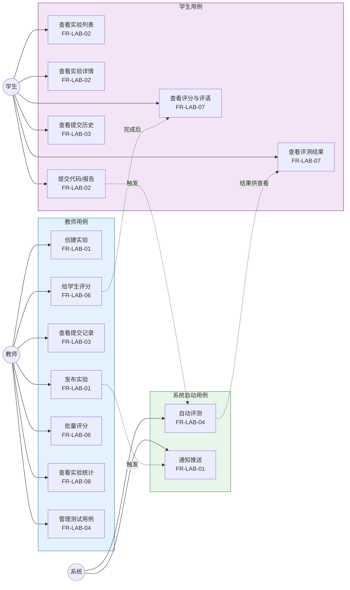
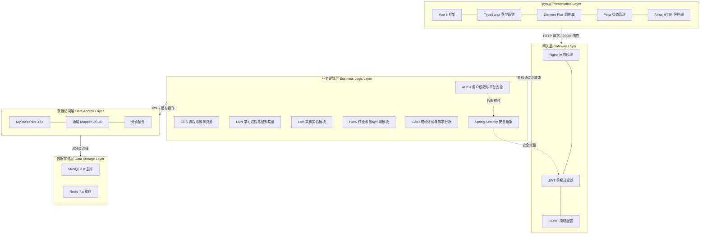
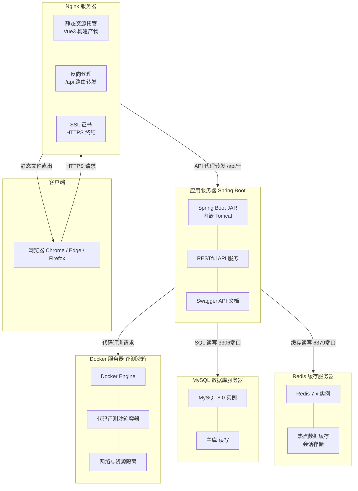
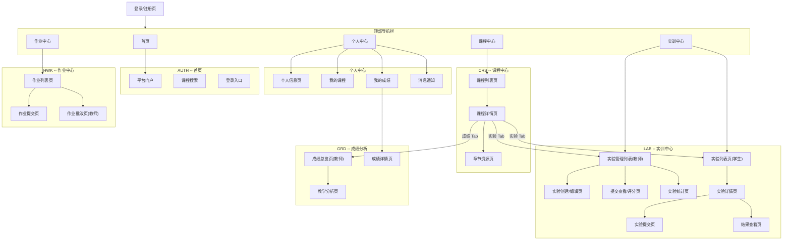
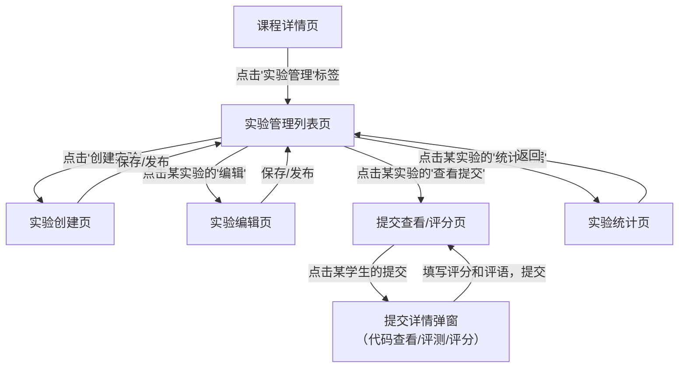
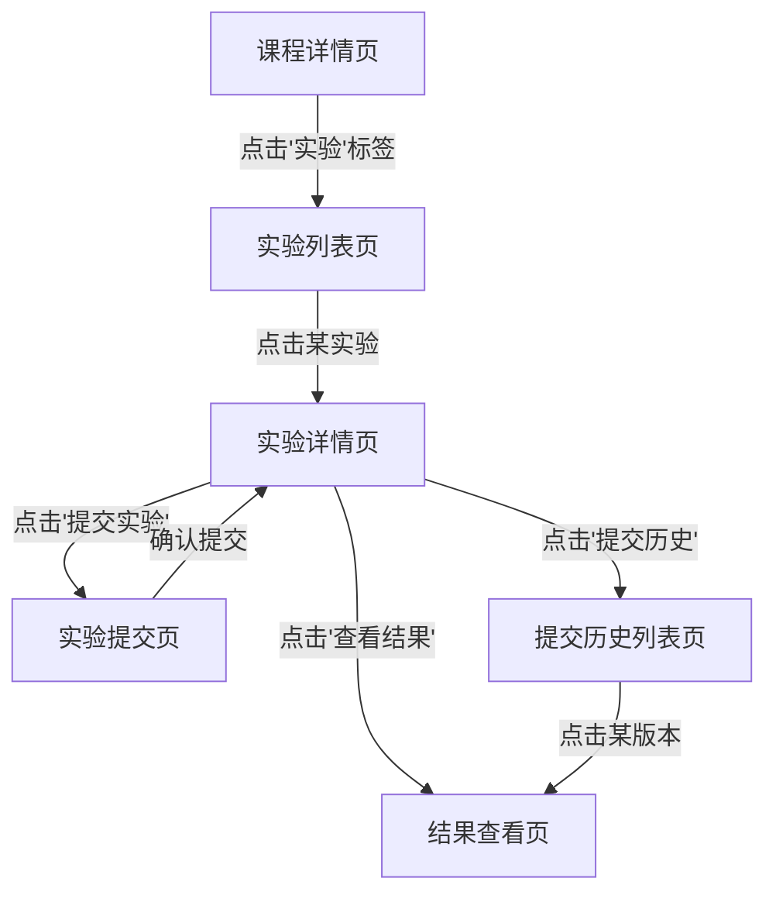
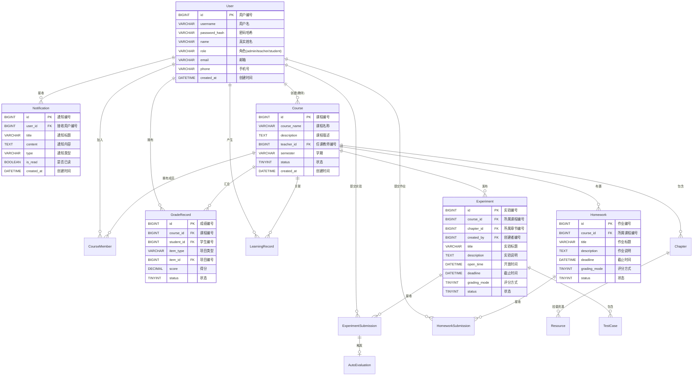
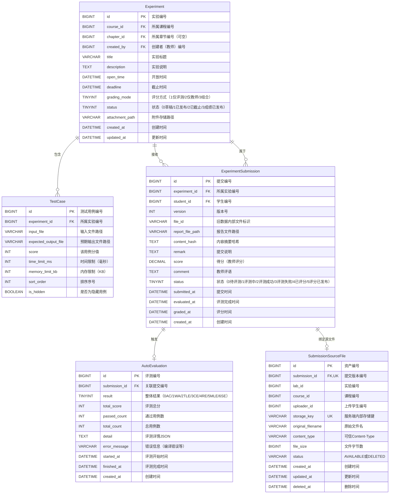

# 在线教学与实训平台 — 软件概要设计说明书

> **项目名称**：在线教学与实训平台
> **技术栈**：Spring Boot 3.x + Vue 3 + TypeScript + MySQL 8.0 + Redis 7.x + MyBatis-Plus
> **文档版本**：V1.0（协作底稿）
> **编写日期**：2026年4月
> **文档性质**：团队整体协作底稿，实训模块内容完整填充，其他模块预留结构化模板

---

## 目录

- [1 引言](#1-引言)
  - [1.1 编写目的](#11-编写目的)
  - [1.2 背景](#12-背景)
  - [1.3 定义](#13-定义)
  - [1.4 参考资料](#14-参考资料)
- [2 系统需求概述](#2-系统需求概述)
  - [2.1 需求规定](#21-需求规定)
  - [2.2 业务目标](#22-业务目标)
  - [2.3 运行环境](#23-运行环境)
  - [2.4 设计约束](#24-设计约束)
  - [2.5 功能需求](#25-功能需求)
  - [2.6 非功能需求](#26-非功能需求)
  - [2.7 系统总体架构](#27-系统总体架构)
- [3 系统接口设计](#3-系统接口设计)
  - [3.1 用户接口](#31-用户接口)
  - [3.2 外部接口](#32-外部接口)
  - [3.3 系统数据结构设计](#33-系统数据结构设计)
- [4 系统数据库设计](#4-系统数据库设计)
- [5 运行设计](#5-运行设计)

---

## 1 引言

### 1.1 编写目的

本文档是"在线教学与实训平台"项目的概要设计说明书（High-Level Design, HLD），旨在从系统架构层面描述各业务模块的总体结构、模块间接口关系、数据组织方式以及关键技术决策。本文档作为《软件需求规格说明书（SRS）》与后续详细设计之间的桥梁，将需求层面的功能描述转化为架构层面的设计方案，为编码实现、集成测试和系统部署提供统一的设计蓝图。

本文档的目标读者包括：全体开发成员（含前端开发、后端开发、前后端总设计师）、测试负责人以及指导教师。开发成员可依据本文档理解系统整体架构与模块边界，明确各模块之间的依赖关系与数据流向，从而在详细设计和编码阶段保持与总体架构的一致性。测试负责人可依据本文档中的功能模块划分、业务目标衡量指标和设计约束，制定系统测试计划和验收标准。指导教师可通过本文档了解项目的技术选型理由和架构设计思路，便于对设计方案的合理性进行评审。

本文档与《软件需求规格说明书（SRS）》保持严格的追溯关系：概要设计中的每项设计决策均对应 SRS 中的需求条目，各章节末尾标注了对应的 SRS 追溯关系。本文档的使用方式包括：作为团队内部设计评审的核心材料、作为详细设计阶段的设计输入、以及作为项目答辩时的技术方案说明依据。

**SRS追溯关系**：对应 SRS 第1章"引言"中的项目概述与文档范围。

### 1.2 背景

本项目名称为"在线教学与实训平台"，是北京航空航天大学软件工程课程大作业项目，由大二软件学院学生团队负责开发。项目面向高校教学场景，旨在构建一套覆盖课程管理、教学资源共享、学习行为跟踪、在线实训实验、作业自动评测和成绩分析评估的一体化在线教学平台，为高校师生提供高效、便捷的数字化教学服务。

本系统的开发方为北京航空航天大学软件工程课程项目团队，使用方为高校教师、助教及学生用户群体。教师可通过本系统进行课程创建与发布、教学资源上传与管理、实训实验项目配置、作业发布与批阅以及成绩统计分析。学生可通过本系统浏览课程资源、完成在线实训与实验、提交作业并获取自动评测结果、查看个人成绩与学习报告。助教可协助教师完成课程管理和作业批阅工作。管理员负责平台用户管理、系统配置与运维监控。

本系统采用 B/S（浏览器/服务器）架构，前后端分离设计，后端基于 Spring Boot 3.x 构建单体应用并按业务模块进行分层组织，前端基于 Vue 3 和 TypeScript 构建单页应用（SPA）。系统运行依赖 MySQL 8.0 关系型数据库和 Redis 7.x 缓存中间件，数据持久层采用 MyBatis-Plus 框架实现。本系统作为独立的教学管理平台运行，不直接依赖其他外部业务系统，但实训实验模块和作业评测模块需要通过 Docker 容器提供代码沙箱运行环境。

**SRS追溯关系**：对应 SRS 1.2 节"项目背景"。

### 1.3 定义

为确保全体开发成员在概要设计、详细设计和编码实现阶段使用一致的术语体系，本文档统一列出项目中涉及的重要术语、缩写及其定义。后续新增术语须经概要设计负责人审核确认后方可纳入。

#### 术语与缩写表

| 术语 / 缩写 | 全称 | 定义 |
|---|---|---|
| API | Application Programming Interface | 应用程序编程接口，定义了软件组件之间交互的契约和通信方式 |
| BCrypt | — | 一种基于 Blowfish 加密算法的密码哈希函数，专门用于安全存储用户密码 |
| BO | Business Object | 业务对象，封装业务逻辑处理过程中的数据实体，在 Service 层中使用 |
| CI/CD | Continuous Integration / Continuous Deployment | 持续集成与持续部署，通过自动化构建、测试和发布流程提升交付效率 |
| CRUD | Create / Read / Update / Delete | 增删改查，数据操作的基本四类操作语义 |
| Docker | — | 一种容器化技术，用于打包应用及其依赖环境，实现"一次构建，到处运行" |
| DTO | Data Transfer Object | 数据传输对象，用于在前后端或不同层级之间传递数据，避免直接暴露内部实体 |
| HLD | High-Level Design | 概要设计说明书，从架构层面描述系统的总体结构和设计方案 |
| IO 比对 | Input/Output Comparison | 输入输出比对，通过对比程序的标准输出与预期输出判断程序正确性的一种评测方式 |
| JWT | JSON Web Token | 基于 JSON 的开放标准令牌，用于在前后端分离架构中实现无状态身份认证与授权 |
| Mermaid | — | 一种基于文本语法的图表描述语言，可在 Markdown 文档中绘制流程图、架构图、ER 图等 |
| MySQL | — | 一种开源关系型数据库管理系统，本项目使用 8.0 版本作为主数据存储 |
| Nginx | — | 一种高性能 Web 服务器和反向代理服务器，本项目用于前端静态资源托管和后端 API 反向代理 |
| PO | Persistent Object | 持久化对象，与数据库表结构一一对应的实体类，在数据访问层中使用 |
| RBAC | Role-Based Access Control | 基于角色的访问控制，通过为用户分配角色来管理其对系统资源的访问权限 |
| Redis | Remote Dictionary Server | 一种开源内存数据结构存储系统，本项目用作缓存中间件和会话管理存储 |
| RESTful | Representational State Transfer | 一种 API 设计风格，以资源为核心，通过 HTTP 方法语义（GET/POST/PUT/DELETE）操作资源 |
| SPA | Single Page Application | 单页应用，仅在 Web 页面初始化时加载相应资源，通过前端路由实现页面切换 |
| SRS | Software Requirements Specification | 软件需求规格说明书，描述系统应具备的功能和非功能需求 |
| VO | Value Object | 视图对象，封装从后端返回给前端的展示数据，通常是对 DTO 或 PO 的聚合与裁剪 |

#### 项目特定术语

| 术语 / 缩写 | 定义 |
|---|---|
| 状态机 | 用于描述业务实体生命周期中各状态及其合法转移规则的模型，如作业提交状态从"未提交"到"已提交"再到"评测完成" |
| 评测队列 | 用于管理待评测代码提交任务的有序队列，支持异步消费和并发处理，保证评测服务在高负载下的稳定运行 |
| 判题服务 | 对学生提交的代码进行编译、运行并与预期结果比对的后台服务，是作业评测模块和实训实验模块的核心执行引擎 |

#### 需求编号规则

本系统所有需求条目遵循统一的编号规则，便于在需求、设计、开发和测试各阶段之间建立追溯关系。

- **功能需求编号**：`FR-{模块缩写}-{编号}`，其中编号采用两位数字，从 01 开始递增。例如：`FR-LAB-01` 表示实训实验模块的第 1 条功能需求。
- **非功能需求编号**：`NFR-{模块缩写}-{编号}`，编号规则与功能需求一致。例如：`NFR-AUTH-01` 表示用户权限模块的第 1 条非功能需求。

#### 模块缩写对照表

| 模块名称 | 缩写 | 英文全称 | 说明 |
|---|---|---|---|
| 用户权限与平台安全 | AUTH | Authentication & Authorization | 负责用户注册登录、身份认证、角色权限管理及平台安全策略 |
| 课程与教学资源 | CRS | Course & Resource | 负责课程的创建与管理、教学资源的上传、组织和分发 |
| 学习过程与通知提醒 | LRN | Learning & Reminder | 负责跟踪学生学习行为，提供站内通知和消息推送机制 |
| 实训实验模块 | LAB | Laboratory | 负责在线编程实训环境、代码编辑、编译运行和实验报告管理 |
| 作业与自动评测模块 | HWK | Homework & Auto-grading | 负责作业发布、代码提交与基于测试用例的自动评测 |
| 成绩评价与教学分析 | GRD | Grade & Analysis | 负责成绩管理、统计分析和教学效果评估 |

**SRS追溯关系**：对应 SRS 1.3 节"定义"，术语表应与 SRS 保持一致并可扩展。

### 1.4 参考资料

本文档的编写参考了以下内部文档和外部资料，所引用的文档版本信息如下：

| 编号 | 文档名称 | 版本 / 来源 |
|---|---|---|
| [1] | 《软件需求规格说明书（SRS）》 | v1.0，项目组 |
| [2] | 《技术选型与架构决策文档》 | v1.0，项目组 |
| [3] | 《UI/UX 设计规范》 | v1.0，前端组 |
| [4] | Spring Boot 3.x 官方文档 | https://docs.spring.io/spring-boot/docs/3.x/reference/html/ |
| [5] | Vue 3 官方文档 | https://vuejs.org/guide/introduction.html |
| [6] | MySQL 8.0 官方文档 | https://dev.mysql.com/doc/refman/8.0/en/ |
| [7] | GB/T 8567-2006《计算机软件文档编制规范》 | 国家标准 |

其中，[1] 是本文档的核心需求输入来源，概要设计中的各项设计决策均需与 SRS 中的需求条目保持一一对应关系。[2] 记录了项目的技术选型决策过程和最终结论，是本文档中架构设计方案的重要依据。[3] 定义了前端的组件规范、页面布局标准和交互设计原则，是用户接口设计章节的参考基准。[4]-[6] 是项目所采用核心框架和数据库的官方技术文档，为技术实现方案提供权威参考。[7] 是国家标准《计算机软件文档编制规范》，本文档的章节结构和编写格式遵循该标准的指导意见。

**SRS追溯关系**：对应 SRS 1.4 节"参考资料"。

---

## 2 系统需求概述

### 2.1 需求规定

本系统面向高校教学场景，提供从课程资源管理到实训实验、作业自动评测到成绩分析评估的**全流程在线教学闭环服务**。系统以 B/S 架构为用户提供 Web 访问入口，通过前后端分离的单体应用架构支撑六大业务模块的协同运行，覆盖教学活动中的核心业务环节。系统的主要输入包括教师发布的教学内容（课程信息、教学资源、作业题目、实训项目）、学生提交的作业代码和实验报告，以及管理员配置的系统参数；主要处理包括用户身份认证与权限校验、教学资源的存储与检索、代码编译运行与自动评测、学习行为数据的采集与统计；主要输出包括教学内容的展示页面、作业评测结果与反馈报告、成绩统计图表以及各类通知消息。

系统共包含六个核心业务模块，各模块的功能范围概述如下：

- **用户权限与平台安全（AUTH）**：实现基于 RBAC 模型的多角色权限管理，支持管理员、教师、助教和学生四类角色的身份认证、权限分配和访问控制，并提供密码加密存储、JWT 无状态鉴权、登录日志审计等安全机制。该模块是整个平台的安全基座，为其余五个模块提供统一的身份认证和授权服务。

- **课程与教学资源（CRS）**：支持教师进行课程的创建、编辑、发布和归档管理，实现教学资源（包括视频、文档、课件等）的上传、分类、版本管理和在线预览。学生可通过本模块浏览已发布的课程列表和资源内容，支持按课程分类检索和收藏。

- **学习过程与通知提醒（LRN）**：跟踪和记录学生的学习行为数据（如资源浏览记录、在线学习时长），提供站内消息通知和消息推送机制，在作业截止、成绩发布、课程公告等关键事件发生时及时通知相关用户。

- **实训实验模块（LAB）**：提供基于浏览器的在线编程实训环境，支持代码编辑、语法高亮、编译运行和调试。教师可创建和发布实训项目，配置实验要求和截止时间；学生可在浏览器中完成编程实验并提交实验报告，教师可查看全班学生的实训完成进度。

- **作业与自动评测模块（HWK）**：支持教师发布编程作业并配置测试用例，学生在线提交代码后系统通过判题服务自动完成编译、运行和结果比对，并将评测结果反馈给学生。评测过程采用异步队列机制，确保在高并发提交场景下的系统稳定性。

- **成绩评价与教学分析（GRD）**：汇总来自实训实验和作业评测的成绩数据，实现多维度成绩管理、统计分析和可视化展示。教师可查看全班成绩分布和趋势图表，学生可查看个人成绩详情和排名情况。

系统的核心用户角色包括以下四类：**系统管理员**负责平台级用户管理、系统配置和运维监控；**教师**负责课程管理、教学资源发布、实训和作业的创建与批阅、成绩审核；**助教**协助教师进行课程管理和作业批阅工作；**学生**进行课程学习、资源浏览、实训实验、作业提交和成绩查看。各角色通过 RBAC 机制实现权限隔离，确保数据安全和操作合规。

**SRS追溯关系**：对应 SRS 第2章"需求概述"及第3章各模块功能需求。

### 2.2 业务目标

本系统的设计以满足高校教学全流程线上化为核心导向，同时兼顾系统性能、用户体验和运维效率。以下列出本系统的核心业务目标及其量化衡量指标，作为架构设计和性能测试的基准依据。

| 编号 | 业务目标 | 衡量指标 |
|---|---|---|
| BG-01 | 实现教学全流程线上化，覆盖课程管理、教学资源共享、在线实训、作业评测和成绩分析等核心教学环节 | 核心业务覆盖率 >= 90% |
| BG-02 | 系统能够支撑不少于 500 名学生同时在线进行学习、提交作业和实训实验等操作 | 并发用户数 >= 500 |
| BG-03 | 学生提交代码后，作业自动评测结果反馈时间不超过 30 秒，保证学生获得及时的学习反馈 | 单次评测耗时 <= 30s |
| BG-04 | 系统在正常运行期间保持高可用性，年度宕机时间控制在可接受范围内，确保教学活动不因系统故障中断 | 系统可用率 >= 99.5%（年度宕机时间 < 43.8h） |

BG-01 是本系统的核心业务价值目标，要求系统功能设计覆盖高校教学活动的主要环节，使教师和学生能够在平台上完成从教学准备到学习评估的完整闭环。BG-02 体现了系统在并发处理方面的性能要求，需要通过合理的架构设计和性能优化手段确保在高负载场景下的系统响应能力。BG-03 是对作业评测模块的时效性要求，直接影响学生的学习体验和教学效率，需要通过异步入队、并发评测等技术手段予以保障。BG-04 是系统的可用性要求，需要通过合理的部署方案、异常处理机制和数据备份策略来实现。

**SRS追溯关系**：对应 SRS 2.1 节"项目目标"。

### 2.3 运行环境

#### 2.3.1 设备

本系统采用 B/S 架构，客户端通过现代浏览器访问系统，服务端部署在独立的服务器上。开发阶段和部署阶段的硬件环境要求如下表所示：

| 环境类型 | 硬件配置 | 用途说明 |
|---|---|---|
| 开发服务器 | 4 核 CPU / 8GB 内存 / 100GB SSD | 用于本地开发调试和前后端联调，同时运行后端服务、MySQL、Redis 和 Docker 容器 |
| 生产服务器 | 8 核 CPU / 16GB 内存 / 200GB SSD | 用于系统部署运行，承载教学期间的并发访问请求和代码评测任务 |
| 客户端 | 主流 PC 或笔记本，配备现代浏览器 | 用户通过浏览器访问系统，推荐使用 Chrome 90+、Firefox 88+、Edge 90+ 等主流浏览器的最新两个主版本 |

开发服务器需满足同时运行 Spring Boot 后端应用、Vue 前端开发服务器、MySQL 数据库实例、Redis 缓存实例以及 Docker 容器（用于代码沙箱）的资源需求。生产服务器的硬件配置需预留足够的资源余量以应对选课、作业截止等高并发时段的流量峰值。客户端设备无特殊硬件要求，仅需配备支持 ES6+ 和 CSS3 的现代浏览器即可正常运行系统的前端界面。

#### 2.3.2 支持软件

系统的软件环境分为后端技术栈、前端技术栈和开发工具三个类别，具体软件及版本要求如下：

**后端技术栈**

| 软件 | 版本要求 | 用途 |
|---|---|---|
| Spring Boot | 3.x | 后端核心应用框架，提供 Web 服务、依赖注入、自动配置等能力 |
| MyBatis-Plus | 3.5+ | 数据持久层框架，在 MyBatis 基础上提供通用 CRUD、条件构造器和分页插件 |
| MySQL | 8.0+ | 关系型数据库管理系统，负责所有业务数据的持久化存储 |
| Redis | 7.x | 内存缓存中间件，用于会话管理、热点数据缓存和评测队列的持久化 |
| Docker | 24.x | 容器化运行环境，为代码沙箱提供隔离的编译和运行时环境 |
| Maven | 3.9+ | Java 项目构建与依赖管理工具 |

**前端技术栈**

| 软件 | 版本要求 | 用途 |
|---|---|---|
| Vue | 3.4+ | 前端核心框架，基于 Composition API 构建响应式用户界面 |
| TypeScript | 5.x | 类型安全的 JavaScript 超集，提升前端代码的可维护性和开发效率 |
| Element Plus | 2.x | 基于 Vue 3 的桌面端 UI 组件库，提供表单、表格、对话框等通用组件 |
| Axios | 1.x | HTTP 客户端库，负责前后端 API 通信，支持请求拦截和响应处理 |
| Vite | 5.x | 前端构建工具，提供快速的开发服务器启动和优化的生产构建 |

**开发工具**

| 软件 | 版本要求 | 用途 |
|---|---|---|
| IntelliJ IDEA | 最新版 | 后端 Java 开发 IDE，提供 Spring Boot 开发支持和代码调试能力 |
| Visual Studio Code | 最新版 | 前端 Vue/TypeScript 开发 IDE，配合 Volar 插件提供组件智能提示 |
| Git | 2.x | 分布式版本控制系统，用于代码版本管理和团队协作 |

上述版本要求为最低兼容版本，实际开发中建议使用各软件的最新稳定版本以获取安全补丁和性能优化。后端技术栈和前端技术栈的版本选择经过技术选型阶段评估确认，具体决策过程参见《技术选型与架构决策文档》。

**SRS追溯关系**：对应 SRS 2.3 节"运行环境"。

### 2.4 设计约束

本系统的设计受到技术架构、接口规范、安全策略、数据管理、部署方式和项目周期等多方面因素的约束，以下列出各项设计约束及其具体要求。这些约束是架构决策的重要输入条件，设计方案的制定须在满足这些约束的前提下进行。

| 编号 | 约束类型 | 约束描述 |
|---|---|---|
| DC-01 | 架构约束 | 系统采用前后端分离架构，前端构建为独立的 SPA 应用，后端通过 RESTful API 提供服务，前后端通过 Nginx 反向代理实现统一域名访问 |
| DC-02 | 接口约束 | 所有后端对外暴露的 API 必须遵循 RESTful 设计规范，使用标准 HTTP 方法语义（GET 查询、POST 创建、PUT 更新、DELETE 删除），请求和响应统一采用 JSON 数据格式 |
| DC-03 | 安全约束 | 用户密码必须使用 BCrypt 算法加密存储，强度因子不低于 10；需要身份认证的 API 接口必须通过 JWT 令牌进行鉴权，Token 有效期为 2 小时 |
| DC-04 | 数据约束 | 数据库使用 MySQL 8.0+ 版本，禁止使用存储过程，业务逻辑统一在应用层实现；数据库表命名使用 `t_` 前缀，字段命名使用小写下划线风格 |
| DC-05 | 部署约束 | 前后端分离部署，前端静态资源通过 Nginx 托管，后端 Spring Boot 应用内嵌 Tomcat 容器独立运行，Nginx 配置反向代理将 API 请求转发至后端服务 |
| DC-06 | 时间约束 | 项目开发周期约为 8 周，其中概要设计阶段约 1.5 周。架构设计须在有限周期内保持务实可行，避免引入学习成本过高或运维复杂度过大的技术方案 |

DC-01 约束要求系统的前后端在代码层面完全解耦，前端和后端可以独立开发、独立部署、独立升级，通过标准的 HTTP API 进行通信。DC-02 约束确保 API 接口的一致性和可理解性，降低前后端联调成本，便于后续接入 API 文档自动生成工具。DC-03 约束是系统安全设计的基础要求，JWT 的无状态特性符合前后端分离架构的需求，BCrypt 加密确保即使数据库泄露也无法还原用户明文密码。DC-04 约束体现了"胖应用、瘦数据库"的设计原则，业务逻辑集中在应用层便于版本管理和单元测试，禁止存储过程也降低了数据库迁移的难度。DC-05 约束明确了生产环境的部署架构，Nginx 作为统一入口简化了客户端配置并提供了静态资源加速和负载均衡能力。DC-06 约束要求架构设计兼顾先进性与可行性，在 8 周的开发周期内优先选择团队已掌握或学习成本可控的技术方案。

**SRS追溯关系**：对应 SRS 2.4 节"设计约束"。

## 2.5 功能需求

以下按照设计视角对功能需求进行描述，每条需求标注对应的需求编号、优先级、核心功能点及设计要点。各模块分章节独立撰写，由对应模块负责人负责。

---

### 2.5.1 用户权限与平台安全（AUTH）

<!-- [作者：AUTH 模块负责人] -->

> **编写说明**：本节描述用户权限与平台安全模块（AUTH）的功能需求。请 AUTH 模块负责人按照下表模板逐条填写，每条需求需明确需求编号、优先级、涉及角色、核心功能描述以及至少 3 条设计要点。编号范围：FR-AUTH-01 ~ FR-AUTH-XX。

#### FR-AUTH-01 用户注册与登录（P0）

| 属性 | 描述 |
|------|------|
| **需求编号** | FR-AUTH-01 |
| **优先级** | P0（必须实现） |
| **角色** | [待 AUTH 模块负责人填写] |
| **核心功能** | [待 AUTH 模块负责人填写] |
| **设计要点** | [待 AUTH 模块负责人填写，建议至少3条] |

#### FR-AUTH-02 角色与权限管理（P0）

| 属性 | 描述 |
|------|------|
| **需求编号** | FR-AUTH-02 |
| **优先级** | P0（必须实现） |
| **角色** | [待 AUTH 模块负责人填写] |
| **核心功能** | [待 AUTH 模块负责人填写] |
| **设计要点** | [待 AUTH 模块负责人填写，建议至少3条] |

#### FR-AUTH-03 JWT 认证与 Token 管理（P0）

| 属性 | 描述 |
|------|------|
| **需求编号** | FR-AUTH-03 |
| **优先级** | P0（必须实现） |
| **角色** | [待 AUTH 模块负责人填写] |
| **核心功能** | [待 AUTH 模块负责人填写] |
| **设计要点** | [待 AUTH 模块负责人填写，建议至少3条] |

#### FR-AUTH-04 用户信息管理（P1）

| 属性 | 描述 |
|------|------|
| **需求编号** | FR-AUTH-04 |
| **优先级** | P1（应实现） |
| **角色** | [待 AUTH 模块负责人填写] |
| **核心功能** | [待 AUTH 模块负责人填写] |
| **设计要点** | [待 AUTH 模块负责人填写，建议至少3条] |

#### FR-AUTH-05 课程角色分配（P0）

| 属性 | 描述 |
|------|------|
| **需求编号** | FR-AUTH-05 |
| **优先级** | P0（必须实现） |
| **角色** | [待 AUTH 模块负责人填写] |
| **核心功能** | [待 AUTH 模块负责人填写] |
| **设计要点** | [待 AUTH 模块负责人填写，建议至少3条] |

#### FR-AUTH-06 安全审计日志（P1）

| 属性 | 描述 |
|------|------|
| **需求编号** | FR-AUTH-06 |
| **优先级** | P1（应实现） |
| **角色** | [待 AUTH 模块负责人填写] |
| **核心功能** | [待 AUTH 模块负责人填写] |
| **设计要点** | [待 AUTH 模块负责人填写，建议至少3条] |

---

### 2.5.2 课程与教学资源（CRS）

<!-- [作者：CRS 模块负责人] -->

> **编写说明**：本节描述课程与教学资源模块（CRS）的功能需求。请 CRS 模块负责人按照下表模板逐条填写，每条需求需明确需求编号、优先级、涉及角色、核心功能描述以及至少 3 条设计要点。编号范围：FR-CRS-01 ~ FR-CRS-XX。

#### FR-CRS-01 课程创建与管理（P0）

| 属性 | 描述 |
|------|------|
| **需求编号** | FR-CRS-01 |
| **优先级** | P0（必须实现） |
| **角色** | [待 CRS 模块负责人填写] |
| **核心功能** | [待 CRS 模块负责人填写] |
| **设计要点** | [待 CRS 模块负责人填写，建议至少3条] |

#### FR-CRS-02 章节与教学大纲管理（P0）

| 属性 | 描述 |
|------|------|
| **需求编号** | FR-CRS-02 |
| **优先级** | P0（必须实现） |
| **角色** | [待 CRS 模块负责人填写] |
| **核心功能** | [待 CRS 模块负责人填写] |
| **设计要点** | [待 CRS 模块负责人填写，建议至少3条] |

#### FR-CRS-03 教学资源上传与管理（P0）

| 属性 | 描述 |
|------|------|
| **需求编号** | FR-CRS-03 |
| **优先级** | P0（必须实现） |
| **角色** | [待 CRS 模块负责人填写] |
| **核心功能** | [待 CRS 模块负责人填写] |
| **设计要点** | [待 CRS 模块负责人填写，建议至少3条] |

#### FR-CRS-04 选课与课程准入（P0）

| 属性 | 描述 |
|------|------|
| **需求编号** | FR-CRS-04 |
| **优先级** | P0（必须实现） |
| **角色** | [待 CRS 模块负责人填写] |
| **核心功能** | [待 CRS 模块负责人填写] |
| **设计要点** | [待 CRS 模块负责人填写，建议至少3条] |

#### FR-CRS-05 课程公告管理（P1）

| 属性 | 描述 |
|------|------|
| **需求编号** | FR-CRS-05 |
| **优先级** | P1（应实现） |
| **角色** | [待 CRS 模块负责人填写] |
| **核心功能** | [待 CRS 模块负责人填写] |
| **设计要点** | [待 CRS 模块负责人填写，建议至少3条] |

#### FR-CRS-06 资源搜索与分类（P1）

| 属性 | 描述 |
|------|------|
| **需求编号** | FR-CRS-06 |
| **优先级** | P1（应实现） |
| **角色** | [待 CRS 模块负责人填写] |
| **核心功能** | [待 CRS 模块负责人填写] |
| **设计要点** | [待 CRS 模块负责人填写，建议至少3条] |

---

### 2.5.3 学习过程与通知提醒（LRN）

<!-- [作者：LRN 模块负责人] -->

> **编写说明**：本节描述学习过程与通知提醒模块（LRN）的功能需求。请 LRN 模块负责人按照下表模板逐条填写，每条需求需明确需求编号、优先级、涉及角色、核心功能描述以及至少 3 条设计要点。编号范围：FR-LRN-01 ~ FR-LRN-XX。

#### FR-LRN-01 学习进度跟踪（P0）

| 属性 | 描述 |
|------|------|
| **需求编号** | FR-LRN-01 |
| **优先级** | P0（必须实现） |
| **角色** | [待 LRN 模块负责人填写] |
| **核心功能** | [待 LRN 模块负责人填写] |
| **设计要点** | [待 LRN 模块负责人填写，建议至少3条] |

#### FR-LRN-02 站内通知系统（P0）

| 属性 | 描述 |
|------|------|
| **需求编号** | FR-LRN-02 |
| **优先级** | P0（必须实现） |
| **角色** | [待 LRN 模块负责人填写] |
| **核心功能** | [待 LRN 模块负责人填写] |
| **设计要点** | [待 LRN 模块负责人填写，建议至少3条] |

#### FR-LRN-03 通知订阅与偏好设置（P1）

| 属性 | 描述 |
|------|------|
| **需求编号** | FR-LRN-03 |
| **优先级** | P1（应实现） |
| **角色** | [待 LRN 模块负责人填写] |
| **核心功能** | [待 LRN 模块负责人填写] |
| **设计要点** | [待 LRN 模块负责人填写，建议至少3条] |

#### FR-LRN-04 在线学习记录（P1）

| 属性 | 描述 |
|------|------|
| **需求编号** | FR-LRN-04 |
| **优先级** | P1（应实现） |
| **角色** | [待 LRN 模块负责人填写] |
| **核心功能** | [待 LRN 模块负责人填写] |
| **设计要点** | [待 LRN 模块负责人填写，建议至少3条] |

#### FR-LRN-05 学习时长统计（P2）

| 属性 | 描述 |
|------|------|
| **需求编号** | FR-LRN-05 |
| **优先级** | P2（可实现） |
| **角色** | [待 LRN 模块负责人填写] |
| **核心功能** | [待 LRN 模块负责人填写] |
| **设计要点** | [待 LRN 模块负责人填写，建议至少3条] |

#### FR-LRN-06 讨论与互动（P1）

| 属性 | 描述 |
|------|------|
| **需求编号** | FR-LRN-06 |
| **优先级** | P1（应实现） |
| **角色** | [待 LRN 模块负责人填写] |
| **核心功能** | [待 LRN 模块负责人填写] |
| **设计要点** | [待 LRN 模块负责人填写，建议至少3条] |

---

### 2.5.4 实训实验模块（LAB）

<!-- [作者：概要设计负责人 / LAB 模块负责人] -->

以下按照设计视角对实训实验模块（LAB）的功能需求进行描述，每条需求标注对应的需求编号、优先级、核心功能点及设计要点。

#### FR-LAB-01 实验创建与发布（P0）

| 属性 | 描述 |
|------|------|
| **需求编号** | FR-LAB-01 |
| **优先级** | P0（必须实现） |
| **角色** | 教师 |
| **核心功能** | 教师在指定课程和章节下创建实验，填写标题、说明文档、开放/截止时间、评分方式（仅自动评测 / 仅教师评分 / 自动评测+教师评分）、上传附件（实验指导书等），保存草稿或直接发布 |
| **设计要点** | ① 实验实体设计需支持"草稿"和"已发布"两种状态，发布操作触发状态转换；② 附件存储采用文件服务（本地磁盘或 MinIO，首版建议本地磁盘），返回存储路径；③ 发布成功后通过通知模块（LN）异步通知选课学生；④ 实验与课程、章节通过外键关联，需校验教师是否有权限在该课程/章节下创建实验；⑤ 时间校验：截止时间必须晚于开放时间，开放时间默认为当前时间 |

#### FR-LAB-02 学生实验查看与提交（P0）

| 属性 | 描述 |
|------|------|
| **需求编号** | FR-LAB-02 |
| **优先级** | P0（必须实现） |
| **角色** | 学生 |
| **核心功能** | 学生在实验列表中查看已发布且在开放时间范围内的实验，进入实验详情页查看实验说明和附件，上传代码文件或报告进行提交 |
| **设计要点** | ① 学生仅能查看所属课程的已发布实验，未开放或已截止的实验以"未开放"或"已截止"标签提示；② 提交时进行文件格式、Content-Type 和大小校验；③ 每个源文件通过 DB-LAB-09 与具体提交版本一对一绑定，保存课程、实验、上传人、服务端 storageKey、清理后的业务文件名、类型、大小和内部状态；④ 公共详情只返回顶层 `hasFile` 与 nullable `sourceFile(originalFilename, contentType, fileSize, downloadAvailable)`，不得返回裸 `fileId`、storageKey、本地路径、内部状态或下载 URL；⑤ 物理存储成功而提交事务回滚时调用补偿删除，只有删除成功时才可认定不留孤儿文件 |

#### FR-LAB-03 提交历史与版本管理（P0）

| 属性 | 描述 |
|------|------|
| **需求编号** | FR-LAB-03 |
| **优先级** | P0（必须实现） |
| **角色** | 学生、教师 |
| **核心功能** | 学生可查看自己对同一实验的所有历史提交记录，每次提交自动分配版本号；教师可查看某个学生对某实验的所有提交记录及各版本状态 |
| **设计要点** | ① 版本号按时间递增，每次提交自动 +1；② 明确标识"最新版本"和"有效评分版本"（最终参与评分的版本，通常为截止前的最后一次提交或教师手动选定的版本）；③ 历史记录按提交时间倒序排列，支持查看每个版本的提交内容和评测结果；④ 教师核对文件时必须读取该提交版本对应资产，不得回退到最新版本；旧数据只有内部文件标识而缺少可信元数据时返回 `hasFile=true, sourceFile=null` |

#### FR-LAB-04 实验自动评测（P0）

| 属性 | 描述 |
|------|------|
| **需求编号** | FR-LAB-04 |
| **优先级** | P0（必须实现） |
| **角色** | 系统（自动） |
| **核心功能** | 对代码类实验的提交，按照教师预设的测试用例自动执行编译、运行和 IO 比对，返回评测结果（通过/未通过/编译错误/运行超时等） |
| **设计要点** | ① 评测通过 Docker 沙箱执行用户代码，实现进程隔离和资源限制（CPU时间限制、内存限制）；② 教师在创建实验时上传测试用例（输入文件+预期输出文件），评测服务逐个运行测试用例并比对实际输出与预期输出；③ 评测结果包括整体判定（AC/WA/TLE/CE/RE）和每个用例的详细结果；④ 评测采用异步队列模式，学生提交后立即返回"已受理"状态，后台异步执行评测并更新结果；⑤ 评测超时时间默认为每用例 5 秒，可由教师配置 |

> ⚠️ **[决策点 DP-01：自动评测实现方案]**
> 当前状态：**倾向方案A（Docker沙箱+异步队列）**
> 备选方案：方案B（进程级隔离+Runtime.exec），方案C（直接调用外部判题平台API）
> 影响范围：评测子模块的技术选型、部署架构、性能指标
> 截止时间：详细设计开始前确认
> **说明**：方案A安全性好但部署复杂度较高，方案B实现简单但安全性不足，方案C需依赖外部服务。考虑到大二团队能力和项目定位，建议首版采用方案B（进程级隔离），预留方案A的接口以供迭代升级。

#### FR-LAB-05 实验报告管理（P1）

| 属性 | 描述 |
|------|------|
| **需求编号** | FR-LAB-05 |
| **优先级** | P1（应实现） |
| **角色** | 学生、教师 |
| **核心功能** | 学生提交实验报告（支持在线编辑或文件上传），报告与提交记录关联，教师可在线查看报告内容 |
| **设计要点** | ① 首版建议仅支持文件上传方式（PDF/Word），不实现富文本在线编辑器（降低实现复杂度）；② 报告作为提交记录的附件之一存储，与代码文件区分字段；③ 教师查看提交时可下载或预览报告文件 |

> ⚠️ **[决策点 DP-02：实验报告提交方式]**
> 当前状态：**倾向文件上传方案**
> 备选方案：在线富文本编辑器（如 TinyMCE / Quill.js）
> 影响范围：提交子模块的存储设计、前端交互复杂度
> 截止时间：详细设计阶段确认
> **说明**：在线编辑器可提升用户体验但增加前后端实现复杂度（富文本存储、XSS防护、导出PDF等），首版建议采用文件上传方式。

#### FR-LAB-06 教师评分与评语（P0）

| 属性 | 描述 |
|------|------|
| **需求编号** | FR-LAB-06 |
| **优先级** | P0（必须实现） |
| **角色** | 教师 |
| **核心功能** | 教师查看学生的提交内容（代码、源文件、报告附件）和自动评测结果，对每个提交给出评分和文字评语，支持批量操作 |
| **设计要点** | ① UI-LAB-06 同时展示提交内容、安全源文件元数据、报告、评测结果和学生信息，“下载源文件”与“下载实验报告”为两个独立入口；② 源文件下载使用固定 API-LAB-19 路径，仅 CRS `canManageCourse` 通过的教师/管理员可访问，学生本人下载本期排除；③ 服务端按角色、实验、课程管理权、提交、资产和物理文件顺序复核，跨标识猜测在物理读取前失败；④ 页面覆盖 pending 去重、失败重试、401/403 和 `hasFile=true, sourceFile=null` 兼容阻塞；⑤ 评分修改保留痕迹 |

#### FR-LAB-07 实验结果展示与学生反馈（P0）

| 属性 | 描述 |
|------|------|
| **需求编号** | FR-LAB-07 |
| **优先级** | P0（必须实现） |
| **角色** | 学生 |
| **核心功能** | 学生查看实验的评分结果、自动评测详情（每个用例的通过/失败信息）和教师评语，成绩发布前根据配置控制可见性 |
| **设计要点** | ① 评测详情可在评测完成后立即查看（让学生了解自己的代码表现）；② 评分和评语仅在教师"发布成绩"后可见（教师控制）；③ 对于仅自动评测的实验，评测完成即视为成绩，自动发布；④ 界面需清晰区分"评测结果"和"教师评分"两个维度 |

#### FR-LAB-08 实验统计与查询（P1）

| 属性 | 描述 |
|------|------|
| **需求编号** | FR-LAB-08 |
| **优先级** | P1（应实现） |
| **角色** | 教师 |
| **核心功能** | 教师查看某个实验的提交统计（已提交人数/未提交人数）、分数分布图、完成情况汇总表 |
| **设计要点** | ① 统计数据从提交表和评测表中聚合计算，不需要额外的统计表；② 分数分布按分数段（0-59/60-69/70-79/80-89/90-100）统计人数；③ 前端使用图表库（如 ECharts）展示分数分布柱状图；④ 支持导出统计报表（可选，P2） |

#### 实训实验模块用例图

> **图 2-3 实训实验模块用例图**
> **生成方式**：Mermaid
> **说明**：展示教师和学生在实训实验模块中的主要用例及其关联关系。



---

### 2.5.5 作业与自动评测模块（HWK）

<!-- [作者：HWK 模块负责人] -->

> **编写说明**：本节描述作业与自动评测模块（HWK）的功能需求。请 HWK 模块负责人按照下表模板逐条填写，每条需求需明确需求编号、优先级、涉及角色、核心功能描述以及至少 3 条设计要点。编号范围：FR-HWK-01 ~ FR-HWK-XX。

#### FR-HWK-01 作业创建与发布（P0）

| 属性 | 描述 |
|------|------|
| **需求编号** | FR-HWK-01 |
| **优先级** | P0（必须实现） |
| **角色** | [待 HWK 模块负责人填写] |
| **核心功能** | [待 HWK 模块负责人填写] |
| **设计要点** | [待 HWK 模块负责人填写，建议至少3条] |

#### FR-HWK-02 学生作业提交（P0）

| 属性 | 描述 |
|------|------|
| **需求编号** | FR-HWK-02 |
| **优先级** | P0（必须实现） |
| **角色** | [待 HWK 模块负责人填写] |
| **核心功能** | [待 HWK 模块负责人填写] |
| **设计要点** | [待 HWK 模块负责人填写，建议至少3条] |

#### FR-HWK-03 自动评测执行（P0）

| 属性 | 描述 |
|------|------|
| **需求编号** | FR-HWK-03 |
| **优先级** | P0（必须实现） |
| **角色** | [待 HWK 模块负责人填写] |
| **核心功能** | [待 HWK 模块负责人填写] |
| **设计要点** | [待 HWK 模块负责人填写，建议至少3条] |

#### FR-HWK-04 教师批改与反馈（P0）

| 属性 | 描述 |
|------|------|
| **需求编号** | FR-HWK-04 |
| **优先级** | P0（必须实现） |
| **角色** | [待 HWK 模块负责人填写] |
| **核心功能** | [待 HWK 模块负责人填写] |
| **设计要点** | [待 HWK 模块负责人填写，建议至少3条] |

#### FR-HWK-05 作业统计与查询（P1）

| 属性 | 描述 |
|------|------|
| **需求编号** | FR-HWK-05 |
| **优先级** | P1（应实现） |
| **角色** | [待 HWK 模块负责人填写] |
| **核心功能** | [待 HWK 模块负责人填写] |
| **设计要点** | [待 HWK 模块负责人填写，建议至少3条] |

#### FR-HWK-06 作业互评（P2）

| 属性 | 描述 |
|------|------|
| **需求编号** | FR-HWK-06 |
| **优先级** | P2（可实现） |
| **角色** | [待 HWK 模块负责人填写] |
| **核心功能** | [待 HWK 模块负责人填写] |
| **设计要点** | [待 HWK 模块负责人填写，建议至少3条] |

---

### 2.5.6 成绩评价与教学分析（GRD）

<!-- [作者：GRD 模块负责人] -->

> **编写说明**：本节描述成绩评价与教学分析模块（GRD）的功能需求。请 GRD 模块负责人按照下表模板逐条填写，每条需求需明确需求编号、优先级、涉及角色、核心功能描述以及至少 3 条设计要点。编号范围：FR-GRD-01 ~ FR-GRD-XX。

#### FR-GRD-01 成绩汇总与管理（P0）

| 属性 | 描述 |
|------|------|
| **需求编号** | FR-GRD-01 |
| **优先级** | P0（必须实现） |
| **角色** | [待 GRD 模块负责人填写] |
| **核心功能** | [待 GRD 模块负责人填写] |
| **设计要点** | [待 GRD 模块负责人填写，建议至少3条] |

#### FR-GRD-02 学生成绩查询（P0）

| 属性 | 描述 |
|------|------|
| **需求编号** | FR-GRD-02 |
| **优先级** | P0（必须实现） |
| **角色** | [待 GRD 模块负责人填写] |
| **核心功能** | [待 GRD 模块负责人填写] |
| **设计要点** | [待 GRD 模块负责人填写，建议至少3条] |

#### FR-GRD-03 成绩单导出（P1）

| 属性 | 描述 |
|------|------|
| **需求编号** | FR-GRD-03 |
| **优先级** | P1（应实现） |
| **角色** | [待 GRD 模块负责人填写] |
| **核心功能** | [待 GRD 模块负责人填写] |
| **设计要点** | [待 GRD 模块负责人填写，建议至少3条] |

#### FR-GRD-04 教学数据分析（P1）

| 属性 | 描述 |
|------|------|
| **需求编号** | FR-GRD-04 |
| **优先级** | P1（应实现） |
| **角色** | [待 GRD 模块负责人填写] |
| **核心功能** | [待 GRD 模块负责人填写] |
| **设计要点** | [待 GRD 模块负责人填写，建议至少3条] |

#### FR-GRD-05 成绩预警与提醒（P1）

| 属性 | 描述 |
|------|------|
| **需求编号** | FR-GRD-05 |
| **优先级** | P1（应实现） |
| **角色** | [待 GRD 模块负责人填写] |
| **核心功能** | [待 GRD 模块负责人填写] |
| **设计要点** | [待 GRD 模块负责人填写，建议至少3条] |

#### FR-GRD-06 教学评估报告（P2）

| 属性 | 描述 |
|------|------|
| **需求编号** | FR-GRD-06 |
| **优先级** | P2（可实现） |
| **角色** | [待 GRD 模块负责人填写] |
| **核心功能** | [待 GRD 模块负责人填写] |
| **设计要点** | [待 GRD 模块负责人填写，建议至少3条] |

---

## 2.6 非功能需求

以下将各模块的非功能需求转化为设计层面的约束条件，每条需求需明确需求编号、需求描述和具体的设计约束。各模块分章节独立撰写，由对应模块负责人负责。

---

### 2.6.1 AUTH 非功能需求

<!-- [作者：AUTH 模块负责人] -->

> **编写说明**：本节描述用户权限与平台安全模块（AUTH）的非功能需求。请 AUTH 模块负责人按照下表格式逐条填写，编号范围：NFR-AUTH-01 ~ NFR-AUTH-XX。

| 需求编号 | 需求描述 | 设计约束 |
|---------|---------|---------|
| NFR-AUTH-01（安全性） | [待 AUTH 模块负责人填写] | [待 AUTH 模块负责人填写] |
| NFR-AUTH-02（可靠性） | [待 AUTH 模块负责人填写] | [待 AUTH 模块负责人填写] |
| NFR-AUTH-03（性能） | [待 AUTH 模块负责人填写] | [待 AUTH 模块负责人填写] |

---

### 2.6.2 CRS 非功能需求

<!-- [作者：CRS 模块负责人] -->

> **编写说明**：本节描述课程与教学资源模块（CRS）的非功能需求。请 CRS 模块负责人按照下表格式逐条填写，编号范围：NFR-CRS-01 ~ NFR-CRS-XX。

| 需求编号 | 需求描述 | 设计约束 |
|---------|---------|---------|
| NFR-CRS-01（可靠性） | [待 CRS 模块负责人填写] | [待 CRS 模块负责人填写] |
| NFR-CRS-02（性能） | [待 CRS 模块负责人填写] | [待 CRS 模块负责人填写] |
| NFR-CRS-03（可扩展性） | [待 CRS 模块负责人填写] | [待 CRS 模块负责人填写] |

---

### 2.6.3 LRN 非功能需求

<!-- [作者：LRN 模块负责人] -->

> **编写说明**：本节描述学习过程与通知提醒模块（LRN）的非功能需求。请 LRN 模块负责人按照下表格式逐条填写，编号范围：NFR-LRN-01 ~ NFR-LRN-XX。

| 需求编号 | 需求描述 | 设计约束 |
|---------|---------|---------|
| NFR-LRN-01（可靠性） | [待 LRN 模块负责人填写] | [待 LRN 模块负责人填写] |
| NFR-LRN-02（实时性） | [待 LRN 模块负责人填写] | [待 LRN 模块负责人填写] |
| NFR-LRN-03（性能） | [待 LRN 模块负责人填写] | [待 LRN 模块负责人填写] |

---

### 2.6.4 LAB 非功能需求

<!-- [作者：概要设计负责人 / LAB 模块负责人] -->

以下将实训实验模块（LAB）的非功能需求转化为设计层面的约束条件：

| 需求编号 | 需求描述 | 设计约束 |
|---------|---------|---------|
| NFR-LAB-01（可靠性） | 实验提交状态机明确，评测失败返回可识别原因 | 设计提交状态机（见5.2节），状态枚举包括 PENDING/SUBMITTED/EVALUATING/EVALUATION_SUCCESS/EVALUATION_FAILED/GRADED；评测失败时返回具体错误码（编译错误/运行超时/运行错误/内存超限等）及可读描述 |
| NFR-LAB-02（性能） | 提交5秒内返回受理状态，评测60秒内返回结果 | ① 提交接口仅完成格式校验和异步入队，不做同步评测，确保响应时间 < 5s；② 评测服务单任务超时限制为 30s（每用例5s x 6用例），队列最大等待时间控制在 30s 以内（需控制并发量）；③ 考虑引入简单的评测队列（内存队列或Redis队列）进行任务调度 |
| NFR-LAB-03（可追踪性） | 每次提交/评测/评分均保留记录 | ① 每次提交生成唯一提交记录（lab_submission表）；② 每次评测生成评测结果记录（lab_evaluation表），包含评测时间、结果、详情；③ 教师评分记录存储在lab_submission表的score和comment字段中，或独立评分记录表（如需评分历史） |
| NFR-LAB-04（安全性） | 评测过程隔离，学生只能查看自己的数据 | ① 评测沙箱限制文件系统访问范围（仅可读写工作目录）、限制网络访问、限制CPU时间和内存；② API 层通过 JWT 获取当前用户ID，查询时强制添加 `student_id = 当前用户ID` 条件；③ 教师API校验当前用户是否为该课程的教师 |
| NFR-LAB-05（可测试性） | 覆盖创建/发布/提交/评测成功失败/评分/成绩发布/逾期/重复提交 | ① 每个功能点对应独立的接口，可单独测试；② 评测服务设计为可模拟（Mock）的接口，测试时替换为Mock评测器返回预设结果；③ 逾期提交通过时间校验逻辑控制，可通过修改系统时间或Mock时间服务进行测试 |

---

### 2.6.5 HWK 非功能需求

<!-- [作者：HWK 模块负责人] -->

> **编写说明**：本节描述作业与自动评测模块（HWK）的非功能需求。请 HWK 模块负责人按照下表格式逐条填写，编号范围：NFR-HWK-01 ~ NFR-HWK-XX。

| 需求编号 | 需求描述 | 设计约束 |
|---------|---------|---------|
| NFR-HWK-01（可靠性） | [待 HWK 模块负责人填写] | [待 HWK 模块负责人填写] |
| NFR-HWK-02（性能） | [待 HWK 模块负责人填写] | [待 HWK 模块负责人填写] |
| NFR-HWK-03（安全性） | [待 HWK 模块负责人填写] | [待 HWK 模块负责人填写] |

---

### 2.6.6 GRD 非功能需求

<!-- [作者：GRD 模块负责人] -->

> **编写说明**：本节描述成绩评价与教学分析模块（GRD）的非功能需求。请 GRD 模块负责人按照下表格式逐条填写，编号范围：NFR-GRD-01 ~ NFR-GRD-XX。

| 需求编号 | 需求描述 | 设计约束 |
|---------|---------|---------|
| NFR-GRD-01（可靠性） | [待 GRD 模块负责人填写] | [待 GRD 模块负责人填写] |
| NFR-GRD-02（性能） | [待 GRD 模块负责人填写] | [待 GRD 模块负责人填写] |
| NFR-GRD-03（可测试性） | [待 GRD 模块负责人填写] | [待 GRD 模块负责人填写] |

### 2.7 系统总体架构

本章节从架构风格、技术分层、功能模块、部署方案以及模块间依赖关系等多个维度，对在线教学与实训平台的系统总体架构进行全面阐述。通过清晰的架构设计，确保系统具备良好的可维护性、可扩展性和可测试性，同时能够满足大二学生团队在有限项目周期内高质量交付的要求。

---

#### 2.7.1 架构风格说明

本系统采用经典的 B/S（Browser/Server）架构，前后端完全分离。前端基于 Vue 3 框架构建单页面应用（SPA），通过 Axios 发起 HTTP 请求与后端进行 JSON 数据交互；后端基于 Spring Boot 3.x 框架提供 RESTful API 服务，两者通过 Nginx 反向代理进行统一部署与请求转发。这种架构风格使得前后端开发可以并行推进，前端专注于用户交互与视图渲染，后端专注于业务逻辑与数据处理，显著提升了团队协作效率。

在后端结构层面，系统采用单体应用（Monolithic Application）结合模块化分层设计的方式。每个业务模块内部严格按照 Controller（控制层）、Service（业务逻辑层）、Mapper（数据访问层）的三层架构进行组织，各层之间通过接口进行解耦。六个核心业务模块（AUTH、CRS、LRN、LAB、HWK、GRD）共存于同一个 Spring Boot 应用之中，共享统一的配置管理、安全框架和基础设施组件。模块之间通过 Spring 的依赖注入机制进行调用，禁止跨模块直接访问数据访问层，从而保证模块边界的清晰性。

在架构选型的决策过程中，团队经过审慎评估，最终放弃了微服务架构方案，选择单体架构作为本项目的落地形态。这一决策基于以下三个方面的考量：第一，项目团队由大二学生组成，成员对 Spring Boot 单体开发已有一定掌握，而微服务涉及服务注册发现、分布式事务、链路追踪等复杂概念，学习成本远超团队能力边界；第二，项目开发周期约为十余周，微服务的服务拆分、通信协议设计、容器编排等工作将消耗大量时间，挤压核心业务功能的开发空间；第三，本系统面向的是校级教学场景，预期并发用户数在数百量级，单体应用在合理的性能优化下完全能够胜任，没有必要引入微服务带来的额外运维复杂度。

分层架构的核心优势在于低耦合与高内聚。Controller 层仅负责请求参数校验与响应封装，不包含任何业务判断逻辑；Service 层承载全部业务规则与流程编排，通过接口暴露给上层调用，便于单元测试与 Mock 替换；Mapper 层基于 MyBatis-Plus 的通用 CRUD 能力，将数据库操作抽象为统一的接口调用。这种清晰的职责划分使得每一层都可以独立演进和测试，当某一层的技术实现需要变更时（例如将 MyBatis-Plus 替换为 JPA），仅需修改对应层的代码，上层调用者无需感知变化。此外，分层架构天然支持水平扩展，未来若系统需要应对更高并发，可通过在 Nginx 层配置多实例负载均衡来横向扩容，而无需对应用代码进行大规模重构。

---

#### 2.7.2 技术架构图

以下技术架构图展示了系统从用户浏览器到数据存储的五层分层结构，以及各层之间的数据流向与调用关系。



上述五层架构中，表示层运行在用户浏览器端，负责页面的渲染与用户交互；网关层部署在 Nginx 服务器上，承担静态资源托管、反向代理、JWT Token 校验与跨域策略配置等职责；业务逻辑层是系统的核心，承载全部业务处理逻辑，六个模块围绕 Spring Security 安全框架协同运作；数据访问层通过 MyBatis-Plus 提供的对象关系映射能力，将业务对象转化为数据库操作；数据存储层则包含 MySQL 关系型数据库与 Redis 缓存，分别满足持久化存储与高性能读写的需求。各层之间通过明确定义的接口契约进行通信，任何一层的技术选型变更都不会波及其他层。

---

#### 2.7.3 功能架构图

以下功能架构图展示了系统六大业务模块的内部功能组成，以及模块之间的依赖与交互关系。

```mermaid
flowchart LR
    subgraph AUTH["AUTH 用户权限与平台安全"]
        AUTH_REG["注册登录"]
        AUTH_ROLE["角色管理"]
        AUTH_PERM["权限控制"]
        AUTH_LOG["操作日志"]
    end

    subgraph CRS["CRS 课程与教学资源"]
        CRS_COURSE["课程管理"]
        CRS_CHAPTER["章节管理"]
        CRS_RES["资源管理"]
        CRS_CAT["资源分类"]
    end

    subgraph LRN["LRN 学习过程与通知提醒"]
        LRN_PROG["学习进度"]
        LRN_NOTE["课程笔记"]
        LRN_NOTIFY["通知提醒"]
        LRN_MSG["消息中心"]
    end

    subgraph LAB["LAB 实训实验模块"]
        LAB_ENV["实验环境"]
        LAB_CASE["实验案例"]
        LAB_REPORT["实验报告"]
        LAB_SAND["评测沙箱"]
    end

    subgraph HWK["HWK 作业与自动评测模块"]
        HWK_PUBLISH["作业发布"]
        HWK_SUBMIT["作业提交"]
        HWK_JUDGE["自动评测"]
        HWK_RESULT["评测结果"]
    end

    subgraph GRD["GRD 成绩评价与教学分析"]
        GRD_SCORE["成绩管理"]
        GRD_ANALYSIS["教学分析"]
        GRD_STAT["统计报表"]
        GRD_EXPORT["数据导出"]
    end

    CRS -.->|"依赖用户身份"| AUTH
    LRN -.->|"依赖用户身份"| AUTH
    LAB -.->|"依赖课程与资源"| CRS
    HWK -.->|"依赖课程与资源"| CRS
    HWK -.->|"依赖实验环境"| LAB
    GRD -.->|"依赖学习数据"| LRN
    GRD -.->|"依赖实验成绩"| LAB
    GRD -.->|"依赖评测结果"| HWK
    LRN -.->|"关联课程章节"| CRS
    LAB -.->|"依赖用户身份"| AUTH
    HWK -.->|"依赖用户身份"| AUTH
```



从图中可以看出，AUTH 模块作为整个系统的安全基座，被所有其他模块依赖，提供统一的用户身份认证与权限校验服务。CRS 模块是教学内容的承载体，LAB 和 HWK 模块均需要引用 CRS 中的课程与资源信息来组织实验和作业任务。GRD 模块处于数据汇聚的末端，需要从 LRN、LAB、HWK 三个模块采集学习行为数据与评测结果，进行综合的成绩统计与教学分析。这种依赖关系体现了"教学内容发布 -> 学习行为记录 -> 成果评测 -> 数据分析"的业务主线。

---

#### 2.7.4 部署架构图

以下部署架构图展示了系统在生产环境中的服务器部署方案与网络拓扑结构。



在实际部署中，Nginx 服务器充当系统的统一入口，负责 HTTPS 证书终结、静态资源直接响应以及 API 请求的反向代理转发。前端 Vue 3 项目经过构建后生成的静态文件（HTML、CSS、JS、图片等）直接部署在 Nginx 的静态资源目录下，由 Nginx 直接处理，无需经过应用服务器。所有以 `/api` 为前缀的请求被 Nginx 转发至后端 Spring Boot 应用服务器处理。

应用服务器运行 Spring Boot 可执行 JAR 包，内嵌 Tomcat 容器，默认监听 8080 端口。该服务器承载全部后端业务逻辑处理，并通过 JDBC 连接 MySQL 数据库服务器（默认 3306 端口）和 Redis 缓存服务器（默认 6379 端口）。Docker 服务器独立部署，仅当 LAB 模块或 HWK 模块触发代码评测任务时，应用服务器才会通过 Docker API 向其发送评测指令。评测沙箱容器采用网络隔离与资源限制策略，防止用户提交的恶意代码对宿主机造成安全威胁。各服务器之间通过内网通信，数据库和缓存服务不暴露公网端口，确保数据安全性。

---

#### 2.7.5 模块间依赖关系说明

下表详细列出了系统六大业务模块之间的依赖关系，包括依赖的具体内容与交互方式。这些依赖关系是模块间接口设计的依据，开发过程中必须确保被依赖方提供的接口稳定且文档化。

| 序号 | 依赖方 | 被依赖方 | 依赖内容 | 交互方式 |
|:---:|:---:|:---:|:---|:---|
| 1 | CRS | AUTH | 获取当前登录用户信息、角色判断（教师/学生）、课程操作权限校验 | Service 接口调用（`AuthUserService`） |
| 2 | LRN | AUTH | 获取学习者身份标识、权限校验（学生才能记录学习进度） | Service 接口调用（`AuthUserService`） |
| 3 | LAB | AUTH | 获取实验操作者身份、判断是否为选课学生、教师权限校验 | Service 接口调用（`AuthUserService`） |
| 4 | HWK | AUTH | 获取作业提交者身份、判断作业发布权限（仅教师） | Service 接口调用（`AuthUserService`） |
| 5 | GRD | AUTH | 获取查询者身份、判断成绩查看权限（学生仅查看本人，教师查看所授课程） | Service 接口调用（`AuthUserService`） |
| 6 | LAB | CRS | 获取课程下的章节信息、实验绑定的教学资源（代码模板、实验指导书） | Service 接口调用（`CourseService`、`ResourceService`） |
| 7 | HWK | CRS | 获取课程信息、作业关联的章节与教学资源（题干附件、参考代码） | Service 接口调用（`CourseService`、`ChapterService`） |
| 8 | HWK | LAB | 获取实验报告数据作为作业附件、复用实验环境的代码模板 | Service 接口调用（`LabCaseService`、`LabReportService`） |
| 9 | LRN | CRS | 获取课程章节结构用于学习进度追踪、关联课程通知 | Service 接口调用（`ChapterService`） |
| 10 | GRD | LRN | 获取学生的学习进度数据、课程访问频次等行为数据用于教学分析 | Service 接口调用（`LearningProgressService`） |
| 11 | GRD | LAB | 获取实验报告的评分数据、实验完成情况用于成绩汇总 | Service 接口调用（`LabReportService`） |
| 12 | GRD | HWK | 获取作业评测结果、自动评测分数用于综合成绩计算与排名统计 | Service 接口调用（`JudgeResultService`） |
| 13 | LRN | LAB | 实验完成时触发学习进度更新、生成实验相关的通知消息 | 事件驱动（Spring ApplicationEvent） |
| 14 | LRN | HWK | 作业提交与评测完成时触发通知提醒（截止提醒、成绩发布通知） | 事件驱动（Spring ApplicationEvent） |

上述依赖关系中，序号 1 至 5 体现了 AUTH 模块作为安全基座的横切关注点地位——所有业务模块在执行具体操作前，均需通过 AUTH 模块提供的用户身份服务进行权限校验。序号 6 至 9 反映了 CRS 模块作为教学内容核心的数据供给角色，LAB、HWK、LRN 三个模块都需要从 CRS 中获取课程、章节和资源等基础数据。序号 10 至 12 体现了 GRD 模块作为数据汇聚终端的特征，它需要从 LRN、LAB、HWK 三个模块采集多维度的学习数据。序号 13 和 14 则采用了 Spring 事件驱动机制实现模块间的松耦合通信，避免 LRN 模块对 LAB 和 HWK 模块产生硬编码依赖。所有同步的 Service 接口调用均通过 Spring 的依赖注入实现，模块间不直接实例化对方的实现类，以确保可以独立进行单元测试。

---

#### 2.7.6 架构设计决策表

下表汇总了本项目在架构设计阶段做出的关键决策，每一项决策均经过团队成员的充分讨论与评估，记录了选择理由与备选方案，以便后续维护和演进时参考。

| 决策编号 | 决策内容 | 选择方案 | 备选方案 | 理由 |
|:---:|:---|:---|:---|:---|
| AD-001 | 前后端架构模式 | B/S 前后端分离（Vue3 + Spring Boot） | SSR 服务端渲染（Nuxt.js / Thymeleaf） | 前后端分离可并行开发，前端 SPA 交互体验更佳，RESTful API 可复用，团队成员对相关技术栈已有学习基础，且毕业后就业市场需求高 |
| AD-002 | 后端应用架构 | 单体应用 + 模块化分层 | 微服务架构（Spring Cloud） | 团队为大二学生，微服务学习成本过高；项目周期约十余周，微服务的服务拆分与运维配置将消耗大量时间；系统面向校级场景，单体应用性能完全满足需求，未来可通过水平扩展应对增长 |
| AD-003 | 数据库选型 | MySQL 8.0（关系型数据库） | PostgreSQL / MongoDB | MySQL 在国内企业中应用最为广泛，团队成员学习资料丰富；MyBatis-Plus 对 MySQL 的支持最为成熟；8.0 版本已支持窗口函数和 CTE，功能上完全满足本项目需求 |
| AD-004 | 用户认证方案 | JWT（JSON Web Token）无状态认证 | Session + Cookie 有状态认证 / OAuth2 | JWT 天然适配前后端分离架构，Token 存储在前端 LocalStorage 中，后端无需维护 Session 状态，便于水平扩展；相比 OAuth2 方案，JWT 实现简洁，符合本系统仅有一个前端客户端的场景特点 |
| AD-005 | 缓存策略 | Redis 集中式缓存 | 本地缓存（Caffeine / Guava Cache） | Redis 支持跨请求、跨实例的数据共享，适用于存储用户会话信息和热点数据；在代码评测场景中，Redis 可作为评测任务的消息队列和结果缓存，功能覆盖面远超本地缓存方案 |

以上架构决策构成了系统设计的基石。需要特别指出的是，架构决策并非一成不变，在项目实施过程中如果遇到新的需求变化或技术瓶颈，团队应当重新评估上述决策的合理性，并通过架构决策记录（ADR）的形式记录变更原因与影响范围。例如，如果未来系统需要对接第三方登录（如微信扫码、学校统一身份认证），则认证方案可能需要从纯 JWT 扩展为 JWT + OAuth2 的混合模式，此时应新增 ADR 文档记录该变更。当前阶段，上述决策方案是团队在技术能力、项目周期和系统需求之间取得的最优平衡点。


## 3 系统接口设计

本章从用户接口、外部接口（模块间接口）和系统数据结构三个维度，对"在线教学与实训平台"的接口进行系统化设计。用户接口部分描述系统的页面导航结构、核心页面设计及页面流转关系；外部接口部分定义各模块间通过 RESTful API 实现的协作契约；数据结构设计部分给出系统核心实体的逻辑模型和物理存储策略。

---

### 3.1 用户接口

#### 3.1.1 系统导航结构

系统采用基于角色的导航策略，用户登录后根据其角色（管理员/教师/学生）呈现不同的功能入口。整体导航以顶部导航栏为主，包含首页、课程中心、实训中心、作业中心、个人中心五大核心入口。教师角色额外展示"我的教学"管理入口，管理员角色可访问系统管理后台。

系统导航层级描述如下：

- **首页**：平台门户页面，展示公告、推荐课程、快捷入口。未登录用户可浏览公开课程信息，已登录用户可跳转至"我的课程"。
- **课程中心**：包含课程浏览、课程搜索、课程详情（章节目录、课程资源、课程通知）等功能。课程详情页内按 Tab 切换不同子模块（课程资源、实验实训、作业、成绩）。
- **实训中心**：实训实验模块的独立入口，提供课程级别的实验列表、实验详情、实验提交、结果查看等功能（也可从课程详情页的"实验"标签进入）。
- **作业中心**：作业模块的独立入口，提供作业列表、作业提交、作业批改等功能。
- **个人中心**：用户个人信息管理、我的课程、我的成绩、消息通知、系统设置等功能。

> 图 3-1 系统导航结构图



#### 3.1.2 核心页面总览表

以下列出系统所有模块的核心页面。LAB 模块页面完整列出，其余模块列出代表性页面。

| 页面编号 | 页面名称 | 所属模块 | 功能描述 | 对应需求 | 主要角色 |
|---------|---------|---------|---------|---------|---------|
| AUTH-PG-01 | 登录/注册页 | AUTH | 用户身份认证与注册 | FR-AUTH-01 | 教师、学生 |
| AUTH-PG-02 | 个人信息页 | AUTH | 查看/编辑个人资料、修改密码 | FR-AUTH-02 | 教师、学生 |
| AUTH-PG-03 | 角色管理页 | AUTH | 管理员管理用户角色与权限 | FR-AUTH-03 | 管理员 |
| CRS-PG-01 | 课程列表页 | CRS | 浏览全部课程，搜索/筛选 | FR-CRS-01 | 教师、学生 |
| CRS-PG-02 | 课程详情页 | CRS | 查看课程基本信息、章节目录、课程成员 | FR-CRS-02 | 教师、学生 |
| CRS-PG-03 | 章节资源页 | CRS | 查看章节下的教学资源（课件、视频等） | FR-CRS-03 | 教师、学生 |
| CRS-PG-04 | 课程管理页 | CRS | 教师创建/编辑课程、管理章节与资源 | FR-CRS-04 | 教师 |
| LRN-PG-01 | 消息通知页 | LRN | 查看系统通知与课程公告 | FR-LRN-01 | 教师、学生 |
| LRN-PG-02 | 学习记录页 | LRN | 查看学习进度与资源访问记录 | FR-LRN-02 | 学生 |
| LAB-PG-01 | 实验管理列表页 | LAB | 教师查看课程下所有实验，筛选/快捷操作 | FR-LAB-01 | 教师 |
| LAB-PG-02 | 实验创建/编辑页 | LAB | 教师填写实验信息、上传附件与测试用例 | FR-LAB-01 | 教师 |
| UI-LAB-06（本稿旧称 LAB-PG-03） | 提交批阅/评分页 | LAB | 教师核对指定版本源文件、独立下载实验报告并进行评分与评语操作 | FR-LAB-03/06 | 教师 |
| LAB-PG-04 | 实验统计页 | LAB | 教师查看实验提交统计与分数分布 | FR-LAB-08 | 教师 |
| LAB-PG-05 | 实验列表页（学生） | LAB | 学生查看课程下实验列表及状态 | FR-LAB-02 | 学生 |
| LAB-PG-06 | 实验详情页 | LAB | 学生查看实验说明、附件及自己的提交情况 | FR-LAB-02 | 学生 |
| LAB-PG-07 | 实验提交页 | LAB | 学生上传代码/报告文件，确认提交 | FR-LAB-02 | 学生 |
| LAB-PG-08 | 结果查看页 | LAB | 学生查看评分结果、评测详情与教师评语 | FR-LAB-07 | 学生 |
| HWK-PG-01 | 作业列表页 | HWK | 查看课程下所有作业及状态 | FR-HWK-01 | 教师、学生 |
| HWK-PG-02 | 作业提交页 | HWK | 学生提交作业文件 | FR-HWK-02 | 学生 |
| HWK-PG-03 | 作业批改页 | HWK | 教师批改作业，录入评分与评语 | FR-HWK-03 | 教师 |
| GRD-PG-01 | 成绩总览页 | GRD | 教师查看课程成绩汇总 | FR-GRD-01 | 教师 |
| GRD-PG-02 | 成绩详情页 | GRD | 教师/学生查看各项成绩明细 | FR-GRD-02 | 教师、学生 |
| GRD-PG-03 | 教学分析页 | GRD | 教师查看分数分布、趋势分析等统计图表 | FR-GRD-03 | 教师 |

#### 3.1.3 实训实验模块页面设计（完整）

以下从实训实验模块文档中完整提取 LAB 模块的所有页面设计内容。

##### 教师端页面设计

教师端的用户界面由以下核心页面组成，各页面的功能定位和包含的主要交互元素如下所述。

**1）实验管理列表页（LAB-PG-01）**
- 功能定位：教师查看当前课程下所有实验的列表概览，支持按状态（草稿/已发布/已截止）、按章节筛选，支持快捷操作（编辑、发布、查看统计、查看提交）。
- 主要元素：搜索栏（关键字搜索）、筛选条件（状态/章节）、实验列表表格（实验名称、状态、提交人数、截止时间、操作列）、分页组件、"创建实验"按钮。
- 数据来源：调用 `GET /api/v1/labs?courseId={id}` 接口获取实验列表。

**2）实验创建/编辑页（LAB-PG-02）**
- 功能定位：教师填写实验基本信息、上传附件和测试用例、配置评分方式和时间范围。
- 主要元素：表单区域（实验标题、实验说明富文本、开放时间/截止时间选择器、评分方式单选、附件上传组件、测试用例上传组件）、保存草稿按钮、发布按钮。
- 数据来源：创建时调用 `POST /api/v1/labs`，编辑时调用 `PUT /api/v1/labs/{id}`。

**3）提交批阅/评分页（UI-LAB-06；本稿旧称 LAB-PG-03）**
- 功能定位：教师查看某个实验下所有学生的提交记录，核对具体提交版本的代码/源文件、报告和评测结果，进行评分和评语操作。
- 主要元素：学生提交列表；提交详情中的顶层 `hasFile` 和 nullable 四字段 `sourceFile`；固定 API-LAB-19 “下载源文件”按钮；独立报告下载按钮；下载中、失败重试、会话失效、权限不足及旧元数据兼容提示；评测详情、评分和评语输入。
- 数据来源：调用 `GET /api/v1/labs/{labId}/submissions` 获取提交列表，调用 `GET /api/v1/labs/{labId}/submissions/{submissionId}` 获取安全详情；教师按已知 labId/submissionId 调用 `GET /api/v1/labs/{labId}/submissions/{submissionId}/source/download`，详情响应不回传 URL。

**4）实验统计页（LAB-PG-04）**
- 功能定位：教师查看某个实验的整体统计数据，包括提交率、分数分布、完成情况。
- 主要元素：统计概览卡片（总人数/已提交/未提交/平均分）、分数分布柱状图（ECharts）、提交时间线图（可选）、未提交学生列表。
- 数据来源：调用 `GET /api/v1/labs/{labId}/statistics` 获取统计数据。

##### 学生端页面设计

学生端的用户界面由以下核心页面组成：

**1）实验列表页（LAB-PG-05）**
- 功能定位：学生查看当前课程下所有实验的列表，区分未开放、进行中、已截止、已评分等状态。
- 主要元素：实验列表卡片或表格（实验名称、截止时间倒计时、状态标签、操作按钮）、筛选条件（按状态筛选）。
- 数据来源：调用 `GET /api/v1/labs/student?courseId={id}` 获取学生视角的实验列表。

**2）实验详情页（LAB-PG-06）**
- 功能定位：学生查看某个实验的详细说明、附件和自己的提交情况。
- 主要元素：实验标题、实验说明内容区域、附件下载列表、提交状态面板（是否已提交、当前分数、评测结果）、"提交实验"按钮。
- 数据来源：调用 `GET /api/v1/labs/{id}` 获取实验详情，`GET /api/v1/labs/{labId}/my-submission` 获取自己的提交状态。

**3）实验提交页（LAB-PG-07）**
- 功能定位：学生上传代码文件和/或报告文件，确认提交。
- 主要元素：代码文件上传区域（支持拖拽上传、格式提示）、报告文件上传区域（可选）、提交说明输入框、提交确认按钮、历史提交版本列表。
- 数据来源：调用 `POST /api/v1/labs/{labId}/submissions` 提交实验。

**4）结果查看页（LAB-PG-08）**
- 功能定位：学生查看自己的评分结果、自动评测详情和教师评语。
- 主要元素：评分信息卡片（分数、评语）、评测结果详情（整体判定、每个用例的输入/预期输出/实际输出/结果）、历史版本切换（查看不同版本的评测结果）。
- 数据来源：调用 `GET /api/v1/submissions/{id}/result` 获取评分和评测结果。

##### 教师端页面流转图

> 图 3-2 教师端页面流转图
> 说明：展示教师端各页面之间的导航关系和操作触发路径。



##### 学生端页面流转图

> 图 3-3 学生端页面流转图
> 说明：展示学生端各页面之间的导航关系和操作触发路径。



#### 3.1.4 其他模块页面设计（模板）

以下为其他模块的页面设计模板，由各模块负责人负责补充完整内容。

##### AUTH 模块页面设计

<!-- [待 AUTH 模块负责人填写] -->
[编写说明：请列出 AUTH 模块涉及的所有页面，参照 LAB 模块格式逐页描述功能定位、主要元素和数据来源。]

| 页面编号 | 页面名称 | 功能描述 | 对应需求 | 数据来源(API) |
|---------|---------|---------|---------|--------------|
| [待填写] | [待填写] | [待填写] | [待填写] | [待填写] |

> 请补充本模块的页面流转图（Mermaid graph TD）

##### CRS 模块页面设计

<!-- [待 CRS 模块负责人填写] -->
[编写说明：请列出 CRS 模块涉及的所有页面，参照 LAB 模块格式逐页描述功能定位、主要元素和数据来源。]

| 页面编号 | 页面名称 | 功能描述 | 对应需求 | 数据来源(API) |
|---------|---------|---------|---------|--------------|
| [待填写] | [待填写] | [待填写] | [待填写] | [待填写] |

> 请补充本模块的页面流转图（Mermaid graph TD）

##### LRN 模块页面设计

<!-- [待 LRN 模块负责人填写] -->
[编写说明：请列出 LRN 模块涉及的所有页面，参照 LAB 模块格式逐页描述功能定位、主要元素和数据来源。]

| 页面编号 | 页面名称 | 功能描述 | 对应需求 | 数据来源(API) |
|---------|---------|---------|---------|--------------|
| [待填写] | [待填写] | [待填写] | [待填写] | [待填写] |

> 请补充本模块的页面流转图（Mermaid graph TD）

##### HWK 模块页面设计

<!-- [待 HWK 模块负责人填写] -->
[编写说明：请列出 HWK 模块涉及的所有页面，参照 LAB 模块格式逐页描述功能定位、主要元素和数据来源。]

| 页面编号 | 页面名称 | 功能描述 | 对应需求 | 数据来源(API) |
|---------|---------|---------|---------|--------------|
| [待填写] | [待填写] | [待填写] | [待填写] | [待填写] |

> 请补充本模块的页面流转图（Mermaid graph TD）

##### GRD 模块页面设计

<!-- [待 GRD 模块负责人填写] -->
[编写说明：请列出 GRD 模块涉及的所有页面，参照 LAB 模块格式逐页描述功能定位、主要元素和数据来源。]

| 页面编号 | 页面名称 | 功能描述 | 对应需求 | 数据来源(API) |
|---------|---------|---------|---------|--------------|
| [待填写] | [待填写] | [待填写] | [待填写] | [待填写] |

> 请补充本模块的页面流转图（Mermaid graph TD）

---

### 3.2 外部接口

本节定义系统各模块之间的接口协作关系。所有模块间通信基于统一的 RESTful API 规范，路径前缀为 `/api/v1`，请求需携带 JWT Token，响应格式为 `{ code, message, data }`。

#### 3.2.1 与用户权限模块（AUTH）的接口

AUTH 模块作为系统的基础设施层，为其他所有模块提供统一的认证、授权和用户信息查询能力。各业务模块不独立实现认证逻辑，统一依赖 AUTH 模块提供的公共能力。

| 接口能力 | 说明 | 使用场景 |
|---------|------|---------|
| JWT Token 解析与验证 | 从 HTTP Header 中获取 Bearer Token，解析出用户ID和角色信息 | 所有模块的全部 API 接口 |
| 角色权限判断 | 判断当前用户是否具有特定权限标识（如 `LAB_CREATE`、`LAB_GRADE`、`CRS_MANAGE` 等） | 教师端操作、管理员操作 |
| 用户信息查询 | 根据用户ID获取用户基本信息（姓名、学号/工号、角色、院系等） | 提交列表展示、评分页面、课程成员展示 |
| 登录状态校验 | 校验 Token 是否有效、是否过期 | 全局请求拦截器 |

**实现方式**：各业务模块的 Controller 层使用 Spring Security 或自定义拦截器，从请求上下文中获取当前用户信息（由 AUTH 模块的认证过滤器预先设置到 SecurityContext 中）。各模块不直接调用 AUTH 的 HTTP API，而是通过共享的 SecurityContext 获取用户信息，实现解耦。

#### 3.2.2 与课程模块（CRS）的接口

CRS 模块管理课程与教学资源的基础数据，为 LAB、HWK、GRD 等模块提供课程上下文信息。

| 接口能力 | 说明 | 使用场景 |
|---------|------|---------|
| 获取课程信息 | 根据课程ID获取课程基本信息（课程名称、教师列表、学期、院系等） | 实验列表页展示、作业列表页展示 |
| 获取章节列表 | 根据课程ID获取该课程的章节树形结构 | 创建实验/作业时选择关联章节 |
| 获取选课学生列表 | 根据课程ID获取所有选课学生列表（含学生基本信息） | 统计页展示、批量操作、未提交名单 |
| 校验教师权限 | 判断某教师是否为某课程的任课教师或助教 | 创建实验/作业时的权限校验 |
| 获取课程成员角色 | 获取某用户在某课程中的角色（教师/助教/学生） | 权限判断 |

**接口调用**：各消费模块的 Service 层通过 RestTemplate 或 Feign Client 调用 CRS 模块的 RESTful API。建议各消费模块内部封装为专用的 `CourseClient` 接口，统一管理对 CRS 模块的依赖。

#### 3.2.3 与通知模块（LRN）的接口

LRN 模块负责系统通知与消息提醒的统一管理，采用事件驱动模式，其他模块在特定业务事件发生时触发通知。

| 事件触发点 | 触发模块 | 通知类型 | 通知内容 | 推送对象 |
|-----------|---------|---------|---------|---------|
| 教师发布实验 | LAB | 站内通知 | "课程《{courseName}》发布了新实验《{labName}》，截止时间：{deadline}" | 该课程全体选课学生 |
| 实验即将截止（提前24小时） | LAB（定时任务） | 站内通知 | "实验《{labName}》将在24小时后截止，请尽快提交" | 已选课但未提交的学生 |
| 教师完成评分并发布成绩 | LAB | 站内通知 | "实验《{labName}》的成绩已发布，请查看" | 该课程全体选课学生 |
| 教师发布作业 | HWK | 站内通知 | "课程《{courseName}》发布了新作业《{hwkName}》，截止时间：{deadline}" | 该课程全体选课学生 |
| 作业即将截止 | HWK（定时任务） | 站内通知 | "作业《{hwkName}》将在24小时后截止，请尽快提交" | 已选课但未提交的学生 |
| 教师批改完作业 | HWK | 站内通知 | "作业《{hwkName}》的批改结果已发布，请查看" | 该课程全体选课学生 |
| 课程公告发布 | CRS | 站内通知 | "课程《{courseName}》发布了新公告：{title}" | 该课程全体选课学生 |
| 系统公告发布 | AUTH | 站内通知 | "{content}" | 全体用户 |

**实现方式**：各业务模块的 Service 层通过 `NotificationClient` 接口调用 LRN 模块的 RESTful API，发送通知请求。通知发送采用异步方式（异步线程或消息队列），不阻塞主业务流程。定时任务类通知（如截止提醒）由 Spring Scheduled Task 触发，定期扫描即将截止的任务并推送。

#### 3.2.4 与成绩模块（GRD）的接口

GRD 模块负责成绩的统一管理、聚合展示与教学分析，LAB 和 HWK 模块完成评分后将成绩数据推送给 GRD 模块。

| 接口能力 | 说明 | 推送方 | 使用场景 |
|---------|------|--------|---------|
| 提交评分数据 | 将项目编号（实验/作业编号）、学生编号、得分、评分状态发送给 GRD 模块 | LAB / HWK | 教师/系统评分完成后 |
| 同步评分更新 | 评分变更时通知 GRD 模块更新对应记录 | LAB / HWK | 教师修改评分后 |
| 成绩发布通知 | 告知 GRD 模块某批次成绩已发布，可对学生展示 | LAB / HWK | 教师点击"发布成绩"后 |
| 成绩查询 | GRD 模块向 LAB/HWK 模块查询原始评分数据（聚合统计用） | GRD | 教学分析页、成绩总览页 |

**实现方式**：LAB/HWK 模块在评分完成/更新时，通过异步方式（直接 HTTP 调用）将评分数据推送给 GRD 模块。GRD 模块在需要聚合分析时，通过 RestTemplate 调用 LAB/HWK 模块的查询 API 获取原始数据，也可在 GRD 模块内维护成绩快照表以提升查询性能。

#### 3.2.5 实训实验模块与其他模块的接口调用关系

LAB 模块在业务流程中需要调用其他模块的能力，同时也被其他模块所依赖。以下为 LAB 模块与其他模块的接口调用关系汇总：

| 调用方向 | 目标模块 | 调用能力 | LAB 内部调用点 | 实现方式 |
|---------|---------|---------|--------------|---------|
| LAB --> AUTH | 用户权限 | 获取当前登录用户信息 | 所有 Controller 层 | SecurityContext 共享 |
| LAB --> CRS | 课程模块 | 获取课程信息/章节列表/选课学生/教师权限校验 | ExperimentService 创建实验、查询统计 | RestTemplate / CourseClient |
| LAB --> LRN | 通知模块 | 发送实验发布通知、截止提醒、成绩发布通知 | ExperimentService 发布实验、定时任务 | NotificationClient |
| LAB --> GRD | 成绩模块 | 推送评分数据、同步评分更新 | GradingService 评分完成/修改 | RestTemplate 异步调用 |
| LAB --> HWK | 作业模块 | 评测任务提交、评测结果查询（共享评测机制） | EvaluationService 自动评测 | 待确认（见决策点 DP-03） |
| GRD/HWK --> LAB | 实训实验 | 查询实验评分数据、复用评测服务 | GRD 聚合统计、HWK 自动评测 | RESTful API |

#### 3.2.6 实训实验模块 API 设计（完整）

以下列表已按最终设计统一使用规范 `API-LAB-*` 编号；本稿原 `LAB-API-*` 编号不再作为契约，避免其 `LAB-API-19=统计` 与新增规范 `API-LAB-19=提交源文件下载` 冲突。所有路径以 `/api/v1` 开头并使用认证上下文。

| 编号 | HTTP方法 | API 路径 | 功能描述 | 调用方 | 需求追踪 |
|------|---------|---------|---------|--------|---------|
| API-LAB-01 | POST | `/api/v1/courses/{courseId}/labs` | 创建实验 | 课程管理教师 | FR-LAB-01 |
| API-LAB-02 | GET | `/api/v1/courses/{courseId}/labs` | 获取实验列表 | 教师/学生 | FR-LAB-01/02 |
| API-LAB-03 | GET | `/api/v1/labs/{labId}` | 获取实验详情 | 教师/学生 | FR-LAB-01/02 |
| API-LAB-04 | PUT | `/api/v1/labs/{labId}` | 修改实验 | 课程管理教师 | FR-LAB-01 |
| API-LAB-05 | DELETE | `/api/v1/labs/{labId}` | 删除草稿实验 | 课程管理教师 | FR-LAB-01 |
| API-LAB-06 | POST | `/api/v1/labs/{labId}/publish` | 发布实验 | 课程管理教师 | FR-LAB-01 |
| API-LAB-07 | POST | `/api/v1/labs/{labId}/close` | 截止实验 | 课程管理教师 | FR-LAB-01 |
| API-LAB-08 | POST | `/api/v1/labs/{labId}/submissions` | 学生提交实验及可信源文件元数据 | 课程学生 | FR-LAB-02 |
| API-LAB-09 | GET | `/api/v1/labs/{labId}/submissions` | 查询提交列表 | 教师/学生本人 | FR-LAB-03 |
| API-LAB-10 | GET | `/api/v1/labs/{labId}/submissions/{submissionId}` | 查询提交详情；顶层 hasFile + nullable 四字段 sourceFile，无 URL | 教师/提交者本人 | FR-LAB-03 |
| API-LAB-11 | POST | `/api/v1/labs/{labId}/submissions/{submissionId}/evaluate` | 触发评测 | 教师/系统内部 | FR-LAB-04 |
| API-LAB-12 | GET | `/api/v1/labs/{labId}/submissions/{submissionId}/result` | 查询评测结果 | 教师/提交者本人 | FR-LAB-04 |
| API-LAB-13 | POST | `/api/v1/labs/{labId}/submissions/{submissionId}/score` | 教师评分 | 课程管理教师 | FR-LAB-06 |
| API-LAB-14 | GET | `/api/v1/labs/{labId}/statistics` | 查询实验统计 | 课程管理教师 | FR-LAB-08 |
| API-LAB-15 | 复用 POST/PUT | 随 API-LAB-01/04 整体提交测试用例 | 管理测试用例能力 | 课程管理教师 | FR-LAB-04 |
| API-LAB-16 | POST | `/api/v1/labs/{labId}/reports` | 提交实验报告 | 课程学生 | FR-LAB-05 |
| API-LAB-17 | GET | `/api/v1/labs/{labId}/reports/{reportId}` | 查询/独立下载实验报告能力 | 提交者本人/课程教师 | FR-LAB-05/06 |
| API-LAB-18 | GET | `/api/v1/labs/{labId}/results/{studentId}` | 查询实验结果 | 学生本人/课程教师 | FR-LAB-07 |
| API-LAB-19 | GET | `/api/v1/labs/{labId}/submissions/{submissionId}/source/download` | 下载指定提交版本源文件 | 当前课程 `canManageCourse` 教师/管理员；学生本人排除 | FR-LAB-03/06 |

API-LAB-19 每次按认证/教师或管理员角色、实验及其课程、CRS `canManageCourse`、提交与实验绑定、资产绑定/状态、物理文件顺序校验，成功设置可信 `Content-Type`、`Content-Length` 和 UTF-8 `Content-Disposition`。错误语义使用 `ERR-AUTH-04/05`、`LAB-403-01`、`LAB-404-01`、`LAB-404-03`、`LAB-409-03`、`LAB-500-05`；详情和下载响应均不得暴露 storageKey、本地路径、裸 fileId 或任何下载 URL。

#### 3.2.7 其他模块 API 设计（模板）

以下为其他模块的 API 设计模板，由各模块负责人负责补充完整内容。

##### AUTH 模块 API 列表

<!-- [待 AUTH 模块负责人填写] -->
[编写说明：请列出 AUTH 模块对外暴露的所有 RESTful API，包含登录、注册、用户信息管理、权限管理等接口。]

| 编号 | HTTP方法 | API 路径 | 功能描述 | 调用方 | 需求追踪 |
|------|---------|---------|---------|--------|---------|
| AUTH-API-01 | [待填写] | [待填写] | [待填写] | [待填写] | [待填写] |
| AUTH-API-02 | [待填写] | [待填写] | [待填写] | [待填写] | [待填写] |

##### CRS 模块 API 列表

<!-- [待 CRS 模块负责人填写] -->
[编写说明：请列出 CRS 模块对外暴露的所有 RESTful API，包含课程 CRUD、章节管理、教学资源管理、课程成员管理等接口。]

| 编号 | HTTP方法 | API 路径 | 功能描述 | 调用方 | 需求追踪 |
|------|---------|---------|---------|--------|---------|
| CRS-API-01 | [待填写] | [待填写] | [待填写] | [待填写] | [待填写] |
| CRS-API-02 | [待填写] | [待填写] | [待填写] | [待填写] | [待填写] |

##### LRN 模块 API 列表

<!-- [待 LRN 模块负责人填写] -->
[编写说明：请列出 LRN 模块对外暴露的所有 RESTful API，包含通知发送、通知查询、学习记录管理、公告管理等接口。]

| 编号 | HTTP方法 | API 路径 | 功能描述 | 调用方 | 需求追踪 |
|------|---------|---------|---------|--------|---------|
| LRN-API-01 | [待填写] | [待填写] | [待填写] | [待填写] | [待填写] |
| LRN-API-02 | [待填写] | [待填写] | [待填写] | [待填写] | [待填写] |

##### HWK 模块 API 列表

<!-- [待 HWK 模块负责人填写] -->
[编写说明：请列出 HWK 模块对外暴露的所有 RESTful API，包含作业 CRUD、作业提交、自动评测、作业批改等接口。]

| 编号 | HTTP方法 | API 路径 | 功能描述 | 调用方 | 需求追踪 |
|------|---------|---------|---------|--------|---------|
| HWK-API-01 | [待填写] | [待填写] | [待填写] | [待填写] | [待填写] |
| HWK-API-02 | [待填写] | [待填写] | [待填写] | [待填写] | [待填写] |

##### GRD 模块 API 列表

<!-- [待 GRD 模块负责人填写] -->
[编写说明：请列出 GRD 模块对外暴露的所有 RESTful API，包含成绩查询、成绩统计、教学分析报表、成绩导出等接口。]

| 编号 | HTTP方法 | API 路径 | 功能描述 | 调用方 | 需求追踪 |
|------|---------|---------|---------|--------|---------|
| GRD-API-01 | [待填写] | [待填写] | [待填写] | [待填写] | [待填写] |
| GRD-API-02 | [待填写] | [待填写] | [待填写] | [待填写] | [待填写] |

---

### 3.3 系统数据结构设计

#### 3.3.1 逻辑结构设计要点

本系统围绕"课程-实验-提交-成绩"的核心业务链，设计了六大模块共用的数据实体体系。核心数据实体清单如下：

| 实体名 | 中文名 | 所属模块 | 核心属性 |
|--------|--------|---------|---------|
| User | 用户 | AUTH | id, username, password, name, role, email, phone |
| Role | 角色 | AUTH | id, role_name, role_code, description |
| Course | 课程 | CRS | id, course_name, description, teacher_id, semester, status |
| Chapter | 章节 | CRS | id, course_id, title, sort_order, parent_id |
| Resource | 教学资源 | CRS | id, chapter_id, title, file_path, file_type |
| CourseMember | 课程成员 | CRS | id, course_id, user_id, role(教师/助教/学生) |
| Experiment | 实验 | LAB | id, course_id, title, open_time, deadline, grading_mode, status |
| TestCase | 测试用例 | LAB | id, experiment_id, input_file, expected_output_file, score |
| ExperimentSubmission | 实验提交 | LAB | id, experiment_id, student_id, version, code_file_path, score, status |
| AutoEvaluation | 自动评测 | LAB | id, submission_id, result, total_score, detail, error_message |
| Homework | 作业 | HWK | id, course_id, title, deadline, grading_mode, status |
| HomeworkSubmission | 作业提交 | HWK | id, homework_id, student_id, file_path, score, status |
| Notification | 通知 | LRN | id, user_id, title, content, type, is_read, created_at |
| GradeRecord | 成绩记录 | GRD | id, course_id, student_id, item_type(实验/作业/考试), item_id, score |
| LearningRecord | 学习记录 | LRN | id, user_id, course_id, resource_id, access_time, duration |

以下为系统核心 ER 图，展示各模块主要实体之间的关系：

> 图 3-4 系统核心 ER 图
> 说明：展示 User、Course、Chapter、Experiment、Homework、Submission、Grade 等核心实体及其关系。



#### 3.3.2 实训实验模块 ER 图（完整）

以下 ER 图保留本稿原 Experiment、TestCase、ExperimentSubmission、AutoEvaluation 结构，并补入 #222 的 SubmissionSourceFile 源文件资产实体。最终文档中的 LabReport、LabScore 等完整实体仍以《软件概要设计说明书》DB-LAB-01 ~ DB-LAB-09 为准。

> 图 3-5 实训实验模块 ER 图
> 说明：展示 LAB 原有核心实体及提交版本一对一源文件资产关系。



#### 3.3.3 物理结构设计要点

系统数据存储采用 MySQL 8.0 关系型数据库，所有模块共享同一数据库实例，通过表前缀（如 `auth_`、`crs_`、`lab_`、`hwk_`、`lrn_`、`grd_`）区分各模块数据表。

**数据库引擎与字符集**：所有数据表使用 InnoDB 存储引擎，确保事务支持（ACID）、行级锁和外键约束的可靠性。字符集统一使用 `utf8mb4`，排序规则为 `utf8mb4_general_ci`，完整支持中文、Emoji 及特殊 Unicode 字符的存储与检索。

**索引策略**：针对高频查询场景建立 B+Tree 索引。主键统一使用 `BIGINT` 类型的自增 ID，外键字段和常用查询条件字段（如 `course_id`、`student_id`、`experiment_id`、`status`、`deadline` 等）建立普通索引。联合查询场景（如按课程+状态筛选实验）建立联合索引。所有时间字段使用 `DATETIME` 类型而非 `TIMESTAMP`，避免 2038 年问题和时区差异。

**缓存策略**：引入 Redis 7.0 作为缓存层，缓存三类数据：（1）用户会话信息（JWT Token 黑名单、登录状态），TTL 设为 30 分钟，过期自动刷新；（2）热点查询数据（课程信息、实验详情、选课学生列表），TTL 设为 10 分钟，数据变更时主动失效；（3）评测任务队列（使用 Redis List 结构实现异步 FIFO 队列），任务完成后自动出队。

**备份与恢复**：采用每日全量备份（mysqldump，凌晨 2:00 执行）+ MySQL Binlog 增量备份的策略。全量备份保留最近 7 天，Binlog 保留最近 30 天。生产环境建议配置主从复制实现读写分离和故障切换。

**文件存储**：用户上传的代码文件、报告文件、教学资源等附件，首版采用本地磁盘存储并通过 `FileStorageService` 抽象存取。业务下载必须由所属模块的后端接口逐次鉴权，不通过 Nginx 静态映射、长期匿名 URL、裸 fileId 或本地路径旁路。LAB 提交源文件使用固定 API-LAB-19，CRS 资源与实验报告继续使用各自接口和所有权记录；后续迁移 MinIO 时也不得改变该业务授权边界。

#### 3.3.4 数据结构与程序的关系

以下表格列出系统核心数据实体与各模块之间的 CRUD（创建、读取、更新、删除）关系，明确数据归属和访问边界。

| 数据实体 | 创建模块 | 读取模块 | 更新模块 | 删除模块 |
|---------|---------|---------|---------|---------|
| User（用户） | AUTH | AUTH, CRS, LAB, HWK, GRD, LRN | AUTH | AUTH |
| Role（角色） | AUTH | AUTH | AUTH | AUTH |
| Course（课程） | CRS | CRS, LAB, HWK, GRD, LRN | CRS | CRS |
| Chapter（章节） | CRS | CRS, LAB | CRS | CRS |
| Resource（教学资源） | CRS | CRS, LRN | CRS | CRS |
| CourseMember（课程成员） | CRS | CRS, LAB, HWK, GRD, LRN | CRS | CRS |
| Experiment（实验） | LAB | LAB, GRD | LAB | LAB |
| TestCase（测试用例） | LAB | LAB | LAB | LAB |
| ExperimentSubmission（实验提交） | LAB | LAB, GRD | LAB | --（不可删除） |
| AutoEvaluation（评测结果） | LAB | LAB, GRD | LAB（重新评测时） | --（不可删除） |
| Homework（作业） | HWK | HWK, GRD | HWK | HWK |
| HomeworkSubmission（作业提交） | HWK | HWK, GRD | HWK | --（不可删除） |
| Notification（通知） | LRN | LRN | LRN（标记已读） | LRN |
| GradeRecord（成绩记录） | GRD | GRD | GRD | --（不可删除） |
| LearningRecord（学习记录） | LRN | LRN | LRN | LRN |


## 4 系统数据库设计

### 4.1 数据库总体设计

本系统采用 MySQL 8.0 关系型数据库作为数据持久化存储方案，所有模块共享同一个数据库实例，通过表名前缀区分各模块的数据表。

**数据库基本信息**：

| 属性 | 值 |
|---|---|
| 数据库名称 | `online_teaching_platform` |
| 字符集 | `utf8mb4` |
| 排序规则 | `utf8mb4_general_ci` |
| 存储引擎 | `InnoDB` |
| MySQL 版本 | 8.0+ |

**命名规范说明**：

| 对象类型 | 命名规则 | 示例 |
|---|---|---|
| 表名 | 模块缩写前缀 + 小写下划线 | `lab_experiment`、`auth_user`、`crs_course` |
| 字段名 | 小写下划线分隔 | `created_at`、`student_id`、`experiment_id` |
| 主键 | `id` | 每张表的 `id` 字段 |
| 外键字段 | 关联表名（去掉前缀）+ `_id` | `student_id`、`course_id`、`experiment_id` |
| 索引名 | `idx_` + 字段名（联合索引用下划线连接） | `idx_course_id`、`idx_experiment_student_latest` |
| 唯一索引 | `uk_` + 字段名 | `uk_username`、`uk_experiment_student_version` |

**模块前缀对照表**：

| 模块缩写 | 模块名称 | 表前缀 |
|---|---|---|
| AUTH | 用户权限模块 | `auth_` |
| CRS | 课程与教学资源模块 | `crs_` |
| LRN | 学习过程与通知提醒模块 | `lrn_` |
| LAB | 实训实验模块 | `lab_` |
| HWK | 作业与自动评测模块 | `hwk_` |
| GRD | 成绩评价与教学分析模块 | `grd_` |

**公共字段规范**：

每张数据表均包含以下公共字段，确保数据可追溯性和一致性：

| 字段名 | 数据类型 | 长度 | 允许空 | 默认值 | 说明 |
|---|---|---|---|---|---|
| id | BIGINT | 20 | NOT NULL | AUTO_INCREMENT | 主键，自增 |
| is_deleted | TINYINT | 1 | NOT NULL | 0 | 逻辑删除标识：0=未删除，1=已删除 |
| created_at | DATETIME | - | NOT NULL | CURRENT_TIMESTAMP | 创建时间 |
| updated_at | DATETIME | - | NOT NULL | CURRENT_TIMESTAMP ON UPDATE CURRENT_TIMESTAMP | 更新时间（自动更新） |

**物理设计原则**：

1. **时间类型**：所有时间字段统一使用 `DATETIME` 类型，不使用 `TIMESTAMP`，避免时区转换问题。
2. **数值类型**：主键使用 `BIGINT`，状态和枚举字段使用 `TINYINT`，分数字段使用 `DECIMAL(5,2)`，计数字段使用 `INT`。
3. **文本类型**：标题、名称类字段使用 `VARCHAR(255)`，描述、详情类字段使用 `TEXT`，JSON 格式数据使用 `TEXT` 存储。
4. **软删除**：所有表采用逻辑删除策略（`is_deleted` 字段），不物理删除数据，保证数据可追溯性。
5. **索引策略**：主键索引自动创建；高频查询字段建立普通索引；组合查询场景建立联合索引；唯一性约束建立唯一索引。

---

### 4.2 公共表设计

以下公共表为所有模块共享，存储用户基础信息和系统级配置数据。

#### 4.2.1 t_user（用户表）

用户表存储系统所有用户的基本信息，包括学生、教师、助教和管理员。该表由 AUTH 模块负责维护，其他模块通过外键引用。

**表名**：`t_user`（用户表）

| 字段名 | 数据类型 | 长度 | 允许空 | 默认值 | 说明 |
|---|---|---|---|---|---|
| id | BIGINT | 20 | NOT NULL | AUTO_INCREMENT | 用户编号（主键） |
| username | VARCHAR | 50 | NOT NULL | - | 用户名（登录名），唯一 |
| password | VARCHAR | 100 | NOT NULL | - | 密码（BCrypt 加密存储） |
| email | VARCHAR | 100 | NULL | NULL | 邮箱地址，唯一 |
| phone | VARCHAR | 20 | NULL | NULL | 手机号码 |
| avatar_url | VARCHAR | 500 | NULL | NULL | 头像存储路径 |
| role | TINYINT | 1 | NOT NULL | 0 | 角色：0=学生，1=教师，2=助教，3=管理员 |
| status | TINYINT | 1 | NOT NULL | 1 | 状态：0=禁用，1=启用 |
| last_login_at | DATETIME | - | NULL | NULL | 最后登录时间 |
| is_deleted | TINYINT | 1 | NOT NULL | 0 | 逻辑删除标识：0=未删除，1=已删除 |
| created_at | DATETIME | - | NOT NULL | CURRENT_TIMESTAMP | 创建时间 |
| updated_at | DATETIME | - | NOT NULL | CURRENT_TIMESTAMP ON UPDATE CURRENT_TIMESTAMP | 更新时间 |

**索引**：

- PRIMARY KEY (`id`)
- UNIQUE INDEX `uk_username` (`username`)
- UNIQUE INDEX `uk_email` (`email`)
- INDEX `idx_role` (`role`)
- INDEX `idx_status` (`status`)

**对应需求**：FR-AUTH-01（用户注册与登录）、FR-AUTH-02（用户信息管理）

#### 4.2.2 t_dictionary（数据字典表）

数据字典表存储系统中使用的各类枚举值和配置项，统一管理系统级别的下拉选项、状态码映射等。

**表名**：`t_dictionary`（数据字典表）

| 字段名 | 数据类型 | 长度 | 允许空 | 默认值 | 说明 |
|---|---|---|---|---|---|
| id | BIGINT | 20 | NOT NULL | AUTO_INCREMENT | 字典编号（主键） |
| dict_type | VARCHAR | 100 | NOT NULL | - | 字典类型（如 lab_status、grading_mode） |
| dict_label | VARCHAR | 100 | NOT NULL | - | 字典标签（显示值，如"草稿"） |
| dict_value | VARCHAR | 100 | NOT NULL | - | 字典值（存储值，如"0"） |
| sort_order | INT | 11 | NOT NULL | 0 | 排序序号 |
| status | TINYINT | 1 | NOT NULL | 1 | 状态：0=禁用，1=启用 |
| remark | VARCHAR | 500 | NULL | NULL | 备注说明 |
| is_deleted | TINYINT | 1 | NOT NULL | 0 | 逻辑删除标识：0=未删除，1=已删除 |
| created_at | DATETIME | - | NOT NULL | CURRENT_TIMESTAMP | 创建时间 |
| updated_at | DATETIME | - | NOT NULL | CURRENT_TIMESTAMP ON UPDATE CURRENT_TIMESTAMP | 更新时间 |

**索引**：

- PRIMARY KEY (`id`)
- INDEX `idx_dict_type` (`dict_type`)
- INDEX `idx_dict_type_value` (`dict_type`, `dict_value`)

---

### 4.3 实训实验模块数据表

本节前四张表是过程稿早期结构，规范完整范围已由最终设计扩展为 DB-LAB-01 ~ DB-LAB-09；#222 在本节追加 DB-LAB-09，并以最终文档字段和编号为准。LAB 模块的表前缀为 `lab_`。

#### 4.3.1 lab_experiment（实验表）

实验表存储实验的基本信息，包括标题、说明、时间范围、评分方式、状态等，是实训模块的核心主表。

**表名**：`lab_experiment`（实验表）

| 字段名 | 数据类型 | 长度 | 允许空 | 默认值 | 说明 |
|---|---|---|---|---|---|
| id | BIGINT | 20 | NOT NULL | AUTO_INCREMENT | 实验编号（主键） |
| course_id | BIGINT | 20 | NOT NULL | - | 所属课程编号（外键关联 crs_course.id） |
| chapter_id | BIGINT | 20 | NULL | NULL | 所属章节编号（可空，外键关联 crs_chapter.id） |
| created_by | BIGINT | 20 | NOT NULL | - | 创建者（教师）编号（外键关联 t_user.id） |
| title | VARCHAR | 255 | NOT NULL | - | 实验标题 |
| description | TEXT | - | NULL | NULL | 实验说明（支持 Markdown 格式） |
| open_time | DATETIME | - | NOT NULL | - | 开放时间（学生可开始提交的时间） |
| deadline | DATETIME | - | NOT NULL | - | 截止时间（学生提交的截止时间） |
| grading_mode | TINYINT | 1 | NOT NULL | 1 | 评分方式：1=仅自动评测，2=仅教师评分，3=自动评测+教师评分 |
| status | TINYINT | 1 | NOT NULL | 0 | 状态：0=草稿，1=已发布，2=已截止，3=成绩已发布 |
| attachment_path | VARCHAR | 500 | NULL | NULL | 附件存储路径（实验指导书等） |
| is_deleted | TINYINT | 1 | NOT NULL | 0 | 逻辑删除标识：0=未删除，1=已删除 |
| created_at | DATETIME | - | NOT NULL | CURRENT_TIMESTAMP | 创建时间 |
| updated_at | DATETIME | - | NOT NULL | CURRENT_TIMESTAMP ON UPDATE CURRENT_TIMESTAMP | 更新时间 |

**索引**：

- PRIMARY KEY (`id`)
- INDEX `idx_course_id` (`course_id`) -- 按课程查询实验列表
- INDEX `idx_created_by` (`created_by`) -- 按教师查询实验
- INDEX `idx_status` (`status`) -- 按状态筛选实验
- INDEX `idx_deadline` (`deadline`) -- 定时任务查询即将截止的实验

**外键约束**：

- `fk_lab_experiment_course` FOREIGN KEY (`course_id`) REFERENCES `crs_course` (`id`)
- `fk_lab_experiment_chapter` FOREIGN KEY (`chapter_id`) REFERENCES `crs_chapter` (`id`)
- `fk_lab_experiment_creator` FOREIGN KEY (`created_by`) REFERENCES `t_user` (`id`)

**对应需求**：FR-LAB-01（实验创建与发布）

#### 4.3.2 lab_test_case（测试用例表）

测试用例表存储教师为实验配置的自动评测测试用例，每个实验可关联多个测试用例，支持配置时间限制和内存限制。

**表名**：`lab_test_case`（测试用例表）

| 字段名 | 数据类型 | 长度 | 允许空 | 默认值 | 说明 |
|---|---|---|---|---|---|
| id | BIGINT | 20 | NOT NULL | AUTO_INCREMENT | 测试用例编号（主键） |
| experiment_id | BIGINT | 20 | NOT NULL | - | 所属实验编号（外键关联 lab_experiment.id） |
| input_file_path | VARCHAR | 500 | NULL | NULL | 输入文件存储路径 |
| expected_output_path | VARCHAR | 500 | NULL | NULL | 预期输出文件存储路径 |
| score | INT | 11 | NOT NULL | 10 | 该用例分值 |
| time_limit_ms | INT | 11 | NOT NULL | 5000 | 时间限制（毫秒），默认 5000ms（5秒） |
| memory_limit_kb | INT | 11 | NOT NULL | 262144 | 内存限制（KB），默认 262144KB（256MB） |
| sort_order | INT | 11 | NOT NULL | 0 | 排序序号（用例执行顺序） |
| is_hidden | TINYINT | 1 | NOT NULL | 0 | 是否为隐藏用例：0=否，1=是（隐藏用例对学生不可见） |
| is_deleted | TINYINT | 1 | NOT NULL | 0 | 逻辑删除标识：0=未删除，1=已删除 |
| created_at | DATETIME | - | NOT NULL | CURRENT_TIMESTAMP | 创建时间 |
| updated_at | DATETIME | - | NOT NULL | CURRENT_TIMESTAMP ON UPDATE CURRENT_TIMESTAMP | 更新时间 |

**索引**：

- PRIMARY KEY (`id`)
- INDEX `idx_experiment_id` (`experiment_id`) -- 按实验查询测试用例
- INDEX `idx_sort_order` (`experiment_id`, `sort_order`) -- 按排序获取测试用例列表

**外键约束**：

- `fk_lab_test_case_experiment` FOREIGN KEY (`experiment_id`) REFERENCES `lab_experiment` (`id`)

**对应需求**：FR-LAB-04（实验自动评测）

#### 4.3.3 lab_submission（实验提交表）

实验提交表存储学生对实验的提交记录和版本信息。源文件可信元数据不再塞入本表或保存本地路径，而由 DB-LAB-09 与具体提交版本一对一维护；旧文件标识仅作内部兼容。

**表名**：`lab_submission`（实验提交表）

| 字段名 | 数据类型 | 长度 | 允许空 | 默认值 | 说明 |
|---|---|---|---|---|---|
| id | BIGINT | 20 | NOT NULL | AUTO_INCREMENT | 提交编号（主键） |
| experiment_id | BIGINT | 20 | NOT NULL | - | 所属实验编号（外键关联 lab_experiment.id） |
| student_id | BIGINT | 20 | NOT NULL | - | 学生编号（外键关联 t_user.id） |
| version | INT | 11 | NOT NULL | 1 | 版本号（同一学生对同一实验的提交序号，自增） |
| file_id | VARCHAR | 128 | NULL | NULL | 旧数据内部文件标识，不进入公共 DTO；新提交读取 DB-LAB-09 |
| report_file_path | VARCHAR | 500 | NULL | NULL | 报告文件存储路径 |
| content_hash | VARCHAR | 64 | NULL | NULL | 提交内容 SHA-256 哈希（用于去重检测） |
| remark | VARCHAR | 500 | NULL | NULL | 提交说明（学生填写的备注） |
| score | DECIMAL | 5,2 | NULL | NULL | 教师评分（NULL 表示未评分） |
| comment | TEXT | - | NULL | NULL | 教师评语 |
| status | TINYINT | 1 | NOT NULL | 0 | 提交状态：0=已提交待评测，1=评测中，2=评测成功，3=评测失败，4=已评分，5=评分已发布 |
| is_latest | TINYINT | 1 | NOT NULL | 1 | 是否为最新版本：0=否，1=是 |
| is_effective | TINYINT | 1 | NOT NULL | 1 | 是否为有效评分版本：0=否，1=是（通常为截止前最后一次提交或教师手动选定） |
| submitted_at | DATETIME | - | NOT NULL | CURRENT_TIMESTAMP | 提交时间 |
| evaluated_at | DATETIME | - | NULL | NULL | 评测完成时间 |
| graded_at | DATETIME | - | NULL | NULL | 教师评分时间 |
| is_deleted | TINYINT | 1 | NOT NULL | 0 | 逻辑删除标识：0=未删除，1=已删除 |
| created_at | DATETIME | - | NOT NULL | CURRENT_TIMESTAMP | 创建时间 |
| updated_at | DATETIME | - | NOT NULL | CURRENT_TIMESTAMP ON UPDATE CURRENT_TIMESTAMP | 更新时间 |

**索引**：

- PRIMARY KEY (`id`)
- UNIQUE INDEX `uk_experiment_student_version` (`experiment_id`, `student_id`, `version`) -- 防止同一版本重复提交
- INDEX `idx_experiment_id` (`experiment_id`) -- 教师查看某实验的所有提交
- INDEX `idx_student_id` (`student_id`) -- 学生查看自己的所有提交
- INDEX `idx_experiment_student_latest` (`experiment_id`, `student_id`, `is_latest`) -- 快速查找最新提交
- INDEX `idx_status` (`status`) -- 按提交状态筛选

**外键约束**：

- `fk_lab_submission_experiment` FOREIGN KEY (`experiment_id`) REFERENCES `lab_experiment` (`id`)
- `fk_lab_submission_student` FOREIGN KEY (`student_id`) REFERENCES `t_user` (`id`)

**对应需求**：FR-LAB-02（学生实验查看与提交）、FR-LAB-03（提交历史与版本管理）、FR-LAB-05（实验报告管理）

#### 4.3.4 lab_evaluation（评测结果表）

评测结果表存储自动评测的执行结果，包含整体判定结果和每个用例的详细评测数据。一次提交对应一条评测记录（1:1 关系）。

**表名**：`lab_evaluation`（评测结果表）

| 字段名 | 数据类型 | 长度 | 允许空 | 默认值 | 说明 |
|---|---|---|---|---|---|
| id | BIGINT | 20 | NOT NULL | AUTO_INCREMENT | 评测编号（主键） |
| submission_id | BIGINT | 20 | NOT NULL | - | 关联提交编号（外键关联 lab_submission.id，唯一） |
| result | TINYINT | 1 | NOT NULL | 0 | 整体结果：0=AC（通过），1=WA（答案错误），2=TLE（超时），3=CE（编译错误），4=RE（运行错误），5=MLE（内存超限），6=SE（系统错误） |
| total_score | INT | 11 | NOT NULL | 0 | 评测总分（所有通过用例的分值之和） |
| passed_count | INT | 11 | NOT NULL | 0 | 通过的用例数 |
| total_count | INT | 11 | NOT NULL | 0 | 总用例数 |
| detail | TEXT | - | NULL | NULL | 评测详情（JSON 格式，包含每个用例的输入/预期输出/实际输出/结果/耗时/内存） |
| error_message | VARCHAR | 500 | NULL | NULL | 错误信息（编译错误时的编译器输出等） |
| started_at | DATETIME | - | NULL | NULL | 评测开始时间 |
| finished_at | DATETIME | - | NULL | NULL | 评测完成时间 |
| is_deleted | TINYINT | 1 | NOT NULL | 0 | 逻辑删除标识：0=未删除，1=已删除 |
| created_at | DATETIME | - | NOT NULL | CURRENT_TIMESTAMP | 创建时间 |

**索引**：

- PRIMARY KEY (`id`)
- UNIQUE INDEX `uk_submission_id` (`submission_id`) -- 一次提交对应一条评测记录
- INDEX `idx_result` (`result`) -- 按评测结果统计

**外键约束**：

- `fk_lab_evaluation_submission` FOREIGN KEY (`submission_id`) REFERENCES `lab_submission` (`id`)

**对应需求**：FR-LAB-04（实验自动评测）、FR-LAB-07（实验结果展示与学生反馈）

**评测详情 JSON 结构**（`detail` 字段）：

```json
{
  "cases": [
    {
      "caseId": 1,
      "result": "AC",
      "timeUsed": 123,
      "memoryUsed": 5120,
      "inputPreview": "3\n1 2 3\n",
      "expectedOutputPreview": "6\n",
      "actualOutputPreview": "6\n",
      "isHidden": false
    }
  ],
  "compilerOutput": "",
  "totalTime": 168
}
```

#### 4.3.5 DB-LAB-09 lab_submission_source_file（提交源文件资产表）

该表与每个 `lab_submission` 版本一对一，保存可授权下载所需的可信业务元数据和内部存储引用。

| 字段名 | 数据类型 | 长度 | 允许空 | 默认值 | 说明 |
|---|---|---|---|---|---|
| id | BIGINT | 20 | NOT NULL | AUTO_INCREMENT | 资产主键 |
| submission_id | BIGINT | 20 | NOT NULL | - | 提交版本 ID，UNIQUE/FK |
| lab_id | BIGINT | 20 | NOT NULL | - | 实验 ID，归属校验 |
| course_id | BIGINT | 20 | NOT NULL | - | 课程 ID，CRS `canManageCourse` 校验 |
| uploader_id | BIGINT | 20 | NOT NULL | - | 上传学生 ID，单列索引 |
| storage_key | VARCHAR | 500 | NOT NULL | - | 服务端生成且唯一的内部存储键，禁止公开 |
| original_filename | VARCHAR | 255 | NOT NULL | - | 存储/入库前已清理的业务文件名，下载前再次校验 |
| content_type | VARCHAR | 128 | NOT NULL | - | 上传时校验并持久化的 MIME |
| file_size | BIGINT | 20 | NOT NULL | - | 文件字节数，必须非负 |
| status | VARCHAR | 20 | NOT NULL | AVAILABLE | AVAILABLE / DELETED，仅内部使用 |
| created_at | DATETIME | - | NOT NULL | CURRENT_TIMESTAMP | 创建时间 |
| updated_at | DATETIME | - | NOT NULL | CURRENT_TIMESTAMP | 更新时间 |
| deleted_at | DATETIME | - | NULL | NULL | 删除或失效时间 |

唯一约束固定为 `uk_lab_submission_source_submission(submission_id)`、`uk_lab_submission_source_storage_key(storage_key)`；`lab_id`、`course_id`、`uploader_id`、`status` 使用单列索引，不定义虚构的组合索引。H2、MySQL、compose schema 保持字段长度、唯一约束和状态语义一致。新提交写 DB-LAB-09；旧记录缺可信元数据时公共详情返回 `hasFile=true, sourceFile=null`。文件已存而事务回滚时会调用补偿删除，只有删除成功时才可认定不留孤儿文件。`DELETED/deleted_at` 只冻结资产失效语义；#222 未实现资产删除/失效状态转移、物理清理、补偿失败告警、审计或重试机制。

---

### 4.4 用户权限模块数据表（AUTH）

以下为 AUTH 模块的数据表模板，完整定义由 AUTH 模块负责人补充。

#### 4.4.1 auth_role（角色表）

**表名**：`auth_role`（角色表）

| 字段名 | 数据类型 | 长度 | 允许空 | 默认值 | 说明 |
|---|---|---|---|---|---|
| id | BIGINT | 20 | NOT NULL | AUTO_INCREMENT | 角色编号（主键） |
| role_name | VARCHAR | 50 | NOT NULL | - | 角色名称（如 admin、teacher、student） |
| role_code | VARCHAR | 50 | NOT NULL | - | 角色编码（如 ROLE_ADMIN） |
| description | VARCHAR | 255 | NULL | NULL | 角色描述 |
| `[待 AUTH 模块负责人补充]` | `[待补充]` | `[待补充]` | `[待补充]` | `[待补充]` | `[待补充]` |
| is_deleted | TINYINT | 1 | NOT NULL | 0 | 逻辑删除标识 |
| created_at | DATETIME | - | NOT NULL | CURRENT_TIMESTAMP | 创建时间 |
| updated_at | DATETIME | - | NOT NULL | CURRENT_TIMESTAMP ON UPDATE CURRENT_TIMESTAMP | 更新时间 |

**索引**：

- PRIMARY KEY (`id`)
- UNIQUE INDEX `uk_role_code` (`role_code`)

#### 4.4.2 auth_permission（权限表）

**表名**：`auth_permission`（权限表）

| 字段名 | 数据类型 | 长度 | 允许空 | 默认值 | 说明 |
|---|---|---|---|---|---|
| id | BIGINT | 20 | NOT NULL | AUTO_INCREMENT | 权限编号（主键） |
| permission_name | VARCHAR | 100 | NOT NULL | - | 权限名称（如 实验创建、实验评分） |
| permission_code | VARCHAR | 100 | NOT NULL | - | 权限编码（如 LAB_CREATE、LAB_GRADE） |
| resource_type | VARCHAR | 50 | NULL | NULL | 资源类型（如 menu、button、api） |
| `[待 AUTH 模块负责人补充]` | `[待补充]` | `[待补充]` | `[待补充]` | `[待补充]` | `[待补充]` |
| is_deleted | TINYINT | 1 | NOT NULL | 0 | 逻辑删除标识 |
| created_at | DATETIME | - | NOT NULL | CURRENT_TIMESTAMP | 创建时间 |
| updated_at | DATETIME | - | NOT NULL | CURRENT_TIMESTAMP ON UPDATE CURRENT_TIMESTAMP | 更新时间 |

**索引**：

- PRIMARY KEY (`id`)
- UNIQUE INDEX `uk_permission_code` (`permission_code`)

#### 4.4.3 auth_user_role（用户角色关联表）

**表名**：`auth_user_role`（用户角色关联表）

| 字段名 | 数据类型 | 长度 | 允许空 | 默认值 | 说明 |
|---|---|---|---|---|---|
| id | BIGINT | 20 | NOT NULL | AUTO_INCREMENT | 主键 |
| user_id | BIGINT | 20 | NOT NULL | - | 用户编号（外键关联 t_user.id） |
| role_id | BIGINT | 20 | NOT NULL | - | 角色编号（外键关联 auth_role.id） |
| `[待 AUTH 模块负责人补充]` | `[待补充]` | `[待补充]` | `[待补充]` | `[待补充]` | `[待补充]` |
| created_at | DATETIME | - | NOT NULL | CURRENT_TIMESTAMP | 创建时间 |

**索引**：

- PRIMARY KEY (`id`)
- UNIQUE INDEX `uk_user_role` (`user_id`, `role_id`)
- INDEX `idx_role_id` (`role_id`)

---

### 4.5 课程与教学资源模块数据表（CRS）

以下为 CRS 模块的数据表模板，完整定义由 CRS 模块负责人补充。

#### 4.5.1 crs_course（课程表）

**表名**：`crs_course`（课程表）

| 字段名 | 数据类型 | 长度 | 允许空 | 默认值 | 说明 |
|---|---|---|---|---|---|
| id | BIGINT | 20 | NOT NULL | AUTO_INCREMENT | 课程编号（主键） |
| course_name | VARCHAR | 255 | NOT NULL | - | 课程名称 |
| course_code | VARCHAR | 50 | NULL | NULL | 课程编号（如 CS101） |
| teacher_id | BIGINT | 20 | NOT NULL | - | 任课教师编号（外键关联 t_user.id） |
| description | TEXT | - | NULL | NULL | 课程描述 |
| `[待 CRS 模块负责人补充]` | `[待补充]` | `[待补充]` | `[待补充]` | `[待补充]` | `[待补充]` |
| status | TINYINT | 1 | NOT NULL | 1 | 状态：0=禁用，1=启用 |
| is_deleted | TINYINT | 1 | NOT NULL | 0 | 逻辑删除标识 |
| created_at | DATETIME | - | NOT NULL | CURRENT_TIMESTAMP | 创建时间 |
| updated_at | DATETIME | - | NOT NULL | CURRENT_TIMESTAMP ON UPDATE CURRENT_TIMESTAMP | 更新时间 |

**索引**：

- PRIMARY KEY (`id`)
- INDEX `idx_teacher_id` (`teacher_id`)
- INDEX `idx_status` (`status`)

#### 4.5.2 crs_chapter（章节表）

**表名**：`crs_chapter`（章节表）

| 字段名 | 数据类型 | 长度 | 允许空 | 默认值 | 说明 |
|---|---|---|---|---|---|
| id | BIGINT | 20 | NOT NULL | AUTO_INCREMENT | 章节编号（主键） |
| course_id | BIGINT | 20 | NOT NULL | - | 所属课程编号（外键关联 crs_course.id） |
| chapter_name | VARCHAR | 255 | NOT NULL | - | 章节名称 |
| parent_id | BIGINT | 20 | NULL | NULL | 父章节编号（支持多级目录，NULL 表示顶级章节） |
| sort_order | INT | 11 | NOT NULL | 0 | 排序序号 |
| `[待 CRS 模块负责人补充]` | `[待补充]` | `[待补充]` | `[待补充]` | `[待补充]` | `[待补充]` |
| is_deleted | TINYINT | 1 | NOT NULL | 0 | 逻辑删除标识 |
| created_at | DATETIME | - | NOT NULL | CURRENT_TIMESTAMP | 创建时间 |
| updated_at | DATETIME | - | NOT NULL | CURRENT_TIMESTAMP ON UPDATE CURRENT_TIMESTAMP | 更新时间 |

**索引**：

- PRIMARY KEY (`id`)
- INDEX `idx_course_id` (`course_id`)
- INDEX `idx_parent_id` (`parent_id`)

#### 4.5.3 crs_resource（教学资源表）

**表名**：`crs_resource`（教学资源表）

| 字段名 | 数据类型 | 长度 | 允许空 | 默认值 | 说明 |
|---|---|---|---|---|---|
| id | BIGINT | 20 | NOT NULL | AUTO_INCREMENT | 资源编号（主键） |
| course_id | BIGINT | 20 | NOT NULL | - | 所属课程编号（外键关联 crs_course.id） |
| chapter_id | BIGINT | 20 | NULL | NULL | 所属章节编号（外键关联 crs_chapter.id，可空） |
| resource_name | VARCHAR | 255 | NOT NULL | - | 资源名称 |
| resource_type | TINYINT | 1 | NOT NULL | - | 资源类型：1=文档，2=视频，3=课件，4=链接 |
| file_path | VARCHAR | 500 | NULL | NULL | 文件存储路径 |
| `[待 CRS 模块负责人补充]` | `[待补充]` | `[待补充]` | `[待补充]` | `[待补充]` | `[待补充]` |
| is_deleted | TINYINT | 1 | NOT NULL | 0 | 逻辑删除标识 |
| created_at | DATETIME | - | NOT NULL | CURRENT_TIMESTAMP | 创建时间 |
| updated_at | DATETIME | - | NOT NULL | CURRENT_TIMESTAMP ON UPDATE CURRENT_TIMESTAMP | 更新时间 |

**索引**：

- PRIMARY KEY (`id`)
- INDEX `idx_course_id` (`course_id`)
- INDEX `idx_chapter_id` (`chapter_id`)

---

### 4.6 学习过程与通知提醒模块数据表（LRN）

以下为 LRN 模块的数据表模板，完整定义由 LRN 模块负责人补充。

#### 4.6.1 lrn_notification（通知表）

**表名**：`lrn_notification`（通知表）

| 字段名 | 数据类型 | 长度 | 允许空 | 默认值 | 说明 |
|---|---|---|---|---|---|
| id | BIGINT | 20 | NOT NULL | AUTO_INCREMENT | 通知编号（主键） |
| user_id | BIGINT | 20 | NOT NULL | - | 接收用户编号（外键关联 t_user.id） |
| title | VARCHAR | 255 | NOT NULL | - | 通知标题 |
| content | TEXT | - | NULL | NULL | 通知内容 |
| type | TINYINT | 1 | NOT NULL | - | 通知类型：1=系统通知，2=实验通知，3=作业通知，4=成绩通知 |
| is_read | TINYINT | 1 | NOT NULL | 0 | 是否已读：0=未读，1=已读 |
| `[待 LRN 模块负责人补充]` | `[待补充]` | `[待补充]` | `[待补充]` | `[待补充]` | `[待补充]` |
| is_deleted | TINYINT | 1 | NOT NULL | 0 | 逻辑删除标识 |
| created_at | DATETIME | - | NOT NULL | CURRENT_TIMESTAMP | 创建时间 |
| updated_at | DATETIME | - | NOT NULL | CURRENT_TIMESTAMP ON UPDATE CURRENT_TIMESTAMP | 更新时间 |

**索引**：

- PRIMARY KEY (`id`)
- INDEX `idx_user_id` (`user_id`)
- INDEX `idx_user_read` (`user_id`, `is_read`)

#### 4.6.2 lrn_learning_record（学习记录表）

**表名**：`lrn_learning_record`（学习记录表）

| 字段名 | 数据类型 | 长度 | 允许空 | 默认值 | 说明 |
|---|---|---|---|---|---|
| id | BIGINT | 20 | NOT NULL | AUTO_INCREMENT | 记录编号（主键） |
| user_id | BIGINT | 20 | NOT NULL | - | 用户编号（外键关联 t_user.id） |
| course_id | BIGINT | 20 | NOT NULL | - | 课程编号（外键关联 crs_course.id） |
| resource_id | BIGINT | 20 | NULL | NULL | 资源编号（外键关联 crs_resource.id，可空） |
| action_type | VARCHAR | 50 | NOT NULL | - | 行为类型（如 view_resource、submit_lab、download） |
| duration | INT | 11 | NULL | NULL | 学习时长（秒） |
| `[待 LRN 模块负责人补充]` | `[待补充]` | `[待补充]` | `[待补充]` | `[待补充]` | `[待补充]` |
| created_at | DATETIME | - | NOT NULL | CURRENT_TIMESTAMP | 创建时间 |

**索引**：

- PRIMARY KEY (`id`)
- INDEX `idx_user_id` (`user_id`)
- INDEX `idx_course_id` (`course_id`)
- INDEX `idx_user_course` (`user_id`, `course_id`)

---

### 4.7 作业与自动评测模块数据表（HWK）

以下为 HWK 模块的数据表模板，完整定义由 HWK 模块负责人补充。

#### 4.7.1 hwk_homework（作业表）

**表名**：`hwk_homework`（作业表）

| 字段名 | 数据类型 | 长度 | 允许空 | 默认值 | 说明 |
|---|---|---|---|---|---|
| id | BIGINT | 20 | NOT NULL | AUTO_INCREMENT | 作业编号（主键） |
| course_id | BIGINT | 20 | NOT NULL | - | 所属课程编号（外键关联 crs_course.id） |
| chapter_id | BIGINT | 20 | NULL | NULL | 所属章节编号（外键关联 crs_chapter.id，可空） |
| title | VARCHAR | 255 | NOT NULL | - | 作业标题 |
| description | TEXT | - | NULL | NULL | 作业说明 |
| open_time | DATETIME | - | NOT NULL | - | 开放时间 |
| deadline | DATETIME | - | NOT NULL | - | 截止时间 |
| `[待 HWK 模块负责人补充]` | `[待补充]` | `[待补充]` | `[待补充]` | `[待补充]` | `[待补充]` |
| is_deleted | TINYINT | 1 | NOT NULL | 0 | 逻辑删除标识 |
| created_at | DATETIME | - | NOT NULL | CURRENT_TIMESTAMP | 创建时间 |
| updated_at | DATETIME | - | NOT NULL | CURRENT_TIMESTAMP ON UPDATE CURRENT_TIMESTAMP | 更新时间 |

**索引**：

- PRIMARY KEY (`id`)
- INDEX `idx_course_id` (`course_id`)
- INDEX `idx_deadline` (`deadline`)

#### 4.7.2 hwk_submission（作业提交表）

**表名**：`hwk_submission`（作业提交表）

| 字段名 | 数据类型 | 长度 | 允许空 | 默认值 | 说明 |
|---|---|---|---|---|---|
| id | BIGINT | 20 | NOT NULL | AUTO_INCREMENT | 提交编号（主键） |
| homework_id | BIGINT | 20 | NOT NULL | - | 作业编号（外键关联 hwk_homework.id） |
| student_id | BIGINT | 20 | NOT NULL | - | 学生编号（外键关联 t_user.id） |
| file_path | VARCHAR | 500 | NULL | NULL | 作业文件存储路径 |
| score | DECIMAL | 5,2 | NULL | NULL | 评分（NULL 表示未评分） |
| comment | TEXT | - | NULL | NULL | 教师评语 |
| status | TINYINT | 1 | NOT NULL | 0 | 提交状态 |
| `[待 HWK 模块负责人补充]` | `[待补充]` | `[待补充]` | `[待补充]` | `[待补充]` | `[待补充]` |
| is_deleted | TINYINT | 1 | NOT NULL | 0 | 逻辑删除标识 |
| created_at | DATETIME | - | NOT NULL | CURRENT_TIMESTAMP | 创建时间 |
| updated_at | DATETIME | - | NOT NULL | CURRENT_TIMESTAMP ON UPDATE CURRENT_TIMESTAMP | 更新时间 |

**索引**：

- PRIMARY KEY (`id`)
- INDEX `idx_homework_id` (`homework_id`)
- INDEX `idx_student_id` (`student_id`)

---

### 4.8 成绩评价与教学分析模块数据表（GRD）

以下为 GRD 模块的数据表模板，完整定义由 GRD 模块负责人补充。

#### 4.8.1 grd_grade（成绩表）

**表名**：`grd_grade`（成绩表）

| 字段名 | 数据类型 | 长度 | 允许空 | 默认值 | 说明 |
|---|---|---|---|---|---|
| id | BIGINT | 20 | NOT NULL | AUTO_INCREMENT | 成绩编号（主键） |
| course_id | BIGINT | 20 | NOT NULL | - | 课程编号（外键关联 crs_course.id） |
| student_id | BIGINT | 20 | NOT NULL | - | 学生编号（外键关联 t_user.id） |
| item_type | TINYINT | 1 | NOT NULL | - | 成绩项类型：1=实验成绩，2=作业成绩，3=考试成绩 |
| item_id | BIGINT | 20 | NOT NULL | - | 关联项目编号（实验编号或作业编号） |
| score | DECIMAL | 5,2 | NOT NULL | - | 得分 |
| total_score | DECIMAL | 5,2 | NOT NULL | 100 | 满分 |
| `[待 GRD 模块负责人补充]` | `[待补充]` | `[待补充]` | `[待补充]` | `[待补充]` | `[待补充]` |
| is_deleted | TINYINT | 1 | NOT NULL | 0 | 逻辑删除标识 |
| created_at | DATETIME | - | NOT NULL | CURRENT_TIMESTAMP | 创建时间 |
| updated_at | DATETIME | - | NOT NULL | CURRENT_TIMESTAMP ON UPDATE CURRENT_TIMESTAMP | 更新时间 |

**索引**：

- PRIMARY KEY (`id`)
- INDEX `idx_course_id` (`course_id`)
- INDEX `idx_student_id` (`student_id`)
- INDEX `idx_course_student` (`course_id`, `student_id`)

#### 4.8.2 grd_grade_statistics（成绩统计表）

**表名**：`grd_grade_statistics`（成绩统计表）

| 字段名 | 数据类型 | 长度 | 允许空 | 默认值 | 说明 |
|---|---|---|---|---|---|
| id | BIGINT | 20 | NOT NULL | AUTO_INCREMENT | 统计编号（主键） |
| course_id | BIGINT | 20 | NOT NULL | - | 课程编号（外键关联 crs_course.id） |
| item_id | BIGINT | 20 | NOT NULL | - | 关联项目编号 |
| item_type | TINYINT | 1 | NOT NULL | - | 成绩项类型 |
| total_count | INT | 11 | NOT NULL | 0 | 总人数 |
| submitted_count | INT | 11 | NOT NULL | 0 | 已提交人数 |
| avg_score | DECIMAL | 5,2 | NULL | NULL | 平均分 |
| max_score | DECIMAL | 5,2 | NULL | NULL | 最高分 |
| min_score | DECIMAL | 5,2 | NULL | NULL | 最低分 |
| `[待 GRD 模块负责人补充]` | `[待补充]` | `[待补充]` | `[待补充]` | `[待补充]` | `[待补充]` |
| is_deleted | TINYINT | 1 | NOT NULL | 0 | 逻辑删除标识 |
| created_at | DATETIME | - | NOT NULL | CURRENT_TIMESTAMP | 创建时间 |
| updated_at | DATETIME | - | NOT NULL | CURRENT_TIMESTAMP ON UPDATE CURRENT_TIMESTAMP | 更新时间 |

**索引**：

- PRIMARY KEY (`id`)
- INDEX `idx_course_id` (`course_id`)

---

## 5 运行设计

### 5.1 运行模块组合

本系统由六大功能模块组成，各模块根据不同的业务场景以组合方式协同运行。以下为系统的主要运行场景及其涉及的模块组合。

#### 5.1.1 运行场景总览

| 场景编号 | 场景名称 | 涉及模块 | 触发角色 | 说明 |
|---|---|---|---|---|
| S-01 | 用户登录与身份认证 | AUTH | 学生/教师 | 用户通过 AUTH 模块完成身份认证，获取 JWT Token |
| S-02 | 教师创建课程 | AUTH + CRS | 教师 | 教师登录后创建课程，关联章节结构 |
| S-03 | 教师发布实验 | AUTH + CRS + LAB + LRN | 教师 | 教师在课程下创建实验并发布，通知选课学生 |
| S-04 | 学生完成实训 | AUTH + CRS + LAB | 学生 | 学生查看实验详情，提交代码/报告，触发自动评测 |
| S-05 | 学生提交作业 | AUTH + CRS + HWK | 学生 | 学生查看作业要求，提交作业文件 |
| S-06 | 作业自动评测 | HWK + LAB（可选共享） | 系统 | 对代码类作业自动执行编译、运行和评测 |
| S-07 | 教师评分与发布 | AUTH + LAB + HWK + GRD + LRN | 教师 | 教师对学生提交评分，发布成绩并通知学生 |
| S-08 | 成绩查看与分析 | AUTH + GRD | 学生/教师 | 学生查看个人成绩，教师查看成绩统计与分布 |
| S-09 | 系统管理与配置 | AUTH + CRS | 管理员 | 管理员管理用户、角色、权限和课程配置 |
| S-10 | 学习过程记录与通知 | LRN + CRS + LAB + HWK | 系统 | 系统自动记录学习行为，发送事件通知 |

#### 5.1.2 核心场景详细描述

**S-01 用户登录与身份认证**：

- 场景触发条件：用户在浏览器中输入账号密码，点击登录按钮。
- 激活的模块组合：AUTH 模块独立完成。
- 模块协同方式：用户提交登录请求至 AUTH 模块，AUTH 模块校验用户名密码（BCrypt 比对），校验通过后生成 JWT Token 返回给前端。前端将 Token 存储在 localStorage 中，后续所有 API 请求在 Header 中携带该 Token。
- 典型数据流：前端表单数据 -> AUTH Controller -> AUTH Service（校验密码）-> 生成 JWT -> 返回 Token 给前端。

**S-02 教师创建课程**：

- 场景触发条件：教师登录系统后，进入课程管理页面，填写课程基本信息并提交。
- 激活的模块组合：AUTH 模块（身份校验）+ CRS 模块（课程创建）。
- 模块协同方式：前端请求携带 JWT Token，AUTH 模块拦截器解析 Token 获取当前用户身份，校验用户角色为教师后放行请求。CRS 模块接收课程数据，校验必填字段后写入 `crs_course` 表，返回课程编号。
- 典型数据流：前端请求 -> AUTH 拦截器（身份校验）-> CRS Controller -> CRS Service -> MySQL INSERT -> 返回课程信息。

**S-03 教师发布实验**：

- 场景触发条件：教师在课程下创建实验，填写实验信息、上传测试用例和附件，点击"发布"按钮。
- 激活的模块组合：AUTH（身份与权限校验）+ CRS（校验课程归属和教师权限）+ LAB（创建实验）+ LRN（发送发布通知）。
- 模块协同方式：AUTH 模块校验教师身份和课程权限；LAB 模块创建实验记录，上传附件和测试用例至文件系统，实验状态设为"已发布"；LAB 模块通过内部接口调用 LRN 模块，异步发送站内通知给所有选课学生。
- 典型数据流：前端请求 -> AUTH（权限校验）-> LAB Controller -> LAB Service（创建实验）-> 文件系统（存储附件）-> MySQL（写入实验和测试用例）-> LRN 模块（异步发送通知）。

**S-04 学生完成实训**：

- 场景触发条件：学生在实验列表中选择一个已发布且未截止的实验，上传代码文件并提交。
- 激活的模块组合：AUTH（身份校验）+ CRS（获取课程信息）+ LAB（提交管理和自动评测）。
- 模块协同方式：AUTH 模块校验学生身份；LAB 模块校验实验状态（已发布且未截止）、校验文件格式和大小，生成版本号，将提交记录写入 `lab_submission` 表，然后将评测任务异步入队。评测 Worker 从队列中拉取任务，在沙箱中执行编译和运行，比对输出后写入 `lab_evaluation` 表。
- 典型数据流：前端上传文件 -> AUTH（身份校验）-> LAB Controller（文件校验）-> LAB SubmissionService（生成版本号）-> MySQL INSERT -> 评测队列入队 -> 异步评测 -> MySQL UPDATE（评测结果）。

**S-05 学生提交作业**：

- 场景触发条件：学生在作业列表中选择一个未截止的作业，上传作业文件并提交。
- 激活的模块组合：AUTH（身份校验）+ CRS（获取课程信息）+ HWK（作业提交管理）。
- 模块协同方式：AUTH 模块校验学生身份；HWK 模块校验作业状态和截止时间，接收文件并存储，将提交记录写入 `hwk_submission` 表。若作业配置了自动评测，则触发评测流程。
- 典型数据流：前端上传文件 -> AUTH（身份校验）-> HWK Controller -> HWK Service -> 文件系统（存储文件）-> MySQL INSERT -> 评测队列（可选）。

**S-06 作业自动评测**：

- 场景触发条件：学生提交代码类作业后，系统自动触发评测流程。
- 激活的模块组合：HWK 模块 + LAB 模块（共享评测机制，待决策确认）。
- 模块协同方式：若 LAB 和 HWK 共享评测服务，则评测请求统一发送至共享评测服务执行；若各自独立实现，则 HWK 模块拥有独立的评测 Worker。评测流程与实验评测一致：编译 -> 运行测试用例 -> IO 比对 -> 记录结果。
- 典型数据流：HWK Service -> 评测队列 -> 评测 Worker（编译/运行/比对）-> MySQL INSERT（评测结果）。

**S-07 教师评分与发布**：

- 场景触发条件：教师查看学生提交列表，对提交给出评分和评语，确认后发布成绩。
- 激活的模块组合：AUTH（身份校验）+ LAB/HWK（评分操作）+ GRD（成绩数据推送）+ LRN（成绩发布通知）。
- 模块协同方式：教师提交评分请求后，LAB/HWK 模块更新提交表的 `score` 和 `comment` 字段，将提交状态更新为"评分已发布"。同时异步将评分数据推送到 GRD 模块进行成绩归集，并通知 LRN 模块发送成绩发布通知给学生。
- 典型数据流：前端评分请求 -> AUTH（权限校验）-> LAB/HWK Controller -> LAB/HWK Service（UPDATE 评分）-> GRD 模块（成绩推送）-> LRN 模块（发送通知）。

**S-08 成绩查看与分析**：

- 场景触发条件：学生查看个人成绩汇总，或教师查看某课程的成绩统计与分布。
- 激活的模块组合：AUTH（身份校验）+ GRD（成绩查询和统计）。
- 模块协同方式：GRD 模块从成绩表中查询数据，对学生返回个人成绩列表，对教师返回聚合统计数据（平均分、分数分布、提交率等）。统计数据可从 `grd_grade` 表实时聚合计算，或从 `grd_grade_statistics` 预计算表中读取。
- 典型数据流：前端查询请求 -> AUTH（身份校验）-> GRD Controller -> GRD Service -> MySQL SELECT（聚合查询）-> 返回统计数据。

---

### 5.2 运行控制

#### 5.2.1 系统启动流程

后端服务基于 Spring Boot 3.x 框架构建，采用内嵌 Tomcat 容器运行，部署方式为可执行 JAR 包。

**后端启动流程**：

1. 执行启动命令 `java -jar online-teaching-platform.jar --spring.profiles.active=prod`。
2. Spring Boot 自动加载配置文件（`application.yml` + `application-prod.yml`）。
3. 初始化数据源连接池（HikariCP），连接 MySQL 数据库。
4. MyBatis-Plus 执行 Mapper 接口扫描，注册 SQL 映射。
5. Spring IoC 容器初始化所有 Bean（Controller、Service、Mapper 等）。
6. 评测队列初始化（内存队列或 Redis 队列），启动评测 Worker 线程。
7. 定时任务注册（`@Scheduled`），包括实验截止状态更新、即将截止通知、评测队列清理等。
8. 内嵌 Tomcat 启动，监听 HTTP 端口（默认 8080），应用就绪。

**前端部署流程**：

1. 使用 Vite 构建前端项目：`npm run build`，产出静态资源至 `dist/` 目录。
2. 将 `dist/` 目录部署至 Nginx 服务器。
3. Nginx 配置反向代理，将 `/api/` 路径的请求转发至后端服务（`proxy_pass http://localhost:8080`）。
4. Nginx 负责静态资源服务、Gzip 压缩和缓存策略。

#### 5.2.2 异常处理策略

系统采用分层异常处理机制，确保所有异常都能被统一捕获并返回规范的错误响应。

**全局异常处理**：

- 使用 Spring Boot 的 `@RestControllerAdvice` 注解实现全局异常处理器 `GlobalExceptionHandler`。
- 统一错误码体系：所有 API 响应遵循 `{ code: int, message: string, data: object }` 格式，HTTP 状态码与业务错误码分离。

| 异常类型 | HTTP 状态码 | 错误码范围 | 说明 |
|---|---|---|---|
| 参数校验异常 | 400 | 40001-40099 | 请求参数格式错误或校验失败 |
| 身份认证异常 | 401 | 40101-40199 | Token 无效、过期或缺失 |
| 权限不足异常 | 403 | 40301-40399 | 用户无权限执行该操作 |
| 资源不存在异常 | 404 | 40401-40499 | 请求的资源不存在 |
| 业务逻辑异常 | 200（业务码标记） | B-xxxx | 业务规则校验失败（如重复提交） |
| 系统内部异常 | 500 | 50001-50099 | 未知的服务端异常 |

**异常处理流程**：

1. Controller 层进行参数校验（`@Valid` + `BindingResult`），校验失败抛出 `ValidationException`。
2. Service 层进行业务规则校验，失败时抛出自定义业务异常（如 `BusinessException`）。
3. `GlobalExceptionHandler` 捕获所有异常，转换为统一格式的错误响应。
4. 未预期的异常记录 ERROR 级别日志，返回通用错误信息（不暴露内部细节）。

#### 5.2.3 日志记录策略

系统使用 SLF4J + Logback 作为日志框架，按级别和模块进行日志管理。

**日志级别规范**：

| 日志级别 | 使用场景 | 示例 |
|---|---|---|
| ERROR | 系统异常、严重错误 | 评测服务崩溃、数据库连接失败、文件写入失败 |
| WARN | 需要关注的异常情况 | 通知发送失败（不影响主流程）、接口响应超时、重试操作 |
| INFO | 关键业务操作记录 | 用户登录成功、实验创建/发布、提交实验、教师评分、成绩发布 |
| DEBUG | 调试信息（仅开发/测试环境开启） | SQL 执行详情、方法入参出参、评测队列状态变化 |

**日志格式**：

```
%d{yyyy-MM-dd HH:mm:ss.SSS} [%thread] %-5level %logger{50} - %msg%n
```

**日志输出策略**：

- 开发环境：输出至控制台（Console Appender），级别 DEBUG。
- 生产环境：输出至滚动日志文件（RollingFileAppender），按天滚动，保留 30 天，单文件最大 100MB，级别 INFO。
- 关键业务操作（登录、提交、评分）额外输出至独立审计日志文件。

#### 5.2.4 API 限流策略（可选）

为防止恶意请求和突发流量对系统造成影响，建议在 API 网关层或 Controller 层引入限流机制。

- **限流维度**：按用户 ID + API 路径组合限流。
- **限流算法**：令牌桶算法（Token Bucket），基于 Redis + Lua 脚本实现。
- **限流规则**：
  - 登录接口：同一 IP 每分钟最多 10 次请求。
  - 提交接口：同一用户每分钟最多 5 次提交。
  - 查询接口：同一用户每秒最多 20 次请求。
  - 文件上传接口：同一用户每分钟最多 10 次。

#### 5.2.5 数据库连接池配置

系统使用 HikariCP 作为数据库连接池（Spring Boot 默认连接池），主要配置参数如下：

| 配置项 | 值 | 说明 |
|---|---|---|
| spring.datasource.hikari.maximum-pool-size | 20 | 最大连接数 |
| spring.datasource.hikari.minimum-idle | 5 | 最小空闲连接数 |
| spring.datasource.hikari.idle-timeout | 300000 | 空闲连接超时时间（ms），默认 10 分钟 |
| spring.datasource.hikari.connection-timeout | 30000 | 获取连接超时时间（ms），默认 30 秒 |
| spring.datasource.hikari.max-lifetime | 1800000 | 连接最大存活时间（ms），默认 30 分钟 |
| spring.datasource.hikari.connection-test-query | SELECT 1 | 连接测试语句 |

---

### 5.3 运行时间

以下为系统各关键操作的预估响应时间和性能指标要求。性能指标基于开发环境（2 核 CPU、4GB 内存服务器 + 100 并发用户）设定，生产环境应根据实际部署配置进行调整。

#### 5.3.1 关键操作响应时间表

| 操作 | 预估响应时间 | 性能指标要求 | 并发条件 | 对应需求 |
|---|---|---|---|---|
| 用户登录 | <= 500ms | P99 <= 500ms | 50 并发 | FR-AUTH-01 |
| 用户注册 | <= 800ms | P99 <= 800ms | 20 并发 | FR-AUTH-01 |
| 课程列表查询 | <= 300ms | P99 <= 300ms | 100 并发 | FR-CRS-01 |
| 课程详情查询 | <= 200ms | P99 <= 200ms | 50 并发 | FR-CRS-01 |
| 资源上传 | <= 3s | P99 <= 3s（10MB 以内） | 20 并发 | FR-CRS-03 |
| 资源下载 | <= 2s | P99 <= 2s（50MB 以内） | 50 并发 | FR-CRS-03 |
| 实验列表查询 | <= 1s | P99 <= 1s | 100 并发 | FR-LAB-01 |
| 实验详情查询 | <= 500ms | P99 <= 500ms | 50 并发 | FR-LAB-02 |
| 代码提交 | <= 5s | P99 <= 5s（返回受理状态） | 20 并发 | FR-LAB-02 / NFR-LAB-02 |
| 代码自动评测 | <= 30s | 单次评测 <= 30s（后台异步） | 3 并发 Worker | FR-LAB-04 / NFR-LAB-02 |
| 评测结果查询 | <= 500ms | P99 <= 500ms | 50 并发 | FR-LAB-07 |
| 教师评分（单个） | <= 2s | P99 <= 2s | 10 并发 | FR-LAB-06 |
| 教师批量评分 | <= 5s | P99 <= 5s（50 条以内） | 5 并发 | FR-LAB-06 |
| 实验统计数据查询 | <= 3s | P99 <= 3s | 10 并发 | FR-LAB-08 |
| 作业提交 | <= 3s | P99 <= 3s | 20 并发 | FR-HWK-01 |
| 作业自动评测 | <= 30s | 单次评测 <= 30s（后台异步） | 3 并发 Worker | FR-HWK-02 |
| 成绩列表查询 | <= 2s | P99 <= 2s | 50 并发 | FR-GRD-01 |
| 成绩统计查询 | <= 2s | P99 <= 2s | 20 并发 | FR-GRD-02 |
| 通知列表查询 | <= 500ms | P99 <= 500ms | 50 并发 | FR-LRN-01 |
| 页面首屏加载 | <= 3s | P99 <= 3s（含静态资源） | 100 并发 | NFR（用户体验） |

#### 5.3.2 性能设计说明

1. **异步处理**：代码提交和评测采用异步队列模式，提交接口仅完成格式校验和异步入队，确保 5 秒内返回受理状态。评测结果通过前端轮询或 WebSocket 推送给学生。

2. **查询优化**：所有列表查询支持分页，高频查询字段建立数据库索引。统计数据查询可通过缓存（Redis）或预计算表优化响应时间。

3. **文件传输**：文件上传/下载采用流式处理，支持断点续传和分片上传（大文件场景）。Nginx 开启 Gzip 压缩以减少传输数据量。

4. **评测并发控制**：评测 Worker 默认配置 3 个并发线程，单次评测超时限制为 30 秒（每用例 5 秒 x 最多 6 个用例），预计吞吐量约 216 次/小时。后续可通过压测调整并发度。

5. **前端性能**：前端构建产物经过压缩和 Tree-shaking 优化，启用路由懒加载和组件按需导入。静态资源通过 Nginx 设置长期缓存策略（带 hash 的文件名）。
