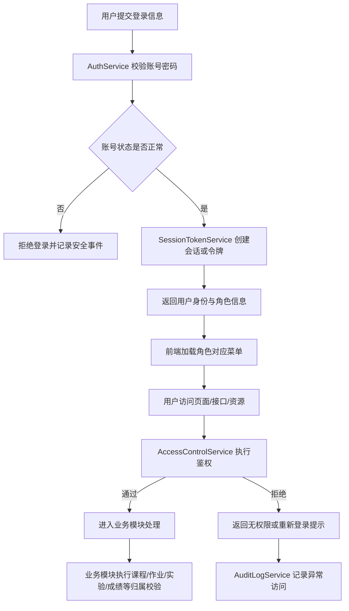
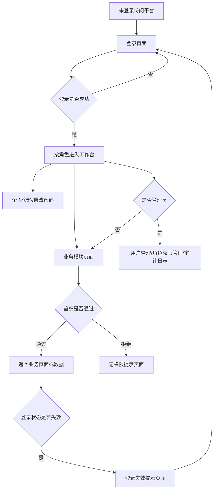
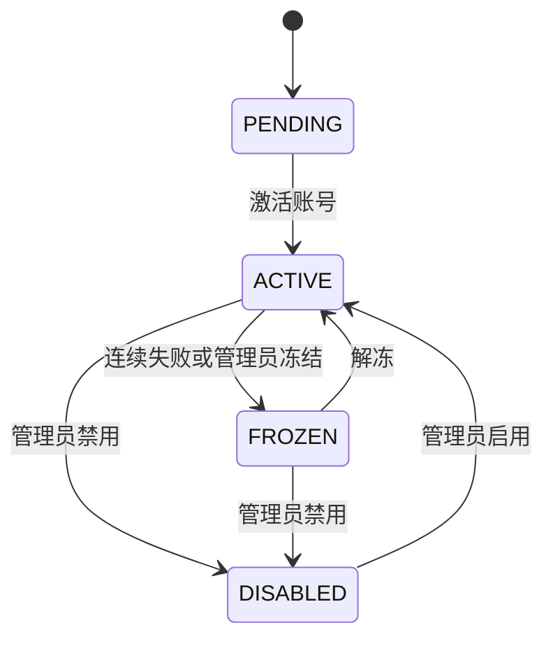
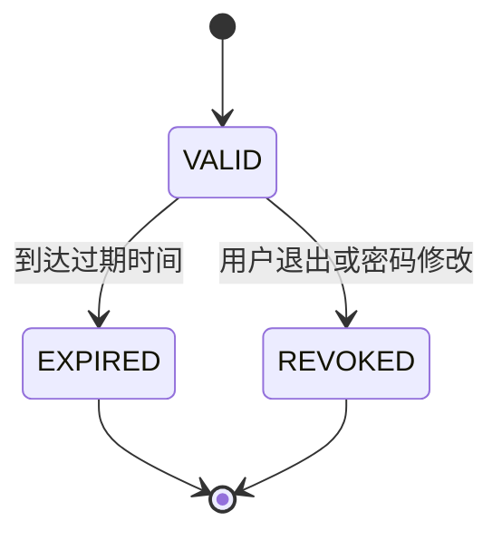

# 用户权限与平台安全模块概要设计提交稿（AUTH）

> 项目名称：在线教学与实训平台  
> 文档类型：概要设计模块提交稿  
> 提交模块：用户权限与平台安全模块（AUTH）  
> 适用总文档：《软件概要设计说明书》  
> 建议整合位置：2.5.1、2.6.1、3.1 AUTH 页面设计、3.2 AUTH 接口设计、3.3 AUTH 数据结构设计、4 AUTH 数据库设计、5 运行设计相关补充  
> 需求追踪来源：《用户权限与平台安全模块》需求文档中 FR-UA-01 ~ FR-UA-07、NFR-UA-01 ~ NFR-UA-05

---

## 0 编写说明与设计边界

本文档只描述用户权限与平台安全模块（AUTH）的概要设计。设计信息来自《用户权限与平台安全模块》需求文档，并参考当前协作底稿中对 AUTH 模块的分工要求。本文档不扩展为完整统一身份认证平台、校级账号中心或复杂安全运营系统。

首版设计目标是完成“用户注册/登录 -> 会话或令牌签发 -> 按角色加载功能入口 -> 页面和接口统一鉴权 -> 账号与密码安全管理 -> 关键操作审计 -> 权限异常处理”的闭环，并为课程、作业、实验、成绩、通知等业务模块提供统一的身份来源和权限校验基础。

### 0.1 本模块负责的内容

1. 支持学生、教师、管理员等平台用户的账号注册、登录、退出和登录状态维护。
2. 维护用户基础信息、账号状态、密码凭证和必要的安全字段。
3. 维护平台级角色、权限点、用户角色关系和角色权限关系。
4. 根据当前登录用户身份返回其可访问的功能菜单、页面入口和基础权限信息。
5. 为其他业务模块提供身份认证、角色校验、权限校验和当前用户上下文。
6. 处理会话过期、令牌失效、账号冻结、权限不足、越权访问等认证授权异常。
7. 对密码修改、角色变更、权限调整、登录失败、越权访问等关键事件记录审计日志。
8. 对登录、注册、密码修改、资源访问、文件上传等关键入口提供基础安全校验策略。

### 0.2 本模块不负责的内容

1. 不负责课程创建、课程成员维护、章节与资源管理，这部分由 CRS 模块负责。
2. 不负责作业发布、提交、自动评测和教师批阅，这部分由 HWK 模块负责。
3. 不负责实验任务、实验提交、实验评测和实验报告，这部分由 LAB 模块负责。
4. 不负责成绩项配置、成绩汇总、成绩发布和教学分析，这部分由 GRD 模块负责。
5. 不负责通知消息生成、展示、已读未读和通知偏好，这部分由 LRN 模块负责。
6. 不实现第三方 OAuth、短信网关、真实邮件服务、单点登录、多因素认证和安全态势分析平台。
7. 不直接判断具体业务数据是否归属某课程、某作业或某实验；AUTH 提供用户身份与通用权限，业务归属校验由对应模块结合业务数据完成。

### 0.3 与其他模块的协作关系

| 协作模块 | 协作内容 | AUTH 侧设计边界 |
| --- | --- | --- |
| CRS 课程与教学资源 | 课程教师、课程学生、课程资源访问边界 | AUTH 提供当前用户身份、平台角色和基础权限；课程成员关系由 CRS 维护。 |
| HWK 作业与自动评测 | 作业管理、提交、批阅接口鉴权 | AUTH 校验登录态和平台角色；作业是否属于当前课程、学生是否可提交由 HWK 结合 CRS 数据判断。 |
| LAB 实训实验模块 | 实验创建、提交、评测、报告访问鉴权 | AUTH 提供用户身份和角色；实验任务归属、实验记录归属由 LAB 判断。 |
| GRD 成绩评价与教学分析 | 成绩查看、成绩发布、成绩异议操作鉴权 | AUTH 保证学生、教师、管理员身份可信；GRD 不信任前端传入的操作者身份。 |
| LRN 学习过程与通知提醒 | 登录安全提示、账号异常、权限变更通知事件 | AUTH 可发送账号安全相关事件；通知生成和展示由 LRN 负责。 |

---

## 1 模块总体架构设计

### 1.1 设计原则

1. 统一身份来源：平台内所有需要登录的接口均从 AUTH 获取当前用户上下文，避免各业务模块自行解析和信任前端身份参数。
2. 前后端双重控制：前端根据权限隐藏不可用入口，后端仍必须对接口和资源访问进行鉴权。
3. 最小权限：学生、教师、管理员只获得完成业务所需的权限，默认不放行未明确授权的访问。
4. 职责分离：AUTH 负责平台级角色权限和认证授权，具体课程、作业、实验、成绩等业务范围由对应模块二次校验。
5. 可追踪：登录、退出、密码修改、角色调整、权限变更和越权访问等关键行为均保留审计记录。
6. 可验证：页面、接口、数据表和测试编号均追踪到 FR-UA-01 ~ FR-UA-07 与 NFR-UA-01 ~ NFR-UA-05。

### 1.2 模块内部组件划分

| 组件 | 主要职责 | 设计说明 |
| --- | --- | --- |
| AuthService | 登录、退出、会话创建和登录状态校验 | 负责账号密码校验、账号状态检查、登录失败计数和登录成功后的会话或令牌签发。 |
| UserService | 用户账号与基础信息维护 | 负责用户注册、用户资料查询与修改、账号启用禁用、密码凭证更新。 |
| RoleService | 角色维护与用户角色分配 | 负责学生、教师、管理员等角色定义，以及用户角色分配、调整和查询。 |
| PermissionService | 权限点与角色权限关系维护 | 负责菜单权限、接口权限、资源权限的权限点定义和角色权限绑定。 |
| AccessControlService | 统一鉴权与访问控制 | 负责页面、接口、资源访问的权限判断，为业务模块提供通用校验能力。 |
| SessionTokenService | 会话或令牌生命周期管理 | 负责令牌生成、刷新、失效、过期校验和退出登录后的令牌作废。 |
| PasswordSecurityService | 密码安全策略 | 负责密码哈希存储、修改密码校验、登录失败限制、弱密码基础校验。 |
| AuditLogService | 安全审计日志 | 负责记录登录、退出、密码修改、角色权限变更、越权访问等关键事件。 |
| SecurityPolicyService | 基础安全防护策略 | 负责输入合法性校验、非法请求拦截、关键接口限流策略建议和安全异常处理。 |

### 1.3 模块内部数据流

---

## 2 2.5.1 用户权限与平台安全模块功能需求设计

### 2.1 FR-UA-01 用户注册与登录（P0）

| 属性 | 描述 |
| --- | --- |
| 需求编号 | FR-UA-01 |
| 优先级 | P0（必须实现） |
| 涉及角色 | 学生、教师、管理员 |
| 核心功能 | 用户通过学号/工号、手机号、邮箱或系统指定账号完成注册与登录，登录成功后获得有效会话或访问令牌。 |
| 设计要点 | ① 注册时保存账号、用户类型、联系方式、密码哈希和账号状态，账号标识应保持唯一。 ② 登录时先校验账号是否存在、密码是否匹配、账号状态是否正常，再创建会话或令牌。 ③ 登录成功后返回用户基础信息、角色列表、权限摘要和令牌有效期。 ④ 退出登录时应作废当前会话或令牌，避免退出后继续访问需认证资源。 ⑤ 登录失败时不暴露账号是否存在等敏感细节，可统一提示账号或密码错误。 |

### 2.2 FR-UA-02 角色管理与权限分配（P0）

| 属性 | 描述 |
| --- | --- |
| 需求编号 | FR-UA-02 |
| 优先级 | P0（必须实现） |
| 涉及角色 | 管理员 |
| 核心功能 | 系统支持学生、教师、管理员三类基础角色，并允许管理员维护用户角色与角色权限。 |
| 设计要点 | ① 角色以独立数据表维护，首版预置 `STUDENT`、`TEACHER`、`ADMIN` 三类角色。 ② 权限点按菜单、接口、资源等类型组织，角色通过角色权限关系获得权限。 ③ 用户可拥有一个或多个角色，但默认业务身份应清晰，避免同一用户在普通页面中出现权限混乱。 ④ 管理员调整用户角色或角色权限前必须完成管理员权限校验。 ⑤ 角色和权限调整后应记录审计日志，并在必要时使相关用户重新加载权限信息。 |

### 2.3 FR-UA-03 身份认证与访问控制（P0）

| 属性 | 描述 |
| --- | --- |
| 需求编号 | FR-UA-03 |
| 优先级 | P0（必须实现） |
| 涉及角色 | 学生、教师、管理员、系统 |
| 核心功能 | 用户访问课程管理、作业管理、成绩管理、实验管理等核心业务功能前必须完成身份认证，并通过角色与权限校验。 |
| 设计要点 | ① 所有核心业务接口接入统一认证拦截器或鉴权中间件，缺失或无效认证信息时返回未登录结果。 ② 页面菜单展示依赖权限信息，但后端接口仍必须进行独立权限校验。 ③ 学生只能进入学习、提交、查看本人数据相关入口；教师只能进入课程教学管理入口；管理员进入平台维护入口。 ④ 当前登录用户身份由后端认证上下文提供，业务模块不得信任前端传入的 `user_id` 作为操作者身份。 ⑤ 对课程成员、作业归属、实验记录归属、成绩归属等业务范围，AUTH 提供当前用户身份，业务模块执行二次校验。 |

### 2.4 FR-UA-04 账号信息与密码安全（P0）

| 属性 | 描述 |
| --- | --- |
| 需求编号 | FR-UA-04 |
| 优先级 | P0（必须实现） |
| 涉及角色 | 学生、教师、管理员 |
| 核心功能 | 用户可维护个人基础信息和登录密码，系统保证密码不以明文形式存储，并对异常登录进行限制或提示。 |
| 设计要点 | ① 用户可修改昵称、联系方式、头像等个人资料，关键身份字段如学号/工号由管理员或导入流程维护。 ② 修改密码时必须校验原密码或有效身份凭据，并要求新旧密码不同。 ③ 密码只保存不可逆哈希值和必要盐值信息，不在接口响应、日志或页面中展示明文密码。 ④ 连续登录失败达到阈值后，可进行短时间锁定、验证码校验或安全提示，首版建议使用失败计数和锁定截止时间字段。 ⑤ 密码修改成功后记录审计日志，并可使旧会话失效以降低凭证泄露风险。 |

### 2.5 FR-UA-05 权限异常处理与安全提示（P1）

| 属性 | 描述 |
| --- | --- |
| 需求编号 | FR-UA-05 |
| 优先级 | P1（应实现） |
| 涉及角色 | 学生、教师、管理员、系统 |
| 核心功能 | 对无权限访问、登录状态失效、账号禁用冻结和认证信息无效等异常场景给出明确处理结果。 |
| 设计要点 | ① 未登录访问需认证页面或接口时，前端跳转登录页，接口返回统一未认证错误码。 ② 已登录但权限不足时，页面展示无权限提示，接口返回统一无权限错误码。 ③ 会话过期、令牌失效或令牌被作废时，系统要求用户重新登录。 ④ 冻结、禁用、异常状态账号不得继续登录或访问业务接口。 ⑤ 越权访问、异常令牌、频繁失败登录等安全异常应记录必要审计信息。 |

### 2.6 FR-UA-06 关键操作审计（P1）

| 属性 | 描述 |
| --- | --- |
| 需求编号 | FR-UA-06 |
| 优先级 | P1（应实现） |
| 涉及角色 | 管理员、系统 |
| 核心功能 | 系统记录登录、退出、角色变更、密码修改、权限调整、越权访问等关键安全操作，支持管理员查看必要审计记录。 |
| 设计要点 | ① 审计日志至少保存操作时间、操作用户、操作类型、操作对象、客户端信息、结果状态和失败原因。 ② 管理员可按操作人、操作类型、时间范围、结果状态查询安全审计日志。 ③ 审计日志不记录明文密码、完整令牌等敏感内容。 ④ 审计记录失败不应导致普通查询类业务中断，但关键权限变更操作应尽量保证变更和日志记录同时成功。 ⑤ 审计日志可为后续测试报告提供关键安全场景的验证依据。 |

### 2.7 FR-UA-07 平台基础安全防护（P1）

| 属性 | 描述 |
| --- | --- |
| 需求编号 | FR-UA-07 |
| 优先级 | P1（应实现） |
| 涉及角色 | 系统 |
| 核心功能 | 系统对登录、注册、密码修改、资源访问、文件上传和接口调用等场景进行基础安全校验，防止非法请求和参数篡改造成越权访问。 |
| 设计要点 | ① 对账号、手机号、邮箱、密码、昵称等输入字段进行格式和长度校验。 ② 对缺失认证信息、伪造令牌、过期令牌、越权请求进行统一拦截。 ③ 关键接口不允许仅依赖前端隐藏按钮实现权限控制，必须在服务端校验权限。 ④ 文件上传和资源访问场景应由业务模块校验资源归属，AUTH 提供当前用户身份和权限上下文。 ⑤ 对敏感错误信息进行统一包装，避免向用户暴露数据库、堆栈、令牌细节等内部信息。 |

---

## 3 2.6.1 用户权限与平台安全模块非功能需求设计

| 需求编号 | 需求描述 | 设计约束 |
| --- | --- | --- |
| NFR-UA-01 | 安全性 | 所有需认证功能必须校验登录态和权限；密码不得明文存储、展示或传输；后端接口必须防止未授权访问、越权访问和参数篡改。 |
| NFR-UA-02 | 可靠性 | 登录、退出、密码修改、角色调整等关键功能应稳定可用；认证服务异常时默认拒绝未授权请求，不允许默认放行。 |
| NFR-UA-03 | 可用性 | 登录、退出、修改密码、无权限、登录失效等流程提示清晰；不同角色登录后看到与身份匹配的功能入口。 |
| NFR-UA-04 | 性能 | 常规登录认证、权限校验和鉴权接口应尽量在 3 秒内响应；权限查询不应造成普通页面访问明显卡顿。 |
| NFR-UA-05 | 可测试性 | 能够验证学生、教师、管理员访问边界，覆盖登录成功、失败、会话失效、越权访问、密码修改、角色调整和审计日志记录。 |

---

## 4 3.1 用户接口：AUTH 页面设计

### 4.1 页面列表

| 页面 | 使用角色 | 主要功能 | 权限要求 |
| --- | --- | --- | --- |
| 登录页面 | 未登录用户 | 输入账号密码、提交登录、展示登录失败提示 | 无需登录 |
| 注册页面 | 未登录用户、管理员 | 用户自助注册或管理员创建账号入口 | 自助注册无需登录；管理员创建需管理员权限 |
| 个人资料页面 | 学生、教师、管理员 | 查看和修改昵称、联系方式、头像等个人基础信息 | 当前用户已登录 |
| 修改密码页面 | 学生、教师、管理员 | 输入原密码和新密码，完成密码修改 | 当前用户已登录 |
| 用户管理页面 | 管理员 | 查询用户、启用禁用账号、维护用户基础信息 | 管理员权限 |
| 角色管理页面 | 管理员 | 查看角色列表、角色说明和启用状态 | 管理员权限 |
| 权限分配页面 | 管理员 | 为角色配置菜单权限、接口权限和资源权限 | 管理员权限 |
| 用户角色分配页面 | 管理员 | 为指定用户分配或调整角色 | 管理员权限 |
| 安全审计日志页面 | 管理员 | 按时间、用户、操作类型、结果状态查询审计日志 | 管理员权限 |
| 无权限提示页面 | 已登录用户 | 展示无权限访问提示和返回入口 | 当前用户已登录 |
| 登录失效提示页面 | 登录失效用户 | 提示会话过期并引导重新登录 | 无有效登录态 |

### 4.2 页面流转图

### 4.3 页面交互要点

1. 登录失败提示应保持简洁，不直接区分“账号不存在”和“密码错误”。
2. 登录成功后根据角色加载菜单入口，学生、教师、管理员看到的入口应保持边界清晰。
3. 权限不足时应展示无权限提示，并提供返回首页或返回上一页入口。
4. 登录状态失效时应引导用户重新登录，避免继续停留在需要认证的数据页面。
5. 管理员调整用户角色或权限时，应展示影响范围并要求确认。
6. 审计日志查询默认按时间倒序展示，避免一次性加载过多记录。

---

## 5 3.2 接口设计：AUTH 模块 API 与跨模块接口

### 5.1 认证与会话接口

| 接口 | 方法 | 主要参数 | 返回内容 | 说明 |
| --- | --- | --- | --- | --- |
| `/api/auth/register` | POST | 账号、密码、用户类型、联系方式 | 注册结果、用户编号 | 首版可按项目需要选择是否开放自助注册。 |
| `/api/auth/login` | POST | 账号、密码 | 访问令牌、用户信息、角色权限摘要 | 登录前校验账号状态和失败次数。 |
| `/api/auth/logout` | POST | 当前令牌 | 退出结果 | 作废当前会话或令牌。 |
| `/api/auth/refresh` | POST | 刷新令牌或当前会话 | 新访问令牌、有效期 | 如首版不实现刷新令牌，可作为预留接口。 |
| `/api/auth/me` | GET | 当前令牌 | 当前用户、角色、权限摘要 | 业务模块和前端获取当前用户上下文。 |

### 5.2 用户与密码接口

| 接口 | 方法 | 主要参数 | 返回内容 | 说明 |
| --- | --- | --- | --- | --- |
| `/api/users/me` | GET | 当前令牌 | 个人资料 | 当前用户查看个人信息。 |
| `/api/users/me` | PUT | 昵称、联系方式、头像等 | 修改结果 | 不允许普通用户修改角色和账号状态。 |
| `/api/users/me/password` | PUT | 原密码、新密码 | 修改结果 | 修改成功后记录审计日志。 |
| `/api/admin/users` | GET | 关键词、角色、状态、分页参数 | 用户列表 | 管理员查询用户。 |
| `/api/admin/users` | POST | 账号、用户类型、初始角色 | 创建结果 | 管理员创建用户。 |
| `/api/admin/users/{user_id}/status` | PUT | 账号状态 | 修改结果 | 启用、禁用、冻结用户。 |

### 5.3 角色与权限接口

| 接口 | 方法 | 主要参数 | 返回内容 | 说明 |
| --- | --- | --- | --- | --- |
| `/api/admin/roles` | GET | 分页参数 | 角色列表 | 查询平台角色。 |
| `/api/admin/roles` | POST | 角色编码、名称、说明 | 创建结果 | 首版至少预置三类基础角色。 |
| `/api/admin/permissions` | GET | 权限类型、模块 | 权限点列表 | 查询菜单、接口、资源权限点。 |
| `/api/admin/roles/{role_id}/permissions` | PUT | 权限编号列表 | 修改结果 | 调整角色权限并记录审计日志。 |
| `/api/admin/users/{user_id}/roles` | PUT | 角色编号列表 | 修改结果 | 调整用户角色并记录审计日志。 |

### 5.4 鉴权与审计接口

| 接口 | 方法 | 主要参数 | 返回内容 | 说明 |
| --- | --- | --- | --- | --- |
| `/api/auth/check-permission` | POST | 权限编码、资源类型、资源编号 | 是否允许访问 | 供前端或业务模块做通用权限判断。 |
| `/api/admin/audit-logs` | GET | 操作人、操作类型、时间范围、结果状态、分页参数 | 审计日志列表 | 管理员查看安全审计记录。 |
| `/api/admin/security-events` | GET | 事件类型、风险等级、时间范围 | 安全事件列表 | 可作为审计日志的筛选视图。 |

### 5.5 跨模块鉴权契约

| 契约 | 内容 | 使用方 |
| --- | --- | --- |
| 当前用户上下文 | `user_id`、`username`、`user_type`、`roles`、`permissions`、`account_status` | CRS、HWK、LAB、GRD、LRN |
| 权限校验结果 | 是否通过、失败原因、建议错误码 | 所有业务模块 |
| 安全审计事件 | 操作用户、操作类型、操作对象、结果、客户端信息 | AUTH 内部和需要安全留痕的业务模块 |

业务模块调用 AUTH 能力时，应以当前认证上下文中的 `user_id` 作为操作者身份。涉及课程成员、作业提交、实验记录、成绩归属等业务数据访问时，业务模块需在 AUTH 鉴权通过后继续执行本模块的业务范围校验。

---

## 6 3.3 数据结构设计：AUTH 核心实体

### 6.1 User 用户实体

| 字段 | 说明 |
| --- | --- |
| `user_id` | 用户唯一编号 |
| `username` | 登录账号，可对应学号、工号或系统账号 |
| `user_type` | 用户类型，如学生、教师、管理员 |
| `display_name` | 用户显示名称 |
| `phone` | 手机号 |
| `email` | 邮箱 |
| `avatar_url` | 头像地址 |
| `password_hash` | 密码哈希 |
| `password_salt` | 密码盐或哈希参数 |
| `account_status` | 正常、禁用、冻结、待激活 |
| `failed_login_count` | 连续登录失败次数 |
| `locked_until` | 锁定截止时间 |
| `last_login_at` | 最近登录时间 |
| `created_at` / `updated_at` | 创建和更新时间 |

### 6.2 Role 角色实体

| 字段 | 说明 |
| --- | --- |
| `role_id` | 角色唯一编号 |
| `role_code` | 角色编码，如 `STUDENT`、`TEACHER`、`ADMIN` |
| `role_name` | 角色名称 |
| `description` | 角色说明 |
| `enabled` | 是否启用 |
| `created_at` / `updated_at` | 创建和更新时间 |

### 6.3 Permission 权限实体

| 字段 | 说明 |
| --- | --- |
| `permission_id` | 权限唯一编号 |
| `permission_code` | 权限编码 |
| `permission_name` | 权限名称 |
| `permission_type` | 权限类型：菜单、接口、资源、操作 |
| `module_code` | 所属模块，如 AUTH、CRS、HWK、LAB、GRD、LRN |
| `resource_pattern` | 接口路径、菜单路由或资源匹配表达式 |
| `enabled` | 是否启用 |

### 6.4 UserRole 用户角色关联实体

| 字段 | 说明 |
| --- | --- |
| `id` | 关联编号 |
| `user_id` | 用户编号 |
| `role_id` | 角色编号 |
| `assigned_by` | 分配人 |
| `assigned_at` | 分配时间 |

### 6.5 RolePermission 角色权限关联实体

| 字段 | 说明 |
| --- | --- |
| `id` | 关联编号 |
| `role_id` | 角色编号 |
| `permission_id` | 权限编号 |
| `assigned_by` | 分配人 |
| `assigned_at` | 分配时间 |

### 6.6 LoginSession 登录会话实体

| 字段 | 说明 |
| --- | --- |
| `session_id` | 会话编号 |
| `user_id` | 用户编号 |
| `token_id` | 令牌编号或会话标识 |
| `issued_at` | 签发时间 |
| `expires_at` | 过期时间 |
| `revoked_at` | 作废时间 |
| `client_ip` | 客户端 IP |
| `user_agent` | 客户端信息 |
| `status` | 有效、过期、已作废 |

### 6.7 AuditLog 审计日志实体

| 字段 | 说明 |
| --- | --- |
| `log_id` | 日志编号 |
| `operator_id` | 操作用户编号 |
| `operation_type` | 操作类型 |
| `target_type` | 操作对象类型 |
| `target_id` | 操作对象编号 |
| `result_status` | 成功、失败、拒绝 |
| `failure_reason` | 失败原因 |
| `client_ip` | 客户端 IP |
| `user_agent` | 客户端信息 |
| `created_at` | 记录时间 |

### 6.8 账号状态机

### 6.9 会话状态机

---

## 7 4 数据库设计：AUTH 模块建议表结构

### 7.1 t_auth_user 用户表

| 字段 | 类型 | 约束 | 说明 |
| --- | --- | --- | --- |
| `user_id` | bigint | PK | 用户编号 |
| `username` | varchar(64) | UNIQUE, NOT NULL | 登录账号 |
| `user_type` | varchar(32) | NOT NULL | 用户类型 |
| `display_name` | varchar(64) | NOT NULL | 显示名称 |
| `phone` | varchar(32) |  | 手机号 |
| `email` | varchar(128) |  | 邮箱 |
| `avatar_url` | varchar(255) |  | 头像地址 |
| `password_hash` | varchar(255) | NOT NULL | 密码哈希 |
| `password_salt` | varchar(128) |  | 密码盐或哈希参数 |
| `account_status` | varchar(32) | NOT NULL | 账号状态 |
| `failed_login_count` | int | DEFAULT 0 | 连续登录失败次数 |
| `locked_until` | datetime |  | 锁定截止时间 |
| `last_login_at` | datetime |  | 最近登录时间 |
| `created_at` | datetime | NOT NULL | 创建时间 |
| `updated_at` | datetime | NOT NULL | 更新时间 |

### 7.2 t_auth_role 角色表

| 字段 | 类型 | 约束 | 说明 |
| --- | --- | --- | --- |
| `role_id` | bigint | PK | 角色编号 |
| `role_code` | varchar(64) | UNIQUE, NOT NULL | 角色编码 |
| `role_name` | varchar(64) | NOT NULL | 角色名称 |
| `description` | varchar(255) |  | 角色说明 |
| `enabled` | tinyint | NOT NULL | 是否启用 |
| `created_at` | datetime | NOT NULL | 创建时间 |
| `updated_at` | datetime | NOT NULL | 更新时间 |

### 7.3 t_auth_permission 权限表

| 字段 | 类型 | 约束 | 说明 |
| --- | --- | --- | --- |
| `permission_id` | bigint | PK | 权限编号 |
| `permission_code` | varchar(128) | UNIQUE, NOT NULL | 权限编码 |
| `permission_name` | varchar(128) | NOT NULL | 权限名称 |
| `permission_type` | varchar(32) | NOT NULL | 菜单、接口、资源、操作 |
| `module_code` | varchar(32) | NOT NULL | 所属模块 |
| `resource_pattern` | varchar(255) |  | 路径或资源匹配规则 |
| `enabled` | tinyint | NOT NULL | 是否启用 |
| `created_at` | datetime | NOT NULL | 创建时间 |
| `updated_at` | datetime | NOT NULL | 更新时间 |

### 7.4 t_auth_user_role 用户角色关联表

| 字段 | 类型 | 约束 | 说明 |
| --- | --- | --- | --- |
| `id` | bigint | PK | 关联编号 |
| `user_id` | bigint | FK, NOT NULL | 用户编号 |
| `role_id` | bigint | FK, NOT NULL | 角色编号 |
| `assigned_by` | bigint |  | 分配人 |
| `assigned_at` | datetime | NOT NULL | 分配时间 |

### 7.5 t_auth_role_permission 角色权限关联表

| 字段 | 类型 | 约束 | 说明 |
| --- | --- | --- | --- |
| `id` | bigint | PK | 关联编号 |
| `role_id` | bigint | FK, NOT NULL | 角色编号 |
| `permission_id` | bigint | FK, NOT NULL | 权限编号 |
| `assigned_by` | bigint |  | 分配人 |
| `assigned_at` | datetime | NOT NULL | 分配时间 |

### 7.6 t_auth_session 登录会话表

| 字段 | 类型 | 约束 | 说明 |
| --- | --- | --- | --- |
| `session_id` | bigint | PK | 会话编号 |
| `user_id` | bigint | FK, NOT NULL | 用户编号 |
| `token_id` | varchar(128) | UNIQUE, NOT NULL | 令牌标识 |
| `issued_at` | datetime | NOT NULL | 签发时间 |
| `expires_at` | datetime | NOT NULL | 过期时间 |
| `revoked_at` | datetime |  | 作废时间 |
| `client_ip` | varchar(64) |  | 客户端 IP |
| `user_agent` | varchar(255) |  | 客户端信息 |
| `status` | varchar(32) | NOT NULL | 会话状态 |

### 7.7 t_auth_audit_log 审计日志表

| 字段 | 类型 | 约束 | 说明 |
| --- | --- | --- | --- |
| `log_id` | bigint | PK | 日志编号 |
| `operator_id` | bigint |  | 操作用户 |
| `operation_type` | varchar(64) | NOT NULL | 操作类型 |
| `target_type` | varchar(64) |  | 操作对象类型 |
| `target_id` | varchar(64) |  | 操作对象编号 |
| `result_status` | varchar(32) | NOT NULL | 操作结果 |
| `failure_reason` | varchar(255) |  | 失败原因 |
| `client_ip` | varchar(64) |  | 客户端 IP |
| `user_agent` | varchar(255) |  | 客户端信息 |
| `created_at` | datetime | NOT NULL | 记录时间 |

---

## 8 5 运行设计补充：核心业务流程

### 8.1 用户登录流程

1. 用户进入登录页面，输入账号和密码。
2. 前端提交登录请求到 `/api/auth/login`。
3. AuthService 查询账号并校验账号状态。
4. PasswordSecurityService 校验密码哈希是否匹配。
5. 若校验失败，更新登录失败计数，必要时锁定账号，并记录失败日志。
6. 若校验成功，清空失败计数，SessionTokenService 创建会话或访问令牌。
7. 系统返回当前用户基础信息、角色信息、权限摘要和令牌有效期。
8. 前端根据角色权限加载对应工作台和功能菜单。

### 8.2 接口鉴权流程

1. 用户携带访问令牌请求业务接口。
2. 认证拦截器解析令牌并校验有效期、签名和会话状态。
3. AccessControlService 根据接口权限点和用户角色权限判断是否允许访问。
4. 未登录或令牌失效时返回未认证结果。
5. 权限不足时返回无权限结果，并记录必要安全事件。
6. 鉴权通过后，将当前用户上下文传递给业务模块。
7. 业务模块继续校验课程、作业、实验、成绩等业务数据归属。

### 8.3 角色权限调整流程

1. 管理员进入用户角色分配或角色权限分配页面。
2. 系统校验当前操作者是否具备管理员权限。
3. 管理员选择目标用户或目标角色，并提交调整请求。
4. RoleService 或 PermissionService 校验角色、权限点和用户是否存在且可用。
5. 系统更新用户角色关系或角色权限关系。
6. AuditLogService 记录调整前后关键信息、操作人和操作结果。
7. 相关用户下次访问时重新加载权限信息；如需要，可使其当前会话重新认证。

### 8.4 修改密码流程

1. 用户进入修改密码页面。
2. 用户输入原密码、新密码并提交。
3. 系统校验当前登录态和原密码。
4. PasswordSecurityService 校验新密码格式和安全要求。
5. 系统保存新密码哈希，不保存明文密码。
6. AuditLogService 记录密码修改事件。
7. 系统可作废该用户其他旧会话，并提示用户重新登录或继续使用当前会话。

### 8.5 越权访问拦截流程

1. 用户访问未授权页面、接口或资源。
2. 前端路由或菜单权限可先进行入口限制。
3. 后端鉴权拦截器执行最终权限校验。
4. 若用户缺少对应权限，系统返回无权限错误码。
5. 前端展示无权限提示页面。
6. AuditLogService 对必要的越权访问记录操作人、目标资源、客户端信息和拒绝原因。

---

## 9 异常处理设计

| 异常场景 | 处理策略 | 用户提示或接口结果 |
| --- | --- | --- |
| 账号或密码错误 | 增加失败计数，达到阈值后限制登录 | 账号或密码错误 |
| 账号不存在 | 不暴露账号存在性，按登录失败处理 | 账号或密码错误 |
| 账号被冻结或禁用 | 拒绝登录和业务访问，记录审计日志 | 账号状态异常，请联系管理员 |
| 登录状态失效 | 拒绝访问需认证资源 | 登录已失效，请重新登录 |
| 权限不足 | 拒绝页面、接口或资源访问 | 无权限访问 |
| 令牌伪造或无效 | 拒绝访问并记录安全事件 | 认证信息无效 |
| 参数篡改访问他人数据 | AUTH 拦截通用权限，业务模块拦截数据归属 | 无权限访问 |
| 角色或权限配置异常 | 拒绝相关操作并提示管理员检查配置 | 权限配置异常 |
| 审计日志记录失败 | 普通查询不中断，关键权限变更应回滚或提示失败 | 操作失败或稍后重试 |

---

## 10 安全与权限设计

### 10.1 角色权限边界

| 角色 | 允许访问范围 | 禁止访问范围 |
| --- | --- | --- |
| 学生 | 本人课程学习、本人作业提交、本人实验记录、本人成绩、本人通知和个人资料 | 教师课程管理、管理员后台、他人作业/实验/成绩、全局用户权限管理 |
| 教师 | 本人负责课程的教学管理、课程下作业和实验管理、授权课程成绩管理、个人资料 | 非本人授权课程的教学数据、管理员权限分配、平台全局安全审计配置 |
| 管理员 | 用户管理、角色权限管理、账号状态维护、安全审计查看、平台基础维护 | 不应绕过业务规则直接篡改课程、作业、实验、成绩业务数据 |

### 10.2 鉴权策略

1. 未登录用户只能访问登录、注册、公开说明等无需认证页面。
2. 登录用户访问页面时，前端根据权限摘要控制菜单和按钮展示。
3. 后端接口以权限点为最小鉴权单位，禁止仅依赖前端控制。
4. 业务模块接口默认需要登录态，特殊公开接口需明确标记。
5. 对资源下载、文件访问、成绩查看等敏感场景，必须结合业务模块进行数据归属校验。

### 10.3 密码与令牌安全

1. 密码只保存哈希结果，不在日志、响应体、审计详情中写入明文。
2. 登录成功后签发有过期时间的会话或令牌。
3. 退出登录、密码修改、账号禁用后，应作废相关会话或令牌。
4. 令牌解析失败、过期、被作废时，系统统一按未认证处理。
5. 连续登录失败应触发限制策略，降低暴力破解风险。

### 10.4 审计与日志安全

1. 审计日志记录安全关键行为，但不记录明文密码、完整令牌等敏感信息。
2. 审计日志查询仅面向管理员开放，并支持按条件筛选。
3. 越权访问、令牌异常、登录失败次数过多等事件应保留必要排查信息。
4. 关键权限变更日志应包含操作人、目标用户或角色、结果状态和时间。

---

## 11 需求追踪与测试关注点

### 11.1 需求到设计映射

| 需求编号 | 概要设计覆盖位置 | 测试关注点 |
| --- | --- | --- |
| FR-UA-01 | 2.1、5.1、8.1 | 注册、登录成功、登录失败、退出登录、令牌失效 |
| FR-UA-02 | 2.2、5.3、8.3、10.1 | 角色创建、用户角色分配、角色权限调整、管理员边界 |
| FR-UA-03 | 2.3、5.4、8.2、10.2 | 页面鉴权、接口鉴权、学生/教师/管理员访问边界 |
| FR-UA-04 | 2.4、5.2、8.4、10.3 | 个人资料修改、密码修改、密码非明文、失败登录限制 |
| FR-UA-05 | 2.5、9 | 无权限访问、登录失效、账号冻结、令牌无效 |
| FR-UA-06 | 2.6、5.4、6.7、7.7、10.4 | 登录日志、角色变更日志、密码修改日志、越权访问日志 |
| FR-UA-07 | 2.7、9、10 | 输入校验、非法请求拦截、参数篡改防护、资源访问校验 |
| NFR-UA-01 | 3、10 | 安全策略完整性、密码和令牌保护 |
| NFR-UA-02 | 3、8、9 | 认证服务异常不默认放行、关键功能稳定 |
| NFR-UA-03 | 3、4 | 交互提示清晰、角色菜单匹配 |
| NFR-UA-04 | 3、5 | 登录和鉴权响应时间、权限查询效率 |
| NFR-UA-05 | 3、11.2 | 三类角色边界和关键安全场景可测试 |

### 11.2 验收关注点

1. 学生登录后只能访问本人学习、提交、成绩等数据，不能进入教师管理页或管理员后台。
2. 教师登录后只能管理本人负责或被授权课程范围内的教学数据。
3. 管理员可以维护用户、角色、权限和账号状态，并记录审计日志。
4. 未登录、令牌过期、令牌无效时，所有需认证接口均拒绝访问。
5. 前端隐藏无权限入口的同时，后端接口仍能拒绝越权请求。
6. 用户修改密码后，密码不以明文形式存储或返回。
7. 连续多次登录失败后，系统执行限制策略或安全提示。
8. 登录、退出、密码修改、角色调整、权限调整、越权访问等关键事件可在审计日志中查询。

---

## 12 提交给概要设计负责人的整合建议

1. 建议将本文档第 2 章整合到总概要设计说明书 `2.5.1 用户权限与平台安全（AUTH）`。
2. 建议将本文档第 3 章整合到 `2.6.1 AUTH 非功能需求`。
3. 建议将本文档第 4 章整合到 `3.1 用户接口` 中的 AUTH 页面设计。
4. 建议将本文档第 5 章整合到 `3.2 外部接口` 中的 AUTH 模块 API 列表和跨模块鉴权说明。
5. 建议将本文档第 6 章整合到 `3.3 系统数据结构设计`。
6. 建议将本文档第 7 章整合到 `4 用户权限模块数据表（AUTH）`。
7. 建议将本文档第 8 ~ 10 章作为 `5 运行设计` 中认证、鉴权、异常处理和安全策略的补充内容。
8. 当前需求文档使用 `FR-UA` / `NFR-UA` 编号，模块缩写使用 `AUTH`。如总文档统一使用 `FR-AUTH`，建议在整合阶段建立编号映射，避免需求追踪断裂。

---

## 13 模块提交结论

用户权限与平台安全模块概要设计已覆盖功能需求、非功能需求、页面设计、接口设计、核心数据结构、数据库表结构、运行流程、异常处理、安全策略和需求追踪关系。本文档可作为 AUTH 模块提交稿交由概要设计负责人整合进《软件概要设计说明书》。

## 14 D2 业务场景闭环补充

### 14.1 业务场景清单与分类

按 Issue #261 盘点，AUTH 模块确认 11 个独立业务场景（本地编号 `SC-AUTH-01` ~ `SC-AUTH-11`），其余为 `include` 公共子流程或备选/异常路径，不新增正式 UC 编号；详细清单与映射见 `docs/过程/测试/TST-DOC-02-AUTH-业务场景清单与测试闭环.md`。

| 场景 | 名称 | include 公共子流程 | 备选/异常路径 |
| --- | --- | --- | --- |
| SC-AUTH-01 | 学生自助注册 | C1 账号与密码校验 | E1 账号已存在；E6 输入校验失败 |
| SC-AUTH-02 | 账号密码登录 | C1；C2 会话签发与校验；C3 角色菜单加载；C4 审计写入 | E1 错误凭据；E2 禁用/冻结；E3 失败锁定 |
| SC-AUTH-03 | 退出登录 | C2；C4 | E4 令牌失效 |
| SC-AUTH-04 | 持续鉴权与当前用户上下文 | C2；C5 统一认证与权限拦截 | E4；E5 越权访问；E2 |
| SC-AUTH-05 | 个人资料查看与修改 | C1（格式校验） | E6 |
| SC-AUTH-06 | 修改密码 | C1；C2；C4 | E6；原密码错误；新旧密码相同 |
| SC-AUTH-07 | 管理员用户与账号状态管理 | C2；C4；C5 | E5；目标用户不存在 |
| SC-AUTH-08 | 用户角色分配 | C4；C5 | E5；用户/角色不可用 |
| SC-AUTH-09 | 角色与角色权限维护 | C4；C5 | E5；角色/权限不可用 |
| SC-AUTH-10 | 安全异常拦截 | C2；C4；C5 | E2、E3、E4、E5 |
| SC-AUTH-11 | 关键操作审计写入与查询 | C4；C5 | E7 审计写入失败 |

### 14.2 概要层图组

概要层组件级顺序图与状态图/活动图已整合进《软件概要设计说明书》5.1.2 节：SC-AUTH-01 ~ SC-AUTH-11 对应图 5-2 ~ 5-12，账号/会话与跨场景状态/活动图对应图 5-13 ~ 5-17，SC-AUTH-05 个人资料、SC-AUTH-11 审计写入与查询的专属组件活动图对应图 5-18 ~ 5-19。组件名称对齐当前实现：`AuthController`、`UserProfileController`、`AuthAdminController`、`AuthService`、`RoleService`、`PasswordSecurityService`、`SessionTokenService`、`AuthAuditService`、`AccessControlService`、`AuthRequiredInterceptor`、`TokenCurrentUserProvider`、`AuthRepository`。

### 14.3 三层图完整映射

需求层（SRS 4.17）、概要层（概要设计说明书 5.1.2）、详细层（详细设计说明书 3.1 详细层业务场景图组）的完整图号映射见 `docs/过程/测试/TST-DOC-02-AUTH-业务场景清单与测试闭环.md` 第 3 章。
