# 评测服务拆分设计与迁移边界

> 关联 Issue：[ARCH-LAB #279](https://github.com/Cr4zyorange/OnlineJudge/issues/279)
>
> 设计状态：目标架构，尚未实施服务拆分
> LAB 功能与验证基线：[D2-LAB #265](https://github.com/Cr4zyorange/OnlineJudge/pull/275)

## 1. 目标与边界

本设计为小学期后半段的微服务改造提供 LAB 侧输入。当前系统仍是模块化单体；本文件不改变现有运行时代码、数据库、公开 REST API、状态枚举或共享 E2E runner。

目标架构包含四个业务服务：

| 服务 | 当前模块 | 负责内容 | 数据所有权 |
| --- | --- | --- | --- |
| 身份服务 | AUTH | 登录、会话、角色、权限和认证主体 | DB-AUTH-* |
| 课程服务 | CRS | 课程、章节、资源、成员和课程管理权限 | DB-CRS-* |
| 评测服务 | LAB、HWK | 实验/作业发布、提交、评测、附件/报告、评分、统计和来源成绩 | DB-LAB-01 ~ DB-LAB-09、DB-HWK-01 ~ DB-HWK-08 |
| 学习与成绩服务 | LRN、GRD | 学习任务、通知、成绩项、总评、发布和分析 | DB-LRN-*、DB-GRD-* |

API 网关、数据库、文件存储、Docker、CI/CD 和 Kubernetes 是基础设施，不计入业务服务数量。评测执行器是评测服务的内部组件，不拆成独立业务服务。

图 2-6 评测服务目标边界图。可编辑 Mermaid 源位于 `docs/diagrams/fig_2_6_assessment_service_boundary.mmd`。

## 2. 评测服务职责

### 2.1 LAB 业务范围

评测服务保留现有 `UC-LAB-01` 与 `UC-LAB-02` 的完整闭环，覆盖 `API-LAB-01 ~ API-LAB-19`、`DB-LAB-01 ~ DB-LAB-09` 与 `TC-LAB-01 ~ TC-LAB-41`：

| 领域 | 服务职责 | 迁移后仍保持的外部契约 |
| --- | --- | --- |
| 实验与测试用例 | 创建、编辑、发布、截止、成绩发布，管理公开/隐藏用例 | 现有 `/api/v1/courses/{courseId}/labs` 与 `/api/v1/labs/**` 路径、请求和响应不变 |
| 提交、源文件与报告 | 保存版本、可信资产、报告版本和受控下载 | `API-LAB-08/10/16/17/19`；不暴露 storage key、内部状态或下载 URL |
| 自动评测 | 受理任务、运行 Docker/Fake 沙箱、保存用例结果与评测终态 | `PENDING/RUNNING/ACCEPTED/WRONG_ANSWER/COMPILE_ERROR/RUNTIME_ERROR/TIME_LIMIT_EXCEEDED/SYSTEM_ERROR` 不变 |
| 评分与统计 | 教师评分、评分变更、结果展示、统计与成绩发布 | `API-LAB-13/14/18` 和发布前后的可见性规则不变 |
| 成绩来源 | 向学习与成绩服务提供已发布实验的来源成绩 | `SourceGradeDTO` 字段和仅 `SCORE_PUBLISHED/ARCHIVED` 可同步的规则不变 |

### 2.2 数据与基础能力归属

评测服务独占以下数据。其他服务只可保留 `courseId`、`userId`、`labId` 或 `homeworkId` 等逻辑引用，禁止跨服务直接查询或写入这些表。

| 数据域 | 归属表 | 说明 |
| --- | --- | --- |
| LAB | `lab_experiment`、`lab_testcase`、`lab_submission`、`lab_evaluation`、`lab_score`、`lab_report`、`lab_score_change_log`、`lab_evaluation_result`、`lab_submission_source_file` | 对应 DB-LAB-01 ~ DB-LAB-09；文件资产与提交版本、授权和补偿语义必须整体迁移 |
| HWK | `t_hwk_homework`、`t_hwk_question`、`t_hwk_test_case`、`t_hwk_submission`、`t_hwk_evaluation`、`t_hwk_review_log`、`t_hwk_judge_config`、`t_hwk_submission_attachment` | 对应 DB-HWK-01 ~ DB-HWK-08；附件状态和评测/批阅历史必须整体迁移 |
| 评测内核 | `EvaluationTask`、`Evaluator`、`SandboxExecutor`、`EvaluationResult` 及 Fake/Docker 实现 | 作为评测服务内部共享库，继续按 `module=LAB/HWK` 区分业务规则 |
| 文件存储 | 文件存储适配器与运行卷 | 由评测服务调用；`storageKey` 仅服务端和所属资产表可见，不形成独立的业务服务 |

## 3. 服务间契约

| 调用方向 | 契约 | 调用时机 | 失败处理 |
| --- | --- | --- | --- |
| 评测服务 -> 课程服务 | `CoursePermissionClient.canManageCourse`、`isCourseMember`、`listCourseStudentIds`、`listCourseTeacherIds` | 创建/发布、学生提交、受控下载、评分和统计 | 权限或成员校验失败时拒绝操作；不读取课程服务表作为降级路径 |
| 评测服务 -> 学习与成绩服务 | `NotificationEventPublisher.publish(NotificationEvent)` | 保持现有 `LAB_EXPERIMENT_PUBLISHED`、`LAB_SUBMISSION_SCORED`、`EXPERIMENT_SCORE_PUBLISHED`、`HOMEWORK_PUBLISHED`、`HOMEWORK_SCORE_PUBLISHED` 事件不变；后续若补齐 HWK 评测完成通知，使用既有命名约定新增 `HOMEWORK_EVALUATION_FINISHED` | 使用既有 `idempotencyKey` 去重；投递失败记录可诊断错误，不回滚已完成的 LAB/HWK 业务事务 |
| 学习与成绩服务 -> 评测服务 | `SourceGradeClient.findSourceGrades(courseId, sourceType, sourceId)` | GRD 同步已发布 LAB/HWK 成绩 | 仅返回已发布或归档的来源成绩；失败不得由 GRD 直接读取评测服务表补偿 |

服务化实施时，上述 Java 接口分别替换为认证后的内部 HTTP 客户端或事件投递适配器，保留相同语义与字段。身份服务仍提供认证主体；评测服务不得信任浏览器请求体中伪造的 `userId`、角色或课程权限。

## 4. 迁移顺序与兼容约束

1. 在模块化单体内先收敛评测服务入口：LAB/HWK 只通过评测内核、课程权限、通知与来源成绩四类接口访问外部能力，移除任何跨模块 Repository 依赖。
2. 为评测服务建立独立构建、测试和部署单元；先以当前 MySQL 实例中的独立 `assessment` Schema 承载 DB-LAB 与 DB-HWK 表，表名、主键、约束和数据保持不变。
3. 由 API 网关将现有 `/api/v1/labs/**`、`/api/v1/homeworks/**`、`/api/v1/submissions/**` 与 `/api/v1/evaluations/**` 路由到评测服务；前端不感知服务地址变化。
4. 将 `CoursePermissionClient`、`NotificationEventPublisher`、`SourceGradeClient` 换为跨服务实现后，先通过契约测试和全量业务 E2E，再停止单体内直连实现。
5. 数据迁移、网关切流和回滚必须在独立功能 Issue 中实施；本 Issue 不创建 Schema、迁移脚本或部署配置。

迁移期间禁止更改 API-LAB、API-HWK、`SourceGradeDTO`、`NotificationEvent`、评测状态枚举、文件下载授权顺序和隐藏测试用例可见性。任何新增字段需保持向后兼容，并同步更新契约测试与三层设计文档。

## 5. 回归基线与验收

| 验收面 | 当前基线 | 后续服务抽取完成条件 |
| --- | --- | --- |
| LAB 业务闭环 | #275 的教师发布 -> 学生提交/评测/报告 -> 教师评分/发布 -> 学生查看结果 Playwright E2E | 同一 E2E 通过 API 网关运行，公开/隐藏用例、截止、权限、统计和 API-LAB-19 行为不变 |
| Docker 评测 | `DockerSandboxExecutorTest` 覆盖 AC、编译错误、运行错误、超时、内存限制和容器清理 | 评测服务镜像可执行相同矩阵，且无 `oj-lab-` 残留容器 |
| 数据与授权 | TC-LAB-34 ~ 41、TC-HWK 附件/受控下载用例 | 独立 Schema 下唯一约束、事务补偿、资产归属和跨课程拒绝行为不变 |
| 跨模块 | LAB/HWK 发布、评分和来源成绩现有集成测试 | 课程权限、通知事件和 `SourceGradeDTO` 仅经服务契约完成，不存在跨服务 SQL |

本设计完成后的检查命令为 Mermaid 渲染、`git diff --check` 和文档引用核对。实际服务抽取完成后，再运行各服务单元/API/集成测试、全量业务 E2E、Compose/Kind 部署验证和故障回归。

## 6. 本次边界

- 本文件不修改三份 `docs/最终提交/` 主文档。AUTH、CRS、LRN、LAB、HWK、GRD 的闭环 PR 正在并行修改这些文件，最终汇总由概要设计整合任务在各 PR 合并后完成。
- GitHub Actions + Kind、服务镜像、Kubernetes YAML、HPA、故障处理和性能对比属于后续 DevOps/微服务实施 Issue。
- 项目负责人决定 #275 的终审与合并；本设计仅将该 PR 作为 LAB 当前实现与测试证据基线。
