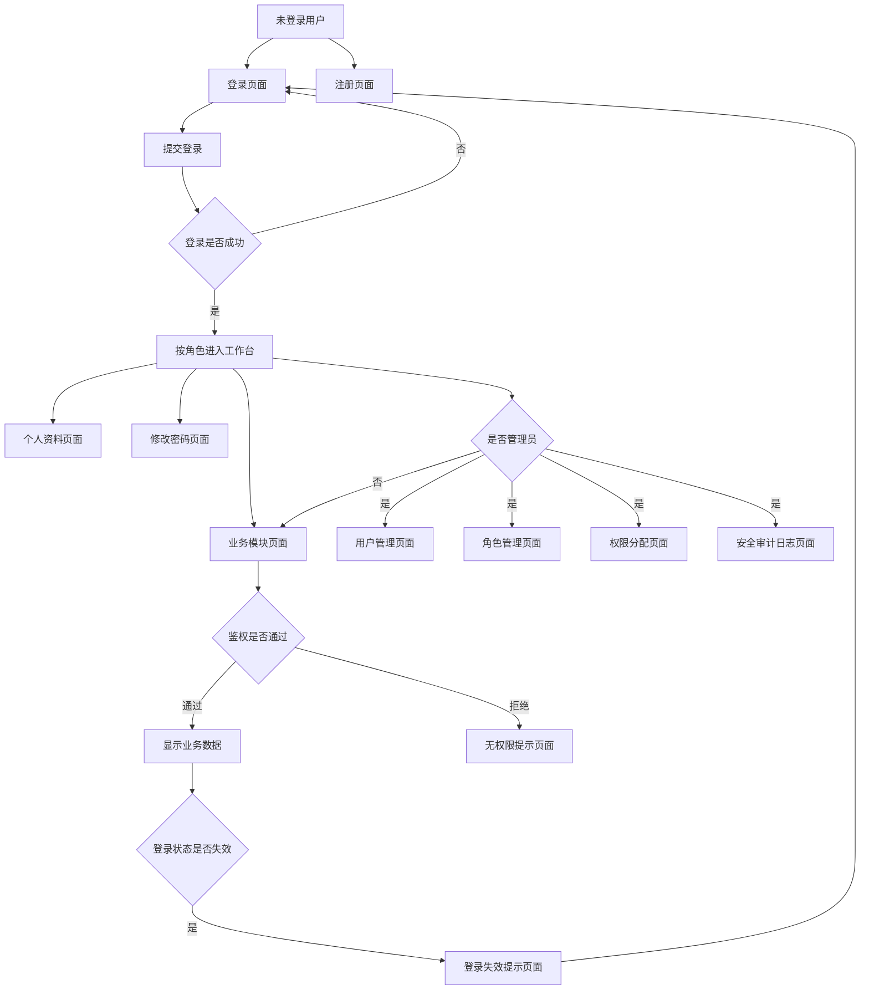
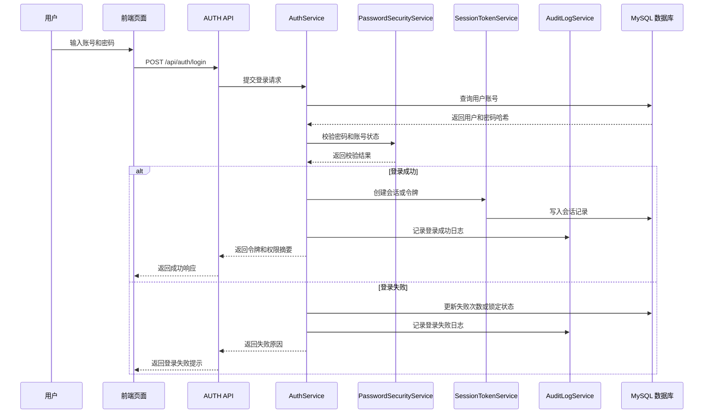
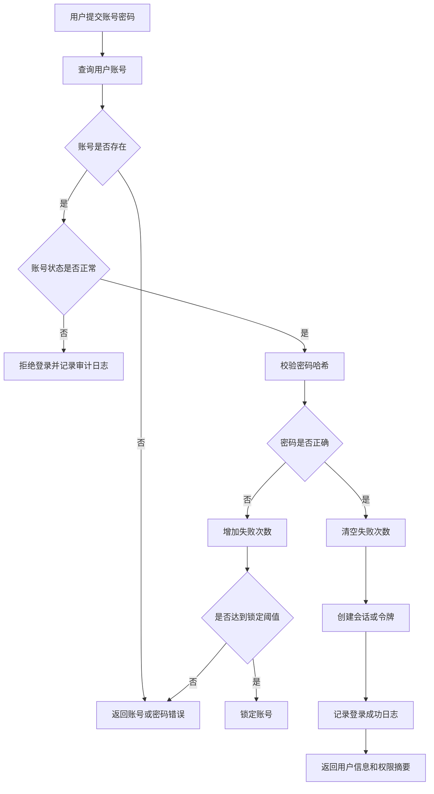
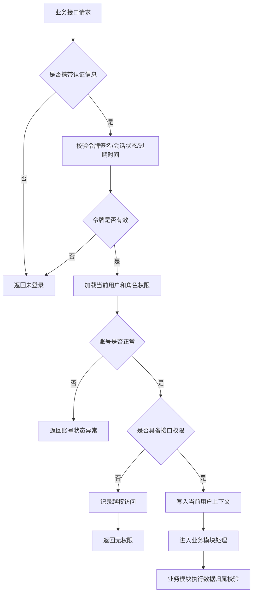
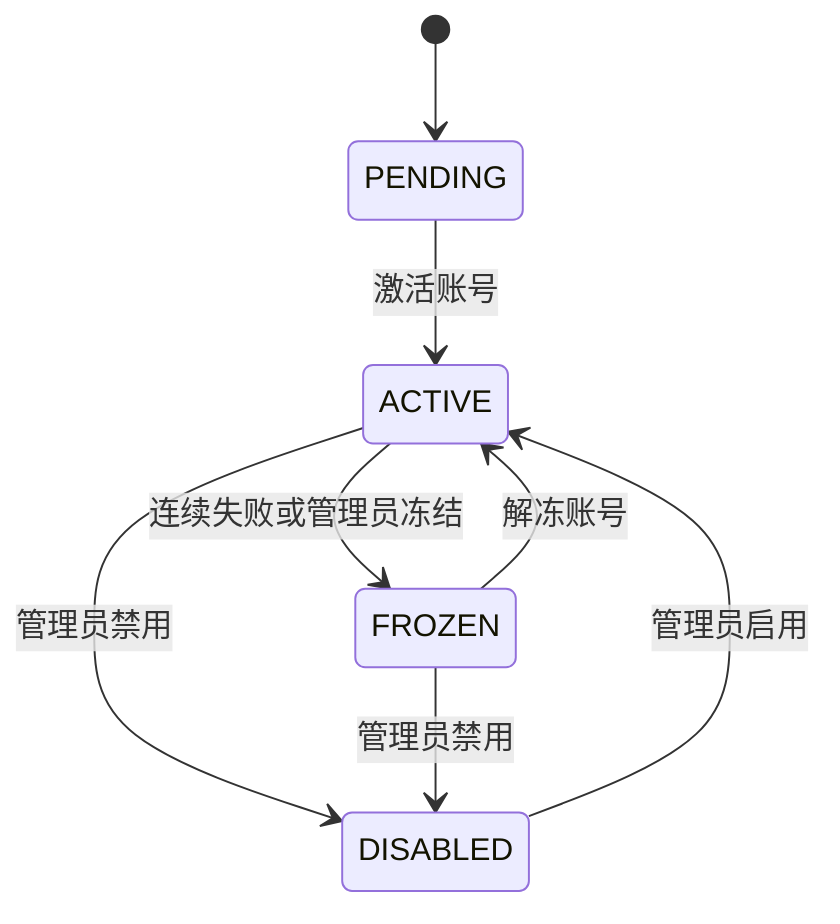
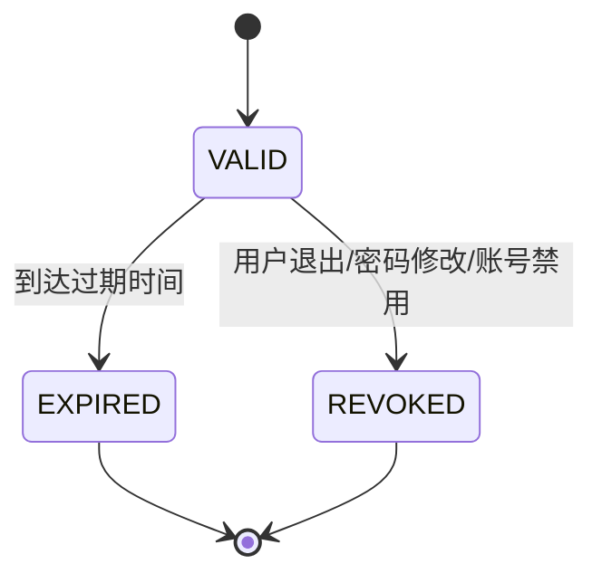

# 用户权限与平台安全模块详细设计提交稿（AUTH）

## 0 编写说明与设计边界

本文档为用户权限与平台安全模块（AUTH）的独立详细设计提交稿，供详细设计负责人后续合并至《软件详细设计说明书》第 3.1、4、5、6、7、9 章相关位置。本文档严格依据《软件详细设计说明书.md》和《详细设计—各模块负责人分工.md》的提交要求编写，不直接修改主说明书。

本模块对应需求范围为 `FR-UA-01 ~ FR-UA-07`、`NFR-UA-01 ~ NFR-UA-05`，测试编号前缀为 `TC-UA`。本模块负责平台级身份认证、角色权限、访问控制、账号安全、会话管理和关键操作审计，为 CRS、LRN、LAB、HWK、GRD 等业务模块提供统一的用户身份和基础权限能力。

本模块不负责课程、实验、作业、成绩、通知等业务数据的创建和维护。涉及“当前用户是否属于某课程”“是否可访问某次作业/实验/成绩”等业务归属判断时，AUTH 只提供当前用户上下文和平台级角色权限，具体业务范围由对应模块结合自身数据二次校验。

## 1 模块基本信息

| 项目 | 内容 |
| --- | --- |
| 模块编号 | DSD-AUTH |
| 模块名称 | 用户权限与平台安全模块 |
| 模块缩写 | AUTH |
| 主责角色 | 后端总设计师 / 用户权限与平台安全模块负责人 |
| 对应需求 | FR-UA-01 ~ FR-UA-07 / NFR-UA-01 ~ NFR-UA-05 |
| 依赖模块 | 无基础业务依赖 |
| 被依赖模块 | CRS、LRN、LAB、HWK、GRD |
| 主要交付 | 页面设计、API 设计、服务设计、数据表设计、登录流程、鉴权流程、账号状态机、异常与审计、需求追踪 |

## 2 模块职责与依赖关系

### 2.1 本模块负责的内容

1. 用户注册、登录、退出和登录状态维护。
2. 用户基础信息维护，包括昵称、联系方式、头像、账号状态等。
3. 密码安全管理，包括密码哈希存储、修改密码、登录失败限制。
4. 角色管理，包括学生、教师、管理员等角色维护。
5. 权限管理，包括菜单权限、接口权限、操作权限和角色权限分配。
6. 用户角色关系维护，包括管理员为用户分配、调整角色。
7. 页面、接口和资源访问的统一认证与权限校验。
8. 为其他模块提供当前用户上下文和通用权限校验能力。
9. 登录、退出、密码修改、角色调整、权限变更、越权访问等关键操作审计。
10. 认证失败、会话过期、权限不足、账号禁用等安全异常处理。

### 2.2 本模块不负责的内容

1. 不负责课程创建、章节管理、课程资源和课程成员关系维护，相关内容由 CRS 负责。
2. 不负责学习记录、任务中心和通知展示，相关内容由 LRN 负责。
3. 不负责实验发布、实验提交、实验评测和实验评分，相关内容由 LAB 负责。
4. 不负责作业发布、作业提交、作业评测和作业批阅，相关内容由 HWK 负责。
5. 不负责成绩项配置、成绩汇总、成绩发布和教学分析，相关内容由 GRD 负责。
6. 不实现第三方 OAuth、短信网关、真实邮件服务、单点登录、多因素认证和复杂安全运营平台。

### 2.3 与其他模块的协作关系

| 协作模块 | 协作内容 | AUTH 提供 | 对方模块负责 |
| --- | --- | --- | --- |
| CRS | 课程创建、加入课程、资源访问鉴权 | 当前用户身份、角色、权限摘要 | 课程成员关系和课程资源归属校验 |
| LRN | 学习任务、通知、账号安全事件通知 | 当前用户身份、安全事件来源 | 通知生成、展示和已读状态 |
| LAB | 实验发布、提交、评分鉴权 | 当前用户身份、教师/学生/管理员角色 | 实验任务和提交记录归属校验 |
| HWK | 作业发布、提交、批阅和重评鉴权 | 当前用户身份、教师/学生/管理员角色 | 作业任务和提交记录归属校验 |
| GRD | 成绩管理、成绩查询、成绩发布鉴权 | 当前用户身份、角色、权限摘要 | 成绩项、成绩记录和课程成绩归属校验 |

## 3 页面详细设计

### 3.1 页面清单

| 页面编号 | 页面名称 | 使用角色 | 页面目标 | 主要操作 | 调用接口 |
| --- | --- | --- | --- | --- | --- |
| UI-AUTH-01 | 登录页面 | 未登录用户 | 完成账号密码登录 | 输入账号密码、提交登录、查看失败提示 | API-AUTH-01 |
| UI-AUTH-02 | 注册页面 | 未登录用户、管理员 | 创建平台账号 | 填写账号、用户类型、密码、联系方式 | API-AUTH-02 |
| UI-AUTH-03 | 个人资料页面 | 学生、教师、管理员 | 查看和维护个人基础信息 | 查看资料、修改昵称/联系方式/头像 | API-AUTH-05、API-AUTH-06 |
| UI-AUTH-04 | 修改密码页面 | 学生、教师、管理员 | 修改当前用户登录密码 | 输入原密码、新密码、提交修改 | API-AUTH-07 |
| UI-AUTH-05 | 用户管理页面 | 管理员 | 管理平台用户和账号状态 | 查询用户、创建用户、启用/禁用账号 | API-AUTH-08、API-AUTH-09、API-AUTH-10 |
| UI-AUTH-06 | 角色管理页面 | 管理员 | 维护平台角色 | 查询角色、创建角色、启用/禁用角色 | API-AUTH-11、API-AUTH-12 |
| UI-AUTH-07 | 权限分配页面 | 管理员 | 配置角色拥有的权限点 | 查询权限点、调整角色权限 | API-AUTH-13、API-AUTH-14 |
| UI-AUTH-08 | 用户角色分配页面 | 管理员 | 为用户调整角色 | 查看用户角色、分配角色、移除角色 | API-AUTH-15 |
| UI-AUTH-09 | 安全审计日志页面 | 管理员 | 查询关键安全操作记录 | 按操作人、类型、时间、结果筛选 | API-AUTH-17 |
| UI-AUTH-10 | 无权限提示页面 | 已登录用户 | 提示用户无权访问目标功能 | 返回首页、返回上一页 | 无需单独 API |
| UI-AUTH-11 | 登录失效提示页面 | 登录失效用户 | 提示会话过期并引导重新登录 | 跳转登录页 | 无需单独 API |

### 3.2 页面流转图

图 3-1 AUTH 页面流转图

### 3.3 页面交互规则

1. 登录失败时统一提示“账号或密码错误”，不在页面暴露账号是否存在。
2. 登录成功后，前端根据角色和权限摘要加载不同菜单入口。
3. 学生、教师、管理员的功能入口需明显区分，避免普通用户看到无权限管理入口。
4. 无权限访问时展示无权限提示页，并提供返回首页或返回上一页操作。
5. 会话过期时清除本地登录状态，引导用户重新登录。
6. 管理员调整角色或权限前应展示确认提示，调整成功后提示权限可能需要重新登录或刷新后生效。
7. 审计日志页面默认按时间倒序分页展示，避免一次性加载大量日志。

## 4 接口详细设计

### 4.1 接口清单

| 接口编号 | 接口名称 | 方法 | 路径 | 权限要求 | 对应需求 |
| --- | --- | --- | --- | --- | --- |
| API-AUTH-01 | 用户登录 | POST | `/api/auth/login` | 无需登录 | FR-UA-01 |
| API-AUTH-02 | 用户注册 | POST | `/api/auth/register` | 无需登录或管理员 | FR-UA-01 |
| API-AUTH-03 | 用户退出登录 | POST | `/api/auth/logout` | 当前用户已登录 | FR-UA-01 |
| API-AUTH-04 | 获取当前用户信息 | GET | `/api/auth/me` | 当前用户已登录 | FR-UA-03 |
| API-AUTH-05 | 查看个人资料 | GET | `/api/users/me` | 当前用户已登录 | FR-UA-04 |
| API-AUTH-06 | 修改个人资料 | PUT | `/api/users/me` | 当前用户已登录 | FR-UA-04 |
| API-AUTH-07 | 修改密码 | PUT | `/api/users/me/password` | 当前用户已登录 | FR-UA-04 |
| API-AUTH-08 | 查询用户列表 | GET | `/api/admin/users` | 管理员 | FR-UA-02 |
| API-AUTH-09 | 管理员创建用户 | POST | `/api/admin/users` | 管理员 | FR-UA-02 |
| API-AUTH-10 | 修改账号状态 | PUT | `/api/admin/users/{userId}/status` | 管理员 | FR-UA-02、FR-UA-05 |
| API-AUTH-11 | 查询角色列表 | GET | `/api/admin/roles` | 管理员 | FR-UA-02 |
| API-AUTH-12 | 创建或修改角色 | POST/PUT | `/api/admin/roles` | 管理员 | FR-UA-02 |
| API-AUTH-13 | 查询权限点列表 | GET | `/api/admin/permissions` | 管理员 | FR-UA-02 |
| API-AUTH-14 | 调整角色权限 | PUT | `/api/admin/roles/{roleId}/permissions` | 管理员 | FR-UA-02、FR-UA-06 |
| API-AUTH-15 | 调整用户角色 | PUT | `/api/admin/users/{userId}/roles` | 管理员 | FR-UA-02、FR-UA-06 |
| API-AUTH-16 | 通用权限校验 | POST | `/api/auth/check-permission` | 当前用户已登录 | FR-UA-03 |
| API-AUTH-17 | 查询审计日志 | GET | `/api/admin/audit-logs` | 管理员 | FR-UA-06 |

### 4.2 关键接口详细说明

#### API-AUTH-01 用户登录

| 项目 | 内容 |
| --- | --- |
| 请求方法 | POST |
| 请求路径 | `/api/auth/login` |
| 权限要求 | 无需登录 |
| 请求参数 | `account`：账号；`password`：密码 |
| 成功响应 | `token`、`expiresAt`、`user`、`roles`、`permissions` |
| 失败响应 | `AUTH_401` 账号或密码错误；`AUTH_423` 账号被锁定；`AUTH_403` 账号被禁用 |
| 业务规则 | 登录前校验账号状态；密码错误增加失败计数；成功后清空失败计数并创建会话 |
| 涉及服务 | SVC-AUTH-01、SVC-AUTH-05、SVC-AUTH-06 |
| 涉及数据表 | DB-AUTH-01、DB-AUTH-06、DB-AUTH-07 |

#### API-AUTH-07 修改密码

| 项目 | 内容 |
| --- | --- |
| 请求方法 | PUT |
| 请求路径 | `/api/users/me/password` |
| 权限要求 | 当前用户已登录 |
| 请求参数 | `oldPassword`：原密码；`newPassword`：新密码 |
| 成功响应 | 修改结果 |
| 失败响应 | `AUTH_400` 参数错误；`AUTH_401` 原密码错误；`AUTH_409` 新旧密码相同 |
| 业务规则 | 校验原密码；新密码符合格式要求；保存新密码哈希；记录审计日志 |
| 涉及服务 | SVC-AUTH-02、SVC-AUTH-06、SVC-AUTH-07 |
| 涉及数据表 | DB-AUTH-01、DB-AUTH-07 |

#### API-AUTH-15 调整用户角色

| 项目 | 内容 |
| --- | --- |
| 请求方法 | PUT |
| 请求路径 | `/api/admin/users/{userId}/roles` |
| 权限要求 | 管理员 |
| 请求参数 | `userId`：目标用户编号；`roleIds`：角色编号列表 |
| 成功响应 | 修改结果 |
| 失败响应 | `AUTH_403` 无管理员权限；`AUTH_404` 用户或角色不存在；`AUTH_409` 角色状态不可用 |
| 业务规则 | 操作者必须为管理员；目标用户和角色均存在；更新用户角色关系；记录审计日志 |
| 涉及服务 | SVC-AUTH-03、SVC-AUTH-07 |
| 涉及数据表 | DB-AUTH-01、DB-AUTH-02、DB-AUTH-04、DB-AUTH-07 |

#### API-AUTH-16 通用权限校验

| 项目 | 内容 |
| --- | --- |
| 请求方法 | POST |
| 请求路径 | `/api/auth/check-permission` |
| 权限要求 | 当前用户已登录 |
| 请求参数 | `permissionCode`：权限编码；`resourceType`：资源类型；`resourceId`：资源编号，可为空 |
| 成功响应 | `allowed`：是否允许；`reason`：失败原因 |
| 失败响应 | `AUTH_401` 未登录；`AUTH_403` 无权限 |
| 业务规则 | 根据当前用户角色和权限点判断平台级权限；业务资源归属由调用方继续校验 |
| 涉及服务 | SVC-AUTH-04 |
| 涉及数据表 | DB-AUTH-02、DB-AUTH-03、DB-AUTH-04、DB-AUTH-05 |

## 5 后端服务与组件设计

| 服务编号 | 服务/组件名称 | 主要职责 | 输入 | 输出 |
| --- | --- | --- | --- | --- |
| SVC-AUTH-01 | AuthService | 登录、退出、认证入口编排 | 账号、密码、当前令牌 | 登录结果、退出结果 |
| SVC-AUTH-02 | UserService | 用户注册、个人资料、账号状态维护 | 用户资料、账号状态 | 用户信息、修改结果 |
| SVC-AUTH-03 | RoleService | 角色维护和用户角色分配 | 角色信息、用户编号、角色编号 | 角色列表、分配结果 |
| SVC-AUTH-04 | PermissionService | 权限点维护和权限判断 | 权限编码、角色编号 | 权限列表、校验结果 |
| SVC-AUTH-05 | SessionTokenService | 会话或令牌生命周期管理 | 用户编号、令牌 | 令牌、会话状态 |
| SVC-AUTH-06 | PasswordSecurityService | 密码哈希、密码校验、失败登录限制 | 明文密码、哈希值、账号状态 | 校验结果、锁定状态 |
| SVC-AUTH-07 | AuditLogService | 记录和查询安全审计日志 | 操作事件、查询条件 | 日志记录、日志列表 |
| SVC-AUTH-08 | AccessControlService | 页面、接口、资源通用鉴权 | 当前用户、权限编码、资源信息 | 允许或拒绝结果 |

### 5.1 服务调用关系

图 3-2 AUTH 登录顺序图

## 6 数据结构与数据库设计

### 6.1 数据表清单

| 表编号 | 表名 | 中文名 | 主要字段 | 说明 |
| --- | --- | --- | --- | --- |
| DB-AUTH-01 | `t_auth_user` | 用户表 | `user_id`、`username`、`password_hash`、`account_status` | 保存用户基础信息和账号安全字段 |
| DB-AUTH-02 | `t_auth_role` | 角色表 | `role_id`、`role_code`、`role_name`、`enabled` | 保存学生、教师、管理员等角色 |
| DB-AUTH-03 | `t_auth_permission` | 权限表 | `permission_id`、`permission_code`、`permission_type`、`module_code` | 保存菜单、接口、资源、操作权限点 |
| DB-AUTH-04 | `t_auth_user_role` | 用户角色关联表 | `user_id`、`role_id`、`assigned_by` | 保存用户与角色关系 |
| DB-AUTH-05 | `t_auth_role_permission` | 角色权限关联表 | `role_id`、`permission_id`、`assigned_by` | 保存角色与权限关系 |
| DB-AUTH-06 | `t_auth_session` | 登录会话表 | `session_id`、`user_id`、`token_id`、`expires_at`、`status` | 保存会话或令牌状态 |
| DB-AUTH-07 | `t_auth_audit_log` | 审计日志表 | `operator_id`、`operation_type`、`target_type`、`result_status` | 保存关键安全操作记录 |

### 6.2 t_auth_user 用户表

| 字段名 | 类型 | 是否为空 | 默认值 | 索引 | 说明 |
| --- | --- | --- | --- | --- | --- |
| `user_id` | bigint | 否 | 无 | PK | 用户编号 |
| `username` | varchar(64) | 否 | 无 | UNIQUE | 登录账号，学号/工号或系统账号 |
| `user_type` | varchar(32) | 否 | 无 | idx_user_type | 用户类型：STUDENT、TEACHER、ADMIN |
| `display_name` | varchar(64) | 否 | 无 |  | 显示名称 |
| `phone` | varchar(32) | 是 | NULL | idx_phone | 手机号 |
| `email` | varchar(128) | 是 | NULL | idx_email | 邮箱 |
| `avatar_url` | varchar(255) | 是 | NULL |  | 头像地址 |
| `password_hash` | varchar(255) | 否 | 无 |  | 密码哈希 |
| `password_salt` | varchar(128) | 是 | NULL |  | 密码盐或哈希参数 |
| `account_status` | varchar(32) | 否 | ACTIVE | idx_account_status | PENDING、ACTIVE、FROZEN、DISABLED |
| `failed_login_count` | int | 否 | 0 |  | 连续登录失败次数 |
| `locked_until` | datetime | 是 | NULL |  | 锁定截止时间 |
| `last_login_at` | datetime | 是 | NULL |  | 最近登录时间 |
| `created_at` | datetime | 否 | 当前时间 |  | 创建时间 |
| `updated_at` | datetime | 否 | 当前时间 |  | 更新时间 |
| `deleted` | tinyint | 否 | 0 | idx_deleted | 逻辑删除标记 |

### 6.3 t_auth_role 角色表

| 字段名 | 类型 | 是否为空 | 默认值 | 索引 | 说明 |
| --- | --- | --- | --- | --- | --- |
| `role_id` | bigint | 否 | 无 | PK | 角色编号 |
| `role_code` | varchar(64) | 否 | 无 | UNIQUE | STUDENT、TEACHER、ADMIN |
| `role_name` | varchar(64) | 否 | 无 |  | 角色名称 |
| `description` | varchar(255) | 是 | NULL |  | 角色说明 |
| `enabled` | tinyint | 否 | 1 | idx_enabled | 是否启用 |
| `created_at` | datetime | 否 | 当前时间 |  | 创建时间 |
| `updated_at` | datetime | 否 | 当前时间 |  | 更新时间 |
| `deleted` | tinyint | 否 | 0 | idx_deleted | 逻辑删除标记 |

### 6.4 t_auth_permission 权限表

| 字段名 | 类型 | 是否为空 | 默认值 | 索引 | 说明 |
| --- | --- | --- | --- | --- | --- |
| `permission_id` | bigint | 否 | 无 | PK | 权限编号 |
| `permission_code` | varchar(128) | 否 | 无 | UNIQUE | 权限编码 |
| `permission_name` | varchar(128) | 否 | 无 |  | 权限名称 |
| `permission_type` | varchar(32) | 否 | 无 | idx_permission_type | MENU、API、RESOURCE、ACTION |
| `module_code` | varchar(32) | 否 | 无 | idx_module_code | AUTH、CRS、LRN、LAB、HWK、GRD |
| `resource_pattern` | varchar(255) | 是 | NULL |  | 路由、接口路径或资源匹配规则 |
| `enabled` | tinyint | 否 | 1 | idx_enabled | 是否启用 |
| `created_at` | datetime | 否 | 当前时间 |  | 创建时间 |
| `updated_at` | datetime | 否 | 当前时间 |  | 更新时间 |
| `deleted` | tinyint | 否 | 0 | idx_deleted | 逻辑删除标记 |

### 6.5 t_auth_user_role 用户角色关联表

| 字段名 | 类型 | 是否为空 | 默认值 | 索引 | 说明 |
| --- | --- | --- | --- | --- | --- |
| `id` | bigint | 否 | 无 | PK | 关联编号 |
| `user_id` | bigint | 否 | 无 | idx_user_id | 用户编号 |
| `role_id` | bigint | 否 | 无 | idx_role_id | 角色编号 |
| `assigned_by` | bigint | 是 | NULL |  | 分配人 |
| `assigned_at` | datetime | 否 | 当前时间 |  | 分配时间 |

约束：`user_id + role_id` 建议建立唯一索引，避免重复分配同一角色。

### 6.6 t_auth_role_permission 角色权限关联表

| 字段名 | 类型 | 是否为空 | 默认值 | 索引 | 说明 |
| --- | --- | --- | --- | --- | --- |
| `id` | bigint | 否 | 无 | PK | 关联编号 |
| `role_id` | bigint | 否 | 无 | idx_role_id | 角色编号 |
| `permission_id` | bigint | 否 | 无 | idx_permission_id | 权限编号 |
| `assigned_by` | bigint | 是 | NULL |  | 分配人 |
| `assigned_at` | datetime | 否 | 当前时间 |  | 分配时间 |

约束：`role_id + permission_id` 建议建立唯一索引，避免重复分配同一权限。

### 6.7 t_auth_session 登录会话表

| 字段名 | 类型 | 是否为空 | 默认值 | 索引 | 说明 |
| --- | --- | --- | --- | --- | --- |
| `session_id` | bigint | 否 | 无 | PK | 会话编号 |
| `user_id` | bigint | 否 | 无 | idx_user_id | 用户编号 |
| `token_id` | varchar(128) | 否 | 无 | UNIQUE | 令牌标识，不保存完整令牌明文 |
| `issued_at` | datetime | 否 | 当前时间 |  | 签发时间 |
| `expires_at` | datetime | 否 | 无 | idx_expires_at | 过期时间 |
| `revoked_at` | datetime | 是 | NULL |  | 作废时间 |
| `client_ip` | varchar(64) | 是 | NULL |  | 客户端 IP |
| `user_agent` | varchar(255) | 是 | NULL |  | 客户端信息 |
| `status` | varchar(32) | 否 | VALID | idx_status | VALID、EXPIRED、REVOKED |

### 6.8 t_auth_audit_log 审计日志表

| 字段名 | 类型 | 是否为空 | 默认值 | 索引 | 说明 |
| --- | --- | --- | --- | --- | --- |
| `log_id` | bigint | 否 | 无 | PK | 日志编号 |
| `operator_id` | bigint | 是 | NULL | idx_operator_id | 操作用户编号，系统或未登录失败可为空 |
| `operation_type` | varchar(64) | 否 | 无 | idx_operation_type | LOGIN、LOGOUT、CHANGE_PASSWORD、ASSIGN_ROLE 等 |
| `target_type` | varchar(64) | 是 | NULL |  | 操作对象类型 |
| `target_id` | varchar(64) | 是 | NULL |  | 操作对象编号 |
| `result_status` | varchar(32) | 否 | 无 | idx_result_status | SUCCESS、FAIL、DENIED |
| `failure_reason` | varchar(255) | 是 | NULL |  | 失败原因 |
| `client_ip` | varchar(64) | 是 | NULL |  | 客户端 IP |
| `user_agent` | varchar(255) | 是 | NULL |  | 客户端信息 |
| `created_at` | datetime | 否 | 当前时间 | idx_created_at | 记录时间 |

## 7 关键业务流程与状态机

### 7.1 用户登录流程

图 3-3 AUTH 用户登录流程图

### 7.2 接口鉴权流程

图 3-4 AUTH 接口鉴权流程图

### 7.3 账号状态机

图 3-5 AUTH 账号状态机

状态说明：

| 状态 | 含义 | 允许操作 |
| --- | --- | --- |
| PENDING | 待激活 | 激活、禁用 |
| ACTIVE | 正常 | 登录、修改资料、修改密码、访问授权功能 |
| FROZEN | 冻结 | 不允许登录，可由管理员解冻或禁用 |
| DISABLED | 禁用 | 不允许登录和业务访问，可由管理员启用 |

### 7.4 会话状态机

图 3-6 AUTH 会话状态机

## 8 异常处理设计

| 异常编号 | 异常场景 | 处理策略 | 用户提示或接口结果 | 对应需求 |
| --- | --- | --- | --- | --- |
| ERR-AUTH-01 | 账号或密码错误 | 增加失败计数，达到阈值后锁定 | 账号或密码错误 | FR-UA-01、FR-UA-04 |
| ERR-AUTH-02 | 账号不存在 | 不暴露账号存在性，按登录失败处理 | 账号或密码错误 | FR-UA-01 |
| ERR-AUTH-03 | 账号被冻结或禁用 | 拒绝登录和业务访问，记录日志 | 账号状态异常，请联系管理员 | FR-UA-05 |
| ERR-AUTH-04 | 登录状态失效 | 拒绝访问需认证资源 | 登录已失效，请重新登录 | FR-UA-05 |
| ERR-AUTH-05 | 权限不足 | 拒绝页面、接口或资源访问 | 无权限访问 | FR-UA-03、FR-UA-05 |
| ERR-AUTH-06 | 令牌伪造或无效 | 拒绝访问并记录安全事件 | 认证信息无效 | FR-UA-05、FR-UA-07 |
| ERR-AUTH-07 | 参数篡改访问他人数据 | AUTH 拦截通用权限，业务模块拦截数据归属 | 无权限访问 | FR-UA-03、FR-UA-07 |
| ERR-AUTH-08 | 角色或权限配置异常 | 拒绝相关操作并提示管理员检查配置 | 权限配置异常 | FR-UA-02、FR-UA-05 |
| ERR-AUTH-09 | 审计日志记录失败 | 普通查询不中断，关键权限变更应失败或回滚 | 操作失败或稍后重试 | FR-UA-06 |

## 9 安全、权限与日志设计

### 9.1 角色权限边界

| 角色 | 允许访问范围 | 禁止访问范围 |
| --- | --- | --- |
| 学生 | 本人课程学习、本人作业提交、本人实验记录、本人成绩、本人通知和个人资料 | 教师课程管理、管理员后台、他人作业/实验/成绩、全局用户权限管理 |
| 教师 | 本人负责课程的教学管理、课程下作业和实验管理、授权课程成绩管理、个人资料 | 非本人授权课程的教学数据、管理员权限分配、平台全局安全审计配置 |
| 管理员 | 用户管理、角色权限管理、账号状态维护、安全审计查看、平台基础维护 | 不应绕过业务规则直接篡改课程、作业、实验、成绩业务数据 |

### 9.2 密码与令牌安全

1. 密码只保存哈希值和必要哈希参数，不在页面、接口响应和日志中展示明文。
2. 登录成功后签发具备过期时间的会话或访问令牌。
3. 退出登录、密码修改、账号禁用后，应作废相关会话或令牌。
4. 连续登录失败达到阈值后锁定账号或触发安全限制。
5. 令牌解析失败、过期、被作废时统一按未认证处理。

### 9.3 审计日志设计

| 操作类型 | 是否记录 | 记录内容 |
| --- | --- | --- |
| 登录成功 | 是 | 操作用户、时间、IP、客户端、结果 |
| 登录失败 | 是 | 账号标识、时间、IP、失败原因 |
| 退出登录 | 是 | 操作用户、时间、会话编号 |
| 修改密码 | 是 | 操作用户、时间、结果，不记录明文密码 |
| 用户角色调整 | 是 | 操作人、目标用户、调整结果 |
| 角色权限调整 | 是 | 操作人、目标角色、调整结果 |
| 越权访问 | 视情况记录 | 操作用户、目标资源、拒绝原因 |

## 10 性能与可维护性设计

1. 登录接口、当前用户信息接口和权限校验接口为高频接口，应避免复杂联表和无索引查询。
2. 用户表按 `username`、`phone`、`email`、`account_status` 建立索引或唯一约束。
3. 用户角色表按 `user_id` 和 `role_id` 建立索引，角色权限表按 `role_id` 和 `permission_id` 建立索引。
4. 审计日志表按 `operator_id`、`operation_type`、`result_status`、`created_at` 建立索引，查询默认分页。
5. 权限摘要可在登录后返回给前端用于菜单控制，但后端仍需实时或准实时校验关键接口权限。
6. 角色和权限调整后，建议使相关用户下次请求重新加载权限信息，避免权限缓存长期不一致。
7. 审计日志增长较快时，可按时间范围归档或限制查询时间跨度。

## 11 需求追踪与测试关注点

### 11.1 需求追踪矩阵

| 需求编号 | 需求名称 | 详细设计编号 | 页面编号 | API 编号 | 数据表编号 | 测试编号 | 备注 |
| --- | --- | --- | --- | --- | --- | --- | --- |
| FR-UA-01 | 用户注册与登录 | DSD-AUTH-01 | UI-AUTH-01 / UI-AUTH-02 | API-AUTH-01 / API-AUTH-02 / API-AUTH-03 | DB-AUTH-01 / DB-AUTH-06 | TC-UA-01 | P0 |
| FR-UA-02 | 角色管理与权限分配 | DSD-AUTH-02 | UI-AUTH-05 / UI-AUTH-06 / UI-AUTH-07 / UI-AUTH-08 | API-AUTH-08 ~ API-AUTH-15 | DB-AUTH-02 / DB-AUTH-03 / DB-AUTH-04 / DB-AUTH-05 | TC-UA-02 | P0 |
| FR-UA-03 | 身份认证与访问控制 | DSD-AUTH-03 | UI-AUTH-10 / UI-AUTH-11 | API-AUTH-04 / API-AUTH-16 | DB-AUTH-02 ~ DB-AUTH-06 | TC-UA-03 | P0 |
| FR-UA-04 | 账号信息与密码安全 | DSD-AUTH-04 | UI-AUTH-03 / UI-AUTH-04 | API-AUTH-05 / API-AUTH-06 / API-AUTH-07 | DB-AUTH-01 / DB-AUTH-06 / DB-AUTH-07 | TC-UA-04 | P0 |
| FR-UA-05 | 权限异常处理与安全提示 | DSD-AUTH-05 | UI-AUTH-10 / UI-AUTH-11 | API-AUTH-01 / API-AUTH-04 / API-AUTH-16 | DB-AUTH-01 / DB-AUTH-06 / DB-AUTH-07 | TC-UA-05 | P1 |
| FR-UA-06 | 关键操作审计 | DSD-AUTH-06 | UI-AUTH-09 | API-AUTH-17 | DB-AUTH-07 | TC-UA-06 | P1 |
| FR-UA-07 | 平台基础安全防护 | DSD-AUTH-07 | 全部 AUTH 页面 | 全部 AUTH 接口 | DB-AUTH-01 ~ DB-AUTH-07 | TC-UA-07 | P1 |
| NFR-UA-01 | 安全性 | DSD-AUTH-NFR-01 | 全部 AUTH 页面 | 全部 AUTH 接口 | DB-AUTH-01 ~ DB-AUTH-07 | TC-UA-N01 | 非功能 |
| NFR-UA-02 | 可靠性 | DSD-AUTH-NFR-02 | 全部 AUTH 页面 | 全部 AUTH 接口 | DB-AUTH-06 / DB-AUTH-07 | TC-UA-N02 | 非功能 |
| NFR-UA-03 | 可用性 | DSD-AUTH-NFR-03 | UI-AUTH-01 ~ UI-AUTH-11 | API-AUTH-01 ~ API-AUTH-17 | - | TC-UA-N03 | 非功能 |
| NFR-UA-04 | 性能 | DSD-AUTH-NFR-04 | 高频页面 | 高频接口 | DB-AUTH-01 ~ DB-AUTH-07 | TC-UA-N04 | 非功能 |
| NFR-UA-05 | 可测试性 | DSD-AUTH-NFR-05 | 全部 AUTH 页面 | 全部 AUTH 接口 | 全部 AUTH 表 | TC-UA-N05 | 非功能 |

### 11.2 测试关注点

| 测试编号 | 测试目标 | 核心验证点 |
| --- | --- | --- |
| TC-UA-01 | 用户注册与登录 | 注册成功、登录成功、登录失败、退出后不能访问需认证接口 |
| TC-UA-02 | 角色管理与权限分配 | 管理员分配角色、调整权限、普通用户不能访问角色管理 |
| TC-UA-03 | 身份认证与访问控制 | 学生、教师、管理员访问边界；后端接口拒绝越权请求 |
| TC-UA-04 | 账号信息与密码安全 | 个人资料修改、原密码校验、新密码哈希保存、失败登录限制 |
| TC-UA-05 | 权限异常处理 | 未登录、会话过期、账号禁用、无权限访问的提示和错误码 |
| TC-UA-06 | 关键操作审计 | 登录、退出、密码修改、角色调整、越权访问是否记录日志 |
| TC-UA-07 | 平台基础安全防护 | 参数校验、伪造令牌、非法请求、参数篡改防护 |

## 12 与其他模块待确认事项

| 编号 | 待确认事项 | 相关模块 | 建议确认结果 |
| --- | --- | --- | --- |
| AUTH-Q1 | 业务模块是否统一通过后端认证上下文获取当前用户，禁止前端传 `user_id` 作为操作者 | 全部模块 | 建议统一使用后端上下文 |
| AUTH-Q2 | CRS 是否提供课程成员和教师管理权限校验接口 | CRS、LAB、HWK、GRD、LRN | 建议由 CRS 提供课程级校验 |
| AUTH-Q3 | LRN 是否接收 AUTH 的账号安全事件通知 | LRN | 可选，首版可只保留审计日志 |
| AUTH-Q4 | 角色权限调整后是否强制相关用户重新登录 | 全部模块 | 建议首版重新加载权限摘要，必要时作废会话 |
| AUTH-Q5 | 文件资源访问场景由 AUTH 统一拦截还是业务模块结合资源归属校验 | CRS、LAB、HWK | 建议 AUTH 提供身份，业务模块校验归属 |

## 13 模块提交结论

AUTH 模块详细设计已覆盖页面设计、接口设计、服务组件、数据库表、核心流程、状态机、异常处理、安全权限、性能可维护性和需求追踪。本文档可作为用户权限与平台安全模块负责人提交给详细设计负责人的独立模块稿，后续可合并至《软件详细设计说明书》第 3.1、4、5、6、7、9 章对应位置。

## 14 D2 业务场景闭环补充

### 14.1 业务场景清单与分类

按 Issue #261 盘点，AUTH 模块确认 11 个独立业务场景（本地编号 `SC-AUTH-01` ~ `SC-AUTH-11`），其余为 `include` 公共子流程或备选/异常路径，不新增正式 UC 编号；详细清单与映射见 `docs/过程/测试/TST-DOC-02-AUTH-业务场景清单与测试闭环.md`。

| 场景 | 名称 | 服务编排（当前实现） |
| --- | --- | --- |
| SC-AUTH-01 | 学生自助注册 | AuthService + PasswordSecurityService + AuthRepository |
| SC-AUTH-02 | 账号密码登录 | AuthService + PasswordSecurityService + SessionTokenService + AuthAuditService + AuthRepository |
| SC-AUTH-03 | 退出登录 | AuthService + SessionTokenService + AuthAuditService + AuthRepository |
| SC-AUTH-04 | 持续鉴权与当前用户上下文 | AuthRequiredInterceptor + TokenCurrentUserProvider + SessionTokenService + AccessControlService + AuthRepository |
| SC-AUTH-05 | 个人资料查看与修改 | UserProfileController + AuthService + AuthRepository |
| SC-AUTH-06 | 修改密码 | UserProfileController + AuthService + PasswordSecurityService + SessionTokenService + AuthAuditService + AuthRepository |
| SC-AUTH-07 | 管理员用户与账号状态管理 | AuthAdminController + RoleService + AuthService + SessionTokenService + AuthAuditService + AuthRepository |
| SC-AUTH-08 | 用户角色分配 | AuthAdminController + RoleService + AuthAuditService + AuthRepository |
| SC-AUTH-09 | 角色与角色权限维护 | AuthAdminController + RoleService + AuthAuditService + AuthRepository |
| SC-AUTH-10 | 安全异常拦截 | AuthRequiredInterceptor + TokenCurrentUserProvider + SessionTokenService + AccessControlService + AuthAuditService |
| SC-AUTH-11 | 关键操作审计写入与查询 | AuthAuditService + RoleService + AuthRepository |

### 14.2 详细层图组

详细层对象/服务级顺序图与状态图/活动图已整合进《软件详细设计说明书》3.1 节“详细层业务场景图组”：SC-AUTH-01 ~ SC-AUTH-11 对应图 3-7 ~ 3-17，跨场景活动图对应图 3-18 ~ 3-20，SC-AUTH-05 个人资料、SC-AUTH-11 审计写入与查询的专属对象/服务活动图对应图 3-21 ~ 3-22，账号/会话状态机复用图 3-5、图 3-6。图内对象按当前实现绘制，设计编号 `SVC-AUTH-*` 与实现类映射见该节说明。

### 14.3 三层图完整映射

需求层（SRS 4.2.3）、概要层（概要设计说明书 5.1.2）、详细层（详细设计说明书 3.1）的完整图号映射见 `docs/过程/测试/TST-DOC-02-AUTH-业务场景清单与测试闭环.md` 第 3 章。

