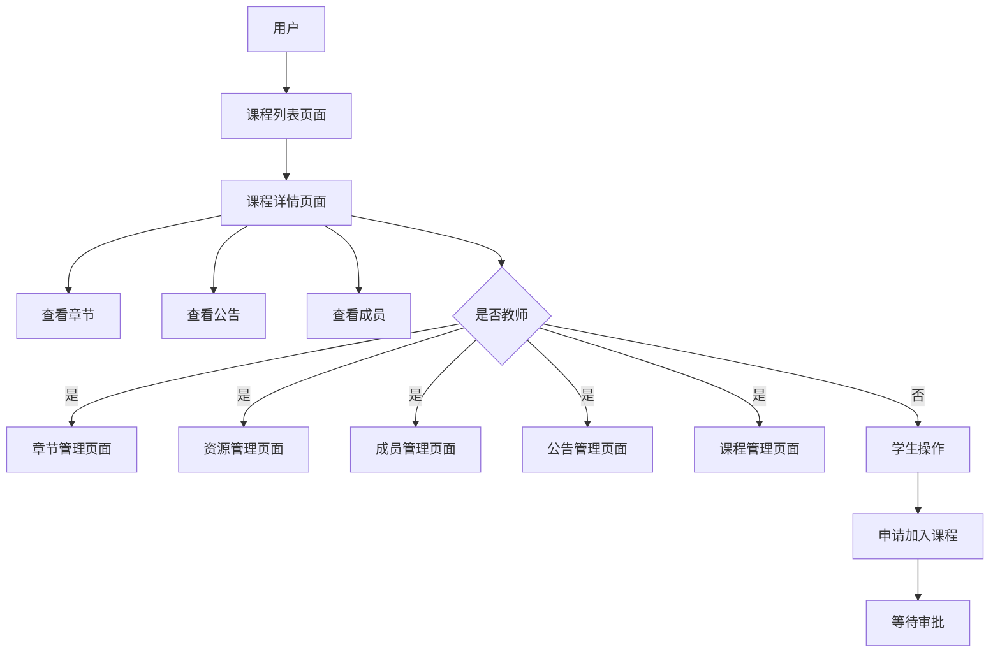
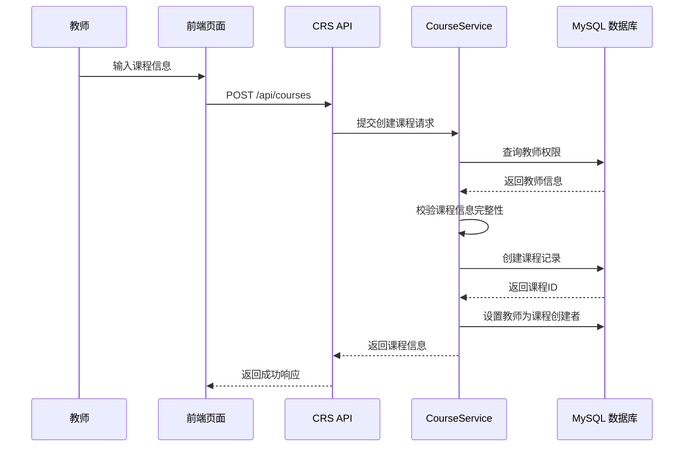
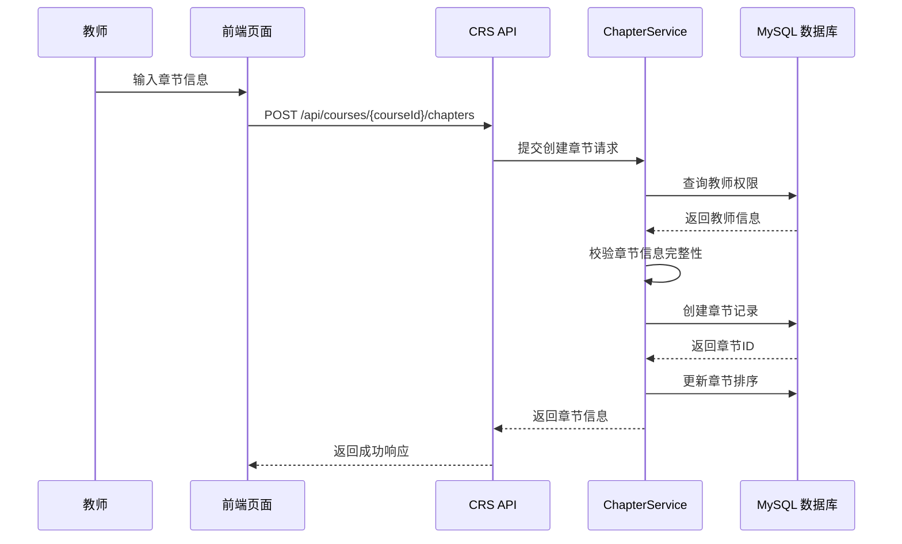
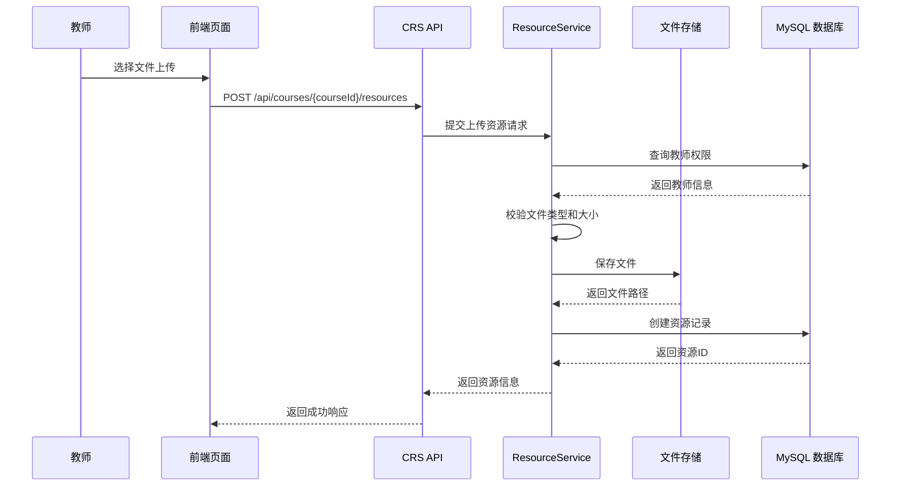
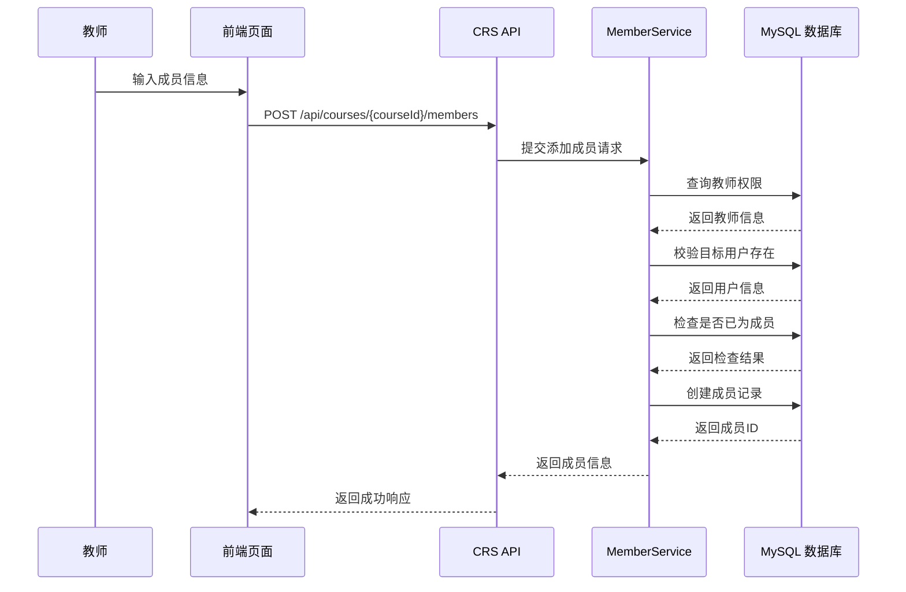
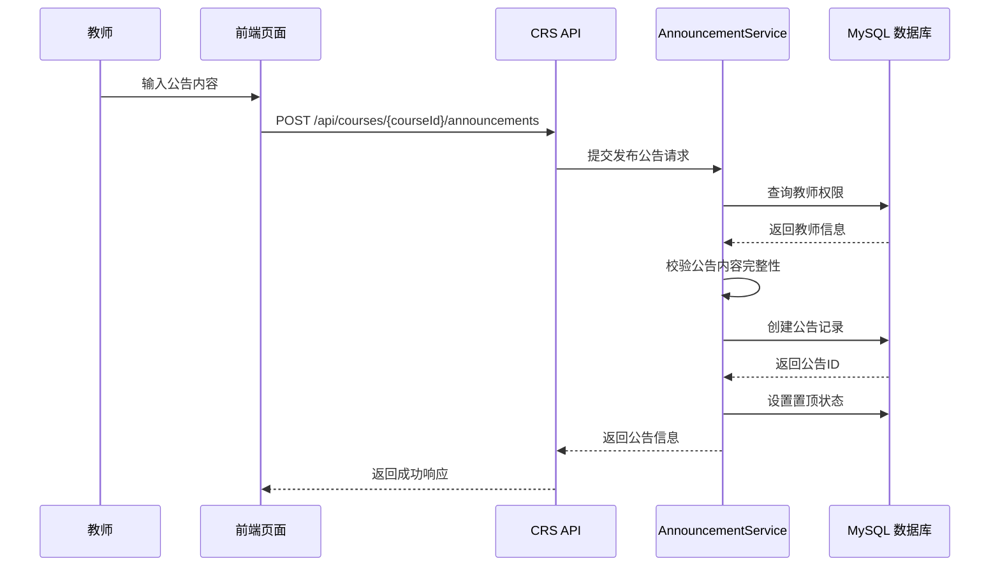
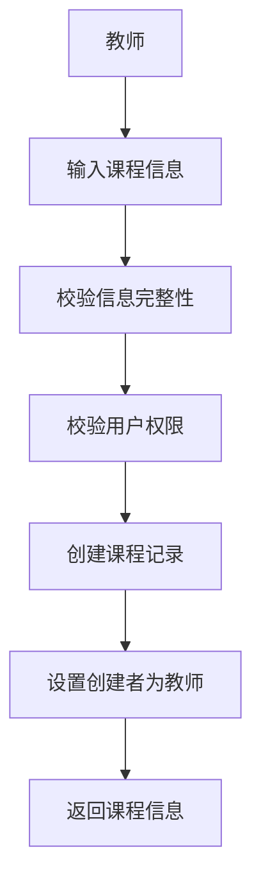
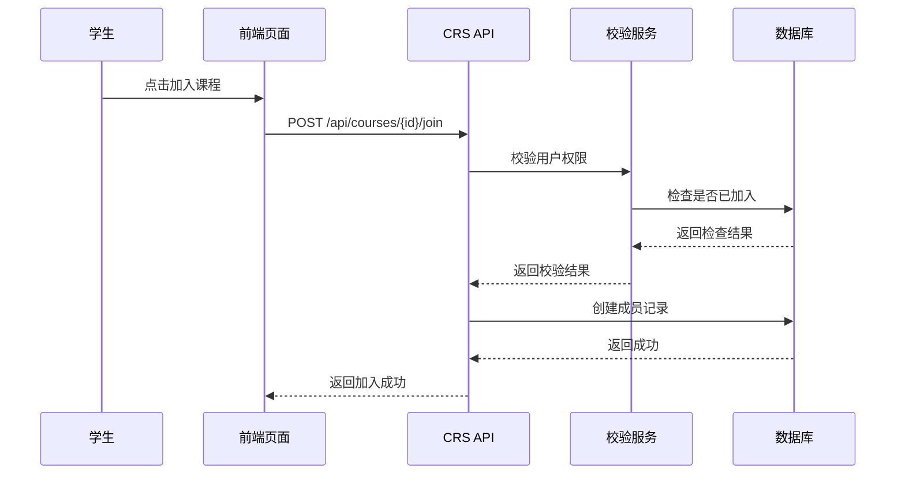
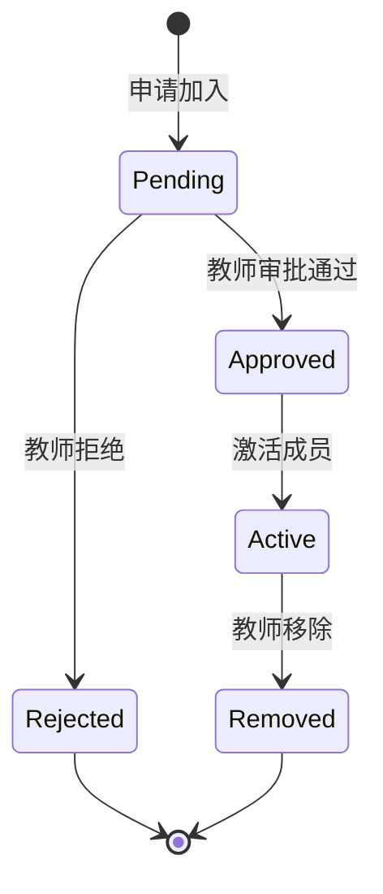

# 课程与教学资源模块详细设计提交稿（CRS）

## 0 编写说明与设计边界

本文档为课程与教学资源模块（CRS）的独立详细设计提交稿，供详细设计负责人后续合并至《软件详细设计说明书》第 3.2、4、5、6、7、9 章相关位置。本文档严格依据《软件详细设计说明书.md》和《详细设计—各模块负责人分工.md》的提交要求编写，不直接修改主说明书。

本模块对应需求范围为 `FR-CR-01 ~ FR-CR-06`、`NFR-CR-01 ~ NFR-CR-05`，测试编号前缀为 `TC-CR`。本模块负责课程创建与管理、章节目录管理、教学资源上传和管理、学生加入课程、课程成员管理和课程公告管理，为 LRN、LAB、HWK、GRD 提供课程和成员关系基础数据。

本模块不负责学习进度统计、实验提交、作业评测和成绩计算，这些内容由对应业务模块负责。涉及“当前用户是否属于某课程”等业务归属判断时，CRS 只提供课程成员关系数据，具体业务范围由对应模块结合自身数据二次校验。

## 1 模块基本信息

| 项目 | 内容 |
| --- | --- |
| 模块编号 | DSD-CRS |
| 模块名称 | 课程与教学资源模块 |
| 模块缩写 | CRS |
| 主责角色 | 课程与教学资源模块负责人 |
| 对应需求 | FR-CR-01 ~ FR-CR-06 / NFR-CR-01 ~ NFR-CR-05 |
| 依赖模块 | AUTH |
| 被依赖模块 | LRN、LAB、HWK、GRD |
| 主要交付 | 页面设计、API 设计、服务设计、数据表设计、创建课程流程、加入课程流程、资源发布流程、课程成员状态机、异常与安全、需求追踪 |

## 2 模块职责与依赖关系

### 2.1 本模块负责的内容

1. 课程创建、编辑、删除和查询。
2. 课程章节目录的创建、编辑、排序和删除。
3. 教学资源的上传、分类、下载和删除。
4. 学生加入课程的申请和审批流程。
5. 课程成员关系的维护，包括教师、助教、学生角色。
6. 课程公告的发布、编辑、置顶和删除。
7. 课程成员校验接口，为其他模块提供课程归属判断。
8. 课程基础信息的查询和统计。

### 2.2 本模块不负责的内容

1. 不负责用户账号管理和角色权限分配，相关内容由 AUTH 负责。
2. 不负责学习记录、任务中心和通知展示，相关内容由 LRN 负责。
3. 不负责实验发布、实验提交、实验评测和实验评分，相关内容由 LAB 负责。
4. 不负责作业发布、作业提交、作业评测和作业批阅，相关内容由 HWK 负责。
5. 不负责成绩项配置、成绩汇总、成绩发布和教学分析，相关内容由 GRD 负责。

### 2.3 与其他模块的协作关系

| 协作模块 | 协作内容 | CRS 提供 | 对方模块负责 |
| --- | --- | --- | --- |
| AUTH | 用户身份和权限校验 | 课程成员关系数据 | 用户登录状态和角色权限 |
| LRN | 学习任务和通知触发 | 课程信息和成员列表 | 学习记录和通知生成 |
| LAB | 实验发布和成员校验 | 课程成员关系 | 实验任务和提交记录 |
| HWK | 作业发布和成员校验 | 课程成员关系 | 作业任务和提交记录 |
| GRD | 成绩管理和查询 | 课程信息和成员列表 | 成绩记录和汇总计算 |

## 3 页面详细设计

### 3.1 页面清单

| 页面编号 | 页面名称 | 使用角色 | 页面目标 | 主要操作 | 调用接口 |
| --- | --- | --- | --- | --- | --- |
| UI-CRS-01 | 课程列表页面 | 学生、教师、管理员 | 展示用户可访问的课程列表 | 查看课程、搜索课程、加入课程 | CRS-API-05、CRS-API-14 |
| UI-CRS-02 | 课程详情页面 | 学生、教师、管理员 | 显示课程基本信息和章节目录 | 查看章节、查看公告、查看成员 | CRS-API-02、CRS-API-07、CRS-API-21 |
| UI-CRS-03 | 章节管理页面 | 教师 | 管理课程章节目录 | 创建章节、编辑章节、排序章节、删除章节 | CRS-API-06、CRS-API-08、CRS-API-09 |
| UI-CRS-04 | 资源管理页面 | 教师 | 上传和管理教学资源 | 上传资源、分类资源、下载资源、删除资源 | CRS-API-10、CRS-API-11、CRS-API-12、CRS-API-13 |
| UI-CRS-05 | 成员管理页面 | 教师 | 管理课程成员和角色 | 查看成员、添加成员、移除成员、调整角色 | CRS-API-15、CRS-API-16、CRS-API-17 |
| UI-CRS-06 | 公告管理页面 | 教师 | 发布和管理课程公告 | 发布公告、编辑公告、置顶公告、删除公告 | CRS-API-20、CRS-API-21 |
| UI-CRS-07 | 课程管理页面 | 教师 | 管理课程信息 | 创建课程、编辑课程、删除课程 | CRS-API-01、CRS-API-03、CRS-API-04 |

### 3.2 页面流转图

图 3-1 CRS 页面流转图



### 3.3 页面交互规则

1. 课程列表页面默认展示用户可访问的课程，按创建时间倒序分页显示。
2. 教师进入课程详情页面后，可通过按钮切换到管理子页面（章节、资源、成员、公告、课程管理）。
3. 创建课程时，教师需填写课程名称、描述等必填信息，提交后自动成为课程教师。
4. 编辑课程信息仅限教师本人，且不能修改创建者。
5. 删除课程前需确认，删除后不可恢复，所有相关数据（章节、资源、成员、公告）将被级联删除。
6. 学生申请加入课程后，状态为待审批，教师审批通过后成为正式成员。
7. 资源上传限制文件大小和类型，上传成功后生成下载链接。
8. 公告发布支持置顶，置顶公告优先显示。
9. 权限不足时统一提示“无权限访问”，并提供返回上一页操作。
10. 所有操作成功后显示成功提示，失败时显示具体错误信息。

## 4 接口详细设计

### 4.1 接口清单


| 接口编号 | 接口名称 | 方法 | 路径 | 权限要求 | 对应需求 |
| --- | --- | --- | --- | --- | --- |
| CRS-API-01 | 创建课程 | POST | /api/courses | 已登录教师 | FR-CR-01 |
| CRS-API-02 | 获取课程详情 | GET | /api/courses/{courseId} | 课程成员 | FR-CR-01 |
| CRS-API-03 | 更新课程 | PUT | /api/courses/{courseId} | 课程教师 | FR-CR-01 |
| CRS-API-04 | 删除课程 | DELETE | /api/courses/{courseId} | 课程教师 | FR-CR-01 |
| CRS-API-05 | 获取课程列表 | GET | /api/courses | 已登录用户 | FR-CR-01 |
| CRS-API-06 | 创建章节 | POST | /api/courses/{courseId}/chapters | 课程教师 | FR-CR-03 |
| CRS-API-07 | 获取章节树 | GET | /api/courses/{courseId}/chapters | 课程成员 | FR-CR-03 |
| CRS-API-08 | 修改章节 | PUT | /api/courses/{courseId}/chapters/{chapterId} | 课程教师 | FR-CR-03 |
| CRS-API-09 | 删除章节 | DELETE | /api/courses/{courseId}/chapters/{chapterId} | 课程教师 | FR-CR-03 |
| CRS-API-10 | 上传教学资源 | POST | /api/courses/{courseId}/resources | 课程教师 | FR-CR-04 |
| CRS-API-11 | 获取资源列表 | GET | /api/courses/{courseId}/resources | 课程成员 | FR-CR-04 |
| CRS-API-12 | 更新资源 | PUT | /api/courses/{courseId}/resources/{resourceId} | 课程教师 | FR-CR-04 |
| CRS-API-13 | 删除资源 | DELETE | /api/courses/{courseId}/resources/{resourceId} | 课程教师 | FR-CR-04 |
| CRS-API-14 | 学生选课 | POST | /api/courses/{courseId}/join | 已登录用户 | FR-CR-02 |
| CRS-API-15 | 获取课程成员列表 | GET | /api/courses/{courseId}/members | 课程成员 | FR-CR-05 |
| CRS-API-16 | 管理成员角色 | PUT | /api/courses/{courseId}/members/{userId} | 课程教师 | FR-CR-05 |
| CRS-API-17 | 移除课程成员 | DELETE | /api/courses/{courseId}/members/{userId} | 课程教师 | FR-CR-05 |
| CRS-API-18 | 获取选课学生名单 | GET | /api/courses/{courseId}/students | 课程教师、HWK/LAB/GRD模块 | FR-CR-05 |
| CRS-API-19 | 校验课程权限 | GET | /api/courses/{courseId}/permissions/{userId} | HWK/LAB/GRD模块 | FR-CR-05 |
| CRS-API-20 | 发布公告 | POST | /api/courses/{courseId}/announcements | 课程教师 | FR-CR-06 |
| CRS-API-21 | 获取公告列表 | GET | /api/courses/{courseId}/announcements | 课程成员 | FR-CR-06 |
| CRS-API-22 | 课程首页摘要 | GET | /api/courses/{courseId}/home-summary | 课程成员 | FR-CR-06 |

### 4.2 关键接口详细说明

### 4.2 关键接口详细说明

#### CRS-API-01 创建课程

| 项目 | 内容 |
| --- | --- |
| 请求方法 | POST |
| 请求路径 | `/api/courses` |
| 权限要求 | 已登录教师 |
| 请求参数 | `name`：课程名称；`description`：课程描述 |
| 成功响应 | 课程信息 |
| 失败响应 | `CRS_400` 参数错误；`CRS_403` 无权限 |
| 业务规则 | 校验教师权限；创建课程记录；设置创建者为课程教师 |
| 涉及服务 | SVC-CRS-01 |
| 涉及数据表 | DB-CRS-01 |

**请求示例：**
```http
POST /api/courses
Content-Type: application/json

{
  "name": "软件工程基础",
  "description": "软件工程核心概念和实践"
}
```

**响应示例：**
```json
{
  "code": 200,
  "data": {
    "id": 1,
    "name": "软件工程基础",
    "description": "软件工程核心概念和实践",
    "teacherId": 123,
    "createdAt": "2024-01-01T00:00:00Z"
  }
}
```

#### CRS-API-05 获取课程列表

| 项目 | 内容 |
| --- | --- |
| 请求方法 | GET |
| 请求路径 | `/api/courses` |
| 权限要求 | 已登录用户 |
| 请求参数 | `page`：页码；`size`：每页大小；`keyword`：搜索关键词 |
| 成功响应 | `list`：课程列表；`total`：总数 |
| 失败响应 | `CRS_400` 参数错误；`CRS_403` 无权限 |
| 业务规则 | 根据用户角色返回可访问课程；支持分页和关键词搜索 |
| 涉及服务 | SVC-CRS-01 |
| 涉及数据表 | DB-CRS-01、DB-CRS-04 |

**请求示例：**
```http
GET /api/courses?page=1&size=10&keyword=软件工程
```

**响应示例：**
```json
{
  "code": 200,
  "data": {
    "list": [
      {
        "id": 1,
        "name": "软件工程基础",
        "description": "软件工程核心概念和实践",
        "teacherName": "张老师",
        "memberCount": 45,
        "createdAt": "2024-01-01T00:00:00Z"
      }
    ],
    "total": 1
  }
}
```

#### CRS-API-14 学生选课

| 项目 | 内容 |
| --- | --- |
| 请求方法 | POST |
| 请求路径 | `/api/courses/{courseId}/join` |
| 权限要求 | 已登录用户 |
| 请求参数 | `courseId`：课程ID |
| 成功响应 | 加入成功消息 |
| 失败响应 | `CRS_400` 参数错误；`CRS_403` 无权限；`CRS_409` 已加入 |
| 业务规则 | 检查用户是否已加入；创建待审批成员记录；通知教师 |
| 涉及服务 | SVC-CRS-04 |
| 涉及数据表 | DB-CRS-04 |

**请求示例：**
```http
POST /api/courses/1/join
```

**响应示例：**
```json
{
  "code": 200,
  "message": "加入申请已提交，等待教师审批"
}
```

#### CRS-API-20 发布公告

| 项目 | 内容 |
| --- | --- |
| 请求方法 | POST |
| 请求路径 | `/api/courses/{courseId}/announcements` |
| 权限要求 | 课程教师 |
| 请求参数 | `title`：公告标题；`content`：公告内容；`isTop`：是否置顶 |
| 成功响应 | 公告信息 |
| 失败响应 | `CRS_400` 参数错误；`CRS_403` 无权限 |
| 业务规则 | 校验教师权限；创建公告记录；支持置顶设置 |
| 涉及服务 | SVC-CRS-05 |
| 涉及数据表 | DB-CRS-05 |

**请求示例：**
```http
POST /api/courses/1/announcements
Content-Type: application/json

{
  "title": "期中复习安排",
  "content": "请同学们按时完成复习资料学习，并参与复习讨论。",
  "isTop": true
}
```

**响应示例：**
```json
{
  "code": 200,
  "data": {
    "id": 101,
    "courseId": 1,
    "title": "期中复习安排",
    "content": "请同学们按时完成复习资料学习，并参与复习讨论。",
    "isTop": true,
    "publishUserId": 123,
    "createdAt": "2024-05-11T10:00:00Z"
  }
}
```


## 5 服务与组件设计

### 5.1 服务清单

| 服务编号 | 服务/组件名称 | 主要职责 | 输入 | 输出 |
| --- | --- | --- | --- | --- |
| SVC-CRS-01 | CourseService | 课程CRUD操作 | 课程信息 | 课程实体 |
| SVC-CRS-02 | ChapterService | 章节管理 | 章节信息 | 章节实体 |
| SVC-CRS-03 | ResourceService | 资源上传和管理 | 文件信息 | 资源实体 |
| SVC-CRS-04 | MemberService | 成员关系管理 | 用户ID、课程ID | 成员关系 |
| SVC-CRS-05 | AnnouncementService | 公告管理 | 公告内容 | 公告实体 |

### 5.2 服务调用关系

#### CourseService 创建课程流程

1. 校验用户权限（教师或管理员）
2. 校验课程信息完整性
3. 创建课程记录
4. 设置创建者为教师
5. 返回课程信息

图 5-2 CRS 创建课程顺序图



#### ChapterService 创建章节流程

1. 校验用户权限（课程教师）
2. 校验章节信息完整性
3. 创建章节记录
4. 更新章节排序
5. 返回章节信息

图 5-3 CRS 创建章节顺序图



#### ResourceService 上传资源流程

1. 校验用户权限（课程教师）
2. 校验文件类型和大小
3. 保存文件到存储
4. 创建资源记录
5. 返回资源信息

图 5-4 CRS 上传资源顺序图



#### MemberService 添加成员流程

1. 校验用户权限（课程教师）
2. 校验目标用户存在
3. 检查是否已为成员
4. 创建成员记录
5. 返回成员信息

图 5-5 CRS 添加成员顺序图



#### AnnouncementService 发布公告流程

1. 校验用户权限（课程教师）
2. 校验公告内容完整性
3. 创建公告记录
4. 设置置顶状态
5. 返回公告信息

图 5-6 CRS 发布公告顺序图



## 6 数据结构与数据库设计

### 6.1 数据表清单

| 表编号 | 表名 | 中文名 | 主要字段 | 说明 |
| --- | --- | --- | --- | --- |
| DB-CRS-01 | courses | 课程表 | id, name, description, teacher_id, status, created_at, updated_at | 存储课程基本信息 |
| DB-CRS-02 | chapters | 章节表 | id, course_id, title, content, order_num, created_at | 存储课程章节目录 |
| DB-CRS-03 | resources | 资源表 | id, course_id, name, file_path, file_size, upload_user_id, created_at | 存储教学资源文件信息 |
| DB-CRS-04 | course_members | 课程成员表 | id, course_id, user_id, role, status, joined_at | 存储课程成员关系 |
| DB-CRS-05 | announcements | 公告表 | id, course_id, title, content, is_top, publish_user_id, created_at | 存储课程公告 |

### 6.2 表结构详情

#### courses 表

| 字段名 | 类型 | 是否为空 | 默认值 | 索引 | 说明 |
| --- | --- | --- | --- | --- | --- |
| id | bigint | 否 | 无 | PK | 课程编号 |
| name | varchar(100) | 否 | 无 | idx_name | 课程名称 |
| description | text | 是 | NULL |  | 课程描述 |
| teacher_id | bigint | 否 | 无 | idx_teacher_id | 教师编号，外键到users表 |
| status | varchar(32) | 否 | active | idx_status | 课程状态：active、archived |
| created_at | datetime | 否 | 当前时间 | idx_created_at | 创建时间 |
| updated_at | datetime | 否 | 当前时间 |  | 更新时间 |

#### chapters 表

| 字段名 | 类型 | 是否为空 | 默认值 | 索引 | 说明 |
| --- | --- | --- | --- | --- | --- |
| id | bigint | 否 | 无 | PK | 章节编号 |
| course_id | bigint | 否 | 无 | idx_course_id | 课程编号，外键到courses表 |
| title | varchar(200) | 否 | 无 |  | 章节标题 |
| content | text | 是 | NULL |  | 章节内容 |
| order_num | int | 否 | 0 | idx_order_num | 章节排序号 |
| created_at | datetime | 否 | 当前时间 | idx_created_at | 创建时间 |

#### resources 表

| 字段名 | 类型 | 是否为空 | 默认值 | 索引 | 说明 |
| --- | --- | --- | --- | --- | --- |
| id | bigint | 否 | 无 | PK | 资源编号 |
| course_id | bigint | 否 | 无 | idx_course_id | 课程编号，外键到courses表 |
| name | varchar(255) | 否 | 无 |  | 资源名称 |
| file_path | varchar(500) | 否 | 无 |  | 文件路径 |
| file_size | bigint | 否 | 0 |  | 文件大小（字节） |
| upload_user_id | bigint | 否 | 无 | idx_upload_user_id | 上传用户编号，外键到users表 |
| created_at | datetime | 否 | 当前时间 | idx_created_at | 上传时间 |

#### course_members 表

| 字段名 | 类型 | 是否为空 | 默认值 | 索引 | 说明 |
| --- | --- | --- | --- | --- | --- |
| id | bigint | 否 | 无 | PK | 成员关系编号 |
| course_id | bigint | 否 | 无 | idx_course_id | 课程编号，外键到courses表 |
| user_id | bigint | 否 | 无 | idx_user_id | 用户编号，外键到users表 |
| role | varchar(32) | 否 | student | idx_role | 角色：teacher、assistant、student |
| status | varchar(32) | 否 | pending | idx_status | 状态：pending、approved、active、removed |
| joined_at | datetime | 是 | NULL |  | 加入时间 |

#### announcements 表

| 字段名 | 类型 | 是否为空 | 默认值 | 索引 | 说明 |
| --- | --- | --- | --- | --- | --- |
| id | bigint | 否 | 无 | PK | 公告编号 |
| course_id | bigint | 否 | 无 | idx_course_id | 课程编号，外键到courses表 |
| title | varchar(200) | 否 | 无 |  | 公告标题 |
| content | text | 否 | 无 |  | 公告内容 |
| is_top | tinyint | 否 | 0 | idx_is_top | 是否置顶：0否、1是 |
| publish_user_id | bigint | 否 | 无 | idx_publish_user_id | 发布用户编号，外键到users表 |
| created_at | datetime | 否 | 当前时间 | idx_created_at | 发布时间 |

## 7 关键流程与状态机

### 7.1 创建课程流程

图 3-2 创建课程流程图



### 7.2 加入课程流程

图 3-3 加入课程流程图



### 7.3 课程成员状态机

图 3-4 课程成员状态机



## 8 异常、安全、性能与测试关注点

### 8.1 异常处理

| 异常编号 | 异常场景 | 处理策略 | 用户提示或接口结果 | 对应需求 |
| --- | --- | --- | --- | --- |
| EX-CRS-01 | 课程不存在 | 返回404错误，记录日志 | "课程不存在" | FR-CR-01 |
| EX-CRS-02 | 无权限操作 | 返回403错误，记录权限违规日志 | "无权限访问" | FR-CR-01 |
| EX-CRS-03 | 文件上传失败 | 返回500错误，记录日志，清理临时文件 | "文件上传失败，请重试" | FR-CR-04 |
| EX-CRS-04 | 数据库操作失败 | 回滚事务，返回500错误，记录错误详情 | "系统错误，请联系管理员" | FR-CR-01 |
| EX-CRS-05 | 参数错误 | 返回400错误，提示具体参数问题 | "参数错误：{具体错误}" | FR-CR-01 |
| EX-CRS-06 | 用户未登录 | 返回401错误，重定向登录 | "请先登录" | FR-CR-02 |
| EX-CRS-07 | 章节排序冲突 | 返回409错误，提示重新排序 | "章节排序冲突，请调整顺序" | FR-CR-03 |
| EX-CRS-08 | 成员已存在 | 返回409错误，提示已加入 | "用户已是课程成员" | FR-CR-05 |
| EX-CRS-09 | 公告内容过长 | 返回400错误，提示长度限制 | "公告内容超过最大长度" | FR-CR-06 |
| EX-CRS-10 | 文件类型不支持 | 返回400错误，提示支持类型 | "不支持的文件类型" | FR-CR-04 |

### 8.2 安全设计

- 文件上传限制类型和大小
- 路径遍历攻击防护
- XSS防护：公告内容过滤
- 权限校验：教师操作需要课程教师权限

### 8.3 性能优化建议

- 课程列表分页查询
- 资源文件CDN加速
- 数据库索引优化

### 8.4 测试关注点

| 测试编号 | 测试场景 | 验收标准 | 优先级 |
| --- | --- | --- | --- |
| TC-CR-01 | 创建课程功能测试 | 教师可成功创建课程，信息正确保存 | 高 |
| TC-CR-02 | 加入课程流程测试 | 学生申请加入，教师审批通过后成为成员 | 高 |
| TC-CR-03 | 资源上传下载测试 | 支持多种文件格式，下载链接有效 | 中 |
| TC-CR-04 | 课程章节管理测试 | 支持教师设置多级目录、调整目录 | 中 |
| TC-CR-05 | 权限校验测试 | 非教师无法管理课程，非成员无法查看课程 | 高 |
| TC-CR-06 | 异常处理测试 | 无效输入、权限不足等场景正确处理 | 中 |

## 9 需求追踪与测试关注点

| 需求编号 | 需求名称 | 详细设计编号 | 页面编号 | API 编号 | 数据表编号 | 测试编号 | 备注 |
| --- | --- | --- | --- | --- | --- | --- | --- |
| FR-CR-01 | 课程创建与管理 | DSD-CRS-01 | UI-CRS-01, UI-CRS-02, UI-CRS-07 | CRS-API-01, CRS-API-03, CRS-API-18, CRS-API-19, CRS-API-20 | DB-CRS-01 | TC-CR-01 | 教师可创建、编辑、删除课程，自动成为课程创建者 |
| FR-CR-02 | 学生加入课程 | DSD-CRS-02 | UI-CRS-01 | CRS-API-02 | DB-CRS-04 | TC-CR-02 | 学生申请加入课程，教师审批后成为正式成员 |
| FR-CR-03 | 课程章节目录管理 | DSD-CRS-03 | UI-CRS-02, UI-CRS-03 | CRS-API-04, CRS-API-06, CRS-API-07, CRS-API-08 | DB-CRS-02 | TC-CR-03 | 教师创建、编辑、排序、删除章节，支持嵌套结构 |
| FR-CR-04 | 教学资源上传与管理 | DSD-CRS-04 | UI-CRS-04 | CRS-API-09, CRS-API-10, CRS-API-11 | DB-CRS-03 | TC-CR-04 | 教师上传资源，限制文件类型和大小，学生可下载 |
| FR-CR-05 | 课程成员关系维护 | DSD-CRS-05 | UI-CRS-05 | CRS-API-12, CRS-API-13, CRS-API-14 | DB-CRS-04 | TC-CR-05 | 教师管理课程成员，支持teacher、assistant、student三种角色 |
| FR-CR-06 | 课程公告发布与管理 | DSD-CRS-06 | UI-CRS-06 | CRS-API-15, CRS-API-16, CRS-API-17 | DB-CRS-05 | TC-CR-06 | 教师发布公告，支持置顶功能，成员实时接收通知 |

## 10 与其他模块待确认事项

1. 与AUTH模块确认用户身份接口格式
2. 与LRN模块确认通知触发机制
3. 与LAB/HWK/GRD模块确认课程成员校验接口调用方式

## 11 模块提交结论

本模块详细设计已完成，包括页面设计、接口设计、服务设计、数据库设计、流程图、状态机和测试关注点。设计遵循了模块职责边界，与其他模块的协作关系清晰。测试负责人已审查设计可测试性，并补充了测试编号和验收关注点。