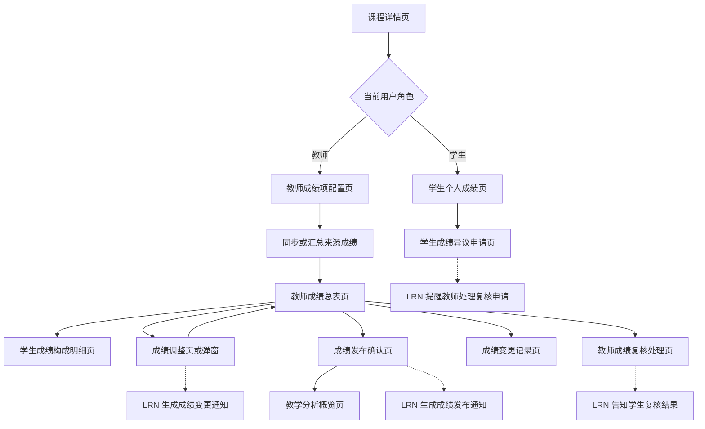
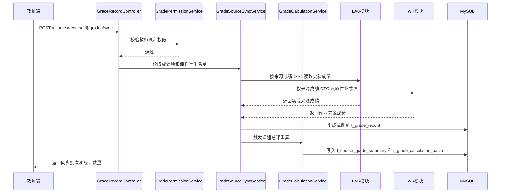
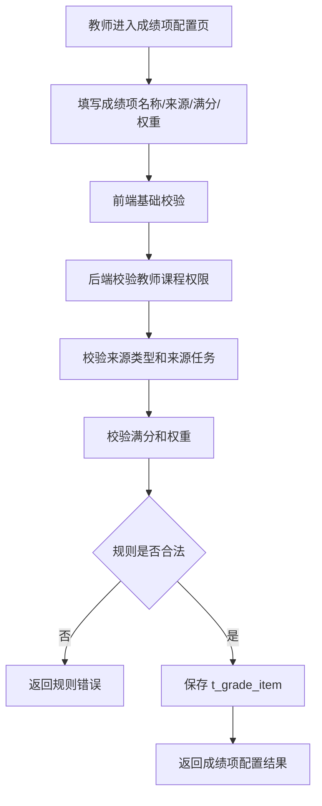
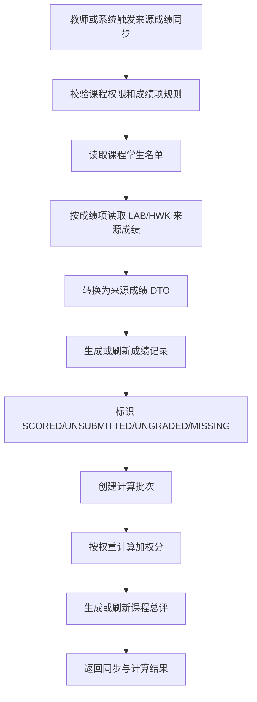
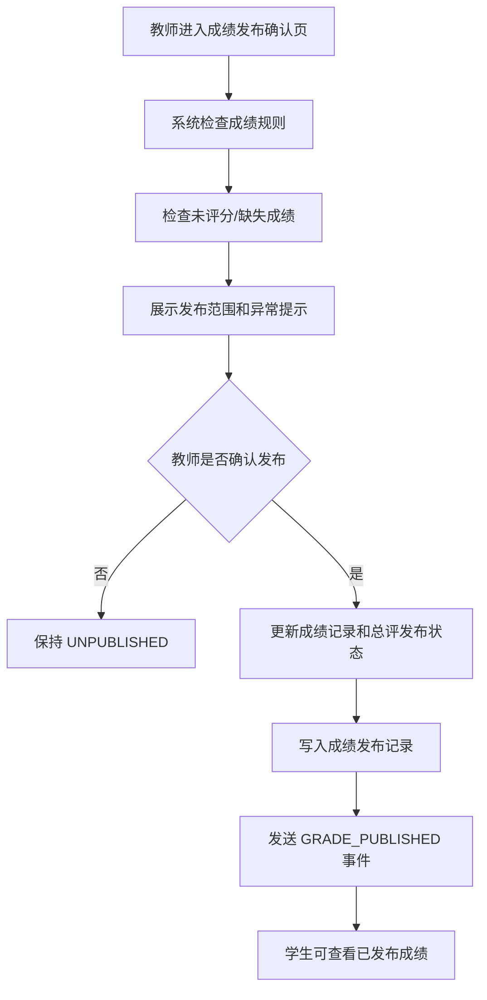
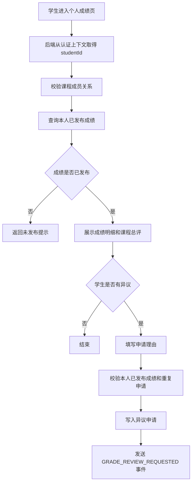
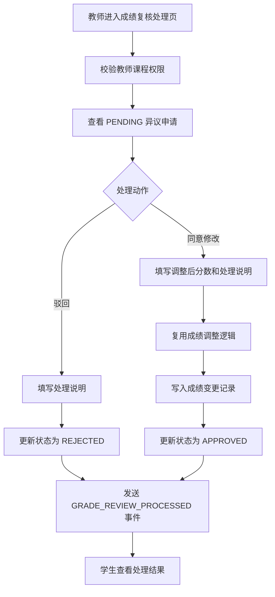
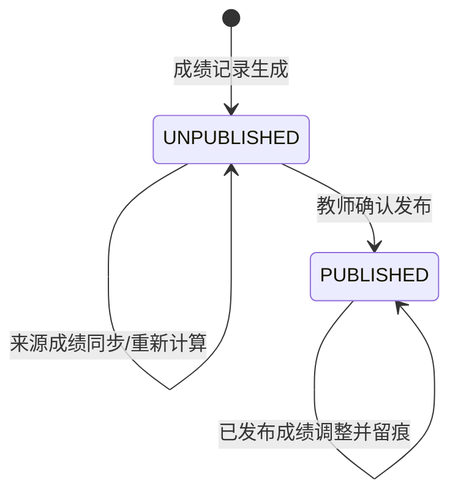
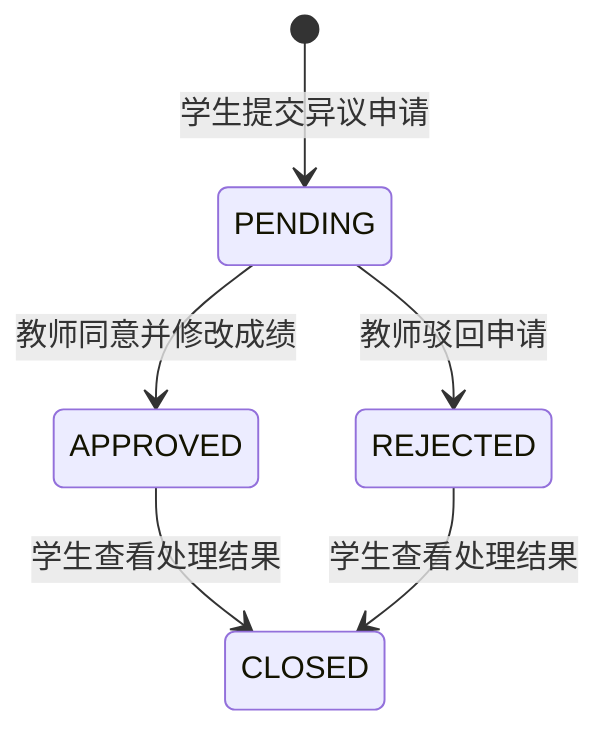

# GRD-成绩评价与教学分析-详细设计提交稿

课程名称：软件工程基础
项目名称：在线教学与实训平台
模块名称：成绩评价与教学分析模块
模块缩写：GRD
对应主文档章节：3.6 成绩评价与教学分析模块（GRD）
负责人：成绩评价与教学分析模块负责人
提交对象：详细设计负责人
版本号：V1.0
提交日期：2026 年 5 月 17 日

---

## 0 编写说明与设计边界

本文档为“在线教学与实训平台”中成绩评价与教学分析模块（GRD）的详细设计提交稿，用于提交给详细设计负责人，并合并到《软件详细设计说明书》第 3.6 节及后续接口清单、数据库清单、状态机和需求追踪矩阵中。

本模块设计依据《软件需求规格说明书》《软件概要设计说明书》《成绩评价与教学分析模块概要设计提交稿（GRD）》《软件详细设计说明书》底稿和《详细设计—各模块负责人分工》编写。本文档只在上述文档已经给出的需求、接口、实体、表结构和跨模块契约范围内细化设计，不扩展为完整教务系统、跨课程分析系统或智能预测分析系统。

### 0.1 设计边界

GRD 模块负责：

1. 教师在课程范围内配置成绩项、成绩来源、满分值、权重、是否计入总评和显示顺序。
2. 从 LAB、HWK 模块读取或接收已形成的有效评分结果，并转换为 GRD 内部成绩记录。
3. 按课程、学生和成绩项生成成绩记录，区分原始分、加权分和课程总评。
4. 对未提交、未评分、缺失成绩等情况设置明确状态。
5. 支持教师查看课程成绩总表、学生成绩构成明细，并按学生、成绩项、状态和发布状态筛选。
6. 支持教师调整课程内单项成绩或课程总评，并保存调整原因和变更留痕。
7. 支持未发布、已发布状态控制，记录发布时间、发布范围、发布人和通知状态。
8. 支持学生查看本人已发布成绩、成绩项明细、加权结果、课程总评和允许展示的反馈信息。
9. 支持学生对本人已发布成绩提交异议申请，并查看本人申请处理状态和处理结果。
10. 支持教师查看授权课程内成绩异议申请，并进行同意修改、驳回或备注说明。
11. 支持课程级、班级级基础统计分析，包括均分、最高分、最低分、及格率、完成率和预设分数区间分布。
12. 记录成绩项定义、来源同步、成绩计算、成绩发布、成绩修改、成绩异议复核和统计分析来源时间点，满足追踪与审计要求。

GRD 模块不负责：

1. 不负责用户注册、登录、角色维护、JWT 鉴权和平台级权限模型，该部分由 AUTH 模块负责。
2. 不负责课程创建、课程成员维护、课程章节和资源管理，该部分由 CRS 模块负责。
3. 不负责实验任务创建、实验提交、实验自动评测和实验评分，该部分由 LAB 模块负责。
4. 不负责作业发布、作业提交、作业自动评测和教师批阅，该部分由 HWK 模块负责。
5. 不负责站内通知生成、未读状态、通知偏好配置和通知列表展示，该部分由 LRN 模块负责。
6. 不实现校级教务排课、商业级成绩系统、复杂预测分析、跨课程对比分析和大模型分析。

### 0.2 首版实现范围

首版 GRD 以课程项目演示和可测试验收为目标，覆盖“成绩项配置 -> 来源成绩同步 -> 总评计算 -> 教师确认与发布 -> 学生查询 -> 学生提交异议 -> 教师复核处理 -> 教师查看基础统计分析”的闭环。

首版统计分析限定为课程或单个成绩项的基础统计，不提供跨课程对比、学生画像预测、复杂自定义统计模型和智能分析结论。统计结果以已经保存的成绩记录和课程成员名单为依据，并记录对应的数据来源时间点。

---

## 1 模块基本信息

| 项目 | 内容 |
| --- | --- |
| 模块名称 | 成绩评价与教学分析模块 |
| 模块缩写 | GRD |
| 主责人 | 成绩评价与教学分析模块负责人 |
| 对应需求 | FR-GR-01 ~ FR-GR-07 / NFR-GR-01 ~ NFR-GR-05 |
| 主要使用角色 | 教师、学生 |
| 依赖模块 | AUTH、CRS、LAB、HWK、LRN |
| 主要页面 | 教师成绩项配置页、教师成绩总表页、学生成绩构成明细页、成绩调整页/弹窗、成绩发布确认页、学生个人成绩页、教学分析概览页、成绩变更记录页、学生成绩异议申请页、教师成绩复核处理页 |
| 主要数据表 | 成绩项表、成绩记录表、课程总评表、成绩发布记录表、成绩计算批次表、成绩异议申请表、成绩变更记录表、统计分析快照表 |
| 测试编号前缀 | TC-GR |

---

## 2 模块职责与依赖关系

### 2.1 模块职责

GRD 模块是平台教学评价闭环的终端模块。LAB 和 HWK 形成实验、作业等来源成绩后，GRD 按教师配置的成绩项和权重进行课程级归集、总评计算、发布控制、学生查询、异议复核和基础教学统计分析。

GRD 的设计重点是保证成绩来源可追踪、发布状态可控制、学生可见范围严格受限、教师调整有留痕、统计数据与成绩数据保持一致。

### 2.2 与其他模块的依赖关系

| 依赖方向 | 模块 | 依赖内容 | 交互方式 |
| --- | --- | --- | --- |
| GRD -> AUTH | 用户权限与平台安全 | 当前登录用户身份、角色、权限码、用户基础信息 | JWT 认证上下文、权限拦截器 |
| GRD -> CRS | 课程与教学资源 | 课程信息、课程成员、学生名单、教师课程权限 | RESTful API 或服务接口 |
| GRD -> LAB | 实训实验模块 | 实验编号、学生编号、得分、评分状态、成绩发布时间、是否已发布 | 来源成绩读取 DTO 或成绩同步事件 |
| GRD -> HWK | 作业与自动评测模块 | 作业编号、学生编号、得分、评测状态、教师评分结果、是否已发布 | 来源成绩读取 DTO 或成绩同步事件 |
| GRD -> LRN | 学习过程与通知提醒 | 成绩发布、成绩变更、成绩复核申请、复核结果通知事件 | 业务事件推送 |

### 2.3 跨模块事件

| 事件编号 | 事件名称 | 触发时机 | 接收模块 | 主要字段 |
| --- | --- | --- | --- | --- |
| EVT-GRD-01 | GRADE_PUBLISHED | 教师正式发布成绩后 | LRN | courseId, publishId, receiverStudentIds, publishedAt |
| EVT-GRD-02 | GRADE_CHANGED | 已发布成绩发生修改后 | LRN | courseId, studentId, gradeItemId, changedAt |
| EVT-GRD-03 | GRADE_REVIEW_REQUESTED | 学生提交成绩异议申请后 | LRN | courseId, requestId, studentId, teacherIds, submittedAt |
| EVT-GRD-04 | GRADE_REVIEW_PROCESSED | 教师处理成绩异议申请后 | LRN | courseId, requestId, studentId, status, processedAt |

### 2.4 软件重用设计

| 可重用对象 | 来源模块/全局设计 | GRD 使用方式 | 降低重复开发的效果 |
| --- | --- | --- | --- |
| 认证上下文与 JWT 鉴权 | AUTH | 所有 GRD 接口从认证上下文取得当前用户，不信任前端传入操作者身份 | 复用统一登录态、角色与权限校验入口 |
| 课程权限与学生名单 | CRS | 同步、计算、发布、统计前校验课程存在性、教师权限和学生名单 | 避免 GRD 重复维护课程成员数据 |
| 来源成绩 DTO | LAB、HWK | 使用 sourceType、sourceId、studentId、score、scoreStatus、published、sourceUpdatedAt 等字段同步来源成绩 | GRD 不依赖 LAB/HWK 内部表结构 |
| 通知事件模型 | LRN | 成绩发布、成绩变更、复核申请和复核结果均发送事件，由 LRN 负责通知生成和展示 | GRD 不重复实现通知列表、已读状态和提醒偏好 |
| 分层架构 | 全局技术架构 | Controller、Service、Repository/Mapper、MySQL 表分层 | 与其他模块保持一致，便于集成和测试 |
| 统一 RESTful API 与响应结构 | 全局接口约定 | API 使用 `/api/v1` 前缀，响应遵循 `{ code, message, data }` | 前后端交互方式一致 |
| 调整与变更留痕机制 | GRD 内部共享 | 异议复核同意修改时复用 GradeAdjustmentService 和 t_grade_change_log | 避免“教师手动调整”和“复核后调整”形成两套逻辑 |

---

## 3 页面详细设计

### 3.1 页面清单

| 页面编号 | 页面名称 | 使用角色 | 页面目标 | 主要操作 | 调用接口 |
| --- | --- | --- | --- | --- | --- |
| UI-GRD-01 | 教师成绩项配置页 | 教师 | 在课程范围内配置成绩项、来源、满分、权重、是否计入总评和显示顺序 | 查询、创建、修改、停用成绩项；校验成绩规则 | API-GRD-01 ~ API-GRD-05 |
| UI-GRD-02 | 教师成绩总表页 | 教师 | 展示课程学生成绩总表，支持筛选和分页 | 同步来源成绩、重新计算、按学生/成绩项/状态/发布状态筛选 | API-GRD-06 ~ API-GRD-09 |
| UI-GRD-03 | 学生成绩构成明细页 | 教师 | 查看单名学生各成绩项原始分、加权分、来源任务、状态和总评 | 查看明细、进入成绩调整 | API-GRD-09、API-GRD-10、API-GRD-11 |
| UI-GRD-04 | 成绩调整页/弹窗 | 教师 | 调整课程内单项成绩或总评并填写调整原因 | 输入调整后分数、调整类型、原因并提交 | API-GRD-10、API-GRD-11 |
| UI-GRD-05 | 成绩发布确认页 | 教师 | 发布前展示可发布范围、未评分/缺失状态和发布确认结果 | 检查规则、确认发布、查看通知状态和发布记录 | API-GRD-05、API-GRD-12、API-GRD-13 |
| UI-GRD-06 | 学生个人成绩页 | 学生 | 展示本人已发布成绩项明细、加权结果、课程总评、发布时间和发布状态 | 查看成绩、查看反馈、进入异议申请 | API-GRD-15、API-GRD-18 |
| UI-GRD-07 | 教学分析概览页 | 教师 | 展示课程总评或成绩项的基础统计分析 | 查看均分、最高分、最低分、及格率、完成率和成绩分布 | API-GRD-16、API-GRD-17 |
| UI-GRD-08 | 成绩变更记录页 | 教师 | 查看已发布成绩修改前后值、修改人、修改时间和修改原因 | 按学生或成绩项筛选变更记录 | API-GRD-14 |
| UI-GRD-09 | 学生成绩异议申请页 | 学生 | 对本人已发布课程成绩或单项成绩提交异议申请 | 选择成绩项或总评，填写申请理由，查询本人申请状态 | API-GRD-18、API-GRD-19 |
| UI-GRD-10 | 教师成绩复核处理页 | 教师 | 查看授权课程内成绩异议申请并处理 | 按状态筛选申请，同意修改、驳回或备注说明 | API-GRD-20、API-GRD-21 |

### 3.2 页面流转图



### 3.3 页面交互要点

1. 教师成绩项配置页必须展示权重、满分、是否计入总评和来源类型，保存前进行必填项、满分值和权重合法性校验。
2. 教师成绩总表页默认按课程成员学生列表展示，未提交、未评分、缺失成绩不能显示为空白，应明确展示状态。
3. 学生成绩构成明细页展示单名学生的成绩项、来源任务、原始分、加权分、总评、发布状态、教师评语或基础反馈。
4. 成绩调整必须通过弹窗或独立页面填写调整原因，不允许无原因修改成绩。
5. 成绩发布确认页应展示发布范围、未评分数量、缺失成绩数量、通知状态和发布确认结果。
6. 学生个人成绩页只显示已发布数据；未发布时展示明确提示，不展示未公开分数。
7. 学生成绩异议申请页只允许选择本人已发布成绩项或课程总评，提交时必须填写申请理由。
8. 教师成绩复核处理页应展示申请理由、原成绩、来源成绩记录和历史处理状态，处理时必须填写处理说明。
9. 教学分析概览页只展示课程级和班级级基础统计，不提供跨课程对比和预测分析入口。

---

## 4 接口详细设计

### 4.1 接口清单

| 接口编号 | 接口名称 | 方法 | 路径 | 权限要求 | 对应需求 |
| --- | --- | --- | --- | --- | --- |
| API-GRD-01 | 查询成绩项列表 | GET | /api/v1/courses/{courseId}/grade-items | 教师，且具备课程管理权限 | FR-GR-01 |
| API-GRD-02 | 创建成绩项 | POST | /api/v1/courses/{courseId}/grade-items | 教师，且具备课程管理权限 | FR-GR-01 |
| API-GRD-03 | 修改成绩项 | PUT | /api/v1/grade-items/{gradeItemId} | 教师，且具备课程管理权限 | FR-GR-01 |
| API-GRD-04 | 停用/删除成绩项 | DELETE | /api/v1/grade-items/{gradeItemId} | 教师，且具备课程管理权限 | FR-GR-01 |
| API-GRD-05 | 校验成绩规则 | POST | /api/v1/courses/{courseId}/grade-rules/validate | 教师，且具备课程管理权限 | FR-GR-01 |
| API-GRD-06 | 同步来源成绩 | POST | /api/v1/courses/{courseId}/grades/sync | 教师或系统，教师需具备课程管理权限 | FR-GR-02 |
| API-GRD-07 | 重新计算课程成绩 | POST | /api/v1/courses/{courseId}/grades/recalculate | 教师或系统，教师需具备课程管理权限 | FR-GR-01、FR-GR-02 |
| API-GRD-08 | 查询课程成绩总表 | GET | /api/v1/courses/{courseId}/grades | 教师，且具备课程管理权限 | FR-GR-02、FR-GR-03 |
| API-GRD-09 | 查询学生成绩明细 | GET | /api/v1/courses/{courseId}/grades/students/{studentId} | 教师，且具备课程管理权限 | FR-GR-03 |
| API-GRD-10 | 调整成绩记录 | PUT | /api/v1/grade-records/{recordId}/adjust | 教师，且具备课程管理权限 | FR-GR-03 |
| API-GRD-11 | 调整课程总评 | PUT | /api/v1/course-grade-summaries/{summaryId}/adjust | 教师，且具备课程管理权限 | FR-GR-03、FR-GR-04 |
| API-GRD-12 | 发布课程成绩 | POST | /api/v1/courses/{courseId}/grades/publish | 教师，且具备课程管理权限 | FR-GR-04 |
| API-GRD-13 | 查询成绩发布记录 | GET | /api/v1/courses/{courseId}/grade-publish-records | 教师，且具备课程管理权限 | FR-GR-04 |
| API-GRD-14 | 查询成绩变更记录 | GET | /api/v1/courses/{courseId}/grade-change-logs | 教师，且具备课程管理权限 | FR-GR-03、FR-GR-04、NFR-GR-03 |
| API-GRD-15 | 查询我的课程成绩 | GET | /api/v1/courses/{courseId}/my-grades | 学生，且为课程成员 | FR-GR-05 |
| API-GRD-16 | 查询课程成绩分析 | GET | /api/v1/courses/{courseId}/grade-analysis | 教师，且具备课程管理权限 | FR-GR-06 |
| API-GRD-17 | 查询成绩项完成情况 | GET | /api/v1/courses/{courseId}/grade-items/{gradeItemId}/completion | 教师，且具备课程管理权限 | FR-GR-06 |
| API-GRD-18 | 提交成绩异议申请 | POST | /api/v1/courses/{courseId}/grade-review-requests | 学生，且为课程成员，只能提交本人已发布成绩 | FR-GR-07 |
| API-GRD-19 | 查询我的成绩异议申请 | GET | /api/v1/courses/{courseId}/my-grade-review-requests | 学生，且为课程成员 | FR-GR-07 |
| API-GRD-20 | 查询课程成绩异议申请 | GET | /api/v1/courses/{courseId}/grade-review-requests | 教师，且具备课程管理权限 | FR-GR-07 |
| API-GRD-21 | 处理成绩异议申请 | PUT | /api/v1/grade-review-requests/{requestId}/process | 教师，且具备课程管理权限 | FR-GR-07、FR-GR-03 |

### 4.2 主要接口说明

#### 4.2.1 创建成绩项 API-GRD-02

| 项目 | 内容 |
| --- | --- |
| 方法与路径 | POST /api/v1/courses/{courseId}/grade-items |
| 调用方 | 教师端 |
| 主要入参 | name, sourceType, sourceId, fullScore, weight, includedInFinal, sortOrder |
| 主要出参 | gradeItemId, createdAt |
| 处理逻辑 | 从认证上下文取得教师身份；校验课程存在和教师课程权限；校验成绩项名称、来源类型、满分、权重和是否计入总评；保存成绩项定义；返回新成绩项编号 |
| 异常情况 | 无课程权限、课程不存在、来源类型不支持、满分值不合法、权重配置不合法、成绩项名称缺失 |

#### 4.2.2 同步来源成绩 API-GRD-06

| 项目 | 内容 |
| --- | --- |
| 方法与路径 | POST /api/v1/courses/{courseId}/grades/sync |
| 调用方 | 教师端、系统 |
| 主要入参 | gradeItemIds, sourceTypes |
| 主要出参 | calculationBatchId, syncedCount, missingCount, ungradedCount |
| 处理逻辑 | 校验课程权限；读取成绩项配置和课程学生名单；按 sourceType + sourceId 从 LAB/HWK 获取来源成绩 DTO；为每名课程学生生成或刷新 GradeRecord；对未提交、未评分、缺失成绩写入明确 gradeStatus；创建成绩计算批次并触发总评重算 |
| 异常情况 | 无课程权限、成绩项不存在、来源模块无对应任务、来源成绩状态不完整、同步批次写入失败 |

#### 4.2.3 重新计算课程成绩 API-GRD-07

| 项目 | 内容 |
| --- | --- |
| 方法与路径 | POST /api/v1/courses/{courseId}/grades/recalculate |
| 调用方 | 教师端、系统 |
| 主要入参 | gradeItemIds, studentIds |
| 主要出参 | calculationBatchId, affectedCount |
| 处理逻辑 | 校验课程权限；读取启用且计入总评的成绩项；按 rawScore、fullScore、weight 计算 weightedScore；按学生汇总课程总评；未提交、未评分、缺失成绩按成绩规则形成 INCOMPLETE 或可计算状态；保存计算批次 |
| 异常情况 | 权重规则缺失、权重配置不合法、成绩记录缺失、计算批次失败 |

#### 4.2.4 查询课程成绩总表 API-GRD-08

| 项目 | 内容 |
| --- | --- |
| 方法与路径 | GET /api/v1/courses/{courseId}/grades |
| 调用方 | 教师端 |
| 主要入参 | studentKeyword, gradeItemId, gradeStatus, publishStatus, page, size |
| 主要出参 | records, total |
| 处理逻辑 | 校验教师课程权限；按课程学生名单和成绩记录聚合总表；支持按学生、成绩项、成绩状态、发布状态筛选；分页返回 |
| 异常情况 | 无课程权限、课程不存在、分页参数不合法 |

#### 4.2.5 调整成绩记录 API-GRD-10

| 项目 | 内容 |
| --- | --- |
| 方法与路径 | PUT /api/v1/grade-records/{recordId}/adjust |
| 调用方 | 教师端 |
| 主要入参 | newScore, adjustType, reason |
| 主要出参 | recordId, oldScore, newScore, updatedAt |
| 处理逻辑 | 校验教师课程权限；读取原成绩记录；校验新分数范围和调整原因；更新 rawScore 或 finalScore 相关结果；写入 GradeChangeLog；如成绩已发布，发送 GRADE_CHANGED 事件；必要时重新计算课程总评 |
| 异常情况 | 无课程权限、成绩记录不存在、分数超出范围、调整原因缺失、变更日志写入失败 |

#### 4.2.6 发布课程成绩 API-GRD-12

| 项目 | 内容 |
| --- | --- |
| 方法与路径 | POST /api/v1/courses/{courseId}/grades/publish |
| 调用方 | 教师端 |
| 主要入参 | publishScope, studentIds, gradeItemIds |
| 主要出参 | publishId, publishedCount, publishedAt, notificationStatus |
| 处理逻辑 | 校验课程权限；校验成绩规则是否存在；检查未评分、缺失成绩和可发布范围；执行发布状态更新；写入 GradePublishRecord；发送 GRADE_PUBLISHED 事件；返回发布结果和通知状态 |
| 异常情况 | 无课程权限、成绩规则缺失、仍存在未评分记录、发布范围为空、重复发布冲突、通知事件发送失败 |

#### 4.2.7 查询我的课程成绩 API-GRD-15

| 项目 | 内容 |
| --- | --- |
| 方法与路径 | GET /api/v1/courses/{courseId}/my-grades |
| 调用方 | 学生端 |
| 主要入参 | courseId |
| 主要出参 | gradeItems, finalScore, publishedAt, publishStatus |
| 处理逻辑 | 从认证上下文取得当前学生编号；校验学生课程成员关系；只查询当前学生已发布成绩；返回成绩项明细、加权结果、课程总评、发布时间和发布状态 |
| 异常情况 | 未登录、非课程成员、成绩未发布、课程不存在 |

#### 4.2.8 提交成绩异议申请 API-GRD-18

| 项目 | 内容 |
| --- | --- |
| 方法与路径 | POST /api/v1/courses/{courseId}/grade-review-requests |
| 调用方 | 学生端 |
| 主要入参 | gradeItemId, targetType, reason |
| 主要出参 | requestId, status, submittedAt |
| 处理逻辑 | 从认证上下文取得当前学生编号；校验学生课程成员关系；校验目标成绩属于本人且已发布；校验同一学生对同一课程成绩项或总评不存在 PENDING 申请；保存申请记录；发送 GRADE_REVIEW_REQUESTED 事件 |
| 异常情况 | 成绩未发布、非本人成绩、无课程权限、重复提交处理中申请、申请理由缺失 |

#### 4.2.9 处理成绩异议申请 API-GRD-21

| 项目 | 内容 |
| --- | --- |
| 方法与路径 | PUT /api/v1/grade-review-requests/{requestId}/process |
| 调用方 | 教师端 |
| 主要入参 | action, adjustedScore, responseComment |
| 主要出参 | requestId, status, processedAt |
| 处理逻辑 | 校验教师课程权限；读取 PENDING 申请；若驳回则保存处理说明并置为 REJECTED；若同意修改则复用成绩调整逻辑更新成绩、写入 GradeChangeLog，并置为 APPROVED；发送 GRADE_REVIEW_PROCESSED 事件 |
| 异常情况 | 无课程权限、申请不存在、申请已处理、处理说明缺失、同意修改但分数不合法 |

### 4.3 跨模块来源成绩 DTO

GRD 从 LAB/HWK 读取或接收来源成绩时，只依赖以下字段，不依赖对方内部表结构。

| 字段 | 类型 | 说明 |
| --- | --- | --- |
| sourceType | String | 来源类型：LAB、HWK、OTHER_COURSE_ITEM |
| sourceId | Long | 来源任务编号，如实验编号或作业编号 |
| courseId | Long | 所属课程编号 |
| studentId | Long | 学生编号 |
| score | BigDecimal | 来源模块形成的得分 |
| scoreStatus | String | 评分状态，如 SCORED、UNSUBMITTED、UNGRADED、MISSING |
| published | Boolean | 来源成绩是否已发布或允许进入汇总 |
| sourceUpdatedAt | DateTime | 来源成绩更新时间 |
| comment | String | 教师评语或基础反馈，可为空 |

---

## 5 后端服务与组件设计

| 服务编号 | 服务/组件名称 | 主要职责 | 输入 | 输出 |
| --- | --- | --- | --- | --- |
| SVC-GRD-01 | GradeItemController | 接收成绩项配置相关 HTTP 请求，完成参数基础校验并调用服务 | HTTP 请求、认证上下文 | 统一 JSON 响应 |
| SVC-GRD-02 | GradeRecordController | 接收成绩同步、重算、总表查询和学生明细查询请求 | HTTP 请求、认证上下文 | 成绩记录、课程总评、分页结果 |
| SVC-GRD-03 | GradePublishController | 接收成绩发布和发布记录查询请求 | 发布请求、认证上下文 | 发布结果、发布记录 |
| SVC-GRD-04 | GradeReviewController | 接收学生异议申请、教师复核处理和查询请求 | 申请/处理 DTO、认证上下文 | 复核申请记录、处理结果 |
| SVC-GRD-05 | GradeAnalysisController | 接收教学分析和完成情况查询请求 | 查询条件、认证上下文 | 统计分析结果 |
| SVC-GRD-06 | GradePermissionService | 封装教师课程权限、学生课程成员、成绩归属和复核处理权限校验 | 当前用户、courseId、studentId、recordId、requestId | 权限校验结果 |
| SVC-GRD-07 | GradeItemService | 维护成绩项名称、来源、满分、权重、是否计入总评和启用状态 | 成绩项 DTO、当前教师 | GradeItem |
| SVC-GRD-08 | GradeRuleValidator | 校验成绩项必填项、满分值、权重和计入总评规则 | 成绩项列表 | valid, errors |
| SVC-GRD-09 | GradeSourceSyncService | 从 LAB/HWK 获取来源成绩 DTO，生成或刷新成绩记录 | courseId、gradeItemIds、sourceTypes | 同步数量、缺失数量、未评分数量 |
| SVC-GRD-10 | GradeCalculationService | 计算原始分、加权分、课程总评和计算批次 | 成绩项、成绩记录、课程学生名单 | GradeRecord、CourseGradeSummary、GradeCalculationBatch |
| SVC-GRD-11 | GradeRecordService | 查询课程成绩总表、学生成绩构成和学生个人已发布成绩 | 查询条件、当前用户 | 成绩总表、学生明细、学生个人成绩 |
| SVC-GRD-12 | GradePublishService | 管理成绩发布范围、发布状态、发布记录和发布通知事件 | 发布 DTO、当前教师 | GradePublishRecord |
| SVC-GRD-13 | GradeAdjustmentService | 调整单项成绩或课程总评，写入变更日志并触发必要重算 | 调整 DTO、当前教师 | 调整结果、GradeChangeLog |
| SVC-GRD-14 | GradeReviewRequestService | 管理成绩异议申请、复核处理、状态流转和处理结果通知 | 申请/处理 DTO、当前用户 | GradeReviewRequest |
| SVC-GRD-15 | GradeAnalysisService | 计算均分、最高分、最低分、及格率、完成率和分布快照 | courseId、targetType、gradeItemId | GradeAnalysisSnapshot |
| SVC-GRD-16 | GradeEventPublisher | 向 LRN 发送成绩发布、变更、复核申请和复核结果事件 | 事件 DTO | 事件发送结果 |
| SVC-GRD-17 | GradeRepository/Mapper | 完成成绩项、成绩记录、总评、发布、批次、异议、变更和快照表的数据访问 | 实体对象、查询条件 | 数据库记录 |

### 5.1 服务调用关系



---

## 6 数据结构与数据库设计

### 6.1 状态枚举

#### 6.1.1 SourceType 来源类型

| 枚举值 | 说明 |
| --- | --- |
| LAB | 来源为实训实验成绩 |
| HWK | 来源为作业成绩 |
| OTHER_COURSE_ITEM | 来源为课程内其他可计分项目 |

#### 6.1.2 GradeStatus 成绩记录状态

| 枚举值 | 说明 |
| --- | --- |
| SCORED | 已形成有效成绩 |
| UNSUBMITTED | 来源任务未提交 |
| UNGRADED | 已提交但未评分 |
| MISSING | 来源成绩缺失 |
| ADJUSTED | 已由教师调整 |

#### 6.1.3 PublishStatus 发布状态

| 枚举值 | 说明 |
| --- | --- |
| UNPUBLISHED | 未发布，学生不可见 |
| PUBLISHED | 已发布，学生可查看本人对应成绩 |

#### 6.1.4 FinalStatus 课程总评状态

| 枚举值 | 说明 |
| --- | --- |
| CALCULATED | 已完成总评计算 |
| INCOMPLETE | 存在未提交、未评分或缺失成绩，当前总评不完整 |
| ADJUSTED | 课程总评已由教师调整 |

#### 6.1.5 PublishScope 发布范围

| 枚举值 | 说明 |
| --- | --- |
| COURSE | 发布课程范围内成绩 |
| PARTIAL_STUDENTS | 发布部分学生成绩 |
| PARTIAL_ITEMS | 发布部分成绩项 |

#### 6.1.6 ReviewRequestStatus 异议申请状态

| 枚举值 | 说明 |
| --- | --- |
| PENDING | 学生已提交，等待教师处理 |
| APPROVED | 教师同意并修改成绩 |
| REJECTED | 教师驳回申请 |
| CLOSED | 学生已查看处理结果或申请关闭 |

### 6.2 数据表清单

| 表编号 | 表名 | 中文名 | 主要字段 | 说明 |
| --- | --- | --- | --- | --- |
| DB-GRD-01 | t_grade_item | 成绩项表 | id, course_id, name, source_type, source_id, full_score, weight, included_in_final, enabled, sort_order, created_by, deleted, created_at, updated_at | 保存课程成绩项和计算规则 |
| DB-GRD-02 | t_grade_record | 成绩记录表 | id, course_id, student_id, grade_item_id, source_type, source_id, raw_score, weighted_score, grade_status, publish_status, comment, source_updated_at, calculated_at, published_at, created_at, updated_at | 保存学生单项成绩记录 |
| DB-GRD-03 | t_course_grade_summary | 课程总评表 | id, course_id, student_id, final_score, final_status, publish_status, calculation_batch_id, published_at, created_at, updated_at | 保存学生课程总评 |
| DB-GRD-04 | t_grade_publish_record | 成绩发布记录表 | id, course_id, publish_scope, published_count, published_by, published_at, notification_status, remark | 保存成绩发布批次和通知状态 |
| DB-GRD-05 | t_grade_calculation_batch | 成绩计算批次表 | id, course_id, trigger_type, affected_item_count, affected_student_count, status, message, calculated_by, calculated_at | 保存同步、规则变更、重算和发布前计算批次 |
| DB-GRD-06 | t_grade_review_request | 成绩异议申请表 | id, course_id, student_id, grade_item_id, target_type, reason, status, original_score, adjusted_score, response_comment, submitted_at, processed_by, processed_at, created_at, updated_at | 保存学生成绩异议与教师复核处理 |
| DB-GRD-07 | t_grade_change_log | 成绩变更记录表 | id, course_id, student_id, grade_item_id, change_type, old_value, new_value, reason, operator_id, created_at | 保存已发布成绩修改和复核导致的变更 |
| DB-GRD-08 | t_grade_analysis_snapshot | 统计分析快照表 | id, course_id, target_type, grade_item_id, average_score, max_score, min_score, pass_rate, completion_rate, distribution_json, source_data_time, calculated_at | 保存统计分析结果及来源时间点 |

### 6.3 主要表结构说明

#### 6.3.1 t_grade_item 成绩项表

| 字段名 | 类型 | 是否为空 | 说明 |
| --- | --- | --- | --- |
| id | bigint | 否 | 主键 |
| course_id | bigint | 否 | 所属课程编号，逻辑关联 CRS 课程 |
| name | varchar(100) | 否 | 成绩项名称 |
| source_type | varchar(30) | 否 | LAB、HWK、OTHER_COURSE_ITEM |
| source_id | bigint | 是 | 来源任务编号 |
| full_score | decimal(6,2) | 否 | 满分值 |
| weight | decimal(6,4) | 否 | 总评权重 |
| included_in_final | tinyint | 否 | 是否计入总评 |
| enabled | tinyint | 否 | 是否启用 |
| sort_order | int | 否 | 展示顺序 |
| created_by | bigint | 否 | 创建教师编号 |
| created_at | datetime | 否 | 创建时间 |
| updated_at | datetime | 否 | 更新时间 |
| deleted | tinyint | 否 | 逻辑删除标记 |

建议索引：

```text
idx_grade_item_course(course_id, enabled, sort_order)
idx_grade_item_source(source_type, source_id)
```

#### 6.3.2 t_grade_record 成绩记录表

| 字段名 | 类型 | 是否为空 | 说明 |
| --- | --- | --- | --- |
| id | bigint | 否 | 主键 |
| course_id | bigint | 否 | 所属课程编号 |
| student_id | bigint | 否 | 学生编号，来自 AUTH 用户 |
| grade_item_id | bigint | 否 | 成绩项编号 |
| source_type | varchar(30) | 否 | 来源类型 |
| source_id | bigint | 是 | 来源任务编号 |
| raw_score | decimal(6,2) | 是 | 原始分 |
| weighted_score | decimal(6,2) | 是 | 加权分 |
| grade_status | varchar(30) | 否 | SCORED、UNSUBMITTED、UNGRADED、MISSING、ADJUSTED |
| publish_status | varchar(30) | 否 | UNPUBLISHED、PUBLISHED |
| comment | varchar(1000) | 是 | 教师评语或基础反馈 |
| source_updated_at | datetime | 是 | 来源成绩更新时间 |
| calculated_at | datetime | 是 | 计算时间 |
| published_at | datetime | 是 | 发布时间 |
| created_at | datetime | 否 | 创建时间 |
| updated_at | datetime | 否 | 更新时间 |

建议索引：

```text
uk_grade_record_student_item(course_id, student_id, grade_item_id)
idx_grade_record_course_status(course_id, grade_status, publish_status)
idx_grade_record_student_publish(course_id, student_id, publish_status)
```

#### 6.3.3 t_course_grade_summary 课程总评表

| 字段名 | 类型 | 是否为空 | 说明 |
| --- | --- | --- | --- |
| id | bigint | 否 | 主键 |
| course_id | bigint | 否 | 所属课程编号 |
| student_id | bigint | 否 | 学生编号 |
| final_score | decimal(6,2) | 是 | 课程总评 |
| final_status | varchar(30) | 否 | CALCULATED、INCOMPLETE、ADJUSTED |
| publish_status | varchar(30) | 否 | UNPUBLISHED、PUBLISHED |
| calculation_batch_id | bigint | 是 | 最近一次计算批次编号 |
| published_at | datetime | 是 | 发布时间 |
| created_at | datetime | 否 | 创建时间 |
| updated_at | datetime | 否 | 更新时间 |

建议索引：

```text
uk_course_grade_student(course_id, student_id)
idx_course_grade_publish(course_id, publish_status)
```

#### 6.3.4 t_grade_review_request 成绩异议申请表

| 字段名 | 类型 | 是否为空 | 说明 |
| --- | --- | --- | --- |
| id | bigint | 否 | 主键 |
| course_id | bigint | 否 | 所属课程编号 |
| student_id | bigint | 否 | 申请学生编号 |
| grade_item_id | bigint | 是 | 成绩项编号；为空表示总评 |
| target_type | varchar(30) | 否 | ITEM_SCORE、FINAL_SCORE |
| reason | varchar(1000) | 否 | 学生申请理由 |
| status | varchar(30) | 否 | PENDING、APPROVED、REJECTED、CLOSED |
| original_score | decimal(6,2) | 是 | 申请时对应成绩 |
| adjusted_score | decimal(6,2) | 是 | 处理后成绩 |
| response_comment | varchar(1000) | 是 | 教师处理说明 |
| submitted_at | datetime | 否 | 申请时间 |
| processed_by | bigint | 是 | 处理教师编号 |
| processed_at | datetime | 是 | 处理时间 |
| created_at | datetime | 否 | 创建时间 |
| updated_at | datetime | 否 | 更新时间 |

建议索引：

```text
idx_grade_review_course_status(course_id, status)
idx_grade_review_student_status(course_id, student_id, status)
```

#### 6.3.5 t_grade_analysis_snapshot 统计分析快照表

| 字段名 | 类型 | 是否为空 | 说明 |
| --- | --- | --- | --- |
| id | bigint | 否 | 主键 |
| course_id | bigint | 否 | 所属课程编号 |
| target_type | varchar(30) | 否 | FINAL_SCORE、GRADE_ITEM |
| grade_item_id | bigint | 是 | 成绩项编号，统计总评时为空 |
| average_score | decimal(6,2) | 是 | 均分 |
| max_score | decimal(6,2) | 是 | 最高分 |
| min_score | decimal(6,2) | 是 | 最低分 |
| pass_rate | decimal(6,4) | 是 | 及格率 |
| completion_rate | decimal(6,4) | 是 | 完成率 |
| distribution_json | text | 是 | 预设分数区间分布 JSON |
| source_data_time | datetime | 否 | 统计对应的成绩数据时间点 |
| calculated_at | datetime | 否 | 统计计算时间 |

### 6.4 数据完整性约束

1. 每个成绩项必须归属于一个有效课程。
2. 每条成绩记录必须关联课程、学生和成绩项。
3. 同一课程、同一学生、同一成绩项最多保留一条当前成绩记录。
4. 课程总评以课程和学生为唯一维度保存。
5. 成绩发布、已发布成绩修改、异议复核处理必须保留记录。
6. 学生异议申请必须关联本人已发布成绩；同一学生对同一课程成绩项或总评存在 PENDING 申请时，不允许重复提交。
7. 统计分析快照必须记录 source_data_time，便于追踪统计对应的成绩数据版本。

---

## 7 关键业务流程与状态机

### 7.1 成绩项配置与规则校验流程



关键控制点：

1. 成绩项必须绑定课程。
2. 教师只能配置自己负责或被授权课程的成绩项。
3. 成绩来源使用 sourceType + sourceId 表示。
4. 权重配置保存时必须校验合法性。
5. 未发布成绩可修改计算规则；已发布成绩如需修改，应进入调整或重新计算流程并保留记录。

### 7.2 来源成绩同步与总评计算流程



关键控制点：

1. 汇总范围以课程成员学生名单为基础，避免遗漏未提交或缺失成绩的学生。
2. 来源成绩进入 GRD 后形成独立成绩记录，记录来源模块、来源任务编号、来源更新时间和同步时间。
3. 成绩记录区分 rawScore、weightedScore 和 finalScore。
4. 规则变更、来源成绩变化或教师手动触发时，系统可重新计算相关成绩记录和课程总评。
5. 来源成绩同步和总评计算应记录批次，支持追溯和重试。

### 7.3 成绩发布流程



关键控制点：

1. 发布前应检查成绩规则是否存在、是否仍有未评分记录。
2. 发布操作生成发布记录，保存课程编号、发布范围、发布人、发布时间和通知状态。
3. 发布接口应具备幂等保护，避免教师重复点击造成重复发布记录或重复通知。
4. 成绩正式发布后，GRD 向 LRN 发送成绩发布事件。

### 7.4 学生成绩查询与异议申请流程



关键控制点：

1. 学生成绩查询必须以当前登录用户作为 studentId。
2. 学生只能查看本人已发布成绩。
3. 学生只能对本人已发布成绩提交异议。
4. 同一学生对同一课程成绩项或总评存在处理中申请时，不允许重复提交。

### 7.5 教师复核处理流程



关键控制点：

1. 教师只能处理自己负责或被授权课程内的异议申请。
2. 驳回或同意修改均需填写处理说明。
3. 同意修改时复用成绩调整与变更留痕机制。
4. 处理完成后向 LRN 发送复核结果通知事件。

### 7.6 成绩发布状态机



说明：成绩发布状态至少包括未发布和已发布。已发布成绩发生修改时不回退为未发布，而是记录变更并向受影响学生发送成绩变更通知事件。

### 7.7 成绩异议申请状态机



说明：同一学生对同一课程成绩项或总评存在 PENDING 状态申请时，系统不允许重复提交。

---

## 8 异常处理设计

| 异常编号 | 异常场景 | 触发位置 | 处理方式 | 对应需求 |
| --- | --- | --- | --- | --- |
| ERR-GRD-01 | 教师无课程成绩管理权限 | 成绩项、同步、查询、发布、复核接口 | 返回无权限提示，不返回课程成绩数据 | NFR-GR-04 |
| ERR-GRD-02 | 学生访问非本人或未加入课程成绩 | 学生查询、异议申请接口 | 以认证上下文过滤，拒绝访问 | FR-GR-05、NFR-GR-04 |
| ERR-GRD-03 | 成绩计算规则缺失或权重配置不合法 | 规则校验、同步、重算、发布前检查 | 返回规则错误列表，禁止发布 | FR-GR-01、FR-GR-04 |
| ERR-GRD-04 | 来源成绩缺失、未提交或未评分 | 来源同步、总评计算、发布前检查 | 写入明确 gradeStatus，并在发布确认页提示 | FR-GR-02、FR-GR-04 |
| ERR-GRD-05 | 学生在成绩未发布前查询结果 | 学生个人成绩页 | 返回未发布提示，不返回未公开分数 | FR-GR-05 |
| ERR-GRD-06 | 已发布成绩修改未填写原因 | 成绩调整、复核同意修改 | 拒绝保存，提示填写原因 | FR-GR-03、NFR-GR-03 |
| ERR-GRD-07 | 成绩发布过程中通知发送失败 | 发布流程 | 成绩发布记录保存 notificationStatus=FAILED，后续可按通知状态补偿 | FR-GR-04、NFR-GR-01 |
| ERR-GRD-08 | 学生重复提交处理中异议申请 | 异议申请接口 | 拒绝重复申请，返回现有 PENDING 申请状态 | FR-GR-07 |
| ERR-GRD-09 | 教师处理无权限课程异议申请 | 复核处理接口 | 拒绝处理，不返回申请详情 | FR-GR-07、NFR-GR-04 |
| ERR-GRD-10 | 统计分析结果与成绩数据时间点不一致 | 教学分析查询 | 重新计算或提示统计数据来源时间点 | FR-GR-06、NFR-GR-03 |

---

## 9 安全、权限与日志设计

### 9.1 权限控制

1. 所有 GRD 接口均需 JWT 鉴权。
2. 教师端成绩项、成绩总表、成绩发布、统计分析和复核处理接口必须校验教师是否负责或被授权管理该课程。
3. 学生端成绩查询和异议申请接口必须从认证上下文取得当前学生编号，不允许前端传入 studentId 决定查询对象。
4. 学生只能访问本人已发布成绩及本人复核申请。
5. 未发布成绩、全班成绩明细、敏感统计结果和他人复核申请不得向无权限用户返回。

### 9.2 日志与审计

| 操作 | 记录内容 | 保存位置 |
| --- | --- | --- |
| 成绩项创建/修改/停用 | 操作人、课程、成绩项、时间、修改后规则 | 成绩项表公共字段或审计日志 |
| 来源成绩同步 | 课程、触发人、触发类型、影响成绩项数、影响学生数、同步结果 | t_grade_calculation_batch |
| 课程总评计算 | 课程、触发人、触发类型、影响范围、结果说明 | t_grade_calculation_batch |
| 成绩发布 | 发布人、发布时间、发布范围、发布数量、通知状态 | t_grade_publish_record |
| 成绩调整 | 修改前值、修改后值、原因、操作人、时间 | t_grade_change_log |
| 异议申请 | 申请学生、申请理由、申请时间、状态 | t_grade_review_request |
| 异议处理 | 处理人、处理时间、处理说明、处理结果 | t_grade_review_request、t_grade_change_log |
| 统计分析 | 统计范围、统计目标、来源数据时间点、计算时间 | t_grade_analysis_snapshot |

---

## 10 性能与可维护性设计

### 10.1 性能设计

1. 教师课程成绩总表按课程、学生、成绩项、成绩状态和发布状态分页查询，普通课程成绩总表应在 5 秒内返回。
2. 学生个人成绩查询按 courseId + studentId + publishStatus 定位，页面结果应在 3 秒内返回。
3. 班级级基础统计分析在课程项目小并发演示环境下应在 5 秒内完成展示。
4. 成绩发布操作应在 5 秒内返回成功、失败或处理中状态，避免教师重复操作。
5. 成绩记录表和课程总评表按 course_id、student_id、grade_item_id、publish_status 建立索引。
6. 教学分析可保存 GradeAnalysisSnapshot，避免每次页面展示都重复扫描全部成绩记录。

### 10.2 可维护性设计

1. GRD 内部按成绩项、来源同步、成绩计算、成绩发布、成绩调整、成绩复核、统计分析拆分服务，避免一个成绩服务承担全部职责。
2. LAB/HWK 来源成绩通过 DTO 对接，GRD 不读取对方内部表，降低模块耦合。
3. 异议复核同意修改复用成绩调整服务和变更日志，避免重复实现成绩修改逻辑。
4. 发布、同步、计算、统计均记录批次或快照，便于排查“学生看到的成绩”和“教师统计结果”是否来自同一数据时间点。
5. 统计分析首版只做基础指标，后续如增加高级分析，可在 GradeAnalysisService 内扩展，不影响成绩发布和学生查询主流程。

---

## 11 需求追踪与测试关注点

### 11.1 需求追踪矩阵

| 需求编号 | 需求名称 | 详细设计编号 | 页面编号 | API 编号 | 数据表编号 | 测试编号 | 备注 |
| --- | --- | --- | --- | --- | --- | --- | --- |
| FR-GR-01 | 成绩项配置与计算规则 | DSD-GRD-01 | UI-GRD-01 | API-GRD-01 ~ API-GRD-05、API-GRD-07 | DB-GRD-01、DB-GRD-05 | TC-GR-01 | 覆盖成绩项、权重、规则校验和重算 |
| FR-GR-02 | 成绩汇总与总评生成 | DSD-GRD-02 | UI-GRD-02 | API-GRD-06 ~ API-GRD-09 | DB-GRD-02、DB-GRD-03、DB-GRD-05 | TC-GR-02 | 覆盖来源同步、缺失状态和总评计算 |
| FR-GR-03 | 教师成绩管理 | DSD-GRD-03 | UI-GRD-02、UI-GRD-03、UI-GRD-04、UI-GRD-08 | API-GRD-08 ~ API-GRD-14 | DB-GRD-02、DB-GRD-03、DB-GRD-07 | TC-GR-03 | 覆盖总表、明细、调整和变更记录 |
| FR-GR-04 | 成绩发布与状态控制 | DSD-GRD-04 | UI-GRD-05 | API-GRD-12、API-GRD-13、API-GRD-14 | DB-GRD-02、DB-GRD-03、DB-GRD-04、DB-GRD-07 | TC-GR-04 | 覆盖未发布/已发布、发布记录和成绩变更通知 |
| FR-GR-05 | 学生成绩查询与结果展示 | DSD-GRD-05 | UI-GRD-06 | API-GRD-15 | DB-GRD-02、DB-GRD-03 | TC-GR-05 | 覆盖本人已发布成绩、未发布不可见 |
| FR-GR-06 | 班级成绩统计与教学分析 | DSD-GRD-06 | UI-GRD-07 | API-GRD-16、API-GRD-17 | DB-GRD-08、DB-GRD-02、DB-GRD-03 | TC-GR-06 | 覆盖均分、最高分、最低分、及格率、完成率和分布 |
| FR-GR-07 | 成绩异议与复核申请 | DSD-GRD-07 | UI-GRD-09、UI-GRD-10 | API-GRD-18 ~ API-GRD-21 | DB-GRD-06、DB-GRD-07 | TC-GR-07 | 覆盖学生申请、教师处理、复用调整留痕 |
| NFR-GR-01 | 可靠性 | DSD-GRD-08 | UI-GRD-02、UI-GRD-05 | API-GRD-06、API-GRD-07、API-GRD-12 | DB-GRD-02 ~ DB-GRD-05 | TC-GR-08 | 覆盖状态一致、事务边界、发布幂等 |
| NFR-GR-02 | 性能 | DSD-GRD-09 | UI-GRD-02、UI-GRD-06、UI-GRD-07 | API-GRD-08、API-GRD-15、API-GRD-16 | DB-GRD-02、DB-GRD-03、DB-GRD-08 | TC-GR-09 | 覆盖 3 秒/5 秒查询和统计展示 |
| NFR-GR-03 | 可追踪性 | DSD-GRD-10 | UI-GRD-08 | API-GRD-06、API-GRD-12、API-GRD-13、API-GRD-14、API-GRD-21 | DB-GRD-04 ~ DB-GRD-08 | TC-GR-10 | 覆盖计算批次、发布记录、变更记录、复核记录、统计快照 |
| NFR-GR-04 | 安全性 | DSD-GRD-11 | 全部 GRD 页面 | 全部 GRD API | DB-GRD-02、DB-GRD-03、DB-GRD-06 | TC-GR-11 | 覆盖教师课程权限、学生本人过滤、未发布不可见 |
| NFR-GR-05 | 可测试性 | DSD-GRD-12 | 全部 GRD 页面 | 全部 GRD API | 全部 GRD 表 | TC-GR-12 | 覆盖关键功能和异常场景 |

### 11.2 测试关注点

1. 成绩项配置：合法规则保存成功；权重配置不合法、满分值不合法、来源类型不支持时拒绝保存。
2. 来源同步：LAB/HWK 已有有效评分结果时能生成成绩记录；未提交、未评分、缺失来源能生成明确状态。
3. 总评计算：按成绩项满分、权重和是否计入总评生成加权分和课程总评；规则变更后支持重算。
4. 教师成绩管理：总表分页、条件筛选、学生明细查询可用；手动调整必须填写原因并写入变更记录。
5. 成绩发布：发布前检查规则和未评分状态；发布后学生可查看；重复发布不产生重复通知或重复发布记录。
6. 学生成绩查询：学生只能查看本人已发布成绩；未发布成绩返回明确提示，不返回未公开分数。
7. 教学分析：均分、最高分、最低分、及格率、完成率和预设区间分布能与当前成绩数据对应，并记录来源时间点。
8. 异议复核：学生只能对本人已发布成绩提交申请；处理中申请不能重复提交；教师处理后记录状态、处理说明和必要变更。
9. 权限安全：教师不能访问无权限课程成绩；学生不能访问他人成绩、全班明细或无权限复核申请。
10. 可追踪性：计算批次、发布记录、变更记录、异议记录和统计快照均可查询或作为后台审计依据。

---

## 12 与其他模块待确认事项

| 待确认编号 | 关联模块 | 待确认内容 | 当前建议 |
| --- | --- | --- | --- |
| TODO-GRD-01 | LAB、HWK | 来源成绩 DTO 的字段名、状态枚举和允许进入汇总的条件 | 按 sourceType、sourceId、studentId、score、scoreStatus、published、sourceUpdatedAt、comment 对齐 |
| TODO-GRD-02 | CRS | 查询课程学生名单和教师课程权限的接口路径与返回字段 | 复用课程成员和课程权限接口，不在 GRD 保存课程成员副本 |
| TODO-GRD-03 | LRN | GRADE_PUBLISHED、GRADE_CHANGED、GRADE_REVIEW_REQUESTED、GRADE_REVIEW_PROCESSED 事件格式 | 统一包含 sourceModule、sourceId、接收人范围和跳转地址 |
| TODO-GRD-04 | 后端总设计 | 成绩发布接口的幂等键或重复发布判定规则 | 可按 courseId、publishScope、studentIds、gradeItemIds 和发布状态综合判断 |
| TODO-GRD-05 | 测试负责人 | TC-GR 测试数据规模和异常数据构造方式 | 至少覆盖规则错误、来源缺失、未发布不可见、重复异议和无权限访问 |

---

## 13 模块提交结论

GRD 模块详细设计已覆盖 FR-GR-01 ~ FR-GR-07 和 NFR-GR-01 ~ NFR-GR-05。本文档从需求出发，细化了页面、接口、服务、数据结构、数据库表、关键流程、状态机、异常处理、权限日志、性能维护和需求追踪矩阵。

本设计以 AUTH、CRS、LAB、HWK、LRN 的既有职责为基础进行软件重用：认证和权限复用 AUTH，课程和学生名单复用 CRS，来源成绩复用 LAB/HWK 的来源成绩 DTO，通知触达复用 LRN，GRD 内部复用成绩调整与变更留痕机制。模块边界清晰，来源数据可追踪，发布状态可控制，可供详细设计负责人合并进《软件详细设计说明书》。
