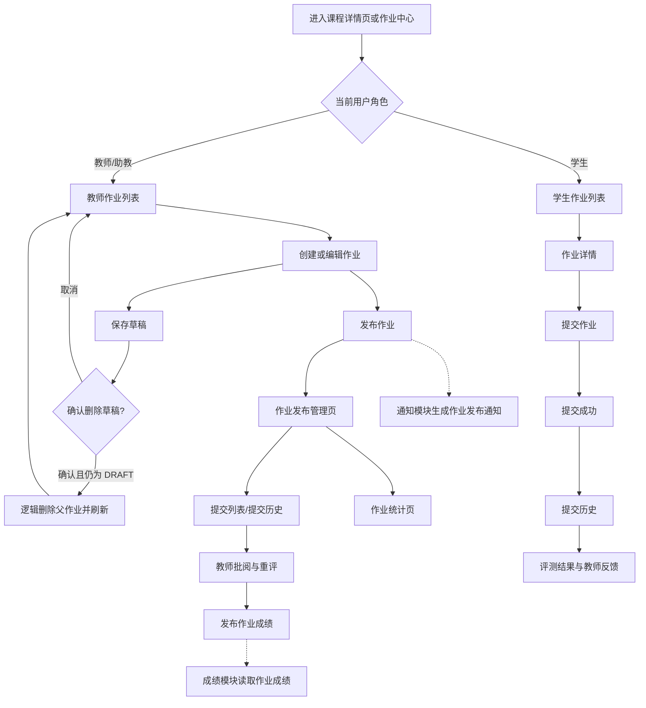
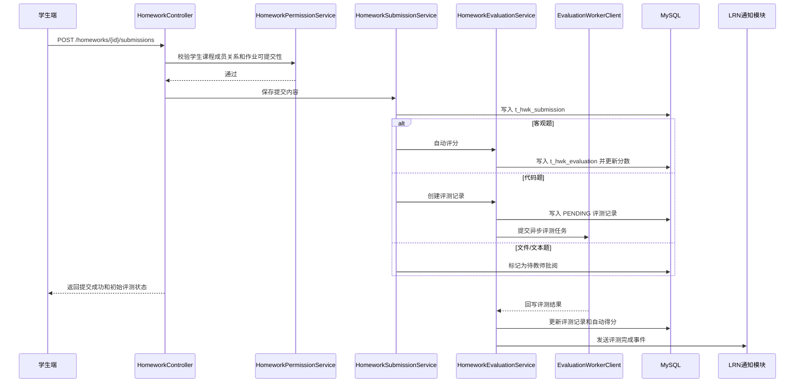
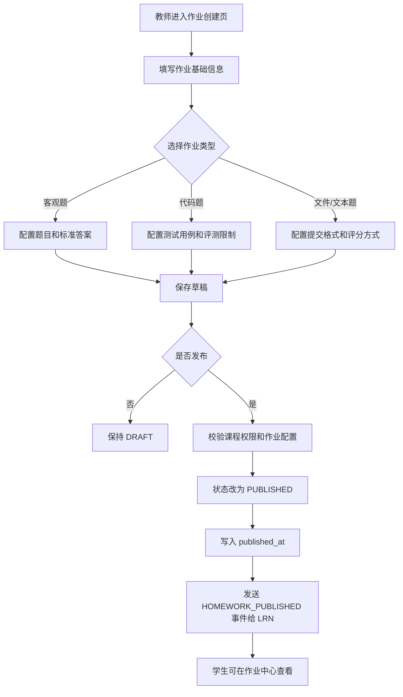
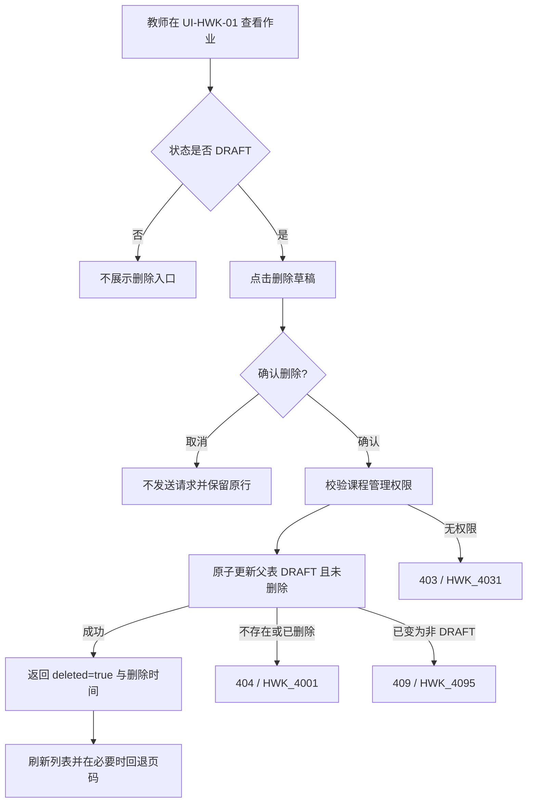
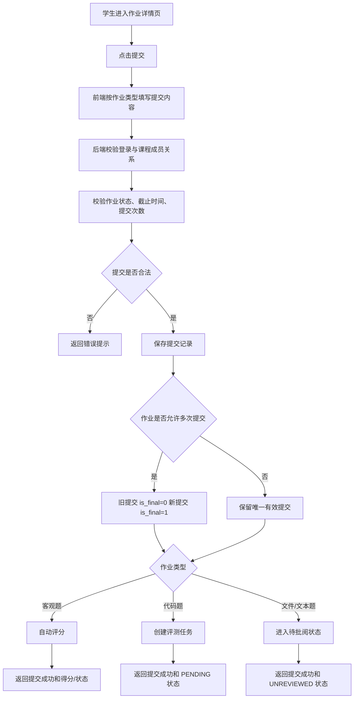
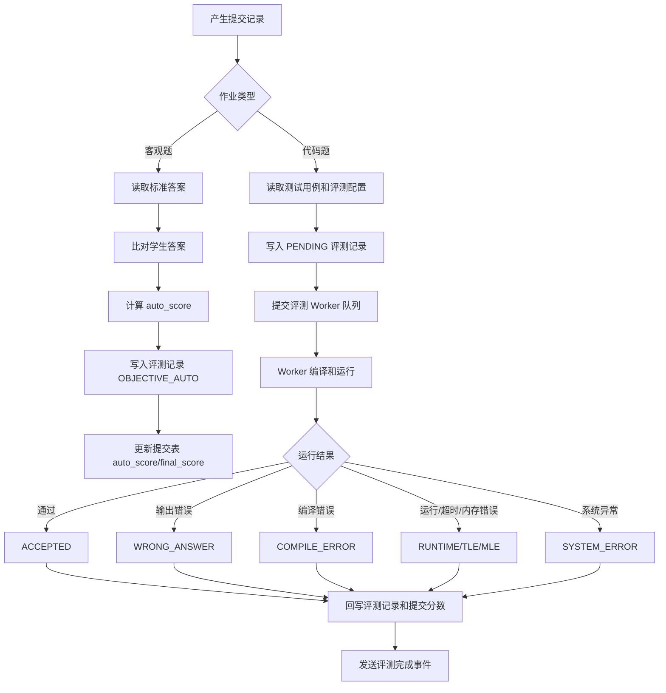
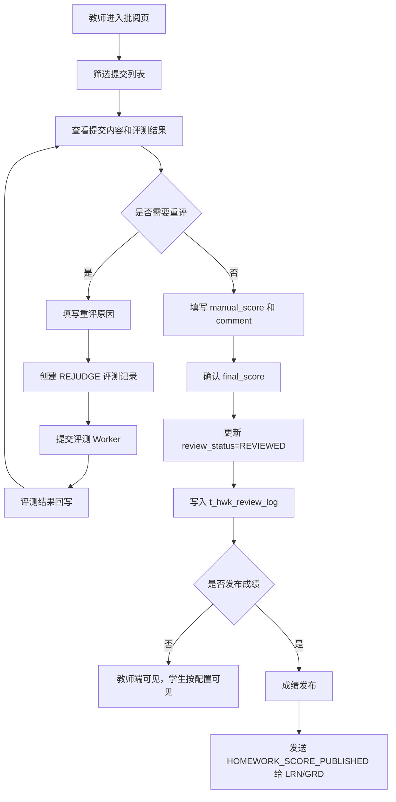
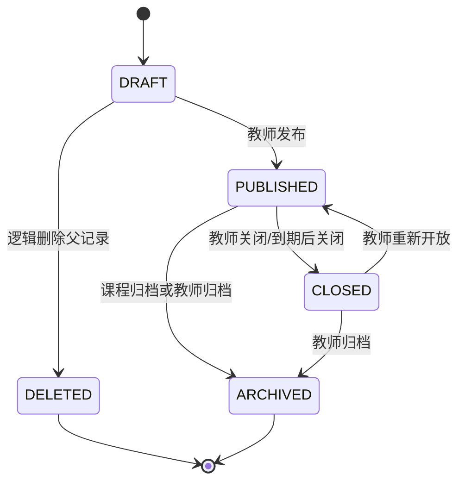
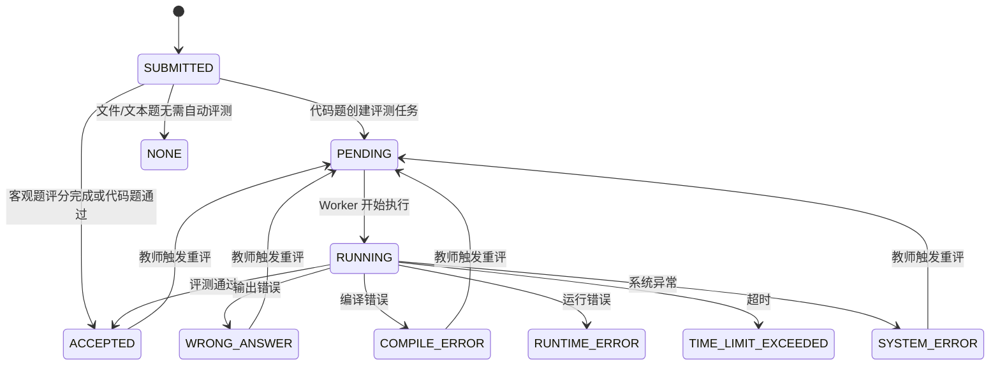

# HWK-作业与自动评测模块-详细设计提交稿

课程名称：软件工程基础  
项目名称：在线教学与实训平台  
模块名称：作业与自动评测模块  
模块缩写：HWK  
对应主文档章节：3.5 作业与自动评测模块（HWK）  
负责人：作业与自动评测模块负责人  
提交对象：详细设计负责人  
版本号：V1.0  
提交日期：2026 年 __ 月 __ 日

---

## 0 编写说明与设计边界

本文档为“在线教学与实训平台”中作业与自动评测模块（HWK）的详细设计提交稿，用于提交给详细设计负责人，并合并到《软件详细设计说明书》第 3.5 节及后续接口清单、数据库清单、需求追踪矩阵中。

本模块设计依据《软件需求规格说明书》《软件概要设计说明书》《软件详细设计说明书》底稿和《详细设计—各模块负责人分工》编写，重点覆盖作业创建与草稿逻辑删除、发布、题目与测试用例管理、学生提交、提交历史、自动评测、教师批阅、重评、反馈展示、单次作业统计、待处理名单和成绩推送等内容。

### 0.1 设计边界

HWK 模块负责：

1. 教师创建、编辑、逻辑删除草稿、发布、关闭和归档作业。
2. 教师配置客观题题目和代码题测试用例。
3. 学生查看作业详情并提交文本、附件、客观题答案或代码。
4. 系统保存提交历史，标识最新提交和有效提交。
5. 系统对客观题和代码题进行基础自动评测。
6. 教师查看提交内容，进行人工批阅、评分、评语填写和重评。
7. 学生查看允许公开的评测结果、最终成绩和教师反馈。
8. 教师查看单次作业的固定五档分数分布和未提交、待评测、待批阅名单。
9. 向 LRN 模块发送作业发布、截止提醒、评测完成、成绩发布等事件。
10. 向 GRD 模块提供作业成绩来源数据。

草稿删除只改变 `t_hwk_homework` 父记录的逻辑删除标记，不属于作业状态迁移；题目、测试用例、判题配置、提交、评测、批阅和重评历史全部保留。本期不实现已发布作业删除、恢复或永久删除。

HWK 模块不负责：

1. 用户注册、登录、角色与权限基础数据维护，该部分由 AUTH 模块负责。
2. 课程、章节、课程成员关系和课程资源基础数据维护，该部分由 CRS 模块负责。
3. 实验任务与实验评测流程，该部分由 LAB 模块负责。
4. 课程总评计算、成绩项权重配置、最终成绩发布总表，以及课程级/跨作业分析、自定义区间、趋势和统计快照，该部分由 GRD 模块负责。HWK 只提供单次作业、固定五档的即时统计，不维护 GRD 快照。
5. 站内通知列表展示、通知已读状态和消息中心页面，该部分由 LRN 模块负责。

### 0.2 首版实现范围

为保证课程项目可落地，首版 HWK 自动评测控制在基础能力范围内：

1. 客观题支持单选题、多选题、判断题自动评分。
2. 代码题支持基于预设测试用例的输入输出比对。
3. 文件提交题与文本题以教师人工批阅为主。
4. 代码评测采用异步任务方式，不在提交接口中同步等待运行结果。
5. 不实现复杂分布式在线判题平台能力，如大规模并发评测、复杂 Special Judge、交互式题目、排行榜和竞赛模式。

---

## 1 模块基本信息

| 项目 | 内容 |
| --- | --- |
| 模块名称 | 作业与自动评测模块 |
| 模块缩写 | HWK |
| 主责人 | 作业与自动评测模块负责人 |
| 对应需求 | FR-HWK-01 ~ FR-HWK-06 / NFR-HWK-01 ~ NFR-HWK-05 |
| 主要使用角色 | 学生、教师、助教 |
| 依赖模块 | AUTH、CRS、LRN |
| 协作模块 | LAB、GRD |
| 主要页面 | 作业列表页、作业详情页、作业发布页、作业提交页、批阅/提交队列页、反馈页、统计页 |
| 主要数据表 | 作业表、客观题题目表、测试用例表、提交表、评测记录表、批阅日志表 |
| 测试编号前缀 | TC-HWK |

---

## 2 模块职责与依赖关系

### 2.1 模块职责

HWK 模块是平台中连接“课程学习任务”和“成绩评价”的核心业务模块。教师通过本模块发布作业并配置评分方式；学生通过本模块完成作业提交；系统对客观题和代码题进行自动评测；教师可对提交进行人工批阅或触发重评；最终结果可供学生查看，并可作为 GRD 模块的成绩来源。

### 2.2 与其他模块的依赖关系

| 依赖方向 | 模块 | 依赖内容 | 交互方式 |
| --- | --- | --- | --- |
| HWK → AUTH | 用户权限与平台安全 | 当前用户身份、角色、权限码、登录状态 | JWT 认证上下文、权限拦截器 |
| HWK → CRS | 课程与教学资源 | 课程是否存在、章节是否存在、用户是否属于课程、教师是否有课程管理权限，以及统计时的当前活跃学生名单 | RESTful API 或服务接口 |
| HWK → LRN | 学习过程与通知提醒 | 作业发布、作业变更、截止提醒、评测完成、成绩发布通知 | 业务事件推送 |
| HWK ↔ LAB | 实训实验模块 | 共享评测 Worker 抽象、评测状态枚举、测试用例字段规范 | 共享评测服务接口，不直接访问对方业务表 |
| HWK → GRD | 成绩评价与教学分析 | 作业最终得分、提交状态、评分状态、来源更新时间 | RESTful API 或成绩同步事件 |

### 2.3 跨模块事件

| 事件编号 | 事件名称 | 触发时机 | 接收模块 | 主要字段 |
| --- | --- | --- | --- | --- |
| EVT-HWK-01 | HOMEWORK_PUBLISHED | 教师发布作业后 | LRN | homeworkId, courseId, title, deadline, receiverScope |
| EVT-HWK-02 | HOMEWORK_UPDATED | 教师修改已发布作业的重要信息后 | LRN | homeworkId, courseId, title, updatedFields |
| EVT-HWK-03 | HOMEWORK_DEADLINE_APPROACHING | 作业截止前定时扫描 | LRN | homeworkId, courseId, deadline, unsubmittedStudentIds |
| EVT-HWK-04 | HOMEWORK_EVALUATION_FINISHED | 自动评测完成后 | LRN | homeworkId, submissionId, studentId, status |
| EVT-HWK-05 | HOMEWORK_SCORE_PUBLISHED | 教师发布作业成绩后 | LRN、GRD | homeworkId, courseId, studentId, finalScore, publishedAt |

---

## 3 页面详细设计

### 3.1 页面清单

| 页面编号 | 页面名称 | 使用角色 | 页面目标 | 主要操作 | 调用接口 |
| --- | --- | --- | --- | --- | --- |
| UI-HWK-01 | 作业中心页 | 学生、教师、助教 | 汇总展示用户可见的作业列表 | 学生查看待完成/已提交/已截止作业；教师查看草稿/已发布/已关闭作业；按课程、状态、关键词筛选；仅对 DRAFT 确认式删除，失败保留、成功刷新并在末页为空时回退 | API-HWK-05、API-HWK-22 |
| UI-HWK-02 | 教师作业创建/编辑页 | 教师、助教 | 创建或修改作业基础信息 | 填写标题、说明、课程、章节、截止时间、作业类型、满分、提交限制、显示策略；保存草稿 | API-HWK-01、API-HWK-02 |
| UI-HWK-03 | 作业发布管理页 | 教师、助教 | 管理作业发布状态与配置 | 发布作业、关闭作业、查看发布信息、进入题目配置和测试用例配置 | API-HWK-03、API-HWK-04、API-HWK-14、API-HWK-16 |
| UI-HWK-04 | 学生作业详情页 | 学生 | 查看作业说明和提交要求 | 查看作业标题、说明、附件、截止时间、提交格式、当前提交状态；进入提交页或历史页 | API-HWK-06、API-HWK-08 |
| UI-HWK-05 | 学生作业提交页 | 学生 | 完成作业提交 | 提交文本答案、客观题答案、附件或代码；查看提交成功时间和初始评测状态 | API-HWK-07 |
| UI-HWK-06 | 提交历史页 | 学生、教师、助教 | 查看作业提交版本 | 学生查看本人历史提交；教师查看全班或指定学生提交；标识最新提交和有效提交 | API-HWK-08、API-HWK-09、API-HWK-10 |
| UI-HWK-07 | 评测结果页 | 学生、教师、助教 | 展示自动评测结果和反馈 | 查看评测状态、得分、通过用例数、错误类型、反馈摘要和公开日志 | API-HWK-11 |
| UI-HWK-08 | 教师批阅页 | 教师、助教 | 对提交进行人工批阅或重评 | 使用普通筛选或 `attention` 待评测/待批阅深链查看提交，填写人工分数与评语，触发重评；URL、刷新、前进和后退恢复筛选与页码 | API-HWK-09、API-HWK-10、API-HWK-12、API-HWK-13、API-HWK-19 |
| UI-HWK-09 | 作业统计页 | 教师、助教 | 查看单次作业完成情况、固定五档和三类跟进名单 | 查看提交率、评测/批阅进度、分数摘要、生成时间和固定五档；未提交走 API-HWK-15，待评测/待批阅走 API-HWK-09 attention；完成键盘、1440px 和 390px 验收 | API-HWK-09、API-HWK-15 |

### 3.2 页面流转图



### 3.3 页面交互要点

1. 学生端列表只展示当前学生所在课程中已发布且可见的作业，不展示草稿作业。
2. 教师端列表展示当前教师负责课程下的作业，可按草稿、已发布、已关闭、已归档筛选。
3. 作业详情页根据用户角色返回不同内容。学生端不展示标准答案、隐藏测试用例和内部评测日志。
4. 学生提交成功后，页面先展示“提交成功/评测排队中”，再通过轮询或通知刷新评测结果。
5. 教师批阅页应将自动得分、人工得分和最终得分分开展示，避免成绩来源混淆。
6. 若教师未发布成绩，学生只能查看系统配置允许公开的评测摘要，不展示未发布最终分数。
7. 统计页始终展示 `0-59`、`60-69`、`70-79`、`80-89`、`90-100` 五档，空分布也显示五个零值；三个跟进 Tab 均使用服务端分页，不由当前页数据推断全量名单。
8. 统计页和提交队列把 Tab、筛选和页码写入 URL，刷新、前进/后退及深链进入后均可恢复。
9. 姓名服务失败时使用不含用户编号的安全占位文案，不得展示裸 `studentId`；403 时不得渲染缓存统计或名单。
10. 教师总览仅对 DRAFT 展示删除入口；取消确认不发送请求，删除期间与编辑、发布等生命周期操作互斥。
11. 删除失败保留原行、筛选和页码并允许重试；成功后刷新，当前页为空时回退到有效页；1440px 与 390px 视口均需验收。

---

## 4 接口详细设计

### 4.1 接口清单

| 接口编号 | 接口名称 | 方法 | 路径 | 权限要求 | 对应需求 |
| --- | --- | --- | --- | --- | --- |
| API-HWK-01 | 创建作业 | POST | /api/v1/homeworks | 教师/助教，且具备课程管理权限 | FR-HWK-01 |
| API-HWK-02 | 修改作业 | PUT | /api/v1/homeworks/{homeworkId} | 教师/助教，且为作业所属课程管理者 | FR-HWK-01 |
| API-HWK-03 | 发布作业 | PUT | /api/v1/homeworks/{homeworkId}/publish | 教师/助教，且为作业所属课程管理者 | FR-HWK-01 |
| API-HWK-04 | 关闭作业 | PUT | /api/v1/homeworks/{homeworkId}/close | 教师/助教，且为作业所属课程管理者 | FR-HWK-01 |
| API-HWK-05 | 查询作业列表 | GET | /api/v1/homeworks | 已登录，按角色过滤数据 | FR-HWK-01、FR-HWK-02、FR-HWK-06 |
| API-HWK-06 | 查询作业详情 | GET | /api/v1/homeworks/{homeworkId} | 已登录，学生需为课程成员，教师需有课程权限 | FR-HWK-02、FR-HWK-06 |
| API-HWK-07 | 提交作业 | POST | /api/v1/homeworks/{homeworkId}/submissions | 学生，且为课程成员 | FR-HWK-02、FR-HWK-04 |
| API-HWK-08 | 查询我的提交历史 | GET | /api/v1/homeworks/{homeworkId}/my-submissions | 学生，且为课程成员 | FR-HWK-03 |
| API-HWK-09 | 查询作业提交列表 | GET | /api/v1/homeworks/{homeworkId}/submissions | 教师/助教，且有课程管理权限 | FR-HWK-03、FR-HWK-05 |
| API-HWK-10 | 查询提交详情 | GET | /api/v1/submissions/{submissionId} | 学生仅本人；教师/助教需有课程管理权限 | FR-HWK-03、FR-HWK-05、FR-HWK-06 |
| API-HWK-11 | 查询评测结果 | GET | /api/v1/submissions/{submissionId}/evaluation | 学生仅本人；教师/助教需有课程管理权限 | FR-HWK-04、FR-HWK-06 |
| API-HWK-12 | 触发重评 | POST | /api/v1/submissions/{submissionId}/reevaluate | 教师/助教，且有课程管理权限 | FR-HWK-04、FR-HWK-05 |
| API-HWK-13 | 教师批阅提交 | PUT | /api/v1/submissions/{submissionId}/review | 教师/助教，且有课程管理权限 | FR-HWK-05、FR-HWK-06 |
| API-HWK-14 | 批量发布作业成绩 | PUT | /api/v1/homeworks/{homeworkId}/scores/publish | 教师/助教，且有课程管理权限 | FR-HWK-05、FR-HWK-06 |
| API-HWK-15 | 查询作业统计 | GET | /api/v1/homeworks/{homeworkId}/statistics?page={page}&size={size} | 教师/助教，且有课程管理权限 | FR-HWK-06 |
| API-HWK-16 | 保存客观题题目 | PUT | /api/v1/homeworks/{homeworkId}/questions | 教师/助教，且有课程管理权限 | FR-HWK-01、FR-HWK-04 |
| API-HWK-17 | 查询客观题题目 | GET | /api/v1/homeworks/{homeworkId}/questions | 教师/助教；学生端不返回标准答案 | FR-HWK-02、FR-HWK-04 |
| API-HWK-18 | 保存代码题测试用例 | PUT | /api/v1/homeworks/{homeworkId}/test-cases | 教师/助教，且有课程管理权限 | FR-HWK-01、FR-HWK-04 |
| API-HWK-19 | 查询代码题测试用例 | GET | /api/v1/homeworks/{homeworkId}/test-cases | 教师/助教，且有课程管理权限 | FR-HWK-04、FR-HWK-05 |
| API-HWK-20 | 查询评测日志 | GET | /api/v1/evaluations/{evaluationId}/logs | 教师/助教，且有课程管理权限 | FR-HWK-04、FR-HWK-05 |
| API-HWK-21 | 查询批阅日志 | GET | /api/v1/submissions/{submissionId}/review-logs | 教师/助教，且有课程管理权限 | FR-HWK-05 |
| API-HWK-22 | 删除草稿作业 | DELETE | /api/v1/homeworks/{homeworkId} | 教师/助教，且为作业所属课程管理者；作业必须仍为 DRAFT | FR-HWK-01 |

#### 4.1.1 API-HWK-09 attention 兼容增量

| 项目 | 内容 |
| --- | --- |
| 主要入参 | studentKeyword, submitStatus, evaluationStatus, reviewStatus, attention, page, size |
| 主要出参 | `PageResponse<HomeworkSubmissionResponse>`，包含 records, total, page, size |
| 兼容规则 | `attention` 可选值为 `EVALUATION_PENDING` 或 `REVIEW_PENDING`；未传时保持原提交列表行为，传入时与已有筛选按 AND 组合 |
| 公共有效范围 | attention 只查询 CRS 当前活跃学生，且满足 `is_deleted=false`、`is_final=true`、`submit_status IN (SUBMITTED,LATE)`；历史、删除、REJECTED 和非当前学生排除 |
| EVALUATION_PENDING | OBJECTIVE/CODE 且评测为 NONE/PENDING/RUNNING；TEXT/FILE 的 NONE 排除 |
| REVIEW_PENDING | `review_status IN (UNREVIEWED,NEED_REVIEW)`；TEXT/FILE 可直接进入，OBJECTIVE/CODE 仅在 ACCEPTED、WRONG_ANSWER、COMPILE_ERROR、RUNTIME_ERROR、TIME_LIMIT_EXCEEDED、SYSTEM_ERROR 终态后进入 |
| 分页、排序与权限 | 1 基页码，size 1～100，`submitted_at DESC, id DESC` 稳定排序；学生和无课程管理权限教师返回 403，不返回记录总数或学生标识 |

#### 4.1.2 API-HWK-15 统计兼容增量

| 项目 | 内容 |
| --- | --- |
| 兼容出参 | 保留 `homeworkId`、`courseId`、`totalStudentCount`、`submittedCount`、`unsubmittedCount`、`evaluatedCount`、`reviewedCount`、`averageScore`、`maxScore`、`minScore`、`unsubmittedPage`、`unsubmittedSize`、`unsubmittedTotal`、`unsubmittedStudentIds` |
| 新增出参 | `autoEvaluableCount`、`pendingEvaluationCount`、`pendingReviewCount`、`scoredCount`、`scoreDistribution`、`generatedAt` |
| 统计范围 | 总人数来自 CRS 当前活跃 STUDENT；提交只纳入该名单中的未删除、最终、SUBMITTED/LATE 记录。活跃名单为空时返回零统计，不回退到提交人集合 |
| 评测/批阅 | `autoEvaluableCount` 仅 OBJECTIVE/CODE；其 NONE/PENDING/RUNNING 为待评测，六类终态为已评测；TEXT/FILE NONE 排除。待批阅与 API-HWK-09 REVIEW_PENDING 同口径，已批阅为 REVIEWED |
| 分数 | `effectiveScore = finalScore ?? autoScore`；平均/最高/最低分保留作业原始分值口径，五档分布先按 `effectiveScore / totalScore × 100` 归一化 |
| 固定五档 | 始终返回 `0-59:[0,60)`、`60-69:[60,70)`、`70-79:[70,80)`、`80-89:[80,90)`、`90-100:[90,100]`；空分布五档均为 0，`scoredCount` 等于档位合计 |
| 分页、时间与权限 | `page` 从 1 开始、size 1～100，只分页未提交名单，聚合字段覆盖整份作业；返回 `generatedAt`；学生和无权限教师返回 403 且不泄露任何统计或名单 |
| 实现约束 | 独立 `HomeworkStatisticsService` 读取活跃学生范围并调用 Repository 条件聚合 SQL，不加载全部最终提交到应用内存 |

### 4.2 主要接口说明

#### 4.2.1 创建作业 API-HWK-01

| 项目 | 内容 |
| --- | --- |
| 方法与路径 | POST /api/v1/homeworks |
| 调用方 | 教师端 |
| 主要入参 | courseId, chapterId, title, description, type, deadline, totalScore, allowResubmit, allowLateSubmit, showEvaluationBeforePublish, attachments, judgeConfig |
| 主要出参 | homeworkId, status, createdAt |
| 处理逻辑 | 校验教师身份和课程权限；校验课程、章节、作业类型、截止时间和满分；创建 DRAFT 状态作业；保存附件和评测配置引用 |
| 异常情况 | 无课程权限、课程不存在、截止时间不合法、作业类型不支持、满分配置不合法 |

#### 4.2.1A 删除草稿作业 API-HWK-22

| 项目 | 内容 |
| --- | --- |
| 方法与路径 | DELETE /api/v1/homeworks/{homeworkId} |
| 调用方 | 教师端、助教端 |
| 主要入参 | 路径参数 homeworkId；无请求体 |
| 主要出参 | 复用 HomeworkResponse，`deleted=true`，`updatedAt` 为删除时间 |
| 处理逻辑 | 读取未删除作业并校验课程管理权限；确认状态为 DRAFT；Repository 以 `id + status='DRAFT' + is_deleted=FALSE` 原子更新父表，不更新或删除任何子表或历史；返回删除后父作业快照 |
| 异常情况 | 无权限 `403 / HWK_4031`；不存在或已删除 `404 / HWK_4001`；任何非 DRAFT 状态 `409 / HWK_4095`；原子更新零行时读取当前记录分类 |

#### 4.2.2 提交作业 API-HWK-07

| 项目 | 内容 |
| --- | --- |
| 方法与路径 | POST /api/v1/homeworks/{homeworkId}/submissions |
| 调用方 | 学生端 |
| 主要入参 | answerText, answerJson, fileIds, codeText, language |
| 主要出参 | submissionId, submitStatus, evaluationStatus, submittedAt |
| 处理逻辑 | 校验学生身份和课程成员关系；校验作业状态、截止时间、提交次数和提交格式；保存提交记录；如果允许多次提交，则更新旧提交 isFinal=0，新提交 isFinal=1；客观题直接评分，代码题创建评测任务；文件题和文本题进入待批阅状态 |
| 异常情况 | 作业不存在、未发布、已关闭、学生不属于课程、超过截止时间且不允许逾期、文件格式不合法、重复提交不允许 |

#### 4.2.3 查询评测结果 API-HWK-11

| 项目 | 内容 |
| --- | --- |
| 方法与路径 | GET /api/v1/submissions/{submissionId}/evaluation |
| 调用方 | 学生端、教师端 |
| 主要入参 | submissionId |
| 主要出参 | evaluationStatus, score, passedCases, totalCases, errorType, feedback |
| 处理逻辑 | 校验数据访问权限；教师端返回完整评测摘要和日志入口；学生端根据 showEvaluationBeforePublish 和成绩发布状态控制可见字段 |
| 异常情况 | 提交不存在、无访问权限、评测尚未生成、成绩未发布且不允许提前查看 |

#### 4.2.4 教师批阅提交 API-HWK-13

| 项目 | 内容 |
| --- | --- |
| 方法与路径 | PUT /api/v1/submissions/{submissionId}/review |
| 调用方 | 教师端、助教端 |
| 主要入参 | manualScore, finalScore, comment |
| 主要出参 | submissionId, reviewStatus, finalScore |
| 处理逻辑 | 校验教师课程权限；校验分数范围；更新提交表 manualScore、finalScore、comment、reviewStatus、reviewedBy、reviewedAt；写入批阅日志；必要时向 GRD 提供更新后的来源成绩 |
| 异常情况 | 无课程权限、提交不存在、分数超出范围、作业已归档不可修改、日志写入失败 |

#### 4.2.5 触发重评 API-HWK-12

| 项目 | 内容 |
| --- | --- |
| 方法与路径 | POST /api/v1/submissions/{submissionId}/reevaluate |
| 调用方 | 教师端、助教端 |
| 主要入参 | reason |
| 主要出参 | evaluationId, status |
| 处理逻辑 | 校验教师权限；校验提交类型是否支持自动评测；新建 REJUDGE 类型评测记录；提交评测任务到评测 Worker；旧评测记录不删除；写入批阅日志 |
| 异常情况 | 提交不存在、非代码/客观题无法重评、评测任务创建失败、重评原因缺失 |

---

## 5 后端服务与组件设计

| 服务编号 | 服务/组件名称 | 主要职责 | 输入 | 输出 |
| --- | --- | --- | --- | --- |
| SVC-HWK-01 | HomeworkController | 接收作业相关 HTTP 请求，完成参数基础校验，调用业务服务 | HTTP 请求、认证上下文 | 统一 JSON 响应 |
| SVC-HWK-02 | HomeworkService | 处理作业创建、修改、草稿删除、发布、关闭、归档和详情查询；删除前校验课程管理权限与 DRAFT 状态并分类原子冲突 | 作业 DTO、当前用户信息 | 作业实体、作业详情 DTO |
| SVC-HWK-03 | HomeworkQuestionService | 管理客观题题目，保存题干、选项、答案和分值 | 题目配置 DTO | 题目列表、题目数量 |
| SVC-HWK-04 | HomeworkTestCaseService | 管理代码题测试用例，保存输入、期望输出、权重和隐藏状态 | 测试用例 DTO | 测试用例列表、用例数量 |
| SVC-HWK-05 | HomeworkSubmissionService | 处理学生提交、提交历史、提交详情和有效版本标识 | 提交内容、作业配置、当前学生 | 提交记录、提交历史 |
| SVC-HWK-06 | HomeworkEvaluationService | 处理客观题评分、代码评测任务创建、评测结果回写和重评 | 提交记录、题目答案、测试用例、评测回调 | 评测记录、自动得分 |
| SVC-HWK-07 | HomeworkReviewService | 处理教师批阅、人工评分、评语、最终得分确认和批阅日志 | 批阅 DTO、教师身份 | 批阅结果、日志记录 |
| SVC-HWK-08 | HomeworkStatisticsService | 独立负责单次作业统计：读取 CRS 当前活跃学生范围，编排未提交分页，并调用 Repository SQL 聚合数量、分数摘要和固定五档；不得把逻辑留在 HomeworkService 或加载全部最终提交到内存 | homeworkId、page、size、当前课程管理者 | 兼容增量作业统计 DTO |
| SVC-HWK-09 | HomeworkPermissionService | 封装课程成员校验、教师课程管理权限校验和提交访问权限校验 | 当前用户、courseId、homeworkId、submissionId | 权限校验结果 |
| SVC-HWK-10 | HomeworkEventPublisher | 向 LRN 和 GRD 发送作业事件和成绩来源事件 | 业务事件 DTO | 事件发送结果 |
| SVC-HWK-11 | EvaluationWorkerClient | 与 LAB 共享评测 Worker 抽象，提交代码评测任务并接收回调 | 评测任务、语言、限制参数、测试用例 | 评测任务状态、评测结果 |
| SVC-HWK-12 | HomeworkRepository/Mapper | 完成业务表访问；提供父表原子 `softDeleteDraft`，普通更新不得写删除标记且排除已删除记录；用条件聚合 SQL 和组合索引支持固定五档、有效范围和 attention 分页 | 实体对象、查询条件、CRS 活跃学生范围 | 数据库记录、聚合行、分页记录 |

### 5.1 服务调用关系



---

## 6 数据结构与数据库设计

### 6.1 状态枚举

#### 6.1.1 作业状态 HomeworkStatus

| 枚举值 | 说明 |
| --- | --- |
| DRAFT | 草稿，学生不可见 |
| NOT_OPEN | 已发布但尚未到开放时间，学生可查看但不可提交 |
| PUBLISHED | 已发布，课程学生可见 |
| CLOSED | 已关闭，不允许继续提交 |
| SCORE_PUBLISHED | 作业成绩已发布，可供学生查看并由 GRD 同步 |
| ARCHIVED | 已归档，只读保留 |

说明：以上为当前运行时持久化枚举，本期不修改；`OPEN` 若用于页面显示，仅为派生标签。

#### 6.1.2 作业类型 HomeworkType

| 枚举值 | 说明 |
| --- | --- |
| OBJECTIVE | 客观题作业，由系统根据标准答案自动评分 |
| FILE | 文件提交作业，以教师人工批阅为主 |
| CODE | 代码提交作业，由评测 Worker 根据测试用例自动评测 |
| TEXT | 文本提交作业，以教师人工批阅为主 |

#### 6.1.3 提交状态 SubmitStatus

| 枚举值 | 说明 |
| --- | --- |
| SUBMITTED | 正常提交 |
| LATE | 逾期提交 |
| REJECTED | 被业务规则拒绝或不再作为有效提交；统计和 attention 排除 |

#### 6.1.4 评测状态 EvaluationStatus

| 枚举值 | 说明 |
| --- | --- |
| NONE | 尚未产生评测或无需自动评测；OBJECTIVE/CODE 在 attention 中视为待评测，TEXT/FILE 排除 |
| PENDING | 等待评测 |
| RUNNING | 评测中 |
| ACCEPTED | 评测通过 |
| WRONG_ANSWER | 输出错误 |
| COMPILE_ERROR | 编译错误 |
| RUNTIME_ERROR | 运行错误 |
| TIME_LIMIT_EXCEEDED | 超出时间限制 |
| SYSTEM_ERROR | 系统评测异常 |

#### 6.1.5 批阅状态 ReviewStatus

| 枚举值 | 说明 |
| --- | --- |
| UNREVIEWED | 未批阅 |
| REVIEWED | 已批阅 |
| NEED_REVIEW | 自动评测终态后仍需教师处理；与 UNREVIEWED 一同构成待批阅候选 |

说明：以上为当前运行时代码和数据库实际状态。Issue #225 只组合查询，不新增、替换或重命名枚举；成绩发布由 `HomeworkStatus.SCORE_PUBLISHED` 表达，不属于 `ReviewStatus`。

### 6.2 数据表清单

| 表编号 | 表名 | 中文名 | 主要字段 | 说明 |
| --- | --- | --- | --- | --- |
| DB-HWK-01 | t_hwk_homework | 作业表 | id, course_id, chapter_id, title, description, type, status, total_score, deadline, allow_resubmit, allow_late_submit, show_evaluation_before_publish, judge_config_id, created_by, published_at, is_deleted, created_at, updated_at | 保存作业基础信息和发布配置 |
| DB-HWK-02 | t_hwk_question | 客观题题目表 | id, homework_id, question_type, stem, options_json, answer_json, score, sort_order | 保存客观题题干、选项、标准答案和分值 |
| DB-HWK-03 | t_hwk_test_case | 作业测试用例表 | id, homework_id, input_data, expected_output, score_weight, is_hidden, time_limit_ms, memory_limit_kb, sort_order | 保存代码题测试用例，隐藏用例不对学生公开 |
| DB-HWK-04 | t_hwk_submission | 作业提交表 | id, homework_id, student_id, submit_type, answer_text, answer_json, file_url, language, submit_status, evaluation_status, review_status, auto_score, manual_score, final_score, comment, version, is_final, submitted_at, reviewed_by, reviewed_at, created_at, updated_at, is_deleted | 保存学生提交内容、版本、有效性、提交状态、评测状态和评分结果 |
| DB-HWK-05 | t_hwk_evaluation | 作业评测记录表 | id, submission_id, homework_id, student_id, evaluation_type, status, score, passed_cases, total_cases, time_used_ms, memory_used_kb, feedback, log_url, started_at, finished_at | 保存每次自动评测或重评记录 |
| DB-HWK-06 | t_hwk_review_log | 作业批阅日志表 | id, submission_id, homework_id, student_id, operation_type, old_score, new_score, comment, operator_id, reason, created_at | 保存批阅、重评、成绩发布和分数调整留痕 |
| DB-HWK-07 | t_hwk_judge_config | 作业评测配置表 | id, homework_id, language_limit_json, time_limit_ms, memory_limit_kb, output_compare_mode, created_at, updated_at | 保存代码题统一评测配置，首版可简化为 homework 表中的 judge_config_id 引用 |

### 6.3 主要表结构说明

#### 6.3.1 t_hwk_homework 作业表

| 字段名 | 类型 | 是否为空 | 说明 |
| --- | --- | --- | --- |
| id | bigint | 否 | 主键 |
| course_id | bigint | 否 | 所属课程编号，逻辑关联 CRS 课程 |
| chapter_id | bigint | 是 | 所属章节编号，逻辑关联 CRS 章节 |
| title | varchar(255) | 否 | 作业标题 |
| description | text | 是 | 作业说明 |
| type | varchar(32) | 否 | 作业类型：OBJECTIVE/FILE/CODE/TEXT |
| status | varchar(32) | 否 | 作业状态：DRAFT/NOT_OPEN/PUBLISHED/CLOSED/SCORE_PUBLISHED/ARCHIVED |
| total_score | decimal(6,2) | 否 | 作业总分 |
| deadline | datetime | 否 | 截止时间 |
| allow_resubmit | tinyint | 否 | 是否允许多次提交 |
| allow_late_submit | tinyint | 否 | 是否允许逾期提交 |
| show_evaluation_before_publish | tinyint | 否 | 是否允许成绩发布前查看评测摘要 |
| judge_config_id | bigint | 是 | 评测配置编号 |
| created_by | bigint | 否 | 创建教师编号 |
| published_at | datetime | 是 | 发布时间 |
| is_deleted | tinyint | 否 | 逻辑删除标记 |
| created_at | datetime | 否 | 创建时间 |
| updated_at | datetime | 否 | 更新时间 |

建议索引：

```text
idx_hwk_homework_course_status(course_id, status)
idx_hwk_homework_deadline(deadline)
idx_hwk_homework_created_by(created_by)
```

父表草稿删除使用以下原子条件写入：

```sql
UPDATE t_hwk_homework
SET is_deleted = TRUE, updated_at = :deletedAt
WHERE id = :homeworkId
  AND status = 'DRAFT'
  AND is_deleted = FALSE;
```

普通修改、发布、关闭和成绩发布不得在 `SET` 中写入 `is_deleted`，并必须在 `WHERE` 中加入 `is_deleted = FALSE`。原子删除零行时读取当前记录，区分不存在/已删除与并发转为非 DRAFT；失败事务不得继续重建题目、测试用例或判题配置。

#### 6.3.2 t_hwk_submission 作业提交表

| 字段名 | 类型 | 是否为空 | 说明 |
| --- | --- | --- | --- |
| id | bigint | 否 | 主键 |
| homework_id | bigint | 否 | 作业编号 |
| student_id | bigint | 否 | 学生编号，来自 AUTH 用户 |
| submit_type | varchar(32) | 否 | 提交类型：TEXT/FILE/CODE/OBJECTIVE |
| answer_text | text | 是 | 文本答案或代码文本 |
| answer_json | text | 是 | 客观题答案 JSON |
| file_url | varchar(500) | 是 | 附件路径或文件服务地址 |
| language | varchar(32) | 是 | 代码语言，如 C/C++/Java/Python |
| submit_status | varchar(32) | 否 | 提交状态 |
| evaluation_status | varchar(32) | 否 | 评测状态 |
| review_status | varchar(32) | 否 | 批阅状态 |
| auto_score | decimal(6,2) | 是 | 自动评测得分 |
| manual_score | decimal(6,2) | 是 | 教师人工评分 |
| final_score | decimal(6,2) | 是 | 最终得分 |
| comment | varchar(1000) | 是 | 教师评语 |
| version | int | 否 | 同一学生同一作业的提交版本，从 1 递增 |
| is_final | tinyint | 否 | 是否为当前有效提交 |
| submitted_at | datetime | 否 | 提交时间 |
| reviewed_by | bigint | 是 | 批阅教师编号 |
| reviewed_at | datetime | 是 | 批阅时间 |
| created_at | datetime | 否 | 创建时间 |
| updated_at | datetime | 否 | 更新时间 |
| is_deleted | tinyint | 否 | 逻辑删除；统计和 attention 排除 |

建议索引：

```text
idx_hwk_submission_effective(homework_id, is_final, is_deleted, submit_status, student_id)
idx_hwk_submission_attention(homework_id, is_final, is_deleted, submitted_at, id, submit_status, student_id, submit_type, evaluation_status, review_status)
```

这两个索引直接对应真实查询：`effective` 覆盖统计有效范围，`attention` 在三个等值范围字段后放置稳定排序键 `submitted_at + id`，再覆盖其余组合筛选列。既有 `uk_hwk_submission_version(homework_id, student_id, version)` 已提供学生查询所需左前缀，不重复建索引；将多值状态列放在排序键前会破坏全局排序能力。组合索引通过新的增量迁移加入既有数据库并同步 fresh Compose schema；迁移测试验证索引名称和列顺序。

#### 6.3.3 t_hwk_evaluation 作业评测记录表

| 字段名 | 类型 | 是否为空 | 说明 |
| --- | --- | --- | --- |
| id | bigint | 否 | 主键 |
| submission_id | bigint | 否 | 提交编号 |
| homework_id | bigint | 否 | 作业编号 |
| student_id | bigint | 否 | 学生编号 |
| evaluation_type | varchar(32) | 否 | OBJECTIVE_AUTO/CODE_JUDGE/REJUDGE |
| status | varchar(32) | 否 | 评测状态 |
| score | decimal(6,2) | 是 | 自动评测得分 |
| passed_cases | int | 是 | 通过用例数 |
| total_cases | int | 是 | 总用例数 |
| time_used_ms | int | 是 | 运行耗时 |
| memory_used_kb | int | 是 | 内存使用 |
| feedback | text | 是 | 反馈摘要 |
| log_url | varchar(500) | 是 | 评测日志地址 |
| started_at | datetime | 是 | 开始评测时间 |
| finished_at | datetime | 是 | 结束评测时间 |

建议索引：

```text
idx_hwk_evaluation_submission(submission_id)
idx_hwk_evaluation_homework_student(homework_id, student_id)
idx_hwk_evaluation_status(status)
```

### 6.4 数据完整性约束

1. 每个作业必须归属于一个有效课程。
2. 每条学生提交必须关联一个有效作业和一个有效学生。
3. 同一学生在同一作业下可以有多条提交记录，但最多只有一条 `is_final = 1` 的有效提交。
4. 每次自动评测或重评都应生成独立评测记录，不覆盖旧评测记录。
5. 批阅、重评、发布成绩、分数调整等关键操作必须写入 `t_hwk_review_log`。
6. 对学生隐藏的测试用例和标准答案不得通过学生端接口返回。
7. API-HWK-22 只逻辑删除 DB-HWK-01 父记录；DB-HWK-02、03、07 和已有 DB-HWK-04、05、06 记录全部保留，不执行级联删除或替换。
8. 普通更新只允许命中未删除父记录，不接受客户端或旧实体携带的删除标记，防止并发旧请求复活作业。

---

## 7 关键业务流程与状态机

### 7.1 教师发布作业流程



关键控制点：

1. 发布前必须校验教师是否为课程教师或助教。
2. 代码题必须至少配置一个测试用例。
3. 客观题必须配置题目、答案和分值。
4. 作业总分必须大于 0，题目分值之和原则上不超过总分。

### 7.1A 教师删除草稿流程



删除期间编辑、发布等生命周期按钮保持互斥 pending。删除只更新父作业；全部子数据和历史保持不变。普通更新的未删除条件保证删除先成功时，删除前发出的旧编辑或发布请求不能复活记录。
5. 发布后修改截止时间、显示策略等重要信息时，需要记录日志并通知学生。

### 7.2 学生提交作业流程



关键控制点：

1. 学生提交时不允许前端传入 studentId，后端从认证上下文获取当前用户。
2. 若作业已关闭或已归档，不允许提交。
3. 若超过截止时间且不允许逾期提交，直接拒绝提交。
4. 若允许逾期提交，提交状态记为 LATE。
5. 代码评测失败不删除提交记录，只更新评测状态为 SYSTEM_ERROR 或具体错误状态。

### 7.3 自动评测流程



### 7.4 教师批阅与重评流程



### 7.5 作业状态机



状态说明：

| 状态 | 学生可见 | 可提交 | 教师可编辑 | 说明 |
| --- | --- | --- | --- | --- |
| DRAFT | 否 | 否 | 是 | 草稿阶段 |
| PUBLISHED | 是 | 是 | 部分可编辑 | 已发布阶段 |
| CLOSED | 是 | 否 | 部分可编辑 | 关闭后不允许提交 |
| ARCHIVED | 是，只读 | 否 | 否 | 归档保存历史 |

说明：`DELETED` 仅为 `is_deleted=true` 的图示伪终态，不是 `HomeworkStatus` 枚举值，也不支持恢复或永久删除。

### 7.6 提交与评测状态机



---

## 8 异常处理设计

### 8.1 异常码设计

| 错误码 | 错误名称 | 触发场景 | 用户提示 | 处理方式 |
| --- | --- | --- | --- | --- |
| HWK_4001 | HOMEWORK_NOT_FOUND | 作业不存在或已删除 | 作业不存在或已被删除 | 返回 404，不继续处理 |
| HWK_4002 | HOMEWORK_NOT_PUBLISHED | 学生访问未发布作业 | 作业尚未发布 | 返回 403 或 404，避免暴露草稿信息 |
| HWK_4003 | HOMEWORK_CLOSED | 作业已关闭或归档 | 作业已关闭，不能继续提交 | 返回业务错误 |
| HWK_4004 | DEADLINE_EXCEEDED | 超过截止时间且不允许逾期提交 | 已超过截止时间，不能提交 | 返回业务错误 |
| HWK_4005 | SUBMIT_FORMAT_INVALID | 提交格式、文件类型或代码语言不合法 | 提交格式不符合要求 | 返回参数错误 |
| HWK_4006 | RESUBMIT_NOT_ALLOWED | 不允许多次提交时重复提交 | 本作业不允许重复提交 | 返回业务错误 |
| HWK_4007 | TEST_CASE_REQUIRED | 代码题发布或评测时缺少测试用例 | 代码题需要配置测试用例 | 返回业务错误 |
| HWK_4008 | SCORE_OUT_OF_RANGE | 教师评分超出分数范围 | 分数超出允许范围 | 返回业务错误 |
| HWK_4009 | EVALUATION_TASK_FAILED | 评测任务创建失败 | 评测任务创建失败，请稍后重试 | 提交保留，评测状态标记为 SYSTEM_ERROR |
| HWK_4010 | EVALUATION_RESULT_NOT_VISIBLE | 学生试图查看未公开评分结果 | 当前结果尚未公开 | 返回无权限提示 |
| HWK_4031 | COURSE_PERMISSION_DENIED | 教师无课程管理权限或学生非课程成员 | 无权访问该作业 | 返回 403 |
| HWK_4095 | HOMEWORK_DELETE_STATE_CONFLICT | 删除时作业为 NOT_OPEN、PUBLISHED、CLOSED、SCORE_PUBLISHED、ARCHIVED 或任一非 DRAFT 状态 | 仅草稿作业可删除 | 返回 409，保留作业和全部子数据 |
| HWK_5001 | INTERNAL_ERROR | 未预期系统异常 | 系统异常，请稍后重试 | 记录错误日志并返回统一异常 |

### 8.2 异常处理原则

1. 所有接口返回统一响应格式 `{ code, message, data }`。
2. 权限异常与业务异常分开处理，避免把无权限误报为系统错误。
3. 自动评测失败不删除学生提交记录，提交仍可被教师查看。
4. 评测 Worker 超时、异常退出或返回异常时，评测状态标记为 SYSTEM_ERROR，并保存日志地址或错误摘要。
5. 教师重评失败时保留原评测结果，新评测记录标记为失败。
6. 批阅日志写入失败时，人工评分操作应回滚，避免分数变化无留痕。
7. 文件上传失败时不创建完整提交记录，或将提交标记为失败并提示重新上传，具体与文件模块统一。
8. 删除请求先校验课程权限与 DRAFT 状态，再执行父表原子条件更新；零影响行以当前记录区分 `HWK_4001` 与 `HWK_4095`。
9. 普通更新、发布、关闭和成绩发布必须排除已删除父记录；删除与旧更新竞争时，旧更新失败并回滚对子配置的写入。

---

## 9 安全、权限与日志设计

### 9.1 权限矩阵

| 操作 | 学生 | 教师 | 助教 | 管理员 | 权限控制说明 |
| --- | --- | --- | --- | --- | --- |
| 查询作业列表 | 可查询本人课程作业 | 可查询管理课程作业 | 可查询协助课程作业 | 可按平台权限查询 | 按课程成员关系过滤 |
| 查看作业详情 | 仅已发布作业 | 所属课程全部作业 | 所属课程全部作业 | 按权限查看 | 学生不返回答案和隐藏用例 |
| 创建/编辑作业 | 不允许 | 允许 | 允许，视课程角色配置 | 可管理 | 校验课程管理权限 |
| 删除草稿作业 | 不允许 | 允许，仅所属课程 DRAFT | 允许，仅具备课程管理权限且为 DRAFT | 仅具备该课程管理权限时允许 | 服务端校验课程管理权限、DRAFT 和未删除条件，不因管理员身份绕过课程范围 |
| 发布/关闭作业 | 不允许 | 允许 | 允许，视课程角色配置 | 可管理 | 写入操作日志 |
| 提交作业 | 允许，限本人 | 不允许代交 | 不允许代交 | 不允许代交 | studentId 从认证上下文获取 |
| 查看提交历史 | 仅本人 | 所属课程全部学生 | 所属课程全部学生 | 按权限查看 | 学生不得查看他人提交 |
| 查看评测结果 | 仅本人且按可见策略 | 所属课程全部提交 | 所属课程全部提交 | 按权限查看 | 隐藏日志仅教师可见 |
| 教师批阅 | 不允许 | 允许 | 允许，视课程角色配置 | 可管理 | 记录批阅日志 |
| 触发重评 | 不允许 | 允许 | 允许，视课程角色配置 | 可管理 | 记录重评原因 |
| 查看作业统计和待处理名单 | 不允许，返回 403 | 仅所属课程 | 仅协助课程 | 按平台权限 | 校验课程管理权限；403 不返回统计、名单或学生标识 |
| 发布作业成绩 | 不允许 | 允许 | 允许，视课程角色配置 | 可管理 | 通知 LRN 和 GRD |

### 9.2 敏感数据保护

1. 客观题标准答案 `answer_json` 仅教师端接口可返回，学生端提交与查询接口不得返回。
2. 隐藏测试用例 `is_hidden = 1` 的输入输出仅教师端可查看。
3. 代码评测日志中的完整编译日志和运行日志默认仅教师端可查看，学生端仅展示摘要。
4. 学生提交记录只能由本人、课程教师、助教或管理员查看。
5. 批阅日志、重评原因和成绩调整记录仅教师端、管理员端或测试审查时可查看。
6. 统计和待处理名单的姓名服务失败时使用安全占位文案，不回退展示裸 `studentId`；无权请求在服务端返回 403，不先返回部分统计。

### 9.3 日志与审计

| 日志类型 | 记录时机 | 记录内容 | 存储位置 |
| --- | --- | --- | --- |
| 作业操作日志 | 创建、修改、删除草稿、发布、关闭、归档作业 | operatorId, homeworkId, operationType, beforeValue, afterValue, createdAt | 可复用审计日志或扩展日志；#224 不新增通用生命周期审计模型 |
| 提交日志 | 学生提交成功或失败 | studentId, homeworkId, submitStatus, submittedAt, failureReason | t_hwk_submission / 系统日志 |
| 评测日志 | 评测开始、完成、失败、超时 | evaluationId, status, score, passedCases, errorType, logUrl | t_hwk_evaluation |
| 批阅日志 | 教师评分、修改分数、触发重评、发布成绩 | submissionId, oldScore, newScore, operatorId, reason, createdAt | t_hwk_review_log |
| 安全日志 | 越权访问、查看他人提交、非法查看隐藏用例 | userId, targetId, operation, result, clientIp | AUTH 审计日志或系统安全日志 |

---

## 10 性能与可维护性设计

### 10.1 性能设计

1. 作业列表、提交列表、批阅列表和未提交/待评测/待批阅名单均采用服务端分页；页码从 1 开始，size 为 1～100。
2. 统计查询使用 `idx_hwk_submission_effective` 覆盖最终有效提交范围；待处理列表使用 `idx_hwk_submission_attention`，以 `homework_id + is_final + is_deleted + submitted_at + id` 支撑稳定分页，后续列覆盖组合筛选。
3. 学生提交接口只负责提交记录落库和评测任务创建，不同步等待代码评测完成。
4. 自动评测通过后台 Worker 异步执行，前端通过轮询或通知刷新结果。
5. 作业统计由独立 `HomeworkStatisticsService` 编排，Repository 必须使用条件聚合 SQL 计算基础数量、原始分数摘要和固定五档，不得加载全部最终提交到应用内存。HWK 不维护统计快照；课程级和跨作业快照由 GRD 负责。
6. 对附件和代码文件只保存文件路径或文件 ID，避免大文件直接存入业务表。

### 10.2 可维护性设计

1. Controller、Service、Mapper 分层明确，避免页面逻辑和数据库访问逻辑混杂。
2. 自动评测通过 `EvaluationWorkerClient` 抽象，便于与 LAB 模块共用评测能力，也便于测试 Mock。
3. 状态枚举统一定义，前后端共享状态含义，避免硬编码字符串分散。
4. 对外事件通过 `HomeworkEventPublisher` 统一发送，便于后续替换为消息队列。
5. 批阅和重评都生成日志记录，便于问题排查和测试验收。
6. 数据表采用逻辑删除和公共时间字段，便于恢复和追踪历史数据。
7. 普通更新不接收或写入 `is_deleted`，并统一带 `is_deleted=FALSE` 条件；草稿删除走独立原子 `softDeleteDraft`，避免通用更新复活父记录或重建子配置。

### 10.3 可靠性设计

1. 学生提交成功前必须完成提交记录落库。
2. 评测任务状态持久化，避免页面刷新或 Worker 异常导致状态丢失。
3. 评测失败不影响提交记录本身，教师仍可查看提交内容并人工处理。
4. 发布成绩、批阅分数和写入批阅日志应在事务中完成。
5. 向 LRN 或 GRD 发送事件失败时，业务主数据保留，并记录事件发送失败状态，后续可重试。
6. 草稿删除只更新父表 `is_deleted/updated_at`；删除条件和 DRAFT 状态在同一 SQL 中判定，普通更新受未删除条件保护，全部子数据和历史保持完整。

---

## 11 需求追踪与测试关注点

### 11.1 需求追踪矩阵

| 需求编号 | 详细设计编号 | 页面编号 | API 编号 | 数据表编号 | 测试编号 |
| --- | --- | --- | --- | --- | --- |
| FR-HWK-01 作业创建与发布 | DS-HWK-01 | UI-HWK-01、UI-HWK-02、UI-HWK-03 | API-HWK-01、API-HWK-02、API-HWK-03、API-HWK-04、API-HWK-16、API-HWK-18、API-HWK-22 | DB-HWK-01、DB-HWK-02、DB-HWK-03、DB-HWK-07 | TC-HWK-01、TC-HWK-02、TC-HWK-03、TC-HWK-19 |
| FR-HWK-02 学生作业查看与提交 | DS-HWK-02 | UI-HWK-04、UI-HWK-05 | API-HWK-05、API-HWK-06、API-HWK-07、API-HWK-17 | DB-HWK-01、DB-HWK-02、DB-HWK-04 | TC-HWK-04、TC-HWK-05、TC-HWK-06 |
| FR-HWK-03 提交历史管理 | DS-HWK-03 | UI-HWK-06 | API-HWK-08、API-HWK-09、API-HWK-10 | DB-HWK-04 | TC-HWK-07、TC-HWK-08 |
| FR-HWK-04 自动评测 | DS-HWK-04 | UI-HWK-05、UI-HWK-07、UI-HWK-08 | API-HWK-07、API-HWK-11、API-HWK-12、API-HWK-18、API-HWK-19、API-HWK-20 | DB-HWK-03、DB-HWK-04、DB-HWK-05 | TC-HWK-09、TC-HWK-10、TC-HWK-11、TC-HWK-12 |
| FR-HWK-05 教师批阅与重评 | DS-HWK-05 | UI-HWK-08、UI-HWK-09 | API-HWK-09、API-HWK-10、API-HWK-12、API-HWK-13、API-HWK-21 | DB-HWK-04、DB-HWK-05、DB-HWK-06 | TC-HWK-13、TC-HWK-14、TC-HWK-15 |
| FR-HWK-06 作业反馈与结果展示 | DS-HWK-06 | UI-HWK-01、UI-HWK-04、UI-HWK-07、UI-HWK-09 | API-HWK-05、API-HWK-06、API-HWK-09、API-HWK-11、API-HWK-14、API-HWK-15 | DB-HWK-04、DB-HWK-05、DB-HWK-06 | TC-HWK-16、TC-HWK-17、TC-HWK-18 |
| NFR-HWK-01 可靠性 | DS-HWK-N01 | UI-HWK-05、UI-HWK-08 | API-HWK-07、API-HWK-11、API-HWK-13 | DB-HWK-04、DB-HWK-05、DB-HWK-06 | TC-HWK-N01 |
| NFR-HWK-02 性能 | DS-HWK-N02 | UI-HWK-01、UI-HWK-06、UI-HWK-09 | API-HWK-05、API-HWK-09、API-HWK-15 | DB-HWK-01、DB-HWK-04、DB-HWK-05 | TC-HWK-N02 |
| NFR-HWK-03 可追踪性 | DS-HWK-N03 | UI-HWK-06、UI-HWK-08 | API-HWK-10、API-HWK-20、API-HWK-21 | DB-HWK-04、DB-HWK-05、DB-HWK-06 | TC-HWK-N03 |
| NFR-HWK-04 安全性 | DS-HWK-N04 | 全部 HWK 页面 | 全部 HWK 接口 | DB-HWK-02、DB-HWK-03、DB-HWK-04、DB-HWK-05 | TC-HWK-N04 |
| NFR-HWK-05 可测试性 | DS-HWK-N05 | 全部 HWK 页面 | 全部 HWK 接口 | 全部 HWK 数据表 | TC-HWK-N05 |

### 11.2 测试关注点

| 测试编号 | 测试目标 | 测试内容 | 预期结果 |
| --- | --- | --- | --- |
| TC-HWK-01 | 作业创建 | 教师创建客观题、文件题、代码题作业 | 作业保存为 DRAFT，字段正确落库 |
| TC-HWK-02 | 作业发布 | 教师发布配置完整的作业 | 状态变为 PUBLISHED，学生可见，发送通知事件 |
| TC-HWK-03 | 发布异常 | 代码题未配置测试用例即发布 | 返回配置错误，不允许发布 |
| TC-HWK-04 | 学生查看作业 | 学生进入已发布作业详情页 | 正常显示说明和提交要求，不显示答案和隐藏用例 |
| TC-HWK-05 | 学生提交作业 | 学生提交合法内容 | 生成提交记录，返回提交成功和提交时间 |
| TC-HWK-06 | 截止后提交 | 不允许逾期时学生超时提交 | 返回截止错误，不生成有效提交 |
| TC-HWK-07 | 提交历史 | 允许多次提交时学生提交多次 | 历史记录完整，最新提交 is_final=1 |
| TC-HWK-08 | 教师查看提交 | 不传 attention、分别传两类 attention，并与旧筛选组合 | 不传时兼容原行为；attention 仅含当前活跃学生的最终有效 SUBMITTED/LATE 提交，按 `submitted_at DESC, id DESC` 稳定分页，组合筛选按 AND 处理 |
| TC-HWK-09 | 客观题自动评分 | 学生提交客观题答案 | 系统自动计算分数并生成评测记录 |
| TC-HWK-10 | 代码题自动评测 | 学生提交代码 | 先返回 PENDING，评测结束后返回通过用例数和得分 |
| TC-HWK-11 | 评测失败 | 模拟编译错误、运行错误、超时 | 评测状态正确记录，提交记录不丢失 |
| TC-HWK-12 | 重评 | 教师触发重评 | 新增评测记录，不删除旧评测记录 |
| TC-HWK-13 | 人工批阅 | 教师填写分数和评语 | 更新 manualScore、finalScore、comment，并写入批阅日志 |
| TC-HWK-14 | 分数范围校验 | 教师填写超出总分的分数 | 返回分数错误，不更新成绩 |
| TC-HWK-15 | 批阅日志 | 教师评分、重评、发布成绩 | 日志中记录操作人、时间、原因和分数变化 |
| TC-HWK-16 | 反馈展示 | 学生查看自己的反馈 | 根据配置展示评测摘要、成绩和教师评语 |
| TC-HWK-17 | 未发布成绩控制 | 学生成绩发布前查看结果 | 不显示未公开最终分数 |
| TC-HWK-18 | 作业统计与三类跟进名单 | 准备五档边界、非 100 满分、空分布、无分数、历史/删除/REJECTED/非当前学生、TEXT/FILE NONE、代码评测中/终态样本；查看统计并切换三类 Tab | 六个新增字段、五档、归一化和 `generatedAt` 正确，`scoredCount` 等于档位合计；评测/批阅语义和范围正确；名单服务端分页、稳定排序、URL 可恢复；SQL 聚合与组合索引生效 |
| TC-HWK-19 | 草稿逻辑删除契约与教师入口 | 准备 DRAFT/全部非 DRAFT、权限用户、已删除作业、完整子数据和历史、并发旧更新及当前页唯一草稿；验证 API-HWK-22 成功/取消/403/404/409/并发防复活/子历史保留、UI-HWK-01 pending/失败保留/末页回退和 1440px/390px | 仅课程管理者删除 DRAFT；成功返回 `deleted=true` 和删除时间；HWK_4001/HWK_4031/HWK_4095 分类准确；普通更新不能复活；只软删父表；仅 DRAFT 显示入口，页面反馈及页码正确 |
| TC-HWK-N02 | 统计性能与索引 | 使用大于单页的数据查询 API-HWK-09/15，并检查迁移元数据和查询实现 | 1 基分页、size 1～100 与聚合总数正确；Repository 使用 SQL 聚合，组合索引名称和列顺序正确，不加载全部最终提交到应用内存 |
| TC-HWK-N04 | 权限安全 | 学生和无权限教师访问统计/attention，模拟姓名服务失败 | 返回 403 且不泄露统计、名单或学生标识；页面不展示裸 `studentId` |

---

## 12 与其他模块待确认事项

| 编号 | 待确认事项 | 相关模块 | 建议处理方式 |
| --- | --- | --- | --- |
| TODO-HWK-01 | 课程教师/助教权限的具体权限码名称 | AUTH、CRS | 由后端总设计师统一权限码，例如 `HWK_MANAGE`、`HWK_REVIEW` |
| TODO-HWK-02 | 当前活跃学生名单和课程权限接口保持稳定 | CRS | 统计以角色 STUDENT、成员状态 ACTIVE、未删除的 CRS 名单为唯一范围；空名单返回零统计，不回退到提交人集合 |
| TODO-HWK-03 | 评测 Worker 的任务格式和回调格式 | LAB、后端总设计师 | LAB 与 HWK 共用 `EvaluationTaskDTO` 和 `EvaluationResultDTO` |
| TODO-HWK-04 | 附件上传后的文件 ID、fileUrl 规范 | CRS、文件服务负责人 | 统一文件元数据结构，HWK 只保存文件 ID 或路径 |
| TODO-HWK-05 | LRN 通知事件字段格式 | LRN | 统一事件名称、接收人范围和消息模板 |
| TODO-HWK-06 | GRD 读取 HWK 来源成绩的方式 | GRD | 优先提供来源成绩查询接口，发布成绩时发送事件 |
| TODO-HWK-07 | 助教是否允许发布成绩和触发重评 | AUTH、CRS、GRD | 根据课程成员角色确定，建议首版允许教师，助教权限可配置 |

---

## 13 模块提交结论

本提交稿已覆盖 HWK 模块详细设计所需的主要内容，包括页面设计、接口设计、服务组件、数据结构、关键流程、状态机、异常处理、安全权限、性能设计和需求追踪表。文档内容可直接合并到《软件详细设计说明书》第 3.5 节，并可补充到接口清单、数据库表清单和测试计划中。

本模块后续重点需要与 AUTH、CRS、LRN、LAB、GRD 模块确认以下接口契约：课程成员权限校验、评测 Worker 任务格式、通知事件格式、成绩来源同步格式和文件存储字段规范。确认后即可进入前后端联调和测试用例编写阶段。
