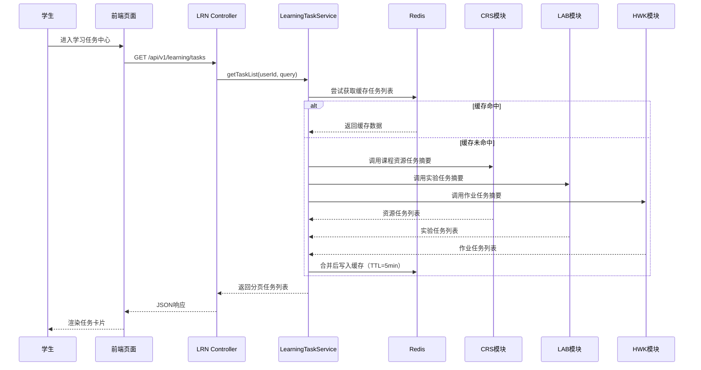
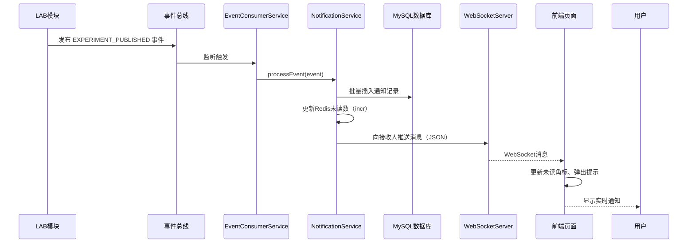
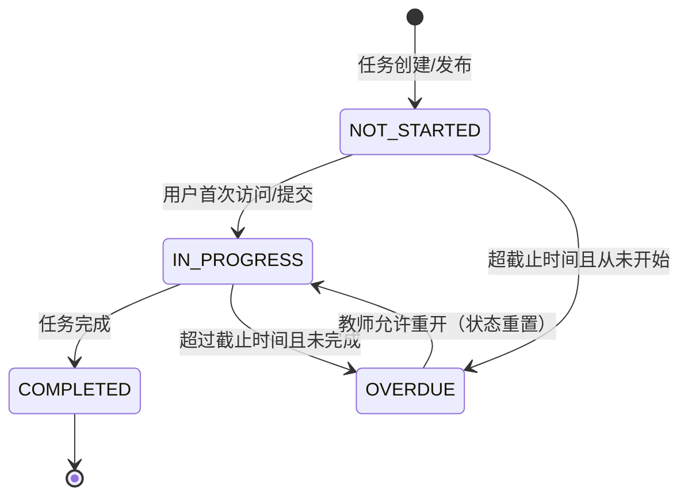
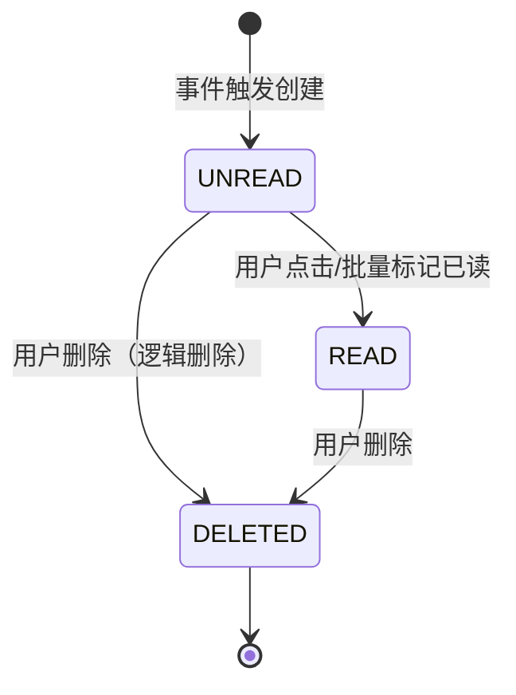

[TOC]

---

# 学习过程与通知提醒模块详细设计提交稿（LRN）

## 0 编写说明与设计边界

本文档为“在线教学与实训平台”学习过程与通知提醒模块的详细设计提交稿。文档内容涵盖模块职责、页面、接口、服务、数据库、关键流程、状态机、异常处理、安全性能及需求追踪，符合《软件详细设计说明书》第3.3节模板要求。

模块负责人：学习过程与通知提醒模块负责人  
对应需求：FR-LN-01 ~ FR-LN-06，NFR-LN-01 ~ NFR-LN-05  
依赖模块：AUTH、CRS  
被依赖模块：LAB、HWK、GRD  

## 1 模块基本信息

| 项目     | 内容                                                         |
| -------- | ------------------------------------------------------------ |
| 模块名称 | 学习过程与通知提醒（LRN）                                    |
| 模块缩写 | LRN                                                          |
| 功能定位 | 学习任务聚合、学习进度记录、学习行为跟踪、通知推送与状态管理、定时提醒 |
| 核心数据 | 学习任务快照、学习进度、学习记录、通知、通知状态日志、提醒规则、通知偏好 |
| 技术栈   | Spring Boot、MyBatis-Plus、Vue3+TypeScript、WebSocket、Redis |

## 2 模块职责与依赖关系

### 2.1 职责

- 从 CRS、LAB、HWK 聚合任务摘要，形成学习任务中心。
- 记录学生对课程、章节、资源的访问进度，支持断点续传。
- 采集学习行为数据（时长、访问次数），提供个人学习仪表盘。
- 接收 LAB、HWK、GRD 的业务事件，生成站内通知并管理已读/删除状态。
- 支持用户配置非必要通知开关及任务截止提醒规则。

### 2.2 依赖关系

| 依赖方 | 被依赖方    | 依赖内容                                     |
| ------ | ----------- | -------------------------------------------- |
| LRN    | AUTH        | 当前用户身份、角色、权限                     |
| LRN    | CRS         | 课程信息、章节信息、课程成员关系             |
| LRN    | LAB/HWK/GRD | 事件接收（发布、截止、评测完成、成绩发布等） |

### 2.3 接口提供

| 接口分类       | 说明                                 |
| -------------- | ------------------------------------ |
| 学习任务与进度 | 任务列表、进度查询、进度保存         |
| 学习行为       | 行为上报、仪表盘统计                 |
| 通知管理       | 查询、标记已读、删除、事件接收       |
| 规则配置       | 提醒规则查询/保存、通知偏好查询/保存 |

---

## 3 页面详细设计

| 页面编号  | 页面名称       | 使用角色 | 页面目标                                                 | 主要操作             | 调用接口                           |
| --------- | -------------- | -------- | -------------------------------------------------------- | -------------------- | ---------------------------------- |
| UI-LRN-01 | 学习任务中心页 | 学生     | 统一查看课程资源、实验、作业三类任务，支持状态筛选和跳转 | 任务筛选、排序、跳转 | API-LRN-01                         |
| UI-LRN-02 | 学习进度页     | 学生     | 展示课程级和章节级学习进度，支持继续学习                 | 查看进度、继续学习   | API-LRN-02、API-LRN-03             |
| UI-LRN-03 | 学习行为仪表盘 | 学生     | 展示近7天学习趋势、完成任务数、学习时长                  | 无主动操作           | API-LRN-04、API-LRN-05             |
| UI-LRN-04 | 消息通知中心页 | 全体     | 查看分类通知、标记已读、删除、跳转业务页面               | 筛选、批量已读、删除 | API-LRN-06、API-LRN-07、API-LRN-08 |
| UI-LRN-05 | 提醒规则设置页 | 学生     | 设置非必要通知开关和截止提醒规则                         | 开关切换、规则保存   | API-LRN-10、API-LRN-11             |

## 4 接口详细设计

统一响应格式：
```json
{
  "code": 0,
  "message": "success",
  "data": {}
}
```

### 4.1 学习任务中心接口

| 接口编号   | 接口名称                   | 方法 | 路径                        | 权限要求 | 对应需求 |
| ---------- | -------------------------- | ---- | --------------------------- | -------- | -------- |
| API-LRN-01 | 获取学习任务列表           | GET  | /api/v1/learning/tasks      | 登录     | FR-LN-01 |
| API-LRN-02 | 获取课程/章节学习进度      | GET  | /api/v1/learning/progress   | 登录     | FR-LN-02 |
| API-LRN-03 | 保存学习进度（断点续传）   | POST | /api/v1/learning/progress   | 登录     | FR-LN-02 |
| API-LRN-04 | 获取学习行为统计（仪表盘） | GET  | /api/v1/learning/statistics | 登录     | FR-LN-03 |
| API-LRN-05 | 上报学习行为记录           | POST | /api/v1/learning/records    | 登录     | FR-LN-03 |

**请求/响应示例（API-LRN-01）**：

请求参数（Query）：
| 参数     | 类型   | 必填 | 说明                                                 |
| -------- | ------ | ---- | ---------------------------------------------------- |
| taskType | string | 否   | 任务类型：RESOURCE/EXPERIMENT/HOMEWORK，多个逗号分隔 |
| status   | string | 否   | NOT_STARTED/IN_PROGRESS/COMPLETED/OVERDUE            |
| courseId | long   | 否   | 课程ID                                               |
| sortBy   | string | 否   | 排序字段：deadline/createdAt，默认deadline           |
| order    | string | 否   | asc/desc，默认asc                                    |
| page     | int    | 否   | 页码，默认1                                          |
| size     | int    | 否   | 每页条数，默认20                                     |

响应示例：
```json
{
  "code": 0,
  "data": {
    "records": [
      {
        "taskId": 1001,
        "taskType": "HOMEWORK",
        "title": "Java作业1",
        "courseId": 10,
        "courseName": "Java程序设计",
        "deadline": "2026-06-01 23:59:59",
        "progress": 0,
        "status": "NOT_STARTED",
        "actionUrl": "/courses/10/homeworks/5"
      }
    ],
    "total": 45,
    "page": 1,
    "size": 20
  }
}
```

**API-LRN-03 请求体**：
```json
{
  "courseId": 10,
  "chapterId": 101,
  "sourceModule": "CRS",
  "sourceId": 2001,
  "progressPercent": 65,
  "lastPosition": "video_play_time=1234"
}
```

### 4.2 通知管理接口

| 接口编号   | 接口名称             | 方法   | 路径                                   | 权限要求                 | 对应需求 |
| ---------- | -------------------- | ------ | -------------------------------------- | ------------------------ | -------- |
| API-LRN-06 | 获取通知列表         | GET    | /api/v1/notifications                  | 登录                     | FR-LN-04 |
| API-LRN-07 | 标记已读             | PUT    | /api/v1/notifications/read             | 登录                     | FR-LN-05 |
| API-LRN-08 | 删除通知             | DELETE | /api/v1/notifications/{notificationId} | 登录                     | FR-LN-05 |
| API-LRN-09 | 接收业务事件（内部） | POST   | /api/v1/notifications/events           | 内部服务（IP白名单/JWT） | FR-LN-04 |

**API-LRN-06 请求参数**：`type`、`isRead`、`startTime`、`endTime`、`page`、`size`

**API-LRN-07 请求体**：
```json
{
  "notificationIds": [1,2,3],
  "readAll": false
}
```

**API-LRN-09 请求体**（事件格式）：
```json
{
  "eventType": "HOMEWORK_PUBLISHED",
  "sourceModule": "HWK",
  "sourceId": 123,
  "receiverUserIds": [1001, 1002],
  "title": "新作业发布：Java编程题",
  "content": "作业截止时间：2026-06-01",
  "priority": 1,
  "actionUrl": "/courses/10/homeworks/123"
}
```

### 4.3 提醒规则与通知偏好接口

| 接口编号   | 接口名称               | 方法 | 路径                   | 权限要求 | 对应需求 |
| ---------- | ---------------------- | ---- | ---------------------- | -------- | -------- |
| API-LRN-10 | 获取提醒规则及通知偏好 | GET  | /api/v1/reminder-rules | 登录     | FR-LN-06 |
| API-LRN-11 | 保存提醒规则及通知偏好 | PUT  | /api/v1/reminder-rules | 登录     | FR-LN-06 |

**API-LRN-10 响应示例**：
```json
{
  "rules": [
    { "reminderType": "HOMEWORK_DEADLINE", "aheadMinutes": 1440, "enabled": true },
    { "reminderType": "HOMEWORK_DEADLINE", "aheadMinutes": 60, "enabled": true }
  ],
  "settings": {
    "enableExperiment": true,
    "enableHomework": true,
    "enableGrade": true,
    "enableAnnouncement": true,
    "enableNonCriticalReminder": false
  }
}
```

## 5 后端服务与组件设计

| 服务编号   | 服务/组件名称         | 主要职责                                                     | 输入                       | 输出                  |
| ---------- | --------------------- | ------------------------------------------------------------ | -------------------------- | --------------------- |
| SVC-LRN-01 | LearningTaskService   | 聚合 CRS/LAB/HWK 任务数据，管理任务快照缓存，处理进度保存与查询 | userId, query, progressDTO | 分页任务列表、进度DTO |
| SVC-LRN-02 | LearningRecordService | 记录学习行为（访问、时长），计算近7天统计数据，提供仪表盘数据 | LearningRecordDTO          | 统计DTO、成功/失败    |
| SVC-LRN-03 | NotificationService   | 创建通知记录、查询通知列表、标记已读/删除、WebSocket推送、未读计数缓存 | NotificationCreateDTO      | 通知列表、未读数      |
| SVC-LRN-04 | ReminderRuleService   | 管理用户提醒规则和通知偏好，定时扫描即将截止任务并触发提醒   | userId, ruleDTO            | 规则列表、成功/失败   |
| SVC-LRN-05 | EventConsumerService  | 监听来自 LAB/HWK/GRD 的事件（MQ或直接调用），调用 NotificationService 创建通知 | ModuleEvent                | 通知ID列表            |

## 6 数据结构与数据库设计

### 6.1 表清单

| 表编号    | 表名                        | 中文名         | 主要字段                                                     | 说明                       |
| --------- | --------------------------- | -------------- | ------------------------------------------------------------ | -------------------------- |
| DB-LRN-01 | lrn_learning_task           | 学习任务快照表 | id, user_id, course_id, source_module, source_id, task_type, title, deadline, progress, status, action_url, snapshot_at | 聚合任务的缓存表，定期刷新 |
| DB-LRN-02 | lrn_learning_progress       | 学习进度表     | id, user_id, course_id, chapter_id, source_module, source_id, progress_percent, last_position, status | 支持断点续传               |
| DB-LRN-03 | lrn_learning_record         | 学习行为记录表 | id, user_id, course_id, source_module, source_id, action_type, duration, started_at, ended_at | 行为日志，用于统计         |
| DB-LRN-04 | lrn_notification            | 通知表         | id, user_id, title, content, type, priority, is_read, source_module, source_id, action_url, created_at, read_at, deleted_at | 站内通知                   |
| DB-LRN-05 | lrn_notification_status_log | 通知状态日志表 | id, notification_id, user_id, old_status, new_status, operation_type, operated_at | 状态变更留痕               |
| DB-LRN-06 | lrn_reminder_rule           | 提醒规则表     | id, user_id, reminder_type, source_module, ahead_minutes, enabled, required | 用户自定义提醒规则         |
| DB-LRN-07 | lrn_notification_setting    | 通知偏好表     | id, user_id, enable_experiment, enable_homework, enable_grade, enable_announcement, enable_non_critical_reminder | 模块级开关                 |

### 6.2 关键表DDL（MySQL 8.0）

```sql
-- 学习任务快照表
CREATE TABLE `lrn_learning_task` (
  `id` bigint NOT NULL AUTO_INCREMENT,
  `user_id` bigint NOT NULL COMMENT '用户ID',
  `course_id` bigint NOT NULL COMMENT '课程ID',
  `source_module` varchar(20) NOT NULL COMMENT 'CRS/LAB/HWK',
  `source_id` bigint NOT NULL COMMENT '来源业务ID',
  `task_type` varchar(20) NOT NULL COMMENT 'RESOURCE/EXPERIMENT/HOMEWORK',
  `title` varchar(200) NOT NULL,
  `deadline` datetime DEFAULT NULL,
  `progress` int DEFAULT 0,
  `status` varchar(20) NOT NULL DEFAULT 'NOT_STARTED',
  `action_url` varchar(500) DEFAULT NULL,
  `snapshot_at` datetime DEFAULT NULL,
  `created_at` datetime NOT NULL DEFAULT CURRENT_TIMESTAMP,
  `updated_at` datetime NOT NULL DEFAULT CURRENT_TIMESTAMP ON UPDATE CURRENT_TIMESTAMP,
  PRIMARY KEY (`id`),
  KEY `idx_user_course` (`user_id`, `course_id`),
  KEY `idx_status_deadline` (`status`, `deadline`)
) ENGINE=InnoDB DEFAULT CHARSET=utf8mb4 COMMENT='学习任务快照表';

-- 学习进度表
CREATE TABLE `lrn_learning_progress` (
  `id` bigint NOT NULL AUTO_INCREMENT,
  `user_id` bigint NOT NULL,
  `course_id` bigint NOT NULL,
  `chapter_id` bigint DEFAULT NULL,
  `source_module` varchar(20) NOT NULL,
  `source_id` bigint NOT NULL,
  `progress_percent` int DEFAULT 0,
  `last_position` varchar(500) DEFAULT NULL,
  `status` varchar(20) DEFAULT 'IN_PROGRESS',
  `updated_at` datetime NOT NULL DEFAULT CURRENT_TIMESTAMP ON UPDATE CURRENT_TIMESTAMP,
  PRIMARY KEY (`id`),
  UNIQUE KEY `uk_user_course_source` (`user_id`, `course_id`, `source_module`, `source_id`),
  KEY `idx_user_course_chapter` (`user_id`, `course_id`, `chapter_id`)
) ENGINE=InnoDB DEFAULT CHARSET=utf8mb4 COMMENT='学习进度';

-- 通知表
CREATE TABLE `lrn_notification` (
  `id` bigint NOT NULL AUTO_INCREMENT,
  `user_id` bigint NOT NULL,
  `title` varchar(200) NOT NULL,
  `content` text,
  `type` varchar(30) NOT NULL COMMENT 'LEARNING_REMINDER/TASK_NOTIFICATION/GRADE_NOTIFICATION/SYSTEM_ANNOUNCEMENT/TEACHER_ANNOUNCEMENT',
  `priority` tinyint DEFAULT 0,
  `is_read` tinyint NOT NULL DEFAULT 0,
  `source_module` varchar(20) DEFAULT NULL,
  `source_id` bigint DEFAULT NULL,
  `action_url` varchar(500) DEFAULT NULL,
  `created_at` datetime NOT NULL DEFAULT CURRENT_TIMESTAMP,
  `read_at` datetime DEFAULT NULL,
  `deleted_at` datetime DEFAULT NULL,
  PRIMARY KEY (`id`),
  KEY `idx_user_read_created` (`user_id`, `is_read`, `created_at`)
) ENGINE=InnoDB DEFAULT CHARSET=utf8mb4 COMMENT='通知表';
```

## 7 关键业务流程与状态机

### 7.1 学习任务加载时序图



### 7.2 通知触发与推送时序图



### 7.3 状态机

#### 7.3.1 学习任务状态机



#### 7.3.2 通知已读状态机



### 7.4 定时提醒触发流程

1. Spring `@Scheduled` 每10分钟执行 `ReminderRuleService.scanAndSendDeadlineReminders()`。
2. 查询 `lrn_learning_task` 中 `deadline` 在 `[now, now+1小时]` 且 `status != COMPLETED` 的任务。
3. 对每个任务，匹配 `lrn_reminder_rule` 中 `reminder_type` 对应且 `enabled=true` 的规则。
4. 检查用户 `lrn_notification_setting` 是否允许该类提醒。
5. 调用 `NotificationService` 创建通知（类型 `LEARNING_REMINDER`）。
6. 防重复：同一任务同一提前量24小时内仅提醒一次（记录最后提醒时间）。

## 8 异常处理设计

| 异常场景                     | 处理方式                                                    | 错误码 | HTTP状态码    |
| ---------------------------- | ----------------------------------------------------------- | ------ | ------------- |
| 任务快照数据过期且无法拉取   | 返回缓存旧数据，记录错误日志，提示“部分任务可能未更新”      | 30001  | 200（带警告） |
| 通知事件接收失败（网络抖动） | 事件生产者重试3次，仍失败写入死信表                         | 30002  | 500           |
| WebSocket连接断开            | 前端启用轮询（每30秒），后端仍保持推送队列                  | -      | -             |
| 学习进度保存时唯一键冲突     | 使用 `ON DUPLICATE KEY UPDATE` 更新                         | 0      | 200           |
| 用户尝试修改他人通知         | 接口层校验 `notification.user_id == currentUserId`，否则403 | 403    | 403           |
| 学习行为上报频率过高         | 限制同一用户同一资源每分钟最多10次，超出返回429             | 30003  | 429           |

## 9 安全、权限与日志设计

| 安全项   | 设计说明                                                     |
| -------- | ------------------------------------------------------------ |
| 身份认证 | 所有接口均需JWT Token，`userId` 从Token解析，不从请求参数获取 |
| 数据隔离 | 查询任务、通知时自动追加 `WHERE user_id = currentUserId`     |
| 事件接口 | `/api/v1/notifications/events` 仅允许内部服务调用（IP白名单或内网JWT） |
| 防刷     | 学习行为上报接口增加限流（令牌桶，每用户每分钟10次）         |
| 审计日志 | 通知创建、批量已读、删除等操作记录到 `lrn_notification_status_log` |
| 敏感信息 | 通知内容中不得包含明文密码、完整令牌等                       |

## 10 性能与可维护性设计

| 性能点       | 设计策略                                                     |
| ------------ | ------------------------------------------------------------ |
| 任务列表加载 | Redis缓存任务快照，TTL=5分钟；列表分页，每页20条             |
| 未读计数     | Redis存储 `lrn:unread:{userId}`，通知创建时incr，标记已读时decr |
| 学习行为上报 | 异步写入数据库（`@Async`），不阻塞用户操作                   |
| 数据库索引   | 已按查询场景建立复合索引（见DDL）                            |
| 批量操作     | 标记已读支持批量 `update ... where id in (…)`                |
| 可测试性     | 提供Mock接口 `/test/mock/notification/event` 用于模拟事件推送 |

## 11 需求追踪与测试关注点

### 11.1 需求追踪矩阵

| 需求编号 | 需求名称           | 详细设计编号 | 页面编号  | API编号       | 数据表编号   | 测试编号 | 备注 |
| -------- | ------------------ | ------------ | --------- | ------------- | ------------ | -------- | ---- |
| FR-LN-01 | 学习任务中心展示   | DSD-LRN-01   | UI-LRN-01 | API-LRN-01    | DB-LRN-01    | TC-LN-01 |      |
| FR-LN-02 | 学习进度记录与展示 | DSD-LRN-02   | UI-LRN-02 | API-LRN-02,03 | DB-LRN-02    | TC-LN-02 |      |
| FR-LN-03 | 学习行为跟踪       | DSD-LRN-03   | UI-LRN-03 | API-LRN-04,05 | DB-LRN-03    | TC-LN-03 |      |
| FR-LN-04 | 通知分类推送与展示 | DSD-LRN-04   | UI-LRN-04 | API-LRN-06,09 | DB-LRN-04    | TC-LN-04 |      |
| FR-LN-05 | 通知触达与状态管理 | DSD-LRN-05   | UI-LRN-04 | API-LRN-07,08 | DB-LRN-05    | TC-LN-05 |      |
| FR-LN-06 | 定时提醒与规则配置 | DSD-LRN-06   | UI-LRN-05 | API-LRN-10,11 | DB-LRN-06,07 | TC-LN-06 |      |

### 11.2 测试关注点

- **任务列表**：不同角色、不同课程、不同状态下的任务展示正确性；缓存过期后数据刷新。
- **学习进度**：断点续传功能（关闭页面再打开恢复位置）；进度百分比计算准确。
- **学习行为**：时长统计准确性；仪表盘折线图数据正确。
- **通知**：事件触发后通知生成；WebSocket实时推送；批量已读/删除的幂等性。
- **提醒规则**：定时任务触发提醒；用户关闭非必要通知后不再收到提醒。
- **性能**：任务列表首屏加载 ≤1.5秒；通知列表加载 ≤1秒；标记已读批量操作 ≤500ms。

## 12 与其他模块待确认事项

| 事项                                                        | 依赖模块      | 当前状态                               | 计划确认时间   |
| ----------------------------------------------------------- | ------------- | -------------------------------------- | -------------- |
| 事件通知接口的具体字段（`actionUrl` 格式、`receiverScope`） | LAB、HWK、GRD | 已对齐概要设计，待开发联调确认         | 编码阶段       |
| 定时提醒扫描是否需要区分课程成员身份（如仅提醒未提交学生）  | LAB、HWK      | 由 LRN 调用 LAB/HWK 接口获取未提交列表 | 详细设计评审后 |

## 13 模块提交结论

本提交稿已完成 LRN 模块详细设计，涵盖页面、接口、服务、数据库、流程、状态机、异常处理、安全性能和需求追踪。所有 P0 需求均已覆盖，设计符合《软件详细设计说明书》模板要求，可提交详细设计负责人汇总。

---