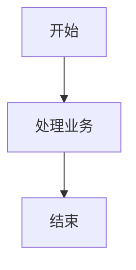
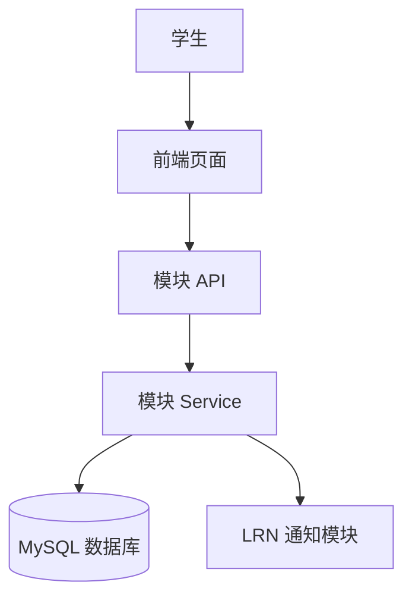
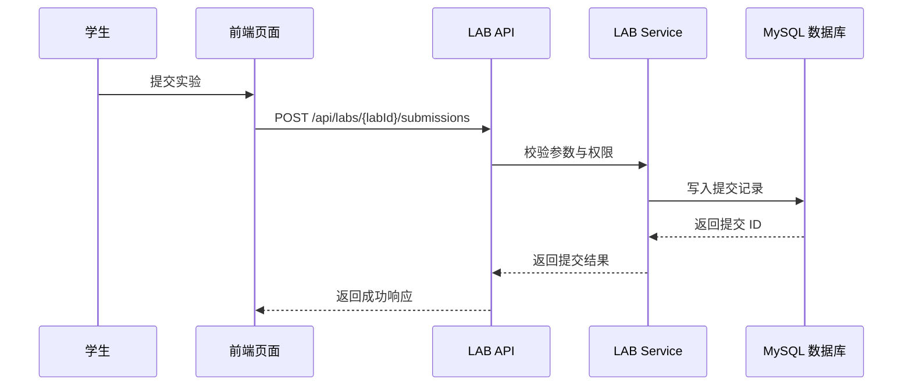

# 软件详细设计说明书

## 封面信息

课程名称：软件工程基础  
项目名称：在线教学与实训平台  
文档名称：软件详细设计说明书  
文档编号：DSD-01  
版本号：V1.0  
项目组名称：****  
编写人：****  
参与编写：全体组员  
审核人：****  
提交日期：2026 年 __ 月 __ 日

---

## 编写说明

本文档为“在线教学与实训平台”的软件详细设计说明书底稿，也是最终汇总文档。文档中全局设计、编号规则、公共约束、项目级异常处理、安全性能和测试计划已先行给出；各模块内部页面、接口、服务、实体、数据库表、状态机和需求追踪表需由对应模块负责人提交模块详细设计稿后，再由详细设计负责人统一整合。

为避免多人直接修改主文档造成冲突，各模块负责人原则上不直接编辑本文档。各模块负责人应复制第 3 章中自己负责模块的小节结构，形成独立模块提交稿；详细设计负责人收到提交稿后，再把内容合并到本文档对应的 **【待填写】** 或 **【待某模块负责人提交后填写】** 位置。

模块提交稿建议命名为：

```text
AUTH-用户权限与平台安全-详细设计提交稿.md
CRS-课程与教学资源-详细设计提交稿.md
LRN-学习过程与通知提醒-详细设计提交稿.md
LAB-实训实验模块-详细设计提交稿.md
HWK-作业与自动评测模块-详细设计提交稿.md
GRD-成绩评价与教学分析-详细设计提交稿.md
```

---

## 目录

- [1 引言](#1-引言)
  - [1.1 编写目的](#11-编写目的)
  - [1.2 项目背景](#12-项目背景)
  - [1.3 术语表](#13-术语表)
  - [1.4 参考文档](#14-参考文档)
- [2 系统结构设计及子系统划分](#2-系统结构设计及子系统划分)
  - [2.1 系统总体结构](#21-系统总体结构)
  - [2.2 技术架构](#22-技术架构)
  - [2.3 子系统划分](#23-子系统划分)
  - [2.4 模块间依赖关系](#24-模块间依赖关系)
  - [2.5 图示绘制统一规范](#25-图示绘制统一规范)
- [3 功能模块详细设计](#3-功能模块详细设计)
  - [3.1 用户权限与平台安全模块（AUTH）](#31-用户权限与平台安全模块auth)
  - [3.2 课程与教学资源模块（CRS）](#32-课程与教学资源模块crs)
  - [3.3 学习过程与通知提醒模块（LRN）](#33-学习过程与通知提醒模块lrn)
  - [3.4 实训实验模块（LAB）](#34-实训实验模块lab)
  - [3.5 作业与自动评测模块（HWK）](#35-作业与自动评测模块hwk)
  - [3.6 成绩评价与教学分析模块（GRD）](#36-成绩评价与教学分析模块grd)
- [4 界面设计](#4-界面设计)
  - [4.1 外部界面设计](#41-外部界面设计)
  - [4.2 内部界面设计](#42-内部界面设计)
  - [4.3 用户界面设计](#43-用户界面设计)
- [5 接口与数据结构设计](#5-接口与数据结构设计)
  - [5.1 接口设计约定](#51-接口设计约定)
  - [5.2 数据库设计约定](#52-数据库设计约定)
  - [5.3 接口清单汇总](#53-接口清单汇总)
  - [5.4 数据表清单汇总](#54-数据表清单汇总)
- [6 异常处理设计](#6-异常处理设计)
  - [6.1 出错信息管理](#61-出错信息管理)
  - [6.2 故障预防与补救](#62-故障预防与补救)
  - [6.3 系统维护设计](#63-系统维护设计)
- [7 性能优化和安全设计](#7-性能优化和安全设计)
  - [7.1 数据存储安全性考虑](#71-数据存储安全性考虑)
  - [7.2 数据传输安全性考虑](#72-数据传输安全性考虑)
  - [7.3 数据访问安全性考虑](#73-数据访问安全性考虑)
  - [7.4 性能优化考虑](#74-性能优化考虑)
- [8 项目测试计划](#8-项目测试计划)
- [9 需求追踪矩阵](#9-需求追踪矩阵)
- [10 尚未解决的问题与风险](#10-尚未解决的问题与风险)
- [附录 A 各模块负责人提交清单](#附录-a-各模块负责人提交清单)

---

# 1 引言

## 1.1 编写目的

本文档在《软件需求规格说明书》和《概要设计说明书》的基础上，对“在线教学与实训平台”的系统结构、功能模块、界面、接口、数据结构、异常处理、安全性能和测试计划进行详细说明。本文档的目标是将概要设计阶段确定的模块边界和接口关系进一步细化，使开发人员能够据此进行编码实现，使测试人员能够据此编写测试用例，也使项目负责人能够在最终交付时检查需求、设计、测试和演示之间的一致性。

本文档的预期读者包括项目负责人、详细设计负责人、前端开发人员、后端开发人员、测试负责人、各模块负责人、指导教师和助教。

## 1.2 项目背景

本项目为软件工程基础课程设计项目，系统名称为“在线教学与实训平台”。系统面向高校教学场景，支持学生、教师和管理员三类角色，覆盖课程组织、教学资源管理、学习过程记录、实验实训、作业与自动评测、成绩评价与教学分析、通知提醒和平台权限管理等核心教学环节。

系统定位为轻量级在线教学与实训平台，不追求商业级教务系统或高并发在线判题平台的完整能力，而是在课程项目范围内实现流程完整、边界清晰、可稳定演示、可测试验收的教学闭环。

## 1.3 术语表

| 术语 | 说明 |
| --- | --- |
| 在线教学与实训平台 | 本项目开发的软件系统 |
| 学生 | 课程学习者，可加入课程、查看资源、提交实验/作业、查看成绩 |
| 教师 | 课程组织者，可创建课程、发布资源、发布实验/作业、评分和发布成绩 |
| 管理员 | 平台维护者，可管理用户、角色、权限、平台配置和审计日志 |
| 课程 | 教师组织教学内容和任务的基本单元 |
| 教学资源 | 课程相关的视频、课件、文档、链接、附件等学习材料 |
| 实训实验 | 课程中的实践任务，学生按要求完成并提交结果 |
| 作业 | 教师发布的学习任务，可包含主观题、客观题或代码题 |
| 自动评测 | 系统根据预设规则对提交结果进行自动判定和反馈 |
| 成绩项 | 课程中可计分的项目，如实验、作业、测验等 |
| 通知 | 系统向用户推送的站内消息，如任务发布、截止提醒、成绩发布 |

## 1.4 参考文档

- 《软件开发计划书》
- 《软件需求规格说明书》
- 《概要设计说明书》
- 《详细设计—各模块负责人分工》
- 详细设计样例 PDF：《软件详细设计说明书.pdf》

---

# 2 系统结构设计及子系统划分

## 2.1 系统总体结构

系统采用 B/S 架构，用户通过浏览器访问前端页面，前端通过 RESTful API 调用后端服务，后端负责业务处理、权限校验、数据持久化、文件管理和跨模块业务协作，数据库采用 MySQL 保存核心业务数据。

系统总体结构可概括为：

```text
用户浏览器
  -> 前端应用（页面、路由、表单、交互）
  -> 后端 API 服务（认证、课程、学习、实验、作业、成绩、通知）
  -> 数据库 MySQL（用户、课程、提交、评测、成绩、通知等数据）
  -> 文件存储（课程资源、实验/作业附件、提交文件）
```

【待详细设计负责人补充】系统总体结构图或部署结构图。

## 2.2 技术架构

本系统采用前后端分离方式实现。前端技术栈建议为 Vue3 + TypeScript，后端技术栈为 Spring Boot，数据库为 MySQL。接口采用 RESTful 风格，前后端通过 JSON 数据交互。文件资源可先采用本地文件存储或简单文件服务抽象，通知机制首版以站内消息为主。

| 层次 | 设计说明 |
| --- | --- |
| 表现层 | 提供学生端、教师端、管理端页面，负责表单校验、列表展示、状态反馈和接口调用 |
| 接口层 | 提供 RESTful API，统一请求响应格式，完成基础参数校验和权限入口控制 |
| 业务层 | 按模块承载核心业务流程，包括课程、学习、实验、作业、成绩和通知等 |
| 数据访问层 | 封装数据库增删改查、分页查询、条件查询和事务相关操作 |
| 数据存储层 | 使用 MySQL 存储结构化数据，文件资源由文件存储路径或文件服务管理 |

## 2.3 子系统划分

系统划分为六个核心子系统：

| 子系统 | 缩写 | 主要职责 |
| --- | --- | --- |
| 用户权限与平台安全子系统 | AUTH | 用户注册登录、角色权限、访问控制、密码安全、审计日志 |
| 课程与教学资源子系统 | CRS | 课程创建、章节管理、资源上传、课程成员管理、课程公告 |
| 学习过程与通知提醒子系统 | LRN | 学习任务中心、学习进度记录、通知生成、通知读取、提醒规则 |
| 实训实验子系统 | LAB | 实验创建发布、学生提交、自动评测、教师评分、实验结果反馈 |
| 作业与自动评测子系统 | HWK | 作业发布、作业提交、测试用例、自动评测、教师批阅和重评 |
| 成绩评价与教学分析子系统 | GRD | 成绩项配置、成绩汇总、成绩发布、学生查询、教学统计分析 |

## 2.4 模块间依赖关系

系统中 AUTH 和 CRS 是多个业务模块的基础依赖。LAB、HWK、GRD 和 LRN 之间存在通知、提交、评分和成绩同步关系。

| 调用方 | 被调用方 | 依赖内容 |
| --- | --- | --- |
| CRS/LRN/LAB/HWK/GRD | AUTH | 当前用户身份、角色、权限、用户基础信息 |
| LRN/LAB/HWK/GRD | CRS | 课程信息、章节信息、课程成员关系、教师管理权限 |
| LAB/HWK | LRN | 发布、截止、评测完成、评分完成后的通知触发 |
| GRD | LAB/HWK | 实验/作业成绩来源、提交状态、评测结果、评分记录 |
| LAB/HWK | GRD | 评分完成后推送或提供成绩数据 |
| GRD | LRN | 成绩发布、成绩复核结果通知 |

【待各模块负责人共同确认】跨模块接口采用直接 API 调用、事件通知或数据读取的具体方式。

## 2.5 图示绘制统一规范

为避免各模块负责人分别绘图导致风格不一致，本文档图示统一采用以下规范。

### 2.5.1 图示责任分配

第 2 章中的系统总体结构图、技术架构图、子系统划分图和模块依赖关系图由详细设计负责人统一绘制，不由各模块负责人分别修改。各模块负责人只需在第 3 章提交本模块的关键流程图、顺序图或状态机图。

### 2.5.2 图示类型要求

| 图示位置 | 必需图示 | 负责人 | 说明 |
| --- | --- | --- | --- |
| 第 2 章 | 系统总体结构图 | 详细设计负责人 | 展示浏览器、前端、后端、数据库、文件存储之间的关系 |
| 第 2 章 | 子系统划分图 | 详细设计负责人 | 展示 AUTH、CRS、LRN、LAB、HWK、GRD 六个子系统 |
| 第 2 章 | 模块依赖关系图 | 详细设计负责人 | 展示模块调用和数据依赖方向 |
| 第 3 章各模块 | 关键业务流程图或顺序图 | 各模块负责人 | 展示本模块 1 到 2 个核心流程 |
| 第 3 章各模块 | 状态机图 | 各模块负责人 | 仅状态复杂的模块必需，如提交、评测、成绩发布 |

### 2.5.3 绘图工具与格式

全文图示优先使用 Mermaid 绘制，便于版本管理和后续修改。若必须使用图片，应导出为 PNG 或 SVG，并放入 `docs/过程/详细设计/assets/` 目录。

图片文件命名规则：

| 图编号 | 文件名示例 |
| --- | --- |
| 图 2-1 | `fig_2_1_system_structure.svg` |
| 图 2-2 | `fig_2_2_subsystems.svg` |
| 图 2-3 | `fig_2_3_module_dependencies.svg` |
| 图 3-1 | `fig_3_1_auth_login_sequence.svg` |

### 2.5.4 Mermaid 绘图操作步骤

模块负责人提交 Mermaid 图时，按以下步骤完成：

1. 明确图类型：流程图使用 `flowchart TD`，顺序图使用 `sequenceDiagram`，状态机使用 `stateDiagram-v2`。
2. 在模块提交稿对应小节中写一个 Mermaid 代码块，代码块必须以三个反引号和 `mermaid` 开始。
3. 按统一命名写参与者和节点，例如 `学生`、`前端页面`、`AUTH API`、`AUTH Service`、`MySQL 数据库`。
4. 按业务顺序写箭头，不要为了排版改变调用方向。
5. 在 Markdown 预览中检查 Mermaid 是否能正常渲染。
6. 如果提交环境无法渲染 Mermaid，则将图导出为 SVG 或 PNG，放入 `docs/过程/详细设计/assets/`，并在提交稿中保留原 Mermaid 代码。
7. 在图前或图下写明图编号和标题，例如“图 3-1 用户登录顺序图”。

Mermaid 代码块格式如下：

````text

````

### 2.5.5 图编号和标题

图编号采用“章节号-序号”格式，标题写在图下方或图前说明中，格式如下：

```text
图 2-1 系统总体结构图
图 2-2 子系统划分图
图 3-1 用户登录顺序图
```

### 2.5.6 命名与风格约束

- 模块统一使用缩写：AUTH、CRS、LRN、LAB、HWK、GRD。
- 用户角色统一写作：学生、教师、管理员。
- 系统外部对象统一写作：浏览器客户端、文件存储、站内通知、MySQL 数据库。
- 箭头方向统一从调用方指向被调用方，从用户操作指向系统处理，从前端指向后端，从业务模块指向依赖模块。
- 同一张图中不要混用中文全称和英文缩写。首次出现可写作“课程与教学资源（CRS）”，后续统一使用 CRS。
- 流程图节点使用“动词 + 对象”命名，例如“提交作业”“校验权限”“写入评测结果”。
- 顺序图参与者顺序建议为：用户 -> 前端页面 -> Controller/API -> Service -> Repository/Mapper -> 数据库/外部模块。

### 2.5.7 Mermaid 示例

模块负责人提交流程图时可参考以下格式：



提交顺序图时可参考以下格式：



---

# 3 功能模块详细设计

本章为最终详细设计说明书的核心章节。每个模块负责人需按本章对应模块模板提交模块详细设计稿。各模块负责人不要直接修改本文档；详细设计负责人后续将删除提示语，并将各模块提交内容合并到对应章节。

每个模块至少需要补充以下内容：

- 模块职责与边界
- 页面设计
- 接口设计
- 服务/组件设计
- 数据结构和数据库表设计
- 关键流程图或顺序图
- 状态机设计
- 异常处理、安全权限和日志设计
- 性能与可维护性设计
- 需求追踪与测试关注点

## 3.1 用户权限与平台安全模块（AUTH）

主责：后端总设计师  
对应需求：FR-UA-01 ~ FR-UA-07 / NFR-UA-01 ~ NFR-UA-05  
依赖模块：无基础业务依赖  
被依赖模块：CRS、LRN、LAB、HWK、GRD

### 3.1.1 模块职责与边界

AUTH 模块负责用户注册登录、身份认证、角色权限、访问控制、账号安全、会话管理和关键操作审计。其他模块需要通过 AUTH 获取当前用户身份、角色、权限和基础用户信息。

AUTH 模块不负责课程业务、实验业务、作业业务和成绩业务的数据管理，仅提供身份与权限基础能力。

### 3.1.2 页面设计

【待 AUTH 模块负责人提交后填写】

| 页面编号 | 页面名称 | 使用角色 | 页面目标 | 主要操作 | 调用接口 |
| --- | --- | --- | --- | --- | --- |
| UI-AUTH-01 |  |  |  |  |  |

### 3.1.3 接口设计

【待 AUTH 模块负责人提交后填写】

| 接口编号 | 接口名称 | 方法 | 路径 | 权限要求 | 对应需求 |
| --- | --- | --- | --- | --- | --- |
| API-AUTH-01 |  |  |  |  |  |

### 3.1.4 服务与组件设计

【待 AUTH 模块负责人提交后填写】

| 服务编号 | 服务/组件名称 | 主要职责 | 输入 | 输出 |
| --- | --- | --- | --- | --- |
| SVC-AUTH-01 |  |  |  |  |

### 3.1.5 数据结构与数据库设计

【待 AUTH 模块负责人提交后填写】

| 表编号 | 表名 | 中文名 | 主要字段 | 说明 |
| --- | --- | --- | --- | --- |
| DB-AUTH-01 |  |  |  |  |

### 3.1.6 关键流程与状态机

【待 AUTH 模块负责人提交后填写】  
建议至少补充：用户登录流程、接口鉴权流程、角色权限调整流程、账号状态机。

### 3.1.7 异常、安全、性能与测试关注点

【待 AUTH 模块负责人提交后填写】

| 需求编号 | 详细设计编号 | 页面编号 | API 编号 | 数据表编号 | 测试编号 |
| --- | --- | --- | --- | --- | --- |
| FR-UA-01 |  |  |  |  |  |

## 3.2 课程与教学资源模块（CRS）

主责：课程与教学资源模块负责人  
对应需求：FR-CR-01 ~ FR-CR-06 / NFR-CR-01 ~ NFR-CR-05  
依赖模块：AUTH  
被依赖模块：LRN、LAB、HWK、GRD

### 3.2.1 模块职责与边界

CRS 模块负责课程创建与管理、章节目录管理、教学资源上传和管理、学生加入课程、课程成员管理和课程公告管理。CRS 模块为 LAB、HWK、GRD、LRN 提供课程和成员关系基础数据。

CRS 模块不负责学习进度统计、实验提交、作业评测和成绩计算，这些内容由对应业务模块负责。

### 3.2.2 页面设计

【待 CRS 模块负责人提交后填写】

| 页面编号 | 页面名称 | 使用角色 | 页面目标 | 主要操作 | 调用接口 |
| --- | --- | --- | --- | --- | --- |
| UI-CRS-01 |  |  |  |  |  |

### 3.2.3 接口设计

【待 CRS 模块负责人提交后填写】

| 接口编号 | 接口名称 | 方法 | 路径 | 权限要求 | 对应需求 |
| --- | --- | --- | --- | --- | --- |
| API-CRS-01 |  |  |  |  |  |

### 3.2.4 服务与组件设计

【待 CRS 模块负责人提交后填写】

| 服务编号 | 服务/组件名称 | 主要职责 | 输入 | 输出 |
| --- | --- | --- | --- | --- |
| SVC-CRS-01 |  |  |  |  |

### 3.2.5 数据结构与数据库设计

【待 CRS 模块负责人提交后填写】

| 表编号 | 表名 | 中文名 | 主要字段 | 说明 |
| --- | --- | --- | --- | --- |
| DB-CRS-01 |  |  |  |  |

### 3.2.6 关键流程与状态机

【待 CRS 模块负责人提交后填写】  
建议至少补充：教师创建课程流程、学生加入课程流程、资源发布流程、课程成员状态机。

### 3.2.7 异常、安全、性能与测试关注点

【待 CRS 模块负责人提交后填写】

| 需求编号 | 详细设计编号 | 页面编号 | API 编号 | 数据表编号 | 测试编号 |
| --- | --- | --- | --- | --- | --- |
| FR-CR-01 |  |  |  |  |  |

## 3.3 学习过程与通知提醒模块（LRN）

主责：学习过程与通知提醒模块负责人  
对应需求：FR-LN-01 ~ FR-LN-06 / NFR-LN-01 ~ NFR-LN-05  
依赖模块：AUTH、CRS  
被依赖模块：LAB、HWK、GRD

### 3.3.1 模块职责与边界

LRN 模块负责学习任务中心展示、学习进度记录、学习行为跟踪、通知分类推送、通知触达状态管理和定时提醒规则。LAB、HWK 和 GRD 在任务发布、评测完成、评分完成、成绩发布等场景下可触发 LRN 生成通知。

LRN 模块不负责课程资源本体管理，不负责实验/作业/成绩的业务处理，只记录学习过程和通知状态。

### 3.3.2 页面设计

【待 LRN 模块负责人提交后填写】

| 页面编号 | 页面名称 | 使用角色 | 页面目标 | 主要操作 | 调用接口 |
| --- | --- | --- | --- | --- | --- |
| UI-LRN-01 |  |  |  |  |  |

### 3.3.3 接口设计

【待 LRN 模块负责人提交后填写】

| 接口编号 | 接口名称 | 方法 | 路径 | 权限要求 | 对应需求 |
| --- | --- | --- | --- | --- | --- |
| API-LRN-01 |  |  |  |  |  |

### 3.3.4 服务与组件设计

【待 LRN 模块负责人提交后填写】

| 服务编号 | 服务/组件名称 | 主要职责 | 输入 | 输出 |
| --- | --- | --- | --- | --- |
| SVC-LRN-01 |  |  |  |  |

### 3.3.5 数据结构与数据库设计

【待 LRN 模块负责人提交后填写】

| 表编号 | 表名 | 中文名 | 主要字段 | 说明 |
| --- | --- | --- | --- | --- |
| DB-LRN-01 |  |  |  |  |

### 3.3.6 关键流程与状态机

【待 LRN 模块负责人提交后填写】  
建议至少补充：学习记录写入流程、通知触发流程、通知已读流程、通知状态机。

### 3.3.7 异常、安全、性能与测试关注点

【待 LRN 模块负责人提交后填写】

| 需求编号 | 详细设计编号 | 页面编号 | API 编号 | 数据表编号 | 测试编号 |
| --- | --- | --- | --- | --- | --- |
| FR-LN-01 |  |  |  |  |  |

## 3.4 实训实验模块（LAB）

主责：实训实验模块负责人  
对应需求：FR-LAB-01 ~ FR-LAB-08 / NFR-LAB-01 ~ NFR-LAB-05  
依赖模块：AUTH、CRS、LRN  
协作模块：HWK、GRD

### 3.4.1 模块职责与边界

LAB 模块负责实验创建与发布、学生实验查看与提交、提交历史与版本管理、实验自动评测、实验报告管理、教师评分与评语、实验结果展示和实验统计查询。

LAB 模块不负责用户账号管理、课程成员基础管理和最终总评计算；这些能力分别由 AUTH、CRS 和 GRD 提供。

### 3.4.2 页面设计

【待 LAB 模块负责人提交后填写】

| 页面编号 | 页面名称 | 使用角色 | 页面目标 | 主要操作 | 调用接口 |
| --- | --- | --- | --- | --- | --- |
| UI-LAB-01 |  |  |  |  |  |

### 3.4.3 接口设计

【待 LAB 模块负责人提交后填写】

| 接口编号 | 接口名称 | 方法 | 路径 | 权限要求 | 对应需求 |
| --- | --- | --- | --- | --- | --- |
| API-LAB-01 |  |  |  |  |  |

### 3.4.4 服务与组件设计

【待 LAB 模块负责人提交后填写】

| 服务编号 | 服务/组件名称 | 主要职责 | 输入 | 输出 |
| --- | --- | --- | --- | --- |
| SVC-LAB-01 |  |  |  |  |

### 3.4.5 数据结构与数据库设计

【待 LAB 模块负责人提交后填写】

| 表编号 | 表名 | 中文名 | 主要字段 | 说明 |
| --- | --- | --- | --- | --- |
| DB-LAB-01 |  |  |  |  |

### 3.4.6 关键流程与状态机

【待 LAB 模块负责人提交后填写】  
建议至少补充：教师发布实验流程、学生提交实验流程、实验自动评测流程、教师评分流程、提交状态机。

### 3.4.7 异常、安全、性能与测试关注点

【待 LAB 模块负责人提交后填写】

| 需求编号 | 详细设计编号 | 页面编号 | API 编号 | 数据表编号 | 测试编号 |
| --- | --- | --- | --- | --- | --- |
| FR-LAB-01 |  |  |  |  |  |

## 3.5 作业与自动评测模块（HWK）

主责：作业与自动评测模块负责人  
对应需求：FR-HW-01 ~ FR-HW-06 / NFR-HW-01 ~ NFR-HW-05  
依赖模块：AUTH、CRS、LRN  
协作模块：LAB、GRD

### 3.5.1 模块职责与边界

HWK 模块负责作业创建与发布、学生作业查看与提交、提交历史管理、自动评测、教师批阅与重评、作业反馈与结果展示。若作业代码题与 LAB 共用评测能力，需要在详细设计中说明共享评测接口或复用策略。

HWK 模块不负责课程基础信息维护和最终成绩汇总；课程数据由 CRS 提供，成绩汇总由 GRD 负责。

### 3.5.2 页面设计

【待 HWK 模块负责人提交后填写】

| 页面编号 | 页面名称 | 使用角色 | 页面目标 | 主要操作 | 调用接口 |
| --- | --- | --- | --- | --- | --- |
| UI-HWK-01 |  |  |  |  |  |

### 3.5.3 接口设计

【待 HWK 模块负责人提交后填写】

| 接口编号 | 接口名称 | 方法 | 路径 | 权限要求 | 对应需求 |
| --- | --- | --- | --- | --- | --- |
| API-HWK-01 |  |  |  |  |  |

### 3.5.4 服务与组件设计

【待 HWK 模块负责人提交后填写】

| 服务编号 | 服务/组件名称 | 主要职责 | 输入 | 输出 |
| --- | --- | --- | --- | --- |
| SVC-HWK-01 |  |  |  |  |

### 3.5.5 数据结构与数据库设计

【待 HWK 模块负责人提交后填写】

| 表编号 | 表名 | 中文名 | 主要字段 | 说明 |
| --- | --- | --- | --- | --- |
| DB-HWK-01 |  |  |  |  |

### 3.5.6 关键流程与状态机

【待 HWK 模块负责人提交后填写】  
建议至少补充：教师发布作业流程、学生提交作业流程、自动评测流程、教师批阅与重评流程、作业状态机、提交状态机。

### 3.5.7 异常、安全、性能与测试关注点

【待 HWK 模块负责人提交后填写】

| 需求编号 | 详细设计编号 | 页面编号 | API 编号 | 数据表编号 | 测试编号 |
| --- | --- | --- | --- | --- | --- |
| FR-HW-01 |  |  |  |  |  |

## 3.6 成绩评价与教学分析模块（GRD）

主责：成绩评价与教学分析模块负责人  
对应需求：FR-GR-01 ~ FR-GR-07 / NFR-GR-01 ~ NFR-GR-05  
依赖模块：AUTH、CRS、LAB、HWK、LRN  
被依赖模块：LRN

### 3.6.1 模块职责与边界

GRD 模块负责成绩项配置与计算规则、成绩汇总与总评生成、教师成绩管理、成绩发布与状态控制、学生成绩查询与结果展示、班级成绩统计与教学分析、成绩异议与复核申请。

GRD 模块不直接负责实验/作业评测执行，只读取或接收 LAB/HWK 产生的成绩来源数据，并完成汇总、发布和查询。

### 3.6.2 页面设计

【待 GRD 模块负责人提交后填写】

| 页面编号 | 页面名称 | 使用角色 | 页面目标 | 主要操作 | 调用接口 |
| --- | --- | --- | --- | --- | --- |
| UI-GRD-01 |  |  |  |  |  |

### 3.6.3 接口设计

【待 GRD 模块负责人提交后填写】

| 接口编号 | 接口名称 | 方法 | 路径 | 权限要求 | 对应需求 |
| --- | --- | --- | --- | --- | --- |
| API-GRD-01 |  |  |  |  |  |

### 3.6.4 服务与组件设计

【待 GRD 模块负责人提交后填写】

| 服务编号 | 服务/组件名称 | 主要职责 | 输入 | 输出 |
| --- | --- | --- | --- | --- |
| SVC-GRD-01 |  |  |  |  |

### 3.6.5 数据结构与数据库设计

【待 GRD 模块负责人提交后填写】

| 表编号 | 表名 | 中文名 | 主要字段 | 说明 |
| --- | --- | --- | --- | --- |
| DB-GRD-01 |  |  |  |  |

### 3.6.6 关键流程与状态机

【待 GRD 模块负责人提交后填写】  
建议至少补充：成绩项配置流程、成绩汇总流程、成绩发布流程、学生查看成绩流程、成绩复核流程、成绩发布状态机、复核状态机。

### 3.6.7 异常、安全、性能与测试关注点

【待 GRD 模块负责人提交后填写】

| 需求编号 | 详细设计编号 | 页面编号 | API 编号 | 数据表编号 | 测试编号 |
| --- | --- | --- | --- | --- | --- |
| FR-GR-01 |  |  |  |  |  |

---

# 4 界面设计

## 4.1 外部界面设计

外部界面指系统与用户、浏览器、文件存储、通知服务等外部对象之间的交互界面。

| 外部对象 | 界面/接口 | 设计说明 | 待补充内容 |
| --- | --- | --- | --- |
| 学生 | 学生端 Web 页面 | 学生通过浏览器完成登录、加入课程、查看资源、提交实验/作业、查看成绩和通知 | 【待各模块页面设计汇总】 |
| 教师 | 教师端 Web 页面 | 教师通过浏览器完成课程管理、资源发布、实验/作业发布、批阅评分、成绩发布 | 【待各模块页面设计汇总】 |
| 管理员 | 管理端 Web 页面 | 管理员通过浏览器完成用户、角色、权限、平台配置和审计日志管理 | 【待 AUTH 模块补充】 |
| 文件存储 | 文件上传/下载接口 | 用于课程资源、实验附件、作业附件和提交文件的存取 | 【待 CRS/LAB/HWK 模块补充】 |
| 通知服务 | 站内消息接口 | 用于发布任务、评测完成、成绩发布等事件的通知提醒 | 【待 LRN 模块补充】 |

## 4.2 内部界面设计

内部界面指系统内部模块之间的接口和调用关系。各模块必须明确对外提供哪些能力，以及调用其他模块时需要哪些数据。

| 模块 | 调用关系 | 数据接口 | 待补充内容 |
| --- | --- | --- | --- |
| AUTH | 被所有业务模块调用 | 用户身份、角色、权限、审计日志 | 【待 AUTH 模块接口提交后填写】 |
| CRS | 被 LRN/LAB/HWK/GRD 调用 | 课程、章节、成员、资源 | 【待 CRS 模块接口提交后填写】 |
| LRN | 被 LAB/HWK/GRD 触发通知 | 通知、学习任务、学习记录 | 【待 LRN 模块接口提交后填写】 |
| LAB | 向 GRD 提供实验成绩来源 | 实验提交、评测、评分 | 【待 LAB 模块接口提交后填写】 |
| HWK | 向 GRD 提供作业成绩来源 | 作业提交、评测、批阅 | 【待 HWK 模块接口提交后填写】 |
| GRD | 调用 LAB/HWK 成绩来源并触发通知 | 成绩项、成绩记录、发布状态 | 【待 GRD 模块接口提交后填写】 |

## 4.3 用户界面设计

用户界面按学生端、教师端和管理端进行汇总。

### 4.3.1 学生端页面

【待各模块负责人提交页面设计后汇总】

| 页面编号 | 页面名称 | 所属模块 | 页面目标 | 主要操作 |
| --- | --- | --- | --- | --- |
|  |  |  |  |  |

### 4.3.2 教师端页面

【待各模块负责人提交页面设计后汇总】

| 页面编号 | 页面名称 | 所属模块 | 页面目标 | 主要操作 |
| --- | --- | --- | --- | --- |
|  |  |  |  |  |

### 4.3.3 管理端页面

【待 AUTH/平台管理相关负责人提交页面设计后汇总】

| 页面编号 | 页面名称 | 所属模块 | 页面目标 | 主要操作 |
| --- | --- | --- | --- | --- |
|  |  |  |  |  |

---

# 5 接口与数据结构设计

## 5.1 接口设计约定

系统接口采用 RESTful 风格，统一以 `/api` 作为接口前缀。请求和响应数据主要采用 JSON 格式，文件上传接口使用 multipart/form-data。接口需明确请求方法、请求路径、权限要求、请求参数、响应字段、异常码和对应需求编号。

统一响应格式建议如下：

```json
{
  "code": "0",
  "message": "success",
  "data": {}
}
```

分页响应格式建议如下：

```json
{
  "code": "0",
  "message": "success",
  "data": {
    "records": [],
    "pageNo": 1,
    "pageSize": 10,
    "total": 0
  }
}
```

## 5.2 数据库设计约定

数据库采用 MySQL。表设计应包含表名、中文名、主键、外键/关联、索引、字段类型、是否为空、默认值和字段说明。状态字段必须在数据字典中列出枚举值。

公共字段建议如下：

| 字段名 | 类型 | 说明 |
| --- | --- | --- |
| id | bigint | 主键 |
| created_at | datetime | 创建时间 |
| updated_at | datetime | 更新时间 |
| created_by | bigint | 创建人，可为空 |
| updated_by | bigint | 更新人，可为空 |
| deleted | tinyint | 逻辑删除标记，0 未删除，1 已删除 |

## 5.3 接口清单汇总

【待各模块负责人提交接口设计后汇总】

| 接口编号 | 所属模块 | 接口名称 | 方法 | 路径 | 权限要求 | 对应需求 |
| --- | --- | --- | --- | --- | --- | --- |
|  |  |  |  |  |  |  |

## 5.4 数据表清单汇总

【待各模块负责人提交数据库设计后汇总】

| 表编号 | 所属模块 | 表名 | 中文名 | 主键 | 主要关联 | 对应需求 |
| --- | --- | --- | --- | --- | --- | --- |
|  |  |  |  |  |  |  |

---

# 6 异常处理设计

## 6.1 出错信息管理

系统运行过程中可能出现参数错误、权限不足、状态不允许、文件上传失败、评测失败、数据库异常等情况。系统应对异常进行统一捕获和分类处理，并向用户提供明确、可理解的错误提示。

| 异常类型 | 示例 | 处理策略 | 涉及模块 |
| --- | --- | --- | --- |
| 参数异常 | 必填项为空、格式错误 | 前端提示字段错误，后端返回参数错误码 | 全部模块 |
| 权限异常 | 学生访问教师接口 | 返回无权限提示，必要时记录审计日志 | AUTH 及全部业务模块 |
| 状态异常 | 已截止任务继续提交 | 返回业务状态错误，保持数据不变 | LAB、HWK、GRD |
| 文件异常 | 文件过大、类型不支持 | 返回上传失败原因，不写入无效数据 | CRS、LAB、HWK |
| 评测异常 | 自动评测超时或执行失败 | 记录失败状态，允许教师查看或重评 | LAB、HWK |
| 数据异常 | 重复提交、外键不存在 | 回滚事务，返回可理解提示 | 全部模块 |

【待各模块负责人补充】本模块具体错误码、错误提示和处理方式。

## 6.2 故障预防与补救

为保障系统稳定运行，系统应从数据、服务、评测任务和文件管理等方面进行故障预防。

| 故障类型 | 预防措施 | 补救措施 |
| --- | --- | --- |
| 数据库连接失败 | 使用连接池，限制慢查询，避免无索引大查询 | 记录错误日志，提示稍后重试，必要时重启服务 |
| 文件存储失败 | 限制文件大小和类型，保存文件元数据 | 删除不完整文件记录，提示用户重新上传 |
| 自动评测失败 | 设置超时时间，记录评测日志 | 将提交状态置为评测失败，允许教师查看并重评 |
| 权限配置错误 | 统一权限码和角色边界，审计关键操作 | 管理员修正权限，保留变更记录 |
| 成绩计算异常 | 成绩项规则校验，计算前检查数据完整性 | 回滚计算批次，提示教师重新计算 |

【待各模块负责人补充】本模块特有故障预防和补救策略。

## 6.3 系统维护设计

系统维护主要包括数据备份、日志审计、文件清理、异常监控和版本更新。

| 维护项 | 维护内容 | 负责模块 |
| --- | --- | --- |
| 数据备份 | 定期备份用户、课程、提交、成绩和通知等核心数据 | 全部模块 |
| 日志审计 | 记录登录、权限变更、发布、评分、成绩发布等关键操作 | AUTH、LAB、HWK、GRD |
| 文件清理 | 清理无效上传文件、过期临时文件 | CRS、LAB、HWK |
| 评测任务检查 | 检查长时间评测中或评测失败的任务 | LAB、HWK |
| 数据一致性检查 | 检查课程成员、提交记录、成绩记录之间的关联一致性 | CRS、LAB、HWK、GRD |

---

# 7 性能优化和安全设计

## 7.1 数据存储安全性考虑

用户密码不得明文存储，应采用安全哈希方式保存。涉及用户身份、成绩、提交记录等重要数据时，应通过权限控制和数据范围校验限制访问。数据库表应使用必要的唯一约束、外键关系或业务一致性校验，避免重复数据和无效关联。

【待 AUTH/GRD/LAB/HWK 等模块负责人补充】模块级敏感数据和存储保护策略。

## 7.2 数据传输安全性考虑

系统接口应避免在 URL 中传递密码、令牌等敏感信息。登录后的接口调用需携带身份认证信息，后端对令牌或会话进行校验。文件上传应限制类型和大小，避免上传非法文件。

【待后端负责人补充】认证令牌传输方式、过期策略和刷新策略。

## 7.3 数据访问安全性考虑

系统采用基于角色和数据范围的访问控制。学生只能访问本人课程、提交、通知和成绩；教师只能管理自己创建或被授权的课程及相关任务；管理员负责平台级管理。关键操作应记录审计日志。

| 角色 | 数据访问边界 |
| --- | --- |
| 学生 | 本人账号、本人成员课程、本人提交、本人成绩、本人通知 |
| 教师 | 所授课程、课程资源、课程成员、课程任务、课程成绩 |
| 管理员 | 平台用户、角色权限、审计日志、平台配置 |

## 7.4 性能优化考虑

系统以课程项目小并发场景为主要运行场景，应优先保证核心流程稳定。列表查询应使用分页，课程、提交、成绩、通知等高频查询字段应建立索引。文件上传、自动评测、成绩汇总等耗时操作应提供明确状态反馈。

| 场景 | 优化策略 |
| --- | --- |
| 课程/作业/实验列表查询 | 使用分页和条件查询，按课程、发布状态、创建时间建立索引 |
| 提交历史查询 | 按任务 ID、学生 ID、提交时间建立索引 |
| 通知列表查询 | 按接收人、已读状态、创建时间建立索引 |
| 成绩查询 | 按课程 ID、学生 ID、成绩项 ID 建立索引 |
| 自动评测 | 记录评测状态，避免长时间阻塞用户页面 |

【待各模块负责人补充】本模块具体性能关注点和索引设计。

---

# 8 项目测试计划

本测试计划用于指导详细设计后的测试用例编写。各模块负责人和测试负责人需根据模块详细设计补充测试编号、测试步骤和预期结果。

| 序号 | 测试类型 | 对应模块 | 测试内容 | 计划时间 |
| --- | --- | --- | --- | --- |
| 1 | 单元测试 | AUTH | 验证用户注册、登录、角色权限、会话校验等功能 | 第 4 周 |
| 2 | 单元测试 | CRS | 验证课程创建、章节管理、资源上传、成员管理等功能 | 第 4 周 |
| 3 | 单元测试 | LRN | 验证学习记录、通知生成、通知已读、提醒规则等功能 | 第 4 周 |
| 4 | 单元测试 | LAB | 验证实验发布、实验提交、评测记录、教师评分等功能 | 第 4 周 |
| 5 | 单元测试 | HWK | 验证作业发布、作业提交、自动评测、重评反馈等功能 | 第 4 周 |
| 6 | 单元测试 | GRD | 验证成绩项配置、成绩计算、成绩发布、成绩查询等功能 | 第 4 周 |
| 7 | 接口测试 | 全部模块 | 验证 API 参数校验、权限校验、成功响应和失败响应 | 第 5 周 |
| 8 | 集成测试 | CRS/LAB/HWK/GRD/LRN | 验证课程、实验、作业、成绩、通知之间的数据流转 | 第 5 周 |
| 9 | 系统测试 | 全部模块 | 验证学生端、教师端、管理端核心业务流程 | 第 5 周 |
| 10 | 异常测试 | 全部模块 | 验证越权访问、截止后提交、文件上传失败、评测失败等异常处理 | 第 5 周 |
| 11 | 性能与安全测试 | 全部模块 | 验证分页查询、权限边界、密码安全、审计日志等设计 | 第 5 周 |

【待测试负责人补充】具体测试用例编号、测试步骤和预期结果。

---

# 9 需求追踪矩阵

本章用于建立需求编号、详细设计编号、页面编号、接口编号、数据表编号和测试编号之间的追踪关系。各模块负责人提交后，由详细设计负责人统一汇总。

【待各模块负责人提交后填写】

| 需求编号 | 需求名称 | 详细设计编号 | 页面编号 | API 编号 | 数据表编号 | 测试编号 | 备注 |
| --- | --- | --- | --- | --- | --- | --- | --- |
| FR-UA-01 | 用户注册与登录 |  |  |  |  |  | AUTH 待补充 |
| FR-CR-01 | 课程创建与管理 |  |  |  |  |  | CRS 待补充 |
| FR-LN-01 | 学习任务中心展示 |  |  |  |  |  | LRN 待补充 |
| FR-LAB-01 | 实验创建与发布 |  |  |  |  |  | LAB 待补充 |
| FR-HW-01 | 作业创建与发布 |  |  |  |  |  | HWK 待补充 |
| FR-GR-01 | 成绩项配置与计算规则 |  |  |  |  |  | GRD 待补充 |

---

# 10 尚未解决的问题与风险

| 编号 | 问题或风险 | 影响范围 | 当前处理方式 | 责任人 |
| --- | --- | --- | --- | --- |
| R-01 | LAB 与 HWK 是否共享自动评测能力尚需确认 | LAB、HWK、GRD | 待 LAB/HWK 负责人确认复用方式 | LAB/HWK 负责人 |
| R-02 | GRD 获取 LAB/HWK 成绩来源的方式尚需确认 | LAB、HWK、GRD | 待模块接口设计明确采用 API 调用、事件推送或定时读取 | GRD 负责人 |
| R-03 | 文件存储采用本地存储还是抽象文件服务尚需确认 | CRS、LAB、HWK | 课程项目首版建议采用本地文件存储并预留扩展 | 后端负责人 |
| R-04 | 通知触发规则和通知内容模板需统一 | LRN、LAB、HWK、GRD | 待 LRN 与业务模块确认通知契约 | LRN 负责人 |

---

# 附录 A 各模块负责人提交清单

各模块负责人提交稿应至少包含以下内容。各模块负责人提交独立模块稿后，详细设计负责人将按本说明书章节合并。

| 模块 | 负责人 | 必须提交的内容 | 合并位置 |
| --- | --- | --- | --- |
| AUTH | 后端总设计师 | 页面、接口、服务、用户/角色/权限表、登录和鉴权流程、账号状态机、错误码、追踪表 | 3.1、4、5、6、7、9 |
| CRS | 课程与教学资源负责人 | 页面、接口、服务、课程/章节/资源/成员表、课程创建和加入流程、资源上传异常、追踪表 | 3.2、4、5、6、7、9 |
| LRN | 学习过程与通知提醒负责人 | 页面、接口、服务、学习记录/通知表、通知触发流程、通知状态机、追踪表 | 3.3、4、5、6、7、9 |
| LAB | 实训实验负责人 | 页面、接口、服务、实验/测试用例/提交/评测/评分表、提交评测流程、状态机、追踪表 | 3.4、4、5、6、7、9 |
| HWK | 作业与自动评测负责人 | 页面、接口、服务、作业/题目/提交/评测/测试用例/批阅日志表、重评流程、追踪表 | 3.5、4、5、6、7、9 |
| GRD | 成绩评价与教学分析负责人 | 页面、接口、服务、成绩项/成绩记录/总评/发布/复核表、成绩汇总和发布流程、追踪表 | 3.6、4、5、6、7、9 |

各模块提交完成后，详细设计负责人需执行以下汇总动作：

1. 删除所有 **【待填写】** 和 **【待某模块负责人提交后填写】** 提示语。
2. 统一页面、接口、服务、表、状态机和测试编号。
3. 汇总第 4 章界面设计、第 5 章接口与数据结构设计、第 9 章需求追踪矩阵。
4. 检查模块间接口和数据字段是否一致。
5. 补充必要图示并生成最终提交版。
